# 多因子模型研究之一：单因子测试

分析师：宋旸

证券分析师

宋旸

18222076300

songyang@bhzq.com

## 助理分析师

李莘泰

S1150117070006

022-23873122

lizt@bhzq.com

2017 年 10 月 11 日

SAC NO：S1150517100002

## 核心观点：

## 内容

1、多因子模型（Multiple Factor Model）是金融量化研究的重要课题之一。该模型通过探寻的多种因子和股票收益率之间的统计关系，预测股票未来的收益与风险，从中选择优质标的。

2、多因子模型的建立主要包括单因子测试、收益模型建立、风险模型建立三个步骤。首先通过单因子测试确定模型因子，然后通过收益预测模型估计各个因子的因子收益率，从而得到股票的预期收益率，最后，通过估计因子的协方差矩阵，刻画股票池未来的波动风险，选股结果以及股票配置仓位进行二次优化。本报告为系列研究报告的第一篇：单因子测试部分。

3、本篇报告中，我们共提取了估值、盈利、成长、动量、波动率、流动性六大类共107 个因子。对因子进行去极值中性化的预先处理后，在每一个横截面上使用同时考虑行业与市值因素影响的回归模型进行加权最小二乘回归（WLS），得到 t 值序列、因子收益序列以及 IC 值序列，并进行统计分析，得到显著性检测结果。然后，我们对因子进行历史收益分层回测，在每个截面期的最后一个交易日，按照因子将样本内股票排序，并按照序号从大到小平均分为 N 组（本报告中 N=5），在下一个截面期的首个交易日，对N 组股票的历史收益率进行回测，并计算其年化收益率、波动率、夏普比率等值。如果N 组股票的收益率呈现较好的单调性，且每一组股票间的收益差距较大，表示因子在选股上体现了较好的区分度。最终，综合显著性检测和分层回测结果，我们选出 10 个各方面表现较为优异的因子，为下一步多因子收益模型的建立做准备。

4、在分层回测时，我们将股票池分为大市值、中市值、小市值三种。我们发现，不同种类的因子的适用范围也略有不同，如估值、盈利类因子更适用于大中市值股票，动量、流动性因子在小市值股上的表现更好。未来，我们计划根据不同因子的性质，更好的构建模型，使因子的选股能力更大化。

## 1．概述

## 1.1 历史背景

优化收益，控制风险，是投资永恒的主题。在 H.M.Markowitz 提出的均值-方差模型中，股票的风险被定义为未来收益率期望的标准差。1964年，美国学者WilliamSharpe 等人在资产组合理论和资本市场理论的基础上提出了资本资产定价模型（Capital Asset Pricing Model，简称 CAPM），对证券市场中资产的预期收益率与风险资产之间的关系进行了刻画。套利定价理论（Arbitrage Pricing Theory，简称APT) 是 CAPM 的拓广，其假设证券的回报率与未知数量的未知因素相联系，给出了因素模型。因素模型是一种统计模型，套利定价理论利用因素模型来描述资产价格的决定因素和均衡价格。1992年，Fama和French对美国股票市场决定不同股票回报率差异的因素的研究发现，股票的市场的 beta 值不能解释不同股票回报率的差异，而上市公司的市值、账面市值比、市盈率可以解释股票回报率的差异。于是建立了Fama-French 三因子模型。但是，三因子模型并不代表资本定价模型的完结，模型中还有很多未被解释的部分，如动量、波动率、流动性等因素。于是最后诞生了出了利用多个因子刻画股票未来收益率与风险的多因子模型（MultipleFactor Model，简称 MFM）。

## 1.2 理论介绍

Barra结构化风险模型是目前全球最知名的多因子模型之一。根据Barra手册的内容，多因子模型被分为两部分，收益模型与风险模型，收益模型的基本表达形式如下：

$$
\tilde{r}_{i}=\sum_{j}X_{i,j}\cdot\tilde{f}_{j}+\tilde{u}_{i}
$$

其中：

$\tilde{r}_{i}$ ：股票i 下一期的预期收益率；

$X_{i,j}$ ：股票 i 在因子 j 上的因子暴露；

$\tilde{f}_{j}$ ：因子j 的因子收益率（通过回归模型估计）；

$\tilde{u}_{i}$ ：股票i 的残差收益率；

已知股票在每个因子上的因子暴露，通过多因子的收益预测模型，估计各个因子的因子收益率，从而得到股票的预期收益率，这就是多因子收益模型的主要思路。

多因子风险模型的基本思路为，通过估计因子的协方差矩阵，刻画股票池未来的波动风险。而后对选股结果以及股票配置仓位进行二次优化，一般表达形式为：

$$
max_{w}w^{\prime}\mu
$$

$$
\begin{array}{rl}{\mathrm{st.}}&{{}\sum w=1;}\end{array}
$$

$$
\mathrm{w}^{\prime}\Lambda\mathrm{w}\leq\sigma^{2};
$$

其中：

w：股票池内股票权重；

μ ：各股票根据收益模型计算出的预期收益率；

Λ ：各股票根据风险模型计算出的协方差矩阵；

σ ：风险限制条件，常数；

以上模型仅为多因子模型的基础形式，实际应用中，还结合其他约束条件（如单支股票权重上限、风格中性要求、约束误差要求等），对优化模型做出修正。

## 1.3 基本步骤

多因子模型的建立主要包括以下步骤：

1）单因子测试；

2）收益模型的建立；

3）风险模型的建立与二次规划；

在本篇报告中，我们主要完成了单因子测试部分，通过因子的显著性和选股能力，结合多重共线性检测，筛选出有效的因子，供未来使用。

## 2. 单因子测试流程

## 2.1 数据采集

样本范围：全体 A股，剔除ST/PT 股票，剔除上市交易不满两年的股票。

样本期：2006年1 月-2017 年6 月，按月提取。

因子的选择上，我们具体测试了估值、盈利、成长、动量、波动率、流动性六大类因子，并在测试名单中涵盖了Barra CNE5 手册中的大部分因子，具体因子定义见下表：

表 1：因子定义

| 大类因子 | 小类因子 | 因子解释 |
| --- | --- | --- |
| 动量 | RSTR_barra | Barra 因子；ΣT=wt[ln(1 + rt)]，L=21，T=500，半衰期120日 |
|  | RSTR_m24 | Σt=lwt[ln(1 + rt)]，L=1，T=240，半衰期 120日 |
|  | RSTR_m12 | Σt=wt[ln(1+ rt)]，L=1，T=240，半衰期 60日 |
|  | RSTR_m6 | Σt=wt[ln(1+ rt)]，L=1，T=120，半衰期 30日 |
|  | RSTR_m3 | Σt= wt[ln(1+ rt)]，L=1，T=60，半衰期 15日 |
|  | RSTR_m1 | Σt=wt[ln(1+ rt)]，L=1，T=20，半衰期 5日 |
|  | RS_1 | 最新收盘价/21个交易日前收盘价 |
|  | RS_3 | 最新收盘价/63个交易日前收盘价 |
|  | RS_6 | 最新收盘价/126个交易日前收盘价 |
|  | RS_12 | 最新收盘价/252个交易日前收盘价 |
|  | Alpha | alpha系数；个股收益率序列与沪深300指数收益率序列以半衰期指数加权，得到 alpha 系数，半衰期为 60日 |
| 流动性 | STOM | 月度平均换手率；最近一个月的交易量/流通股数 |
|  | STOQ | 季度平均换手率；最近一季度的交易量/流通股数 |
|  | STOS | 半年平均换手率；最近半年的交易量/流通股数 |
|  | STOA | 年度平均换手率；最近一年的交易量/流通股数 |
|  | STOM_barra | Vt Vt为t日成交金额，St为t日流动市值 |
|  | STOQ_barra | Barra 因子；公式：ln[=Σt=1exp(STOMt)]，T=63 个交易日 |
|  | STOA_barra | Barra 因子；公式：ln[=Σt=1exp(STOMt)]，T=244个个交易日 |
|  | Ins | 机构持股比例；机构持股变动/总股本 |
|  | ins_c | 机构持股比例变动 |
|  | Size | 总市值 |
|  | non-linear-size | Barra因子；中等市值；将总市值的对数与总市值立方的对数回归得到残差，再对残差做标准化处理 |
|  | marketcap | 流通市值 |

请务必阅读正文之后的免责条款部分

|  | MSM | 一个月换手率变动；最近1个月换手率/最近1年换手率 |
| --- | --- | --- |
|  | MSQ | 季度换手率变动；最近3个月换收益率/最近1年换手率 |
|  | MSS | 半年换手率变动；最近6个月换收益率/最近1年换手率 |
| 波动率 | DASTD | Barra因子；年度平均波动率；累计日波动率以半衰期指数加权，半衰期为40日 |
|  | CMRA | Barra 因子；年度收益率波动 |
|  | HSIGMA | Barra 因子；sigma：个股收益率序列与沪深 300 指数收益率序列以半衰期指数加权，得到残差，对残差求标准差得到sigma，半衰期为60日 |
|  | Beta | Barra因子；贝塔系数；个股收益率序列与沪深300指数收益率序列以半衰期指数加权，得到 beta系数，半衰期为 60日 |
|  | yieldvol_1 | 月度日收益率波动率；一个月日收益率标准差 |
|  | yieldvol_3 | 季度日收益率波动率；三个月日收益率标准差 |
|  | yieldvol_6 | 半年日收益率波动率：半年日收益率标准差 |
|  | high_low_1 | 月度股价波动；最高价/最低价（最近一个月内价格） |
|  | high_low_3 | 季度股价波动；最高价/最低价（近三个月内价格） |
|  | high_low_6 | 半年股价波动；最高价/最低价（近六个月内价格） |
|  | high_low_12 | 全年股价波动；最高价/最低价（近十二个月内价格） |
|  | VOL_1 | 成交量月度波动率；1月波动率标准差 |
|  | VOL_3 | 成交量季度波动率；3月波动率标准差 |
|  | VOL_6 | 成交量半年波动率；6月波动率标准差 |
|  | VOL_12 | 成交量年度波动率；12月波动率标准差 |
| 成长 | growth_ttm_or | 营业收入 ttm一年增长率 |
|  | growth_ttm_profit | 净利润 ttm 一年增长率 |
|  | qfa_yoysales_qq | 单季度营业收入一年增长率 |
|  | qfa_yoynetprofit_qq | 单季度归母净利润一年增长率 |
|  | qfa_yoyocf_qq | 单季度经营性现金流一年增长率 |
|  | qfa_yoyprofit_qq | 单季度净利润一年增长率 |
|  | qfa_roe_qq | 单季度 roe 一年增长率 |
|  | yoy_profit_qq | 净利润一年增长率 |
|  | yoy_growth_netprofit_qq | 归母净利润一年增长率 |
|  | yoy_or_qq | 营业收入一年增长率 |
|  | yoyroe_qq | roe一年增长率 |
|  | yoyocf_qq | 经营性现金流一年增长率 |
|  | growth_roe_qq_3 | roe三年增长率 |
|  | growth_netprofit_qq_3 | 归母净利润三年增长率 |
|  | growth_or_qq_3 | 营业收入三年增长率 |
|  | growth_profit_qq_3 | 净利润三年增长率 |
|  | growth_ocf_qq_3 | 经营性现金流三年增长率 |
|  | growth_profit_qq_5 | 净利润五年增长率 |
|  | growth_ocf_qq_5 | 经营性现金流五年增长率 |
|  | growth_roe_qq_5 | roe五年增长率 |
|  | SGRO | Barra 因子；过去5年企业营业收入复合增长率 |
|  | EGRO_5 | Barra因子；过去5年企业归属母公司净利润复合增长率 |
|  | EGIB | Barra 因子；未来3年企业一致预期净利润增长率 |
|  | EGIB_S | Barra因子；未来1年企业一致预期净利润增长率 |
| 盈利收益率 | CETOP | Barra因子：个股现金收益比股票价格 |
|  | roe_q | 当季净资产收益率 |
|  | roe_ttm | 滚动 ROE |
|  | roa_q | 当季资产收益率、资产回报率 |
|  | roa_ttm | 滚动 ROA |
|  | qfa_grossprofitmargin | 当季毛利率 |
|  | grossprofitmargin_ttm | 滚动毛利率 |
|  | profitmargin_q | 当季扣非后利润率 |
|  | profitmargin_ttm | 滚动扣非后利润率 |
|  | assetsturn_q | 当季资产周转率 |
|  | assetturn_ttm | 滚动资产周转率 |
|  | operationcashflowratio_q | 当季经营活动现金净流比率 |
|  | operationcashflowratio_ttm | 滚动经营活动现金净流比率 |
|  | ROIC | 投入资本回报率 |
|  | EBIT2EV | 投资收益率；息税前利润/投入资本 |
|  | CASHROIC | 现金 ROIC |
|  | FreeCashflowYield | 自由现金流比率；经营性活动产生的净现金流-构建其他长期资产支付的现金/总市值 |
|  | sales2EV | 营业收益率；营业收入_TTM/总市值+非流动负债 |
|  | cashflow1 | 经营活动净现金流/总市值 |
|  | cashflow2 | 经营活动净现金流/营业收入 |
|  | cashflow3 | 经营活动净现金流/营业收入净收益 |
|  | invturn_qq | 存货周转率；存货成本/平均存货余额 |
|  | arturn_qq | 应收账款周转率；当期销售净收入/平均应收账款 |
|  | faturn_qq | 固定资产周转率；销售收入/平均固定资产 |
|  | assetturnover_ttm | 滚动总资产周转率；营业收入ttm/[(期初资产总额+期末资产总额)/2] |
|  | assetsturn_qq | 总资产周转率；营业总收入/[(期初资产总额+期末资产总额)/2] |
|  | longdebttoworkingcapital_qq | 长期债务与营运资金比率；长期债务/营运资本 |
|  | finaexpensetogr_qq | 财务费用比率；财务费用/主营业务收入 |
|  | gctogr_qq | 营业费用比率；营业费用/主营业务收入 |
| 价值 | ETOP | Barra因子；历史EP值；利用过去12个月个股净利润除以当前市值。 |
|  | BTOP | Barra因子；历史BP值；普通股权益价值/市值 |
|  | epcut | 市盈率（扣除非经营性损益部分，即公司经营性盈利与市值之比值） |
|  | bp_If | 最近公告日 BP |
|  | ncfp | 净现金市值比；净现金流/总市值 |
|  | ocfp | 营业现金流比率；经营性现金流/总市值 |
|  | dividendyield | 股息率；过去一年分红/总市值 |
|  | stop1 | 营收市值比，市销率PS（TTM）倒数 |
|  | stop2 | 营收市值比，市销率PS（LYR）倒数 |
|  | ep_rel | 相对 PE；PE/行业 PE |
|  | bp_rel | 相对 PB；PB/行业 PB |
|  | PEG | 市盈率相对盈利增长比率 |
|  | EPIBS | Barra 因子；预期 EP值 |

资料来源：渤海证券研究所、The Barra China Equity Model (CNE5)

## 2.2 基于回归模型的因子显著性测试

## 2.2.1 数据前期处理

提取的因子数据需经过数据对齐、去极值、标准化、缺失值处理等步骤，才可进入下一步的因子回归模型。

数据对齐：上市公司财报的报告期和报告发布日期之间有一定延迟，为避免未来信息，在提取数据的时候，需要对日期进行修正，保证因子数据为当时能获取的最新财报数据。

去极值：为避免数据中的极端值对回归结果产生过多影响，我们使用“中位数去极值法”，将超过上下限的极端值用上下限值代替。

$$
\widetilde\mathrm{x}_{\mathrm{i}}=\left\{\begin{array}{ll}{\mathrm{x}_{\mathrm{M}}+5\times\mathrm{x}_{\mathrm{MAD}},~\mathrm{x}_{\mathrm{i}}>\mathrm{x}_{\mathrm{M}}+5\times\mathrm{x}_{\mathrm{MAD}}}\\{\mathrm{x}_{\mathrm{i}},~\mathrm{x}_{\mathrm{M}}-5\times\mathrm{x}_{\mathrm{MAD}}\leq\mathrm{x}_{\mathrm{i}}\leq\mathrm{x}_{\mathrm{M}}+5\times\mathrm{x}_{\mathrm{MAD}}}\\{~\mathrm{x}_{\mathrm{M}}-5\times\mathrm{x}_{\mathrm{MAD}},~\mathrm{x}_{\mathrm{i}}<\mathrm{x}_{\mathrm{M}}-5\times\mathrm{x}_{\mathrm{MAD}}}\end{array}\right.
$$

$$
\begin{array}{rl}{\mathrm{x_{i}}\colon}&{{}|\xi_{\mathrm{s}}\star_{\mathrm{\xi_{e}}}^{L}\rrangle\dot{\vec{\mathcal{F}}}\mathinner{\xi_{1}}|}\end{array}
$$

$$
\begin{array}{c}\begin{array}{rl}{\mathbf{x}_{\mathrm{M}}\colon}&{{}|\dot{\vec{\mathcal{F}}}\cdot\vec{\mathcal{G}}^{1}|\mathbf{x_{i}}\mathbin{\not\ G^{2}}\mathbin{\dag}\mathbf{\Sigma}\dag}\end{array}\downarrow\dot{\Xi}\mathbin{\mathcal{Z}}^{*}\mathbin{\not\Delta}\mathbin{\dag}\mathbf{x}\end{array}
$$

$$
x_{MAD}:\ \mathcal{\vec{H}}^{\ }\mathcal{\vec{H}}||x_{i}-x_{M}|\sharp\mathcal{Y}\ \mathcal{I}^{\ \ Z}\mathcal{A}_{\ Z}^{\ \ Z}\ \mathcal{Z}^{\ \ Z\mu\nu}
$$

x̃ ：去极值处理后的新序列

标准化：由于各个因子的单位不同，为了使其具有可比性，需要对其进行 ZScore标准化处理，即减去序列均值除以序列标准差，使因子序列近似成为一个符合N(0,1)正态分布的序列。

缺失值处理：提取出的因子可能会因为技术原因等情况出现缺失值，在分层回测时，为避免缺失值影响收益结果，选股时直接采取了移除处理。

## 2.2.2 建立回归模型

根据Barra手册中关于因子显著性测试的内容，对因子进行横截面回归，同时考虑行业与市值因素的影响：

$$
r_{i}^{T+1}=\sum_{j}X_{j}^{T}f_{i,j}^{T}+x_{size}^{T}f_{size,i}^{T}+x_{d}^{T}f_{d,i}^{T}+u_{i}^{T}
$$

$r_{i}^{T+1}$ ：股票i在 T+1 期的收益率；

$f_{i,j}^{T}$ ：第 T 期，股票 i 的行业虚拟变量，如股票 i 在j 行业，则取值为 1，如不在，则取值为0。这里行业分类选用了申万一级行业分类；

$f_{size,i}^{T}$ ：第T 期，股票i 的流通市值；

$f_{d,i}^{T}$ ：第T 期，股票i 在d 因子上的因子暴露；

$X_{j}^{T}$ $x_{size}^{T}\setminus\boldsymbol{x}_{d}^{T}$ ：回归模型运算所得的因子收益率；

$u_{i}^{T}$ ：回归模型运算所得股票i 的残差；

在每一个横截面上使用上述模型进行加权最小二乘回归（WLS），权重采用流通市值的平方根，一定程度上消除了异方差性。经过回归模型，我们可以得到t检验的t值序列与因子收益序列 $x_{d}^{T}$ 。

下一步，计算因子 IC 值。

信息比率 IC（Information Coefficient）是衡量因子收益预测能力的重要参数，它的计算方法是将每一期的因子值作为因变量，与行业哑变量和市值变量进行回归，取其残差，作为剔除行业与市值影响后的因子值。再计算新因子值与下一期股票收益序列间的 Spearman 相关系数。

最终，回归模型输出以下几个指标：

a) t值绝对值平均值：衡量因子整体显著性的指标；

b) t值绝对值>2概率：衡量因子显著性是否稳定；

c) 因子收益平均值：衡量因子收益能力大小的指标；

d) 因子收益标准差：衡量因子收益能力波动率的指标；

e) 因子收益t值：衡量因子收益率统计上是否显著不为0的指标；

f) 因子收益>0概率：衡量因子收益率方向性是否一致的指标；

g) IC 平均值：衡量模型预测能力的指标；

h) IC 标准差：衡量模型预测能力是否稳定的指标；

i) IRIC：IC 平均值/IC 标准差；

j) IC>0 概率：衡量模型预测收益方向性是否一致的指标。

在选取因子时，我们希望首先筛选出 t 值普遍大于 2，因子收益与 IC 值的平均值较大，标准差较小，因子收益与 IC 大于 0 的概率较为接近 0 或 1（而不是在 0.5附近）的因子。当然，选择因子的标准也不是绝对的，例如 Barra 手册中收录的beta 因子与市值因子，IC大于0 的概率都接近50%，但却具有较高的 t值，这意味着因子对选股收益的影响显著，但是方向却并不稳定，在以风险控制为主要目标的模型中依然是需要考虑的一类因子。

## 2.3 单因子选股模型分层回测

在使用回归模型筛选出相对显著的因子后，一个更为直观观察该因子选股能力的方式就是观察因子值高的股票与因子值低的股票在走势上的不同之处。于是诞生了分层回测模型。模型构建方法如下：

测试样本范围、测试样本期：与回归模型相同。

在每个截面期的最后一个交易日，提取样本内股票因子值，并剔除因子值缺失的股票。按照因子将样本内股票排序，并按照序号从大到小平均分为 N 组（本报告中

N=5）。在下一个截面期的首个交易日，以当天的收盘价换仓并剔除当天因停牌、涨停等因素不能交易的股票。股改股票由于在复牌当日不受涨跌停板限制，可能出现极端涨幅，影响回测结果，故在复牌当月同样剔除股票池。对 N 组股票的历史收益率进行回测，并计算其年化收益率、波动率、夏普比率等值。

如果情况理想，N 组股票的收益率会呈现较好的单调性，如 12345 或 54321，且每一组股票间的收益差距较大。这样的因子在选股上体现为较好的区分度。

在进行回测时，我们发现不同市值的股票对于不通种类因子的敏感性呈现很大的区别。大市值股票在通过估值类因子分层回测时呈现较好的区分度，而小市值股票对动量、波动率、流动性等因子更敏感。所以我们在接下来的测试中，将全体股票池按市值等分为大市值股票、中市值股票和小市值股票三种。对三种不同的股票进行分层回测，以描述在不同市值的股票中不同因子的区分度表现。

## 2.4 因子的多重共线性问题

传统的多因子模型是线性回归模型，线性回归模型中的解释变量之间如果存在高度相关关系，模型估计会失真或难以估计准确。为避免这一问题，我们测试了大类因子间各因子历史序列的相关性，得到相关性矩阵，辨别出相关性较高因子。对于这类因子，未来考虑采用因子剔除、合并或逐步回归等方式做进一步处理。

检测与处理多重共线性的方法很多，本文中只给出了初步筛选结果，在接下来的报告中，我们还会尝试使用更严谨的理论工具，如 VIF 膨胀系数、逐步回归等方法对多重共线性问题进行进一步考察。

## 3．测试结果

## 3.1 估值因子

Barra手册中收录了4 个有关估值的因子：市盈率一致预期倒数EPFWD、现金市盈率倒数 CETOP、市盈率倒数 ep_ttm、市净率倒数 bp_ttm。除了以上四个因子，我们还测试了扣非市盈率倒数 epcut、市销率倒数sp、相对市盈率倒数 ep_rel、相对市净率倒数 bp_rel和peg。在最初的因子库中，我们还收录了 NCFP、OCFP 等现金流因子，但是最终测试结果并不理想，故为了结果展示的简洁性舍去。

表 2：估值因子的回归测试结果

|  | t值绝对 值平均值 | t值绝对 值>2概率 | 因子收益 平均值 | 因子收益 标准差 | 因子收益 t值 | 因子收 益>0概率 | IC 平均值 | IC标准差 | IRIC | IC>0概 率 |
| --- | --- | --- | --- | --- | --- | --- | --- | --- | --- | --- |
| EPFWD | 2.78 | 0.51 | 0.05 | 0.11 | 5.43 | 0.67 | 0.05 | 0.09 | 0.56 | 0.76 |
| CETOP | 1.15 | 0.15 | 0.01 | 0.05 | 2.21 | 0.56 | 0.01 | 0.04 | 0.25 | 0.59 |
| bp_1f | 3.25 | 0.59 | 0.04 | 0.13 | 3.43 | 0.60 | 0.05 | 0.10 | 0.48 | 0.67 |
| bp_rel | 3.00 | 0.56 | 0.03 | 0.11 | 3.61 | 0.61 | 0.04 | 0.09 | 0.49 | 0.65 |
| ep_ttm | 2.63 | 0.51 | 0.04 | 0.11 | 3.74 | 0.61 | 0.04 | 0.09 | 0.44 | 0.68 |
| epcut_ttm | 2.44 | 0.48 | 0.04 | 0.11 | 4.20 | 0.59 | 0.04 | 0.09 | 0.46 | 0.68 |
| ep_rel | 2.31 | 0.46 | 0.03 | 0.09 | 3.77 | 0.61 | 0.04 | 0.09 | 0.42 | 0.69 |
| sp_ttm | 2.45 | 0.48 | 0.03 | 0.10 | 3.38 | 0.63 | 0.03 | 0.08 | 0.37 | 0.62 |
| peg | 1.38 | 0.23 | 0.02 | 0.06 | 3.40 | 0.63 | 0.02 | 0.05 | 0.37 | 0.64 |

数据来源：渤海证券研究所、WIND

通过回归结果可以看出，大部分估值因子都表现出了较高的显著性（t值平均值大于 2），其中市净率相关因子 bp_lf、bp_rel 表现尤其显著。而 Barra 因子中的 CETOP因子和 peg 因子显著性表现较差。

接下来，我们对估值因子做分层回测，将全体股票池按市值等分为大市值股票、中市值股票和小市值股票三种。将每种市值的股票按因子取值排序，分为5 等份，统计每组股票的超额年化收益率。这里超额年化收益率的定义为：大/中/小市值第 n组股票年化收益率-大/中/小市值全体股票年化收益率。估值因子的回测结果见下图：

图 1：估值因子超额年化收益率分组回测结果
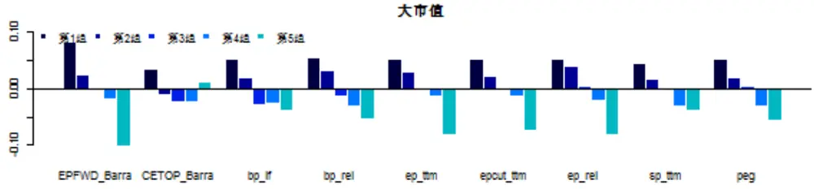

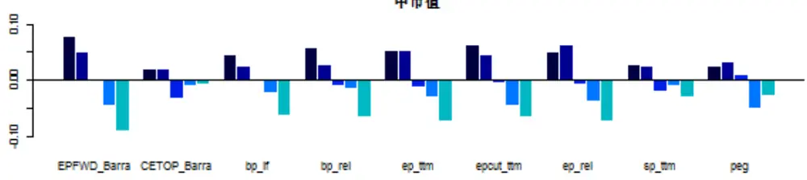

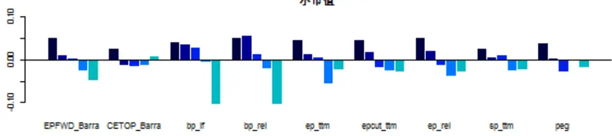
数据来源：Wind 渤海证券研究所

观察可知，估值因子在大市值股票上的区分度明显高于中小市值股票（单调性更好，组间收益差更大）。对于大市值股票，除了 CETOP 之外的所有估值因子均表现出了很好单调性，但对于中小市值股票，只有 EPFWD、bp_lf、ep_cut 等因子表现出了较好单调性，其余因子区分度不高。这证明估值因子是一类对于大市值股票更有效的因子。

年化收益率仅仅是对因子选股能力的初步考察，为了进一步考察因子的选股能力的稳定性，我们选取了每个因子选出的股票在时间维度上的表现。对于收益和因子值正相关的因子，如估值、盈利、成长因子，选择分组回测的第一组股票；对于收益和因子值负相关的因子，如动量、波动率、流动性因子，选择分组回测的第五组股票。计算它们的年化收益、波动率、最大回撤、夏普比率，力求找到获利能力和稳定性俱佳的因子。结果见下表：

表 3：估值因子的选股回测结果

| 大市值 | 中市值 | 小市值 |
| --- | --- | --- |

|  | 年化 收益 | 波动 率 | 最大 回撤 | 夏普 比率 | 年化 收益 | 波动 率 | 最大 回撤 | 夏 比率 | 年化 收益 | 波动 率 | 最大 回撤 | 夏 比率 |
| --- | --- | --- | --- | --- | --- | --- | --- | --- | --- | --- | --- | --- |
| EPFWD | 0.18 | 0.36 | 0.66 | 0.38 | 0.24 | 0.36 | 0.67 | 0.52 | 0.35 | 0.38 | 0.63 | 0.79 |
| CETOP | 0.14 | 0.34 | 0.64 | 0.27 | 0.18 | 0.36 | 0.65 | 0.38 | 0.33 | 0.39 | 0.63 | 0.71 |
| bp_1f | 0.15 | 0.35 | 0.62 | 0.31 | 0.21 | 0.37 | 0.63 | 0.43 | 0.34 | 0.38 | 0.62 | 0.76 |
| bp_rel | 0.15 | 0.34 | 0.61 | 0.32 | 0.22 | 0.37 | 0.62 | 0.46 | 0.35 | 0.39 | 0.61 | 0.78 |
| ep_ttm | 0.15 | 0.35 | 0.68 | 0.31 | 0.21 | 0.36 | 0.67 | 0.47 | 0.35 | 0.37 | 0.61 | 0.79 |
| epcut_ttm | 0.15 | 0.34 | 0.67 | 0.31 | 0.22 | 0.35 | 0.65 | 0.50 | 0.35 | 0.37 | 0.60 | 0.81 |
| ep_rel | 0.15 | 0.33 | 0.65 | 0.33 | 0.21 | 0.36 | 0.67 | 0.46 | 0.35 | 0.38 | 0.60 | 0.79 |
| sp_ttm | 0.14 | 0.35 | 0.66 | 0.29 | 0.19 | 0.36 | 0.65 | 0.39 | 0.33 | 0.39 | 0.63 | 0.71 |
| peg | 0.15 | 0.35 | 0.64 | 0.31 | 0.19 | 0.37 | 0.65 | 0.38 | 0.34 | 0.39 | 0.63 | 0.73 |

数据来源：渤海证券研究所、WIND

对于其他大类因子，我们采取了同样的分层回测思路，下面不再一一说明。

通过观察上表可知，EPFWD在所有市值股票的分层回测中均表现良好，对于大市值股票，可额外考虑 bp_rel、ep_rel 因子，对于中小市值股票，可额外考虑 epcut_ttm因子。

图 2：估值因子多重共线性分析
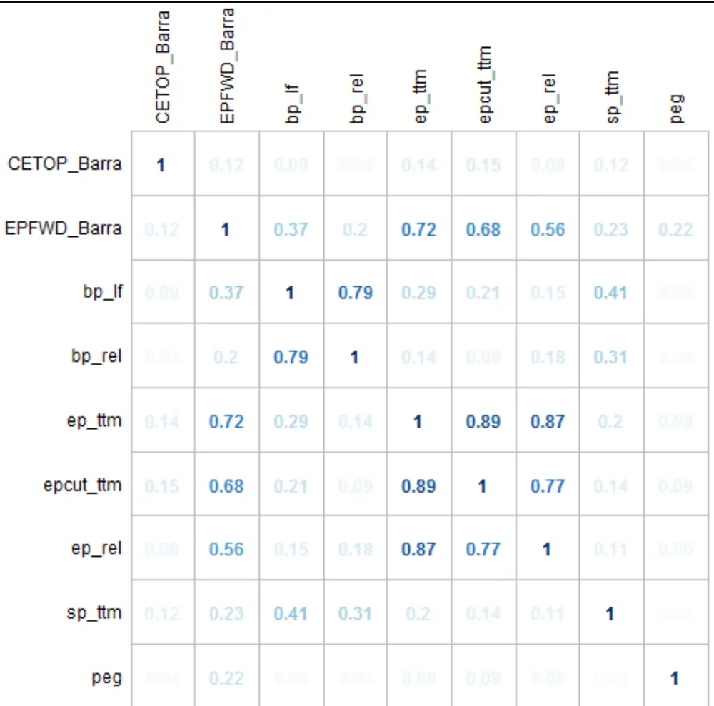

数据来源：Wind 渤海证券研究所

通过相关性矩阵可以看出，市盈率类因子（EPFWD、ep_ttm、epcut_ttm、ep_rel）、市净率类因子（bp_lf、bp_rel）自身相关程度较高。故在建立选股模型时，建议选用 EPFWD 和 bp_rel 因子作为估值因子的代表。

## 3.2 盈利因子

Barra手册中没有收录盈利因子。在最初的因子检测时，我们尝试了非常多种类的盈利因子（见 2.1 节的因子说明），但大部分因子显著性和选股能力不强，最后，我们选择了其中相对表现较好的几个因子：扣非利润率 profitmargin、净资产收益率 ROE、资产收益率ROA、投入资本回报率 ROIC和盈利收益率 sales2EV进行展示。

表 4：盈利因子的回归测试结果

|  | t值绝对 值平均 值 | t值绝对 | 因子收益 | 因子收益 标准差 | 因子收益 t值 | 因子收 益>0概率 | IC平均 值 | IC标准 差 | IRIC | IC>0概 率 |  |
| --- | --- | --- | --- | --- | --- | --- | --- | --- | --- | --- | --- |
|  |  |  |  |  |  |  |  |  |  |  | 值>2 概率 平均值 |
| profitmargin_q | 2.00 | 0.43 | 0.02 | 0.08 | 3.09 | 0.59 | 0.02 | 0.08 | 0.29 | 0.62 |  |
| profitmargin_ttm | 1.32 | 0.22 | 0.01 | 0.05 | 3.26 | 0.59 | 0.01 | 0.06 | 0.21 | 0.56 |  |
| qfa_roa | 2.49 | 0.55 | 0.03 | 0.10 | 3.12 | 0.59 | 0.03 | 0.09 | 0.30 | 0.62 |  |
| roa_ttm | 2.39 | 0.53 | 0.01 | 0.10 | 1.52 | 0.57 | 0.01 | 0.09 | 0.17 | 0.52 |  |
| qfa_roe | 2.49 | 0.54 | 0.03 | 0.10 | 3.53 | 0.62 | 0.03 | 0.09 | 0.34 | 0.64 |  |
| roe_ttm | 2.33 | 0.50 | 0.02 | 0.11 | 2.04 | 0.58 | 0.02 | 0.09 | 0.21 | 0.56 |  |
| roic_qq | 2.60 | 0.57 | 0.02 | 0.11 | 2.26 | 0.58 | 0.02 | 0.09 | 0.21 | 0.55 |  |
| sales2EV | 2.18 | 0.40 | 0.02 | 0.09 | 1.99 | 0.57 | 0.01 | 0.07 | 0.20 | 0.56 |  |

数据来源：渤海证券研究所、WIND

通过回归结果可以看出，除了年化扣非利润率之外，我们选择的大部分盈利因子都表现出了较高的显著性（t值平均值大于 2），而在时间维度上，当季的盈利因子表现出的显著性优于同一因子的 ttm 值。

图 3：盈利因子超额年化收益率分组回测结果
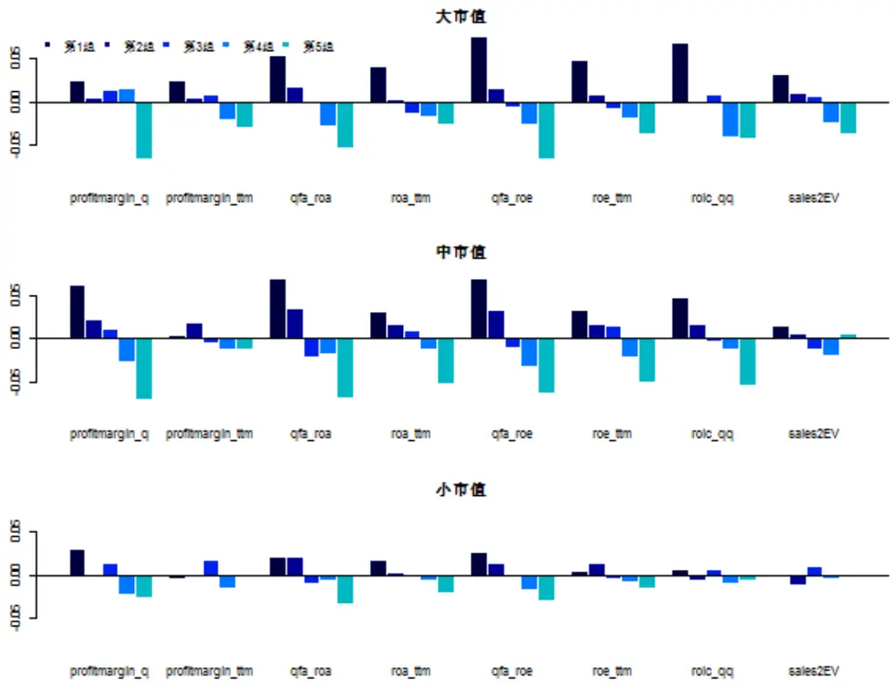
数据来源：渤海证券研究所、WIND

分组回测后，我们发现盈利因子在大中市值股票上的区分度明显高于小市值股票。传统的 ROE、ROA 因子在大中市值的股票中均表现出了一定的单调性。对大市值股票来说，sales2EV 表现出了很好的单调性，对中市值股票来说，profitmargin_q和 roic 也表现出了很好的区分效果。这证明盈利因子是一类对于大中市值股票相对更有效的因子。

表 5：盈利因子的选股回测结果

|  | 大市值 |  |  |  | 中市值 |  |  |  | 小市值 |  |  |  |
| --- | --- | --- | --- | --- | --- | --- | --- | --- | --- | --- | --- | --- |
|  | 年化 收益 | 波动 率 | 最大 回撤 | 夏普 比率 | 年化 | 波动 | 最大 | 夏普 | 年化 | 波动 | 最大 | 夏普 |
| profitmargin_q | 0.13 | 0.31 | 0.61 | 0.26 | 收益 0.22 | 率 0.36 | 回撤 0.64 | 比率 0.48 | 收益 0.33 | 率 0.39 | 回撤 0.61 | 比率 |
| profitmargin_ttm | 0.13 | 0.33 | 0.67 | 0.24 | 0.16 | 0.36 | 0.68 | 0.33 | 0.30 | 0.38 | 0.62 | 0.71 0.64 |
| qfa_roa | 0.15 | 0.32 | 0.67 | 0.33 | 0.23 | 0.35 | 0.65 | 0.51 | 0.32 | 0.39 | 0.61 | 0.70 |
|  | 0.14 | 0.32 | 0.64 | 0.30 | 0.19 | 0.36 | 0.66 | 0.41 | 0.32 | 0.39 | 0.63 | 0.69 |
| roa_ttm qfa_roe | 0.18 | 0.33 | 0.68 | 0.39 | 0.23 | 0.35 | 0.65 | 0.52 | 0.33 | 0.38 | 0.61 | 0.73 |
|  | 0.15 | 0.33 | 0.68 | 0.31 | 0.19 | 0.35 | 0.67 | 0.42 | 0.31 | 0.38 | 0.63 | 0.67 |
| roe_ttm |  |  |  |  |  |  |  |  |  |  |  |  |
| roic_qq | 0.17 | 0.32 | 0.67 | 0.37 | 0.21 | 0.35 | 0.66 | 0.46 | 0.31 | 0.38 | 0.61 | 0.67 |
| sales2EV | 0.13 | 0.35 | 0.66 | 0.24 | 0.17 | 0.36 | 0.65 | 0.35 | 0.30 | 0.39 | 0.63 | 0.64 |

数据来源：渤海证券研究所、WIND

通过观察上表可知，ROE、ROA 类因子表现较好，其中 qfa_roe 在所有市值股票的分层回测中表现相对更加优秀。

图 4：盈利因子多重共线性分析

| profitmargin_q profitmargin_ttm | brrrgin | pron"gtm | ga"roa | roatm | ga"roe | roetm | r~oga | salEV |  |
| --- | --- | --- | --- | --- | --- | --- | --- | --- | --- |
|  | 1 | 0.16 | 0.72 | 0.56 | 0.68 | 0.51 | 0.65 | 0.22 |  |
|  | 0.16 | 1 | 0.26 | 0.3 | 0.28 | 0.31 | 0.3 | 0.11 |  |
|  | qfa_roa 0.72 | 0.26 | 1 | 0.76 | 0.89 | 0.65 | 0.86 | 0.09 |  |
|  | roa_ttm | 0.56 | 0.3 | 0.76 | 1 | 0.63 | 0.87 | 0.83 | 0.11 |
| qfa_roe | 0.68 | 0.28 | 0.89 | 0.63 | 1 | 0.71 | 0.8 | 0.04 |  |
| roe_ttm | 0.51 | 0.31 | 0.65 | 0.87 | 0.71 | 1 | 0.76 |  |  |
| roic_qq | 0.65 | 0.3 | 0.86 | 0.83 | 0.8 | 0.76 | 1 | 0.05 |  |
| sales2EV | 0.22 | 0.11 | 0.09 | 0.11 | 0.04 |  | 0.05 | 1 |  |

数据来源：渤海证券研究所、WIND

通过相关性矩阵可以看出，ROE 类因子、ROA 类因子与 ROIC、profitmargin_q 相关程度均较高。故在建立选股模型时，选择 qfa_roe 因子作为盈利因子的代表。

## 3.3 成长因子

Barra 手册中收录了4个有关成长的因子：过去5年营业总收入复合增长率sgro、过去 3 年归母净利润复合增长率 egro、未来三年一致预期净利润增长率 EGRLF和未来一年一致预期净利润增长率 EGRSF。在因子检测时，除了以上四个因子，我们还在时间维度上增加了 3年、1 年、单季度的营业收入和归母净利润增长率作为对比。在最初的因子库中，我们收录的因子更多（见 2.1 节的因子说明），最终测试结果不理想的因子为了结果展示的简洁性舍去。

表 6：波动率因子的回归测试结果

|  | t值绝对 值平均值 | t值绝对 值>2概率 | 因子收益 平均值 | 因子收益 标准差 | 因子收益 t值 | 因子收 益>0概率 | IC 平均值 | IC 标准差 | IRIC | IC>0概 率 |
| --- | --- | --- | --- | --- | --- | --- | --- | --- | --- | --- |
| EGRLF | 1.61 | 0.30 | 0.01 | 0.07 | 2.15 | 0.59 | 0.01 | 0.07 | 0.16 | 0.57 |
| EGRSF | 1.50 | 0.27 | 0.01 | 0.07 | 1.44 | 0.57 | 0.01 | 0.06 | 0.17 | 0.62 |
| sgro_barra | 1.92 | 0.40 | 0.02 | 0.07 | 2.83 | 0.59 | 0.02 | 0.07 | 0.27 | 0.59 |
| growth_or3 | 1.81 | 0.39 | 0.01 | 0.07 | 2.10 | 0.59 | 0.01 | 0.07 | 0.21 | 0.59 |
| yoy_or | 1.76 | 0.38 | 0.02 | 0.07 | 3.02 | 0.59 | 0.02 | 0.07 | 0.27 | 0.63 |
| qfa_yoyor | 1.60 | 0.31 | 0.02 | 0.06 | 3.99 | 0.61 | 0.02 | 0.06 | 0.33 | 0.64 |
| egro_barra | 1.40 | 0.23 | 0.01 | 0.06 | 1.86 | 0.58 | 0.01 | 0.06 | 0.21 | 0.59 |
| yoy_growth_np | 1.83 | 0.38 | 0.02 | 0.08 | 2.32 | 0.58 | 0.02 | 0.08 | 0.25 | 0.61 |
| qfa_yoynp | 1.59 | 0.29 | 0.02 | 0.07 | 3.48 | 0.64 | 0.02 | 0.07 | 0.34 | 0.65 |

数据来源：渤海证券研究所、WIND

通过回归结果可以看出，成长因子的显著性普遍低于估值因子和盈利因子，这可能与中国股市的市场特性有关。

图 5：成长因子超额年化收益率分组回测结果
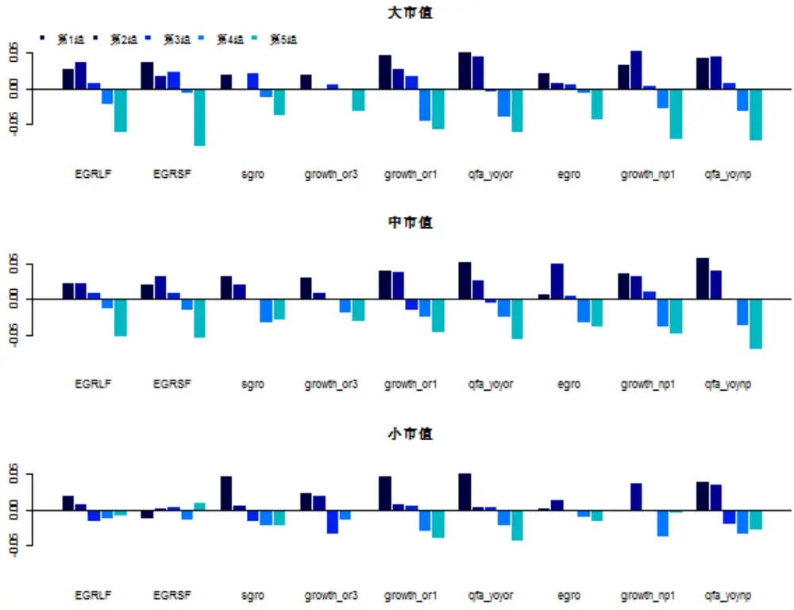
数据来源：Wind 渤海证券研究所

分组回测后，可以发现在时间维度上，季度、年度因子的表现要好于3 年、5 年的长时间周期。而 Barra 因子由于其时间周期过长表现普遍不太好。

表 7：成长因子的选股回测结果

|  | 大市值 |  |  |  | 中市值 |  |  |  | 小市值 |  |  |  |
| --- | --- | --- | --- | --- | --- | --- | --- | --- | --- | --- | --- | --- |
|  | 年化 | 波动 | 最大 回撤 | 夏普 比率 | 年化 收益 | 波动 | 最大 | 夏普 | 年化 | 波动 | 最大 | 夏普 |
|  | 收益 0.12 | 率 0.36 | 0.71 | 0.21 | 0.19 | 率 0.39 | 回撤 0.67 | 比率 0.38 | 收益 0.35 | 率 0.41 | 回撤 | 比率 |
| sgro | 0.12 | 0.36 | 0.7 | 0.21 | 0.19 | 0.38 | 0.66 | 0.39 | 0.33 | 0.4 | 0.62 0.63 | 0.73 0.68 |
| growth_or3 | 0.15 | 0.36 | 0.7 | 0.29 | 0.2 | 0.39 | 0.67 | 0.4 | 0.35 | 0.4 | 0.64 | 0.74 |
| growth_orl | 0.15 | 0.36 | 0.69 | 0.3 | 0.21 | 0.39 | 0.66 | 0.43 | 0.35 | 0.4 | 0.62 | 0.75 |
| qfa_yoyor | 0.12 | 0.34 | 0.71 | 0.23 | 0.17 | 0.37 | 0.67 | 0.33 | 0.3 | 0.4 | 0.64 | 0.63 |
| egro | 0.14 | 0.36 | 0.71 | 0.25 | 0.2 | 0.38 | 0.68 | 0.39 | 0.3 | 0.39 | 0.64 | 0.63 |
| growth_np1 qfa_yoynp | 0.15 | 0.36 | 0.68 | 0.28 | 0.22 | 0.38 | 0.67 | 0.45 | 0.34 | 0.39 | 0.62 | 0.74 |

数据来源：渤海证券研究所、WIND

通过观察上表可知，qfa_yoyor 和 qfa_yoynp，即营业收入和利润的季度增长率表

现相对较好。

图 6：估值因子多重共线性分析

| 1 | 0.27 | 0.06 | 0.07 | 0.17 | 0.12 | 0.11 | 0.13 | 0.14 |
| --- | --- | --- | --- | --- | --- | --- | --- | --- |
| 0.27 | 1 | 0.14 | 0.11 | 0.62 | 0.13 | 0.36 | 0.15 | 0.41 |
| 0.06 | 0.14 | 1 | 0.79 | 0.13 | 0.13 | 0.13 | 0.13 | 0.15 |
| 0.07 | 0.11 | 0.79 | 1 | 0.12 | 0.23 | 0.14 | 0.26 | 0.16 |
| 0.17 | 0.62 | 0.13 | 0.12 | 1 | 0.17 | 0.42 | 0.22 | 0.51 |
| 0.12 | 0.13 | 0.13 | 0.23 | 0.17 | 1 | 0.36 | 0.68 | 0.32 |
| 0.11 | 0.36 | 0.13 | 0.14 | 0.42 | 0.36 | 1 | 0.33 | 0.81 |
| 0.13 | 0.15 | 0.13 | 0.26 | 0.22 | 0.68 | 0.33 | 1 | 0.38 |
| 0.14 | 0.41 | 0.15 | 0.16 | 0.51 | 0.32 | 0.81 | 0.38 | 1 |

数据来源：渤海证券研究所、WIND

通过相关性矩阵可以看出，成长类因子彼此相关程度均不算太高，同一因子仅在相邻的时间跨度会表现出较高相关性，故建议选择 qfa_yoyor 和 qfa_yoynp 作为成长因子的代表。

## 3.4 动量因子

Barra因子中关于动量因子仅收录了RSTR一种，其计算方式是第 21-500 日的收益率序列以半衰期指数加权的和。Barra的RSTR 因子剔除了最近一月收益率的影响，在因子检测时，我们仿照 Barra 因子的构建方式，构建了 1 月、3 月、6 月、12 月、24 月的修正收益率 RSTR，其中 RSTR_m24 与 RSTR_barra 的差别仅在是否纳入最近一月的数据。作为补充，我们还检测了股票1月、3 月、6 月的传统意义上的收益率（即近 1/3/6 月涨跌幅）和 CAPM 模型中的 alpha 值：

表 8：动量因子的回归测试结果

|  | t值绝对 值平均值 | t值绝对 值>2 概率 | 因子收益 平均值 | 因子收益 标准差 | 因子收 益t值 | 因子收 益>0概率 | IC 平均 值 | IC标准 差 | IRIC | IC>0概 率 |
| --- | --- | --- | --- | --- | --- | --- | --- | --- | --- | --- |
| alpha | 3.59 | 0.63 | -0.06 | 0.13 | -5.39 | 0.32 | -0.07 | 0.12 | -0.61 | 0.23 |
| RSTR_barra | 3.62 | 0.62 | -0.05 | 0.14 | -4.49 | 0.35 | -0.07 | 0.12 | -0.55 | 0.28 |
| RS_1 | 3.25 | 0.57 | -0.07 | 0.12 | -6.88 | 0.30 | -0.08 | 0.11 | -0.73 | 0.25 |
| RS_3 | 3.45 | 0.63 | -0.06 | 0.13 | -5.21 | 0.34 | -0.07 | 0.11 | -0.60 | 0.24 |
| RS_6 | 3.25 | 0.58 | -0.05 | 0.13 | -4.27 | 0.35 | -0.06 | 0.11 | -0.51 | 0.28 |
| RSTR_m1 | 3.17 | 0.52 | -0.07 | 0.12 | -6.93 | 0.32 | -0.07 | 0.11 | -0.65 | 0.28 |
| RSTR_m3 | 3.65 | 0.62 | -0.08 | 0.13 | -6.93 | 0.32 | -0.09 | 0.12 | -0.73 | 0.22 |
| RSTR_m6 | 3.73 | 0.64 | -0.07 | 0.14 | -6.17 | 0.33 | -0.08 | 0.12 | -0.69 | 0.21 |
| RSTR_m12 | 3.75 | 0.64 | -0.06 | 0.15 | -5.13 | 0.36 | -0.08 | 0.13 | -0.60 | 0.27 |
| RSTR_m24 | 3.67 | 0.62 | -0.06 | 0.15 | -4.49 | 0.38 | -0.07 | 0.13 | -0.55 | 0.28 |

数据来源：渤海证券研究所、WIND

通过回归模型，可以发现所有动量因子都表现出了较高的显著性，且修正后的动量因子RSTR显著性略高于修正前。

图 7：动量因子超额年化收益率分组回测结果
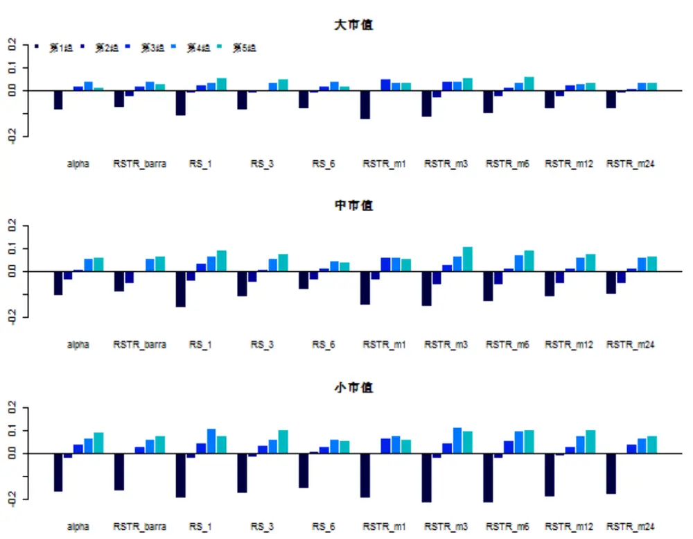
数据来源：渤海证券研究所、WIND

分组回测后，发现动量因子在中小市值股票上的区分度明显高于大市值股票。其中表现较好的股票有 1、3 月收益率和 6、12、24月修正收益率。这说明，在较短的时间维度上，动量的半衰期效应并不明显，但是当时间周期拉长到半年以上时，动量的半衰期效应开始逐渐显现。

表 9：动量因子的选股回测结果

|  | 大市值 |  |  |  | 中市值 |  |  |  | 小市值 |  |  |  |
| --- | --- | --- | --- | --- | --- | --- | --- | --- | --- | --- | --- | --- |
|  | 年化 | 波动 | 最大 | 夏普 | 年化 | 波动 | 最大 | 夏普 | 年化 | 波动 | 最大 | 夏普 |
|  | 收益 | 率 | 回撤 | 比率 | 收益 | 率 | 回撤 | 比率 | 收益 | 率 | 回撤 | 比率 |
| alpha | 0.11 | 0.35 | 0.62 | 0.2 | 0.23 | 0.39 | 0.64 | 0.46 | 0.39 | 0.41 | 0.63 | 0.83 |
| RSTR_barra | 0.13 | 0.35 | 0.63 | 0.25 | 0.23 | 0.38 | 0.64 | 0.48 | 0.38 | 0.41 | 0.61 | 0.8 |
| RS_1 | 0.16 | 0.36 | 0.66 | 0.31 | 0.26 | 0.39 | 0.63 | 0.53 | 0.38 | 0.42 | 0.62 | 0.78 |
| RS_3 | 0.15 | 0.37 | 0.68 | 0.29 | 0.24 | 0.39 | 0.65 | 0.5 | 0.4 | 0.41 | 0.62 | 0.85 |
| RS_6 | 0.12 | 0.36 | 0.65 | 0.21 | 0.21 | 0.38 | 0.66 | 0.41 | 0.36 | 0.41 | 0.63 | 0.73 |
| RSTR_m1 | 0.14 | 0.36 | 0.63 | 0.25 | 0.22 | 0.4 | 0.64 | 0.43 | 0.36 | 0.42 | 0.63 | 0.74 |
| RSTR_m3 | 0.16 | 0.36 | 0.65 | 0.31 | 0.27 | 0.4 | 0.64 | 0.56 | 0.4 | 0.42 | 0.61 | 0.83 |
| RSTR_m6 | 0.16 | 0.36 | 0.65 | 0.32 | 0.26 | 0.4 | 0.64 | 0.53 | 0.41 | 0.42 | 0.62 | 0.85 |
| RSTR_m12 | 0.14 | 0.36 | 0.64 | 0.25 | 0.24 | 0.39 | 0.65 | 0.49 | 0.4 | 0.41 | 0.61 | 0.85 |
| RSTR_m24 | 0.14 | 0.36 | 0.63 | 0.26 | 0.23 | 0.38 | 0.64 | 0.48 | 0.38 | 0.41 | 0.6 | 0.8 |

数据来源：渤海证券研究所、WIND

通过观察上表可知，动量因子在分层回测时普遍表现不错，RSTR_m6表现相对更好。

图 8：动量因子多重共线性分析

| 1 | 0.9 | 0.44 | 0.67 | 0.8 | 0.35 | 0.9 | 0.98 | 0.59 | 0.74 |
| --- | --- | --- | --- | --- | --- | --- | --- | --- | --- |
| 0.9 | 1 | 0.56 | 0.77 | 0.83 | 0.47 | 0.97 | 0.91 | 0.72 | 0.86 |
| 0.44 | 0.56 | 1 | 0.54 | 0.37 | 0.79 | 0.6 | 0.45 | 0.88 | 0.75 |
| 0.67 | 0.77 | 0.54 | 1 | 0.69 | 0.43 | 0.84 | 0.69 | 0.77 | 0.88 |
| 0.8 | 0.83 | 0.37 | 0.69 | 1 | 0.31 | 0.89 | 0.84 | 0.54 | 0.78 |
| 0.35 | 0.47 | 0.79 | 0.43 | 0.31 | 1 | 0.5 | 0.38 | 0.84 | 0.67 |
| 0.9 | 0.97 | 0.6 | 0.84 | 0.89 | 0.5 | 1 | 0.93 | 0.78 | 0.93 |
| 0.98 | 0.91 | 0.45 | 0.69 | 0.84 | 0.38 | 0.93 | 1 | 0.61 | 0.78 |
| 0.59 | 0.72 | 0.88 | 0.77 | 0.54 | 0.84 | 0.78 | 0.61 | 1 | 0.93 |
| 0.74 | 0.86 | 0.75 | 0.88 | 0.78 | 0.67 | 0.93 | 0.78 | 0.93 | 1 |

数据来源：渤海证券研究所、WIND

在相关性矩阵中，我们发现动量因子两两之间均呈现较高的相关性，如直接使用，可选择 RSTR_m6作为代表因子。

## 3.5 波动率因子

在波动率因子的测试中，我们主要检测了 Barra 手册中定义的四个因子：beta、dastd、cmra、hsigma，以及日收益与成交量在不同时间维度的波动率。我们还检测了最高价/最低价这一因子，但是该因子最终区分度并不理想，故在结果展示中舍去。

表 10：波动率因子的回归测试结果

|  | t值绝对 值平均值 | t值绝对 值>2概率 | 因子收益 平均值 | 因子收益 标准差 | 因子收益 t值 | 因子收 益>0概率 | IC 平均值 | IC 标准差 | IRIC | IC>0概 率 |
| --- | --- | --- | --- | --- | --- | --- | --- | --- | --- | --- |
| BETA | 3.03 | 0.57 | 0.00 | 0.13 | 0.14 | 0.51 | 0.00 | 0.10 | 0.03 | 0.48 |
| DASTD | 4.22 | 0.72 | -0.06 | 0.15 | -4.49 | 0.34 | -0.07 | 0.14 | -0.50 | 0.29 |
| CMRA | 2.82 | 0.51 | 0.00 | 0.11 | 0.08 | 0.51 | 0.00 | 0.10 | -0.04 | 0.46 |
| HSIGMA | 3.97 | 0.67 | -0.07 | 0.14 | -5.59 | 0.29 | -0.08 | 0.13 | -0.63 | 0.25 |
| yieldvol_1 | 3.61 | 0.72 | -0.05 | 0.13 | -4.76 | 0.30 | -0.07 | 0.12 | -0.57 | 0.27 |
| yieldvol_3 | 3.90 | 0.67 | -0.05 | 0.14 | -4.41 | 0.33 | -0.06 | 0.13 | -0.49 | 0.29 |
| yieldvol_6 | 3.91 | 0.65 | -0.05 | 0.14 | -3.86 | 0.34 | -0.06 | 0.13 | -0.44 | 0.33 |
| VOL_1 | 3.15 | 0.62 | -0.08 | 0.11 | -8.27 | 0.25 | -0.09 | 0.09 | -1.00 | 0.17 |
| VOL_3 | 3.12 | 0.63 | -0.06 | 0.12 | -5.49 | 0.29 | -0.06 | 0.10 | -0.67 | 0.25 |
| VOL_6 | 2.98 | 0.62 | -0.05 | 0.12 | -4.53 | 0.29 | -0.05 | 0.10 | -0.54 | 0.28 |
| VOL_12 | 2.70 | 0.58 | -0.04 | 0.12 | -4.11 | 0.33 | -0.04 | 0.09 | -0.46 | 0.31 |

数据来源：渤海证券研究所、WIND

通过回归结果可以看出，各种波动率因子的回归表现都较为显著，其中Barra 因子中的DASTD 因子显著性最高。而成交量因子随着时间跨度的拉长，显著性呈现逐渐下降的趋势。

图 9：波动率因子超额年华收益率分组回测结果
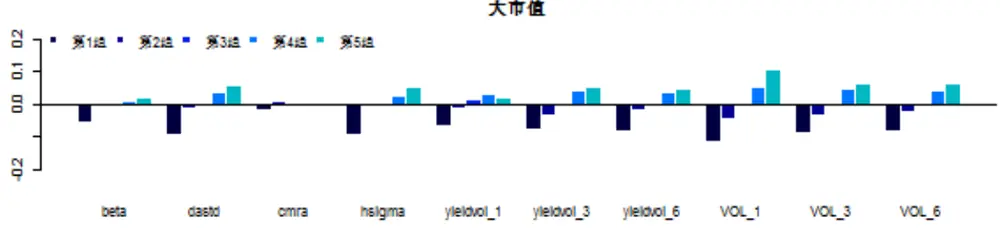

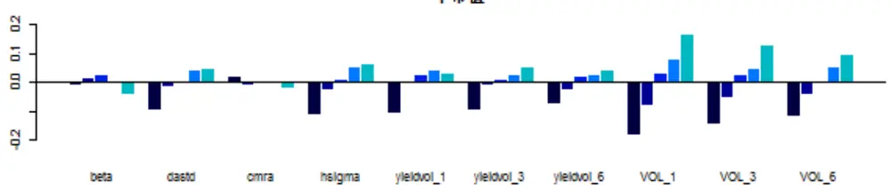

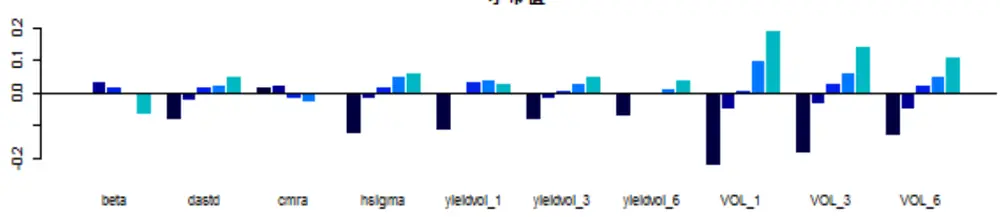
数据来源：渤海证券研究所、WIND

分组回测可知，VOL 因子对于大中小市值的股票都表现出了很好的区分度，是选股能力非常优秀的一类因子，且分层效果随着时间递减。有趣的是，Barra 因子中的 beta 因子和 cmra 因子虽然在显著性测试中表现很好，但是分层回测的效果却并不理想，这主要是因为其对收益率的影响方向并不稳定（IC>0的概率均接近0.5，证明因子收益率忽正忽负）。同样作为收益波动率的衡量指标，dastd 与 hsigma 因子区分度较为优秀，可作为收益波动率的代表。

表 11：波动率因子的选股回测结果

|  | 大市值 |  |  |  | 中市值 |  |  |  | 小市值 |  |  |  |
| --- | --- | --- | --- | --- | --- | --- | --- | --- | --- | --- | --- | --- |
|  | 年化 收益 | 波动 率 | 最大 回撤 | 夏普 比率 | 年化 收益 | 波动 率 | 最大 回撤 | 夏普 比率 | 年化 收益 | 波动 率 | 最大 回撤 | 夏普 比率 |
| BETA | 0.12 | 0.30 | 0.57 | 0.26 | 0.12 | 0.37 | 0.65 | 0.21 | 0.24 | 0.40 | 0.66 | 0.48 |
| DASTD | 0.16 | 0.29 | 0.58 | 0.40 | 0.21 | 0.33 | 0.61 | 0.49 | 0.35 | 0.36 | 0.60 | 0.84 |
| CMRA | 0.10 | 0.33 | 0.67 | 0.18 | 0.14 | 0.35 | 0.66 | 0.27 | 0.29 | 0.38 | 0.62 | 0.64 |
| HSIGMA | 0.15 | 0.31 | 0.61 | 0.34 | 0.23 | 0.34 | 0.62 | 0.52 | 0.36 | 0.36 | 0.59 | 0.86 |
| yieldvol_1 | 0.12 | 0.29 | 0.60 | 0.27 | 0.20 | 0.34 | 0.61 | 0.44 | 0.33 | 0.37 | 0.60 | 0.76 |
| yieldvol_3 | 0.15 | 0.29 | 0.58 | 0.36 | 0.21 | 0.33 | 0.60 | 0.50 | 0.35 | 0.36 | 0.59 | 0.84 |
| yieldvol_6 | 0.15 | 0.30 | 0.57 | 0.34 | 0.21 | 0.34 | 0.61 | 0.47 | 0.34 | 0.36 | 0.62 | 0.79 |
| VOL_1 | 0.21 | 0.31 | 0.59 | 0.51 | 0.33 | 0.35 | 0.60 | 0.79 | 0.50 | 0.39 | 0.56 | 1.11 |
| VOL_3 | 0.16 | 0.31 | 0.60 | 0.39 | 0.29 | 0.34 | 0.62 | 0.71 | 0.44 | 0.39 | 0.60 | 1.00 |
| VOL_6 | 0.16 | 0.31 | 0.61 | 0.38 | 0.26 | 0.34 | 0.64 | 0.61 | 0.41 | 0.39 | 0.62 | 0.92 |
| VOL_12 | 0.16 | 0.31 | 0.61 | 0.37 | 0.24 | 0.35 | 0.65 | 0.55 | 0.41 | 0.39 | 0.61 | 0.92 |

数据来源：渤海证券研究所、WIND

通过观察上表可知，作为成交量波动率，VOL1 表现相对更好，作为收益波动率，dastd、hsigma 表现较好。

图 10：波动率因子多重共线性分析

| 1 | 0.11 | 0.46 | 0.1 | 0.14 | 0.21 | 0.16 | 0.2 | 0.35 | 0.42 | 0.44 |
| --- | --- | --- | --- | --- | --- | --- | --- | --- | --- | --- |
| 0.11 | 1 | 0.33 | 0.31 | 0.1 | 0.17 | 0.14 | 0.16 | 0.17 | 0.26 | 0.33 |
| 0.46 | 0.33 | 1 | 0.92 | 0.28 | 0.15 | 0.3 | 0.27 | 0.76 | 0.93 | 0.94 |
| 0.1 | 0.31 | 0.92 | 1 | 0.29 | 0.11 | 0.25 | 0.18 | 0.74 | 0.86 | 0.83 |
| 0.14 | 0.1 | 0.28 | 0.29 | 1 | 0.72 | 0.84 | 0.78 | 0.43 | 0.31 | 0.23 |
| 0.21 | 0.17 | 0.15 | 0.11 | 0.72 | 1 | 0.84 | 0.94 | 0.11 | 0.14 | 0.15 |
| 0.16 | 0.14 | 0.3 | 0.25 | 0.84 | 0.84 | 1 | 0.91 | 0.27 | 0.34 | 0.26 |
| 0.2 | 0.16 | 0.27 | 0.18 | 0.78 | 0.94 | 0.91 | 1 | 0.18 | 0.24 | 0.26 |
| 0.35 | 0.17 | 0.76 | 0.74 | 0.43 | 0.11 | 0.27 | 0.18 | 1 | 0.77 | 0.64 |
| 0.42 | 0.26 | 0.93 | 0.86 | 0.31 | 0.14 | 0.34 | 0.24 | 0.77 | 1 | 0.87 |
| 0.44 | 0.33 | 0.94 | 0.83 | 0.23 | 0.15 | 0.26 | 0.26 | 0.64 | 0.87 | 1 |

数据来源：渤海证券研究所、WIND

通过相关性矩阵可以看出，dastd 和 hsigma 序列的相关程度较高，考虑回测时的表现，故最后推荐使用dastd 因子与VOL_1 因子作为波动率因子的代表。

## 3.6 流动性因子

在流动性因子的测试中，我们主要检测了 Barra 手册中定义的三个换手率因子：STOM、STOQ、STOA，不同时间维度的相对换手率 MSM、MSQ、MSS 以及两个市值因子：流通市值 mkt_cap_float 以及 Barra 定义的 nonlinearsize。我们还检测了普通意义下的换手率因子，结果与Barra定义的换手率因子非常类似，故在结果展示中舍去。

表 12：流动性因子的回归测试结果

|  | t值绝对 | t值绝对 | 因子收益 | 因子收益 | 因子收益 | 因子收 | IC 平均值 | IC标准差 | IRIC | IC>0概 |
| --- | --- | --- | --- | --- | --- | --- | --- | --- | --- | --- |
|  | 值平均值 | 值>2 概率 | 平均值 | 标准差 | t值 | 益>0概率 |  |  |  | 率 |
| STOM_Barra | 3.79 | 0.68 | -0.08 | 0.13 | -6.79 | 0.28 | -0.09 | 0.11 | -0.84 | 0.19 |
| STOQ_Barra | 3.28 | 0.63 | -0.05 | 0.12 | -4.65 | 0.33 | -0.06 | 0.10 | -0.56 | 0.28 |
| STOA_Barra | 3.18 | 0.61 | -0.04 | 0.12 | -4.19 | 0.33 | -0.05 | 0.10 | -0.48 | 0.30 |
| MSM | 2.73 | 0.59 | -0.06 | 0.09 | -7.37 | 0.24 | -0.07 | 0.08 | -0.80 | 0.22 |
| MSQ | 2.36 | 0.52 | -0.04 | 0.09 | -4.96 | 0.33 | -0.05 | 0.08 | -0.56 | 0.30 |
| MSS | 1.94 | 0.39 | -0.03 | 0.08 | -4.20 | 0.35 | -0.03 | 0.07 | -0.48 | 0.30 |
| mkt_cap_float | 5.32 | 0.74 | -0.04 | 0.18 | -2.45 | 0.40 | -0.01 | 0.07 | -0.09 | 0.48 |
| nonlinearsize | 2.15 | 0.38 | -0.01 | 0.09 | -1.72 | 0.43 | -0.05 | 0.12 | -0.43 | 0.30 |

数据来源：渤海证券研究所、WIND

通过回归结果可以看出，换手率因子的显著性明显强于相对换手率，且随着时间跨度拉长逐步递减，市值因子的显著性非常高，但是 IC>0 的概率接近 0.5，证明其预测的方向性不确定。

图 11：流动性因子超额年化收益率分组回测结果
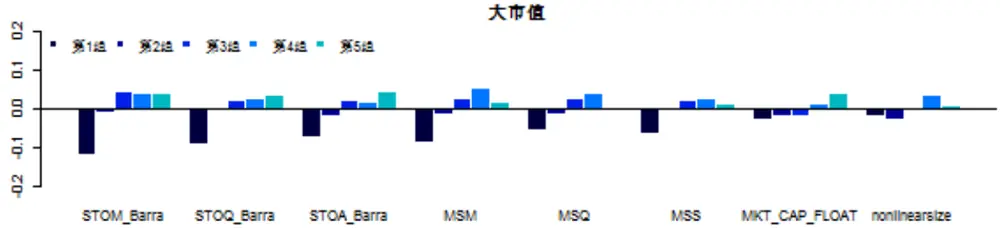

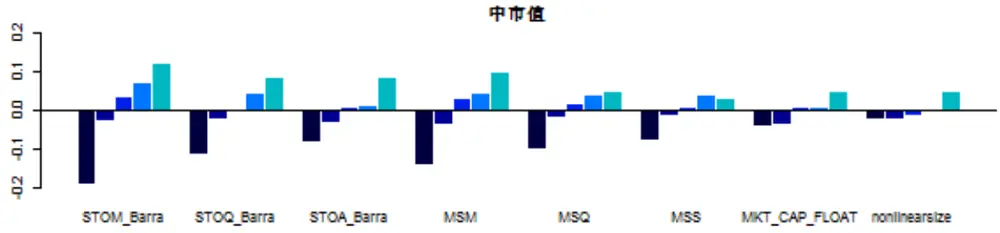

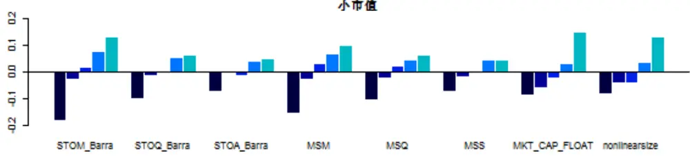
数据来源：Wind 渤海证券研究所

分组回测后，发现流动性因子是非常有规律的一类因子，在中小市值股票上的区分度明显高于大市值股票。换手率因子的表现略好于相对换手率，且分层效果随着时间递减。市值类因子对小市值股票选股效果十分明显。

表 13：波动率因子的选股回测结果

|  | 大市值 |  |  |  | 中市值 |  |  |  | 小市值 |  |  |  |
| --- | --- | --- | --- | --- | --- | --- | --- | --- | --- | --- | --- | --- |
|  | 年化 收益 | 波动 率 | 最大 回撤 | 夏普 比率 | 年化 收益 | 波动 率 | 最大 回撤 | 夏普 比率 | 年化 收益 | 波动 率 | 最大 回撤 | 夏普 比率 |
| STOM_Barra | 0.14 | 0.28 | 0.58 | 0.35 | 0.28 | 0.34 | 0.61 | 0.69 | 0.43 | 0.38 | 0.57 | 0.99 |
| STOQ_Barra | 0.13 | 0.28 | 0.59 | 0.32 | 0.25 | 0.34 | 0.61 | 0.59 | 0.36 | 0.38 | 0.59 | 0.82 |
| STOA_Barra | 0.14 | 0.28 | 0.6 | 0.35 | 0.25 | 0.34 | 0.62 | 0.58 | 0.35 | 0.38 | 0.62 | 0.77 |
| MSM | 0.12 | 0.32 | 0.61 | 0.23 | 0.26 | 0.37 | 0.62 | 0.58 | 0.4 | 0.39 | 0.58 | 0.89 |
| MSQ | 0.1 | 0.33 | 0.68 | 0.17 | 0.21 | 0.36 | 0.63 | 0.46 | 0.36 | 0.39 | 0.61 | 0.78 |
| MSS | 0.11 | 0.33 | 0.71 | 0.21 | 0.19 | 0.37 | 0.65 | 0.4 | 0.34 | 0.4 | 0.61 | 0.74 |
| MKT_CAP_FLOAT | 0.14 | 0.36 | 0.64 | 0.27 | 0.21 | 0.38 | 0.64 | 0.43 | 0.45 | 0.42 | 0.61 | 0.95 |
| nonlinearsize | 0.11 | 0.33 | 0.65 | 0.2 | 0.21 | 0.38 | 0.64 | 0.43 | 0.43 | 0.41 | 0.6 | 0.92 |

数据来源：渤海证券研究所、WIND

通过观察上表可知，1 月换手率因子 STOM 在大中小表现均十分出色，而对于中小市值股票，流通市值因子和 nonlinearsize 也表现较为出色。

图 12：波动率因子多重共线性分析

| MKT_CAP_FLOAT STOM_Barra | MPOCOAT | STrra | STamBra | STrara | WSW | OSW | SSW | noaize |
| --- | --- | --- | --- | --- | --- | --- | --- | --- |
|  | 1 | 0.33 | 0.28 | 0.4 | 0.08 | 0.07 | 0.07 | 0.64 |
|  | STOQ_Barra 0.33 | 1 | 0.81 | 0.84 | 0.2 | 0.42 | 0.41 | 0.12 |
|  | 0.28 | 0.81 | 1 | 0.66 | 0.6 | 0.5 | 0.38 | 0.1 |
|  | STOA_Barra 0.4 | 0.84 | 0.66 | 1 | 0.12 | 0.11 | 0.12 | 0.15 |
| MSM | 0.08 | 0.2 | 0.6 | 0.12 | 1 | 0.75 | 0.53 | 0.06 |
| MSQ | 0.07 | 0.42 | 0.5 | 0.11 | 0.75 | 1 | 0.78 | 0.06 |
| MSS | 0.07 | 0.41 | 0.38 | 0.12 | 0.53 | 0.78 | 1 | 0.06 |
| nonlinearsize | 0.64 | 0.12 | 0.1 | 0.15 | 0.06 | 0.06 | 0.06 | 1 |

数据来源：渤海证券研究所、WIND

通过相关性矩阵可以看出，不同时间维度的换手率、相对换手率因子自身相关性较大，故选用STOM作为换手率因子的代表。流通市值与nonlinearsize 的相关性也较大，虽然流通市值因子在回测时收益率更高，但是考虑到在显著性检测中该因子IC>0 的概率接近 0.5，对收益的影响方向十分不稳定，故最后还是选用nonlinearsize 作为流动性因子中市值指标的代表。

## 4．总结

第三部分的单因子测试结果汇总如下：

表 14：单因子测试结果汇总

| 因子大类 | 最佳适用范围 | 最终入选因子 |
| --- | --- | --- |
| 估值因子 | 大市值 | EPFWD、bp_rel |
| 盈利因子 | 大中市值 | Qfa_roe |
| 成长因子 | 大中小市值 | Qfa_yoyor、qfa_yoynp |
| 动量因子 | 中小市值 | RSTR_m6 |
| 波动率因子 | 大中小市值 | VOL1、dastd |
| 流动性因子 | 中小市值 | STOM、nonlinearsize |

数据来源：渤海证券研究所、WIND

至此，我们已经通过单因子检测程序筛选出了 10个表现优异的因子。下一篇报告中，我们将利用已选出的因子建立收益预测模型。敬请关注。

投资评级说明

| 项目名称 | 投资评级 | 评级说明 |
| --- | --- | --- |
| 公司评级标准 | 买入 | 未来6 个月内相对沪深 300 指数涨幅超过 20% |
|  | 增持 | 未来6 个月内相对沪深 300 指数涨幅介于10%~20%之间 |
|  | 中性 | 未来6个月内相对沪深300 指数涨幅介于-10%~10%之间 |
|  | 减持 | 未来 6 个月内相对沪深 300 指数跌幅超过 10% |
| 行业评级标准 | 看好 | 未来12个月内相对于沪深300指数涨幅超过10% |
|  | 中性 | 未来12个月内相对于沪深300 指数涨幅介于-10%-10%之间 |
|  | 看淡 | 未来 12 个月内相对于沪深 300 指数跌幅超过 10% |

重要声明：本报告中的信息均来源于已公开的资料，我公司对这些信息的准确性和完整性不作任何保证，不保证该信息未经任何更新，也不保证本公司做出的任何建议不会发生任何变更。在任何情况下，报告中的信息或所表达的意见并不构成所述证券买卖的出价或询价。在任何情况下，我公司不就本报告中的任何内容对任何投资做出任何形式的担保。我公司及其关联机构可能会持有报告中提到的公司所发行的证券并进行交易，还可能为这些公司提供或争取提供投资银行或财务顾问服务。我公司的关联机构或个人可能在本报告公开发表之前已经使用或了解其中的信息。本报告的版权归渤海证券股份有限公司所有，未获得渤海证券股份有限公司事先书面授权，任何人不得对本报告进行任何形式的发布、复制。如引用、刊发，需注明出处为“渤海证券股份有限公司”，也不得对本报告进行有悖原意的删节和修改。

## 渤海证券股份有限公司研究所

## 副所长（金融行业研究＆研究所主持工作）

张继袖

+86 22 2845 1845

## 汽车行业研究小组

郑连声

+86 22 2845 1904

张冬明

+86 22 2845 1857

## 医药行业研究小组

任宪功（部门经理）

+86 10 6810 4615

+86 22 2386 1355

+86 22 2845 1632

## 证券行业研究

任宪功（部门经理）+86 10 6810 4615洪程程+86 10 6810 4609

## 金融工程研究＆部门经理

+86 22 2845 1618

基金研究
刘洋
+86 22 2386 1563

## 流动性、战略研究＆部门经理

+86 22 2845 1972

综合质控＆部门经理郭靖+86 22 2845 1879

## 计算机行业研究小组

王洪磊

+86 22 2845 1975

朱晟君

+86 22 2386 1319

## 通信＆电子行业研究小组

徐勇
+86 10 6810 4602宋敬祎
+86 22 2845 1131杨青海
+86 10 6810 4686

## 新材料行业研究

张敬华+86 10 6810 4651

权益类量化研究李莘泰
+86 22 2387 3122宋旸
债券研究
王琛皞
+86 22 2845 1802
夏捷

## 策略研究

宋亦威
+86 22 2386 1608杜乃璇
+86 22 2845 1945

## 机构销售•投资顾问

朱艳君+86 22 2845 1995

副所长
谢富华
+86 22 2845 1985

环保行业研究刘蕾+86 10 6810 4662

## 食品饮料、交通运输行业研究

+86 22 2845 1625

衍生品类研究
祝涛
+86 22 2845 1653李元玮
+86 22 2387 3121
行政综合
白骐玮
+86 22 2845 1659
电力设备与新能源行业研究
伊晓奕
+86 22 2386 1673
刘秀峰

## 餐饮旅游行业研究

刘瑀
+86 22 2386 1670
杨旭

CTA策略研究郝倞+86 22 2386 1600

博士后工作站
冯振 债券•经纪业务创新发
展研究
+86 22 2845 1605
朱林宁 量化•套期保值模型
研究
+86 22 2387 3123

渤海证券研究所

天津

天津市南开区宾水西道 8号

邮政编码：300381

电话：（022）28451888

传真：（022）28451615

北京

北京市西城区阜外大街 22号 外经贸大厦 11 层

邮政编码：100037

电话： （010）68784253

传真： （010）68784236

渤海证券研究所网址：www.ewww.com.cn