# 多因子模型研究之二：收益预测模型

分析师：宋旸

2017 年 12 月 29 日

证券分析师

宋旸

18222076300

songyang@bhzq.com

## 助理分析师

SAC NO：S1150517100002

李莘泰

022-23873122

lizt@bhzq.com

## 核心观点：

## 内容

1、在上一篇报告《多因子模型研究之一：单因子测试》中，我们介绍了多因子模型建立的第一步：单因子测试的具体方法与回测结果，最终选出十余个各方面表现较为优异的因子。本篇报告中，我们首先介绍了因子多重共线性的判定标准与处理方法，并综合多重共线性分析，最终确定了7 个大类12 个因子作为建立多因子模型的因子池。

2、接下来，我们尝试了四种收益预测模型，分别为移动均值模型、指数加权移动均值模型、因子 IC 优化模型（原始模型和矩阵压缩模型），以及机器学习中的逻辑回归模型。最终，表现较为优秀的三种收益预测模型为：移动均值模型、逻辑回归模型以及因子IC 优化压缩矩阵模型。我们选择了12个月的移动均值模型、24个月的逻辑回归模型以及 24 个月的因子IC 优化压缩矩阵模型进行横向比较。通过比较这三种方法的回测结果，我们发现，逻辑回归模型收益率最高，波动率也最大。因子 IC优化压缩矩阵模型波动率最低，收益也最低。移动平均模型则介于二者之间。对冲中证500指数之后，因子 IC 优化压缩矩阵模型最大回撤仅 7.08%，夏普比率高达3.2，在几种模型种表现最好。

3、最后，我们简单分析了模型表现的原因。均值法给出的因子权重比较分散，预测序列较为平滑，且能比较好的反应因子变化的大趋势，但缺点是有一定的滞后性。EWMA模型对近期因子的变化更为敏感，但这种预测有时在因子收益率震荡剧烈时反而会适得其反。ICshrink 模型和因子收益序列的关系则比较复杂。而逻辑回归给出的因子权重集中在了市值、动量、波动率等少数几个因子上，从历史经验来看，这几个因子也是选股区分度最高的。这也就不难理解为什么在牛市中逻辑回归模型表现如此惊人，但当面对2017年风格转换行情时，过去区分度高的因子开始失效，逻辑回归模型从而产生了较大回撤。

4、在实际操作中，可根据自身需求，选择适当收益预测模型。我们在未来的研究中，也会继续尝试更多模型，以求取得更优异的选股结果。

## 1．因子共线性判断与处理

## 1.1 因子共线性的判断依据

在上一篇报告《多因子模型研究之一：单因子测试》中，我们介绍了多因子模型建立的第一步：单因子测试的具体方法与回测结果，最终选出十余个各方面表现较为优异的因子。但是，通过了单因子显著性测试的因子，在和其他因子共同构建模型时，也可能出现问题。传统的多因子模型是线性回归模型，线性回归模型中的解释变量之间如果存在高度相关关系，模型会失真或难以估计准确。所以在建立收益预测模型之前，还需要对因子的多重共线性进行相应处理。

为解决这一问题，首先需要判断因子间是否存在多重共线性。判断多重共线性的方法主要有以下几种：

1）相关性矩阵：计算各因子历史序列的两两相关性，取平均值，得到相关性矩阵，辨别出相关性较高因子。这是最直观判断多重共线性的方法。上一篇报告中，已经给出了计算因子间相关性矩阵的例子。

2）VIF 检验：相关性矩阵给出了两两因子的相关性，但如果某因子与其他多个因子间存在相互表示的线性关系，相关性矩阵则有可能无法检测出来，这就需要引入 VIF 检验。VIF 是方差膨胀因子（Variance Inflation Factors）的英文缩写，是统计学中常用的一种多重共线性检测手段。该方法通过检查指定因子能够被回归方程中其他全部因子所解释的程度来检测多重共线性。通过计算，得到方程中的每个因子的VIF值，过高的VIF值表明该因子的引入增大了整个系统的多重共线性。值得强调的是，在一般统计教科书中，会建议把 VIF>10 作为存在多重共线性的标志。但在多因子模型中，因子间的解释能力本就较弱，VIF普遍偏低，一般VIF>4的时候，因子的多重共线性已经比较显著了。所以最终判断时仍应结合实际问题具体分析。

3）逐步回归与AIC 准则：在构建多因子模型时，采用逐步回归法，以下一期收益率为被解释变量，逐个引入新因子，构成回归模型，计算拟合优度。根据拟合优度的统计量决定新引入的因子对整个模型的贡献程度，如果贡献程度大，则将该因子加入模型，如果不够大，则跳过该因子，测试下一因子。在计算拟合优度统计量时，有很多标准可供选择。这里我们主要参考了AIC，即赤池信息准则（Akaike Information Criterion），其他值得参考的统计量还包括贝叶斯信息准则（Bayesian Information Criterion，BIC）以及调整可决系数（AdjustedR2）。当我们在模型中不断加入因子时，模型的拟合程度会不断上升，但同时也会导致过拟合的问题。赤池信息准则通过在拟合优度后加入模型复杂度的惩罚项来追求模型精度与复杂度的平衡。AIC定义为：

$$
AIC=2k-2\mathrm{ln}(L)
$$

其中 k 是模型参数个数，L 是似然函数。一般而言，当模型复杂度提高（k 增大）时，似然函数 L 也会增大，从而使 AIC 减小，但是 k 过大时，模型过拟合，似然函数增速减缓，AIC 反而增大。在逐步回归中，通过检查AIC 值是否增大，确定是否对因子进行处理，最终得到AIC最小的模型。

## 1.2 因子共线性的处理

对于确定存在共线性的因子，一般有如下三种处理方法：

1) 直接剔除：对于和其他因子表现出较高相关性，但又不能提供更多信息的因子，一般采用直接剔除处理。

2) 因子合成：对于大类内因子，表现出一定相关性，又不能直接剔除的，可以采用将小因子合成大因子的方式。如月度换手率、季度换手率、半年换手率这三个因子相关性较强，可合并为流动性因子 LIQ。因子合并时可以采用等权方式，也可以采用下文介绍的各种因子加权方式，本文中小类因子的合并均采用等权方式。

3) 因子正交：大类间因子如表现出一定相关性，无论从直观理解，还是经济学解释的角度都不适宜采用因子合并的方式，这时可以使用因子正交的手法，将相关性较高的因子之一相对另一因子做回归，取回归残差项代替因子值。

## 1.3 最终入选因子

多因子模型的因子选取没有一定之规，更多的是综合单因子检测结果，多重共线性分析，以及因子的经济学解释等多种因素做出的决定。在上一篇报告中，我们通过单因子测试，对单个因子的有效性做了判断。再结合上文的因子共线性分析，最终确定了如下 7个大类12个因子作为我们下一步建立多因子模型的因子池。其中大类内因子超过一个的，进行因子合成，之后再把动量因子、波动率因子、流动性因子相对市值因子做因子正交，成长因子相对盈利因子做因子正交，得到最终因子池。

表 1：多因子模型入选因子汇总

| 因子大类 | 最终入选因子 |
| --- | --- |
| 估值因子 | 一致预期 ep、行业相对 bp、扣非 ep_ttm |
| 盈利因子 | 单季度 roe |
| 成长因子 | 单季度营业收入增长率、单季度归母净利润增长率 |
| 动量因子 | 指数加权一年收益率 |
| 波动率因子 | 成交量月度波动率 |
| 流动性因子 | 月度换手率、季度换手率、半年换手率 |
| 市值因子 | 流通市值对数 |

数据来源：渤海证券研究所、WIND

## 2. 收益预测模型

下面，我们就正式进入收益预测模型的建立。收益预测模型是多因子模型的重要组成部分，它主要解决的问题是因子的历史收益率与未来收益率之间的关系。

我们尝试了四种建立模型的方法，分别为移动均值模型、指数加权移动均值模型、基于因子 IC 的优化模型（包括原始模型和矩阵压缩模型）以及机器学习中的逻辑回归模型。在测试中使用的数据经过了如下统一处理：

样本范围：全体 A股，剔除ST/PT 股票，剔除上市交易不满两年的股票。

样本期：2006年1 月-2017 年 10 月，按月提取。

数据清洗：数据对齐、去极值、标准化、缺失值处理（具体方法参见上一篇报告《多因子模型研究之一：单因子测试》）。

收益计算：每月选取 100只股票组成股票池，等权配置。回测中已剔除停牌、涨停等不能交易的因素。

## 2.1 移动均值模型

在移动均值模型中，我们将每一期的因子数据与下一期的股票收益率做横截面回归，提取前N 期因子历史收益率的均值作为第N+1期因子收益率的预测值。

移动均值法是最简单直观的因子收益预测方法，也是相当有效的一种方法。通过历史回测结果可以发现，12 个月的移动窗口在回测中取得了最好的结果。最终年化收益 40%，波动率30.5%，夏普比率（年化无风险利率4%）为1.13。

图 1：移动均值模型历史回测图
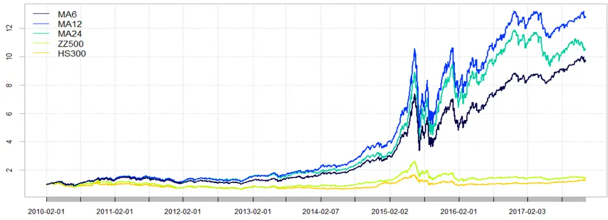
数据来源：渤海证券研究所、Wind

表 2：移动均值模型历史回测统计结果

|  | 年化收益 | 超额收益 | 波动率 | 最大回撤 | 夏普比率 | 胜率 |
| --- | --- | --- | --- | --- | --- | --- |
| MA6 | 35.08% | 32.08% | 30.44% | 54.14% | 0.9786 | 59.75% |
| MA12 | 40.12% | 37.12% | 30.52% | 53.02% | 1.1347 | 60.38% |
| MA24 | 36.62% | 33.62% | 30.67% | 52.68% | 1.0194 | 61.11% |
| ZZ500 | 4.87% | 1.87% | 27.64% | 54.35% | 0.0273 | 56.17% |
| HS300 | 3.00% | 0.00% | 23.78% | 46.70% | -0.0436 | 0.00% |

数据来源：渤海证券研究所、Wind

表 3：移动均值模型年度收益率统计

|  | 2010/12/31 | 2011/12/30 | 2012/12/31 | 2013/12/31 | 2014/12/31 | 2015/12/31 | 2016/12/30 | 2017/11/30 |
| --- | --- | --- | --- | --- | --- | --- | --- | --- |
| MA6 | 36% | -20% | 8% | 38% | 67% | 156% | 22% | 15% |
| MA12 | 40% | -18% | 22% | 44% | 80% | 189% | 19% | 3% |
| MA24 | 36% | -17% | 27% | 31% | 55% | 220% | 19% | -5% |
| ZZ500 | 13% | -34% | 0% | 17% | 39% | 43% | -18% | 0% |
| HS300 | -2% | -25% | 8% | -8% | 52% | 6% | -11% | 21% |

数据来源：渤海证券研究所、Wind

## 2.2 指数加权移动平均法（EWMA）

指数加权移动平均模型（Exponentially Weighted Moving-Average）是移动均值模型的变型。该方法认为因子历史收益率的时间序列存在信息衰减，越近期的数据对于预测值的影响越大。于是在计算时应该赋给近期的数据更大的权重，远期数据更责条款部分7 of 21

请务必阅读正文之后的免

小的权重。具体计算公式如下：

$$
EWMA(t)=\lambda\cdot Y_{t}+(1-\lambda)\cdot EWMA(t-1)
$$

$$
\mathrm{for}\quad\mathrm{t}=1{,}2{,}3{,}\cdots\mathrm{n}
$$

EWMA(t)：t 时刻估计值；

$Y_{t}$ ：t时刻观测值；

λ（0 < λ < 1）：权重系数，λ 越大，近期值占的比重越高。

以 12个月的EWMA序列为例，当λ = 0.05时，假设最新一期因子收益率的系数为1，12 个月前因子收益率的系数为 $\left(1-0.05\right)^{12}=0.56$ ，约为最新一期系数的一半。而当λ = 0.2时，假设最新一期因子收益率系数为 1，12 个月前因子收益率的系数仅为 0.06。衰减十分迅速。

从回测结果可以看出，EWMA 模型的历史表现并没有超越简单均值模型。且随着λ值的上升，模型收益反而下降。推测产生这种情况的原因是，EWMA 模型的背后隐含假设为越近期的数据对下一期收益率的预测能力越强，但是在实际中却不一定如此。因子收益率可能出现短期反转的情形，从而影响了 EWMA模型的预测结果。更详细的讨论请参见本报告第三节。

图 2：指数加权移动平均历史回测图
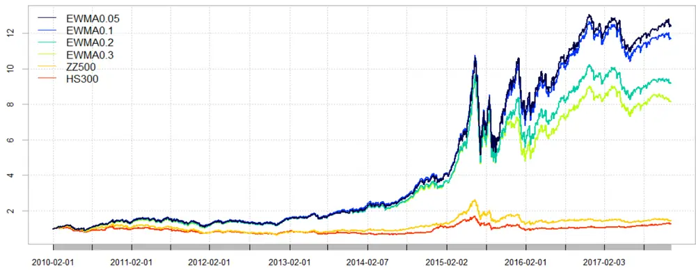
数据来源：渤海证券研究所、Wind

表 4：指数加权移动平均模型统计结果

|  | 年化收益 | 超额收益 | 波动率 | 最大回撤 | 夏普比率 | 胜率 |
| --- | --- | --- | --- | --- | --- | --- |
| EWMA0.05 | 39.58% | 36.58% | 30.50% | 51.69% | 1.1183 | 60.90% |
| EWMA0.1 | 38.47% | 35.47% | 30.62% | 51.55% | 1.0791 | 60.85% |
| EWMA0.2 | 34.08% | 31.08% | 30.78% | 51.35% | 0.9366 | 59.27% |
| EWMA0.3 | 31.98% | 28.98% | 30.64% | 51.27% | 0.8749 | 60.12% |
| ZZ500 | 4.87% | 1.87% | 27.64% | 54.35% | 0.0273 | 56.17% |
| HS300 | 3.00% | 0.00% | 23.78% | 46.70% | -0.0436 | 0.00% |

数据来源：渤海证券研究所、Wind

表 5：指数加权移动平均模型年度收益率统计

|  | 2010/12/31 | 2011/12/30 | 2012/12/31 | 2013/12/31 | 2014/12/31 | 2015/12/31 | 2016/12/30 | 2017/11/30 |
| --- | --- | --- | --- | --- | --- | --- | --- | --- |
| EWMA0.05 | 41% | -19% | 23% | 45% | 80% | 184% | 17% | 2% |
| EWMA0.1 | 42% | -18% | 25% | 47% | 75% | 170% | 18% | -1% |
| EWMA0.2 | 38% | -21% | 27% | 42% | 69% | 147% | 16% | -4% |
| EWMA0.3 | 35% | -21% | 31% | 42% | 66% | 115% | 18% | -3% |
| ZZ500 | 13% | -34% | 0% | 17% | 39% | 43% | -18% | 0% |
| HS300 | -2% | -25% | 8% | -8% | 52% | 6% | -11% | 21% |

数据来源：渤海证券研究所、Wind

## 2.3 基于因子 IC的优化模型

## 2.3.1 因子 IC优化原始模型

基于因子 IC 的优化模型最早出现在关于量化投资的专著 Quantitative EquityPortfolio Management （Qian, Hua and Sorensen） 中。该方法的主要优化对象为因子的信息比率 IR（Information Ratio），而信息比率IR又来自于因子的信息系数IC（Information Coefficient）。

因子的 IC 值定义为横截面上全部股票的因子暴露值与其下期回报率的相关系数，在相关系数的计算时可以选择 Pearson 或者 Spearman 相关系数，这里我们选择了后者，即因子的 Rank IC。因子的信息比率 IR 定义为因子 IC 的均值和因子 IC的标准差的比值。

假设有 M 个因子，其 IC 均值向量为 $\overrightarrow{IC}^{T}=\quad(\overrightarrow{IC}_{1},\quad\overrightarrow{IC}_{2},\quad\cdots,\quad\overrightarrow{IC}_{M})$ ，协方差矩阵为 $\Sigma_{IC}$ ，各因子权重向量为 $\vec{v}^{T}=(v_{1},v_{2},\cdots,v_{M})$ 。则复合因子的 IR 值为

$$
\mathrm{IR}=\frac{\vec{v}^{\prime}\cdot\overrightarrow{IC}}{\sqrt{\vec{v}^{\prime}\cdot\Sigma_{IC}\cdot\vec{v}^{\prime}}}
$$

我们希望找到一组权重，使得当前因子的预测 IR 值最大。通过简单的微积分知识，可以给出该问题的解析解

$$
\vec{v}^{*}=s\Sigma_{IC}^{-1}\overrightarrow{IC}
$$

其中 s为任意正数，可通过赋值使最终的权重之和为1。

该方法得到的权重理论上可以使模型的 IR 值达到最大，即在追求收益率的同时，也尽量减小因子 IC的波动，使模型的因子取值更稳定。

但是通过回测我们发现，该模型选股结果并不十分理想，虽然回测的波动率相比均值模型有了一定下降，但是收益也大幅降低。究其原因，可能是因为在对于因子的协方差矩阵估计准确性存在问题。实际上，协方差矩阵的估计误差与 $\frac{T}{T{-}M{-}2},$ 成正比，其中 T 为样本期个数，M 为因子个数，当样本期长度与因子个数比较接近时，模型估计的误差会非常大。通过回测图也可以发现，当样本期长度从 24个月上升至48 个月时，模型的回测结果也有所上升。这大概就是因为模型协方差矩阵的估计误差减小导致的。

因此，我们需要一种新的方法，减小协方差矩阵的估计误差。于是，我们引入了下一节的压缩矩阵模型。

图 3：因子IC优化原始模型历史回测图
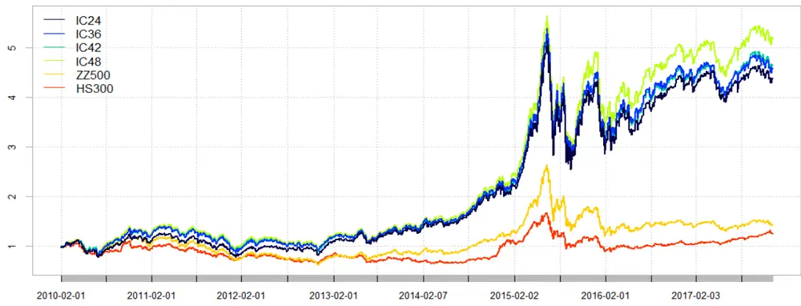
数据来源：渤海证券研究所、Wind

表 6：因子IC优化原始模型统计结果

|  | 年化收益 | 超额收益 | 波动率 | 最大回撤 | 夏普比率 | 胜率 |
| --- | --- | --- | --- | --- | --- | --- |
| IC24 | 21.55% | 18.55% | 29.84% | 50.29% | 0.5625 | 58.80% |
| IC36 | 22.30% | 19.30% | 29.56% | 50.49% | 0.5922 | 59.38% |
| IC42 | 22.56% | 19.56% | 29.85% | 51.07% | 0.5948 | 58.64% |
| IC48 | 24.33% | 21.33% | 29.84% | 51.58% | 0.6519 | 59.59% |
| ZZ500 | 4.87% | 1.87% | 27.64% | 54.35% | 0.0273 | 56.17% |
| HS300 | 3.00% | 0.00% | 23.78% | 46.70% | -0.0436 | 0.00% |

数据来源：渤海证券研究所、Wind

表 7：因子IC优化原始模型年度收益率统计

|  | 2010/12/31 | 2011/12/30 | 2012/12/31 | 2013/12/31 | 2014/12/31 | 2015/12/31 | 2016/12/30 | 2017/11/30 |
| --- | --- | --- | --- | --- | --- | --- | --- | --- |
| IC24 | 15% | -28% | 22% | 33% | 53% | 108% | 0% | 2% |
| IC36 | 27% | -27% | 19% | 27% | 53% | 107% | 0% | 3% |
| IC42 | 26% | -26% | 16% | 26% | 52% | 111% | 0% | 6% |
| IC48 | 30% | -25% | 16% | 27% | 55% | 117% | 0% | 7% |
| ZZ500 | 13% | -34% | 0% | 17% | 39% | 43% | -18% | 0% |
| HS300 | -2% | -25% | 8% | -8% | 52% | 6% | -11% | 21% |

数据来源：渤海证券研究所、Wind

## 2.3.2 因子 IC优化压缩矩阵模型

为了解决协方差矩阵的估计误差问题，Ledoit 和 Wolf 在 2003 年发表的论文中介绍了一种矩阵压缩方法，通过引入一个调和量，大幅减小估计误差。该方法的具体细节比较复杂，在本报告中不做讨论。通过R 语言内嵌的 BurStFin包，我们可以直接使用该方法对协方差矩阵进行矩阵压缩。

通过对下面回测结果的观察可知，使用了压缩矩阵之后，IC 优化模型的收益率大幅上升，同时波动率相比均值模型仍有一定优势。其中 24 个月的模型表现最好，最终年化收益 31%，波动率29.8%，夏普比率（年化无风险利率 4%）为 0.86。

图 4：因子IC优化压缩矩阵模型历史回测图
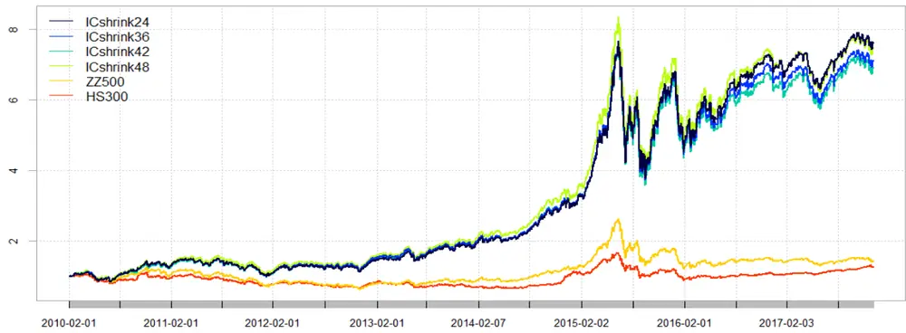
数据来源：渤海证券研究所、Wind

表 8：因子IC优化压缩矩阵模型统计结果

|  | 年化收益 | 超额收益 | 波动率 | 最大回撤 | 夏普比率 | 胜率 |
| --- | --- | --- | --- | --- | --- | --- |
| ICshrink24 | 30.81% | 27.81% | 29.80% | 50.43% | 0.8622 | 59.91% |
| ICshrink36 | 29.61% | 26.61% | 29.86% | 51.25% | 0.8215 | 60.38% |
| ICshrink42 | 29.12% | 26.12% | 29.96% | 52.58% | 0.803 | 60.96% |
| ICshrink48 | 30.46% | 27.46% | 30.03% | 53.26% | 0.8441 | 60.85% |
| ZZ500 | 4.87% | 1.87% | 27.64% | 54.35% | 0.0273 | 56.17% |
| HS300 | 3.00% | 0.00% | 23.78% | 46.70% | -0.0436 | 0.00% |

数据来源：渤海证券研究所、Wind

表 9：因子IC优化压缩矩阵模型年度收益率统计

|  | 2010/12/31 | 2011/12/30 | 2012/12/31 | 2013/12/31 | 2014/12/31 | 2015/12/31 | 2016/12/30 | 2017/11/30 |
| --- | --- | --- | --- | --- | --- | --- | --- | --- |
| ICshrink24 | 34% | -22% | 30% | 39% | 59% | 123% | 3% | 10% |
| ICshrink36 | 34% | -22% | 36% | 38% | 54% | 118% | 0% | 7% |
| ICshrink42 | 31% | -21% | 34% | 40% | 55% | 115% | -1% | 9% |
| ICshrink48 | 36% | -18% | 31% | 40% | 59% | 118% | -1% | 7% |
| ZZ500 | 13% | -34% | 0% | 17% | 39% | 43% | -18% | 0% |
| HS300 | -2% | -25% | 8% | -8% | 52% | 6% | -11% | 21% |

数据来源：渤海证券研究所、Wind

## 2.4 逻辑回归

以上三种模型均是根据线性回归模型建立的。随着机器学习方法的普及，业内渐渐掀起了使用非线性模型代替传统线性回归模型的风潮。本报告中，我们尝试了机器学习分类算法中最简单的一种：逻辑回归。

整合N期截面数据，选取标准化后收益率前20%的标的，标记为 1，收益率后20%的标的，标记为 0，进行逻辑回归。

通过回测结果可知，逻辑回归模型选取的股票在收益率上跑赢了均值模型，但波动率也相应加大，收益率最高的 24 个月回归模型年化收益率 43%，波动率 32.2%，夏普比率（年化无风险利率 4%）为1.16。

图 5：逻辑回归模型历史回测图
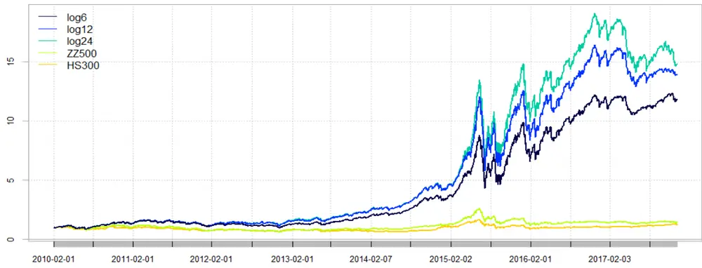
数据来源：渤海证券研究所、Wind

表 10：逻辑回归模型统计结果

|  | 年化收益 | 超额收益 | 波动率 | 最大回撤 | 夏普比率 | 胜率 |
| --- | --- | --- | --- | --- | --- | --- |
| log6 | 38.64% | 35.64% | 31.33% | 51.02% | 1.06 | 60.48% |
| log12 | 41.67% | 38.67% | 31.74% | 51.96% | 1.1381 | 61.01% |
| log24 | 42.85% | 39.85% | 32.20% | 52.93% | 1.1569 | 61.27% |
| ZZ500 | 4.87% | 1.87% | 27.64% | 54.35% | 0.0273 | 56.17% |
| HS300 | 3.00% | 0.00% | 23.78% | 46.70% | -0.0436 | 0.00% |

数据来源：渤海证券研究所、Wind

表 11：逻辑回归模型年度收益率统计

|  | 2010/12/31 | 2011/12/30 | 2012/12/31 | 2013/12/31 | 2014/12/31 | 2015/12/31 | 2016/12/30 | 2017/11/30 |
| --- | --- | --- | --- | --- | --- | --- | --- | --- |
| log6 | 43% | -18% | 2% | 59% | 77% | 193% | 18% | 2% |
| log12 | 41% | -18% | 24% | 62% | 81% | 196% | 24% | -10% |
| log24 | 38% | -17% | 28% | 59% | 79% | 249% | 23% | -18% |
| ZZ500 | 13% | -34% | 0% | 17% | 39% | 43% | -18% | 0% |

请务必阅读正文之后的免责条款部分

| HS300 | -2% | -25% | 8% | -8% | 52% | 6% | -11% | 21% |
| --- | --- | --- | --- | --- | --- | --- | --- | --- |

数据来源：渤海证券研究所、Wind

## 2.5 几种收益预测模型的综合对比

最终，我们选取了在回测中表现较为优秀的三种收益预测模型：12 个月的移动均值模型、24 个月的逻辑回归模型以及 24 个月的因子 IC 优化压缩矩阵模型。横向比较了这三种方法的回测结果，可以发现，逻辑回归模型收益率最高，主要得益于其在牛市中的出色表现，但是该模型波动率也最大，且2017 年以来回撤明显。因子 IC优化压缩矩阵模型波动率最低，收益也最低。移动平均模型则介于二者之间。选择两种指数进行对冲，中证 500 指数的对冲效果优于沪深 300。对冲中证 500指数之后，因子 IC 优化压缩矩阵模型最大回撤仅 7.08%，夏普比率高达 3.2，在三种模型种表现最好。

图 6：模型对比历史回测图
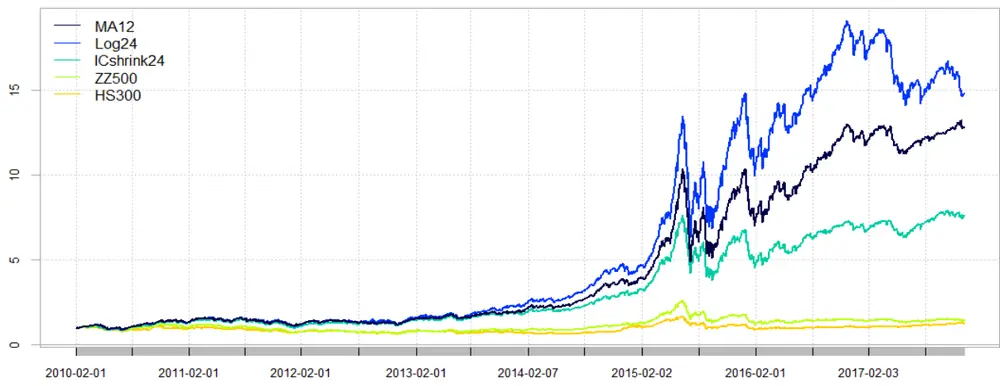
数据来源：渤海证券研究所、Wind

表 12：模型对比统计结果

|  | 年化收益 | 超额收益 | 波动率 | 最大回撤 | 夏普比率 | 胜率 |
| --- | --- | --- | --- | --- | --- | --- |
| MA12 | 40.12% | 37.12% | 30.52% | 53.02% | 1.1347 | 60.38% |
| log24 | 42.85% | 39.85% | 32.20% | 52.93% | 1.1569 | 61.27% |
| ICshrink24 | 30.81% | 27.81% | 29.80% | 50.43% | 0.8622 | 59.91% |
| ZZ500 | 4.87% | 1.87% | 27.64% | 54.35% | 0.0273 | 56.17% |
| HS300 | 3.00% | 0.00% | 23.78% | 46.70% | -0.0436 | 0.00% |

数据来源：渤海证券研究所、Wind

表 13：模型对比年度收益率统计

|  | 2010/12/31 | 2011/12/30 | 2012/12/31 | 2013/12/31 | 2014/12/31 | 2015/12/31 | 2016/12/30 | 2017/11/30 |
| --- | --- | --- | --- | --- | --- | --- | --- | --- |
| MA12 | 40% | -18% | 22% | 44% | 80% | 189% | 19% | 3% |
| log24 | 38% | -17% | 28% | 59% | 79% | 249% | 23% | -18% |
| ICshrink24 | 34% | -22% | 30% | 39% | 59% | 123% | 3% | 10% |
| ZZ500 | 13% | -34% | 0% | 17% | 39% | 43% | -18% | 0% |
| HS300 | -2% | -25% | 8% | -8% | 52% | 6% | -11% | 21% |

数据来源：渤海证券研究所、Wind

图 7：模型对冲中证500指数历史回测图
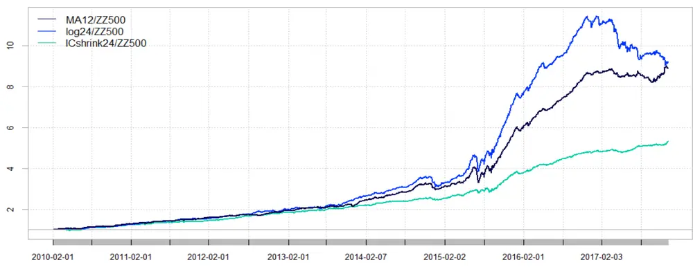
数据来源：渤海证券研究所、Wind

图 8：模型对冲沪深300指数历史回测图
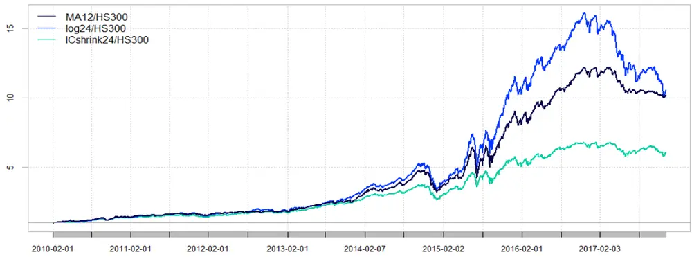
数据来源：渤海证券研究所、Wind

表 14：模型对冲指数对比统计结果

|  | MA12/ZZ500 | log24/ZZ500 | ICshrink24/ZZ500 | MA12/HS300 | log24/HS300 | ICshrink24/HS300 |
| --- | --- | --- | --- | --- | --- | --- |
| 年化收益 | 32.66% | 32.92% | 24.26% | 31.27% | 30.72% | 23.44% |
| 波动率 | 8.72% | 10.02% | 6.05% | 18.78% | 20.93% | 16.56% |
| 最大回撤 | 19.63% | 21.81% | 7.08% | 36.34% | 39.55% | 30.14% |
| 夏普比率 | 3.1492 | 2.7648 | 3.2051 | 1.3907 | 1.223 | 1.1236 |

数据来源：渤海证券研究所、Wind

## 3. 关于回测结果的讨论

下面，让我们来对以上的回测结果，进行一些成因上的讨论。

## 3.1 三种线性回归方法的直观对比

关于三种线性模型回测结果的成因，可通过观察其因子取值做出一些推测。图 7直观的展示了三种线性回归方法在因子赋值上的区别和倾向。其中黑色柱体为市值因子在实验期内的实测值，三条折线分别表示了三种线性回归方法下给出的因子收益率预测值序列。通过观察可知，均值法给出的预测序列较为平滑，且能比较好的反应因子变化的大趋势，但缺点是有一定的滞后性。EWMA 模型对近期因子的变化更为敏感，但这种预测有时在因子收益率震荡剧烈时反而会适得其反。ICshrink 模型和因子收益序列的关系则比较复杂。这大概是EWMA模型表现不如MA 模型的原因之一。

图 9：三种线性回归方法关于size因子的取值对比
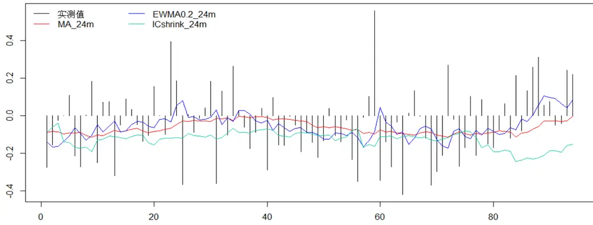

数据来源：渤海证券研究所、Wind

## 3.2 线性回归与逻辑回归对比

逻辑回归法选出的股票池高收益高波动率的背后原因是什么？我们进行了一些分析。下面两幅图展示了逻辑回归法给出的因子权重与移动平均法给出的因子权重对比。可以看出，移动平均法给出因子权重比较分散，变化也相对较为平缓。而逻辑回归给出的因子权重集中在了市值、动量、波动率等少数几个因子上，从历史经验来看，这几个因子也是选股区分度最高的。这也就不难理解为什么逻辑回归模型在牛市中表现如此惊人。但当面对 2017 年风格转换行情时，过去区分度高的因子开始失效，逻辑回归模型从而产生了较大回撤。

图 10：移动平均法（MA12）因子取值分布图
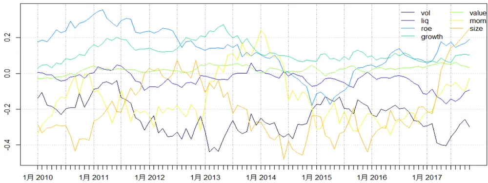
数据来源：渤海证券研究所、Wind

图 11：逻辑回归法（Log12）因子取值分布图
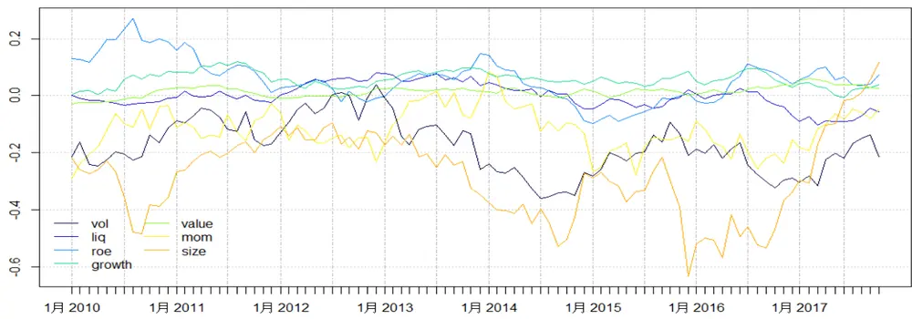
数据来源：渤海证券研究所、Wind

## 4. 总结

在本篇报告中，我们测试了几种常见的收益预测模型。最终，表现较为优秀的三种收益预测模型为：移动均值模型、逻辑回归模型以及因子 IC 优化压缩矩阵模型。通过横向比较这三种方法的回测结果，我们发现，逻辑回归模型收益率最高，波动率也最大。因子 IC 优化压缩矩阵模型波动率最低，收益也最低。移动平均模型则介于二者之间。对冲中证 500 指数之后，因子 IC 优化压缩矩阵模型最大回撤仅7.08%，夏普比率高达3.2，在几种模型种表现最好。

在实际操作中，可根据自身需求，选择适当收益预测模型。我们在未来的研究中，也会继续尝试更多模型（如更多机器学习的模型），以求取得更优异的选股结果。

当然，单纯使用收益预测模型，会带来很高的风险暴露。在正式使用之前，还需要对组合进行风险模型的建立与二次规划，请继续关注我们多因子模型系列报告的下一篇：风险模型的建立。

投资评级说明

| 项目名称 | 投资评级 | 评级说明 |
| --- | --- | --- |
| 公司评级标准 | 买入 | 未来 6 个月内相对沪深 300 指数涨幅超过 20% |
|  | 增持 | 未来6 个月内相对沪深300 指数涨幅介于10%~20%之间 |
|  | 中性 | 未来6个月内相对沪深300指数涨幅介于-10%~10%之间 |
|  | 减持 | 未来6 个月内相对沪深 300 指数跌幅超过10% |
| 行业评级标准 | 看好 | 未来12个月内相对于沪深300 指数涨幅超过 10% |
|  | 中性 | 未来 12个月内相对于沪深 300 指数涨幅介于-10%-10%之间 |
|  | 看淡 | 未来 12个月内相对于沪深300 指数跌幅超过10% |

重要声明：本报告中的信息均来源于已公开的资料，我公司对这些信息的准确性和完整性不作任何保证，不保证该信息未经任何更新，也不保证本公司做出的任何建议不会发生任何变更。在任何情况下，报告中的信息或所表达的意见并不构成所述证券买卖的出价或询价。在任何情况下，我公司不就本报告中的任何内容对任何投资做出任何形式的担保。我公司及其关联机构可能会持有报告中提到的公司所发行的证券并进行交易，还可能为这些公司提供或争取提供投资银行或财务顾问服务。我公司的关联机构或个人可能在本报告公开发表之前已经使用或了解其中的信息。本报告的版权归渤海证券股份有限公司所有，未获得渤海证券股份有限公司事先书面授权，任何人不得对本报告进行任何形式的发布、复制。如引用、刊发，需注明出处为“渤海证券股份有限公司”，也不得对本报告进行有悖原意的删节和修改。

## 渤海证券股份有限公司研究所

## 副所长（金融行业研究＆研究所主持工作）

张继袖

+86 22 2845 1845

## 汽车行业研究小组

郑连声

+86 22 2845 1904

张冬明

+86 22 2845 1857

## 计算机行业研究小组

王洪磊

+86 22 2845 1975

朱晟君

+86 22 2386 1319

## 医药行业研究小组

任宪功（部门经理）

+86 10 6810 4615

+86 22 2845 1632

## 证券行业研究

任宪功（部门经理）+86 10 6810 4615洪程程+86 10 6810 4609

## 金融工程研究＆部门经理

+86 22 2845 1618

## 通信＆电子行业研究小组

刘洋+86 22 2386 1563

徐勇

## 基金研究

综合质控＆部门经理齐艳莉+86 22 2845 1625

+86 10 6810 4602 宋敬祎 
+86 22 2845 1131 杨青海 
+86 10 6810 4686 
李莘泰 
+86 22 2387 3122 
宋旸

## 权益类量化研究

流动性、战略研究＆部门经理
周喜
+86 22 2845 1972

## 策略研究

宋亦威
+86 22 2386 1608杜乃璇
+86 22 2845 1945

## 机构销售•投资顾问

朱艳君+86 22 2845 1995

## 副所长

谢富华

+86 22 2845 1985

## 汽车行业研究小组

郑连声

+86 22 2845 1904

+86 22 2845 1857

## 医药行业研究小组

任宪功（部门经理）
+86 10 6810 4615
王斌
+86 22 2386 1355
赵波
+86 22 2845 1632

## 证券行业研究

任宪功（部门经理）+86 10 6810 4615洪程程+86 10 6810 4609

## 金融工程研究＆部门经理

+86 22 2845 1618

## 基金研究

刘洋+86 22 2386 1563

## 流动性、战略研究＆部门经理

周喜+86 22 2845 1972

综合质控＆部门经理齐艳莉+86 22 2845 1625

## 计算机行业研究小组

王洪磊

+86 22 2845 1975

朱晟君

+86 22 2386 1319

## 通信＆电子行业研究小组

徐勇

+86 10 6810 4602

宋敬祎

+86 22 2845 1131

杨青海

+86 10 6810 4686

## 权益类量化研究

李莘泰
+86 22 2387 3122
宋旸

## 策略研究

宋亦威
+86 22 2386 1608杜乃璇
+86 22 2845 1945

机构销售•投资顾问朱艳君+86 22 2845 1995

## 渤海证券研究所

天津
天津市南开区宾水西道 8号
邮政编码：300381
电话：（022）28451888
传真：（022）28451615

北京

北京市西城区阜外大街 22 号 外经贸大厦 11 层

邮政编码：100037

电话： （010）68784253

传真： （010）68784236

渤海证券研究所网址：www.ewww.com.cn