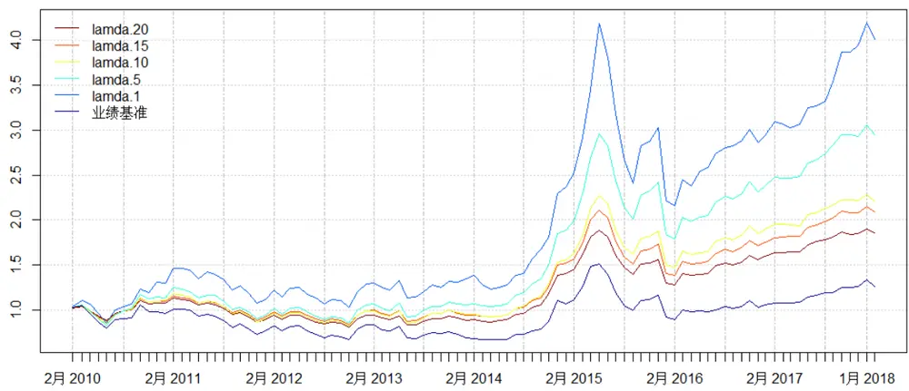
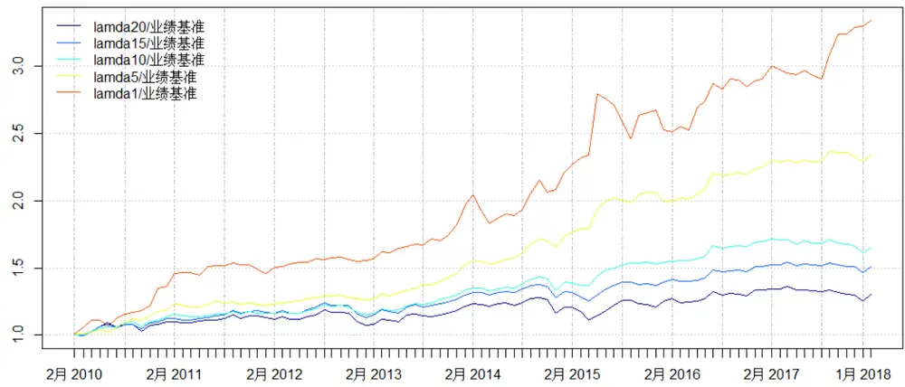
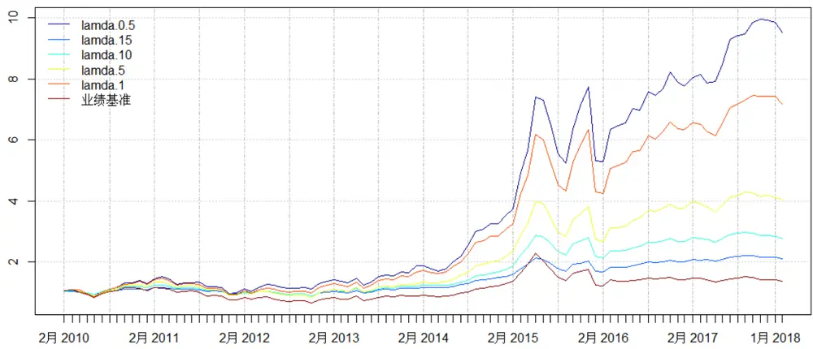
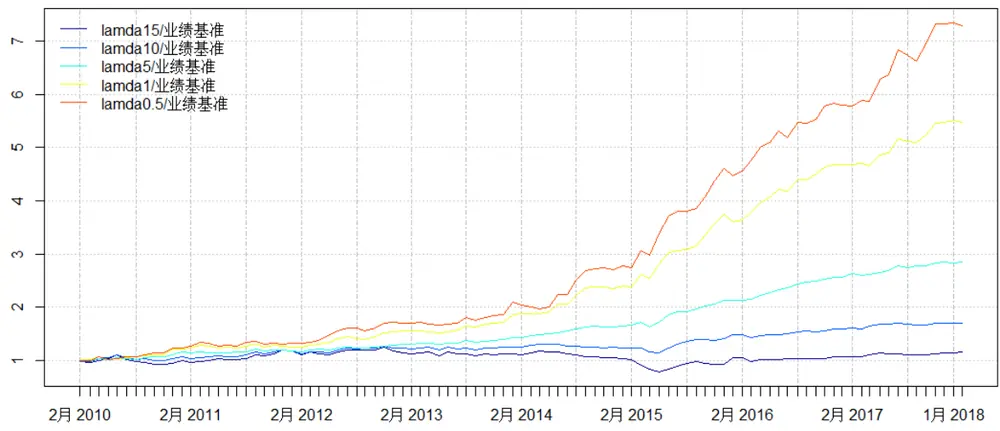
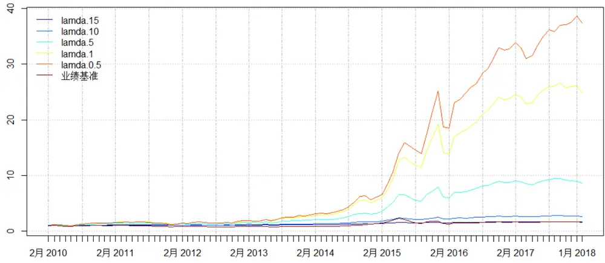
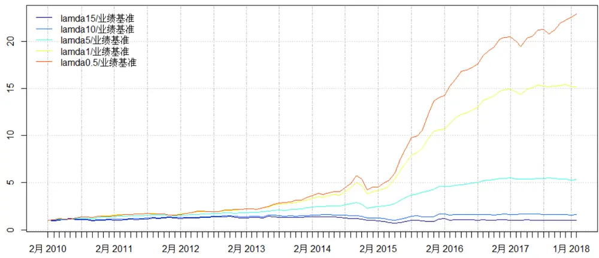
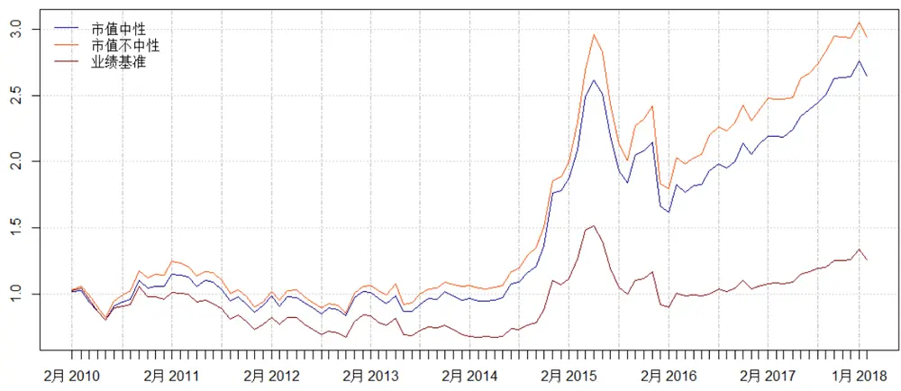
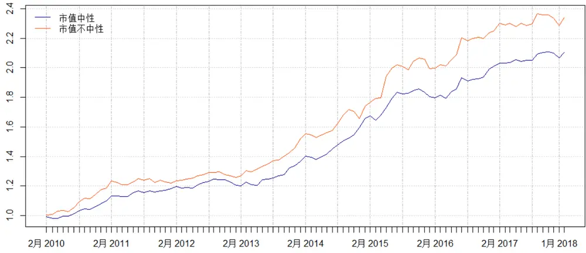

# 多因子模型研究之三：风险模型与组合优化

分析师：宋旸

证券分析师

宋旸

18222076300

songyang@bhzq.com

## 助理分析师

李莘泰

SAC NO：S1150117070006

2018 年 4 月 16 日

022-23873122

lixintai@bhzq.com

## 相关研究报告

《多因子模型研究之一：单因子测试》20171011

《多因子模型研究之二：收益预测模型》20171229

SAC NO：S1150517100002

## 核心观点：

## 内容

1、之前发表的两篇报告中，我们介绍了多因子模型的单因子测试方法和收益预测模型。在本篇报告中，我们首先构建了多因子模型的最后一部分：风险预测模型。并在建立收益模型和风险模型后，综合两个模型的表现结果，对股票配置仓位进行二次优化。

2、风险模型构建的基本思路为，通过估计因子的协方差矩阵，刻画股票池的未来波动。多因子风险模型将个股风险转化为多因子模型的系统性风险以及股票本身的残差风险之和，减少了参数估计的数量和估计误差。

3、我们参考之前选出的7大类12个因子，使用24个月月频数据建立模型，在估计因子协方差矩阵时使用压缩矩阵算法对因子协方差矩阵进行压缩，分别以沪深 300、中证500以及全体 A股作为股票池构建投资组合。沪深300优化组合对冲指数夏普比率 1.78，中证 500优化组合对冲指数夏普比率2.22，全体 A股优化组合对冲指数夏普比率 2.31。

4、通过业绩归因模型，可以衡量投资组合的选股风格，确定投资组合的主要收益来源。以上文选出的沪深 300股票池为例，对投资组合内股票进行业绩归因分析，可以发现模型选出的股票平均来看具有小市值、低估值、高盈利、高成长、低波动率、低换手率、前期涨幅较低的特点。其中市值因子暴露最大，波动率也最大。在市值因子上的过度暴露会在市场风格切换时带来一定风险。

5、通过对因子暴露的控制，可以得到针对特定因子中性的优化模型。我们构建了沪深300成分股针对市值中性的投资组合，进一步降低了组合波动率，提高了对冲业绩基准后的夏普比率。同理，我们还可以构建针对包括行业因子在内的一个或多个因子中性的组合。

6、截至本篇，我们用三篇系列报告，对多因子模型的整体构建流程做了完整的梳理。接下来，我们的研究重点将主要从寻找更为有效的因子、改进现有算法、构建因子择时模型三方面展开。通过引入宏观因素、统计指标、技术指标等多种方法对于原有模型进行进一步优化。结合行业轮动策略与大类资产配置，逐步构建成熟完善的投资策略。

## 1．概述

通过之前发表的两篇报告，我们介绍了多因子模型的单因子测试方法和收益预测模型的构建方法。在单因子测试的报告中，我们对 93 个股票因子进行了显著性检测和分层回测，筛选出 7 大类共 12 个有效因子。在收益预测模型的报告中，我们首先对因子的共线性进行了处理，用因子合成和因子正交的手段将小类因子分别合并，对于合并后的因子建立均值、指数、压缩矩阵和逻辑回归四种收益预测模型，从算法原理上对四种模型的表现与选股风格进行了探讨。

将多因子模型真正运用到投资中时，仅仅使用收益预测模型往往是不够的，因为投资不仅关注收益，同时也关注风险。收益预测模型在选股时可能对于收益波动率较大的因子过分暴露，使最终选出的股票组合蕴含较大风险。所以，我们还需要建立风险预测模型，以控制股票池的整体波动。在建立收益模型和风险模型后，综合两个模型的表现结果，再对投资组合进行整体优化。

组合优化模型可以表现为如下形式，该模型为经典二次优化模型的变体，可以直接求解：

$$
max\quad\alpha^{\prime}w-\frac{1}{2}\lambda w^{\prime}\Sigma w\tag{1}
$$

$$
\begin{array}{rlr}{s.t.}&{{}}&{f_{l}\leq X_{f}\cdot(w-w_{b})\leq f_{w}}\end{array}\tag{2}
$$

$$
h_{l}\leq H\cdot(w-w_{b})\leq h_{u}\tag{3}
$$

$$
0\leq w_{i}\leq k_{i}\tag{4}
$$

$$
\mathbf{1}^{\prime}w=1\tag{5}
$$

其中 $w$ 为待求解的组合权重，（1）为待优化的目标函数，（2）-（6）需满足的条件限制。

1) $\alpha^{\prime}w$ 为收益预测模型给出的组合收益预测， $w^{\prime}\Sigma w$ 为组合风险预测，其中 为后文介绍的风险预测模型给出的个股协方差预测矩阵， 为风险厌恶系数，取值越大，组合越偏向于保守风格；

2) $X_{f}$ 为组合中股票的因子暴露矩阵， $w_{b}$ 为基准指数的股票权重，该条件限制了组合对于每个因子相对于基准指数的风格偏离范围，防止组合选出的股票风格过于雷同（例如有的收益预测模型给出的组合在市值因子上暴露过高，导致组合大中小盘股配比失衡）；

3) 为组合的行业暴露矩阵，当投资目标为行业中性时需要引入该限制条件，以限制组合相对于基准指数行业配置的偏离范围，使组合的行业配比与基准指数一致；

4) 第四个条件限制了每只股票权重的上下限，因为 A股不允许做空，一般个股权重下限设为0，为防止收益过于集中，有时也会对个股权重设定上限；

5) 第五个条件限定权重之和为 1。

## 2．风险预测模型

## 2.1 理论介绍

在组合优化模型的问题表述中，优化目标函数由两个部分组成。第一部分为组合的预测收益，在上一篇报告中，我们介绍了几种收益预测模型来解决该问题。第二部分为组合的预测风险，根据Markowitz组合理论，组合的风险是由组合的收益协方差矩阵决定的，而如何预测下一期组合的收益协方差矩阵就成为了风险预测模型需要解决的核心问题。

风险模型的一种估计方法，是直接选取组合中股票的历史收益率协方差矩阵作为。但由于最终优化问题中要求协方差矩阵可逆，历史收益率需要考虑的时间跨度个数 N 必须大于组合中的股票数量 M。对于全市场几千只股票来说，如果使用月度收益率来计算协方差矩阵，则所需的回溯期 N要超过几千个月，这对于历史相对短暂、市场风格变化迅速的A股来说比较困难。即使改为使用日度因子，需要估计的参数量依然在百万级别，误差过大，回测结果并不理想。

另一种风险模型的估计方法来源于 Barra 模型，它将组合协方差矩阵 分为两个部分：

$$
\Sigma=X_{f}F{X_{f}}^{\prime}+\Delta
$$

其中 $X_{f}$ 为组合中股票的因子暴露矩阵， 为因子收益率之间的协方差矩阵， 为个股残差波动率组成的对角矩阵。

Barra 风险模型将个股的风险转化为可以用多因子模型的系统性风险以及股票本身的残差风险之和。这样做可以大量减少需估计参数的数量，从估计几千支股票的收益协方差矩阵（数量级为 ），变为估计几十个因子收益协方差矩阵以及个股的残差（数量级为 ）。

Barra CSE3文档中对于风险模型做了更精细的处理，包括采用日频数据、使用半衰期赋权、使用 Newey-West算法处理股票日收益率的自相关性等。在本篇报告中，我们将算法进行了一定简化，使用 24个月月频数据建立模型，并在估计因子协方差矩阵时使用压缩矩阵算法对因子协方差矩阵进行压缩，进一步降低估计误差。

## 2.2 风险模型的建立

风险模型中使用的风险因子并不一定要和预测模型中使用的 alpha因子完全相同，不过在大多数时候，二者是一致的。 和 alpha因子相比，风险因子要求在时间序列上的表现更为稳定，相关性更高，同时因子收益波动率尽量大。我们测试了在之前报告中选出的大类因子，发现其自相关性均大于 0.85，因子波动率在 0.2左右，所以在接下来的部分，我们依然使用在之前报告中选出的因子建立风险模型。

表 1：模型入选因子汇总

| 因子大类 | 最终入选因子 |
| --- | --- |
| 估值因子 | 一致预期 ep、行业相对 bp、扣非 ep_ttm |
| 盈利因子 | 单季度 roe |
| 成长因子 | 单季度营业收入增长率、单季度归母净利润增长率 |
| 动量因子 | 指数加权一年收益率 |
| 波动率因子 | 成交量月度波动率 |
| 流动性因子 | 月度换手率、季度换手率、半年换手率 |
| 市值因子 | 流通市值对数 |

数据来源：渤海证券研究所

模型参数与之前报告保持一致：

样本范围：业绩基准内股票（沪深 300、中证 500、全体 A 股），剔除 ST/PT 股票，剔除上市交易不满两年的股票。

回测期：2010年1 月-2018 年2 月，按月提取。

数据清洗：数据对齐、去极值、标准化、缺失值处理（具体方法参见报告《多因子模型研究之一：单因子测试》）。

收益计算：剔除停牌、涨停等不能交易的因素。使用标的月度涨跌幅进行计算。

## 2.3 针对不同基准的优化组合结果

## 2.3.1 针对沪深 300成分股的优化组合结果

首先，我们对沪深 300成分股应用上文介绍的风险预测模型进行组合优化，在优化时不考虑因子中性与行业中性控制。通过回测结果可以发现，随着风险厌恶系数λ的逐渐升高，模型波动率、换手率随之降低，但收益率也同时降低了。当时，对冲沪深 300指数的表现相对最好，年化收益11.09%,波动率6.13%，夏普比率 1.78。

表 2：沪深 300优化模型回测结果

|  | λ=20 | λ=15 | λ=10 | λ=5 | λ=1 | HS300 |
| --- | --- | --- | --- | --- | --- | --- |
| 累计收益 | 85.97% | 109.20% | 120.84% | 194.57% | 300.97% | 25.58% |
| 年化收益 | 7.98% | 9.56% | 10.30% | 14.30% | 18.74% | 2.86% |
| 波动率 | 18.44% | 19.93% | 21.91% | 25.04% | 29.18% | 24.64% |
| 最大回撤 | 31.99% | 34.21% | 35.30% | 39.46% | 48.44% | 40.56% |
| 夏普比率(年化 4%) | 0.42 | 0.47 | 0.46 | 0.56 | 0.63 | 0.11 |
| 换手率 | 3.46 | 3.89 | 4.65 | 6.43 | 9.87 | -- |
| 胜率 | 56.70% | 59.79% | 62.89% | 68.04% | 63.92% | -- |

资料来源：Wind，渤海证券研究所

图 1：沪深 300优化模型回测结果

资料来源：Wind，渤海证券研究所

表 3：沪深 300对冲模型回测结果

|  | λ=20/HS300 | λ=15/HS300 | λ=10/HS300 | λ=5/HS300 | λ=1/HS300 |
| --- | --- | --- | --- | --- | --- |
| 累计收益 | 30.30% | 51.14% | 65.42% | 134.01% | 234.20% |
| 年化收益 | 3.33% | 5.24% | 6.42% | 11.09% | 16.10% |
| 波动率 | 7.82% | 6.54% | 5.95% | 6.13% | 12.12% |
| 最大回撤 | 12.86% | 8.98% | 7.08% | 3.47% | 11.92% |
| 夏普比率(年化 4%) | 0.40 | 0.77 | 1.05 | 1.78 | 1.31 |

资料来源：Wind，渤海证券研究所

图 2：沪深 300对冲模型回测结果

资料来源：Wind，渤海证券研究所

## 2.3.2 针对中证 500成分股的优化组合结果

对中证 500 成分股应用上文介绍的风险预测模型进行组合优化，与沪深 300 相比，中证 500 成分股的波动率明显更大。且风险厌恶系数的降低对于收益率有显著提升。当 时，对冲中证 500 指数的表现相对较好，年化收益 23.43%,波动率 10.47%，夏普比率 2.22。

表 4：中证 500优化模型回测结果

|  | λ=15 | λ=10 | λ=5 | λ=1 | λ=0.5 | ZZ500 |
| --- | --- | --- | --- | --- | --- | --- |
| 累计收益 | 110.91% | 177.22% | 303.59% | 618.39% | 853.82% | 37.70% |
| 年化收益 | 9.67% | 13.44% | 18.84% | 27.63% | 32.18% | 4.04% |
| 波动率 | 15.38% | 20.88% | 27.33% | 31.76% | 33.19% | 27.85% |
| 最大回撤 | 23.66% | 29.94% | 37.06% | 36.45% | 36.23% | 46.32% |
| 夏普比率(年化 4%) | 0.62 | 0.63 | 0.68 | 0.86 | 0.96 | 0.14 |
| 换手率 | 3.65 | 4.99 | 7.20 | 10.56 | 11.60 |  |
| 胜率 | 51.55% | 58.76% | 76.29% | 74.23% | 65.98% |  |

资料来源：Wind，渤海证券研究所

图 3：中证 500优化模型回测结果

资料来源：Wind，渤海证券研究所

表 5：中证 500对冲模型回测结果

|  | λ=15/ZZ500 | λ=10/ZZ500 | λ=5/ZZ500 | λ=1/ZZ500 | λ=0.5/ZZ500 |
| --- | --- | --- | --- | --- | --- |
| 累计收益 | 14.76% | 69.83% | 184.95% | 448.32% | 629.79% |
| 年化收益 | 1.72% | 6.77% | 13.83% | 23.43% | 27.88% |
| 波动率 | 13.23% | 8.97% | 6.38% | 10.47% | 13.70% |
| 最大回撤 | 38.42% | 13.62% | 4.66% | 4.86% | 6.32% |
| 夏普比率(年化 4%) | 0.12 | 0.73 | 2.14 | 2.22 | 2.02 |

资料来源：Wind，渤海证券研究所

图 4：中证 500对冲模型回测结果

资料来源：Wind，渤海证券研究所

## 2.3.3 针对全体 A股的优化组合结果

对全体A股应用上文介绍的风险预测模型进行组合优化，由于全体A股涵盖股票的风格更为丰富，随着风险厌恶系数的变化，优化组合的风格变化也更剧烈。当时，组合对冲Wind全A的表现相对较好，夏普比率为 2.31。但由于市场中目前还不存在适合的对冲工具，在使用针对全体 A股的优化模型时，我们更多的是关注没有对冲的选股结果，根据不同的风险承受能力，构建不同风格的投资组合。

表 6：全市场 A 股优化模型回测结果

|  | λ=15 | λ=10 | λ=5 | λ=1 | λ=0.5 | Wind 全 A |
| --- | --- | --- | --- | --- | --- | --- |
| 累计收益 | 67.01% | 163.99% | 766.35% | 2379.37% | 3636.62% | 62.98% |
| 年化收益 | 6.55% | 12.76% | 30.62% | 48.76% | 56.51% | 6.23% |
| 波动率 | 7.01% | 12.53% | 25.54% | 32.65% | 34.07% | 25.82% |
| 最大回撤 | 8.39% | 12.96% | 24.82% | 28.14% | 27.40% | 44.57% |
| 夏普比率(年化 4%) | 0.91 | 1.00 | 1.19 | 1.49 | 1.65 | 0.23 |
| 换手率 | 4.85 | 5.43 | 8.20 | 11.30 | 12.75 | -- |
| 胜率 | 46.39% | 52.58% | 78.35% | 80.41% | 80.41% | -- |

资料来源：Wind，渤海证券研究所

图 5：全市场 A 股优化模型回测结果

资料来源：Wind，渤海证券研究所

表 7：全市场 A 股对冲模型回测结果

|  | λ=15/全A | λ=10/全A | λ=5/全A | λ=1/全A | λ=0.5/全A |
| --- | --- | --- | --- | --- | --- |
| 累计收益 | -32.01% | 20.15% | 400.96% | 1462.45% | 2232.94% |
| 年化收益 | -4.66% | 2.30% | 22.06% | 40.50% | 47.65% |

请务必阅读正文之后的免责条款部分

| 波动率 | 19.86% | 15.23% | 11.15% | 17.46% | 20.59% |
| --- | --- | --- | --- | --- | --- |
| 最大回撤 | 59.67% | 40.45% | 21.35% | 26.32% | 28.57% |
| 夏普比率(年化 4%) | -0.24 | 0.14 | 1.96 | 2.31 | 2.30 |

资料来源：Wind，渤海证券研究所

图 6：全市场 A 股对冲模型回测结果

资料来源：Wind，渤海证券研究所

## 3．业绩归因模型

业绩归因模型是用来衡量投资组合选股风格的模型。主要通过组合的因子暴露和因子收益来确定投资组合的主要收益来源。

其中因子暴露度的计算公式为:

$$
(w-w_{b})X_{f}^{T}
$$

因子收益的计算公式为：

$$
(w-w_{b})X_{f}^{T}\cdot r_{f}
$$

其中 为组合权重， $X_{f}$ 为组合中股票的因子暴露矩阵， $w_{b}$ 为基准指数的股票权重，$r_{f}$ 为因子收益率。

为例上文选出的λ=5 的沪深 300 股票池为例，对投资组合内股票进行业绩归因分析，结果如下：

表 8：沪深 300优化模型业绩归因结果

|  | 风格 | 因子暴露 | 因子暴露 波动率 | 因子暴露 为正概率 | 因子收益 | 因子收益 波动率 | 因子收益 为正概率 |
| --- | --- | --- | --- | --- | --- | --- | --- |
| 市值 | 小市值 | -0.82 | 0.40 | 3% | 0.01 | 0.48 | 46% |
| 估值 | 低估值 | 0.25 | 0.38 | 81% | 0.19 | 0.19 | 60% |
| 盈利 | 高盈利 | 0.16 | 0.47 | 87% | 0.11 | 0.09 | 61% |
| 成长 | 高成长 | 0.27 | 0.49 | 98% | 0.11 | 0.08 | 65% |
| 波动率 | 低波动率 | -0.38 | 0.33 | 4% | 0.09 | 0.16 | 54% |
| 换手率 | 低换手率 | -0.34 | 0.41 | 4% | 0.07 | 0.15 | 53% |
| 动量 | 前期涨幅较低 | -0.23 | 0.82 | 18% | 0.07 | 0.22 | 51% |

资料来源：Wind，渤海证券研究所

可以看出，模型选出的股票平均来看具有小市值、低估值（估值因子为 bp 和ep，所以暴露为正代表选出的股票为传统意义上的低估值因子）、高盈利、高成长、低波动率、低换手率、前期涨幅较低的特点。在因子暴露上，可以看出该模型在市值因子上的暴露最大，其次为波动率和换手率为代表的交易类因子，再次为以盈利因子和成长因子为代表的基本面因子。所有因子中，市值因子收益波动率最大，且因子收益为正概率 46%，因子收益正负比接近 1：1。说明市值因子存在一定的不稳定性，在该因子上的过度暴露会在市场风格切换时带来一定系统性风险。

## 4．控制因子暴露后的组合优化模型

回顾在第1 节中提到的组合优化模型：

$$
max\quad\alpha^{\prime}w-\frac{1}{2}\lambda w^{\prime}\Sigma w\tag{1}
$$

$$
\begin{array}{rlr}{s.t.}&{{}}&{f_{l}\leq X_{f}\cdot(w-w_{b})\leq f_{w}}\end{array}\tag{2}
$$

$$
h_{l}\leq H\cdot(w-w_{b})\leq h_{u}\tag{3}
$$

$$
0\leq w_{i}\leq k_{i}\tag{4}
$$

$$
1^{\prime}w=1\tag{5}
$$

通过对条件（2）中因子暴露的控制，可以得到针对特定因子中性的优化模型。在上面的业绩归因中，我们发现组合对市值因子的暴露存在一定的不确定性，为控制这种不确定性带来的风险，可构建针对市值中性的投资组合。

使 和 $tf_{u}$ 分别为 、 、 、 、 ，即控制组合关于市值的因子暴露与业绩基准（沪深 300 指数）一致，仅允许 1%至 5%的追踪误差。通过历史回测可以看出，市值中性模型相对于未做市值中性处理的原始模型来讲，收益率有一定降低，换手率降低，对冲业绩基准后的夏普比率有所提高。而对于追踪误差的暴露来说，1%-5%并没有显著变化。

表 9：沪深 300市值中性模型回测结果

|  | 1%暴露 | 2%暴露 | 3%暴露 | 4%暴露 | 5%暴露 | 原始 | 业绩基准 |
| --- | --- | --- | --- | --- | --- | --- | --- |
| 累计收益 | 164.82% | 164.12% | 165.35% | 159.00% | 163.02% | 194.57% | 25.58% |
| 年化收益 | 12.80% | 12.77% | 12.83% | 12.49% | 12.71% | 14.30% | 2.86% |
| 波动率 | 24.97% | 25.01% | 25.00% | 24.94% | 24.87% | 25.04% | 24.64% |
| 最大回撤 | 38.25% | 38.48% | 38.29% | 38.24% | 37.55% | 39.46% | 40.56% |
| 夏普比率(年化 4%) | 0.5 | 0.5 | 0.5 | 0.49 | 0.5 | 0.56 | 0.11 |
| 换手率 | 5.95 | 5.98 | 6.00 | 6.02 | 6.02 | 6.43 | -- |
| 胜率 | 69.07% | 69.07% | 69.07% | 68.04% | 69.07% | 68.04% | -- |

资料来源：Wind，渤海证券研究所

图 7：沪深 300市值中性模型回测结果

资料来源：Wind，渤海证券研究所

表 10：沪深 300 市值中性对冲模型回测结果

|  | 1%暴露/HS300 | 2%暴露/HS300 | 3%暴露/HS300 | 4%暴露/HS300 | 5%暴露/HS300 | 原始/HS300 |
| --- | --- | --- | --- | --- | --- | --- |
| 累计收益 | 110.27% | 109.84% | 110.76% | 105.51% | 108.38% | 134.01% |
| 年化收益 | 9.63% | 9.60% | 9.66% | 9.32% | 9.51% | 11.09% |
| 波动率 | 4.76% | 4.79% | 4.82% | 4.81% | 4.77% | 6.13% |
| 最大回撤 | 3.47% | 3.77% | 3.82% | 3.91% | 3.57% | 3.47% |
| 夏普比率(年化 4%) | 1.9802 | 1.9612 | 1.9599 | 1.8937 | 1.9493 | 1.7757 |

资料来源：Wind，渤海证券研究所

图 8：沪深 300市值中性对冲模型回测结果

资料来源：Wind，渤海证券研究所

对于做过市值中性后的投资组合，再次进行业绩归因（此处以因子暴露为 3%的组合为例），可以发现因子暴露已经大大降低。

表 11：市值中性组合业绩归因结果

|  | 风格 | 因子暴露 | 因子暴露 波动率 | 因子暴露 为正概率 | 因子收益 | 因子收益 波动率 | 因子收益 为正概率 |
| --- | --- | --- | --- | --- | --- | --- | --- |
| 市值 | 小市值 | -0.04 | 0.12 | 10% | -0.02 | 0.03 | 46% |
| 估值 | 低估值 | 0.18 | 0.41 | 97% | 0.16 | 0.16 | 59% |
| 盈利 | 高盈利 | 0.13 | 0.46 | 82% | 0.09 | 0.08 | 63% |
| 成长 | 高成长 | 0.18 | 0.46 | 93% | 0.06 | 0.06 | 62% |
| 波动率 | 低波动率 | -0.35 | 0.41 | 3% | 0.08 | 0.14 | 54% |
| 换手率 | 低换手率 | -0.19 | 0.53 | 10% | 0.04 | 0.11 | 51% |
| 动量 | 前期涨幅较低 | -0.19 | 0.73 | 19% | 0.07 | 0.19 | 47% |

资料来源：Wind，渤海证券研究所

同理，我们还可以构建针对包括行业因子在内的，一个或多个因子中性的组合。但是对于因子暴露过多的控制也可能会损失一部分收益，此处做过市值中性处理的组合的收益对比未做市值中性处理的组合就有了一定下降。组合优化模型的作用，很多时候并不是为了提高投资回报，而是对于投资组合的风格进行更精准的控制，根据不同的投资目标，匹配不同的模型，最终达到预想的投资效果。

## 5．总结与未来研究方向展望

截至本篇，我们用三篇系列报告，对多因子模型的整体构建流程做了完整的梳理。对几种常见的模型构建方法进行了测试，也为后续的一系列研究奠定了基础。接下来，我们的研究重点将主要从三方面展开。

1) 寻找更为有效的因子：目前模型中使用的因子依旧以传统因子为主，现在国内外的研究中，已经开始构建更有效的新因子来代替原有因子。

2) 模型算法的改进：在收益预测模型中，引入机器学习算法，提高模型有效性。

3) 因子择时模型的构造：多因子模型以历史数据为基础，这就导致在市场风格急速转换时，多因子模型的调整会相对较为缓慢，这种滞后性短期有时会带来较大的收益回撤。为了应对这种情况，可以通过引入宏观因素、统计指标、技术指标等多种方法对于原有模型进行进一步优化。还可以结合行业轮动策略与大类资产配置，逐步构建成熟完善的投资策略。

投资评级说明

| 项目名称 | 投资评级 | 评级说明 |
| --- | --- | --- |
| 公司评级标准 | 买入 | 未来 6 个月内相对沪深 300 指数涨幅超过 20% |
|  | 增持 | 未来6 个月内相对沪深 300 指数涨幅介于10%~20%之间 |
|  | 中性 | 未来6个月内相对沪深300指数涨幅介于-10%~10%之间 |
|  | 减持 | 未来6 个月内相对沪深 300 指数跌幅超过 10% |
| 行业评级标准 | 看好 | 未来 12个月内相对于沪深300 指数涨幅超过 10% |
|  | 中性 | 未来12个月内相对于沪深300指数涨幅介于-10%-10%之间 |
|  | 看淡 | 未来 12 个月内相对于沪深 300 指数跌幅超过 10% |

重要声明：本报告中的信息均来源于已公开的资料，我公司对这些信息的准确性和完整性不作任何保证，不保证该信息未经任何更新，也不保证本公司做出的任何建议不会发生任何变更。在任何情况下，报告中的信息或所表达的意见并不构成所述证券买卖的出价或询价。在任何情况下，我公司不就本报告中的任何内容对任何投资做出任何形式的担保，投资者自主作出投资决策并自行承担投资风险。我公司及其关联机构可能会持有报告中提到的公司所发行的证券并进行交易，还可能为这些公司提供或争取提供投资银行或财务顾问服务。我公司的关联机构或个人可能在本报告公开发表之前已经使用或了解其中的信息。本报告的版权归渤海证券股份有限公司所有，未获得渤海证券股份有限公司事先书面授权，任何人不得对本报告进行任何形式的发布、复制。如引用、刊发，需注明出处为“渤海证券股份有限公司”，也不得对本报告进行有悖原意的删节和修改。

## 渤海证券股份有限公司研究所

## 副所长（金融行业研究＆研究所主持工作）

张继袖

+86 22 2845 1845

## 汽车行业研究小组

郑连声

+86 22 2845 1904

张冬明

+86 22 2845 1857

## 医药行业研究小组

任宪功（部门经理）

+86 10 6810 4615 王斌 
+86 22 2386 1355 赵波 
+86 22 2845 1632

## 证券行业研究

任宪功（部门经理）+86 10 6810 4615洪程程+86 10 6810 4609

## 金融工程研究＆部门经理

崔健+86 22 2845 1618

## 基金研究

刘洋+86 22 2386 1563

流动性、战略研究＆部门经理
周喜
+86 22 2845 1972

## 综合质控＆部门经理

齐艳莉 +86 22 2845 1625

## 计算机行业研究小组

王洪磊

+86 22 2845 1975

朱晟君

+86 22 2386 1319

## 通信＆电子行业研究小组

+86 10 6810 4602 宋敬祎 
+86 22 2845 1131 杨青海 
+86 10 6810 4686

## 权益类量化研究

李莘泰
+86 22 2387 3122
宋旸

## 策略研究

宋亦威
+86 22 2386 1608杜乃璇
+86 22 2845 1945

## 机构销售•投资顾问

朱艳君+86 22 2845 1995

## 副所长

谢富华+86 22 2845 1985

## 环保行业研究

张敬华
+86 10 6810 4651刘蕾
+86 10 6810 4662

## 新材料行业研究

张敬华+86 10 6810 4651

## 衍生品类研究

祝涛 
+86 22 2845 1653 李元玮 
+86 22 2387 3121 郝倞 
+86 22 2386 1600 
行政综合 
白骐玮 
+86 22 2845 1659

## 电力设备与新能源行业研究

刘瑀

+86 22 2386 1670

刘秀峰

+86 10 6810 4658

## 餐饮旅游行业研究

刘瑀 刘瑀

+86 22 2386 1670 杨旭 +86 22 2845 1879

## 债券研究顶券研元

王琛皞
+86 22 2845 1802
冯振
+86 22 2845 1605
夏捷
博士后工作站
朱林宁 量化•套期保值模型研
究
+86 22 2387 3123

## 渤海证券研究所

天津

天津市南开区宾水西道 8 号

邮政编码：300381

电话：（022）28451888

传真：（022）28451615

北京

北京市西城区西直门外大街甲 143号 凯旋大厦A座 2层

邮政编码：100086

电话： （010）68104192

传真： （010）68104192

渤海证券研究所网址：www.ewww.com.cn