# 随机森林与传统多因子模型的选股风格对比

# ——多因子模型研究系列之四

分析师：宋旸

2018 年 7 月 26 日

证券分析师

宋旸

022-28451131

18222076300

songyang@bhzq.com

## 相关研究报告

《多因子模型研究之一：单因子测试》20171011

《多因子模型研究之二：收益预测模型》20171229

《多因子模型研究之三：风险 模 型 与 组 合 优 化 》20180416

《使用随机森林算法的行业轮动模型——行业轮动专题一》20180708

SAC NO：S1150517100002

## 核心观点：

## 模型建立方法：

本篇报告中，我们分别使用机器学习中的随机森林算法与传统的线性回归方法，针对沪深 300 成分股、中证 500 成分股与全体 A 股构建多因子选股模型，比较二者的历史表现。同时针对两类模型选出的股票池，运用业绩归因方法来探寻两个模型在选股上的风格异同，通过对比组合的因子暴露和因子收益来确定两种选股结果的主要收益来源。

随机森林多因子模型构建方法：每个月月末截面期，选取下个月收益排名前30%的股票作为正例，后 30%的股票作为负例。将当前月份前 12个月的样本合并形成训练集。使用训练集训练随机森林模型，预测下一月个股涨跌概率，选取上涨概率最高的 50支股票组成股票池。

传统多因子模型构建构建方法：采用估值、盈利、成长、动量、反转、波动率、流动性、市值八大类因子建立线性回归模型，采用 12 个月的移动平均方法预测因子未来收益。

## 回测结果总结：

在各个样本池中，随机森林模型的表现相比于传统多因子模型均有一定程度的提升，尤其是在相比业绩基准的月度胜率上的提升十分显著。这说明随机森林模型相比传统多因子模型具有更强的灵活性，可以更快的把握市场风格的转变。

在业绩归因模型中，传统多因子模型在大部分因子暴露上的波动率均明显大于随机森林模型。这说明在不加限制的情况下，传统多因子模型的选股风格可能会更加极端化。

通过对于不同样本范围内选股结果的分析，可以发现，股票池中的小市值股票越多（全 A>中证 500>沪深 300），模型选股结果的因子波动性越大，同时在市值因子的暴露也逐步上升。对市值因子的依赖是多因子模型一直面临的问题，在实际应用中，我们推荐对于市值因子做一定的风险敞口控制，以防止因子失效带来的大幅回撤风险。

## 风险提示：

随着市场环境变化，模型存在失效风险。

## 1．概述

长久以来，多因子模型都是在量化选股中最常用的模型之一，该模型通过探寻因子和股票收益率之间的统计关系，预测股票未来的收益，从中选择优质标的。传统的多因子模型假设标的未来收益与因子间存在线性关系，通过截面线性回归构建模型。历史上，该模型在中国 A股市场中取得了较好的效果。2017年以来，A股市场风格经历了较大转变，传统多因子模型的表现较之前有了一定的回撤。于是寻找更及时、更高效的收益预测算法成了多因子模型研究中亟需解决的问题。

随机森林算法是机器学习算法的一种。相比于其他机器学习算法和传统线性回归模型，随机森林算法具有直观，参数少，抗干扰，不易出现过拟合等优点。在之前的报告中，我们使用随机森林算法建立的针对行业指数的择时模型，取得了较好的择时结果。在本篇报告中，我们将随机森林算法引入多因子模型，使模型更灵活更稳定，回测取得了较好的结果。关于随机森林算法的介绍，请参见报告《使用随机森林算法的行业轮动模型——行业轮动专题一》

图 1：随机森林算法示意图
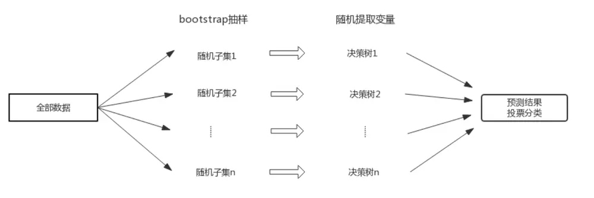
资料来源：Wind，渤海证券研究所

## 2．随机森林多因子模型的建立与运行结果

## 2.1 因子提取

随机森林模型与传统线性回归模型不同，因子不需要规避多重共线性限制，可以尽量多的考虑各种有效因子。因子的选择上，我们具体测试了估值、盈利、成长、动量、波动率、流动性、市值、反转八大类共 91 个小因子，并在测试名单中涵盖了Barra CNE5 手册中的大部分因子，具体因子定义见下表：

表 1：因子定义

| 大类因子 | 小类因子 | 因子解释 |
| --- | --- | --- |
| 反转 | RSTR_barra | Barra 因子；Σt=l wt[ln (1 + rt)]，L=21，T=500，半衰期 120日 |
|  | RSTR_m24 | Σt= wt[ln (1 + rt)]，L=1，T=240，半衰期 120日 |
|  | RSTR_m12 | Σt+ wt[ln (1 + rt)],L=1, T=240，半衰期 60日 |
|  | RSTR_m6 | Σt= wt[ln (1 + rt)]，L=1，T=120，半衰期 30日 |
|  | RSTR_m3 | Σt=l wt[ln (1 + rt)]，L=1，T=60，半衰期 15日 |
|  | RSTR_m1 | Σt=l wt[ln (1 + rt)]，L=1，T=20，半衰期 5 日 |
|  | RS_1 | 最新收盘价/21个交易日前收盘价 |
| 动量 | RS_3 | 最新收盘价/63个交易日前收盘价 |
|  | RS_6 | 最新收盘价/126个交易日前收盘价 |
|  | RS_12 | 最新收盘价/252个交易日前收盘价 |
|  | Alpha | alpha系数；个股收益率序列与沪深300指数收益率序列以半衰期指数加权， 得到 alpha 系数，半衰期为 60 日 |
|  | Size | 总市值 |
| 市值 |  | Barra因子；中等市值；将总市值的对数与总市值立方的对数回归得到残差，再 |
|  | non-linear-size | 对残差做标准化处理 |
|  | marketcap | 流通市值 |
|  | STOM | 月度平均换手率；最近一个月的交易量/流通股数 |
|  | STOQ | 季度平均换手率；最近一季度的交易量/流通股数 |
|  | STOS | 半年平均换手率；最近半年的交易量/流通股数 |
|  | STOA | 年度平均换手率；最近一年的交易量/流通股数 |
|  | STOM_barra | Barra 因子；公式： $\begin{array}{r}{\ln\left(\sum_{t=1}^{21}\frac{V_{t}}{S_{t}}\right)}\end{array}$ ，Vt为t日成交金额， $S_{t}$ 为t日流动市值 |
|  | STOQ_barra | Barra 因子；公式：ln $\scriptstyle[{\frac{1}{T}}\sum_{t=1}^{T}\exp{(STOM_{t})}]$ ，T=63 个交易日 |
|  | STOA_barra | Barra 因子；公式：In $\scriptstyle[{\frac{1}{T}}\sum_{t=1}^{T}\exp{(STOM_{t})}]$ ，T=244 个个交易日 |
| 流动性 | Ins | 机构持股比例；机构持股变动/总股本 |
|  | ins_c | 机构持股比例变动 |
|  | MSM | 一个月换手率变动；最近1个月换手率/最近1年换手率 |
|  | MSQ | 季度换手率变动；最近3个月换收益率/最近1年换手率 |
|  | MSS | 半年换手率变动；最近6个月换收益率/最近1年换手率 |
|  | DASTD | Barra因子；年度平均波动率；累计日波动率以半衰期指数加权，半衰期为40 |
|  |  | 日 |
| 波动率 | CMRA | Barra 因子；年度收益率波动 |
|  | HSIGMA | Barra 因子；sigma:个股收益率序列与沪深 300 指数收益率序列以半衰期指数 |

请务必阅读正文之后的免责条款部分

| Beta | Barra因子；贝塔系数；个股收益率序列与沪深300指数收益率序列以半衰期 指数加权，得到 beta系数，半衰期为 60日 |
| --- | --- |
| yieldvol_1 | 月度日收益率波动率；一个月日收益率标准差 |
| yieldvol_3 | 季度日收益率波动率；三个月日收益率标准差 |
| yieldvol_6 high_low_1 | 半年日收益率波动率；半年日收益率标准差 |
| high_low_3 | 月度股价波动；最高价/最低价（最近一个月内价格） 季度股价波动；最高价/最低价（近三个月内价格） |
| high_low_6 | 半年股价波动；最高价/最低价（近六个月内价格） |
| high_low_12 |  |
| VOL_1 | 全年股价波动；最高价/最低价（近十二个月内价格） 成交量月度波动率；1月波动率标准差 |
| VOL_3 | 成交量季度波动率；3月波动率标准差 |
| VOL_6 |  |
| VOL_12 | 成交量半年波动率；6月波动率标准差 |
| growth_ttm_or | 成交量年度波动率；12月波动率标准差 营业收入ttm一年增长率 |
| growth_ttm_profit | 净利润 ttm一年增长率 |
| qfa_yoysales_qq | 单季度营业收入一年增长率 |
| qfa_yoynetprofit_qq | 单季度归母净利润一年增长率 |
| qfa_yoyocf_qq | 单季度经营性现金流一年增长率 |
| qfa_yoyprofit_qq | 单季度净利润一年增长率 |
| qfa_roe_qq | 单季度 roe 一年增长率 |
| yoy_profit_qq | 净利润一年增长率 |
| yoy_growth_netprofit_q |  |
| q | 归母净利润一年增长率 |
| yoy_or_qq | 营业收入一年增长率 |
| yoyroe_qq | roe一年增长率 |
| yoyocf_qq | 经营性现金流一年增长率 |
| growth_roe_qq_3 | roe 三年增长率 |
| growth_netprofit_qq_3 | 归母净利润三年增长率 |
| growth_or_qq_3 | 营业收入三年增长率 |
| growth_profit_qq_3 | 净利润三年增长率 |
| growth_ocf_qq_3 | 经营性现金流三年增长率 |
| growth_profit_qq_5 | 净利润五年增长率 |
| growth_ocf_qq_5 | 经营性现金流五年增长率 |
| growth_roe_qq_5 | roe 五年增长率 |
| SGRO | Barra因子；过去5年企业营业收入复合增长率 |
| EGRO_5 | Barra因子；过去5年企业归属母公司净利润复合增长率 |
| EGIB | Barra 因子；未来3年企业一致预期净利润增长率 |
| EGIB_S | Barra因子；未来1年企业一致预期净利润增长率 |
| CETOP | Barra因子：个股现金收益比股票价格 |
| roe_q | 当季净资产收益率 |
| roe_ttm | 滚动 ROE |
| roa_q | 当季资产收益率、资产回报率 |
| roa_ttm | 滚动 ROA |
| qfa_grossprofitmargin | 当季毛利率 |
| grossprofitmargin_ttm | 滚动毛利率 |
| profitmargin_q | 当季扣非后利润率 |
| profitmargin_ttm | 滚动扣非后利润率 |
| assetsturn_q | 当季资产周转率 |
| assetturn_ttm operationcashflowratio_ | 滚动资产周转率 |
| q | 当季经营活动现金净流比率 |
| operationcashflowratio_ ttm | 滚动经营活动现金净流比率 |
| ROIC | 投入资本回报率 |
| EBIT2EV | 投资收益率；息税前利润/投入资本 |
| 盈利 CASHROIC | 现金 ROIC |
| FreeCashflowYield | 自由现金流比率；经营性活动产生的净现金流-构建其他长期资产支付的现金/ 总市值 |
| sales2EV | 营业收益率；营业收入_TTM/总市值+非流动负债 |
| cashflow1 | 经营活动净现金流/总市值 |
| cashflow2 | 经营活动净现金流/营业收入 |
| cashflow3 | 经营活动净现金流/营业收入净收益 |
| invturn_qq | 存货周转率；存货成本/平均存货余额 |
| arturn_qq | 应收账款周转率；当期销售净收入/平均应收账款 |
| faturn_qq | 固定资产周转率；销售收入/平均固定资产 |
| assetturnover_ttm | 滚动总资产周转率；营业收入ttm/[(期初资产总额+期末资产总额)/2] |
| assetsturn_qq | 总资产周转率；营业总收入/[(期初资产总额+期末资产总额)/2] |
| longdebttoworkingcapit |  |
| al_qq | 长期债务与营运资金比率；长期债务/营运资本 |
| finaexpensetogr_qq | 财务费用比率；财务费用/主营业务收入 |
| gctogr_qq | 营业费用比率；营业费用/主营业务收入 |
| ETOP | Barra因子；历史EP值；利用过去12个月个股净利润除以当前市值。 |
| BTOP 价值 | Barra因子；历史BP值；普通股权益价值/市值 |
| epcut | 市盈率（扣除非经营性损益部分，即公司经营性盈利与市值之比值） |
| bp_If | 最近公告日 BP |
| ncfp | 净现金市值比；净现金流/总市值 |
| ocfp | 营业现金流比率；经营性现金流/总市值 |
| dividendyield | 股息率；过去一年分红/总市值 |
| stop1 stop2 | 营收市值比，市销率PS（TTM）倒数 |
| ep_rel | 营收市值比，市销率PS（LYR）倒数 |
| bp_rel | 相对 PE；PE/行业 PE |
| PEG | 相对 PB；PB/行业 PB |
| EPIBS | 市盈率相对盈利增长比率 |
|  | Barra 因子；预期 EP值 |

资料来源：渤海证券研究所、The Barra China Equity Model (CNE5)

## 2.2 数据前期处理

提取的因子数据需经过数据对齐、去极值、标准化、缺失值处理等步骤，才可进入下一步的选股模型。

数据对齐：上市公司财报的报告期和报告发布日期之间有一定延迟，为避免未来信息，在提取数据的时候，需要对日期进行修正，保证因子数据为当时能获取的最新财报数据。

去极值：为避免数据中的极端值对回归结果产生过多影响，我们使用“中位数去极值法”，将超过上下限的极端值用上下限值代替。

$$
\begin{aligned}\tilde{\mathbf{x}}_{\mathbf{i}}=&\left\{\begin{aligned}\mathbf{x}_{\mathbf{M}}+&5\times\mathbf{x}_{\mathbf{M}\mathbf{A}\mathbf{D}},\mathbf{x}_{\mathbf{i}}>\mathbf{x}_{\mathbf{M}}+5\times\mathbf{x}_{\mathbf{M}\mathbf{A}\mathbf{D}}\\\mathbf{x}_{\mathbf{i}},\mathbf{x}_{\mathbf{M}}-&5\times\mathbf{x}_{\mathbf{M}\mathbf{A}\mathbf{D}}\leq\mathbf{x}_{\mathbf{i}}\leq\mathbf{x}_{\mathbf{M}}+5\times\mathbf{x}_{\mathbf{M}\mathbf{A}\mathbf{D}}\\\mathbf{x}_{\mathbf{M}}-&5\times\mathbf{x}_{\mathbf{M}\mathbf{A}\mathbf{D}},\mathbf{x}_{\mathbf{i}}<\mathbf{x}_{\mathbf{M}}-5\times\mathbf{x}_{\mathbf{M}\mathbf{A}\mathbf{D}}\end{aligned}\right.\end{aligned}
$$

：原始序列

：序列 的中位数

： 序列 的中位数

：去极值处理后的新序列

缺失值处理：提取出的因子可能会因为技术原因等情况出现缺失值，将缺失值设

为申万一级行业个股当期因子的中位数。

标准化：由于各个因子的单位不同，为了使其具有可比性，需要对其进行ZScore标准化处理，即减去序列均值除以序列标准差，使因子序列近似成为一个符合N(0,1)正态分布的序列。

行业市值中性化：将最后得到的因子序列对流动市值与行业哑变量做线性回归，取残差作为新的因子值。

## 2.3 模型建立

样本范围：本篇报告中，我们针对三类样本做了回测，分别为沪深 300 成分股、中证 500 成分股以及全体 A 股。回测标的中剔除 ST/PT 股票，剔除上市交易不满两年的股票。

样本期：2010年1月-2018 年6 月，按月提取。

训练集合成：每个月月末截面期，选取下个月收益排名前 30%的股票作为正例（y=1），后30%的股票作为负例（y=0）。将当前月份前12 个月的样本合并形成训练集。使用训练集训练随机森林模型，预测下一月个股涨跌概率。

模型建立方法：每月选取N 只股票组成股票池（N=50），等权配置。回测中已剔除停牌、涨停等不能交易的因素。

对比传统多因子模型：为了更好的展示随机森林多因子模型的选股效果，我们同时使用传统多因子模型在同样的时间段进行选股，与随机森林模型选股结果进行对比。传统多因子模型采用估值、盈利、成长、动量、反转、波动率、流动性、市值八大类因子建立线性模型，采用12个月的移动平均方法预测因子未来收益。传统多因子模型具体建立方法可参照之前发表的报告《多因子模型研究之二：收益预测模型》中的移动均值模型。

业绩归因模型：为了具体对比两个模型在选股上的风格异同，我们针对两类模型历史上选出的股票池，运行业绩归因模型。业绩归因模型中的因子沿用了传统多因子模型的八大类因子。

业绩归因模型是用来衡量投资组合选股风格的模型。主要通过组合的因子暴露和因子收益来确定投资组合的主要收益来源。

其中因子暴露度的计算公式为:

$$
(w-w_{b})X_{f}^{T}
$$

因子收益的计算公式为：

$$
(w-w_{b})X_{f}^{T}\cdot r_{f}
$$

其中 为组合权重， $X_{f}$ 为组合中股票的因子暴露矩阵， $w_{b}$ 为基准指数的股票权重，$r_{f}$ 为因子收益率。

通过业绩归因模型，我们可以看出模型选股在不同因子上的暴露与收益，从而解读模型选股风格。

## 3．回测结果

## 3.1 针对沪深 300的选股模型

通过统计针对沪深 300 的回测结果，可以看出，使用了随机森林多因子模型后，模型的收益和胜率相对传统多因子模型均有所提升，年化收益提升 1.75%，相对沪深 300月度胜率提升5%。

表 2：沪深 300选股模型历史回测结果

|  | 累计收益 | 年化收益 | 波动率 | 最大回撤 | 夏普比率 | 胜率 | 换手率 |
| --- | --- | --- | --- | --- | --- | --- | --- |
| MA | 40.30% | 4.11% | 24.50% | 45.80% | 16.76% | 54.46% | 5.00 |
| RandomForest | 61.44% | 5.86% | 26.03% | 49.78% | 22.49% | 59.41% | 6.82 |
| HS300 | 9.58% | 1.09% | 24.38% | 40.56% | 4.48% | -- | -- |

数据来源：渤海证券研究所、Wind

分年度对比两个选股模型的历史收益，可以看到2010 年至 2012年和2016年至2018 年，随机森林模型表现略逊与传统多因子模型，2013 年至 2015 年，随机森林模型表现超越传统多因子模型。

表 3：沪深 300选股模型历史分年度收益统计结果

|  | 2010 | 2011 | 2012 | 2013 | 2014 | 2015 | 2016 | 2017 | 2018 |
| --- | --- | --- | --- | --- | --- | --- | --- | --- | --- |
| MA | 10.7% | -29.4% | 0.1% | -6.6% | 33.8% | 17.5% | -0.9% | 27.6% | -3.4% |
| RandomForest | 2.5% | -34.1% | 1.4% | 4.2% | 64.3% | 21.0% | -5.3% | 27.1% | -5.5% |
| HS300 | -2.4% | -25.0% | 7.6% | -7.6% | 51.7% | 5.6% | -11.3% | 21.8% | -12.9% |

数据来源：渤海证券研究所、Wind

从图中也可以看出，随机森林模型相对传统多因子模型的收益主要来自 2014 年市场风格转换期间，随机森林模型相对传统多因子模型更快的把握住了市场风格的切换，从而取得了超越指数的收益。

图 2：沪深 300选股模型回测收益曲线
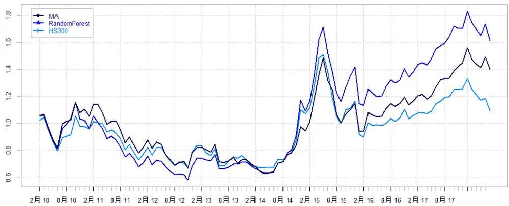
资料来源：Wind，渤海证券研究所

图 3：沪深 300选股模型对冲基准回测收益曲线
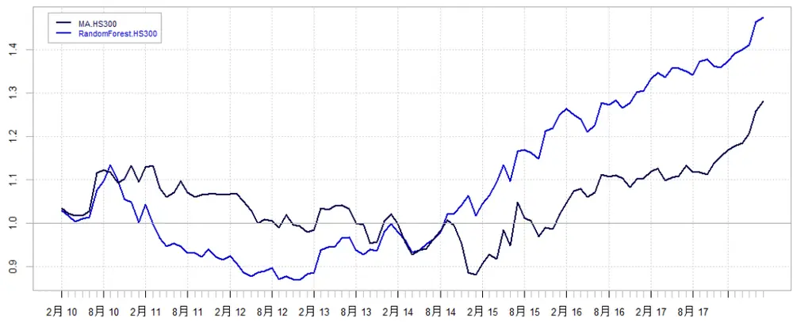
资料来源：Wind，渤海证券研究所

通过业绩归因模型，我们考察了两类选股模型在不同因子上的风格暴露，可以发现传统多因子模型在因子暴露上的波动率明显大于随机森林模型，几乎为随机森林的一倍。在因子收益方面，传统多因子模型的收益主要来自于市值与估值因子，而随机森林模型的收益来源则相对更为平均。这说明在不加限制的情况下，传统多因子模型选股风格可能会更加极端化。

表 4：沪深 300选股模型因子统计结果

|  | 市值 | 盈利 | 反转 | 动量 | 成长 | 流动性 | 波动率 | 估值 |
| --- | --- | --- | --- | --- | --- | --- | --- | --- |
| MA 因子均值 | 0.032 | 0.301 | -0.388 | 0.005 | 0.488 | -0.295 | -0.078 | 0.357 |
| MA 因子波动 | 2.023 | 1.603 | 1.262 | 1.899 | 1.984 | 1.309 | 0.487 | 1.423 |
| MA 因子收益 | 0.169 | 0.090 | 0.092 | -0.025 | 0.037 | 0.143 | 0.007 | 0.260 |
| RF因子均值 | 0.203 | 0.136 | 0.105 | 0.175 | 0.161 | -0.110 | -0.068 | 0.236 |
| RF因子波动 | 1.010 | 0.731 | 0.812 | 0.949 | 1.058 | 0.670 | 0.384 | 0.723 |
| RF因子收益 | 0.062 | 0.027 | -0.095 | 0.143 | 0.028 | 0.049 | 0.024 | 0.205 |

资料来源：Wind，渤海证券研究所

接下来，我们详细考察了两类模型在各个因子上因子暴露时间序列。可以看出随机森林模型与传统多因子模型在市值、成长、盈利、估值、流动性、波动率因子上选股风格较为一致，传统多因子模型因子暴露绝对值普遍较高。针对动量（过去一年/近一月个股涨跌幅）与反转因子（近一月个股涨跌幅），两个模型的判断出现了一定分歧，结合上表，随机森林模型在反转因子上的因子收益为负，传统多因子模型在动量因子上的因子收益为负，可以看出随机森林模型更擅长针对反转因子这种较为短期的因子做判断，传统多因子模型更擅长针对动量因子这种更长期的因子做判断。

图 4: 沪深 300选股模型市值因子历史暴露
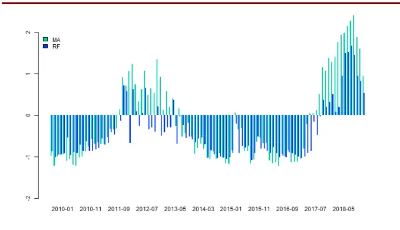
数据来源：Wind、渤海证券研究所

图 5：沪深 300选股模型成长因子历史暴露
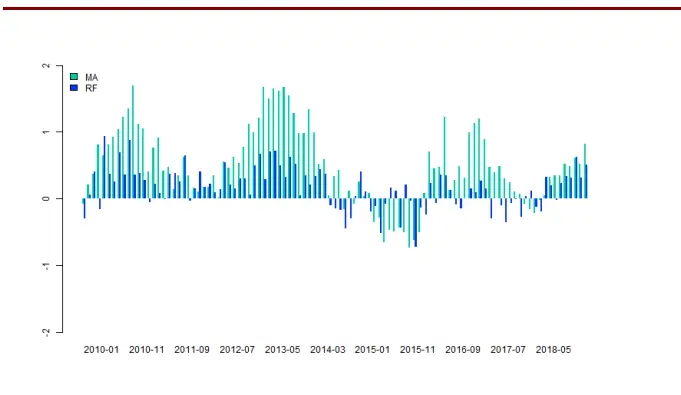
数据来源：Wind、渤海证券研究所

图 6: 沪深 300选股模型盈利因子历史暴露

图 7：沪深 300选股模型估值因子历史暴露

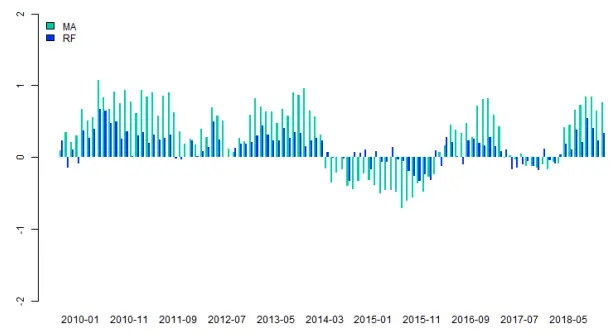
数据来源：Wind、渤海证券研究所

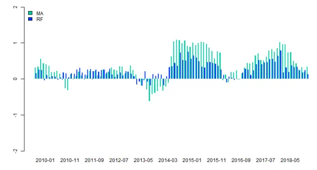
数据来源：Wind、渤海证券研究所

图 8: 沪深 300选股模型动量因子历史暴露
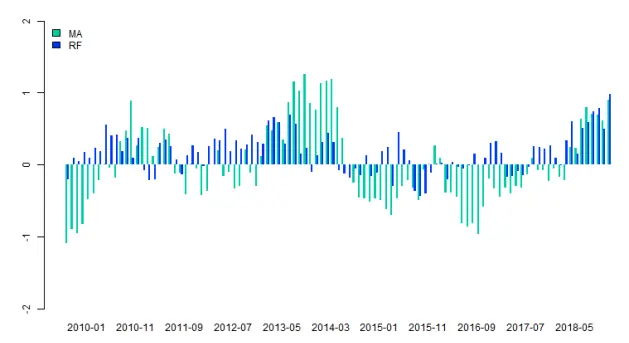
数据来源：Wind、渤海证券研究所

图 9：沪深 300选股模型反转因子历史暴露
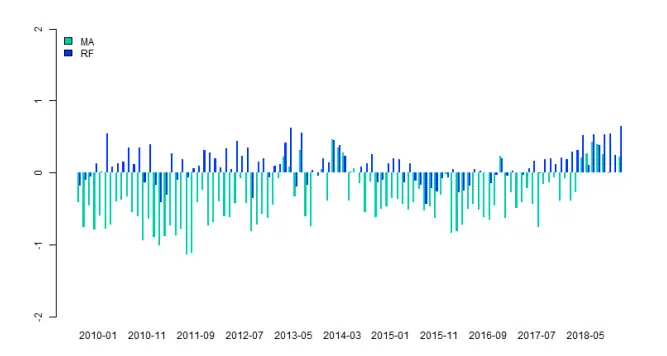
数据来源：Wind、渤海证券研究所

图 10: 沪深 300选股模型波动率因子历史暴露
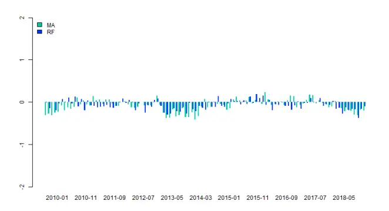
数据来源：Wind、渤海证券研究所

图 11：沪深 300 选股模型流动性因子历史暴露
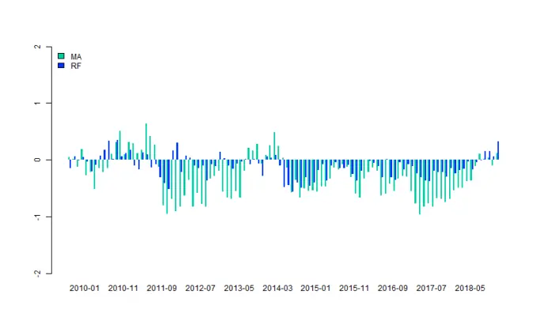
数据来源：Wind、渤海证券研究所

## 3.2 针对中证 500股票的选股模型

在针对中证 500 的回测结果中，可以看出，使用了随机森林多因子模型后，模型的波动率和胜率相对传统多因子模型均有所好转，波动率降低 1%，相对中证500月度胜率提高 6%。

表 5：中证 500选股模型历史回测结果

|  | 累计收益 | 年化收益 | 波动率 | 最大回撤 | 夏普比率 | 胜率 | 换手率 |
| --- | --- | --- | --- | --- | --- | --- | --- |
| MA | 138.91% | 10.90% | 27.19% | 44.63% | 40.10% | 56.44% | 6.06 |
| RandomForest | 137.51% | 10.82% | 26.34% | 46.07% | 41.10% | 62.38% | 7.89 |
| ZZ500 | 19.27% | 2.12% | 27.57% | 47.65% | 7.68% | -- | -- |

数据来源：渤海证券研究所、Wind

分年度对比两个选股模型的历史收益，可以看到 2010 年至 2013年，随机森林模型表现略逊与传统多因子模型，2013年至2018年，随机森林模型表现超越传统多因子模型。

表 6：中证 500选股模型历史分年度收益统计结果

|  | 2010 | 2011 | 2012 | 2013 | 2014 | 2015 | 2016 | 2017 | 2018 |
| --- | --- | --- | --- | --- | --- | --- | --- | --- | --- |
| MA | 25.4% | -35.7% | 8.3% | 24.2% | 36.7% | 66.4% | 5.6% | 0.7% | -8.9% |
| RandomForest | 18.6% | -35.2% | 0.3% | 21.6% | 41.8% | 68.1% | 7.2% | 8.0% | -8.1% |
| ZZ500 | 12.8% | -33.8% | 0.3% | 16.9% | 39.0% | 43.1% | -17.8% | -0.2% | -16.5% |

数据来源：渤海证券研究所、Wind

从图中也可以较为明显的看出这一趋势。2017年以来，传统多因子模型经历了较大回撤，而随机森林模型依然保持上涨。随机森林模型相对传统多因子模型的收益主要来自 14年和17年市场风格转换期间，随机森林模型更快的把握住了市场风格的切换。

图 12：中证 500 选股模型回测收益曲线
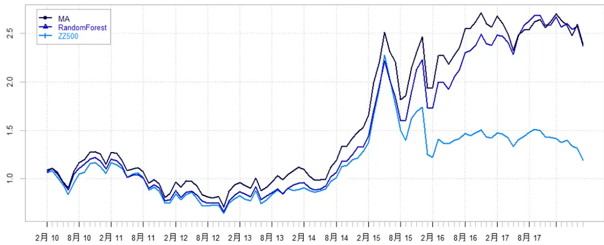

资料来源：Wind，渤海证券研究所

图 13：中证 500 选股模型对冲基准回测收益曲线
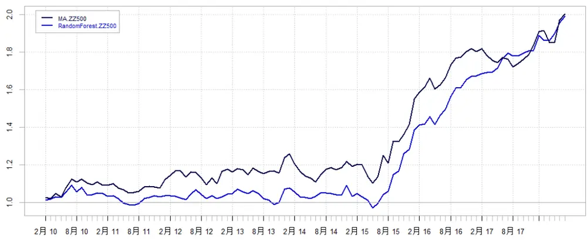
资料来源：Wind，渤海证券研究所

通过业绩归因模型，可以发现传统多因子模型在因子暴露上的波动率依然明显大于随机森林模型。在因子收益方面，传统多因子模型的收益主要来自市值、流动性与波动率因子，而随机森林模型的收益主要来自于流动性、波动率与估值因子。

表 7：中证 500选股模型因子统计结果

|  | 市值 | 盈利 | 反转 | 动量 | 成长 | 流动性 | 波动率 | 估值 |
| --- | --- | --- | --- | --- | --- | --- | --- | --- |
| MA 因子均值 | -0.479 | 0.451 | -0.432 | -0.045 | 0.953 | -0.440 | -0.198 | 0.315 |
| MA 因子波动 | 2.295 | 1.390 | 1.017 | 1.410 | 1.478 | 1.177 | 0.873 | 1.053 |
| MA 因子收益 | 0.376 | 0.115 | 0.146 | 0.056 | 0.162 | 0.227 | 0.232 | 0.100 |
| RF因子均值 | -0.010 | 0.175 | -0.076 | 0.009 | 0.317 | -0.371 | -0.169 | 0.315 |
| RF因子波动 | 0.873 | 0.776 | 0.860 | 1.092 | 1.085 | 0.863 | 0.344 | 0.784 |
| RF因子收益 | 0.018 | 0.048 | -0.018 | 0.092 | 0.073 | 0.224 | 0.139 | 0.131 |

资料来源：Wind，渤海证券研究所

观察两类模型在各个因子上因子暴露时间序列，可以看出随机森林模型与传统多因子模型除市值之外的因子上选股风格均较为一致，传统多因子模型因子暴露绝对值普遍较高。2010年至2013年，传统多因子模型在给予市值因子非常大的负向暴露，而随机森林模型在市值因子的暴露上则十分保守，这也可能是 2010 年至 2013年间随机森林模型跑输传统多因子模型的主要原因。

图 14: 中证 500选股模型市值因子历史暴露
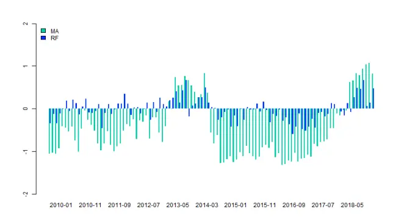
数据来源：Wind、渤海证券研究所

图 15：中证 500 选股模型成长因子历史暴露
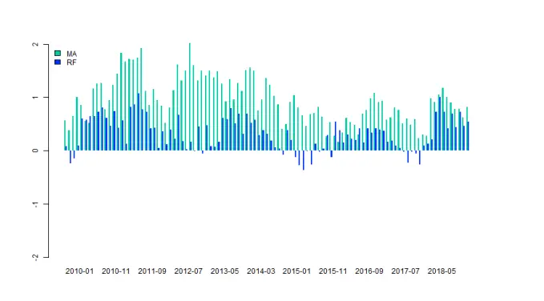
数据来源：Wind、渤海证券研究所

图 16: 中证 500选股模型盈利因子历史暴露
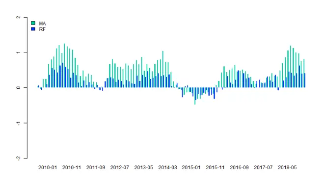
数据来源：Wind、渤海证券研究所

图 17：中证 500 选股模型估值因子历史暴露
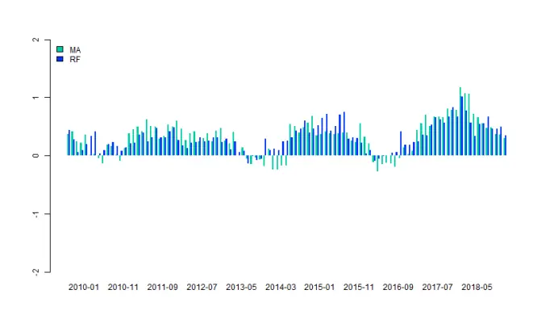
数据来源：Wind、渤海证券研究所

图 18: 中证 500选股模型动量因子历史暴露
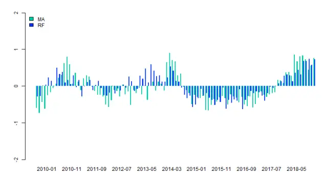
数据来源：Wind、渤海证券研究所

图 19：中证 500 选股模型反转因子历史暴露
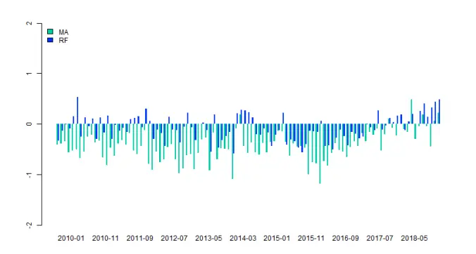
数据来源：Wind、渤海证券研究所

图 20: 中证 500选股模型波动率因子历史暴露
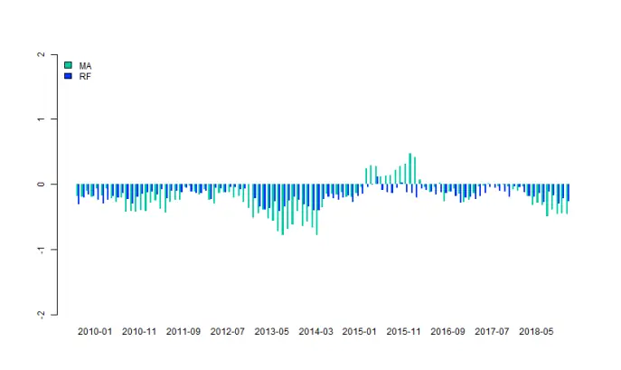
数据来源：Wind、渤海证券研究所

图 21：中证 500 选股模型流动性因子历史暴露
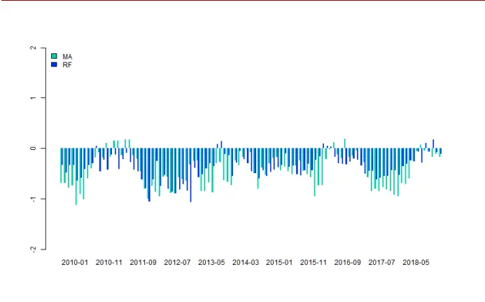
数据来源：Wind、渤海证券研究所

## 3.3 针对全体 A股的选股模型

在针对全体 A股的回测结果中，可以看出，使用了随机森林多因子模型后，模型的收益率和胜率相对传统多因子模型均有较大提高，年化收益率提高 3%，相对沪深 300月度胜率提高4%。

表 8：全体 A股选股模型历史回测结果

|  | 累计收益 | 年化收益 | 波动率 | 最大回撤 | 夏普比率 | 胜率 | 换手率 |
| --- | --- | --- | --- | --- | --- | --- | --- |
| MA | 490.33% | 23.49% | 29.31% | 34.90% | 80.12% | 63.37% | 7.47 |
| RandomForest | 618.26% | 26.40% | 29.63% | 37.57% | 89.10% | 67.33% | 8.84 |
| Wind 全 A | 43.62% | 4.40% | 25.54% | 44.57% | 17.21% | 52.48% | -- |
| ZZ500 | 19.27% | 2.12% | 27.57% | 47.65% | 7.68% | 49.50% | -- |
| HS300 | 9.58% | 1.09% | 24.38% | 40.56% | 4.48% | -- | -- |

数据来源：渤海证券研究所、Wind

分年度对比两个选股模型的历史收益，可以看到随机森林模型相对传统多因子模型的收益主要来自 2013、2014 和 2017 年，随机森林模型更快的把握住了市场风格的切换。

表 9：全体 A股选股模型历史分年度收益统计结果

|  | 2010 | 2011 | 2012 | 2013 | 2014 | 2015 | 2016 | 2017 | 2018 |
| --- | --- | --- | --- | --- | --- | --- | --- | --- | --- |
| MA | 39.9% | -22.8% | 7.4% | 26.3% | 50.7% | 149.1% | 14.5% | -0.3% | -5.8% |
| RandomForest | 34.4% | -25.7% | 4.3% | 41.4% | 58.0% | 149.9% | 15.5% | 4.4% | 2.4% |
| Wind 全 A | 1.9% | -22.4% | 4.7% | 5.4% | 52.4% | 38.5% | -12.9% | 4.9% | -14.6% |
| ZZ500 | 12.8% | -33.8% | 0.3% | 16.9% | 39.0% | 43.1% | -17.8% | -0.2% | -16.5% |
| HS300 | -2.4% | -25.0% | 7.6% | -7.6% | 51.7% | 5.6% | -11.3% | 21.8% | -12.9% |

数据来源：渤海证券研究所、Wind

从图中也可以较为明显的看出这一趋势。2017年以来，传统多因子模型经历了一定回撤，而随机森林模型依然保持上涨。

图 22：全体 A股选股模型回测收益曲线
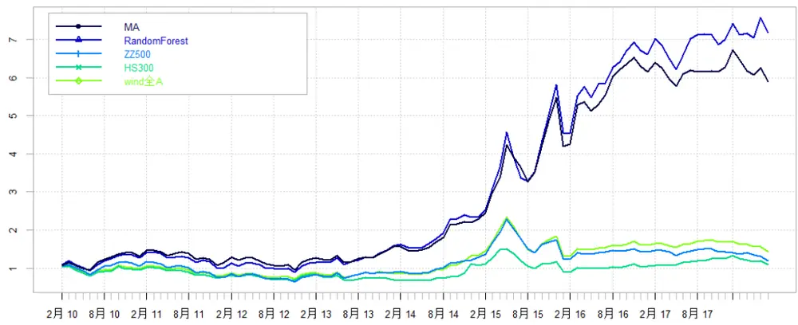
资料来源：Wind，渤海证券研究所

图 23：全体 A股选股模型对冲基准回测收益曲线
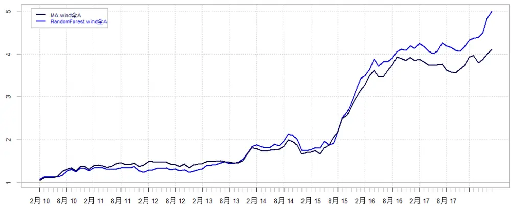
资料来源：Wind，渤海证券研究所

通过业绩归因模型，可以发现相对沪深 300与中证500选股模型，全 A选股模型的因子波动率均有了较大上涨，传统多因子模型在因子暴露上的波动率依然明显大于随机森林模型。在因子收益方面，传统多因子模型的收益主要来自市值、流动性与反转因子，而随机森林模型的收益主要来自于市值、流动性与估值因子。市值因子在两个模型的收益来源中均起到了最大的作用。

表 10：全体 A股选股模型因子统计结果

|  | 市值 | 盈利 | 反转 | 动量 | 成长 | 流动性 | 波动率 | 估值 |
| --- | --- | --- | --- | --- | --- | --- | --- | --- |
| MA 因子均值 | -0.158 | 0.561 | -0.787 | -0.345 | 0.995 | -0.773 | -0.042 | 0.368 |
| MA 因子波动 | 3.432 | 2.433 | 1.742 | 1.803 | 2.590 | 1.967 | 0.929 | 1.602 |
| MA 因子收益 | 0.599 | 0.247 | 0.445 | -0.041 | 0.148 | 0.559 | 0.031 | 0.167 |
| RF 因子均值 | -0.412 | 0.093 | -0.174 | -0.169 | 0.106 | -0.499 | -0.127 | 0.410 |
| RF 因子波动 | 2.287 | 0.839 | 0.893 | 1.377 | 1.157 | 1.034 | 0.415 | 0.887 |
| RF 因子收益 | 0.386 | 0.033 | 0.074 | 0.016 | 0.022 | 0.386 | 0.070 | 0.203 |

资料来源：Wind，渤海证券研究所

观察两类模型在各个因子上因子暴露时间序列，可以看出随机森林模型与传统多因子模型在大部分因子上选股风格较为一致，传统多因子模型因子暴露绝对值大幅高于随机森林模型，在盈利、成长与反转因子上尤其明显。考虑到最后选股结果上传统多因子模型持续跑输随机森林模型，其过于激进的因子暴露可能会带来不尽如人意的结果。

图 24: 全体 A股选股模型市值因子历史暴露
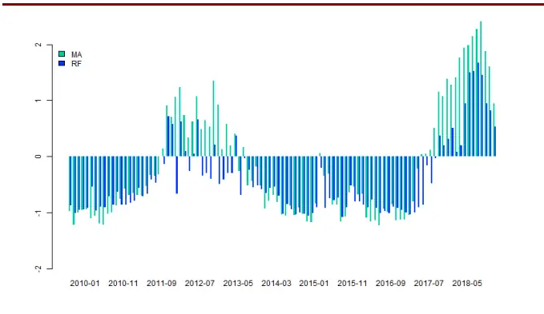
数据来源：Wind、渤海证券研究所

图 25：全体 A股选股模型成长因子历史暴露
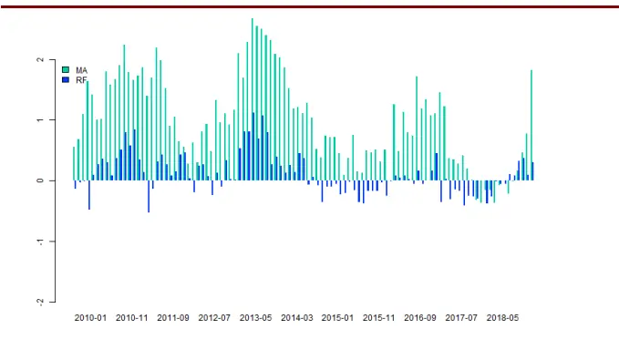
数据来源：Wind、渤海证券研究所

图 26: 全体 A股选股模型盈利因子历史暴露
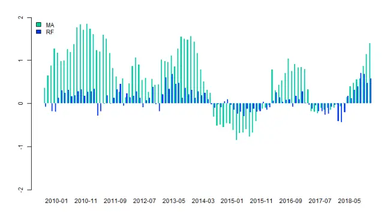
数据来源：Wind、渤海证券研究所

图 27：全体 A股选股模型估值因子历史暴露
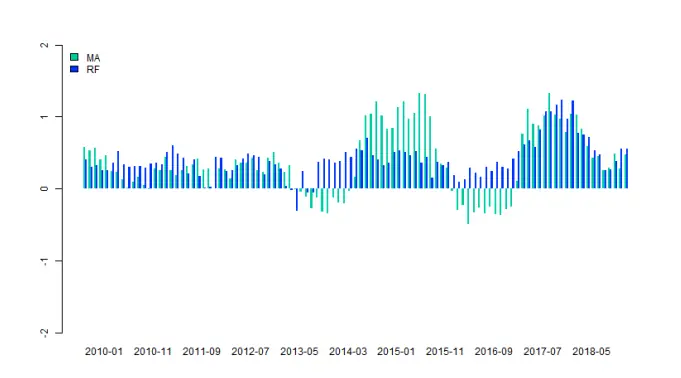
数据来源：Wind、渤海证券研究所

图 28: 全体 A股选股模型动量因子历史暴露
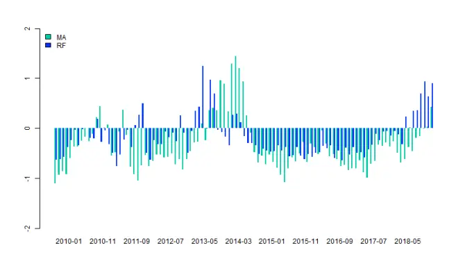
数据来源：Wind、渤海证券研究所

图 29：全体 A股选股模型反转因子历史暴露
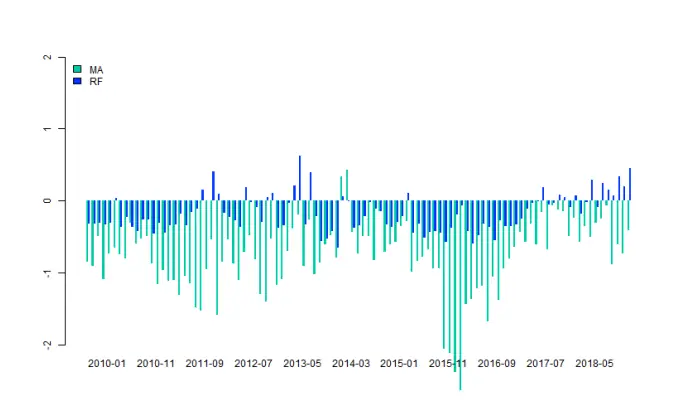
数据来源：Wind、渤海证券研究所

图 30: 全体 A股选股模型波动率因子历史暴露
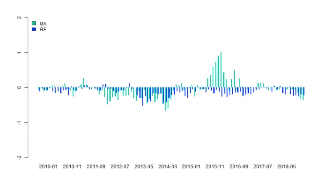
数据来源：Wind、渤海证券研究所

图 31：全体 A股选股模型流动性因子历史暴露
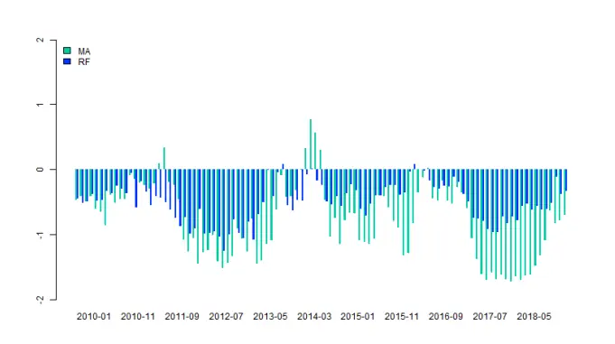
数据来源：Wind、渤海证券研究所

## 4．总结与未来研究方向展望

本篇报告中，我们针对沪深300 成分股、中证500成分股与全体A 股，分别使用机器学习中的随机森林算法构建了多因子选股模型，并与传统多因子模型进行对比。通过对比我们发现：

1. 在各个样本池中，随机森林模型的表现相比于传统多因子模型均有一定程度的提升，该提升主要是由随机森林模型在2014 年与 2017年市场转换时期表现出的相对传统多因子模型更强的灵活性导致的。所以，在市场风格不明显，未来趋势不清晰的情况下，更推荐使用随机森林模型，来控制未来市场风格切换的风险。

2. 通过业绩归因模型，我们考察了两类选股模型在不同因子上的风格暴露。在各个样本池中，传统多因子模型在各个因子暴露上的波动率均明显大于随机森林模型。这说明在不加限制的情况下，传统多因子模型的选股风格可能会更加极端化。所以在使用传统多因子模型时，我们推荐与风险模型相结合，控制投资组合的整体风险（风险模型建立的具体细节可参见研报《多因子模型研究之三：风险模型与组合优化》）。

3. 各个样本池间横向比较，可以发现，股票池中的小市值股票越多（全A>中证500>沪深 300），模型选股结果的因子波动性越大，同时在市值因子的暴露也逐步上升。对市值因子的依赖是多因子模型一直面临的问题，在实际应用中，我们推荐对于市值因子做一定的风险敞口控制，以防止因子失效带来的大幅回撤风险。

未来，我们计划从以下三方面继续改善多因子模型：

1. 尝试使用更多机器学习算法，如 Boosting、SVM、神经网络等；

2. 将收益模型与风险模型相结合，进一步控制模型波动率；

3. 对于模型建立的细节进行进一步的完善，如因子预处理方法的选择对比等；

4. 将因子分析方法引入行业模型，分行业建立细分多因子模型，与行业轮动模型结合，形成自上而下的选股体系。

风险提示：随着市场环境变化，模型存在失效风险。

投资评级说明

| 项目名称 | 投资评级 | 评级说明 |
| --- | --- | --- |
| 公司评级标准 | 买入 | 未来 6 个月内相对沪深300 指数涨幅超过20% |
|  | 增持 | 未来 6 个月内相对沪深 300 指数涨幅介于 10%~20%之间 |
|  | 中性 | 未来6个月内相对沪深300指数涨幅介于-10%~10%之间 |
|  | 减持 | 未来 6 个月内相对沪深 300指数跌幅超过10% |
| 行业评级标准 | 看好 | 未来 12 个月内相对于沪深300 指数涨幅超过 10% |
|  | 中性 | 未来12个月内相对于沪深300 指数涨幅介于-10%-10%之间 |
|  | 看淡 | 未来 12 个月内相对于沪深300 指数跌幅超过 10% |

重要声明： 本报告中的信息均来源于已公开的资料，我公司对这些信息的准确性和完整性不作任何保证，不保证该信息未经任何更新，也不保证本公司做出的任何建议不会发生任何变更。在任何情况下，报告中的信息或所表达的意见并不构成所述证券买卖的出价或询价。在任何情况下，我公司不就本报告中的任何内容对任何投资做出任何形式的担保，投资者自主作出投资决策并自行承担投资风险。我公司及其关联机构可能会持有报告中提到的公司所发行的证券并进行交易，还可能为这些公司提供或争取提供投资银行或财务顾问服务。我公司的关联机构或个人可能在本报告公开发表之前已经使用或了解其中的信息。本报告的版权归渤海证券股份有限公司所有，未获得渤海证券股份有限公司事先书面授权，任何人不得对本报告进行任何形式的发布、复制。如引用、刊发，需注明出处为“渤海证券股份有限公司”，也不得对本报告进行有悖原意的删节和修改。

## 渤海证券股份有限公司研究所

## 副所长（金融行业研究＆研究所主持工作）

张继袖

+86 22 2845 1845

## 计算机行业研究小组

王洪磊（部门副经理）

+86 22 2845 1975

朱晟君

+86 22 2386 1319

王磊

## 医药行业研究小组

张冬明

+86 22 2845 1857赵波

+86 22 2845 1632

甘英健

## 证券行业研究

张继袖

+86 22 2845 1845 洪程程 +86 10 6810 4609

## 金融工程研究＆部门经理

+86 22 2845 1618

## 基金研究

刘洋+86 22 2386 1563

## 流动性、战略研究＆部门经理周喜

+86 22 2845 1972

综合质控＆部门经理齐艳莉+86 22 2845 1625

## 汽车行业研究小组

郑连声

+86 22 2845 1904

张冬明

+86 22 2845 1857

## 通信＆电子行业研究小组

+86 10 6810 4602

## 权益类量化研究

李莘泰
+86 22 2387 3122宋旸
+86 22 2845 1131

## 策略研究

宋亦威
+86 22 2386 1608杜乃璇
+86 22 2845 1945

机构销售•投资顾问朱艳君+86 22 2845 1995

## 副所长

谢富华+86 22 2845 1985

## 环保行业研究

张敬华
+86 10 6810 4651刘蕾
+86 10 6810 4662

## 衍生品类研究

祝涛 
+86 22 2845 1653 李元玮 
+86 22 2387 3121 郝倞 
+86 22 2386 1600

宏观研究张扬

风控专员 
白骐玮 
+86 22 2845 1659 
合规专员 
任宪功 
+86 10 6810 4615

## 电力设备与新能源行业研究

刘瑀

+86 22 2386 1670

刘秀峰

+86 10 6810 4658

## 餐饮旅游行业研究

刘瑀
+86 22 2386 1670杨旭
+86 22 2845 1879
债券研究
王琛皞
+86 22 2845 1802
冯振
+86 22 2845 1605
夏捷
+86 22 2386 1355

博士后工作站朱林宁 资产配置+86 22 2387 3123渤海证券研究所

天津

天津市南开区宾水西道 8号

邮政编码：300381

电话：（022）28451888

传真：（022）28451615

北京

北京市西城区西直门外大街甲 143 号 凯旋大厦 A 座 2 层

邮政编码：100086

电话： （010）68104192

传真： （010）68104192

渤海证券研究所网址：www.ewww.com.cn