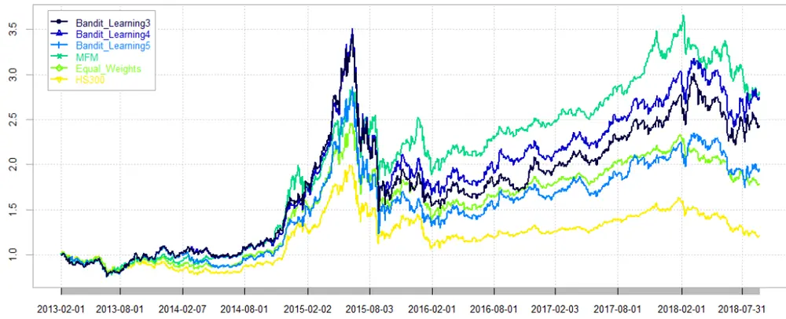
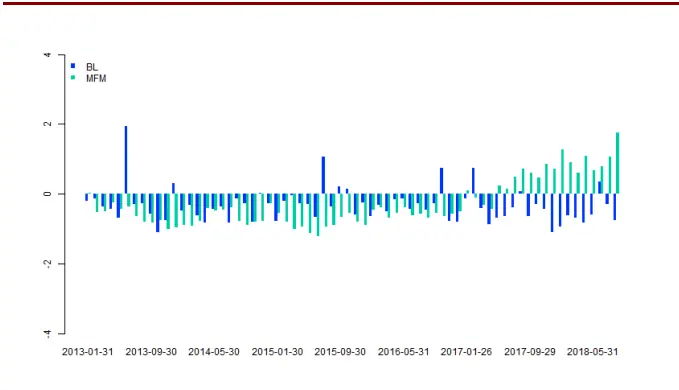
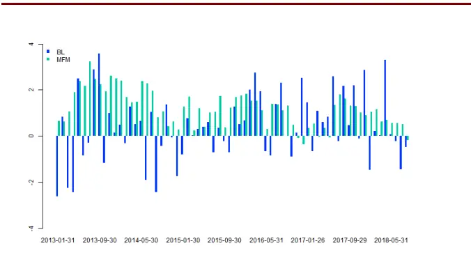
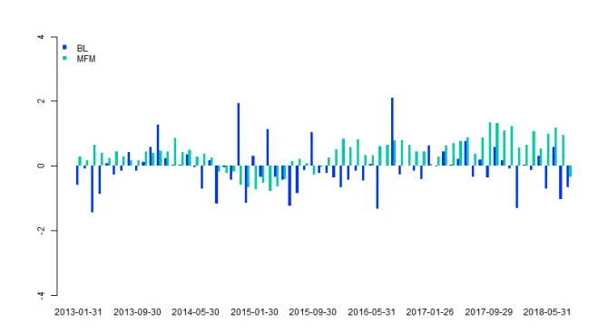
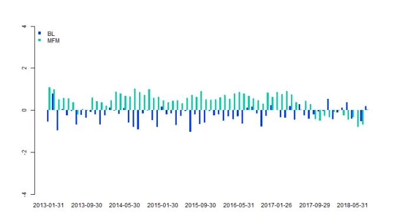
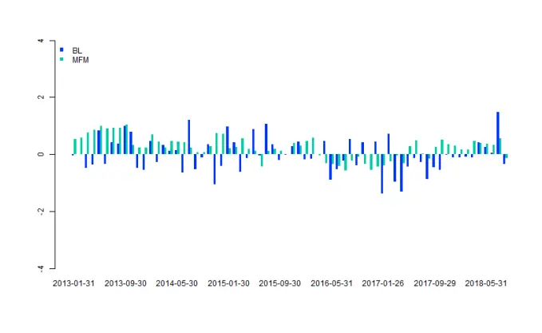
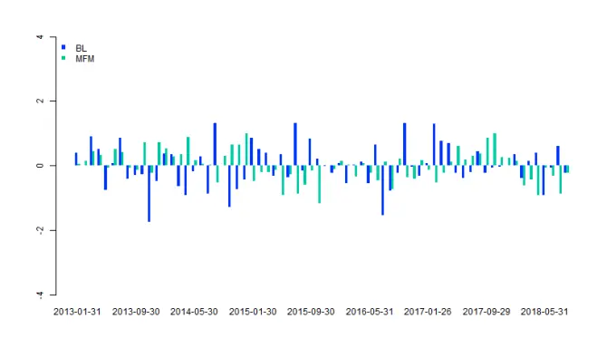
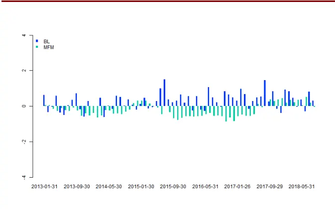
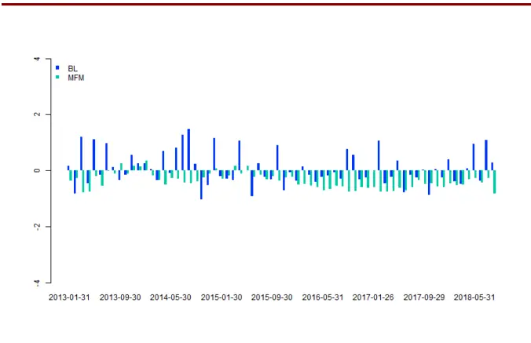

# 使用 Bandit Learning 算法的多因子模型

# ——多因子模型研究系列之五

分析师：宋旸

SAC NO：S1150517100002

2018 年 9 月 26 日

证券分析师

宋旸

022-28451131

18222076300

songyang@bhzq.com

## 相关研究报告

《多因子模型研究之一：单因子测试》20171011

《多因子模型研究之二：收益预测模型》20171229

《多因子模型研究之三：风险 模 型 与 组 合 优 化 》20180416

《随机森林多因子模型与传统多因子模型的选股风格对比——多因子模型研究系列之四》20180726

## 核心观点：

本篇报告中，我们介绍了Bandit Learning算法，并将其应用于多因子模型。Bandit Learning算法是在线学习算法的一种，通常被应用于处理一个时间序列的决策问题，在每一期的选择时，根据目前已知的信息实时反馈更新算法。以平衡守成（exploitation）与探索（exploration）的比例，达到最后总体收益的最大化。

- 在建立投资模型时，我们针对沪深 300成分股，选取估值、盈利、成长、动量、反转、波动率、流动性、市值八大类因子建立多因子模型。使用传统多因子模型估计投资组合的未来收益，使用Barra 模型估计投资组合的协方差矩阵，并将其应用于 Bandit Learning 算法中。选用夏普比率作为奖赏函数，在迭代中，使用 UCB 算法，计算最优臂与最优权重。最后，我们将选股结果与传统多因子模型、等权模型和指数做了对比，并对选股结果做了业绩归因。

- 在回测中，我们发现，Bandit Learning算法在分年度的表现统计中表现出了一定的优越性。与传统多因子模型暴涨暴跌的特点不同，BanditLearning 模型在指数下跌的年份也能取得较为稳健的收益。在两类模型的业绩归因研究中，我们发现，多因子模型选股风格表现出了很强的趋势性，Bandit Learning 模型选股风格则比较跳跃。这可能也是在趋势性市场中，多因子模型表现明显优于 Bandit Learning 模型，而在震荡市中，Bandit Learning模型表现优于多因子模型的原因。

Bandit Learning模型是一个较新的模型，其运行机制、收益来源以及成果的延续能力依然有一定的不确定性。不过，2017 年以来，市场环境的剧变，使传统多因子模型面临巨大挑战。在改进传统多因子模型，使其更加适应市场的需求下，Bandit Learning 模型是一个可以被考虑的替代选项。

- 风险提示：随着市场环境变化，模型存在失效风险。

## 1．概述

传统的多因子模型理论来源于 Markowitz的风险收益模型，其目的在于对于单期横截面的数据做优化，预测下期收益与风险，找到风险收益比最小的组合并随着时间推进重复这一过程。可想而知，在这一过程中，对于未来预测的准确度十分关键。2017 年以来，传统的因子出现了不同程度的失效，导致了大部分多因子模型的较大回撤。寻找一种新的选股方式变得十分关键。

在 Li 和 Hoi 的论文《Online Portfolio Selection: A Survey》中，作者为我们介绍了一种新的选股方法：在线学习选股。该模型的理论最初来自于 Kelly 的资本增长理论（Capital Growth Theory），该理论最著名的一个应用就是 Kelly 公式。在线学习选股中，我们的目标并不是单次下注的胜负，而是使长期投资总收益的几何平均值最大。这也是在线学习（Online Learning）模型与传统多因子模型的最大不同。

在线学习算法中，我们处理一个时间序列的决策问题，每一期的选择，根据目前已知的信息实时反馈更新算法。在线学习的算法很多，在本篇文章中，我们选用多臂赌博机算法（Multi-armed Bandit Learning）。在 Shen 的论文《PortfolioChoices with Orthogonal Bandit Learning》中，作者将 Bandit Learning 应用于美国股市，取得了不错的投资结果，本文参考了该方法，将 Bandit Learning 应用于A 股，结合传统多因子中关于风险收益模型的估计，对于沪深 300成分股进行组合优化，取得了超越基准的收益，在传统多因子模型失效的年份，BanditLearning 模型表现出了较好的适应性。

## 2．理论简介与算法推导

## 2.1多臂老虎机问题

多臂老虎机（Multi-armed Bandit）问题的提出和研究最早可以追述到上世纪三十年代，该问题可以使用一种较为形象的场景进行解释：

假设你进入了一家赌场，这家赌场的大厅里有 个老虎机，当你往老虎机中投入一枚硬币，老虎机有一定概率掉落奖励，每个老虎机掉落奖励的概率不同且未知，那么在现有硬币有限的情况下，使用什么策略才能使你最后所得的总体奖励最大？

在尝试了几次后，你对每个赌博机的掉落概率有了一个初步的估计，但是受尝试次数的限制，这个估计可能是不准确的，且未来该概率还有可能改变。接下来，是选择一直坚持目前已知的最好选择（exploitation，守成），还是继续尝试，以达到更准确的估计，找到奖励概率更高的老虎机（exploration，探索），这便是多臂老虎机理论解决的问题。通过一系列在线学习反馈算法，平衡守成与探索的比例，以达到最后总体收益的最大化。

在量化投资领域，我们把每个老虎机的“臂”理解为不同的资产或资产组合，在投资环节的每个时刻，根据目前已知的信息做出决策，目的并不是最大化即时收益，而是最大化远期收益。

## 2.2 数学推导

已知 种资产的 期收益率：

$$
\pmb{R}_{k}=(R_{k,1},\cdots R_{k,n})^{T},k=1,\cdots,m\tag{1}
$$

在每一个时刻 $t_{k}$ ，根据之前已知信息，求一组权重

$$
\pmb{w}_{k}=(w_{k,1},\cdots,w_{k,n})^{\mathrm{T}}\tag{2}
$$

i.e.

$$
\sum_{i=1}^{n}w_{k,i}=1\tag{3}
$$

使

得

$$
w_{k,i}\geq0,i=1,\cdots,n\tag{4}
$$

组合收益最大化。

在 $t_{k}$ 时刻，我们使用 $\{R_{-\tau+k},\cdots,R_{k-1}\}$ 来估计 期的资产收益率 $\scriptstyle R_{k}$ 和协方差矩阵 ${\bf\cdot\Sigma}\pmb{\Sigma}_{\mathbf{k}}$ （具体估计方法参考传统多因子模型体系，参见第三部分模型建立）。

$\Sigma_{k}$ 为正定矩阵，故可以找到矩阵 $\scriptstyle H_{k}$ 使得

$$
\begin{array}{c}{{\sharp}}\\{{\qquad\ :}}\\{{\displaystyle\#}}\end{array}
$$

$$
\pmb{\Sigma_{k}}=\pmb{H_{k}}\pmb{A_{k}}\pmb{H_{k}^{T}}\tag{5}
$$

$\scriptstyle{A_{k}}$ 是一个对角矩阵，其对角线上的元素是 $\scriptstyle{\pmb{\mathscr{L}}}_{k}$ 的降序排列的特征值，

$$
\lambda_{k,1}>\lambda_{k,2}>\cdots>\lambda_{k,n}>0\tag{6}
$$

$\scriptstyle H_{k}$ 为正交矩阵，它的列 $(H_{k,1},\cdots,H_{k,n})$ 是 $\scriptstyle{\pmb{\mathscr{L}}}_{k}$ 的特征向量，也是线性不相关的 组投资组合的权重，每组投资组合的预期收益为 $H_{k}^{T}R_{k}$

为了满足权重之和为 1的条件，需要对 $\scriptstyle H_{k}$ 的列元素做归一化处理，定义

$$
\begin{array}{r}{\widetilde{\pmb{H}}_{k}=(\widetilde{H}_{k,1},\cdots,\widetilde{H}_{k,n})}\\{s.t.}\end{array}\tag{7}
$$

$$
\widetilde{H}_{k,i}=\frac{H_{k,i}}{H_{k,i}^{T}\mathbf{1}}\tag{8}
$$

于是，新得到 组线性不相关的投资组合的权重为 $(\widetilde{H}_{k,1},\cdots,\widetilde{H}_{k,n})$ ，预期收益为$\widetilde{H}_{k}^{T}R_{k}$ ，预期收益的协方差矩阵为

$$
\widetilde{\pmb{\Sigma}}_{k}=\widetilde{\pmb{H}}_{k}\pmb{\Sigma}_{k}\widetilde{\pmb{H}}_{k}^{T}=\widetilde{\pmb{\Lambda}}_{k}\tag{9}
$$

其中 $\widetilde{\Lambda}_{k}$ 为对角矩阵，其对角元素为

$$
\tilde{\lambda}_{k,i}=\frac{\lambda_{k,i}}{(H_{k,i}^{T}\mathbf{1})^{2}}\tag{10}
$$

故第 个投资组合的预期收益为 $\widetilde{H}_{k,i}^{T}R_{k,i}$ ，预期波动率为 $\tilde{\lambda}_{k,i}$ 。

根据 Bai 和 Ng 发表的论文《Determining the number of factors in approximatefactor models》，协方差矩阵可以被分解为重要因子部分与非重要因子部分，即：

$$
\widetilde{\boldsymbol{\Sigma}}_{k}=\sum_{i=1}^{l}\widetilde{\lambda}_{k,i}\widetilde{H}_{k,i}\widetilde{H}_{k,i}^{T}+\sum_{i=l+1}^{n}\widetilde{\lambda}_{k,i}\widetilde{H}_{k,i}\widetilde{H}_{k,i}^{T}\tag{11}
$$

其中，前 个因子代表了市场的系统性风险，通常对于整体的估计有较为重要的作用，后 个因子代表了非系统性风险，可从中获得主动收益。对于 值的选取并没有一定之规，一般来讲， 取值为大部分时间段中特征值大幅降低的分水岭，3到 5之间的情况最为常见。在实践中，我们测试了不同的 ，发现合理范围内的 对结果并不敏感（参见第三部分回测结果）。

接下来，我们使用UCB算法，分别从前 个和后 个特征向量中选择最优的基来构建新的投资组合，这样可以同时兼顾被动和主动收益，达到最大化投资效果的目的。在这里，我们使用夏普比率作为衡量投资效果的评价指标。于是，第 个特征向量（即第 个臂）的奖赏函数为：

$$
\bar{r}_{i}(t_{k})=\frac{\widetilde{H}_{k,i}R_{k,i}}{\sqrt{{\tilde{\lambda}}_{k,i}}}=\frac{H_{k,i}R_{k,i}}{\sqrt{{\lambda}_{k,i}}}\tag{12}
$$

接下来，使用 UCB（Upper Confidence Bound）算法选择最优臂：

$$
i_{k}^{*}=\arg\operatorname*{max}{\bar{r}_{i}(t_{k})}+\sqrt{\frac{2\ln k+\tau}{\tau+k_{i}}}\tag{13}
$$

其中 $k_{i}$ 为程序运行至今第 个特征向量被选中的次数。

从前 个和后 个特征向量中选择最优臂 $i_{k}^{*}$ 和  。

接下来，我们要求权重 $\theta_{k}$ ，使得第 $i_{k}^{*}\mathcal{\bar{\mathcal{F}}}{\approx}j_{k}^{*}$ 个特征向量组合而成的投资组合波动率最小，因为特征向量两两不相关，最终投资组合的波动率可以写为：

$$
\lambda_{k,p}=\theta_{k}^{2}\tilde{\lambda}_{k,j_{k}^{*}}+(1-\theta_{k})^{2}\tilde{\lambda}_{k,i_{k}^{*}}\tag{14}
$$

根据初等微积分理论，为使 $\lambda_{k,p}$ 最大，求导后可得

$$
\theta_{k}^{*}=\frac{\tilde{\lambda}_{k,i_{k}^{*}}}{\tilde{\lambda}_{k,i_{k}^{*}}+\tilde{\lambda}_{k,j_{k}^{*}}}\tag{15}
$$

于是，得到的权重向量为

$$
w_{k}=(1-\theta_{k}^{*})\widetilde{H}_{k,i_{k}^{*}}+\theta_{k}^{*}\widetilde{H}_{k,j_{k}^{*}}\tag{16}
$$

这里的 $w_{k}$ 可以取正值，也可以取负值，因为在美国股市允许做空。将该算法应用于 A股市场时，还需要对该权重进行进一步处理，将权重映射进新的可行域里：

$$
\operatorname*{min}\left\|w_{new,k}-w_{k}\right\|^{2}\tag{17}
$$

S.t.

这

$$
\sum_{i=1,\cdots n}w_{new,k}^{i}=1\tag{18}
$$

是

$$
w_{new,k}^{i}\ge0\tag{19}
$$

个二次规划问题，可通过二次规划的标准算法求解。

## 2.3算法流程

完整的算法流程如下：

输入： $m,n,l,{\bf R}_{{\bf k}},\tau$

对 进行以下步骤：

已知 $\{R_{-\tau+k},\cdots,R_{k-1}\}$ ，估计 期的资产收益率期望 $\scriptstyle R_{k}$ 和协方差矩阵 $\mathbf{\nabla}\cdot\pmb{\Sigma}_{\mathbf{k}};$

根据（5），对 $\Sigma_{k}$ 做主成分分解，并将特征值按从大到小顺序排列；

根据（9），对 ${\pmb H}_{k}$ 的列向量做归一化处理，得到新的协方差矩阵；

根据（12），计算每个臂的奖赏函数；

根据（13），使用 UCB 算法，从前 个和后 个臂中选择最优臂 $\ddot{\iota}_{k}^{*}$ 和  ；

根据（15），计算  ；

根据（16），计算最优权重 $w_{k}$ ；

根据（17），得到新的非负权重 $w_{new,k}$

输出：每一期的最优权重 $w_{new}$ 以及根据权重计算出的组合收益。

## 3．模型建立与回测结果

## 3.1模型建立

我们针对沪深 300成分股，以月度调仓的频率构建投资组合。因为协方差矩阵的估计需要 48 个月的数据，故因子数据为 2009 年-2018 年8 月，调仓数据为2013年-2018 年 8 月。

我们选择了三组数据作为对照组，分别为：同期沪深 300 指数、沪深 300成分股等权、以及使用传统多因子风险收益模型（Multi-Factor Model, MFM）构建的投资组合。

在传统多因子风险收益模型的构建中，我们选取估值、盈利、成长、动量、反转、波动率、流动性、市值八大类因子建立线性模型，经过缺失值处理、去极值、标准化、中性化等前期准备步骤，采用移动平均方法构建收益预测模型，采用 Barra方法估计协方差矩阵，并对模型整体进行二次规划。

表 1：模型入选因子汇总

| 因子大类 | 最终入选因子 |
| --- | --- |
| 估值因子 | BP、扣非EP_ttm |
| 盈利因子 | 单季度 roe |
| 成长因子 | 单季度营业收入增长率、单季度归母净利润增长率 |
| 动量因子 | 指数加权一年收益率/上月收益率 |
| 反转因子 | 上月收益率 |
| 波动率因子 | 月度波动率、季度波动率、年度波动率 |
| 流动性因子 | 月度换手率、季度换手率、年度换手率 |
| 市值因子 | 流通市值对数 |

数据来源：渤海证券研究所

Barra模型中估计协方差矩阵的方法为：

$$
\Sigma=X_{f}FX_{f}{'}+\Delta
$$

其中 $X_{f}$ 为组合中股票的因子暴露矩阵， 为因子收益率之间的协方差矩阵，Δ为个股残差波动率组成的对角矩阵。

最终结合收益模型与风险模型的优化问题为：

$$
\begin{array}{c}{{max\quad\alpha^{\prime}w-\displaystyle\frac{1}{2}\lambda w^{\prime}\Sigma w}}\\{{s.t.\quad0\leq w_{i}\leq k_{i}}}\\{{\qquad\quad\mathbf1^{\prime}w=1}}\end{array}
$$

其中 $w$ 为待求解的组合权重； $\alpha^{\prime}w$ 为收益预测模型给出的组合收益预测； $w^{\prime}\Sigma w$ 为组合风险预测，其中 为 Barra 风险预测模型给出的个股协方差预测矩阵； 为风险厌恶系数，这里取值为1； $k_{i}$ 为个股权重上限，这里取值为 10%。

模型具体构建方法与细节可参考我们之前发表的报告：《多因子模型研究之一：单因子测试》、《多因子模型研究之二：收益预测模型》和《多因子模型研究之三：风险模型与组合优化》。

在 Bandit Learning 算法中，也需要对组合收益率以及协方差矩阵进行估计，这里采用了和传统多因子模型同样的估计方法，使用移动平均模型估计收益，使用Barra风险模型估计协方差矩阵。

在完成投资组合的构建后，为了具体对比两个模型在选股上的风格异同，我们针对两类模型历史上选出的股票池，运行业绩归因模型。业绩归因模型中的因子沿用了传统多因子模型的八大类因子。

业绩归因模型是用来衡量投资组合选股风格的模型。主要通过组合的因子暴露和因子收益来确定投资组合的主要收益来源。

其中因子暴露度的计算公式为:

$$
(w-w_{b})X_{f}^{T}
$$

因子收益的计算公式为：

$$
(w-w_{b})X_{f}^{T}\cdot r_{f}
$$

其中 为组合权重， $X_{f}$ 为组合中股票的因子暴露矩阵， $w_{b}$ 为基准指数的股票权重，$r_{f}$ 为因子收益率。

通过业绩归因模型，我们可以看出模型选股在不同因子上的暴露与收益，从而解读模型选股风格。

## 3.2回测结果

Bandit Learning 算法中唯一不确定的参数就是决定特征向量空间分割的 ，已有论文论证 取值应在3到5之间。于是在回测中，我们分别测试了 $l=3,4,5\sharp\mathfrak{A}$ 情况。回测表明， 时回测效果最好，但 为其他值时算法依然可以取得超出基准的收益，且回测曲线走势较为相似。

在表 2 中，我们统计了 2013-2018 年几种选股方法总体的回测表现，可以看出，时，Bandit Learning 的运行结果最好，年化收益 20.48%，夏普比率 0.67，相对沪深 300 日胜率 52.81%。而传统多因子模型年化收益 20.89%，夏普比率0.81，相对沪深 300 日胜率 53.76%。

表 2：模型历史回测结果

|  | 累计收益 | 年化收益 | 波动率 | 最大回撤 | 夏普比率 | 胜率 |
| --- | --- | --- | --- | --- | --- | --- |
| Bandit Learning =3 | 143.73% | 17.82% | 30.69% | 57.03% | 0.578 | 53.03% |
| Bandit Learning /=4 | 175.09% | 20.48% | 30.23% | 57.03% | 0.6742 | 52.81% |
| Bandit Learning /=5 | 95.01% | 13.08% | 30.07% | 57.03% | 0.4331 | 52.67% |
| 传统多因子 | 180.34% | 20.89% | 25.71% | 35.59% | 0.8088 | 53.76% |

请务必阅读正文之后的免责声明

| 等权组合 | 78.57% | 11.26% | 24.51% | 43.83% | 0.4574 | 52.37% |
| --- | --- | --- | --- | --- | --- | --- |
| 沪深 300 | 20.66% | 3.52% | 24.02% | 46.70% | 0.1459 | 0.00% |

数据来源：渤海证券研究所、Wind

这样看来，Bandit Learning 算法相对传统多因子模型似乎并没有优势，但是通过分年度对比，我们可以看出 Bandit Learning 相对于传统多因子模型所表现出了适应性。2013 年至2018年，A股市场经历了震荡市、小盘股牛市、大盘股牛市、暴涨暴跌等多种情况，传统多因子模型每年的表现也非常不稳定，在2014-2015年的牛市期间，传统多因子模型取得了大幅超越基准的收益，但是在 2013 年、2016 年、2018 年指数下跌的情况下，传统多因子也无法避免和指数一起回撤。然而反观Bandit Learning，在历年都可以取得较为平均的收益，且这种性质并不随着 的改变而改变，当 为 3 或 5 时，Bandit Learning 的选股结果依然可以在下跌的年份取得较为稳健的收益。

表 3：沪深 300选股模型历史分年度收益统计结果

|  | Bandit Learning 1=3 | Bandit Learning 1=4 | Bandit Learning 1=5 | 传统 多因子 | 等权组合 | 沪深300 |
| --- | --- | --- | --- | --- | --- | --- |
| 2013 | 1.81% | 1.81% | 0.82% | -3.82% | -9.29% | -13.28% |
| 2014 | 55.47% | 50.72% | 33.57% | 94.21% | 66.99% | 51.66% |
| 2015 | 14.52% | 28.16% | 15.22% | 30.56% | 19.52% | 5.58% |
| 2016 | 4.93% | 4.83% | 4.83% | -1.10% | -3.97% | -11.28% |
| 2017 | 35.87% | 37.14% | 28.42% | 36.46% | 24.09% | 21.78% |
| 2018 | -5.69% | -2.70% | -6.64% | -14.83% | -17.23% | -19.57% |

数据来源：渤海证券研究所、Wind

从图中可以看出，Bandit Learning并不是一个趋向于保守的算法，在市场震荡较为剧烈的年份，Bandit Learning 也会随着市场产生较大的震荡，但是最终结果回撤却可以被中和。这种现象产生的原因尚不清楚，一种猜测是，因为在线学习的优化目标是最终整体的收益，所以对于单期的收益与回撤并不十分敏感。未来我们会继续研究，力争找出这种现象的真正原因。

图 1：选股模型回测收益曲线

资料来源：Wind，渤海证券研究所

## 3.3 业绩归因

通过业绩归因模型，我们考察了两类选股模型在不同因子上的风格暴露，可以发现 Bandit Learning 模型的选股风格与传统多因子模型非常不同。传统多因子模型在盈利、动量、成长因子上有很高暴露，而 Bandit Learning 模型在前两个因子上的暴露几乎为 0，在成长因子上的暴露也远远小于传统多因子模型。在流动性、波动率和估值因子的暴露上，Bandit Learning模型给出了和传统多因子模型完全相反的结论。与传统多因子模型相反，Bandit Learning 似乎更偏好高波动、高换手、高估值的股票。这种现象产生的原因可能是因为我们的回测范围是沪深300 股票，且其中经历了两次大市值股票的牛市，在牛市期间，高波动高换手的股票可以取得更高收益，而沪深 300 股票的估值普遍较低，所以在估值上有一定的高暴露也并不会选到太差的股票。在因子收益方面，传统多因子模型在各项因子上的收益较为平均，而 Bandit Learning 模型却并没有在某个因子上表现出较为明显的收益。

表 4：沪深 300选股模型因子统计结果

|  | 市值 | 盈利 | 反转 | 动量 | 成长 | 流动性 | 波动率 | 估值 |
| --- | --- | --- | --- | --- | --- | --- | --- | --- |
| BL 因子均值 | -0.197 | -0.050 | -0.002 | -0.004 | 0.226 | 0.043 | 0.167 | -0.138 |
| MFM 因子均值 | -0.174 | 0.221 | 0.002 | 0.141 | 0.700 | -0.218 | -0.131 | 0.245 |
| BL 因子波动 | 0.413 | 0.521 | 0.490 | 0.446 | 1.114 | 0.457 | 0.378 | 0.297 |
| MFM 因子波动 | 0.534 | 0.425 | 0.368 | 0.324 | 0.837 | 0.281 | 0.298 | 0.394 |
| BL 因子收益 | 0.007 | -0.005 | -0.027 | 0.019 | 0.063 | -0.018 | -0.069 | -0.094 |
| MFM 因子收益 | 0.227 | 0.124 | 0.071 | 0.105 | 0.184 | 0.170 | 0.112 | 0.222 |

资料来源：Wind，渤海证券研究所

接下来，我们详细考察了两类模型在各个因子上的因子暴露时间序列。可以看出多因子模型的选股风格表现出了很强的趋势性，Bandit Learning模型的选股风格则比较跳跃。这可能也是在趋势性市场中，多因子模型表现明显优于 BanditLearning 模型，而在震荡市中，Bandit Learning 模型表现优于多因子模型的原因。

图 2: 沪深 300选股模型市值因子历史暴露

数据来源：Wind、渤海证券研究所

图 3：沪深 300选股模型成长因子历史暴露

数据来源：Wind、渤海证券研究所

图 4: 沪深 300选股模型盈利因子历史暴露

数据来源：Wind、渤海证券研究所

图 5：沪深 300选股模型估值因子历史暴露

数据来源：Wind、渤海证券研究所

图 6: 沪深 300选股模型动量因子历史暴露

请务必阅读正文之后的免责声明

图 7：沪深 300选股模型反转因子历史暴露

数据来源：Wind、渤海证券研究所

图 8: 沪深 300选股模型波动率因子历史暴露

数据来源：Wind、渤海证券研究所
数据来源：Wind、渤海证券研究所

图 9：沪深 300选股模型流动性因子历史暴露

数据来源：Wind、渤海证券研究所

## 4．总结与未来研究方向展望

本篇报告中，我们介绍了在线学习理论中的 Bandit Learning 模型。并构建相关选股策略，应用于沪深 300 成分股。选股结果与传统多因子模型相比，表现出了一定的适应性，在市场回撤较大的年份，依然能取得较为稳健的表现。2017年以来，市场环境的剧变，使传统多因子模型面临挑战。Bandit Learning 模型是一个可以被考虑的替代选项。

不过，Bandit Learning 模型是一个较新的模型，其运行机制、收益来源以及成果的延续能力依然有一定的不确定性。在回测时，我们也发现 Bandit Learning 模型在市场大幅下跌时依然可能产生较大回撤。未来，我们会继续研究其他在线学习模型，同时深化对 Bandit Learning 模型研究，理解其相对传统多因子模型来讲，更加适应的市场环境，作为我们多因子模型研究的一个持续改进与补充。

风险提示：随着市场环境变化，模型存在失效风险。

## 附：报告参考

Shen W, Wang J, Jiang Y G, and Zha H. 2015. Portfolio choices with orthogonal bandit learning. Proceedings of the 24th International Joint Conference on Artificial Intelligence, 974-980.

Li B, Hoi S C. 2014. Online portfolio selection: A survey. ACM Computing Survey, 46(3):35.

Bai J, Ng S. 2002. Determining the number of factors in approximate factor models. Econometrica, 70(1):191-221

投资评级说明

| 项目名称 | 投资评级 | 评级说明 |
| --- | --- | --- |
| 公司评级标准 | 买入 | 未来 6个月内相对沪深 300 指数涨幅超过20% |
|  | 增持 | 未来6个月内相对沪深300指数涨幅介于10%~20%之间 |
|  | 中性 | 未来6个月内相对沪深300指数涨幅介于-10%~10%之间 |
|  | 减持 | 未来6个月内相对沪深300指数跌幅超过10% |
| 行业评级标准 | 看好 | 未来12个月内相对于沪深300指数涨幅超过10% |
|  | 中性 | 未来12 个月内相对于沪深300 指数涨幅介于-10%-10%之间 |
|  | 看淡 | 未来12个月内相对于沪深 300 指数跌幅超过10% |

免责声明：本报告中的信息均来源于已公开的资料，我公司对这些信息的准确性和完整性不作任何保证，不保证该信息未经任何更新，也不保证本公司做出的任何建议不会发生任何变更。在任何情况下，报告中的信息或所表达的意见并不构成所述证券买卖的出价或询价。在任何情况下，我公司不就本报告中的任何内容对任何投资做出任何形式的担保，投资者自主作出投资决策并自行承担投资风险，任何形式的分享证券投资收益或者分担证券投资损失书面或口头承诺均为无效。我公司及其关联机构可能会持有报告中提到的公司所发行的证券并进行交易，还可能为这些公司提供或争取提供投资银行或财务顾问服务。我公司的关联机构或个人可能在本报告公开发表之前已经使用或了解其中的信息。本报告的版权归渤海证券股份有限公司所有，未获得渤海证券股份有限公司事先书面授权，任何人不得对本报告进行任何形式的发布、复制。如引用、刊发，需注明出处为“渤海证券股份有限公司”，也不得对本报告进行有悖原意的删节和修改。

## 渤海证券股份有限公司研究所

## 副所长（金融行业研究＆研究所主持工作）

张继袖

+86 22 2845 1845

## 计算机行业研究小组

王洪磊（部门副经理）

+86 22 2845 1975

朱晟君

+86 22 2386 1319

王磊

## 医药行业研究小组

张冬明

+86 22 2845 1857

+86 22 2845 1632

甘英健

## 证券行业研究

张继袖

+86 22 2845 1845 洪程程 +86 10 6810 4609

## 金融工程研究＆部门经理

崔健

+86 22 2845 1618

## 基金研究

刘洋+86 22 2386 1563

## 流动性、战略研究＆部门经理

+86 22 2845 1972

综合质控＆部门经理齐艳莉+86 22 2845 1625

## 汽车行业研究小组

郑连声

+86 22 2845 1904

张冬明

+86 22 2845 1857

## 通信＆电子行业研究小组

徐勇

+86 10 6810 4602

## 权益类量化研究

李莘泰
+86 22 2387 3122宋旸
+86 22 2845 1131

## 策略研究

宋亦威
+86 22 2386 1608杜乃璇
+86 22 2845 1945

机构销售•投资顾问朱艳君+86 22 2845 1995

## 副所长

谢富华+86 22 2845 1985

## 环保行业研究

张敬华
+86 10 6810 4651刘蕾
+86 10 6810 4662

## 衍生品类研究

祝涛 
+86 22 2845 1653 李元玮 
+86 22 2387 3121 郝倞 
+86 22 2386 1600

宏观研究张扬

风控专员 
白骐玮 
+86 22 2845 1659 
合规专员 
任宪功 
+86 10 6810 4615

## 电力设备与新能源行业研究

刘瑀

+86 22 2386 1670

刘秀峰

+86 10 6810 4658

## 餐饮旅游行业研究

刘瑀
+86 22 2386 1670杨旭
+86 22 2845 1879
债券研究
王琛皞
+86 22 2845 1802
冯振
+86 22 2845 1605
夏捷
+86 22 2386 1355

博士后工作站朱林宁 资产配置+86 22 2387 3123

## 渤海证券研究所

天津

天津市南开区宾水西道 8号

邮政编码：300381

电话：（022）28451888

传真：（022）28451615

北京

北京市西城区西直门外大街甲 143 号 凯旋大厦 A 座 2 层

邮政编码：100086

电话： （010）68104192

传真： （010）68104192

渤海证券研究所网址：www.ewww.com.cn