# Barra 风险模型（CNE6）之单因子检测

# ——多因子模型研究系列之八

分析师：宋旸

2019 年 06 月 21 日

证券分析师

宋旸

022-28451131

18222076300

songyang@bhzq.com

助理分析师

张世良

022-23839061

zhangsl@bhzq.com

## 相关研究报告

《随机森林多因子模型与传统多因子模型的选股风格对比——多因子模型研究系列之四》20180726

《使用 bandit learning 算法的多因子模型——多因子模型研究系列之五》20180925

《使用 Thompson Sampling算法的策略混合模型

——多因子模型研究系列之六》20181228

《使用多因子框架的沪深
300 指数增强模型——多因
子研究系列之七》
20190329

SAC NO：S1150517100002

## 核心观点：

Barra结构化风险模型是目前全球最知名的多因子模型之一。根据 Barra模型，股票收益率可由在国家因子、行业因子以及风格因子三类因子上的暴露解释。CNE5的风格因子包括 10个大类因子，21 个小类因子，CNE6 则在此基础上，将因子进一步细分和扩充，构建了包括9类一级风格因子，20个二级基础因子，46个三级因子的三层风格因子体系。

本篇报告中，我们对除 Sentiment之外的八个风格大类因子进行了单因子回归检测和分层回测，样本期为 2009 年 1 月 23 日至 2019 年 4 月30日，回归检测的样本股票范围分别选择了沪深300、中证500及Wind全A指数的成分股；分层回测中将样本股票等分为5 组，股票范围为全A 股。

结果表明，CNE6因子在Wind全A范围内的显著性均明显好于沪深300和中证500；结合分层回测的结果，我们初步选出单因子测试显著的因子为：规模因子 MIDCAP 和 Size，波动率因子 HSIGMA、DASTD 和Volatility，流动性因子 STOM、STOQ、ATVR 和 Liquidity，动量因子STREV 和 Momentum_2，质量因子 GP、GPM、ROA、AGRO、Profitability 和 InvestmentQuality，价值因子 BTOP、ETOP、CETOP、EM 和 EarningsYield，分红收益率因子 DTOP；成长因子可能由于其采用周期较长的基本面数据进行构建，未体现出良好的选股能力。

- 未来，我们将构造纯因子模型，以更客观的反应因子的收益能力。

- 风险提示：随着市场环境变化，模型存在失效风险。

## 1. Barra CNE6 模型简介

Barra结构化风险模型是目前全球最知名的多因子模型之一。2018年 8月，MSCI发布了最新的中国权益市场风险模型 The Barra China Equity Model，即 CNE6。与它的前身 CNE5相比，CNE6 模型无论从因子数量，还是因子合成方式上，均有了较大改变。本篇报告主要从单因子检测的角度，检验模型中各因子作为单一因子的有效性，而下一篇报告《Barra风险模型（CNE6）之纯因子构建与因子合成——多因子模型研究系列之九》，则通过构建纯因子组合方法，探讨了小类因子之间的合成问题。

根据 Barra 模型，股票收益率可由在国家因子、行业因子以及风格因子三类因子上的暴露解释。CNE5 的风格因子包括 10 个大类因子，21 个小类因子，CNE6则在此基础上，将因子进一步细分和扩充，构建了包括 9 类一级风格因子，20个二级基础因子，46 个三级因子的三层风格因子体系。CNE6 因子的具体定义如下：

表 1：Barra CNE6 因子定义

| 一级因子 | 二级因子 | 三级因子 | 说明 | 因子定义 |
| --- | --- | --- | --- | --- |
| Size | Size | LNCAP | 规模 | 流通市值的自然对数 |
|  | Mid cap | MIDCAP | 中市值 | 首先取Size因子暴露的立方，然后以加权回归的方式对Size因子正交，最后进行去极值和标准化处理 |
| Volatility | Beta | BETA | 贝塔 | 股票收益率 $\cdot r_{t}$ 对沪深300收益率R,进行时间序列回归，取回归系数，回归时间窗口为252个交易日，半衰期63个交易日 $r_{t}=\alpha+\beta R_{t}+e_{t}$ |
|  | ResidualVolatility | Hist sigma | 历史sigma | 在计算BETA所进行的时间序列回归中，取回归残差收益率的波动率 |
|  |  | Daily std | 日标准差 | 日收益率在过去252个交易日的波动率，半衰期42个交易日 |
|  |  | Cumulative range | 累积收益范围 | Z(T)为过去T个月累积对数收益率（每个月包含21个交易日)，即 $Z(T)={\sum}_{\tau=1}^{T}[\ln(1+r_{\tau})]$ 其中 $r_{\tau}$ 为股票在τ月的收益，从而定义累积收益范围如下： $\mathrm{CMRA}=Z_{max}-Z_{min}$ 其中 $Z_{max}=\operatorname*{max}{\{Z(T)\}},$ $Z_{min}=\operatorname*{min}{\{Z(T)\}}$ $T=1,\dots,12$ |
| Liquidity | Liquidity | Monthly shareturnover | 月换手率 | 对最近21个交易日的股票换手率求和，然后取对数，即： $STOM=ln(\sum_{t=1}^{21}\frac{V_{t}}{S_{t}})$ |
|  |  |  |  | 其中 $V_{t}$ 为股票在t日的成交额， $S_{t}$ 为股票在t日的流通市值 |
|  |  | Quarterly shareturnover | 季换手率 | $STOM_{\tau}$ 为τ月的换手率（每月包含21个交易日）季换手率定义为： $STOQ=ln\ :(\frac{1}{T}{\sum}^{T}{exp\ :(STOM_{\tau})})$ T=3 个月 |
|  |  | Annual shareturnover | 年换手率 | STOM为τ月的换手率（每月包含21个交易日），年换手率定义为： $STOA=\ln{(\frac{1}{T})}\overline{{{2}}}_{\tau=1}^{T}\exp{(STOM_{\tau})})$ T=12 个月 |
|  |  | Annualized tradedvalue ratio | 年化交易量比率 | 对日交易份额比率（换手率）进行加权求和，时间窗口252个交易日，半衰期63个交易日 |
| Momentum | Short Termreversal | Short Termreversal | 短期反转 | 最近一个月的加权累积对数日收益率 $STREV(t)=\sum_{\tau\in T}w_{\tau-t-1}\left[\ln\bigl(1+r(\tau)\bigr)\right]$ r为算数平均股票收益率，w为半衰指数权重，时间窗口21个交易日，半衰期5个交易日， $\mathsf{T}=\{\mathsf{t}-1,\ldots\ldots,\mathsf{t}-\mathsf{n}\}$ |
|  | Seasonality | Seasonality | 季节因子 | 过去五年的已实现次月收益率的平均值 $SEASON(t)=\frac{1}{Y}\sum_{y=1}^{Y}r_{y}$ $\Gamma_{\boldsymbol{\mathbf{y}}}$ 为滞后 $\mathsf{y}$ 年的月收益率 |
|  | IndustryMomentum | Industry Momentum | 行业动量 | 该指标描述个股相对中信一级行业的强度：（1）个股相对强度定义为： $RS_{S}(t)=\sum_{\tau\epsilon T(t)}w_{\tau-t}[ln(1+r_{s}(\tau)]$ 式中， $r_{s}$ 为日股票收益率，w为半衰指数权重，时间窗口6个月，半衰期1个月， $T\left(\mathrm{t}\right)=\left\{\mathrm{t},\ldots,\mathrm{t}-\mathsf{n}\right\}$ (2) 行业 $\cdot I_{t}$ 的相对强度定义为： $RS_{I}(t)=\sum_{i\in I(t)}c_{i}(t)RS_{i}(t)$ 式中， $c_{i}(t)$ 为行业i内个股流通市值的平方根（3)最终该指标定义为： $\mathrm{INDMOM}_{s}(t)=-\big(c_{s}(t)RS_{s}(t)-RS_{I}(t)\big)$ |
|  | Momentum | Relative strength | 相对强度 | (1)计算非滞后的相对强度：对股票的对数收益率进行半衰指数加权求和，时间窗口252个交易日，半衰期126个交易日(2)以11个交易日为时间窗口，滞后11个交易日，取非滞后相对强度的等权平均值 |
|  |  | Historical alpha | 历史 Alpha | 在计算BETA所进行的时间序列回归中，取回归截距项 |
| Quality | Leverage | Market Leverage | 市场杠杆 | $MLEV=\frac{ME+PE+LD}{ME}$ |

|  |  |  | 其中ME为上一交易日的市值，PE和LD 分别是上一财政年度的优先股和长期负债 |
| --- | --- | --- | --- |
|  | Book Leverage | 账面杠杆 | $BLEV=\frac{BE+PE+LD}{ME}$ 其中 BE，PE和LD 分别是上一财政年度的普通股账面价值，优先股和长期负债 |
|  | Debt to asset ratio | 资产负债比 | $DTOA={\frac{TL}{TA}}$ TL、TA分别为上一财政年度总负债和总资产 |
| EarningsVariability | Variation in Sales | 营业收入波动率 | 过去五个财年的年营业收入标准差除以平均年营业收入 |
|  | Variation inEarnings | 盈利波动率 | 过去五个财年的年净利润标准差除以平均年净利润 |
|  | Variation inCash-Flows | 现金流波动率 | 过去五个财年的年现金及现金等价物净增加额标准差除以平均年现金及现金等价物净增加额 |
|  | Standard deviationof AnalystForecastEarnings-to-Price | 分析师预测EP 比标准差 | 预测 12 月 eps 的标准差除以当前股价 |
| EarningsQuality | AccrualsBalancesheetversion | 资产负债表应计项目 | (1)资产负债表应计项目总额计算公式为： $ACCR\_BS=NOA_{t}-NOA_{t-1}-DA_{t}$ $NOA_{}=(TA_{}-Cash)_{-}(TL_{}-TD)$ 其中，NOA 为净经营资产，Cash 为现金及现金等价物，TA为总资产，TL为总负债，TD为总带息债务（负债合计-无息流动负债-无息非流动负债），DA为折旧与摊销之和(2)将负的 ACCR_BS 除以总资产TA: $ABS={\frac{-ACCR_{-}BS}{TA}}$ |
|  | Accruals Cashflowversion | 现金流量表应计项目 | (1)现金流量表应计项目总额计算公式为： $ACCR_{CF}=Ni_{t}-\left(CFO_{t}+CFI_{t}\right)+DA_{t}$ Ni为净利润，CFO为经营现金流量净额，CFI为投资活动现金流量净额，DA为折旧与摊销之和(2)将负的 ACCR_CF 除以总资产TA: $ACF={\frac{-ACCR_{-}CF}{TA}}$ |
| Profitability | Asset turnover | 资产周转率 | SalesATO =TASales为过去12 个月的营业收入，TA 为最近报告期的总资产 |

|  |  | Grossprofitability | 资产毛利率 | $GP={\frac{Sales-COGS}{TA}}$ 其中 Sales、COGS 和TA 分别是上一个财务年度的营业收入、营业成本和总资产 |
| --- | --- | --- | --- | --- |
|  |  | Gross ProfitMargin | 销售毛利率 | $GPM=\frac{Sales-COGS}{Sales}$ 其中 Sales和COGS 分别为上一会计年度的营业收入和销货成本 |
|  |  | Return on assets | 总资产收益率 | $ROA=\frac{Earnings}{TA}$ Earnings为过去12 个月的净利润，TA 为最近报告期的总资产 |
|  | InvestmentQuality | Total AssetsGrowth Rate | 总资产增长率 | 最近5个财政年度的总资产对时间的回归的斜率值，除以平均总资产，最后取相反数 |
|  |  | Issuance growth | 股票发行量增长率 | 最近5 个财政年度的流通股本对时间的回归的斜率值，除以平均流通股本，最后取相反数 |
|  |  | Capitalexpenditure growth | 资本支出增长率 | 将过去5 个财政年度的资本支出对时间的回归的斜率值，除以平均资本支出，最后取相反数 |
| Value | BTOP | Book to price | 账面市值比 | 将最近报告期的普通股账面价值除以当前市值 |
|  | EarningsYield | TrailingEarnings-to-priceRatio | EP比 | 过去12个月的盈利除以当前市值 |
|  |  | Analyst-PredictedEarnings-to-Price | 分析师预测EP比 | 预测12个月的盈利除以当前市值 |
|  |  | Cash earnings toprice | 现金盈利价格比 | 过去12个月的现金盈利除以当前市值 |
|  |  | Enterprisemultiple (Ebit toEv) | 企业价值倍数的倒数 | 上一财政年度的息税前利润（EBIT）除以当前企业价值（EV) |
|  | Long Termreversal | Long term relativestrength | 长期相对强度 | (1)计算非滞后的长期相对强度：对股票对数收益率进行加权求和，时间窗口1040个交易日，半衰期260个交易日(2)滞后 273 个交易日，在11 个交易日的时间窗口内取非滞后值等权平均值，最后取相反数 |
|  |  | Long termhistorical alpha | 长期历史Alpha | (1)计算非滞后的长期历史 AIpha：取 CAPM 回归（见 BETA)的截距项，时间窗口1040个交易日，半衰期260个交易日(2)滞后 273 个交易日，在11 个交易日的时间窗口内取非滞后值等权平均值，最后取相反数 |
| Growth | Growth | Predicted growth 3year | 分析师预测长期盈利增长率 | 分析师预测的长期（3-5）年利润增长率 |
|  |  | Historicalearnings per sharegrowth rate | 每股收益增长率 | 过去5 个财政年度的每股收益对时间回归的斜率除以平均每股年收益 |
|  |  | Historical salesper share growthrate | 每股营业收入增长率 | 过去5个财政年度的每股年营业收入对时间回归斜率除以平均每股年营业收入 |
| Sentiment | Sentiment | Revision ratio | 调整比率 | 分析师调整比率的每月变动，定义为向上调整次数减去向下调整次数，除以总的调整次数 $RRIBS(t)=\sum_{l\in L}W_{l}\frac{UP(t-l*21)-DOWN(t-l*21)}{TOTAL(t-l*21)}$ L={0, 1, 2} |
|  |  | Change inanalyst-predictedearnings-to-price | 分析师预测EP 比变化 | 分析师预测 EP比的加权变动 $EPIBS_{C(t)}$ $=\sum_{l\in L}w_{l}\frac{EPIBS(t-l*63)-EPIBS(t-(l+1)*63)}{EPIBS(t-(l+1)*63)}$ L= {0, 1, 2, 3} |
|  |  | Change inanalyst-predictedearnings per share | 分析师预测的每股收益的变化 | 分析师预测每股收益的加权变化： $EARN_{C(t)}$ $=\sum_{l\in L}w_{l}\frac{EARN(t-l*63)-EARN(t-(l+1)*63)}{EARN(t-(l+1)*63)}$ L={0, 1, 2, 3} |
| DividendYield | DividendYield | Dividend-to-priceratio | 股息率 | 最近12个月的每股股息除以上个月月末的股价 |
|  |  | Analyst predicteddividend to priceratio | 分析师预测分红价格比 | 预测12个月的每股股息（DPS）除以当前价格 |

资料来源：渤海证券研究所、The Barra China Equity Model (CNE6)

与 CNE5相比，CNE6风格因子体系的主要变化包括：

（1）Size：新增 Mid Cap 二级因子，该因子对应 CNE5 中的 Non-linear Size 大类因子；

（2）Volatility：将 CNE5 中的 Residual Volatility 和 Beta 两个大类因子作为新的二级因子；

（3）Liquidity：新增 ATVR 三级因子；

（4）Momentum：新增 Short-Term Reversal、Seasonality 及 Industry Momentum三个二级因子和 HALPHA三级因子；

（5）Quality：新增 Earnings Variability、Earnings Quality、Profitability 及Investment Quality 四个二级因子，且 Leverage 下的 3 个三级因子定义均有调整；

（6）Value：新增 Long Term Reversal 二级因子和 EM 三级因子；

（7）Growth：删去 EGRSF 小类因子；

（8）新增 Sentiment 和 Dividend Yield 两大类风格因子。

## 2. 多因子模型建立流程

多因子模型的建立主要包括四个步骤：数据预处理、单因子检测、收益模型和风险模型。

图 1：多因子模型建立流程图
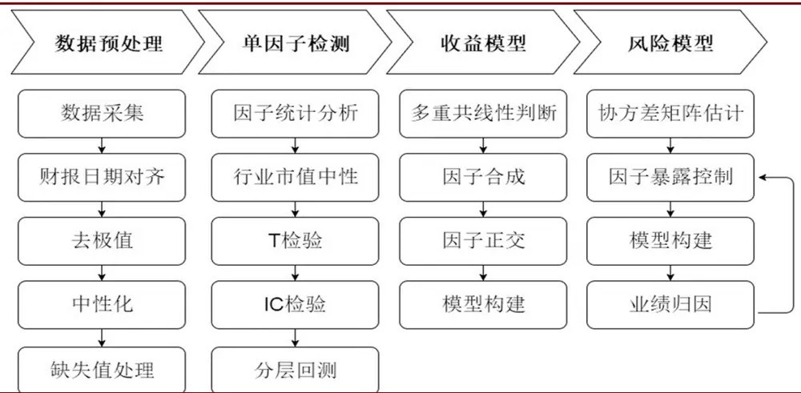
资料来源：渤海证券研究所

针对Barra CNE6 模型的因子，本文主要完成了单因子测试部分。

## 2.1数据预处理

提取的因子数据需经过数据对齐、去极值、标准化、缺失值处理等步骤，才可进入下一步的选股模型。

数据对齐：上市公司财报的报告期和报告发布日期之间有一定延迟，为避免未来信息，在提取数据的时候，需要对日期进行修正，保证因子数据为当时能获取的最新财报数据。

去极值：为避免数据中的极端值对回归结果产生过多影响，我们使用“中位数去极值法”，将超过上下限的极端值用上下限值代替。

$$
\widetilde\mathrm{{x}}_{\mathrm{i}}=\left\{\begin{array}{ll}{\mathrm{{x}_{M}+5\times\mathrm{{x}_{MAD},~\mathrm{x}_{i}>\mathrm{x}_{M}+5\times\mathrm{{x}_{MAD}}}}}\\{\mathrm{{x}_{i},~\mathrm{{x}_{M}-5\times\mathrm{{x}_{MAD}\leq\mathrm{x}_{i}\leq\mathrm{x}_{M}+5\times\mathrm{{x}_{MAD}}}}}}\\{\mathrm{{x}_{M}-5\times\mathrm{{x}_{MAD},~\mathrm{x}_{i}<\mathrm{x}_{M}-5\times\mathrm{{x}_{MAD}}}}}\end{array}\right.
$$

$$
\begin{array}{rl}{\mathrm{x_{i}}\colon}&{{}|\overline{{\sharp}}\setminus\mathcal{U}_{\Xi}^{\angle}\mathinner{\vec{\mathcal{F}}{:}}\overline{{\xi}}|}\end{array}
$$

$$
\begin{array}{rl}{\mathbf{x}_{\mathbf{M}}:}&{}|\dot{\vec{\mathcal{F}}}\cdot\boldsymbol{\xi}||\mathbf{x_{i}}\notin\mathbf{\Xi}^{\sharp}\dag\dag\dag\dag\dag\dag\dot{\Xi}\dot{\ast}\dag\dag\begin{array}{rl}{\mathbf{x}_{\mathbf{i}}\notin\mathbf{\Xi}\times\mathbf{x}_{\mathbf{i}}\mathrm{~}\forall\dag\dag,}\end{array}\end{array}
$$

$$
x_{MAD}\colon\|\dot{\vec{\cdot}}\vec{\jmath}\|x_{i}-x_{M}|\sharp\breve{\jmath}\|\dot{\vec{\jmath}}\|\dot{\vec{\cdot}}\dot{\jmath}\|\partial x_{i}-\partial x_{M}\|\dot{\vec{\jmath}}\|\dot{\vec{\jmath}}\|\dot{\vec{\jmath}}\|\dot{\vec{\cdot}}\dot{\vec{\jmath}}\|\dot{\vec{\jmath}}
$$

$$
\tilde{\mathrm{x}}_{\mathrm{i}}{:}~\frac{1}{2}\ddag\mathcal{B}\ll|\pm\frac{1}{2}\mathcal{B}|\llangle\Xi\llangle\frac{1}{2}\iint\sqrt{\Xi}\mathrm{~}\rlap/\Psi\llap/\ P-\frac{1}{2}\jmath\tilde{\tau}\gg\overline{{\xi}}|\Big]
$$

缺失值处理：提取出的因子可能会因为技术原因等情况出现缺失值，在缺失值少于 10%的情况下，因子缺失值使用行业中位数代替，当缺失值过多时，考虑更换数据源或使用其他因子。

标准化：由于各个因子的单位不同，为了使其具有可比性，需要对其进行ZScore标准化处理，即减去序列均值除以序列标准差，使因子序列近似成为一个符合N(0,1)正态分布的序列。

行业市值中性化：将最后得到的因子序列对流动市值与行业哑变量做线性回归，取残差作为新的因子值。

## 2.2 单因子检测

单因子检测方法分为统计检验和分层回测两种。在统计检验中，根据 Barra 手册中关于因子显著性测试的内容，对因子进行横截面回归，同时考虑行业与市值因素的影响。在每一个横截面上使用加权最小二乘回归（WLS），权重采用流通市值的平方根，一定程度上消除了异方差性。经过回归模型，我们可以得到 t 检验的 t值序列与因子收益序列。

接下来，计算因子IC值。将每一期的因子值作为因变量，与行业哑变量和市值变量进行回归，取其残差，作为剔除行业与市值影响后的因子值。再计算新因子值与下一期股票收益序列间的 Spearman 相关系数。

最终，回归模型输出以下几个指标：

a) t值绝对值平均值：衡量因子整体显著性的指标；

b) t值绝对值>2概率：衡量因子显著性是否稳定；

c) 因子收益平均值：衡量因子收益能力大小的指标；

d) 因子收益标准差：衡量因子收益能力波动率的指标；

e) 因子收益t值：衡量因子收益率统计上是否显著不为0的指标；

f) 因子收益>0 概率：衡量因子收益率方向性是否一致的指标；

g) IC 平均值：衡量模型预测能力的指标；

h) IC 标准差：衡量模型预测能力是否稳定的指标；

i) IRIC：IC 平均值/IC 标准差；

j) IC>0 概率：衡量模型预测收益方向性是否一致的指标。

在选取因子时，我们希望首先筛选出 t 值绝对值平均值大于或接近 2，因子收益与 IC值的平均值较大，标准差较小，因子收益与IC大于0 的概率接近0 或1（而不是在 0.5 附近）的因子。当然，选择因子的标准也不是绝对的，例如 Barra 手册中收录的 beta因子与市值因子，IC 大于 0的概率都接近 50%，但却具有较高的 t 值，这意味着因子对选股收益的影响显著，但是方向却并不稳定，在以风险控制为主要目标的模型中依然是需要考虑的一类因子。

除了统计检验之外，一个更为直观观察因子选股能力的方式就是观察因子值高的股票与因子值低的股票在走势上的不同之处，即分层回测模型。模型构建方法如下：

在每个截面期的最后一个交易日，提取样本内股票因子值，并剔除因子值缺失的股票。按照因子将样本内股票排序，并按照序号从大到小平均分为N 组（本报告中 N=5）。在下一个截面期的首个交易日，以当天的收盘价换仓并剔除当天因停牌、涨停等因素不能交易的股票。股改股票由于在复牌当日不受涨跌停板限制，可能出现极端涨幅，影响回测结果，故在复牌当月同样剔除股票池。对N 组股票的历史收益率进行回测，并计算其年化收益率、波动率、夏普比率等值。

如果情况理想，N 组股票的收益率会呈现较好的单调性，如12345或 54321，且每一组股票间的收益差距较大。这样的因子在选股上体现为较好的区分度。

## 3. 单因子测试结果

考虑到预期类因子的覆盖度较低，我们将 46 个三级因子中的 7 个预期类因子进行了剔除，并以剩下的因子对应不同的风格大类，按照等权方式合成了二级基础因子，并进一步等权合成构建了一级风格因子。以下展示了除Sentiment之外的八个风格大类因子的单因子检测结果，样本期为 2009 年1 月23 日至 2019 年 4月 30 日，样本股票范围分别选择了沪深 300、中证 500 及 Wind 全 A 指数的成分股；分层回测中将样本股票等分为5 组，股票范围为全A股。对于部分与CNE5重合的因子，考虑到其定义有所调整，所以同时将对应的 CNE5中定义的因子检测结果一并列出，以作对比。

## 3.1 规模因子

规模因子包含 LNCAP 和 MIDCAP 两个三级因子以及二者等权合成的 Size 一级因子。

从回归测试的结果来看，规模因子在Wind 全A 范围内显著性表现较好，则沪深300和中证500 范围内的显著性则并不明显。

表 2：规模因子的回归测试结果（Wind全 A）

|  | t 值绝对 值平均 值 | t 值绝对 值>2概 率 | 因子收 益平均 值 | 因子收 益标准 差 | 因子收 益t值 | 因子收 益>0概 率 | IC 平均 值 | IC 标准 差 | IRIC | IC>0 概 率 |
| --- | --- | --- | --- | --- | --- | --- | --- | --- | --- | --- |
| LNCAP | 2.951 | 59.68% | -0.072 | 0.654 | -1.230 | 42.74% | -0.009 | 0.089 | -0.102 | 44.35% |
| MIDCAP | 2.594 | 50.00% | 0.316 | 0.554 | 6.341 | 71.77% | 0.037 | 0.071 | 0.523 | 73.39% |
| Size | 2.565 | 53.23% | 0.227 | 0.892 | 2.838 | 62.10% | 0.038 | 0.056 | 0.672 | 72.58% |

资料来源：Wind，渤海证券研究所

表 3：规模因子的回归测试结果（沪深 300）

|  | t 值绝对 值平均 值 | t 值绝对 值>2概 率 | 因子收 益平均 值 | 因子收 益标准 差 | 因子收 益t值 | 因子收 益>0概 率 | IC 平均 值 | IC 标准 差 | IRIC | IC>0 概 率 |
| --- | --- | --- | --- | --- | --- | --- | --- | --- | --- | --- |
| LNCAP | 1.266 | 20.16% | 0.059 | 0.697 | 0.943 | 52.42% | 0.003 | 0.075 | 0.039 | 52.42% |
| MIDCAP | 1.202 | 16.94% | 0.032 | 0.915 | 0.385 | 52.42% | -0.007 | 0.156 | -0.044 | 45.16% |
| Size | 1.262 | 19.35% | 0.052 | 0.838 | 0.686 | 52.42% | -0.007 | 0.104 | -0.063 | 43.55% |

资料来源：Wind，渤海证券研究所

表 4：规模因子的回归测试结果（中证 500）

|  | t 值绝对值平均值 | t值绝对值>2 概率 | 因子收益平均值 | 因子收益标准差 | 因子收益t值 | 因子收益>0概率 | IC 平均值 | IC 标准差 | IRIC | IC>0 概率 |
| --- | --- | --- | --- | --- | --- | --- | --- | --- | --- | --- |
| LNCAP | 1.218 | 18.55% | -0.067 | 0.848 | -0.886 | 43.55% | 0.000 | 0.065 | -0.005 | 47.58% |
| MIDCAP | 0.967 | 12.10% | 0.049 | 1.294 | 0.418 | 47.58% | 0.005 | 0.088 | 0.058 | 53.23% |
| Size | 1.345 | 21.77% | -0.135 | 1.993 | -0.753 | 46.77% | 0.004 | 0.079 | 0.050 | 52.42% |

资料来源：Wind，渤海证券研究所

从分层回测的结果来看，三个因子均体现出一定的单调性，且MIDCAP和合成后的Size因子的表现好于LNCAP因子。整体来看，规模因子具有较好的选股能力。

图 2：LNCAP三级因子分层回测结果
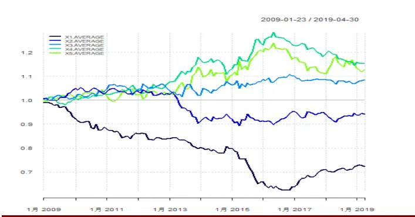
资料来源：Wind，渤海证券研究所

图 3：MIDCAP三级因子分层回测结果
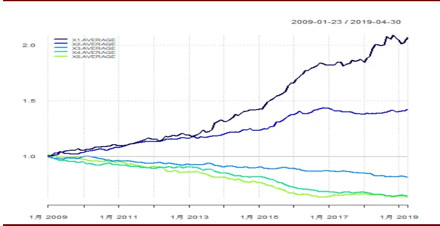
资料来源：Wind，渤海证券研究所

图 4：Size 一级因子分层回测结果
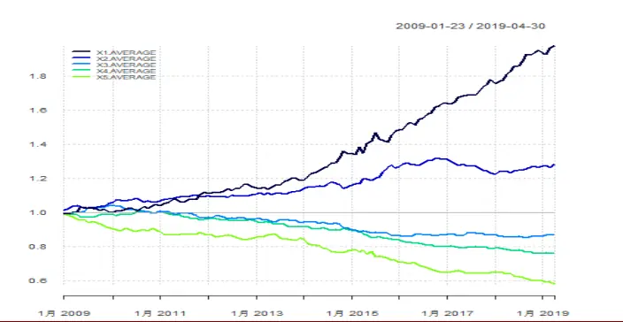
资料来源：Wind，渤海证券研究所

## 3.2波动率因子

波动率因子中，一级因子 Volatility 由 BETA 三级因子和 ResidualVolatility 二级因子构成，其中BETA、HSIGMA 和CMRA 三个因子的定义相对CNE5 有所变动，在检测结果中列出以作对比。（CNE5 因子使用_5后缀表示，下同）

从回归测试的结果来看，波动率因子中多数在三个指数成分股范围内均有显著性，而在沪深 300 和中证 500 指数成分股范围内的显著性则低于 Wind 全 A，其中CMRA 和 CMRA_5 因子仅在 Wind 全 A 范围内有显著性，BETA 因子在中证 500范围内显著性表现欠佳。除 CMRA 在 Wind 全 A 范围内的有效性强于 CMRA_5外，BETA、HSIGMA、CMRA 三个因子在其余指数范围内与 CNE5 相比，其显著性表现出下降或并未有明显的提升。

表 5：波动率因子的回归测试结果（Wind全 A）

|  | t 值绝对值平均值 | t 值绝对值>2概率 | 因子收益平均值 | 因子收益标准差 | 因子收益t值 | 因子收益>0概率 | IC 平均值 | IC 标准差 | IRIC | IC>0 概率 |
| --- | --- | --- | --- | --- | --- | --- | --- | --- | --- | --- |
| BETA | 3.744 | 64.52% | -0.011 | 1.006 | -0.121 | 47.58% | -0.004 | 0.094 | -0.041 | 43.55% |
| BETA_5CMRA | 4.179 | 67.74% | 0.027 | 1.158 | 0.257 | 45.97% | -0.003 | 0.107 | -0.029 | 46.77% |
|  | 4.355 | 70.97% | -0.092 | 1.043 | -0.986 | 45.16% | -0.023 | 0.111 | -0.207 | 37.90% |
| CMRA_5DASTDHSIGMAHSIGMA_5 | 4.013 | 69.35% | -0.013 | 0.994 | -0.150 | 50.00% | -0.011 | 0.103 | -0.104 | 43.55% |
|  | 5.958 | 78.23% | -0.338 | 1.341 | -2.809 | 39.52% | -0.071 | 0.144 | -0.495 | 31.45% |
|  | 4.667 | 69.35% | -0.279 | 1.137 | -2.732 | 38.71% | -0.049 | 0.117 | -0.416 | 33.06% |
|  | 5.154 | 75.81% | -0.325 | 1.210 | -2.992 | 36.29% | -0.058 | 0.130 | -0.446 | 30.65% |
| ResidualVolatility | 5.762 | 75.81% | -0.341 | 1.628 | -2.336 | 43.55% | -0.059 | 0.146 | -0.407 | 32.26% |
| Volatility | 4.615 | 72.58% | -0.248 | 1.527 | -1.812 | 41.13% | -0.040 | 0.119 | -0.337 | 31.45% |

资料来源：Wind，渤海证券研究所

表 6：波动率因子的回归测试结果（沪深 300）

|  |  | t 值绝对值平均值 | t 值绝对值>2概率 | 因子收益平均值 | 因子收益标准差 | 因子收益t值 | 因子收益>0概率 | IC 平均值 | IC 标准差 | IRIC | IC>0 概率 |  |  |  |  |  |
| --- | --- | --- | --- | --- | --- | --- | --- | --- | --- | --- | --- | --- | --- | --- | --- | --- |
|  | BETA | 2.130 | 37.10% | -0.037 | 1.298 | -0.320 | 42.74% | -0.020 | 0.190 | -0.108 | 40.32% |  |  |  |  |  |
| Volatility |  |  |  | 2.273 | 44.35% | 0.022 | 1.515 | 0.164 | 42.74% | -0.019 | 0.198 |  |  |  |  |  |
|  |  |  |  | 1.987 | 39.52% | -0.097 | 1.192 | -0.910 | 45.97% | -0.022 | 0.159 |  | 43.55%45.97% |  |  |  |
|  |  |  |  | 1.782 | 40.32% | -0.069 | 1.143 | -0.668 | 46.77% | -0.017 | 0.116 | -0.145 |  |  |  |  |
|  |  |  |  | 2.445 | 47.58% | -0.392 | 1.484 | -2.939 | 33.06% | -0.052 | 0.166 | -0.315 | 33.06%39.52% |  |  |  |
|  |  |  |  |  |  |  | 2.075 | 48.39% | -0.275 | 1.209 | -2.534 | 39.52% |  | -0.040 | 0.138 | -0.290 |
|  |  |  |  | 2.059 | 45.97% | -0.358 | 1.343 | -2.965 | 42.74% | -0.041 | 0.130 | -0.319 | 36.29% |  |  |  |
|  |  | ResidualVolatility |  |  | 2.349 | 44.35% | -0.349 | 1.691 | -2.301 | 39.52% | -0.045 | 0.163 | -0.279 | 38.71% |  |  |
|  |  | 2.366 | 46.77% | -0.242 | 1.870 | -1.440 | 43.55% | -0.041 | 0.199 | -0.205 | 38.71% |  |  |  |  |  |

资料来源：Wind，渤海证券研究所

表 7：波动率因子的回归测试结果（中证 500）

|  | t 值绝 对值平 均值 | t 值绝 对值>2 概率 | 因子收 益平均 值 | 因子收 益标准 差 | 因子收 益t值 | 因子收 益>0概 率 | IC 平均 值 | IC 标准 差 | IRIC | IC>0 概 率 |  |  |  |
| --- | --- | --- | --- | --- | --- | --- | --- | --- | --- | --- | --- | --- | --- |
| BETA | 1.965 | 39.52% | -0.016 | 1.165 | -0.152 | 43.55% | -0.004 | 0.120 | -0.034 | 45.97% |  |  |  |
| BETA_5 | 2.100 | 46.77% | 0.017 | 1.219 | 0.154 | 44.35% | -0.006 | 0.128 | -0.048 | 45.16% |  |  |  |
| CMRA | 1.897 | 40.32% | -0.099 | 1.053 | -1.048 | 42.74% | -0.030 | 0.122 | -0.250 | 37.10% |  |  |  |
| CMRA_5 | 1.786 | 32.26% | -0.065 | 1.014 | -0.710 | 45.97% | -0.021 | 0.113 | -0.185 | 42.74% |  |  |  |
| DASTDHSIGMAHSIGMA_5ResidualVolatilityVolatility | 2.680 | 60.48% | -0.311 | 1.472 | -2.354 | 36.29% | -0.071 | 0.144 | -0.493 | 27.42% |  |  |  |
|  |  |  |  | 2.103 | 45.97% | -0.234 | 1.172 | -2.223 | 39.52% | -0.053 | 0.112 | -0.470 | 30.65% |
|  |  |  | 2.255 | 50.00% | -0.282 | 1.271 | -2.470 | 36.29% | -0.058 | 0.120 | -0.486 | 29.03% |  |
|  | 2.564 | 54.03% | -0.313 | 1.689 | -2.066 | 41.13% | -0.063 | 0.141 | -0.445 | 35.48% |  |  |  |
|  | 2.225 | 42.74% | -0.227 | 1.727 | -1.465 | 39.52% | -0.042 | 0.135 | -0.310 | 33.87% |  |  |  |

资料来源：Wind，渤海证券研究所

从分层回测的结果来看，除 BETA 和CMRA 因子外，其余波动率因子能体现出一定的单调性，且 HSIGMA、DASTD 和 Volatility 因子表现相对突出。整体来看，波动率因子中，HSIGMA、DASTD 和 Volatility 因子选股能力相对较好。

图 5：BETA 三级因子分层回测结果
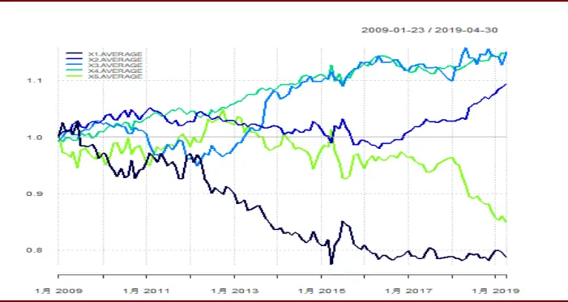
资料来源：Wind，渤海证券研究所

图 6：BETA_5因子分层回测结果
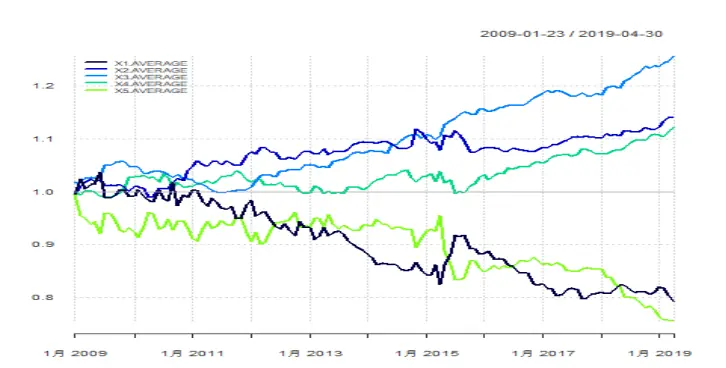
资料来源：Wind，渤海证券研究所

图 7：HSIGMA三级因子分层回测结果
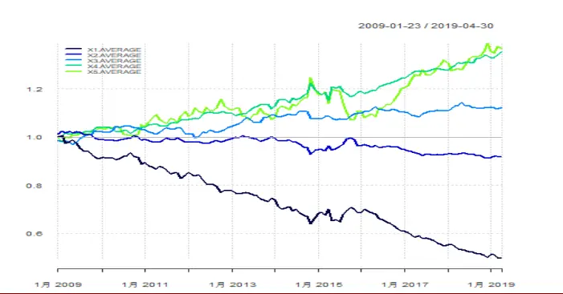
资料来源：Wind，渤海证券研究所

图 8：HSIGMA_5 因子分层回测结果
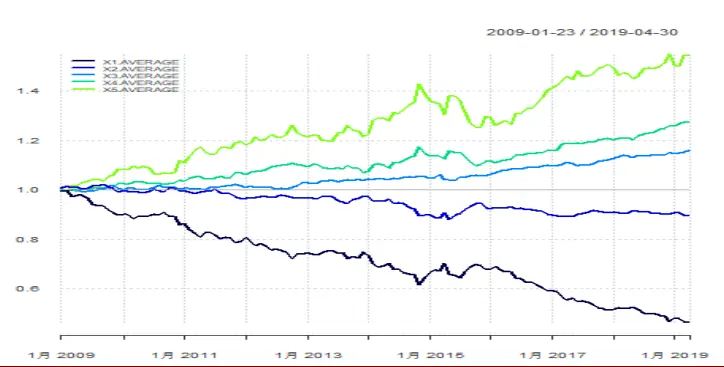
资料来源：Wind，渤海证券研究所

图 9：CMRA 三级因子分层回测结果
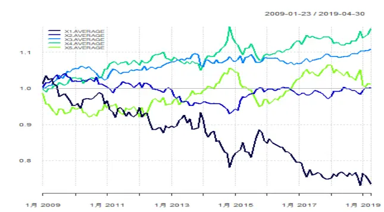

图 10：CMRA_5因子分层回测结果
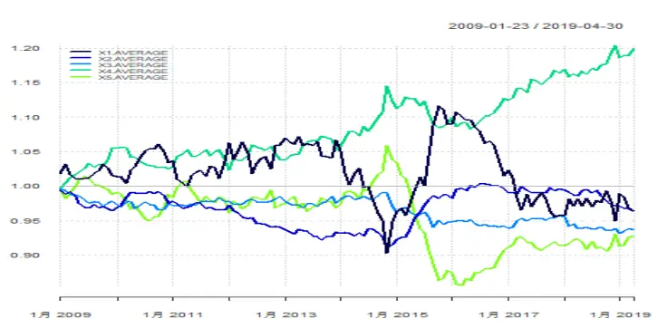

资料来源：Wind，渤海证券研究所

图 11：DASTD三级因子分层回测结果
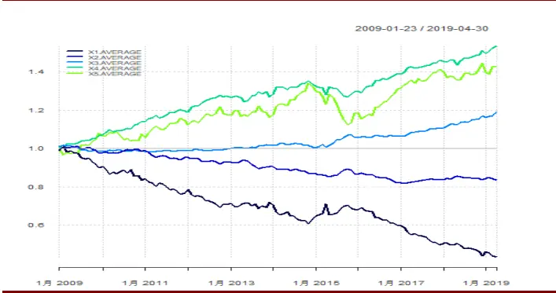
资料来源：Wind，渤海证券研究所
资料来源：Wind，渤海证券研究所

图 12：ResidualVolatility 二级因子分层回测结果
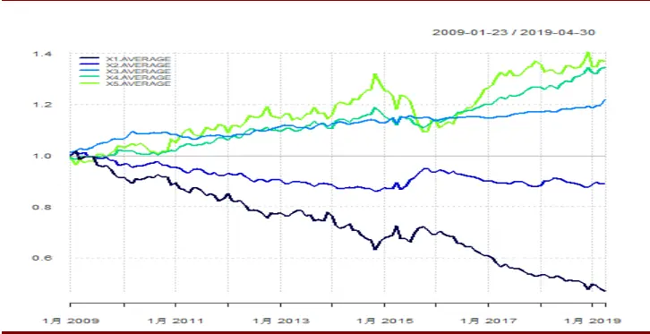
资料来源：Wind，渤海证券研究所

图 13：Volatility 一级因子分层回测结果
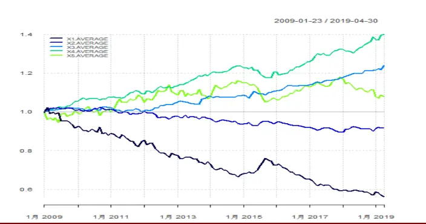
资料来源：Wind，渤海证券研究所

## 3.3流动性因子

流动性因子仅在 CNE5的基础上增添了三级因子ATVR。

从回归测试的结果来看，流动性因子在Wind 全 A 范围内表现出较高的显著性，在沪深 300 范围内均不显著，除 STOA 因子外，其余因子在中证 500 范围内均显著，且STOA 因子在全部3个指数范围内的表现均弱于其余因子。

表 8：流动性因子的回归测试结果（Wind全 A）

|  | t 值绝 对值平 均值 | t 值绝 对值>2 概率 | 因子收益平 均值 | 因子收 益标准 差 | 因子收 益t值 | 因子收 益>0概 率 | IC平 均值 | IC 标 准差 | IRIC | IC>0 概 率 |
| --- | --- | --- | --- | --- | --- | --- | --- | --- | --- | --- |
| STOA | 3.946 | 69.35% | -0.363 | 0.801 | -5.050 | 31.45% | -0.056 | 0.100 | -0.555 | 30.65% |
| STOM | 4.998 | 78.23% | -0.568 | 0.946 | -6.688 | 26.61% | -0.090 | 0.110 | -0.818 | 20.97% |
| STOQ | 4.583 | 75.81% | -0.467 | 0.895 | -5.810 | 26.61% | -0.074 | 0.110 | -0.676 | 25.00% |
| ATVRLiquidity | 4.5814.759 | 77.42%76.61% | -0.445-0.536 | 0.9841.010 | -5.042-5.908 | 33.06%26.61% | -0.067-0.076 | 0.1000.112 | -0.667-0.676 | 27.42%25.00% |

资料来源：Wind，渤海证券研究所

表 9：流动性因子的回归测试结果（沪深 300）

|  | t 值绝 对值平 均值 | t 值绝 对值>2 概率 | 因子收益平 均值 | 因子收 益标准 差 | 因子收 益t值 | 因子收 益>0概 率 | IC平 均值 | IC 标 准差 | IRIC | IC>0 概 率 |
| --- | --- | --- | --- | --- | --- | --- | --- | --- | --- | --- |
| STOA | 1.571 | 32.26% | -0.205 | 0.789 | -2.888 | 42.74% | -0.042 | 0.109 | -0.381 | 36.29% |
| STOM | 1.839 | 41.94% | -0.263 | 1.047 | -2.802 | 39.52% | -0.048 | 0.117 | -0.414 | 36.29% |
| STOQ | 1.702 | 37.90% | -0.237 | 0.948 | -2.789 | 40.32% | -0.046 | 0.113 | -0.406 | 33.06% |
| ATVR | 1.808 | 42.74% | -0.448 | 1.444 | -3.453 | 37.10% | -0.035 | 0.088 | -0.393 | 35.48% |
| Liquidity | 1.755 | 40.32% | -0.301 | 1.090 | -3.072 | 38.71% | -0.047 | 0.110 | -0.425 | 32.26% |

资料来源：Wind，渤海证券研究所

表 10：流动性因子的回归测试结果（中证 500）

|  | t值绝 对值平 均值 | t 值绝 对值>2 概率 | 因子收益平 均值 | 因子收 益标准 差 | 因子收 益t值 | 因子收 益>0概 率 | IC平 | IC 标 准差 | IC>0 概 IRIC |  |
| --- | --- | --- | --- | --- | --- | --- | --- | --- | --- | --- |
|  |  |  |  |  |  |  |  |  |  | 均值 |
| STOA | 1.935 | 39.52% | -0.402 | 0.939 | -4.765 | 31.45% | -0.055 | 0.094 | -0.584 | 28.23% |
| STOM | 2.380 | 50.81% | -0.574 | 1.089 | -5.872 | 25.81% | -0.083 | 0.110 | -0.751 | 19.35% |
| STOQ | 2.244 | 52.42% | -0.491 | 1.056 | -5.181 | 28.23% | -0.071 | 0.108 | -0.652 | 23.39% |
| ATVR | 2.134 | 45.16% | -0.537 | 1.163 | -5.138 | 28.23% | -0.064 | 0.093 | -0.692 | 25.00% |
| Liquidity | 2.279 | 50.81% | -0.573 | 1.170 | -5.456 | 28.23% | -0.072 | 0.106 | -0.684 | 25.00% |

资料来源：Wind，渤海证券研究所

从分层回测的结果来看，流动性因子单调性表现良好。总体来看，流动性因子具有较突出的选股能力。

图 14：STOM三级因子分层回测结果
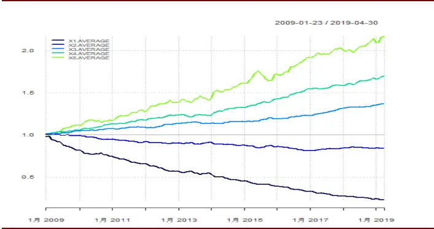
资料来源：Wind，渤海证券研究所

图 15：STOQ三级因子分层回测结果
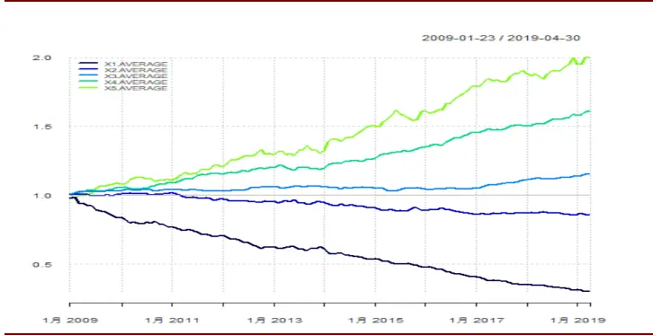
资料来源：Wind，渤海证券研究所

图 16：STOA三级因子分层回测结果
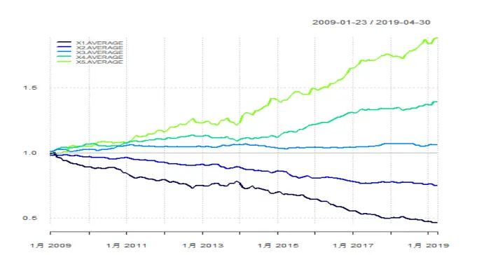
资料来源：Wind，渤海证券研究所

图 17：ATVR三级因子分层回测结果
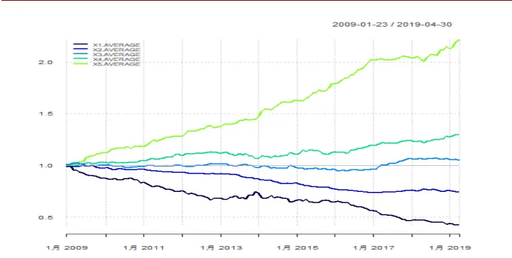
资料来源：Wind，渤海证券研究所

图 18：Liquidity 一级因子分层回测结果
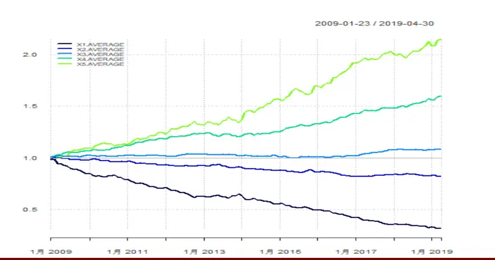
资料来源：Wind，渤海证券研究所

## 3.4 动量因子

动量因子中新增了 STREV、SEASON、INDMOM 和 HALPHA 三级因子，并以RSTR 和HALPHA 合成了Momentum 二级因子。以下同样列出CNE5中的RSTR因子以进行对比。

从回归测试的结果来看，INDMOM和SEASON因子在全部指数范围内均不显著，RSTR_5 在 Wind 全 A 和沪深 300 范围内显著，STREV 在 Wind 全 A 和中证 500范围内显著，其余因子仅在Wind全A 范围内体现出较好的显著性。在全部3 个指数范围内，RSTR 均未比 RSTR（CNE5）表现出更高的显著性。

表 11：动量因子的回归测试结果（Wind全 A）

|  | t 值绝 对值平 均值 | t 值绝 对值>2 概率 | 因子收益平 均值 | 因子收 益标准 差 | 因子收 益t值 | 因子收 益>0概 率 | IC平 均值 | IC 标 准差 | IRIC | IC>0概 率 |
| --- | --- | --- | --- | --- | --- | --- | --- | --- | --- | --- |
| HALPHA | 4.475 | 72.58% | -0.313 | 1.085 | -3.210 | 39.52% | -0.053 | 0.116 | -0.458 | 36.29% |
| INDMOM | 0.683 | 2.42% | -0.001 | 0.180 | -0.087 | 53.23% | -0.006 | 0.107 | -0.056 | 46.77% |
| RSTR | 2.055 | 38.71% | -0.085 | 0.549 | -1.717 | 41.94% | -0.016 | 0.060 | -0.265 | 42.74% |
| RSTR_5 | 4.344 | 73.39% | -0.071 | 1.034 | -0.762 | 49.19% | -0.020 | 0.111 | -0.180 | 42.74% |
| SEASON | 1.292 | 19.35% | -0.029 | 0.328 | -0.988 | 43.55% | 0.000 | 0.053 | -0.005 | 46.77% |
| STREV | 3.771 | 54.84% | -0.502 | 1.007 | -5.549 | 29.84% | -0.061 | 0.098 | -0.624 | 20.16% |
| Momentum_2 | 3.089 | 54.03% | -0.725 | 1.604 | -5.032 | 31.45% | -0.063 | 0.091 | -0.691 | 27.42% |
| Momentum | 3.986 | 70.97% | -0.328 | 1.266 | -2.888 | 37.90% | -0.045 | 0.104 | -0.430 | 36.29% |

资料来源：Wind，渤海证券研究所

表 12：动量因子的回归测试结果（沪深 300）

|  | t值绝 对值平 均值 | t 值绝 对值>2 概率 | 因子收益平 均值 | 因子收益 标准差 | 因子收 益t值 | 因子收 益>0概 率 | IC平 均值 | IC 标 准差 | IRIC | IC>0 概 率 |
| --- | --- | --- | --- | --- | --- | --- | --- | --- | --- | --- |
| HALPHA | 1.940 | 37.10% | -0.192 | 1.177 | -1.812 | 41.13% | -0.012 | 0.141 | -0.088 | 45.16% |
| INDMOM | 0.996 | 12.90% | 1350.374 | 16825.300 | 0.894 | 50.00% | 0.001 | 0.155 | 0.005 | 49.19% |
| RSTR | 0.992 | 8.06% | -0.050 | 0.512 | -1.078 | 44.35% | -0.012 | 0.074 | -0.166 | 44.35% |
| RSTR_5 | 2.033 | 44.35% | 0.022 | 1.344 | 0.186 | 50.81% | 0.008 | 0.152 | 0.054 | 52.42% |
| SEASON | 1.019 | 10.48% | -0.006 | 0.675 | -0.097 | 50.00% | 0.001 | 0.098 | 0.007 | 50.00% |
| STREV | 1.784 | 33.06% | -0.441 | 1.332 | -3.687 | 39.52% | -0.041 | 0.122 | -0.337 | 33.87% |
| Momentum_2 | 1.491 | 29.84% | -0.486 | 1.921 | -2.819 | 44.35% | -0.031 | 0.115 | -0.270 | 40.32% |
| Momentum | 1.703 | 35.48% | -0.202 | 1.243 | -1.806 | 38.71% | -0.018 | 0.121 | -0.145 | 42.74% |

资料来源：Wind，渤海证券研究所

表 13：动量因子的回归测试结果（中证 500）

|  | t值绝 对值平 均值 | t 值绝 对值>2 概率 | 因子收益平 均值 | 因子收益 标准差 | 因子收 益t值 | 因子收 益>0概 率 | IC平 均值 | IC 标 准差 | IRIC | IC>0 概 率 |
| --- | --- | --- | --- | --- | --- | --- | --- | --- | --- | --- |
| HALPHA | 1.763 | 38.71% | -0.260 | 1.239 | -2.339 | 46.77% | -0.052 | 0.140 | -0.374 | 36.29% |
| INDMOM | 0.819 | 7.26% | -764.160 | 30791.842 | -0.276 | 50.00% | -0.003 | 0.106 | -0.026 | 48.39% |
| RSTR | 1.001 | 12.10% | -0.014 | 0.584 | -0.276 | 45.16% | -0.007 | 0.064 | -0.116 | 42.74% |
| RSTR_5 | 1.715 | 36.29% | 0.095 | 1.141 | 0.923 | 54.03% | -0.020 | 0.137 | -0.148 | 40.32% |
| SEASON | 0.903 | 9.68% | -0.010 | 0.440 | -0.257 | 50.81% | 0.005 | 0.067 | 0.070 | 54.84% |
| STREV | 2.030 | 41.13% | -0.316 | 1.249 | -2.820 | 41.13% | -0.049 | 0.120 | -0.408 | 35.48% |
| Momentum_2 | 1.423 | 25.81% | -0.461 | 1.661 | -3.091 | 37.90% | -0.050 | 0.112 | -0.445 | 34.68% |
| Momentum | 1.530 | 28.23% | -0.193 | 1.249 | -1.720 | 44.35% | -0.036 | 0.119 | -0.305 | 35.48% |

资料来源：Wind，渤海证券研究所

从分层回测的结果来看，三级因子中的STREV和HALPHA表现出一定的单调性，且等权合成的 Momentum二级和一级因子也表现出较好的单调性。总体来看，动量因子中，新增的STREV 三级因子和 Momentum 二级因子选股能力相对较好。

图 19：RSTR三级因子分层回测结果
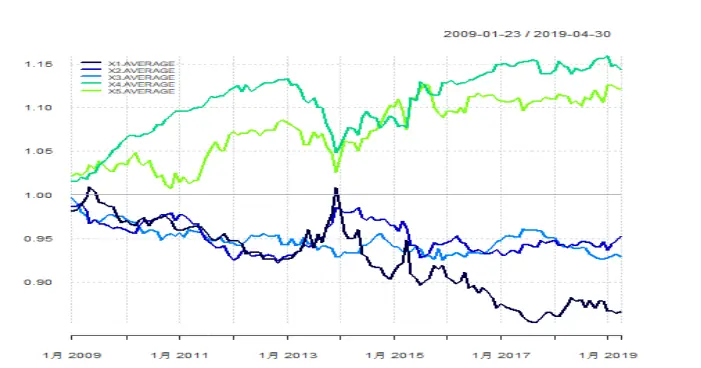
资料来源：Wind，渤海证券研究所

图 20：RSTR_5因子分层回测结果
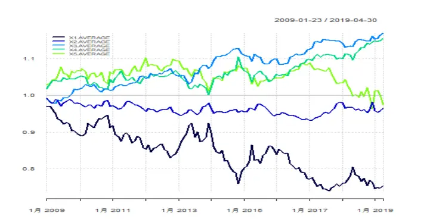
资料来源：Wind，渤海证券研究所

图 21：STREV三级因子分层回测结果
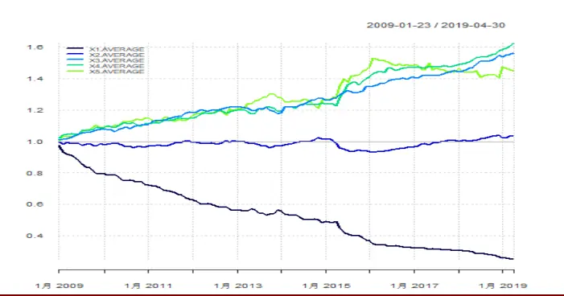
资料来源：Wind，渤海证券研究所

图 22：SEASON三级因子分层回测结果
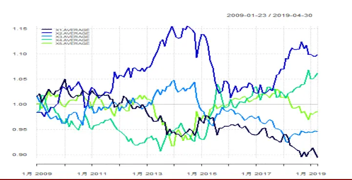
资料来源：Wind，渤海证券研究所

图 23：INDMOM三级因子分层回测结果
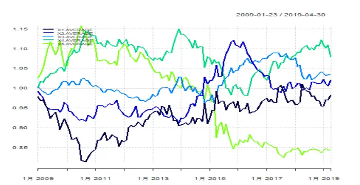
资料来源：Wind，渤海证券研究所

图 24：HALPHA三级因子分层回测结果
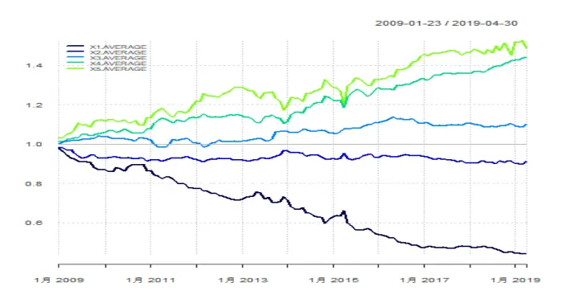
资料来源：Wind，渤海证券研究所

图 25：Momentum 二级因子分层回测结果
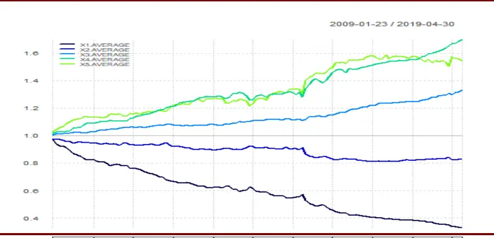
资料来源：Wind1渤海证券研究所月2015 1月2017 1月2019

图 26：Momentum 一级因子分层回测结果
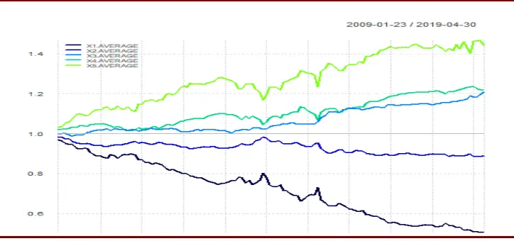
资料来源：Wind2渤海证券研究所1月2015 11月2019

## 3.5 质量因子

质量因子新增 Earnings Variability、Earnings Quality、Profitability 及 InvestmentQuality 四个二级因子，且 MLEV、BLEV 及 DTOA 这 3 个三级因子相比 CNE5定义均有调整，同样列示了结果作为对比。我们剔除了预期类因子ETOPF_STD，且在构建对应二级因子 EarningsVariability 时，未包含该因子在内。

从回归测试的结果来看，EarningsQuality 二级因子及其对应的三级因子在各指数范围内均表现较差；EarningsVariability 二级因子仅其对应的 VSAL 三级因子在Wind 全 A 范围内显著；Leverage 和 Profitability 二级因子及其对应的三级因子均在Wind 全A范围内显著，在其余两指数范围内不显著；除 InvestmentQuality二级因子对应的 CXGRO 三级因子外，其余因子均仅在 Wind 全 A 范围内显著；Quality 一级因子在全部 3 个指数范围内均不显著。同时 MLEV、BLEV 及 DTOA三个因子的结果与CNE5相比并未有显著提升。

表 14：质量因子的回归测试结果（Wind 全 A）

|  | t 值绝对值平均值 | t 值绝对值>2概率 | 因子收益平均值 | 因子收益标准差 | 因子收益t值 | 因子收益>0概率 | IC平均值 | IC 标准差 | IRIC | IC>0 概率 |  |  |  |  |  |  |
| --- | --- | --- | --- | --- | --- | --- | --- | --- | --- | --- | --- | --- | --- | --- | --- | --- |
| ABS | 1.660 | 34.68% | -0.039 | 0.437 | -0.983 | 47.58% | -0.006 | 0.046 | -0.125 | 44.35% |  |  |  |  |  |  |
| ACFAGROATOBLEVBLEV_5CXGRODTOADTOA_5GP | 1.852 | 39.52% | -0.026 | 0.480 | -0.612 | 47.58% | -0.004 | 0.051 | -0.077 | 48.39% |  |  |  |  |  |  |
|  |  |  |  |  | 2.898 | 60.48% | -0.014 | 0.723 | -0.216 | 43.55% | 0.007 | 0.085 | 0.079 | 53.23% |  |  |
|  |  |  |  |  | 1.719 | 32.26% | 0.065 | 0.428 | 1.696 | 55.65% | 0.008 | 0.045 | 0.180 | 57.26% |  |  |
|  |  |  |  |  |  |  | 2.389 | 54.03% | -0.050 | 0.616 | -0.902 | 42.74% | -0.001 | 0.060 | -0.023 | 46.77% |
|  |  |  |  |  | 2.396 | 50.81% | -0.032 | 0.629 | -0.568 | 44.35% | 0.000 | 0.061 | -0.004 | 47.58% |  |  |
|  |  |  | 1.932 | 46.77% | -0.015 | 0.516 | -0.332 | 44.35% | 0.003 | 0.057 | 0.060 | 50.81%45.16%46.77%58.87% |  |  |  |  |
|  | 2.533 | 54.84% | -0.044 | 0.692 | -0.706 | 45.16% | -0.006 | 0.076 | -0.078 |  |  |  |  |  |  |  |
|  | 2.278 | 51.61% | -0.069 | 0.606 | -1.272 | 41.94% | -0.006 | 0.063 | -0.103 |  |  |  |  |  |  |  |
|  | 2.714 | 55.65% | 0.130 | 0.647 | 2.245 | 61.29% | 0.019 | 0.068 | 0.277 |  |  |  |  |  |  |  |

请务必阅读正文之后的免责声明
渤海证券股份有限公司具备证券投资咨询业务资格

| GPM | 2.319 | 52.42% | 0.082 | 0.568 | 1.605 | 58.06% | 0.012 | 0.065 | 0.184 | 58.06% |
| --- | --- | --- | --- | --- | --- | --- | --- | --- | --- | --- |
| IGRO | 2.437 | 53.23% | -0.056 | 0.608 | -1.032 | 43.55% | 0.003 | 0.068 | 0.049 | 53.23% |
| MLEV | 3.249 | 62.10% | 0.037 | 0.856 | 0.476 | 47.58% | 0.010 | 0.082 | 0.120 | 52.42% |
| MLEV_5 | 3.183 | 60.48% | 0.048 | 0.852 | 0.626 | 49.19% | 0.012 | 0.081 | 0.142 | 54.03% |
| ROA | 3.189 | 69.35% | 0.138 | 0.740 | 2.075 | 56.45% | 0.026 | 0.088 | 0.292 | 60.48% |
| VERN | 1.245 | 23.39% | -0.024 | 0.341 | -0.790 | 43.55% | -0.001 | 0.036 | -0.024 | 47.58% |
| VFL0 | 0.826 | 7.26% | 0.005 | 0.226 | 0.245 | 53.23% | 0.003 | 0.026 | 0.102 | 52.42% |
| VSAL | 2.326 | 47.58% | -0.046 | 0.565 | -0.903 | 46.77% | -0.001 | 0.057 | -0.021 | 50.00% |
| EarningsVariability | 1.827 | 39.52% | -0.056 | 0.749 | -0.840 | 45.97% | 0.000 | 0.044 | 0.000 | 48.39% |
| EarningsQuality | 1.942 | 40.32% | -0.042 | 0.600 | -0.780 | 48.39% | -0.005 | 0.055 | -0.089 | 50.00% |
| InvestmentQuality | 2.893 | 59.68% | -0.048 | 0.913 | -0.585 | 44.35% | 0.005 | 0.085 | 0.059 | 50.81% |
| Leverage | 2.986 | 58.87% | -0.022 | 0.905 | -0.275 | 46.77% | 0.000 | 0.084 | -0.004 | 47.58% |
| Profitablity | 3.063 | 63.71% | 0.215 | 1.049 | 2.279 | 60.48% | 0.022 | 0.079 | 0.278 | 59.68% |
| Quality | 1.673 | 37.10% | -0.001 | 1.337 | -0.008 | 46.77% | 0.009 | 0.041 | 0.212 | 59.68% |

资料来源：Wind，渤海证券研究所

表 15：质量因子的回归测试结果（沪深 300）

|  | t值绝对值平均值 | t值绝对值>2概率 | 因子收益平均值 | 因子收益标准差 | 因子收益t值 | 因子收益>0概率 | IC平均值 | IC 标准差 | IRIC | IC>0 概率 |
| --- | --- | --- | --- | --- | --- | --- | --- | --- | --- | --- |
| ABS | 1.121 | 13.71% | 0.021 | 0.721 | 0.330 | 51.61% | 0.005 | 0.077 | 0.062 | 52.42% |
| ACF | 1.141 | 14.52% | 0.050 | 0.810 | 0.686 | 51.61% | 0.009 | 0.078 | 0.111 | 52.42% |
| AGRO | 1.436 | 26.61% | -0.207 | 1.154 | -1.995 | 42.74% | -0.013 | 0.126 | -0.105 | 48.39% |
| ATO | 1.151 | 18.55% | 0.055 | 0.728 | 0.843 | 56.45% | 0.023 | 0.083 | 0.281 | 62.10% |
| BLEV | 1.220 | 12.10% | 0.001 | 0.686 | 0.021 | 43.55% | -0.019 | 0.094 | -0.203 | 41.13% |
| BLEV_5 | 1.238 | 13.71% | 0.022 | 0.707 | 0.348 | 45.16% | -0.016 | 0.099 | -0.162 | 40.32% |
| CXGRO | 1.027 | 12.90% | -0.115 | 0.842 | -1.527 | 44.35% | -0.007 | 0.090 | -0.080 | 45.16% |
| DTOA | 1.191 | 18.55% | 0.008 | 0.887 | 0.100 | 48.39% | -0.010 | 0.089 | -0.114 | 40.32% |
| DTOA_5 | 1.044 | 14.52% | -0.047 | 0.737 | -0.704 | 44.35% | -0.021 | 0.094 | -0.219 | 43.55% |
| GP | 1.511 | 29.84% | 0.085 | 0.937 | 1.011 | 61.29% | 0.032 | 0.123 | 0.264 | 62.90% |
| GPM | 1.268 | 20.97% | 0.031 | 0.796 | 0.431 | 57.26% | 0.014 | 0.092 | 0.147 | 58.06% |
| IGRO | 1.276 | 19.35% | -0.139 | 0.738 | -2.103 | 37.90% | -0.014 | 0.097 | -0.149 | 42.74% |
| MLEV | 1.530 | 27.42% | 0.084 | 0.893 | 1.052 | 49.19% | -0.007 | 0.125 | -0.057 | 44.35% |
| MLEV_5 | 1.535 | 28.23% | 0.088 | 0.904 | 1.081 | 50.81% | -0.005 | 0.129 | -0.036 | 46.77% |
| ROA | 1.512 | 28.23% | 0.068 | 1.011 | 0.754 | 55.65% | 0.028 | 0.125 | 0.223 | 61.29% |
| VERN | 0.989 | 8.06% | -0.148 | 0.861 | -1.910 | 35.48% | -0.016 | 0.094 | -0.167 | 45.16% |
| VFL0 | 0.822 | 7.26% | -0.067 | 0.520 | -1.435 | 42.74% | -0.007 | 0.059 | -0.115 | 44.35% |
| VSAL | 1.379 | 29.03% | -0.133 | 0.855 | -1.728 | 45.16% | -0.010 | 0.113 | -0.087 | 49.19% |
| EarningsVariability | 1.261 | 20.97% | -0.287 | 1.289 | -2.481 | 38.71% | -0.016 | 0.100 | -0.158 | 41.13% |
| EarningsQuality | 1.200 | 20.16% | 0.049 | 1.010 | 0.535 | 48.39% | 0.007 | 0.081 | 0.085 | 54.84% |
| InvestmentQuality | 1.373 | 25.81% | -0.233 | 1.248 | -2.082 | 40.32% | -0.015 | 0.119 | -0.126 | 47.58% |
| Leverage | 1.385 | 25.81% | 0.046 | 0.978 | 0.522 | 47.58% | -0.014 | 0.108 | -0.129 | 43.55% |
| Profitablity | 1.534 | 33.87% | 0.124 | 1.538 | 0.896 | 56.45% | 0.034 | 0.127 | 0.268 | 63.71% |
| Quality | 1.220 | 15.32% | -0.303 | 2.280 | -1.481 | 41.94% | -0.006 | 0.099 | -0.063 | 49.19% |

资料来源：Wind，渤海证券研究所

表 16：质量因子的回归测试结果（中证 500）

|  | t 值绝对值平均值 | t 值绝对值>2概率 | 因子收益平均值 | 因子收益标准差 | 因子收益t值 | 因子收益>0概率 | IC平均值 | IC 标准差 | IRIC | IC>0 概率 |
| --- | --- | --- | --- | --- | --- | --- | --- | --- | --- | --- |
| ABS | 1.020 | 10.48% | -0.057 | 0.556 | -1.138 | 46.77% | -0.003 | 0.062 | -0.044 | 52.42% |
| ACF | 1.167 | 16.13% | -0.077 | 0.639 | -1.348 | 48.39% | -0.006 | 0.068 | -0.085 | 48.39% |
| AGRO | 1.562 | 33.87% | -0.052 | 0.874 | -0.669 | 47.58% | -0.010 | 0.087 | -0.116 | 47.58% |
| ATO | 1.193 | 20.16% | 0.043 | 0.638 | 0.756 | 52.42% | 0.008 | 0.069 | 0.110 | 54.03% |
| BLEV | 1.143 | 14.52% | -0.035 | 0.541 | -0.714 | 46.77% | -0.006 | 0.074 | -0.086 | 44.35% |
| BLEV_5 | 1.119 | 12.10% | -0.025 | 0.538 | -0.508 | 49.19% | -0.004 | 0.075 | -0.058 | 50.81% |
| CXGRO | 1.190 | 18.55% | -0.064 | 0.661 | -1.082 | 43.55% | -0.004 | 0.063 | -0.069 | 41.94% |
| DTOA | 1.189 | 18.55% | -0.071 | 0.644 | -1.235 | 45.97% | -0.013 | 0.070 | -0.185 | 40.32% |
| DTOA_5 | 1.234 | 17.74% | -0.067 | 0.633 | -1.174 | 45.97% | -0.013 | 0.080 | -0.158 | 44.35% |
| GP | 1.472 | 25.81% | 0.146 | 0.824 | 1.972 | 58.87% | 0.023 | 0.098 | 0.236 | 58.06% |
| GPM | 1.150 | 20.16% | 0.132 | 0.656 | 2.242 | 62.10% | 0.016 | 0.066 | 0.236 | 56.45% |
| IGRO | 1.420 | 21.77% | -0.003 | 0.747 | -0.039 | 48.39% | -0.004 | 0.069 | -0.058 | 51.61% |
| MLEV | 1.392 | 22.58% | 0.002 | 0.729 | 0.030 | 46.77% | 0.005 | 0.096 | 0.048 | 48.39% |
| MLEV_5 | 1.335 | 23.39% | 0.010 | 0.704 | 0.164 | 46.77% | 0.007 | 0.095 | 0.073 | 50.00% |
| ROA | 1.689 | 38.71% | 0.230 | 0.892 | 2.873 | 58.06% | 0.030 | 0.110 | 0.278 | 58.87% |
| VERN | 0.959 | 9.68% | 0.032 | 0.548 | 0.643 | 54.03% | -0.011 | 0.058 | -0.194 | 43.55% |
| VFL0 | 0.782 | 4.03% | 0.035 | 0.412 | 0.942 | 50.81% | -0.003 | 0.045 | -0.071 | 44.35% |
| VSALEarningsVariabilityEarningsQuality | 1.415 | 23.39% | 0.040 | 0.782 | 0.576 | 50.81% | -0.010 | 0.077 | -0.126 | 45.16% |
|  | 1.189 | 20.16% | 0.081 | 1.094 | 0.829 | 55.65% | -0.011 | 0.066 | -0.173 | 45.97% |
|  | 1.155 | 16.13% | -0.085 | 0.726 | -1.302 | 45.16% | -0.004 | 0.068 | -0.066 | 48.39% |
| InvestmentQualityLeverage | 1.597 | 30.65% | -0.060 | 1.095 | -0.611 | 49.19% | -0.008 | 0.084 | -0.092 | 45.16% |
|  | 1.296 | 19.35% | -0.040 | 0.753 | -0.593 | 49.19% | -0.006 | 0.088 | -0.065 | 44.35% |
| ProfitablityQuality | 1.587 | 31.45% | 0.296 | 1.295 | 2.542 | 57.26% | 0.025 | 0.109 | 0.227 | 54.84% |
|  | 1.258 | 16.94% | 0.061 | 1.956 | 0.345 | 54.03% | -0.002 | 0.075 | -0.024 | 50.81% |

资料来源：Wind，渤海证券研究所

从分层回测的结果来看，三级因子中的 GP、GPM、ROA、AGRO 和 CXGRO，其对应合成的二级因子 Profitability 和 InvestmentQuality，以及 Quality 一级因子均表现出一定的单调性。总体来看，质量因子中，二级因子 Profitability 和InvestmentQuality 及其对应的三级因子具有一定的选股能力。

图 27：BLEV三级因子分层回测结果
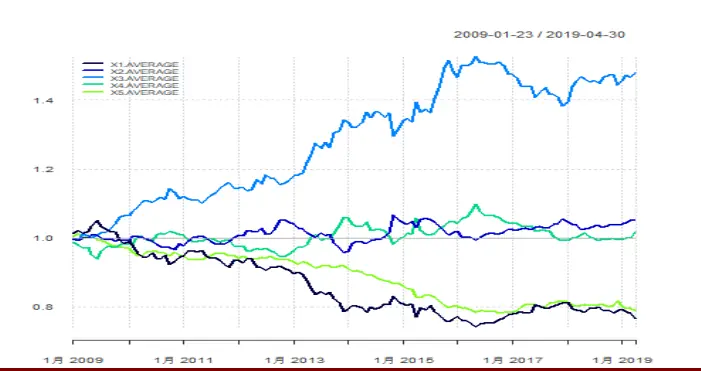
资料来源：Wind，渤海证券研究所

图 28：BLEV_5因子分层回测结果
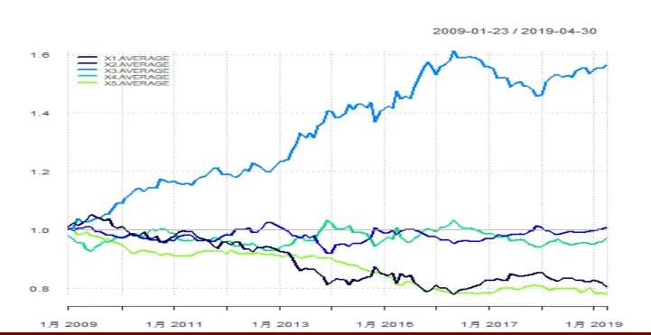
资料来源：Wind，渤海证券研究所

图 29：MLEV 三级因子分层回测结果
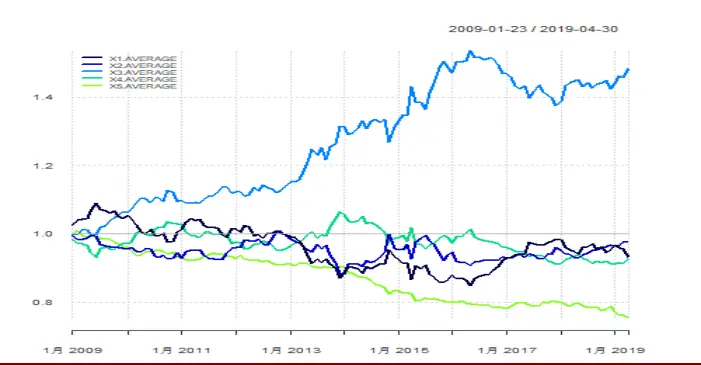
资料来源：Wind，渤海证券研究所

图 30：MLEV_5 因子分层回测结果
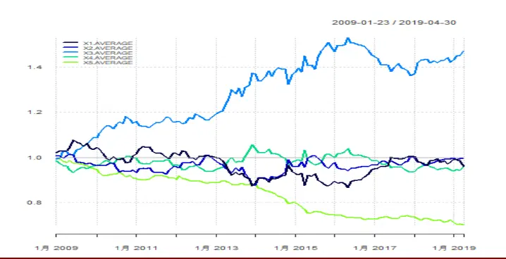
资料来源：Wind，渤海证券研究所

图 31：DTOA三级因子分层回测结果
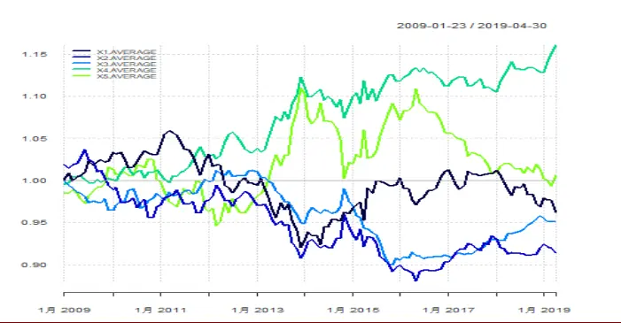
资料来源：Wind，渤海证券研究所

图 32：DTOA_5因子分层回测结果
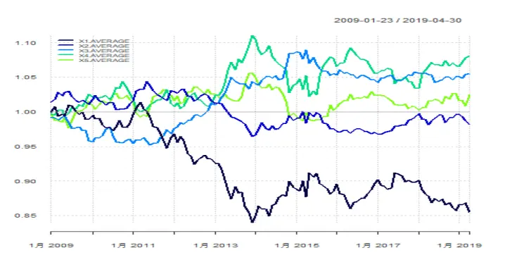
资料来源：Wind，渤海证券研究所

图 33：VSAL三级因子分层回测结果
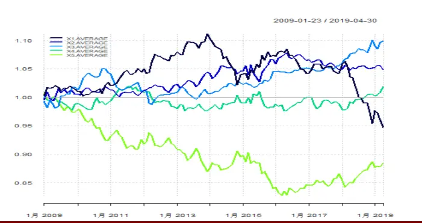
资料来源：Wind，渤海证券研究所

图 34：VERN三级因子分层回测结果
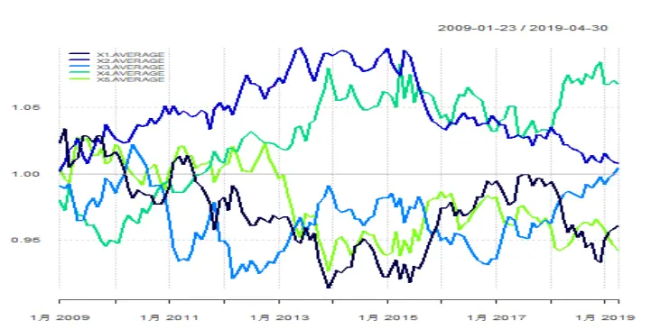
资料来源：Wind，渤海证券研究所

图 35：VFLO 三级因子分层回测结果
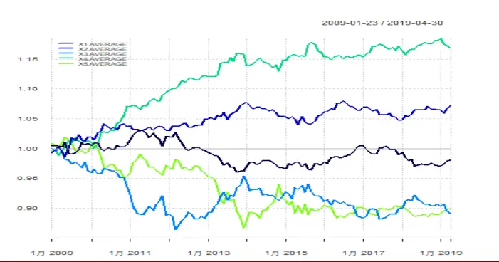
资料来源：Wind，渤海证券研究所

图 36：ABS 三级因子分层回测结果
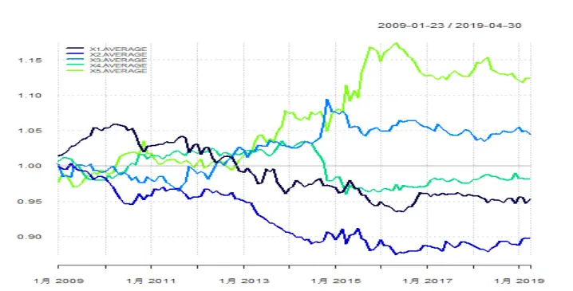
资料来源：Wind，渤海证券研究所

图 37：ACF 三级因子分层回测结果
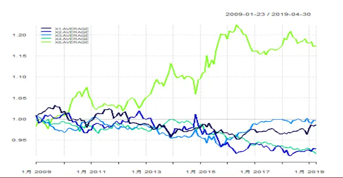
资料来源：Wind，渤海证券研究所

图 38：ATO 三级因子分层回测结果
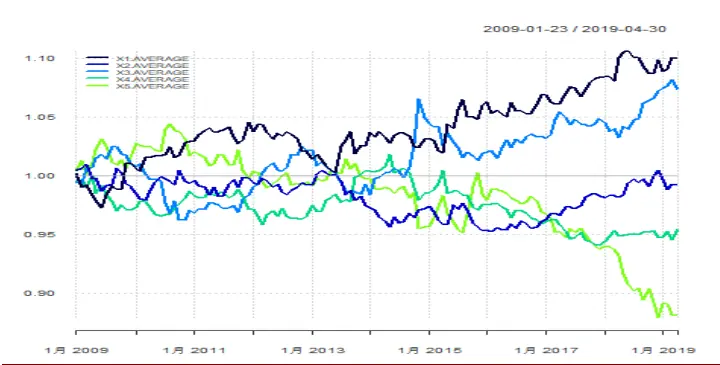
资料来源：Wind，渤海证券研究所

图 39：GP 三级因子分层回测结果
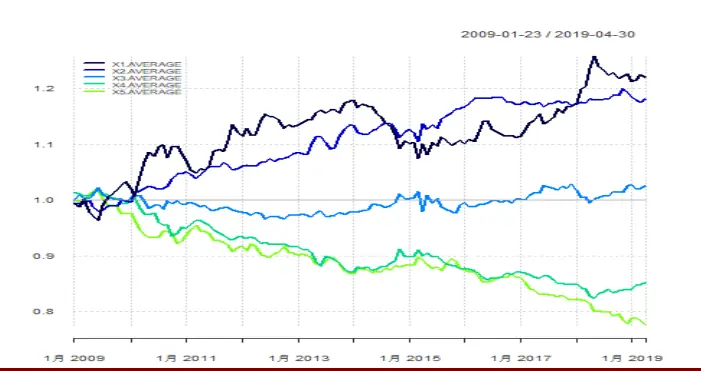
资料来源：Wind，渤海证券研究所

图 40：GPM 三级因子分层回测结果
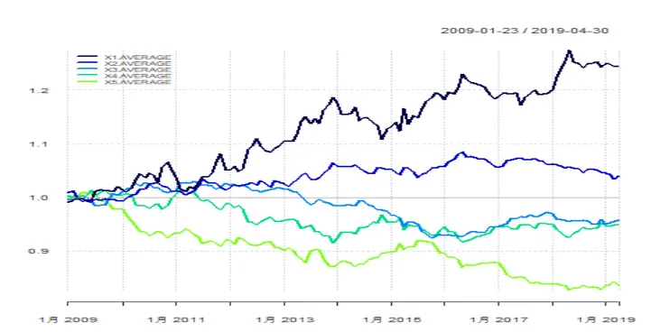
资料来源：Wind，渤海证券研究所

图 41：ROA 三级因子分层回测结果
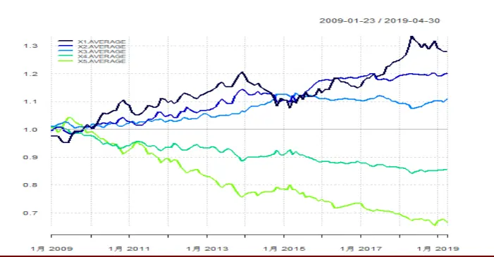
资料来源：Wind，渤海证券研究所

图 42：AGRO三级因子分层回测结果
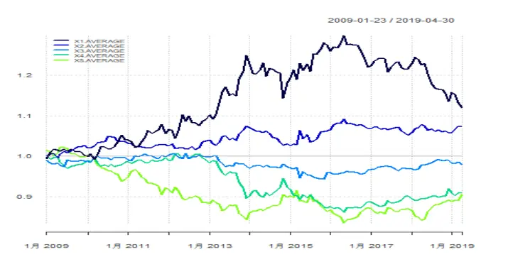
资料来源：Wind，渤海证券研究所

图 43：IGRO三级因子分层回测结果
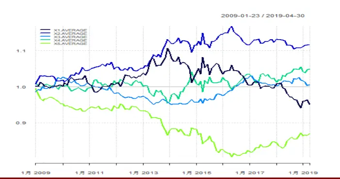
资料来源：Wind，渤海证券研究所

图 44：CXGRO三级因子分层回测结果
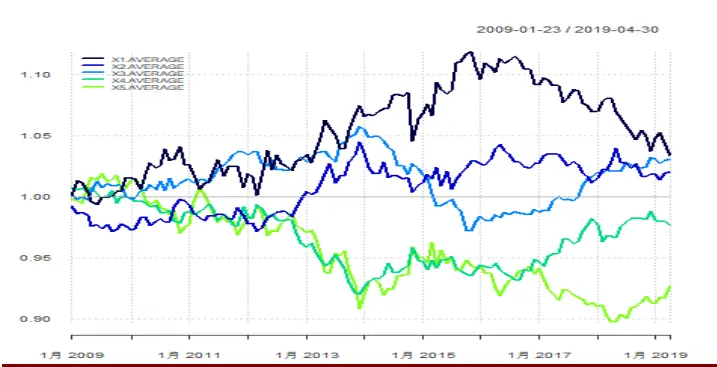
资料来源：Wind，渤海证券研究所

图 45：Leverage 二级因子分层回测结果
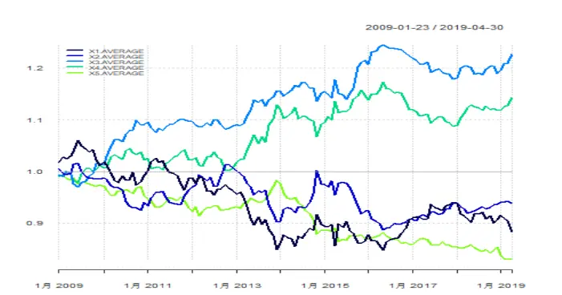
资料来源：Wind，渤海证券研究所

图 46：EarningsVariability 二级因子分层回测结果
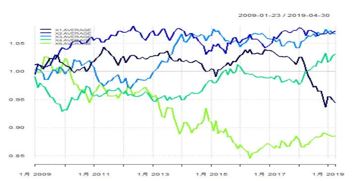
资料来源：Wind，渤海证券研究所

图 47：EarningsQuality 二级因子分层回测结果
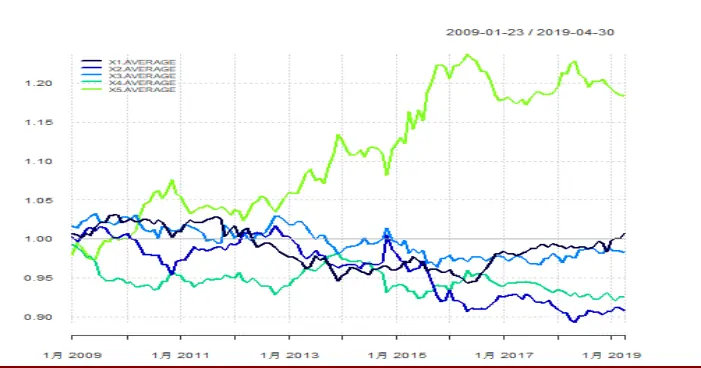
资料来源：Wind，渤海证券研究所

图 48：Profitability 二级因子分层回测结果
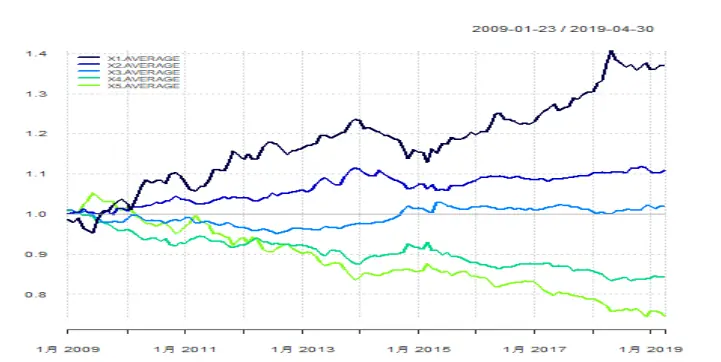
资料来源：Wind，渤海证券研究所

图 49：InvestmentQuality 二级因子分层回测结果
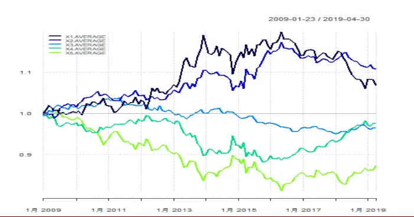
资料来源：Wind，渤海证券研究所

图 50：Quality 一级因子分层回测结果
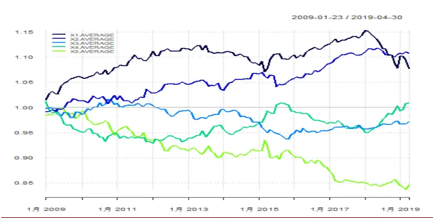
资料来源：Wind，渤海证券研究所

## 3.6 价值因子

价值因子在 CNE5 的基础上，主要新增了 Long Term Reversal 二级因子和 EM三级因子。我们剔除了预期类因子 ETOPF，并在构建对应二级因子 EarningsYield时，未包含该因子在内。

从回归测试的结果来看，BTOP 三级因子和 Value 一级因子表现最佳，在 Wind全 A和沪深300指数范围内均体现出了较好的显著性，其余因子仅在Wind全 A范围内体现出显著性。

表 17：价值因子的回归测试结果（Wind全 A）

|  | t 值绝对值平均值 | t 值绝对值>2概率 | 因子收益平均值 | 因子收益标准差 | 因子收益t值 | 因子收益>0概率 | IC 平均值 | IC 标准差 | IRIC | IC>0 概率 |  |  |
| --- | --- | --- | --- | --- | --- | --- | --- | --- | --- | --- | --- | --- |
| BTOPCETOPEMETOPLTHALPHALTRSTREarningsYieldLongTermReversalValue | 4.346 | 70.16% | 0.281 | 1.153 | 2.716 | 57.26% | 0.045 | 0.100 | 0.450 | 62.90% |  |  |
|  | 2.190 | 43.55%58.06% | 0.170 | 0.479 | 3.9422.9864.419 | 61.29%63.71% | 0.0290.038 | 0.056 | 0.5260.523 | 74.19%68.55% |  |  |
|  | 3.047 |  |  | 0.286 |  |  |  |  |  |  | 0.760 | 0.072 |
|  | 3.082 | 58.06% | 0.721 |  |  | 60.48% | 0.048 | 0.072 | 0.667 | 73.39% |  |  |
|  | 2.749 | 56.45% | 0.131 | 0.662 | 2.201 | 61.29% | 0.011 | 0.072 | 0.148 | 58.06% |  |  |
|  | 3.123 | 58.87% | 0.065 | 0.892 | 0.816 | 52.42% | 0.010 | 0.080 | 0.123 | 56.45%75.00%55.65% |  |  |
|  | 3.360 | 65.32% | 0.366 | 0.973 | 4.194 | 62.90% | 0.046 | 0.073 | 0.630 |  |  |  |
|  | 3.126 | 60.48% | 0.132 | 0.925 | 1.585 | 58.06% | 0.013 | 0.085 | 0.156 |  |  |  |
|  | 4.419 | 68.55% | 0.476 | 1.723 | 3.078 | 62.90% | 0.047 | 0.106 | 0.440 | 66.94% |  |  |

资料来源：Wind，渤海证券研究所

表 18：价值因子的回归测试结果（沪深 300）

|  | t 值绝对值平均值 | t 值绝对值>2概率 | 因子收益平均值 |  | 因子收益标准差 | 因子收益t值 | 因子收益>0概率 | IC平均值 | IC 标准差 | IRIC | IC>0 概率 |  |
| --- | --- | --- | --- | --- | --- | --- | --- | --- | --- | --- | --- | --- |
| BTOP | 2.070 | 46.77% | 0.292 |  | 1.263 | 2.576 | 54.03% | 0.030 | 0.169 | 0.180 | 52.42% |  |
| CETOPEMETOPLTHALPHALTRSTREarningsYieldLongTermReversalValue | 1.194 | 17.74%27.42% | 0.1430.216 |  | 0.510 | 3.1302.714 | 61.29%61.29% | 0.0330.032 | 0.1050.111 | 0.3170.286 | 68.55%60.48% |  |
|  | 1.447 |  |  |  | 0.216 |  |  |  |  |  |  | 0.888 |
|  | 1.577 | 29.84% | 0.282 |  | 0.939 | 3.348 | 63.71% | 0.050 | 0.123 | 0.409 | 66.94% |  |
|  | 1.546 | 31.45% | 0.122 |  | 0.791 | 1.717 | 58.06% | 0.019 | 0.118 | 0.158 | 52.42% |  |
|  | 1.597 | 33.06% | 0.131 |  | 1.113 | 1.316 | 54.84% | 0.011 | 0.129 | 0.0870.395 | 50.00%66.13% |  |
|  | 1.544 | 33.06% | 0.360 |  | 1.066 | 3.756 | 63.71% | 0.045 | 0.115 |  |  |  |
|  |  | 1.637 | 34.68% | 0.152 |  | 1.046 | 1.618 | 56.45% | 0.018 | 0.130 | 0.136 | 54.03% |
|  | 2.112 | 45.16% | 0.472 |  | 1.747 | 3.010 | 59.68% | 0.043 | 0.159 | 0.270 | 59.68% |  |

资料来源：Wind，渤海证券研究所

表 19：价值因子的回归测试结果（中证 500）

|  | t 值绝对 值平均 值 | t 值绝 对值>2 概率 | 因子收 益平均 值 | 因子收 益标准 差 | 因子收 益t值 | 因子收 益>0概 率 | IC平均 值 | IC 标准 差 | IRIC | IC>0 概 率 |
| --- | --- | --- | --- | --- | --- | --- | --- | --- | --- | --- |
| BTOP | 1.802 | 35.48% | 0.159 | 1.173 | 1.513 | 51.61% | 0.045 | 0.126 | 0.354 | 59.68% |
| CETOP | 1.126 | 16.94% | 0.167 | 0.532 | 3.498 | 61.29% | 0.034 | 0.071 | 0.474 | 70.16% |
| EM | 1.444 | 22.58% | 0.119 | 0.777 | 1.710 | 56.45% | 0.039 | 0.087 | 0.448 | 67.74% |
| ETOP | 1.598 | 34.68% | 0.247 | 0.759 | 3.630 | 59.68% | 0.048 | 0.095 | 0.507 | 62.90% |
| LTHALPHA | 1.403 | 28.23% | 0.105 | 0.729 | 1.602 | 58.87% | 0.018 | 0.087 | 0.212 | 62.90% |
| LTRSTR | 1.590 | 26.61% | 0.058 | 1.046 | 0.622 | 53.23% | 0.015 | 0.089 | 0.168 | 57.26% |
| EarningsYield | 1.593 | 30.65% | 0.289 | 0.985 | 3.272 | 61.29% | 0.048 | 0.090 | 0.537 | 66.94% |
| LongTermReversal | 1.506 | 26.61% | 0.104 | 0.971 | 1.193 | 53.23% | 0.018 | 0.092 | 0.200 | 58.06% |
| Value | 1.906 | 43.55% | 0.359 | 1.721 | 2.321 | 60.48% | 0.052 | 0.116 | 0.448 | 66.13% |

资料来源：Wind，渤海证券研究所

从分层回测的结果来看，三级因子中的BTOP、ETOP、CETOP及 EM，其对应合成的二级因子 EarningsYield，以及 Value 一级因子均表现出一定的单调性。总体来看，质量因子中，BTOP、二级因子EarningsYield及其对应的三级因子具有一定的选股能力。

图 51：BTOP三级因子分层回测结果
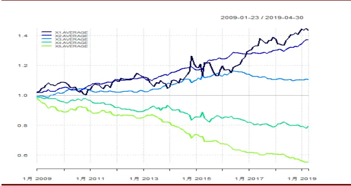
资料来源：Wind，渤海证券研究所

图 52：ETOP三级因子分层回测结果
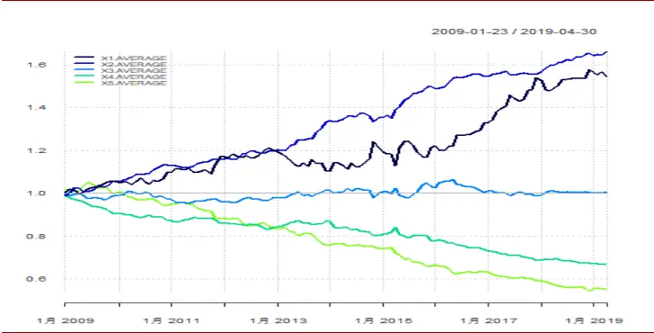
资料来源：Wind，渤海证券研究所

图 53：CETOP三级因子分层回测结果
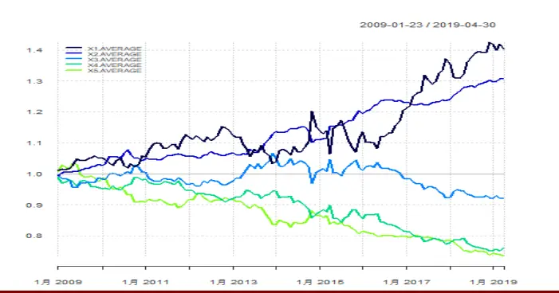
资料来源：Wind，渤海证券研究所

图 54：EM 三级因子分层回测结果
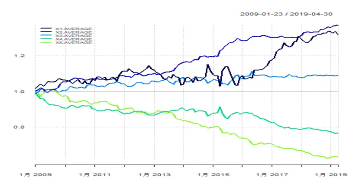
资料来源：Wind，渤海证券研究所

图 55：LTHALPHA 三级因子分层回测结果
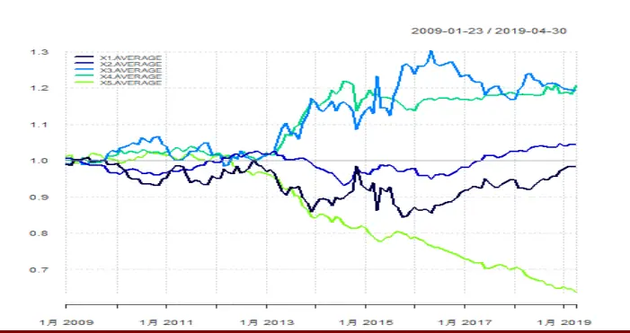
资料来源：Wind，渤海证券研究所

图 56：LTRSTR三级因子分层回测结果
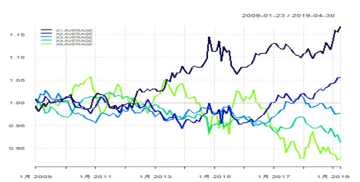
资料来源：Wind，渤海证券研究所

图 57：EarningsYield 二级因子分层回测结果
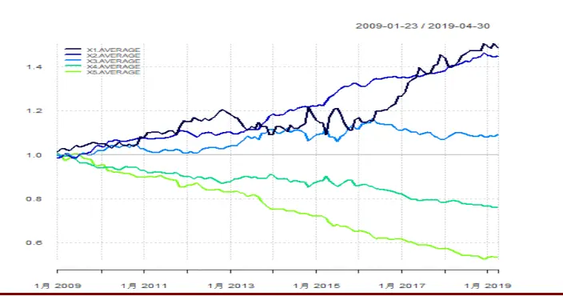
资料来源：Wind，渤海证券研究所

图 58：LongTermReversal 二级因子分层回测结果
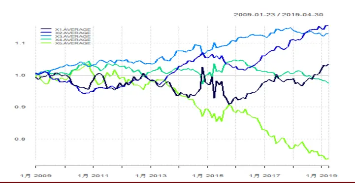
资料来源：Wind，渤海证券研究所

图 59：Value三级因子分层回测结果
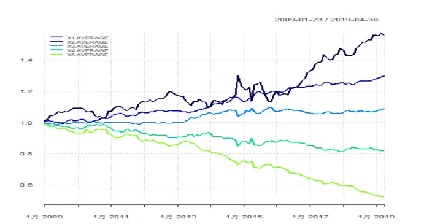
资料来源：Wind，渤海证券研究所

## 3.7 成长因子

成长因子包括的EGRO和SGRO三级因子与CNE5定义一致。我们对预期类因子 EGRLF 进行了剔除，并在构建一级因子Growth 时，未包含该因子在内。

从回归测试的结果来看，价值因子在各指数范围内均未体现出显著性。

表 20：成长因子的回归测试结果（Wind全 A）

|  | t 值绝对 值平均 值 | t 值绝 对值>2 概率 | 因子收 益平均 值 | 因子收 益标准 差 | 因子收 益t值 | 因子收 益>0概 率 | IC 平均 值 | IC 标准 差 | IRIC | IC>0 概 率 |
| --- | --- | --- | --- | --- | --- | --- | --- | --- | --- | --- |
| EGRO | 1.009 | 12.90% | -0.016 | 0.286 | -0.606 | 50.00% | 0.003 | 0.030 | 0.113 | 56.45% |
| SGRO | 1.355 | 26.61% | 0.031 | 0.371 | 0.944 | 52.42% | 0.005 | 0.035 | 0.144 | 54.84% |
| Growth | 1.282 | 21.77% | 0.019 | 0.434 | 0.478 | 47.58% | 0.004 | 0.033 | 0.136 | 54.84% |

资料来源：Wind，渤海证券研究所

表 21：成长因子的回归测试结果（沪深 300）

|  | t 值绝对 值平均 值 | t 值绝 对值>2 概率 | 因子收 益平均 值 | 因子收 益标准 差 | 因子收 益t值 | 因子收 益>0概 率 | IC平均 值 | IC 标准 差 | IRIC | IC>0 概 率 |
| --- | --- | --- | --- | --- | --- | --- | --- | --- | --- | --- |
| EGRO | 1.002 | 8.87% | -0.031 | 0.838 | -0.418 | 50.00% | 0.010 | 0.084 | 0.120 | 54.03% |
| SGRO | 1.012 | 10.48% | -0.011 | 0.579 | -0.216 | 46.77% | 0.005 | 0.068 | 0.069 | 55.65% |
| Growth | 0.999 | 8.06% | -0.019 | 0.812 | -0.267 | 48.39% | 0.009 | 0.073 | 0.120 | 51.61% |

资料来源：Wind，渤海证券研究所

表 22：成长因子的回归测试结果（中证 500）

|  | t值绝对 值平均 值 | t值绝 对值>2 概率 | 因子收 益平均 值 | 因子收 益标准 差 | 因子收 益t值 | 因子收 益>0概 率 | IC平均 值 | IC 标准 差 | IRIC | IC>0 概 率 |
| --- | --- | --- | --- | --- | --- | --- | --- | --- | --- | --- |
| EGRO | 0.972 | 11.29% | 0.009 | 0.596 | 0.168 | 48.39% | 0.001 | 0.058 | 0.010 | 50.81% |
| SGRO | 1.095 | 14.52% | 0.033 | 0.590 | 0.622 | 50.81% | 0.001 | 0.054 | 0.021 | 47.58% |
| Growth | 1.071 | 15.32% | 0.035 | 0.753 | 0.525 | 56.45% | 0.001 | 0.057 | 0.020 | 47.58% |

资料来源：Wind，渤海证券研究所

从分层回测的结果来看，成长因子均没有较好的单调性表现。总体来看，成长因子可能由于其采用周期较长的基本面数据进行构建，未体现出良好的选股能力。

图 60：EGRO三级因子分层回测结果
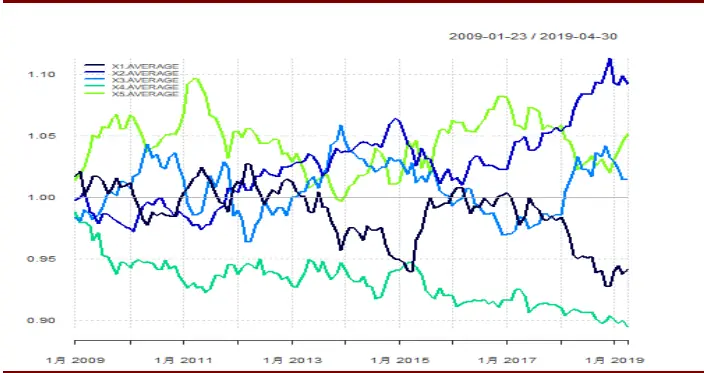
资料来源：Wind，渤海证券研究所

图 61：SGRO 三级因子分层回测结果
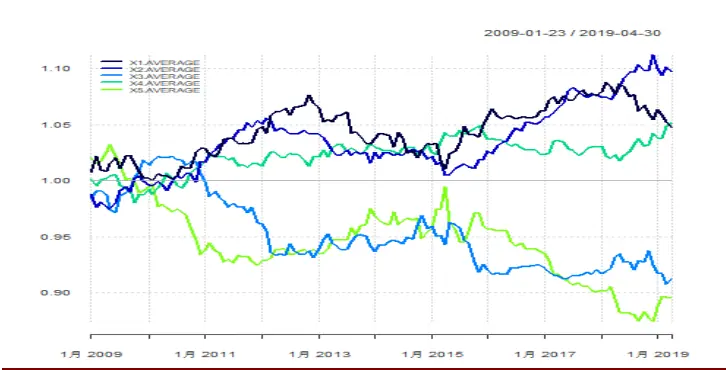
资料来源：Wind，渤海证券研究所

图 62：Growth一级因子分层回测结果
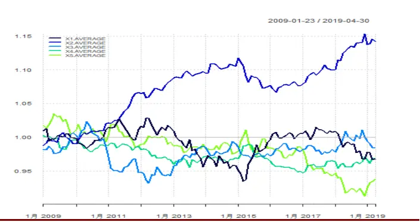
资料来源：Wind，渤海证券研究所

## 3.8分红收益率因子

分红收益率因子属于 CNE6 新增的大类因子。我们对预期类因子DTOPF进行了剔除，且剔除后仅剩 DTOP 因子，故未新合成DividendYields一级因子。

从回归测试的结果来看，分红收益率因子仅在Wind 全 A 范围内体现出了较好的显著性表现。

表 23：分红收益率因子的回归测试结果（Wind全 A）

|  | t 值绝对值平均值 | t 值绝对值>2概率 | 因子收益平均值 | 因子收益标准差 | 因子收益t值 | 因子收益>0概率 | IC平均值 | IC 标准差 | IRIC | IC>0 概率 |
| --- | --- | --- | --- | --- | --- | --- | --- | --- | --- | --- |
| DTOP | 2.406 | 48.39% | 0.164 | 0.595 | 3.071 | 58.06% | 0.023 | 0.056 | 0.414 | 63.71% |

资料来源：Wind，渤海证券研究所

表 24：分红收益率因子的回归测试结果（沪深 300）

|  | t 值绝对 值平均 值 | t值绝 对值>2 概率 | 因子收 益平均 值 | 因子收 益标准 差 | 因子收 益t值 | 因子收 益>0概 率 | IC 平均 值 | IC 标准 差 | IRIC | IC>0 概 率 |
| --- | --- | --- | --- | --- | --- | --- | --- | --- | --- | --- |
| DTOP | 1.187 | 16.94% | 0.172 | 0.624 | 3.076 | 59.68% | 0.029 | 0.102 | 0.282 | 59.68% |

资料来源：Wind，渤海证券研究所

表 25：分红收益率因子的回归测试结果（中证 500）

|  | t 值绝对 值平均 值 | t 值绝 对值>2 概率 | 因子收 益平均 值 | 因子收 益标准 差 | 因子收 益t值 | 因子收 益>0概 率 | IC 平均 值 | IC 标准 差 | IRIC | IC>0 概 率 |
| --- | --- | --- | --- | --- | --- | --- | --- | --- | --- | --- |
| DTOP | 1.226 | 16.13% | 0.146 | 0.644 | 2.518 | 57.26% | 0.031 | 0.072 | 0.436 | 66.94% |

资料来源：Wind，渤海证券研究所

从分层回测的结果来看，分红收益率因子表现出一定的单调性。总体来看，分红

收益率具有一定的选股能力。

图 63：DTOP三级因子分层回测结果
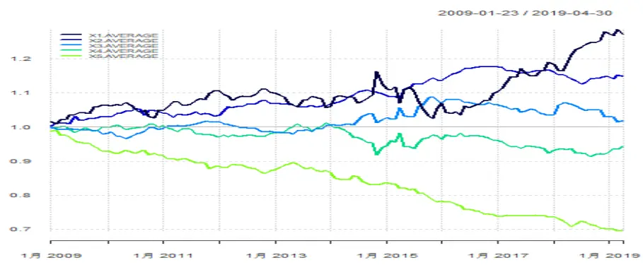
资料来源：Wind资讯，渤海证券研究所

## 4. 结论

总体来看，CNE6 因子在Wind 全A、沪深300和中证500 成分股范围内均能取得一定的显著性。单因子测试的结果汇总如下：

表 26：单因子测试结果汇总

| 因子大类 | 单因子测试显著因子 |
| --- | --- |
| 规模因子 | MIDCAP、Size |
| 波动率因子 | HSIGMA、DASTD、Volatility |
| 流动性因子 | STOM、STOQ、ATVR、Liquidity |
| 动量因子 | STREV、Momentum_2 |
| 质量因子 | GP、GPM、ROA、AGRO、Profitability、InvestmentQuality |
| 价值因子 | BTOP、ETOP、CETOP、EM、EarningsYield |
| 成长因子 | 无 |
| 分红收益率因子 | DTOP |

资料来源：渤海证券研究所

至此，我们已经通过单因子检测程序筛选出了各风格下具有一定选股能力的因子。由于对于单一因子做分层回测时，无法保证其对其他因子的暴露中性，所以在进行单因子检测时，该方法无法排除其他因子对于组合的影响。下一篇报告中，我们将构造纯因子模型，以更客观的反应因子的收益能力。敬请关注。

投资评级说明

| 项目名称 | 投资评级 | 评级说明 |
| --- | --- | --- |
| 公司评级标准 | 买入 | 未来 6 个月内相对沪深 300 指数涨幅超过 20% |
|  | 增持 | 未来6 个月内相对沪深 300 指数涨幅介于10%~20%之间 |
|  | 中性 | 未来6个月内相对沪深300指数涨幅介于-10%~10%之间 |
|  | 减持 | 未来6 个月内相对沪深 300 指数跌幅超过 10% |
| 行业评级标准 | 看好 | 未来 12个月内相对于沪深300 指数涨幅超过 10% |
|  | 中性 | 未来12个月内相对于沪深300指数涨幅介于-10%-10%之间 |
|  | 看淡 | 未来 12 个月内相对于沪深 300 指数跌幅超过 10% |

免责声明：本报告中的信息均来源于已公开的资料，我公司对这些信息的准确性和完整性不作任何保证，不保证该信息未经任何更新，也不保证本公司做出的任何建议不会发生任何变更。在任何情况下，报告中的信息或所表达的意见并不构成所述证券买卖的出价或询价。在任何情况下，我公司不就本报告中的任何内容对任何投资做出任何形式的担保，投资者自主作出投资决策并自行承担投资风险，任何形式的分享证券投资收益或者分担证券投资损失书面或口头承诺均为无效。我公司及其关联机构可能会持有报告中提到的公司所发行的证券并进行交易，还可能为这些公司提供或争取提供投资银行或财务顾问服务。我公司的关联机构或个人可能在本报告公开发表之前已经使用或了解其中的信息。本报告的版权归渤海证券股份有限公司所有，未获得渤海证券股份有限公司事先书面授权，任何人不得对本报告进行任何形式的发布、复制。如引用、刊发，需注明出处为“渤海证券股份有限公司”，也不得对本报告进行有悖原意的删节和修改。

## 渤海证券股份有限公司研究所

## 所长&金融行业研究

张继袖

+86 22 2845 1845

## 计算机行业研究小组

王洪磊（部门经理）

+86 22 2845 1975

+86 22 2383 9067

王磊

+86 22 2845 1802

## 医药行业研究小组

徐勇

+86 10 6810 4602 甘英健

+86 22 2383 9063

陈晨

+86 22 2383 9062

## 非银金融行业研究

洪程程

+86 10 6810 4609

## 固定收益研究

+86 22 2845 1605 夏捷

+86 22 2386 1355

朱林宁

+86 22 2387 3123

## 流动性、战略研究＆部门经理

周喜

+86 22 2845 1972

## 综合管理＆部门经理

齐艳莉

+86 22 2845 1625

## 合规管理&部门经理

任宪功+86 10 6810 4615

## 副所长&产品研发部经理

崔健

+86 22 2845 1618

## 汽车行业研究小组

郑连声

+86 22 2845 1904 陈兰芳

+86 22 2383 9069

## 通信行业研究小组

徐勇+86 10 6810 4602

## 中小盘行业研究

徐中华+86 10 6810 4898

## 金融工程研究

木吻 
+86 22 2845 1131 张世良 
+86 22 2383 9061

## 策略研究

宋亦威
+86 22 2386 1608严佩佩
+86 22 2383 9070

## 机构销售•投资顾问

+86 22 2845 1995 刘璐

## 风控专员

张敬华+86 10 6810 4651

## 食品饮料行业研究

+86 22 2386 1670

公用事业行业研究刘蕾+86 10 6810 4662

## 机械行业研究

张冬明+86 22 2845 1857

## 金融工程研究

祝涛 
+86 22 2845 1653 郝倞 
+86 22 2386 1600

## 宏观研究

宋亦威
+86 22 2386 1608孟凡迪
+86 22 2383 9071

## 电力设备与新能源行业研究

张冬明
+86 22 2845 1857刘秀峰
+86 10 6810 4658滕飞
+86 10 6810 4686

## 餐饮旅游行业研究

+86 22 2386 1670 杨旭 +86 22 2845 1879

## 传媒行业研究

姚磊+86 22 2383 9065

## 博士后工作站

张佳佳 资产配置
+86 22 2383 9072
张一帆 公用事业、信用评级
+86 22 2383 9073

## 渤海证券研究所

天津

天津市南开区水上公园东路宁汇大厦 A座写字楼

邮政编码：300381

电话：（022）28451888

传真：（022）28451615

北京

北京市西城区西直门外大街甲 143号 凯旋大厦A座 2层

邮政编码：100086

电话： （010）68104192

传真： （010）68104192

渤海证券研究所网址：www.ewww.com.cn