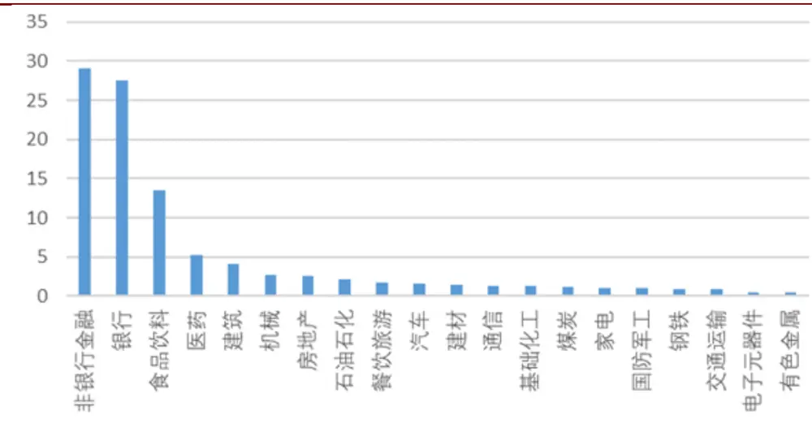
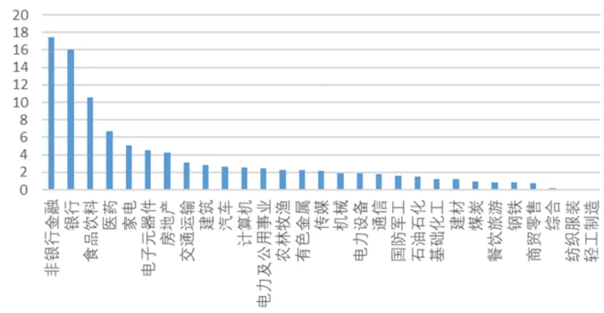
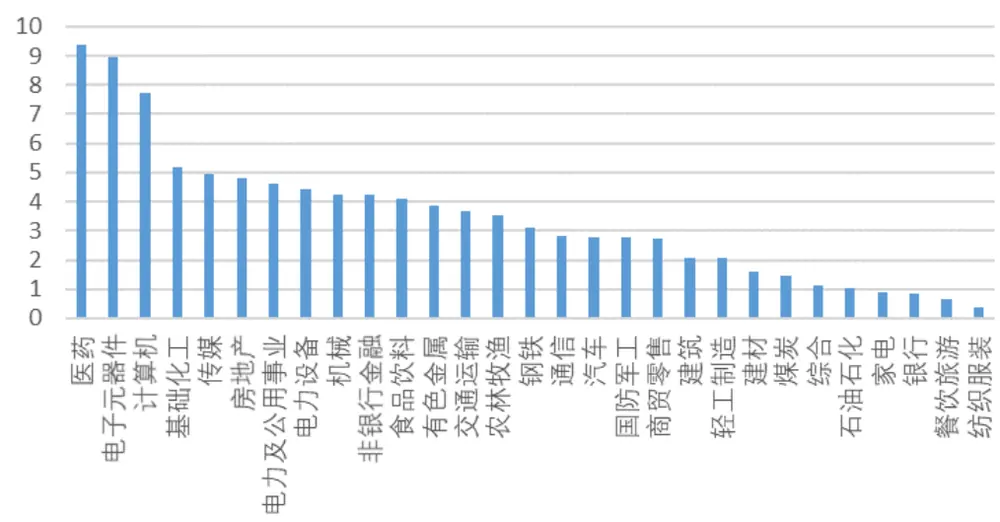
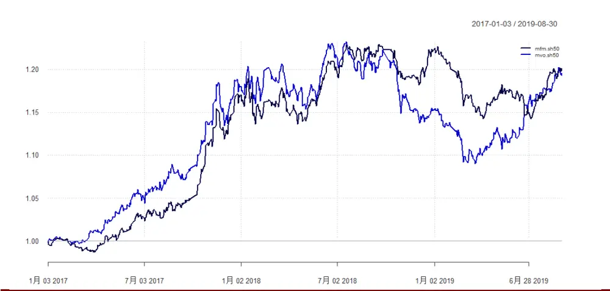
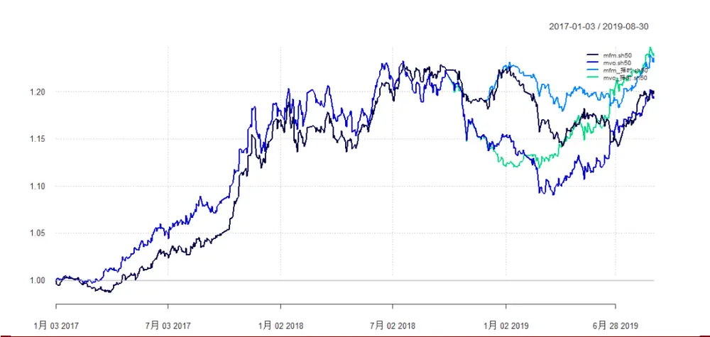
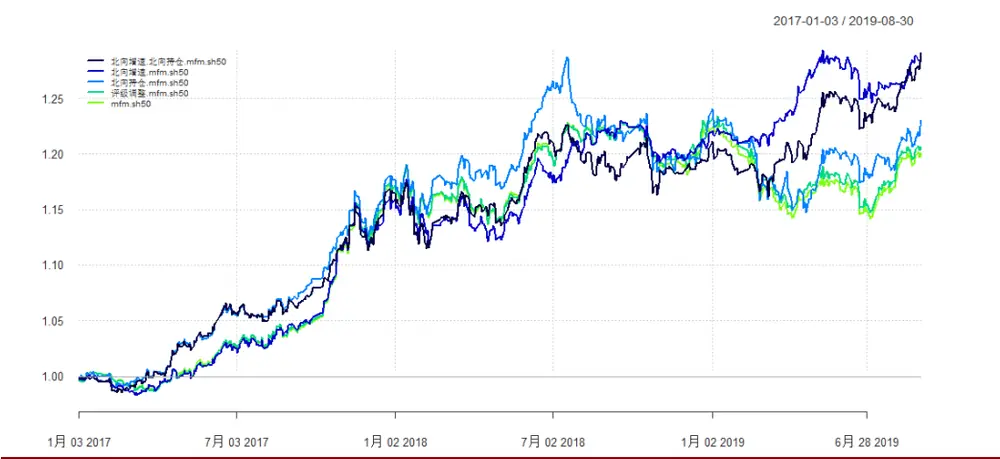
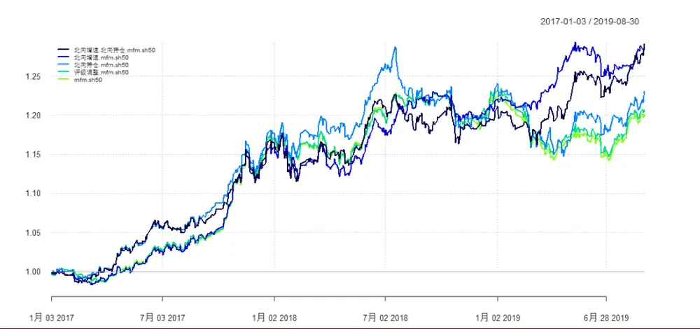
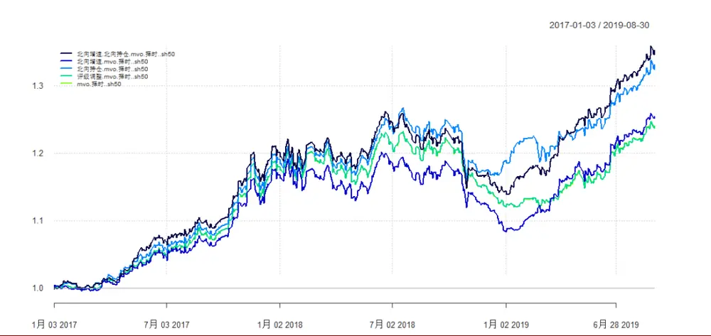
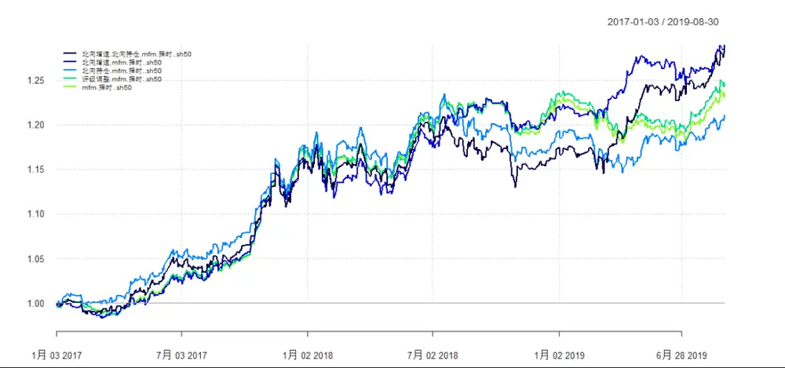
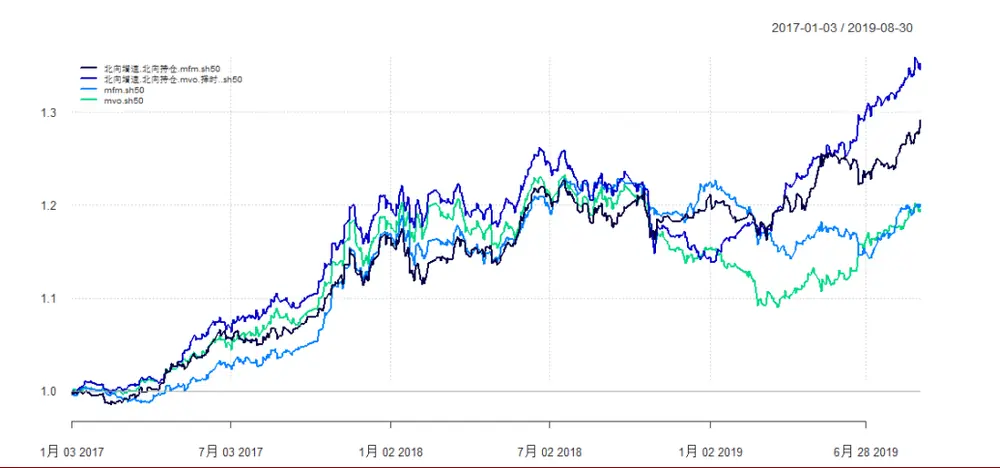

# 融合 BL 模型的上证 50 指数增强模型

# ——多因子模型研究系列之十

分析师：宋旸

2019 年 09 月 11 日

证券分析师

宋旸

022-28451131

18222076300

songyang@bhzq.com

助理分析师

张世良

022-23839061

zhangsl@bhzq.com

## 相关研究报告

《使用多因子框架的沪深
300 指数增强模型——多因
子研究系列之七》
20190329

《Barra 风险模型（CNE6）之单因子检验——多因子研究系列之八》

SAC NO：S1150517100002

20190620

《Barra 风险模型（CNE6）之纯因子构建与因子合成——多因子模型研究系列之九》

20190620

## 核心观点：

- 在之前的一系列报告中，我们使用多因子模型，构造了关于沪深300和中证 500 的指数增强模型，本篇报告中，我们尝试构造关于上证 50 的指数增强模型。

上证 50 指数由于其成分股少、行业分布不均、有效因子少等特点，使用传统的多因子模型进行指数增强效果并不理想。我们使用马尔科维茨均值方差模型和多因子模型构建指数增强模型，两个增强模型相对于指数均取得了一定的超额收益，多因子模型相对于均值方差模型，收益率类似，波动率更小，夏普比率有所提升。

我们尝试使用 Black-Litterman 模型（简称 BL 模型）改进上证 50 指数增强模型。BL 模型是马尔科维茨均值方差模型的一种优化模型，其将主观观点与市场均衡收益相结合，从而形成新的预期收益率。而我们也发现，上证50 成分股的市场关注度较高，使用BL 模型将市场观点、投资热度与传统指数增强模型结合，可以进一步改善原有模型的表现。

上证50 指数增强BL模型观点来自三方面：报告评级调整、北上资金增减仓情况、北上资金持仓情况。三个观点对于原始模型的表现均有不同程度提升，其中北向资金增速+北向资金持仓的BL模型收益提升最为明显，2017-2019 年年化收益 22.82%，信息比率 2.01。

我们提取了不同模型相对指数超配、低配标的的前5 名，观察发现，大部分模型超配的标的普遍集中在贵州茅台、中国平安、招商银行、伊利股份、恒瑞医药等股票上。而低配标的普遍集中在银行股、中国中车、中国建筑等股票上。

- 风险提示：随着市场环境变化，模型存在失效风险。

## 引言

在之前的一系列报告中，我们使用多因子模型，构造了关于沪深 300和中证500的指数增强模型，本篇报告中，我们尝试构造关于上证 50 的指数增强模型。上证 50 指数由于其成分股少、行业分布不均等特点，使用传统的多因子模型进行指数增强效果并不理想，在报告的后半部分，我们使用Black-Litterman模型，引入行业评级调整数据和北上资金持仓数据，对原始的模型做了优化，取得了更佳的结果。

## 1. 上证指数特点分析

## 1.1 行业分布不均

我们统计了上证 50 指数、沪深 300 指数和中证500 指数的中信一级行业分布情况。其中，中证500 指数的行业分布最为平均，占比较高的行业为医药、电子元器件和计算机等，均为成长性较高的行业，使用多因子选股效果较好。沪深 300指数中分布最高的行业变为非银行金融和银行，占比共计超过 35%，行业集中度较高。而上证50指数的情况则更加极端，非银行金融和银行行业占比共计58.2%，使用传统多因子模型量化较为困难。

图 1：上证 50指数行业分布

资料来源：Wind，渤海证券研究所

图 2：沪深 300指数行业分布

资料来源：Wind，渤海证券研究所

图 3：中证 500指数行业分布

资料来源：Wind，渤海证券研究所

## 1.2 成分股权重集中

通过对比中证 500 指数、沪深 300 指数和上证 50 指数的前 10 大成分股权重可以看出，中证500的成分股权重分布非常平均，权重占比最大的股票也没有超过1%。而沪深300 和上证50 指数的权重分布非常集中，沪深300前10 大成分股权重超过 28%，而上证 50 前 10 大成分股权重接近 57%，仅中国平安、贵州茅台和招商银行三支股票的权重总和就达 34%。少数几只股票的走势很大程度上决定着指数整体的走势，这决定了上证 50 指数的指数增强模型中很难从统计学上追求平均收益的最大化，而应将重点集中在对权重较大的成分股的重点研究上。

表 1：指数前 10大成分股权重对比

| 中证 500 前 10 大成分股 | 沪深 300 前 10 大成分股 | 上证 50 前10 大成分股 |
| --- | --- | --- |
| 生益科技 0.74 | 中国平安 7.68 | 中国平安 17.13 |
| 顺鑫农业 0.71 | 贵州茅台 4.58 | 贵州茅台 10.39 |
| 沪电股份 0.69 | 招商银行 2.84 | 招商银行 6.40 |
| 四维图新 0.65 | 格力电器 2.21 | 兴业银行 4.52 |
| 中炬高新 0.62 | 五粮液 2.21 | 恒瑞医药 4.49 |
| 正邦科技 0.61 | 美的集团 2.11 | 中信证券 3.18 |
| 紫光国微 0.60 | 兴业银行 2.01 | 伊利股份 3.16 |
| 中国软件 0.58 | 恒瑞医药 1.97 | 交通银行 2.69 |
| 银泰资源 0.53 | 中信证券 1.44 | 民生银行 2.61 |
| 华鲁恒升 0.51 | 伊利股份 1.40 | 浦发银行 2.40 |
| 总和 6.24 | 总和 28.44 | 总和 56.99 |

资料来源：Wind，渤海证券研究所

## 1.3 有效因子少

我们使用单因子检测方法，提取渤海因子库中 96 个因子，对不同指数内的有效因子做了检测。我们选取IC 绝对值大于 3%，ICIR绝对值大于 0.3，IC 符号一致性大于 0.1 的因子（IC 符号一致性= 值大于 的概率 ）。其中中证 500成分股的有效因子有56个，沪深 300 成分股的有效因子有 32个，而上证50成分股的有效因子只有 8 个，分别为市盈率倒数、市净率倒数、三种波动率因子、两种动量反转因子和中性市值因子。有效因子过少，也给使用传统多因子思路建立上证 50指数增强模型带来了一定难度。

表 2：上证 50指数有效因子

|  | IC 绝对值 | ICIR 绝对值 | IC 符号一致性 |
| --- | --- | --- | --- |
| std_12m | 6.16% | 0.37 | 0.188 |
| std_6m | 6.09% | 0.36 | 0.156 |
| EP | 6.08% | 0.43 | 0.164 |
| dastd | 5.66% | 0.32 | 0.116 |

请务必阅读正文之后的免责声明

| reverse_180 | 5.62% | 0.38 | 0.124 |
| --- | --- | --- | --- |
| reverse_20 | 4.78% | 0.33 | 0.148 |
| BP | 4.68% | 0.35 | 0.124 |
| nonlinearsize | 3.09% | 0.39 | 0.156 |

资料来源：Wind，渤海证券研究所

表 3：沪深 300指数有效因子（部分）

|  | IC 绝对值 | ICIR 绝对值 IC 符号一致性 |
| --- | --- | --- |
| exp_wgt_return_6m | 7.30% | 0.69 0.26 |
| exp_wgt_return_3m | 6.83% | 0.67 0.244 |
| exp_wgt_return_12m | 6.43% | 0.63 0.236 |
| return_1m | 5.08% | 0.41 0.156 |
| dastd | 5.07% | 0.32 0.156 |
| reverse_60 | 4.89% | 0.48 0.204 |
| std_12m | 4.86% | 0.31 0.132 |
| std_6m | 4.80% | 0.31 0.18 |
| std_1m | 4.77% | 0.35 0.156 |
| std_3m | 4.72% | 0.32 0.18 |
| reverse_20 | 4.66% | 0.54 0.212 |
| turn_1m | 4.58% | 0.40 0.164 |
| EP | 4.56% | 0.41 0.164 |
| exp_wgt_return_1m | 4.34% | 0.46 0.164 |
| BIAS | 4.09% | 0.34 0.108 |
| reverse_180 | 4.04% | 0.40 0.164 |
| turn_3m | 3.85% | 0.36 0.164 |
| ROE_q | 3.83% | 0.35 0.156 |
| ROE_G_q | 3.56% | 0.47 0.172 |
| Profit_G_q | 3.55% | 0.43 0.164 |
| turn_6m | 3.47% | 0.34 0.132 |
| ROA_q | 3.32% | 0.33 0.108 |
| DP | 3.04% | 0.34 0.132 |
| turn_12m | 3.02% | 0.31 0.124 |

资料来源：Wind，渤海证券研究所

表 4：中证 500 指数有效因子（部分）

|  | IC 绝对值 |  | ICIR 绝对值 IC 符号一致性 |
| --- | --- | --- | --- |
| exp_wgt_return_6m | 9.87% | 0.88 | 0.308 |
| exp_wgt_return_12m | 9.05% | 0.89 | 0.292 |
| exp_wgt_return_3m | 7.66% | 0.75 | 0.292 |
| turn_1m | 6.96% | 0.58 | 0.212 |
| turn_3m | 6.00% | 0.54 | 0.236 |
| return_1m | 5.64% | 0.50 | 0.188 |

渤海证券股份有限公司具备证券投资咨询业务资格

| dastd | 5.63% | 0.39 | 0.188 |
| --- | --- | --- | --- |
| ROE_q | 5.57% | 0.65 | 0.22 |
| reverse_60 | 5.54% | 0.72 | 0.276 |
| return_3m | 5.52% | 0.45 | 0.196 |
| std_3m | 5.44% | 0.39 | 0.18 |
| Profit_G_q | 5.29% | 0.86 | 0.324 |
| ROA_q | 5.26% | 0.60 | 0.196 |
| std_1m | 5.25% | 0.40 | 0.212 |
| reverse_20 | 5.19% | 0.72 | 0.284 |
| turn_6m | 5.03% | 0.49 | 0.204 |
| EP | 4.98% | 0.57 | 0.212 |
| BIAS | 4.92% | 0.41 | 0.14 |
| std_6m | 4.60% | 0.34 | 0.164 |
| turn_12m | 4.59% | 0.48 | 0.196 |
| Sales_G_q | 4.51% | 0.72 | 0.292 |
| exp_wgt_return_1m | 4.48% | 0.46 | 0.172 |
| std_12m | 4.39% | 0.34 | 0.156 |
| reverse_180 | 4.29% | 0.49 | 0.22 |
| DIF | 4.23% | 0.39 | 0.164 |
| profitmargin_q | 4.18% | 0.56 | 0.212 |
| ROE_G_q | 4.00% | 0.67 | 0.268 |
| DEA | 3.95% | 0.38 | 0.132 |
| ROE_ttm | 3.88% | 0.45 | 0.14 |
| hsigma | 3.78% | 0.32 | 0.156 |
| RSI | 3.68% | 0.45 | 0.188 |
| ROA_ttm | 3.65% | 0.43 | 0.132 |
| DP | 3.49% | 0.50 | 0.188 |
| profitmargin_ttm | 3.27% | 0.42 | 0.18 |

资料来源：Wind，渤海证券研究所

## 2. 传统指数增强模型

## 2.1 两种传统指数增强模型

我们用两种方式构建了指数增强模型，分别为使用历史收益数据的马尔科维茨均值方差模型和使用有效因子的多因子模型。

马尔科维茨均值方差模型（MVO）：使用过去 1 年历史收益率的均值作为预期收益，并使用压缩矩阵方法计算协方差矩阵，带入模型计算最优权重。月度调仓，单支股票权重小于其在指数中权重的 2倍，并小于25%。

多因子模型（MFM）：使用过去 1年因子收益率计算预期收益，并计算协方差矩阵，带入模型计算最优权重。月度调仓，单支股票权重小于其在指数中权重的 2倍，并小于25%。

两种模型的结果如下所示。可以看出，两个增强模型相对于指数均取得了一定的超额收益，多因子模型相对于均值方差模型，收益率类似，波动率更小，夏普比率有所提升。

表 5：多因子模型和均值方差模型收益统计

|  | 累计收益 | 年化收益 | 波动率 | 最大回撤 | 夏普比率 | 信息比率 | 胜率 |
| --- | --- | --- | --- | --- | --- | --- | --- |
| mfm | 50.85% | 17.28% | 19.30% | 25.19% | 0.89 | 1.35 | 53.85% |
| mvo | 50.13% | 17.06% | 21.50% | 30.68% | 0.78 | 1.14 | 50.31% |
| sh50 | 25.60% | 9.24% | 18.73% | 28.87% | 0.49 | 0 | 0.00% |

资料来源：Wind，渤海证券研究所

图 4：多因子模型和均值方差模型相对指数超额收益图

资料来源：Wind，渤海证券研究所

## 2.2 指数增强+择时模型

接下来，我们尝试在指数增强模型的基础上加入一个简易的择时模型，在进行权重计算时，我们将权重的总和由 1 改为 。这就相当于在模型中引入了现金资产，且最高权重不大于20%。

回测结果如下图所示，可以看出，加入择时模型后，两类指数模型的收益、夏普比率和信息比率均有所上升。

表 6：加入择时模型的指数增强模型收益对比

|  | 累计收益 | 年化收益 | 波动率 | 最大回撤 | 夏普比率 | 信息比率 | 胜率 |
| --- | --- | --- | --- | --- | --- | --- | --- |
| mfm | 50.85% | 17.28% | 19.30% | 25.19% | 0.8912 | 1.3591 | 53.85% |
| mvo | 50.13% | 17.06% | 21.50% | 30.68% | 0.7898 | 1.1418 | 50.31% |

请务必阅读正文之后的免责声明
渤海证券股份有限公司具备证券投资咨询业务资格

| mfm(择时) | 55.26% | 18.60% | 20.02% | 24.98% | 0.9246 | 1.7146 | 53.69% |
| --- | --- | --- | --- | --- | --- | --- | --- |
| mvo(择时) | 55.80% | 18.76% | 22.14% | 32.66% | 0.8432 | 1.4324 | 51.23% |
| sh50 | 25.60% | 9.24% | 18.73% | 28.87% | 0.4913 | 0 | 0.00% |

资料来源：Wind，渤海证券研究所

图 5：加入择时模型的指数增强模型相对指数超额收益图

资料来源：Wind，渤海证券研究所

## 3. Black-Litterman 模型与指数增强模型

接下来，我们尝试使用 Black-Litterman 模型（简称 BL 模型）改进上证 50 指数增强模型。

BL模型是马尔科维茨均值方差模型的一种优化模型，其核心理念为将主观观点与市场均衡收益相结合。而我们也发现，上证 50 成分股的市场关注度较高，使用BL模型将市场观点、投资热度与传统指数增强模型结合，可以进一步改善原有模型的表现。

## 3.1上证 50指数成分股市场关注度较高

上证 50 指数成分股关注度较高，首先来自于研究机构对其发布的研报数量，根据Wind统计，针对上证50 单支成分股发布的研报数量平均为 21.84 份，而这个数据在沪深 300 成分股中为16.64 份，中证500成分股中为 7.73 份，全体A股中为 4.43 份。研报数量一定程度上反映了研究机构对其关注程度较高，同时也有丰富的评级调整数据作为研究机构观点数据的来源。

其次，沪港通交易数据也表明，北上资金对于上证 50 成分股也格外偏爱。在所有沪港通持仓的股票中，上证50成分股占比40.5%，沪深300成分股占比84.1%，而中证 500 成分股占比仅为 9.8%。北上资金的调仓数据和持仓数据，也可以作为机构情绪指数的一个重要参考标准。

## 3.2 Black-Litterman 模型理论简介

假设现有 种资产，其收益率为 $\mathrm{R}=\{R_{1},~R_{2},~\cdots R_{N}\}$ ，BL 模型中假设 服从联合正态分布，即 ${}^{\mathcal{I}}R{\sim}\mathrm{N}\mathrm{~}\left(\mu,\Sigma\right)$ ，其中 和 为各资 $\cdot\vec{p}$ 预期收益率的期望值和协方差矩阵。现在假设估计向量 $\subset\mu.$ 本身也是随机的，并且服从正态分布

$$
\mu{\sim}\mathrm{N}\ \left(\pi,\ \tau\Sigma\right)
$$

接下来考虑主观观点，每条观点均用资产收益率的线性方程组来表示：

$$
p_{i1}\mu_{1}+p_{i2}\mu_{2}+\cdots+p_{iN}\mu_{N}=q_{i}+\varepsilon_{i}
$$

其中， $\varepsilon_{i}$ 为观点的误差项， $\varepsilon_{i}{\sim}N(q,\sigma_{i}^{2})$ ， $\sigma_{i}^{2}$ 为观点的信心水平。

所有的主观观点可以用

$$
P\mu{\sim}\mathrm{N}(\mathrm{q},\Omega)
$$

来表达，其中

1. 为 矩阵，即对 个资产有 个观点；

2. q 为看法向量；

3. 为看法向量q的误差项的协方差矩阵，受信心水平向量CL的影响。

求解步骤如下：

1. 使用历史数据估计预期收益率和协防差矩阵；

2. 确定市场预期收益率向量，即先验预期收益率；

3. 融合主观观点，即确定 $\mathrm{P},\mathbf{q},\Omega;$

4. 修正后验收益率，即对后验预期收益和协方差矩阵进行计算；

5. 投资组合优化，即计算出各资产的投资比例。

在 R 软件中，有专门的 BLCOP 包用于计算 BL 模型，不需自己编写。

渤海证券股份有限公司具备证券投资咨询业务资格

BL模型有如下几个特点：

1. 模型只改变那些和观点矩阵有关的资产的权重。

2. 主观观点对某项资产的观点越正面，模型对资产权重的提升就越多。

3. 观点的信心水平越高，模型对资产权重的改变也越大。

## 3.3 Black-Litterman 模型融合指数增强

我们使用报告评级调整数据、北上资金持仓数据，结合前文介绍的两种指数增强模型，构造了新的BL指数增强模型。

BL 模型的参数包括先验收益率、先验协方差矩阵、观点矩阵 P、观点向量 q 和信心水平向量 CL。

先验协方差矩阵和先验协方差收益率的计算来自多因子模型（mfm）和传统均值方差模型（mvo）。

观点的构造来自三方面：

1. 报告评级调整：统计期间评级上调家数-评级下调家数；

2. 北上资金增减仓情况：统计期间北上资金的增减仓比例；

3. 北上资金持仓情况：统计期间北上资金持仓份额/股票市场份额。

信心水平统一设定为 50%，经过遍历，证实信心水平的数值仅仅影响最终结果的超额收益大小，并不影响最终结果的模型排序。

## 4. 回测结果

## 4.1 BL市场情绪模型+均值方差模型

回测发现，结合了北上资金增速数据和北上资金持仓数据的 BL 模型结合均值方差模型表现最好，相对于原始均值方差模型的年化收益有了 4.6%的提升。夏普比率、信息比率也均有较为明显的上升。

表 7：BL市场情绪模型+均值方差模型收益对比

| 累计收益 | 年化收益 波动率 最大回撤 夏普比率 |
| --- | --- |
| 请务必阅读正文之后的免责声明 | 渤海证券股份有限公司具备证券投资咨询业务资格 12 of 21 |

| 北向增速+北向持仓+mvo | 65.79% | 21.65% | 20.78% | 31.51% | 1.04 | 1.88 | 56.62% |
| --- | --- | --- | --- | --- | --- | --- | --- |
| 北向增速+mvo | 57.60% | 19.29% | 22.59% | 34.20% | 0.85 | 1.52 | 51.38% |
| 北向持仓+mvo | 63.30% | 20.94% | 19.23% | 27.57% | 1.08 | 1.66 | 56.15% |
| 评级调整+mvo | 50.88% | 17.29% | 21.41% | 30.21% | 0.80 | 1.17 | 50.62% |
| mvo | 50.13% | 17.06% | 21.50% | 30.68% | 0.79 | 1.14 | 50.31% |
| sh50 | 25.60% | 9.24% | 18.73% | 28.87% | 0.49 | 0.00 | 0.00% |

资料来源：Wind，渤海证券研究所

图 6：BL市场情绪模型+均值方差模型相对指数超额收益图

资料来源：Wind，渤海证券研究所

## 4.2 BL市场情绪模型+多因子模型

回测发现，在结合多因子模型的 BL 模型中，表现最好的依然为结合了北上资金增速数据和北上资金持仓数据的 BL 模型，相对于原始多因子模型的年化收益有了 3.3%的提升，波动率降低，夏普比率、信息比率也均有较为明显的上升。

表 8：BL市场情绪模型+多因子模型收益对比

|  | 累计收益 | 年化收益 | 波动率 | 最大回撤 | 夏普比率 | 信息比率 | 胜率 |
| --- | --- | --- | --- | --- | --- | --- | --- |
| 北向增速+北向持仓+mfm | 62.21% | 20.63% | 18.87% | 25.10% | 1.09 | 1.76 | 55.85% |
| 北向增速+mfm | 61.57% | 20.44% | 20.42% | 24.93% | 1.00 | 1.94 | 52.31% |
| 北向持仓+mfm | 54.57% | 18.39% | 17.17% | 24.82% | 1.07 | 1.31 | 54.62% |
| 评级调整+mfm | 51.58% | 17.50% | 19.31% | 24.80% | 0.90 | 1.39 | 54.00% |
| mfm | 50.85% | 17.28% | 19.30% | 25.19% | 0.89 | 1.36 | 53.85% |
| sh50 | 25.60% | 9.24% | 18.73% | 28.87% | 0.49 | 0.00 | 0.00% |

资料来源：Wind，渤海证券研究所
请务必阅读正文之后的免责声明

图 7：BL市场情绪模型+多因子模型模型相对指数超额收益图

资料来源：Wind，渤海证券研究所

## 4.3 BL市场情绪模型+均值方差模型+择时模型

将 BL 模型结合择时模型应用于均值方差模型，表现最好的依然为结合了北上资金增速数据和北上资金持仓数据的 BL 模型，年化收益为所有模型中最高的22.82%，但波动率也随之增加。

表 9：BL市场情绪模型+均值方差模型+择时模型收益对比

|  | 累计收益 | 年化收益 | 波动率 | 最大回撤 | 夏普比率 | 信息比率 | 胜率 |
| --- | --- | --- | --- | --- | --- | --- | --- |
| 北向增速+北向持仓+mvo+择时 | 69.92% | 22.82% | 22.19% | 32.29% | 1.02 | 2.01 | 55.85% |
| 北向增速+mvo+择时 | 57.60% | 19.29% | 22.59% | 34.20% | 0.85 | 1.52 | 51.38% |
| 北向持仓+mvo+择时 | 67.21% | 22.06% | 21.61% | 28.85% | 1.02 | 1.87 | 54.92% |
| 评级调整+mvo+择时 | 55.73% | 18.74% | 22.14% | 32.66% | 0.84 | 1.43 | 51.38% |
| mvo+择时 | 55.80% | 18.76% | 22.14% | 32.66% | 0.84 | 1.43 | 51.23% |
| sh50 | 25.60% | 9.24% | 18.73% | 28.87% | 0.49 | 0.00 | 0.00% |

资料来源：Wind，渤海证券研究所

图 8：BL市场情绪模型+均值方差模型+择时模型相对指数超额收益图

资料来源：Wind，渤海证券研究所

## 4.4 BL市场情绪模型+多因子模型+择时模型

将 BL 模型结合择时模型应用于多因子模型，表现最好的依然为结合了北上资金增速数据和北上资金持仓数据的BL模型，年化收益为所有模型中最高的20.57%。

表 10：BL市场情绪模型+多因子模型+择时模型收益对比

|  | 累计收益 | 年化收益 | 波动率 | 最大回撤 | 夏普比率 | 信息比率 | 胜率 |
| --- | --- | --- | --- | --- | --- | --- | --- |
| 北向增速+北向持仓+mfm+择时 | 62.02% | 20.57% | 20.28% | 28.15% | 1.01 | 1.88 | 55.69% |
| 北向增速+mfm+择时 | 61.59% | 20.45% | 20.63% | 24.93% | 0.99 | 1.99 | 52.62% |
| 北向持仓+mfm+择时 | 52.07% | 17.64% | 19.60% | 27.88% | 0.90 | 1.43 | 56.00% |
| 评级调整+mfm+择时 | 56.71% | 19.02% | 20.04% | 24.64% | 0.94 | 1.79 | 54.15% |
| mfm+择时 | 55.26% | 18.60% | 20.02% | 24.98% | 0.92 | 1.71 | 53.69% |
| sh50 | 25.60% | 9.24% | 18.73% | 28.87% | 0.49 | 0.00 | 0.00% |

资料来源：Wind，渤海证券研究所

图 9：BL市场情绪模型+多因子模型+择时模型相对指数超额收益图

资料来源：Wind，渤海证券研究所

## 4.5 最佳模型总结

综合上文所有模型，非择时的指数增强模型中表现最好的模型为北向资金增速+北向资金持仓的 BL 模型结合多因子模型，夏普比率1.09为所有模型最高。非时的指数增强模型中表现最好的模型为北向资金增速+北向资金持仓的 BL 模型结合均值方差模型，年化收益22.82%为所有模型中最高，信息比率 2.01。

这证明了北向资金持仓数据在上证 50 成分股中是非常有效的一种数据，而之前提取的研报评级调整数据对于模型的提升则普遍不明显，复盘其原因，我们发现，我们使用的数据源中研报评级调整数据缺漏较为严重，数据质量有待提高，这是导致数据失效的可能原因之一。未来我们也会持续寻找更可靠的数据来源，重新测试该数据的有效性。

表 11：最佳模型收益对比

|  | 累计收益 | 年化收益 | 波动率 | 最大回撤 | 夏普比率 | 信息比率 | 胜率 |
| --- | --- | --- | --- | --- | --- | --- | --- |
| 北向增速+北向持仓+mfm | 62.21% | 20.63% | 18.87% | 25.10% | 1.09 | 1.76 | 55.85% |
| 北向增速+北向持仓+mvo（择时） | 69.92% | 22.82% | 22.19% | 32.29% | 1.02 | 2.01 | 55.85% |
| mfm | 50.85% | 17.28% | 19.30% | 25.19% | 0.89 | 1.36 | 53.85% |
| mvo | 50.13% | 17.06% | 21.50% | 30.68% | 0.79 | 1.14 | 50.31% |
| sh50 | 25.60% | 9.24% | 18.73% | 28.87% | 0.49 | 0.00 | 0.00% |

资料来源：Wind，渤海证券研究所

图 10：最佳模型相对指数超额收益图

资料来源：Wind，渤海证券研究所

## 4.6 模型持仓分析

我们提取了不同模型相对指数超配、低配标的的前5 名，可以看出，大部分模型超配的标的普遍集中在贵州茅台、中国平安、招商银行、伊利股份、恒瑞医药等股票上。而低配标的普遍集中在银行股、中国中车、中国建筑等股票上。

表 12：模型超配标的前 5名

|  | 超配前5名 |  |  |  |  |
| --- | --- | --- | --- | --- | --- |
| mfm | 贵州茅台 | 中国平安 | 上汽集团 | 伊利股份 | 中国太保 |
| 北上增速+mfm | 中国平安 | 贵州茅台 | 上汽集团 | 中国太保 | 伊利股份 |
| 北上持仓+mfm | 贵州茅台 | 中国平安 | 伊利股份 | 上汽集团 | 恒瑞医药 |
| 北上增速+北上持仓+mfm | 中国平安 | 贵州茅台 | 伊利股份 | 上汽集团 | 恒瑞医药 |
| mvo | 中国平安 | 贵州茅台 | 招商银行 | 伊利股份 | 上汽集团 |
| 北上增速+mvo | 中国平安 | 贵州茅台 | 招商银行 | 伊利股份 | 恒瑞医药 |
| 北上持仓+mvo | 中国平安 | 贵州茅台 | 招商银行 | 伊利股份 | 恒瑞医药 |
| 北上增速+北上持仓+mvo | 中国平安 | 贵州茅台 | 招商银行 | 伊利股份 | 恒瑞医药 |

资料来源：Wind，渤海证券研究所

表 13：模型低配标的后 5名

|  | 低配前5名 |  |  |  |  |
| --- | --- | --- | --- | --- | --- |
| mfm | 兴业银行 | 交通银行 | 农业银行 | 招商银行 | 民生银行 |
| 北上增速+mfm | 农业银行 | 工商银行 | 交通银行 | 民生银行 | 兴业银行 |
| 北上持仓+mfm | 中国联通 | 兴业银行 | 华泰证券 | 中国建筑 | 中信证券 |
| 北上增速+北上持仓+mfm | 中信证券 | 民生银行 | 交通银行 | 兴业银行 | 招商银行 |
| mvo | 中国中车 | 交通银行 | 兴业银行 | 浦发银行 | 民生银行 |
| 北上增速+mvo | 中国中车 | 交通银行 | 浦发银行 | 兴业银行 | 民生银行 |

请务必阅读正文之后的免责声明

| 北上持仓+mvo | 交通银行 | 中国中车 | 浦发银行 | 中信证券 | 民生银行 |
| --- | --- | --- | --- | --- | --- |
| 北上增速+北上持仓+mvo | 中国中车 | 中信证券 | 浦发银行 | 交通银行 | 民生银行 |

资料来源：Wind，渤海证券研究所

## 5.结论

本篇报告中，我们使用评级调整数据、北上资金投资数据构造关于上证 50 指数的 Black-Litterman 指数增强模型，并和普通多因子模型、均值方差模型的结果做了对比。结果显示，新的指数增强模型表现相对于传统模型有了显著提升。

未来改进方向：

1. 评级调整数据质量的改进；

2. 引入更多舆情模型（如：公募基金持仓情况等）；

3. 更精细的择时模型与不断更新的多因子模型细节。

风险提示：随着市场环境变化，模型存在失效风险。

投资评级说明

| 项目名称 | 投资评级 | 评级说明 |
| --- | --- | --- |
| 公司评级标准 | 买入 | 未来 6 个月内相对沪深 300 指数涨幅超过 20% |
|  | 增持 | 未来6 个月内相对沪深 300 指数涨幅介于10%~20%之间 |
|  | 中性 | 未来6个月内相对沪深300指数涨幅介于-10%~10%之间 |
|  | 减持 | 未来6 个月内相对沪深 300指数跌幅超过 10% |
| 行业评级标准 | 看好 | 未来 12个月内相对于沪深300 指数涨幅超过 10% |
|  | 中性 | 未来12个月内相对于沪深300指数涨幅介于-10%-10%之间 |
|  | 看淡 | 未来 12 个月内相对于沪深 300 指数跌幅超过 10% |

免责声明：本报告中的信息均来源于已公开的资料，我公司对这些信息的准确性和完整性不作任何保证，不保证该信息未经任何更新，也不保证本公司做出的任何建议不会发生任何变更。在任何情况下，报告中的信息或所表达的意见并不构成所述证券买卖的出价或询价。在任何情况下，我公司不就本报告中的任何内容对任何投资做出任何形式的担保，投资者自主作出投资决策并自行承担投资风险，任何形式的分享证券投资收益或者分担证券投资损失书面或口头承诺均为无效。我公司及其关联机构可能会持有报告中提到的公司所发行的证券并进行交易，还可能为这些公司提供或争取提供投资银行或财务顾问服务。我公司的关联机构或个人可能在本报告公开发表之前已经使用或了解其中的信息。本报告的版权归渤海证券股份有限公司所有，未获得渤海证券股份有限公司事先书面授权，任何人不得对本报告进行任何形式的发布、复制。如引用、刊发，需注明出处为“渤海证券股份有限公司”，也不得对本报告进行有悖原意的删节和修改。

## 渤海证券股份有限公司研究所

## 所长&金融行业研究

张继袖

+86 22 2845 1845

## 计算机行业研究小组

王洪磊（部门经理）

+86 22 2845 1975

+86 22 2383 9067

王磊

+86 22 2845 1802

## 医药行业研究小组

徐勇

+86 10 6810 4602 甘英健

+86 22 2383 9063

陈晨

+86 22 2383 9062

## 非银金融行业研究

洪程程

+86 10 6810 4609

## 固定收益研究

冯振 
+86 22 2845 1605 夏捷 
+86 22 2386 1355 朱林宁 
+86 22 2387 3123

## 流动性、战略研究＆部门经理

周喜

+86 22 2845 1972

## 综合管理＆部门经理

+86 22 2845 1625

## 合规管理&部门经理

任宪功+86 10 6810 4615

## 副所长&产品研发部经理

崔健

+86 22 2845 1618

## 汽车行业研究小组

郑连声

+86 22 2845 1904

+86 22 2383 9069

## 通信行业研究小组

徐勇+86 10 6810 4602

## 中小盘行业研究

徐中华+86 10 6810 4898

## 金融工程研究

+86 22 2845 1131 张世良 +86 22 2383 9061

## 策略研究

宋亦威
+86 22 2386 1608严佩佩
+86 22 2383 9070

## 机构销售•投资顾问

朱艳君
+86 22 2845 1995
刘璐

## 风控专员

张敬华+86 10 6810 4651

## 食品饮料行业研究

+86 22 2386 1670

公用事业行业研究刘蕾+86 10 6810 4662

## 机械行业研究

张冬明+86 22 2845 1857

## 金融工程研究

祝涛 
+86 22 2845 1653 郝倞 
+86 22 2386 1600

## 宏观研究

宋亦威
+86 22 2386 1608孟凡迪
+86 22 2383 9071

## 电力设备与新能源行业研究

张冬明
+86 22 2845 1857刘秀峰
+86 10 6810 4658滕飞
+86 10 6810 4686

## 餐饮旅游行业研究

+86 22 2386 1670 杨旭 +86 22 2845 1879

## 传媒行业研究

姚磊+86 22 2383 9065

## 博士后工作站

张佳佳 资产配置
+86 22 2383 9072
张一帆 公用事业、信用评级
+86 22 2383 9073

## 渤海证券研究所

天津

天津市南开区水上公园东路宁汇大厦 A座写字楼

邮政编码：300381

电话：（022）28451888

传真：（022）28451615

北京

北京市西城区西直门外大街甲 143号 凯旋大厦A座 2层

邮政编码：100086

电话： （010）68104192

传真： （010）68104192

渤海证券研究所网址：www.ewww.com.cn