# 多因子模型的行业分类方法

# ——多因子模型研究系列之十一

分析师：宋旸

SAC NO：S1150517100002

2019 年 12 月 30 日

证券分析师

宋旸

022-28451131

18222076300

songyang@bhzq.com

## 相关研究报告

《 Barra 风 险 模 型（CNE6）之单因子检
验——多因子研究系
列之八》
20190620

《 Barra 风 险 模 型（CNE6）之纯因子构建与因子合成——多因子模型研究系列之九》

20190620

《使用多因子框架的沪深 300 指数增强模型——多因子模型研究系列之七》

20190329

## 核心观点：

在构建多因子模型中，我们常常思考一个问题，不同行业的特性千差万别，我们构造的多因子模型究竟是否适合每一个行业？还是说在有些行业中模型失效，但被统计结果所掩盖了？本篇报告中，我们专门来研究这个问题。

- 首先，我们选用行业内因子历史Rank IC 序列构建数据集，对 29个中信一级行业进行了K-Means 聚类分析，通过聚类结果，我们发现，银行行业最为独立，在绝大多数因子中，与其他行业无法归为一类；非银金融的独立性次之。餐饮旅游、国防军工、石油石化、综合等行业也会在某个因子上与其余行业相独立。除此之外，剩余行业的独立性并不显著。

然后，我们考察了多因子模型在不同行业中的分层效果，模型在大部分行业中体现了较为良好的选股能力，但在某几个行业中的表现却值得关注。其中，银行的分层基本为反向的，证明该模型在银行行业里没能选出表现最好的标的，反而常常选出表现不好的标的。构建一个新的关于银行行业的选股模型成为当务之急。而在有色金属、国防军工、非银金融等行业中，多因子模型的表现也不够理想。餐饮旅游、通信、传媒、计算机、农林牧渔等行业，则是近几年模型出现失效情况。想要构造表现更好的多因子模型，需要重点关注这几个行业的因子收益情况，适当进行模型调整和因子择时。

未来的研究中，我们会尝试在银行行业中使用单独的模型，特别是与银行行业占比较大的指数增强模型相结合，如沪深300、上证50等。至于其他行业，如非银金融、国防军工、农林牧渔、TMT 等，也会考虑对模型进行修改，以进一步适应行业特点。

- 风险提示：随着市场环境变化，模型存在失效风险。

## 引言

在之前的一系列报告中，我们讨论了多因子模型的构建方法，构造了指数增强模型，以及一些因子择时、机器学习选股模型。在构建多因子模型中，我们常常思考一个问题，不同行业的特性千差万别，我们构造的多因子模型究竟是否适合每一个行业？还是说在有些行业中模型失效，但被统计结果所掩盖了？本篇报告中，我们专门来研究这个问题。接下来，我们将使用聚类和分层回测两种方法，探究多因子模型的适用范围。

## 1. 使用 K-Means聚类算法进行行业分类

## 1.1 K-Means 聚类算法简介

聚类算法是无监督学习的一种。其目的为按照一定标准将数据集划分为若干类，使得各个类之内的数据最为相似，而各个类之间的数据差别尽可能大。

K-Means 算法是一种简单的迭代型聚类算法，采用距离作为相似性指标，从而将给定数据集分为 K 个类，每个类的中心是根据类中所有数值的均值得到的，每个类的中心用聚类中心来描述。对于这里“距离”的定义，大部分情况下选取欧式距离作为相似度指标，也可以选取其他距离。算法的目标是使各个类的聚类平方和最小。对于给定的一个包含 n 个的数据点的数据集 X 以及要得到的类别数量 K，其损失函数可以写为：

$$
\mathsf{J}=\sum_{k=1}^{K}\sum_{i=1}^{n}\|x_{i}-u_{k}\|^{2}
$$

在算法构造上，首先随机选取 K 个对象作为初始的聚类中心。然后计算每个对象与各个种子聚类中心之间的距离，把每个对象分配给距离它最近的聚类中心。聚类中心以及分配给它们的对象就代表一个聚类。一旦全部对象都被分配了，每个聚类的聚类中心会根据聚类中现有的对象被重新计算。这个过程将不断重复直到满足某个终止条件。终止条件可以是以下任何一个：

1)没有（或最小数目）对象被重新分配给不同的聚类。

2)没有（或最小数目）聚类中心再发生变化。

3)误差平方和局部最小。

当然，现在 Python 和 R 中都可以下载到 K-Means 算法的安装包，我们不需要自己编写实现代码。以 R 为例，我们可以使用系统自带的 kmeans 函数对数据做初步的聚类计算，也可以使用 factoextra 包里的 fviz_nbclust、fviz_cluster、fviz_dend等函数对聚类结果绘制清晰美观的展示图片。值得提醒的是，使用K-Means算法前，数据集必须要经过标准化步骤，使各个因子的度量统一，如果没有标准化，也可以使用scale函数进行简易标准化。

## 1.2 多因子行业间因子收益差异的评判标准

关于A 股不同行业的聚类问题，历史上，有人使用行业历史涨跌幅作为聚类因子，有人使用各种财务因子或财务因子组合进行聚类。多因子模型的核心问题是探寻股票因子与未来收益间的关系，前面提到的两种评判标准都只是从某个单一的角度来评判行业差异，而无法把二者结合起来。

所以在本篇报告中，我们选用行业内因子历史 Rank IC 序列构建数据集，Rank IC是衡量因子与股票未来收益相关性的重要指标，更能代表多因子模型在该行业内的适用性。

我们计算了 2013 年至今共 56 个因子的历史月度 Rank IC 序列，并做了 12 期移动平均。使用该数据作为聚类标的，统一将目标分为四类。关于具体因子的定义请参见附录1。

通过聚类结果，我们发现，银行行业最为独立，在绝大多数因子中，与其他因子无法归为一类；非银金融的独立次之。除此之外，餐饮旅游、国防军工、石油石化、综合等行业也会在某个因子上与其余行业相独立，其他行业的独立性则并不显著。

## 1.3 聚类结果展示

我们统计了每次聚类时每个行业所在的组内其余行业的个数，以此给该行业打分。举例来说，在 EP 因子的聚类结果中，银行被单独分成一组，得 1 分；非银金融、家电、食品饮料三个行业被分为一组，各得 3分；煤炭、交通运输、国防军工等八各行业被分为一组，各得 8 分；剩余 17 个行业被分为一组，各得 17 分。最终，各个行业在所有因子上的得分加总，得到总分。总分越低，该行业的独立性就越高。

通过表1的聚类结果可以看出，银行行业是独立性最突出，在46个因子中都自成一类。非银金融独立性也较强，在 3 个因子中自成一类，在 6 个因子中与两个以下其他行业组成一类。我们建议在未来多因子模型的构建中，至少将银行行业剔除，单独构建模型。而对于更为精细的多因子模型，则可以根据上述方式，更细致的对行业进行分类。

表 1：聚类结果

|  | 单独成一类的次数 | 与 2 个以下其他行 业组成一类的次数 | 总分 |
| --- | --- | --- | --- |
| 银行 | 46 | 51 | 102 |
| 非银行金融 | 3 | 6 | 417 |
| 食品饮料 | 0 | 0 | 509 |
| 煤炭 | 0 | 1 | 516 |
| 餐饮旅游 | 1 | 2 | 520 |
| 国防军工 | 1 | 2 | 539 |
| 交通运输 | 0 | 0 | 574 |
| 传媒 | 0 | 0 | 580 |
| 综合 | 1 | 3 | 582 |
| 电力及公用事业 | 0 | 0 | 585 |
| 钢铁 | 0 | 0 | 590 |
| 家电 | 0 | 0 | 596 |
| 石油石化 | 1 | 1 | 596 |
| 建筑 | 0 | 0 | 614 |
| 房地产 | 0 | 0 | 626 |
| 医药 | 0 | 0 | 633 |
| 通信 | 0 | 1 | 636 |
| 轻工制造 | 0 | 0 | 645 |
| 商贸零售 | 0 | 0 | 658 |
| 建材 | 0 | 0 | 661 |
| 纺织服装 | 0 | 0 | 664 |
| 农林牧渔 | 0 | 0 | 667 |
| 电子元器件 | 0 | 0 | 672 |
| 有色金属 | 0 | 0 | 685 |
| 电力设备 | 0 | 0 | 693 |
| 汽车 | 0 | 0 | 701 |
| 计算机 | 0 | 0 | 713 |
| 基础化工 | 0 | 0 | 733 |
| 机械 | 0 | 0 | 741 |

资料来源：Wind，渤海证券研究所

以下为几个较为有代表性的因子的行业聚类结果：

图 1：EPcut 聚类结果
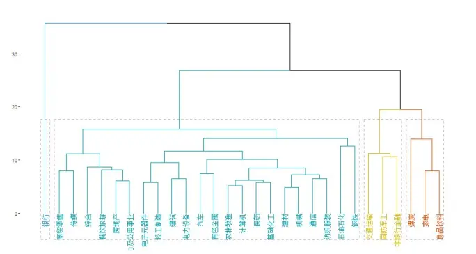
资料来源：Wind，渤海证券研究所

图 2：BP聚类结果
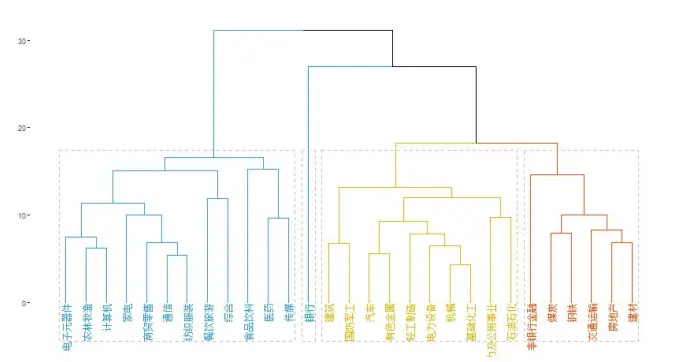
资料来源：Wind，渤海证券研究所

图 3：净利润单季度增长率聚类结果
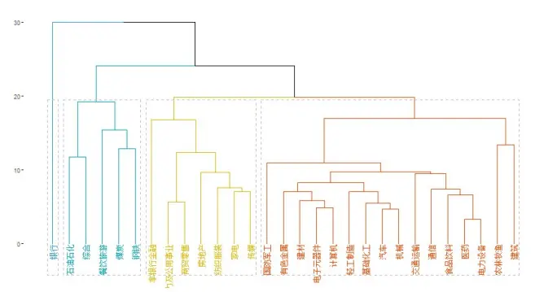
资料来源：Wind，渤海证券研究所

图 4：ROE_ttm 聚类结果
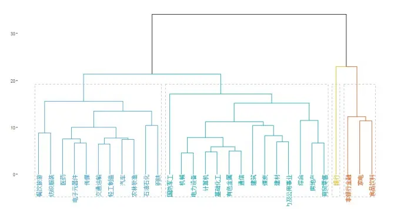
资料来源：Wind，渤海证券研究所

图 5：过去一个月收益率聚类结果
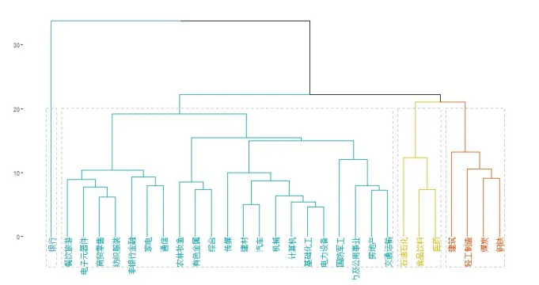
资料来源：Wind，渤海证券研究所

图 6：过去一个月波动率聚类结果
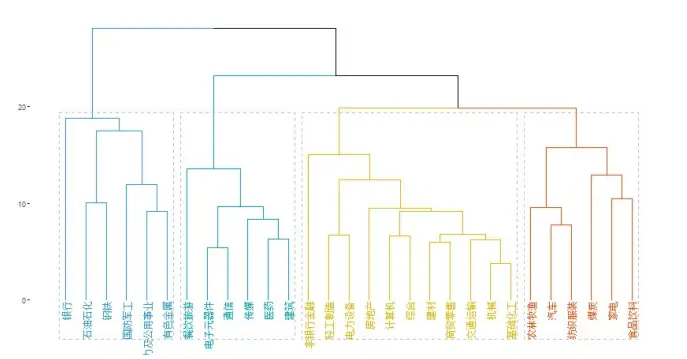
资料来源：Wind，渤海证券研究所

图 7：过去一个月换手率聚类结果
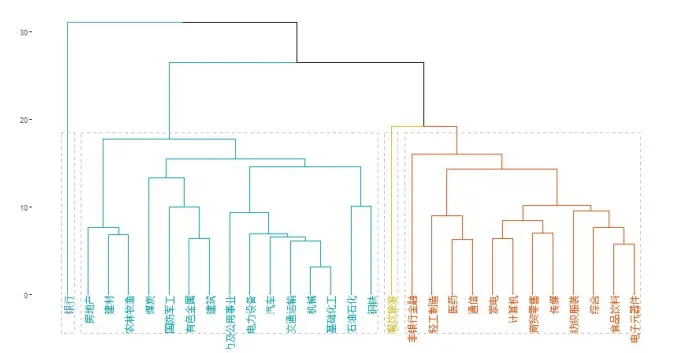
资料来源：Wind，渤海证券研究所

图 8：Beta 聚类结果
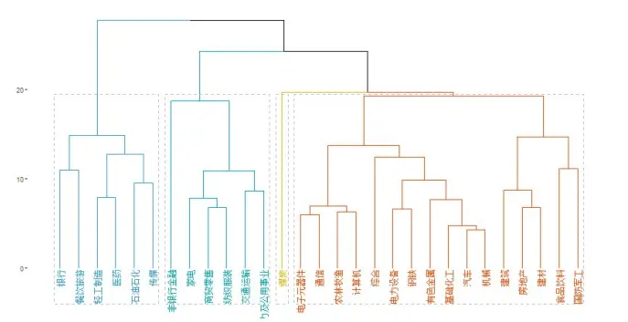
资料来源：Wind，渤海证券研究所

## 2. 更直观的方式：因子分层回测

## 2.1 方法介绍

聚类方法可以较为科学的反应不同行业间的距离与分类方式，但在展示其背后原理时却不太直观。于是我们想到另一种更直观的方式，首先使用多因子模型的收益预测模型预测股票下一期收益，然后在每个行业里将股票按照预测收益排序，进行分层回测。考察多因子模型在不同行业中的分层效果，对于那些分层效果不好的行业，证明多因子模型在该行业中没能选出收益最好的股票，在下一步的模型构造中可以进行单独处理。

在多因子模型中，我们使用之前介绍过的传统收益预测模型构建方式，选取七大类因子，同类因子之间等权合成，不同类因子间酌情进行正交化处理。采用12个月移动平均的方式预测因子收益。在分层回测时，各层间股票等权重配置。

表 2：多因子模型使用因子列表

| 因子类型 | 入选因子 |
| --- | --- |
| 估值因子 | BP、EPcut |
| 盈利因子 | ROE_q |
| 成长因子 | ROE_G_q、Profit_G_q |
| 反转因子 | reverse_20、reverse_60、reverse_180 |
| 流动性因子 | STOM、STOQ、STOA |
| 波动率因子 | HISGMA、DASTD |
| 市值因子 | LNCAP |

数据来源：渤海证券研究所、Wind

## 2.2 是否需要对因子做行业中性处理

很多人在建立多因子模型时，习惯在因子预处理部分，除了去极值、标准化步骤之外，再对因子进行行业/市值中性处理。具体来说，就是使用因子序列对流动市值或行业哑变量做线性回归，取残差作为新的因子值。这样可以某种程度上消除不同市值/行业间因子分配不均的问题。关于是否要做市值中性，我们将放在未来讨论。此处，我们测试了做过行业中性与没做行业中性两种情况下多因子模型的分层收益情况，不管是否去掉银行、非银金融，做过行业中性的模型分层表现明显优于没做过行业中性的模型。这证明，即使在去掉银行、非银金融的情况下，对剩余行业做行业中性处理还是有一定必要的。

表 3：未经中性化的分层回测数据

|  | 年化收益 | 波动率 | 最大回撤 | 夏普比率 | 信息比率 | 胜率 |
| --- | --- | --- | --- | --- | --- | --- |
| 第1组 | 26.20% | 28.00% | 34.32% | 0.94 | 2.53 | 75.42% |
| 第2组 | 17.45% | 27.38% | 35.27% | 0.64 | 2.26 | 72.88% |
| 第3组 | 11.14% | 27.27% | 39.96% | 0.41 | 1.57 | 72.88% |
| 第4组 | 10.08% | 27.16% | 41.28% | 0.37 | 1.52 | 66.95% |
| 第5组 | 5.64% | 27.27% | 44.08% | 0.21 | 0.42 | 56.78% |
| 第6组 | 3.52% | 27.75% | 49.96% | 0.13 | -0.38 | 47.46% |
| 第7组 | -0.06% | 27.60% | 54.04% | 0.00 | -1.52 | 34.75% |
| 第8组 | -3.54% | 27.57% | 60.30% | -0.13 | -1.77 | 30.51% |
| 第9组 | -6.65% | 28.25% | 68.17% | -0.24 | -1.79 | 27.12% |
| 第10组 | -14.43% | 29.96% | 81.79% | -0.48 | -1.87 | 21.19% |
| 总平均 | 4.55% | 27.25% | 48.36% | 0.17 | 0.00 | 0.00% |

数据来源：渤海证券研究所、Wind

表 4：中性化后的分层回测数据

|  | 年化收益 | 波动率 | 最大回撤 | 夏普比率 | 信息比率 | 胜率 |
| --- | --- | --- | --- | --- | --- | --- |
| 第1组 | 27.16% | 28.39% | 33.55% | 0.96 | 2.89 | 82.20% |
| 第2组 | 17.15% | 27.87% | 37.29% | 0.62 | 2.42 | 76.27% |
| 第3组 | 13.59% | 27.74% | 39.56% | 0.49 | 2.22 | 77.97% |
| 第4组 | 8.43% | 26.56% | 42.27% | 0.32 | 1.37 | 68.64% |
| 第5组 | 4.80% | 26.91% | 46.12% | 0.18 | 0.09 | 51.69% |
| 第6组 | 3.87% | 26.88% | 47.00% | 0.14 | -0.27 | 48.31% |
| 第7组 | 0.98% | 27.80% | 52.15% | 0.04 | -1.11 | 38.98% |
| 第8组 | -2.80% | 27.79% | 57.74% | -0.10 | -1.88 | 28.81% |
| 第9组 | -7.66% | 27.80% | 67.65% | -0.28 | -2.38 | 22.03% |
| 第10组 | -15.38% | 29.18% | 83.02% | -0.53 | -2.35 | 21.19% |
| 总平均 | 4.55% | 27.25% | 48.36% | 0.17 | 0.00 | 0.00% |

数据来源：渤海证券研究所、Wind

表 5：未经中性化的分层回测数据（去除银行、非银）

|  | 年化收益 波动率 | 最大回撤 | 夏普比率 | 信息比率 | 胜率 |
| --- | --- | --- | --- | --- | --- |
| 第1组 | 26.90% | 28.52% | 34.39% 0.94 | 2.64 | 77.12% |
| 第2组 | 17.12% | 27.58% | 37.03% 0.62 | 2.23 | 74.58% |
| 第3组 | 11.28% | 27.36% | 40.55% 0.41 | 1.64 | 70.34% |
| 第4组 | 9.61% | 27.12% 41.78% | 0.35 | 1.49 | 65.25% |
| 第5组 | 5.41% | 27.39% 45.13% | 0.20 | 0.35 | 55.93% |
| 第6组 | 4.09% | 28.17% 49.47% | 0.15 | -0.15 | 51.69% |
| 第7组 | 0.31% | 27.62% 54.72% | 0.01 | -1.43 | 35.59% |
| 第8组 | -3.19% | 27.70% 59.62% | -0.12 | -1.73 | 34.75% |
| 第9组 | -6.90% | 28.42% 68.59% | -0.24 | -1.90 | 26.27% |
| 第10组 | -15.18% | 29.76% | 83.28% -0.51 | -1.99 | 23.73% |
| 总平均 | 4.53% | 27.42% | 48.60% | 0.17 0.00 | 0.00% |

数据来源：渤海证券研究所、Wind

表 6：中性化后的分层回测数据（去除银行、非银）

|  | 年化收益 | 波动率 | 最大回撤 | 夏普比率 | 信息比率 | 胜率 |
| --- | --- | --- | --- | --- | --- | --- |
| 第1组 | 27.48% | 28.48% | 33.94% | 0.97 | 2.93 | 81.36% |
| 第2组 | 17.18% | 28.00% | 38.21% | 0.61 | 2.43 | 76.27% |
| 第3组 | 13.39% | 27.79% | 39.58% | 0.48 | 2.11 | 74.58% |
| 第4组 | 8.71% | 26.90% | 42.44% | 0.32 | 1.52 | 66.10% |
| 第5组 | 4.95% | 27.28% | 45.40% | 0.18 | 0.16 | 60.17% |
| 第6组 | 3.62% | 27.35% | 47.62% | 0.13 | -0.35 | 48.31% |
| 第7组 | 0.95% | 27.89% | 52.10% | 0.03 | -1.16 | 38.98% |
| 第8组 | -3.04% | 27.90% | 58.99% | -0.11 | -1.96 | 29.66% |
| 第9组 | -7.78% | 27.82% | 67.82% | -0.28 | -2.34 | 22.03% |
| 第 10 组 | -15.42% | 29.25% | 83.19% | -0.53 | -2.33 | 22.03% |
| 总平均 | 4.53% | 27.42% | 48.60% | 0.17 | 0.00 | 0.00% |

数据来源：渤海证券研究所、Wind

## 2.3 分层回测结果

对每个行业，我们首先计算了其2010年至今的历史分5 层回测情况（相对总平均值），然后计算了第1层相对第5层的相对收益，最后统计了其分年度的收益情况。可以看出，银行的分层基本为反向的，证明该模型在银行行业里没能选出表现最好的标的，反而常常选出表现不好的标的。构建一个新的关于银行行业的多因子模型成为当务之急。

其他行业如有色金属、国防军工、非银金融等行业，多因子模型表现也不够理想。而餐饮旅游、通信、传媒、计算机、农林牧渔等行业，则是近几年模型出现失效情况。想要构造表现更好的多因子模型，需要重点关注这几个行业的因子收益情况，适当进行模型调整和因子择时。

图 9：银行分层回测结果
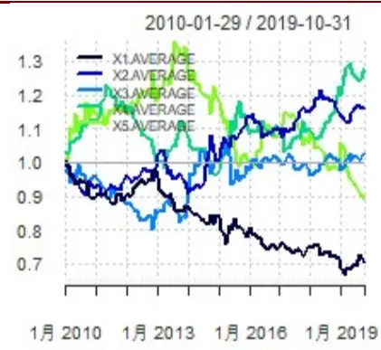
资料来源：Wind，渤海证券研究所

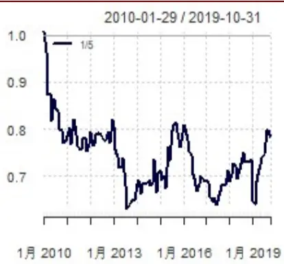

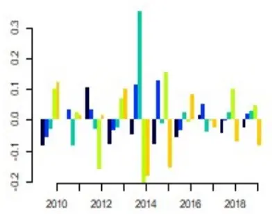

图 10：非银金融分层回测结果
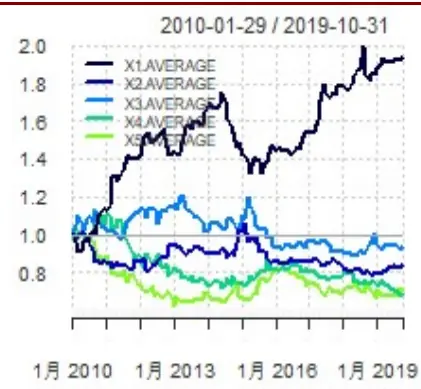
资料来源：Wind，渤海证券研究所

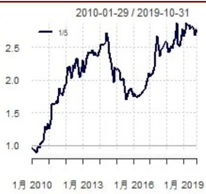

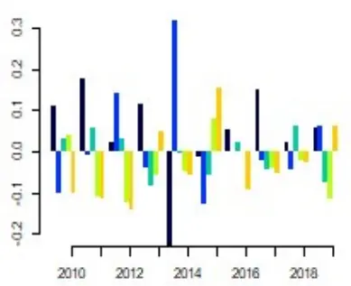

图 11：食品饮料分层回测结果
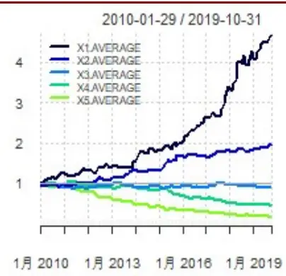
资料来源：Wind，渤海证券研究所

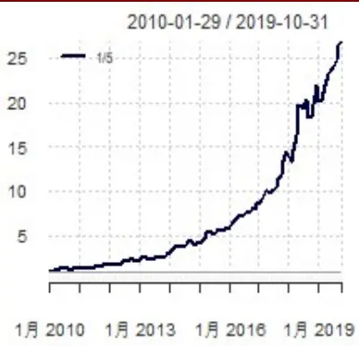

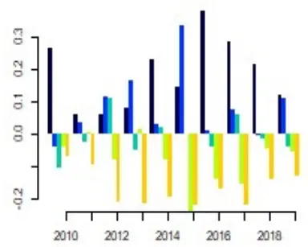

图 12：医药分层回测结果
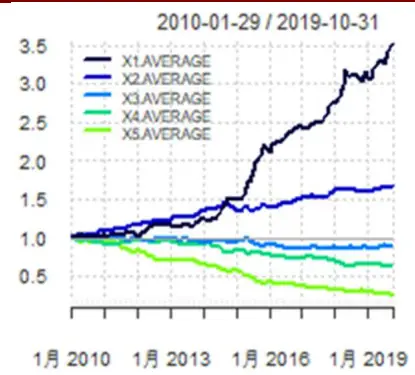
资料来源：Wind，渤海证券研究所

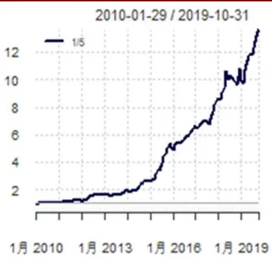

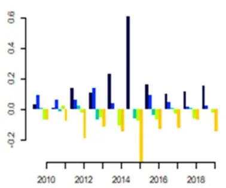

图 13：建筑分层回测结果
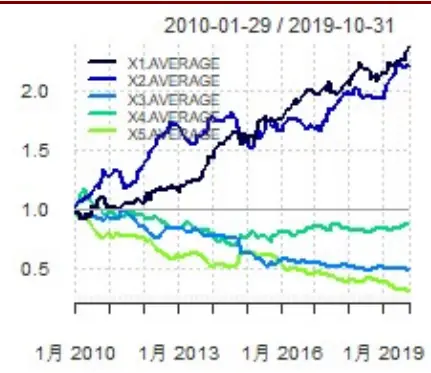
资料来源：Wind，渤海证券研究所

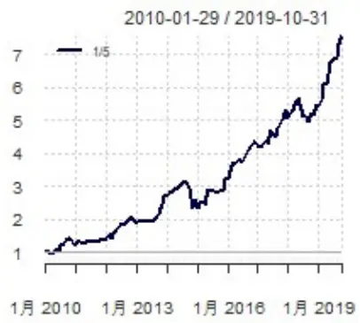

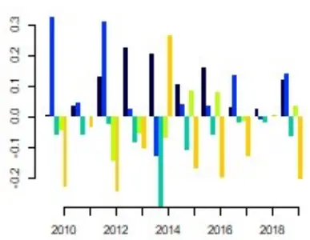

图 14：机械分层回测结果
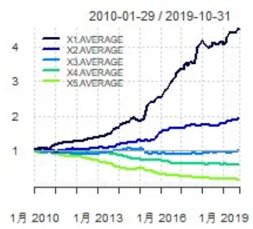
资料来源：Wind，渤海证券研究所

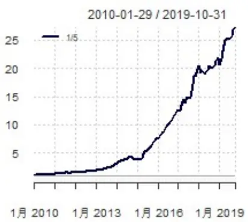

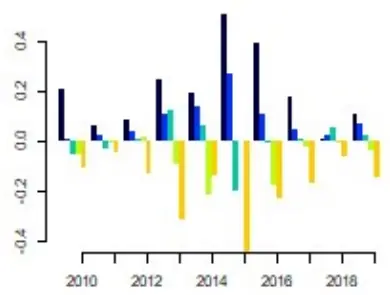

图 15：房地产分层回测结果
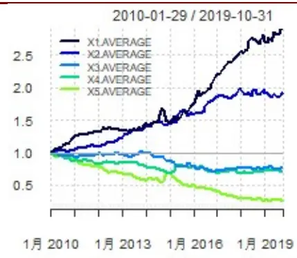
资料来源：Wind，渤海证券研究所

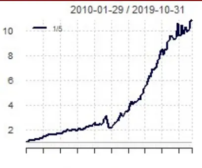
1月2010 1月2013 1月2016 1月 2019

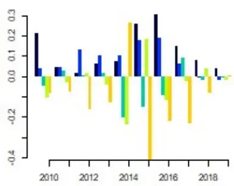

图 16：石油石化分层回测结果
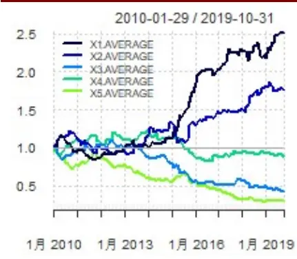
资料来源：Wind，渤海证券研究所

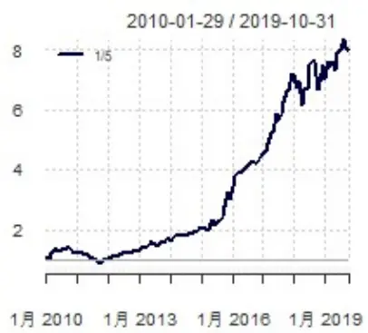

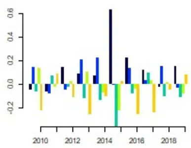

图 17：餐饮旅游分层回测结果
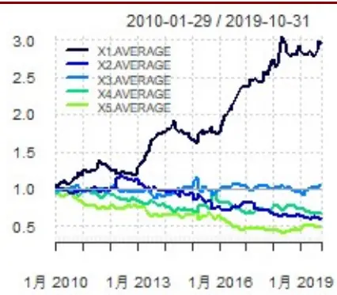
资料来源：Wind，渤海证券研究所

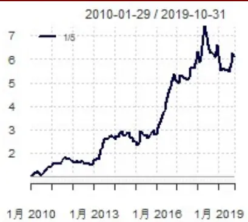

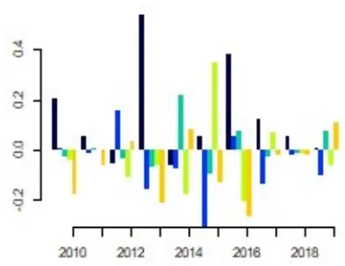

图 18：汽车分层回测结果
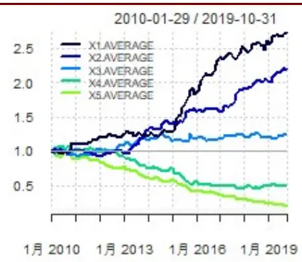
资料来源：Wind，渤海证券研究所

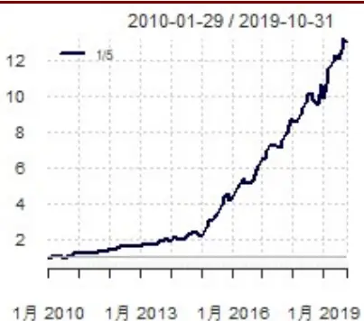

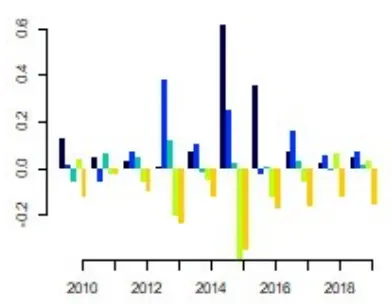

图 19：建材分层回测结果
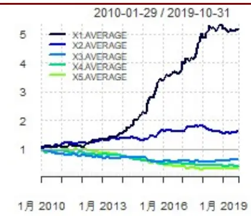
资料来源：Wind，渤海证券研究所

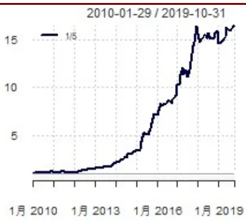

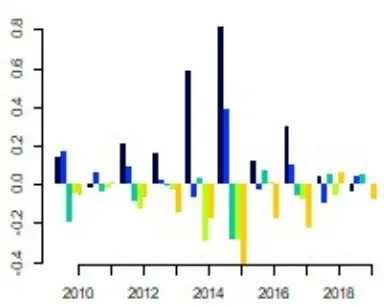

图 20：通信分层回测结果
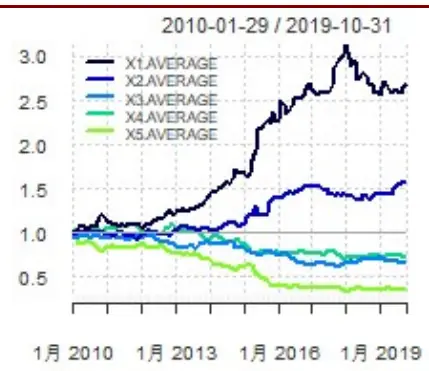
资料来源：Wind，渤海证券研究所

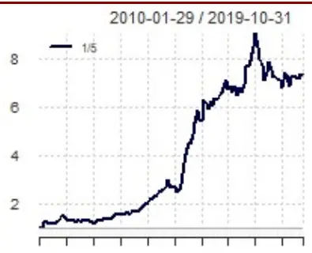
1月2010 1月 2013 1月 2016 1月2019

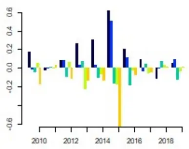

图 21：基础化工分层回测结果
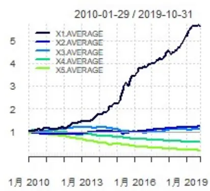
资料来源：Wind，渤海证券研究所

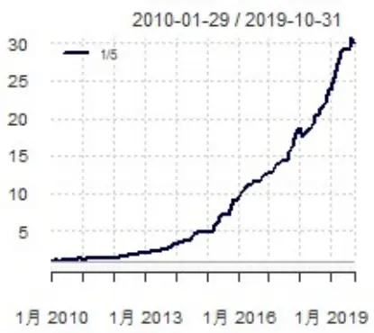

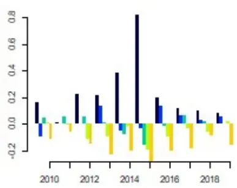

图 22：煤炭分层回测结果
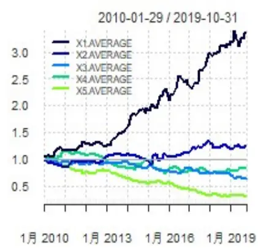
资料来源：Wind，渤海证券研究所

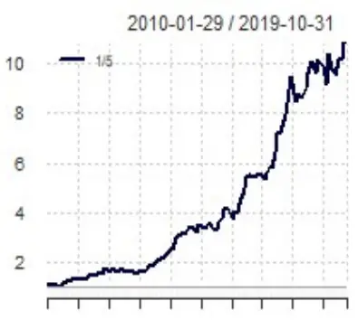
1月2010 1月 2013 1月2016 1月2019

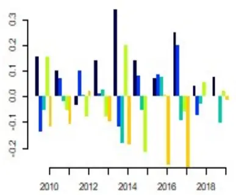

图 23：家电分层回测结果

资料来源：Wind，渤海证券研究所

图 24：国防军工分层回测结果

资料来源：Wind，渤海证券研究所

图 25：钢铁分层回测结果

资料来源：Wind，渤海证券研究所

图 26：交通运输分层回测结果

资料来源：Wind，渤海证券研究所

图 27：电子元器件分层回测结果

资料来源：Wind，渤海证券研究所

图 28：有色金属分层回测结果

资料来源：Wind，渤海证券研究所

图 29：传媒分层回测结果

资料来源：Wind，渤海证券研究所

图 30：电力及公用事业分层回测结果

资料来源：Wind，渤海证券研究所

图 31：电力设备分层回测结果

资料来源：Wind，渤海证券研究所

图 32：纺织服装分层回测结果

资料来源：Wind，渤海证券研究所

图 33：计算机分层回测结果

资料来源：Wind，渤海证券研究所

图 34：农林牧渔分层回测结果

资料来源：Wind，渤海证券研究所

1月2010 1月2013 1月2016 1月 2019

图 35：轻工制造分层回测结果

资料来源：Wind，渤海证券研究所

图 36：商贸零售分层回测结果

资料来源：Wind，渤海证券研究所

图 37：综合分层回测结果

资料来源：Wind，渤海证券研究所

## 3.结论

通过使用两种方法检验多因子模型的行业分类，我们发现，银行行业相对于其他行业显现出了较大独立性。未来的指数增强模型中，我们会尝试在银行行业中使用单独的模型，特别是银行行业占比较大的指数，如沪深 300、上证50等。至于其他行业，如非银金融、国防军工、农林牧渔、TMT等，也会考虑对模型进行修改，以进一步适应行业特点。

## 未来改进方向：

1. 针对银行行业的多因子模型；

2. 行业分组后的多因子模型；

3. 其他关于多因子模型细节的探讨。

风险提示：随着市场环境变化，模型存在失效风险。

## 附录：因子定义

表 7：因子定义

| 大类因子 | 小类因子 | 因子解释 |
| --- | --- | --- |
| 反转 | RSTR_barra | Barra因子；Σt=l wt[ln(1 + rt)]，L=21，T=500，半衰期 120日 |
|  | RSTR_m24 | Σt= wt[ln(1 + rt)]，L=1，T=240，半衰期 120日 |
|  | RSTR_m12 | Σt= wt[In(1 + rt)]，L=1, T=240，半衰期 60日 |
|  | RSTR_m6 | Σt= wt[ln(1 + rt)]，L=1，T=120，半衰期 30日 |
|  | RSTR_m3 | Σt= wt[ln(1 + rt)]，L=1，T=60，半衰期 15 日 |
|  | RSTR_m1 | ΣT+} wt[ln(1+ rt)]，L=1，T=20，半衰期 5日 |
|  | RS_1 | 最新收盘价/21个交易日前收盘价 |
| 动量 | RS_3 | 最新收盘价/63个交易日前收盘价 |
|  | RS_6 | 最新收盘价/126个交易日前收盘价 |
|  | RS_12 | 最新收盘价/252个交易日前收盘价 |
| 市值 | Alpha | alpha系数；个股收益率序列与沪深300指数收益率序列以半衰期指数加权， 得到 alpha 系数，半衰期为 60 日 |
|  | Size | 总市值 |
|  | non-linear-size | Barra因子；中等市值；将总市值的对数与总市值立方的对数回归得到残差， |
|  | marketcap | 再对残差做标准化处理 |
|  |  | 流通市值 |
| 流动性 | STOM | 月度平均换手率；最近一个月的交易量/流通股数 |
|  | STOQ |  |
|  | STOS | 季度平均换手率；最近一季度的交易量/流通股数 |
|  | STOA | 半年平均换手率；最近半年的交易量/流通股数 年度平均换手率；最近一年的交易量/流通股数 |
|  | STOM_barra | Barra 因子；公式： $\ln\left(\sum_{t=1}^{21}\frac{V_{t}}{S_{t}}\right)$ $V_{t}$ 为t日成交金额， $S_{t}$ 为t日流动市值 |
|  | STOQ_barra | Barra 因子；公式： $\begin{array}{r}{\ln[\frac{1}{T}\sum_{t=1}^{T}\exp(STOM_{t})]}\end{array}$ ，T=63 个交易日 |
|  | STOA_barra | Barra 因子；公式： $\begin{array}{r}{\ln[\frac{1}{T}\sum_{t=1}^{T}\exp(STOM_{t})]}\end{array}$ ，T=244个个交易日 |
|  | Ins | 机构持股比例；机构持股变动/总股本 |
|  | ins_c | 机构持股比例变动 |
|  | MSM | 一个月换手率变动；最近1个月换手率/最近1年换手率 |
|  | MSQ | 季度换手率变动；最近3个月换收益率/最近1年换手率 |
|  | MSS | 半年换手率变动；最近6个月换收益率/最近1年换手率 |
|  |  | Barra因子；年度平均波动率；累计日波动率以半衰期指数加权，半衰期为40 |
|  | DASTD | 日 |
| 波动率 | CMRA | Barra 因子；年度收益率波动 |

请务必阅读正文之后的免责声明

| HSIGMA |  | Barra 因子；sigma：个股收益率序列与沪深 300 指数收益率序列以半衰期指 数加权，得到残差，对残差求标准差得到sigma，半衰期为60日 |
| --- | --- | --- |
| Beta |  | Barra因子；贝塔系数；个股收益率序列与沪深300指数收益率序列以半衰期 指数加权，得到 beta系数，半衰期为 60日 |
| yieldvol_1 |  | 月度日收益率波动率；一个月日收益率标准差 |
| yieldvol_3 |  | 季度日收益率波动率；三个月日收益率标准差 |
| yieldvol_6 |  | 半年日收益率波动率；半年日收益率标准差 |
| high_low_1 |  | 月度股价波动；最高价/最低价（最近一个月内价格） |
| high_low_3 |  | 季度股价波动；最高价/最低价（近三个月内价格） |
| high_low_6 |  | 半年股价波动；最高价/最低价（近六个月内价格） |
| high_low_12 |  | 全年股价波动；最高价/最低价（近十二个月内价格） |
| VOL_1 |  | 成交量月度波动率；1月波动率标准差 |
| VOL_3 |  | 成交量季度波动率；3月波动率标准差 |
| VOL_6 |  | 成交量半年波动率；6月波动率标准差 |
| VOL_12 |  | 成交量年度波动率；12月波动率标准差 |
| growth_ttm_or |  | 营业收入 ttm一年增长率 |
|  | growth_ttm_profit | 净利润 ttm一年增长率 |
|  | qfa_yoysales_qq | 单季度营业收入一年增长率 |
|  | qfa_yoynetprofit_qq | 单季度归母净利润一年增长率 |
|  | qfa_yoyocf_qq | 单季度经营性现金流一年增长率 |
|  | qfa_yoyprofit_qq | 单季度净利润一年增长率 |
|  | qfa_roe_qq | 单季度 roe 一年增长率 |
|  | yoy_profit_qq | 净利润一年增长率 |
| 成长 | yoy_growth_netprofit_q |  |
|  | q | 归母净利润一年增长率 |
|  | yoy_or_qq | 营业收入一年增长率 |
|  | yoyroe_qq | roe一年增长率 |
|  | yoyocf_qq | 经营性现金流一年增长率 |
|  | growth_roe_qq_3 growth_netprofit_qq_3 | roe 三年增长率 归母净利润三年增长率 |
|  | growth_or_qq_3 | 营业收入三年增长率 |
|  | growth_profit_qq_3 | 净利润三年增长率 |
|  | growth_ocf_qq_3 | 经营性现金流三年增长率 |
|  | growth_profit_qq_5 | 净利润五年增长率 |

请务必阅读正文之后的免责声明

| growth_ocf_qq_5 | 经营性现金流五年增长率 |
| --- | --- |
| growth_roe_qq_5 | roe 五年增长率 |
| SGRO | Barra 因子；过去5年企业营业收入复合增长率 |
| EGRO_5 | Barra因子；过去5年企业归属母公司净利润复合增长率 |
| EGIB | Barra 因子；未来3年企业一致预期净利润增长率 |
| EGIB_S | Barra 因子；未来1年企业一致预期净利润增长率 |
| CETOP | Barra 因子：个股现金收益比股票价格 |
| roe_q | 当季净资产收益率 |
| roe_ttm | 滚动 ROE |
| roa_q | 当季资产收益率、资产回报率 |
| roa_ttm | 滚动 ROA |
| qfa_grossprofitmargin | 当季毛利率 |
| grossprofitmargin_ttm | 滚动毛利率 |
| profitmargin_q | 当季扣非后利润率 |
| profitmargin_ttm | 滚动扣非后利润率 |
| assetsturn_q | 当季资产周转率 |
| assetturn_ttm operationcashflowratio_ | 滚动资产周转率 |
| q | 当季经营活动现金净流比率 |
| operationcashflowratio_ ttm | 滚动经营活动现金净流比率 |
| ROIC | 投入资本回报率 |
| EBIT2EV | 投资收益率；息税前利润/投入资本 |
| 盈利 CASHROIC | 现金 ROIC |
| FreeCashflowYield | 自由现金流比率；经营性活动产生的净现金流-构建其他长期资产支付的现金/ |
| sales2EV | 总市值 营业收益率；营业收入TTM/总市值+非流动负债 |
| cashflow1 | 经营活动净现金流/总市值 |
| cashflow2 | 经营活动净现金流/营业收入 |
| cashflow3 | 经营活动净现金流/营业收入净收益 |
| invturn_qq | 存货周转率；存货成本/平均存货余额 |
| arturn_qq | 应收账款周转率；当期销售净收入/平均应收账款 |
| faturn_qq | 固定资产周转率；销售收入/平均固定资产 |
| assetturnover_ttm | 滚动总资产周转率；营业收入ttm/[(期初资产总额+期末资产总额)/2] |
| assetsturn_qq | 总资产周转率；营业总收入/[(期初资产总额+期末资产总额)/2] |
| longdebttoworkingcapit | 长期债务与营运资金比率；长期债务/营运资本 |
| al_qq |  |
| finaexpensetogr_qq | 财务费用比率；财务费用/主营业务收入 |
| gctogr_qq | 营业费用比率；营业费用/主营业务收入 |
| ETOP 价值 BTOP | Barra因子；历史EP值；利用过去12个月个股净利润除以当前市值。 Barra因子；历史BP值；普通股权益价值/市值 |

请务必阅读正文之后的免责声明

|  | epcut | 市盈率（扣除非经营性损益部分，即公司经营性盈利与市值之比值） |
| --- | --- | --- |
|  | bp_If ncfp | 最近公告日 BP |
|  |  | 净现金市值比；净现金流/总市值 |
|  | ocfp | 营业现金流比率；经营性现金流/总市值 |
|  | dividendyield | 股息率；过去一年分红/总市值 |
|  | stop1 stop2 | 营收市值比，市销率PS（TTM）倒数 |
| ep_rel | 营收市值比，市销率PS（LYR）倒数 相对 PE；PE/行业 PE |  |
| bp_rel | 相对 PB；PB/行业 PB |  |
| PEG | 市盈率相对盈利增长比率 |  |
| EPIBS | Barra 因子；预期 EP值 |  |

资料来源：渤海证券研究所、The Barra China EquityModel (CNE5)

投资评级说明

| 项目名称 | 投资评级 | 评级说明 |
| --- | --- | --- |
| 公司评级标准 | 买入 | 未来 6 个月内相对沪深 300 指数涨幅超过 20% |
|  | 增持 | 未来6 个月内相对沪深 300 指数涨幅介于10%~20%之间 |
|  | 中性 | 未来6 个月内相对沪深 300指数涨幅介于-10%~10%之间 |
|  | 减持 | 未来 6 个月内相对沪深 300 指数跌幅超过 10% |
| 行业评级标准 | 看好 | 未来 12个月内相对于沪深300指数涨幅超过 10% |
|  | 中性 | 未来12个月内相对于沪深 300 指数涨幅介于-10%-10%之间 |
|  | 看淡 | 未来 12 个月内相对于沪深 300 指数跌幅超过 10% |

免责声明：本报告中的信息均来源于已公开的资料，我公司对这些信息的准确性和完整性不作任何保证，不保证该信息未经任何更新，也不保证本公司做出的任何建议不会发生任何变更。在任何情况下，报告中的信息或所表达的意见并不构成所述证券买卖的出价或询价。在任何情况下，我公司不就本报告中的任何内容对任何投资做出任何形式的担保，投资者自主作出投资决策并自行承担投资风险，任何形式的分享证券投资收益或者分担证券投资损失书面或口头承诺均为无效。我公司及其关联机构可能会持有报告中提到的公司所发行的证券并进行交易，还可能为这些公司提供或争取提供投资银行或财务顾问服务。我公司的关联机构或个人可能在本报告公开发表之前已经使用或了解其中的信息。本报告的版权归渤海证券股份有限公司所有，未获得渤海证券股份有限公司事先书面授权，任何人不得对本报告进行任何形式的发布、复制。如引用、刊发，需注明出处为“渤海证券股份有限公司”，也不得对本报告进行有悖原意的删节和修改。

## 渤海证券股份有限公司研究所

## 所长&金融行业研究

张继袖

+86 22 2845 1845

## 计算机行业研究小组

王洪磊（部门经理）

+86 22 2845 1975

张源

+86 22 2383 9067

## 医药行业研究小组

徐勇

+86 10 6810 4602

甘英健

+86 22 2383 9063

陈晨

+86 22 2383 9062

张山峰

+86 22 2383 9136

## 机械行业研究

张冬明

+86 22 2845 1857

## 固定收益研究

崔健
+86 22 2845 1618朱林宁
+86 22 2387 3123张婧怡
+86 22 2383 9130

## 流动性、战略研究＆部门经理

周喜+86 22 2845 1972

综合管理＆部门经理齐艳莉+86 22 2845 1625

合规管理&部门经理任宪功+86 10 6810 4615

## 副所长&产品研发部经理

崔健

+86 22 2845 1618

## 汽车行业研究小组

郑连声

+86 22 2845 1904

陈兰芳

+86 22 2383 9069

## 电力设备与新能源行业研究

张冬明
+86 22 2845 1857滕飞
+86 10 6810 4686

## 传媒行业研究

姚磊+86 22 2383 9065

## 固定收益研究

崔健
+86 22 2845 1618夏捷
+86 22 2386 1355马丽娜
+86 22 2386 9129

## 策略研究

宋亦威
+86 22 2386 1608严佩佩
+86 22 2383 9070

## 机构销售•投资顾问

朱艳君+86 22 2845 1995

风控专员 
张敬华 
+86 10 6810 4651

请务必阅读正文之后的免责声明餐饮旅游行业研究杨旭+86 22 2845 1879

非银金融行业研究张继袖
+86 22 2845 1845王磊
+86 22 2845 1802

## 中小盘行业研究中小盘行业研究

徐中华+86 10 6810 4898

## 金融工程研究

宋旸
+86 22 2845 1131张世良
+86 22 2383 9061

## 宏观研究

宋亦威+86 22 2386 1608

食品饮料行业研究刘瑀+86 22 2386 1670

## 通信行业研究小组

徐勇+86 10 6810 4602

## 金融工程研究

祝涛 
+86 22 2845 1653 郝倞 
+86 22 2386 1600

## 博士后工作站

张佳佳 资产配置
+86 22 2383 9072
张一帆 公用事业、信用评级
+86 22 2383 9073

渤海证券研究所

天津

天津市南开区水上公园东路宁汇大厦 A 座写字楼

邮政编码：300381

电话：（022）28451888

传真：（022）28451615

北京

北京市西城区西直门外大街甲 143号 凯旋大厦 A座2层

邮政编码：100086

电话： （010）68104192

传真： （010）68104192

渤海证券研究所网址：www.ewww.com.cn