# 沪深 300 指数增强组合业绩归因分析

# ——多因子模型研究系列之十二

分析师：宋旸

2019 年 12 月 31 日

证券分析师

宋旸

SAC NO：S1150517100002

022-28451131

18222076300

songyang@bhzq.com

助理分析师

张世良

022-23839061

zhangsl@bhzq.com

## 相关研究报告

《多因子模型研究之一：单因子测试》20171011

《多因子模型研究之二：收益预测模型》20171229

《多因子模型研究之三：风险 模 型 与 组 合 优 化 》20180416

《使用多因子框架的沪深300 指数增强模型——多因子研究系列之七》
20190329

《融合BL模型的上证50指数增强模型——多因子模型研究系列之十》20190911

## 核心观点：

股票多因子框架一般包括单因子有效性测试、截面回归模型预测股票收益、结合风险模型进行组合优化以及组合业绩归因四个部分。业绩归因作为分析组合收益来源的有效工具，既可被投资组合经理用于分析策略有效性并加以改进，也可被投资者分析投资经理的各方面投资能力。

本文尝试在我们团队已经构建的渤海多因子框架基础上，更进一步，通过加入组合业绩归因的环节，对团队已经开发的沪深 300增强模型以及规模较大的某沪深300 指数增强基金产品加以分析，籍此获知增强策略的超额收益来源。

结果表示，对于增强 A，2019 年以来 ROE 的暴露为其提供了一定的超额收益来源，BETA 的负向暴露和估值的正向暴露则对获取超额收益起负向影响；渤海沪深 300 的超额收益部分可由控制了波动率因子和市值因子之后，成长因子相对基准的主动暴露来解释，其余部分则可能需要由本文提供的因子之外的其他 alpha 因子来解释。

未来，我们将考虑一方面对已有因子进行进一步改进，以提高 alpha 因子的有效性；另一方面，考虑挖掘其他能够带来新的解释力的因子，纳入因子库内备用。敬请关注。

- 风险提示：随着市场环境变化，模型存在失效风险。

## 1. 概述

股票多因子框架一般包括单因子有效性测试、截面回归模型预测股票收益、结合风险模型进行组合优化以及组合业绩归因四个部分。业绩归因作为分析组合收益来源的有效工具，既可被投资组合经理用于分析策略有效性并加以改进，也可被投资者分析投资经理的各方面投资能力。

本文尝试在我们团队已经构建的渤海多因子框架基础上，更进一步，通过加入组合业绩归因的环节，对团队已经开发的沪深 300增强模型以及规模较大的某沪深300 指数增强基金产品加以分析，籍此获知增强策略的超额收益来源及其区别，识别策略产生回撤波动的原因，最终为我们进一步完善沪深 300指数增强策略指明方向。

## 1.1沪深 300当前存在配置价值

沪深 300指数样本选自沪深两个证券市场，由市值大、流动性好的 300只股票组成，综合反映中国A 股市场上市股票价格的整体表现。

当前沪深300指数成分股市值分布偏向大盘股，市值500 亿以上的股票数量约占19%，规模占比约 62%；市值 100-200 亿的股票数量虽占最多的 37%，但规模仅占 13%。

图 1：成份股流通市值数量分布
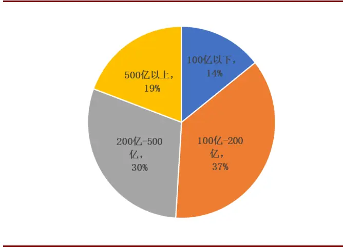
资料来源：Wind、渤海证券研究所

图 2：成份股流通市值规模分布
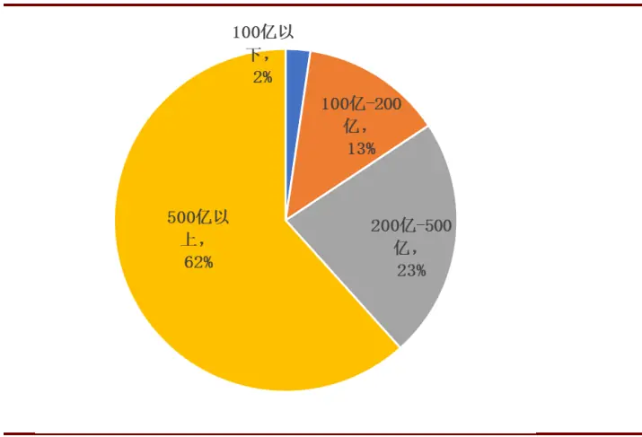
资料来源：Wind、渤海证券研究所

当前沪深300的PE(TTM)和PB(LF)分别处于近4年的17.35%和12.95%分位点，估值处于较低水平。结合近年来市场对大盘蓝筹股的偏好，使得沪深300当前在请务必阅读正文之后的免责声明4 of 21当前时点的配置价值比较突出。

图 3：沪深 300的 PE（TTM）（左轴）和 PB（LF）（右轴）
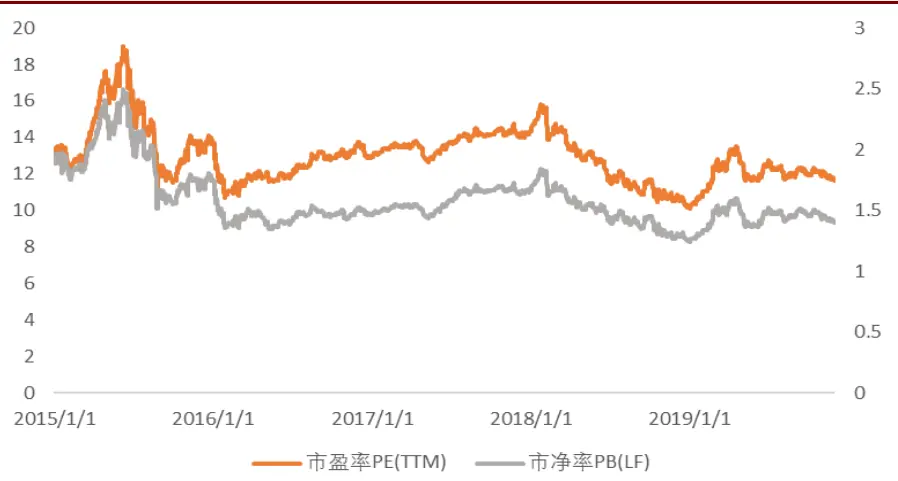
资料来源：Wind、渤海证券研究所

## 1.2沪深 300指数增强产品获取 alpha难度逐渐增加

沪深 300 指数增强产品的超额收益近几年呈逐渐下降趋势，今年以来，截至 11月底，成立时间超过一年的产品的规模加权平均超额收益仅 2.47%，规模超过 1亿的产品的规模加权平均超额收益为 2.45%。

图 4：沪深 300指数增强基金超额收益
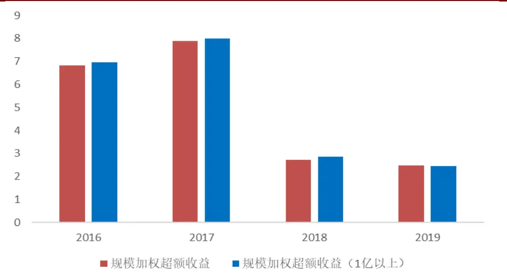
资料来源：Wind、渤海证券研究所

行业分布来看，沪深 300行业分布相对中证 500集中度更高，市值占比前5的行业分别为银行、非银金融、食品饮料、医药生物和电子，合计占比达 56.57%。市值占比前 2 的银行和非银金融合计占 33.69%，这两个行业内部成分股同质性高，更容易受共同因素影响而出现走势趋同的情况，增加了其行业内选股难度。

图 5：沪深 300、中证 500行业分布
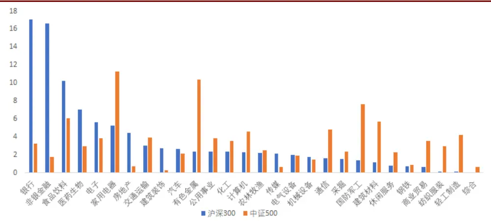
资料来源：Wind、渤海证券研究所

同时今年以来，在沪深300 内，成长因子表现较好，而部分因子如估值因子失效，波动率因子仅一季度表现尚可，其余时间表现平平。传统因子表现欠佳加大了获取相对于沪深 300超额收益的难度。

图 6：沪深 300纯因子走势
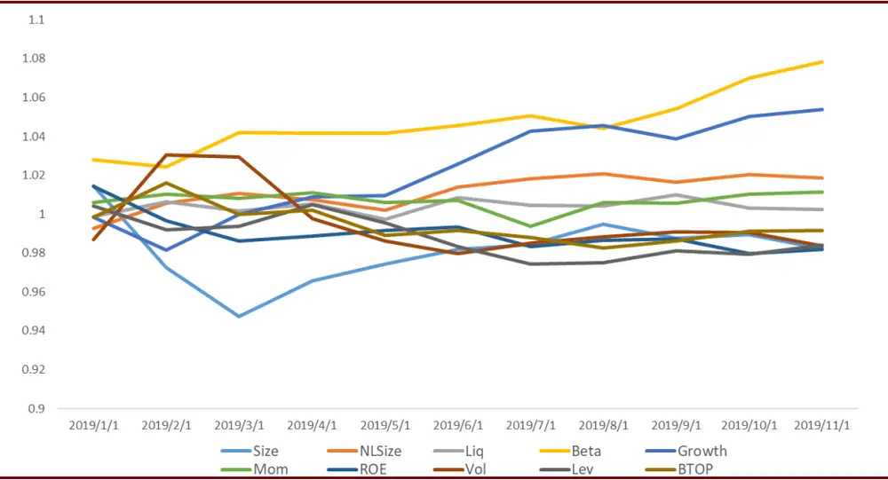
资料来源：渤海证券研究所

今年以来，我们构建的沪深 300 指数增强模型超额收益超过 9%，为对此做出进一步改进，后文以组合业绩归因模型对超额收益的来源进行了分解，并与今年以来市场上规模较大的某沪深300 增强基金产品A 的结果进行了对比。

## 2. 组合业绩归因原理

组合业绩归因方法主要包括基于净值的归因方法和基于持仓的归因方法两大类。请务必阅读正文之后的免责声明6 of 21

## 2.1 基于净值的归因

基于净值的归因主要采用组合的收益率对一系列因子收益率进行时间序列回归加以分析，这些因子主要为可以用来解释组合收益率变化的一系列风格因子，实际由一系列证券组合而得，该方法假定一定时间内组合对风格因子的暴露一定，每期因子收益的变动导致了组合的收益波动。

该方法通过收益率时间序列的回归，考察风格因子组合对组合收益的贡献，回归的残差项即代表了组合投资经理获取超额收益的能力。

净值归因分析方法的发展经历了由一开始的对投资经理选股和择时能力的考察，到后来分解为风格因子对收益解释的两个阶段。相比于基于持仓的归因方法，所需数据较少且较容易获取，仅需要基金的净值数据以及因子收益序列即可进行分析。

表 1：基于净值的归因方法总结

| 模型 | 模型定义 | 说明 |
| --- | --- | --- |
| $\mathrm{T}{-}\mathbb{M}$ | $R_{p}-R_{f}=\alpha+\beta_{1}\big(R_{m}-R_{f}\big)+\beta_{2}\big(R_{m}-R_{f}\big)^{2}+\varepsilon_{p}$ | 1)α为选股能力指标，如果值大于零且越大，则表明基金经理具备较强的选股能力；2) $\beta_{2}$ 为择时能力指标，如果 ${\bf\nabla}_{\cdot}\beta_{2}$ 大于零，表明基金经理具有择时能力。 |
| H-M | $R_{it}-R_{ft}=\propto_{i}+\beta_{i0}\big(R_{mt}-R_{ft}\big)+\gamma_{i}\big[D\big(R_{mt}-R_{ft}\big)\big]+\varepsilon$ 其中，当 $R_{mt}-R_{ft}$ 大于0时，隐变量D取1；反之，D取0 | 如果 $\propto_{i}$ 显著为正，则我们认为基金经理具有选股能力；如果 $\gamma_{i}$ 显著为正，认为基金经理具有择时能力。 |
| $\mathrm{C-L}$ | $R_{pt}-R_{ft}=\alpha_{p}+\beta_{1}Min\big(0,R_{mt}-R_{ft}\big)+\beta_{2}Max\big(0,R_{mt}-R_{ft}\big)+\varepsilon_{pt}$ $R_{mt}-R_{ft}$ 小于0时，有且仅有含有 $\dot{\beta}_{1}$ 项的存在 $R_{mt}-R_{ft}$ 大于0时，有且仅有含有 $\dot{\beta}_{2}$ 项的存在 | $1)\beta_{1}$ 代表空头的 beta系数 ${},{\beta}_{2}$ 代表多头的 beta系数；2) 利用 $(\beta_{2}-\beta_{1})$ 可判断基金的择时能力，若其显著大于零且为正代表基金具有择时能力；3)α显著大于零代表基金经理具有选股能力。 $\alpha_{p}$ |
| F三因子 | $R_{i,t}-R_{ft}=a_{i}+\beta_{i}\big(R_{mt}-R_{ft}\big)+s_{i}SMB_{t}+h_{i}HML_{t}+\varepsilon_{it}$ | $R_{i,t}$ 为投资组合的期望收益率； $R_{ft}$ 为市场无风险收益率; $R_{mt}$ 为市场组合的收益率; $SMB_{t}$ 为规模因子，为小盘股票组合与大盘股票组合收益率之差; $HML_{t}$ 为估值因子，为高账面市值比组合与低账面市值比组合收益率之差 |
| Carhart 四因子 | $R_{i,t}-R_{ft}=a_{i}+\beta_{i}\big(R_{mt}-R_{ft}\big)+\beta_{i,SMB}SMB_{t}+\beta_{i,HML}HML_{t}$ + βi,uMDUMDt + εit | 在FF三因子模型的基础上，引入动量因子UMD(高收益率股票组合与低收益率股票组合收益率之差) |
| FF五因子 | $R_{it}-R_{ft}=a_{i}+b_{i}(R_{Mt}-R_{Ft})+s_{i}SMB_{t}+h_{i}HML_{t}+r_{i}RMW_{t}$ $+c_{i}CMA_{t}+e_{it}$ | 在FF三因子模型基础上,增加了盈利因子 RMW,（高 ROE 组合与低 ROE 组合收益率之差）和投 |

请务必阅读正文之后的免责声明

|  |  | 资因子CMA（低总资产增长率组合与高资产增 长率组合收益率之差) |
| --- | --- | --- |
| $_{\mathrm{~H-X-Z~q~}}$ 因子 | $E\big[r^{i}\big]-r^{f}=\beta_{MKT}^{i}E[MKT]+\beta_{ME}^{i}E[r_{ME}]+\beta_{\Delta A/A}^{i}E\big[r_{\Delta A/A}\big]$ $+\beta_{ROE}^{i}E[r_{ROE}]$ | 来自投资中的 $\mathsf{q}$ 理论，E[MKT]、 $E[r_{ME}]$ $E\big[r_{\Delta A/A}\big]$ $E[r_{ROE}]$ 为预期的因子收益，其中∆A /A以总资产的年增长率代表投资因子 |
| $\mathrm{H-X{-}Z~}~\mathrm{q}^{\mathrm{\tiny\wedge}}5$ | $\begin{array}{c}{E\bigl[R_{i}-R_{f}\bigr]=\beta_{Mkt}^{i}E[R_{Mkt}]+\beta_{Me}^{i}E[R_{Me}]+\beta_{I/A}^{i}E\bigl[R_{I/A}\bigr]+\beta_{Roe}^{i}E[R_{Roe}]}\\{+\beta_{Eg}^{i}[R_{Eg}]}\end{array}$ | $R_{Mkt}$ 为市值因子； $R_{Me}$ 为规模因子; $R_{I/A}$ 为投 资因子; $R_{Roe}$ 为盈利因子; $R_{Eg}$ 为在 q 因子 模 型的基础上加入的预期投资增长因子 |
| Liu 三因子 | $R_{t}=\alpha+\beta_{MKT}MKT_{t}+\beta_{SMB}SMB_{t}+\beta_{VMG}VMG_{t}+\epsilon_{t}$ | MKT为市场超额收益，SMB为对数市值因子，VMG 因子以EP 代替 BP 来构建 加入了换手率因子 PMO（Pessimistic Minus |
| Liu 四因子 | $R_{t}=\alpha+\beta_{MKT}MKT_{t}+\beta_{SMB}SMB_{t}+\beta_{VMG}VMG_{t}+\beta_{PMO}PMO_{t}+\epsilon_{t}$ | Optimistic），为低换手率组合与高换手率组 合收益率之差 |

资料来源：渤海证券研究所

## 2.2基于持仓的归因

基于持仓的归因方法则使用组合的每期实际持仓，在时间截面上利用组合所含各证券的收益对各风格因子的暴露进行映射。其中 Brinson 模型自上而下地将组合的超额收益进行分解，多因子模型则是自下而上，二者的归因在结果上一致。

## Brinson 归因模型

假定组合中的证券全部属于 I 个行业。以 $W_{i}.$ 表示基准组合中行业 i 的权重， $w_{i}$ 表示实际组合中行业i 的权重； $R_{i}$ 表示基准组合中行业i的收益， $r_{i\cdot}$ 表示实际组合中行业i 的收益。则如图所示，Brinson模型将组合按照行业将超额收益分解如下：

图 7：Brinson 归因模型

| $r_{i}$ |  |  |
| --- | --- | --- |
|  | 主动选择组合 $P_{3}=\sum_{i=1}^{l}W_{i}r_{i}$ | 实际投资组合 $P_{4}=\sum_{i=1}^{l}w_{i}r_{i}$ |
| $b_{i}$ | 基准组合 | 主动配置组合 |
|  | $P_{1}=\sum_{i=1}^{l}W_{i}b_{i}$ | $P_{2}=\sum_{i=1}^{l}w_{i}b_{i}$ |

资料来源：渤海证券研究所

图中的 4 个组合分别为基准组合 $P_{1}$ ，主动配置组合 ${\bf\nabla}\cdot{\cal P}_{2}$ ，主动选择组合 ${\bf\cdot}P_{3}$ ，实际投资组合 $P_{4}$ 。超额收益表示为实际组合 $P_{4}$ 与基准组合 $P_{1}$ 之间的收益差额 $R_{e}=P_{4}-P_{1}$ 基于4 个组合，可以将 $R_{e}$ 分解为资产配置收益（AR）、选择收益（SR）和交互收益（IR）。

$$
R_{e}={\tt A}{\tt R}+{\tt S}{\tt R}+{\tt I}{\tt R}
$$

$$
\mathrm{AR}=P_{2}-P_{1}=\sum_{i=1}^{l}(w_{i}-W_{i})r_{i}
$$

$$
{\mathrm{SR}}=P_{3}-P_{1}=\sum_{i=1}^{l}W_{i}(r_{i}-b_{i})
$$

$$
\mathrm{IR}=R_{e}-AR-SR=\sum_{i=1}^{l}(w_{i}-W_{i})(r_{i}-b_{i})
$$

从而配置效应 AR 为相对基准超配收益为正的行业，相对基准低配收益为负的行业获得的超额收益；选择效应 SR 为保持行业配置与基准一致时，在行业内通过主动选股获得的超额收益；交互效应 IR表示剩余收益部分。

以上模型由 Brinson、Hood 和 Beebower 提出，简称为 BHB 版本的 Brinson 模型。Brinson 和 Fachler 提出的 BF 版本的 Brinson 模型，在 BHB 版本的基础上作出了两个改进：

1）将配置效应AR变为 $\begin{array}{r}{\sum_{i=1}^{l}(w_{i}-W_{i})(r_{i}-b_{i})}\end{array}$ ，即超配相对基准上涨的行业，并低配相对基准下跌的行业，获得的超额收益即为配置效应，可以看出，改变前后，配置效应的大小不变；

2）考虑到交互效应IR 的定义仅为扣除AR和SR之后的剩余超额收益，在实际投资与归因操作中难以解释，因此将IR 项与SR项合并，从而合并后的选股效应SR 包含原来的交互效应 IR： $\begin{array}{r}{\mathrm{SR}=\sum_{i=1}^{l}w_{i}(r_{i}-b_{i})}\end{array}$

Brinson 归因模型采用自上而下的归因方式，将组合相对基准取得的超额收益来源分解为相对基准的行业超低配以及行业内选股，层层递进，这与实际的投资过程也相符合。对于指数增强策略而言，在行业中性的约束条件下，组合的超额收益仅来源于行业内选股。

## 多因子归因模型

Brinson 模型采用行业进行股票板块划分时尚可接受，然而当需要考虑风格的时候，不仅其划分标准难于确定，而且同时采用行业和风格进行的分组划分导致分析的复杂程度和结果的可解释性均有明显下降。此时采用多因子模型对个股超额收益以行业和风格进行分解，更加直观和便捷。

多因子模型假定在每一时间点上个股收益由一系列共同的因子驱动，因子的收益在每一截面上所有股票之间一致，由于个股对不同因子的暴露程度不同导致了个股收益的差异，进而使得整个组合的收益变化。

根据Barra USE4，包含行业和风格的因子收益可以表示为：

$$
r_{n}=f_{c}+\sum_{i}X_{ni}f_{i}+\sum_{s}X_{ns}f_{s}+u_{n}
$$

其中：

$f_{c}$ 为国家因子收益，每只股票对于国家因子的暴露值均为 1；

$f_{i}$ 为行业因子 的收益；

$f_{s}$ 为风格因子 的收益；

$X_{ni}$ 为股票 对于行业 的暴露，如果股票 属于行业 ，则 $X_{ni}=1$ ，否则 $X_{ni}=0$

$X_{ns}$ 为股票 对于风格因子 的暴露；

$u_{n}$ 为特质性收益。

注意到对于任意一只股票，行业暴露之和为 1，此时行业因子暴露与国家因子暴露完全相同，产生完全共线性，直接求解会导致解不唯一，因此必须添加约束条件来得到唯一的回归结果。一般的做法为：将行业因子的市值加权收益设为 0，此处的权重为行业对应的市值权重。

$$
\sum_{i}w_{i}f_{i}=0
$$

同时为解决回归方程残差项存在的异方差性，我们在回归时使用根号流动市值倒数作为回归权重，由此因子收益的求解需要解出如下的有约束 OLS 问题：

$$
min\sum_{n}w_{n}(r_{n}-f_{c}-\sum_{i}X_{ni}f_{i}-\sum_{s}X_{ns}f_{s})^{2}
$$

$$
s.t.\sum_{i}w_{i}f_{i}=0
$$

由此，个股的超额收益被分解为行业收益、风格因子收益和特质性收益，前两者为对应相对基准的超额因子暴露与截面回归得到的因子收益之间的乘积：

$$
R_{A}=\sum_{i}X_{i}^{A}f_{i}+\sum_{k}X_{k}^{A}f_{k}+\sum_{n}w_{n}^{A}u_{n}
$$

其中， $w_{n}^{A}$ 是股票n的相对权重，即实际组合中的个股权重与基准组合中的对应权重之差； $X_{k}^{A}$ 为组合相对于基准在因子 上的暴露，为组合内个股的持仓权重加权暴露（基准组合的因子暴露值为 0）。

与基于净值的归因方法相类似，该方法中截面回归的残差项，即代表投资经理通过选股获取超额收益的能力，相比于前者，该方法需要使用组合内个股的持仓数据，以及个股的因子暴露值，通过回归拟合出因子收益率，进而得出组合内各因子对收益的贡献。

## 3. 指数增强组合的业绩归因

## 3.1沪深 300指数增强 A产品概况

2017年1 季度至2019 年11月末，沪深 300增强A年化收益 9.48%，年化超额收益 4.36%，年化跟踪误差3.46。2017年以来的11 个季度中，有 8个季度产生超额收益，月胜率达 72.73%，期间最大回撤为17.83%，同期沪深 300 指数的最大回撤为 18.44%。总体来看，增强 A的表现优于标的指数，能够取得超额收益。

图 8：沪深 300增强 A收益走势
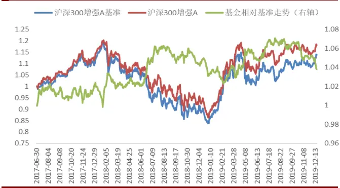
资料来源：Wind、渤海证券研究所

图 9：沪深 300增强 A季度收益情况
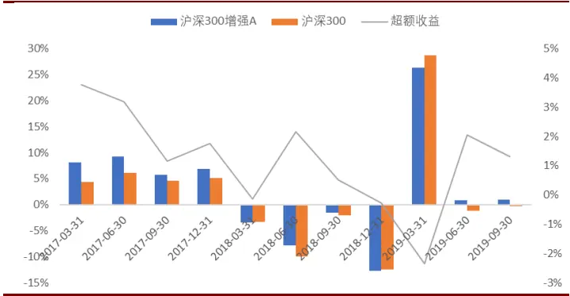
资料来源：Wind、渤海证券研究所

从规模和持有人结构来看，增强A的规模逐渐增加，19年三季度已达到近90亿，

且近年来个人投资者占比不断增加，机构投资者持有比例占比已少于 50%。

图 10：沪深 300增强 A规模变动情况
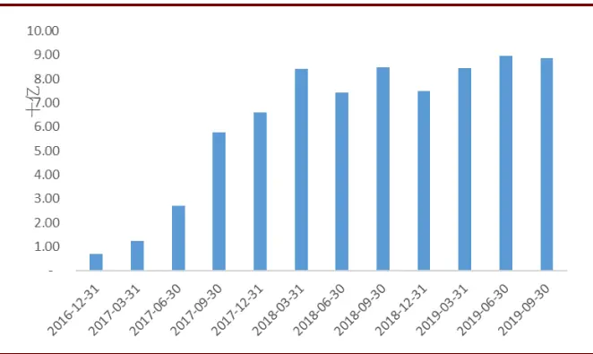
资料来源：Wind、渤海证券研究所

图 11：沪深 300增强 A持有人结构
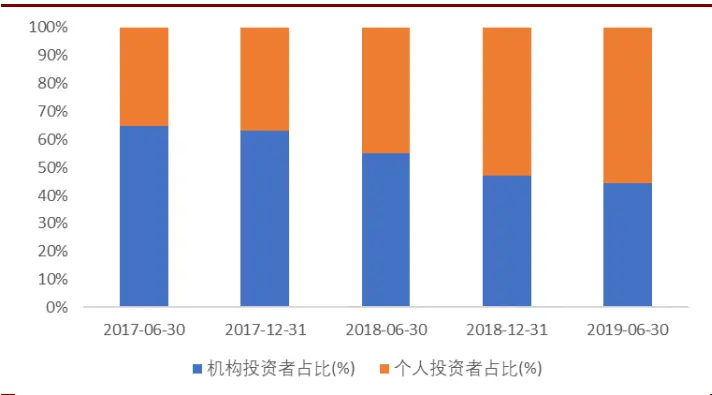
资料来源：Wind、渤海证券研究所

从仓位情况来看，增强A对标的指数的跟踪较为紧密，仓位近年来一直保持在 90%以上，且持续地高于其他同类的沪深 300 增强产品，19 年 3 季度仓位保持在94.02%。

图 12：沪深 300增强 A仓位变动情况
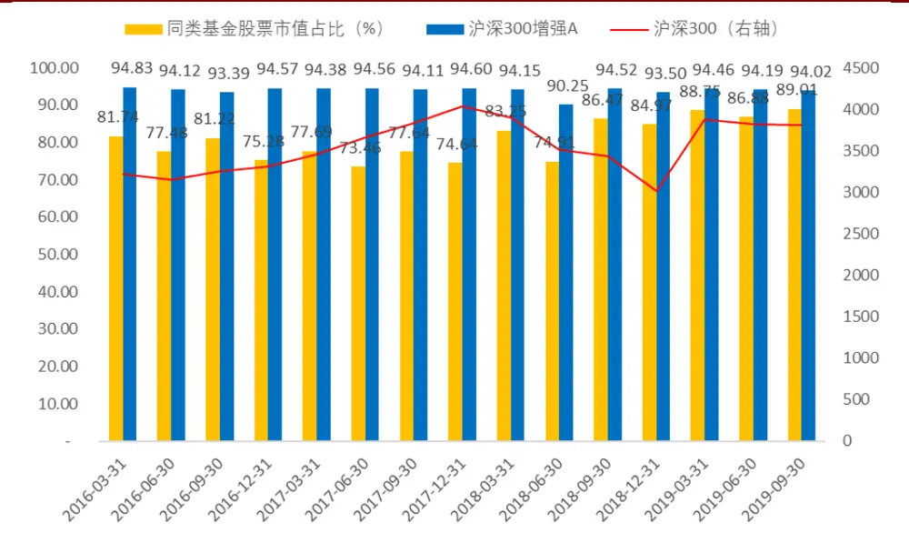
资料来源：Wind、渤海证券研究所

## 3.2 Brinson 归因分析

从行业配置情况来看，近三年增强A 持续超配银行、非银金融、建材和机械等行业，低配传媒、国防军工、有色金属等行业。2019 年中，增强 A 超配比例前 5的行业为食品饮料、非银金融、机械、房地产和煤炭，低配比例前 5的行业为医药、有色金属、电子元器件、计算机、石油石化。

图 13：沪深 300增强 A行业相对配置情况
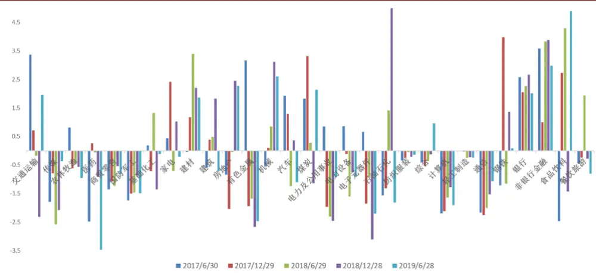
资料来源：Wind、渤海证券研究所

图 14：沪深 300增强 A行业 2019 年中报行业相对配置情况
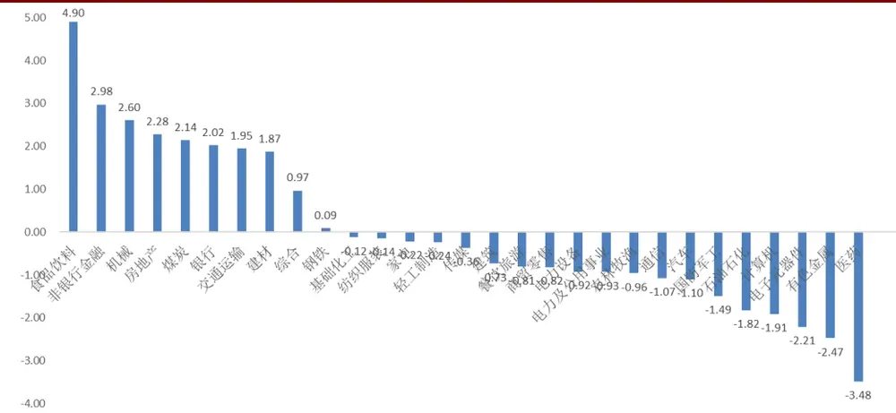
资料来源：Wind、渤海证券研究所

根据 Brinson 归因的结果，增强 A 在 2018 年开始通过增加相对于基准的行业暴露来增厚超额收益，在此之前则主要通过行业中性下的行业内选股实现。可以看出，尽管18年末行业配置的负效应影响了全年的超额收益，但在随后的19年中，行业配置效应贡献的收益比例与选股效应接近。

图 15：沪深 300 增强 A 的 Brinson 归因示意
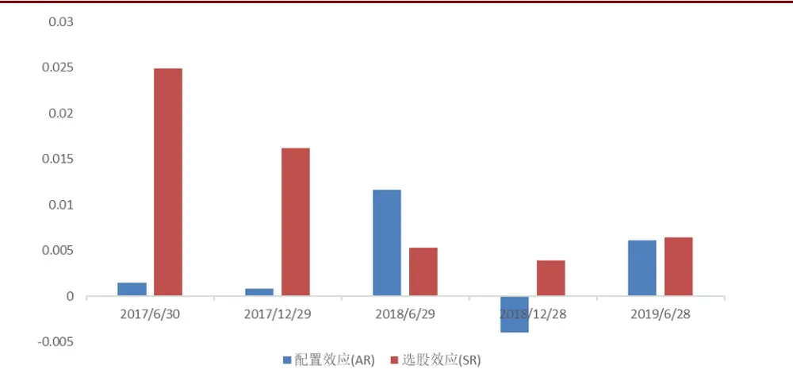
资料来源：Wind、渤海证券研究所

具体而言，2018年末，增强A因低配电力及公用事业、超配石油石化和非银金融行业导致了显著的负向配置效应；2019 年中，通过成功地超配食品饮料和非银金融行业，以及在交通运输、机械、电子元器件和非银金融行业内的正确选股，从而获得了相对基准的超额回报。

渤海沪深 300 增由于始终保持了行业中性，因此其超额收益的来源可以认为全部来自相对基准的风格因子暴露，这部分放在多因子模型分析部分介绍。

表 2：沪深 300 增强 A2018 年年报 Brinson 归因示意

| 行业 | 组合权重 | 基准权重 | 组合收益 | 基准收益 | 配置效应(AR) | 选股效应(SR) | 超额收益 |  |
| --- | --- | --- | --- | --- | --- | --- | --- | --- |
| 电力及公用事业石油石化非银行金融食品饮料建材交通运输通信餐饮旅游电力设备房地产商贸零售银行基础化工 | 0.57%6.71% | 3.03%1.71% | 5.75%-8.99% | 5.67%-8.22% | -0.26%-0.16% | 0.00%-0.05% | -0.26%-0.21% |  |
|  | 21.20% | 17.32% | -9.64% | -8.91% | -0.15% | -0.16% | -0.30% |  |
|  |  | 5.86% | 7.29% | -0.76% | 0.87% | -0.09% | -0.10% | -0.18% |
|  | 3.42% | 1.22% | -7.95% | -7.70% | -0.06% | -0.01% | -0.07% |  |
|  | 0.81% | 3.13% | -8.74% | -2.90% | -0.05% | -0.05% | -0.10% |  |
|  | 0.51% | 2.05% | -2.08% | -2.91% | -0.03% | 0.00% | -0.03% |  |
|  | 0.44% | 0.72% | 9.04% | 6.31% | -0.03% | 0.01% | -0.02% |  |
|  | 0.93% | 1.68% | 7.26% | -1.61% | -0.03% | 0.08% | 0.06% |  |
|  | 7.60% | 5.14% | -4.61% | -5.86% | -0.02% | 0.09% | 0.08% |  |
|  | 0.35% | 0.89% | -3.58% | -2.16% | -0.02% | 0.00% | -0.02% |  |
|  | 21.96% | 19.29% | -5.50% | -5.43% | -0.01% | -0.02% | -0.02% |  |
|  | 0.17% | 1.53% | -3.08% | -4.53% | -0.01% | 0.00% | -0.01% |  |

请务必阅读正文之后的免责声明

| 国防军工综合 | 0.48% | 1.35% | -14.50% | -4.73% | 0.00% | -0.05% | -0.05% |
| --- | --- | --- | --- | --- | --- | --- | --- |
|  | 0.18% | 0.32% | -6.72% | -5.39% | 0.00% | 0.00% | 0.00% |
| 计算机 | 0.57% | 1.85% | -9.94% | -5.39% | 0.00% | -0.03% | -0.02% |
| 家电钢铁汽车建筑 | 5.73% | 4.70% | -3.15% | -3.24% | 0.02% | 0.01% | 0.02% |
|  | 2.49% | 1.13% | -3.40% | -3.52% | 0.02% | 0.00% | 0.02% |
|  | 3.52% | 3.16% | 6.49% | 1.95% | 0.03% | 0.16% | 0.19% |
|  | 5.47% | 3.65% | -1.88% | -1.84% | 0.06% | 0.00% | 0.06% |
| 医药 | 5.31% | 6.23% | -8.70% | -15.54% | 0.10% | 0.36% | 0.46% |
| 电子元器件 | 0.82% | 3.93% | -7.45% | -8.37% | 0.10% | 0.01% | 0.11% |
| 机械 | 4.87% | 1.75% | 3.17% | 0.81% | 0.18% | 0.11% | 0.30% |
| 传媒 |  | 2.09% |  | -3.53% |  |  | 0.00% |
| 纺织服装 |  | 0.21% |  | 4.18% |  |  | 0.00% |
| 煤炭 |  | 1.14% |  | -6.65% |  |  | 0.00% |
| 农林牧渔 |  | 0.57% |  | 1.42% |  |  | 0.00% |
| 轻工制造有色金属 |  | 0.23% |  | -5.41% |  |  | 0.00% |
|  |  | 2.67% |  | -3.82% |  |  | 0.00% |

资料来源：渤海证券研究所

表 3：沪深 300 增强 A2019 年中报 Brinson 归因示意

| 行业 | 组合权重 | 基准权重 | 组合收益 | 基准收益 | 配置效应 (AR) | 选股效应 (SR) | 超额收益 |
| --- | --- | --- | --- | --- | --- | --- | --- |
| 食品饮料 | 14.37% | 9.47% | 12.97% | 12.41% | 0.34% | 0.08% | 0.43% |
| 非银行金融 | 20.55% | 17.57% | 11.79% | 10.92% | 0.16% | 0.18% | 0.34% |
| 电力设备 | 1.04% | 1.96% | -2.58% | -0.35% | 0.05% | -0.02% | 0.03% |
| 医药 | 2.90% | 6.38% | -0.67% | 4.01% | 0.05% | -0.14% | -0.09% |
| 电力及公用事 业 | 1.88% | 2.81% | 2.05% | 0.55% | 0.05% | 0.03% | 0.07% |
| 建材 | 3.21% | 1.34% | 9.47% | 7.38% | 0.04% | 0.07% | 0.10% |
| 交通运输 | 5.25% | 3.29% | 13.74% | 7.16% | 0.03% | 0.35% | 0.38% |
| 传媒 | 1.18% | 1.54% | 7.80% | 2.21% | 0.01% | 0.07% | 0.08% |
| 建筑 | 2.46% | 3.19% | 2.81% | 4.22% | 0.01% | -0.03% | -0.03% |
| 汽车 | 1.74% | 2.84% | 5.04% | 4.74% | 0.01% | 0.01% | 0.01% |
| 煤炭 | 3.12% | 0.98% | 7.37% | 5.52% | 0.00% | 0.06% | 0.06% |
| 基础化工 | 1.17% | 1.28% | 9.16% | 4.55% | 0.00% | 0.05% | 0.05% |
| 家电 | 4.87% | 5.09% | 6.36% | 5.34% | 0.00% | 0.05% | 0.05% |
| 钢铁 | 1.12% | 1.03% | 0.00% | 0.47% | 0.00% | -0.01% | -0.01% |
| 机械 | 4.65% | 2.05% | 8.83% | 5.05% | -0.01% | 0.18% | 0.17% |
| 银行 | 19.57% | 17.55% | 3.90% | 4.86% | -0.01% | -0.19% | -0.20% |
| 通信 | 1.00% | 2.07% | -7.57% | 6.45% | -0.01% | -0.14% | -0.15% |
| 电子元器件 | 1.79% | 4.00% | 22.24% | 6.87% | -0.03% | 0.27% | 0.24% |
| 综合 | 1.25% | 0.29% | -0.55% | 1.22% | -0.04% | -0.02% | -0.06% |

请务必阅读正文之后的免责声明

| 房地产餐饮旅游纺织服装国防军工计算机 | 6.90% | 4.62% | 0.78% | 3.57% | -0.04% | -0.19% | -0.23% |
| --- | --- | --- | --- | --- | --- | --- | --- |
|  |  | 0.81% |  | 14.08% |  |  | 0.00% |
|  |  | 0.14% |  | 4.25% |  |  | 0.00% |
|  |  | 1.49% |  | 2.29% |  |  | 0.00% |
|  |  | 1.91% |  | 7.87% |  |  | 0.00% |
| 农林牧渔 |  | 0.96% |  | -9.45% |  |  | 0.00% |
| 轻工制造 |  | 0.24% |  | -3.95% |  |  | 0.00% |
| 商贸零售 |  | 0.82% |  | 5.64% |  |  | 0.00% |
| 石油石化有色金属 |  | 1.82% |  | 1.57% |  |  | 0.00% |
|  |  | 2.47% |  | 5.07% |  |  | 0.00% |

资料来源：渤海证券研究所

## 3.3 多因子分析

2019 年至今（11 月末），沪深 300 增强 A 跑赢基准3.63%，渤海沪深 300 增强相对基准超额收益 9.22%。

图 16：沪深 300增强 A和渤海沪深 300增强 2019年至今净值走势
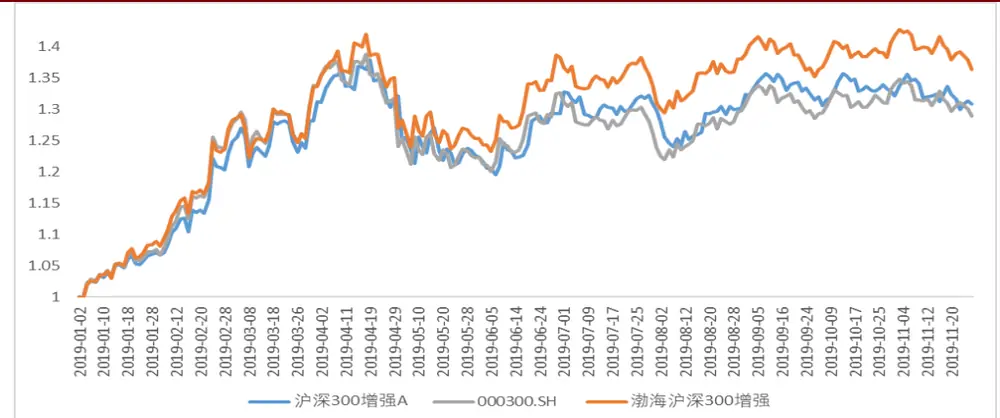
资料来源：Wind、渤海证券研究所

对于增强A，可以看到近3 年其相对沪深 300 在市值、估值和盈利因子上存在相对暴露，2019 年以来 ROE 的暴露为其提供了一定的超额收益来源，BETA 的负向暴露和估值的正向暴露则对获取超额收益起负向影响。

图 17：沪深 300增强 A因子相对暴露情况
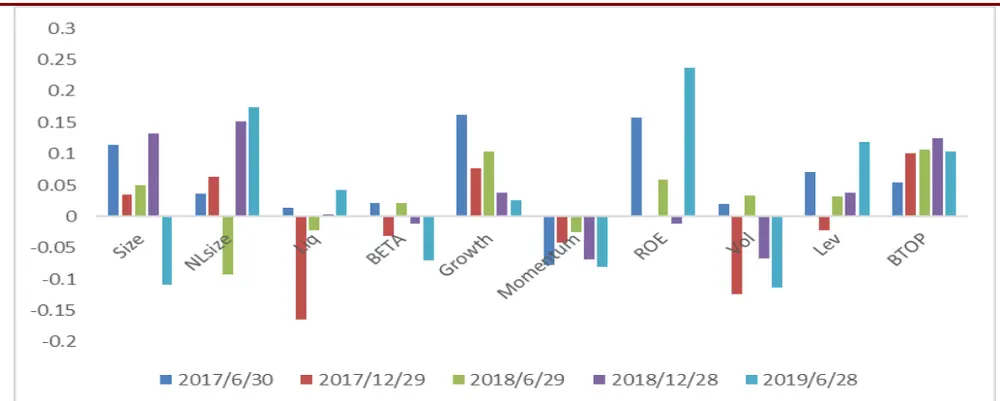
资料来源：Wind、渤海证券研究所

从因子相对收益贡献的情况来看，今年渤海沪深300 的超额收益部分可由控制了波动率因子和市值因子之后，成长因子相对基准的主动暴露来解释，其余部分则可能需要由本文提供的因子之外的其他 alpha因子来解释。

图 18：渤海沪深 300 增强 2019 年至今因子相对收益贡献情况
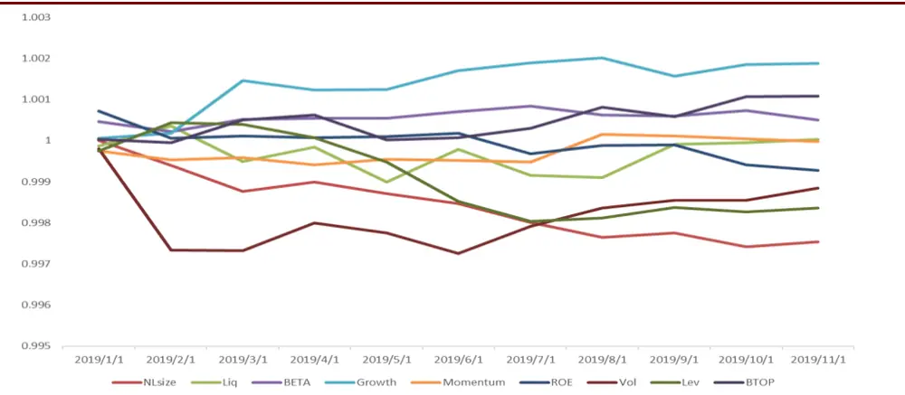
资料来源：Wind、渤海证券研究所

## 4. 小结

本文通过基于持仓的Brinson和多因子业绩归因模型尝试对沪深300指数增强产品A和我们团队今年构建的渤海沪深300增强模型的超额收益来源进行了初步分析。

结果表示，对于增强A，2019年以来ROE的暴露为其提供了一定的超额收益来源，BETA 的负向暴露和估值的正向暴露则对获取超额收益起负向影响；渤海沪深 300 的超额收益部分可由控制了波动率因子和市值因子之后，成长因子相对基准的主动暴露来解释，其余部分则可能需要由本文提供的因子之外的其他 alpha因子来解释。

未来，我们将考虑一方面对已有因子进行进一步改进，以提高 alpha 因子的有效性；另一方面，考虑挖掘其他能够带来新的解释力的因子，纳入因子库内备用。敬请关注。

投资评级说明

| 项目名称 | 投资评级 | 评级说明 |
| --- | --- | --- |
| 公司评级标准 | 买入 | 未来 6 个月内相对沪深 300 指数涨幅超过 20% |
|  | 增持 | 未来 6 个月内相对沪深 300 指数涨幅介于 10%~20%之间 |
|  | 中性 | 未来6个月内相对沪深300 指数涨幅介于-10%~10%之间 |
|  | 减持 | 未来 6 个月内相对沪深 300 指数跌幅超过 10% |
| 行业评级标准 | 看好 | 未来 12 个月内相对于沪深 300 指数涨幅超过 10% |
|  | 中性 | 未来 12 个月内相对于沪深 300 指数涨幅介于-10%-10%之间 |
|  | 看淡 | 未来12 个月内相对于沪深300 指数跌幅超过10% |

免责声明：本报告中的信息均来源于已公开的资料，我公司对这些信息的准确性和完整性不作任何保证，不保证该信息未经任何更新，也不保证本公司做出的任何建议不会发生任何变更。在任何情况下，报告中的信息或所表达的意见并不构成所述证券买卖的出价或询价。在任何情况下，我公司不就本报告中的任何内容对任何投资做出任何形式的担保，投资者自主作出投资决策并自行承担投资风险，任何形式的分享证券投资收益或者分担证券投资损失书面或口头承诺均为无效。我公司及其关联机构可能会持有报告中提到的公司所发行的证券并进行交易，还可能为这些公司提供或争取提供投资银行或财务顾问服务。我公司的关联机构或个人可能在本报告公开发表之前已经使用或了解其中的信息。本报告的版权归渤海证券股份有限公司所有，未获得渤海证券股份有限公司事先书面授权，任何人不得对本报告进行任何形式的发布、复制。如引用、刊发，需注明出处为“渤海证券股份有限公司”，也不得对本报告进行有悖原意的删节和修改。

## 渤海证券股份有限公司研究所

## 所长&金融行业研究

张继袖

+86 22 2845 1845

## 计算机行业研究小组

王洪磊（部门经理）

+86 22 2845 1975

张源

+86 22 2383 9067

## 医药行业研究小组

徐勇

+86 10 6810 4602 甘英健

+86 22 2383 9063

陈晨

+86 22 2383 9062

张山峰

+86 22 2383 9136

## 通信行业研究

徐勇

+86 10 6810 4602

## 固定收益研究

崔健

+86 22 2845 1618 朱林宁

+86 22 2383 9130

## 宏观、战略研究＆部门经理

周喜+86 22 2845 1972

## 综合管理

齐艳莉（部门经理）+86 22 2845 1625李思琦+86 22 2383 9132

## 合规管理&部门经理

任宪功+86 10 6810 4615

## 副所长&产品研发部经理

崔健

+86 22 2845 1618

## 汽车行业研究小组

郑连声

+86 22 2845 1904

陈兰芳

+86 22 2383 9069

## 电力设备与新能源行业研究

郑连声

+86 22 2845 1904 滕飞

+86 10 6810 4686

## 传媒行业研究

姚磊+86 22 2383 9065

## 固定收益研究

崔健
+86 22 2845 1618夏捷
+86 22 2386 1355马丽娜
+86 22 2386 9129

## 策略研究

宋亦威
+86 22 2386 1608严佩佩
+86 22 2383 9070

## 机构销售•投资顾问

朱艳君
+86 22 2845 1995王文君
+86 10 6810 4637

## 风控专员

张敬华+86 10 6810 4651

## 餐饮旅游行业研究

+86 22 2845 1879

## 非银金融行业研究

张继袖
+86 22 2845 1845王磊
+86 22 2845 1802

## 中小盘行业研究

徐中华+86 10 6810 4898

## 金融工程研究

宋旸
+86 22 2845 1131张世良
+86 22 2383 9061陈菊
+86 22 2383 9135

## 博士后工作站

张佳佳 资产配置
+86 22 2383 9072
张一帆 公用事业、信用评级
+86 22 2383 9073

## 食品饮料行业研究

+86 22 2386 1670

## 电子行业研究小组

徐勇
+86 10 6810 4602邓果一
+86 22 2383 9154

## 金融工程研究

祝涛 
+86 22 2845 1653 郝倞 
+86 22 2386 1600

## 渤海证券研究所

天津

天津市南开区水上公园东路宁汇大厦 A座写字楼

邮政编码：300381

电话：（022）28451888

传真：（022）28451615

北京

北京市西城区西直门外大街甲 143号 凯旋大厦A座 2层

邮政编码：100086

电话： （010）68104192

传真： （010）68104192

渤海证券研究所网址：www.ewww.com.cn