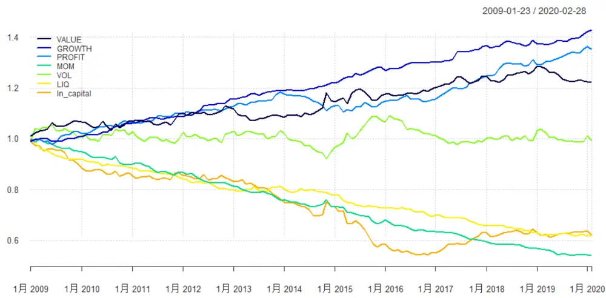
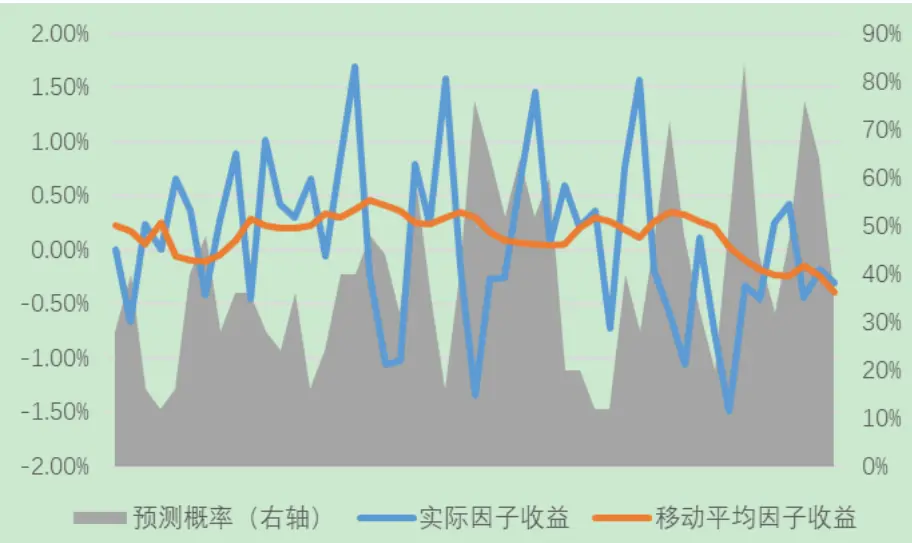
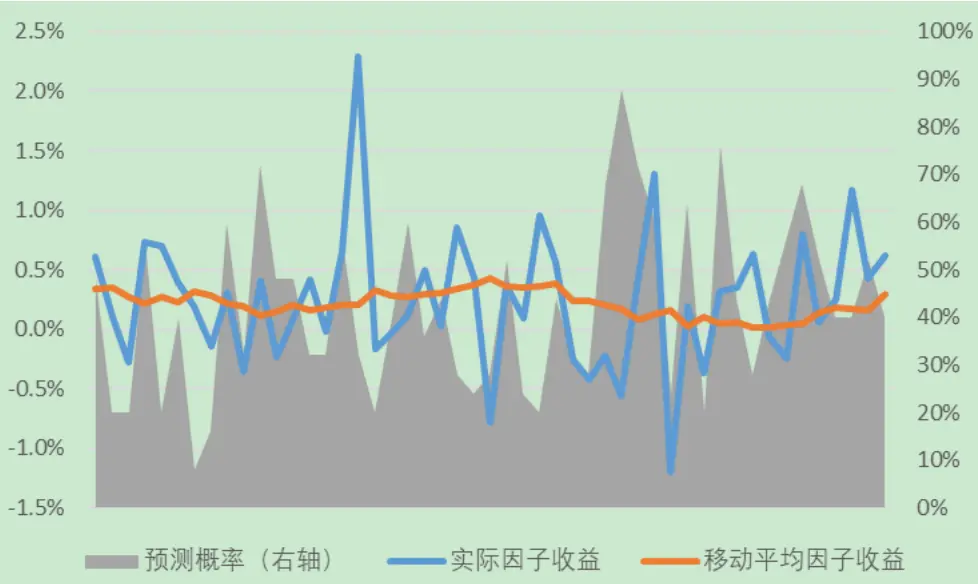
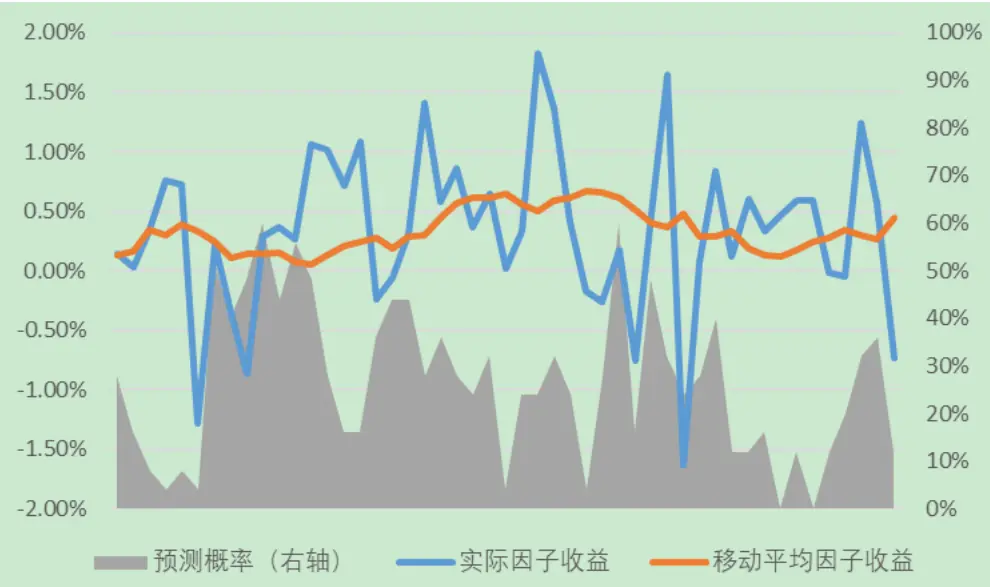
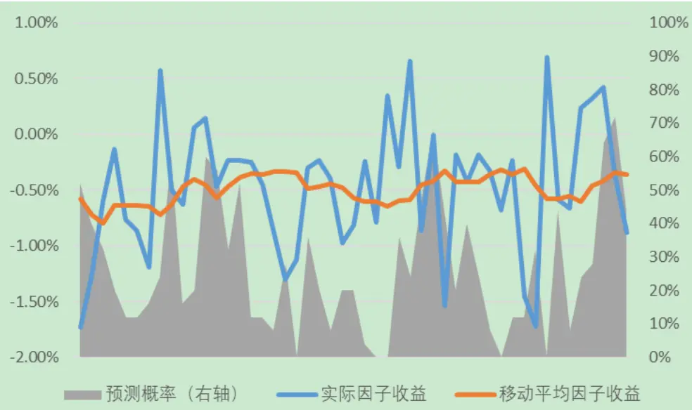
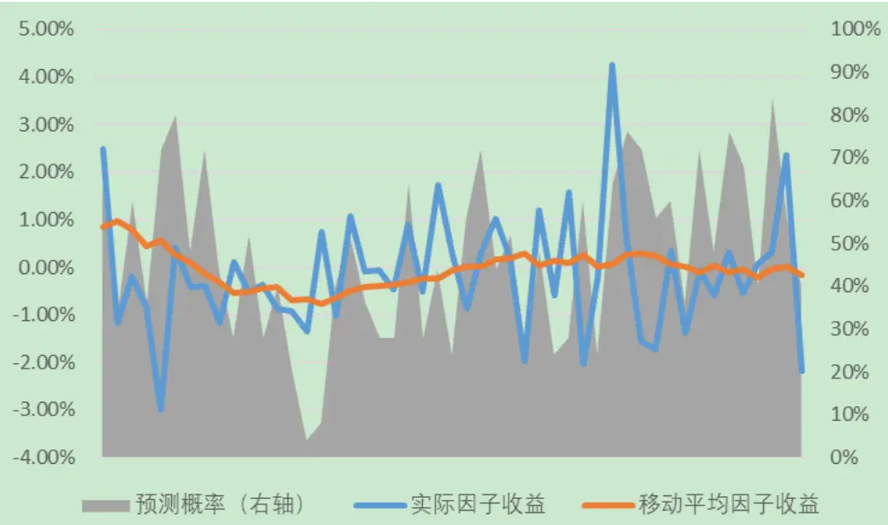
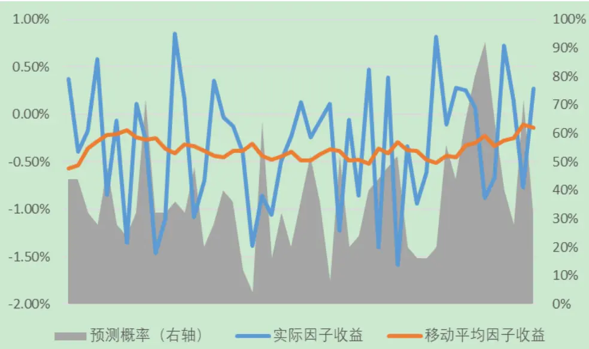
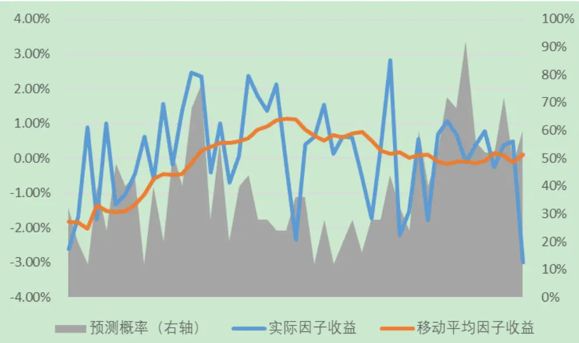
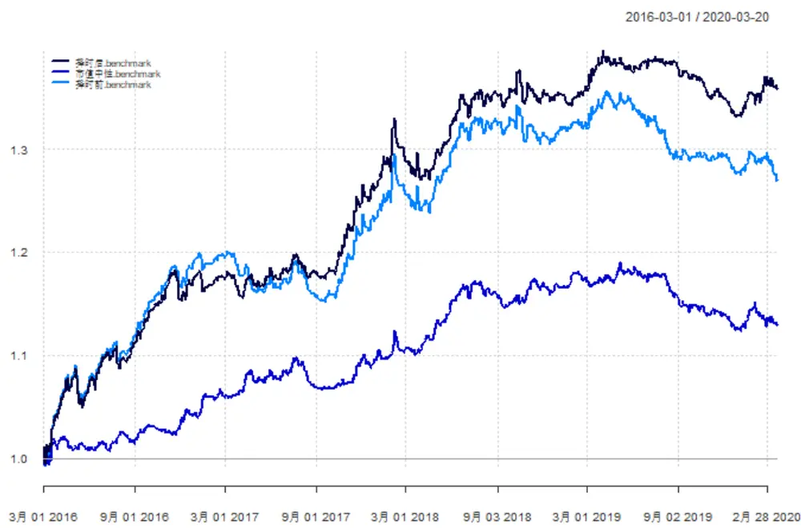
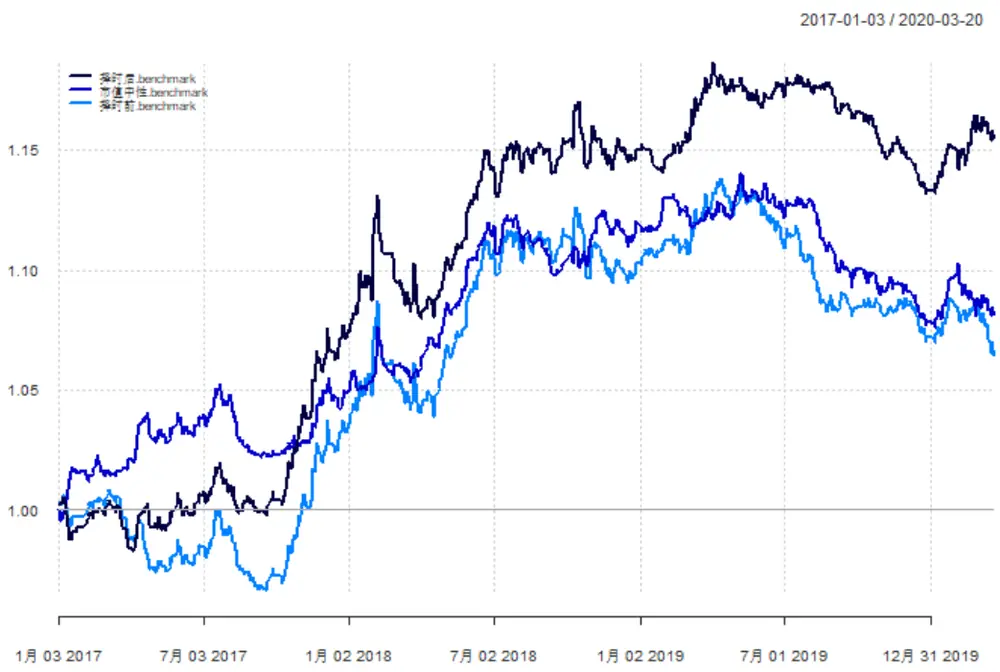

# 基于机器学习模型的因子择时框架

# ——多因子模型研究系列之十三

分析师：宋旸

2020 年 03 月 31 日

证券分析师

宋旸

022-28451131

18222076300

songyang@bhzq.com

助理分析师

张世良

SAC NO: S1150118070024

022-23839061

zhangsl@bhzq.com

## 相关研究报告

《Barra 风险模型（CNE6）之单因子检验——多因子研究系列之八》

20190620

《Barra 风险模型（CNE6）之纯因子构建与因子合成——多因子模型研究系列之九》

20190620

《使用多因子框架的沪深300 指数增强模型——多因子模型研究系列之七》20190329

SAC NO：S1150517100002

## 核心观点：

2017 年以来，随着市场上量化策略的增多，许多之前十分有效的因子，如市值因子、动量因子、波动率因子等，都出现了比较明显的震荡或者失效。想要靠传统多因子模型取得超越基准的稳定收益变得越来越难。对于因子择时模型的研究需求也在持续上升。

## 本篇报告分为三部分：

- 首先，我们介绍了因子择时常用的几个指标，包括因子估值差与配对相关性等，并测试了其与因子未来收益的相关性。

然后，我们使用随机森林函数，构建因子择时模型。与大多数因子择时模型不同，我们的预测目标是因子收益的历史移动平均与实际因子收益的差距。对于收益波动较大的因子，移动平均比较难抓到因子短期的趋势。而择时模型可以在一定程度上预测因子的短期走势，在移动平均曲线之前捕捉因子收益的波动。

- 最后，我们将因子择时结果与多因子模型结合。我们使用线性规划来构建多因子模型，优化目标为组合收益，限制条件为组合的行业中性，以及组合在风险因子上的暴露为 0。在使用因子择时模型的组合中，我们将每一期的风险因子设为择时模型判定当期因子实际收益可能会偏离历史平均值的因子。作为对照组，我们选择了只做行业中的选组合，和同时满足行业中性和市值的选股组合。通过回测我们发现，使用择时模型的组合，不管是趋势行情，还是震荡行情中，相对两个对照模型都能取得更好的收益。

- 风险提示：随着市场环境变化，模型存在失效风险。

## 1. 概述

2017年以来，随着市场上量化策略的增多，许多之前十分有效的因子，如市值因子、动量因子、波动率因子等，都出现了比较明显的震荡或者失效。想要靠传统多因子模型取得超越基准的稳定收益变得越来越难。对于因子择时模型的研究需求也在持续上升。

然而，对于因子择时的有效性，至今仍存在较大分歧。因子的收益受宏观、市场、政策、情绪等多方面因素影响，想要靠单纯量化方式构建因子择时模型，取得Alpha 收益，是比较困难的。但是，我们可以通过构建因子择时模型，筛选未来回撤风险较大的因子，提前收窄风险敞口，减小模型超额收益的波动。

本篇报告中，我们构建的便是这样一个模型。使用随机森林算法，参考各类宏观指标、市场指标以及因子自身的拥挤度指标，对因子的纯因子收益拐点进行判断。进行过因子择时的多因子模型相较原始模型，各项指标均有了较大提升。

## 2. 近期大类因子表现回顾

这里，我们的模型主要使用了估值、成长、盈利、动量、波动率、换手率和市值七大类因子，并在各小类因子间采取等权方式合成。因子具体定义如下：

表 1：因子定义汇总

| 因子大类 | 最终入选因子 |
| --- | --- |
| 估值因子 | BP、扣非EP |
| 盈利因子 | 单季度ROE、单季度ROA、资产周转率 |
| 成长因子 | 单季度ROE增长率、单季度归母净利润增长率 |
| 动量因子 | 月度反转因子、季度反转因子、年度反转因子 |
| 波动率因子 | 月度波动率、季度波动率、年度波动率 |
| 流动性因子 | 月度换手率、季度换手率、年度换手率 |
| 市值因子 | 流通市值对数 |

数据来源：渤海证券研究所

我们计算了七大类因子 2009 年以来的纯因子收益，可以看出，成长、盈利、动量、换手率四大类因子的纯因子收益较为持续。市值、估值因子近期失效较为严重。波动率因子的收益则一直不太显著。

关于纯因子收益的计算方式，请参考我们之前的报告：《Barra风险模型（CNE6）之纯因子构建与因子合成——多因子模型研究系列之九》。

图 1：大类因子纯因子回测结果

资料来源：渤海证券研究所，Wind资讯

## 3. 因子择时变量选择

在本节中，我们将介绍几个因子择时中常用的反应因子拥挤度的指标，并通过计算 IC值的方式检验其有效性。

## 3.1 因子估值差

因子估值差是指分层回测时该因子顶层组合与底层组合估值的差值，是一个反应因子估值是否过高的指标。如果顶层组合的估值比底层组合的估值高，证明此时投资该因子必然要承受更高估值的成本。

在构建分层组合时，我们将每个行业内部的标的按照因子排序分为五组，选取每个行业的最大组和最小组，行业内部等权组合，行业间再按照市值进行赋权，得到全体 A股的顶层标的和底层标的。使用这种方式，可以保证最后所得组合行业中性，且市值基本中性。排除了行业和市值对于因子收益的影响。

因子估值差= 顶层因子的估值倒数的中位数 - 底层因子估值倒数的中位数我们计算了市盈率、市净率两种估值因子的估值差数据，并计算了其 1、3、6、12 个月的 IC 值，可以看出，市净率的估值差与市值、盈利、成长、动量因子的未来收益率成反比，与估值、换手率因子的未来收益成正比。市盈率的估值差与估值、成长因子的未来收益率成反比，与换手率因子的未来收益率成正比，与其他因子的未来收益无明显关系。

表 2：BP 因子估值差 IC值

|  | 1个月 | 3个月 | 6个月 | 12个月 |
| --- | --- | --- | --- | --- |
| 估值 | -0.002 | 0.105 | 0.265 | 0.348 |
| 成长 | -0.035 | -0.171 | -0.238 | -0.353 |
| 盈利 | -0.044 | -0.267 | -0.373 | -0.560 |
| 动量 | -0.030 | -0.130 | -0.135 | -0.204 |
| 波动率 | -0.227 | -0.178 | -0.172 | -0.063 |
| 换手率 | 0.009 | 0.180 | 0.332 | 0.312 |
| 市值 | -0.192 | -0.424 | -0.533 | -0.549 |

资料来源：渤海证券研究所，Wind资讯

表 3：EP 因子估值差 IC值

|  | 1个月 3个月 6个月 12个月 |  |  |  |
| --- | --- | --- | --- | --- |
| 估值 | -0.118 | -0.219 | -0.299 | -0.269 |
| 成长 | 0.041 | 0.011 | -0.167 | -0.383 |
| 盈利 | 0.040 | 0.070 | 0.020 | 0.072 |
| 动量波动率 | 0.007 | 0.062 | 0.040 | 0.101 |
|  | -0.024 | -0.012 | -0.035 | -0.016 |
| 换手率 | 0.105 | 0.142 | 0.097 | 0.063 |
| 市值 | 0.012 | 0.028 | 0.037 | -0.022 |

资料来源：渤海证券研究所，Wind资讯

## 3.2 配对相关性

配对相关性是分层组合每一层内部个股和组合整体收益相关性的平均值。

$$
顶层相关性=Mean\left(Corr\left(顶层个股3个月收益率,顶层组合3个月收益率\right)\right)
$$

$$
配对相关性=顶层相关性+底层相关性
$$

配对相关性升高时，组合内部股票表现为同涨同跌，因子热度上升。通过计算 IC值可以看出，配对相关性与与市值因子的未来收益呈现较明显的负相关关系。

表 4：因子配对相关性 IC 值

|  | 1个月 3个月 6个月 12个月 |  |  |  |
| --- | --- | --- | --- | --- |
| 估值 | -0.131 | -0.049 | -0.077 | 0.005 |
| 成长 | -0.037 | -0.131 | -0.069 | 0.101 |
| 盈利 | 0.000 | 0.166 | 0.169 | 0.056 |
| 动量波动率 | -0.051 | -0.039 | -0.148 | -0.185 |
|  | 0.064 | 0.217 | 0.324 | 0.539 |
| 换手率 | 0.035 | 0.043 | -0.103 | -0.402 |
| 市值 | -0.241 | -0.289 | -0.377 | -0.301 |

资料来源：渤海证券研究所，Wind资讯

## 3.3 其他参考变量

除了估值因子差和配对波动性之外，我们在择时模型中还引入了宏观数据、市场数据、因子收益率指标等变量，具体参见下表：

表 5：因子配对相关性 IC 值

| 宏观变量 | 工业增加值同比增长率 CPI 同比增长率 |
| --- | --- |
|  | PPI同比增长率 |
|  | 社会消费品零售总额同比增长率 |
|  | M1 同比增长率 |
| 市场变量 | M2 同比增长率 |
|  | 中债国债到期收益率 沪深 300 指数涨跌幅 |
|  | 创业板指数涨跌幅 |
|  | 沪深 300 指数换手率 |
|  | 创业板指数换手率 |
|  | 沪深300 涨跌幅-创业板涨跌幅 |
| 因子历史变量 | 沪深 300换手率-创业板换手率 |
|  | 过去1、3、6、12月因子收益率 过去1、3、6、12月因子收益波动率 |
| 因子拥挤度指标 | 因子估值差（市净率） |
|  | 因子估值差（市盈率） |
|  | 配对相关性 |

资料来源：渤海证券研究所，Wind资讯

## 4．择时模型的建立

我们使用随机森林函数，构建因子择时模型。训练集为 2009 年-2015 年数据，

验证集为 2016 年-2020 年数据。我们的预测目标是因子收益的历史移动平均与实际因子收益的差距。

$$
Y_{T+1}=\left\{\begin{aligned}1,\quad&ifmean(历子收益率_{1:T})与历子收益率_{T+1}符号相同\\&0,\quad else\end{aligned}\right.
$$

在传统多因子模型中，我们使用因子历史收益的移动平均值来预测因子的当期收益率。如果预测的因子收益为正，而当期因子收益实际为负值，则在模型中正向暴露该因子会给模型带来较大收益回撤，反之亦然。故在因子择时模型中，我们将预测目标设成二者符号相反的概率。

模型对于各因子的预测准确率如下表所示，可以看出，除了对波动率的预测准确率较低之外，对其他因子的预测均能达到较好的准确率：

表 6：模型预测准确率

|  | 估值 | 成长 | 盈利 | 动量 | 波动率 | 换手率 | 市值 |
| --- | --- | --- | --- | --- | --- | --- | --- |
| 准确率 | 53.1% | 56.9% | 67.3% | 73.5% | 49.0% | 51.0% | 57.1% |

资料来源：渤海证券研究所，Wind资讯

择时模型对于单一因子的预测结果如下面几张图所示。其中图片左轴两条折线代表因子每期的收益率与移动平均收益率，右轴代表择时模型给出二者符号相同的概率。可以看出，12 个月移动平均后的因子收益曲线较为平缓，对于收益波动较大的因子，比较难抓到因子短期的趋势。而择时模型可以在一定程度上预测因子的短期走势，在移动平均曲线之前捕捉因子收益的波动。

图 2：估值因子择时结果

资料来源：Wind，渤海证券研究所

图 3：成长因子择时结果

资料来源：Wind，渤海证券研究所

图 4：盈利因子择时结果

资料来源：Wind，渤海证券研究所

图 5：动量因子择时结果

资料来源：Wind，渤海证券研究所

图 6：波动率因子择时结果

资料来源：Wind，渤海证券研究所

图 7：换手率因子择时结果

资料来源：Wind，渤海证券研究所

图 8：市值因子择时结果

资料来源：Wind，渤海证券研究所

## 5．因子择时与多因子模型结合

最后，我们将因子择时结果与多因子模型结合。在结合中，我们不追求使用因子择时带来更高收益，而是使用其来控制风险。

我们使用线性规划来构建多因子模型，优化目标为组合收益，限制条件为行业中性，以及组合在风险因子上的暴露为 0：

$$
max\quad\alpha^{\prime}w\tag{1}
$$

$$
\begin{array}{rlr}{s.t.}&{{}}&{X_{f}\cdot(w-w_{b})=0}\end{array}\tag{2}
$$

$$
H\cdot(w-w_{b})=0
$$

$$
0\leq w_{i}\leq k_{i}\tag{3}
$$

(4)

$$
\mathbf{1}^{\prime}w=1\tag{5}
$$

其中 为待求解的组合权重，（1）为待优化的目标函数，（2）-（6）需满足的条件限制。

1) $\alpha^{\prime}w$ 为收益预测模型给出的组合收益预测；

$X_{f}$ 为组合中股票的因子暴露矩阵， $w_{b}$ 为基准指数的股票权重，该条件限制了组合对于风险因子的暴露为 0；

3) 为组合的行业暴露矩阵，该条线限制组合的行业配比与基准指数一致；

4) 第四个条件限制了每只股票权重的上下限，这里我们的上限设为该股票在组合中权重的5倍，最大不超过10%；

5) 第五个条件限定权重之和为 1。

在使用因子择时模型的组合中，我们将每一期的风险因子设为择时模型中判定为0 的因子，即择时模型判定当期因子实际收益可能会偏离历史平均值的因子。作为对照组，我们选择了只做行业中性，不设风险因子的选股组合；以及同时满足行业中性和市值中性的选股组合。模型每月月底调仓，以Wind 全A 作为业绩基准，运行时间为 2016年2 月-2020年 3月。

如果我们直接观察 2016 年以来的回测结果，会发现不做市值中性的对照组和因子择时组的表现大幅优于做市值中性的对照组。但这部分收益主要来自 2016 年小市值因子的收益。单独观察 2017 年后的回测结果，会发现不做市值中性的对照组与做了市值中性的对照组收益基本持平，但市值中性组合的波动率显著降低。很多多因子模型为了降低风险，严格控制组合在市值因子上的暴露（包括我们自己的渤海证券指数增强模型），但同时也舍弃了市值因子趋势效应明显时带来的收益。而使用择时模型的组合，不管是趋势行情，还是震荡行情中，相对两个对照模型都能取得更好的收益。

图 9：2016年以来模型回测结果

资料来源：渤海证券研究所，Wind资讯

图 10：2017年以来模型回测结果

资料来源：渤海证券研究所，Wind 资讯

表 7：2016年以来模型收益统计结果

|  | 累计收益 | 年化收益 | 波动率 | 最大回撤 | 夏普比率 | 信息比率 | 胜率 |
| --- | --- | --- | --- | --- | --- | --- | --- |
| 择时后 | 59.0% | 12.5% | 19.9% | 27.2% | 0.627 | 1.826 | 53.5% |
| 市值中性 | 32.2% | 7.4% | 18.6% | 27.6% | 0.395 | 0.948 | 51.1% |
| 择时前 | 48.6% | 10.6% | 19.9% | 27.7% | 0.531 | 1.399 | 53.7% |
| 业绩基准 | 16.9% | 4.1% | 18.8% | 31.0% | 0.215 | -- | -- |

资料来源：渤海证券研究所，Wind资讯

表 8：2017年以来模型收益统计结果

|  | 累计收益 | 年化收益 | 波动率 | 最大回撤 | 夏普比率 | 信息比率 | 胜率 |
| --- | --- | --- | --- | --- | --- | --- | --- |
| 择时后 | 12.0% | 3.7% | 19.2% | 27.2% | 0.194 | 1.106 | 49.4% |
| 市值中性 | 4.9% | 1.6% | 18.2% | 27.6% | 0.085 | 0.773 | 51.7% |
| 择时前 | 3.3% | 1.1% | 19.1% | 27.7% | 0.055 | 0.485 | 49.5% |
| 业绩基准 | -3.2% | -1.0% | 18.9% | 31.0% | -0.055 | 0.000 | 0.0% |

资料来源：渤海证券研究所，Wind资讯

表 9：分年度模型收益统计结果

|  | 2016 | 2017 | 2018 | 2019 | 2020 |
| --- | --- | --- | --- | --- | --- |
| 择时后 | 42.0% | 14.2% | -19.8% | 28.4% | -4.8% |
| 市值中性 | 26.0% | 11.8% | -20.1% | 25.4% | -6.4% |
| 择时前 | 43.9% | 10.1% | -20.1% | 26.7% | -7.3% |
| 业绩基准 | 20.7% | 6.6% | -25.2% | 30.3% | -6.8% |

资料来源：渤海证券研究所，Wind资讯

## 6．总结与未来研究方向展望

本篇报告中，我们使用机器学习构建了因子择时模型。并将因子择时结果与多因子模型相结合，大幅改善模型收益。未来，我们将持续关注该模型的运行情况，定期出具因子择时报告。

与此同时，该模型还有很多改进空间，比如机器学习模型在解释性和稳定性方面的欠缺问题，我们也会继续因子择时方面的研究，进一步带来更确定的结果。

未来，我们还会继续研究更多的量化模型，探索其适用范围、运行机制、收益来源以及成果的延续能力，并将其应用扩展到更多领域，如行业轮动、资产配置等。

风险提示：随着市场环境变化，模型存在失效风险。

投资评级说明

| 项目名称 | 投资评级 | 评级说明 |
| --- | --- | --- |
| 公司评级标准 | 买入 | 未来 6 个月内相对沪深 300 指数涨幅超过 20% |
|  | 增持 | 未来6 个月内相对沪深 300 指数涨幅介于10%~20%之间 |
|  | 中性 | 未来6个月内相对沪深300指数涨幅介于-10%~10%之间 |
|  | 减持 | 未来6 个月内相对沪深 300 指数跌幅超过 10% |
| 行业评级标准 | 看好 | 未来12个月内相对于沪深300指数涨幅超过10% |
|  | 中性 | 未来12个月内相对于沪深300指数涨幅介于-10%-10%之间 |
|  | 看淡 | 未来 12 个月内相对于沪深 300 指数跌幅超过 10% |

免责声明：本报告中的信息均来源于已公开的资料，我公司对这些信息的准确性和完整性不作任何保证，不保证该信息未经任何更新，也不保证本公司做出的任何建议不会发生任何变更。在任何情况下，报告中的信息或所表达的意见并不构成所述证券买卖的出价或询价。在任何情况下，我公司不就本报告中的任何内容对任何投资做出任何形式的担保，投资者自主作出投资决策并自行承担投资风险，任何形式的分享证券投资收益或者分担证券投资损失书面或口头承诺均为无效。我公司及其关联机构可能会持有报告中提到的公司所发行的证券并进行交易，还可能为这些公司提供或争取提供投资银行或财务顾问服务。我公司的关联机构或个人可能在本报告公开发表之前已经使用或了解其中的信息。本报告的版权归渤海证券股份有限公司所有，未获得渤海证券股份有限公司事先书面授权，任何人不得对本报告进行任何形式的发布、复制。如引用、刊发，需注明出处为“渤海证券股份有限公司”，也不得对本报告进行有悖原意的删节和修改。

## 渤海证券股份有限公司研究所

## 所长&金融行业研究

张继袖

+86 22 2845 1845

## 计算机行业研究小组

徐中华

+86 10 6810 4898

张源

+86 22 2383 9067

## 医药行业研究小组

徐勇

+86 10 6810 4602 甘英健

+86 22 2383 9063

陈晨

+86 22 2383 9062

张山峰

+86 22 2383 9136

## 通信行业研究

徐勇

+86 10 6810 4602

## 固定收益研究

崔健

+86 22 2845 1618 朱林宁

+86 22 2383 9130

## 宏观、战略研究＆部门经理

周喜+86 22 2845 1972

## 综合管理

齐艳莉（部门经理）+86 22 2845 1625李思琦+86 22 2383 9132

## 合规管理&部门经理

## 副所长&产品研发部经理

任宪功+86 10 6810 4615

崔健

+86 22 2845 1618

## 汽车行业研究小组

郑连声

+86 22 2845 1904

陈兰芳

+86 22 2383 9069

## 电力设备与新能源行业研究

郑连声

+86 22 2845 1904

滕飞

+86 10 6810 4686

## 传媒行业研究

姚磊+86 22 2383 9065

## 固定收益研究

+86 22 2845 1618 夏捷

+86 22 2386 1355 马丽娜 +86 22 2386 9129

## 策略研究

宋亦威
+86 22 2386 1608严佩佩
+86 22 2383 9070

## 机构销售•投资顾问

朱艳君
+86 22 2845 1995王文君
+86 10 6810 4637

## 风控专员

张敬华+86 10 6810 4651

## 餐饮旅游行业研究

杨旭

+86 22 2845 1879

## 非银金融行业研究

张继袖
+86 22 2845 1845王磊
+86 22 2845 1802

## 金融工程研究

宋旸
+86 22 2845 1131张世良
+86 22 2383 9061陈菊
+86 22 2383 9135

## 博士后工作站

张佳佳 资产配置
+86 22 2383 9072
张一帆 公用事业、信用评级
+86 22 2383 9073
苏菲 绿色债券
+86 22 2383 9026

## 食品饮料行业研究

刘瑀

+86 22 2386 1670

## 电子行业研究小组

徐勇
+86 10 6810 4602邓果一
+86 22 2383 9154

## 金融工程研究

祝涛 
+86 22 2845 1653 郝倞 
+86 22 2386 1600

## 渤海证券研究所

天津

天津市南开区水上公园东路宁汇大厦 A座写字楼

邮政编码：300381

电话：（022）28451888

传真：（022）28451615

北京

北京市西城区西直门外大街甲 143号 凯旋大厦A座 2层

邮政编码：100086

电话： （010）68104192

传真： （010）68104192

渤海证券研究所网址：www.ewww.com.cn