# 技术因子的再挖掘之 Alpha 101

# ——多因子模型研究系列之十四

分析师：宋旸

2020 年 09 月 22 日

证券分析师

宋旸

022-28451131

18222076300

songyang@bhzq.com

研究助理

郭琳姗

SAC NO：S1150120070021

022-23839127

guols@bhzq.com

## 相关研究报告

《使用多因子框架的沪深
300 指数增强模型——多因
子研究系列之七》
20190329

《Barra 风险模型（CNE6）之单因子检验——多因子研究系列之八》

20190620

《Barra 风险模型（CNE6）之纯因子构建与因子合成——多因子模型研究系列之九》

20190620

SAC NO：S1150517100002

## 核心观点：

多因子模型问世以来，已经在 A 股市场得到广泛应用。在模型的因子选取上，较为主流的因子可总结为规模因子、估值因子、基本面因子、技术面因子等几大类。其中基本面因子可分为盈利因子、成长因子、质量等因子等几小类。技术面因子可分为动量因子、换手率因子、波动率因子等等。近几年，随着模型的广泛使用，各因子的收益率均有所缩小。其中又以技术面因子回撤较为明显，各类技术面因子都出现了不同程度的失效。

- 本篇报告中，我们结合 World Quant 2015 年发表的论文 101Formulaic Alphas，对论文中提到 101 个技术面因子进行了初步回测与调整。

通过统计回测，我们发现，大部分的Alpha 101 统计上均较为显著。有一些因子在回测时中间值表现明显好于两端，鉴于出现此类现象的因子较多，我们针对全体因子做了关于中位数的调整，经过调整后，很多因子的表现大大提升，甚至超过了大部分原始因子。在回测中，我们发现，很多历史上表现非常好的因子在 2020 年却出现了明显的失效，于是，我们又筛选出两个过去表现一般，近期表现较为亮眼的因子，作为观察备选。

- 最后，我们筛选出10 个备选因子，与现有的因子体系进行融合。

- 风险提示：随着市场环境变化，模型存在失效风险。

## 1. 技术因子的再挖掘

多因子模型问世以来，已经在A 股市场得到广泛应用。在模型的因子选取上，较为主流的因子可总结为规模因子、估值因子、基本面因子、技术面因子等几大类。其中基本面因子可分为盈利因子、成长因子、质量等因子等几小类。技术面因子可分为动量因子、换手率因子、波动率因子等等。近几年，随着模型的广泛使用，各因子的收益率均有所缩小。其中又以技术面因子回撤较为明显，各类技术面因子都出现了不同程度的失效。

图 1：一个月收益率因子历史分层回测结果
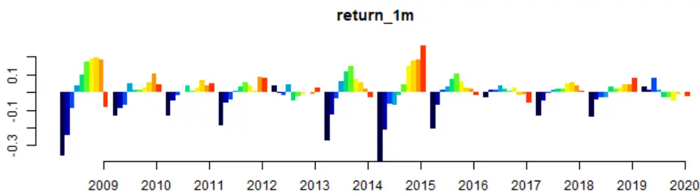
资料来源：Wind，渤海证券研究所

图 2：一个月波动率因子历史分层回测结果
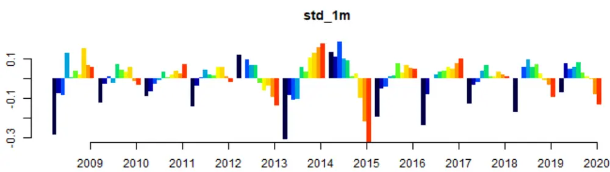
资料来源：Wind，渤海证券研究所

图 3：一个月换手率因子历史分层回测结果
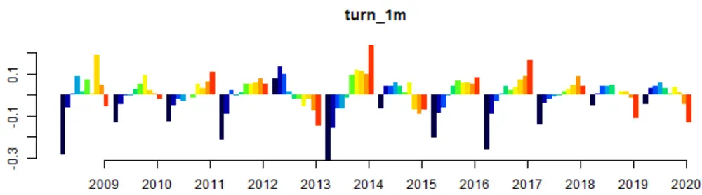
资料来源：Wind，渤海证券研究所

本文中，我们结合 World Quant 2015 年发表的论文《101 Formulaic Alphas》，对论文中提到 101 个技术面因子进行了初步回测与调整。最后，我们筛选出 10个备选因子，与现有的因子体系进行融合。

## 2. 单因子测试流程

本文中的单因子检测分为统计检验与分层回测两种。

在统计检验中，考虑到技术面因子的特性，我们在对因子进行横截面回归时，没有考虑行业与市值因素的影响：

$$
r_{i}^{T+1}=\alpha^{T}+\sum_{j}X_{j}^{T}f_{i,j}^{T}+u_{i}^{T}
$$

$r_{i}^{T+1}$ ：股票i在 T+1 期的收益率；

$f_{i,j}^{T})$ ：第 T 期，股票 i 的行业虚拟变量，如股票 i 在j 行业，则取值为 1，如不在，则取值为0。这里行业分类选用了申万一级行业分类；

：第 T 期，股票 i 在 d 因子上的因子暴露；

、 $x_{d}^{T}$ ：回归模型运算所得的因子收益率；

$u_{i}^{T}$ ：回归模型运算所得股票i 的残差；

在每一个横截面上使用上述模型进行加权最小二乘回归（WLS），权重采用流通市值的平方根，一定程度上消除了异方差性。经过回归模型，我们可以得到 t 检验的 t 值序列与因子收益序列  。

下一步，计算因子IC 值。

信息比率 IC（Information Coefficient）是衡量因子收益预测能力的重要参数，它的计算方法是将每一期的因子值作为因变量，与行业哑变量和市值变量进行回归，取其残差，作为剔除行业与市值影响后的因子值。再计算新因子值与下一期股票收益序列间的Spearman相关系数。

最终，回归模型输出以下几个指标：

a) t 值绝对值平均值：衡量因子整体显著性的指标；

b) t值绝对值>2概率：衡量因子显著性是否稳定；

c) 因子收益平均值：衡量因子收益能力大小的指标；

d) 因子收益标准差：衡量因子收益能力波动率的指标；

e) 因子收益 t 值：衡量因子收益率统计上是否显著不为 0 的指标；

f) 因子收益>0概率：衡量因子收益率方向性是否一致的指标；

g) IC 平均值：衡量模型预测能力的指标；

h) IC 标准差：衡量模型预测能力是否稳定的指标；

i) IRIC：IC 平均值/IC 标准差；

j) IC>0 概率：衡量模型预测收益方向性是否一致的指标。

在选取因子时，我们希望首先筛选出 t 值绝对值平均值大于或接近 2，ICIR 的绝对值较大，因子收益与IC大于0 的概率接近0 或1（而不是在 0.5 附近）的因子。

除了统计检验之外，一个更为直观观察因子选股能力的方式就是观察因子值高的股票与因子值低的股票在走势上的不同之处，即分层回测模型。

模型构建方法如下：

在每个截面期的最后一个交易日，提取样本内股票因子值，并剔除因子值缺失的股票。按照因子将样本内股票排序，并按照序号从大到小平均分为N 组（本报告中 N=10）。在下一个截面期的首个交易日，以当天的收盘价换仓并剔除当天因停牌、涨停等因素不能交易的股票。股改股票由于在复牌当日不受涨跌停板限制，可能出现极端涨幅，影响回测结果，故在复牌当月同样剔除股票池。对N 组股票的历史收益率进行回测，并计算其年化收益率、波动率、夏普比率等值。

如果情况理想，N 组股票的收益率会呈现较好的单调性，且每一组股票间的收益差距较大。这样的因子在选股上体现为较好的区分度。我们统计了不同年份的分层结果（N=10），观察因子在不同年份的分层表现。

## 3．单因子测试结果

## 3.1 原始 Alpha 101 因子的回测结果

通过统计回测，我们发现，大部分的 Alpha 101 统计上均较为显著。我们选择了靠前的几个，针对其定义进行进一步分析。

表 1：原始 Alpha 101 因子统计回测结果（IRIC 前 15 名）

|  | t绝对值 平均值 | t绝对值 大于2 概率 | 因子收 益平均 值 | 因子收 益标准 差 | 因子收 益t值 | 因子收 益>0概 率 | IC平均 值 | IC 标准 差 | IRIC | IC>0 概 率 |
| --- | --- | --- | --- | --- | --- | --- | --- | --- | --- | --- |
| alpha040 | 4.53 | 0.75 | 0.06 | 0.09 | 7.75 | 0.78 | 0.09 | 0.08 | 1.01 | 0.85 |
| alpha088 | 3.70 | 0.64 | 0.04 | 0.09 | 5.04 | 0.70 | 0.06 | 0.09 | 0.74 | 0.75 |
| alpha042 | 4.53 | 0.74 | 0.05 | 0.11 | 5.38 | 0.63 | 0.07 | 0.10 | 0.68 | 0.72 |
| alpha069 | 3.48 | 0.57 | 0.04 | 0.09 | 5.07 | 0.66 | 0.05 | 0.09 | 0.59 | 0.72 |
| alpha044 | 3.10 | 0.60 | 0.02 | 0.08 | 3.58 | 0.66 | 0.04 | 0.07 | 0.49 | 0.72 |
| alpha015 | 2.66 | 0.50 | 0.02 | 0.07 | 3.78 | 0.64 | 0.03 | 0.07 | 0.46 | 0.73 |
| alpha026 | 3.20 | 0.59 | 0.02 | 0.09 | 2.77 | 0.60 | 0.03 | 0.07 | 0.45 | 0.69 |
| alpha050 | 2.74 | 0.51 | 0.02 | 0.08 | 2.38 | 0.59 | 0.03 | 0.07 | 0.40 | 0.69 |
| alpha077 | 2.33 | 0.46 | 0.02 | 0.06 | 3.21 | 0.57 | 0.02 | 0.06 | 0.36 | 0.67 |
| alpha013 | 2.57 | 0.50 | 0.01 | 0.07 | 1.99 | 0.52 | 0.02 | 0.06 | 0.36 | 0.63 |
| alpha003 | 3.79 | 0.75 | 0.02 | 0.09 | 2.63 | 0.62 | 0.03 | 0.08 | 0.35 | 0.65 |
| alpha002 | 2.76 | 0.55 | 0.01 | 0.07 | 2.31 | 0.59 | 0.02 | 0.06 | 0.34 | 0.66 |
| alpha036 | 2.68 | 0.54 | 0.02 | 0.07 | 2.78 | 0.58 | 0.02 | 0.06 | 0.34 | 0.62 |
| alpha006 | 3.75 | 0.70 | 0.02 | 0.09 | 2.34 | 0.59 | 0.03 | 0.08 | 0.33 | 0.65 |
| alpha087 | 3.10 | 0.51 | 0.02 | 0.09 | 2.68 | 0.59 | 0.03 | 0.08 | 0.32 | 0.59 |

资料来源：Wind，渤海证券研究所

## 3.1.1 Alpha040

Alpha040 的定义为：

(-1 * rank(stddev(HIGH,10))) * correlation(HIGH,VOLUME,10)

公式的前半段为计算过去10 日股票最高价的波动率，后半段则是计算过去10日最高价和成交量的关系。这是一个监测股票过去 10 日内是否存在量价背离的因子。该因子无论正向，反向，历年均有较为优异的表现。

图 4：Alpha040 分层回测结果
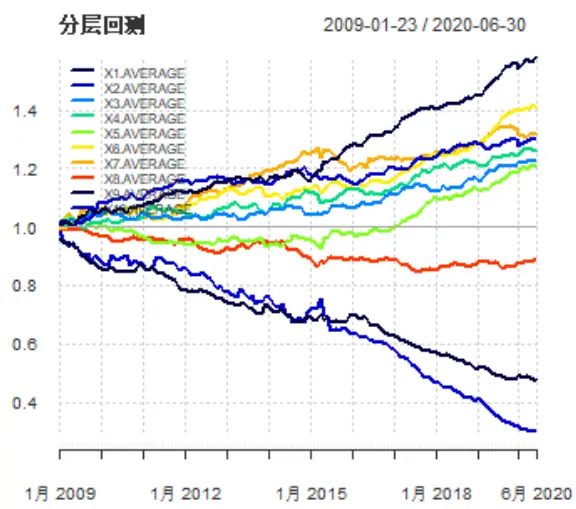
资料来源：Wind，渤海证券研究所

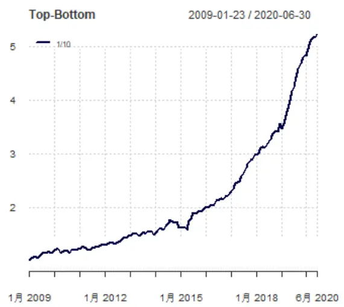

图 5：Alpha040 分层回测结果（按年度）
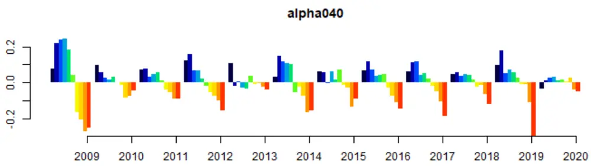
资料来源：Wind，渤海证券研究所

## 3.1.2 Alpha088

Alpha088 的定义为：

$$
\begin{aligned}{}&{{}\mathsf{rinin}(\mathsf{rank}(\mathsf{decay\_linear}(((\mathsf{rank}(\mathsf{open})+\mathsf{rank}(\mathsf{low}))\textsf{-}(\mathsf{rank}(\mathsf{high})+\mathsf{rank}(\mathsf{close}))),}\\{}&{{}\mathsf{B})),\:\mathsf{ts\_rank}(\mathsf{decay\_linear}(\mathsf{correlation}(\mathsf{ts\_rank}(\mathsf{close},\mathsf{8}),\:\mathsf{ts\_rank}(\mathsf{adve0},\:20),}\\\end{aligned}
$$

## 8),7),3))

这一定义较为复杂，更像是通过量化手段挖掘出的因子。原论文中的定义里，天数涉及到小数点的数字，我们这里全部取整操作（见附录）。这是一个监测股票过去10日内是否存在量价背离的因子。该因子在2020年之前均有较为显著的收益，2020区分度略有失效。

图 6：Alpha088 分层回测结果
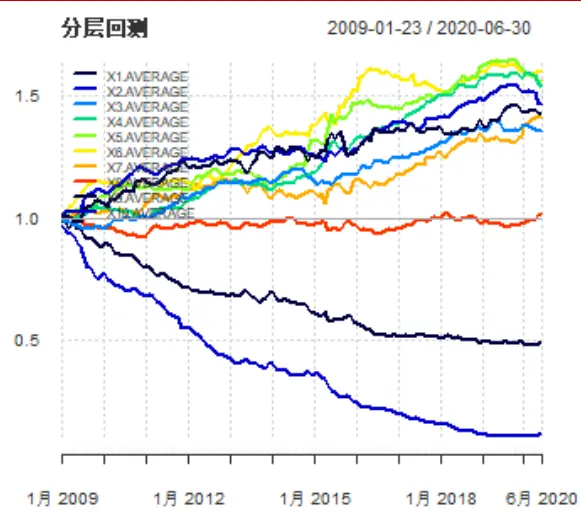
资料来源：Wind，渤海证券研究所

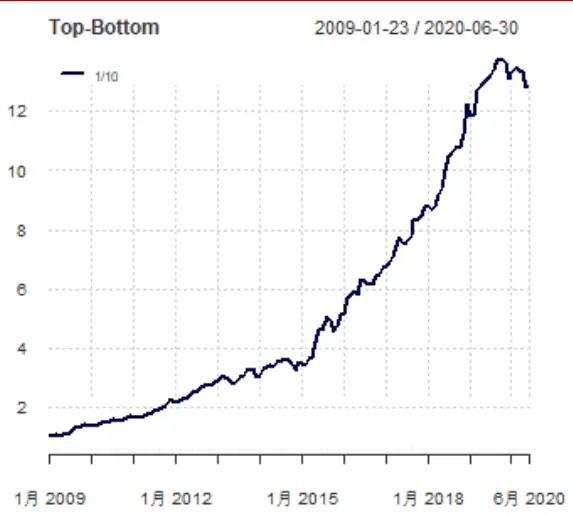

图 7：Alpha088 分层回测结果（按年度）
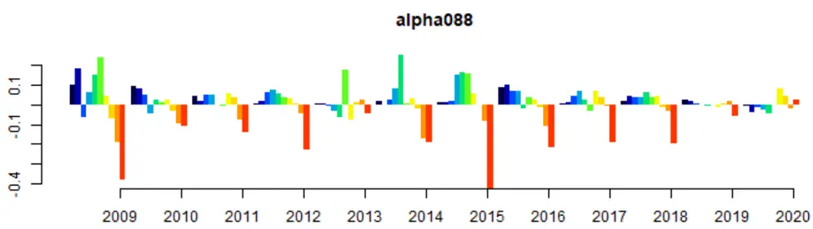
资料来源：Wind，渤海证券研究所

## 3.1.3 Alpha042

Alpha042 的定义为：

$$
\mathsf{(rank\;((vwap-close))\;/\;rank\;((vwap+close)))}
$$

定义中的 vwap 是使用成交量赋权的日内成交价格，在这里我们使用成交额/成交量来代替。这个因子衡量了日内密集成交价格和收盘价的关系，探测尾盘异动。该因子收益一直较为显著，特别是 2020 年之后，依然维持了一定的区分度。

图 8：Alpha042 分层回测结果
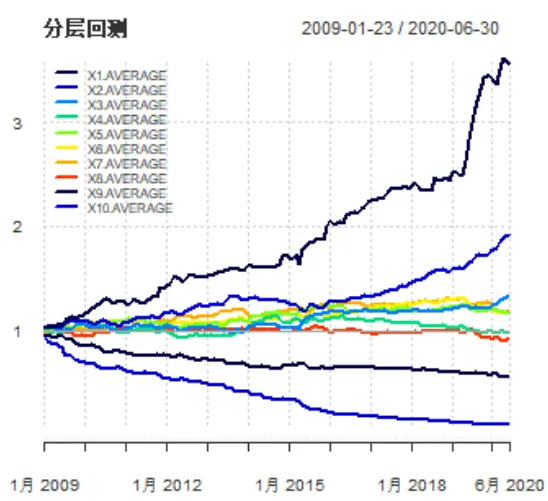
资料来源：Wind，渤海证券研究所

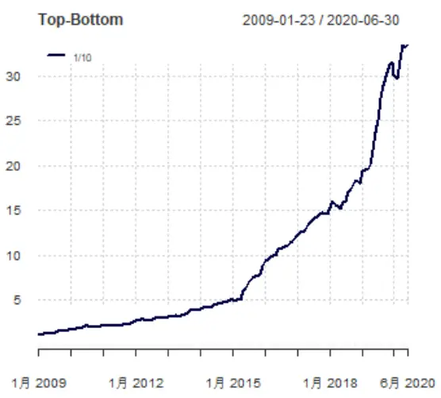

图 9：Alpha042 分层回测结果（按年度）
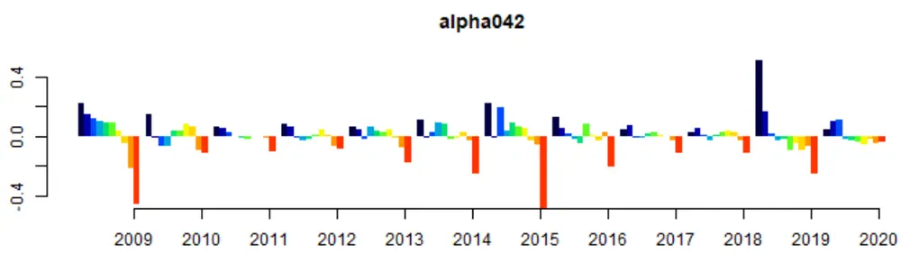
资料来源：Wind，渤海证券研究所

## 3.1.4 Alpha069

Alpha069 的定义为：

$$
((\mathsf{rank}(\mathsf{ts\_max}(\mathsf{delta}(\mathsf{indneutralize}(\mathsf{vwap},\mathsf{indclass}.\mathsf{industry}),\mathsf{3}),\mathsf{5}))
$$

$$
\mathsf{\mathsf{\mathsf{\mathsf{\mathsf{\mathsf{\mathsf{\mathsf{\mathsf{\mathsf{\mathsf{\mathsf{\mathsf{\mathsf{\mathsf{\mathsf{\mathsf{\mathsf{\mathsf{\mathsf{\mathsf{\mathsf{\mathsf{\mathsf\mathsf{\mathsf{\mathsf\mathsf{\mathsf{\mathsf\mathsf{\mathsf{\mathsf\mathsf{\mathsf\mathsf{\mathsf}{\mathsf{\mathsf\mathsf{\mathsf}{\mathsf{\mathsf\mathsf{\mathsf}{\mathsf}{\mathsf{\mathsf{\mathsf\mathsf}{\mathsf{\mathsf{\mathsf\mathsf{\mathsf}{\mathsf}{\mathsf{\mathsf}{\mathsf{\mathsf\mathsf{\mathsf}{\mathsf{\mathsf}{\mathsf}{\mathsf{\mathsf}{\mathsf{\mathsf}{\mathsf{\mathsf\mathsf{\mathsf}{\mathsf{\mathsf}}{\mathsf{\mathsf{\mathsf}{\mathsf{\mathsf}{\mathsf}{\mathsf{\mathsf}{\mathsf\mathsf{\mathsf{\mathsf}{\mathsf}{\mathsf{\mathsf}{\mathsf{\mathsf}{\mathsf}{\mathsf{\mathsf{\mathsf}}{\mathsf{\mathsf\mathsf{}}{\mathsf{\mathsf}{\mathsf\mathsf{\mathsf{\mathsf}{\mathsf}{\mathsf{\mathsf}{\mathsf}{\mathsf\mathsf{\mathsf}{\mathsf{\mathsf}{\mathsf}{\mathsf{\mathsf}}{\mathsf{\mathsf}{\mathsf\mathsf{\mathsf{\mathsf}{\mathsf}{\mathsf}{\mathsf}{\mathsf{\mathsf\mathsf{\mathsf}}{\mathsf{\mathsf}{\mathsf}{\mathsf\mathsf{\mathsf{\mathsf}{\mathsf\mathsf{\mathsf}{\mathsf}{\mathsf}{\mathsf}{\mathsf\mathsf{\mathsf{\mathsf}}{\mathsf}{\mathsf{\mathsf\mathsf}{\mathsf\mathsf{\mathsf{\mathsf}{\mathsf}{\mathsf\mathsf{\mathsf}{\mathsf}}{\mathsf\mathsf{\mathsf{\mathsf}}{\mathsf\mathsf{\mathsf}{\mathsf}{\mathsf\mathsf{\mathsf}{\mathsf\mathsf{}\mathsf{\mathsf}{\mathsf}\mathsf{\mathsf{\mathsf}\mathsf{\mathsf}{\mathsf{\mathsf\mathsf{\mathsf}}}{\mathsf{\mathsf\mathsf{\mathsf}{\mathsf\mathsf}{\mathsf\mathsf{\mathsf{\mathsf}}{\mathsf\mathsf{\mathsf}{\mathsf}\mathsf{\mathsf{\mathsf\mathsf}{\mathsf{\mathsf}\mathsf{\mathsf{\mathsf}\mathsf{\mathsf{\mathsf}}{\mathsf\mathsf{\mathsf}}{\mathsf\mathsf{\mathsf}\mathsf{\mathsf{\mathsf\mathsf}{\mathsf}\mathsf{\mathsf{\mathsf\mathsf{\mathsf}}\mathsf{}\mathsf{\mathsf\mathsf{\mathsf}{\mathsf\mathsf}{\mathsf{\mathsf\mathsf{\mathsf}\mathsf{\mathsf}{\mathsf\mathsf{\mathsf}}{\mathsf\mathsf}{\mathsf\mathsf{\mathsf}\mathsf{\mathsf}{\mathsf\mathsf{\mathsf{\mathsf}\mathsf{\mathsf}\mathsf{\mathsf}{\mathsf}\mathsf{\mathsf\mathsf{\mathsf}{\mathsf\mathsf{\mathsf}\mathsf{\mathsf{\mathsf}}\mathsf{\mathsf}\mathsf{\mathsf}{\mathsf\mathsf\mathsf{}\mathsf{\mathsf}\mathsf{\mathsf}{\mathsf\mathsf{\mathsf}\mathsf{\mathsf}\mathsf{\mathsf
$$

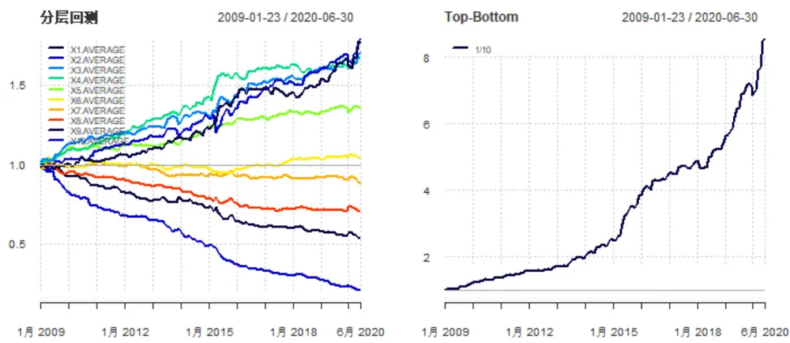
图 10：Alpha069 分层回测结果
资料来源：Wind，渤海证券研究所

这又是一个挖掘出的因子。该因子收益一直较为显著，2019年之后收益格外明显。

图 11：Alpha069分层回测结果（按年度）
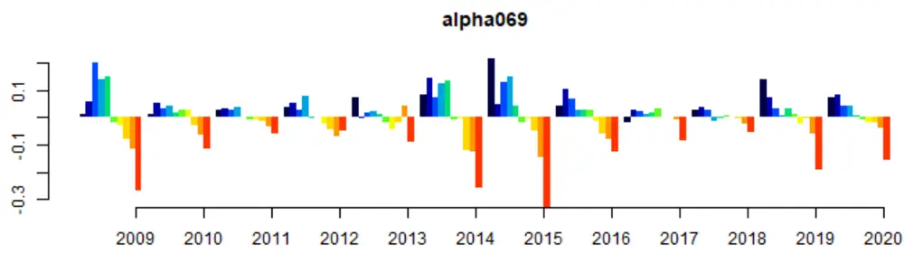
资料来源：Wind，渤海证券研究所

## 3.2 改进后的 Alpha 101 因子的回测结果

除了以上几个表现较好的因子外，我们还观察到，有一些因子在回测时中间值表现明显好于两端，如 Alpha025因子：

图 12：Alpha025 分层回测结果
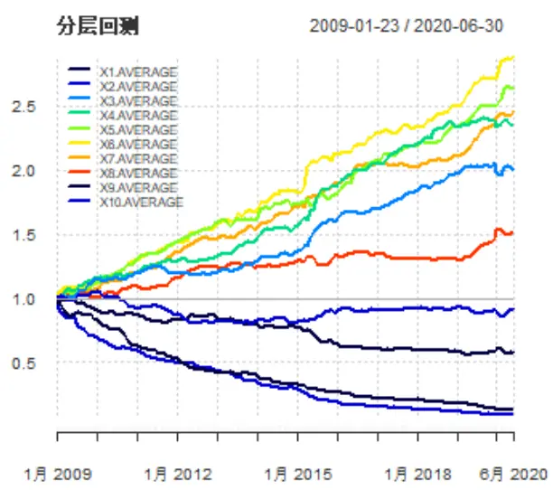
资料来源：Wind，渤海证券研究所

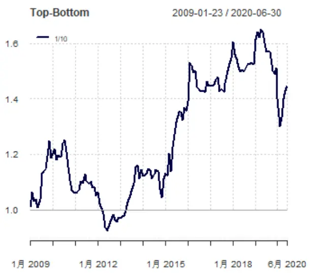

图 13：Alpha025分层回测结果（按年度）
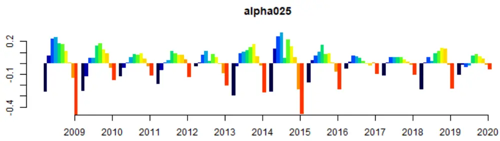
资料来源：Wind，渤海证券研究所

鉴于出现此类现象的因子较多，我们针对全体因子做了关于中位数的调整：

$$
AdjustedAlphaX_{i}=-(AlphaX_{i}-Median(AlphaX_{1,2,\ldots,N}))^{2}
$$

即将计算每支股票在某因子上相对该因子横截面中位数的距离，距离中位数越近，调整因子值越大。这样做会选出在原始因子上排名在中间的标的，而因子值过大或过小的极端值被排在了后面。

经过调整后，很多因子的表现大大提升，甚至超过了大部分原始因子。

表 2：调整后 Alpha 101 因子统计回测结果（IRIC 前 20 名）

|  | t绝对值 平均值 | t绝对值 大于2 概率 | 因子收 益平均 值 | 因子收 益标准 差 | 因子收 益t值 | 因子收 益>0概 率 | IC 平均 值 | IC 标准 差 | IRIC | IC>0 概 率 |
| --- | --- | --- | --- | --- | --- | --- | --- | --- | --- | --- |
| adj-alpha025 | 4.81 | 0.73 | 0.05 | 0.09 | 6.72 | 0.76 | 0.09 | 0.08 | 1.12 | 0.86 |
| alpha040 | 4.53 | 0.75 | 0.06 | 0.09 | 7.75 | 0.78 | 0.09 | 0.08 | 1.01 | 0.85 |

请务必阅读正文之后的免责声明

| adj-alpha047 | 4.43 | 0.72 | 0.04 | 0.07 | 7.16 | 0.75 | 0.08 | 0.08 | 1.01 | 0.88 |
| --- | --- | --- | --- | --- | --- | --- | --- | --- | --- | --- |
| adj-alpha008 | 4.51 | 0.70 | 0.04 | 0.07 | 6.23 | 0.71 | 0.07 | 0.08 | 0.92 | 0.84 |
| adj-alpha067 | 2.07 | 0.41 | 0.02 | 0.05 | 5.52 | 0.67 | 0.03 | 0.04 | 0.84 | 0.78 |
| adj-alpha011 | 3.02 | 0.57 | 0.02 | 0.04 | 4.29 | 0.65 | 0.05 | 0.06 | 0.82 | 0.80 |
| adj-alpha005 | 4.28 | 0.69 | 0.03 | 0.06 | 5.56 | 0.64 | 0.06 | 0.07 | 0.82 | 0.77 |
| adj-alpha018 | 4.63 | 0.76 | 0.04 | 0.07 | 6.89 | 0.72 | 0.07 | 0.08 | 0.81 | 0.80 |
| alpha088 | 3.70 | 0.64 | 0.04 | 0.09 | 5.04 | 0.70 | 0.06 | 0.09 | 0.74 | 0.75 |
| adj-alpha040 | 3.18 | 0.59 | 0.02 | 0.05 | 5.63 | 0.67 | 0.04 | 0.06 | 0.73 | 0.75 |
| adj-alpha083 | 4.66 | 0.76 | 0.03 | 0.07 | 4.32 | 0.66 | 0.07 | 0.09 | 0.72 | 0.79 |
| adj-alpha020 | 2.63 | 0.54 | 0.01 | 0.03 | 4.06 | 0.64 | 0.03 | 0.05 | 0.71 | 0.73 |
| alpha042 | 4.53 | 0.74 | 0.05 | 0.11 | 5.38 | 0.63 | 0.07 | 0.10 | 0.68 | 0.72 |
| adj-alpha060 | 3.33 | 0.67 | 0.02 | 0.05 | 5.52 | 0.71 | 0.05 | 0.07 | 0.66 | 0.75 |
| adj-alpha033 | 3.85 | 0.71 | 0.02 | 0.07 | 4.36 | 0.70 | 0.05 | 0.07 | 0.64 | 0.74 |
| adj-alpha056 | 3.39 | 0.59 | 0.02 | 0.05 | 4.95 | 0.67 | 0.05 | 0.07 | 0.64 | 0.74 |
| adj-alpha045 | 3.50 | 0.59 | 0.03 | 0.06 | 6.02 | 0.71 | 0.05 | 0.09 | 0.60 | 0.75 |
| alpha069 | 3.48 | 0.57 | 0.04 | 0.09 | 5.07 | 0.66 | 0.05 | 0.09 | 0.59 | 0.72 |
| adj-alpha101 | 3.11 | 0.51 | 0.02 | 0.06 | 3.18 | 0.64 | 0.03 | 0.05 | 0.54 | 0.68 |
| alpha044 | 3.10 | 0.60 | 0.02 | 0.08 | 3.58 | 0.66 | 0.04 | 0.07 | 0.49 | 0.72 |

资料来源：Wind，渤海证券研究所
让我们来看看表现较好的几个调整后的因子。

## 3.2.1 Adj-Alpha025

Alpha25 的定义为：

$$
\mathsf{rank}\left(((((\mathsf{-1}^{\star}\mathsf{returns})^{\star}\mathsf{adv20})^{\star}\mathsf{vwap})^{\star}\left(\mathsf{high-close}\right))\right)
$$

该因子为当日涨跌幅、20日均成交量、当日平均成交价、当日最高价与最低价的差值的乘积。

图 14：Adj-Alpha025 分层回测结果
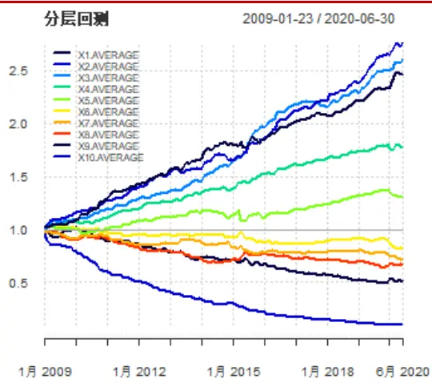
资料来源：Wind，渤海证券研究所

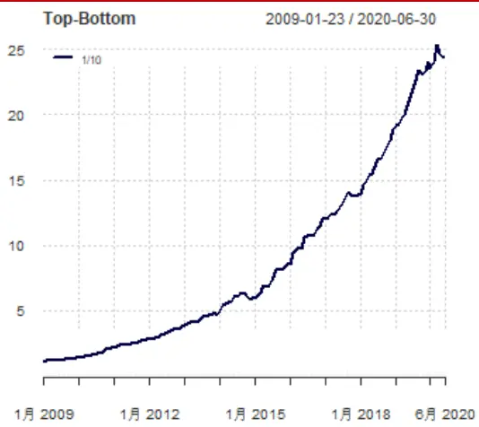

图 15：Adj-Alpha025 分层回测结果（按年度）
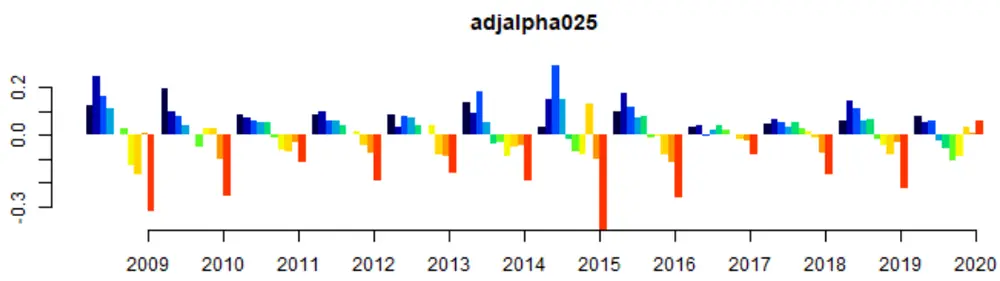
资料来源：Wind，渤海证券研究所

## 3.2.2 Adj-Alpha047

Alpha47 的定义为：

$$
\begin{aligned}&((((\mathsf{tank}((\mathsf{t}/\mathsf{close}))\;^{\star}\;\mathsf{volume})\;/\;\mathsf{adv20})\;^{\star}\;((\mathsf{high}\;^{\star}\;\mathsf{rank}\;((\mathsf{high}\;-\;\mathsf{closes})))\;/\;(\mathsf{sum}\\&((\mathsf{high},\mathsf{5})\;/\;\mathsf{5})))-\mathsf{rank}\;((\mathsf{vwap}-\mathsf{delay}\;(\mathsf{vwap},\mathsf{5}))))\\\end{aligned}
$$

因子构造同样较为复杂。

图 16：Adj-Alpha047 分层回测结果
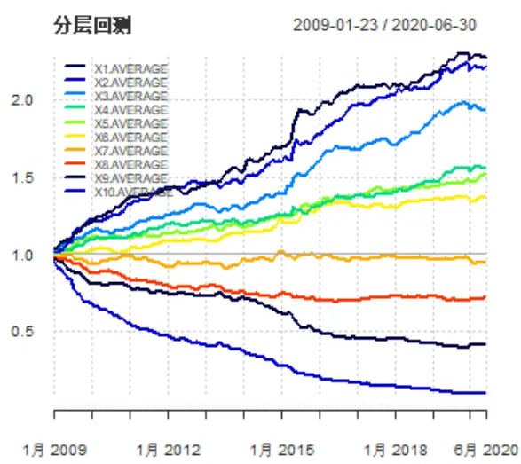
资料来源：Wind，渤海证券研究所

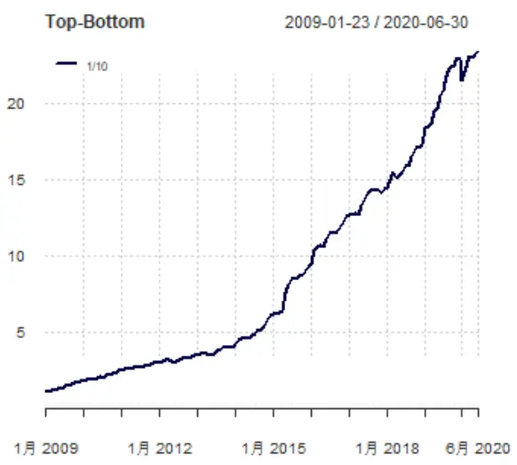

图 17：Adj-Alpha047 分层回测结果（按年度）
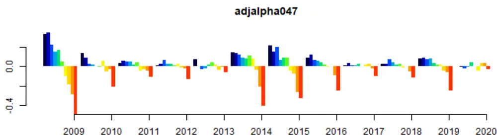
资料来源：Wind，渤海证券研究所

## 3.2.3 Adj-Alpha008

Alpha008 的定义为：

(-1 * rank (((sum (open, 5) * sum (returns, 5)) – delay ((sum (open, 5) * sum (returns, 5)), 10))))

该因子用 5 天的开盘价乘以五天的涨跌幅，与 10 天前的该值求差值。当股票加速上涨时，回撤风险加大，因子值会越来越小。经处理后，该因子倾向于选择没有急涨或急跌的股票。

图 18：Adj-Alpha008 分层回测结果
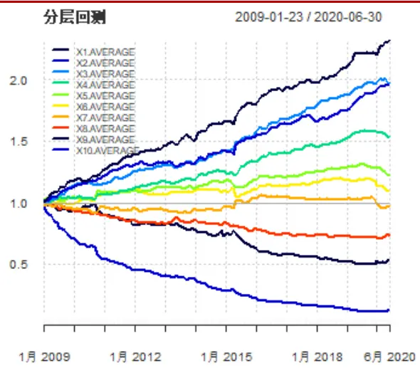
资料来源：Wind，渤海证券研究所

图 19：Adj-Alpha008 分层回测结果（按年度）
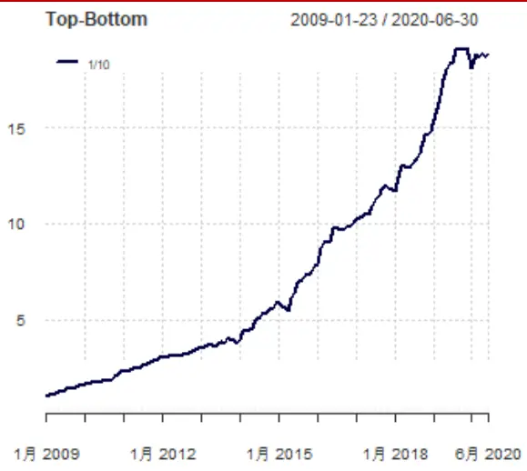

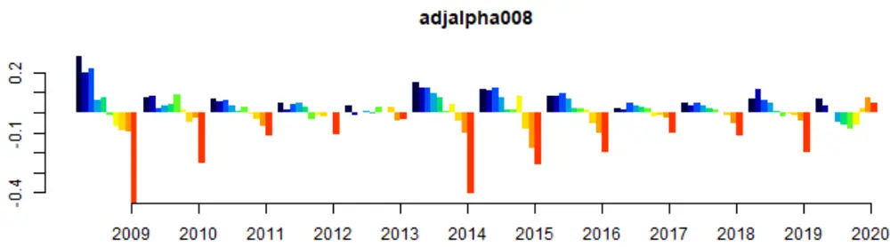
资料来源：Wind，渤海证券研究所

## 3.2.3 Adj-Alpha011

Alpha011 的定义为：

((rank (ts_max ((vwap - close), 3)) + rank (ts_min ((vwap - close), 3))) * rank (delta (volume, 3)))

该因子同样专注于 vwap-close这一统计量，重点研究尾盘拉升或急跌的现象。
只不过把时间维度拉长到了 3天。

图 20：Adj-Alpha011 分层回测结果
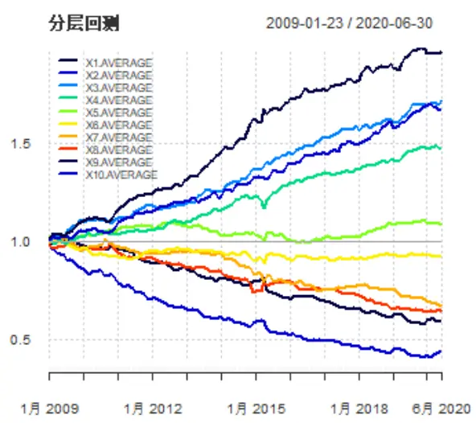
资料来源：Wind，渤海证券研究所

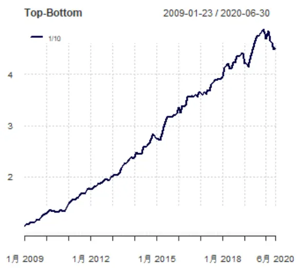

图 21：Adj-Alpha011 分层回测结果（按年度）
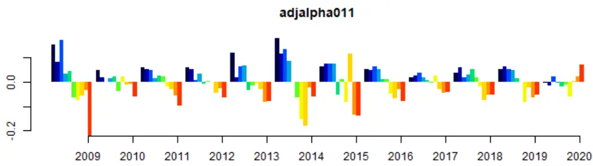
资料来源：Wind，渤海证券研究所

## 3.3 近期表现较好的 Alpha 101 因子

在回测中，我们发现，很多历史上表现非常好的因子在 2020 年却出现了明显的失效，仅有 Alpha040、Alpha042 和 Alpha069 表现尚可。除此之外，我们还筛选出两个过去表现一般，近期表现较为亮眼的因子，作为观察备选。

## 3.3.1 Adj-Alpha019

Alpha019 的定义为：

$$
((\cdot1^{\mathrm{~*~}}\mathsf{sign}(((\mathsf{close-delay(close,\ell7)})+\mathsf{delta(close,\ell7)})))^{\mathrm{~*~}}(1+\mathsf{rank}((1+\mathsf{sum}(\mathsf{close-deltay(close,\ell7)}))+\mathsf{delta(close,\ell7)})))^{\mathrm{~*~}}(1+\mathsf{rank}((1+\mathsf{sum}(\mathsf{close-deltay(close-deltay(close-deltay(close-deltay(close-deltay(close-deltay(close-deltay(close-deltay(close-deltay)(close-deltay(close-deltay)(close-deltay)(close-deltay(close-delay)(close-delay)(close-delay)(close-delay)(close-delay)(close-delay)(close-delay)(close-delay)(close-delay)(close-delay)(close-delay)(close-delay)(close-delay)(close-delay)})^{\mathrm{~*~}}(1+\mathsf{rank}(1+\mathsf{rank}(1+\mathsf{rank}(1+\mathsf{rank}(1+\mathsf{rank}(1+\mathsf{rank}(1+\mathsf{rank}(1+\mathsf{rank}(1+\mathsf{ran}(1+\mathsf{ran}(1+\mathsf{ran}(1+\mathsf{ran}(1+\mathsf1{ran}(+1\mathsf{r))}))))))^{\mathrm{~**}}((1+1+\mathsf\mathsf{ran}(1+\mathsf1+\mathsf{ran}(1+\mathsf1\mathsf{ran}(1+\mathsf1\mathsf{ran}(+1\mathsf{ran})))))))))^{\mathrm{~***}}((1+1+\mathsf\mathsf{ran}(1+\mathsf\mathsf{ran}(1+\mathsf1+\mathsf\mathsf{ran}(1+\mathsf\mathsf{ran}(1+\mathsf1\mathsf{ran}(+\mathsf1\mathsf{ran}))))))))))^^{{********}}(((1)))^*****(*(1***(1**\mathsf\mathsf\mathsf1\mathsf{ran*******\mathsf\mathsf1**\mathsf1*\mathsf{ran}((1\mathsf{ran}))))*********(\mathsf*\mathsf1*\mathsf1*\mathsf**\mathsf1**
$$

(returns, 250)))))

该因子刻画了股票7 日涨跌和过去一年涨跌幅的关系。

图 22：Adj-Alpha019 分层回测结果
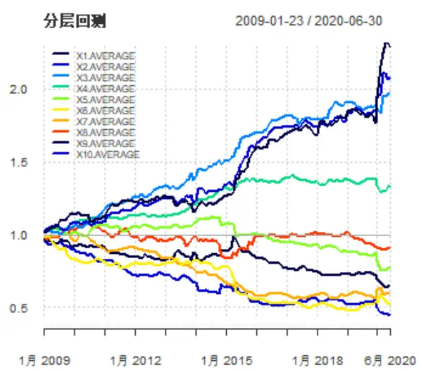
资料来源：Wind，渤海证券研究所

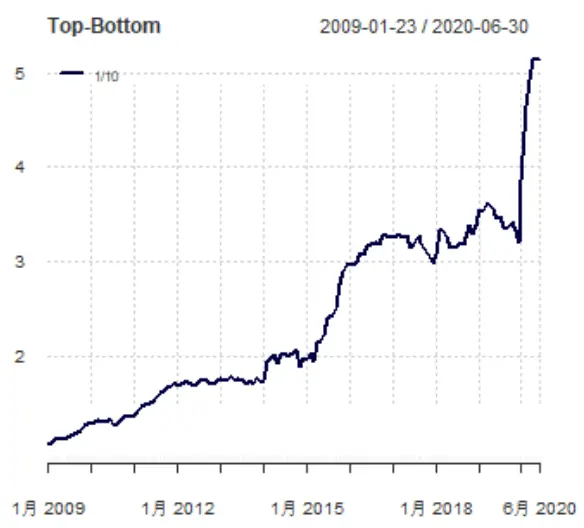

图 23：Adj-Alpha019 分层回测结果（按年度）
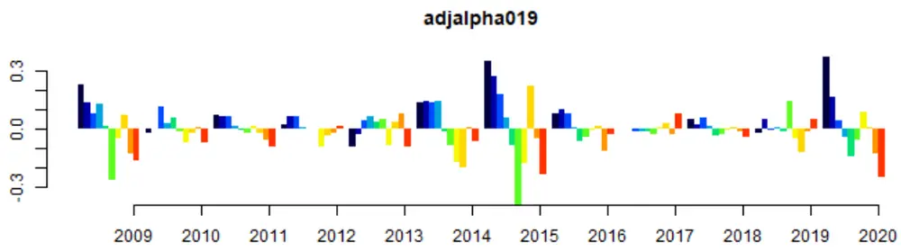
资料来源：Wind，渤海证券研究所

## 3.3.2 Alpha077

Alpha077 的定义为：

$$
\begin{aligned}&\min(\mathsf{rank}(\mathsf{decay\_linear}(((((\mathsf{high}+\mathsf{low})/2)+\mathsf{high})\cdot(\mathsf{vwap}+\mathsf{high})),20)),\mathsf{rank}\\&(\mathsf{decay\_linear}(\mathsf{correlation}(((\mathsf{high}+\mathsf{low})/2),\mathsf{adv}40,3),5)))\\\end{aligned}
$$

该因子定义较为复杂，猜测由数据挖掘获得。

图 24：Alpha077 分层回测结果
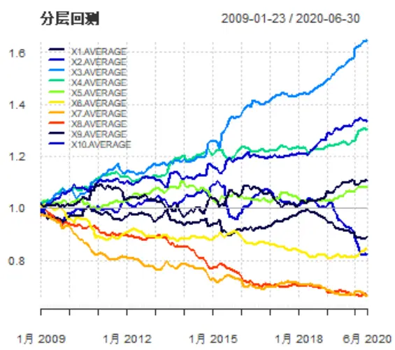
资料来源：Wind，渤海证券研究所

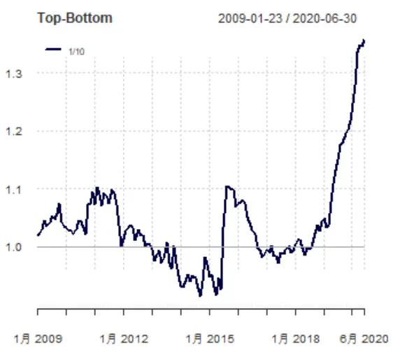

图 25：Alpha077分层回测结果（按年度）
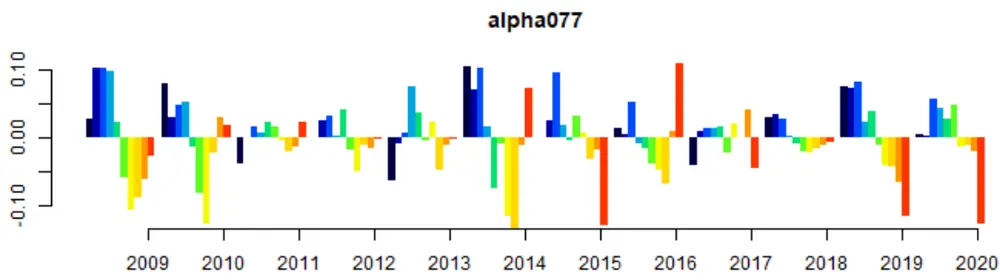
资料来源：Wind，渤海证券研究所

## 3.4 入选 Alpha 101 因子与传统 Alpha 因子的相关性检验

我们又计算了筛选出的Alpha101 因子与主流因子的相关性，可以看出，Alpha101因子与大多数主流因子，以及彼此之间，相关性均不显著。这种特点为未来将Alpha101因子引入多因子模型提供了基础。

图 26：相关性因子
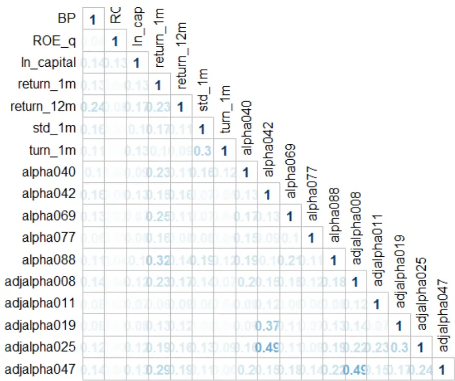
资料来源：Wind，渤海证券研究所

## 4．总结与未来研究方向展望

本篇报告中，我们提取World Quant发布的101个技术面因子，对其进行了单因子检测，通过回测，我们筛选了 10 个表现较好的技术面因子，纳入因子库，为未来进一步完善多因子模型做准备。

下篇报告中，我们会将得到的技术面因子与多因子模型做结合，追求提高现有多因子模型的市场收益。

风险提示：随着市场环境变化，模型存在失效风险。

## 附录：Alpha101 因子的构建公式

此处仅介绍变量、算符定义，具体 101个技术因子公式参见 World Quant报告。

Alpha101因子构建公式中使用的输入变量：

| returns | 涨跌幅 |
| --- | --- |
| open, close, high, low, volume | 开盘价，收盘价，最高价，最低价，成交量 |
| vwap | 采用成交额/成交量来表示论文中的 vwap |
| cap | 总市值 |
| adv{d} | 过去d期的平均成交量 |
| indclass | 忽略了论文中行业、子行业、部门之间的区别，统一采用中信一级行业 |

Alpha101因子构建公式中涉及的函数、算符定义：

| abs(x), log(x),sign(x) | 分别为：取绝对值、对数值、正负号（同 numpy库中定义） |
| --- | --- |
| +, −, *, /, >, <, ^, ==, \|\|, x?y: z | 标准定义 |
| rank(x) | 截面的个股排名 |
| delay(x, d) | × 变量滞后 d 期的值 |
| correlation(x,y,d) | x 和 y两个变量过去d 个时间窗口的相关系数 |
| covar iance (x, y, d) | x 和 y 两个变量过去 d 个时间窗口的协方差 |
| scale(x, a) | 将x中的值标准化，使x的绝对值的和为 a，默认 a=1 |
| delta(x, d) | 本期×值与滞后 d 期×值之差 |
| signedpower (x, a) | x值的a次方 |
| decay_linear (x, d) | 过去 d 期按线性递减权重 d，d - 1，…，1(重新调整使权重和为1)的加权移动平均 |
| indneutralize(x,g) | 忽略了论文中行业、子行业、部门之间的区别，统一采用中信一级行业对于截面上的个股进行行业中性化处理 |
| ts_{0} (x, d) | ts 开头均为时间序列相关函数，对过去d 期的变量x 进行操作，其中，非整数的d向下取整 |
| ts_min(x,d) | x 变量 d 期内的最小值 |
| ts_max(x,d) | x 变量d 期内的最大值 |
| ts_argmin(x,d) | ts_min(x, d) 发生在 d 期中的位置 |
| ts_argmax(x,d) | ts_max(x, d) 发生在 d 期中的位置 |
| ts_rank(x,d) | 本期×值在过去d期中的排名 |
| min(x,d) | 等同于 ts_min(x, d) |
| max (x, d) | 等同于 ts_max(x，d) |
| sum (x, d) | 过去d期×值之和 |
| product (x, d) | 过去d期×值之积 |
| stddev (x, d) | 过去d个时间窗口的标准差 |

投资评级说明

| 项目名称 | 投资评级 | 评级说明 |
| --- | --- | --- |
| 公司评级标准 | 买入 | 未来 6 个月内相对沪深 300 指数涨幅超过 20% |
|  | 增持 | 未来6 个月内相对沪深 300 指数涨幅介于10%~20%之间 |
|  | 中性 | 未来6个月内相对沪深300指数涨幅介于-10%~10%之间 |
|  | 减持 | 未来6 个月内相对沪深 300 指数跌幅超过 10% |
| 行业评级标准 | 看好 | 未来 12个月内相对于沪深300 指数涨幅超过 10% |
|  | 中性 | 未来12个月内相对于沪深300指数涨幅介于-10%-10%之间 |
|  | 看淡 | 未来 12 个月内相对于沪深 300 指数跌幅超过 10% |

免责声明：本报告中的信息均来源于已公开的资料，我公司对这些信息的准确性和完整性不作任何保证，不保证该信息未经任何更新，也不保证本公司做出的任何建议不会发生任何变更。在任何情况下，报告中的信息或所表达的意见并不构成所述证券买卖的出价或询价。在任何情况下，我公司不就本报告中的任何内容对任何投资做出任何形式的担保，投资者自主作出投资决策并自行承担投资风险，任何形式的分享证券投资收益或者分担证券投资损失书面或口头承诺均为无效。我公司及其关联机构可能会持有报告中提到的公司所发行的证券并进行交易，还可能为这些公司提供或争取提供投资银行或财务顾问服务。我公司的关联机构或个人可能在本报告公开发表之前已经使用或了解其中的信息。本报告的版权归渤海证券股份有限公司所有，未获得渤海证券股份有限公司事先书面授权，任何人不得对本报告进行任何形式的发布、复制。如引用、刊发，需注明出处为“渤海证券股份有限公司”，也不得对本报告进行有悖原意的删节和修改。

22 of 24

## 渤海证券股份有限公司研究所

## 所长&金融行业研究

张继袖

+86 22 2845 1845

## 计算机行业研究小组

徐中华

+86 10 6810 4898

张源

+86 22 2383 9067

## 医药行业研究小组

甘英健

+86 22 2383 9063

陈晨

+86 22 2383 9062

张山峰

+86 22 2383 9136

## 食品饮料行业研究

刘瑀

+86 22 2386 1670

## 宏观、战略研究＆部门经理

周喜

+86 22 2845 1972

## 策略研究

宋亦威
+86 22 2386 1608严佩佩
+86 22 2383 9070

## 综合管理

齐艳莉（部门经理）+86 22 2845 1625李思琦+86 22 2383 9132

## 合规管理&部门经理

任宪功+86 10 6810 4615

## 汽车行业研究小组

郑连声

+86 22 2845 1904

陈兰芳

+86 22 2383 9069

## 通信行业研究

徐勇+86 10 6810 4602

## 固定收益研究

朱林宁

+86 22 2387 3123马丽娜

+86 22 2386 9129 张婧怡

+86 22 2383 9130 李济安 +86 22 2383 9175

## 博士后工作站

张佳佳 资产配置
+86 22 2383 9072
张一帆 公用事业、信用评级
+86 22 2383 9073

## 机构销售•投资顾问

朱艳君
+86 22 2845 1995王文君
+86 10 6810 4637

## 风控专员

张敬华+86 10 6810 4651

## 副所长&产品研发部经理

崔健

+86 22 2845 1618

## 机械行业研究

郑连声

+86 22 2845 1904

宁前羽

+86 22 2383 9174

## 传媒行业研究

姚磊+86 22 2383 9065

## 金融工程研究

宋旸

+86 22 2845 1131 陈菊

+86 22 2383 9135 郭琳姗

+86 22 2383 9127 韩乾 +86 22 2383 9192

## 博士后工作站

苏菲 绿色债券
+86 22 2383 9026
刘精山 货币政策与债券市场
+86 22 2386 1439

## 非银金融行业研究

张继袖

+86 22 2845 1845

王磊

+86 22 2845 1802

## 餐饮旅游行业研究

杨旭

+86 22 2845 1879

## 金融工程研究

祝涛 
+86 22 2845 1653 郝倞 
+86 22 2386 1600

## 渤海证券研究所

天津

天津市南开区水上公园东路宁汇大厦 A座写字楼

邮政编码：300381

电话：（022）28451888

传真：（022）28451615

北京

北京市西城区西直门外大街甲 143号 凯旋大厦A座 2层

邮政编码：100086

电话： （010）68104192

传真： （010）68104192

渤海证券研究所网址：www.ewww.com.cn