# 红利指数产品全览：境外发展特征与境内产品展望

## ——红利策略全攻略系列之一

## 相关研究

## 证券分析师

沈思逸 A0230521070001

shensy@swsresearch.com

邓虎 A0230520070003

denghu@swsresearch.com

## 联系人

沈思逸

(8621)23297818×7458

shensy@swsresearch.com

## 本期投资提示：

- 回望 2023 年，红利成为 A股市场的强势风格而受到广泛关注，而在美国市场，红利风格也曾是 2022 年吸引资金最多的风格，本报告中，我们关注境内外红利指数产品的发展情况，并根据境外的发展经验对国内现状提供参考。

- 境外红利指数产品：美国主导，中国台湾地区也有相当的规模。截至 2023 年底，美国市场的红利 ETF 产品合计规模 3960.87 亿美元，占美国 Smart Beta ETF 的比例超过 1/4；而亚太地区整体都体现了红利产品规模在 Smart Beta 中占比更高的现象，中国台湾地区的红利 ETF规模超过 250亿美元，是美国以外规模最大的地区。

- 境外红利指数：多数地区以突出高股息特征为主，美国地区的红利策略相对更多样化。美国红利策略主要包含了高股息、高股息增长两大类策略，近年来也出现了加入更多因子的复合策略；在传统的高股息指数上，预期股息已经替代历史股息成为更受关注的指标。

- 美国红利指数产品发展：个人占比高于其他产品，机构也形成防御配置习惯。对于个人来说，红利产品在市场下跌时跌幅更小，上涨时长期收益与指数差异不大，较好的防御属性适合长期投资，定期分红特点也天然更适合养老金的负债投资；对于机构来说，其在市场下跌中突出的防御属性得到了多次的验证，也使得大型机构养成了配置习惯。

- 中国台湾红利产品发展契机：“存股”替代存款。台湾红利产品的规模在 2018-2019 年有所上升，2020 年开始快速增长。台湾投资者追逐高股息 ETF 的主要目的是作为定期存款的替代。虽然从股价水平上来说，高股息 ETF 的全收益表现未必能够战胜以台湾 50 指数为代表的非高股息指数，但投资者买入此类产品的目的是长期持有并获得稳定的分红只要长期来看分红以外的股价变化不大即可。

- 境内红利指数产品发展：截至 2023 年，我国涉及到红利因子的指数产品共 57 只，剔除ETF 联接后合计规模 664 亿元，在所有 Smart Beta 产品中的占比超过 80%，与海外相比，我国红利指数尚未采用股息增长的形式，回看股息率的时间窗口也相对较短，指数的行业偏离也相对较为明显，部分阶段波动偏大。

- 境外红利指数产品发展对境内的启示：1）从美国的发展路径来看，若希望机构能够更多地参与到红利投资中，则重点需要突出的仍然是纯粹的红利属性，通过投资高分红、高分红预期的股票来提供较为出色的收益预期，同时能够在市场低迷时提供保护，可能的改进方向包括：①加入分析师预期②与盈利、成长因子叠加③在特定板块构建策略等；2）参考中国台湾的情况来看，若要尝试按照本金相对稳定、稳定现金股息收益的视角来拓宽客户，则建议在收益的稳定性上进行优化，包括行业中性、加入低波因子，或加入其他盈利质量因子等。

- 风险提示及声明：本报告对于海外产品、海外指数的研究分析均基于公司、Bloomberg公开信息，可能受分析样本不同而产生一定偏差；指数产品表现受指数波动影响，基金产品历史业绩不代表未来；指数未来表现受宏观环境、市场波动、风格转换等多重因素影响，存在波动风险；本报告不涉及证券投资基金评价业务，不涉及对基金产品的推荐，亦不涉及对任何指数样本股的推荐。

## 1.境外红利指数产品概况

回望 2023 年，红利成为 A 股市场的强势风格而受到广泛关注，在我们此前的报告《求同存异：宏观量化与因子动量的左右侧配合》中也提到，红利风格是 2023年宏观方法与因子动量提示“共振”的强势风格因子。而在美国市场，红利风格也曾是 2022 年吸引资金最多的风格，本报告中，我们将关注境内外红利指数产品的发展情况，并根据境外的发展经验对国内现状提供参考。

## 1.1 境外红利指数产品规模

红利产品作为 Smart Beta 产品中仅次于成长、价值的产品，在全球 SmartBeta 中一直占有相当的地位。截至 2023 年底，美国市场的红利 ETF 产品合计规模3960.87 亿美元，占美国 Smart Beta ETF 的比例超过 1/4：

图 1：美国红利 ETF 产品规模
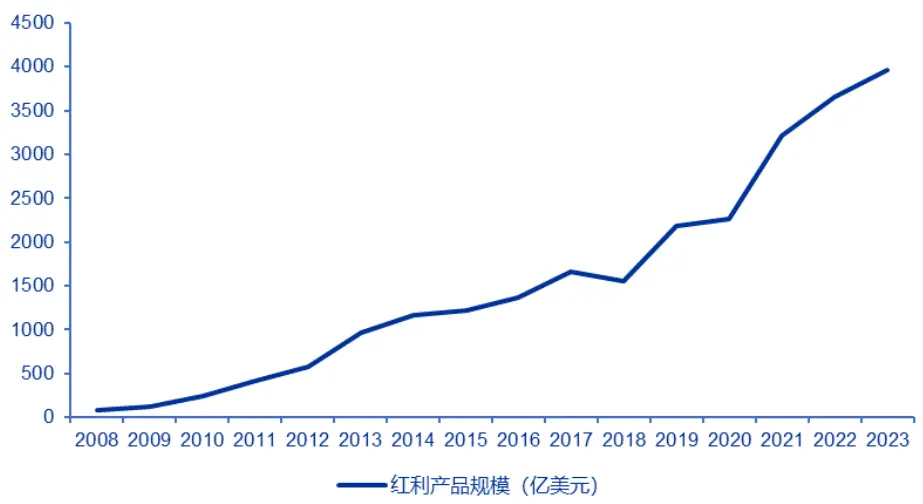
资料来源：Bloomberg，申万宏源研究

美国规模前十的红利ETF如下：

表 1：美国规模前十红利 ETF
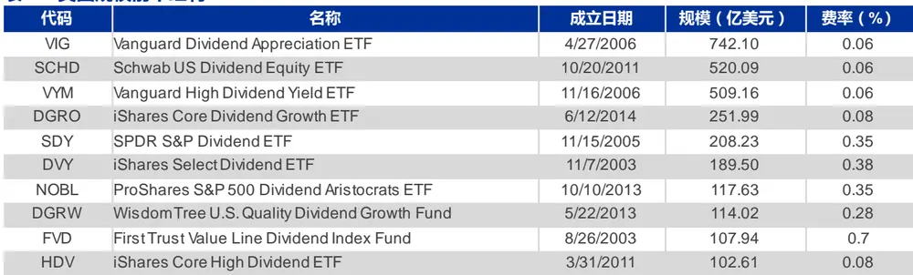
资料来源：Bloomberg，申万宏源研究

前十大产品的规模合计占到了美国红利 ETF的72%。

其他地区的红利 ETF 中，中国台湾地区的规模最大，加拿大、欧洲、亚太地区均有覆盖。

图 2：美国以外地区红利 ETF 规模
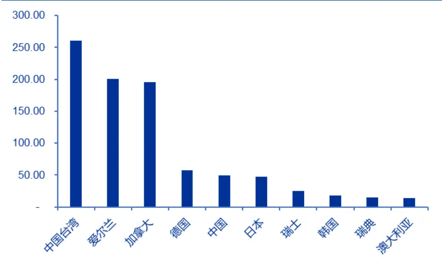
资料来源：Refinitiv，申万宏源研究

值得注意的是，相比于欧美地区成长价值产品在 Smart Beta 中的占比高于红利，亚太地区整体都体现了红利产品规模占比更高的现象，Smart Beta都以红利为主导。美国以外地区规模前十的产品如下：

表 2：美国以外地区规模前十红利 ETF
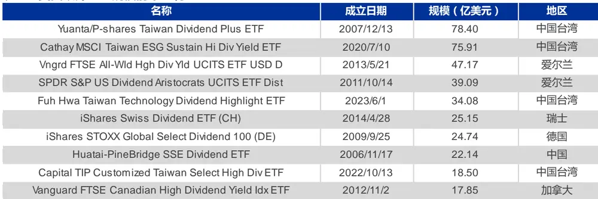
资料来源：Refinitiv，申万宏源研究

以上产品中，中国台湾地区的产品数量最多，且投资的都是中国台湾本地区的股票，而欧洲的产品则主要为全球或美股产品，单独投资本地股票的较少；中国的华泰柏瑞上证红利ETF也进入前十。

相比于 ETF，全球场外红利指数产品的规模明显更小，仅略超 300 亿美元，其中也包括了国内的部分红利指数增强基金。

## 1.2 境外主要红利指数编制方案

境外多数地区的红利策略以突出“高股息”特征为主，但美国地区的红利策略相对更多样化，主要包含了高股息、高股息增长两大类策略，近年来也出现了加入更多因子的复合策略。下面我们对规模较大的产品跟踪的指数的编制方案进行介绍。

## S&P U.S. Dividend Growers Index

美国目前最大的红利 ETF VIG 采用高股息增长策略，跟踪标普美国股息增长指数，而在 2021 年 9 月以前产品跟踪 NASDAQ US Dividend Achievers 指数。

指数编制方法：在满足市值、流动性等条件的情况下，选择每年现金分红、在过去 10 年中分红都有增长的股票，然后按照年度股息率排序，剔除前 25%的股票，然后将剩余股票按照自由流通市值加权。

这一编制方案与此前的纳斯达克指数的方法基本一致。

## Dow Jones U.S. Dividend 100 Index

美国规模第二的红利 ETF SCHD 实际为复合因子产品，除了高股息、高股息增长外也加入了代表质量的因子。该产品跟踪的道琼斯美国红利 100 指数采用多个标准筛选股票，主要包括自由现金流与负债比、ROE、股息率、5 年股息增长（当前股息/滚动 5 年股息均值-1），4 个项目分别打分后等权合成，前 100 只股票被选入指数。

## FTSE High Dividend Yield Index

规模第三的红利产品 VYM 则为纯粹的高股息产品，跟踪富时高股息指数，编制方法如下：首先剔除 REITs、剔除在过去 12 个月没有发放股利的公司或在未来12 个月无法预见或预期发放零股利的公司，然后将剩余公司根据 I/B/E/S 分析师一致预期 12 个月股利收益进行从大到小排序；然后根据其所在的可投资市场，对已经被纳入指数的公司，若其红利在 55 分位数以外则剔除，对于没有被纳入指数的公司，若其红利在 45 分位数以内则纳入。该指数主要使用一致预期股息率作为选股标准。

## Morningstar® US Dividend Growth Index

iShares 最大的红利 ETF DGRO 同样为股息增长 ETF，主要选择至少 5 年股息持续增长、支付比例小于 75%的公司，股息率绝对水平较高的公司同样也将被剔除。相比于 VIG 跟踪的指数，该指数对股息增长持续时间的要求相对更宽松，在剔除标准上则增加了支付比例。

## S&P High Yield Dividend Aristocrats Index

道富最大的红利 ETF 也为股息增长产品，该产品跟踪的指数从标普 1500 中选择市值、流动性符合要求，且过去连续 20 年每年股息都在增长的公司，然后按照年度股息率进行加权。相比于VIG、DGRO，该指数对股息增长的要求明显更高。

美国红利产品跟踪的指数体现出了明显的多样化，前五大产品跟踪的指数各不相同，目前以高股息增长策略为主，而不同高股息增长指数对连续增长年限的要求也各不相同。而在传统的高股息指数上，预期股息已经替代历史股息成为更受关注的指标。

其他地区的产品中，欧洲头部产品使用的也是富时 High Dividend Yield、标普 High Yield Dividend Aristocrats 系列，仅在股票池有所差异，在编制上差异不大。其他产品中，我们主要介绍中国台湾地区产品跟踪的指数情况。

## 台湾高股息指数

元大高股息是台湾最大的红利 ETF， 该 ETF 跟踪台湾证交所与富时指数公司共同编制的台湾高股息指数，该指数从台湾 50 及中型 100 指数成份股中选择预测一年现金股息率最高的50 只个股作为成分股。

## MSCI ESG永续高股息精选30指数

国泰永续高股息 ETF 跟踪 MSCI ESG 永续高股息精选 30 指数，筛选 MSCIESG 评级为 BB(含)以上且 MSCI ESG 争议分数达 3 分(含)以上个股，依调整后股息率排序取前 30 只，并以调整后股息率作为权重分配标准，以捕捉台湾兼具可持续与高股息两大特征的企业的绩效表现。

## 特选台湾上市上柜科技优息指数

复华台湾科技优息是台湾首只月度分红产品，也是全球少见的科技板块高分红产品，说明了台湾股票突出的高股息特征。该产品跟踪特选台湾上市上柜科技优息指数，从台湾上市上柜电子类股票中，经过市值、流动性、股价波动、股息及稳定性、财务指标等筛选后，在通过股息率选择 40只成分股。

可以看到，相比于美国的指数以高股息增长为主，中国台湾的产品仍然重点突出高股息，除了富时的指数关注预期股息，其他仍较多关注历史股息。

## 2.代表地区红利指数产品发展历史与契机

## 2.1 美国：防御工具

美国在红利指数产品中占据绝对的领先地位，在 ETF 规模上是排名第二的中国台湾地区的 10 倍以上，在场外指数中也占据了 70%以上，下面我们重点对美国红利ETF的发展历史及相应的参与者进行介绍。

在现存的红利 ETF 中，发行最早的 2 只为 2003 年发行的 First Trust ValueLine Dividend Index Fund 和 iShares Select Dividend ETF，规模分别为 108 亿和 190 亿美元。iShares 的产品 DVY 在 2010 年之前都是美国最大的红利 ETF 产品，跟踪 Dow Jones U.S. Select Dividend 指数，成份股需要满足股息高于 5 年平均、EPS 对股息的覆盖率超过 167%（即支付率小于 60%）等要求，然后选择股息率最高的股票。

从发展路径来看，早期的产品更关注高股息，但 2006 年先锋高股息增长 ETF发行后受到欢迎，高股息增长策略的增长也开始加快；2010 年以后，产品采用的策略更加多元化，在高股息、高股息增长的基础上增加如盈利、质量、低波等其他因子，与此前已经成功的产品形成差异化；2020 年以后，随着主动 ETF 监管的宽松，传统主动管理人如资本集团也发行了较大规模的红利主动 ETF，而与红利相关的对冲策略对另类产品也开始出现。

我们观察头部产品的规模变化，发现目前最大的红利 ETF、先锋的股息增长ETF 有明显的“后来居上”趋势，2010 年前 iShares 的 DVY 是最大的产品，股息增长产品发行后规模增速明显更快，而嘉信理财复合的 SCHD 是近两年增长最突出的产品：

图 3：美国头部红利 ETF 规模变化（亿美元）
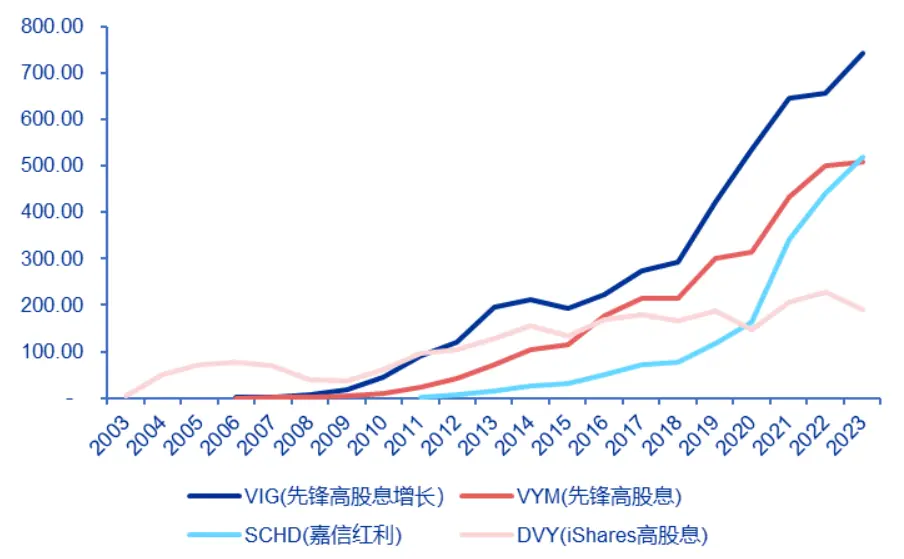
资料来源：Bloomberg，申万宏源研究

而从产品的表现来看，股息增长产品在标普 500 表现出色的年份常常表现出更好的收益，如 2007、2009、2019、2023 年，2007-2009 年 Vanguard 的高股息增长ETF持续表现占优后也迎来了规模的增长：

图 4：美国头部红利 ETF 表现（%）
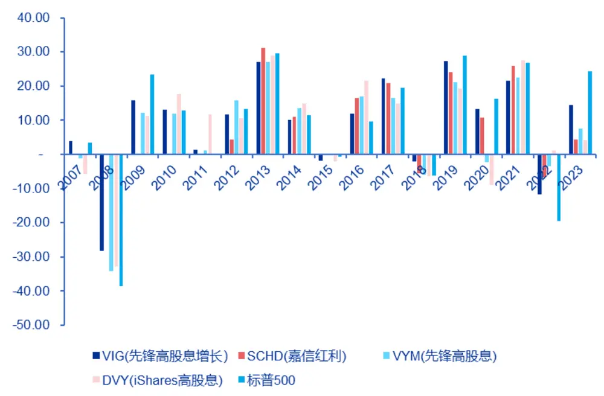
资料来源：Bloomberg，申万宏源研究

而在 2022 年的加息周期中，高股息增长表现弱于高股息，当年度高股息增长的资金流入也要弱于高股息 ETF，而 2023 年市场风格转向成长，高股息增长表现优于高股息，资金流向也再次变化。近两年以上四只产品的资金流入情况如下：

表 3：美国头部红利 ETF 近两年资金流入

| 代码 | 2022年净流入（亿美元） | 2023年净流入（亿美元） |
| --- | --- | --- |
| VIG（先锋高股息增长） | 36.17 | 7.85 |
| VYM（先锋高股息） | 88.75 | -7.61 |
| SCHD（嘉信红利） | 155.59 | 67.36 |
| DVY(iShares 高股息） 35.53 -32.53 |  |  |

资料来源：Bloomberg，申万宏源研究

除了产品表现差异带来的资金流动，产品的费率可能也是重要的影响因素：VIG、VYM、SCHD 费用都为 0.06%，而 DVY 费用达到 0.38%，虽然其近两年表现优于常其他高股息产品，但其在 2022 年流入最少、2023 年流出最多。嘉信理财的 SCHD 近两年大幅流入，可能也和公司本身的头部个人金融服务商背景有关，在红利风格占优时该产品成为了公司的重点产品。

从美国红利 ETF 的持有特征来看，我们发现相比于其他 Smart Beta 产品，红利产品的机构占比相对更低，多数不到 40%，而其他成长、价值产品可在 60%、

70%以上。因此，红利产品是个人和机构都有较大配置需求的产品。对于个人来说，红利产品在市场下跌时跌幅更小，上涨时长期收益与指数差异不大，较好的防御属性适合长期投资，定期分红特点也天然更适合养老金的负债投资。而对于机构来说，其在市场下跌中突出的防御属性得到了多次的验证，也使得大型机构养成了配置习惯。

以美国最大的 ETF 持有机构美国银行为例，我们观察其对先锋高股息增长 VIG的持有情况，我们发现其中体现了明显的宏观配置特征：在 2016 年一季度、2018年四季度、2020 年一季度大盘回撤期间都有明显的增持行为，而当 2018 年市场恢复后有明显减持；此外，2021 年底市场波动增加后也有明显的增持：

图 5：美国银行持有 VIG 情况（绿色对应持有份额（左轴），白色对应 ETF价格（右轴））
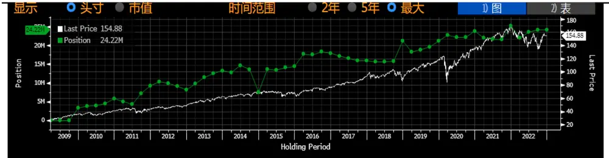
资料来源：Bloomberg，申万宏源研究

其他大型机构对其的使用同样具备较明显的战术配置特征，即市场波动增加或加息周期中红利产品的使用有所增加，这一点从 2022 年大幅流入、2023 年有所流出的资金流向特征上我们也能看到。因此，大型机构投资者的配置、交易需求是支撑这类产品发展的重要因素。

## 2.2 中国台湾：“存股”替代存款

全球第二大红利 ETF 市场是中国台湾地区，高股息 ETF 产品在台湾受欢迎程度一直较高，下面我们也对其发展原因进行介绍。

台湾的第一只高股息 ETF 是于 2007 年 12 月 13 日成立的元大高股息(0056)。根据 CMoney 统计，截至 2023 年三季度，台湾高股息股票 ETF 的受益人数超过334 万人，约占到台湾所有股票 ETF 的一半，高股息 ETF 的覆盖率很高。台湾红利ETF的规模变化如下：

图 6：中国台湾红利 ETF 规模（亿新台币）
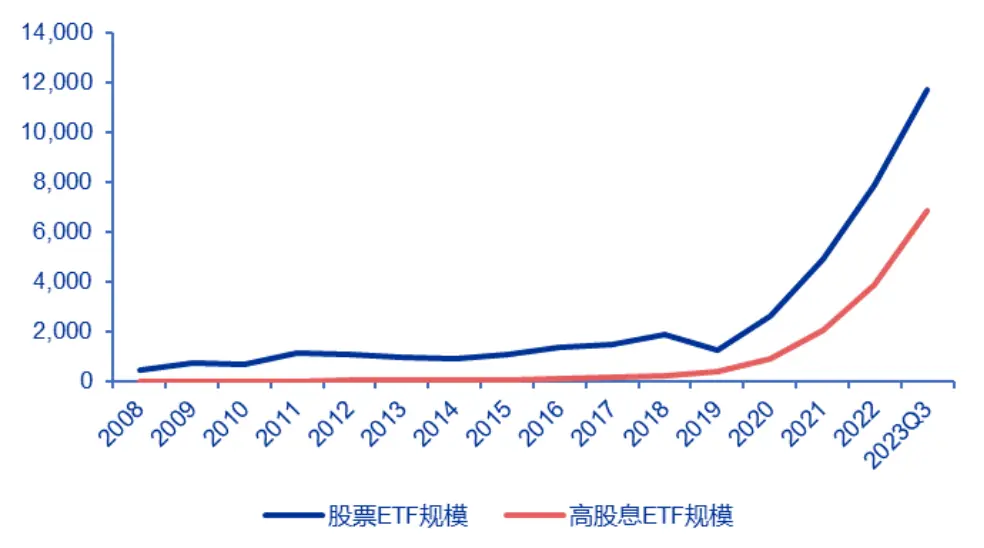
资料来源：Bloomberg，申万宏源研究

可以看到，台湾红利产品的规模在 2018-2019 年有所上升，2020 年开始快速增长。根据台湾投资信托即顾问同业协会 SITCA 的数据，除了产品的总规模，产品的受益人数（持有人户数）也体现出同样的趋势，在 2020-2022 年间快速增长：

图 7：元大高股息 ETF 受益人数变化（自然人和法人分别指个人和机构）
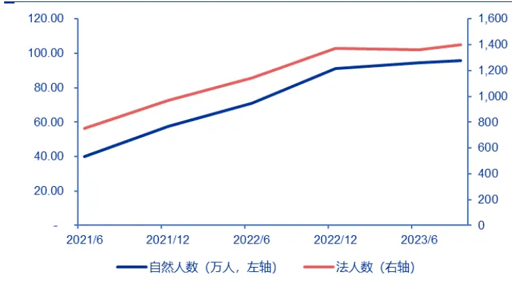
资料来源：SITCA，申万宏源研究

图 8：国泰永续高股息 ETF 受益人数变化
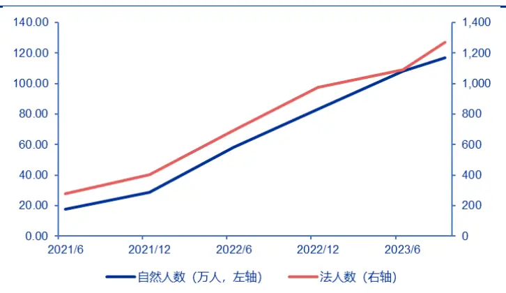
资料来源：SITCA，申万宏源研究

整体来看，台湾高股息 ETF 对个人、机构都具备不错的吸引力，持有高股息ETF的个人数量已经超过了台湾居民总数的10%，说明高股息 ETF的覆盖极广。

根据“台湾 ETF 投资学院”网站的分析，台湾投资者追逐高股息 ETF 的主要目的是作为定期存款的替代，“存股”的概念也正是说的这一目标。由于台股一直具备高股息的特征，而定期存款利率又在美国开启新一轮宽松后持续走低，高股息ETF 5%以上的年化股息率水平就成为了优质的替代。虽然从股价水平上来说，高股息 ETF 的全收益表现未必能够战胜以台湾 50 指数为代表的非高股息指数，但投资者买入此类产品的目的是长期持有并获得稳定的分红，短期的股价波动对分红造成的影响不大，只要长期来看分红以外的股价变化不大，代替定存的目标就达到了。因此，高股息产品的规模增长建立在股价即本金长期不发生大幅亏损的认知上。目前持有人数量最多的国泰永续高股息 ETF 是一只 ESG 高股息产品，选取的股票兼具高 ESG 评级、高股息的特点，既能满足稳定分红的现金流特征，同时由于高 ESG评级本身股价波动相对更低，与替代定存的特点相契合，因此得到了最多的关注，但实际上该产品的长期业绩并不能跑赢台湾 50 指数，这也侧面说明了此类产品的需求来源与传统股票产品不同。

## 3.境内红利指数产品发展

截至 2023 年，我国涉及到红利因子的指数产品共 57 只，剔除 ETF 联接后合计规模 664 亿元，在所有 Smart Beta 产品中的占比超过 80%，其中红利指数增强产品规模 115 亿元；涉及红利的 26 只 ETF 合计规模 428 亿元，在所有 SmartBeta ETF 中的占比也达到 80%。

我国红利产品的规模变化如下：

图 9：我国红利产品规模（亿元）
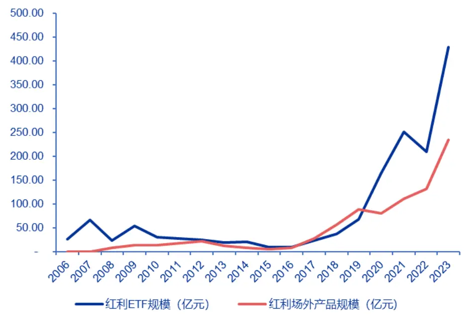
资料来源：Bloomberg，申万宏源研究

产品的规模增长主要从 2018 年开始，2020-2021 年、2023 年增长速度最快，目前规模最大的5 只产品如下：

表 4：我国规模前五红利指数产品

| 产品代码 | 产品名称 | 场内/场外 | 指数名称 | 成立日期 | 规模（亿元） |
| --- | --- | --- | --- | --- | --- |
| 510880.SH | 华泰柏瑞红利 ETF | 场内 | 上证红利 | 2006-11-17 | 166.45 |
| 100032.OF | 富国中证红利指数增强A | 增强/场外 | 中证红利 | 2008-11-20 | 92.82 |
| 515100.SH | 景顺长城中证红利低波动100ETF | 场内 | 中证红利低波100 | 2020-05-22 | 50.86 |
| 515080.SH | 招商中证红利 ETF | 场内 | 中证红利 | 2019-11-28 | 43.65 |
| 515180.SH | 易方达中证红利 ETF | 场内 | 中证红利 | 2019-11-26 | 40.14 |

资料来源：Wind，申万宏源研究，截至 2023.12.31

华泰柏瑞的上证红利 ETF 规模明显领先，近两年此类产品规模的增长也主要由其驱动，富国的指数增强也有较大的规模。

从华泰柏瑞红利 ETF 2020 年以来的表现和份额情况来看，其份额增长最快的阶段主要为 2020 年末 2021 年初、2021 年末，这三个阶段都属于上证红利指数大幅跑赢指数后回撤的阶段，体现了差异化的行情下红利策略有阶段性超额收益，投资者关注到这一现象后会呈现出“越跌越买”的特点。而 2022、2023 年上证红利指数相对上证指数都有超额，红利类策略在市场偏弱环境中与美国一样具备出色表现，资金也继续有一定流入 ：

图 10：华泰柏瑞红利份额与指数表现
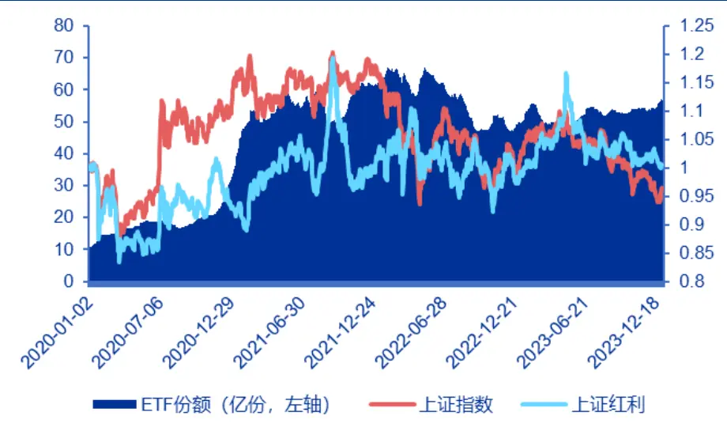
资料来源：Wind，申万宏源研究

从持有人结构来看，华泰柏瑞的红利 ETF、富国红利指数增强 2023 年中报的个人占比都在70%以上，而景顺长城红利低波 ETF的机构占比超过80%。

我们对头部指数产品跟踪的上证红利、中证红利、深证红利指数的编制进行简单介绍。

## 中证红利指数

中证红利指数从沪深市场中选取现金股息率高、分红稳定、具有一定规模及流动性的 100 只上市公司证券作为指数样本，以反映沪深市场高红利上市公司证券的整体表现。该指数以 2004 年12 月31 日为基日，以1000 点为基点。

指数成份股要求过去三年连续现金分红，且过去三年股利支付率均值以及过去一年股利支付率均大于 0 且小于 1、过去一年内日均总市值排名在前 80%、过去一年内日均成交金额排名在前80%。

对满足以上条件的股票，按照过去三年的平均税后现金股息率由高到低排名，选取排名靠前的100 只证券作为指数样本，并采用股息率加权。

值得注意的是，该方案于2022 年10 月13 日修订，并于12 月12 日生效，此次修订一是提高了成份股现金分红的要求，将连续分红条件由两年提高到三年；二是降低了小市值成份股的权重占比，增加小市值股票权重上限，100 亿以下成份股权重不得超过0.5%。

## 上证红利指数

上证红利指数选取在上海证券交易所上市的现金股息率高、分红比较稳定、具有一定规模及流动性的 50 只证券作为指数样本，以反映沪市高股息率证券的整体表现。该指数以 2004 年 12 月 31 日为基日，以 1000 点为基点。指数在上证 180指数的样本空间中选股，分红、市值、成交条件与中证红利指数一致，满足条件的股票按过去三年平均现金股息率由高到低排名，选取排名靠前的 50 只证券作为指数样本并按股息率加权，单个样本权重不超过 10%，100 亿元以下总市值的样本权重不超过1%。

上证红利指数的修订时间较早，4 月就已经实施，修订的方向与中证红利一致。

## 中证红利低波 100

中证红利低波动 100 指数从沪深市场中选取 100 只流动性好、连续分红、股息率高且波动率低的上市公司证券作为指数样本，采用股息率/波动率加权，以反映沪深市场股息率高且波动率低的上市公司证券的整体表现。

在中证全指样本空间内，指数选择过去 3 年连续现金分红且每年的税后现金股息率均大于 0 的股票，并剔除过去一年内日均成交金额排名在后 20%的股票；对样本空间内证券，计算过去三年平均股息率和过去一年的波动率；按照过去三年股息率降序排名，挑选排名居前的 300 只证券作为待选样本；然后按照过去一年波动率升序排名，挑选排名居前的 100 只证券作为指数样本。可以看到，该指数采用先红利后低波的方式筛选，希望在高股息的股票中进一步找到低波动的股票。

从以上编制方案中我们看到，由于我国上市公司的分红习惯尚未完全形成，我国红利指数尚未采用股息增长的形式，主要采用高股息来筛选股票，回看股息率的时间窗口也相对较短，为1-3 年不等。

在这样的编制方案下，我国主要红利指数的行业偏离相对较为明显：上证红利指数中煤炭的权重接近 25%，金融地产占比接近 30%，钢铁权重约 10%，传统行业占比明显偏高，这也使得上证红利 ETF 虽然为红利策略，却也表现出了高弹性、高波动的特征，在这两年的几波周期行情中有出色的表现，受到了投资者的关注。而中证红利低波 100 由于加入了低波，周期行业的占比有所降低，银行占比 20%，煤炭的占比在 10%以下。上证红利和中证红利低波指数过去 5 年的年化波动率分别为 21.1%和 15.8%，后者加入低波后体现了更低的波动。而从投资者结构的分化来看，个人对低波动的需求不大，更偏好阶段超额明显的上证红利、中证红利，而机构偏好红利低波以作为防御工具。

## 4.境外红利指数产品发展对境内的启示

从境内外红利产品的规模增长情况来看，我国近三年红利指数产品处于高速发展期，增长的动力主要来自红利策略的出色表现，尤其是在市场整体偏弱时的超额收益表现，这一点和美国的情况较为相似。但不同的是，我国的红利指数主要参考历史股息率，周期股的占比高，长期来看并未体现出降低波动的防御属性，在 2021年中周期股下跌时也有大幅度的回撤。

从美国的发展路径来看，若希望机构能够更多地参与到红利投资中，则重点需要突出的仍然是纯粹的红利属性，通过投资高分红、高分红预期的股票来提供较为出色的收益预期，同时能够在市场低迷时提供保护。对此，我们认为可能的红利策略改进方向包括：

1）在红利因子构建上选择加入一定的分析师预期，类似富时的高股息指数，采用预期股息率选股的方式。分析师预期数据在我国是常用的选股因子，预期股息率兼顾了公司未来的盈利预期，相比于历史高股息与低估值更接近的情况能形成一定差异。

2）除了红利因子，考虑与盈利、成长因子进行叠加。这一方向上实际已经有中证红利潜力指数，指数表现较好，但产品规模不大。此类产品在设计时建议仍然以红利属性为主，保证红利表现出色阶段的超额收益，同时通过其他因子的辅助提高安全性、稳健性。

3）在特定板块构建红利策略。由于我国上市公司分红习惯未完全形成，不同行业生命周期所处阶段不同，因此存在红利指数行业有偏的情况，建议可以顺应这一特点，在大类板块分别构建红利策略，也可以在红利基础上少量叠加辅助因子获得更好的选股效果，这样既使得指数的行业偏向更集中，也易于获得更纯粹的工具型产品。

而中国台湾地区的红利产品发展则以个人客户为主导，且客群与传统的股票投资群体不同，也为我们红利 ETF 的发展提供了新的思路。从台湾红利 ETF 的发展经验来看，其规模能够快速增长的核心还是来自于客户渗透率的不断提升，是参与、认可红利投资的客户不断增加，从而带来了份额的增长。而从客户的投资目标来看，其投资红利的核心诉求是获得票息、代替定期存款，因此在指数本身波动不大的情况下，更高的股息率是吸引客户的重点。而台湾管理人在宣传中也把长期持有、收获持续的高股息作为核心宣传点，如复华科技优息宣传时提到了“世代相传”。

能够让低风险偏好、偏好定期存款的客户接受“存股”的概念，一方面需要管理人、专业投资人员持续的投资者教育（台湾的 ETF 投教文章较为丰富），另一方面也需要指数长期股价表现稳定，在本金在一定周期内相对安全的情况下，让投资者能够接受以“存股”代替存款。

对我国来说，目前我国的红利 ETF 受众主要仍为传统股票投资客户，投资者寻求红利的原因一方面来自于市场波动较大期间红利的降波动属性，另一方面在于红利相对较高的周期行业占比使其在经济上行时的周期行情中能够具备更强的上涨弹性，其本身的高股息特征往往被弱化。事实上，我国主要红利指数的股息水平也高于定期存款的水平，但若不加入行业中性的考虑或低波动率因子，目前的回撤水平偏高，若要尝试按照本金相对稳定、稳定现金股息收益的视角来拓宽客户，则建议在收益的稳定性上进行优化，包括行业中性、加入低波因子，或加入其他盈利质量因子等。

## 5.风险提示与声明

本报告对于海外产品、海外指数的研究分析均基于公司、Bloomberg 公开信息，可能受分析样本不同而产生一定偏差；指数产品表现受指数波动影响，基金产品历史业绩不代表未来；指数未来表现受宏观环境、市场波动、风格转换等多重因素影响，存在波动风险；本报告不涉及证券投资基金评价业务，不涉及对基金产品的推荐，亦不涉及对任何指数样本股的推荐。

## 信息披露

## 证券分析师承诺

本报告署名分析师具有中国证券业协会授予的证券投资咨询执业资格并注册为证券分析师，以勤勉的职业态度、专业审慎的研究方法，使用合法合规的信息，独立、客观地出具本报告,并对本报告的内容和观点负责。本人不曾因，不因，也将不会因本报告中的具体推荐意见或观点而直接或间接收到任何形式的补偿。

## 与公司有关的信息披露

本公司隶属于申万宏源证券有限公司。本公司经中国证券监督管理委员会核准，取得证券投资咨询业务许可。本公司关联机构在法律许可情况下可能持有或交易本报告提到的投资标的，还可能为或争取为这些标的提供投资银行服务。本公司在知晓范围内依法合规地履行披露义务。客户可通过 compliance@swsresearch.com 索取有关披露资料或登录www.swsresearch.com 信息披露栏目查询从业人员资质情况、静默期安排及其他有关的信息披露。

## 机构销售团队联系人

华东 A 组茅炯

021-33388488

maojiong@swhysc.com

华东 B 组李庆

021-33388245

liqing3@swhysc.com

华北组肖霞

010-66500628

xiaoxia@swhysc.com

华南组李昇

0755-82990609

Lisheng5@swhysc.com

## 法律声明

本报告仅供上海申银万国证券研究所有限公司（以下简称“本公司”）的客户使用。本公司不会因接收人收到本报告而视其为 客 户 。客 户 应当 认 识到 有 关本 报 告的 短 信提 示 、电 话 推荐 等 只是 研 究观 点 的简 要 沟通 ， 需以 本 公 司http://www.swsresearch.com 网站刊载的完整报告为准，本公司并接受客户的后续问询。本报告首页列示的联系人，除非另有说明，仅作为本公司就本报告与客户的联络人，承担联络工作，不从事任何证券投资咨询服务业务。

本报告是基于已公开信息撰写，但本公司不保证该等信息的准确性或完整性。本报告所载的资料、工具、意见及推测只提供给客户作参考之用，并非作为或被视为出售或购买证券或其他投资标的的邀请或向人作出邀请。本报告所载的资料、意见及推测仅反映本公司于发布本报告当日的判断，本报告所指的证券或投资标的的价格、价值及投资收入可能会波动。在不同时期，本公司可发出与本报告所载资料、意见及推测不一致的报告。

客户应当考虑到本公司可能存在可能影响本报告客观性的利益冲突，不应视本报告为作出投资决策的惟一因素，客户应自主作出投资决策并自行承担投资风险。本公司特别提示,本公司不会与任何客户以任何形式分享证券投资收益或分担证券投资损失，任何形式的分享证券投资收益或者分担证券投资损失的书面或口头承诺均为无效。本报告中所指的投资及服务可能不适合个别客户，不构成客户私人咨询建议。本公司未确保本报告充分考虑到个别客户特殊的投资目标、财务状况或需要。本公司建议客户应考虑本报告的任何意见或建议是否符合其特定状况，以及（若有必要）咨询独立投资顾问。在任何情况下，本报告中的信息或所表述的意见并不构成对任何人的投资建议。在任何情况下，本公司不对任何人因使用本报告中的任何内容所引致的任何损失负任何责任。市场有风险，投资需谨慎。若本报告的接收人非本公司的客户，应在基于本报告作出任何投资决定或就本报告要求任何解释前咨询独立投资顾问。

本报告的版权归本公司所有，属于非公开资料。本公司对本报告保留一切权利。除非另有书面显示，否则本报告中的所有材料的版权均属本公司。未经本公司事先书面授权，本报告的任何部分均不得以任何方式制作任何形式的拷贝、复印件或复制品，或再次分发给任何其他人，或以任何侵犯本公司版权的其他方式使用。所有本报告中使用的商标、服务标记及标记均为本公司的商标、服务标记及标记。