2024 年 01 月 11 日

# 拆解红利指数：当前红利投资的性价比是看估值还是看股息率？

## ——红利策略全攻略系列之二

## 相关研究

## 证券分析师

邓虎 A0230520070003

denghu@swsresearch.com

研究支持

王宇涵 A0230523120003

wangyh@swsresearch.com

联系人

邓虎

(8621)23297818×

denghu@swsresearch.com

## 本期投资提示：

- 本文以中证红利、上证红利等红利指数出发，以指数的收益拆解来观察近年来红利指数良好的表现来源，并尝试从估值和股息率两个角度刻画当前红利投资的性价比。

⚫股息贡献叠加估值提升贡献了 2023 年的红利指数收益。我们对过去几年红利指数的收益进行拆解，一方面，稳定且持续增长的股息确实为红利指数贡献着相当的收益，但 2023年的收益更多部分也是来自估值的贡献，且往前的几年里估值和盈利的贡献波动较大。

⚫股息率选股带来的交易属性对指数的贡献较低。红利指数由于使用股息率进行选股和加权，使得指数的策略特征较强，理论上股价涨上来的权重股会因为股息率下降而权重降低，股价较低的成分股会因为股息率上升而权重上升，整体使得指数有一定的策略性和交易贡献，但根据我们对近两年数据的测算，发现红利指数的选股和交易贡献较低，每次调仓股息率的上升也较为有限。

⚫由于红利指数的非市值加权特征，无论是估值还是股息率，都需要重新修正计算。本质原因是因为红利指数以股息率加权，非市值加权的属性使得传统的指数估值计算方法不够准确，因此本文用红利指数的权重进行修正，得到了加权估值和加权股息率数据。

⚫目前来看估值对红利投资性价比判断提供的信息有限，但能够提供安全边际的参考。主要的原因是红利指数历史上的估值呈现长期下行，估值没有呈现周期性走势，使得通过估值进行择时判断较为困难。另外一方面的原因是因为部分高股息行业如煤炭、交运等盈利波动较大。

⚫我们发现修正且调整后的股息率对红利投资的性价比有一定的参考意义，更适用于红利相比主动投资的性价比判断。我们对股息率进行了平滑处理，考察了历史股息率对未来股息的预测性，以分红稳定增长作为假设，建立了当前分红趋势上下 0.7 倍标准差的上下轨买卖时点，结果发现，高股息率买入低股息率卖出的买卖时点的给出，对判断红利投资性价比有一定的指示意义，且在用于考察红利相比主动权益投资的性价比时更加有效。

⚫ 风险提示：模型根据历史数据构建，历史表现不代表未来，市场环境发生重大变化时可能失效。

过去两年以来，红利指数以及高股息股票整体表现出色，不仅在震荡下行的市场行情里展示了良好的防御能力，在沪深300指数2022年、2023年分别下跌21.63%、11.38%的情况下，中证红利和上证红利指数的价格指数分别在 2022 年收益率为-5.45%、0.89%和-2.42%、2.67%，考虑到指数的票息，中证红利收益指数在 2022年、2023 年的收益率为-0.37%、6.34%，上证红利全收益指数在 2022 年和 2023年收益率为 3.46%、9.06%，展示出了良好的总收益特征。

市场进入 2024 年以来，红利相关的股票继续表现优异，一方面市场对当前红利策略的投资性价比有一定的分歧，连续两到三年的上涨是否会使得红利股本身的投资性价比有所下降，另一方面市场上对红利股的投资性价比分别采用了估值和股息率等不同的考察手段。本文则从红利指数的收益拆解出发，考察红利指数非市值加权的重要特点，对其估值、股息率数据带来的影响，并对估值、股息率等计算进行一定的修正，为当前考察红利策略的投资性价比提供一定的参考。

## 1. 过去两年红利指数的收益贡献主要来自分红

过去几年，红利指数的表现整体优异，其中指数本身的票息贡献较多，因此单纯看红利指数的价格指数表现并不能体现红利指数的优势。下图展示了中证红利、上证红利和低波红利三条指数的全收益指数相比价格指数的走势，可见考虑了分红再投资之后，全收益指数大幅跑赢了原价格指数。

图1：过去几年红利全收益指数表现大幅跑赢价格指数
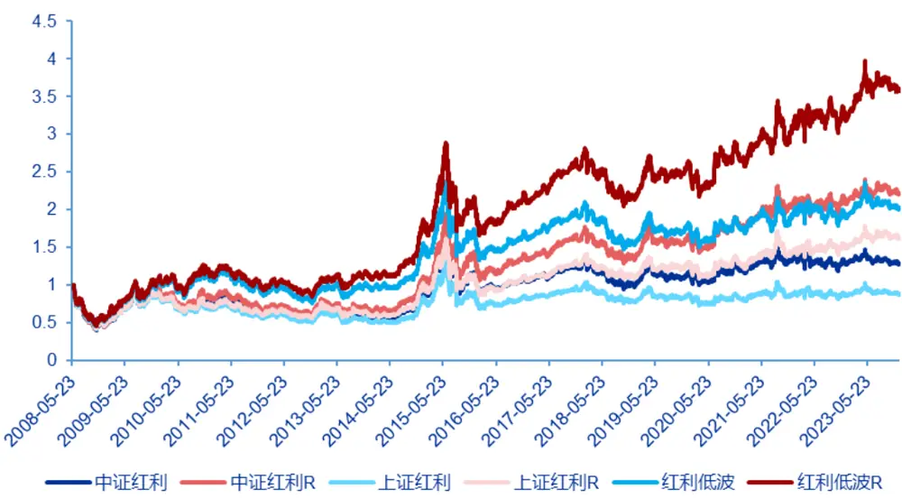
资料来源：Wind，申万宏源研究

红利指数的行业集中于金融和周期。从以下图可知看出，无论是中证红利、上证红利还是红利低波指数，指数的行业都集中于金融和周期性行业，主要是银行、煤炭、交运等行业占据主导。

图 2：中证红利指数的行业分布
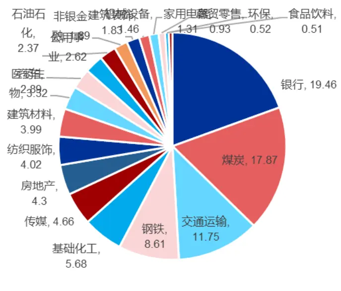
资料来源：Wind，申万宏源研究

图 3：上证红利指数的行业分布
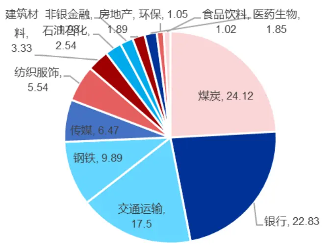
资料来源：Wind，申万宏源研究

图 4：红利低波指数的行业分布
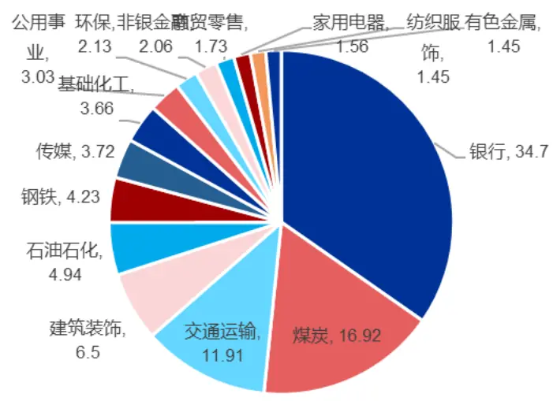
资料来源：Wind，申万宏源研究

过去几年红利指数的收益贡献是否主要由股息来贡献？我们根据几个红利全收益指数过去几年的业绩、派息和成分股净利润数据，估算各指数过去几年的业绩贡献，如下图所示，可知：（1）过去几年红利指数的盈利贡献和估值贡献的波动都较大，近两年盈利增长几乎没有对红利指数提供贡献；（2）票息不仅稳定的给红利指数的业绩提供正贡献，且随着分红率的提升，贡献越来越大；（3）近一年的行情里估值提供了较多的正贡献。

图5：过去几年中证红利指数的收益拆解
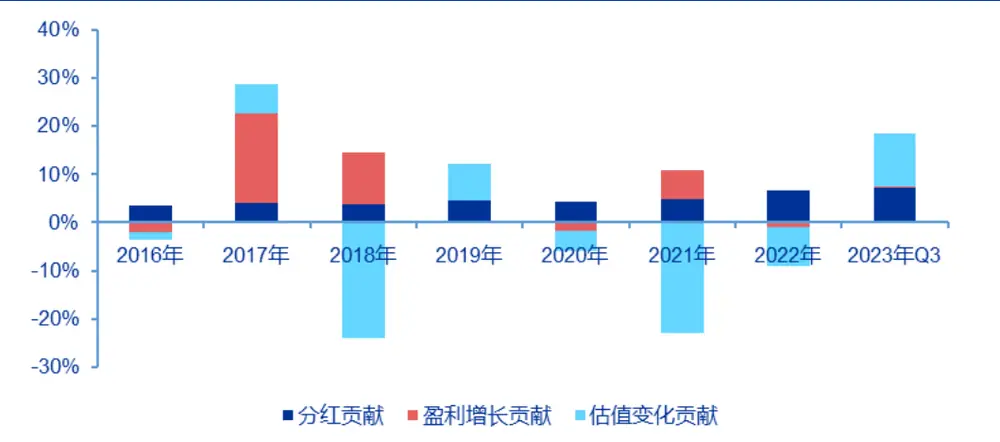
资料来源：Wind，申万宏源研究

图6：过去几年上证红利指数的收益拆解
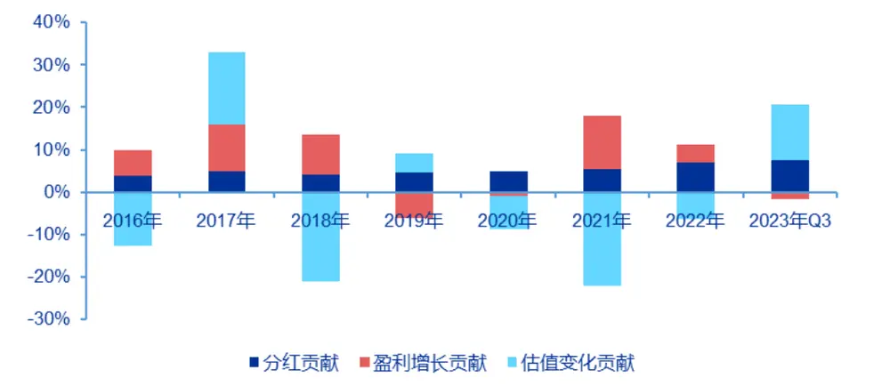
资料来源：Wind，申万宏源研究

近一年来看指数整体的估值还是有所上升，在估值提升一年后，红利指数是否还具有投资上的性价比，后文将会从估值和股息率两个方向入手进行分析。

图7：过去几年中证煤炭全收益指数的收益拆解
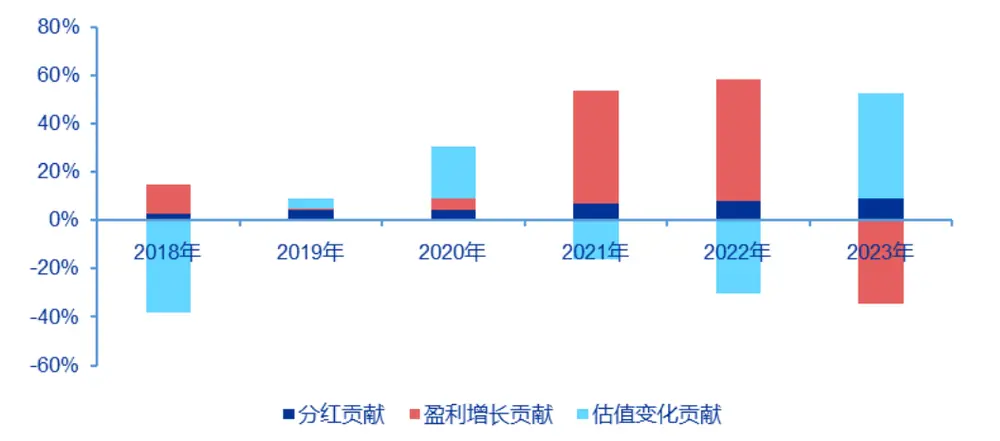
资料来源：Wind，申万宏源研究

我们把高股息里比较重要的行业——煤炭行业全收益指数拿出来也做了一个拆解，可以看到，单纯就煤炭行业而言，估值和盈利的贡献都大幅高于股息，2023 年更是估值大幅贡献了主要收益的来源。

由于我们一直提到，红利指数由于根据股息率选股，且再根据股息率进行加权，如果成分股的股息率发生大幅变化，可能会带来指数成分股的调整，使得策略带有一定的选股属性，接下来我们来考察，指数的策略属性对收益的贡献如何，首先我们展示了过去四期指数成分股的重合度，可见基本上中证红利指数和上证红利指数每期的调整股票占据 20%，而红利低波由于低波因子的反转属性，股票的变化会更大，在连续四期的比较后，中证红利和上证红利的成分股重合度为 50%左右，而红利低波仅剩 24%，考虑到权重股的权重，实际的重合度要比这个更高一些。

图8：过去四期主要红利指数的成分股重合度（只看数量）
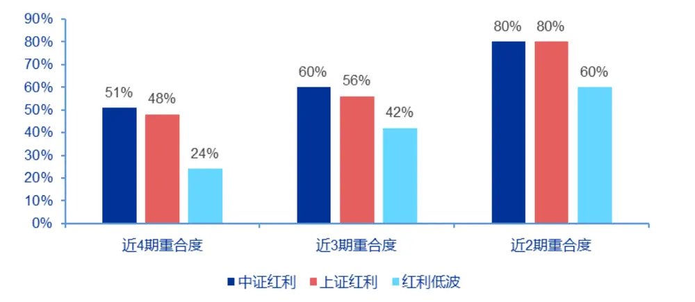
资料来源：Wind，申万宏源研究，数据区间为 2015/12/31-2023/12/31

然后我们来假设近一年即 22 年底未发生指数成分股调整，以原成分股不变，即没有进行策略的选股再平衡，继续以原成分股权重按照股价波动而权重自发变化，在三个指数里 23 年的表现如何：

图 9：假设中证红利指数未调仓在 21.12-22.12 的走势比较
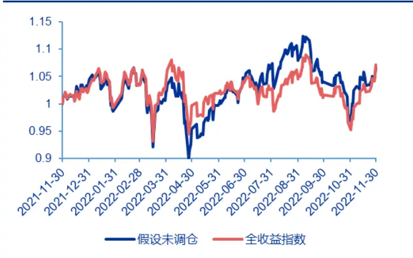
资料来源：Wind，申万宏源研究

图10：假设中证红利指数未调仓在 22.12-23.12的走势比较
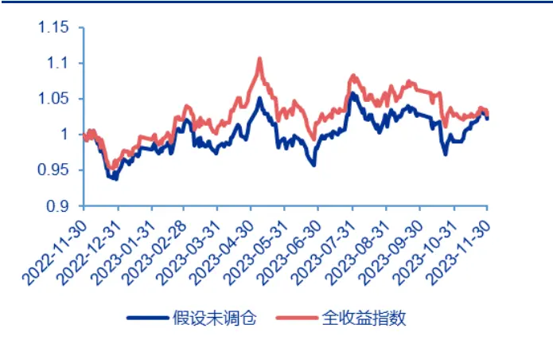
资料来源：Wind，申万宏源研究

图 11：假设上证红利指数未调仓在 21.12-22.12的走势比较
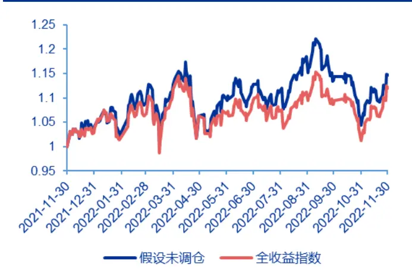
资料来源：Wind，申万宏源研究

图12：假设上证红利指数未调仓在 22.12-23.12的走势比较
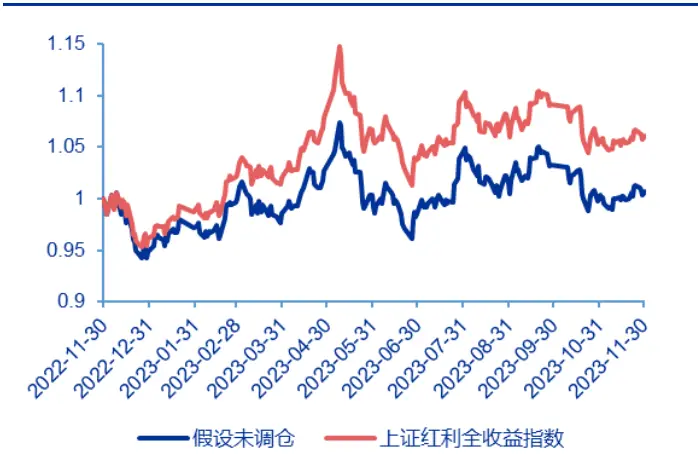
资料来源：Wind，申万宏源研究

直观从以上图来看，指数的成分股调整在收益上的贡献并不明显，只有 2023 年上证红利指数的调仓贡献最大，各自的调仓收益如下表所示，中证红利都在1%以内，上证红利 23 年差距达到了 6%，有一定贡献但不算很强，可能是和长期分红的股票较为稳定且股票的分红率也都较为稳定有关。

表 1：假设成分股不变在 2022 年和 2023年相比原指数的收益变化

|  | 中证红利 R | 中证红利未调仓 | 上证红利 R | 上证红利未调仓 |
| --- | --- | --- | --- | --- |
| 2021.12-2022.11 | 6.96% | 6.54% | 12.00% | 14.64% |
| 2022.12-2023.11 | 2.64% | 3.11% | 6.08% | 0.70% |

资料来源：申万宏源研究

前文我们测算过红利指数的调仓在收益上的贡献，由于红利指数的调仓和股息率密切相关，我们也测算一下过去两年红利指数的调仓对股息率的贡献，可以看到，中证红利指数和上证红利指数的股息率由于调仓带来的上升较为有限，基本上都在 0.2%左右的水平。无论是收益的变化还是股息率的变化，都可以看出：红利整体上仍然一个稳定的板块，其通过高股息率不断进行选股和交易的贡献非常有限。

图 13：中证红利近两年调仓对股息率的提升
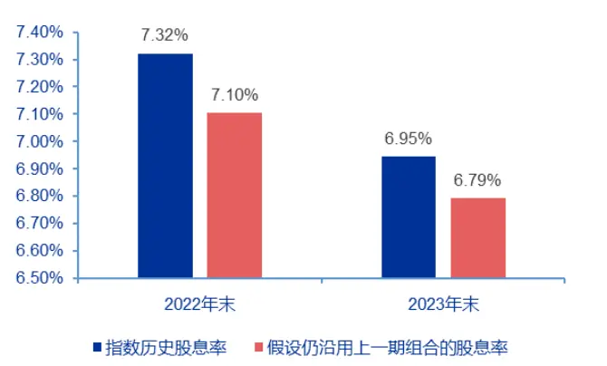

图14：上证红利近两年调仓对股息率的提升
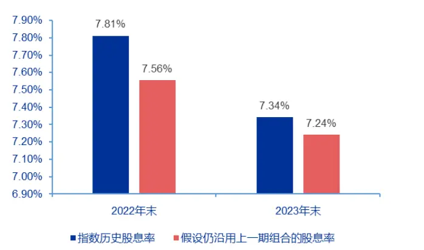

资料来源：Wind，申万宏源研究

资料来源：Wind，申万宏源研究

接下来，我们分别从估值和股息率的角度，来看红利指数当前的投资性价比如何评估更为合适。

## 2. 如何看待红利指数的当前估值？

首先，我们将红利指数较长期限内的 TTM 的指数 PE 展示如下图，结果发现，由于指数的估值数据在过去 10 年里大幅变动，且处于一个长期向下的趋势，因此指数本身的估值对于指数的性价比和择时的作用非常有限，从历史上来看，当前的估值确实处于历史分位数的极低位置，但十年来估值不具有周期性的话估值分位数的指示意义就变的较弱。

图15：单看红利指数的市盈率数据无法提供有效的性价比信息
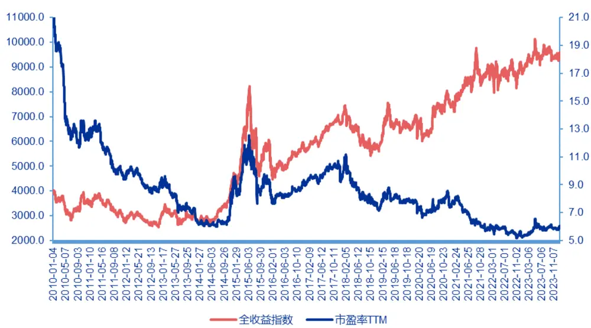
资料来源：Wind，申万宏源研究，数据区间为 2015/12/31-2023/12/31

在进一步考察估值的作用之前，我们还发现了一个问题：行情软件里的红利指数估值往往是根据指数的总市值/总净利润得出，而这种方式可能不适合非市值加权的红利指数。

一般指数的加权方式都是市值加权，而红利指数都是根据股息率进行加权，从而使得股息率更高的公司在指数里权重更大，这种方式导致如果一家公司的股息率较高，其在指数为权重成分股，但市值不够高的话，在计算 PE 时可能会导致计算出来的 PE低估了高票息公司的影响，因此有必要对估值数据进行修正。

我们采用红利指数本身的成分股权重，对市值和净利润全部进行权重调整后再加总，最后将两者相除，得到修正后的中证红利指数和上证红利指数的 PE 走势如下：

图 16：修正后中证红利的估值走势

图 17：修正后上证红利的估值走势

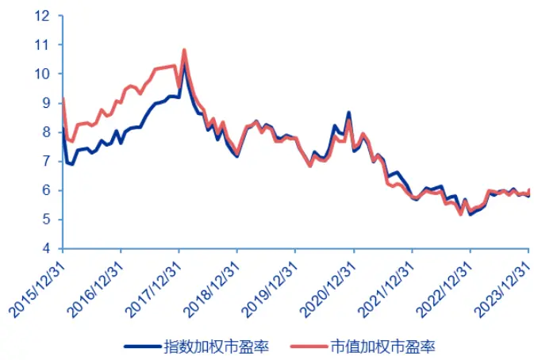
资料来源：Wind，申万宏源研究

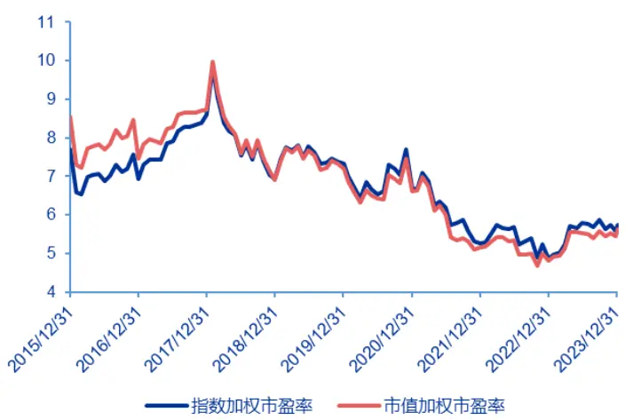
资料来源：Wind，申万宏源研究

可见，修正后的红利指数 PE 与原指数走势较为接近，但在历史上市值加权计算的 PE 则可能在 2016 年高估了红利指数的估值，近两年上证红利指数上可以看到加权后 PE 明显高于市值加权 PE，由于市场对高股息资产的追捧，可以认为当前的指数市值 PE 又有所低估了上证红利指数的当前估值，但好在两者差异不大。

为了验证两种估值计算方式差异不大的原因，我们将两个指数的成分股按市值进行排序，观察其与指数权重的一致性，如下图所示，两者的成分股权重与市值整体上呈线性关系。

图 18：中证红利的市值与权重的关系较为一致
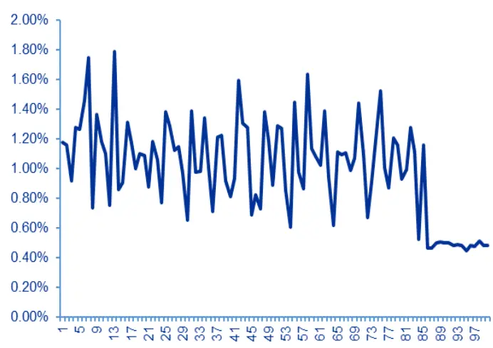
资料来源：Wind，申万宏源研究

图 19：上证红利的市值与权重关系较为一致
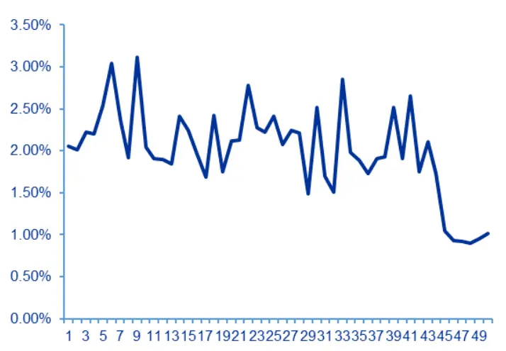
资料来源：Wind，申万宏源研究

考虑到红利指数里行业以银行、煤炭等金融周期行业较多，而这些行业尤其是银行的 PE 不具备可参考性，于是我们按照相同的处理方式，对 PB 也进行了修正，得到如下两图：

图 20：中证红利的修正市净率数据

图 21：上证红利的修正市净率

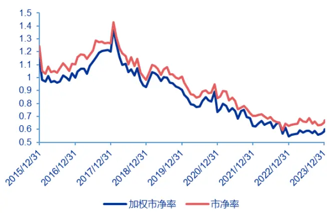
资料来源：Wind，申万宏源研究

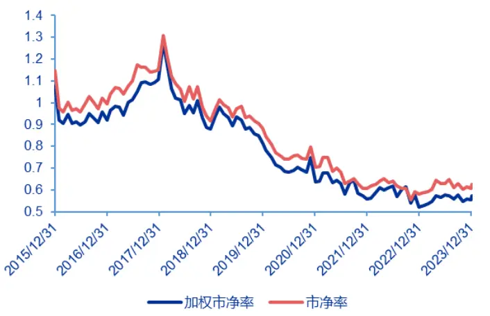
资料来源：Wind，申万宏源研究

从 PB 的修正来看，加权后的 PB 整体都比市值 PB 要更低一些。整体 PB 都处于近年来极低的水平，从估值角度来看，虽然在历史上难以提供估值周期的择时效果，但一定程度上提供了安全边际。

正如上文所述，由于周期性行业的盈利波动较大，使得 PE 的可参考性变弱，到底红利指数整体的盈利有没有具备强周期性，我们把两只红利指数的历史总盈利情况和其中重要的周期性行业——煤炭和交运的盈利波动情况展示如下图所示：

红利指数整体的盈利保持了稳步增长的特征，整体波动和周期特征并没有很明显，相比而言，煤炭和交运的盈利波动较大，且近期的盈利都处于历史的相对高点。

图 22：中证和上证红利指数的总盈利情况
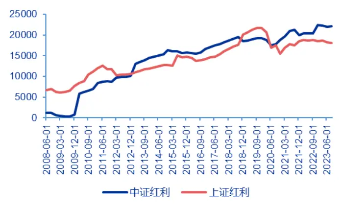
资料来源：Wind，申万宏源研究

图 23：煤炭和交运行业的历史盈利波动情况
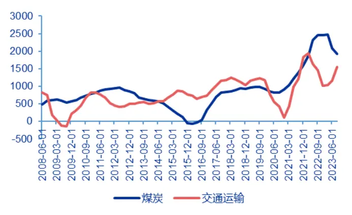
资料来源：Wind，申万宏源研究

由于近期红利指数成分股部分涨幅较快，市场较为关注后续的走势是否分化以及红利指数本身的估值特征，我们将成分股数量较多的中证红利指数里，过去一年涨幅较多的30%的股票的平均估值水平和当前股息率较高的 30%的股票的平均估值水平以及与指数本身的估值水平比较。

图 24：涨幅较多和股息率较高的成分股估值水平平均 图 25：涨幅较多和股息率较高的成分股估值水平中位数数

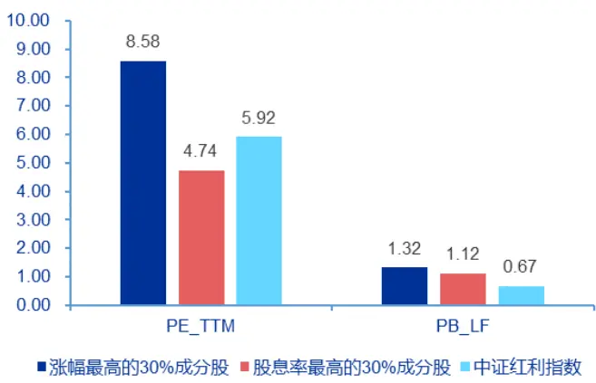
资料来源：Wind，申万宏源研究

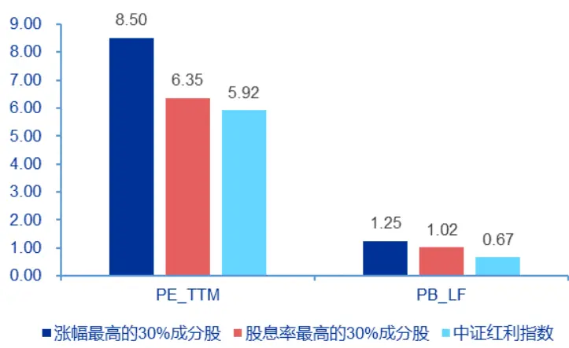
资料来源：Wind，申万宏源研究

从结果来看，涨幅更多的成分股整体估值有所上升，而平均 8 倍的 PE 几乎已经是近年来红利指数的估值高位水平了，反而是股息率较高的成分股平均估值要低于指数，但 PE 中位数和 PB 都略高于指数。如果市场继续追捧高股息品种，前期涨幅较多的成分股可能有一定的估值压力。

综合来看，由于红利指数历史的估值未呈现周期性特征，而是长期持续下行，当前的估值提供的信息有限，导致估值并不能有效的提供买入时点的判断，加上部分周期性红利的盈利高点也会导致估值数据较低，使得我们认为估值无法对当前红利指数投资性价比提供直接建议，但较低的估值水平始终代表着一定的安全边际，从安全边际的角度更建议看具体标的的估值特征。

## 3. 如何看待红利指数当前的股息率？

如果估值更多代表了指数的安全边际，代表接下来投资高股息策略会面临的可能风险，则股息率更大程度上代表投资高股息策略可以获得的股息收益，如前文的收益分解所示，估值的波动相对不可预知，只能尽可能的寻找相对较低的位置，而股息率的贡献则是实实在在过去几年稳定增长的。

类似于估值的是，由于股息率的计算涉及到总市值，因此股价的波动也会影响股息率的高低，我们在股价较低时买入较高股息率的红利指数，也是一个去观察投资性价比的方式。

下图我们展示了中证红利指数的股息率和全收益指数的走势，可以看到，股价和股息率呈现出较为明显的反向特征，指数的上涨会明显导致股息率下降，指数的下跌也会明显导致股息率上升，但整体而言，股息率直接用于指数点位的判断也有难度，原因是：

首先，股息率在长期是整体上升的，虽然短期股息率被股价波动影响，但拉长来看股息率趋势性上行，使得单纯依据绝对股息率来判断投资性价比难以实现。第二，股息率的计算方式导致其不够平稳，波动较大也影响了判断。

图26：但看红利指数的市盈率数据无法提供有效的性价比信息

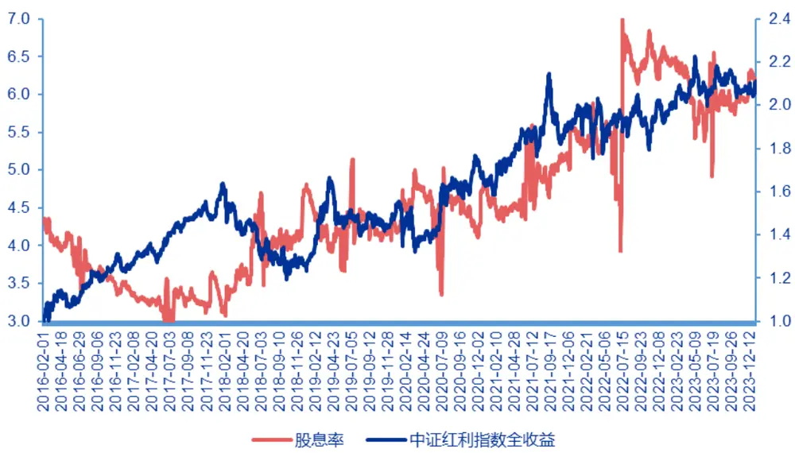
资料来源：Wind，申万宏源研究，数据区间为 2015/12/31-2023/12/31
因此接下来我们逐步对股息率的考察方式进行修正。

首先，我们发现股息率的计算方式同样是采用了总市值的计算方式，即总分红金额除以总市值，而红利指数的非市值加权特征可能对高股息但市值不够高的公司有影响，因此，我们把分红和总市值按指数权重进行调整，得到修正后的股息率数据：

图 27：中证红利的修正股息率数据
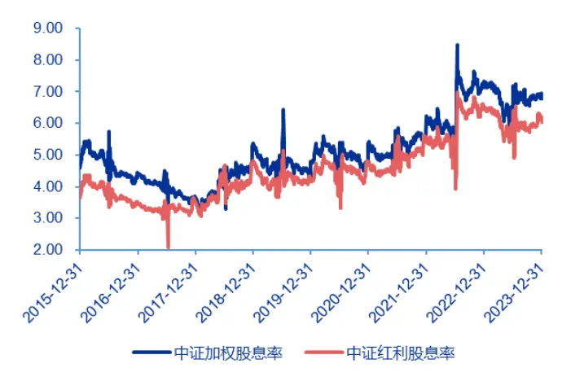
资料来源：Wind，申万宏源研究

图28：上证红利的修正股息率数据
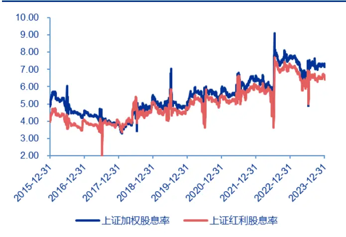
资料来源：Wind，申万宏源研究

如上图所示，修正后的股息率走势与原股息率数据走势基本一致，仍然具有较多“毛刺”，但由于加权后放大了权重股的分红影响，使得修正后的股息率整体都有所上升。

于是接下来我们考察股息率本身的计算方式，进行下一步改进。我们发现，出现较多“毛刺”的原因和股息率的计算方式有关，股息率的计算考察过去一年的总股息与总市值的比率，如 7 月集中分红的时间短期分红大幅提升，过去一年的分红会快速升，而随着这个日期过去一年，又会导致该数据大幅下降，集中分红日期或一次性大幅度分红的日期的波动导致了股息率的较大幅度“跳动”。

为了平滑该数据，我们将过去三年累计的股息加总计算，这样的结果一定程度上缓和了短期分红变化的影响，但缺点是由于过去分红持续的上升，看过去三年的股息率一定程度上低估了当前的股息：

图29：中证红利全收益指数和三年加权股息率的走势
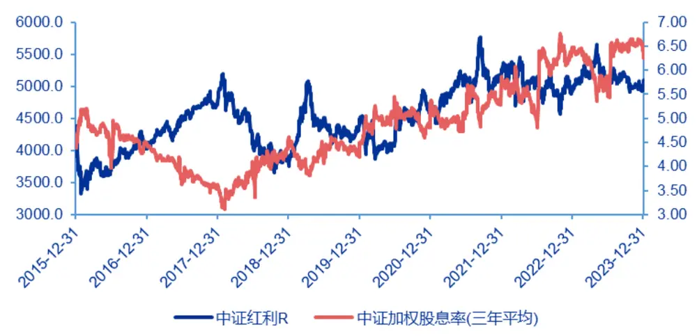
资料来源：Wind，申万宏源研究，数据区间为 2015/12/31-2023/12/31

图30：上证红利全收益指数和三年加权股息率的走势
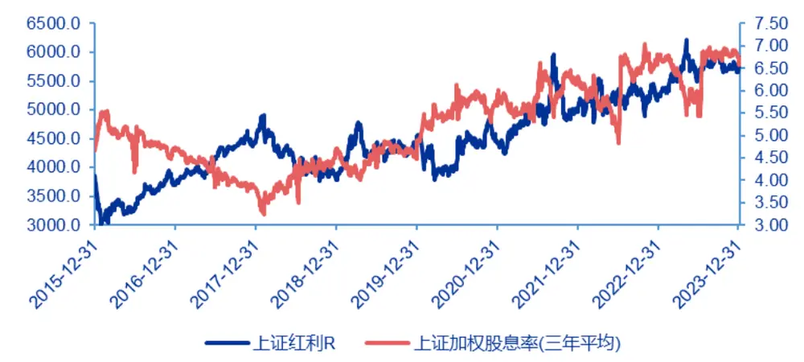
资料来源：Wind，申万宏源研究，数据区间为 2015/12/31-2023/12/31

另外一个去考察的是历史股息率能否对未来的股息水平有参考价值，我们假设知道未来一年的分红数据，根据当前市值信息，计算加权后的未来一年股息率，作为和当前历史股息率的比较。

如下图所示，由于分红整体来说较为稳定，保持了稳定的增长，因此股息率的波动在大趋势上受股价波动较大，所以历史股息率的走势和未来一年股息率的走势在大的趋势上保持一致，因为我们使用历史股息率代表我们对未来股息率的期望水平也是合理的。

图 31：中证红利历史股息率和未来股息率的比较
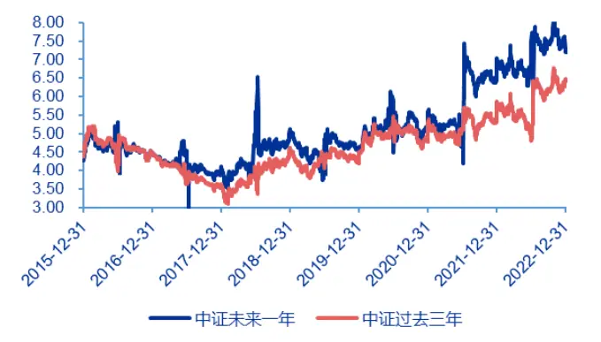
资料来源：Wind，申万宏源研究

图32：上证红利历史股息率和未来股息率的比较
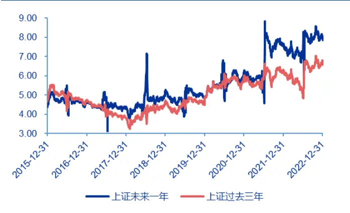
资料来源：Wind，申万宏源研究

接下来，我们尝试是否可以参考股息率为红利指数投资的性价比提供参考，我们以平滑后的加权股息率作为择时基准，将其进行处理：首先，从历史数据上来看，历史上的股息率保持了一个稳定上升的趋势，我们假设这个趋势保持不变，刻画出一条趋势曲线，然后以上下 0.7 倍标准差作为上下双轨，建立起我们买卖的建议时点。

然后根据高股息代表投资性价比更高的逻辑，我们在曲线突破上轨时作为买入时点，曲线突破下轨时作为卖出时点，设计策略和观察买卖时点前后的红利指数走势。

图33：中证红利指数加权股息率的趋势和上下0.7倍标准差走势
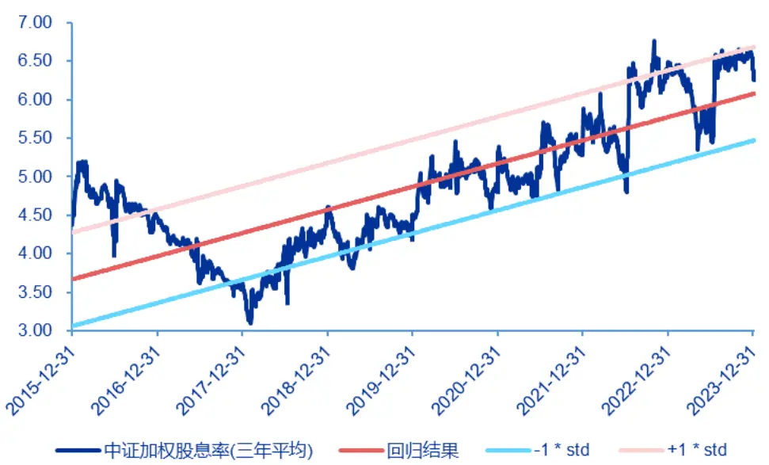
资料来源：Wind，申万宏源研究，数据区间为 2015/12/31-2023/12/31

如下图所示，从中证红利全收益指数的绝对收益走势来看，红色的买入时点和蓝色的卖出时点都会集中在一段区域内反复出现，无论是 16 年的买入时点还是近两年的买入时点都较为准确，集中在 2018-2019 年的卖出时点也都有一定幅度的下滑，只是每一次买卖时点的提示对应的行情长度并不一致，难以构建单纯的择时策略，而且在红利指数跟随整个市场一起上涨的 2020-2021 年，并没有任何时点提示，操作很可能还停留在卖出状态。

图34：根据股息率走势得到的红利指数买卖时点
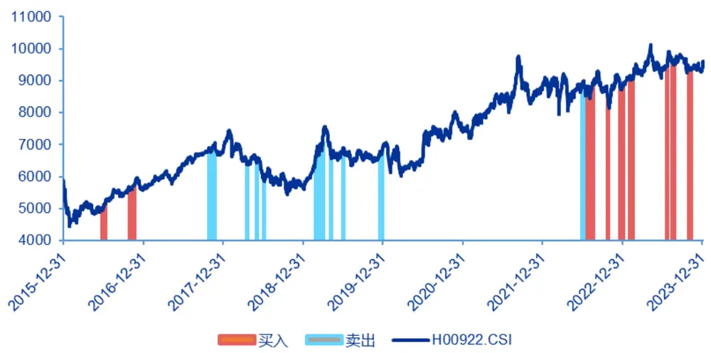
资料来源：Wind，申万宏源研究，数据区间为 2015/12/31-2023/12/31

于是接下来，我们将绝对收益改为考察相对收益，即计算中证红利全收益指数相比主动偏股基金指数的超额收益，然后以股息率作为判断何时相比主动权益投资更适合配置红利的买卖时点判断。

图35：中证红利指数加权股息率的趋势和上下 0.7倍标准差走势
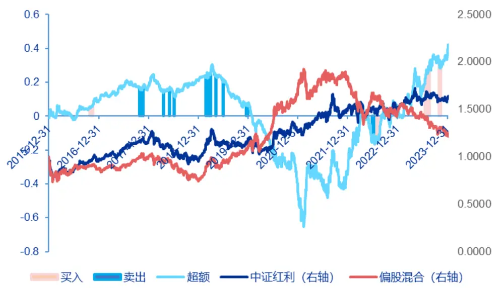
资料来源：Wind，申万宏源研究，数据区间为 2015/12/31-2023/12/31

如上图所示，从相对结果来看，买卖时点的把握更为精准，比直接对红利指数的择时效果更好，近两年也在较高的股息率情况下持续给出了买入信号。

综合来看，本章也是从非市值加权的角度出发，对股息率进行了一系列的修正和改进，然后尝试以股息率的高低来判断红利指数投资的性价比和买卖时点的把握，最终发现，股息率对红利指数的投资性价比有一定的参考意义，其参考意义更适用于考察红利指数相比主动权益投资的性价比。

## 4. 小结

本文以中证红利、上证红利等红利指数出发，以指数的收益拆解来观察近年来红利指数良好的表现来源，一方面，稳定且持续增长的股息确实为红利指数贡献着相当的收益，但 2023 年的收益更多部分也是来自估值的贡献。

然后红利指数由于使用股息率进行选股和加权，使得指数的策略特征较强，理论上股价涨上来的权重股会因为股息率下降而权重降低，股价较低的成分股会因为股息率上升而权重上升，整体使得指数有一定的策略性和交易贡献，但根据我们对近两年数据的测算，发现红利指数的选股和交易贡献较低，每次调仓股息率的上升也较为有限。

本文还针对当前红利投资的性价比问题，去考察估值和股息率两个维度。结果发现，首先，无论是估值还是股息率，都需要重新修正计算，本质原因是因为红利指数以股息率加权，非市值加权的属性使得传统的指数估值计算方法不够准确，因此本文用红利指数的权重进行修正，得到了加权估值和加权股息率数据。

目前来看估值对红利投资性价比判断提供的信息有限，但能够提供安全边际的参考。主要的原因是红利指数历史上的估值呈现长期下行，估值没有呈现周期性走势，使得通过估值进行择时判断较为困难。另外一方面的原因是因为部分高股息行业如煤炭、交运等盈利波动较大。

我们发现修正且调整后的股息率对红利投资的性价比有一定的参考意义。我们对股息率进行了平滑处理，考察了历史股息率对未来股息的预测性，以分红稳定增长作为假设，建立了当前分红趋势上下 0.7 倍标准差的上下轨买卖时点，结果发现，高股息率买入低股息率卖出的买卖时点的给出，对判断红利投资性价比有一定的指示意义，且在用于考察红利相比主动权益投资的性价比时更加有效。

## 5. 风险提示

风险提示：模型根据历史数据构建，历史表现不代表未来，市场环境发生重大变化时可能失效。

## 信息披露

## 证券分析师承诺

本报告署名分析师具有中国证券业协会授予的证券投资咨询执业资格并注册为证券分析师，以勤勉的职业态度、专业审慎的研究方法，使用合法合规的信息，独立、客观地出具本报告,并对本报告的内容和观点负责。本人不曾因，不因，也将不会因本报告中的具体推荐意见或观点而直接或间接收到任何形式的补偿。

## 与公司有关的信息披露

本公司隶属于申万宏源证券有限公司。本公司经中国证券监督管理委员会核准，取得证券投资咨询业务许可。本公司关联机构在法律许可情况下可能持有或交易本报告提到的投资标的，还可能为或争取为这些标的提供投资银行服务。本公司在知晓范围内依法合规地履行披露义务。客户可通过 compliance@swsresearch.com 索取有关披露资料或登录www.swsresearch.com 信息披露栏目查询从业人员资质情况、静默期安排及其他有关的信息披露。

## 机构销售团队联系人

华东 A 组茅炯021-33388488 maojiong@swhysc.com

liqing3@swhysc.com

华北组肖霞010-66500628 xiaoxia@swhysc.com

华南组李昇0755-82990609 Lisheng5@swhysc.com

## 法律声明

本报告仅供上海申银万国证券研究所有限公司（以下简称“本公司”）的客户使用。本公司不会因接收人收到本报告而视其为客户。客户应当认识到有关本报告的短信提示、电话推荐等只是研究观点的简要沟通，需以本公司http://www.swsresearch.com 网站刊载的完整报告为准，本公司并接受客户的后续问询。本报告首页列示的联系人，除非另有说明，仅作为本公司就本报告与客户的联络人，承担联络工作，不从事任何证券投资咨询服务业务。

本报告是基于已公开信息撰写，但本公司不保证该等信息的准确性或完整性。本报告所载的资料、工具、意见及推测只提供给客户作参考之用，并非作为或被视为出售或购买证券或其他投资标的的邀请或向人作出邀请。本报告所载的资料、意见及推测仅反映本公司于发布本报告当日的判断，本报告所指的证券或投资标的的价格、价值及投资收入可能会波动。在不同时期，本公司可发出与本报告所载资料、意见及推测不一致的报告。

客户应当考虑到本公司可能存在可能影响本报告客观性的利益冲突，不应视本报告为作出投资决策的惟一因素。客户应自主作出投资决策并自行承担投资风险。本公司特别提示,本公司不会与任何客户以任何形式分享证券投资收益或分担证券投资损失，任何形式的分享证券投资收益或者分担证券投资损失的书面或口头承诺均为无效。本报告中所指的投资及服务可能不适合个别客户，不构成客户私人咨询建议。本公司未确保本报告充分考虑到个别客户特殊的投资目标、财务状况或需要。本公司建议客户应考虑本报告的任何意见或建议是否符合其特定状况，以及（若有必要）咨询独立投资顾问。在任何情况下，本报告中的信息或所表述的意见并不构成对任何人的投资建议。在任何情况下，本公司不对任何人因使用本报告中的任何内容所引致的任何损失负任何责任。市场有风险，投资需谨慎。若本报告的接收人非本公司的客户，应在基于本报告作出任何投资决定或就本报告要求任何解释前咨询独立投资顾问。

本报告的版权归本公司所有，属于非公开资料。本公司对本报告保留一切权利。除非另有书面显示，否则本报告中的所有材料的版权均属本公司。未经本公司事先书面授权，本报告的任何部分均不得以任何方式制作任何形式的拷贝、复印件或复制品，或再次分发给任何其他人，或以任何侵犯本公司版权的其他方式使用。所有本报告中使用的商标、服务标记及标记均为本公司的商标、服务标记及标记。