# 红利产品策略复盘：从投资者参与热度到红利基金风格分析

## ——红利策略全攻略系列之三

## 相关研究

## 证券分析师

蒋辛 A0230521080002

jiangxin@swsresearch.com

邓虎 A0230520070003

denghu@swsresearch.com

奚佳诚 A0230523070004

xijc@swsresearch.com

## 研究支持

肖逸芳 A0230122100008

xiaoyf@swsresearch.com

白皓天 A0230123070002

baiht@swsresearch.com

## 联系人

蒋辛

(8621)23297818×

jiangxin@swsresearch.com

## 本期投资提示：

⚫红利指数的收益拆分：指数编制的核心差异主要体现在：筛选关键指标不同：包括股息率、波动、质量因子等；选样核心逻辑存在差异；加权方式存在差异：股息率加权/自由流通市值加权。收益拆分：股息为中证红利指数贡献了最主要的收益，盈利贡献其次，而长期以来估值贡献累计为负；2023 年煤炭收益贡献虽多，但不及近期峰值；红利相对表现与国际宏观环境（美债十年期收益率刻画）、市场景气度、市场估值水平高度相关。

⚫红利风格目前的拥挤度：市场关注度：收益表现上红利风格也已持续占优，主要原因是由于权益市场整体下行，抗跌性带来关注，但公募持仓占比不高，市场对红利风格的关注度提升有限；投资性价比：红利风格指数均未出现明显估值提升，股息率较宽基指数有明显优势，且近期处于高点，优势依然显著；红利风格 ETF：2023 年红利风格 ETF 产品的规模稳步上升，规模提升幅度领先于 300、500ETF 产品，红利风格 ETF 产品较受欢迎。

⚫红利股票的投资者结构分析：红利股票的投资者类型：当前红利股票的前十大流通股东以企业为主，其次是一系列带有国家或金融市场工具属性的持有人；以资产增值为主要投资目的的流通股东中，保险公司、社保基金、公募基金公司等机构持有金额相对靠前；保险公司的红利类 ETF 持有金额逐年提升，截至 2023 年中报持有规模仅次于联接基金；保险机构诉求拆解：1）IFRS9 的会计准则改革使得保险公司更倾向于配置低波动、高分红型股票；2）险资“负债性、长期性和稳定性”的资金属性使得保险公司在投资中需要满足期限匹配、收益覆盖和稳健安全的三大原则。

⚫红利基金的投资策略：指数基金：整体看引入低波因子的红利类指数会更出色；红利类指数增强基金做超额的难度较高：目前仅有 4 只红利类指数增强基金，四只产品所跟踪的指数均不一样，但都难以做出较高超额。主动权益基金：少有产品稳定跑赢红利全收益指数：以近一年收益率靠前的 15 只红利类主动权益基金为例，目前黄海、鲍无可、刘榕俊以及杨思亮四位基金经理所管理的产品表现较为出色；高股息率主动权益基金也并不代表高收益；不同基金经理在风格、标签、因子暴露与持股左右侧倾向上的差异也较为明显，整体看偏左侧的基金经理业绩更优。

⚫风险揭示与声明：本报告数据均来自公开信息，不涉及对未来走势的预测，相关模型构建与测算均基于申万宏源研究客观研究，可能存在模型失效等风险。本报告不涉及基金评价业务，不涉及对基金公司、基金经理、基金产品的推荐。阅读本报告时，投资者需结合自身风险偏好及风险承受能力，充分理解基金产品波动、基金经理个人长期投资风格、历史业绩、选股能力、风险偏好等因素，对基金业绩可能造成的影响。报告内容仅供参考，投资者需特别关注官方基金披露信息。

## 1. 红利指数的收益拆分：除股息外，收益还受哪些因素影响？

## 1.1代表性红利指数对比

作为经典的投资策略，红利策略一直以来都广受投资者关注，指数公司也相应设定了种类繁多、编制方式各异的红利指数，以供投资者参考。目前，市场上的红利指数已超过 50 只，其中既有中证红利、国证红利的纯粹的红利策略指数，也有红利低波等附加策略的指数。

我们筛选出部分跟踪基金较多、或差异化较高的红利指数，以分析指数编制方法的差异。总结来看，各种红利指数都会使用“现金股息率”这一核心指标进行计算。现金股息率，是指个股一年的现金分红总额与总市值的比例，这一指标可以进一步拆解为“现金分红比例”（现金分红总额/净利润）与“市盈率倒数”（净利润/总市值）两个部分。在筛选高现金股息率股票时，会同时筛选现金分红比例较高，且估值偏低、市盈率倒数较高的公司。

此外，指数通常会对现金分红比例、日度成交金额与日均总市值做出限制。其中现金分红比例的作用在于筛出异常高分红、具有转移公司资产倾向的异常公司。这些公司往往会分出超过净利润总额的红利，现金分红比例也因此高于 1，指数也往往会事先剔除这类异常公司。而日均成交金额、日均总市值则为了筛选成交活跃、股价参考性较高的公司，这类公司更适合作为指数成分股来长期跟踪。

除了相似的部分之外，各红利指数的编制方法上也有些许不同，总结来看，指数间的核心差异主要体现在以下几个方面：

1）筛选关键指标不同：纯粹红利策略指数往往使用“过去三年平均现金股息率”筛选股票，而红利低波等多策略混合指数的指标更加多样，例如红利低波 100 采用“分红总额/总市值”的方式计算、东方红红利低波采用“股利支付率/市盈率”的方式计算。此外，多策略混合指数也会使用其他指标精选个股，例如红利低波 100 采用过去一年波动率确定最终的股票组合。

2）选样核心逻辑存在差异：纯粹红利策略指数通常直接选取股息靠前的股票；而多策略混合红利指数一般采用两步走的方式，先依靠股息率选出股票池、再根据策略属性额外选取股票，而指数的差异往往就在股票池选取的数量上。例如，红利低波指数先筛选出股息率靠前的75只股票，再通过波动率精选出波动最小的50只股票，可简称为“先 75，后 50”；相比之下，红利低波 100 则是“先 300，后 100”、东方红红利低波动则是“先 40%，后 100”等。

3）加权方式存在差异：大多数红利指数采用股息率加权的方式构建组合，但也有少数指数存异：红利低波 100 采用“股息率/过去一年波动率”加权、东方红红利低波指数采用“预期股息率”（过去三年股利支付率均值/市盈率）加权、国证系列指数采用“自由流通市值”加权等。

表1：红利指数编制方式对比

| 指数简称 | 成分股 数量 | 筛选的关键指标 | 选样逻辑核心差异 | 加权方法 |
| --- | --- | --- | --- | --- |
| 中证红利指数 | 100 | 过去三年平均现金股息率 | 直接选取股息率靠前的100只股票 | 股息率加权 |
| 上证红利指数 | 50 | 上证180成分股、过去三年平均现金 股息率 | 直接选取股息率靠前的 50 只股票 | 股息率加权 |
| 中证红利低波动指数 | 50 | 过去三年的平均税后现金股息率& 过去一年的波动率 | 依靠股息率筛选 75 只股票，后按波 动排名确定 50 只成分股 | 股息率加权 |
| 中证红利低波动100 指数 | 100 | 过去三个会计年度分红总额/(3*调整 日总市值) | 依靠股息率筛选300只股票，后按波 动排名确定100 只成分股 | 股息率/过去一年波动率 加权 |
| 中证国有企业红利指 数 | 100 | 实际控制人属性，过去三年平均现金 股息率 | 直接选取股息率靠前的100 只股票 | 股息率加权 |
| 中证东方红红利低波 动指数 | 100 | 过去三年股利支付率均值/市盈率（预 期股息率)&过去五年周收益率的标 准差 | 依靠股息率筛选前40%股票，后按波 动排名确定100 只成分股 | 预期股息率加权 |
| 中证主要消费红利指 数 | 50 | 中证行业分类属性&去三年平均现 金股息率 过去三年的平均现金股息率；分行业 | 直接选取股息率靠前的对应 50 只股 票 | 股息率加权 |
| 中证港股通高股息精 选指数 | 30 | 按照质量因子指标（ROA、净利润增 长等四个指标加权得到) | 依靠股息率筛选前70%股票，后按质 量因子确定30只成分股 | 股息率加权 |
| 恒生港股通 高股息率指数 | 50 | 过去三年平均净股息率 (即除税后的股息率) | 直接选取净股息率靠前的 50 只股票 | 净股息率加权 |
| 国证红利指数 | 50 | 前三年累计分红金额占整个市场上市 公司证券分红的比重、最近半年日均 成交金额占市场比重 | 按两指标的加权排名，筛选靠前的50 只股票 | 自由流通市值加权 |

资料来源：指数官网，申万宏源研究；资料截止：2024/1/12

2023 年内，几只红利低波指数的收益表现最为突出，不过，并不是每年红利低波指数都能获得突出业绩。例如 2019 年内普通红利指数更加占优，2017 年港股通红利、国证红利占优等。此外，部分红利指数的年度表现也有分歧，分歧最大的年份分别为 2017、2020、2022 年，这几年内消费红利、港股通红利与国证红利的收益表现与其他红利指数差异较大。（数据来源：iFinD）

表2：红利指数年度收益对比（使用全收益指数数据）
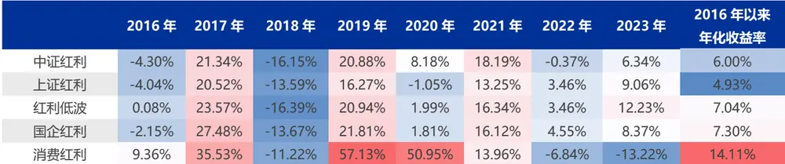
资料来源：iFinD，申万宏源研究；数据区间：2015/12/31~2023/12/31

从最大回撤上看，红利指数与红利低波指数的年度表现互有优劣，低波指数并不直接代表着指数在回撤表现上更加突出，例如 2022 年，红利低波的表现普遍弱于中证红利指数。不过，几只中证 A股红利指数的最大回撤表现整体相似，而国证红利、港股通红利指数的回撤表现则有较大差异。

表3：红利指数最大回撤对比（使用全收益指数数据）

| 最大回撤率 | 2016年 | 2017年 | 2018年 | 2019年 | 2020年 | 2021年 | 2022年 | 2023年 | 全期数据 |
| --- | --- | --- | --- | --- | --- | --- | --- | --- | --- |
| 中证红利 | -23.87% | -6.63% | -27.08% | -16.24% | -14.93% | -15.25% | -12.63% | -10.31% | -27.08% |
| 上证红利 | -22.23% | -6.04% | -23.39% | -13.97% | -17.12% | -19.21% | -12.26% | -11.78% | -23.39% |
| 红利低波 | -20.57% | -5.63% | -27.53% | -12.64% | -17.54% | -16.92% | -13.54% | -12.33% | -27.53% |
| 国企红利 | -20.19% | -5.80% | -26.79% | -16.54% | -17.54% | -18.94% | -12.46% | -12.08% | -26.79% |
| 消费红利 | -23.05% | -8.75% | -27.71% | -7.24% | -15.04% | -18.13% | -19.62% | -22.17% | -27.71% |
| 港股通高息精选 | -15.68% | -7.31% | -28.13% | -18.86% | -30.94% | -15.58% | -38.49% | -16.42% | -43.37% |
| SHS 红利成长 LV | -17.92% | -5.59% | -22.14% | -12.49% | -21.21% | -12.52% | -14.17% | -9.68% | -26.16% |
| 国证红利 | -18.14% | -6.30% | -26.80% | -11.43% | -19.18% | -21.14% | -25.75% | -14.01% | -34.97% |
| 红利低波100 |  |  |  | -13.69% | -15.24% | -10.29% | -12.98% | -9.78% |  |
| 东证红利低波 |  |  |  |  |  |  | -10.24% | -11.19% |  |

资料来源：iFinD，申万宏源研究；数据区间：2015/12/31~2023/12/31

收益与配置方法的差异，最终均可以落实到指数的行业配置上。由于众多指数在2023 年 12 月份调整了成分股配置，此时行业配置与 2023 年收益不相关，提供的信息较少，我们因此使用截至 2023/11/30 的行业配置数据进行分析。从行业配置可见：1）存在红利指数普遍超配、低配的行业：如指数普遍超配银行、低配食品饮料行业等；2）部分行业配置存异，煤炭并非全部红利指数的重要收益来源：从行业配置可见，中证红利、上证红利、国企红利的煤炭配置较高，2023 年下半年业绩表现受影响幅度较大，而红利低波、红利低波 100、东证红利低波则在煤炭的配置比例较低，收益贡献另有来源。（数据来源：iFinD）

表4：红利指数行业配置对比
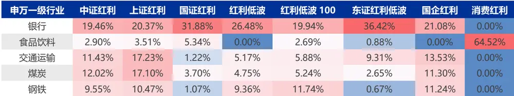
资料来源：iFinD，申万宏源研究；数据截至：2023/11/30

## 1.2收益拆分— 股息、盈利突出，估值长期呈负贡献

在近期红利指数表现较好的情况下，红利指数的收益是否主要来源于股息？盈利在其中贡献如何？针对这一问题，我们使用估值、盈利与股息三方面对中证指数的收益进行拆解，具体方法如下：

1）股息贡献：使用“（1+中证全收益指数收益率）/（1+中证红利收益率）-1”计算

2）估值贡献：取每一年末的中证红利成分股，以申万一级行业做划分。对于非周期行业，使用加权规模净利润TTM 与加权总市值，计算这些成分股的平均市盈率；取该年末与下年末的市盈率数据 $\mathsf{PE}_{\mathsf{T}+1}$ 与 $\mathsf{PE}_{\mathrm{T}}$ ，则估值贡献为 ${}^{\prime\prime}\mathsf{P}\mathsf{E}_{\mathsf{T}^{+}}\mathsf{1}/\mathsf{P}\mathsf{E}_{\mathsf{T}^{-}}\mathsf{1}^{\prime\prime}$ 。对于周期行业，其净利润变化在年间的波动可能较大，我们假设其收益与 GDP 同比例增长变，并由此计算估值贡献 ${}^{\prime\prime}\mathsf{P}\mathsf{E}_{\mathsf{T}^{+}}\mathsf{1}/\mathsf{P}\mathsf{E}_{\mathsf{T}^{-}}\mathsf{1}^{\prime\prime}$ 。对每一行业的估值贡献加权求和，即为估值贡献收益率。

3）盈利贡献：中证指数收益中，超过估值贡献的部分，即 （1+中证指数收益率）/（1+估值贡献收益率） -1

从拆分结果来看，2016 年以来，股息为中证红利指数贡献了最主要的收益，累计收益达 40.36%；盈利贡献其次，累计贡献达 27.97%；而长期以来估值贡献累计为 负 ， 共 造 成 -11.24% 的 亏 损 。 （ 数 据 来 源 ： iFinD ， 数 据 区 间 ：2015/12/31~2023/12/31，累计贡献使用累乘数据）

图 1：中证红利的收益拆分结果
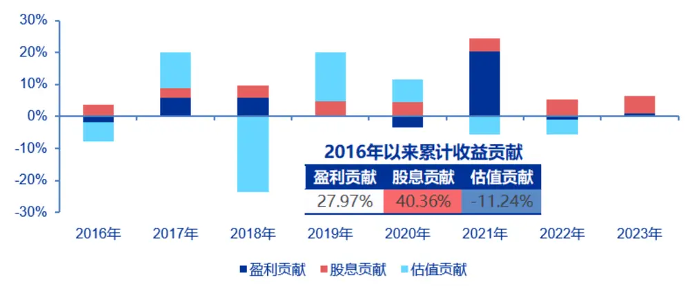
资料来源：iFinD，申万宏源研究；数据区间：2015/12/31~2023/12/31

事实上，长期下股票分红的高贡献率也有迹可循。自 2015 年以来，中证红利的现金分红率长期稳定，而指数的股息率整体呈现上升，股息的收益贡献日益突出，共同构成了红利指数的高额收益。截止 2023/12/31，中证红利的股息率已经达到了6.21%（数据来源：iFinD）

图 2：2018年以来，中证红利指数的股息率整体呈现上升趋势
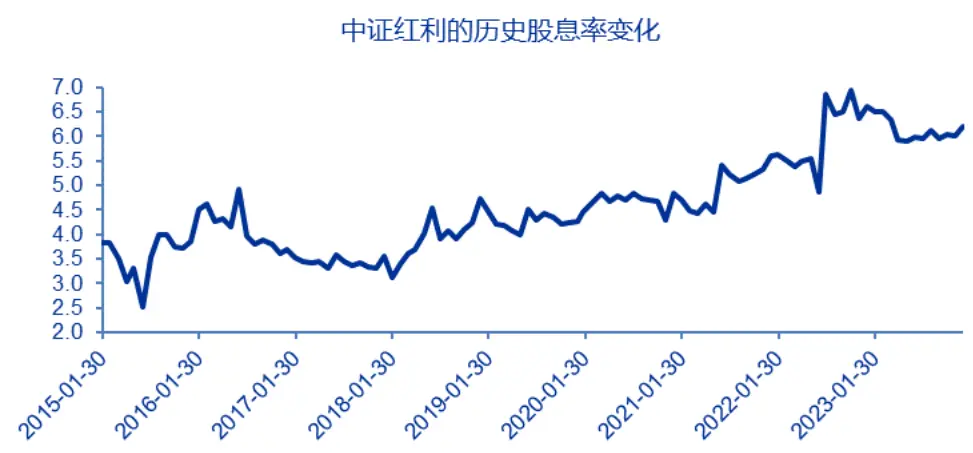
资料来源：iFinD，申万宏源研究；数据区间：2015/12/31~2023/12/31

虽然股息的收益贡献较稳定，但这不代表每一类指数成分股都能贡献稳定的收益。将收益进一步细分至行业后，我们还可以发现一些额外信息：

1）行业贡献区分度较大：2023 年收益贡献突出的行业：煤炭、银行、交通运输等，而房地产、建筑材料贡献显著负收益；

2）煤炭收益贡献虽多，但不及近期峰值：以煤炭为例，事实上 2023 年煤炭的收益贡献不如 2021 年、2022 年；在 2023H2 其他行业收益整体为负时，煤炭的正收益贡献高度突出，行业收益贡献才会被高度关注。相比之下，今年以来银行行业的收益贡献相比往年更加突出

3) 少有行业能够贡献连续正收益：从历史收益拆分来看，中证红利指数的行业收益贡献情况变动较大，少有行业能够连续贡献正收益。不过，这一结论并不代表红利指数的表现差异化较大，事实上在 2016~2018 年间、2021~2023 年间，中证红利指数的表现持续领先 Wind 全 A指数。

表5：2023年中证红利指数的收益拆分

| 2016年 2017年 2018年 |  |  |  | 2019年 | 2020年 | 2021年 | 2022年 | 2023年 | 累计贡献(简单加和) |
| --- | --- | --- | --- | --- | --- | --- | --- | --- | --- |
| 煤炭 | 0.26% | 0.71% | -0.50% | 0.10% | 0.13% | 4.45% | 3.86% | 2.34% | 11.35% |
| 银行 | 0.01% | 4.10% | -1.21% | 2.39% | -0.56% | -0.06% | 0.45% | 2.53% | 7.65% |
| 食品饮料 | 0.48% | 4.62% | -1.27% | 1.29% | 1.30% | 0.34% | -0.35% | 0.11% | 6.53% |
| 建筑材料 | -0.04% | 1.15% | -0.06% | 1.49% | 2.58% | 2.71% | -1.04% | -1.22% | 5.57% |
| 汽车 | 0.64% | 3.81% | -2.52% | 2.57% | 1.33% | 0.58% | -1.05% | -0.13% | 5.20% |
| 有色金属 | 0.00% | 0.00% | 0.00% | 0.08% | 2.20% | 2.49% | 0.00% | 0.00% | 4.77% |
| 基础化工 | -0.10% | -0.10% | -0.29% | 0.80% | 3.17% | 1.31% | -0.12% | -0.51% | 4.14% |
| 家用电器 | 0.33% | 3.02% | -0.91% | 0.31% | 1.20% | 0.12% | -0.23% | 0.12% | 3.95% |
| 交通运输 | -0.44% | 1.47% | -2.08% | 1.51% | -0.93% | 0.73% | 0.86% | 1.37% | 2.49% |
| 钢铁 | 0.39% | 0.22% | -0.44% | 0.94% | -0.70% | 1.56% | -0.36% | 0.46% | 2.08% |
| 电子 | 0.17% | 0.84% | -0.52% | 1.58% | 0.12% | -0.16% | 0.00% | 0.00% | 2.03% |
| 农林牧渔 | 0.00% | -0.03% | 0.00% | 1.77% | 0.00% | 0.00% | 0.00% | 0.00% | 1.73% |
| 机械设备 | -0.58% | 0.03% | -0.75% | 1.82% | 1.11% | 0.67% | -0.89% | 0.21% | 1.61% |
| 医药生物 | -0.02% | 0.44% | -0.13% | 0.09% | 0.16% | 0.49% | 0.28% | 0.04% | 1.35% |
| 传媒 | 0.00% | 0.00% | 0.00% | 0.01% | -0.19% | -0.08% | 0.35% | 1.13% | 1.22% |
| 电力设备 | -0.41% | -0.05% | -0.46% | -0.08% | 1.63% | 0.63% | -0.28% | 0.00% | 0.98% |
| 石油石化 | 0.09% | 0.06% | -0.27% | -0.08% | -0.33% | 0.34% | 0.04% | 0.52% | 0.38% |
| 建筑装饰 | 0.56% | 0.02% | -0.09% | -0.20% | -0.05% | 0.03% | 0.11% | -0.07% | 0.32% |
| 轻工制造 | -0.12% | 0.62% | -0.54% | -0.04% | 0.19% | 0.05% | 0.02% | 0.01% | 0.19% |
| 美容护理 | -0.01% | 0.18% | 0.00% | 0.00% | 0.00% | 0.00% | 0.00% | 0.00% | 0.17% |
| 商贸零售 | -0.44% | 0.04% | 0.14% | -0.01% | -0.27% | 0.88% | -0.20% | -0.11% | 0.04% |
| 环保 | -0.26% | 0.05% | -0.10% | 0.04% | 0.00% | 0.00% | 0.00% | 0.01% | -0.27% |
| 非银金融 | -0.51% | 0.31% | -0.69% | 0.25% | 0.04% | -0.17% | -0.06% | 0.36% | -0.47% |
| 纺织服饰 | -0.87% | -0.57% | -0.95% | 0.44% | -0.68% | 0.05% | -0.56% | 1.22% | -1.92% |
| 公用事业 | -2.72% | -0.94% | -0.82% | 0.34% | -0.03% | 1.22% | -0.20% | 0.45% | -2.70% |
| 房地产 | -0.49% | 1.13% | -1.74% | 3.13% | -1.95% | -0.50% | -0.77% | -2.09% | -3.27% |

资料来源：iFinD，申万宏源研究；数据区间：2015/12/31~2023/12/31

## 1.3 红利占优的市场环境分析

与 Wind 全 A 相比，中证红利指数的相对表现呈周期波动：我们可以将 2016年以来的表现分为三个时段：1）2016~2018 年间：中证红利的相对表现稳定领先，红利收益持续占优；2）2019~2020 年间：中证红利表现偏弱，相对收益持续下滑；3）2021 年以来，中证红利指数的相对表现再次出现上升，但波动与 1）相对较大。

图 3：与 Wind 全 A 相比，仅 2019、2020 年红利表现偏弱
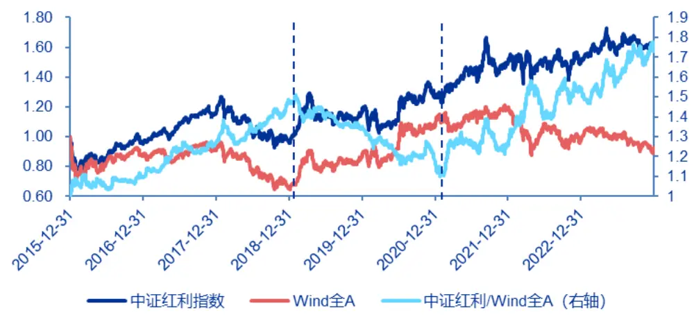
资料来源：Wind，申万宏源研究；数据区间：2015/12/31~2023/12/31

事实上，中证红利的相对表现与美国十年期国债收益率高度相关。2015 年末，美联储宣布加息，这一加息周期一直持续至 2018 年末，随后转向降息；2020 年末，美联储加息再起，最终走势与红利指数呈高度相似的情况。

从这一角度，我们可以认为，中证红利的绩优与国际宏观环境的变动有关。当美联储宣布加息时，海外流动性逐渐转紧、国际间贸易环境趋于恶化，而以红利为代表的股票在长期下具有更加稳健的配置价值，红利指数也因此占优。

图 4：中证红利相对表现与国际宏观环境（美债长期收益率）高度相关
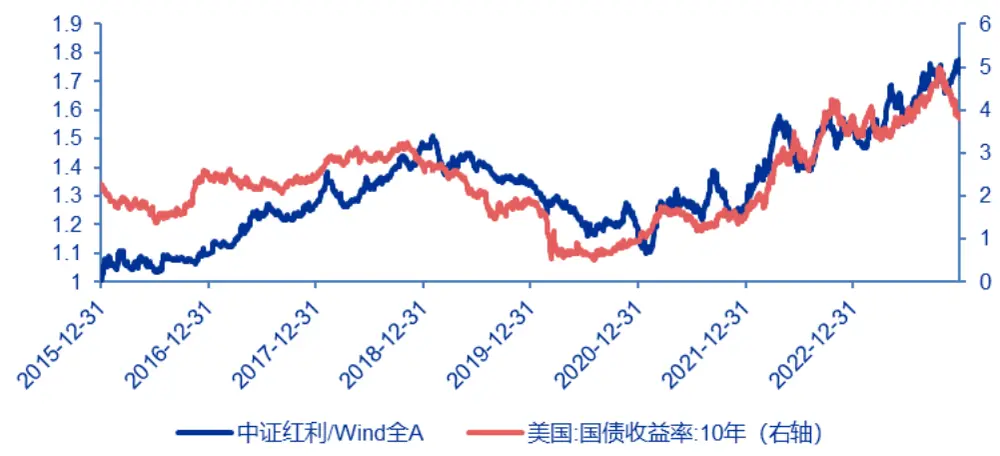
资料来源：Wind，申万宏源研究；数据区间：2015/12/31~2023/12/31

此外，中证红利指数的相对表现与市场整体景气程度负相关：我们按照申万二级行业的维度，统计每一季度末行业的 ROE TTM 自 2010 年以来的分位数，并将 ROETTM 分位数>70%的行业简易统计为高景气度行业。随后分季度统计高景气度行业的占比，以反映市场的整体景气度情况。经过对比，我们可以发现：1）市场景气度与中证红利相对表现呈负相关：当景气度偏低、行业盈利能力整体偏弱时，盈利质量突出的高分红企业具有更优的发展前景，中证红利指数也因此持续占优；2）市场景气度指标存在滞后：财务指标实际是对一段时间内企业经营状况的总结，具有时滞性，而股价、指数点位往往更加及时；从历史数据角度来看，中证红利的相对表现与提前两期的市场景气度相关性更强，红利指数走势在一定程度上与未来半年的市场景气预测情况有关。（数据来源：Wind；注：计算景气度时，仅考虑拥有 4 年以上数据的二级行业）

图 5：中证红利相对表现与高景气行业占比负相关
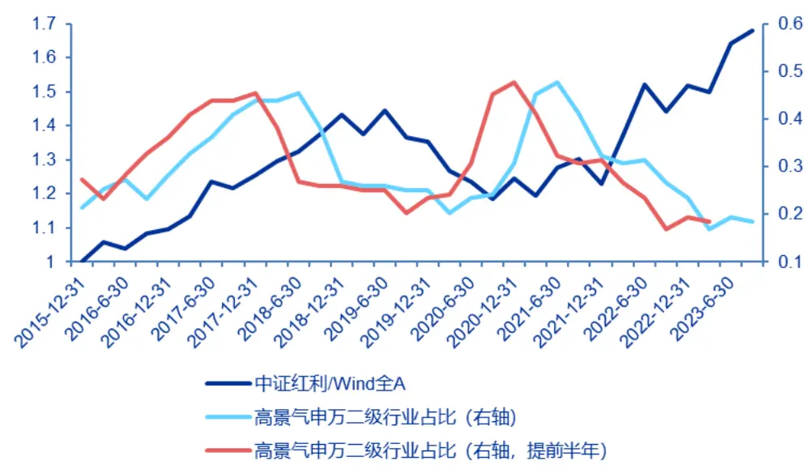
资料来源：Wind，iFinD，申万宏源研究；数据区间：2015/12/31~2023/12/31

最后，市场估值的周期变动也能为我们提供一定的参考。我们统计了 Wind 指数的估值分位数（PE TTM 自 2010/1/1 以来的为分数），并与中证红利指数相对表现的走势进行对比。可见，中证红利相对走势与市场整体估值水平的变动频率较为一致，两曲线均在 2018 年末与 2020 年末出现较大的反转；其中，2019/1/3 市场估值分位数位于 15.8%的低位，市场估值随后反弹、中证红利表现也在同期转弱；而2021/1/21 市场估值位于 95.1%的高位，在随后的估值下滑过程中，中证红利也持续占优。（数据来源：Wind）

图 6：估值提升期，中证红利的相对走势偏弱
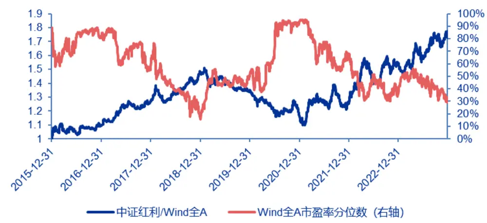
资料来源：Wind，申万宏源研究；数据区间：2015/12/31~2023/12/31

## 2. 红利风格目前的拥挤度如何？

投资者对红利风格当前的拥挤度情况存在疑虑——较高的拥挤度会影响红利类资产潜在的性价比。在对于红利风格拥挤度的刻画上，我们将会从多个角度观察红利风格的当前情况，并综合进行拥挤度的判断。

## 2.1市场关注度：抗跌性带来关注，但公募持仓占比不高

通过各个红利风格指数的成交额占A股比例指标来刻画红利风格的交易活跃度。我们对中证红利、红利指数、红利低波指数、CS 高股息指数等典型的红利风格指数进行测算，可以发现目前而言，红利风格指数的成交较为不活跃，成交额占万得全 A的比例自 2017 年以来一路下行，截至 2023 年 12 月，中证红利指数成交额占万得全 A比例仅不足 4%，处于历史相对低点。

红利风格在近几年并未出现交易活跃的情况，但我们不认为这代表红利风格不具有市场关注度：一方面近期市场交易热点主要集中在小微盘风格，另一方面红利资产本身具有长期持有并通过股息获取收益的投资属性，频繁交易并不是投资者主要进行红利投资的方式。我们更多需要从风格延续时间和公募基金持仓情况等其他角度进行观察。

图7：各个红利指数的近1月成交额占万得全A成交额比例
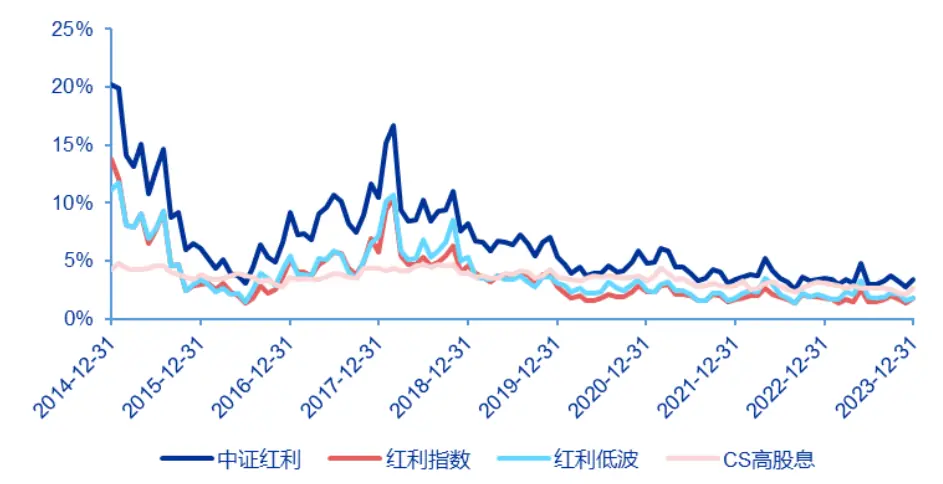
资料来源：wind，申万宏源研究；数据区间 2014/12/31-2023/12/31

## 一、风格占优持续时间：

虽然成交上红利风格并不活跃，但从收益表现上红利风格也已持续占优：我们计算中证红利较万得全 A 指数滚动 1 年的超额收益情况，并由此观察红利风格占优的时间区间。最近一次占优区间的情况来看，红利风格自 21 年底开始占优，至今已延续两年左右时间，延续时间较长，投资者对红利风格的关注应已到达较高的程度。

图 8：中证红利指数较万得全 A指数滚动1年超额收益
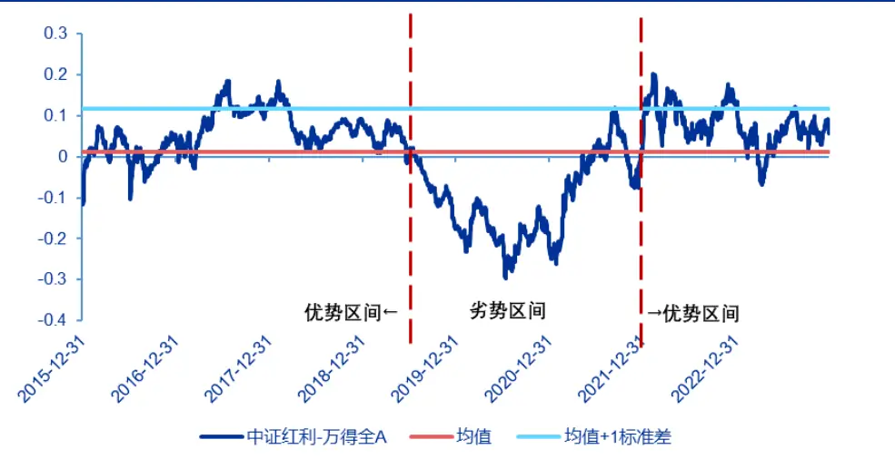
资料来源：wind，申万宏源研究；数据区间 2015/12/31-2023/12/31

红利风格占优，主要原因是由于权益市场整体下行，而非红利风格具有异常高的收益：若关注近几年中证红利指数和万得全A的走势对比来看，中证红利实际在2019年以来走势始终较为稳定。中证红利在 19、20 年上行年中仅涨 15.73%和 3.49%，故表现相对偏弱，而在 22 年下行环境中则仅跌 5.45%，23 年微涨 0.89%，虽收益并不显著，但也较整体明显下行的市场相比具有一定优势。故在近两年的红利占优环境下，红利风格更多体现的是更好的抗跌性。

图 9：中证红利指数 vs 万得全 A 指数
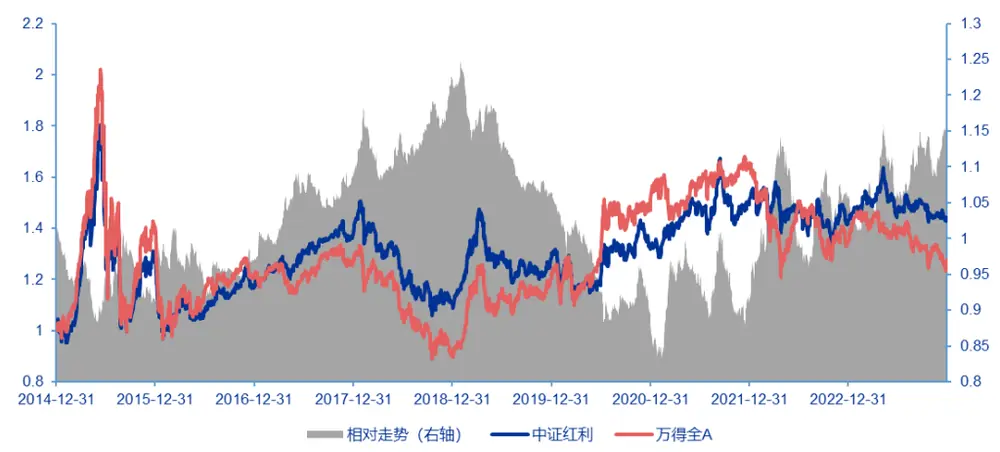
资料来源：wind，申万宏源研究；数据区间 2014/12/31-2023/12/31

## 二、公募基金持仓情况：

我们将多个红利指数成分股的并集定义为红利股：提取中证红利、红利指数、红利低波指数、CS 高股息指数在各期的成分股，并取其并集，观察公募主动权益产品在这些红利股上的持股比例分布和变化情况。

目前主动权益基金相对更偏好房地产、家用电器等行业：对比主动权益基金23H1 全持仓中红利股的分布情况与中证红利指数的对比来看，主动权益在房地产、家用电器、公用事业上超配比例较多，在交通运输、钢铁、银行等行业则低配较多。而个股上，主动权益基金在保利发展、格力电器等个股上的配置比例较高，而在盘江股份、养元饮品等个股上则较中证红利有明显低配。

表 6：主动权益基金持有红利股较中证红利指数的超低配行业和个股

|  | 超配行业/个股 |  |  |  | 低配超配比例 |  |  |  |  |  |  |  |  |  |
| --- | --- | --- | --- | --- | --- | --- | --- | --- | --- | --- | --- | --- | --- | --- |
|  |  |  |  |  |  |  |  |  | 主动权益持仓 | 中证红利指数 | 超配比例 | 行业/个股 | 主动权益持仓 | 中证红利指数 |
| 行业 | 房地产 | 19.06% | 7.07% | 11.99% | 煤炭 | 7.82% | 10.78% | -2.95% |  |  |  |  |  |  |
|  | 家用电器 | 9.36% | 1.82% | 7.54% | 传媒 | 2.02% | 5.19% | -3.17% |  |  |  |  |  |  |
|  | 公用事业 | 11.99% | 4.66% | 7.33% | 银行 | 15.94% | 19.15% | -3.22% |  |  |  |  |  |  |
|  | 建筑装饰 | 5.29% | 0.80% | 4.49% | 钢铁 | 3.26% | 8.87% | -5.60% |  |  |  |  |  |  |
|  | 非银金融 | 3.46% | 1.93% | 1.53% | 交通运输 | 4.90% | 11.48% | -6.58% |  |  |  |  |  |  |
| 个股 |  |  |  | 保利发展 | 12.06% | 0.76% | 11.30% | 君正集团 |  |  |  |  |  |  |
|  |  |  |  | 格力电器 |  |  | 8.01% | 深高速 | 0.04% | 1.15% | -1.11% |  |  |  |
|  |  |  |  | 长江电力 |  |  | 3.64% | 三钢闽光 | 0.01% | 1.22% | -1.20% |  |  |  |
|  |  |  |  | 华电国际 |  |  | 3.08% | 北京银行 | 0.11% | 1.40% | -1.28% |  |  |  |
|  |  |  |  | 江苏银行 |  |  | 2.94% | 南钢股份 | 0.23% | 1.65% | -1.43% |  |  |  |
|  |  |  |  | 中国太保 |  |  | 2.55% | 森马服饰 | 0.11% | 1.60% | -1.48% |  |  |  |
|  |  |  |  | 万科A |  |  | 2.33% | 养元饮品 | 0.10% | 1.64% | -1.53% |  |  |  |
|  |  |  |  | 工商银行3.06%1.26% |  |  | 1.80% | 盘江股份 0.08% 2.27% |  |  | -2.18% |  |  |  |

资料来源：wind，申万宏源研究，数据截至 2023/6/30

集中度上来看，主动权益基金的红利股持仓在个股集中度上较高：主动权益基金偏好的红利股较为集中，前十大个股占比累计已超过 52.0%，显著高于中证红利指数的集中度。而行业上，主动权益的红利股持仓与中证红利指数的集中度较为接近。

图 10：主动权益基金红利股持仓与中证红利指数的个股（左图）、行业（右图）集中度
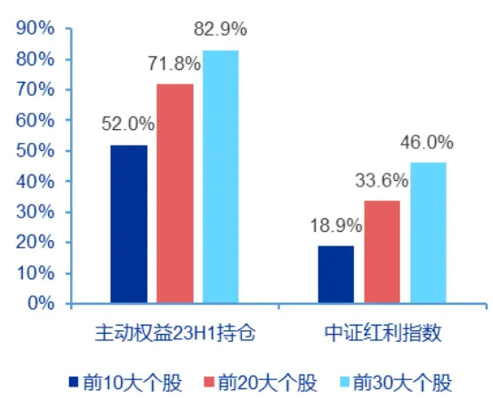
资料来源：wind，申万宏源研究，数据截至 2023/6/30

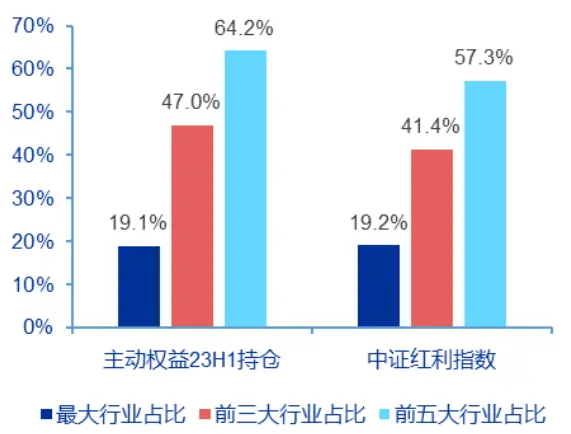

近期持有红利股的主动权益基金并未明显增多：红利股被较多主动权益基金持有的时期是 2017 年至 2019 年，这一阶段约六成的主动权益基金均持有 10%以上的红利风格股票，约四成持有比例超过 20%。而在 2020 年以后，这一比例逐渐下滑，目前持有超 20%红利股的主动权益产品数量占比已不足 5%。

图 11：主动权益基金产品投资红利股的产品数量占比
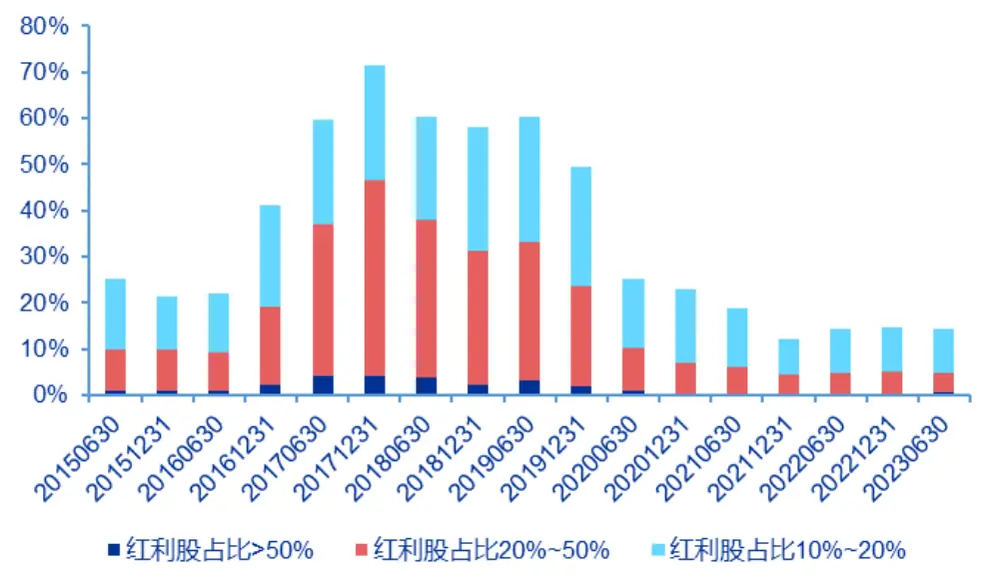
资料来源：wind，申万宏源研究

主动权益基金整体持仓中红利股的占比也并未提升：虽然近期红利策略明显占优，但就主动权益基金而言，其持仓中红利风格的比例也并未出现明显提升，23H1 红利股占全持仓比例仅不足 3.5%，较过去三年的平均水平没有明显变化。

图12：主动权益基金投资于红利股的市值占所有持仓的比例
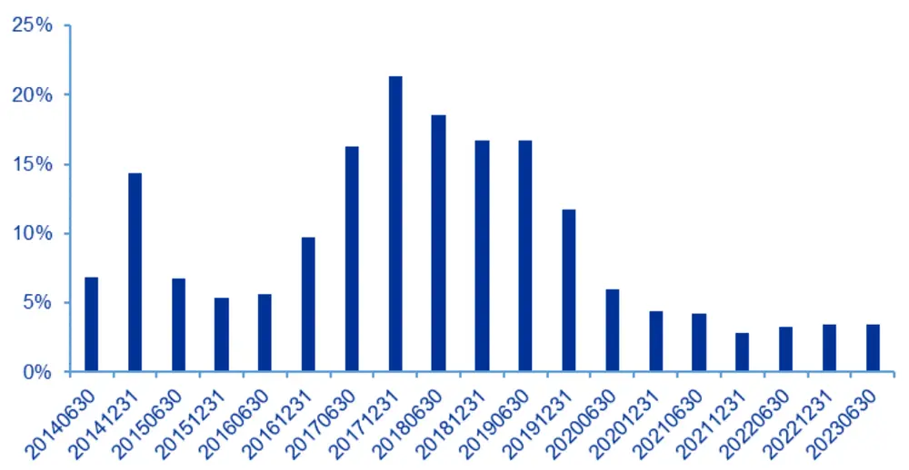
资料来源：wind，申万宏源研究；

总结来看，红利风格整体占优已持续一段时间，关注度应到达相对较高的位置。但由于红利风格不具有异常较高的绝对收益，更多由于其抗跌性在下行市相对占优，加之同期有超额收益更加明显的微盘风格，故红利整体受市场关注度并未显著提升，这点也能从公募基金整体持仓中红利股占比并未显著提升中得到印证。然而，主动权益在红利风格上的持仓有较多集中在少部分个股的情况，这一现象可能需要警惕。

## 2.2 投资性价比：估值整体并未提升，红利风格股息率优势依然显著

红利风格指数均未出现明显估值提升：从近几年中证红利指数的估值变化情况来看，红利风格整体的估值并未出现明显波动。截至 2023 年底，中证红利指数的 PE（TTM）仅 5.88 倍，PB 仅 0.65 倍，分别处于 2017 年以来 18.29 和 9.59 分位数水平，当前估值水平处于低点。

图 13：中证红利指数的 PE（TTM）和PB（LF）月度走势
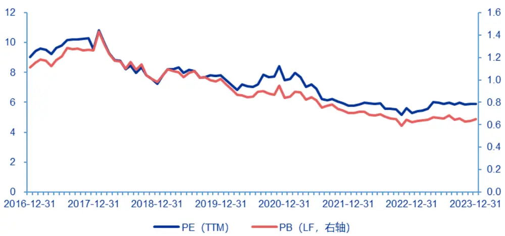
资料来源：wind，申万宏源研究，数据区间 2016/12/31-2023/12/31

中证红利的股息率较宽基指数有明显优势，且近期处于高点：观察中证红利指数的股息率TTM与中证800、万得全A的对比来看，中证红利的股息率明显具有优势。截至 2023 年底的股息率 TTM 达 6.20%，处于 2017 年以来 89.28 分位数，且较中证 800 的 2.85%和万得全 A 的 2.19%有明显优势。

图 14：中证红利指数股息率（TTM）与中证 800、万得全A的对比（单位：%）
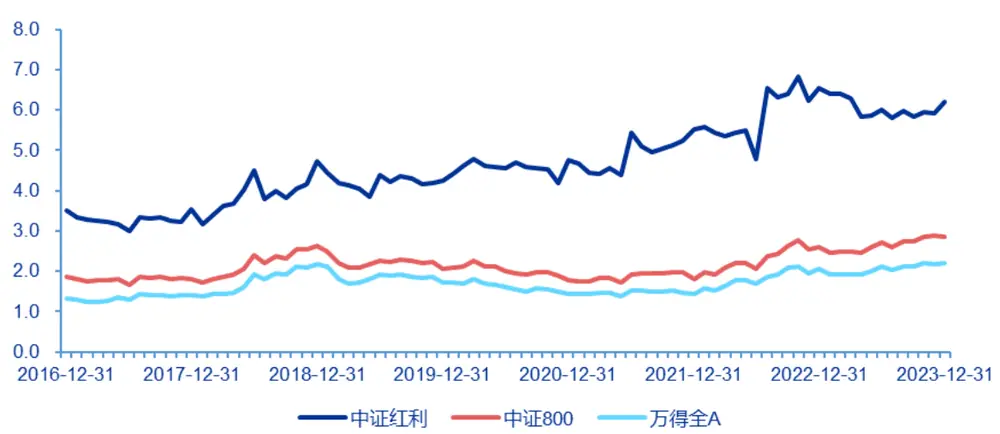
资料来源：wind，申万宏源研究，数据区间 2016/12/31-2023/12/31

此外，我们对主动权益基金重点持有红利股的估值进行观察。

当前主动权益基金重点配置的红利股估值水平处于较低位置：从主动权益基金23Q3 的重仓股数据上来看，重仓比例较高的红利股当前估值处于低位，而估值处于相对高位的红利股普遍被持有比例不高。

Q3 增持的红利股估值水平并未过高：对比 23Q3 与 23Q2 的重仓股情况来看，三季度主动权益基金增持的红利股 PE 分位数分布较为平衡，其中既有当前估值较高的股票，也有估值较低的股票，增持股票并未出现估值过高的情况。

图15：23Q3主动权益基金重仓红利股的估值分位数
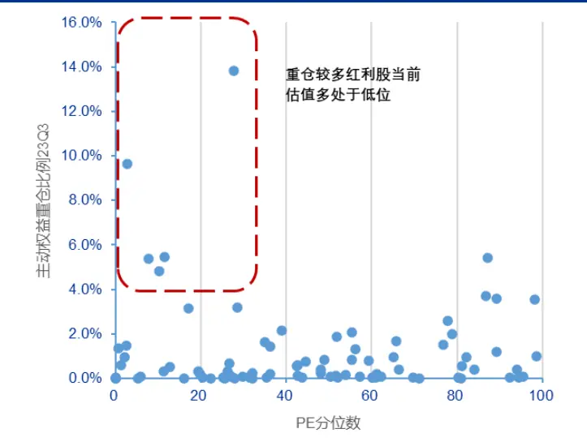
资料来源：wind，申万宏源研究，估值分位数区间2020/1/1-2023/12/31

图 16：23Q3主动权益基金增持红利股的估值分位数
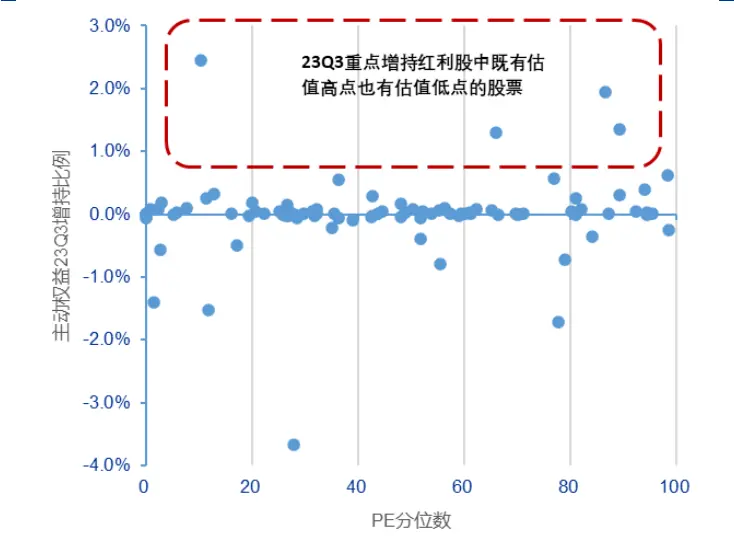
资料来源：wind，申万宏源研究，估值分位数区间2020/1/1-2023/12/31

## 2.3红利风格ETF：规模提升，且幅度超过其他宽基 ETF

我们将跟踪指数及产品名称中带有“红利“、“高股息”字样的 ETF 产品进行提取（不包含港股 ETF），并对这些产品的总规模走势进行了统计。

2023 年红利风格 ETF 产品的规模稳步上升：2023 年初，红利风格 ETF 产品规模合计约 207 亿元，而截至 2023 年底，总规模提升至逾 400 亿元，提升幅度接近一倍。而同期红利风格整体走势并未有明显提升，这也说明大部分规模提升的来源来自于投资者的申购——仅有较少一部分来自于指数本身的收益。

图17：红利风格ETF产品的总规模变化情况
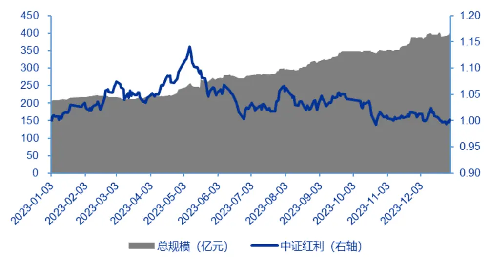
资料来源：wind，申万宏源研究；数据区间 2023/1/3-2023/12/31

红利风格 ETF 的规模提升幅度领先于 300、500ETF 产品：相较于两类宽基 ETF产品，红利风格 ETF 的规模提升路径较沪深 300ETF 更加平滑，且总提升幅度更大。2023 年，沪深 300ETF 总规模提升 74.3%，中证 500ETF 总规模减少 14.7%，而红利风格 ETF 总规模提升超过 93.8%。

图18：各类型 ETF产品各季度末的总规模较年初规模的变化情况
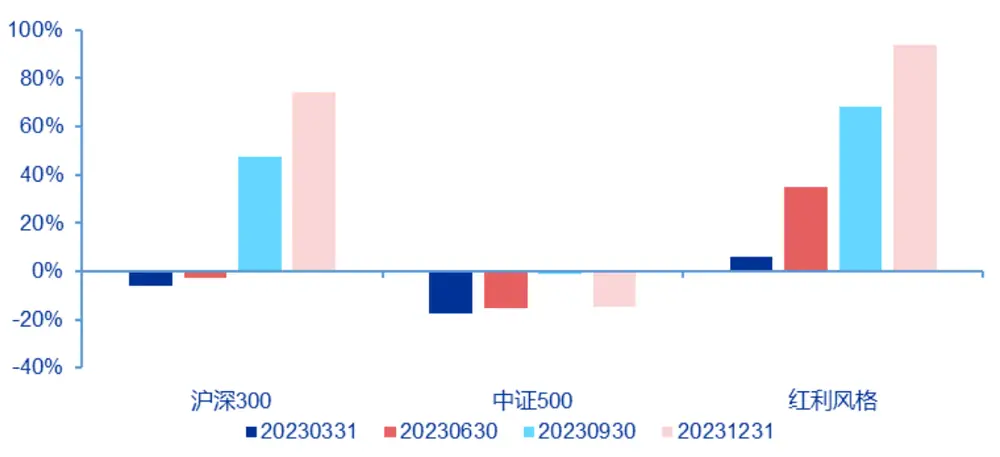
资料来源：wind，申万宏源研究，注：变化比例=季度末总规模/年初总规模比例-1

## 2.4 总结

根据以上红利风格的指标分析，我们初步对红利风格的拥挤度给出以下几点总结：

1）市场对红利风格的关注度提升有限：交易活跃度对红利风格拥挤度的参考意义不大，而从风格表现上来看，虽然红利风格占优行情有所延续，但主要来自于本身的抗跌性叠加市场下行带来的优势，同期也有小微盘风格等其他表现更加占优的风格。从主动权益基金持仓上也能看出，最近几期红利风格并未成为权益基金的配置重点。不过，主动权益在红利风格上的持仓较为集中，可能需要警惕这部分个股的后续拥挤度变化情况。

2）估值上红利风格也并未出现明显提升：从各红利风格指数的估值走势来看，截至 2023 年末红利风格整体的估值处于低点，并未因为关注度的提升而出现明显提升。此外，从主动权益重点持仓的红利股估值来看，23Q3 的主动权益重仓较多的红利股普遍当前估值偏低，而红利风格的股息率优势依然显著，且纵向对比来看目前中证红利的股息率也处于历史相对高点，故红利风格的配置性价比并未受到明显影响。

3）红利风格 ETF 产品较受欢迎：A股的红利风格 ETF 产品在 2023 年规模有明显提升，这也说明市场对红利风格的关注度虽然在主动类产品上没有明显体现，但ETF 等指数产品上的投资参与度已经开始增加。不过从规模增长路径上来看，规模提升较为平滑，并未出现短期爆发式提升，故 ETF 在 23 年的规模增加并不会增加我们对红利风格拥挤度的疑虑。

## 3. 红利股票的投资者结构分析

## 3.1红利股票的投资者类型有哪些？

从中证红利指数（000922.CSI）成分股的投资者结构上看，当前红利股票的前十大流通股东以企业为主，其次是中央汇金、财政部、香港中央结算有限公司(陆股通)、中国证券金融股份有限公司等一系列带有国家或金融市场工具属性的持有人，主要以资产增值为主要投资目的的流通股东的当中，投资公司、保险公司、社保基金、公募基金公司等机构的持有金额相对靠前，其中保险公司的投资包含自有资金以及其旗下各种保险产品的间接投资。

表 7：中证红利指数（000922.CSI）成分股的前十大流通股东持有金额（单位：亿元）

| 自定义分类 | 2017年 | 2018年 | 2019年 | 2020年 | 2021年 | 2022年 | 2023年 |
| --- | --- | --- | --- | --- | --- | --- | --- |
| 企业 | 48031 | 45661 | 33737 | 35716 | 32170 | 25468 | 26259 |
| 中央汇金 | 17209 | 21575 | 19514 | 20703 | 17285 | 16012 | 15832 |
| 财政部 | 10261 | 13464 | 12378 | 11820 | 10002 | 9310 | 8969 |
| 投资公司 | 2496 | 2828 | 1854 | 1910 | 1570 | 6130 | 8071 |
| 香港中央结算有限公司(陆股通) | 809 | 1906 | 2057 | 3415 | 2713 | 2185 | 2473 |
| 中国证券金融股份有限公司 | 2775 | 4322 | 2663 | 2787 | 2512 | 1931 | 1972 |
| 保险公司（含自有资金、保险产品等） | 3859 | 5091 | 3267 | 3983 | 3644 | 2198 | 2418 |
| 社保基金 | 681 | 770 | 634 | 2073 | 1784 | 1626 | 1564 |
| 个人 | 452 | 551 | 567 | 925 | 932 | 1209 | 896 |
| 公募 | 205 | 162 | 283 | 242 | 284 | 488 | 352 |
| 其他（含外资和地方财政） | 2123 | 1628 | 1190 | 1632 | 1614 | 1049 | 328 |
| 银行 | 551 | 363 | 302 | 235 | 180 | 174 | 333 |
| 信托 | 83 | 220 | 142 | 193 | 124 | 90 | 162 |
| 券商 | 212 | 223 | 138 | 172 | 146 | 62 | 156 |
| 私募 | 119 | 122 | 99 | 98 | 95 | 73 | 102 |
| 公募 (非公募) | 141 | 179 | 117 | 77 | 81 | 74 | 68 |
| 养老金产品 | 0 | 0 | 0 0 |  | 0 | 1 | 3 |

资料来源：wind，申万宏源研究；数据截至：2023/6/30

上述以资产增值为主要目的的流通股东往往通过基金、理财产品、资管计划间接持有红利指数成分股，这一点在红利类 ETF 产品的前十大持有人明细也可以得到印证。以当前规模最大的红利 ETF 基金——华泰柏瑞红利 ETF 为例，2023 年中报的前十大持有人主要是险资通过旗下产品持有，并以平安保险集团为主，其次是券商和银行的资产管理计划。

表8：2023年中报华泰柏瑞红利 ETF的前十大持有人情况

| 序号 | 前十大持有人名称 | 前十大持有人的持有比例 |
| --- | --- | --- |
| 1 | 中信证券-工行-中信证券贵宾定制7号集合资产管理计划 | 2.07% |
| 2 | 中国平安人寿保险股份有限公司-分红-个险分红 | 2.04% |
| 3 | 中国平安人寿保险股份有限公司-自有资金 | 1.42% |
| 4 | 中国平安财产保险股份有限公司-传统-普通保险产品 | 1.33% |
| 5 | 华泰柏瑞上证红利交易型开放式指数证券投资基金联接基金 | 1.23% |
| 6 | 中国太平洋人寿保险股份有限公司-分红-个人分红 | 1.05% |
| 7 | 中海信托股份有限公司-金海1号证券投资集合资金信托 | 0.60% |
| 8 | 申万宏源证券-工商银行-申万宏源万利增享1号集合资产管理计划 | 0.48% |
| 9 | 中国出口信用保险公司 | 0.43% |
| 10 平安健康保险股份有限公司-传统保险产品 0.43% |  |  |

资料来源：wind，申万宏源研究；数据截至：2023/6/30

另外，值得注意的是，保险公司在红利类 ETF 基金中的持有金额在逐年提升，截至 2023 年中报保险资金在红利 ETF 前十大持有的金额已经达到 18.31 亿元，仅次于联接基金的持有规模。

表9：红利ETF基金的不同类型持有人的持有金额（亿元）

| 持有人类别 | 2017年 | 2018年 | 2019年 | 2020年 | 2021年 | 2022年 | 2023年 |
| --- | --- | --- | --- | --- | --- | --- | --- |
| 联接基金 | 0.00 | 0.00 | 14.00 | 34.78 | 24.99 | 17.87 | 28.80 |
| 保险 | 0.26 | 0.30 | 0.90 | 0.86 | 2.56 | 6.67 | 18.31 |
| 券商 | 0.00 | 0.06 | 0.85 | 1.04 | 2.15 | 2.55 | 6.50 |
| 公募(FOF) | 0.00 | 0.00 | 0.00 | 0.67 | 3.86 | 1.42 | 4.53 |
| 银行 | 0.03 | 0.01 | 0.00 | 0.00 | 0.53 | 7.13 | 4.12 |
| 个人 | 0.71 | 0.61 | 0.97 | 1.80 | 1.81 | 1.97 | 2.25 |
| 企业 | 0.19 | 0.16 | 0.13 | 3.02 | 2.65 | 2.73 | 2.46 |
| 私募 | 0.06 | 0.11 | 0.50 | 0.58 | 2.48 | 0.67 | 1.75 |
| 信托 | 0.16 | 0.00 | 0.44 | 0.92 | 0.69 | 2.43 | 1.40 |
| 公募 (非公募) | 0.00 | 0.07 | 0.30 | 7.59 | 0.68 | 0.23 | 0.90 |
| 外资 | 0.00 | 0.00 | 0.00 | 0.11 | 0.18 | 0.35 | 0.73 |
| 期货 | 0.00 | 0.00 | 0.00 | 0.00 | 0.00 | 0.15 | 0.00 |

资料来源：wind，申万宏源研究；数据截至：2023/6/30

险资对高股息属性的股票有明显的配置偏好：进一步探索保险公司持有各行业上市公司的总市值规模和股息率等特征，研究发现险资在股票投资层面的确对于高股息属性的股票有所偏好，当前险资持有资产最高的行业是非银金融、银行以及房地产等，相应行业的股息率整体也处于市场靠前位置，同时险资在各行业所持股票的股息率也明显高于行业整体水平。

图 19：保险公司持有各行业上市公司的总市值规模和股息率（仅统计前十大）
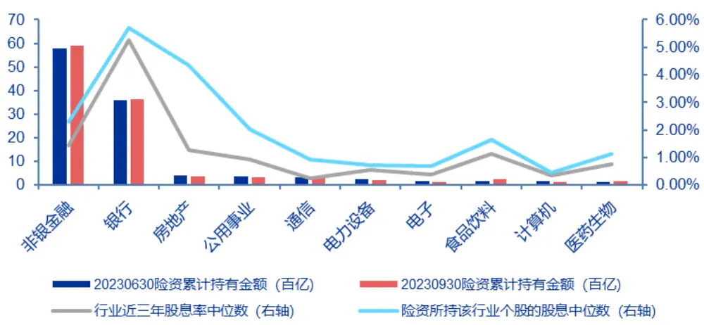
资料来源：wind，申万宏源研究；数据截至：2023/9/30；注：仅统计上市公司披露的前十大股东持股数据；仅展示持有金额最靠前的十大行业

## 3.2为何保险机构对高分红型股票有比较强烈的诉求？

## 1）IFRS9 的会计准则改革使得保险公司更倾向于配置低波动、高分红型股票。

政策实施情况：《国际财务报告准则第 9 号——金融工具》（简称 IFRS9），是由国际会计准则理事会（IASB）于 2014 年发布的会计准则以取代此前的 IAS39。2017 年，我国财政部修订并发布了三个金融工具相关会计准则，包括《企业会计准则第 22 号——金融工具确认和计量》、《企业会计准则第 23 号——金融资产转移》和《企业会计准则第 24 号——套期会计》，实现与国际会计准则的并轨。上市保险公司中国平安率先实施，其他境内外同时上市以及在境外上市且采用国际会计准则的险企于 2023 年 1 月 1 日起正式实施 IFRS9 准则。

新会计准则的变化：IAS39 下，股票可以计入 FVTPL 或者可供出售的金融资产（AFS），前者的浮亏浮盈将直接反映在当期利润表中，而后者可以将公允价值变动先计入所有者权益再转入损益。因此，在 IAS39 下管理层有可能利用 AFS 的特殊计量方式进行利润操控，而 IFRS9 取消了 AFS 资产的计量方式，提高了报表的可信度并避免了管理层利润操控的嫌疑。

具体而言，新准则下股票可以计入 FVTPL 或者 FVOCI 类资产，前者的浮亏浮盈同样将直接反映在当期利润表中，而后者除分红计入利润表外，公允价值变动损益反映在其他综合损益中，同时被确认为 FVOCI 分类后是不可重新分类的。

新会计准则下投资偏好可能发生改变：会计准则的改革使得更多权益资产将被计为 FVTPL 类资产，从而使得利润表的波动加剧。因此，出于利润表的管理目的，保险公司会更多投资于低波动、高分红型股票，大盘价值型股票因其低波动属性计入FVTPL 类资产可以降低利润表波动性，高分红型股票的公允价值变动损益计入FVOCI 类资产可以将分红计入利润表中，提高利润表的表现。

图20：IAS39与IFRS9对于权益资产的分类对比
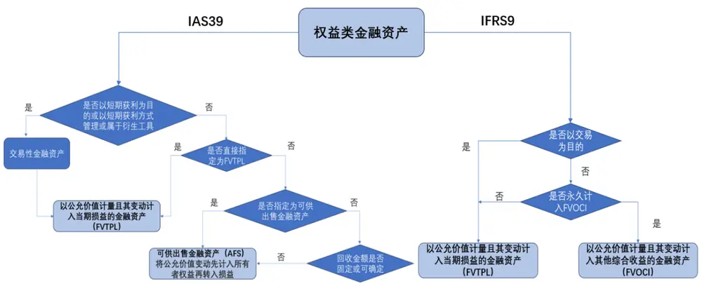
资料来源：wind，申万宏源研究；数据截至：2023/6/30

2）险资具有负债性、长期性和稳定性，其特殊的资金属性使得保险公司在投资中需要满足期限匹配、收益覆盖和稳健安全的三大原则。一般而言，险资将固定收益资产视为收益稳定、风险较低并且期限确定的资产，能够较好匹配其投资需求，因此长期来看固收类资产是险资的主要投资方向，能为险资提供确定性较高的息差收入，而权益类资产主要是用于增厚收益的投资工具。据国家金融监督管理总局统计，2023Q1，人身险公司、财产保险公司的债券投资金额分别占资金运用额的 42.93%、34.48%，而对于股票的投资额占比达到 7.96%、6.67%。（数据来源：国家金融监督管理总局）

图21：人身险公司的23Q1资金运用情况
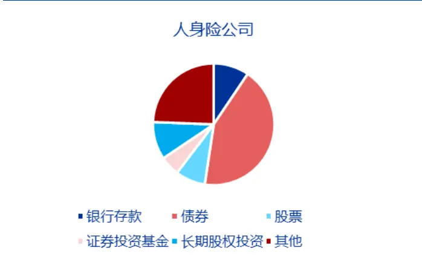
资料来源：国家金融监督管理总局，申万宏源研究

图22：财产保险公司的 23Q1资金运用情况
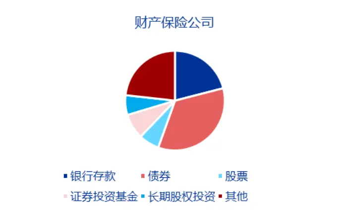
资料来源：国家金融监督管理总局，申万宏源研究

然而，随着我国国债利率进入下行期，固定收益类资产能够提供的收益也会受到影响。对比中证红利指数近 12 个月的股息率与中长期纯债基金指数近 12 个月的累计收益收益率，红利指数所能提供的股息率逐渐超越中长期纯债基金的收益水平。低波稳健叠加高股息的资产属性，使得红利型股票作为固收类资产替代品的价值逐年攀升。

图23：中国十年国债到期收益率的变化（单位：%）
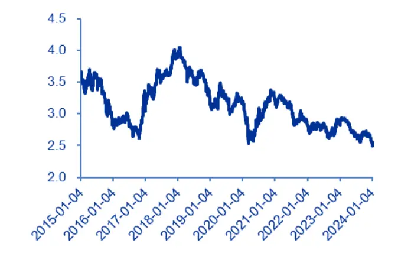
资料来源：wind，中国货币网，申万宏源研究；数据截至：2024/1/12

图24：红利指数股息率 VS 债基收益
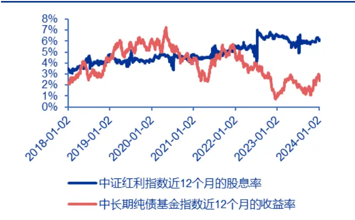
资料来源：wind，申万宏源研究；数据截至：2024/1/12

## 4. 红利基金有哪些投资策略？

红利基金目前主要分为三类：被动指数基金、指数增强基金、主动权益基金。跟踪哪些红利指数的产品在业绩上更为突出？指数增强策略能否在红利中做出超额？红利类主动权益基金在风格以及投资策略上有哪些差异？

## 4.1 指数基金：叠加低波效果较好，指数增强难度增加

跟踪指数的情况：（1）红利类被动指数基金中，25 只 ETF 规模约 400 亿元；4只 LOF 规模合计 33.09 亿元；9 只场外（不含联接）规模合计 97.55 亿元；（2）规模最大的为华泰柏瑞红利 ETF（跟踪上证红利指数）161.70 亿元；（3）目前跟踪中证红利指数的被动产品最多，7 只产品规模合计 234.40 亿元，规模最大的为易方达中证红利 ETF，同时管理费 0.15%也是最低；（4）除纯红利指数外，也有一些引入其他维度的指数，例如红利低波、红利低波 100、标普中国 A 股大盘红利低波 50、红利质量等，也有基于港股通样本筛选的标普港股通低波红利指数、恒生港股通高股息率、恒生港股通中国央企红利、港股通高息精选等。

收益风险特征：（1）23 年较为突出的是跟踪标普中国 A 股大盘红利低波 50、300 红利 LV、标普 A股红利、红利低波 100、红利低波等指数的产品，24 年较为突出的是跟踪上证红利指数、红利低波、标普 A 股红利、东证红利低波等指数的产品，整体看引入低波因子的红利类指数会更出色；（2）港股类红利指数的股息率最高，例如港股通高息精选、中华预期高股息、港股通高股息等三只指数近 12 个月的股息率超过 9%以上，但这也与港股市场的下跌有影响；（3）大多红利 ETF 的管理费在0.50%，目前有 3 只红利 ETF 的管理费为 0.15%：易方达中证红利 ETF、博时中证红利 ETF、易方达中证红利低波动 ETF。

表10：红利类被动指数基金的基本信息

| 基金代码 | 基金简称 | 23年 收益率 | 24年 收益率 | 规模 (亿元) | 产品 类型 | 跟踪指数 | 过去12月 股息率% | 管理费% |
| --- | --- | --- | --- | --- | --- | --- | --- | --- |
| 510880.OF | 华泰柏瑞红利 ETF | 7.41% | 2.47% | 161.70 ETF |  | 红利指数 | 6.52 | 0.50 |
| 515180.OF | 易方达中证红利 ETF | 5.76% | 1.26% | 46.11 | ETF | 中证红利 | 6.13 | 0.15 |
| 515080.OF | 招商中证红利 ETF | 5.21% | 1.21% | 36.91 | ETF | 中证红利 | 6.13 | 0.20 |
| 512890.OF | 华泰柏瑞红利低波动 ETF | 11.91%2.20% |  | 26.40 | ETF | 红利低波 | 6.31 | 0.50 |
| 159905.OF | 工银深证红利 ETF | -9.12% | -3.94% | 25.54 ETF |  | 深证红利 | 3.27 | 0.50 |
| 515100.OF | 景顺长城中证红利低波动100ETF | 12.55% | 1.08% | 19.71 ETF |  | 红利低波100 | 5.48 | 0.50 |
| 513630.OF | 摩根标普港股通低波红利 ETF |  | -1.47% | 13.53 ETF |  | 标普港股通低波红利指数 |  | 0.50 |
| 513690.OF | 博时恒生港股通高股息率 ETF | -1.38%-1.22% |  | 10.66 | ETF | 恒生港股通高股息率 | 8.14 | 0.50 |
| 562060.OF | 华宝标普中国 A 股红利机会 ETF |  | 1.79% | 7.83 | ETF | 标普 A 股红利 | 6.72 | 0.50 |
|  | 515450.OF南方标普中国 A 股大盘红利低波 50ETF | 15.91% | 1.62% | 6.44 |  | ETF 标普中国 A 股大盘红利低波 50 |  | 0.50 |
| 561580.OF | 华泰柏瑞中证中央企业红利 ETF |  | 0.31% | 5.53 | ETF | 中证央企红利 | 5.53 | 0.50 |
| 515890.OF | 博时中证红利 ETF | 6.88%1.21% |  | 4.81 | ETF | 中证红利 | 6.13 | 0.15 |
| 515300.OF | 嘉实沪深 300 红利低波动 ETF | 14.35% | 0.31% | 4.48 | ETF | 300 红利 LV | 4.77 | 0.50 |
| 513920.OF | 华安恒生港股通中国央企红利 ETF |  | -1.07% | 3.38 | ETF | 恒生港股通中国央企红利 |  | 0.50 |
| 560020.OF | 汇添富中证红利 ETF |  | 1.23% | 3.38 | ETF | 中证红利 | 6.13 | 0.50 |
| 159515.OF | 鹏扬中证国有企业红利 ETF |  | 1.23% | 2.90 | ETF | 中证国企红利 | 6.27 | 0.50 |
| 561060.OF | 华安中证国有企业红利 ETF |  | 1.25% | 2.83 | ETF | 中证国企红利 | 6.27 | 0.50 |
| 159549.OF | 天弘中证红利低波动 100ETF |  | 1.09% | 2.71 | ETF | 红利低波100 | 5.48 | 0.50 |
| 159758.OF | 华夏中证红利质量ETF | -3.56% | -3.42% | 2.53 | ETF | 红利质量 | 3.10 | 0.50 |
| 159691.OF | 工银中证港股通高股息精选 ETF |  | 0.47% | 2.52 | ETF | 港股通高息精选 | 9.81 | 0.45 |
| 563020.OF | 易方达中证红利低波动 ETF |  | 2.19% | 2.47 | ETF | 红利低波 | 6.31 | 0.15 |
| 159708.OF | 西部利得深证红利 ETF | -7.55% | -3.95% | 1.88 | ETF | 深证红利 | 3.27 | 0.40 |
| 159726.OF | 华夏恒生中国内地企业高股息率 ETF | 2.18% | -1.18% | 0.78 | ETF | 恒生中国内地企业高股息率 | 7.98 | 0.50 |
| 512530.OF | 建信沪深 300 红利 ETF | 1.89% | 0.75% | 0.58 | ETF | 沪深 300 红利 | 6.06 | 0.50 |
| 161907.OF | 万家中证红利A | 4.72% | 1.17% | 19.82 LOF |  | 中证红利 | 6.13 | 0.75 |
| 501029.OF | 华宝标普中国 A 股红利机会 A | 12.69%1.68% |  | 11.11 LOF |  | 标普 A 股红利 | 6.72 | 0.75 |
| 501305.OF | 汇添富中证港股通高股息 A | 5.06% | -0.59% | 2.02 LOF |  | 港股通高股息(CNY) | 9.20 | 0.75 |
| 501307.OF | 银河中证沪港深高股息 A | -2.37% | 0.18% | 0.15 LOF |  | SHS 高股息(CNY) | 8.55 | 0.50 |
| 090010.OF 005561.OF | 大成中证红利A | 4.27% | 1.23% | 39.55 场外 |  | 中证红利 | 6.13 | 0.75 |
| 012708.OF | 创金合信红利低波动 A | 10.52% | 2.02% | 26.79 场外 |  | 红利低波 | 6.31 | 0.50 0.50 |
| 008928.OF | 东方红中证东方红红利低波动A | 10.31%1.64% |  | 13.93 场外 |  | 东证红利低波 | 5.53 |  |
|  | 宏利中证主要消费红利 A | -14.00%. | -1.64% | 10.48 场外 |  | 消费红利 | 2.83 | 0.50 |
| 005051.OF | 摩根港股低波红利 A | 1.71% | -1.43% | 4.84 | 场外 | 标普港股通低波红利指数 |  | 0.60 |
|  | 007751.OF 景顺长城中证沪港深红利成长低波动 A | 7.75% | 0.80% | 1.11 | 场外 | SHS 红利成长 LV | 5.40 | 0.50 |
| 007671.OF | 建信中证红利潜力指数 A | -4.55% -1.50% |  | 0.53 | 场外 | 红利潜力 | 4.11 | 0.75 |
| 020120.OF | 宝盈华证龙头红利 50A |  | 0.53% | 0.21 | 场外 | 龙头红利50 | 4.92 | 0.50 |
| 019853.OF | 博时中证红利低波动 100A |  | 1.00% | 0.11 | 场外 | 红利低波100 | 5.48 | 0.50 |

资料来源：wind，申万宏源研究；注：收益率、ETF 规模、股息率数据截至 2024/1/12；其他规模数据截止 2023/9/30红利类指数增强基金做超额的难度较高：目前仅有 4 只红利类指数增强基金，四只产品所跟踪的指数均不一样，但都难以做出较高超额。以所跟踪的全收益指数*0.9作为产品的基准进行测算，近一年仅富国中证红利指数增强有超额、近三年仅浙商港股通中华预期高股息指数增强有超额。

表11：红利类指数增强基金的基本信息

| 基金代码 | 基金简称 | 基金经理 | 规模(亿元) | 2022年2收益率 | 023年2收益率 | 024年收益率 | 近三年的年化超额收益超 | 近一年的近额收益跟 | 一年的踪误差 |
| --- | --- | --- | --- | --- | --- | --- | --- | --- | --- |
| 100032.OF | 富国中证红利指数增强A | 徐幼华,方旻 | 92.82 | -3.31% | 6.94% | 1.44% | -0.59% | 1.25% | 2.30% |
| 501059.OF | 西部利得国企红利指数增强 A | 盛丰衍,陈元骅 | 13.92 | 6.77% | -1.33% | 1.11% | -3.01% | -10.17% | 4.14% |
| 007178.OF浙 | 商港股通中华预期高股息指数增强 A | 贾腾 | 8.00 | -8.00% | -11.08%- | 0.80% | 6.24% | -2.03% | 8.61% |
| 501089.OF 方 | 正富邦中证主要消费红利指数增强 | 吴昊 | 0.84 -9.22% |  | -14.80% | -1.68% -2.60% |  | -2.89% | 1.19% |

资料来源：wind，申万宏源研究；数据截止：2024/1/12；超额收益的基准为所跟踪的全收益指数*0.9

以规模较大的富国中证红利指数增强以及西部利得国企红利指数增强为例，超额收益在近两年出现回撤，而这也是红利风格相对占优的市场环境，在指数增强策略中，往往指数 beta 很强的时候创造 alpha 的难度都会提高，因为此刻需要找到比红利更强的因子才能做出超额。

图25：富国中证红利指数增强的净值走势
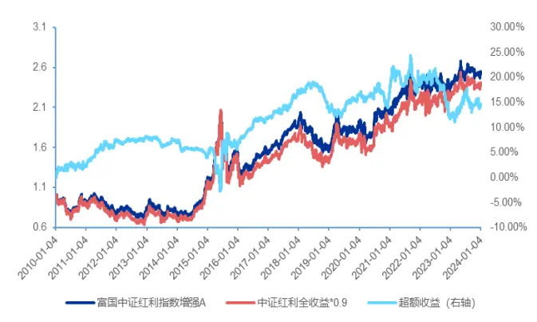
资料来源：wind，申万宏源研究；数据截止：2024/1/12

图 26：西部利得国企红利指数增强的净值走势
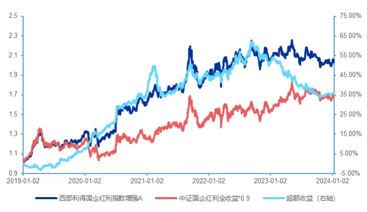
资料来源：wind，申万宏源研究；数据截止：2024/1/12

指数增强基金受成分股 80%以上的投资比例限制，富国中证红利的积极投资比例相对较为稳定，控制在 17%左右；西部利得国企红利指数增强在投资策略中有明显变化，20Q3之前的积极投资比例约17.70%，21年之后的积极投资比例约12.25%，23Q3 的积极投资比例更是下降至 4.88%，选股部分已经主要来自于成分股。

表 12：两只指数增强基金的积极投资比例（占股票资产比例）

| 报告期 | 富国中证红利指数增强 | 西部利得国企红利指数增强 |
| --- | --- | --- |
| 2019/3/31 | 16.75% | 14.64% |
| 2019/6/30 | 16.92% | 18.51% |
| 2019/9/30 | 16.76% | 16.13% |
| 2019/12/31 | 17.57% | 19.72% |
| 2020/3/31 | 17.10% | 19.01% |
| 2020/6/30 | 14.18% | 16.94% |
| 2020/9/30 | 14.30% | 18.96% |
| 2020/12/31 | 15.53% | 9.38% |
| 2021/3/31 | 16.76% | 12.60% |
| 2021/6/30 | 17.71% | 15.89% |
| 2021/9/30 | 15.93% | 10.38% |
| 2021/12/31 | 16.05% | 15.60% |
| 2022/3/31 | 12.11% | 15.03% |
| 2022/6/30 | 13.51% | 13.86% |
| 2022/9/30 | 17.41% | 10.73% |
| 2022/12/31 | 18.06% | 11.26% |
| 2023/3/31 | 17.57% | 10.36% |
| 2023/6/30 | 17.41% | 14.20% |
| 2023/9/30 | 17.41% | 4.88% |

资料来源：wind，申万宏源研究

除此之外西部利得国企红利指数增强还有一些信息可以关注：产品自 22Q2 开始每一期均会配置股指期货，且均是 IF 的多头，占基金净值的比例为 1.53%并不高。

表13：西部利得国企红利指数增强的股指期货配置情况

| 报告期 | 代码 | 名称 | 持仓量(买/卖) | 合约市值(元) | 公允价值变动(元) | 股指期货占基金资产比例 |
| --- | --- | --- | --- | --- | --- | --- |
| 2022/6/30 | IF2207 | IF2207 | 6 | 8,051,760.00 | 352,020.00 | 1.90% |
| 2022/9/302022/12/31 | IF2210 | IF2210 | 12 | 13,731,840.00 | -686,400.00 | 2.88% |
|  | IF2211 | IF2211 | 7 | 8,012,340.00 | -48,780.00 |  |
|  | IF2301 | IF2301 | 19 | 22,150,200.00 | -487,860.00 | 1.98% |
| 2023/3/31 | IF2304 | IF2304 | 10 | 12,184,200.00 | 292,860.00 | 0.88% |
| 2023/6/30 | IF2307 | IF2307 | 10 | 11,491,200.00 | -179,700.00 | 0.76% |
| 2023/9/30 | IF2310 | IF2310 | 10 | 11,104,800.00 | -142,980.00 | 0.80% |

资料来源：wind，申万宏源研究

## 4.2 主动权益基金：少有产品稳定跑赢红利全收益指数

计算 23 年半年报基金的持仓，并采用股息率加权，定义股息率在 4%以上的主动权益基金为红利类主动权益基金，样本共 112 只规模合计 1215.19 亿元，其中规模相对靠前的有：易方达高质量严选三年持有、大成高新技术产业、大成睿享、中泰星元价值优选、景顺长城价值边际等。

高股息率主动权益基金也并不代表高收益，以 23 年半年报股息率靠前的 20 只主动权益基金为例：（1）黄海管理的三只产品股息率最高，23H1的股息率超过10%，也是近两年收益最靠前的红利类主动权益基金，但总样本中并未呈现股息率与收益率的线性关系，三只产品过往在周期股、金融地产股投资比例较高；（2）23 年半年报股息率靠前的 20 只基金除了前三只产品以外，其他都有港股配置，但值得注意的是部分产品并没有被港股拖累，反而近一年年获得不错的收益，例如宝盈品质甄选、大成高新技术产业、南方远见回报、中泰红利优选一年持有等；（3）任职以来能够跑赢中证红利全收益指数的产品较少，例如黄海管理的三只产品、宝盈品质甄选、大成高新技术产业、南方瑞祥、大成优势企业等。

表14：部分红利类主动权益基金（23年半年报股息率靠前的 20只基金）

| 基金简称 | 基金经理 | 任职日 | 基金规模 (亿元) | 2022年 收益率 | 2023年 收益率 | 2024年 收益率 | 港股 投资比例 | 23H1 股息率% | 任职以来 年化超额收益 |
| --- | --- | --- | --- | --- | --- | --- | --- | --- | --- |
| 万家新利 | 黄海 | 2020-09-23 | 7.80 | 43.65% | 20.74% | 2.60% | 0.00% | 10.24 | 7.35% |
| 万家宏观择时多策略 A | 黄海 | 2020-09-23 | 11.02 | 48.55% | 21.14% | 2.56% | 0.00% | 10.20 | 5.40% |
| 万家精选 A | 黄海 | 2020-09-23 | 8.76 | 35.50% | 21.25% | 2.29% | 0.00% | 10.09 | 5.49% |
| 宝盈品质甄选 A | 杨思亮 | 2021-12-28 | 4.07 | -0.81% | 12.45% | 0.04% | 37.67% | 8.71 | 1.85% |
| 前海开源沪港深汇鑫A |  | 魏淳,王可三 2021-06-01 | 0.51 | -12.10% | -13.41% | 1.44% | 67.32% | 7.44 | -14.48% |
| 安信平衡增利A | 张翼飞 | 2021-12-10 | 2.07 | 6.66% | -2.51% | -1.30% | 33.69% | 7.11 | -2.73% |
| 招商稳健平衡A | 李崟 | 2021-10-19 | 1.16 | 4.27% | -1.43% | 1.51% | 22.87% | 6.96 | -0.80% |
| 大成高新技术产业 A | 刘旭 | 2015-07-29 | 90.29 | -17.92% | 5.23% | -0.37% | 21.57% | 6.67 | 12.99% |
| 南方远见回报 A | 李锦文 | 2021-03-25 | 1.22 | -18.19% | 0.78% | 1.95% | 18.82% | 6.66 | -15.72% |
| 南方卓越优选 3 个月持有 A | 李锦文 | 2022-11-18 | 21.98 | -24.48% | -0.09% | 2.59% | 21.70% | 6.57 | -8.27% |
| 博时港股通红利精选 A | 赵宪成 | 2022-07-09 | 0.14 | -6.52% | -1.57% | -1.02% | 81.80% | 6.46 | -8.82% |
| 大成匠心卓越三年持有 A | 刘旭 | 2022-06-07 | 6.19 |  | 5.68% | -0.22% | 20.23% | 6.44 | -1.25% |
| 中泰红利优选一年持有 | 姜诚,王桃 | 2022-03-24 | 5.70 |  | 4.78% | 1.67% | 21.74% | 6.34 | -3.09% |
| 中泰红利价值一年持有 | 姜诚,王桃 | 2022-03-24 | 5.60 |  | 2.51% | 1.57% | 25.10% | 6.32 | -4.39% |
| 南方瑞祥A | 李锦文 | 2018-12-07 | 2.57 | -16.75% | 1.58% | 2.33% | 18.07% | 6.32 | 2.30% |
| 大成优势企业 A | 刘旭 | 2019-12-24 | 14.76 | -18.15% | 0.78% | -1.06% | 20.70% | 6.27 | 6.88% |
| 南方匠心优选A | 李锦文 | 2021-02-02 | 30.90 | -17.49% | 0.16% | 2.24% | 18.87% | 6.26 | -26.26% |
| 大成 ESG 责任投资 A | 侯春燕 | 2022-06-24 | 0.56 |  | -4.29% | -2.45% | 32.96% | 6.25 | -7.74% |
| 南方智诚 | 李锦文 | 2020-05-15 | 4.26 | -17.47% | 0.99% | 2.18% | 17.66% | 6.17 | -7.60% |
| 国寿安保高股息 A | 李博闻 | 2022-08-10 | 0.65 | -18.96% | -12.09% -2.20% |  | 26.97% | 6.12 | -18.37% |

资料来源：wind，申万宏源研究；数据截止：2024/1/12；超额收益基准为中证红利全收益指数

每一位基金经理我们仅选取一只产品作为分析，以近一年收益率靠前的 15 只红利类主动权益基金为例，黄海、鲍无可、刘榕俊以及杨思亮四位基金经理所管理的产品表现较为出色，其中前三位基金经理所管理的产品更是在 2022 年与 2023 年均获得正收益，2024 年截止 1/12 仍是正收益，4 只产品近一年也均跑赢中证红利全收益指数（6.59%），在业绩上相对指数基金会更出色。

表15：部分红利类主动权益基金（近一年收益率靠前的 15只基金）

| 基金简称 | 基金经理 | 任职日 | 基金规模(亿元) | 2022年收益率 | 2023年收益率 | 2024年收益率 | 港股投资比例 | 23H1股息率% | 任职以来年化超额收益 | 近一年收益率 |
| --- | --- | --- | --- | --- | --- | --- | --- | --- | --- | --- |
| 万家宏观择时多策略A 黄海 |  | 2020-09-23 | 11.02 | 48.55% | 21.14% | 2.56% | 0.00% 10.20 5.40% 18.18% |  |  |  |
| 景顺长城沪港深精选 鲍无可 |  | 2016-05-28 | 49.65 | 2.24% | 16.30% | 0.05% | 27.62% | 4.41 | 5.27% 13.33% |  |
| 金信智能中国 2025A 刘榕俊 |  | 2020-05-21 | 1.54 | 0.68% | 10.40% | 0.18% | 0.00% 4.96 |  | -2.48% 9.29% |  |
| 宝盈品质甄选 A | 杨思亮 | 2021-12-28 | 4.07 | -0.81% | 12.45% | 0.04% | 37.67% | 8.71 | 1.85% | 8.38% |
| 中泰红利优选一年持有 |  | 姜诚,王桃 2022-03-24 | 5.70 |  | 4.78% | 1.67% | 21.74% | 6.34 | -3.09% | 5.18% |
| 前海开源股息率100 强 | 刘宏 | 2021-04-22 | 3.12 | -8.68% | 5.62% | 0.49% | 0.00% | 4.58 | -2.70% | 4.69% |
| 华宝红利精选A | 唐雪倩 | 2022-06-17 | 3.78 | -11.66% | 3.87% | 1.89% | 12.90% | 5.99 | -8.70% | 4.31% |
| 长盛量化红利策略 A | 王宁 | 2021-08-26 | 2.30 | -7.62% | 3.50% | 1.78% | 0.00% | 4.66 | -4.77% | 4.13% |
| 大成策略回报 A | 徐彦 | 2020-03-20 | 29.77 | -3.37% | 6.61% | -2.05% | 0.00% | 5.60 | 2.84% | 3.77% |
| 尚正竞争优势 A | 张志梅 | 2021-11-02 | 4.65 | -5.60% | 7.42% | -0.11% | 33.92% | 4.36 | -4.56% | 3.65% |
| 大成高新技术产业 A | 刘旭 | 2015-07-29 | 90.29 | -17.92% | 5.23% | -0.37% | 21.57% | 6.67 | 12.99% | 2.56% |
| 汇添富品质价值 | 温宇峰 | 2022-12-12 | 20.27 |  | 2.51% | -0.66% | 45.31% | 4.76 | -1.00% | 1.66% |
| 银华长荣 | 胡银玉 | 2021-06-18 | 9.06 | -9.92% | 2.36% | -0.50% | 0.01% | 4.55 | -12.28% | 0.81% |
| 南方瑞祥 A | 李锦文 | 2018-12-07 | 2.57 | -16.75% | 1.58% | 2.33% | 18.07% | 6.32 | 2.30% | 0.18% |
| 宏利市值优选 | 庄腾飞 | 2019-09-29 | 8.14 | -24.88% | 5.23% | -1.35% | 0.00% | 4.87 | -4.77% | 0.09% |

资料来源：wind，申万宏源研究；数据截止：2024/1/12；超额收益基准为中证红利全收益指数；注：一位基金经理仅选取一只产品

不同基金经理在风格以及标签上差异也较为明显：（1）部分基金在行业上集中度明显较高，例如万家宏观择时多策略以煤炭股持仓为主、金信智能中国 2025 与银华长荣以银行股持仓为主；部分基金在行业上较为均衡，例如前海开源股息率 100强、宝盈品质甄选、华宝红利精选、大成策略回报、汇添富品质价值等；（3）大多数红利基金以大盘股配置为主，其中在小盘股配置比例较多的是大成高新技术产业、大成策略回报、南方瑞祥等；（4）估值较低的是万家宏观择时多策略、中泰红利优选一年持有、金信智能中国 2025 等；（4）持仓独特性较强（重仓股较少被其他主动权益基金共同持有）的为长盛量化红利策略、万家宏观择时多策略、华宝红利精选等；（5）持仓股票容易在二级市场发生共振的有金信智能中国 2025、银华长荣、万家宏观择时多策略等，也有持仓相关性较弱的华宝红利精选、南方瑞祥、景顺长城沪港深精选等。

表16：部分红利类主动权益基金的标签

| 基金产品 | 基金经理 | 行业主题标签 | 前十大集中度% | 大盘股占比 | 中盘股占比 | 小盘股占比 | PE | ROE | 重仓股独立性 | 重仓股共振性 |
| --- | --- | --- | --- | --- | --- | --- | --- | --- | --- | --- |
| 万家宏观择时多策略 A | 黄海 周期，金融地产 89.24 |  |  | 33.78% | 56.91% | 9.31% | 4.82 11.89 |  | 0.99% | 97.6 |
| 景顺长城沪港深精选 | 鲍无可 | 无明显标签 | 59.41 | 47.04% | 22.24% | 30.71%2 | 0.26 9.32 |  | 3.30% | 19.57 |
| 金信智能中国 2025A | 刘榕俊 | 金融地产 | 75.83 | 87.91% | 0.00% | 12.09% | 7.835.13 |  | 1.08% | 99.59 |
| 宝盈品质甄选 A | 杨思亮 | 全行业选股 65.09 |  | 61.66% | 2.61% | 35.72%18.51 | 7.51 |  | 3.38% | 19.93 |
| 中泰红利优选一年持有 姜诚,王桃 周期，金融地产 76.40 |  |  |  | 90.71% | 6.25% | 3.04% | 6.45 6.89 |  | 2.02% | 54.45 |
| 前海开源股息率 100 强 | 刘宏 全行业选股 14.06 |  |  | 39.76% | 33.66%2 | 6.58%16.43 | 5.451 |  | .91% 2 | 9.05 |
| 华宝红利精选A | 唐雪倩 | 无明显标签 21.07 |  | 45.70% | 25.27%29.02% | 13.50 | 6.63 |  | 1.02% | 3.56 |
| 长盛量化红利策略A | 王宁 | 周期 22.61 |  | 62.86% | 25.81% | 11.33%14.48 | 5.70 |  | 0.88% | 23.82 |
| 大成策略回报A | 徐彦 | 全行业选股 64.61 |  | 52.02% | 8.39% | 39.59%24.73 | 5.29 |  | 1.19% | 40.22 |
| 尚正竞争优势 A | 张志梅 | 全行业选股 92.61 |  | 93.48% | 6.45% | 0.07%20.64 | 14.10 |  | 8.94% | 78.45 |
| 大成高新技术产业 A 刘旭 |  | 全行业选股 76.94 |  | 53.44% | 4.21% | 42.35%20.47 | 8.66 |  | 3.86% | 20.47 |
| 汇添富品质价值 温宇峰 89.36 |  |  |  | 79.90% | 10.51% | 9.59%23.25 | 8.05 |  | 5.25% | 48.39 |
| 银华长荣 胡银玉 金融地产，消费 86.45 |  |  |  | 92.12% | 3.18% | 4.70%10.97 | 6.69 |  | 4.58% | 99.07 |
| 南方瑞祥A | 李锦文 | 全行业选股 | 75.96 |  | 30.35% 31.24% | 38.40% |  | 16.27 10.20 | 2.29% | 11.06 |
| 宏利市值优选 | 庄腾飞 | 周期，金融地产，消费 | 64.74 | 91.32% | 7.41% | 1.27% |  | 11.68 7.35 | 2.71% | 38.9 |

资料来源：wind，申万宏源研究；重仓股截至 2023Q3，其他采用 23H1 全持仓；注：重仓股独立性的值越小代表持仓独特性越强；重仓股共振性的值越大代表越容易发生共振

部分红利类主动权益基金在因子上的暴露情况：（1）在红利因子中暴露较为明显的是万家宏观择时多策略、中泰红利优选一年持有、宏利市值优选；（2）在小盘因子暴露较为明显的是大成策略回报，在价值因子暴露较为明显的是金信智能中国2025、中泰红利优选一年持有、长盛量化红利策略等；（3）在中信风格因子暴露相对均衡的是景顺长城沪港深精选、宝盈品质甄选、尚正竞争优势、大成高新技术产业、汇添富品质价值等，从概率上讲可能适应的市场环境更多元化。

表17：部分红利类主动权益基金的因子暴露情况

| 产品基本信息基金产品 |  | 三因子 |  |  | 中信风格因子 |  |  |  |  |  |
| --- | --- | --- | --- | --- | --- | --- | --- | --- | --- | --- |
|  |  | 基金经理 | 红利因子 | 大盘因子 | 成长因子 | 金融 | 周期 | 消费 | 成长 | 稳定 |
| 万家宏观择时多策略A 黄海 |  | 114.84% | 24.13% | 6.59% | 28.97% | 39.73% | 2.15% | 0.00% | 24.14% |  |
| 景顺长城沪港深精选 | 鲍无可 | 76.21% | 17.23% | 27.22% | 9.53% | 26.67% | 20.79% | 0.97% | 37.04% |  |
| 金信智能中国 2025A 刘榕俊 |  | 65.54% | 25.95% | -24.23% | 53.23% | 1.64% | 2.58% | 0.00% | 37.55% |  |
| 宝盈品质甄选A 杨思亮 |  | 80.40% | 30.20% | 27.36% | 17.06% | 25.18% | 26.69% | 0.10% | 25.98% |  |
| 中泰红利优选一年持有 姜诚,王桃 |  | 99.17% | 49.93% | -13.30% | 50.70% | 4.15% | 1.79% | 0.00% | 38.36% |  |
| 前海开源股息率100 强 刘宏 |  | 93.27% | 2.00% | 7.42% | 32.04% | 14.62% | 11.52% | 0.66% | 36.17% |  |
| 华宝红利精选 A 唐雪倩 |  | 90.31% | 2.80% | -6.28% | 33.65% | 10.31% | 9.70% | 0.09% | 41.24% |  |
| 长盛量化红利策略A 王宁 |  | 64.20% | 6.36% | -10.94% | 23.38% | 7.60% | 7.13% | 0.02% | 56.87% |  |
| 大成策略回报 A 徐彦 |  | 62.97% | -13.22% | 36.09% | 9.79% | 20.99% | 21.00% | 22.38% | 20.84% |  |
| 尚正竞争优势 A 张志梅 |  | 87.22% | 70.44% | 37.86% | 29.46% | 18.62% | 35.68% | 0.24% | 10.99% |  |
| 大成高新技术产业 A 刘旭 |  | 68.43% | 16.65% | 35.06% | 9.94% | 22.73% | 21.86% | 17.15% | 23.32% |  |
| 汇添富品质价值 温宇峰 |  | 83.87% | 52.67% | 33.22% | 33.00% | 18.38% | 30.55% | 1.30% | 11.77% |  |
| 银华长荣 胡银玉 |  | 68.62% | 38.59% | -13.30% | 48.14% | 3.26% | 8.47% | 0.00% | 35.13% |  |
| 南方瑞祥 A 李锦文 |  | 92.73% | 28.20% | 40.55% | 12.28% | 40.87% | 22.53% | 3.90% | 15.42% |  |
| 宏利市值优选 庄腾飞 |  | 94.18% | 52.45% | -7.16% | 41.74% | 10.46% | 4.71% | 0.00% | 38.09% |  |

资料来源：wind，申万宏源研究；数据计算区间：2023/1/13-2024/1/12

红利类主动权益基金的换手率整体偏低，平均持有周期在 1 年左右：换手率最低的是金信智能中国 2025，有 92%以上的股票持有时间已经超过 2 年；万家宏观择时多策略、华宝红利精选、南方瑞祥在 23 年也明显降低换手率。

表18：部分红利类主动权益基金的换手率与持股周期

| 产品基本信息基金产品 基金经理 | 换手率 (年化单边)22年 23H1 |  | 23H1 持股周期半年以内 |  |  |  |  |  |  |
| --- | --- | --- | --- | --- | --- | --- | --- | --- | --- |
|  |  |  |  |  |  |  | 半年到一年 | 一年到两年 | 两年以上 |
| 万家宏观择时多策略A 黄海 | 330.32% | 102.80% | 0.04% | 22.50% | 77.46% | 0.00% |  |  |  |
| 景顺长城沪港深精选 鲍无可 | 94.83% | 102.81% | 10.25% | 26.54% | 43.74% | 19.47% |  |  |  |
| 金信智能中国 2025A 刘榕俊 | 31.77% | 18.25% | 0.21% | 0.67% | 6.52% | 92.60% |  |  |  |
| 宝盈品质甄选A 杨思亮 | 152.13% | 225.60% | 52.14% | 22.61% | 25.25% | 0.00% |  |  |  |
| 中泰红利优选一年持有 姜诚,王桃 | 18.36% | 30.68% | 6.48% | 0.01% | 93.51% | 0.00% |  |  |  |
| 前海开源股息率100 强 刘宏 | 67.66% | 103.43% | 22.64% | 4.88% | 21.19% | 51.29% |  |  |  |
| 华宝红利精选 A 唐雪倩 | 548.06% | 202.07% | 11.62% | 48.07% | 30.72% | 9.58% |  |  |  |
| 长盛量化红利策略A 王宁 | 194.08% | 320.12% | 38.73% | 30.46% | 24.79% | 6.02% |  |  |  |
| 大成策略回报 A 徐彦 | 103.61% | 214.09% | 48.56% | 7.23% | 34.84% | 9.37% |  |  |  |
| 尚正竞争优势 A 张志梅 | 66.82% | 90.82% | 9.78% | 9.62% | 80.61% | 0.00% |  |  |  |
| 大成高新技术产业A 刘旭 | 87.18% | 62.96% | 20.77% | 21.69% | 48.49% | 9.06% |  |  |  |
| 汇添富品质价值 温宇峰 |  | 149.57% |  |  |  |  |  |  |  |
| 银华长荣 胡银玉 | 218.13% | 269.78% | 12.19% | 15.90% | 71.91% | 0.00% |  |  |  |
| 南方瑞祥A 李锦文 | 158.46% | 95.12% | 34.60% | 6.75% | 33.47% | 25.18% |  |  |  |
| 宏利市值优选 庄腾飞 | 178.59% | 256.13% | 58.28% | 4.51% | 32.63% | 4.58% |  |  |  |

资料来源：wind，申万宏源研究

股票买入策略偏左侧的有万家宏观择时多策略、景顺长城沪港深精选、金信智能中国 2025、中泰红利优选一年持有、前海开源股息率 100 强、大成策略回报以汇添富品质价值等，擅长提前布局挖掘个股；也有部分产品适度右侧布局买入，例如宝盈品质甄选、华宝红利精选、长盛量化红利策略、银华长荣以及宏利市值优选等。

表 19：部分红利类主动权益基金的股票买入策略（21 年以来）

| 基金简称 | 22H2 | 23H1 | 合适价格过度右侧 过度左侧 适度右侧适度左侧买入 |  |  |  |  | 仓位变化情况(合计) | 股票数量(加仓买入) |
| --- | --- | --- | --- | --- | --- | --- | --- | --- | --- |
| 万家宏观择时多策略A | 15.97% | 4.67% | 21.56% | 10.42% | 3.71% | 41.97% | 22.33% | 247.66% 67 |  |
| 景顺长城沪港深精选 | 3.91% | 9.23% | 24.51% | 21.09% | 8.90% | 33.43% | 12.06% | 188.29% | 71 |
| 金信智能中国 2025A | 4.12% | 1.23% | 33.28% | 22.88% | 7.87% | 13.61% | 22.37% | 76.76% 33 |  |
| 宝盈品质甄选 A | -4.56% | -4.82% | 38.23% | 9.03% | 1.58% | 35.26% | 15.90% | 217.94% 49 |  |
| 中泰红利优选一年持有 | 3.89% | 1.92% | 50.88% | 12.40% | 4.63% | 10.39% | 21.70% | 34.02% 15 |  |
| 前海开源股息率100 强 | 1.03% | 3.32% | 12.33% | 40.10% | 11.17% | 27.44% | 8.97% | 127.32% 42 |  |
| 华宝红利精选 A | -17.30% | -9.96% | 25.66% | 21.88% | 6.51% | 33.47% | 12.49% | 309.85% 141 |  |
| 长盛量化红利策略 A | -6.35% | -2.97% | 20.58% | 18.53% | 6.31% | 38.52% | 16.07% | 529.36% 208 |  |
| 大成策略回报 A | 17.02% | 17.08% | 29.94% | 6.64% | 6.71% | 21.60% | 35.11% | 318.87% 87 |  |
| 尚正竞争优势 A | -3.59% | 7.79% | 53.98% | 12.98% | 6.20% | 10.44% | 16.40% | 105.27% 33 |  |
| 大成高新技术产业 A | -2.58% | -1.77% | 22.54% | 11.93% | 4.49% | 32.47% | 28.59% | 218.21% 64 |  |
| 汇添富品质价值 |  | 6.83% | 6.73% | 21.10% | 24.61% | 12.10% | 35.45% | 42.64% 14 |  |
| 银华长荣 | -16.21% | -14.16% | 11.42% | 24.10% | 11.86% | 40.34% | 12.27% | 182.15% 65 |  |
| 南方瑞祥 A | 2.14% | -1.26% | 26.50% | 12.41% | 9.63% | 27.34% | 24.13% | 269.89% 90 |  |
| 宏利市值优选 | -11.45% | -19.20% | 12.69% | 34.59% | 12.07% | 27.77% | 12.88% | 389.89% 109 |  |

资料来源：wind，申万宏源研究；注：第 2、3 列代表若基金实际收益-提前半年买入股票的模拟组合收益，值越大表明买得越合适，越小表明买的价格更贵

适度右侧买入策略的基金也可以做到偏左侧卖出，例如宝盈品质甄选，虽然提前半年买入基金经理的持仓收益可能更高，但若半年之后再卖出基金经理的持仓收益会更低，基金经理再卖出时点的把握会更强。

表20：部分红利类主动权益基金的股票卖出策略（21年以来）

| 基金简称 | 22H2 | 23H1 | 合适价格卖出 | 过度右侧 | 过度左侧 | 适度右侧 | 适度左侧 | 仓位变化情况(合计) | 股票数量(减仓卖出) |
| --- | --- | --- | --- | --- | --- | --- | --- | --- | --- |
| 万家宏观择时多策略A | 1.96% | 0.55% | 18.44% | 15.91% | 6.14% | 25.32% | 34.19% | -250.08% 65 |  |
| 景顺长城沪港深精选 | -6.18% | -3.13% | 22.34% | 13.84% | 21.70% | 12.40% | 29.71% | -181.97% 75 |  |
| 金信智能中国 2025A | 1.07% | -1.06% | 49.07% | 11.60% | 12.23% | 13.03% | 14.07% | -67.72% 26 |  |
| 宝盈品质甄选 A | 26.26% | 1.32% | 37.12% | 16.44% | 7.23% | 17.42% | 21.78% | -216.06% 50 |  |
| 中泰红利优选一年持有 | 0.72% | 3.08% | 30.46% | 19.32% |  | 42.25% | 7.97% | -35.09% 13 |  |
| 前海开源股息率 100 强 | 0.67% | 1.40% | 40.94% | 5.73% | 8.54% | 15.65% | 29.14% | -101.14% 79 |  |
| 华宝红利精选A | -1.88% | -5.36% | 23.84% | 11.47% | 14.42% | 24.45% | 25.83% | -255.22% 153 |  |
| 长盛量化红利策略 A | -8.78% | -2.84% | 33.01% | 12.50% | 11.40% | 21.01% | 22.07% | -504.11% 211 |  |
| 大成策略回报 A | -11.89% | 4.77% | 17.79% | 6.98% | 17.65% | 22.91% | 34.67% | -293.22% 98 |  |
| 尚正竞争优势 A | 5.30% | -0.68% | 29.98% | 7.17% | 2.91% | 30.29% | 29.66% | -106.63% 27 |  |
| 大成高新技术产业 A | -0.87% | -1.74% | 21.73% | 11.89% | 10.65% | 27.55% | 28.18% | -200.67% 75 |  |
| 汇添富品质价值 |  | -6.83% | 15.97% | 3.33% |  | 28.25% | 52.44% | -42.37% 11 |  |
| 银华长荣 | -11.85% | 1.51% | 21.32% | 10.84% | 12.98% | 48.83% | 6.03% | -174.81% 58 |  |
| 南方瑞祥 A | 1.19% | 3.85% | 30.38% | 7.54% | 3.11% | 43.15% | 15.81% | -262.55% 87 |  |
| 宏利市值优选 | 10.53% | -0.04% | 36.75% | 7.47% | 3.53% | 32.06% | 20.19% | -388.76% 131 |  |

资料来源：wind，申万宏源研究；注：第 2、3 列代表基金实际收益-延后半年卖出股票的模拟组合收益，值越大表明卖得越合适，越小表明卖的价格更便宜

Brinson 收益拆分情况：资产配置所产生的超额较小，主要是大成策略回报的资产配置累计产品收益较高，该产品在 23 年基本维持 60%左右的股票仓位；部分基金在行业配置上产生较高的超额，例如万家宏观择时多策略与景顺长城沪港深精选；选股是大多数基金经理的主要收益来源，但也有通过调仓产生较多收益的宝盈品质甄选。

表21：部分红利类主动权益基金的收益归因（Brinson 拆分）

| 基金简称 | 基金经理 | 资产配置 累计超额收益 | 行业配置 累计超额收益 | 选股 累计超额收益 | 交易交互其他 累计超额收益 |
| --- | --- | --- | --- | --- | --- |
| 万家宏观择时多策略A | 黄海 | -1.65% | 11.20% | 16.46% | 2.71% |
| 景顺长城沪港深精选 | 鲍无可 | -0.88% | 10.96% | 16.90% | -3.76% |
| 金信智能中国 2025A | 刘榕俊 | -0.28% | 1.33% | 16.73% | 0.76% |
| 宝盈品质甄选 A | 杨思亮 | 0.05% | 3.69% | 8.93% | 7.98% |
| 中泰红利优选一年持有 | 姜诚,王桃 | -1.62% | -1.50% | 22.16% | -6.47% |
| 前海开源股息率100 强 | 刘宏 | -1.47% | 1.54% | 15.17% | -1.51% |
| 华宝红利精选 A | 唐雪倩 | -1.75% | 0.43% | 17.20% | -4.16% |
| 长盛量化红利策略 A | 王宁 | 0.92% | 5.01% | 14.51% | -9.55% |
| 大成策略回报 A | 徐彦 | 1.43% | 3.92% | 15.69% | -6.57% |
| 尚正竞争优势 A | 张志梅 | -0.48% | 7.55% | 19.02% | -10.42% |
| 大成高新技术产业 A | 刘旭 | 0.02% | 8.86% | 11.24% | -7.20% |
| 银华长荣 | 胡银玉 | -0.47% | -0.98% | 8.94% | 3.19% |

资料来源：申万宏源研究；数据计算区间：2023/1/1-2023/12/31

不同基金经理在行业板块上的能力圈有差异：黄海更擅长在周期股中捕捉投资机会；鲍无可所管产品在周期与科技创新板块的收益贡献较多；也有板块收益来源较为均衡的宝盈品质甄选。

表22：部分红利类主动权益基金的收益归因（行业板块的收益贡献）

| 基金简称 | 基金经理 | 收益贡献较高的三个行业 | 先进制造 | 医药 | 周期 | 消费 | 科技创新金 | 融地产 |
| --- | --- | --- | --- | --- | --- | --- | --- | --- |
| 万家宏观择时多策略A黄海 煤炭 10.28%;石油石化 1.6% |  |  | 0.00% | 0.00% | 11.49% | 0.00% | 0.00% | 0.00% |
| 景顺长城沪港深精选 | 鲍无可 | 石油石化 8.65%;通信 5.62%;传媒 5.38% | 3.27% | -0.69%16 | 12.29% | 0.24% | 11.60% | -0.02% |
| 金信智能中国 2025A | 刘榕俊 | 银行 12.32%;电子 0.69%;家用电器 0.39% | 0.00% | 0.00% | 0.00% | 0.39% | 0.69% | 12.32% |
| 宝盈品质甄选 A | 杨思亮 | 石油石化 3.85%;非银金融 3.61%;汽车 3.11% | 2.71% | 0.00% | 7.04% | 2.61% | 2.87% | 2.96% |
| 中泰红利优选一年持有 姜诚,王桃 银行 6.47%;煤炭 2.45%;交通运输 2.17% |  |  | 0.00% | 0.00% | 2.18% | 0.79% | 0.00% | 5.24% |
| 前海开源股息率 100 强 | 刘宏 | 传媒 2.25%;汽车 1.32%;银行 1.27% | 2.74% | 0.11% | 2.85% | 0.16% | 2.49% | 0.60% |
| 华宝红利精选A 唐雪倩 |  | 石油石化 2.4%;煤炭 1.87%;传媒 1.79% | 0.68% | 0.33% | 4.68% | 1.09% | 2.01% | 1.30% |
| 长盛量化红利策略A 王宁 |  | 通信 3.49%;石油石化 2.61%;公用事业 1.98% | 3.88% | -0.03% | 4.59% | 1.85% | 4.38% | 0.28% |
| 大成策略回报 A 徐彦 电子 6.49%;通信 2.51%;公用事业 2.45% |  |  | 4.83% | 0.72% | 1.08% | 0.67% | 9.55% | 0.13% |
| 尚正竞争优势 A 张志梅 非银金融 5.76%;煤炭 4.01%;通信 3.18% |  |  | 0.00% | 1.01% | 4.01% | -0.94% | 3.67% | 5.24% |
| 大成高新技术产业 A 刘旭 通信 5.92%;石油石化 3.43%;交通运输 2.44% |  |  | 0.57% | 0.00% | 6.07% | -1.29% | 5.55% | 0.52% |
| 银华长荣 胡银玉银行 10.36%;基础化工 0.54%;食品饮料 0.23% |  |  | -0.01% | -0.15% | 0.54% | 0.26% | 0.00% | 10.27% |

资料来源：申万宏源研究；数据计算区间：2023/1/1-2023/12/31

## 5. 风险揭示与声明

本报告对于基金产品、指数的研究分析均基于历史公开信息，可能受指数样本股的变化而产生一定的分析偏差；此外，基金管理人的历史业绩与表现不代表未来；指数未来表现受宏观环境、市场波动、风格转换等多重因素影响，存在一定波动风险。

本报告仅对基金历史业绩进行分析，不代表对基金未来资产配置情况的预测；本报告不涉及证券投资基金评价业务，不涉及对基金产品的推荐，亦不涉及对任何指数样本股的推荐；投资者阅读本报告时，应结合自身风险偏好及风险承受能力，充分理解指数编制规则、样本股变化、历史表现等综合因素可能对指数走势、基金产品业绩产生的影响；本报告内容仅供参考，投资者需特别关注指数编制公司、基金公司等官方披露的信息。

## 信息披露

## 证券分析师承诺

本报告署名分析师具有中国证券业协会授予的证券投资咨询执业资格并注册为证券分析师，以勤勉的职业态度、专业审慎的研究方法，使用合法合规的信息，独立、客观地出具本报告,并对本报告的内容和观点负责。本人不曾因，不因，也将不会因本报告中的具体推荐意见或观点而直接或间接收到任何形式的补偿。

## 与公司有关的信息披露

本公司隶属于申万宏源证券有限公司。本公司经中国证券监督管理委员会核准，取得证券投资咨询业务许可。本公司关联机构在法律许可情况下可能持有或交易本报告提到的投资标的，还可能为或争取为这些标的提供投资银行服务。本公司在知晓范围内依法合规地履行披露义务。客户可通过 compliance@swsresearch.com 索取有关披露资料或登录www.swsresearch.com 信息披露栏目查询从业人员资质情况、静默期安排及其他有关的信息披露。

## 机构销售团队联系人

华东 A 组茅炯021-33388488 maojiong@swhysc.com

021-33388245

liqing3@swhysc.com

华北组肖霞010-66500628 xiaoxia@swhysc.com

华南组李昇0755-82990609 Lisheng5@swhysc.com

## 法律声明

本报告仅供上海申银万国证券研究所有限公司（以下简称“本公司”）的客户使用。本公司不会因接收人收到本报告而视其为客户。客户应当认识到有关本报告的短信提示、电话推荐等只是研究观点的简要沟通，需以本公司http://www.swsresearch.com 网站刊载的完整报告为准，本公司并接受客户的后续问询。本报告首页列示的联系人，除非另有说明，仅作为本公司就本报告与客户的联络人，承担联络工作，不从事任何证券投资咨询服务业务。

本报告是基于已公开信息撰写，但本公司不保证该等信息的准确性或完整性。本报告所载的资料、工具、意见及推测只提供给客户作参考之用，并非作为或被视为出售或购买证券或其他投资标的的邀请或向人作出邀请。本报告所载的资料、意见及推测仅反映本公司于发布本报告当日的判断，本报告所指的证券或投资标的的价格、价值及投资收入可能会波动。在不同时期，本公司可发出与本报告所载资料、意见及推测不一致的报告。

客户应当考虑到本公司可能存在可能影响本报告客观性的利益冲突，不应视本报告为作出投资决策的惟一因素。客户应自主作出投资决策并自行承担投资风险。本公司特别提示,本公司不会与任何客户以任何形式分享证券投资收益或分担证券投资损失，任何形式的分享证券投资收益或者分担证券投资损失的书面或口头承诺均为无效。本报告中所指的投资及服务可能不适合个别客户，不构成客户私人咨询建议。本公司未确保本报告充分考虑到个别客户特殊的投资目标、财务状况或需要。本公司建议客户应考虑本报告的任何意见或建议是否符合其特定状况，以及（若有必要）咨询独立投资顾问。在任何情况下，本报告中的信息或所表述的意见并不构成对任何人的投资建议。在任何情况下，本公司不对任何人因使用本报告中的任何内容所引致的任何损失负任何责任。市场有风险，投资需谨慎。若本报告的接收人非本公司的客户，应在基于本报告作出任何投资决定或就本报告要求任何解释前咨询独立投资顾问。

本报告的版权归本公司所有，属于非公开资料。本公司对本报告保留一切权利。除非另有书面显示，否则本报告中的所有材料的版权均属本公司。未经本公司事先书面授权，本报告的任何部分均不得以任何方式制作任何形式的拷贝、复印件或复制品，或再次分发给任何其他人，或以任何侵犯本公司版权的其他方式使用。所有本报告中使用的商标、服务标记及标记均为本公司的商标、服务标记及标记。