# 当前市场三大矛盾下的思考：高质量与红利应该如何决策？

## ——红利策略全攻略系列之四

## 相关研究

## 证券分析师

蒋辛 A0230521080002

jiangxin@swsresearch.com

邓虎 A0230520070003

denghu@swsresearch.com

## 研究支持

白皓天 A0230123070002

baiht@swsresearch.com

## 联系人

蒋辛

(8621)23297818×

jiangxin@swsresearch.com

## 本期投资提示：

⚫红利与质量的投资性价比受哪些因素驱动？红利策略占优环境复盘：占优环境——周期占优/弱势环境防御性价值突出/高股息性价比突出；质量策略占优环境复盘：纯粹的质量因子表现并不好，但在适当的 Beta 环境（如沪深 300、中证 500 等）中具有精选作用，高收益质量企业在库存周期的主动补库环节、M1-M2 剪刀差扩大中整体占优。

⚫红利出现拥挤，质量赔率提升，建议关注股息率+内生增长率：目前中证红利成分股行业集中度明显增强；股息率性价比有明显下降；风格暴露反映基金中存在一定红利拥挤现象。内生增长率+股息率反映当下投资性价比：同时考虑内生增长率与股息率的环境下，质量类指数的未来成长空间普遍占优，盈利增长+分红双重收益下的性价比更为突出。

⚫当前市场三大矛盾下质量与红利的决策：（1）目前红利拥挤度上升，质量赔率明显提高；（2）从宏观经济背景的角度出发，红利策略似乎还会更占优；（3）前期高股息股票的涨幅过高，热门题材炒作的波动与回撤较大，投资者如何参与权益市场的心理矛盾。在此背景下，我们建议考虑高质量红利策略，分别以股票投资和基金投资作为载体展示策略效果。

⚫股票策略：股息率打底+高质量为先，适应市场、经济更多元化的选股策略。质量策略依赖底池 Beta 属性，而宽基指数更偏向于市值 Beta；国际不确定性持续突出、市场景气程度仍较低的背景下，红利策略可作为筛选底池的有效策略。经测算，我们发现基于质量的选股逻辑具有较强的适用性，能够有效在高股息底池中做进一步的精选。

⚫基金策略：质量与红利的哑铃组合，长期有效的基金投资策略。单一维度的投资策略都会面临市场环境的适应性问题，但合并之后的红利价值高质量策略能适应更多的市场环境；长期看高质量红利策略的基金组合表现更出色，明显高于单策略组合。

⚫高质量红利策略的 FOF 模拟组合：2014/4/1-2024/3/8 模拟组合的年化收益率为17.68%，其中 wind 偏股基金指数的年化收益率为 8.14%，中证红利（全收益）指数的年化收益率为 13.61%，组合长期收益突出，在 17 年、19 年、20 年质量因子占优的背景下，组合能跟上市场相对收益，在 21 年之后的抱团瓦解行情中仍然有绝对收益。同时组合还具备行业自适应效果，目前煤炭与银行占比并不高，反而是提高家电、食品饮料、通信、纺织服装、机械设备等行业股票，有一定的股息率打底且估值较低，ROE长期稳定性较高。

⚫风险揭示与声明。本报告数据均来自公开信息，不涉及对未来走势的预测，相关模型构建与测算均基于申万宏源研究客观研究，可能存在模型失效等风险。本报告不涉及基金评价业务，不涉及对基金公司、基金经理、基金产品的推荐。阅读本报告时，投资者需结合自身风险偏好及风险承受能力，充分理解基金产品波动、基金经理个人长期投资风格、历史业绩、选股能力、风险偏好等因素，对基金业绩可能造成的影响。报告内容仅供参考，投资者需特别关注官方基金披露信息。

## 1.当前投资环境：红利出现拥挤，质量赔率提升

2021 年以来红利风格在市场环境中有着持续三年的占优，而质量类因子也随着公募基金抱团瓦解出现超额回撤，其中中证红利全收益指数收益率达到 38.24%，300质量全收益指数收益仅为-38.86%（截止 2024/3/11）。弱市环境下红利策略的出色表现，让我们看到市场近期对红利投资的关注在快速提升，例如红利相关 ETF 在规模上的快速增长，主动权益基金、固收+基金等产品在红利上开始加大配置等。

长期看中证红利指数虽然在不断创新高，但高关注下我们也发现红利的拥挤度在提升：股息率下行、指数波动率加大、基金产品明显加大配置、权重股的交易拥挤度开始上升；而质量类指数已经出现较高的赔率：超额收益的触底回升、较高的内生增长率、目前库存周期所处的底部位置、M1-M2 剪刀差扩大等。现在是否处于风格切换的市场背景虽然难以判断，但我们可以通过历史复盘去探讨红利与质量的投资性价比受哪些宏观经济以及市场环境所驱动，从而在客观数据下去分析当前我们应该如何应对。

## 1.1复盘：红利与质量的投资性价比受哪些因素驱动？

## 1、红利策略复盘：关注指数行业结构、宏观环境以及股息率

红利策略是一类以高股息为核心的投资策略，我们曾在《红利产品策略复盘：从投资者参与热度到红利基金风格分析——红利策略全攻略系列之三》（后称《红利复盘》）中对该策略进行拆解。整体来看，红利策略具有相对稳定的板块分布与依靠分红稳定获益的特征，占优环境也相对确定。我们以中证红利（000922.CSI）指数作为观察红利策略的工具，具体来看，红利策略的特征与占优环境有以下几类：

## 1）周期性行业分布较多，周期行业/顺周期占优时红利表现往往随之占优

我们统计了中证红利指数自 2016 年以来的行业分布情况，可以发现，尽管行业结构有所转变，但行业结构长期集中在周期、金融地产板块，策略具有鲜明的周期特征。

表1：中证红利指数的行业分布

| 所属板块 一级行业 20161231 |  | 20171231 20181231 |  | 20191231 | 20201231 | 20211231 | 20221231 | 20231231 |
| --- | --- | --- | --- | --- | --- | --- | --- | --- |
| 周期 煤炭 | 0.99 | 2.66 | 2.35 | 1.97 | 8.18 | 10.52 | 10.43 | 17.87 |
| 周期 交通运输 | 8.34 | 11.08 | 12.27 | 11.92 | 6.86 | 7.76 | 11.51 | 11.75 |
| 周期 钢铁 | 0.63 | 1.91 | 4.83 | 10.54 | 8.48 | 6.05 | 9.69 | 8.61 |
| 周期 基础化工 | 3.34 | 0.75 | 3.97 | 5.39 | 6.02 | 5.56 | 5.07 | 5.68 |
| 周期 建筑材料 | 3.10 | 2.05 | 2.61 | 5.58 | 6.09 | 4.96 | 5.52 | 3.99 |
| 周期 公用事业 | 14.59 | 14.20 | 6.56 | 4.33 | 3.50 | 5.20 | 4.04 | 2.62 |
| 周期 石油石化 | 2.33 | 1.79 | 2.47 | 2.56 | 1.97 | 1.63 | 2.10 | 2.37 |
| 周期 建筑装饰 | 1.82 | 0.77 | 1.54 | 0.57 | 0.59 | 0.73 | 0.80 | 1.83 |
| 周期 有色金属 | 0.00 | 0.00 | 0.00 | 1.31 | 1.59 | 0.00 | 0.00 | 0.00 |
| 周期合计 | 35.14 | 35.21 | 36.61 | 44.17 | 43.28 | 42.40 | 49.16 | 54.72 |
| 金融地产 银行 | 17.53 | 14.99 | 10.61 | 9.34 | 10.84 | 10.39 | 18.75 | 19.46 |
| 金融地产 房地产 | 4.15 | 7.88 | 13.74 | 14.01 | 15.37 | 14.19 | 8.45 | 4.30 |
| 金融地产 非银金融 | 4.69 | 3.51 | 1.07 | 0.55 | 0.64 | 0.66 | 1.93 | 1.89 |
| 金融地产合计 | 26.37 | 26.38 | 25.42 | 23.89 | 26.85 | 25.23 | 29.12 | 25.65 |
| 科技 传媒 | 0.00 | 0.00 | 0.00 | 0.97 | 2.66 | 2.39 | 4.08 | 4.66 |
| 科技 电子 | 1.75 | 2.79 | 2.94 | 3.34 | 1.67 | 0.00 | 0.00 | 0.00 |
| 科技合计 | 1.75 | 2.79 | 2.94 | 4.31 | 4.33 | 2.39 | 4.08 | 4.66 |
| 先进制造 汽车 | 8.67 | 9.68 | 10.84 | 5.68 | 6.23 | 5.52 | 3.22 | 2.89 |
| 先进制造 机械设备 | 2.41 | 2.49 | 2.81 | 4.79 | 3.74 | 3.49 | 1.71 | 1.46 |
| 先进制造 环保 | 1.44 | 1.04 | 1.07 | 0.00 | 0.00 | 0.00 | 0.00 | 0.52 |
| 先进制造 电力设备 | 3.46 | 2.26 | 1.42 | 1.71 | 0.75 | 0.99 | 0.00 | 0.00 |
| 先进制造合计 | 15.97 | 15.48 | 16.13 | 12.19 | 10.72 | 10.00 | 4.93 | 4.87 |
| 消费 纺织服饰 | 6.15 | 5.63 | 6.74 | 6.09 | 2.63 | 5.40 | 4.99 | 4.02 |
| 消费 家用电器 | 4.53 | 4.13 | 2.43 | 3.72 | 2.90 | 1.58 | 1.71 | 1.31 |
| 消费 商贸零售 | 0.60 | 1.09 | 0.58 | 0.57 | 2.65 | 4.28 | 0.61 | 0.93 |
| 消费 食品饮料 | 6.93 | 6.25 | 4.08 | 3.55 | 2.72 | 2.94 | 3.03 | 0.51 |
| 消费 农林牧渔 | 0.00 | 1.36 | 1.03 | 0.00 | 0.00 | 0.00 | 0.00 | 0.00 |
| 消费 美容护理 | 0.79 | 0.00 | 0.00 | 0.00 | 0.00 | 0.00 | 0.00 | 0.00 |
| 周期 轻工制造 | 0.90 | 1.10 | 1.00 | 0.91 | 1.57 | 0.93 | 0.49 | 0.00 |
| 消费合计 | 19.00 | 18.45 | 14.85 | 13.93 | 10.90 | 14.21 | 10.34 | 6.77 |
| 医药医疗 医药生物 | 0.86 | 0.58 | 3.05 | 0.61 | 2.37 | 4.84 | 1.89 | 3.32 |

资料来源：iFinD，申万宏源研究；数据区间：2016/12/31~2023/12/31

图 1：2016H2~2017H2 区间内周期、金融地产占优

| 板块 | 2016H2 | 2017H1 | 2017H2 |
| --- | --- | --- | --- |
| 消费 | 7.15% | -0.81% | 2.72% |
| 周期 | 12.23% | 0.13% | 4.15% |
| 科技 | -5.37% | -4.79% | -1.72% |
| 医药医疗 | 4.35% | 0.10% | 3.46% |
| 金融地产 | 3.61% | 4.61% | 5.49% |
| 先进制造 | 4.37% | -5.44% | -4.80% |

资料来源：iFinD，申万宏源研究

图 2：2016H2~2017H2 红利策略持续占优
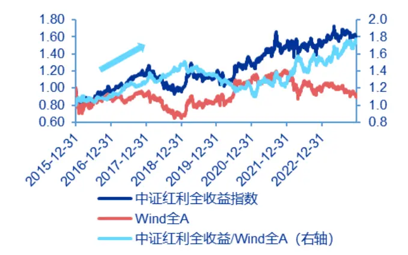
资料来源：Wind，申万宏源研究；数据区间：2015/12/31~2023/12/31

2）股息表现较强：在宏观环境偏差时，作为防御型资产的高股息占优

《红利复盘》报告中，我们指出，红利策略占优与国际宏观环境不确定性、国内行业景气程度相关，并选取美国国债十年期收益率、国内高景气行业占比进行分析。

当美债收益率提升、反映国际宏观环境不确定性增强时，基于避险倾向，红利策略相应占优；而当国内市场景气度预期下降时，具备穿越周期能力的红利策略相对占优。

图3：红利相对表现与十年期美债收益率正相关
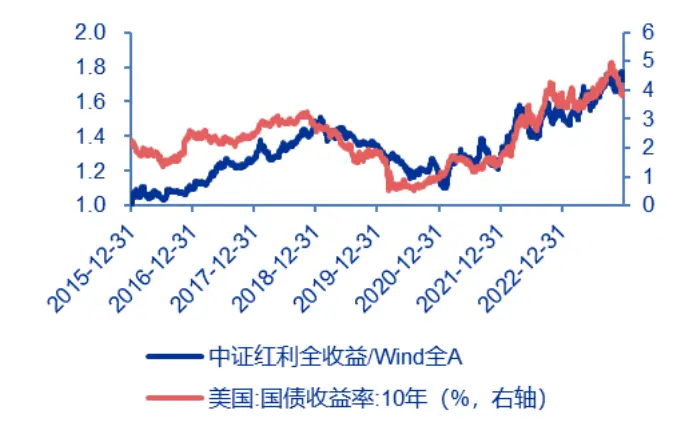
资料来源：iFinD，申万宏源研究

图4：红利相对表现与高景气行业占比负相关
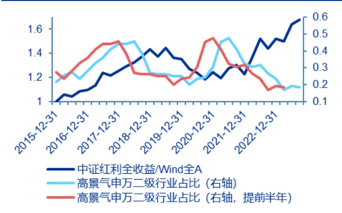
资料来源：Wind，申万宏源研究；数据区间：2015/12/31~2023/12/31

## 3）股息率较高时，股息收益性价比突出

股息率能够反映红利策略所能获取的分红收益率，也能够反映以股利为目标的红利策略的性价比。我们曾在《拆解红利指数：当前红利投资的性价比是看估值还是看股息率？》中发现，修正且调整后的股息率对红利投资的性价比有一定的参考意义，更适用于红利相比主动投资的性价比判断。从历史表现来看，当股息率突破 0.7 倍标准差的上轨、股息率突出时，红利策略的配置价值突出。

图5：中证红利三年平均加权股息率（单位：%）
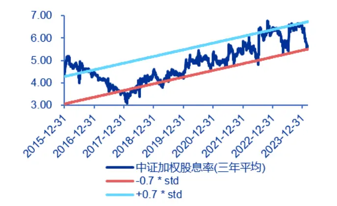

图 6：根据股息率走势得到的超额表现信号时点
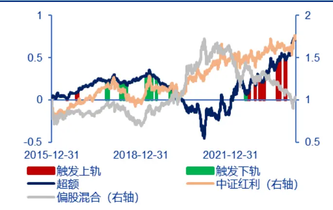
资料来源：Wind，申万宏源研究；数据区间：2015/12/31~2024/3/8；注：超额表现：中证红利全收益较偏股混合基金指数的累计收益表现差值

## 2.质量策略复盘：关注适用指数、库存周期、M1-M2 剪刀差

收益质量的定义：理论上指代会计收益所表达的与企业经济价值有关信息的可靠程度。高质量的收益，指企业报表能够比较可靠地反映企业过去、现在的经营状况与未来的经济前景。简单来说，高收益质量的企业更有可能延续其报表所显示的经营状况。

对于会计而言，收益质量的分析依赖于对报表条目真实性可靠性的考量。而对于选股而言，这一框架可以适度简化，转变为关注企业盈利的“质”与“量”等细分维度，并进而关注企业的 ROE、ROA、现金流量等反映经营状况的指标。

目前，中证指数公司提供了多项质量类指数，如中证质量成长指数、300 质量成长指数、红利质量指数等。虽然指数的因子构建方法不尽相同，但我们可以发现指数均注重盈利能力、盈利质量、盈利成长等多方面的能力，指数间的表现也具备一定的共性，接下来我们会以这些质量指数为基础展开分析

表2：指数质量因子的构建方法对比

| 代码 | 930855 | 931155 | 930939 | 931468 |
| --- | --- | --- | --- | --- |
| 指数简称 | 中证质量 | 300 质量 | 500 质量 | 红利质量 |
| 质量因子构成方法 | 由细分因子归一化后等权 构建，细分因子包括： ROA、盈利成长因子、现金 流量因子、回归得到的盈利 质量因子 | 由细分因子归一化后加权构建， 细分因子包括： 盈利能力因子、成长能力因子、 盈利质量因子、财务杠杆 |  | 由细分因子归一化后等权构 建，细分因子包括： 每股净利润、每股未分配利润、 盈利质量因子、毛利率、盈利 |

资料来源：指数官网，申万宏源研究

质量筛选的逻辑：高盈利质量的企业，其收益可靠性、经营持续性较强，与其他企业相比，在面临经济回落时，高盈利质量的企业可以依靠持续性的收益度过难关，并在复苏到来时具有更强的投资扩产/并购扩张的成长能力。

## 1）质量的作用——在优质企业中再精选

纯粹的质量因子表现并不好：这与纯粹量化筛选的逻辑有关，在对收益质量的定义做分析后，我们可以发现收益质量不能单纯地从企业的报表分析指标中得出，还需要对企业的实际经营状况、会计政策、收入来源等方面做详尽的分析。量化指标仅仅只是浓缩了的、可以依靠财务报表简易分析的指标，不能完全反映企业的实际经营状况。因此，对全部 A股做质量筛选的效果并不好。

图 7：中证质量成长 vs 中证全指
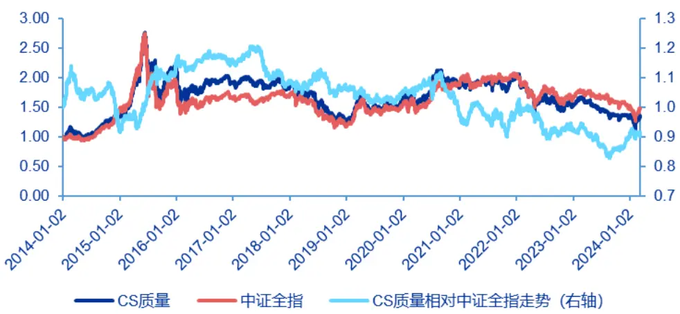
资料来源：Wind，申万宏源研究；数据区间：2014/1/1~2024/3/8

质量因子依赖适当的选股环境：在宽基中，质量因子存在明显作用：虽然纯粹依赖量化因子的筛选结果并不好，但这并不代表质量因子缺乏筛选作用。实际上，当我们将股票池聚焦到研究深入、认可度高的大市值企业时，质量因子的筛选作用会逐渐凸显，也就是说，质量因子的利用需要找到适当的 Beta 环境。我们以“沪深 300 vs300 质量”、“中证 500 vs 500 质量”两对为例进行分析。

在高质量企业内，质量因子在盈利能力&盈利成长的筛选作用更加突出：从 300质量的相对表现来看，质量指数在 2015~2017 年间的作用最为突出，在 2019~2020年间也具有一定筛选作用，而自 2021 年起相对表现逐渐回撤。2019 年起的表现与成长/价值相对表现高度相关，这是因为，质量因子在考虑盈利质量的同时，往往同步考虑企业的盈利能力与盈利成长，对于沪深 300 这类市值最高、最能反映市场环境的一批股票而言，其收益质量端存在一定同质化，而盈利能力、盈利成长的区别更加突出，最终促使 300 质量偏向于食品饮料、电力设备、医药生物等具有大盘成长属性的股票。

图 8：300 质量 vs 沪深 300
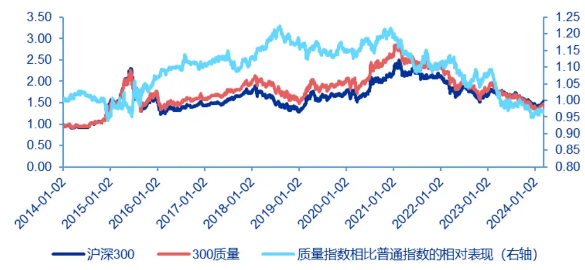
资料来源：Wind，申万宏源研究；数据区间：2014/1/1~2024/3/8

表3：300质量与沪深300的行业构成对比
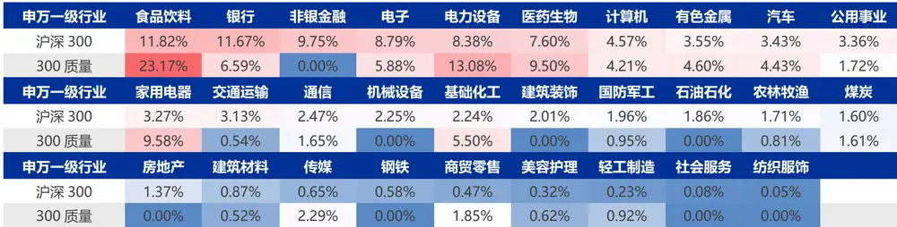
资料来源：iFinD，申万宏源研究；数据截止：2023/12/31

在具备成长属性股票内，质量因子的收益质量筛选效果更加突出：在中证 500成分股下，质量因子的筛选效果更为优秀。质量的相对表现曲线自 2015 年以来持续上升，直至 2022Q1，随后 500 质量出现一定回撤；2024 年以来，质量因子的表现再度突出。这种作用来源于对收益质量的筛选：从最新一期的指数行业构成来看，500质量低配了计算机、电子、国防军工等科技、先进制造属性较强的企业，转而增配医药生物、电力设备、有色金属、基础化工等周期、成长属性的企业，强化了成分股的经营持续性。

图 9：500 质量 vs 中证 500
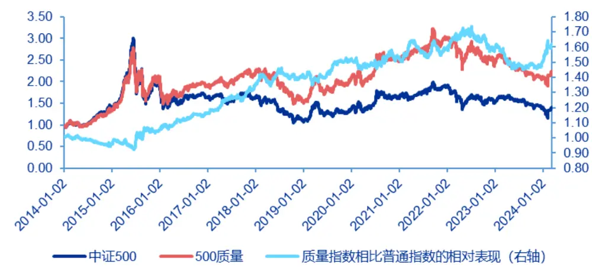
资料来源：Wind，申万宏源研究；数据区间：2014/1/1~2024/3/8

表 4：500 质量与中证 500 的行业构成对比

| 申万一级行业 | 医药生物 | 电力设备 电子 |  | 非银金融 | 有色金属 国防军工 |  | 基础化工 计算机 机械设备 传媒 |  |  |  |
| --- | --- | --- | --- | --- | --- | --- | --- | --- | --- | --- |
| 中证500 | 12.36% | 9.72% | 9.65% | 6.75% | 6.17% | 5.71% | 5.54% | 4.80% | 4.02% | 3.55% |
| 500质量 | 12.92% | 12.15% | 7.09% | 1.15% | 13.18% | 1.25% | 6.43% | 3.02% | 2.76% | 3.76% |
| 申万一级行业 | 汽车 | 公用事业 | 交通运输 | 银行 | 煤炭 | 钢铁 | 食品饮料 | 通信 | 家用电器 | 农林牧渔 |
| 中证500 | 3.37% | 2.60% | 2.54% | 2.30% | 2.23% | 2.22% | 2.19% | 1.69% | 1.48% | 1.32% |
| 500 质量 | 6.99% | 2.21% | 2.42% | 3.59% | 2.56% | 0.32% | 2.27% | 2.00% | 4.41% | 0.49% |
| 申万一级行业 | 石油石化 | 商贸零售 | 房地产 | 社会服务 | 建筑材料 | 环保 | 轻工制造 | 建筑装饰 | 纺织服饰 | 美容护理 |
| 中证500 | 1.24% | 1.24% | 1.17% | 1.14% | 1.12% | 0.93% | 0.91% | 0.80% | 0.66% | 0.38% |
| 500 质量 | 0.00% | 0.22% | 0.56% | 0.68% | 0.80% | 1.36% | 4.13% | 0.00% | 1.31% | 0.00% |

资料来源：iFinD，申万宏源研究；数据截止：2023/12/31

## 2）质量的适合环境复盘

整体来看，质量因子在适当的 Beta 环境（如沪深 300、中证 500 等）中具有精选作用。从分析来看，质量因子具有在优质企业中做进一步精选的作用：通过在股票池中筛选盈利能力、盈利质量、盈利成长均占优的企业，可在沪深 300、中证 500等优质股票进一步精选经营持续性强、具备成长性的企业，从而在部分时段内实现绩优。

从构成上看，这一绩优具有两方面的原因：1）较强的盈利能力与盈利质量，促使企业在市场弱势环境下也能维持盈利表现，实现利润的积累，在面临复苏、企业扩产的环境下，企业能够依靠自有资金迅速完成扩产，从而实现业绩的领先，并进而出现占优的股价表现；2）较持续的盈利成长能力，使得在经济繁荣、补库扩产环境下，高收益质量企业具有可持续的扩张能力，持续性的增长最终实现了股价表现的占优。

由于占优时段与企业实际经营情况高度相关，我们依靠库存周期这一项维度进行观察。具体而言，我们使用“规模以上工业企业:产成品存货:累计同比”与“规模以上工业企业：营业收入：累计同比”这两项展开分析。一般而言，对于每一段库存周期，我们均可划分为被动去库、主动补库、被动补库、主动去库四个阶段。

前述的两项原因，促使高收益质量企业在库存周期内主动补库环节中整体占优；其中，相比于 2020~2021 国际宏观影响剧烈的时段，2016/6~2018/8 这段主动补库环境下的质量占优根据一致性。而在被动补库&主动去库的环境下，质量的表现也随之偏弱：2018/8~2019/10 区间出现一轮去库存阶段，此时 300 质量的相对表现从高位出现回落；2022/2 起出现新一轮被动补库&主动去库阶段，500 质量的相对表现也逐渐出现回撤。

图 10：基于工业营业收入同比&产成品累计同比的库存周期划分（单位：%）
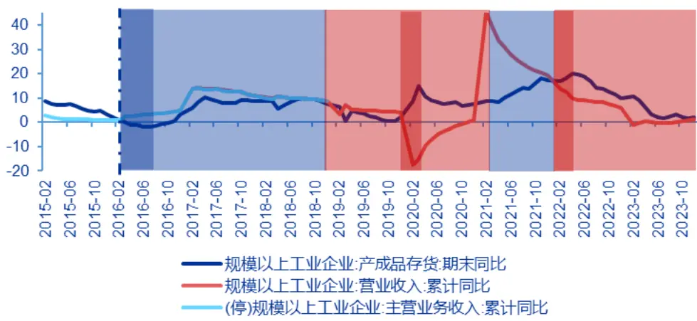
资料来源：iFinD，申万宏源研究；数据区间：2015/1~2023/12

投资热情高涨时，高质量相对占优：我们也可以从宏观经济环境整体观察质量的相对表现，这里使用 M2、M1 同比增速反映宏观环境的情况。当 M1、M2 剪刀差为正，或差值上升时，表明市场的消费、投资热情相对较高，经济活力较强，此时收益质量较好的企业具有较稳健的投资扩产预期，质量表现也因此占优。从历史环境来看，2016/1~2018/3 与 2020/1~2021/1 均符合这一特征。

图 11：基于 M2、M1 同比增速的经济环境划分（单位：%）
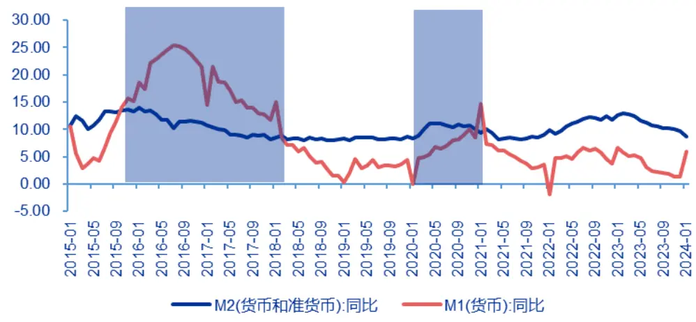
资料来源：iFinD，申万宏源研究；数据区间：2015/1~2024/1

## 1.2现状：建议关注股息率+潜在内生增长率

12 月调仓后，中证红利成分股行业集中度明显增强：从表 1 中的行业分布中可以看到，目前中证红利成分股高度集中于银行、煤炭、交通运输等前五大行业，此外银行、煤炭、石油石化的成交额占比明显高于行业配比，揭示上述行业成分股的关注度较高、存在一定交易层面的拥挤现象；其中，煤炭成分股今年以来的换手率已达0.73 倍，较高的换手率同样提示成分股存在拥挤现象。

图 12：红利指数成分股的行业流动性对比
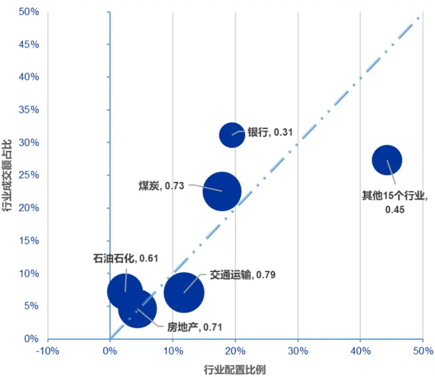
资料来源：Wind，申万宏源研究；数据截至：2024/3/8；成分股数据截至：2023/12/31；气泡大小&行业标签旁数字含义：今年以来的行业整体换手率，使用“加权成交额/加权自由流通

## 市值”计算而来

股息率性价比有明显下降：基于《拆解红利指数：当前红利投资的性价比是看估值还是看股息率？》的测算方法，我们发现当下中证红利指数的股息率逼近-0.7 倍标准差的下轨，与早期接近上轨的股息率相比，目前偏低的股息率反映红利策略的性价比有明显下降。

图 13：中证红利指数加权股息率的趋势和上下0.7倍标准差走势（单位：%）
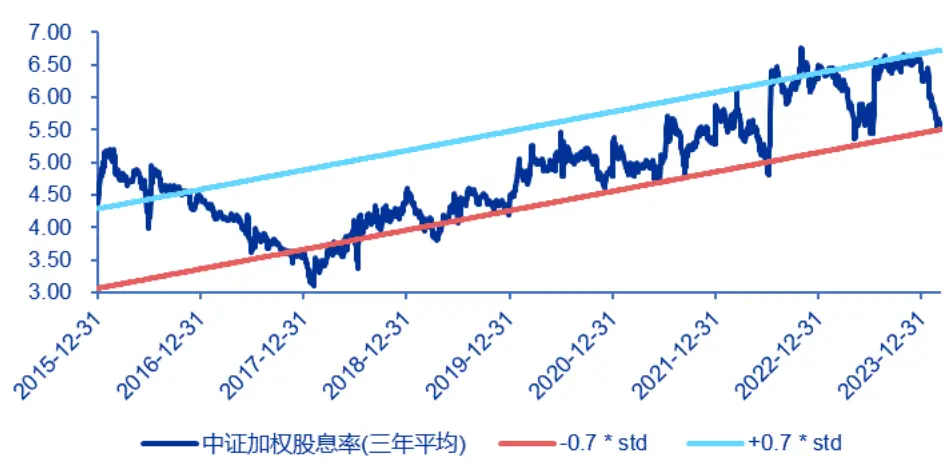
资料来源：Wind，申万宏源研究；数据区间：2015/12/31~2024/3/8

风格暴露反映基金中存在一定红利拥挤现象：此外，虽然我们难以获取基金的准确持仓，但可以依靠风格暴露情况的数据，反映公募基金在红利策略上的拥挤度。从测算结果来看，今年以来主动权益基金在红利策略的暴露度明显提升，这一暴露难以被小盘价值风格所解释，反映在基金配置层面红利策略已经具有一定的拥挤现象。

图 14：主动权益基金的风格暴露情况
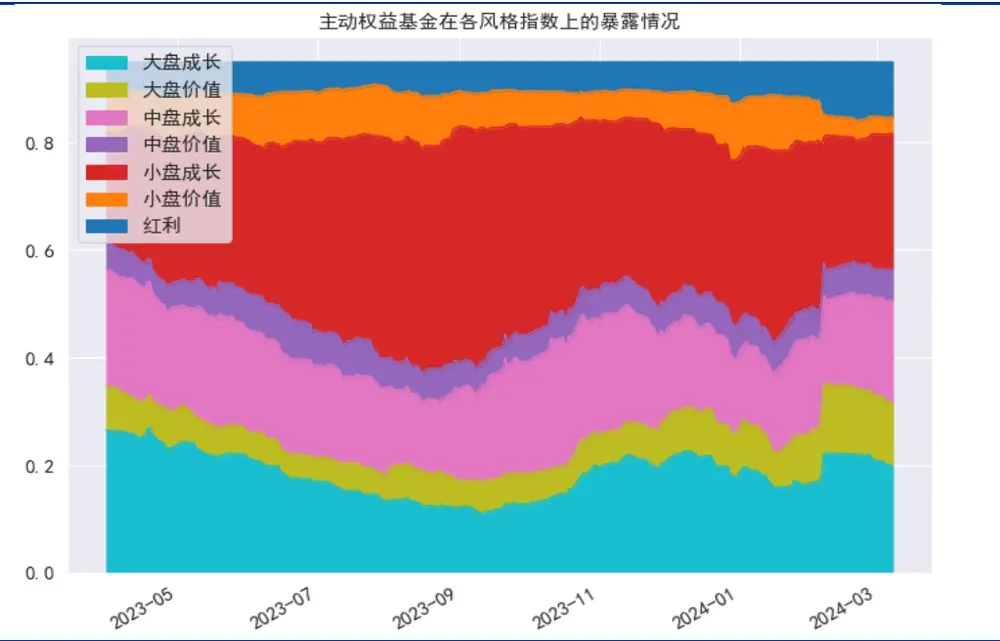
资料来源：Wind，申万宏源研究；数据区间：2023/3/31~2024/3/8

目前，全国库存产成品同比已位于低位、产成品同比与营收同比增速的差距逐渐缩小，表明库存周期已接近尾声。在当前环境下企业未来的增长也是考虑的重要一环；其中，由企业自身现金流反映的内生增长率是增长率的重要参考指标。

所谓内生增长率，是指在公司完全不对外融资，且不变现内部金融资产的情况下，其预测增长率的最高水平，也即在货币偏紧、市场环境恶化的环境下，企业能够依靠自身实现增长的比例。其计算公式为：

$$
A\pm\pm\frac{160}{16}\pm\frac{20}{4}g=(1.00A^{\star}b)/(1-1-0.0A^{\star}b)
$$

其中 ROA 为总资产收益率，b 为留存收益率=1-股利支付率。这一增长率反映在经营环境不变、且企业能够持续扩张的前提下，企业依靠自身盈利所能实现最高增长率，也即反映了在扩张阶段企业的成长空间。

内生增长率+股息率反映当下投资性价比：对比代表性质量指数与相关指数，我们可以发现：1）仅考虑股息率情况下，质量指数普遍不如红利指数，表明在扩产难以确定的情况下，高股息投资具备较强性价比；2）同时考虑内生增长率与股息率的环境下，质量类指数的未来成长空间普遍占优，盈利增长+分红双重收益下的性价比更为突出；3）在中证红利指数股息率回落、从 6.5%附近降至 5.5%附近的当下，考虑内生增长率后，红利策略的投资性价比已不足同期的 300 质量、500 质量指数。

表5：代表性指数的股息率+内生增长率分布表

| 指数特征 | 红利质量 | 中证红利 | 300 质量 | 沪深 300 | 500 质量 | 中证500 |
| --- | --- | --- | --- | --- | --- | --- |
| 加权 ROA | 14.32% | 5.29% | 11.99% | 7.52% | 9.76% | 5.04% |
| 加权内生增长率 | 8.32% | 2.49% | 6.71% | 4.51% | 6.63% | 2.42% |
| 加权股息率 | 2.36% | 5.58% | 2.11% | 2.97% | 1.58% | 1.42% |
| 股息率+内生增长率 | 10.68% | 8.07% | 8.82% | 7.47% | 8.21% | 3.84% |

资料来源：iFinD，申万宏源研究；指数成分数据、财务报表数据截至：2023/12/31；股息率数据截至：2024/3/8

## 2.市场三大矛盾下的思考：高质量与红利如何决策？

长期来看红利与质量都是有效的选股指标，但现在的市场环境呈现出三大矛盾点：

（1）从拥挤度与赔率的角度出发：目前红利呈现出较高的拥挤度，例如红利因子自 2021 年以来长达三年时间的风格占优、主动权益基金今年以来在红利因子上明显加大暴露、中证红利的股息率触及下轨线等等；而质量因子的赔率明显较高，例如考虑内生增长率之后的质量类指数投资性价比明显提升、今年以来质量类因子超额开始回升等。

（2）从宏观经济背景的角度出发，红利策略似乎更占优：在经济弱复苏背景下红利策略相对更占优，而高收益质量企业在库存周期下的主动补库环节中整体占优。

（3）投资者的心理矛盾：前期高股息股票的涨幅过高，热门题材炒作的波动与回撤较大，无市场主线背景下如何参与权益市场。

而上述论证的高质量红利正是解决上述困惑的哑铃策略：长期业绩突出、在风格切换时影响有限、适应的市场环境更加多元化。后续我们分别以股票、基金投资作为载体，探讨红利+质量策略的可行性。

## 2.1 市场环境适应力更强的选股策略：股息率打底+高质量为先

质量策略依赖底池 Beta 属性，而宽基指数更偏向于市值 Beta：虽然 300 质量、500 质量的筛选逻辑已经较为完善，但基于宽基指数的筛选方法，实际假设了大市值股票一般具有较强的经营能力、较稳定的收益结构等因素，从而能够在此基础上进一步精选高收益质量的股票。然而，宽基的筛选逻辑源于市值属性，而市值属性的策略性偏弱，较难直接与宏观环境联系起来。

国际不确定性持续突出、市场景气程度仍较低的背景下，红利策略可作为筛选底池的有效策略：高股息是一种同时关注经营（股利支付率）与估值（市盈率倒数）的指标，从筛选逻辑上看，使用高股息率股票构建底池，能够更有效地筛选出收益稳定、经营持续性突出的企业，从而能够更好地发挥质量的筛选作用；而从市场环境上来看，当下国际不确定性依旧突出，市场整体景气度仍维持在较低水平，提示高股息策略依旧具有适应的宏观逻辑。从股票结构与宏观环境来看，高股息股票是一类更加适合构建底池的个股。

在股息率筛选的基础上，应用质量的筛选逻辑时，虽然个股同样具有高股息的特征，但整体的筛选逻辑却与高股息策略不同：红利+质量的筛选逻辑并不注重过高的分红，而在于注重企业较强的经营能力与内生增长率，追求在长期环境下同时收获盈利增长+股利分红的收益。

我们通过简易的筛选逻辑，展示质量因子的筛选作用：

1） 回测区间：2014/12/31~2024/3/8；

2）调仓时点：2014~2023 年间，每年 6 月 30 日与 12 月 31 日；

3）样本空间&质量因子构建：剔除日均总市值、日均成交金额位于后 20%的个股后，使用“每股净利润”、“每股未分配利润”、“ROE”、“毛利率”、“经营活动现金流 TTM-营业利润 TTM）/最新财报总资产”五因子等权求得质量综合因子；等权求和前先对各因子做归一化，归一化时考虑行业中性化。

4）依靠高股息构建底池：筛选近三年平均现金股息率位于样本空间前 5%的个股。经统计，这部分股票的近三年平均现金股息率普遍位于 2%以上；2020年以来底池个股的近三年平均现金股息率普遍位于 3%以上。

5）使用质量因子得到最终组合：在 4）中筛出的高股息底池股中，仅保留质量综合因子位于样本空间前 60%的个股，并使用这些个股等权构建模拟组合。

经过筛选，我们发现红利+质量的相对表现与 300 质量、500 质量的相对表现具有高度的一致性——在面临 2020/3~2021/6 去库存、2022 年以来去库存两段时间内，模拟组合的相对表现或波动、或出现一定回撤；而在其余时段内模拟组合均相对占优。

图 15：高股息底池中，红利+质量模拟组合vs 中证红利全收益
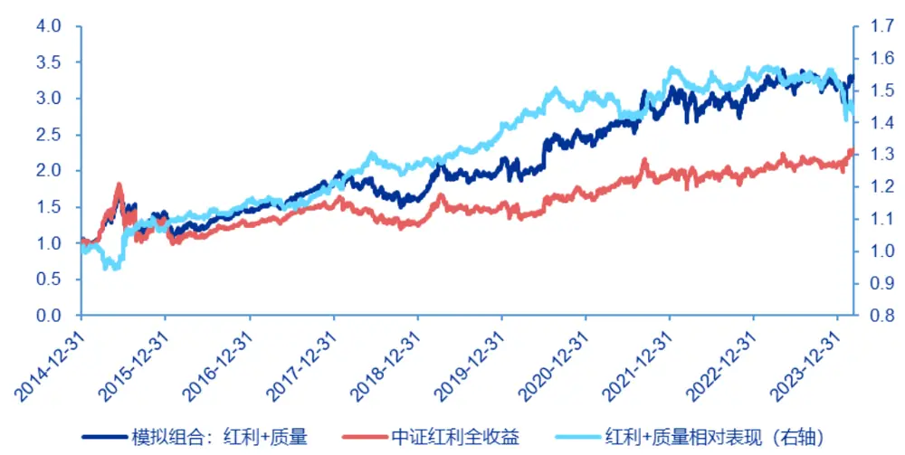
资料来源：Wind，申万宏源研究；数据区间：2014/12/31~2024/3/11

表6：23H2模拟组合质量自由流通市值靠前的成分股

| 股票代码 | 股票简称 | 所属行业 | 每股 净利润 | 每股 未分配利润 | ROE | 毛利率 | 盈利质量 | 综合得分 | 近三年平均 现金股息率 | 今年以来 收益率 | 自由流通市值 (亿元) |
| --- | --- | --- | --- | --- | --- | --- | --- | --- | --- | --- | --- |
| 000651.SZ | 格力电器 | 家用电器 | 96.4% | 98.2% | 91.1% | 62.5% | 64.3% | 82.5% | 6.77 | 27.35% | 2,130.58 |
| 601088.SH | 中国神华 | 煤炭 | 91.4% | 97.1% | 48.6% | 62.9% | 37.1% | 67.4% | 8.08 | 26.79% | 1,064.64 |
| 601857.SH | 中国石油 | 石油石化 | 90.6% | 93.8% | 81.3% | 78.1% | 56.3% | 80.0% | 4.72 | 30.03% | 1,009.66 |
| 601225.SH | 陕西煤业 | 煤炭 | 88.6% | 82.9% | 94.3% | 65.7% | 20.0% | 70.3% | 5.85 | 31.79% | 930.84 |
| 601919.SH | 中远海控 | 交通运输 | 100.0% | 97.8% | 100.0% | 54.4% | 18.9% | 74.2% | 9.32 | 11.27% | 728.39 |
| 600048.SH | 保利发展 | 房地产 | 97.7% | 98.8% | 86.0% | 55.8% | 44.2% | 76.5% | 4.56 | -8.69% | 674.25 |
| 000002.SZ | 万科A | 房地产 | 96.5% | 96.5% | 83.7% | 48.8% | 32.6% | 71.6% | 5.07 | -12.24% | 594.30 |
| 601006.SH | 大秦铁路 | 交通运输 | 81.1% | 76.7% | 60.0% | 64.4% | 16.7% | 59.8% | 7.37 | 3.19% | 588.22 |
| 600019.SH | 宝钢股份 | 钢铁 | 67.6% | 86.5% | 51.4% | 37.8% | 78.4% | 64.3% | 7.10 | 15.68% | 553.08 |
| 600585.SH | 海螺水泥 | 建筑材料 | 100.0% | 100.0% | 61.9% | 47.6% | 23.8% | 66.7% | 5.94 | 5.50% | 492.86 |

资料来源：iFinD，申万宏源研究；调仓时点：2023/12/31；第四到八列为质量因子分位数数据，且已经考虑行业中性化

从历年表现来看，高质量红利在主动补库存的 2016~2018 年间表现持续突出，2021 年的表现也受主动补库影响较为出色；而 2022 年以来主动去库存阶段，模拟组合表现虽整体不及中证红利指数，但收益表现同样远超同期的 Wind 全 A 指数。

表7：模拟组合历年收益表现——对比中证红利全收益&Wind全A

|  | 高质量红利模拟组合收益率 | 中证红利全收益收益率 | Wind 全 A 收益率 |
| --- | --- | --- | --- |
| 2015年 | 40.32% | 29.89% | 38.50% |
| 2016年 | 2.37% | -4.30% | -12.91% |
| 2017年 | 27.20% | 21.34% | 4.93% |
| 2018年 | -11.66% | -16.15% | -28.25% |
| 2019年 | 31.47% | 20.88% | 33.02% |
| 2020年 | 16.94% | 8.18% | 25.62% |
| 2021年 | 25.04% | 18.19% | 9.17% |
| 2022年 | -0.30% | -0.37% | -18.66% |
| 2023年 | 5.61% | 6.34% | -5.19% |
| 2024年 | 4.16% | 10.39% | -1.85% |
| 全期数据 | 230.72% | 128.61% | 25.38% |

资料来源：Wind，申万宏源研究；数据区间：2014/12/31~2024/3/11

高质量红利组合具有一定的行业自适应效果，能够灵活调整成分股的行业分布，其中在传媒、煤炭、汽车、公用事业等行业的适应性调整效果较为明显。不过模拟组合也有部分长期偏好的行业，如交通运输、房地产等。

图16：模拟组合的行业配置情况

| 行业/报告期2 | 01412312 | 0150630201512312 |  | 0160630201612312 |  | 01706302 | 01712312 | 0180630201812312 |  | 01906302 | 01912312 | 0200630202012312 |  | 0210630 | 20211231 | 2022063020221231 |  | 2023063020231231 |  |
| --- | --- | --- | --- | --- | --- | --- | --- | --- | --- | --- | --- | --- | --- | --- | --- | --- | --- | --- | --- |
| 交通运输 | 17.95% | 21.43%21.43% |  | 12.82% | 7.89% | 6.52% | 9.09% | 18.97% | 14.81% | 14.29% | 13.33% | 9.52% | 8.33% | 6.58% | 10.14% | 11.76% 12.79% |  | 17.24% | 16.67% |
| 房地产 | 2.56% | 2.38% 2.38% |  | 0.00% | 0.00% | 6.52% | 4.55% | 13.79% | 14.81% | 17.86% | 16.67% | 14.29% | 15.00% | 18.42% | 17.39% | 17.65% 17.44% |  | 12.64% | 13.10% |
| 传媒 | 0.00% | 0.00% 0.00% |  | 0.00% | 0.00% | 0.00% | 0.00% | 0.00% | 1.85% | 1.79% | 1.67% | 1.59% | 1.67% | 2.63% | 2.90% | 5.88% | 5.81% | 9.20% | 9.52% |
| 煤炭 | 10.26% | 7.14% 7.14% |  | 2.56% 2.63% |  | 2.17% 2.27% |  | 0.00% | 1.85% | 1.79% | 1.67% | 7.94% | 8.33% | 11.84% | 10.14% | 8.24% | 9.30% | 6.90% | 8.33% |
| 纺织服饰 | 7.69% | 4.76% | 7.14% | 5.13% | 5.26% | 4.35% | 6.82% | 6.90% | 7.41% | 7.14% | 5.00% | 3.17% | 3.33% | 10.53% | 7.25% | 5.88% | 4.65% | 8.05% | 8.33% |
| 钢铁 | 7.69% | 2.38% | 2.38% | 2.56% | 2.63% | 2.17% | 2.27% | 1.72% | 3.70% | 5.36% | 6.67% | 11.11% | 8.33% | 5.26% | 5.80% | 7.06% | 9.30% | 6.90% | 7.14% |
| 基础化工 | 2.56% | 4.76% | 0.00% | 2.56% | 2.63% | 2.17% | 2.27% | 5.17% | 5.56% | 1.79% | 1.67% | 1.59% | 3.33% | 2.63% | 2.90% | 7.06% | 8.14% | 5.75% | 5.95% |
| 建筑材料 | 0.00% | 0.00% | 0.00% | 2.56% | 2.63% | 4.35% | 4.55% | 3.45% | 3.70% | 5.36% | 3.33% | 4.76% | 3.33% | 5.26% | 5.80% | 8.24% | 6.98% | 8.05% | 5.95% |
| 医药生物 | 5.13% | 0.00% 0.00% |  | 0.00% | 0.00% | 0.00% | 0.00% | 0.00% | 0.00% | 0.00% | 0.00% | 3.17% | 3.33% | 6.58% | 7.25% | 3.53% | 4.65% | 3.45% | 3.57% |
| 商贸零售 | 2.56% | 2.38% | 2.38% | 5.13% | 10.53% | 6.52% | 6.82% | 3.45% | 1.85% | 3.57% | 3.33% | 0.00% | 1.67% | 1.32% | 0.00% | 2.35% | 1.16% | 2.30% | 3.57% |
| 家用电器 | 2.56% | 4.76% | 4.76% | 7.69% | 7.89% | 8.70% | 9.09% | 5.17% | 5.56% | 5.36% | 5.00% | 4.76% | 6.67% | 2.63% | 4.35% | 1.18% | 2.33% | 4.60% | 3.57% |
| 建筑装饰 | 0.00% | 2.38% | 2.38% | 2.56% | 2.63% | 2.17% | 2.27% | 1.72% | 1.85% | 1.79% | 1.67% | 1.59% | 0.00% | 1.32% | 1.45% | 4.71% | 4.65% | 3.45% | 3.57% |
| 环保 | 2.56% | 2.38% | 2.38% | 2.56% | 0.00% | 0.00% | 0.00% | 0.00% | 0.00% | 0.00% | 0.00% | 0.00% | 0.00% | 2.63% | 1.45% | 2.35% | 0.00% | 0.00% | 2.38% |
| 石油石化 | 5.13% | 4.76% | 4.76% | 5.13% | 5.26% | 4.35% | 2.27% | 1.72% | 1.85% | 3.57% | 3.33% | 3.17% | 1.67% | 1.32% | 1.45% | 3.53% | 2.33% | 2.30% | 2.38% |
| 公用事业 | 5.13% | 9.52% | 9.52% | 15.38% | 13.16% | 19.57% | 15.91% | 10.34% | 9.26% | 7.14% | 8.33% | 3.17% | 1.67% | 3.95% | 5.80% | 2.35% | 1.16% | 1.15% | 1.19% |
| 机械设备 | 7.69% | 2.38% | 2.38% | 0.00% | 0.00% | 0.00% | 0.00% | 0.00% | 0.00% | 5.36% | 5.00% | 1.59% | 1.67% | 2.63% | 2.90% | 2.35% | 4.65% | 1.15% | 1.19% |
| 汽车 | 7.69% | 9.52% | 9.52% | 7.69% | 10.53% | 8.70% | 9.09% | 12.07% | 11.11% | 10.71% | 11.67% | 11.11% | 13.33% | 5.26% | 4.35% | 3.53% | 3.49% | 3.45% | 1.19% |
| 电子 | 2.56% | 4.76% | 4.76% | 2.56% | 2.63% | 4.35% 4.55% |  | 1.72% | 3.70% | 0.00% | 0.00% | 1.59% | 1.67% | 0.00% | 0.00% | 0.00% | 0.00% | 1.15% | 1.19% |
| 轻工制造 | 5.13% | 2.38% | 4.76% | 2.56% | 2.63% | 2.17% | 2.27% | 1.72% | 0.00% | 1.79% | 1.67% | 3.17% | 3.33% | 2.63% | 2.90% | 0.00% | 0.00% | 0.00% | 1.19% |
| 电力设备 | 2.56% | 2.38% | 2.38% | 5.13% | 5.26% | 2.17% | 2.27% | 1.72% | 0.00% | 0.00% | 1.67% | 1.59% | 1.67% | 1.32% | 1.45% | 0.00% | 0.00% | 0.00% | 0.00% |
| 食品饮料 | 2.56% | 4.76% | 7.14% | 12.82% | 13.16% | 10.87% | 11.36% | 6.90% | 9.26% | 1.79% | 3.33% | 6.35% | 5.00% | 3.95% | 2.90% | 1.18% | 0.00% | 1.15% | 0.00% |
| 有色金属 | 0.00% | 2.38% | 2.38% | 2.56% | 2.63% | 0.00% 0.00% |  | 0.00% | 0.00% | 1.79% | 1.67% | 1.59% | 3.33% | 1.32% | 1.45% | 0.00% 0.00% |  | 1.15% | 0.00% |
| 非银金融 | 0.00% | 2.38% | 0.00% | 0.00% | 0.00% | 0.00% 0.00% |  | 0.00% | 0.00% | 0.00% 0.00% |  | 0.00% | 0.00% | 0.00% | 0.00% | 0.00% | 0.00% | 0.00% | 0.00% |
| 美容护理 | 0.00% | 0.00% 0.00% |  | 0.00% 0.00% |  | 2.17% 2.27% |  | 0.00% | 0.00% | 0.00% | 0.00% | 0.00% | 0.00% | 0.00% | 0.00% | 0.00% | 0.00% | 0.00% | 0.00% |
| 农林牧渔 | 0.00% | 0.00% 0.00% |  | 0.00% 0.00% |  | 0.00% 0.00% |  | 3.45% | 1.85% | 1.79% | 3.33% | 1.59% | 1.67% | 0.00% | 0.00% | 1.18% | 1.16% | 0.00% | 0.00% |
| 计算机 | 0.00% | 0.00% 0.00% 0.00% 0.00% 0.00% 0.00% |  |  |  |  |  | 0.00% 0.00% 0.00% 0.00% |  |  |  | 1.59% 1.67% |  | 0.00% 0.00% |  | 0.00% 0.00% |  | 0.00% 0.00% |  |

资料来源：Wind，申万宏源研究；数据区间：2014/12/31~2024/3/8

这一结果表明，基于质量的选股逻辑具有较强的适用性，能够有效在高股息底池中做进一步的精选。而强调盈利增长与高股息并重的收益策略，在面临企业补库、投资扩产时，企业自身的内生增长叠加较强的股息表现，使得该策略具有更强的性价比。

当下工业产成品同比再次位于低位、产成品同比与营收同比增速的差距逐渐缩小，表明库存周期临近尾声，在这一环境下内生增长率的指示性突出，红利+质量这一多元化选股策略也因此较为适应当下的市场。

## 2.2长期有效的基金投资策略：红利与质量的哑铃策略

⚫ 寻找高质量红利策略基金：红利与质量的哑铃策略

高质量红利策略的指标筛选：高质量红利策略需要兼顾红利与高质量，为了避免分红数据的陷阱，我们认为红利除了股息率之外还需要考虑估值，更偏红利价值策略，分别采用的指标是股票近一年的股息率与 PE（TTM）。同样高质量股票看重的是企业内生增长率、造血能力，因此不仅需要看盈利能力还需要看盈利质量，分别的指标是：过去三年 ROE 均值-过去三年 ROE 标准差、（过去一年经营活动现金流-过去一年营业利润）/最新财报总资产。

表8：高质量红利策略的指标

| 指标 | 计算方法 (均标准化处理) |
| --- | --- |
| 股息率 | 近一年的股息率 |
| 估值 | PE (TTM) |
| 盈利能力 | 过去三年 ROE 均值-过去三年 ROE标准差 |
| 盈利质量 (过去一年经营活动现金流-过去一年营业利润)/最新财报总资产 |  |

资料来源：申万宏源研究

四类不同基金经理的列举：基于每只基金的持仓计算以上的四大指标，并通过规模持仓加权，即可得到每只基金每一期在股息率、估值、盈利能力、盈利质量的具体值。部分行业在股息率或者盈利质量上有明显差异，因此我们先剔除行业主题基金，下表我们罗列出具备代表性的四类基金经理：李锦文管理的南方远见回报因超配煤炭位列非行业主题基金中的股息率第一名，姜诚与王桃管理的中泰红利价值一年持有超配银行较多从而估值较低，股息率较高与估值较低通常会有重叠，例如中泰红利价值一年持有、安信平衡增利以及国寿安保高股息等，更偏红利价值策略。王兆祥管理的国泰估值优势持仓盈利能力更突出，成雨轩管理的中欧时代智慧持仓盈利质量更高，投资风格偏质量成长，在 19-20 年的业绩更加出彩。

表9：基金经理的列举（股息率与估值维度，每一类分别列举 10位，剔除行业主题类基金）

| 持仓股息率较高基金简称 | 基金经理 | 持仓估值较低基金简称 |  |
| --- | --- | --- | --- |
|  |  |  | 基金经理 |
| 南方远见回报A | 李锦文 | 中泰红利价值一年持有 | 姜诚,王桃 |
| 安信平衡增利 A | 张翼飞 | 安信平衡增利 A | 张翼飞 |
| 华宝红利精选 A | 唐雪倩 | 国寿安保高股息 A | 李博闻 |
| 国寿安保高股息 A | 李博闻 | 中泰元和价值精选 A | 姜诚 |
| 中泰红利价值一年持有 | 姜诚,王桃 | 华宝价值发现A | 蔡目荣 |
| 中欧融恒平衡A | 蓝小康 | 瑞达鑫红量化 6 个月持有 A | 袁忠伟 |
| 海通红利优选一年持有期 B | 郭新宇 | 华宝红利精选 A | 唐雪倩 |
| 上银鑫卓A | 卢扬 | 中信保诚四季红A | 吴昊 |
| 南方产业智选 | 恽雷 | 嘉实价值创造三年持有 A | 谭丽 |
| 易方达高质量严选三年持有 | 萧楠 | 安信价值驱动三年持有 | 袁玮 |

资料来源：wind，申万宏源研究；注：采用 2023 年的持仓数据

表10：基金经理的列举（盈利能力与盈利质量维度，每一类分别列举10位，剔除行业主题类基金）

| 持仓盈利能力较强基金简称 基金经理 |  | 持仓盈利质量较高基金简称 |  |
| --- | --- | --- | --- |
|  |  |  | 基金经理 |
| 国泰估值优势 A | 王兆祥 | 中欧时代智慧A | 成雨轩 |
| 银河研究精选 A | 袁曦 | 交银新成长 | 王崇 |
| 民生加银积极成长 | 尹涛 | 嘉实服务增值行业 | 常蓁,牛歌 |
| 诺德周期策略 | 罗世锋 | 嘉实回报灵活配置 | 常蓁 |
| 易方达智造优势 A | 祁禾 | 景顺长城泰保三个月定开 | 刘苏 |
| 国泰致远优势 | 郑有为 | 华夏消费升级A | 黄文倩 |
| 融通先进制造 A | 王迪 | 易方达新常态 | 孙松 |
| 景顺长城核心竞争力 A | 余广 | 安信优势增长 A | 聂世林 |
| 易方达量化策略A | 王建军,黄浩东 | 前海开源中国稀缺资产A | 曲扬 |
| 银河银泰理财分红 | 石磊 | 易方达高质量严选三年持有 | 萧楠 |

资料来源：wind，申万宏源研究；注：采用 2023 年的持仓数据

单一维度的投资策略都会面临市场环境的适应性问题：高股息或者低估值策略在19-20 年弹性不足，高质量策略在 21 年之后一路回撤，但合并之后的红利价值高质量策略（以下简称高质量红利策略）能适应更多的市场环境，策略的最终收益率也更加突出。当市场风格较为极值的时候，高质量红利策略的表现会处于高质量与红利之间，但在风格切换的年份，高质量红利策略的收益反而会更高，例如 2016 年的大小盘风格切换行情、2021 年的抱团瓦解行情。

图17：四种基金投资策略的比较（每一期选取30只基金等权）
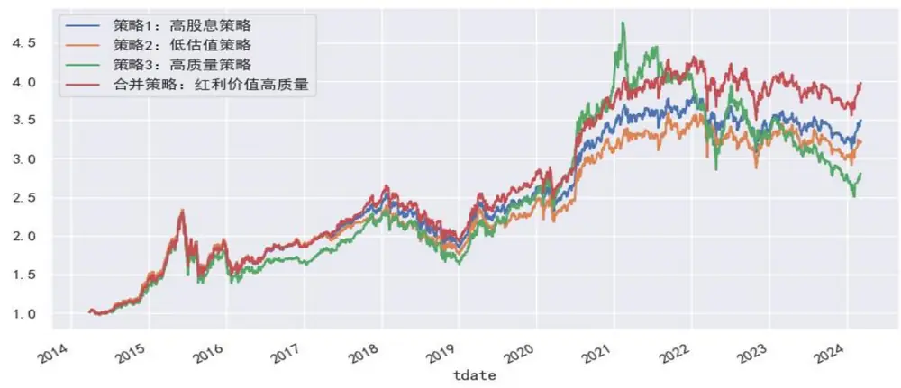
资料来源：wind，申万宏源研究；数据计算区间：2014/4/1-2024/3/6

表 11：四种基金投资策略的年度收益率比较

| 年份/策略 | 策略1:高股息策略 | 策略2:低估值策略 | 策略3:高质量策略 | 合并策略：红利价值高质量 |
| --- | --- | --- | --- | --- |
| 2015年 | 31.92% | 31.33% | 34.65% | 34.24% |
| 2016年 | -1.81% | -1.94% | -6.15% | -1.00% |
| 2017年 | 26.82% | 18.38% | 33.20% | 32.17% |
| 2018年 | -20.52% | -19.63% | -24.34% | -20.44% |
| 2019年 | 39.12% | 36.71% | 52.01% | 43.14% |
| 2020年 | 30.92% | 28.64% | 59.40% | 33.53% |
| 2021年 | 10.14% | 11.15% | 0.55% | 13.38% |
| 2022年 | -10.54% | -8.70% | -19.28% | -9.75% |
| 2023年 | -2.91% | -4.65% | -14.79% | -2.90% |
| 2024年 | 7.17% | 6.03% | 0.16% | 7.30% |

资料来源：wind，申万宏源研究；注：2024 年数据截止 2024/3/6

高质量红利策略基金经理的列举：基于 2023 年的持仓，选取高质量红利指标靠前的 10 只非行业主题基金，10 只基金在估值上都较低（分位数值越大，估值越低），在股息率上部分基金有分化，余广管理的景顺长城核心竞争力持仓在股息率上并不高，投资风格更偏高质量价值；盈利质量的差异性不大，更多是在盈利能力上有差异，例如景顺长城核心竞争力更偏好 ROE 较高的股票。若投资者希望各类指标都尽量靠前，可以做更严格的筛选，例如四类指标需要都处于前 50%分位数，下表中卢扬管理的上银鑫卓、刘旭管理的大成优势企业、姜诚管理的中泰星元价值优选可以满足条件。

表12：高质量红利策略基金经理的列举（列举10位，剔除行业主题类基金）

| 基金代码 | 基金简称 | 基金经理 | 基金规模 (亿元) | 股息率 | 估值 | 盈利能力 | 盈利质量 | 23 年业绩 | 24年业绩 |
| --- | --- | --- | --- | --- | --- | --- | --- | --- | --- |
| 008244.OF | 上银鑫卓 A | 卢扬 | 2.38 | 74.16% | 93.75% | 58.36% | 80.97% | -3.42% | 15.43% |
| 011384.OF | 南方远见回报 A | 李锦文 | 1.36 | 95.91% | 93.37% | 49.87% | 73.37% | 0.78% | 15.05% |
| 009500.OF | 国寿安保高股息 A | 李博闻 | 0.59 | 82.72% | 97.27% | 40.25% | 76.76% | -12.09% | -4.87% |
| 009263.OF | 华宝红利精选 A | 唐雪倩 | 3.59 | 83.03% | 94.98% | 35.22% | 70.85% | 3.87% | 12.92% |
| 013485.OF | 尚正竞争优势 A | 张志梅 | 5.96 | 64.15% | 88.58% | 45.25% | 85.60% | 7.42% | 8.53% |
| 001604.OF | 浙商汇金转型升级 A | 周文超 | 0.10 | 67.54% | 93.96% | 47.62% | 73.72% | -6.37% | 15.17% |
| 012250.OF | 安信平衡增利 A | 张翼飞 | 2.24 | 86.33% | 97.80% | 33.93% | 71.77% | -2.51% | 3.77% |
| 260116.OF | 景顺长城核心竞争力 A | 余广 | 19.86 | 33.46% | 81.29% | 75.06% | 88.94% | -6.51% | 8.14% |
| 008271.OF | 大成优势企业 A | 刘旭 | 11.24 | 66.47% | 88.37% | 52.04% | 72.18% | 0.78% | 7.75% |
| 006567.OF | 中泰星元价值优选 A | 姜诚 | 57.55 | 54.99% | 94.72% | 53.57% | 75.58% | -7.18% | 5.93% |

资料来源：wind，申万宏源研究；注：第 5-8 列为分位数，基金规模截止 23Q4，24 年业绩截止 3/8

## ⚫ 高质量红利策略的长期有效性论证

高质量红利是长期有效，但并不是每年都有效的投资策略：长期看高质量红利策略的基金组合表现更出色，2014/4/1-2024/3/6 的年化收益率为 11.57%，明显高于其他分组，具备长期的投资价值。但该策略并不是每年都有效，例如 2015 年、2019年、2020 年的表现并不出色。

图18：高质量红利策略的长期有效性（分10组测试）
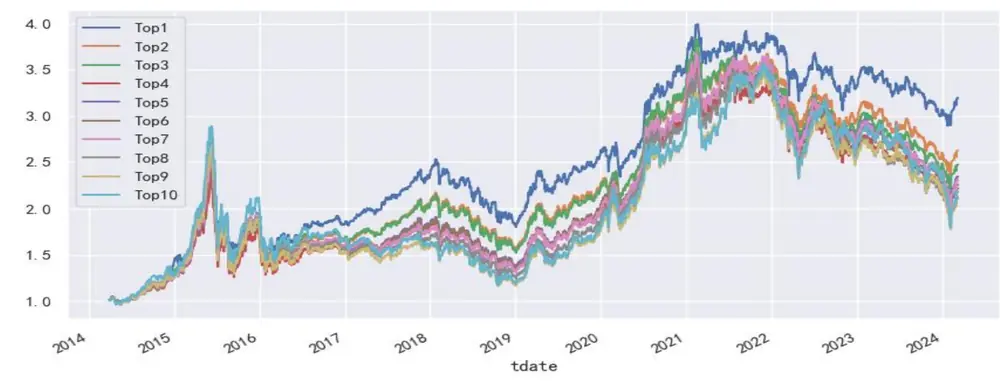
资料来源：wind，申万宏源研究；数据计算区间：2014/4/1-2024/3/6

表13：高质量红利策略的长期有效性（分10组的年度收益率）

| 分组/年份 | Top1 | Top2 | Top3 | Top4 | Top5 | Top6 | Top7 | Top8 | Top9 | Top10 |
| --- | --- | --- | --- | --- | --- | --- | --- | --- | --- | --- |
| 2014年 | 40.54% | 29.14% | 30.65% | 26.29% | 26.00% | 27.25% | 26.03% | 26.88% | 26.10% | 27.64% |
| 2015年 | 35.23% | 40.24% | 44.83% | 37.98% | 45.86% | 46.48% | 50.53% | 47.08% | 47.04% | 63.24% |
| 2016年 | -3.62% | -8.85% | -11.54% | -12.81% | -14.73% | -14.59% | -15.88% | -16.59% | -18.29% | -20.76% |
| 2017年 | 28.65% | 24.05% | 21.22% | 17.11% | 16.60% | 13.45% | 9.80% | 7.53% | 4.40% | -2.65% |
| 2018年 | -22.12% | -22.89% | -23.59% | -23.85% | -24.27% | -24.59% | -24.23% | -24.31% | -25.25% | -25.12% |
| 2019年 | 42.03% | 42.96% | 43.34% | 45.54% | 45.58% | 48.42% | 48.81% | 47.46% | 49.66% | 49.77% |
| 2020年 | 37.87% | 46.98% | 52.77% | 57.83% | 59.21% | 59.60% | 64.39% | 66.12% | 64.56% | 62.42% |
| 2021年 | 7.70% | 8.80% | 5.02% | 5.60% | 9.62% | 7.59% | 9.51% | 9.35% | 15.18% | 18.03% |
| 2022年 | -14.19% | -18.16% | -20.32% | -20.75% | -21.27% | -22.37% | -22.84% | -24.24% | -24.11% | -23.05% |
| 2023年 | -7.52% | -11.86% | -12.41% | -12.94% | -13.29% | -12.51% | -12.28% | -13.36% | -11.23% | -10.02% |
| 2024年 | 4.11% | 0.86% | -0.61% | -2.29% | -2.40% | -4.45% | -4.40% | -5.28% | -6.03% | -9.03% |
| 年化收益率 | 11.57% | 9.52% | 8.91% | 7.78% | 8.35% | 7.95% | 8.17% | 7.29% | 7.35% | 7.60% |

资料来源：wind，申万宏源研究；注：2014 年始于 2014/4/1，2024 年截止 2024/3/6

## 3.如何构建高质量红利策略 FOF 组合？

前文我们已经探讨了红利+质量策略的可行性，发现这一策略在股票、基金端均长期有效。后续我们将主要关注以下 2 个问题：高质量红利策略 FOF 组合应该如何构建，是否可以战胜偏股基金指数与中证红利全收益指数？同是高质量红利策略风格的基金经理在风格与策略上有哪些差异？

## 3.1FOF组合的构建：长期战胜偏股基金指数与中证红利指数

## ⚫ 高质量红利策略 FOF 模拟组合的构造方法

FOF 组合追求的是收益风险比，在同等收益率产品中波动更低，在同等波动产品中收益率更高，我们认为 FOF 是配置思维，并不是强者思维。高质量红利策略作为典型的哑铃策略，是满足 FOF 底仓需求的投资策略。我们采用以下思路构造高质量红利策略 FOF 模拟组合：

（1）基金样本：主动权益基金，其中剔除港股仓位在 50%以上的基金、剔除行业偏离度在前 30%的基金、剔除定开基金/持有期基金；

（2）计算基金的高质量红利得分=股息率因子+估值因子+高质量因子（盈利能力因子与盈利质量因子的合并），因子数据标准化处理，采用基金的全持仓数据规模加权计算；

（3）半年报、年报公布之后调仓，选取近两期高质量红利得分靠前的 50 只基金；

（4）剔除规模在 1 亿元以下或 5 亿元以上的基金，在剩余基金中选取滚动近一年 Alpha 靠前的 15 只基金。

基于以上的计算步骤，我们构造出高质量红利策略的 FOF 组合，2014/4/1-2024/3/8 模拟组合的年化收益率为 17.68%，其中 wind 偏股基金指数的年化收益率为 8.14%，中证红利（全收益）指数的年化收益率为 13.61%，组合长期收益突出，在 17 年、19 年、20 年质量因子占优的背景下，组合能跟上市场相对收益，在 21 年之后的抱团瓦解行情中仍然有绝对收益。

图19：高质量红利策略的 FOF组合（净值走势）
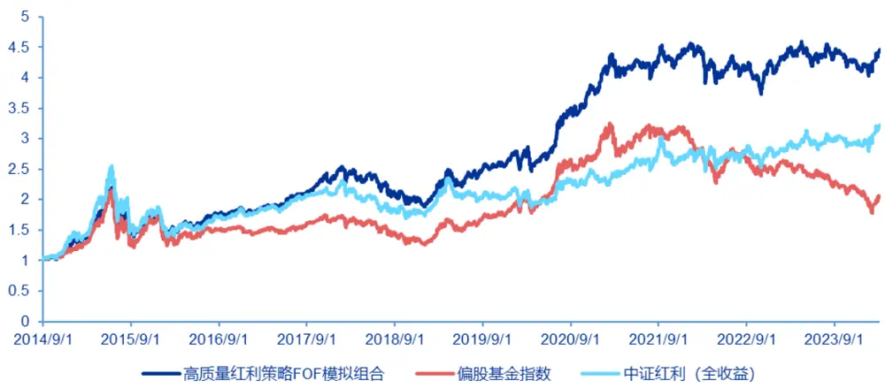
资料来源：wind，申万宏源研究；数据计算截止日：2024/3/8

高质量红利 FOF 模拟组合的年度表现：组合表现大多数位于偏股基金指数与中证红利指数之间，但部分年份会更出色，例如 2016 年、2017 年，因此并不是偏股基金指数与中证红利的拼盘策略；除此之外值得关注的是最大回撤控制能力以及最大回撤修复能力，组合在大多数年份的最大回撤明显低于其他两个指数，同时在兼顾相对收益的背景下创新高能力较为突出。

表 14：高质量红利策略的 FOF 组合（收益风险指标）
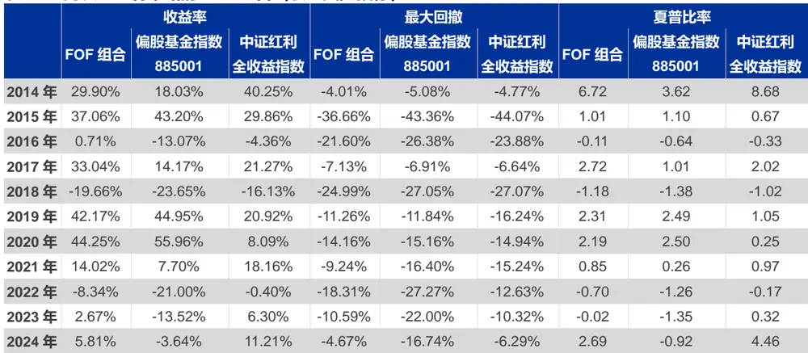
资料来源：wind，申万宏源研究；数据截止日：2024/3/6；注：2014 年始于 2014/4/1

高质量红利 FOF 模拟组合的行业自适应效果，煤炭与银行占比并不高：在模型搭建中我们并未引入行业轮动模型，但从 FOF 底层持仓穿透结果看，仍然有明显的行业调整，16 年-20 年组合的大消费比例明显较高，21 年之后开始降低持仓；同时21 年之后提升交运、化工等周期类行业的占比；在中证红利表现突出的近两年，组合并没有押注煤炭、银行等行业，煤炭行业占比仅 4.26%，银行占比为 7.35%，而是提高家电、食品饮料、通信（主要是运营商）、纺织服装、机械设备等行业股票，有一定的股息率打底且估值较低，ROE 长期稳定性较高。

图 20：高质量红利策略的 FOF 组合（行业分布情况）

| 行业/报告期 | 20140630 | 20141231 | 20150630 | 20151231 | 20160630 | 20161231 | 20170630 | 20171231 | 20180630 | 20181231 | 20190630 | 20191231 | 20200630 | 20201231 | 20210630 20211231 |  | 20220630 | 20221231 | 20230630 |
| --- | --- | --- | --- | --- | --- | --- | --- | --- | --- | --- | --- | --- | --- | --- | --- | --- | --- | --- | --- |
| 家用电器 | 4.65% | 4.90% | 2.74% | 3.97% | 5.39% | 8.97% | 10.55% | 9.63% | 9.70% | 7.78% | 6.83% | 7.32% | 7.41% | 7.01% | 3.97% | 3.50% | 4.22% | 8.03% | 8.94% |
| 食品饮料 | 5.74% | 4.11% | 8.01% | 7.47% | 5.36% | 13.18% | 12.77% | 11.01% | 12.55% | 9.18% | 12.22% | 9.51% | 8.18% | 6.63% | 4.31% | 4.54% | 2.46% | 4.47% | 7.88% |
| 交通运输 | 0.74% | 1.42% | 2.05% | 2.95% | 3.16% | 0.91% | 1.68% | 2.52% | 1.86% | 3.06% | 3.87% | 3.44% | 2.83% | 4.80% | 5.07% | 3.59% | 4.82% | 4.53% | 7.78% |
| 银行 | 11.85% | 11.78% | 8.87% | 7.44% | 6.89% | 2.87% | 5.67% | 11.61% | 11.41% | 12.92% | 14.15% | 14.62% | 7.57% | 10.33% | 6.97% | 9.39% | 4.27% | 4.87% | 7.35% |
| 通信 | 1.74% | 0.89% | 0.80% | 0.72% | 1.22% | 1.54% | 0.61% | 1.18% | 0.56% | 0.69% | 1.39% | 1.39% | 0.98% | 0.26% | 0.75% | 2.92% | 5.87% | 4.15% | 7.19% |
| 纺织服饰 | 1.36% | 0.80% | 1.61% | 2.12% | 3.81% | 2.89% | 0.95% | 1.12% | 1.80% | 1.72% | 2.12% | 1.42% | 1.91% | 2.38% | 3.46% | 4.12% | 3.57% | 1.27% | 6.08% |
| 机械设备 | 3.75% | 3.59% | 4.05% | 2.17% | 3.36% | 2.26% | 1.38% | 1.33% | 2.14% | 0.98% | 2.76% | 3.58% | 3.77% | 5.57% | 8.36% | 4.01% | 3.75% | 1.86% | 5.09% |
| 基础化工 | 4.17% | 2.30% | 4.49% | 3.80% | 4.90% | 3.86% | 4.42% | 1.55% | 2.35% | 3.27% | 3.34% | 3.99% | 6.96% | 6.74% | 7.47% | 4.12% | 6.38% | 8.11% | 4.99% |
| 非银金融 | 6.39% | 10.18% | 6.03% | 5.84% | 5.26% | 2.03% | 7.68% | 3.96% | 4.13% | 8.24% | 10.58% | 6.27% | 3.62% | 5.68% | 2.78% | 7.04% | 2.99% | 1.83% | 4.71% |
| 石油石化 | 3.70% | 0.88% | 1.66% | 1.71% | 3.00% | 0.39% | 0.44% | 0.70% | 2.66% | 1.71% | 1.24% | 1.45% | 0.41% | 1.10% | 1.21% | 0.58% | 2.43% | 4.96% | 4.71% |
| 房地产 | 9.17% | 12.32% | 7.09% | 7.00% | 5.85% | 2.07% | 3.12% | 5.52% | 7.55% | 10.18% | 5.56% | 14.05% | 11.68% | 7.51% | 5.15% | 11.94% | 13.88% | 14.61% | 4.52% |
| 煤炭 | 0.37% | 0.82% | 0.51% | 1.23% | 0.96% | 0.33% | 0.55% | 1.69% | 1.39% | 2.54% | 2.78% | 0.63% | 2.01% | 5.04% | 8.04% | 4.24% | 4.46% | 4.03% | 4.26% |
| 轻工制造 | 0.63% | 2.29% | 1.15% | 1.22% | 2.07% | 4.58% | 2.10% | 4.03% | 1.77% | 2.16% | 0.73% | 1.77% | 5.71% | 3.64% | 1.65% | 5.04% | 5.04% | 5.52% | 3.41% |
| 公用事业 | 3.33% | 3.06% | 1.23% | 3.32% | 2.94% | 0.46% | 1.84% | 1.17% | 2.97% | 1.23% | 2.37% | 0.94% | 0.64% | 1.35% | 1.91% | 1.58% | 5.44% | 5.30% | 3.32% |
| 有色金属 | 1.34% | 1.88% | 1.89% | 1.93% | 1.31% | 1.80% | 1.38% | 0.69% | 0.42% | 0.16% | 0.18% | 0.09% | 0.64% | 1.38% | 1.25% | 0.55% | 2.80% | 3.56% | 3.30% |
| 医药生物 | 7.48% | 7.92% | 9.49% | 13.08% | 9.95% | 11.73% | 9.61% | 7.18% | 7.81% | 4.41% | 5.33% | 2.63% | 4.57% | 3.75% | 6.01% | 5.12% | 4.60% | 4.59% | 2.52% |
| 电子 | 1.69% | 2.64% | 4.27% | 2.76% | 2.55% | 3.45% | 6.92% | 5.05% | 3.68% | 1.72% | 2.03% | 3.10% | 3.23% | 1.44% | 3.13% | 3.06% | 1.93% | 2.58% | 2.21% |
| 传媒 | 0.88% | 1.24% | 3.05% | 1.88% | 2.72% | 1.77% | 3.20% | 2.12% | 2.95% | 1.79% | 1.74% | 0.95% | 2.29% | 2.37% | 4.35% | 2.70% | 5.22% | 3.61% | 1.75% |
| 建筑装饰 | 1.99% | 3.50% | 2.27% | 0.87% | 3.24% | 1.53% | 1.77% | 3.88% | 1.42% | 2.97% |  | 2.69% | 4.52% | 4.31% | 5.21% | 5.28% | 3.89% | 4.07% | 1.61% |
| 社会服务 | 2.23% | 0.37% | 1.30% | 1.84% | 0.23% | 0.62% | 0.51% | 0.00% | 1.03% | 0.42% | 0.33% | 0.09% | 0.29% | 0.14% | 0.61% | 0.27% | 0.14% | 0.08% | 1.50% |
| 汽车 | 9.98% | 6.09% | 4.69% | 7.04% | 8.50% | 10.53% | 8.14% | 6.49% | 4.66% | 4.87% | 4.39% | 7.45% | 7.84% | 4.90% | 3.95% | 4.04% | 4.45% | 0.54% | 1.28% |
| 建筑材料 | 4.30% | 2.53% | 2.38% | 1.52% | 3.81% | 1.94% | 1.42% | 5.47% | 3.34% | 5.74% | 5.91% | 5.91% | 5.29% | 4.43% | 3.75% | 5.31% | 4.01% | 3.42% | 1.18% |
| 计算机 | 2.42% | 3.72% | 7.27% | 6.71% | 2.32% | 7.21% | 4.87% | 3.09% | 4.41% | 2.15% | 1.27% | 1.31% | 1.19% | 2.08% | 2.02% | 1.32% | 0.79% | 0.25% | 1.04% |
| 环保 | 1.59% | 2.48% | 2.68% | 1.37% | 1.81% | 2.46% | 0.35% | 0.36% | 0.36% | 0.34% | 0.22% | 0.01% | 0.28% | 0.55% | 1.75% | 0.23% | 0.21% | 0.12% | 0.89% |
| 商贸零售 | 2.54% | 2.32% | 2.20% | 3.10% | 0.96% | 0.79% | 0.63% | 1.28% | 3.27% | 1.12% | 1.23% | 1.12% | 1.66% | 0.87% | 1.57% | 0.92% | 0.30% | 2.06% | 0.76% |
| 钢铁 | 1.08% | 0.72% | 0.21% | 0.22% | 1.01% | 0.10% | 0.77% | 0.98% | 0.86% | 3.79% |  | 2.39% | 0.68% | 1.42% | 1.95% | 0.76% | 0.58% | 0.39% | 0.63% |
| 农林牧渔 | 2.44% | 1.97% | 2.76% | 2.84% | 2.46% | 4.45% | 3.21% | 2.97% | 0.93% |  |  |  |  |  |  |  |  |  |  |
| 电力设备 | 1.58% | 1.88% | 3.81% | 2.24% | 3.41% | 4.82% | 3.24% | 3.44% | 1.72% | 4.05% | 1.27% | 1.05% | 2.75% | 3.03% | 2.58% | 1.86% | 0.90% | 0.42% | 0.47% |
| 国防军工 | 0.66% | 0.85% | 0.54% | 0.84%0.58% | 1.06%0.00% | 0.20%0.03% | 0.21%0.00% | 0.00%0.00% | 0.21%0.00% | 0.62%0.00% | 0.78%0.00% | 0.05%0.00% | 0.77%0.00% | 0.85%0.00% | 0.13%0.00% | 0.55%0.39% | 0.16%0.18% | 0.47%0.00% | 0.09%0.04%0.00% |
| 美容护理 | 0.20% | 0.57% | 0.33% | 0.22% | 0.47% | 0.24% | 0.00% | 0.00% | 0.08% | 0.00% | 0.00% | 0.00% | 0.17% | 0.13% | 0.15% | 0.29% | 0.12% | 0.21% |  |

资料来源：wind，申万宏源研究

高质量红利 FOF 模拟组合的风格归因：组合在 2020 年下半年开始减少大盘成长风格的暴露，提高在大盘价值风格的暴露，长期暴露较少的风格为中小盘成长风格；在中信风格中暴露最多的风格是金融、消费与稳定，21 年之后减少消费风格的暴露，23 年之后金融风格暴露开始降低，加大稳定风格的暴露。

图21：高质量红利策略的 FOF组合（风格分布情况）
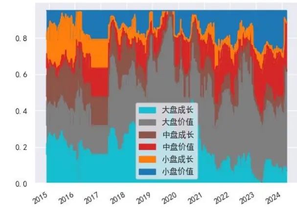
资料来源：wind，申万宏源研究；数据计算截止日：2024/3/8

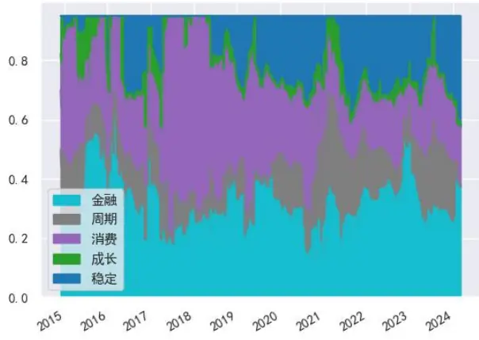

## ⚫ 高质量红利策略 FOF 模拟组合的最新持仓

23 年的年报数据还暂未公布，最新一期的持仓数据只能截止 23 年半年报，以下为 FOF 模拟组合的最新一期持仓情况：景顺长城沪港深精选目前在高股息因子上的暴露较为明显，大成企业能力驱动、宝盈品质甄选、尚正竞争优势、宝盈龙头优选、大成优势企业以及嘉实价值精选等产品在红利因子与高质量因子中兼顾得较好，产品在 23 年与 24 年也大多获得正收益。

表15：高质量红利策略的 FOF组合（截止23半年报的持仓）

| 基金代码 | 基金简称 | 基金经理 | 基金规模 (亿元) | 23 年业绩 | 24年业绩 |
| --- | --- | --- | --- | --- | --- |
| 000979.OF | 景顺长城沪港深精选 | 鲍无可 | 40.43 | 16.30% | 10.51% |
| 010178.OF | 大成企业能力驱动 A | 李博 | 29.87 | 0.19% | 6.43% |
| 013859.OF | 宝盈品质甄选 A | 杨思亮 | 9.07 | 12.45% | 5.45% |
| 013485.OF | 尚正竞争优势 A | 张志梅 | 5.96 | 7.42% | 8.53% |
| 008303.OF | 宝盈龙头优选 A | 吉翔 | 3.54 | 0.60% | 7.30% |
| 008271.OF | 大成优势企业 A | 刘旭 | 11.24 | 0.78% | 7.75% |
| 000574.OF | 宝盈新价值A | 杨思亮 | 14.71 | 5.73% | 4.88% |
| 005267.OF | 嘉实价值精选 | 谭丽 | 42.24 | -7.75% | 5.63% |
| 003715.OF | 宝盈消费主题 | 杨思亮 | 3.85 | 1.51% | 5.23% |
| 008704.OF | 广发高股息优享 A | 胡骏 | 2.93 | -8.62% | 4.48% |
| 000916.OF | 前海开源股息率100 强 | 刘宏 | 2.53 | 5.62% | 10.48% |
| 006624.OF | 中泰玉衡价值优选 A | 姜诚 | 19.97 | -4.20% | 5.54% |
| 012057.OF | 鹏华品质成长A | 袁航 | 9.02 | -9.97% | 5.97% |
| 255010.OF | 国联安稳健 | 储乐延 | 2.17 | -0.62% | -8.04% |
| 008091.OF | 中信保诚红利精选 A | 提云涛 | 0.79 | -0.03% | 7.50% |

资料来源：wind，申万宏源研究；注：基金规模截止 23Q4，24 年业绩截止 3/8

## 3.2 高质量红利策略基金的投资风格分析

老将基金经理居多，长期收益突出：通过量化指标体系筛选出的基金每一期持仓都有所调整，我们重点看长期以高质量红利策略为主的基金，以观测该类基金经理的投资风格与投资策略，以下是我们选取的 15 位长期为高质量红利策略的基金经理，大多基金经理的投资年限都较长，例如赵晓东、伍旋、徐彦的投资年限超过 10 年，温宇峰的投资年限实则也超过 10 年（中间有较长时间管理专户类产品），当然也有相对较新锐的基金经理，例如袁立与吉翔。15 位基金经理所管理的产品在近几年业绩都较为出色，任职以来相对偏股基金指数的年化收益均值为 12.21%。

表16：长期为高质量红利策略的基金经理

| 基金简称 | 基金经理 | 任职日 | 投资年限 | 基金规模 (亿元) | 2022年 收益率 | 收益率 | 2023年2024年 收益率 | 港股 投资比例 | 任职以来 年化超额收益 |
| --- | --- | --- | --- | --- | --- | --- | --- | --- | --- |
| 富兰克林国海基本面优选 | 赵晓东 | 2020-02-13 | 14.53 | 10.14 |  | -7.13%-6.74% | 4.88% | 41.11% | 6.27% |
| 鹏华优选价值 A | 伍旋 | 2019-12-17 | 12.21 | 13.70 | -9.12% | 2.39% | 4.25% | 35.12% | 2.61% |
| 大成睿享A | 徐彦 | 2019-12-30 | 10.07 | 65.65 | 0.88% | 4.80% | 0.30% | 17.10% | 9.17% |
| 景顺长城沪港深精选 | 鲍无可 | 2016-05-28 | 9.71 | 40.43 | 2.24% | 16.30% | 10.51% | 21.20% | 10.56% |
| 大成高新技术产业 A | 刘旭 | 2015-07-29 | 8.62 | 77.55 | -17.92% | 5.23% | 10.22% | 19.58% | 15.64% |
| 安信价值启航 A | 袁玮 | 2021-06-29 | 7.92 | 3.40 | -5.22% | -3.15% | 4.61% | 40.62% | 12.60% |
| 尚正竞争优势 A | 张志梅 | 2021-11-02 | 7.52 | 5.96 | -5.60% | 7.42% | 8.53% | 41.95% | 17.10% |
| 中泰星元价值优选 A | 姜诚 | 2018-12-05 | 6.93 | 57.55 | 4.46% | -7.18% | 5.93% | 0.00% | 12.68% |
| 嘉实价值精选 | 谭丽 | 2017-11-06 | 6.92 | 42.24 | -8.68% | -7.75% | 5.63% | 15.77% | 8.43% |
| 安信企业价值优选 A | 张明 | 2017-05-05 | 6.85 | 0.53 | -4.98% | -1.11% | 6.37% | 27.82% | 7.66% |
| 中欧红利优享 A | 蓝小康 | 2018-04-20 | 6.84 | 30.37 | -10.20% | -2.92% | 11.26% | 26.27% | 6.80% |
| 宝盈新价值A | 杨思亮 | 2020-04-09 | 6.03 | 14.71 | -4.19% | 5.73% | 4.88% | 0.00% | 14.92% |
| 汇添富品质价值 | 温宇峰 | 2022-12-12 | 5.00 | 19.58 |  | 2.51% | 6.19% | 24.21% | 21.96% |
| 南方品质优选 A | 袁立 | 2022-11-18 | 2.60 | 10.42 |  | -4.17% | 13.28% | 0.00% | 17.41% |
| 宝盈龙头优选A | 吉翔 | 2023-02-21 | 1.05 | 3.54 |  | 0.60% | 7.30% | 42.37% | 19.34% |

资料来源：wind，申万宏源研究；数据截止：2024/3/8；超额收益基准为 885001（偏股基金指数）

不同基金经理在风格以及标签上差异也较为明显：（1）基金经理没有明显的行业偏好，多为全行业选股基金，个股集中度整体都较高，看好个股重仓持有，典型的自下而上投资策略；（2）以大盘股持仓为主，也有偏好中盘的鹏华优选价值、南方品质优选等；（3）徐彦所管理的大成睿享重仓股独立性较高，较少有产品同时将其持仓作为重仓股，且不太容易在二级市场发生共振；也有重仓股独立性没那么高的尚正竞争优势、宝盈龙头优选。

表17：部分高质量红利策略主动权益基金的标签

| 基金产品 | 基金经理 | 行业主题 标签 | 前十大 集中度% | 大盘股 占比 | 中盘股 占比 | 小盘股 占比 | PE | ROE | 重仓股 独立性 | 重仓股 共振性 |
| --- | --- | --- | --- | --- | --- | --- | --- | --- | --- | --- |
| 富兰克林国海基本面优选 | 赵晓东 | 全行业选股 | 60.54 | 46.70% | 51.74% | 1.56% | 25.49 9.09 |  | 2.83% | 19.1 |
| 鹏华优选价值 A | 伍旋 | 全行业选股 | 65.69 | 23.22% | 62.13% | 14.65% | 25.22 8.46 |  | 2.45% | 49.23 |
| 大成睿享A | 徐彦 | 全行业选股 | 63.73 | 52.46% | 15.46% | 32.08% | 23.7 | 4.92 | 0.62% | 2.51 |
| 景顺长城沪港深精选 | 鲍无可 | 无明显标签 | 61.02 | 47.04% | 41.21% | 11.75% | 20.26 9.32 |  | 3.43% | 42.23 |
| 大成高新技术产业 A | 刘旭 | 全行业选股 | 75.83 | 53.44% | 32.79% | 13.77% | 20.47 8.66 |  | 3.31% | 25.94 |
| 安信价值启航 A | 袁玮 | 无明显标签 | 56.04 | 70.95% | 26.10% | 2.96% | 16.45 8.37 |  | 1.89% | 65.99 |
| 尚正竞争优势 A | 张志梅 | 全行业选股 | 84.19 | 93.48% | 6.45% | 0.07% | 20.64 14.1 |  | 7.16% | 49.58 |
| 中泰星元价值优选 A | 姜诚 | 无明显标签 | 80.33 | 61.62% | 33.55% | 4.82% | 10.77 7.06 |  | 1.97% | 52.57 |
| 嘉实价值精选 | 谭丽 | 全行业选股 | 71.06 | 49.71% | 43.38% | 6.91% | 13.45 6.16 |  | 1.82% | 47.35 |
| 安信企业价值优选 A | 张明 | 全行业选股 | 54.01 | 68.85% | 29.56% | 1.58% | 14.73 8.99 |  | 3.83% | 16.66 |
| 中欧红利优享 A | 蓝小康 | 无明显标签 | 48.81 | 49.42% | 47.87% | 2.71% | 20.37 7.91 |  | 2.59% | 32.82 |
| 宝盈新价值 A | 杨思亮 | 无明显标签 | 81.67 | 56.43% | 13.01% | 30.56% | 16.92 7.61 |  | 3.33% | 57.01 |
| 汇添富品质价值 | 温宇峰 |  | 99.82 | 79.90% | 10.95% | 9.16% |  | 23.25 8.05 | 1.62% | 85.52 |
| 南方品质优选 A | 袁立 | 无明显标签 | 74.7 | 19.93% | 45.00% | 35.07% |  | 19.65 9.77 | 1.52% | 30.81 |
| 宝盈龙头优选 A | 吉翔 | 无明显标签 | 92.36 | 76.06% | 3.08% | 20.85% |  | 17.8110.3 | 6.09% | 74.64 |

资料来源：wind，申万宏源研究；重仓股截至 2023Q4，其他采用 23H1 全持仓；注：重仓股独立性的值越小代表持仓独特性越强；重仓股共振性的值越大代表越容易发生共振

部分高质量红利策略主动权益基金在因子上的暴露情况：（1）中欧红利优享在红利因子上的暴露相对较多，大成睿享并未暴露太多红利因子，反而暴露更多的成长因子，与之类似的还有南方品质优选；（2）在中信风格因子中相对均衡的是大成睿享、大成高新技术产业以及鹏华优选价值。

表18：部分高质量红利策略主动权益基金的因子暴露情况

| 产品基本信息基金产品 | 三因子 |  |  | 中信风格因子 |  |  |  |  |  |
| --- | --- | --- | --- | --- | --- | --- | --- | --- | --- |
|  | 基金经理 | 红利因子 | 大盘因子 | 成长因子 | 金融 | 周期 | 消费 | 成长 | 稳定 |
| 富兰克林国海基本面优选 赵晓东 | 97.22% | 27.12% | 44.54% | 34.23% | 18.66% | 25.49% | 2.20% | 14.42% |  |
| 鹏华优选价值A 伍旋 | 82.17% | 19.78% | 30.86% | 27.31% | 16.81% | 27.89% | 1.42% | 21.56% |  |
| 大成睿享A 徐彦 | 62.64% | -5.66% | 43.11% | 11.50% | 21.36% | 21.77% | 20.65% | 19.71% |  |
| 景顺长城沪港深精选 鲍无可 | 76.81% | 11.18% | 27.63% | 11.20% | 23.65% | 19.06% | 0.51% | 40.58% |  |
| 大成高新技术产业 A 刘旭 | 64.92% | 7.11% | 33.80% | 13.35% | 20.72% | 22.24% | 13.87% | 24.81% |  |
| 安信价值启航 A 袁玮 | 103.19% | 32.94% | 33.37% | 37.42% | 15.73% | 20.27% | 0.33% | 21.25% |  |
| 尚正竞争优势 A 张志梅 | 93.35% | 44.53% | 40.18% | 30.30% | 19.03% | 30.79% | 0.14% | 14.74% |  |
| 中泰星元价值优选 A 姜诚 | 93.07% | 27.94% | 23.68% | 36.40% | 14.78% | 21.45% | 0.10% | 22.26% |  |
| 嘉实价值精选 谭丽 | 96.52% | 19.85% | 40.32% | 30.02% | 23.20% | 23.43% | 1.03% | 17.31% |  |
| 安信企业价值优选 A 张明 | 96.67% | 34.48% | 33.67% | 32.77% | 18.50% | 22.95% | 0.01% | 20.77% |  |
| 中欧红利优享 A 蓝小康 | 117.40% | 23.99% | 43.10% | 32.82% | 31.29% | 14.18% | 0.74% | 15.97% |  |
| 宝盈新价值 A 杨思亮 | 69.02% | 22.46% | 28.44% | 14.77% | 25.65% | 28.09% | 0.00% | 26.50% |  |
| 汇添富品质价值 温宇峰 | 81.90% | 29.09% | 31.54% | 33.92% | 16.75% | 27.66% | 1.13% | 15.54% |  |
| 南方品质优选 A 袁立 | 75.41% | 6.15% | 46.83% | 6.99% | 32.46% | 30.29% | 2.81% | 22.44% |  |
| 宝盈龙头优选 A 吉翔 | 82.31% | 37.82% | 38.86% | 28.70% | 17.38% | 34.84% | 0.42% | 13.67% |  |

资料来源：wind，申万宏源研究；数据计算区间：2023/3/9-2024/3/8

高质量红利策略主动权益基金的换手率整体偏低，平均持有周期在 1 年以上：换手率最低的是尚正竞争优势，有 80.61%以上的股票持有时间已经超过 1 年；也有持股周期分布较为均衡的富兰克林国海基本面优选、鹏华优选价值、大成睿享、大成高新技术产业、宝盈新价值以及宝盈龙头优选，属于动态调仓的投资策略。

表19：部分高质量红利策略主动权益基金的换手率与持股周期

| 产品基本信息 基金产品 | 基金经 | 换手率 (年化单边) |  | 23H1 持股周期 |  |  |  |
| --- | --- | --- | --- | --- | --- | --- | --- |
|  |  | 22年 | 23H1 | 半年以内 | 半年到一 年 | 一年到两 年 | 两年以 上 |
| 富兰克林国海基本面优选 | 理 赵晓东 | 53.95% | 68.47% | 27.20% | 16.06% | 19.66% | 37.09% |
| 鹏华优选价值A | 伍旋 | 91.54% | 69.56% | 29.70% | 14.92% | 20.50% | 34.88% |
| 大成睿享A | 徐彦 | 102.53% | 129.81% | 53.09% | 6.70% | 32.88% | 7.32% |
| 景顺长城沪港深精选 | 鲍无可 | 94.83% | 102.81% | 10.25% | 26.54% | 43.74% | 19.47% |
| 大成高新技术产业 A | 刘旭 | 87.18% | 62.96% | 20.77% | 21.69% | 48.49% | 9.06% |
| 安信价值启航 A | 袁玮 | 198.37% | 105.28% | 11.80% | 13.33% | 74.86% | 0.00% |
| 尚正竞争优势 A | 张志梅 | 66.82% | 90.82% | 9.78% | 9.62% | 80.61% | 0.00% |
| 中泰星元价值优选 A | 姜诚 | 57.74% | 58.44% | 11.71% | 0.00% | 34.12% | 54.16% |
| 嘉实价值精选 | 谭丽 | 14.62% | 10.63% | 5.29% | 6.35% | 23.63% | 64.73% |
| 安信企业价值优选 A | 张明 | 61.89% | 47.95% | 10.44% | 7.45% | 20.89% | 61.22% |
| 中欧红利优享 A | 蓝小康 | 112.54% | 137.59% | 11.79% | 5.54% | 68.40% | 14.27% |
| 宝盈新价值A | 杨思亮 | 119.68% | 133.17% | 45.34% | 34.79% | 12.15% | 7.73% |
| 汇添富品质价值 | 温宇峰 |  | 149.57% | 100.00% | 0.00% | 0.00% | 0.00% |
| 南方品质优选 A | 袁立 | 102.30% | 85.33% | 18.29% | 10.56% | 57.31% | 13.84% |
| 宝盈龙头优选 A | 吉翔 | 94.32% | 206.61% | 38.97% | 23.45% | 20.54% | 17.05% |

资料来源：wind，申万宏源研究

股票买入策略偏左侧的有鹏华优选价值、大成睿享、景顺长城沪港深精选、安信价值启航、安信企业价值优选、汇添富品质价值等，较多股票都在相对左侧的时候布局；其他产品虽然不是非常左侧的投资策略，但通过模拟股票的买入时点，大多处于合适价格买入、适度左侧的分布。

表20：部分高质量红利策略主动权益基金的股票买入策略（21年以来）

| 基金简称 | 22H2 | 23H1 | 合适价格过度右侧过度左侧 适度右侧适度左侧买入 |  |  |  |  | 仓位变化情况(合计) | 股票数量(加仓买入) |
| --- | --- | --- | --- | --- | --- | --- | --- | --- | --- |
| 富兰克林国海基本面优选 | 6.46% | -0.04% | 25.21% | 8.42% | 11.11% | 13.06% | 42.21% | 209.99% 94 |  |
| 鹏华优选价值 A | -2.33% | 19.20% | 33.84% | 16.62% | 7.10% | 18.98% | 23.46% | 278.53% | 98 |
| 大成睿享A | 18.98% | 19.82% | 30.40% | 6.59% | 6.81% | 21.58% | 34.61% | 310.92% 92 |  |
| 景顺长城沪港深精选 | 3.91% | 9.23% | 24.51% | 21.09% | 8.90% | 33.43% | 12.06% | 188.29% 71 |  |
| 大成高新技术产业 A | -2.58% | -1.77% | 22.54% | 11.93% | 4.49% | 32.47% | 28.59% | 218.21% 64 |  |
| 安信价值启航 A | 4.08% | 0.62% | 22.93% | 13.37% | 16.28% | 13.08% | 34.34% | 171.38% 69 |  |
| 尚正竞争优势 A | -3.59% | 7.79% | 53.98% | 12.98% | 6.20% | 10.44% | 16.40% | 105.27% 33 |  |
| 中泰星元价值优选 A | 7.68% | 0.24% | 41.28% | 15.50% | 4.54% | 4.17% | 34.50% | 136.82% 56 |  |
| 嘉实价值精选 | 6.24% | -2.39% | 24.87% | 11.80% | 11.08% | 26.56% | 25.68% | 98.44% 42 |  |
| 安信企业价值优选 A | 3.20% | 4.29% | 39.23% | 13.89% | 8.37% | 16.40% | 22.12% | 156.23% 65 |  |
| 中欧红利优享 A | 1.81% | -8.14% | 25.49% | 18.84% | 10.58% | 21.10% | 23.99% | 341.41% 123 |  |
| 宝盈新价值A | -5.48% | 1.31% | 45.55% | 17.52% | 4.12% | 14.14% | 18.67% | 341.45% 81 |  |
| 汇添富品质价值 |  | 6.83% | 6.73% | 21.10% | 24.61% | 12.10% | 35.45% | 42.64% 14 |  |
| 南方品质优选 A | -11.98% | 2.18% | 11.79% | 19.92% | 15.95% | 22.51% | 29.83% | 334.61% 99 |  |
| 宝盈龙头优选 A | -8.66% | 15.39% | 23.86% | 23.67% | 17.75% | 12.47% | 22.25% | 348.72% 84 |  |

资料来源：wind，申万宏源研究；注：第 2、3 列代表若基金实际收益-提前半年买入股票的模拟组合收益，值越大表明买得越合适，越小表明买的价格更贵

在卖出策略中并未呈现非常左侧的迹象，大多是 1/3 的股票在合适价格卖出，1/3 的股票在适度右侧（下跌初期）卖出，1/3 的股票在适度左侧（上涨末期）卖出。

表21：部分高质量红利策略主动权益基金的股票卖出策略（21年以来）

| 基金简称 | 22H2 | 23H1 | 合适价格过度右侧过度左侧适度右侧适度左侧卖出 |  |  |  |  | 仓位变化情况(合计) | 股票数量(减仓卖出) |
| --- | --- | --- | --- | --- | --- | --- | --- | --- | --- |
| 富兰克林国海基本面优选 | -0.10% | 1.55% | 32.08% | 12.74% | 5.76% | 30.86% | 18.56% | -201.89% 98 |  |
| 鹏华优选价值A | 1.13% | -3.44% | 30.75% | 11.27% | 9.11% | 30.58% | 18.29% | -265.30% | 111 |
| 大成睿享A | -12.74% | 2.04% | 19.20% | 7.13% | 22.02% | 19.34% | 32.32% | -287.22% 109 |  |
| 景顺长城沪港深精选 | -6.18% | -3.13% | 22.34% | 13.84% | 21.70% | 12.40% | 29.71% | -181.97% 75 |  |
| 大成高新技术产业 A | -0.87% | -1.74% | 21.73% | 11.89% | 10.65% | 27.55% | 28.18% | -200.67% 75 |  |
| 安信价值启航 A | 2.74% | -1.52% | 17.89% | 11.63% | 13.57% | 26.02% | 30.88% | -175.86% 65 |  |
| 尚正竞争优势 A | 5.30% | -0.68% | 29.98% | 7.17% | 2.91% | 30.29% | 29.66% | -106.63% 27 |  |
| 中泰星元价值优选 A | 0.65% | -0.85% | 43.44% |  | 3.40% | 7.73% | 45.42% | -127.66% 49 |  |
| 嘉实价值精选 | -0.93% | -2.04% | 36.40% | 13.13% | 15.02% | 27.92% | 7.53% | -97.58% 39 |  |
| 安信企业价值优选 A | 0.75% | -1.90% | 41.76% | 7.67% | 8.43% | 23.61% | 18.54% | -141.94% 78 |  |
| 中欧红利优享 A | -4.84% | 3.75% | 29.92% | 15.57% | 6.22% | 26.07% | 22.21% | -322.76% 130 |  |
| 宝盈新价值 A | -0.17% | 1.44% | 26.96% | 12.04% | 8.62% | 27.20% | 25.18% | -341.30% 95 |  |
| 汇添富品质价值 |  | -6.83% | 15.97% | 3.33% |  | 28.25% | 52.44% | -42.37% 11 |  |
| 南方品质优选 A | -2.51% | -0.78% | 25.00% | 22.37% | 5.34% | 30.98% | 16.31% | -328.57% 101 |  |
| 宝盈龙头优选 A | 22.94% | 0.80% | 28.01% | 12.17% | 10.21% | 32.97% | 16.64% | -343.83% 86 |  |

资料来源：wind，申万宏源研究；注：第 2、3 列代表基金实际收益-延后半年卖出股票的模拟组合收益，值越大表明卖得越合适，越小表明卖的价格更便宜

Brinson 收益拆分情况：基金收益主要来自于选股，也有部分基金经理有资产配置收益，例如大成睿享；也有部分基金经理在行业配置上产生超额，例如景顺长城沪港深精选、尚正竞争优势以及富兰克林国海基本面优选。

表22：部分高质量红利策略主动权益基金的收益归因（Brinson拆分）

| 基金简称 | 基金经理 | 资产配置 累计超额收益 | 行业配置 累计超额收益 | 选股 累计超额收益 | 交易交互其他 累计超额收益 |
| --- | --- | --- | --- | --- | --- |
| 富兰克林国海基本面优选 | 赵晓东 | -0.76% | 6.88% | 2.89% | -3.31% |
| 大成睿享A | 徐彦 | 1.80% | 3.53% | 8.27% | -5.47% |
| 景顺长城沪港深精选 | 鲍无可 | -1.28% | 11.53% | 11.36% | 3.77% |
| 大成高新技术产业 A | 刘旭 | -0.23% | 6.23% | 9.97% | 0.31% |
| 安信价值启航 A | 袁玮 | -1.48% | 0.11% | 15.03% | -7.89% |
| 尚正竞争优势 A | 张志梅 | -0.45% | 8.85% | 17.69% | -5.07% |
| 中泰星元价值优选 A | 姜诚 | -1.75% | -2.06% | 14.10% | -5.24% |
| 嘉实价值精选 | 谭丽 | -1.58% | 2.29% | 5.18% | -2.80% |
| 安信企业价值优选 A | 张明 | -1.25% | 0.88% | 6.15% | 4.54% |
| 中欧红利优享A | 蓝小康 | -1.65% | 3.61% | 4.82% | 2.46% |
| 宝盈新价值A | 杨思亮 | 0.44% | -0.89% | 5.94% | 6.11% |
| 南方品质优选 A | 袁立 | -0.15% | -1.59% | 1.61% | 10.42% |
| 宝盈龙头优选 A | 吉翔 | -0.50% | 3.91% | 16.30% | -8.87% |

资料来源：wind，申万宏源研究；数据计算区间：2023/3/9-2024/3/8

不同基金经理在行业板块上的能力圈有差异：有在部分板块收益贡献较突出的产品，例如景顺长城沪港深精选、大成高新技术产业以及尚正竞争优势在周期板块中收益贡献较高，嘉实价值精选在消费板块收益贡献较高；也有在板块收益贡献相对均衡的宝盈新价值。

表23：部分高质量红利策略主动权益基金的收益归因（行业板块的收益贡献）

| 基金简称 | 基金经理 | 收益贡献较高的三个行业 | 先进制造 | 医药 | 周期 | 消费 | 科技创新金 | 融地产 |
| --- | --- | --- | --- | --- | --- | --- | --- | --- |
| 富兰克林国海基本面优选赵晓东 石油石化 2.33%;煤炭 2.31%;银行 1.29% |  |  | -0.20% | -0.26% | 2.57% | -7.60% | -2.25% | 0.43% |
| 大成睿享A 徐彦 |  | 交通运输 2.0%;电子 1.5%;公用事业 1.26% | -6.07% | -1.29% | -1.35% | 0.40% | -1.06% | 0.09% |
| 景顺长城沪港深精选 鲍无可 石油石化 6.94%;传媒 3.77%;公用事业 3.71% |  |  | 2.88% | -0.92% | 9.18% | 0.50% | 5.59% | -0.01% |
| 大成高新技术产业 A 刘旭 石油石化 3.04%;家用电器 1.93%;交通运输 1.9% |  |  | -1.58% | 0.00% | 4.91% | 1.09% | -0.38% | 0.30% |
| 安信价值启航 A 袁玮 煤炭 3.05%;公用事业 1.55%;通信 0.97% |  |  | 0.71% | 0.01% | 0.92% | -0.09% | 0.97%- | 10.82% |
| 尚正竞争优势 A 张志梅 煤炭 7.13%;非银金融 5.25%;通信 1.98% |  |  | 0.00% | 0.58% | 9.83% | -6.69% | 0.34% | 4.86% |
| 中泰星元价值优选 A 姜诚 家用电器 2.38%;银行 1.46%;轻工制造 1.2% |  |  | 0.00% | 0.36%- | 7.84% | 3.09% | 0.00%- | 1.03% |
| 嘉实价值精选 谭丽 石油石化 4.17%;家用电器 3.53%;煤炭 1.88% - |  |  | 1.96% | 0.00% | -1.91% | 4.84% | -2.88% | -4.53% |
| 安信企业价值优选 A 张明 煤炭 3.61%;纺织服饰 3.1%;石油石化 1.72% |  |  | -1.93% | -0.24% | 2.23% | 2.26% | -0.63% | -3.45% |
| 中欧红利优享 A 蓝小康石油石化 1.16%;国防军工 0.77%;煤炭 0.74% |  |  | -1.37% | 0.01% | -0.57% | -1.06% | -0.37%- | 1.45% |
| 宝盈新价值A 杨思亮 家用电器 3.16%;通信 2.14%;汽车 1.94% |  |  | 1.02% | -1.07% | 1.24% | 2.38% | 2.14% | -0.27% |
| 南方品质优选 A 袁立 钢铁 1.46%;煤炭 1.41%;机械设备 1.38% |  |  | -6.27% | 0.20% | -3.99% | -1.82% | 1.20% | 0.00% |
| 宝盈龙头优选A 吉翔 非银金融 4.08%;通信 2.49%;家用电器 1.72% |  |  | 1.36% | 0.00%6 | -1.43% | -7.30% | 1.17% | 3.65% |

资料来源：wind，申万宏源研究；数据计算区间：2023/3/9-2024/3/8

## 4.风险揭示与声明

本报告对于基金产品、指数的研究分析均基于历史公开信息，可能受指数样本股的变化而产生一定的分析偏差；此外，基金管理人的历史业绩与表现不代表未来；指数未来表现受宏观环境、市场波动、风格转换等多重因素影响，存在一定波动风险。

本报告仅对基金历史业绩进行分析，不代表对基金未来资产配置情况的预测；本报告不涉及证券投资基金评价业务，不涉及对基金产品的推荐，亦不涉及对任何指数样本股的推荐；投资者阅读本报告时，应结合自身风险偏好及风险承受能力，充分理解指数编制规则、样本股变化、历史表现等综合因素可能对指数走势、基金产品业绩产生的影响；本报告内容仅供参考，投资者需特别关注指数编制公司、基金公司等官方披露的信息。

## 信息披露

## 证券分析师承诺

本报告署名分析师具有中国证券业协会授予的证券投资咨询执业资格并注册为证券分析师，以勤勉的职业态度、专业审慎的研究方法，使用合法合规的信息，独立、客观地出具本报告,并对本报告的内容和观点负责。本人不曾因，不因，也将不会因本报告中的具体推荐意见或观点而直接或间接收到任何形式的补偿。

## 与公司有关的信息披露

本公司隶属于申万宏源证券有限公司。本公司经中国证券监督管理委员会核准，取得证券投资咨询业务许可。本公司关联机构在法律许可情况下可能持有或交易本报告提到的投资标的，还可能为或争取为这些标的提供投资银行服务。本公司在知晓范围内依法合规地履行披露义务。客户可通过 compliance@swsresearch.com 索取有关披露资料或登录www.swsresearch.com 信息披露栏目查询从业人员资质情况、静默期安排及其他有关的信息披露。

## 机构销售团队联系人

华东 A 组茅炯

021-33388488

maojiong@swhysc.com

华东 B 组李庆

021-33388245

liqing3@swhysc.com

010-66500628

xiaoxia@swhysc.com

华南组李昇0755-82990609 Lisheng5@swhysc.com

## 法律声明

本报告仅供上海申银万国证券研究所有限公司（以下简称“本公司”）的客户使用。本公司不会因接收人收到本报告而视其为客户。客户应当认识到有关本报告的短信提示、电话推荐等只是研究观点的简要沟通，需以本公司http://www.swsresearch.com 网站刊载的完整报告为准，本公司并接受客户的后续问询。本报告首页列示的联系人，除非另有说明，仅作为本公司就本报告与客户的联络人，承担联络工作，不从事任何证券投资咨询服务业务。

本报告是基于已公开信息撰写，但本公司不保证该等信息的准确性或完整性。本报告所载的资料、工具、意见及推测只提供给客户作参考之用，并非作为或被视为出售或购买证券或其他投资标的的邀请或向人作出邀请。本报告所载的资料、意见及推测仅反映本公司于发布本报告当日的判断，本报告所指的证券或投资标的的价格、价值及投资收入可能会波动。在不同时期，本公司可发出与本报告所载资料、意见及推测不一致的报告。

客户应当考虑到本公司可能存在可能影响本报告客观性的利益冲突，不应视本报告为作出投资决策的惟一因素。客户应自主作出投资决策并自行承担投资风险。本公司特别提示,本公司不会与任何客户以任何形式分享证券投资收益或分担证券投资损失，任何形式的分享证券投资收益或者分担证券投资损失的书面或口头承诺均为无效。本报告中所指的投资及服务可能不适合个别客户，不构成客户私人咨询建议。本公司未确保本报告充分考虑到个别客户特殊的投资目标、财务状况或需要。本公司建议客户应考虑本报告的任何意见或建议是否符合其特定状况，以及（若有必要）咨询独立投资顾问。在任何情况下，本报告中的信息或所表述的意见并不构成对任何人的投资建议。在任何情况下，本公司不对任何人因使用本报告中的任何内容所引致的任何损失负任何责任。市场有风险，投资需谨慎。若本报告的接收人非本公司的客户，应在基于本报告作出任何投资决定或就本报告要求任何解释前咨询独立投资顾问。

本报告的版权归本公司所有，属于非公开资料。本公司对本报告保留一切权利。除非另有书面显示，否则本报告中的所有材料的版权均属本公司。未经本公司事先书面授权，本报告的任何部分均不得以任何方式制作任何形式的拷贝、复印件或复制品，或再次分发给任何其他人，或以任何侵犯本公司版权的其他方式使用。所有本报告中使用的商标、服务标记及标记均为本公司的商标、服务标记及标记。