# 如何构建分红潜在增长的股票组合？

## ——红利策略全攻略系列之五

## 相关研究

## 证券分析师

杨俊文 A0230522070001

yangjw@swsresearch.com

邓虎 A0230520070003

denghu@swsresearch.com

沈思逸 A0230521070001

shensy@swsresearch.com

## 研究支持

杨俊文 A0230522070001

yangjw@swsresearch.com

联系人

杨俊文

(8621)23297818×

yangjw@swsresearch.com

## 本期投资提示：

- 在之前报告《红利指数产品全览：境外发展特征与境内产品展望》中提及：海外多数地区的红利策略以突出“高股息”特征为主，但美国地区的红利策略相对更多样化，前五大产品跟踪的指数各不相同，目前以高股息增长策略为主，而不同高股息增长指数对连续增长年限的要求也各不相同。

- 国内红利类指数发展到现在也已相较丰富：根据中证指数公司已发布的红利相关指数，包括有不同宽基指数内的、不同板块/行业内的、红利+其他因子、红利增长、预期红利等，但从指数挂钩产品角度来看，代表性的红利指数，比如中证红利（000922.CSI）、红利低波（H30269.CSI）已有多家基金公司发布相关产品进行跟踪，而红利增长（931056.CSI）指数暂时还没有产品跟踪。

- 在红利增长指数的编制方案上，突出的是历史分红增长，而我们尝试挖掘未来分红增长的股票构建组合。针对如何预测分红增长，我们梳理并测试了一些逻辑：1）最近年度有分红且盈利预期增长；2）过去三年股利支付率稳定且盈利预期增长；3）过去三年现金分红连续增长且盈利预期增长；4）过去三年股利支付率连续提高且盈利预期增长；5）预期股利支付率提高且盈利预期增长。

- 在权衡了各个逻辑的预测准确率和样本数量之后，我们选取过去三年股利支付率稳定、过去三年现金分红连续增长、预期股利支付率提高三个逻辑下筛选的预期分红增长股票，取并集构成基础股票池。

- 在基础股票池内，我们选取成长、长期动量、分析师、估值、分红五个因子来优选股票。在 2012/4/30~2024/2/29 回测期间，每年的 4、8、10月底，基于因子打分方式对股票进行排序，选取得分靠前的 50 只股票，按照最近年度股息率加权的方式构建红利增长组合，比较基准为中证红利全收益、红利低波全收益指数。

- 在 2013/1/1~2024/2/29业绩比较区间，红利增长组合的年化收益为 22.46%，同期中证红利全收益、红利低波全收益指数的年化收益分别为 11.34%和 13.16%；在夏普比率上，红利增长组合也是显著高于两个比较基准指数。

- 分年度，从最近这一轮大盘成长到小盘价值的行情周期中，红利增长组合的表现都跑赢比较基准。在 2019、2020，包括 2021 年的大盘成长行情下，红利增长组合相对比较基准的年度超额收益均在 10%以上；在 2022、2023 年小盘价值行情下，红利增长组合依然取得超额收益，相对中证红利全收益指数的年度超额收益分别为 8.38%、6.28%。

- 风险提示：本报告结果基于历史数据测算，未来市场结构可能发生变化，带来策略的不稳定；报告中筛选预期分红增长股票利用到分析师预期数据，当预期数据出现系统偏误的时候，可能带来组合阶段性表现较弱。

## 1.海外红利增长产品的发展情况

在之前报告《红利指数产品全览：境外发展特征与境内产品展望》中提及，海外多数地区的红利策略以突出“高股息”特征为主，但美国地区的红利策略相对更多样化，主要包含了高股息、高股息增长两大类策略，近年来也出现了加入更多因子的复合策略。下面我们对规模较大的产品跟踪的指数的编制方案进行介绍。

## S&P U.S. Dividend Growers Index

美国目前最大的红利 ETF VIG 采用高股息增长策略，跟踪标普美国股息增长指数，而在 2021 年 9 月以前产品跟踪 NASDAQ US Dividend Achievers 指数。

指数编制方法：在满足市值、流动性等条件的情况下，选择每年现金分红在过去10 年中分红都有增长的股票，然后按照年度股息率排序，剔除前 25%的股票，然后将剩余股票按照自由流通市值加权。这一编制方案与此前的纳斯达克指数的方法基本一致。

## Dow Jones U.S. Dividend 100 Index

美国规模第二的红利 ETF SCHD 实际为复合因子产品，除了高股息、高股息增长外也加入了代表质量的因子。该产品跟踪的道琼斯美国红利 100 指数采用多个标准筛选股票，主要包括自由现金流与负债比、ROE、股息率、5 年股息增长（当前股息/滚动5 年股息均值-1），4 个项目分别打分后等权合成，前100 只股票被选入指数。

## FTSE High Dividend Yield Index

规模第三的红利产品VYM 则为纯粹的高股息产品，跟踪富时高股息指数，编制方法如下：首先剔除 REITs、剔除在过去 12 个月没有发放股利的公司或在未来 12个月无法预见或预期发放零股利的公司，然后将剩余公司根据 I/B/E/S 分析师一致预期12 个月股利收益进行从大到小排序；然后根据其所在的可投资市场，对已经被纳入指数的公司，若其红利在55 分位数以外则剔除，对于没有被纳入指数的公司，若其红利在45 分位数以内则纳入。该指数主要使用一致预期股息率作为选股标准。

## Morningstar® US Dividend Growth Index

iShares最大的红利ETF DGRO 同样为股息增长ETF，主要选择至少5 年股息持续增长、支付比例小于 75%的公司，股息率绝对水平较高的公司同样也将被剔除。相比于 VIG 跟踪的指数，该指数对股息增长持续时间的要求相对更宽松，在剔除标准上则增加了支付比例。

## S&P High Yield Dividend Aristocrats Index

道富最大的红利ETF也为股息增长产品，该产品跟踪的指数从标普1500 中选择市值、流动性符合要求，且过去连续20 年每年股息都在增长的公司，然后按照年度股息率进行加权。相比于VIG、DGRO，该指数对股息增长的要求明显更高。

美国红利产品跟踪的指数体现出了明显的多样化，前五大产品跟踪的指数各不相同，目前以高股息增长策略为主，而不同高股息增长指数对连续增长年限的要求也各不相同。而在传统的高股息指数上，预期股息已经替代历史股息成为更受关注的指标。

## 2.国内红利增长产品暂时空白

国内红利类指数发展到现在也已相较丰富，根据中证指数公司已发布的红利相关指数，包括有不同宽基指数内的、不同板块/行业内的、红利+其他因子、红利增长、预期红利等，但从指数挂钩产品角度来看，代表性的红利指数，比如中证红利（000922.CSI）、红利低波（H30269.CSI）已有多家基金公司发布相关产品进行跟踪，而红利增长（931056.CSI）指数暂时还没有产品跟踪。

表 1：国内红利指数的比较

|  | 中证红利（000922.CSI） | 红利低波（H30269.CSI） | 红利增长（931056.CSI） |
| --- | --- | --- | --- |
| 指数简介 | 中证红利指数选取100只现金股息中率高、分红较为稳定，并具有一定好规模及流动性的上市公司证券作为指数样本，以反映高股息率上市公司证券的整体表现。 | 证红利低波动指数选取50 只流动性中、连续分红、红利支付率适中、每增长股股息正增长以及股息率高且波动率市低的证券作为指数样本，采用股息率年加权，以反映分红水平高且波动率低连的证券的整体表现。 | 证红利增长指数选取50 只历史分红情况良好、分红增长潜力较高的上公司证券作为指数样本,采用过去三平均现金分红总额加权,以反映分红续增长上市公司证券的整体表现,为投资者提供多样化投资工具。 |
| 成分数量 | 100 | 50 | 50 |
| 加权方式 | 股息率加权 | 股息率加权 | 过去三年平均现金分红总额加权 |
| 调整频率 | 每年调整一次 | 每年调整一次 | 每半年调整一次 |
| 前5 大权重之和 | 9.13% | 15.07% | 54.95% |
| 前10 大权重之和 | 16.62% | 27.13% | 76.74% |
| 挂钩产品 | 大成中证红利、万家中证红利、招创商中证红利ETF及其联接基金、博时中证红利ETF、易方达中证红利ETF及其联接基金、汇添富中证红利 ETF 及其联接基金 | 金合信红利低波动、华泰柏瑞红利低波动ETF及其联接基金、易方达中证红利低波动ETF、华夏中证红利低波动ETF | 暂无 |

资料来源：中证指数公司，Wind，申万宏源研究，权重数据及挂钩产品信息的统计时间截至 2024/2/29

需要一提的是，红利增长指数的编制方案在 2022 年 11 月进行过调整，其中有两处变动较大：1）在最后选择 50 只股票作为样本股上，旧编制方案按照过去一年现金股息率倒序排列来筛选，新编制方案按照连续分红年数、过去5 年分红总额年均增速两个指标的复合得分来筛选；2）在确定指数样本股权重上，旧编制方案采用股息率加权，新编制方案采用过去三年平均现金分红总额加权。

新编制方案在确定样本股权重上，基于过去三年平均现金分红总额加权，指数成分股内的大盘股由于业绩基数大，现金分红总额的绝对数一般都显著高于小盘股，所以这也就带来了权重股的权重较为集中。

表 2：红利增长指数前十大和后十大权重成分股的分红差异

| 证券代码 | 证券名称 | 权重(%) | 总市值(亿元) | 归母净利润(亿元) | 现金分红总额(亿元) |
| --- | --- | --- | --- | --- | --- |
| 600036.SH | 招商银行 | 16.42 | 8,080 | 1,380.12 | 438.32 |
| 600519.SH | 贵州茅台 | 13.93 | 21,293 | 627.16 | 325.49 |
| 600438.SH | 通威股份 | 9.89 | 1,193 | 257.26 | 128.67 |
| 600015.SH | 华夏银行 | 8.54 | 1,009 | 250.35 | 60.95 |
| 000568.SZ | 泸州老窖 | 6.17 | 2,587 | 103.65 | 62.19 |
| 601899.SH | 紫金矿业 | 5.62 | 3,451 | 200.42 | 52.64 |
| 600690.SH | 海尔智家 | 4.98 | 2,274 | 147.11 | 52.98 |
| 600039.SH | 四川路桥 | 4.75 | 711 | 112.13 | 56.65 |
| 600985.SH | 淮北矿业 | 3.37 | 470 | 70.10 | 26.05 |
| 600153.SH | 建发股份 | 3.06 | 313 | 62.82 | 24.04 |
| 600765.SH | 中航重机 | 0.18 | 244 | 12.02 | 2.43 |
| 600976.SH | 健民集团 | 0.14 | 86 | 4.08 | 1.53 |
| 000988.SZ | 华工科技 | 0.12 | 319 | 9.06 | 1.01 |
| 002328.SZ | 新朋股份 | 0.12 | 39 | 3.11 | 1.00 |
| 300035.SZ | 中科电气 | 0.11 | 65 | 3.64 | 1.08 |
| 603998.SH | 方盛制药 | 0.11 | 42 | 2.86 | 1.15 |
| 002135.SZ | 东南网架 | 0.11 | 56 | 2.91 | 1.15 |
| 300244.SZ | 迪安诊断 | 0.11 | 120 | 14.34 | 1.25 |
| 002046.SZ | 国机精工 | 0.07 | 53 | 2.33 | 0.94 |
| 002096.SZ | 易普力 | 0.03 | 131 | 0.48 | 0.37 |

资料来源：Wind，申万宏源研究，成分股权重和总市值数据统计截至 2024/2/29

进一步，对中证红利、红利低波、红利增长三只红利指数作业绩比较，选取2012/1/1~2024/2/29 为业绩比较区间。

图 1：红利指数的累计净值比较
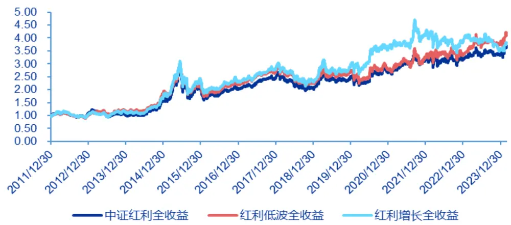
资料来源：Wind，申万宏源研究

表 3：红利指数的分年度收益比较

|  | 中证红利全收益 | 红利低波全收益 | 红利增长全收益 |
| --- | --- | --- | --- |
| 2012 | 10.32% | 3.98% | 5.75% |
| 2013 | -6.74% | 14.56% | 7.99% |
| 2014 | 57.59% | 57.78% | 55.96% |
| 2015 | 29.89% | 16.06% | 32.95% |
| 2016 | -4.30% | 0.08% | -3.34% |
| 2017 | 21.34% | 23.57% | 22.42% |
| 2018 | -16.15% | -16.39% | -17.30% |
| 2019 | 20.88% | 20.94% | 26.47% |
| 2020 | 8.18% | 1.99% | 21.86% |
| 2021 | 18.19% | 16.34% | 16.17% |
| 2022 | -0.37% | 3.46% | -7.05% |
| 2023 | 6.34% | 12.23% | -6.77% |
| 2024/2/29 | 9.02% | 10.05% | 6.20% |
| 整个区间年化收益率 11.25% 12.38% 11.64% |  |  |  |

资料来源：Wind，申万宏源研究

从历史业绩来看，回测期间，红利增长全收益指数的年化收益为 11.64%，与同期中证红利全收益指数11.25%、红利低波全收益指数12.38%的年化收益差异不大；但分年度来看，红利增长全收益指数在 2019、2020 年的收益较为明显高于其他两个红利指数，而在2022、2023 年的收益又显著跑输。

## 3.如何预期分红增长？

在红利增长（931056.CSI）指数的编制方案上，突出的是历史分红增长，而我们尝试挖掘未来分红增长的股票构建组合。

我们进行一个已知未来数据的验证测试：在中证全指内，每年 4 月底，根据最近年度和未来一年年度现金分红总额，筛选出已知分红增长的股票，然后根据最近年度股息率降序排列，筛选出前 100 只股票构建组合，组合内个股依据最近年度股息率加权。回测期间为 2011/4/30~2023/4/30，我们截取 2012/1/1~2023/4/30 作为业绩比较区间，比较基准为中证红利全收益指数。

图 2：已知分红增长组合和中证红利全收益指数的累计净值比较
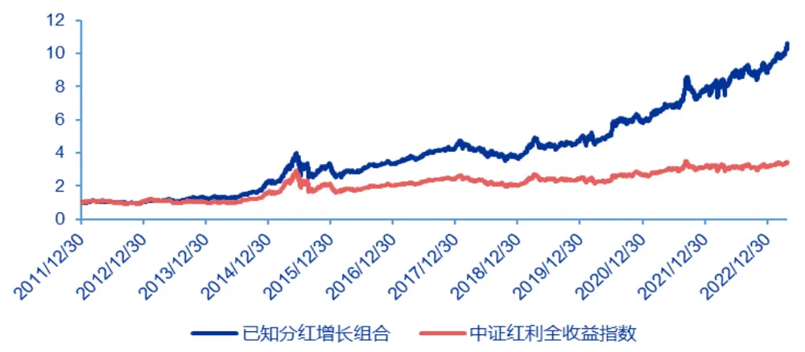
资料来源：Wind，申万宏源研究

表 4：已知分红增长组合和中证红利全收益指数的分年度收益

|  | 已知分红增长组合 | 中证红利全收益指数 |
| --- | --- | --- |
| 2012 | 6.20% | 10.32% |
| 2013 | 22.54% | -6.74% |
| 2014 | 74.64% | 57.59% |
| 2015 | 44.77% | 29.89% |
| 2016 | 0.78% | -4.30% |
| 2017 | 29.79% | 21.34% |
| 2018 | -13.93% | -16.15% |
| 2019 | 30.78% | 20.88% |
| 2020 | 21.98% | 8.18% |
| 2021 | 31.79% | 18.19% |
| 2022 | 14.45% | -0.37% |
| 2023/4/30 | 18.98% | 10.07% |
| 整个区间年化收益率 | 23.16% | 11.62% |

资料来源：Wind，申万宏源研究

在业绩比较区间，已知分红增长组合的年化收益为 23.16%，同期中证红利全收益指数的年化收益率为 11.62%；分年度看，在 2012~2022 年完整的 11 个年度，除去2012 年之外，已知分红增长组合都取得超额收益。

已知分红增长组合的业绩表现突出，但需要明确的是，这是一个利用了未来数据构造的组合，是一个理想化的组合。接下来，针对如何预测分红增长，我们梳理并测试了一些逻辑。

## 3.1最近年度有分红且盈利预期增长

预期分红增长的逻辑一：最近年度有分红且盈利预期增长，具体测试上，每年 4、8、10 月底，筛选出上一年度有现金分红，且当前时点分析师对今年的一致预期净利润高于上一年度归母净利润的股票，针对每期筛选出来的股票，统计其今年的现金分红确实高于上一年度现金分红的比例，回测区间为2010/8/31~2022/10/31。

图 3：最近年度有分红且盈利预期增长的筛选准确率
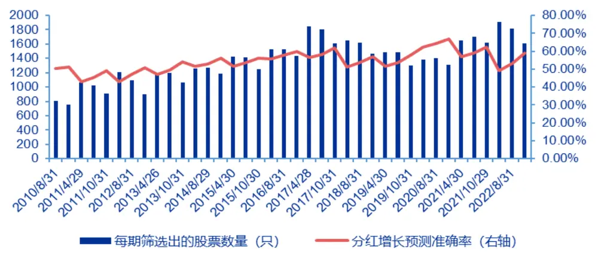
资料来源：Wind，申万宏源研究

考虑到上市公司披露完季度财报后，分析师较大概率会调整自己对公司的盈利预测，所以我们采取每年4、8、10 月底三个时点，分别检验该逻辑下分红增长的预测准确率。

表 5：最近年度有分红且盈利预期增长在不同时点下的预测准确率

| 不同时点 | 准确率 |
| --- | --- |
| 所有时点下预测准确率的均值 | 54.21% |
| 4 月底预测准确率的均值 | 51.60% |
| 8月底预测准确率的均值 | 54.00% |
| 10 月底预测准确率的均值 | 57.56% |

资料来源：Wind，申万宏源研究

在整个回测区间，最近年度有分红且盈利预测增长的预测准确率均值为54.21%，分三个预测时点来看，越临近年报的披露日，分析师对当年的盈利预测也越准确，该逻辑筛选出来的分红增长的股票比例也越高。

## 3.2过去三年股利支付率稳定且盈利预期增长

预期分红增长的逻辑二：过去三年股利支付率稳定且盈利预期增长，考虑到现金分红 = 归母净利润 ×股利支付率，因此，在股利支付率稳定的情况下，盈利预期增长，那么现金分红也将提高。

在股利支付率稳定的刻画上，我们定义过去三年股利支付率偏离过去三年平均股利支付率的绝对值不能超过某个阈值threshold；此外，为了排除过去三年均不分红的情况，我们要求过去三年股利支付率均大于0。在阈值threshold 方面，我们分别测试了 threshold=5%和 10%两组参数下的结果。

图 4：过去三年股利支付率稳定(5%)且盈利预期增长的筛选准确率
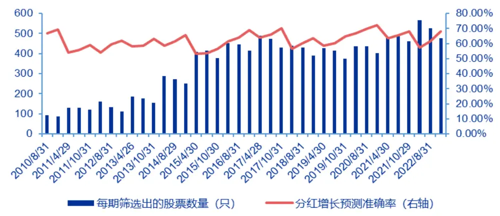
资料来源：Wind，申万宏源研究

图 5：过去三年股利支付率稳定(10%)且盈利预期增长的筛选准确率
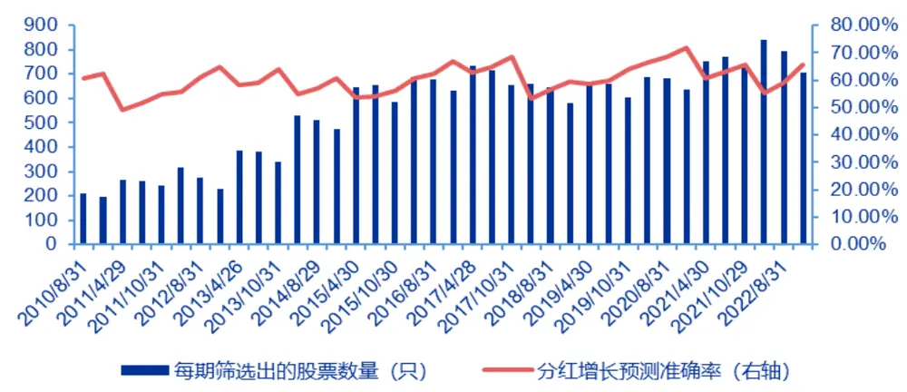
资料来源：Wind，申万宏源研究

表 6：过去三年股利支付率稳定且盈利预期增长在不同时点下的预测准确率

| 不同十点 | 准确率（threshold=5%） | 准确率（threshold=10%） |
| --- | --- | --- |
| 所有时点下预测准确率的均值 | 62.15% | 60.27% |
| 4 月底预测准确率的均值 | 58.90% | 57.44% |
| 8月底预测准确率的均值 | 61.36% | 59.72% |
| 10月底预测准确率的均值 65.18% |  | 63.47% |

资料来源：Wind，申万宏源研究

可以看到，阈值 threshold=5%的预测准确率要高于 threshold=10%，即对过去三年股利支付率稳定性要求更高，该逻辑下筛选的预测准确率也更高。同样，分不同时点来看，越临近年报披露日，预测准确率也越高。

## 3.3过去三年现金分红连续增长且盈利预期增长

预期分红增长的逻辑三：过去三年现金分红连续增长且盈利预期增长，考虑到盈利预期增长，且历史分红具有增长连续性，测试其分红增长是否具有动量效应。

图 6：过去三年现金分红连续增长且盈利预期增长的筛选准确率
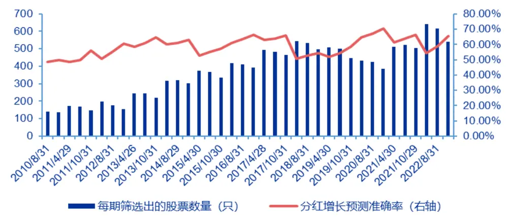
资料来源：Wind，申万宏源研究

表 7：过去三年现金分红连续增长且盈利预期增长在不同时点下的预测准确率

| 不同时点 | 准确率 |
| --- | --- |
| 所有时点下预测准确率的均值 | 58.66% |
| 4月底预测准确率的均值 | 56.44% |
| 8月底预测准确率的均值 | 58.79% |
| 10 月底预测准确率的均值 | 62.34% |

资料来源：Wind，申万宏源研究

在整个回测区间，过去三年现金分红连续增长且盈利预期增长的预测准确率均值为58.66%；并且分三个时点来看，也是越临近年报披露日，该逻辑筛选出来的分红增长的股票比例越高，10 月底的预测准确率均值为62.34%。

## 3.4过去三年股利支付率连续提高且盈利预期增长

预期分红增长的逻辑四：过去三年股利支付率连续提高且盈利预期增长，测试历史股利支付率的连续提高，是否可以线性外推未来股利支付率的提高，叠加盈利预期增长，来筛选出预期分红增长的股票。

图 7：过去三年股利支付率连续提高且盈利预期增长的筛选准确率
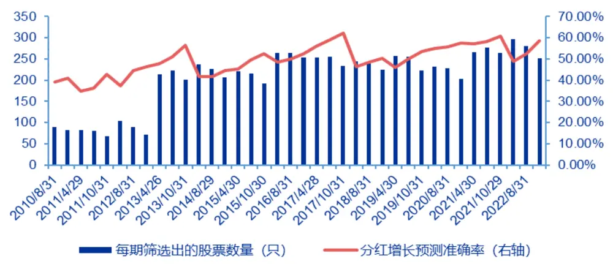
资料来源：Wind，申万宏源研究

表 8：过去三年股利支付率连续提高且盈利预期增长在不同时点下的预测准确率

| 不同时点 | 准确率 |
| --- | --- |
| 所有时点下预测准确率的均值 | 49.50% |
| 4 月底预测准确率的均值 | 47.11% |
| 8月底预测准确率的均值 | 49.76% |
| 10月底预测准确率的均值 53.20% |  |

资料来源：Wind，申万宏源研究

在整个回测区间，过去三年股利支付率连续提高且盈利预期增长的预测准确率均值为49.50%，低于50%的随机预测准确率，也说明该逻辑并不能较好的筛选出分红增长的股票。

## 3.5预期股利支付率提高且盈利预期增长

预期分红增长的逻辑五：预期股利支付率提高且盈利预期增长，在逻辑四的测试结果中，基于历史股利支付率的连续提高，并不能较好的筛选出分红增长的公司，换个思路，我们从企业生命周期视角，当一家公司从成长期逐步过渡到成熟期，股利支付率可能会有所提高，叠加盈利预期增长，来筛选出分红增长的公司。

如何刻画一家公司从成长期逐步过渡到成熟期，我们从以下三个财务维度来定义：

1）最近报告期及过去两年的经营性现金流量净额 /净利润持续大于1；

2）最近年度的资本开支小于两年前的资本开支，比如，2022 年的资本开支小于2020 年的资本开支；

3）最近报告期的资产负债率小于上一年年末的资产负债率。

维度一要求公司现金流要好，净利润中不能有太多的应收账款；维度二要求公司需要投入经营的资金在下降；维度三要求公司没有坏账缩表的压力。结合这三个维度，我们预期公司可能从成长期逐步在往成熟期过渡，未来的股利支付率有所提高。

图 8：预期股利支付率提高且盈利预期增长的筛选准确率
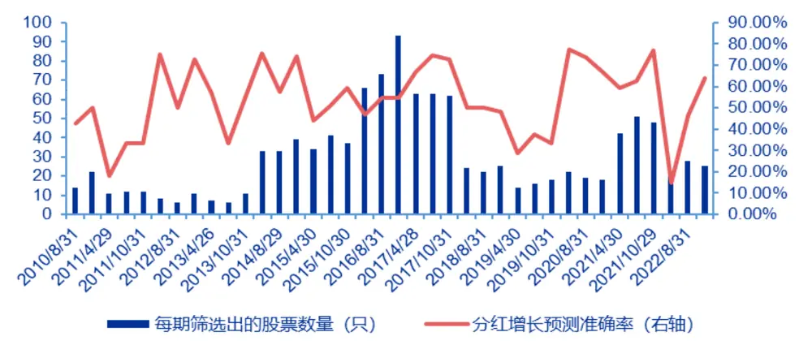
资料来源：Wind，申万宏源研究

表 9：预期股利支付率提高且盈利预期增长在不同时点下的预测准确率

| 不同时点 | 准确率 |
| --- | --- |
| 所有时点下预测准确率的均值 | 53.77% |
| 4 月底预测准确率的均值 | 51.18% |
| 8月底预测准确率的均值 | 52.10% |
| 10月底预测准确率的均值 59.24% |  |

资料来源：Wind，申万宏源研究

在整个回测区间，预期股利支付率提高且盈利预期增长的预测准确率均值为53.77%，同样存在越临近年报披露日，该逻辑筛选的分红增长的股票比例越高；此外，还注意到预期股利支付率具有三个筛选条件，所以每期筛出来的股票数量相对较少。

## 3.6筛选预期分红增长股票构成样本池

针对3.1~3.5 小节中的测试结果，在权衡了预测准确率和样本数量之后，我们选取过去三年股利支付率稳定（threshold=5%）、过去三年现金分红连续增长、预期股利支付率提高三个逻辑下筛选的预期分红增长股票，取并集构成样本池。同样，我们也测试这个选股池中实际分红增长的股票比例。

图 9：三个逻辑复合的筛选准确率
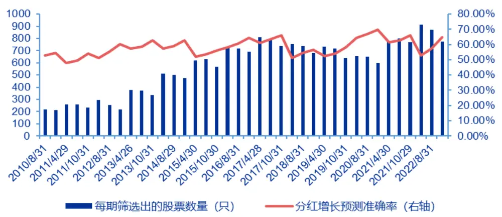
资料来源：Wind，申万宏源研究

表 10：三个逻辑复合在不同时点下的预测准确率

| 不同时点 | 准确率 |
| --- | --- |
| 所有时点下预测准确率的均值 | 58.23% |
| 4 月底预测准确率的均值 | 55.63% |
| 8月底预测准确率的均值 | 58.00% |
| 10 月底预测准确率的均值 | 61.82% |

资料来源：Wind，申万宏源研究

三个筛选逻辑复合后，整个回测区间的预测准确率均值为 58.23%；此外，每期的样本数量均在 200 只以上，2014 年以来样本数量基本维持在 500 只以上，这个样本池也作为接下来进一步优选的基础股票池。

## 4.红利增长组合的构建

## 4.1组合构建及测试

针对3.6 小节筛选出的预期分红增长基础股票池，我们对选股因子在股票池内的选股效果进行测试，回测区间为 2011/4/30~2024/2/29，每年 4、8、10 月底进行组合调仓。选股因子包括成长、盈利、估值、波动性、流动性、长期动量、短期反转、市值、分析师、分红，因子具体定义可以参考附表1。

表 11：选股因子在基础股票池内的 RankIC 表现

| 整个回测区间 | Growth | Profitable | Value | Volatility | Liquidity | Momentum | Reverse | Size | Analyst | Dividend |
| --- | --- | --- | --- | --- | --- | --- | --- | --- | --- | --- |
| RankIC 均值 | 7.31% | 4.18% | 1.82% | -5.93% | -5.34% | 6.02% | 2.40% | -4.49% | 2.92% | 6.71% |
| RankIC 标准差 | 9.92% | 7.22% | 12.96% | 10.15% | 10.00% | 10.14% | 11.06% | 19.23% | 5.63% | 12.85% |
| RankIC_IR | 0.74 | 0.58 | 0.14 | -0.58 | -0.53 | 0.59 | 0.22 | -0.23 | 0.52 | 0.52 |
| RankIC>0 占比 | 82.05% | 76.92% | 56.41% | 25.64% | 28.21% | 71.79% | 64.10% | 41.03% | 69.23% | 64.10% |
| 2017年以来 |  |  |  |  |  |  |  |  |  |  |
| RankIC 均值 | 5.30% | 2.94% | 1.94% | -4.93% | -6.05% | 7.18% | 2.11% | 2.35% | 2.78% | 7.59% |
| RankIC 标准差 | 10.06% | 6.83% | 13.17% | 7.97% | 9.41% | 9.92% | 10.59% | 18.36% | 5.40% | 14.98% |
| RankIC_IR | 0.53 | 0.43 | 0.15 | -0.62 | -0.64 | 0.72 | 0.20 | 0.13 | 0.51 | 0.51 |
| RankIC>0 占比 | 77.27% | 72.73% | 50.00% | 22.73% | 22.73% | 77.27% 63.64% |  | 54.55% | 72.73% | 59.09% |

资料来源：Wind，申万宏源研究

图 10：Growth 因子在基础股票池的分组表现
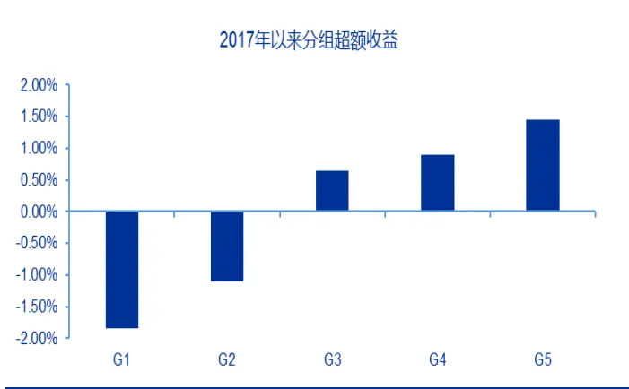
资料来源：Wind，申万宏源研究

图 11：Profitable 因子在基础股票池的分组表现
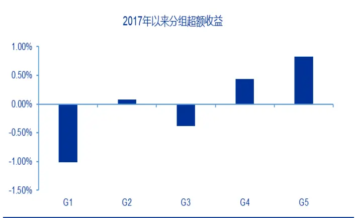
资料来源：Wind，申万宏源研究

图 12：Value 因子在基础股票池的分组表现
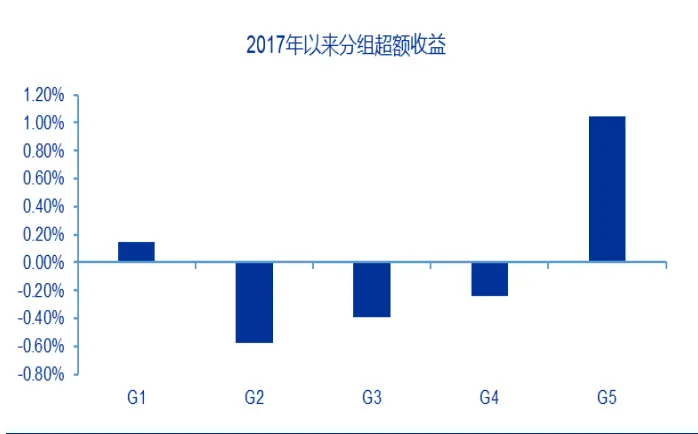
资料来源：Wind，申万宏源研究

图 13：Volatility 因子在基础股票池的分组表现
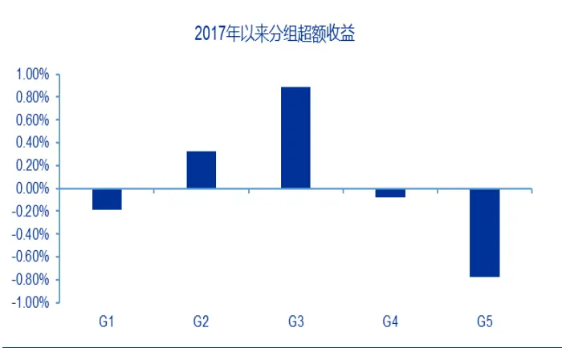
资料来源：Wind，申万宏源研究

图 14：Liquidity 因子在基础股票池的分组表现
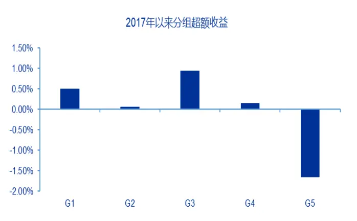
资料来源：Wind，申万宏源研究

图 15：Momentum 因子在基础股票池的分组表现
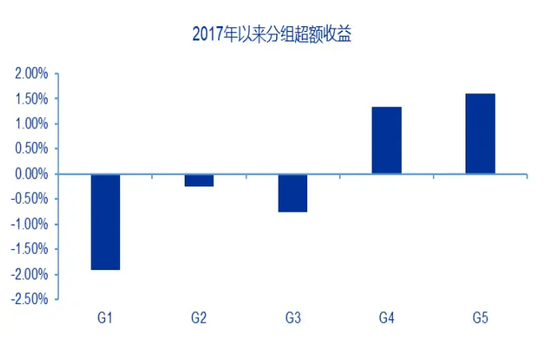
资料来源：Wind，申万宏源研究

图 16：Reverse 因子在基础股票池的分组表现
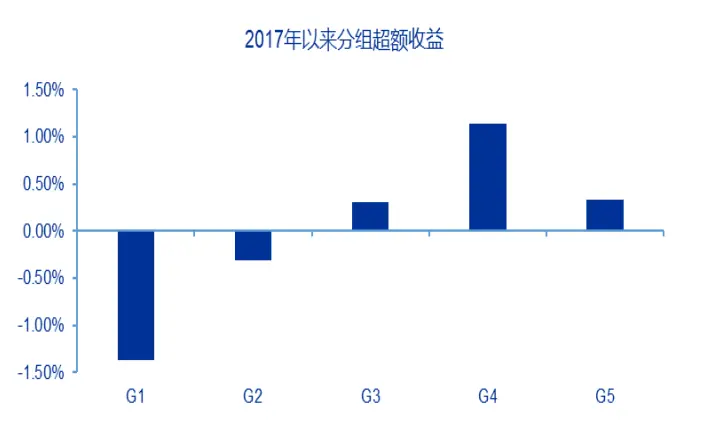
资料来源：Wind，申万宏源研究

图 17：Size 因子在基础股票池的分组表现
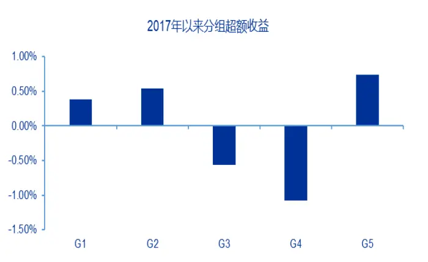
资料来源：Wind，申万宏源研究

图 18：Analyst 因子在基础股票池的分组表现
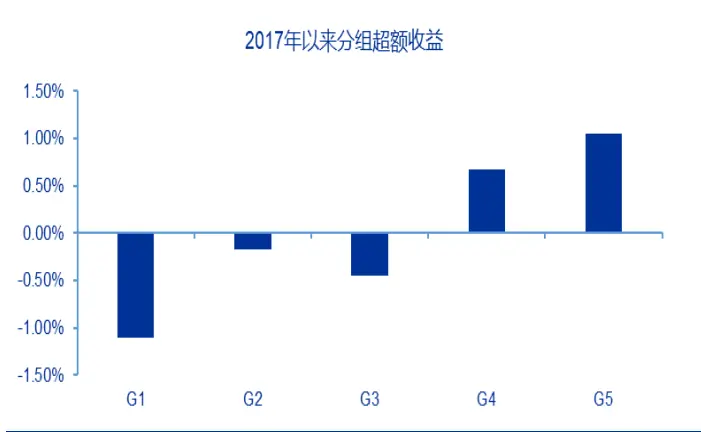
资料来源：Wind，申万宏源研究

图 19：Dividend 因子在基础股票池的分组表现
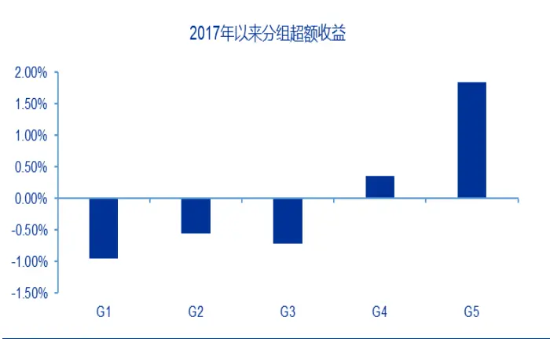
资料来源：Wind，申万宏源研究

比较选股因子在基础股票池内的 RankIC_IR 及分组多头超额收益的强弱表现，并且考虑到因子间的相关性（尽管选股因子做了逐步正交的处理）,最后我们选取Growth、Momentum、Analyst、Value、Dividend 五个因子作为选股因子，因子权重采取等权的方式。

在 2012/4/30~2024/2/29 回测期间，每年的 4、8、10 月底，基于因子打分方式对基础股票池内的股票进行打分排序，选取得分靠前的 50 只股票，按照最近年度股息率加权的方式构建组合，比较基准为中证红利全收益、红利低波全收益指数。在每期构建组合的时候，考虑了交易停牌及一字板无法买入的情形；此外，考虑到完整年度的比较，我们截取2023/1/1~2024/2/29 作为业绩比较区间。

图 20：红利增长组合和比较基准的累计净值表现
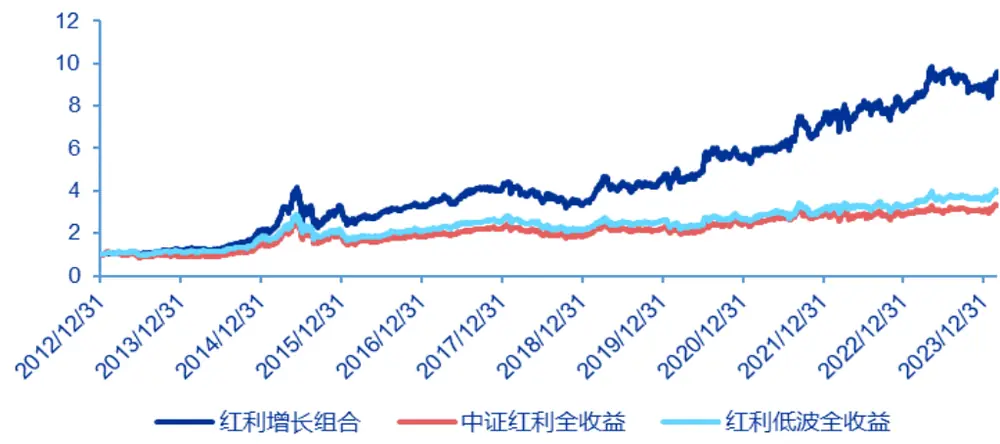
资料来源：Wind，申万宏源研究

表 12：红利增长组合和比较基准的分年度收益

|  | 红利增长组合 | 中证红利全收益指数 | 红利低波全收益指数 |
| --- | --- | --- | --- |
| 2013 | 23.61% | -6.74% | 14.56% |
| 2014 | 73.16% | 57.59% | 57.78% |
| 2015 | 48.97% | 29.89% | 16.06% |
| 2016 | 2.04% | -4.30% | 0.08% |
| 2017 | 24.92% | 21.34% | 23.57% |
| 2018 | -18.02% | -16.15% | -16.39% |
| 2019 | 38.06% | 20.88% | 20.94% |
| 2020 | 20.30% | 8.18% | 1.99% |
| 2021 | 31.38% | 18.19% | 16.34% |
| 2022 | 8.01% | -0.37% | 3.46% |
| 2023 | 12.63% | 6.34% | 12.23% |
| 2024/2/29 | 8.58% | 9.02% | 10.05% |
| 整个区间年化收益率 | 22.46% | 11.34% | 13.16% |
| 整个区间夏普比率 0.94 0.53 0.65 |  |  |  |

资料来源：Wind，申万宏源研究

图 21：红利增长组合相对比较基准的分年度超额收益
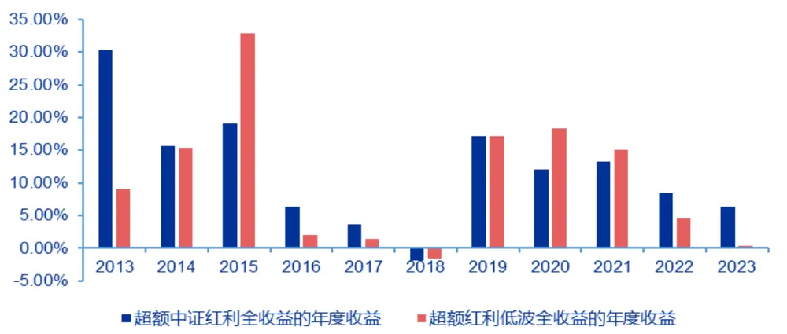
资料来源：Wind，申万宏源研究

在2013/1/1~2024/2/29 业绩比较区间，红利增长组合的年化收益为22.46%，同期中证红利全收益指数、红利低波全收益指数的年化收益分别为 11.34%和13.16%，在夏普比率上，红利增长组合也是显著高于两个比较基准指数。

分年度，从最近这一轮大盘成长到小盘价值的行情周期中，红利增长组合的表现都跑赢比较基准。在2019、2020，包括2021 年的大盘成长行情下，红利增长组合相对比较基准的年度超额收益均在 10%以上；在 2022、2023 年小盘价值行情下，红利增长组合依然取得超额收益，相对中证红利全收益指数的年度超额收益分别为8.38%、6.28%。

## 4.2 组合分析

针对4.1 小节中构建的红利增长组合，我们从组合换手率、组合市值、组合行业分布等一些维度进行分析。

图 22：红利增长组合的换手率情况
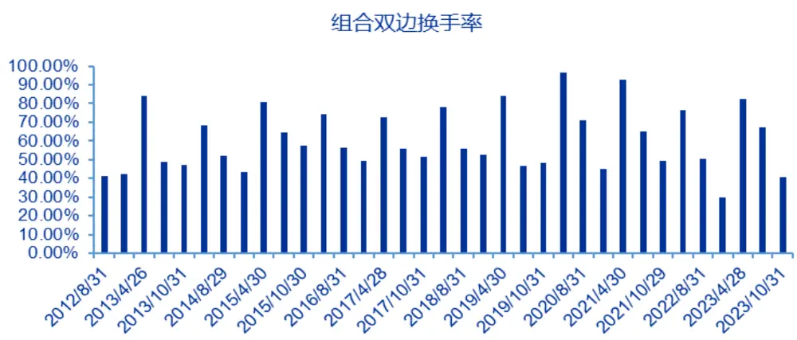
资料来源：Wind，申万宏源研究

红利增长组合每年调仓三次，在 2012/4/30~2024/2/29 回测期间，组合的平均双边换手率为60.63%，年化双边换手率为181.88%，按照双边0.3%的交易成本，组合的每年交易成本约为0.55%（暂不考虑冲击成本）。

图 23：红利增长组合相比中证红利指数有一定市值下沉
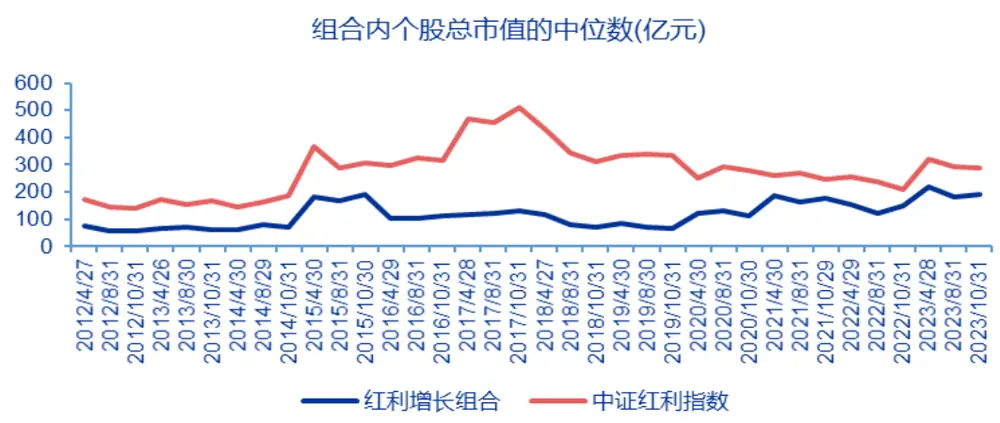
资料来源：Wind，申万宏源研究

在 2012/4/30~2024/2/29 回测期间，统计每期红利增长组合与中证红利指数在市值上的暴露情况，从市值中位数角度看到，红利增长组合相比中证红利指数存在一定的市值下沉，但红利增长组合的市值暴露没有过小，组合市值中位数的均值为117 亿元。

图 24：红利增长组合在中信一级行业上的平均配置权重
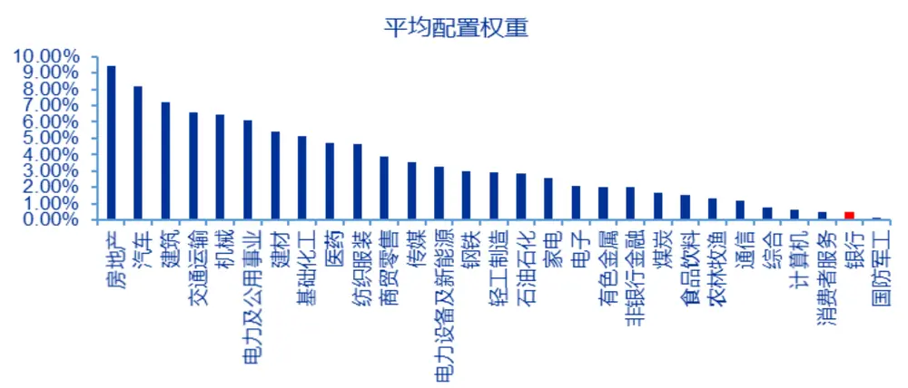
资料来源：Wind，申万宏源研究

图 25：中证红利指数在中信一级行业上的平均配置权重
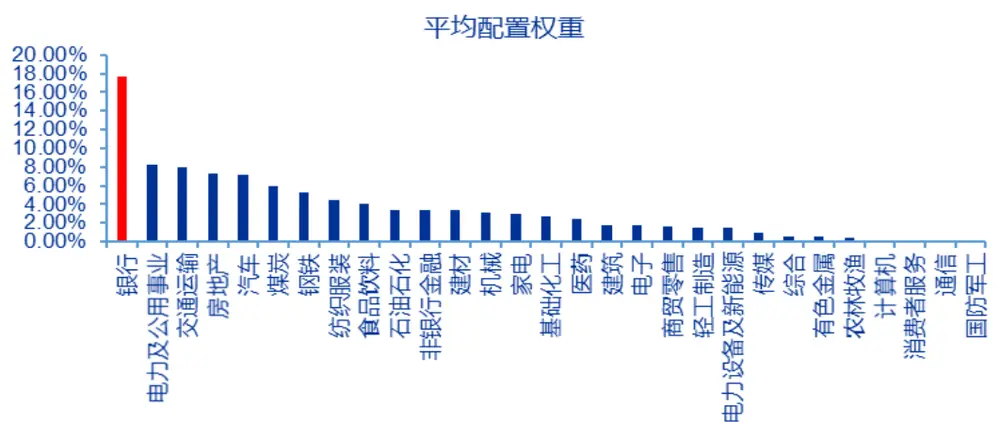
资料来源：Wind，申万宏源研究

在 2012/4/30~2024/2/29 回测期间，统计每期红利增长组合与中证红利指数在中信一级行业上的权重分布。比较看到，两者之间一个突出的差异在于对银行的配置比例，中证红利指数将银行作为第一大配置行业，配置权重大幅高于第二大行业；而红利增长组合对银行的配置权重很低，并且第一大行业房地产的平均权重为 9.42%，组合在行业分布上更分散。

## 5.总结

在之前报告《红利指数产品全览：境外发展特征与境内产品展望》中提及，海外多数地区的红利策略以突出“高股息”特征为主，但美国地区的红利策略相对更多样化，前五大产品跟踪的指数各不相同，目前以高股息增长策略为主，而不同高股息增长指数对连续增长年限的要求也各不相同。

国内红利类指数发展到现在也已相较丰富，根据中证指数公司已发布的红利相关指数，包括有不同宽基指数内的、不同板块/行业内的、红利+其他因子、红利增长、预期红利等，但从指数挂钩产品角度来看，代表性的红利指数，比如中证红利（000922.CSI）、红利低波（H30269.CSI）已有多家基金公司发布相关产品进行跟踪，而红利增长（931056.CSI）指数暂时还没有产品跟踪。

在红利增长指数的编制方案上，突出的是历史分红增长，而我们尝试挖掘未来分红增长的股票构建组合。针对如何预测分红增长，我们梳理并测试了一些逻辑：

1）最近年度有分红且盈利预期增长；

2）过去三年股利支付率稳定且盈利预期增长；

3）过去三年现金分红连续增长且盈利预期增长；

4）过去三年股利支付率连续提高且盈利预期增长；

5）预期股利支付率提高且盈利预期增长；

在权衡了各个逻辑的预测准确率和样本数量之后，我们选取过去三年股利支付率稳定、过去三年现金分红连续增长、预期股利支付率提高三个逻辑下筛选的预期分红增长股票，取并集构成基础股票池。

在基础股票池内，我们选取成长、长期动量、分析师、估值、分红五个因子来优选股票，在 2012/4/30~2024/2/29 回测期间，每年的 4、8、10 月底，基于因子打分方式对股票进行排序，选取得分靠前的50 只股票，按照最近年度股息率加权的方式构建红利增长组合，比较基准为中证红利全收益、红利低波全收益指数。

在2013/1/1~2024/2/29 业绩比较区间，红利增长组合的年化收益为22.46%，同期中证红利全收益、红利低波全收益指数的年化收益分别为 11.34%和 13.16%；在夏普比率上，红利增长组合也是显著高于两个比较基准指数。

分年度，从最近这一轮大盘成长到小盘价值的行情周期中，红利增长组合的表现都跑赢比较基准。在2019、2020，包括2021 年的大盘成长行情下，红利增长组合相对比较基准的年度超额收益均在 10%以上；在 2022、2023 年小盘价值行情下，红利增长组合依然取得超额收益，相对中证红利全收益指数的年度超额收益分别为8.38%、6.28%。

## 6.风险提示

本报告结果基于历史数据测算，未来市场结构可能发生变化，带来策略的不稳定；报告中筛选预期分红增长股票利用到分析师预期数据，当预期数据出现系统偏误的时候，可能带来组合阶段性表现较弱。

## 7．附表

附表 1：申万量化选股因子库

| 大类因子 | 小类因子 | 因子计算方式 |
| --- | --- | --- |
| 成长 | 单季度营业收入同比增速 | 单季度营业收入/去年同期营业收入- 1 |
|  | 单季度归母净利润同比增速 | 单季度归母净利润 /去年同期归母净利润 - 1 |
|  | 标准化预期外收入 SUR | (单季度实际营业收入 －单季度预期营业收入)/预期营业收入标准化 |
|  | 标准化预期外利润 SUE | (单季度实际净利润 － 单季度预期净利润)/预期净利润标准化 |
|  | 单季度 ROA | 单季度归母净利润 /期末总资产 |
| 盈利 | 单季度 ROE | 单季度归母净利润/期末归母所有者权益 |
|  | Delata_单季度 ROA |  |
|  | Delta_单季度 ROE | 单季度 ROA－ 去年同期单季度 ROA |
| 估值 | EP_TTM | 单季度 ROE － 去年同期单季度 ROE 最近4 个季度净利润 /总市值 |
|  | SP_TTM | 最近4个季度营业收入/总市值 |
|  | CFP_TTM |  |
|  | BP_LF | 最近4个季度现金流量净额/总市值 最新季度所有者权益 /总市值 |
| 波动性 | 一个月特质波动率 | 过去 20 个交易日 Fama-French 三因子残差收益率的标准差 |
|  | 一个月特异度 | 1 – 过去 20 个交易日 Fama-French 三因子回归拟合度 |
|  | 三个月特质波动率 | 过去 60 个交易日Fama-French 三因子残差收益率的标准差 |
|  | 三个月特异度 | 1 – 过去 60 个交易日 Fama-French 三因子回归拟合度 |
| 流动性 | 非流动性冲击 | (日涨跌幅绝对值 /日成交额)过去20 个交易日均值 |
|  | 一个月换手 | 过去20个交易日日换手率的均值 |
|  | 三个月换手 | 过去60个交易日日换手率的均值 |
| 长期动量 | 剥离涨停天数的一年期动量 | 最近1年（除去最近1个月）的累计收益率（剔除期间涨停天数） |
| 短期反转 | 一个月反转 | 过去一个月累计收益率 |
|  | 三个月反转 | 过去三个月累计收益率 |
| 市值 | Ln_mv | 总市值取对数 |
| 分析师 | 致预期净利润变化 | 致预期净利润 / 3个月前一致预期净利润 - 1 |
|  | 分析师盈利上调比例 | 过去6个月内分析师自身（上调家数－下调家数）/总家数 |
| 分红 | 最近年度股息率 | 最近年度的预案分红金额 /总市值 |

资料来源：Wind，申万宏源研究

## 信息披露

## 证券分析师承诺

本报告署名分析师具有中国证券业协会授予的证券投资咨询执业资格并注册为证券分析师，以勤勉的职业态度、专业审慎的研究方法，使用合法合规的信息，独立、客观地出具本报告,并对本报告的内容和观点负责。本人不曾因，不因，也将不会因本报告中的具体推荐意见或观点而直接或间接收到任何形式的补偿。

## 与公司有关的信息披露

本公司隶属于申万宏源证券有限公司。本公司经中国证券监督管理委员会核准，取得证券投资咨询业务许可。本公司关联机构在法律许可情况下可能持有或交易本报告提到的投资标的，还可能为或争取为这些标的提供投资银行服务。本公司在知晓范 围 内 依 法合 规 地履 行 披 露义 务 。客 户 可 通过 compliance@swsresearch.com 索 取 有 关披 露 资料 或 登 录www.swsresearch.com 信息披露栏目查询从业人员资质情况、静默期安排及其他有关的信息披露。

## 机构销售团队联系人

华东 A 组茅炯

021-33388488

maojiong@swhysc.com

华东 B 组李庆

021-33388245

liqing3@swhysc.com

华北组肖霞

010-66500628

xiaoxia@swhysc.com

华南组李昇

0755-82990609

Lisheng5@swhysc.com

## 法律声明

本报告仅供上海申银万国证券研究所有限公司（以下简称“本公司”）的客户使用。本公司不会因接收人收到本报告而视其为 客 户 。客 户 应当 认 识到 有 关本 报 告的 短 信提 示 、电 话 推荐 等 只是 研 究观 点 的简 要 沟通 ， 需以 本 公 司http://www.swsresearch.com 网站刊载的完整报告为准，本公司并接受客户的后续问询。本报告首页列示的联系人，除非另有说明，仅作为本公司就本报告与客户的联络人，承担联络工作，不从事任何证券投资咨询服务业务。

本报告是基于已公开信息撰写，但本公司不保证该等信息的准确性或完整性。本报告所载的资料、工具、意见及推测只提供给客户作参考之用，并非作为或被视为出售或购买证券或其他投资标的的邀请或向人作出邀请。本报告所载的资料、意见及推测仅反映本公司于发布本报告当日的判断，本报告所指的证券或投资标的的价格、价值及投资收入可能会波动。在不同时期，本公司可发出与本报告所载资料、意见及推测不一致的报告。

客户应当考虑到本公司可能存在可能影响本报告客观性的利益冲突，不应视本报告为作出投资决策的惟一因素。客户应自主作出投资决策并自行承担投资风险。本公司特别提示,本公司不会与任何客户以任何形式分享证券投资收益或分担证券投资损失，任何形式的分享证券投资收益或者分担证券投资损失的书面或口头承诺均为无效。本报告中所指的投资及服务可能不适合个别客户，不构成客户私人咨询建议。本公司未确保本报告充分考虑到个别客户特殊的投资目标、财务状况或需要。本公司建议客户应考虑本报告的任何意见或建议是否符合其特定状况，以及（若有必要）咨询独立投资顾问。在任何情况下，本报告中的信息或所表述的意见并不构成对任何人的投资建议。在任何情况下，本公司不对任何人因使用本报告中的任何内容所引致的任何损失负任何责任。市场有风险，投资需谨慎。若本报告的接收人非本公司的客户，应在基于本报告作出任何投资决定或就本报告要求任何解释前咨询独立投资顾问。

本报告的版权归本公司所有，属于非公开资料。本公司对本报告保留一切权利。除非另有书面显示，否则本报告中的所有材料的版权均属本公司。未经本公司事先书面授权，本报告的任何部分均不得以任何方式制作任何形式的拷贝、复印件或复制品，或再次分发给任何其他人，或以任何侵犯本公司版权的其他方式使用。所有本报告中使用的商标、服务标记及标记均为本公司的商标、服务标记及标记。