# 红利增长策略的下一步：如何更准确的预测分红增长?

## ——红利策略全攻略系列之六

## 证券分析师

杨俊文A0230522070001

yangjw@swsresearch.com

邓虎A0230520070003

denghu@swsresearch.com

研究支持

方思齐 A0230123090003

fangsq@swsresearch.com

联系人

方思齐

(8621)23297818×

fangsq@swsresearch.com

## 本期投资提示：

- 在《如何构建分红潜在增长的股票组合？》一文中我们可以看到，由未来红利增长的企业所构成的股票池在可以准确预测红利增长的前提下，有着很好的超额潜力。但如果想要更准确全面的去预测企业的分红增长一一也就是预测企业未来一年的分红情况，所要考虑的出发点便是分红的来源，即：分红金额=净利润×红利支付率。我们从这个公式入手去拆解和预测未来的分红增长企业。

- 相较红利支付率，净利润的增长是预测企业分红增长的一个重要指标。如果一家企业能够在未来实现净利润的提升，红利支付率保持稳定的前提下，分红金额也会相应增加。而红利支付率的提升虽然也可以反映出公司管理层对未来的信心，但相对净利润数据更偏主观，预测难度较高。

- 借由一致预期预测企业未来增长也存在一定问题，我们基于此在使用预期数据预测分红增长时，对预期数据的使用做了进一步优化调整。(1）由于覆盖的卖方数量过少、或分析师数据更新相对滞后，存在财报单季度同比连续下跌但一致预期年度业绩仍然为增长的情况。对此，我们要求最新一期财报的净利润累计同比应当为正来进行修正。(2)对于盈利能力波动较大的企业，这类相对不太稳定的企业进行盈利准确预测的难度更大。对此我们要求企业的历史ROE水平应当在一定阈值内保持稳定。

- 除了基于一致预期的视角以外，我们也基于历史数据从景气度的角度进行考量。企业的景气度反映了其当前的经营状况和未来的发展潜力。当企业的盈利能力显著增强，净利润等指标呈现加速增长的态势时，通常意味着企业正处于一个有利的经营周期，这种情况下，我们可以预期企业未来的盈利能力将继续提升，在新一期年报中实现净利润的进一步增长。这里我们分别从净利润同比和ROE同比两个角度的加速增长去对企业进行景气度上的筛选，在历史红利支付率稳定的情况下，景气度上行的企业更有可能实现盈利的增长、并进而实现分红增长。

- 我们从以上预期和景气度两个大视角下的共计四个子视角分别预测企业分红增长。四种视角下企业分红增长预测胜率均在70%以上，对四种子视角取并集后，每年的4、8、10月底，模型总体上有着71%的高预测胜率，近几期的股票数量可以来到500只以上高红利增长预测胜率和高股票数量展现了较好的预测效果，也为我们继续进行股票筛选、构建红利增长组合提供更大的股票样本选择。

- 在此基础上，我们按股息率因子对股票进行排序，选取股息率因子最高的50只股票、按股息率进行加权构建红利增长组合。在仅使用股息因子进行筛选和加权的情况下，组合的年化收益率达19.48%，超越中证红利全收益的11.33%年化收益率。分年度来看，组合在各个年份中基本都保持对红利指数的超额优势，尤其是2019年以来，组合相对中证红利各年份均有超额，平均每年超额达7.35%，表现优异。

- 风险提示：本报告结果基于历史数据测算，未来市场结构可能发生变化，带来策略的不稳定；报告中筛选预期分红增长股票利用到分析师预期数据，当预期数据出现系统偏误的时候，可能带来组合阶段性表现较弱。

## 1. 预测红利增长前的思考：红利增长来自于什么?

## 1.1 从分红金额的公式入手拆解红利

在《如何构建分红潜在增长的股票组合？》一文中我们提到，由未来红利增长的企业所构成的股票池在可以准确预测红利增长的前提下，有着很好的超额潜力。并且这一逻辑采用的是红利增长的角度、而非简单的追逐高分红，这也是海外红利策略中较为主流的高股息增长策略。那么在此基础上，我们是否可以去更加准确的预测企业的分红增长，以及脱离因子化、用更纯粹的股息率从分红角度进行股票的筛选和加权?

如果想要更准确全面的去预测企业的分红增长一一也就是预测企业未来一年的分红情况，所要考虑的出发点便是分红的来源。企业的分红金额公式为：

$$
分红金额=净利润\times 红利支付率
$$

这一公式揭示了我们预测未来分红金额增长的两条主要途径：如果未来企业的分红金额增长，则公式中的“净利润”和“红利支付率”两项中必然有一项是增长的。

图1：企业分红金额公式拆解
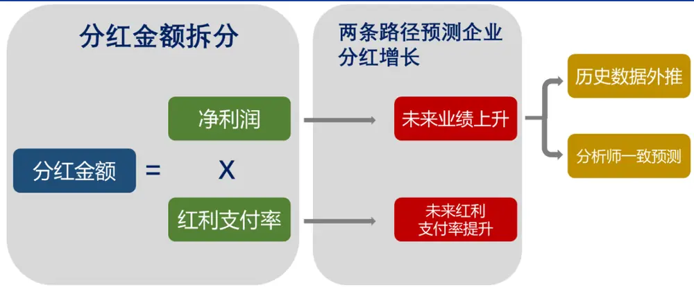
资料来源：Wind，申万宏源研究

## 净利润增长

净利润的增长是预测企业分红增长的一个重要指标。如果一家企业能够在未来实现净利润的提升，红利支付率保持稳定的前提下，分红金额也会相应增加。

净利润的提升通常反映了企业在业务拓展成本控制市场竞争力等方面的综合表现。净利润的提升，带动分红金额的增长，也是相对较为健康的一种红利增长方式，企业将自己获得的比往年更高的利润分享给股东，而投资这类企业与企业共同分享收益，也是通常红利投资的理想场景。

## 红利支付率的提升

除了净利润的提升，红利支付率的提升也会导致总分红金额的增长。然而，相比于净利润这一较为客观的盈利数据，红利支付率是由公司管理层经股东大会讨论给出的这一数据稍偏主观，但红利支付率的提升往往反映出公司管理层对未来盈利能力的信心，或是公司为了提升股东回报而作出的战略调整。

不过相对来说，这一数据在预测增长上的困难度相比净利润更高，我们后续也会围绕红利支付率提升的角度进行讨论。

## 1.2 支付率稳定：红利投资的出发点

在前面的分析中不难看出，从净利润提升的角度对分红增长进行预测，在可预测性和红利投资策略的逻辑性上都更加顺畅一些，而这一点也将在我们后续的实际回测中得到验证。然而净利润提升带动分红金额增长的一个重要前提就是红利支付率的稳定，也就是净利润提升的同时，红利支付率至少不能在未来一期大幅下降，在这一前提下，新一期的分红金额才可能会保持增长。

对红利支付率稳定的这一角度，我们在《如何构建分红潜在增长的股票组合》一文中也有涉及。我们将其定义为历史红利支付率的偏离不能高于一定阈值，作为预测红利增长的子视角之一，结合盈利预期增长的前提进行红利增长的预测，在预测结果上有着62%的准确度，表现较好。

更为重要的是，红利支付率的稳定更符合我们红利投资的出发点和逻辑所在。正如提到红利策略，大家首先会想到的如大市值银行和茅台等稳定分红的大盘股一样，具有长期持续稳定的盈利能力、分红率相对稳定的这类企业，往往更符合红利投资的目标选择，也是大家进行红利投资的认为较为符合策略逻辑的代表股票之一。

图2：过去三年股利支付率稳定(5%)且盈利预期增长的筛选准确率
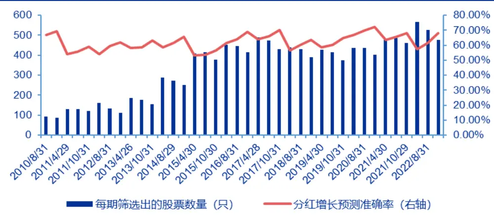
资料来源：Wind，申万宏源研究，《如何构建分红潜在增长的股票组合？》

表1：过去三年股利支付率稳定且盈利预期增长在不同时点下的预测准确率

| 不同十点 | 准确率（threshold=5%） | 准确率（threshold=10%） |
| --- | --- | --- |
| 所有时点下预测准确率的均值 | 62.15% | 60.27% |
| 4 月底预测准确率的均值 | 58.90% | 57.44% |
| 8月底预测准确率的均值 | 61.36% | 59.72% |
| 10月底预测准确率的均值 65.18% 63.47% |  |  |

资料来源：Wind，申万宏源研究，《如何构建分红潜在增长的股票组合？》

## 1.3 盈利预测：如何刻画企业净利润增长?

除了红利支付率稳定，如何对未来净利润进行预测也是一大难点。通常而言，我们可以直接采用分析师的一致预期数据来对未来的企业净利润增长进行估计。但分析师的预期数据也存在其局限性：

本身客观存在的预测难度：分析师无法很好地准确预测所有公司。不同公司的业务模式、市场环境、管理水平等差异较大，使得分析师在预测时面临诸多挑战。即使是经验丰富的分析师，也难以做到对所有公司的净利润进行准确预测。

盈利波动较大的企业难以准确估量未来净利润：在企业如净资产收益率(ROE)为代表的盈利能力相对稳定的情况下，分析师的准确预测往往不难。但当企业并不处于稳定成熟期、历史ROE和净利润波动较大的情况下，预测净利润的难度也会显著增加。

预测数据更新不及时：预期数据的更新可能不及时，导致预测出现偏差，并且在企业的卖方预测家数较少的情况下更有可能出现这一情况。市场环境变化、政策调整、行业动态等都会影响企业的盈利能力，如果分析师预期数据未能及时反映这些变化，其准确性也将大打折扣。

因此，在使用分析师一致预期数据时，我们并不只是简单的将其拿来用于刻画未来企业增长预测的情况，而也会从不同视角来对预期数据进行修正。

此外，我们也对企业本身的景气度进行考量，不使用预期数据、而仅从历史的财报数据来分析企业所处的当前景气视角。从景气度的角度出发，我们也从企业的历史实际业绩加速增长和历史盈利能力加速增长两个维度，来筛选处于景气上升期的企业

企业的景气度反映了其当前的经营状况和未来的发展潜力。通过对历史财报数据的分析，可以判断企业是否处于景气上行阶段。当企业的盈利能力显著增强，净利润等指标呈现加速增长的态势时，通常意味着企业正处于一个有利的经营周期。在这种情况下，我们可以预期企业未来的盈利能力将继续提升，从而在新一期年报中实现净利润的进一步增长。

图3：示意图：业绩指标加速增长时，企业景气度处于上升期
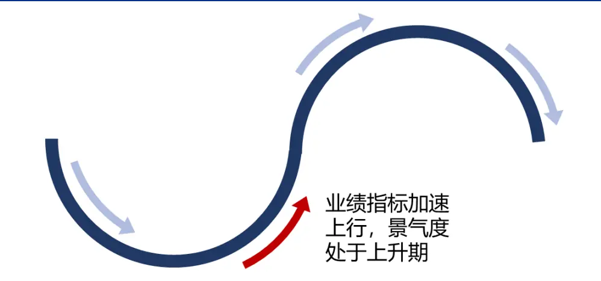
资料来源：Wind，申万宏源研究

基于此，我们将净利润增长方法下对企业分红增长的预测分为了基于一致预期数据的预期视角，和基于历史财报数据的景气度视角，两个大视角下也针对性地做了不同的调整，共计4种子视角。

图4：不同子视角下对红利增长进行预测

资料来源：Wind，申万宏源研究

在统一的筛选条件中，我们均要求企业上一期年报的红利支付率不能过高，并且企业要具有三年以上的分红历史习惯，这也是一般红利指数编制所必备的两条筛选条件，以此来保证企业具有分红习惯，并且上一期分红后，并没有透支企业在未来的分红潜力。

除此以外，从净利润增长推导至分红增长的前提是红利支付率的相对稳定，并且支付率稳定这一条件在之前的测试中也有较好的发挥，因此我们也将企业过去红利支付率稳定作为先决条件放在统一条件中进行筛选。

## 2. 净利润增长视角：预期视角

## 2.1 通过最新一期财报同比修正预期数据

在第一种子视角下，我们用最新一期财报的单季净利润累计同比来对一致预期数据进行修正。在可获取的一致预期数据上，由于覆盖的卖方数量过少、或分析师数据更新相对滞后，存在部分企业即使连续几季的财报单季度同比均有下跌，但一致预期仍然为增长的情况。为了排除这类情况，我们在使用一致预期数据前，要求最新一期财报的净利润累计同比应当为正。可以看到这一条件的筛选相对较为宽松，全A股中57.68%的上市企业均满足这一条件。通过这一个较为宽松的过滤，我们可以保证所用的预期数据更为可信。

此外，在预期视角下，除了统一要求净利润预期增长为正以外，我们也要求盈利预期的预测家数应当为三家以上，这样一方面既保证了最终采用的预期数据相对客观此外也剔除了分析师覆盖较少、基本面和市场关注度都相对较弱的上市企业，也起到了一定的筛选效果。

表2：筛选条件：最新一期财报同比修正预期数据

| 类型 | 条件 | 全 A 股中筛选率 |
| --- | --- | --- |
| 统一条件 | 上期红利支付率<90% | 95.84% |
|  | 连续三年分红 | 50.85% |
|  | 红利支付率偏离<10% | 47.45% |
| 预期条件 | 预测家数>3 | 36.03% |
|  | 预期净利润增长 | 53.33% |
| 其他条件 | 最新一期累计同比增长 | 57.68% |

资料来源：Wind，申万宏源研究

通过最新一期财报净利润数据对预测结果进行纠正和再筛选之后，在该视角下的预测胜率可以达到72.19%，并且近两年来中期股票数量也有400只左右，具有较高的预测胜率和较多的入选股票数量。

图5：逐期预测情况：最新一期财报同比修正预期数据
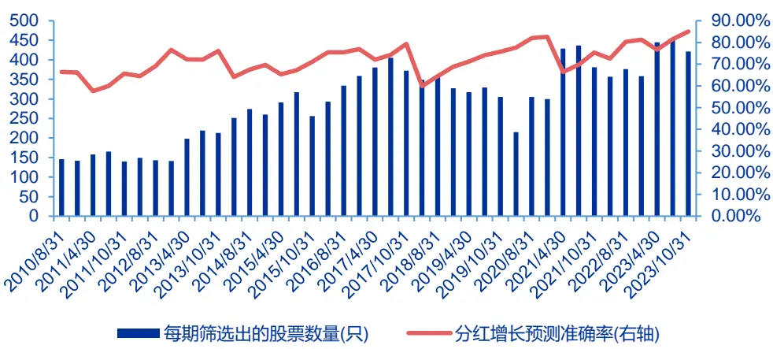
资料来源：Wind，申万宏源研究

表3：预测胜率：最新一期财报同比修正预期数据

| 不同时点 | 准确率 |
| --- | --- |
| 所有时点下预测准确率的均值 | 72.91% |
| 4月底预测准确率的均值 | 69.49% |
| 8月底预测准确率的均值 | 72.88% |
| 10月底预测准确率的均值 | 76.23% |

资料来源：Wind，申万宏源研究

## 2.2 通过 ROE 稳定修正预期数据

除了财报历史数据增长方向与分析师预测方向可能存在明显分歧的情况，还有一种情况下分析师的预期数据准确度也可能会受到一定影响。对于盈利能力波动较大的企业，其历史ROE水平上下波动程度较大，对这类相对不太稳定的企业进行盈利预测的难度要比处于稳定期的企业明显更大，对这些企业的净利润预测胜率也可能会更低。

因此，我们仿照对红利支付率稳定的要求，也要求企业的历史ROE水平应当在一定阈值内保持稳定，具体来说，我们仿照红利支付率偏离的计算，要求过去四年年末的ROE数据偏离应当小于1%，以保历史ROE的稳定。

此外，我们也要求企业自身的ROE水平在全市场内处于前列。通过这两条筛选对一致预期进行修正，可以使得最后满足筛选的条件的企业既具有盈利预期的的增长，同时自身盈利能力稳定，盈利能力也在市场里处于前列的龙头地位。

表4：筛选条件：ROE稳定修正预期数据

| 类型 |  | 全A筛选率 |
| --- | --- | --- |
| 统一条件 | 上期红利支付率<90% | 95.84% |
|  | 连续三年分红 | 50.85% |
|  | 红利支付率偏离<10% | 47.45% |
| 预期条件 | 预测家数>3 | 36.03% |
|  | 预期净利润增长 | 53.33% |
| 其他条件 | ROE 在前 30% | 30.01% |
|  | 过去四期ROE偏离<1% | 33.02% |

资料来源：Wind，申万宏源研究

在这些条件下，企业分红增长预测的胜率可以达到71.78%，并且在不同月份下的预测胜率均有70%以上，表现出了高预测胜率和高预测稳定性。由于对企业的ROE稳定和ROE市场水平都提出了筛选要求，因此入选的股票数量相对第一种视角下偏少，每期在100~200只左右。

图6：逐期预测情况：ROE稳定修正预期数据
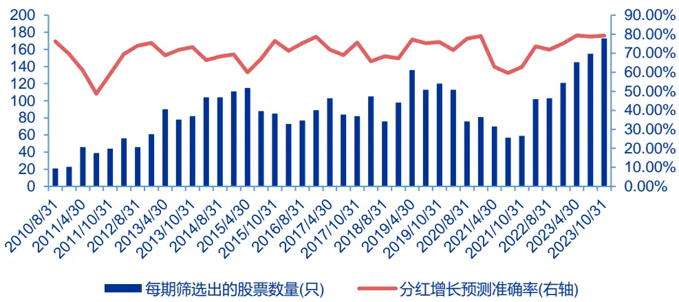
资料来源：Wind，申万宏源研究

表5：预测胜率：ROE稳定修正预期数据

| 不同时点 | 准确率 |
| --- | --- |
| 所有时点下预测准确率的均值 | 71.78% |
| 4 月底预测准确率的均值 | 70.11% |
| 8月底预测准确率的均值 | 71.35% |
| 10月底预测准确率的均值 | 73.88% |

资料来源：Wind，申万宏源研究

## 3. 净利润增长视角：景气度视角

除了基于一致预期的视角以外，从历史财报数据来对企业所处在的景气程度进行分析也可以对未来净利润增长起到一定的判断作用。

作为对预期视角的补充，我们对景气度的判断要求的约束设置的更为严格，当企业的业绩表现在近几个财报季里呈现加速增长时，我们认为企业当前应当处在景气度上行的阶段。加速增长意味着业绩表现不仅呈现出增长，而且每一期的同比增长都较上一期更高，这种状态下企业更有可能在当年年末表现出净利润增长，从而在历史红利支付率稳定的情况下，最终实现分红金额的增长。

## 3.1 逐季度净利润同比加速增长

首先，我们对企业净利润的加速增长进行了分析，这里我们要求企业过去4个季度的单季度净利润要表现为加速增长的态势。这一筛选条件非常严格，在A股中仅有4.87%的股票满足这一条件。

表6：筛选条件：净利润同比加速增长

| 类型 |  | 全A筛选率 |
| --- | --- | --- |
| 统一条件 | 上期红利支付率<90% | 95.84% |
|  | 连续三年分红 | 50.85% |
|  | 红利支付率偏离<10% | 47.45% |
| 其他条件 | 业绩加速增长 | 4.87% |

资料来源：Wind，申万宏源研究

因为对加速增长这一筛选条件过于严格，因此可以最终满足条件的股票数量相对较少，总体每期仅在50只左右，但胜率也达到了70%以上。

图7：逐期预测情况：净利润同比加速增长
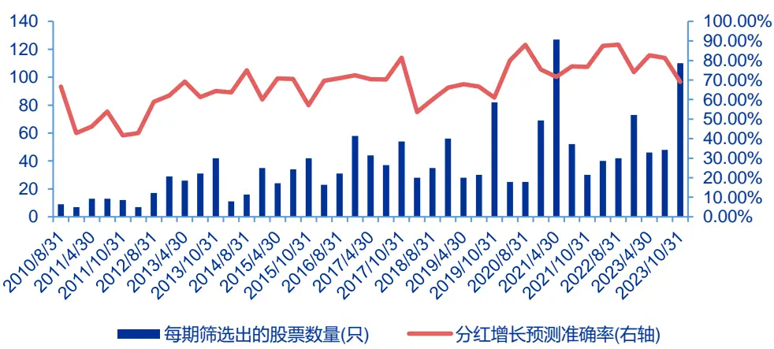
资料来源：Wind，申万宏源研究

表7：预测胜率：净利润同比加速增长

| 不同时点 | 准确率 |
| --- | --- |
| 所有时点下预测准确率的均值 | 70.28% |
| 4 月底预测准确率的均值 | 71.49% |
| 8月底预测准确率的均值 | 72.62% |
| 10月底预测准确率的均值 | 68.10% |

资料来源：Wind，申万宏源研究

## 3.2 逐季度 ROE同比加速增长

除了业绩的加速增长以外，ROE反映了企业的盈利能力，过去四季的ROE加速增长也可以体现出企业的盈利能力和公司景气度的上升。

表8：筛选条件：ROE同比加速增长

| 类型 |  | 全A筛选率 |
| --- | --- | --- |
| 统一条件 | 上期红利支付率<90% | 95.84% |
|  | 连续三年分红 | 50.85% |
|  | 红利支付率偏离<10% | 47.45% |
| 其他条件 | ROE 加速增长 | 9.18% |

资料来源：Wind，申万宏源研究

与业绩的加速增长类似，满足ROE加速增长的上市公司数量也相对较少，A股中9.18%的企业满足这一条件。最终入选的股票总体在每期100只左右，但在胜率上也表现较好，所有时点下共计有高达72.60%的胜率，并且在10月底时预测的准确率平均有76.06%。

图8：逐期预测情况：ROE同比加速增长
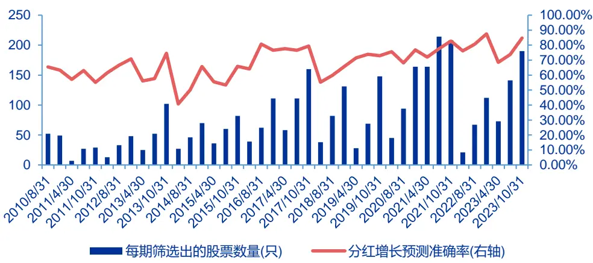
资料来源：Wind，申万宏源研究

表9：预测胜率：ROE同比加速增长

| 不同时点 | 准确率 |
| --- | --- |
| 所有时点下预测准确率的均值 | 72.60% |
| 4 月底预测准确率的均值 | 67.25% |
| 8月底预测准确率的均值 | 70.36% |
| 10月底预测准确率的均值 | 76.06% |

资料来源：Wind，申万宏源研究

## 4. 总体模型

## 4.1 模型表现

在基于以上4个子视角进行讨论之后，我们对这4个视角所筛选出来的股票池取并集构成样本池。同样，我们也测试这个选股池中实际分红增长的股票比例。

在以上4个视角进行复核后，近几期的股票数量可以来到500只以上，并且总体胜率稳定在70%以上，具有较高的红利增长预测准确度。此外更高的样本除数量，也可以为我们继续进行股票筛选、构建红利增长组合提供更大的股票样本选择。

图9：逐期预测情况：组合表现
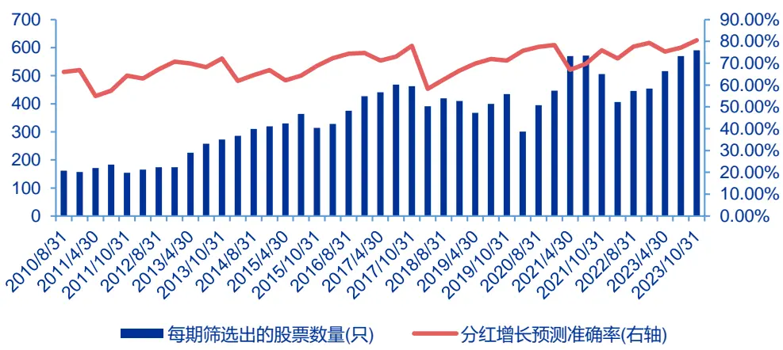
资料来源：Wind，申万宏源研究

表10：预测胜率：组合表现

| 不同时点 | 准确率 |
| --- | --- |
| 所有时点下预测准确率的均值 | 71.02% |
| 4月底预测准确率的均值 | 68.15% |
| 8月底预测准确率的均值 | 70.66% |
| 10月底预测准确率的均值 | 73.89% |

资料来源：Wind，申万宏源研究

在进一步构建组合的股票样本选择上，我们这里仅简单的以历史股息率因子作为筛选条件，在每一期中取股息率因子最大的前50只股票去构成投资组合，并按照过去一年的股息率进行加权。

在仅使用股息因子进行筛选和加权的情况下，组合的年化收益率可以有19.48%，并且相对中证红利全收益指数的超额总体上持续积累。

图10：组合累计收益较其他指数
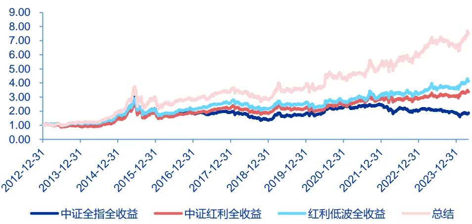
资料来源：Wind，申万宏源研究

图11：组合相较中证红利超额持续积累
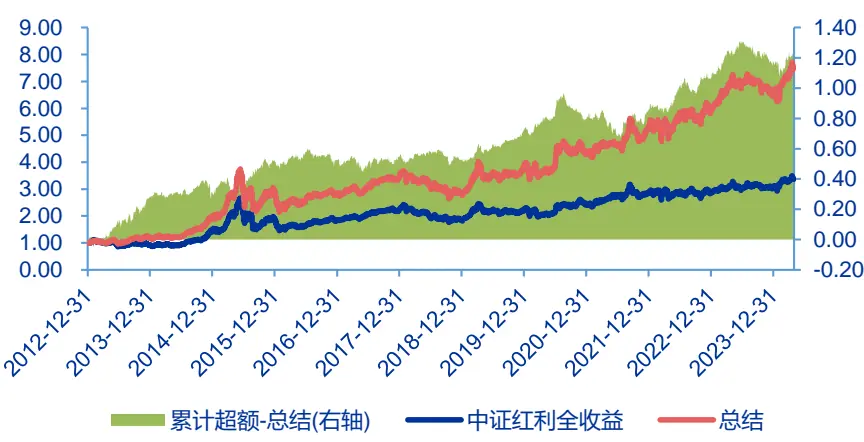
资料来源：Wind，申万宏源研究

表11：组合全区间收益情况与其他指数比较

|  | 累计收益率(%) | 年化收益率(%) | 年化波动率(%) | 夏普比率 | 最大回撤 | 最大回撤日期 |
| --- | --- | --- | --- | --- | --- | --- |
| 中证全指全收益 | 87.62 | 5.71 | 22.55 | 0.25 | 55.78% | 2018/10/18 |
| 中证红利全收益 | 237.52 | 11.33 | 21.55 | 0.53 | 45.66% | 2016/1/28 |
| 自选组合 | 652.29 | 19.48 | 23.47 | 0.83 | 42.86% | 2016/1/28 |

资料来源：Wind，申万宏源研究

在逐年的收益表现上，除了2016和2018年以一个点左右的差距略为跑输中证红利以外，其余均逐年战胜红利指数。并且在近几年来，稳定大幅跑赢中证红利全收益指数。

表12：逐年收益率比较

| 中证全指全收益 |  | 中证红利全收益 | 自选组合 |
| --- | --- | --- | --- |
| 2013 | 7.10 | -6.74 | 21.05 |
| 2014 | 48.41 | 57.59 | 61.28 |
| 2015 | 33.78 | 29.89 | 50.56 |
| 2016 | -13.31 | -4.30 | -5.08 |
| 2017 | 3.68 | 21.34 | 23.20 |
| 2018 | -28.79 | -16.15 | -17.66 |
| 2019 | 33.41 | 20.88 | 36.73 |
| 2020 | 26.87 | 8.18 | 12.00 |
| 2021 | 7.70 | 18.19 | 22.74 |
| 2022 | -18.93 | -0.37 | 10.46 |
| 2023 | -5.34 | 6.34 | 12.25 |
| 2024 | -1.45 | 10.90 | 14.04 |

资料来源：Wind，申万宏源研究

## 4.2 组合分析

在逐期50只股票的持仓表现上，红利增长组合历史上主要以周期大类的股票为主。在2020年前后周期大类风格的权重占比达到最大，2021年以后，周期权重逐渐降低，近几年来组合在先进制造上的权重占比明显提升。

图12：组合大类风格权重分布逐期情况
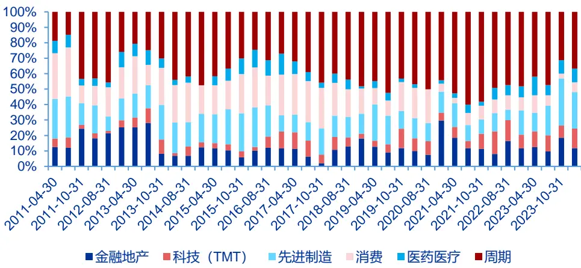
资料来源：Wind，申万宏源研究

从市值中位数角度看到，红利增长组合相比中证红利指数存在一定的市值下沉，但红利增长组合的市值暴露没有过小，组合市值中位数的均值为134.97亿元。

图13：红利增长组合相比中证红利指数有一定市值下沉(市值中位数，亿元)
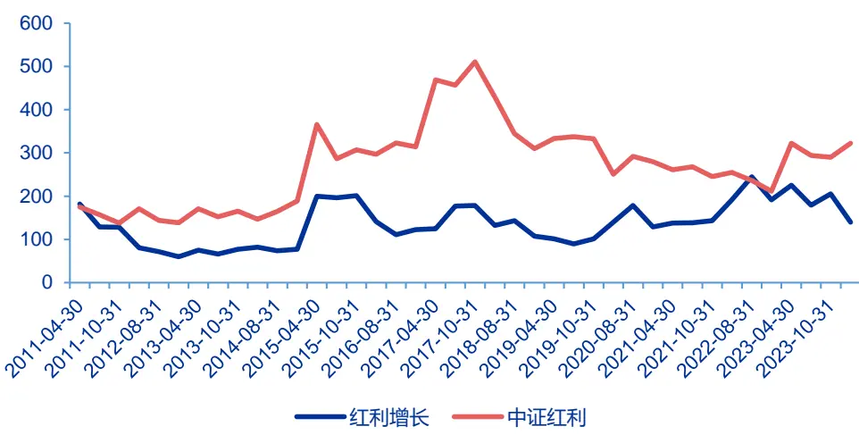
资料来源：Wind，申万宏源研究

在最新一期的行业的分布上，红利增长组合相比中证红利组合的权重分布更加分散。并且在诸如非银金融、轻工制造、家用电器等行业上的权重分布明显更高，而在中证红利权中分布较多的行业上所持有的权重占比相对较低，如煤炭、银行、交通运输等。

图14：红利增长组合在申万一级行业上配置与中证红利迥异
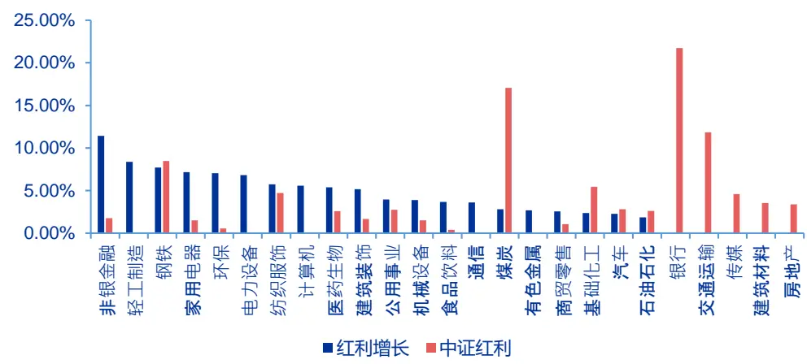
资料来源：Wind，申万宏源研究

在股息率方面，我们以调仓时前后滚动一年的区间分红金额除以换仓时点的总市值，来表现组合历史股息率和未来股息率情况。由下图可以看到，由于分红增长预测的高准确度，组合自身的未来股息率在各期基本都高于历史股息率，从这个角度也体现了较好的红利增长预测效果。

图15：组合历史股息率和未来股息率比较
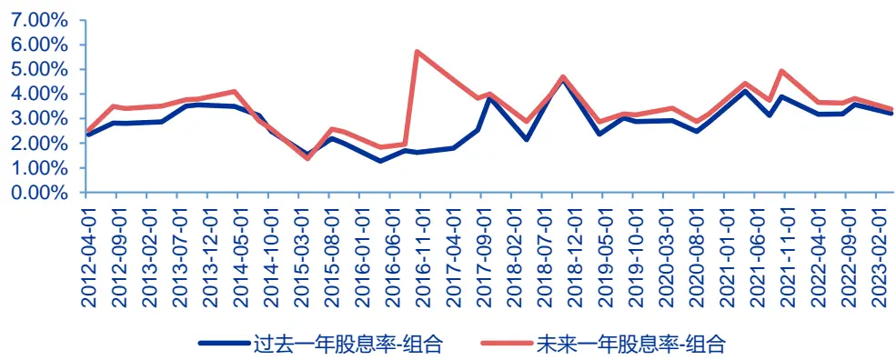
资料来源：Wind，申万宏源研究。截止至20230430

与中证红利的股息率比较来看，组合的过去一年股息率略低于中证红利，但股息率水平上基本相当，最近一期，红利增长组合和中证红利的历史股息率分别为3.21%和4.42%。而未来股息率上，组合股息率有所上升，股息率与中证红利较为相似，组合和中证红利的未来股息率水平分别为3.38%和4.26%。(历史股息率和未来股息率比较时间均截止至2023 年4月30日)

图16：组合和中证红利历史股息率的比较
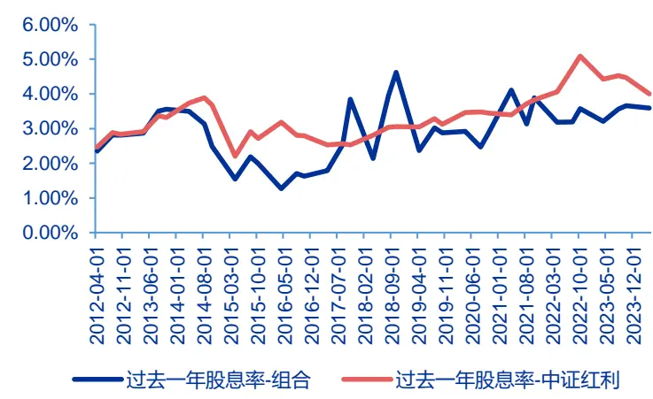
资料来源：Wind，申万宏源研究。截止至20240430

图17：组合和中证红利未来股息率的比较
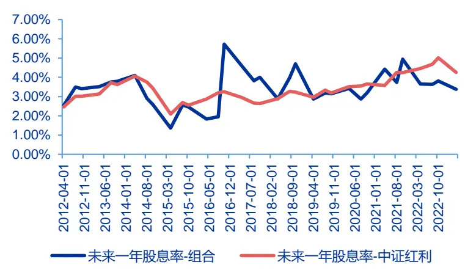
资料来源：Wind，申万宏源研究。截止至20230430

## 5. 其他视角的探索：支付率跃升

正如我们在第1章开头所说的：

## 分红金额=净利润×红利支付率

因此，对分红增长的预测也应当从净利润和红利支付率两个角度来展开。然而相比于净利润的预测增长，从红利支付的利率的角度对分红增长进行预测的难度要更高。

在《如何构建分红潜在增长的股票组合》中，我们基于红利支付率的动量效应对分红金额增长进行了预测，总体上效果相对一般，在要求过去三年股利支付率连续提高且盈利预期增长的约束后，在整个回测区间，过去三年股利支付率连续提高且盈利预期增长的预测准确率均值为49.50%，低于50%的随机预测准确率，也说明该逻辑并不能较好的筛选出分红增长的股票。

表13：过去三年股利支付率连续提高且盈利预期增长在不同时点下的预测准确率

| 不同时点 | 准确率 |
| --- | --- |
| 所有时点下预测准确率的均值 | 49.50% |
| 4 月底预测准确率的均值 | 47.11% |
| 8月底预测准确率的均值 | 49.76% |
| 10月底预测准确率的均值 53.20% |  |

资料来源：Wind，申万宏源研究，《如何构建分红潜在增长的股票组合？》

作为公司管理层最终决定的红利支付率，其动量效应相对来说可能十分明显，而且显然红利支付率是无法无限提升的，因此当历史红利支付率连续增长时，未来的红利支付率不仅可能不会继续保持增长，反而可能在过往连续大幅分红后疲软，红利支付率有所下降，以保证公司未来正常的运转和发展。

在之前红利支付率动量的基础上，我们也进一步考虑了其他红利支付率角度可能带来红利增长的情况。其中可能的情况之一是由红利支付率跃升所带来的分红金额增长的情况。

当企业在过往的红利支付率稳定的前提下，如果在上一期红利支付率发生了跃升、总体占上了一个新的台阶，那么在今年盈利预期向好的情况下，红利支付率更有可能会站稳当前新的台阶，从而在新台阶的基础上实现分红金额的增长。在具体的指标考核上，我们要求跃升之前的红利支付率相对稳定，并且红利支付率跃升的幅度也不能过高，过高的跃升幅度往往意味着公司难以维持新的高额红利支付比例。

表14：筛选条件：最新一期财报同比修正预期数据

| 类型 条件 |  | 全 A 股中筛选 率 |
| --- | --- | --- |
| 筛选分红企业 | 上期红利支付率<90% | 95.84% |
|  | 连续三年分红 | 50.85% |
| 跃升前历史红利支付率相对稳定 | 红利支付率T-2~T-4 偏离<10% | 37.55% |
| 红利支付率发生跃升 | 红利支付率 T-1 较 T-2 上升 10%以上 | 23.02% |
| 红利支付率跃升幅度没有过高 | 红利支付率 T-1 较 T-2 上升 30%以下 | 88.94% |
| 盈利预期向好 | 预测家数>3 | 36.03% |
|  | 预期净利润增长强化3 | 55.19% |
|  | 最新一期累计同比增长 | 57.68% |

资料来源：Wind，申万宏源研究

在最后的结果表现上，新增了一定限制条件的红利支付率跃升角度下总体的胜率为60.88%，略低于净利润增长下的各个子视角胜率。并且由于红利支付率发生跃升的情况也相对较少，因此总体上能够入选的股票数量也相对不是很多。基于这些原因，我们在最后的总体模型中并没有将红利支付率的视角考虑进去，而仅仅在这里作为一个讨论点。

图18：逐期预测情况：最新一期财报同比修正预期数据
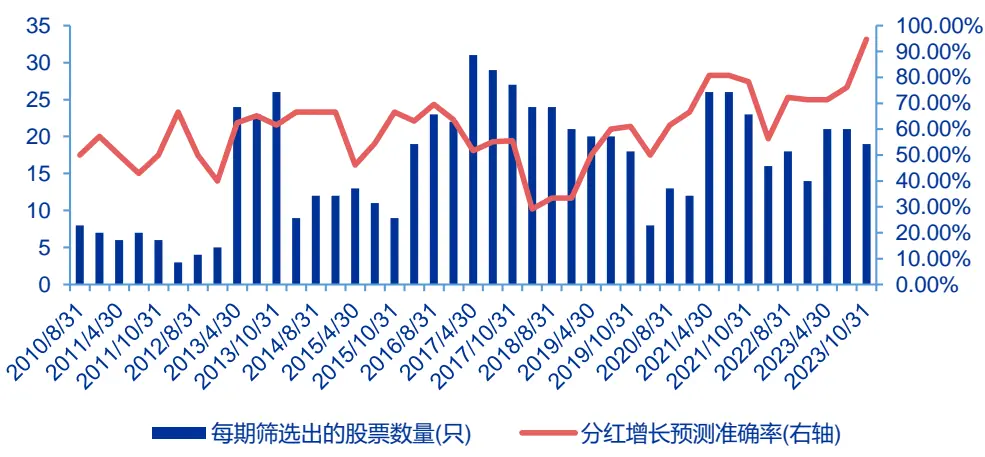
资料来源：Wind，申万宏源研究

表15：预测胜率：最新一期财报同比修正预期数据

| 不同时点 | 准确率 |
| --- | --- |
| 所有时点下预测准确率的均值 | 60.88% |
| 4月底预测准确率的均值 | 57.27% |
| 8月底预测准确率的均值 | 61.92% |
| 10月底预测准确率的均值 | 63.35% |

资料来源：Wind，申万宏源研究

## 6. 总结

在《如何构建分红潜在增长的股票组合？》对红利增长预测的基础上，本文从分红金额本身的拆解入手，从多个角度梳理分红增长的预测，我们尝试去更加准确的预测企业的分红增长，以及脱离因子化、用更纯粹的股息率从分红角度对股票进行再筛选和组合。

在具体的红利增长预测视角上，我们围绕红利支付率稳定+未来净利润增长的角度，从预测和景气度视角分别进行观测：

图19：红利增长组合筛选逻辑
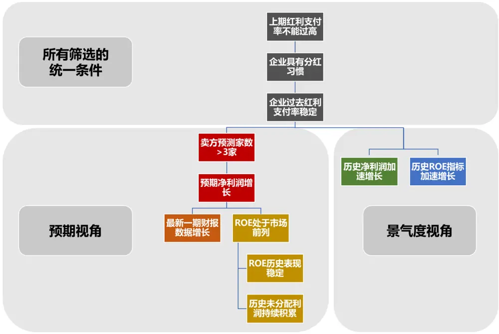
资料来源：Wind，申万宏源研究

在四个子视角并集组成的红利增长预测结果内，每年的4、8、10月底，模型总体上有着71%的高预测胜率。在此基础上，我们按股息率因子对股票进行排序，选取股息率因子最高的50只股票、按股息率进行加权构建红利增长组合。

在仅使用股息因子进行筛选和加权的情况下，组合的年化收益率可以有19.48%，超越中证红利全收益的11.33%年化收益率，并且在各个年份中基本都保持对红利指数的超额优势。在近几年大小盘切换的不同行情中，组合较中证红利也都有较为稳定的超额表现。

## 7. 风险提示

本报告结果基于历史数据测算，未来市场结构可能发生变化，带来策略的不稳定；报告中筛选预期分红增长股票利用到分析师预期数据，当预期数据出现系统偏误的时候，可能带来组合阶段性表现较弱。

## 信息披露

## 证券分析师承诺

本报告署名分析师具有中国证券业协会授予的证券投资咨询执业资格并注册为证券分析师，以勤勉的职业态度、专业审慎的研究方法，使用合法合规的信息，独立、客观地出具本报告,并对本报告的内容和观点负责。本人不曾因，不因，也将不会因本报告中的具体推荐意见或观点而直接或间接收到任何形式的补偿。

## 与公司有关的信息披露

本公司隶属于申万宏源证券有限公司。本公司经中国证券监督管理委员会核准，取得证券投资咨询业务许可。本公司关联机构在法律许可情况下可能持有或交易本报告提到的投资标的，还可能为或争取为这些标的提供投资银行服务。本公司在知晓范围内依法合规地履行披露义务。客户可通过compliance@swsresearch.com索取有关披露资料或登录www.swsresearch.com信息披露栏目查询从业人员资质情况、静默期安排及其他有关的信息披露。

## 机构销售团队联系人

| 华东组 | 茅炯 | 021-33388488 | maojiong@swhysc.com |
| --- | --- | --- | --- |
| 银行团队 | 李庆 | 021-33388245 | liqing3@swhysc.com |
| 华北组 | 肖霞 | 010-66500628 | xiaoxia@swhysc.com |
| 华南组 | 李昇 | 0755-82990609 | lisheng5@swhysc.com |
| 华东创新团队 | 朱晓艺 | 021-33388860 | zhuxiaoyi@swhysc.com |
| 华北创新团队 | 潘烨明 | 15201910123 | panyeming@swhysc.com |

## 证券的投资评级

证券的投资评级：

以报告日后的6个月内，证券相对于市场基准指数的涨跌幅为标准，定义如下：

买入(Buy)：相对强于市场表现 20%以上；

增持(Outperform)：相对强于市场表现5%~20%；

中性(Neutral)：相对市场表现在- 5%～+5%之间波动；

减持(Underperform）：相对弱于市场表现5%以下。

行业的投资评级：

以报告日后的6个月内，行业相对于市场基准指数的涨跌幅为标准，定义如下：

看好(Overweight)：行业超越整体市场表现；

中性(Neutral)：行业与整体市场表现基本持平；

看淡(Underweight)：行业弱于整体市场表现。

我们在此提醒您，不同证券研究机构采用不同的评级术语及评级标准。我们采用的是相对评级体系，表示投资的相对比重建议；投资者买入或者卖出证券的决定取决于个人的实际情况，比如当前的持仓结构以及其他需要考虑的因素。投资者应阅读整篇报告，以获取比较完整的观点与信息，不应仅仅依靠投资评级来推断结论。申银万国使用自己的行业分类体系，如果您对我们的行业分类有兴趣，可以向我们的销售员索取。

本报告采用的基准指数：沪深 300指数

## 法律声明

本报告由上海申银万国证券研究所有限公司（隶属于申万宏源证券有限公司，以下简称“本公司”）在中华人民共和国内地(香港、澳门、台湾除外)发布，仅供本公司的客户(包括合格的境外机构投资者等合法合规的客户)使用。本公司不会因接收人收到本报告而视其为客户。客户应当认识到有关本报告的短信提示、电话推荐等只是研究观点的简要沟通，需以本公司http://www.swsresearch.com网站刊载的完整报告为准，本公司接受客户的后续问询。

本报告是基于已公开信息撰写，但本公司不保证该等信息的真实性、准确性或完整性。本报告所载的资料、工具、意见及推测只提供给客户作参考之用，并非作为或被视为出售或购买证券或其他投资标的的邀请。本报告所载的资料、意见及推测仅反映本公司于发布本报告当日的判断，本报告所指的证券或投资标的的价格、价值及投资收入可能会波动。在不同时期，本公司可发出与本报告所载资料、意见及推测不一致的报告。

客户应当考虑到本公司可能存在可能影响本报告客观性的利益冲突，不应视本报告为作出投资决策的惟一因素。客户应自主作出投资决策并自行承担投资风险。本公司特别提示，本公司不会与任何客户以任何形式分享证券投资收益或分担证券投资损失，任何形式的分享证券投资收益或者分担证券投资损失的书面或口头承诺均为无效。本报告中所指的投资及服务可能不适合个别客户，不构成客户私人咨询建议。本公司未确保本报告充分考虑到个别客户特殊的投资目标、财务状况或需要。本公司强烈建议客户应考虑本报告的任何意见或建议是否符合其特定状况，以及（若有必要）咨询独立投资顾问。在任何情况下，本报告中的信息或所表述的意见并不构成对任何人的投资建议。在任何情况下，本公司不对任何人因使用本报告中的任何内容所引致的任何损失负任何责任。市场有风险，投资需谨慎。若本报告的接收人非本公司的客户，应在基于本报告作出任何投资决定或就本报告要求任何解释前咨询独立投资顾问。

本报告的版权归本公司所有，属于非公开资料。本公司对本报告保留一切权利。除非另有书面显示，否则本报告中的所有材料的版权均属本公司。未经本公司事先书面授权，本报告的任何部分均不得以任何方式制作任何形式的拷贝、复印件或复制品，或再次分发给任何其他人，或以任何侵犯本公司版权的其他方式使用。所有本报告中使用的商标、服务标记及标记均为本公司的商标、服务标记及标记，未获本公司同意，任何人均无权在任何情况下使用他们。