## 从红利增长到未来高股息

研究支持：杨俊文 A0230522070001

2025.07.12

- （一）、新规环境下需要锚定指数，降低跟踪误差：5月7日，中国证监会发布《推动公募基金高质量发展行动方案》，“对三年以上产品业绩低于业绩比较基准超过10个百分点的基金经理，要求其绩效薪酬应当明显下降。2016~2024年期间，原红利增长组合相对中证红利指数的年化跟踪误差为9.08%，原红利增长组合作为红利的主动量化产品，需要锚定指数，降低跟踪误差。

- （二）、原红利增长组合完全没有银行，影响了组合容量和股息率。对于习惯银行为主作为红利配置的机构来说，没有银行的红利组合会显得有些“另类”，缺少银行的组合也会容量下降，同时股息率也可能受到影响。

图1：原红利增长组合与中证红利指数在行业分布上偏差较大
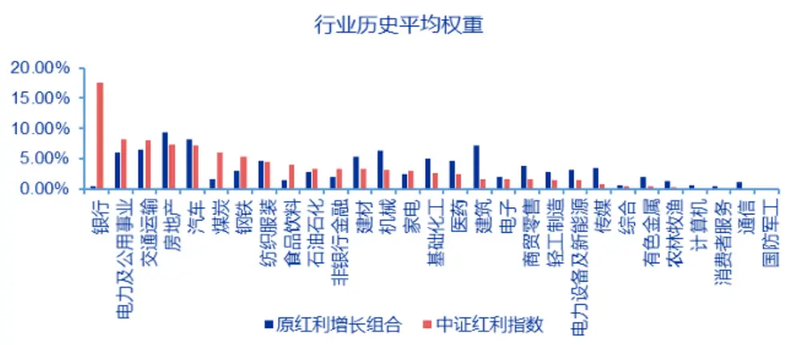
资料来源：Wind，申万宏源研究，权重统计区间为2012/4~2023/10

- 红利增长组合的优势在于：对未来分红金额会增长的上市公司进行提前预测，减少现在高股息但未来分红金额会下降的股票带来的影响，本质上在寻找未来高股息的公司，提前剔除未来低股息的公司。

- 我们如果直接把预测目标从红利增长转向未来高股息，则可以引入股息率稳定高的银行板块，降低行业偏离和跟踪误差，在逻辑上也非常直观：未来高股息的组合，在未来实际分红上和股价收益率上可能都有优势。但收益优势较纯粹强调Delta的红利增长组合可能会有所下降。

为了观察该解决方案的有效性，需要对未来高股息组合的效果进行验证；为了实现未来高股息组合的构建，我们需要对哪些指标能够对未来的股息率有预测效果进行计算。

历史高股息组合

## 红利增长组合

强调Delta，实现了收益增厚，行业上有一定偏离

未来高股息组合

减少行业偏离，对于Delta部分强调的下降可能会减少超额收益

未来高股息组合相比历史高股息组合，具有显著超额收益。站在后验视角，假设当前时点已经知道股票的未来股息率，那么从中证全指内筛选未来股息率最高的100只股票，按照等权/未来股息率加权的方式构建组合；与此同时，从中证全指内筛选历史股息率最高的100只股

票，按照等权/历史股息率加权的方式形成对比组合。

图2：未来高股息等权组合和历史高股息等权组合的累计净值
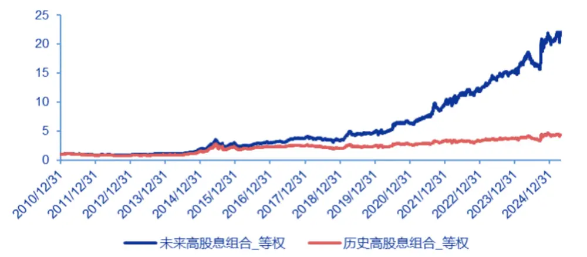
资料来源：Wind，申万宏源研究

表1：未来高股息组合与历史高股息组合的分年度收益

|  | 未来高股息组合_等权 | 历史高股息组合_等权 | 超额收益 | 未来高股息组合未来股息率加权 | 历史高股息组合历史股息率加权 |
| --- | --- | --- | --- | --- | --- |
| 2011 | -19.75% | -23.41% | 3.66% | -19.63% | -23.13% |
| 2012 | 9.38% | -0.80% | 10.17% | 10.07% | 0.01% |
| 2013 | 22.63% | 14.23% | 8.40% | 27.03% | 13.39% |
| 2014 | 74.48% | 73.00% | 1.48% | 78.24% | 75.06% |
| 2015 | 52.81% | 50.99% | 1.82% | 52.71% | 48.02% |
| 2016 | 2.24% | -2.38% | 4.62% | 3.60% | -1.90% |
| 2017 | 26.90% | 8.82% | 18.08% | 38.68% | 9.26% |
| 2018 | -10.07% | -18.41% | 8.34% | -3.69% | -17.69% |
| 2019 | 46.20% | 23.63% | 22.57% | 50.46% | 22.83% |
| 2020 | 29.90% | 10.21% | 19.70% | 32.58% | 12.73% |
| 2021 | 53.79% | 23.11% | 30.67% | 64.80% | 23.67% |
| 2022 | 21.13% | -1.95% | 23.08% | 24.98% | -3.98% |
| 2023 | 28.70% | 15.00% | 13.69% | 31.10% | 14.36% |
| 2024 | 38.72% | 17.46% | 21.26% | 40.82% | 16.66% |
| 2025/4/30 | 3.18% | -1.98% | 5.17% | 4.52% | -2.32% |
| 年化收益 | 23.92% | 10.64% |  | 27.68% | 10.63% |
| 年化波动 | 21.15% | 20.98% |  | 21.57% | 20.99% |
| 夏普比率 | 1.13 | 0.51 |  | 1.28 | 0.51 |
| 最大回撤 | -39.06% | -40.38% |  | -38.69% | -39.58% |

资料来源：Wind，申万宏源研究

- 我们借用多因子的预测框架，但预测对象不再是股价，将其转换为未来一期的股息率：考虑股息率受价格影响，这里实际回归的对象是未来的实际分红金额/当前股价。

- 历史股息率本身对未来股息率具有显著预测效果。我们将未来股息率比作因变量，一些常用因子比作自变量，统计常用因子与未来股息率之间的秩相关性，以及根据常用因子分组后组合的未来股息率水平。

- 除了股息率，其他有一定预测效果的因子有：估值、盈利、成长等。

表2：常用因子对未来股息率的预测效果

|  | 历史股息率 | 成长性 | 波动性 | 盈利能力 | 估值 | 动量 |
| --- | --- | --- | --- | --- | --- | --- |
| RankIC 均值 | 69.18% | 9.59% | -14.88% | 34.03% | 43.66% | 25.08% |
| RankIC 标准差 | 5.62% | 3.50% | 7.09% | 4.89% | 5.40% | 11.05% |
| RankIC_IR | 12.30 | 2.74 | -2.10 | 6.96 | 8.08 | 2.27 |

资料来源：Wind，申万宏源研究

由于估值、盈利、成长这些因子的ICIR较股息率明显弱，可能的一个问题是：与其他因子的并列使用可能反而会降低股息率的预测效果。

- 我们可以直接使用多因子预测未来股息率的组合，也可以考虑另外一种思路：先使用历史股息率选股，然后在得到的股票池里加入其他因子进一步预测，减少其他因子加入对股息率因子预测效果的影响，观察两种方案的表现和特征。

图3：按照历史股息率分组后每组未来股息率的均值
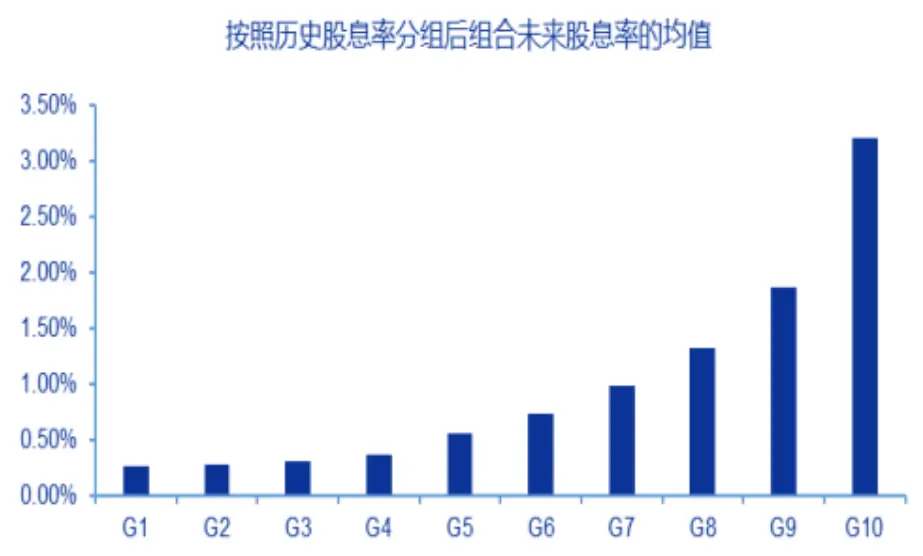
资料来源：Wind，申万宏源研究

图4：按照估值分组后每组未来股息率的均值
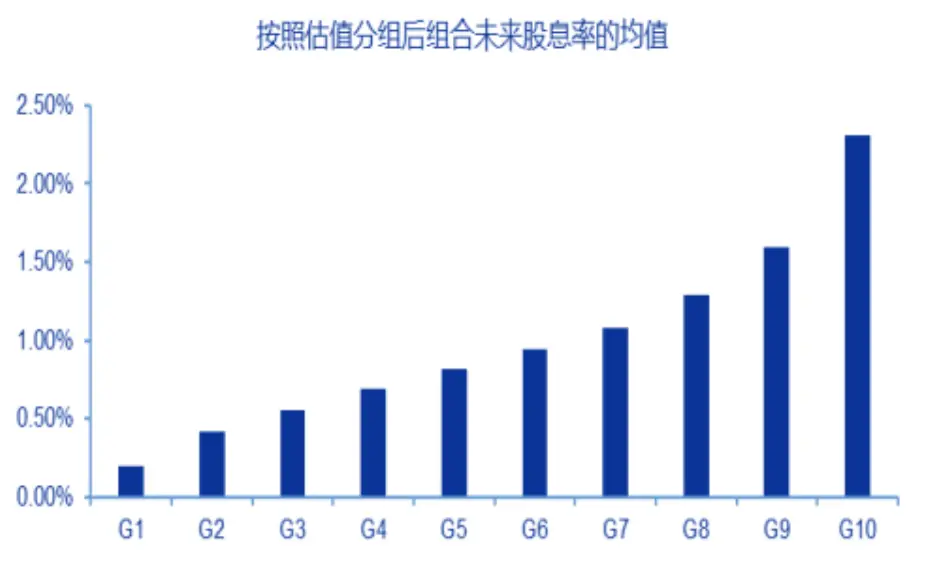
资料来源：Wind，申万宏源研究

在经过股息率选股之后的股票组合里，我们测算各个因子的股息率预测表现，结果发现各个因子对未来股息率的预测差异较小，估值因子略高于其他因子。

- 而从收益上来看，成长在收益、回撤上都有明显优势，综合评估收益和股息率特征，我们考虑选择先股息率后成长的组合构建方案。

图5：在历史股息率前100只股票中不同因子50组合的未来股息率均值
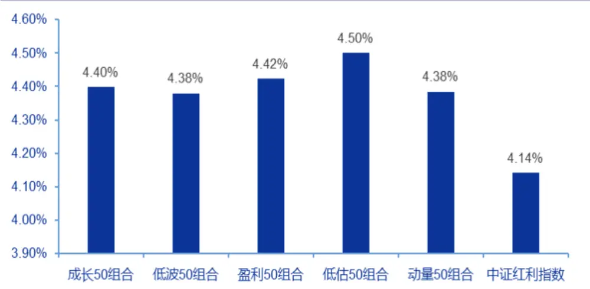
资料来源：Wind，申万宏源研究

图6：在历史股息率前100只股票中不同因子50组合的累计净值表现
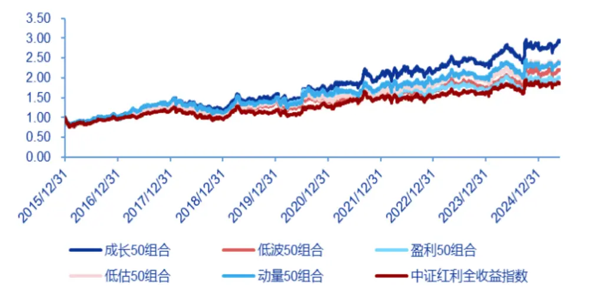
资料来源：Wind，申万宏源研究

- 高股息组合与红利增长可以做一定的结合：先根据预测分红增长构建股票池，在股票池内考虑进一步选股：首先根据过去三年平均股息率筛选出前100只股票，然后根据成长因子选择因子得分靠前的50只股票构建组合，组合内个股按照最近年度股息率加权。

- 股票池上使用分红增长预测的股票池，可以对未来分红下降的股票做一定的过滤，也可以对未来因分红上升变成未来高股息的公司做一定的预测，再结合对未来高股息有预测能力的因子选股，可以一定程度上结合红利增长和未来高股息思路。

预测分红增长股票池

使用对未来高股息有预测的因子

将红利增长与未来高股息结合

## 2.1 股票池：沿用红利增长的逻辑

- 顺着预测分红增长的逻辑，股票池从两个维度来展开：

- 维度一：过去三年分红比例稳定且盈利预期增长（其中，分红比例稳定的定义：过去三年分红比例偏离这三年分红比例均值的绝对值均不超过10%）；

- 维度二：过去连续两年分红金额增长且盈利预期增长。

图7：维度一预测红利增长的准确率
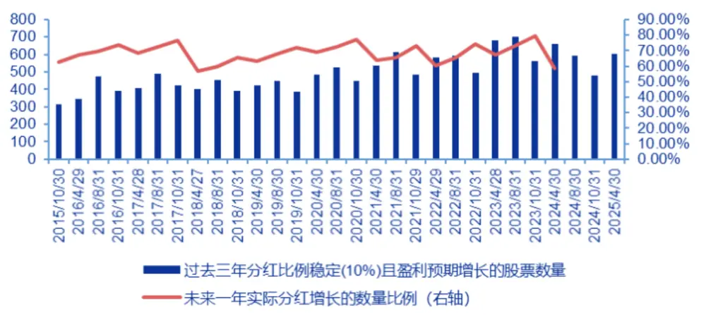
资料来源：Wind，申万宏源研究

图8：维度二预测红利增长的准确率
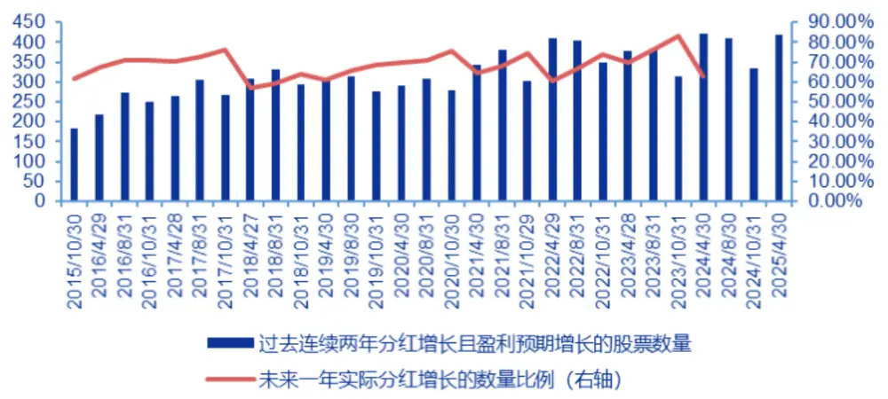
资料来源：Wind，申万宏源研究

## 2.1 股票池：沿用红利增长的逻辑

- 将维度一和维度二每期各自筛出的股票取并集，得到预测分红增长的股票池。2016年以来，预测分红增长股票池的股票数量平均为572只。

股票池沿用红利增长的逻辑，可以有效过滤未来分红可能下降的上市公司，对筛选未来因分红上升而变成高股息标的有助力作用，有效结合红利增长思路和未来高股息逻辑。

图9：预测分红增长股票池每期的股票数量
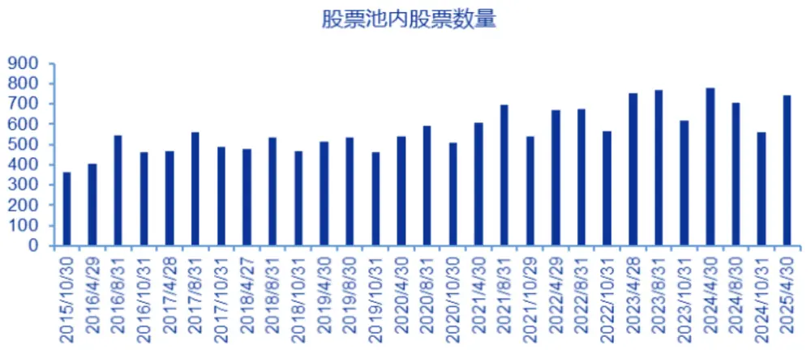
资料来源：Wind，申万宏源研究

在得到预期分红增长股票池之后，一个比较常见的选股方式：多因子打分选股。我们考虑用股息率、估值、盈利三个因子等权给股票池内个股打分，最后选取综合得分靠前的50只股票构建三因子红利增长组合，组合内个股按照股息率加权。回测期间为2016/1/1~2025/5/31，组合每年在4月底、8月底、10月底三次调仓。

- 虽然股息率、估值、盈利三因子组合长期表现战胜指数，但超额收益并不稳定，23-24年持续跑输，难以作为合适的组合。

图10：三因子红利增长组合和中证红利全收益指数的累计净值
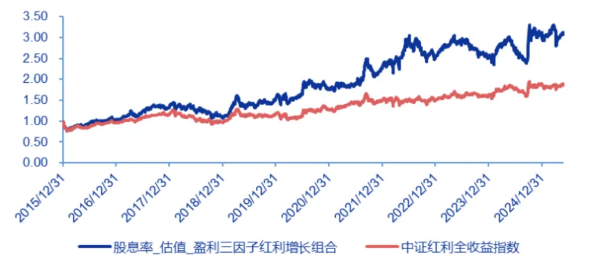
资料来源：Wind，申万宏源研究

表3：三因子红利增长组合与中证红利全收益指数的分年度收益

|  | 三因子红利增长组合 | 中证红利全收益指数 | 超额收益 |
| --- | --- | --- | --- |
| 2016 | 1.73% | -4.30% | 6.03% |
| 2017 | 31.44% | 21.34% | 10.10% |
| 2018 | -18.88% | -16.15% | -2.73% |
| 2019 | 41.58% | 20.88% | 20.71% |
| 2020 | 15.35% | 8.18% | 7.17% |
| 2021 | 30.57% | 18.19% | 12.38% |
| 2022 | 8.84% | -0.37% | 9.21% |
| 2023 | 2.15% | 6.34% | -4.19% |
| 2024 | 18.71% | 18.76% | -0.05% |
| 2025/5/31 | 1.66% | -1.34% | 3.00% |
| 年化收益率 | 12.75% | 6.84% |  |
| 年化波动率 | 22.60% | 17.48% |  |
| 夏普比率 | 0.56 | 0.39 |  |
| 最大回撤 | -26.10% -27.08% |  |  |

资料来源：Wind，申万宏源研究

除了多因子并列，还可以考虑层层递进选股思路：先根据预测分红增长构建股票池，在股票池内考虑进一步选股：首先根据过去三年平均股息率筛选出前100只股票，然后根据成长因子选择因子得分靠前的50只股票构建组合，组合内个股按照最近年度股息率加权。

选股上，考虑采用递进的选股方式，这种方式在海外量化组合上比较常见，而且可解释性也比较强。先用过去三年平均股息率指标选出股息率最高的前100只股票，从而保证最终组合建立在高股息上，而且三年平均股息率可以熨平单独某一年高分红带来的异常点；接着用成长因子选出成长性靠前的50只股票，因为未来分红增长和业绩成长性是高度正相关，业绩成长性靠前的公司，除非分红比例大幅下滑，否则分红增长的概率是较大的。

- 从因子角度，股息率因子对未来高股息预测效果最强，先做筛选，在股息率筛选后的股票池里，各因子对未来股息率的预测能力相近，而成长因子收益表现最强。

预测分红增长股票池筛选出过去三年平均股息率最高的前100只股票

对未来股息率预测能力最好的因子筛选出成长性靠前的50只股票

股息率筛选后的股票池里各因子对未来股息率预测能力相近，成长因子表现较强

## 2.3 层层递进思路：先用股息率再用成长因子生成的组合

- 2016/1/1~2025/5/31回测期间，组合每年在4月底、8月底、10月底三次调仓，新红利增长组合的年化收益率为12.08%，同期中证红利全收益指数的年化收益率为6.84%，年化超额收益为5.24%。分年度看，2016年以来均能取得正超额收益，其中，2017、2019年超额收益较高，2020年超额收益较低，其余年份超额收益在3%~5%左右。

- 该思路下，组合较中证红利全收益指数的超额收益更加稳定，我们将其定义为新红利增长组合。

图11：新红利增长组合与中证红利全收益指数的累计净值
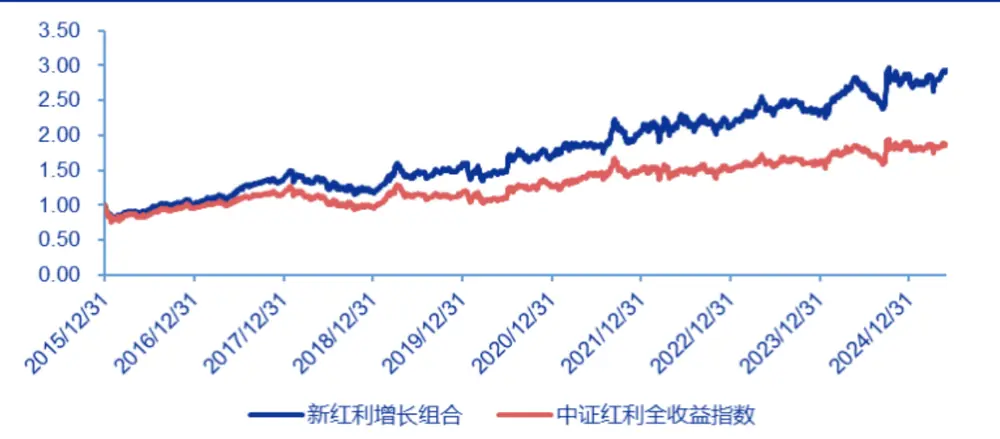
资料来源：Wind，申万宏源研究

表4：新红利增长组合与中证红利全收益指数的分年度收益

|  | 新红利增长组合 | 中证红利全收益指数 | 超额收益 |
| --- | --- | --- | --- |
| 2016 | 1.10% | -4.30% | 5.41% |
| 2017 | 34.45% | 21.34% | 13.11% |
| 2018 | -11.66% | -16.15% | 4.49% |
| 2019 | 30.94% | 20.88% | 10.06% |
| 2020 | 8.22% | 8.18% | 0.04% |
| 2021 | 20.96% | 18.19% | 2.77% |
| 2022 | 3.37% | -0.37% | 3.73% |
| 2023 | 9.55% | 6.34% | 3.21% |
| 2024 | 21.85% | 18.76% | 3.10% |
| 2025/5/31 | 3.31% | -1.34% | 4.65% |
| 年化收益率 | 12.08% | 6.84% |  |
| 年化波动率 | 18.27% | 17.48% |  |
| 夏普比率 | 0.66 | 0.39 |  |
| 最大回撤 -23.78% -27.08% |  |  |  |

资料来源：Wind，申万宏源研究

- 将新红利增长组合与三因子红利增长组合对比：新红利增长组合在构建时强化股息率的选股，然后附加一点成长选股；三因子红利增长组合将股息率与估值、盈利因子平等选股。这两个组合反映到股息率上：新红利增长组合比三因子红利增长组合的历史、未来股息率均要更高。

图12：新红利增长组合的历史股息率高于三因子红利增长组合
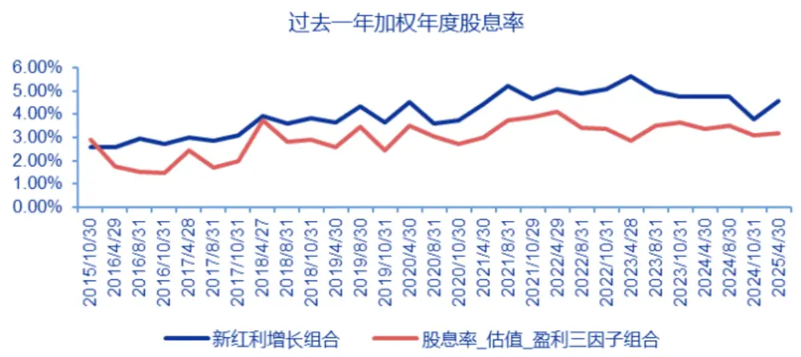
资料来源：Wind，申万宏源研究

图13：新红利增长组合的未来股息率也高于三因子红利增长组合
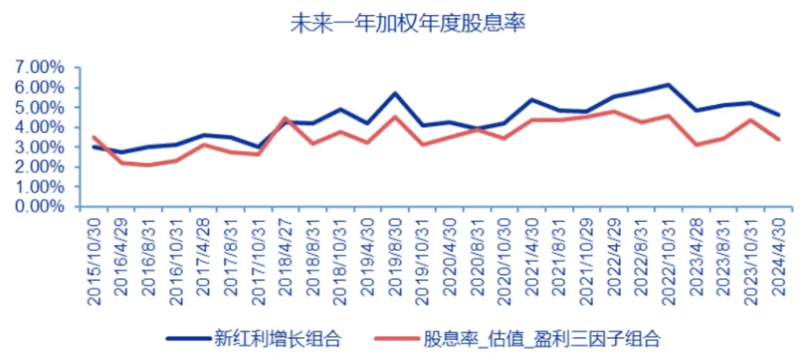
资料来源：Wind，申万宏源研究

- 在股息率方面，新红利增长组合的历史股息率和中证红利指数较为接近；在未来一年加权股息率上，新红利增长组合比中证红利指数略高一些。

图14：新红利增长组合的历史股息率与中证红利指数接近
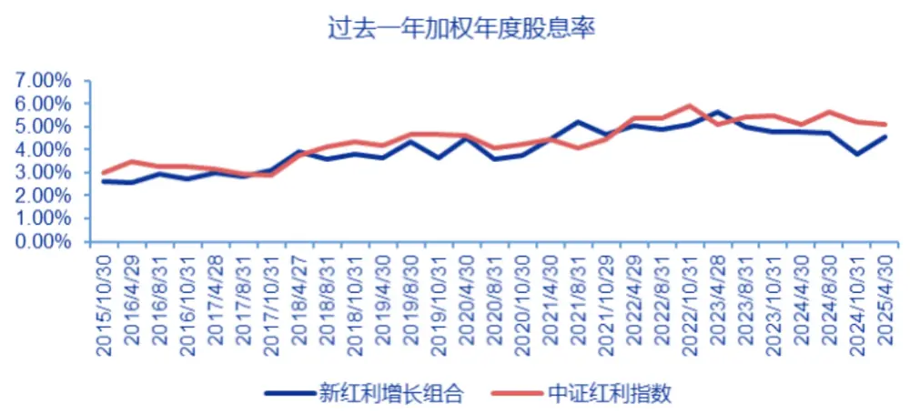
资料来源：Wind，申万宏源研究

图15：新红利增长组合的未来股息率略高于中证红利指数
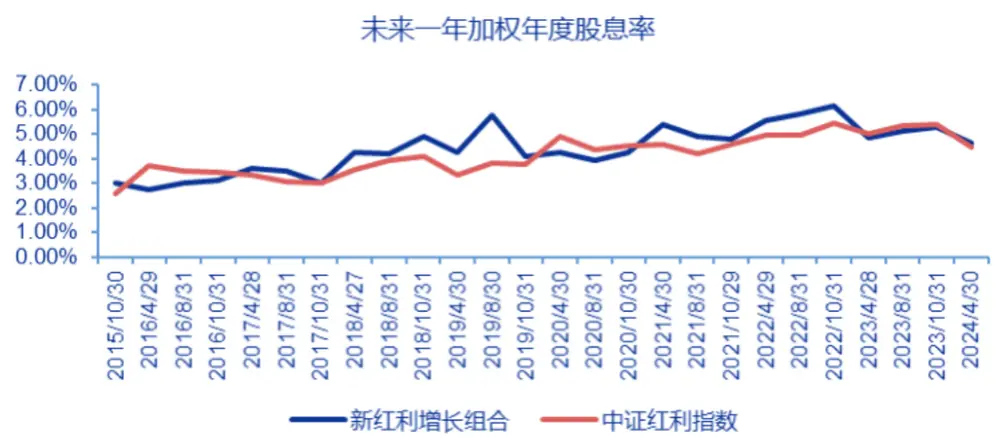
资料来源：Wind，申万宏源研究

在行业分布上，新红利增长组合与中证红利指数的偏差相对较小，其中，在交通运输、电力及公用事业、钢铁、石油石化等行业上新红利增长组合相对低配，在银行、建筑、非银行金融等行业上新红利增长组合相对超配。

- 新红利增长组合相对中证红利指数的年化跟踪误差为5.82%。

图16：新红利增长组合与中证红利指数的行业分布较为接近
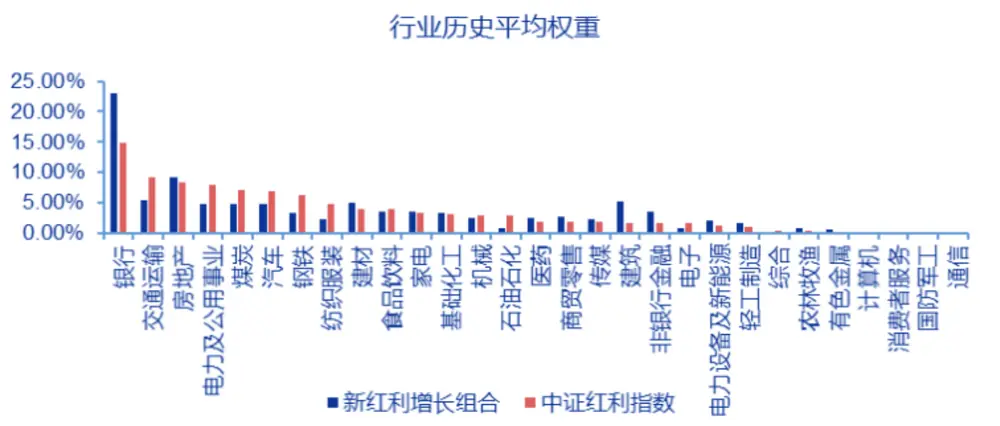
资料来源：Wind，申万宏源研究，权重统计区间为2015/10~2025/4

- 在市值分布上，新红利增长组合相比中证红利指数偏小，但从绝对市值来看，新红利增长组合也是偏大市值。

图17：新红利增长组合与中证红利指数的市值比较
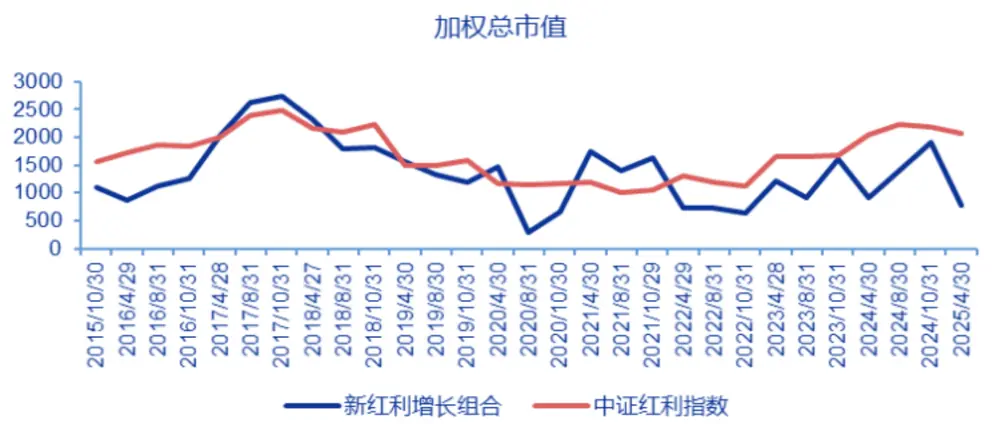
资料来源：Wind，申万宏源研究

- 首先，我们以后验视角来测试港股红利增长策略的表现：在港股通样本池内，站在每年的4月底，假设已经知道当年的分红金额，那么我们筛选出当年相比去年分红金额增加的股票，并且这部分股票以等权的方式构建已知分红增长组合；同时，港股通样本池内的个股也以等权的方式构建基准组合。

- 我们统计了一个数据：港股通内去年有分红的股票中，大约有60%的股票当年分红金额相比去年有增长。

图18：港股通样本池内分红增长的数量比例
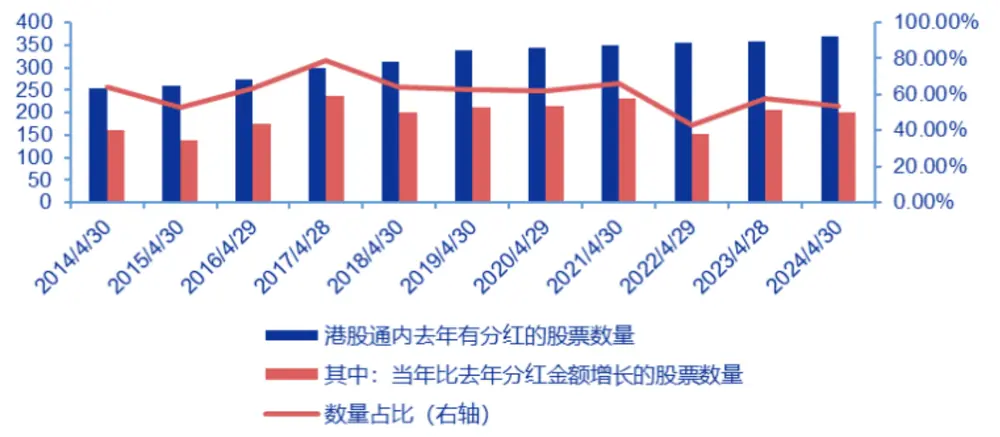
资料来源：Wind，申万宏源研究

## 3. 港股红利增长策略的初步探索

- 在2014/12/31~2025/4/30回测期间，港股通已知分红增长组合年化收益率为14.21%，同期港股通基准组合的年化收益率为8.28%，年化超额收益为5.92%；分年度看，2015~2024年基本每年已知分红增长组合都能取得超额收益。

图19：已知分红增长组合与基准组合的累计净值
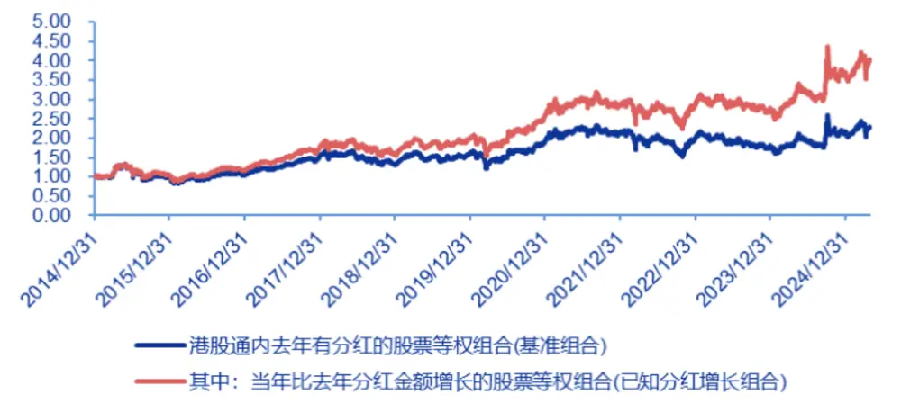
资料来源：Wind，申万宏源研究

表5：已知分红增长组合与基准组合的分年度收益

|  | 基准组合 | 已知分红增长组合 | 超额收益 |
| --- | --- | --- | --- |
| 2015 | 0.39% | 7.28% | 6.88% |
| 2016 | 5.05% | 9.58% | 4.53% |
| 2017 | 43.07% | 48.21% | 5.14% |
| 2018 | -11.06% | -7.58% | 3.47% |
| 2019 | 19.26% | 23.31% | 4.05% |
| 2020 | 20.70% | 30.34% | 9.63% |
| 2021 | 11.58% | 11.28% | -0.30% |
| 2022 | -9.20% | -2.02% | 7.18% |
| 2023 | -7.81% | -1.61% | 6.20% |
| 2024 | 20.36% | 33.27% | 12.91% |
| 2025/4/30 | 6.11% | 8.92% | 2.81% |
| 年化收益率 | 8.28% | 14.21% |  |
| 年化波动率 | 21.36% | 21.06% |  |
| 夏普比率 | 0.39 | 0.67 |  |
| 最大回撤 | -37.88% | -34.07% |  |

资料来源：Wind，申万宏源研究

回到策略构建上，在港股通股票池内，站在每年4月底筛选过去三年连续分红的股票，等权构建基准组合；在过去三年连续分红的股票中，筛选连续两年分红金额增长的股票，等权构建港股通红利增长组合。在2014/12/31~2025/4/30回测期间，港股通红利增长组合与基准组合表现接近，没能跑出较好的超额收益，说明港股上利用简单动量构建红利增长策略并不有效。

表6：连续两年分红增长股票组合的分年度收益
图20：港股通内过去连续两年分红增长股票组合的累计净值
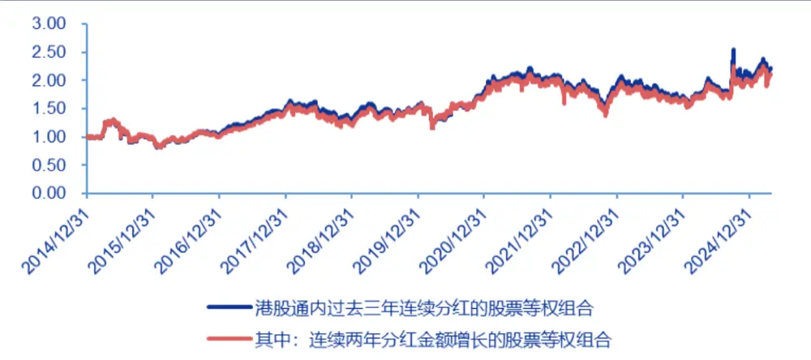
资料来源：Wind，申万宏源研究

|  | 港股通内过去三年连续分红的股票等权组合 | 其中：连续两年分红金额增长的股票等权组合 | 超额收益 |
| --- | --- | --- | --- |
| 2015 | -1.22% | 0.44% | 1.66% |
| 2016 | 6.13% | 0.91% | -5.22% |
| 2017 | 41.90% | 42.44% | 0.54% |
| 2018 | -11.54% | -13.90% | -2.36% |
| 2019 | 17.20% | 22.10% | 4.89% |
| 2020 | 16.72% | 13.39% | -3.33% |
| 2021 | 13.81% | 16.32% | 2.50% |
| 2022 | -8.66% | -11.66% | -2.99% |
| 2023 | -7.44% | -4.42% | 3.01% |
| 2024 | 23.43% | 19.19% | -4.24% |
| 2025/4/30 | 4.23% | 4.99% | 0.76% |
| 年化收益率 | 7.94% | 7.40% |  |
| 年化波动率 | 21.07% | 20.30% |  |
| 夏普比率 | 0.38 | 0.36 |  |
| 最大回撤 | -37.36% | -37.69% |  |

资料来源：Wind，申万宏源研究

- 以往在计算分析师这类因子时，通常会框定一个固定窗口期，比如过去6个月，然后利用固定窗口期内的分析师盈利预测数据来计算相关因子。但我们发现，这种方式有可能利用到完全失效的盈利预测数据，我们提出一种新方法来计算分析师这类因子。

- 业绩披露时点下的盈利预测调整：上市公司在披露定期业绩后，分析师通常会在短时间内撰写点评报告，报告中的一大核心要素就是盈利预测是否发生调整。

- 在上市公司发布定期业绩之后分析师是否出具了相应的点评报告，一定程度上可以用来刻画该分析师跟踪的紧密度，以此推演，定期业绩披露后有撰写报告的分析师，点评报告中的盈利预测更为及时有效，而没有撰写报告的分析师，其较早的盈利预测可能已经无法较好地反映公司的预测业绩。

图21：基于业绩披露时点下的分析师因子重构图示
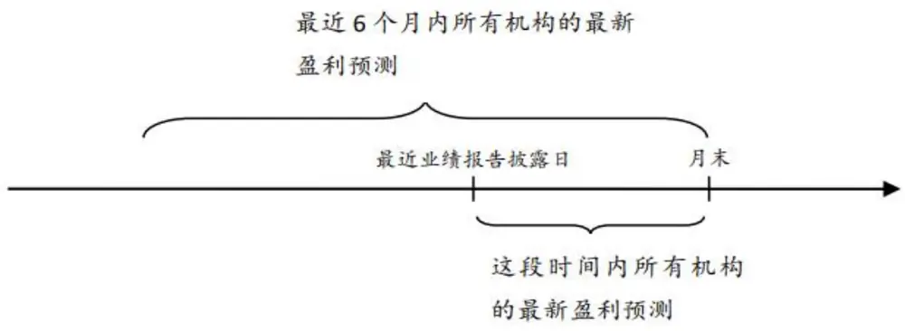
资料来源：申万宏源研究绘制

以小熊电器为例，2021年1月25日晚间披露了2020年度业绩预告，整体上业绩有所低于预期，在业绩预告披露前6个月内，有27家研究机构出具了盈利预测，但业绩预告披露后，只有14家研究机构撰写了点评报告，更新了盈利预测数据，剩余的13家研究机构并未调整盈利预测，而这13家机构较早的盈利预测数据已经不能较好的表征小熊电器的预测业绩。

图22：三家研究机构在小熊电器披露2020年度业绩预告后的盈利预测变化

| 盈利预测简表 | 前次报告 2020E | 本次报告 2020E | 2021E | 2022E |
| --- | --- | --- | --- | --- |
| 营业收入(亿元) | 38.97 | 36.34↓ | 46.54 | 58.91 |
| 净利润(亿元) | 4.97 | 4.38↓ | 6.25 | 8.12 |
| EPS(元/股) | 3.19 | 2.81↓ | 4.01 | 5.2 |
| 盈利预测简表 | 前次报告 2020E | 本次报告 2020E | 2021E | 2022E |
| 营业收入(亿元) | 37.8 | 36.3↓ | 46.4 | 56.6 |
| 净利润(亿元) | 4.6 | 4.3 ↓ | 5.5 | 7.0 |
| EPS(元/股) | 2.94 | 2.79↓ | 3.51 | 4.48 |
| 盈利预测简表 | 前次报告 2020E | 本次报告 2020E | 2021E | 2022E |
| 营业收入(亿元) | 37.58 | 36.61↓ | 47.68 | 60.87 |
| 净利润(亿元) | 4.64 | 4.37 ↓ | 5.63 | 6.99 |
| EPS(元/股) | 2.98 | 2.8↓ | 3.61 | 4.48 |

资料来源：Wind，看知丘，申万宏源研究

表7：举例四家研究机构在小熊电器披露2020年度业绩预告后未撰写点评报告

| 研究机构 | 预测日期 | 预测报告期 | 预测净利润(亿元) | 预测主营业务收入(亿元) |  |
| --- | --- | --- | --- | --- | --- |
| 机构一 | 20200828 | 20211231 | 6.22 | 48.26 |  |
|  | 20201014 | 20211231 | 6.31 | 49.80 |  |
| 机构二 | 20200828 | 20211231 | 5.73 | 47.67 |  |
|  | 20201028 | 20211231 | 5.85 | 48.07 |  |
| 机构三 | 20200827 | 20211231 | 5.58 | 49.12 |  |
|  | 20201028 | 20211231 | 5.58 | 49.12 |  |
| 机构四20201028 |  | 20200827 | 20211231 | 5.80 |  |
|  |  | 20201014 | 20211231 | 6.23 | 49.50 |
|  |  | 20211231 6.23 |  | 49.50 |  |

资料来源：Wind，申万宏源研究

以分析师这类因子中的两个小类因子为例：一致预期净利润变化、分析师盈利上调比例，基于业绩披露时点下的盈利预测调整这个逻辑，来重构这两个小类因子，并且测试改进后的因子相较初始因子的选股效果变化。

表8：分析师因子的定义

| 大类因子 | 小类因子 | 因子计算方式 |
| --- | --- | --- |
| 分析师 | 致预期净利润变化 | 致预期净利润 /3个月前一致预期净利润- 1 |
|  | 分析师盈利上调比例 | 过去6个月内分析师自身（上调家数 －下调家数)/总家数 |

资料来源：Wind，申万宏源研究

- 一致预期净利润变化（改进因子）的计算：站在月末时点计算因子值，前推找到最近一个业绩报告的披露日（业绩报告可以是业绩预告、业绩快报、正式财报中的一个），然后框定该业绩报告披露日至月末这段时间窗口，取所有机构在该时间窗口内的各自最新盈利预测，简单平均即得到一致预期净利润，然后计算当前月末的一致预期净利润相较三个月前的一致预期净利润的变化幅度。

分析师盈利上调比例（改进因子）的计算：站在月末时点计算因子值，前推找到最近一个业绩报告的披露日（业绩报告可以是业绩预告、业绩快报、正式财报中的一个），然后以该业绩报告披露日至月末这段时间内有发布盈利预测的机构作为锚定机构；同样以月末时点前推6个月的时间窗口，取这些锚定机构在该时间窗口内的各自最新的两条盈利预测，计算各自的盈利预测是否发生上调，然后统计盈利上调的机构数量占锚定机构的比例。

## 4.1 一致预期净利润变化因子改进前后的表现

- 基于初始因子和改进因子的构造方法，分别构建了初始一致预期净利润变化因子、改进后一致预期净利润变化因子，从原始因子维度，比较初始因子和改进因子的选股效果，回测期间为2010/12/31~2025/5/31，其中，对于中证1000内的选股测试，回测期间为2014/12/31~2025/5/31。

表9：一致预期净利润变化因子改进前后在不同样本空间内的选股效果比较

|  |  | 中证全指 | 沪深 300 | 中证 500 | 中证1000 |
| --- | --- | --- | --- | --- | --- |
| 初始因子 | Rank_IC 均值 | 3.36% | 4.66% | 3.10% | 3.02% |
|  | Rank_IC 标准差 | 8.18% | 13.94% | 11.16% | 9.27% |
|  | Rank_ICIR | 0.41 | 0.33 | 0.28 | 0.33 |
|  | Rank_IC>0 占比 | 68.79% | 59.54% | 61.27% | 63.20% |
| R改进因子 | ank_IC 均值 | 3.97% | 5.38% | 3.57% | 3.30% |
|  | Rank_IC 标准差 | 8.62% | 12.89% | 10.77% | 9.59% |
|  | Rank_ICIR | 0.46 | 0.42 | 0.33 | 0.34 |
|  | Rank_IC>0 占比 | 68.79% | 64.74% | 65.32% | 68.80% |

资料来源：Wind，申万宏源研究

## 4.1 一致预期净利润变化因子改进前后的表现

图23:一致预期净利润变化因子改进前后在沪深300内的分组月均超额收益
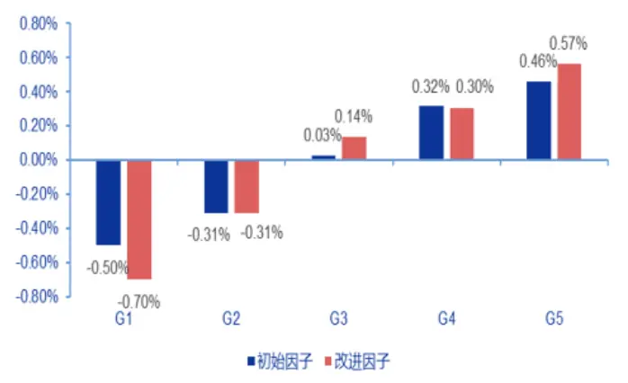
图24:一致预期净利润变化因子改进前后在中证500内的分组月均超额收益
资料来源：Wind，申万宏源研究，超额收益是指每组绝对收益减去五组平均收益（下同)

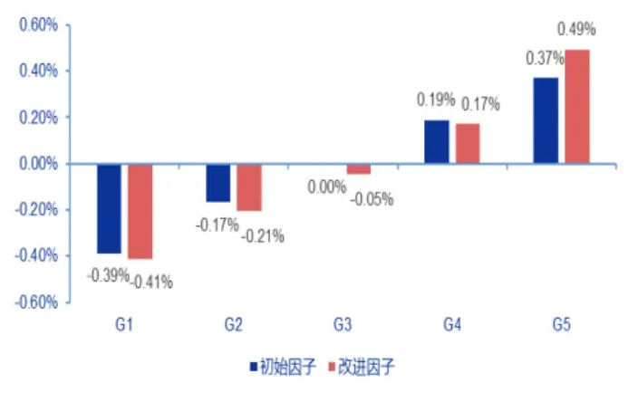
资料来源：Wind，申万宏源研究

图25：一致预期净利润变化因子改进前后在沪深300内的多头累计净值比较
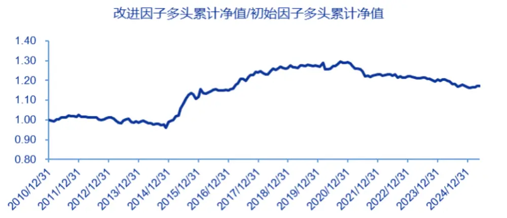
资料来源：Wind，申万宏源研究

图26：一致预期净利润变化因子改进前后在中证500内的多头累计净值比较
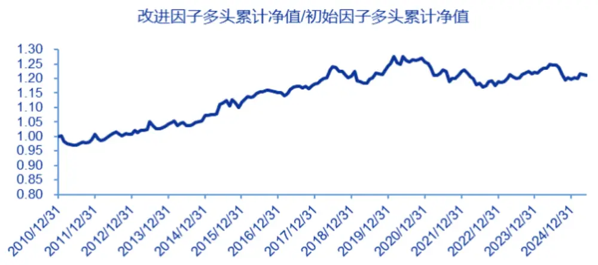
资料来源：Wind，申万宏源研究

- 基于初始因子和改进因子的构造方法，分别构建了初始分析师盈利上调比例因子、改进后分析师盈利上调比例因子，从原始因子维度，比较初始因子和改进因子的选股效果，回测期间为2010/12/31~2025/5/31，其中，对于中证1000内的选股测试，回测期间为2014/12/31~2025/5/31。

表10：分析师盈利上调比例因子改进前后在不同样本空间内的选股效果比较

|  |  | 中证全指 | 沪深 300 | 中证 500 | 中证1000 |
| --- | --- | --- | --- | --- | --- |
| 初始因子 | Rank_IC 均值 | 3.02% | 3.98% | 3.10% | 2.31% |
|  | Rank_IC 标准差 | 7.68% | 12.30% | 9.99% | 8.90% |
|  | Rank_ICIR | 0.39 | 0.32 | 0.31 | 0.26 |
|  | Rank_IC>0 占比 | 65.90% | 65.32% | 62.43% | 61.60% |
| R改进因子 | ank_IC 均值 | 3.55% | 4.30% | 3.84% | 2.85% |
|  | Rank_IC 标准差 | 7.79% | 11.84% | 10.00% | 9.25% |
|  | Rank_ICIR | 0.46 | 0.36 | 0.38 | 0.31 |
|  | Rank_IC>0 占比 | 67.05% | 62.43% | 67.05% | 64.00% |

资料来源：Wind，申万宏源研究

图27:分析师盈利上调比例因子改进前后在沪深300内的分组月均超额收益
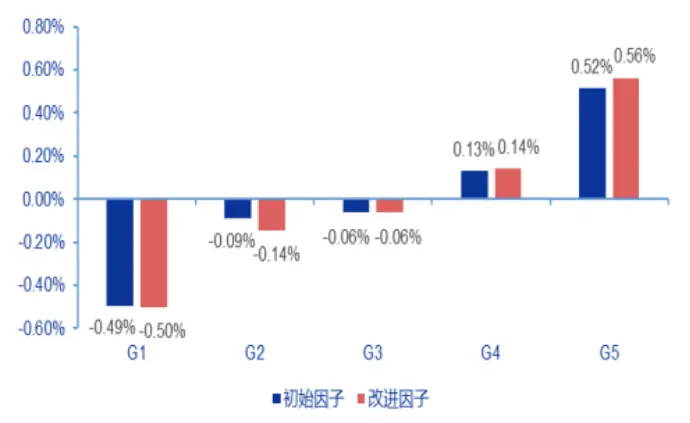
资料来源：Wind，申万宏源研究

图28:分析师盈利上调比例因子改进前后在中证500内的分组月均超额收益
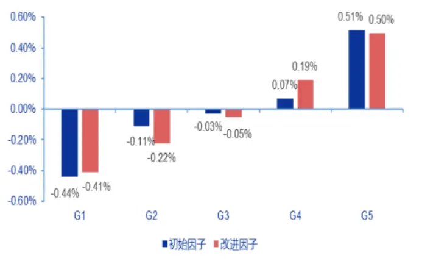
资料来源：Wind，申万宏源研究

图29：分析师盈利上调比例因子改进前后在沪深300内的多头累计净值比较
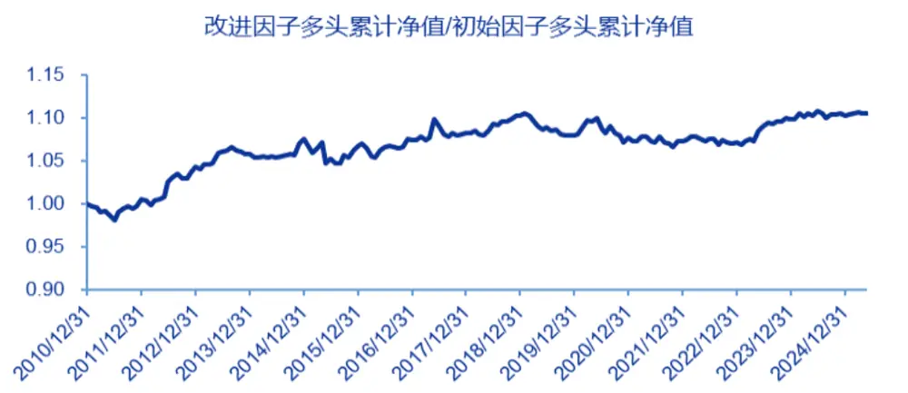
资料来源：Wind，申万宏源研究

图30：分析师盈利上调比例因子改进前后在中证500内的多头累计净值比较
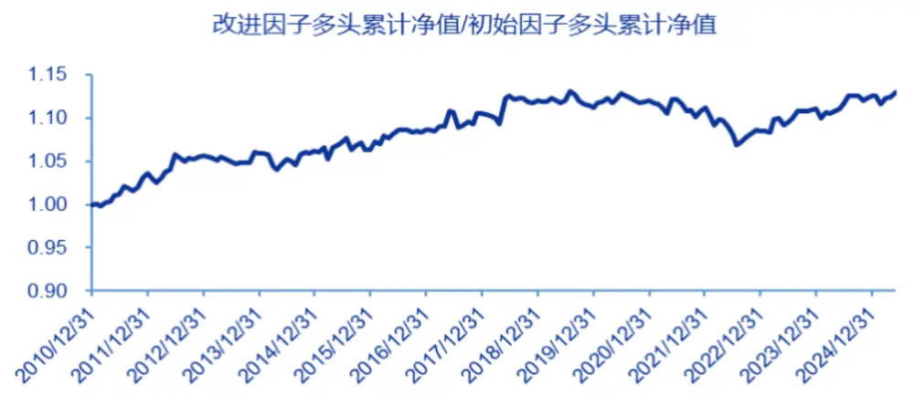
资料来源：Wind，申万宏源研究

本报告结果基于历史数据测算，未来市场结构可能发生变化，带来策略的不稳定；报告中筛选预期分红增长股票利用到分析师预期数据，当预期数据出现系统偏误的时候，可能带来组合阶段性表现较弱；报告中筛选预期分红增长股票的两个维度缺乏对周期板块的筛选，因此带来股票池内周期板块占比系统性偏低，当周期板块表现较好时，会造成组合跑输中证红利指数。

## 证券分析师承诺

本报告署名分析师具有中国证券业协会授予的证券投资咨询执业资格并注册为证券分析师，以勤勉的职业态度、专业审慎的研究方法，使用合法合规的信息，独立、客观地出具本报告,并对本报告的内容和观点负责。本人不曾因，不因，也将不会因本报告中的具体推荐意见或观点而直接或间接收到任何形式的补偿。

## 与公司有关的信息披露

本公司隶属于申万宏源证券有限公司。本公司经中国证券监督管理委员会核准，取得证券投资咨询业务许可。本公司关联机构在法律许可情况下可能持有或交易本报告提到的投资标的，还可能为或争取为这些标的提供投资银行服务。本公司在知晓范围内依法合规地履行披露义务。客户可通过compliance@swsresearch.com索取有关披露资料或登录www.swsresearch.com信息披露栏目查询从业人员资质情况、静默期安排及其他有关的信息披露。

## 机构销售团队联系人

| 华东A组 茅炯 | 021-33388488 | maojiong@swhysc.com |
| --- | --- | --- |
| 华东B组 李庆 | 18017963206 | liqing3@swhysc.com |
| 华北组 肖霞 | 15724767486 | xiaoxia@swhysc.com |
| 华南组 李昇 | 15914129169 | lisheng5@swhysc.com |
| 华北创新团队 潘烨明 | 15201910123 | panyeming@swhysc.com |
| 华东创新团队 朱晓艺 | 18702179817 | zhuxiaoyi@swhysc.com |

## A股投资评级说明

证券的投资评级：

以报告日后的6个月内，证券相对于市场基准指数的涨跌幅为标准，定义如下：

买入（Buy）：相对强于市场表现20％以上；

增持（Outperform）：相对强于市场表现5％～20％；

中性 (Neutral)：相对市场表现在－5％～＋5％之间波动；

减持 (Underperform)：相对弱于市场表现5％以下。

行业的投资评级：

以报告日后的6个月内，行业相对于市场基准指数的涨跌幅为标准，定义如下：

看好（Overweight）：行业超越整体市场表现；

中性 (Neutral)：行业与整体市场表现基本持平；

看淡 (Underweight)：行业弱于整体市场表现。

本报告采用的基准指数：沪深300指数

## 港股投资评级说明

证券的投资评级：

以报告日后的6个月内，证券相对于市场基准指数的涨跌幅为标准，定义如下：

买入（BUY）：：股价预计将上涨20%以上；

增持（Outperform）：股价预计将上涨10-20%；

持有（Hold）：股价变动幅度预计在-10%和+10%之间；

减持（Underperform）：股价预计将下跌10-20%；

卖出（SELL）：股价预计将下跌20%以上。

行业的投资评级：

以报告日后的6个月内，行业相对于市场基准指数的涨跌幅为标准，定义如下：

看好（Overweight）：行业超越整体市场表现；

中性 (Neutral)：行业与整体市场表现基本持平；

看淡（Underweight）：行业弱于整体市场表现。

本报告采用的基准指数：恒生中国企业指数（HSCEI）

我们在此提醒您，不同证券研究机构采用不同的评级术语及评级标准。我们采用的是相对评级体系，表示投资的相对比重建议；投资者买入或者卖出证券的决定取决于个人的实际情况，比如当前的持仓结构以及其他需要考虑的因素。投资者应阅读整篇报告，以获取比较完整的观点与信息，不应仅仅依靠投资评级来推断结论。申银万国使用自己的行业分类体系，如果您对我们的行业分类有兴趣，可以向我们的销售员索取。

## 法律声明

本报告由上海申银万国证券研究所有限公司（隶属于申万宏源证券有限公司，以下简称“本公司”）在中华人民共和国内地（香港、澳门、台湾除外）发布，仅供本公司的客户（包括合格的境外机构投资者等合法合规的客户）使用。本公司不会因接收人收到本报告而视其为客户。有关本报告的短信提示、电话推荐等只是研究观点的简要沟通，需以本公司http://www.swsresearch.com网站刊载的完整报告为准，本公司并接受客户的后续问询。本报告首页列示的联系人，除非另有说明，仅作为本公司就本报告与客户的联络人，承担联络工作，不从事任何证券投资咨询服务业务。

本报告是基于已公开信息撰写，但本公司不保证该等信息的准确性或完整性。本报告所载的资料、工具、意见及推测只提供给客户作参考之用，并非作为或被视为出售或购买证券或其他投资标的的邀请或向人作出邀请。本报告所载的资料、意见及推测仅反映本公司于发布本报告当日的判断，本报告所指的证券或投资标的的价格、价值及投资收入可能会波动。在不同时期，本公司可发出与本报告所载资料、意见及推测不一致的报告。

客户应当考虑到本公司可能存在可能影响本报告客观性的利益冲突，不应视本报告为作出投资决策的惟一因素。客户应自主作出投资决策并自行承担投资风险。本公司特别提示,本公司不会与任何客户以任何形式分享证券投资收益或分担证券投资损失，任何形式的分享证券投资收益或者分担证券投资损失的书面或口头承诺均为无效。本报告中所指的投资及服务可能不适合个别客户，不构成客户私人咨询建议。本公司未确保本报告充分考虑到个别客户特殊的投资目标、财务状况或需要。本公司建议客户应考虑本报告的任何意见或建议是否符合其特定状况，以及（若有必要）咨询独立投资顾问。在任何情况下，本报告中的信息或所表述的意见并不构成对任何人的投资建议。在任何情况下，本公司不对任何人因使用本报告中的任何内容所引致的任何损失负任何责任。市场有风险，投资需谨慎。若本报告的接收人非本公司的客户，应在基于本报告作出任何投资决定或就本报告要求任何解释前咨询独立投资顾问。

本报告的版权归本公司所有，属于非公开资料。本公司对本报告保留一切权利。除非另有书面显示，否则本报告中的所有材料的版权均属本公司。未经本公司事先书面授权，本报告的任何部分均不得以任何方式制作任何形式的拷贝、复印件或复制品，或再次分发给任何其他人，或以任何侵犯本公司版权的其他方式使用。所有本报告中使用的商标、服务标记及标记均为本公司的商标、服务标记及标记，未获本公司同意，任何人均无权在任何情况下使用他们。

申万宏源研究微信订阅号

简单金融 · 成就梦想

A Virtue of Simple Finance

上海申银万国证券研究所有限公司(隶属于申万宏源证券有限公司）

杨俊文yangjw@swsresearch.com