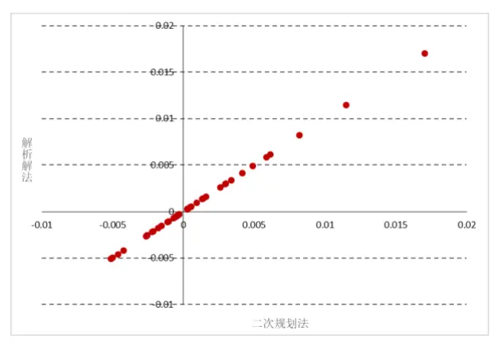
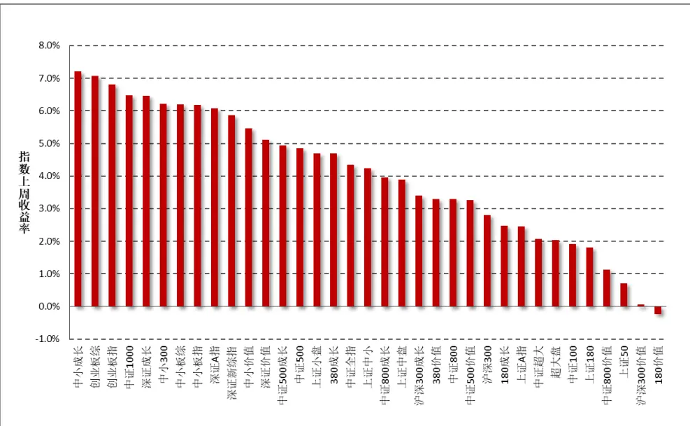
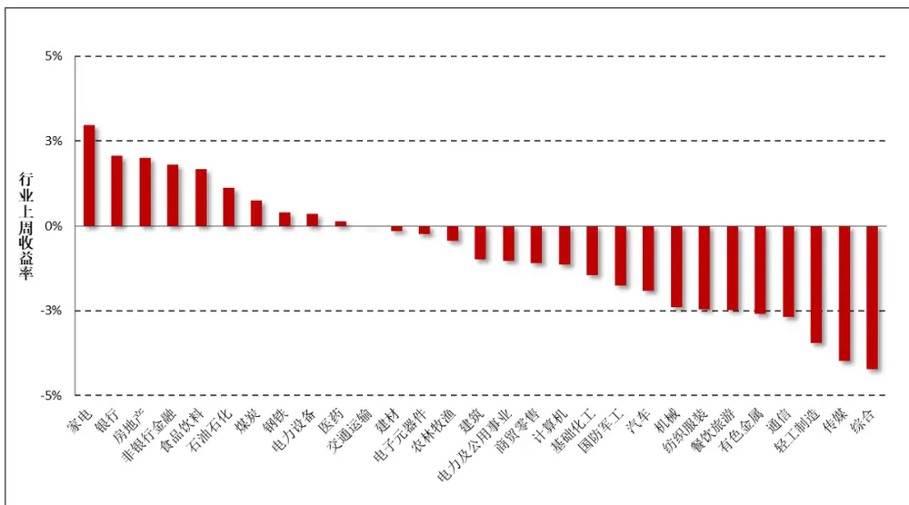
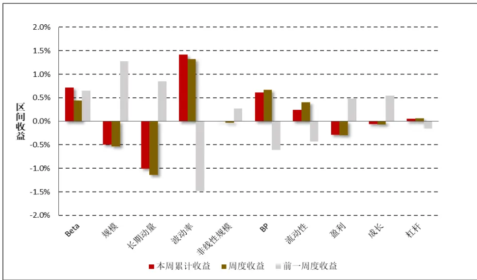
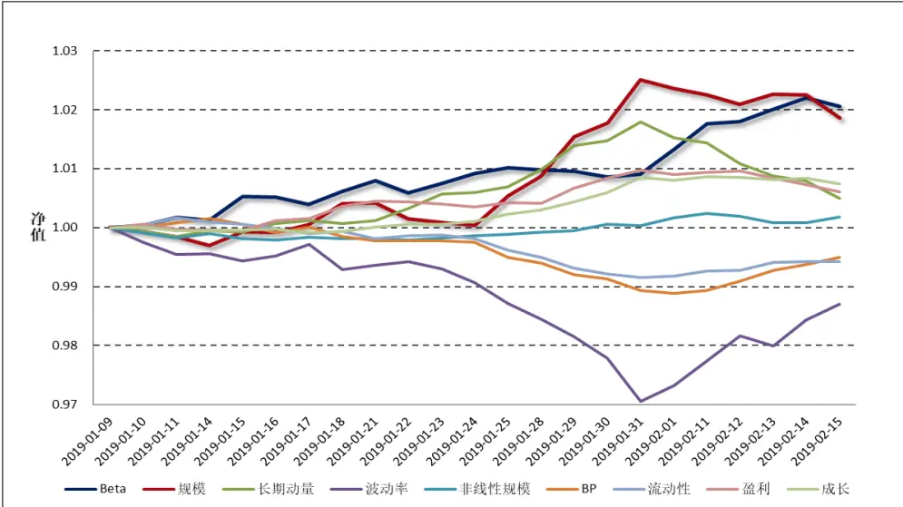
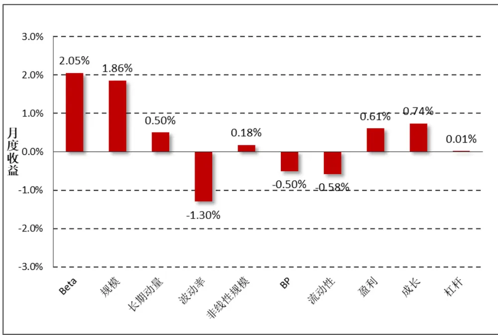
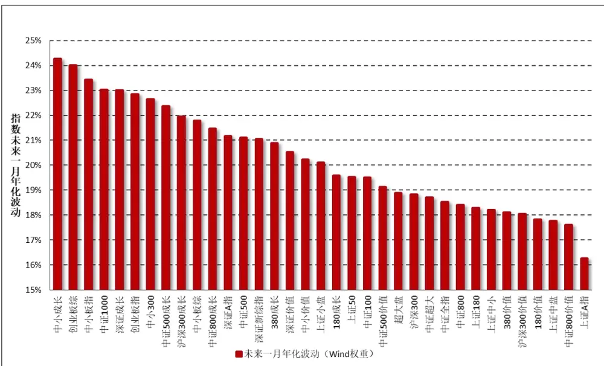
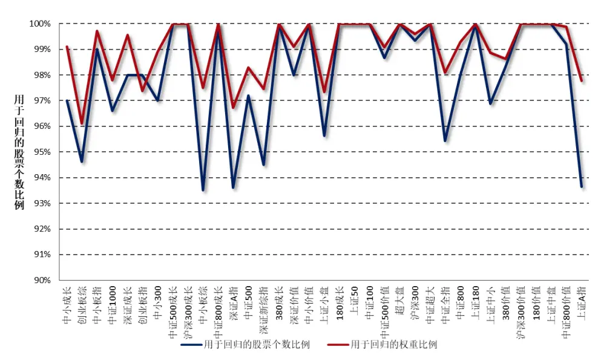
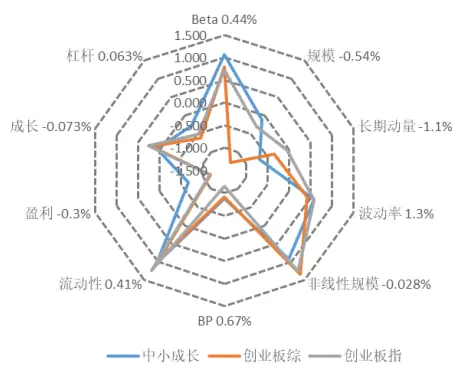
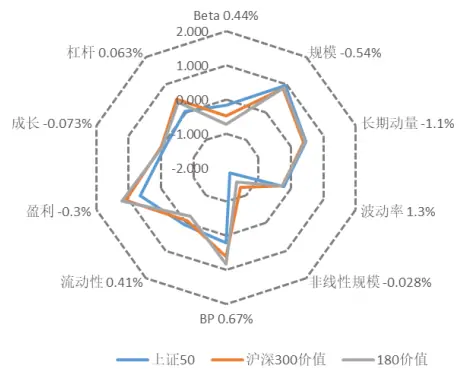

2019 年 02 月 17 日

# 带约束的加权最小二乘拟合：一种解析解法

## 联系信息

## “拾穗”系列定期报告（第 1 期）

陶勤英分析师

SAC 证书编号：S0160517100002021-68592393

taoqy@ctsec.com

张宇联系人

zhangyu1@ctsec.com 021-68592220 
176216888421

## 相关报告

“星火”多因子系列（一）：《Barra 模型初探：A股市场风格解析》

“星火”多因子系列（二）：《Barra 模型进阶：多因子模型风险预测》

“星火”多因子系列（三）：《Barra 模型深化：纯因子组合构建》

## 投资要点：

## 带约束的加权最小二乘拟合：一种解析解法

- 多因子模型的收益拟合实际上是一个带约束的加权最小二乘求解问题，通常有：直接优化法、二次规划法、解析解法，其中解析解法逻辑直观、运行速度快、可重复性高，是我们更推荐的方法。

- 解析解法实际上是将回归系数根据约束条件进行简单的线性变换，从而转化为传统的最小二乘求解。线性约束可以分为排他约束、等式约束和一般线性约束，它们都可以用相同的解析解进行求解

## 一周行情回顾

上周市场先涨后跌，整体来讲涨势较为可观，特别是中小板股票上涨势头明显强于大盘股指。

行业方面，上周仅有银行业取得负收益，电子元器件和农林牧渔行业涨幅均超过10%。

## 市场风格解析

上周波动率、流动性和 BP因子重新获得市场青睐，纯因子收益扭亏为盈；规模因子和长期动量因子发生反转，表明市场民心思定后，重拾对中小规模企业的信心。

## 指数风险预测

所有样本指数在未来一个月的年化波动区间在 16%-25%之间，相较上周略有上行，其中以中小板股票、成长类指数的风险较大，而偏大盘、价值类股票风险较小。

## 指数成分收益归因

上周表现最好的两只创业板指数，由于其在规模和动量因子上的较低暴露和在流动性因子上较高的暴露帮助其获得一个较好的收益。表现相对较差的三只指数均为大盘价值类指数，在规模和动量因子上暴露过高，拖累指数走势。

- 风险提示：本报告统计结果基于历史数据，过去数据不代表未来，市场风格变化可能导致模型失效。

在实际投资中，多因子模型被广泛地应用到资产定价、绩效归因、风险控制、组合优化、基金评价及资产配置等各个领域，一套完整、精细的多因子系统成为每位量化研究者必备的工具。“做最实用的研究”，是财通金工给自己的定位。我们将在之后的系列报告中，就投资者们最关心也最容易忽略的很多细节问题进行探讨，介绍我们在实际应用中遇到的问题和思考，以飨读者。

我们为本系列报告取名“拾穗”。一周市场风云变幻，和风细雨也好，狂风骤雨也罢，都留下一地故事等待梳理。作为勤劳的搬运工，财通金工从量化视角出发对市场风格进行捕捉、对风险水平进行预测，既是希望能够如拾穗者般专心、踏实地做研究，也是祝愿各位投资者能够在市场收获满地金黄。

本期是该定期报告的第一期，主要介绍一种解析解方法，直接对带线性约束的加权最小二乘进行求解。与数值解相比，解析解法计算速度更快、可重复性更强，是一种我们更为推荐的方法。财通金工还提供我们自己编写的接口函数，感兴趣的读者可与我们直接联系获取。

## 1、 带约束的加权最小二乘拟合：一种解析解法

多因子模型认为股票收益是由一系列共同因子来驱动的，Barra USE3 版本将股票收益拆解为行业因子、风格因子和特质因子三个部分，Barra USE4版本引入国家因子（又称截距项因子），将股票收益拆解为市场收益、行业收益、风格收益和特质收益四个部分。

$$
USE4\colon r_{n}=f_{c}+\sum_{i=1}^{I}X_{ni}f_{i}+\sum_{s=1}^{S}X_{ns}f_{S}+u_{n},
$$

截距项因子的引入既是为了方便对全球股票资产进行多因子建模，又能够将市场收益从行业收益中剥离出来，从而可以观察到纯净的行业因子表现情况。然而，由于每只股票在所有行业因子的暴露加总恒等于 1（单只股票属于且仅属于某一行业），因此截距项因子的加入将会导致截距项与行业因子之间存在完全共线性，从而使得模型的解不唯一，传统的解析解法不再适用（矩阵不可逆）。为此我们引入一个约束条件，使得所有行业因子收益的市值加权平均为 0。

$$
\sum_{i}w_{i}f_{i}=0.
$$

其中， $w_{i}$ 表示行业 i中所有股票的流通市值占全市场流通市值的比例，该约束条件的引入使得全样本股票收益的市值加权平均（即指数收益）可以被近似地认为等于截距项因子收益。

$$
R_{m}\approx f_{c}
$$

在实证研究中我们发现，股票收益存在明显的异方差性，股票的特质波动与其市值之间存在明显的负向关系。为了消除异方差性带来的影响，我们采用加权最小二乘（WLS）对模型进行拟合，回归权重为股票的市值平方根权重。

由此，多因子模型的收益拟合变为一个带约束的加权最小二乘求解问题，该问题的求解通常有如下三种方法：

1）直接优化法：即最小化特质收益的回归加权平方和，在MATLAB中可用fmincon函数进行求解，在Python中可用scipy.optimize.minimize函数进行求解。

$$
\begin{aligned}min\sum_{n}w_{n}\cdot\left(r_{n}-f_{c}-\sum_{i=1}^{n}X_{ni}f_{i}-\sum_{s=1}^{n}X_{ns}f_{S}\right)^{2}\\s.t\sum_{i}w_{i}f_{i}&=0\end{aligned}
$$

注意，此处 $w_{n}$ 是指单只股票 n的回归权重，而w 是指行业 i内所有股票的市值占全体样本股票市值的比例。直接优化法在逻辑上简单直观，但通常需给定一个初始值及迭代次数，且不一定能保证在达到最大迭代次数之前能够找到最优解，因此即便对于相同的输入而言，采用直接优化法得到的结果尽管十分接近但可能并不完全一致。

2） 二次规划法：它实际上是直接优化法的向量求解版本，对应于MATLAB中的quadprog函数，或者Python中的cvxopt.solvers.qp函数。我们以qp函数为例，其输入参数为 $\mathrm{qp}(\mathrm{Q},\mathrm{p},\mathrm{G},\mathrm{h},\mathrm{A},\mathrm{b})$ ，对应的二次规划问题为：

$$
\min_{x}\frac{1}{2}x'Px+q'x
$$

$$
s.t.Gx\leq h,Ax=b
$$

加权最小二乘的优化目标是最小化残差变量的加权平方和，因此目标函数可以表示为：

$$
\begin{aligned}\min_{\hat{\beta}}\big(Y-X\hat{\beta}\big)'W\big(Y-X\hat{\beta}\big)&\\&=\min_{\hat{\beta}}\big(Y'WY-Y'WX\hat{\beta}-\hat{\beta}'X'WY+\hat{\beta}'X'WX\hat{\beta}\big)\\&=\min_{\hat{\beta}}\big(\hat{\beta}'X'WX\hat{\beta}-2Y'WX\hat{\beta}+Y'WY\big)\\&=\min_{\hat{\beta}}\bigg(2\times\bigg(\frac{1}{2}\hat{\beta}'X'WX\hat{\beta}-(X'WY)'\hat{\beta}\bigg)\bigg)\end{aligned}
$$

将以上公式结合标准的二次规划问题，即可将参数进行一一对应：

$$
\begin{aligned}&P=X^{\prime}W_{n}X\\&q=-X^{\prime}W_{n}Y\\&A=\left(0,w_{i_{1\times I}},0_{1\times S}\right)\\&\hphantom{P=X^{\prime}W_{n}X}\\&b=0\\\end{aligned}
$$

其中，X是表示股票因子暴露的N×K矩阵，N为股票个数，K为因子个数（I为行业因子个数，S为风格因子个数， $K{=}1+I+S)$ $W_{n}$ 为股票回归权重，它是一个N×N的对角矩阵，对角线上的元素为股票的市值平方根权重，Y为股票在每一期的收益， $w_{i}$ 为 $1\times I$ 向量，每个元素对应每个行业的市值权重， $0_{1\times S}$ 为 $1\times s$ 维零向量。

3）解析解法：Ruud（2000）介绍了一种带有线性约束的最小二乘解析解法，该方法实际上是将回归系数根据约束条件进行简单的线性变换，从而转化为传统的最小二乘求解法：

$$
\beta=\mathsf{S}\gamma+s
$$

其中，β是一个K ×1的向量，即我们需要拟合的回归系数，S是一个K ×M的已知矩阵，s是一个K ×1的已知向量，γ是一个M×1的未知向量，其中M<K，说明γ中的未知参数比β要更少。

Ruud（2000）将线性约束分为排他约束（Exclusion Restrictions）、等式约束（Equality Restrictions）和一般线性约束（Simple LinearRestrictions），我们以一个含有5个回归变量（包含截距项）的模型进行说明：

$$
X\beta=\beta_{1}+X_{2}\beta_{2}+X_{3}\beta_{3}+X_{4}\beta_{4}+X_{5}\beta_{5}
$$

## i) 排他约束

若回归中存在如下约束： $\beta_{2}=0,\quad\beta_{4}=0$ ，那么：

$$
\beta=\begin{pmatrix}\beta_{1}\\0\\\beta_{3}\\0\\\beta_{5}\end{pmatrix}=\begin{bmatrix}1&0&0\\0&0&0\\0&1&0\\0&0&0\\0&0&1\end{bmatrix}\begin{bmatrix}\beta_{1}\\\beta_{3}\\\beta_{5}\end{bmatrix}=\mathbb{S}\gamma+\mathbf{s}
$$

## ii) 等式约束

若回归中存在如下约束： $\beta_{2}=\beta_{3},\quad\beta_{3}=\beta_{4}$ ，那么：

$$
\beta=\begin{pmatrix}\beta_{1}\\\beta_{4}\\\beta_{4}\\\beta_{4}\\\beta_{5}\end{pmatrix}=\begin{bmatrix}1&0&0\\0&1&0\\0&1&0\\0&1&0\\0&0&1\end{bmatrix}\begin{bmatrix}\beta_{1}\\\beta_{4}\\\beta_{5}\end{bmatrix}=\mathbb{S}\gamma+\mathbf{s}
$$

iii)一般线性约束

若回归中存在如下约束： $\beta_{3}+\beta_{4}+\beta_{5}=1$ ，那么：

$$
\beta=\begin{pmatrix}\beta_{1}\\\beta_{2}\\\beta_{3}\\\beta_{4}\\\beta_{5}\end{pmatrix}=\begin{bmatrix}1&0&0&0\\0&1&0&0\\0&0&-1&-1\\0&0&1&0\\0&0&0&1\end{bmatrix}\begin{bmatrix}\beta_{1}\\\beta_{2}\\\beta_{4}\\\beta_{5}\end{bmatrix}+\begin{bmatrix}0\\0\\1\\0\\0\end{bmatrix}=\mathbb{S}\gamma+s
$$

在了解了如何对原始参数进行线性转换之后，我们即可给出模型的解析解版本。假如在回归方程中加入 $\mathbf{\nabla}\mathbf{\nabla}\mathbf{\nabla}\mathbf{\nabla}\mathbf{\nabla}\mathbf{\nabla}\mathbf{\nabla}\mathbf{\nabla}\mathbf{\nabla}\mathbf{\nabla}\mathbf{\nabla}\mathbf{\nabla}\mathbf{\nabla}\mathbf{\nabla}\mathbf{\nabla}\mathbf{\nabla}\mathbf{\nabla}\mathbf{\nabla}\mathbf{\nabla}\mathbf{\nabla}\mathbf{\nabla}\mathbf{\nabla}\mathbf{\nabla}\mathbf{\nabla}\mathbf{\nabla}\mathbf{\nabla}\mathbf{\nabla}\mathbf{\nabla}\mathbf{\nabla}\mathbf{\nabla}\mathbf{\nabla}\mathbf{\nabla}\mathbf{\nabla}\mathbf{\nabla}\mathbf{\nabla}\mathbf{\nabla}\mathbf{\nabla}\mathbf{\nabla}\mathbf{\nabla}\mathbf{\nabla}\mathbf{\nabla}\mathbf{\nabla}\mathbf{\nabla}\mathbf{\nabla}\mathbf{\nabla}\mathbf{\nabla}\mathbf{\nabla}\mathbf{\nabla}\mathbf{\nabla}\mathbf{\nabla}\mathbf{\nabla}\mathbf{\nabla}\mathbf{\nabla}\mathbf{\nabla}\mathbf{\nabla}\mathbf{\nabla}\mathbf{\nabla}\mathbf{\nabla}\mathbf{\nabla}\mathbf{\nabla}\mathbf{\nabla}\mathbf{\nabla}\mathbf{\nabla}\mathbf{\nabla}\mathbf{\nabla}\mathbf{\nabla}\mathbf{\nabla}\mathbf{\nabla}\mathbf{\nabla}\mathbf{\nabla}\mathbf{\nabla}\mathbf{\nabla}\mathbf{\nabla}\mathbf{\nabla}\mathbf{\nabla}\mathbf{\nabla}\mathbf{\nabla}\mathbf{\nabla}\mathbf{\nabla}\mathbf{\nabla}\mathbf{\nabla}\mathbf{\nabla}\mathbf{\nabla}\mathbf{\nabla}\mathbf{\nabla}\mathbf{\nabla}\mathbf{\nabla}\mathbf{\nabla}\mathbf{\nabla}\mathbf{\nabla}\mathbf{\nabla}\mathbf{\nabla}\mathbf{\nabla}\mathbf{\nabla}\mathbf{\nabla}\mathbf{\nabla}\mathbf{\nabla}\mathbf{\nabla}\mathbf{\nabla}\mathbf{\nabla}\mathbf\mathbf{\nabla}\mathbf{\nabla}\mathbf{\nabla}\mathbf{\nabla}\mathbf\mathbf{\nabla}\mathbf{\nabla}\mathbf{\nabla}\mathbf{\nabla\nabla}\mathbf{\nabla}\mathbf\mathbf{\nabla}\mathbf{\nabla}\mathbf\mathbf{\nabla}\mathbf{\nabla\nabla}\mathbf{\mathbf}\mathbf\mathbf{\nabla}\mathbf{\nabla\nabla}\mathbf{\nabla}\mathbf\mathbf{\nabla}\mathbf\mathbf{\nabla}\mathbf{\mathbf\nabla{\nabla\nabla}\mathbf{\nabla}\mathbf{\nabla}\mathbf\mathbf{\nabla}\mathbf{\nabla}\mathbf\mathbf{\nabla}\mathbf\mathbf{\nabla}\mathbf{\nabla\nabla}\mathbf\mathbf{}\mathbf\mathbf{\nabla}\mathbf{\nabla}\mathbf\mathbf{\nabla}\mathbf\mathbf{\nabla\nabla}\mathbf{\nabla}\mathbf\mathbf{\nabla}\mathbf{\nabla}\mathbf\mathbf{\nabla\nabla}\mathbf\mathbf{\nabla}\mathbf\mathbf{\nabla\nabla}\mathbf\mathbf{\nabla}\mathbf\mathbf{\nabla}\mathbf\mathbf{\nabla}\mathbf\mathbf{\nabla\nabla}\mathbf{\mathbf\mathbf{\nabla$ 约束，那么回归系数可用如下解析解表示：

$$
\widehat{\pmb{\beta}}_{R}=\pmb{S}[(\pmb{X}\pmb{S})^{\prime}\pmb{W}\pmb{X}\pmb{S}]^{-1}(\pmb{X}\pmb{S})^{\prime}\pmb{W}(\pmb{y}-\pmb{X}\pmb{s})+\pmb{s}
$$

证明如下：

$$
y=X\beta+\varepsilon,X\beta=X(S\gamma+s)=XS\gamma+Xs
$$

此处我们定义带约束的自变量 $X_{R}=XS$ ，定义带约束的因变量 $\begin{array}{r}{\mathopen{}\mathclose\bgroup\left\{y_{R}=y-Xs\aftergroup\egroup\right.}\end{array}$ 那么通过如上线性变换就可转换为无约束的最小加权二乘求解：

$$
y_{R}=X_{R}\gamma+\varepsilon
$$

$$
\begin{align*}\hat{\gamma}=\underset{\gamma}{\arg\min}\left\|W\big((y-Xs)-(XS)\gamma\big)\right\|^2=(X_R'WX_R)^{-1}X_R'Wy_R\\=(S'X'WXS)^{-1}(XS)'W(y-Xs)\end{align*}
$$

由此我们可以直接得到原始回归系数：

$$
\hat{\beta}=S\hat{\gamma}+s=S(S^{\prime}X^{\prime}WXS)^{-1}(XS)^{\prime}W(y-Xs)+s
$$

根据以上推导我们以某日的全市场股票收益对前一个交易日收盘后计算得到的股票因子暴露度进行回归，分别采用直接优化法、二次规划法和解析解法进行收益拟合，我们以散点图的方式比较三种方法得到的结果。由图1和图2可以看到，三种方法得到的因子拟合收益都十分接近，其中二次规划法和解析解法结果完全一致，直接优化法的结果略有不同。在运行速度上，解析解法的运行速度明显更快，因此我们推荐投资者在构建自己的多因子模型时采用解析解法进行收益的拟合，该方法逻辑简单、运行速度快且无需输入过多初始参数。

图1：直接优化法VS解析解法结果对比

数据来源：财通证券研究所，Wind

图2：二次规划法VS解析解法结果对比

数据来源：财通证券研究所，Wind

## 2、 一周行情回顾

上周权益市场先涨后跌，整体来讲涨势较为可观，特别是中小板股票上涨势头明显强于大盘股指。上周中小成长和创业板综指数分别上涨 7.21%和 7.07%，在所有样本指数中排名前二，而以大盘价值为主的上证 180价值指数和沪深 300价值指数分别录得-0.24%和 0.07%的收益，总体来讲上周权益市场风格更加偏好中小成长类股票。

图3：上周主要指数收益（2019.2.1-2019.2.15）

数据来源：财通证券研究所，Wind

行业方面，在所有 29 个中信一级行业中，仅有银行业板块在上周取得负收益，小幅下跌 1.06%，而电子元器件和农林牧渔行业的涨幅均超过10%，上周分别取得 11.02%和 10.95%的收益。

图4：上周中信一级行业指数收益（2019.2.1-2019.2.15）

数据来源：财通证券研究所，Wind

## 3、 市场风格解析及指数风险预测

财通金工借鉴 Barra 模型，选取 Beta、规模、动量、波动率、非线性规模、BP、流动性、盈利、成长和杠杆率因子构建收益-风险归因模型，因子定义及计算细节参见附录二。本部分通过对近期风格因子的收益表现进行分析以期捕捉 A股市场的风格变化，同时对财通金工样本指数的未来一月风险进行预测来分析当前 A 股市场所处的风险水平。风格因子的收益拆解可参见财通金工专题报告《Barra模型初探：A股市场风格解析》，资产组合的风险预测可参见财通金工专题报告《Barra模型进阶：多因子模型风险预测》。

## 3.1 市场风格解析

各类风格因子在上周的累计收益可分为日度累计收益和周度收益两种，日度累计收益是根据风格因子的日度收益计算得到，周度收益是将股票在本周的收益率对股票在上周最后一个交易日的因子暴露度进行回归得到的因子纯净收益，二者之间的区别在于换仓频率的不同，前者为每日换仓，而后者在每周最后一个交易日换仓。

表1和图5展示了上周各类风格因子的累计收益和周度收益大小，可以看到，二者十分近似。上周的风格因子相较前一周变化较大，波动率、流动性和 BP因子重新受到市场青睐，其收益扭亏为盈；而规模因子与长期动量因子发生反转，表明市场民心思定后，重拾对中小规模企业的信心。近期 Beta 因子的表现较为稳健，表明市场整体运转较为顺利。

表1：上周纯风格因子收益（2019.2.11-2019.2.15）

| 日期 | Beta | 规模 | 长期动量 | 波动率 | 非线性规模 | BP | 流动性 | 盈利 | 成长 | 杠杆 |
| --- | --- | --- | --- | --- | --- | --- | --- | --- | --- | --- |
| 2019/2/11 | 0.43% | -0.12% | -0.08% | 0.42% | 0.07% | 0.04% | 0.08% | 0.03% | 0.06% | 0.00% |
| 2019/2/12 | 0.04% | -0.15% | -0.35% | 0.44% | -0.05% | 0.17% | 0.01% | 0.02% | -0.01% | 0.05% |
| 2019/2/13 | 0.20% | 0.17% | -0.21% | -0.18% | -0.11% | 0.18% | 0.14% | -0.12% | -0.03% | -0.02% |
| 2019/2/14 | 0.19% | -0.01% | -0.09% | 0.45% | 0.00% | 0.10% | 0.01% | -0.10% | 0.02% | -0.02% |
| 2019/2/15 | -0.14% | -0.39% | -0.28% | 0.27% | 0.09% | 0.12% | 0.00% | -0.13% | -0.10% | 0.05% |
| 上周累计收益 | 0.72% | -0.50% | -1.01% | 1.41% | 0.01% | 0.62% | 0.24% | -0.29% | -0.06% | 0.05% |
| 周度收益 | 0.44% | -0.54% | -1.14% | 1.32% | -0.03% | 0.67% | 0.41% | -0.30% | -0.07% | 0.06% |
| 前一周度收益 | 0.64% | 1.27% | 0.85% | -1.48% | 0.27% | -0.61% | -0.43% | 0.48% | 0.55% | -0.16% |

数据来源：财通证券研究所，Wind

图5：近两周纯风格因子收益比较（2019.1.25-2019.2.15）

数据来源：财通证券研究所，Wind

图6：最近一个月风格因子净值走势（2019.1.9-2019.2.15）

数据来源：财通证券研究所，Wind

图 6和图 7 分别展示了最近一个月各类风格因子的净值走势及累计收益，以观察各类风格因子在过去一段时间的持续盈利能力。整体来讲，在过去的一个月中，大盘价值股的表现优于小盘股，高 Beta、大市值，波动性低的股票最近能获得较高的收益，然而上周市场风格却明显青睐小盘，我们提醒投资者注意近期风格转换可能带来的风险。

图7：最近一个月风格因子累计收益（2019.1.9-2019.2.15）

数据来源：财通证券研究所，Wind

## 3.2 指数风险预测

对收益的分解仅代表过去，对风险的预测才代表未来。多因子模型风险预测将股票风险拆解为共同风险和特质风险两部分，在通过稳健调整对共同风险矩阵和特质风险矩阵进行估计后，即可根据指数的成分股权重来估计指数在未来一段时间的波动情况。为了保证结果的严谨性，此处我们直接采用 Wind 提供的成分股权重数据，而非根据自由流通市值计算得到，尽管二者的结果十分类似。

$$
Risk(P)=W^{\prime}VW=W^{\prime}(X^{\prime}FX+\Delta)W
$$

图 8展示了财通金工样本指数在未来一个月的预测波动率，为了方便展示我们将估计的月度波动率进行年化，波动的预测时间为上周最后一个交易日（2019.2.15）。可以看到，所有样本指数未来一月的年化波动区间在 16%-25%之间，其中中小板股票、成长类指数的风险较大，而偏大盘股票、价值类股票的风险普遍较小。

由于在计算股票的风格因子时，我们会对暂停上市的股票、大类因子值存在缺失的股票进行剔除，因此在进行收益归因和风险预测时，并非所有指数成分股都纳入到了模型中，如果缺失股票个数过多或者缺失股票的权重占比过大，将会对模型结果造成较大影响。图 9展示了各大指数在模型拟合过程中，纳入考虑的股票个数（权重）占指数成分股个数（权重）的比例，可以看到所有指数的比例均在 93%以上，数据质量的拟合较为合意。

图8：财通金工样本指数未来一月波动预测（年化）（2019.2.15-2019.3.15）

数据来源：财通证券研究所，Wind

图9：收益回归/风险预测样本股票占指数成分股比率

数据来源：财通证券研究所，Wind

## 4、 指数成分收益归因：

本部分财通金工对上周表现最好的三只指数和表现最差的三只指数进行归因分析，以观察涨幅较高（或较低）的指数风险暴露是否展现出较高的趋同性以及两类指数的持股风格是否会表现出明显的差别。

图10：上周表现最好三指数因子暴露度

数据来源：财通证券研究所，Wind

图11：上周表现最差三指数因子暴露度

数据来源：财通证券研究所，Wind

表 2展示了各大指数上周在各类因子上的暴露程度，可以看到，上周表现最好的两支创业板指数，在规模和长期动量因子上较低的暴露程度和在流动性因子上较高的暴露帮助其获得了一个较好的收益。表现相对较差的三只指数都是大盘价值类指数，其在各个因子上的暴露趋同，较大的规模和在动量因子上的过高暴露，拖累了指数走势。

表2：指数在风格因子上的暴露程度（2019.2.15）

| 代码 | 指数名称 | Beta 0.44% | 规模-0.54% |  |  |  |  |  |  |  |  | 实际收益 |
| --- | --- | --- | --- | --- | --- | --- | --- | --- | --- | --- | --- | --- |
| 399602.SZ | 中小成长 | 1.063 | -0.104 | -0.692 | 0.578 | 0.913 | -0.872 | 1.025 | -0.669 | 0.067 | -0.270 | 7.21% |
| 399102.SZ | 创业板综 | 0.789 | -1.279 | -0.353 | 0.410 | 1.341 | -0.912 | 0.939 | -1.174 | 0.202 | -0.612 | 7.07% |
| 399006.SZ | 创业板指 | 0.730 | -0.300 | -0.039 | 0.588 | 1.256 | -1.152 | 1.231 | -1.167 | 0.264 | -0.504 | 6.81% |
| 000852.SH | 中证1000 | 0.506 | -1.566 | -0.529 | 0.181 | 1.993 | -0.365 | 0.615 | -0.763 | 0.126 | -0.305 | 6.48% |
| 399346.SZ | 深证成长 | 1.056 | 0.239 | -0.258 | 0.424 | 0.230 | -0.982 | 1.107 | -0.665 | 0.125 | -0.044 | 6.46% |
| 399008.SZ | 中小300 | 0.821 | -0.374 | -0.512 | 0.380 | 1.325 | -0.794 | 0.849 | -0.795 | 0.096 | -0.341 | 6.21% |
| 399101.SZ | 中小板综 | 0.594 | -0.778 | -0.490 | 0.356 | 1.228 | -0.685 | 0.593 | -0.832 | 0.063 | -0.405 | 6.20% |
| 399005.SZ | 中小板指 | 1.052 | 0.112 | -0.496 | 0.442 | 0.851 | -0.970 | 0.961 | -0.792 | 0.113 | -0.328 | 6.18% |
| 399107.SZ | 深证A指 | 0.592 | -0.657 | -0.321 | 0.291 | 0.968 | -0.581 | 0.766 | -0.695 | 0.119 | -0.280 | 6.07% |
| 399100.SZ | 深证新综指 | 0.617 | -0.641 | -0.367 | 0.210 | 0.967 | -0.530 | 0.623 | -0.608 | 0.066 | -0.230 | 5.86% |
| 399604.SZ | 中小价值 | 0.530 | -0.413 | -0.318 | 0.106 | 1.331 | -0.309 | 0.496 | -0.138 | -0.042 | -0.176 | 5.47% |
| 399348.SZ | 深证价值 | 0.574 | 0.443 | -0.043 | -0.094 | -0.205 | -0.290 | 0.680 | 0.244 | 0.064 | 0.199 | 5.11% |
| H30351.CSI | 中证500成长 | 0.789 | -0.738 | -0.506 | 0.146 | 2.178 | -0.350 | 0.837 | -0.069 | 0.132 | 0.020 | 4.93% |
| 000905.SH | 中证500 | 0.485 | -0.826 | -0.385 | -0.011 | 2.184 | -0.133 | 0.501 | -0.415 | -0.007 | 0.017 | 4.85% |
| 000045.SH | 上证小盘 | 0.351 | -0.780 | -0.385 | -0.092 | 2.066 | 0.031 | 0.368 | -0.277 | 0.019 | 0.111 | 4.70% |
| 000117.SH | 380成长 | 0.609 | -0.772 | -0.288 | 0.015 | 2.028 | -0.534 | 0.672 | 0.015 | 0.161 | -0.075 | 4.69% |
| 000985.CSI | 中证全指 | 0.274 | -0.250 | -0.108 | 0.029 | 0.368 | -0.206 | 0.424 | -0.219 | -0.014 | -0.083 | 4.35% |
| 000046.SH | 上证中小 | 0.129 | -0.082 | -0.103 | -0.014 | 1.104 | -0.055 | 0.363 | -0.204 | -0.097 | 0.141 | 4.23% |
| H30355.CSI | 中证800成长 | 0.785 | 0.426 | 0.004 | 0.050 | -0.189 | -0.810 | 0.810 | 0.029 | 0.110 | -0.041 | 3.97% |
| 000044.SH | 上证中盘 | -0.030 | 0.418 | 0.100 | 0.043 | 0.414 | -0.117 | 0.359 | -0.151 | -0.180 | 0.163 | 3.89% |
| 000918.SH | 沪深300成长 | 0.709 | 0.725 | 0.113 | 0.016 | -0.771 | -0.911 | 0.779 | 0.079 | 0.061 | -0.103 | 3.40% |
| 000118.SH | 380价值 | -0.045 | -0.869 | -0.147 | -0.390 | 2.095 | 0.589 | -0.005 | 0.647 | 0.019 | 0.408 | 3.30% |
| 000906.SH | 中证800 | 0.237 | 0.367 | 0.048 | -0.036 | -0.114 | -0.125 | 0.387 | 0.028 | -0.049 | 0.039 | 3.29% |
| H30352.CSI | 中证500价值 | 0.197 | -0.797 | -0.216 | -0.475 | 2.220 | 0.576 | 0.181 | 0.509 | 0.000 | 0.339 | 3.26% |
| 000300.SH | 沪深300 | 0.173 | 0.719 | 0.171 | -0.038 | -0.786 | -0.130 | 0.360 | 0.151 | -0.063 | 0.041 | 2.81% |
| 000028.SH | 180成长 | 0.133 | 0.827 | 0.366 | 0.005 | -1.187 | -0.369 | 0.330 | 0.267 | 0.020 | 0.004 | 2.47% |
| 000002.SH | 上证A指 | -0.253 | 0.272 | 0.140 | -0.072 | -0.391 | 0.192 | -0.155 | 0.222 | -0.017 | 0.083 | 2.45% |
| 000980.CSI | 中证超大 | -0.131 | 0.977 | 0.186 | -0.103 | -1.868 | 0.190 | -0.062 | 0.462 | -0.001 | 0.077 | 2.06% |
| 000043.SH | 超大盘 | -0.091 | 0.977 | 0.106 | -0.118 | -1.912 | 0.100 | 0.068 | 0.453 | -0.086 | -0.068 | 2.04% |
| 000903.SH | 中证100 | 0.048 | 0.956 | 0.331 | -0.137 | -1.636 | -0.009 | 0.206 | 0.404 | -0.086 | 0.048 | 1.91% |
| 000010.SH | 上证180 | -0.119 | 0.783 | 0.342 | -0.133 | -1.055 | 0.093 | 0.169 | 0.368 | -0.123 | 0.075 | 1.80% |
| H30356.CSI | 中证800价值 | -0.247 | 0.633 | 0.265 | -0.277 | -0.783 | 0.494 | 0.030 | 0.905 | -0.040 | 0.446 | 1.12% |
| 000016.SH | 上证50 | -0.164 | 0.972 | 0.467 | -0.223 | -1.813 | 0.201 | 0.070 | 0.637 | -0.093 | 0.029 | 0.71% |
| 000919.CSI | 沪深300价值 | -0.489 | 0.850 | 0.393 | -0.260 | -1.285 | 0.608 | -0.076 | 1.099 | -0.007 | 0.464 | 0.07% |
| 000029.SH | 180价值 | -0.725 | 0.887 | 0.422 | -0.273 | -1.473 | 0.833 | -0.235 | 1.200 | -0.040 | 0.369 | -0.24% |

数据来源：财通证券研究所，Wind
参考文献：

【1】“An Introduction To Classical Econometric Theory”. Pual A. Ruud, Oxford University Press, 2000.

## 5、 附录

| 附录一：财通金工指数池选取 |  |  |  |  |  |
| --- | --- | --- | --- | --- | --- |
| 上证规模/风格指数 |  | 深证综合/规模指数 |  | 中证规模/风格指数 |  |
| 000001.SH | 上证综指 | 399101.SZ | 中小板综 | 000300.SH | 沪深 300 |
| 000002.SH | 上证A指 | 399102.SZ | 创业板棕 | 000852.SH | 中证 1000 |
| 000010.SH | 上证 180 | 399106.SZ | 深证综指 | 000985.CSI | 中证全指 |
| 000016.SH | 上证50 | 399107.SZ | 深证 A 指 | 000980.CSI | 中证超大 |
| 000043.SH | 超大盘 | 399005.SZ | 中小板指 | 000903.SH | 中证 100 |
| 000044.SH | 上证中盘 | 399006.SZ | 创业板指 | 000905.SH | 中证500 |
| 000045.SH | 上证小盘 | 399008.SZ | 中小300 | 000906.SH | 中证 800 |
| 000046.SH | 上证中小 | 399346.SZ | 深证成长 | 000918.SH | 沪深 300 成长 |
| 000028.SH | 180成长 | 399348.SZ | 深证价值 | 000919.SH | 沪深 300 价值 |
| 000029.SH | 180 价值 | 399602.SZ | 中小成长 | H30351.CSI | 中证500 成长 |
| 000117.SH | 380成长 | 399604.SZ | 中小价值 | H30352.CSI | 中证 500 价值 |
| 000118.SH | 380 价值 |  |  | H30355.CSI | 中证 800 成长 |
|  |  |  |  | H30356.CSI | 中证 800 价值 |

数据来源：财通证券研究所

| 附录二：财 | 通金工风格因子定义 |  |  |  |
| --- | --- | --- | --- | --- |
| 大类因子 | 子类因子 | 因子定义及计算 | 权重 | 备注 |
| Beta | BETA | $\mathbf{r}_{\mathrm{t}}=\alpha+\beta\mathbf{R}_{\mathrm{t}}+\mathbf{e}_{\mathrm{t}},$ 将单只股票过去252天的日度收益率对流通市值加权指数日度收益率进行半衰指数加权回归，半衰期为63天 | 1 | 1) 采用流通市值而非总市值加权，因为各大指数编制采用流通市值加权；2) 需要剔除当日停牌或者未上市日期的数据，并将权重进行归一化；3)若满足条件的样本数据少于42天，我们将其 Beta 置为 NaN。 |
| 规模 | SIZE | 股票总市值取对数 | 1 | 由于PB、PE等因子的计算是基于总市值的，因此此处也用总市值 |
| 动量 | RSTR | 过去一段时间个股的累计收益率，不含最近一个月， $\begin{array}{r}{\mathrm{RSTR}=\sum_{\mathrm{t=L}}^{\mathrm{T+L}}\mathrm{w}_{\mathrm{t}}(\ln(1+\mathrm{r}_{\mathrm{t}}),}\end{array}$ $\mathrm{r}_{\mathrm{t}}=\mathrm{P}_{\mathrm{t}}/\mathrm{P}_{\mathrm{t}-1}-1,\quad\mathrm{T}=504,\quad\mathrm{L}=21,$ 收益率序列采用半衰指数加权，半衰期为126天 | 1 | 1)对于数据质量较好的个股，计算动量时采用了2年的数据2) 需要剔除未上市日期数据，但无需剔除停牌日期数据，并将权重归一化3) 若满足条件的数据样本小于42天，我们将其动量置为NaN |
| 波动率(对Beta因子和市值因子进行正交化处理） | DASTD | 个股相对市值加权指数的超额收益率序列的半衰指数加权标准差，T=252，半衰期为42 天1/2 $\mathrm{DASTD}=\left(\sum_{\mathrm{t}=1}^{\mathrm{T}}\mathrm{w}_{\mathrm{t}}\left(\mathrm{r}_{\mathrm{t}}-\mu(\mathrm{r})\right)^2\right)^{\frac{1}{2}}$ | 0.7 | 12 采用流通市值加权计算指数收益需要剔除当日停牌或者未上市日期的数据，并将权重进行归一化3) 若满足条件的数据样本小于42天，我们将其因子值置为 NaN |
|  | CMRA | 表示过去12个月的波动幅度， $\begin{array}{r}{\mathrm{CMRA}=\ln(1+\operatorname*{max}\{\mathrm{Z(T)}\})-\ln(1+\operatorname*{min}\{\mathrm{Z(T)}\}),}\end{array}$ 其 $\mathrm{Z}(\mathrm{T})=\exp\left(\sum_{\mathrm{t}=1}^{\mathrm{T}}\ln(1+\mathrm{r}_{\mathrm{t}})\right)-1$ ，表示过去T个月的收益率 | 0.15 | 以 21 天为 1 个月 |
|  | HSIGMA | 计算 Beta 时残差的标准差， Hsigma = std(ei) | 0.15 | 同 Beta 因子的计算 |
| 非线性规模 | NonLinerSize | 中市值因子，将股票总市值对数的三次方对总市值对数回归，取残差的相反数 | 1 | 用于衡量市值因子的非线性性，总市值越大和越小的股票的非线性规模越小，中市值股票的非线性规模越大 |
| 估值 | BP | 市净率的倒数，1/PB | 1 | 采用 Wind 中的 pb_lf 因子的倒数 |
| 流动性(对市值因子进行正交化） | STOM | 月度换手率，STOM = ln(mean(Σ211(Vt/St)))其中V为当日成交量，S为流通股本 | 0.5 | 1)采用流通股本值，而非自由流通股本值2)剔除未上市、停牌日期的数据 |
|  | STOQ | 季度换手率，STOQ = In(mean(Σf31(Vt/St)))， | 0.25 | 同 STOQ 因子的计算 |
|  | STOA | 年度换手率，STOA = In(mean(Σ25(Vt/St)))， | 0.25 | 同 STOQ 因子的计算 |
| 盈利 | CETOP | 过去滚动12个月的经营现金流除以当前市值实际计算中取市现率 PCF（经营现金流 TTM）的倒数 | 1/2 | 采用 Wind 中的 PCF_OCF_ttm 因子的倒数 |
|  | ETOP | 过去滚动12个月的利润除以当前市值实际计算中取市盈率 PETTM 的倒数 | 1/2 | 采用 Wind 中的 PE_ttm 因子的倒数 |
| 成长 | YOYProfit | 单季度净利润同比增长率 | 1/2 | 为避免使用未来数据，需要根据季报公布时间进行调整 |
|  | YOYSales | 单季度营业收入同比增长率 | 1/2 | 同 YOYProfit 因子的计算 |
| 杠杆 | MLEV | 市场杠杆率，MLEV=（总市值+非流动负债）/总市值 | 1/3 |  |
|  | DTOA | 资产负债率，DTOA=总资产/总负债 | 1/3 |  |
|  | BLEV | 账面杠杆率，BLEV=（账面价值+非流动负债）/账面价值 | 1/3 |  |

数据来源：财通证券研究所
备注：1.波动率因子需对Beta因子和市值因子进行正交化处理；
2.流动性因子需对市值因子进行正交化处理；
3.若大类因子下所有子类因子值全部缺失，则该股票的因子值记为缺失，否则用有数据的因子值进行替代，注意需对权重进行归一化处理

## 信息披露

## 分析师承诺

作者具有中国证券业协会授予的证券投资咨询执业资格，并注册为证券分析师，具备专业胜任能力，保证报告所采用的数据均来自合规渠道，分析逻辑基于作者的职业理解。本报告清晰地反映了作者的研究观点，力求独立、客观和公正，结论不受任何第三方的授意或影响，作者也不会因本报告中的具体推荐意见或观点而直接或间接收到任何形式的补偿。

## 资质声明

财通证券股份有限公司具备中国证券监督管理委员会许可的证券投资咨询业务资格。

## 公司评级

买入：我们预计未来6个月内，个股相对大盘涨幅在15%以上；

增持：我们预计未来6个月内，个股相对大盘涨幅介于5%与15%之间；

中性：我们预计未来6个月内，个股相对大盘涨幅介于-5%与5%之间；

减持：我们预计未来6个月内，个股相对大盘涨幅介于-5%与-15%之间；

卖出：我们预计未来6个月内，个股相对大盘涨幅低于-15%。

## 行业评级

增持：我们预计未来6个月内，行业整体回报高于市场整体水平5%以上；

中性：我们预计未来6个月内，行业整体回报介于市场整体水平-5%与5%之间；

减持：我们预计未来6个月内，行业整体回报低于市场整体水平-5%以下。

## 免责声明

本报告仅供财通证券股份有限公司的客户使用。本公司不会因接收人收到本报告而视其为本公司的当然客户。

本报告的信息来源于已公开的资料，本公司不保证该等信息的准确性、完整性。本报告所载的资料、工具、意见及推测只提供给客户作参考之用，并非作为或被视为出售或购买证券或其他投资标的邀请或向他人作出邀请。

本报告所载的资料、意见及推测仅反映本公司于发布本报告当日的判断，本报告所指的证券或投资标的价格、价值及投资收入可能会波动。在不同时期，本公司可发出与本报告所载资料、意见及推测不一致的报告。

本公司通过信息隔离墙对可能存在利益冲突的业务部门或关联机构之间的信息流动进行控制。因此，客户应注意，在法律许可的情况下，本公司及其所属关联机构可能会持有报告中提到的公司所发行的证券或期权并进行证券或期权交易，也可能为这些公司提供或者争取提供投资银行、财务顾问或者金融产品等相关服务。在法律许可的情况下，本公司的员工可能担任本报告所提到的公司的董事。

本报告中所指的投资及服务可能不适合个别客户，不构成客户私人咨询建议。在任何情况下，本报告中的信息或所表述的意见均不构成对任何人的投资建议。在任何情况下，本公司不对任何人使用本报告中的任何内容所引致的任何损失负任何责任。

本报告仅作为客户作出投资决策和公司投资顾问为客户提供投资建议的参考。客户应当独立作出投资决策，而基于本报告作出任何投资决定或就本报告要求任何解释前应咨询所在证券机构投资顾问和服务人员的意见；

本报告的版权归本公司所有，未经书面许可，任何机构和个人不得以任何形式翻版、复制、发表或引用，或再次分发给任何其他人，或以任何侵犯本公司版权的其他方式使用。