2019 年 02 月 24 日

# 你看到的不一定是你所想的：解密 R方

## 联系信息

陶勤英分析师

SAC 证书编号：S0160517100002021-68592393
+aoqy@ctsec.com

## “拾穗”多因子系列报告（第 2 期）

taoqy@ctsec.com

张宇联系人

zhangyu1@ctsec.com 021-68592220 
176216888421

176216888421

## 相关报告

“星火”多因子系列（一）：《 模型初探：A 股市场风格解析》

“星火”多因子系列（二）：《Barra模型进阶：多因子模型风险预测》

“星火”多因子系列（三）：《Barra模型深化：纯因子组合构建》

“拾穗”多因子系列（一）：《带约束的加权最小二乘：一种解析解法》

## 投资要点：

- 你看到的不一定是你所想的：解密R2

- R2并非总是大于 0 而小于 1，在不加截距项的回归中，R2可能出现负值。当没有足够的信息显示数据穿过原点时，财通金工建议统一在模型中加上截距项。

- 总R2和相对R2仅在于计算方法不同，前者关注股票的总体波动，后者关注股票相对于市场均值的波动，二者仅在于计算方法的不同，对于模型的拟合好坏并无区分。

- 在一元线性回归中，R2等同于自变量与因变量相关系数的平方。在单因子测试中，R2即为 IC 的平方。

## 一周行情回顾

上周市场主要指数普遍上涨，中小板、成长类股票上涨势头仍然强于大盘、价值类股指。

行业方面，在所有 29个中信一级行业中，所有行业均取得正收益，尤以非银金融和通信行业的表现最为亮眼。

## 市场风格解析

上周市场风格与前一周保持类似，高波动、高 Beta 的股票表现更为优异。规模因子连续两周收益为负，可见市场在近期仍然更为偏爱小盘股票。

## 指数风险预测

所有样本指数在未来一个月的年化波动区间在 15%-24%之间，相较上周略有下降，其中以中小板股票、成长类指数的风险较大，而偏大盘、价值类股票风险较小。

## 指数成分收益归因

上周表现最好的两只创业板指数，由于其在规模因子上的较低暴露和在 Beta 及波动率因子上较高的暴露帮助其获得一个较好的收益。表现相对较差的三只指数均为大盘价值类指数，在规模和动量因子上暴露过高，拖累指数走势。

- 风险提示：本报告统计结果基于历史数据，过去数据不代表未来，市场风格变化可能导致模型失效。

在实际投资中，多因子模型被广泛地应用到资产定价、绩效归因、风险控制、组合优化、基金评价及资产配置等各个领域，一套完整、精细的多因子系统成为每位量化研究者必备的工具。“做最实用的研究”，是财通金工给自己的定位。我们将在之后的系列报告中，就投资者们最关心也最容易忽略的很多细节问题进行探讨，介绍我们在实际应用中遇到的问题和思考，以飨读者。

我们为本系列报告取名“拾穗”。一周市场风云变幻，和风细雨也好，狂风骤雨也罢，都留下一地故事等待梳理。作为勤劳的搬运工，财通金工从量化视角出发对市场风格进行捕捉、对风险水平进行预测，既是希望能够如拾穗者般专心、踏实地做研究，也是祝愿各位投资者能够在市场收获满地金黄。

本期是该系列报告的第二期，主要围绕回归模型的拟合优度 $[R^{2}]$ 展开讨论。首先通过介绍 $R^{2}$ 的计算及其含义来比较加截距项与不加截距项对 $R^{2}$ 的影响，随后通过引入总 $R^{2}$ 和相对 $R^{2}$ 的概念解释了为何对于相同输入、相同回归的模型会出现不同的 $[R^{2}]$ 值，最后我们介绍 $R^{2}$ 与 IC 平方之间的等同性，由此引出R2命名的源起。

## 1、 你看到的不一定是你所想的：解密 $R^{2}$

在计量经济学领域， $R^{2}$ 和 值具有相同的地位，前者常用于对模型解释能力的评价，后者则更多地用于回归系数的显著性检验。尽管近年来这两个统计变量在学术界遭遇了很多挑战，但目前并没有更好的选择将其代替。很多研究者即便采用相同的因子计算、回归方法得到的 $R^{2}$ 却大相径庭，有的模型 $R^{2}$ 能达到 40%，有些却仅有 20%，这其中原因究竟如何，本文试图提供一些可能的答案。

## 1.1 一个误解： $R^{2}-$ 定大于 0 而小于1 吗？

$R^{2}$ 一定大于 0 而小于 1 吗？财通金工给出的答案是：不一定。事实上在包含截距项的线性回归中， $R^{2}$ 是介于 0 和 1 之间的，然而在不含截距项的线性拟合中， $R^{2}$ 可能出现负值。关于这点，我们先从 $R^{2}$ 的计算方法说起。假设存在一个线性回归模型：

$$
Y=X\beta+u
$$

在进行回归之前，通常需对模型作如下假定：

（1） 线性假定：因变量是回归系数的线性函数

（2） 严格外生性：在给定矩阵 X 的情况下，扰动项u的条件期望为一个常数（但不一定为 0）

（3） 不存在严格多重共线性：自变量矩阵X 是满秩矩阵

（4） 球型扰动项：扰动项满足同方差、无自相关等性质

其中需要特别注意的是模型严格外生性的假定，它意味着残差u必须均值独立于所有解释变量的观测数据，而不仅仅是同一观测数据的解释变量。此外，均值独立仅要求 $E(\varepsilon_{i}|\pmb{X})=c_{i}$ ，此处 c为一个常数，但不一定为 $\mathbf{\theta}_{\bullet}$ 当回归方程中含有截距项时， $E(\varepsilon_{i}|X)=0$ 的假设与其等于 $c$ 的假设是一致的，因为这样只需将截距项减去常数 $c,$ ，即可得到一致的扰动项，但在不含截距项的回归模型中，残差项与自变量之间并不满足正交的关系。

有了如上假定之后，就可通过最 $小二$ 乘拟合得到回归系数 $\hat{\beta}$ ，因变量拟合值即可表示为：

$$
\hat{Y}=X\hat{\beta},\quad Y=X\hat{\beta}+\hat{u}
$$

由此可以定义模型的总平方和（total sum of squares, SST）、解释平方和（explained sum of squares）及残差平方和（residual sum of squares, SSR）分别为：

$$
\mathrm{SST}\equiv\sum_{i=1}^{n}(y_i-\bar{y})^2,\quad\mathrm{SSE}\equiv\sum_{i=1}^{n}(\hat{y}_i-\bar{y})^2,\quad\mathrm{SST}\equiv\sum_{i=1}^{n}\hat{u}_i^2
$$

从直观上来讲，SST 度量了因变量 $\cdot y_{i}$ 的总样本波动，SSE度量了拟合值 $.\hat{y}_{i}$ 的样本波动（因为 $\bar{y}=\bar{\hat{y}})$ ），SSR 度量了残差 $\hat{u}_{i}^{\mathrm{~l~}}$ 的样本波动（因为 $\bar{\bar{u}}_{\iota}=0)$ ）。在包含截距项的回归模型中，可以证明三者之间存在如下关系：

$$
\mathrm{SST}=\mathrm{SSE}+\mathrm{SSR}
$$

证明如下：

$$
\begin{aligned}\mathrm{SST}&=\sum_{i=1}^{n}(y_i-\bar{y})^2=\sum_{i=1}^{n}(y_i-\hat{y}_i+\hat{y}_i-\bar{y})^2=\sum_{i=1}^{n}(\hat{u}_i+\hat{y}_i-\bar{y})^2\\&\quad=\sum_{i=1}^{n}\hat{u}_i^2+\sum_{i=1}^{n}(\hat{y}_i-\bar{y})^2+2\sum_{i=1}^{n}(\hat{u}_i(\hat{y}_i-\bar{y}))\\&\quad=\mathrm{SSR}+\mathrm{SSE}+2\sum_{i=1}^{n}(\hat{u}_i\hat{y}_i)-2\bar{y}\sum_{i=1}^{n}\hat{u}_i\end{aligned}
$$

由模型 $严$ 格外生性的假定可知，在包含截距项的回归模型中，残差的均值为0，且残差与自变量之间的协方差也为 0，因此三者之间的恒等关系成立，由此就可推导出模型判定系数（又称可决系数）的计算公式：

$$
R^{2}\equiv\frac{SSE}{SST}=1-\frac{SSR}{SST}
$$

可以看到， $R^{2}$ 是可解释波动与总波动之比，它衡量的是y 的样本波动中能够被 x 解释的比例，在包含截距项的回归模型中，它总是大于 0 而小于1 的。

然而在某些情况下我们希望施加如下约束：当 x=0 的时候， $,y$ 的期望值为零，这种不含截距项的模型被称为过原点回归（regression through the origin），尽管这种情况在实际应用中较为少见。Wooldridge（2015）指出，在这种情况下，如果不做其他说明， $R^{2}$ 是在计算 SST时不消除y的样本均值而求得的，也就是说 $R^{2}$ 的计算公式变为：

$$
R^{2}=1-\frac{\mathit{SSR}}{\mathit{SST}^{origin}}=1-\frac{\sum_{i=1}^{N}(y_{i}-\hat{y}_{i})^{2}}{\sum_{i=1}^{N}y_{i}^{2}}
$$

与传统的 $R^{2}$ 计算相比，过原点回归的R2在分母上计算的是因变量的总波动，而不是相对于其样本均值的波动。之所以进行这样的处理，是因为采用传统的R2计算方法很容易出现负值，二者之间只有当因变量的样本均值为 0 的时候才相互等同。

由此可见，如果在模型构建前没有足够多的证据显示当自变量为 的时候，因变量的期望值也为 0，那么我们建议统一在模型构建中加上截距项。例如，在非线性规模因子的计算时，将对数市值的三次方对对数市值进行回归，加截距项和不加截距项对残差的影响非常明显。另外，在衡量风格因子的共线性程度计算VIF 值时，我们也建议加上截距项。还有一个比较有意思的是，在 Alpha 因子挖掘的研究中，常需将目标因子对已知行业及风格因子进行中性化以剔除已知因子的影响，这种情况如果加上截距项就会与行业因子之间产生完全共线性，需要施加新的约束以得到唯一解。然而由于我们进行回归的目的仅仅是为了获得残差项，而是否加上截距项对于残差的影响并不大（在加入了行业因子的情况下），因此这种情况下我们认为不加截距项也是合意的。

到目前为止，我们讨论的回归方法都是普通加权最小二乘，这种方法对于所有的样本点赋予相同的权重。而在股票收益模型的拟合中，我们常采用加权最小二乘法，这种情况下模型的拟合优度实际上是 OLS 方法的简单变换：

$$
R^{2}=1-\frac{\sum_{i=1}^{N}w_{i}(y_{i}-\hat{y}_{i})^{2}}{\sum_{i=1}^{N}w_{i}(y_{i}-\bar{y}_{i})^{2}}
$$

其中， $w_{i}$ 表示单只股票的回归权重。另外，几乎在所有的计量经济学课本中都会提到 $R^{2}$ 应用的一个局限性：即当模型中加入的解释因子越多时，模型的 $R^{2}$ 就会越大，如果仅仅将 $\cdot R^{2}.$ 作为模型评价的唯一标准，将会导致 $严$ 重的过拟合问题，因此在实际研究中经常采用的是一种经过调整的 $R^{2}$ ：

$$
\bar{R}^{2}=1-\frac{\mathit{SSR}/(n-k)}{\mathit{SST}/(n-1)}
$$

其中，k 为解释变量个数（包含截距项）。经过调整的 $\bar{R}^{2}$ 对解释变量的个数进行一定的惩罚，当加入的因子不足以为模型带来足够的解释能力时， $\bar{R}^{2}$ 将会减少而非增大。

## 1.2 同样的模型，不同的评价：总 $R^{2}$ 和相对 $R^{2}$ ：

由上一小节的分析可知， $R^{2}$ 衡量的是所选因子对于股票收益在横截面上波动的解释能力， $而$ 波动又可分为总波动和相对波动，因此 Barra 的官方文档中就分别定义了总 $R^{2}$ （Total RSquare）和相对 $R^{2}$ （Relative RSquare）两种形式。具体来讲，总 $R^{2}$ 可以表示为：

$$
R_{T}^{2}=1-\frac{\sum_{n}w_{n}u_{n}^{2}}{\sum_{n}w_{n}r_{n}^{2}}
$$

当市场受系统性风险影响较大时，市场波动增大，总 $.R^{2}$ 会明显增加。然而对于主动投资经理而言，相较于市场的总体波动，他们更关注的是市场相对于基准的波动大小，因此相对 $R^{2}$ 对于这部分的投资者而言意义更大。相对 $R^{2}$ 的计算方法如下：

$$
R_{R}^{2}=1-\frac{\sum_{n}w_{n}u_{n}^{2}}{\sum_{n}w_{n}(r_{n}-\bar{r})^{2}}
$$

其中 $w_{n}$ 表示股票的回归权重，r̅表示全样本股票的回归加权平均收益。与上$-\nu$ 节的分析结合我们可以看到，总 $R^{2}$ 的形式与过原点回归的 $R^{2}$ 计算一致，而相对 $R^{2}$ 与我们传统的 $R^{2}$ 表达形式一致。

通常来讲，我们总是希望所选因子对于股票收益的解释能力越强越好，即我们常常追求 $.R^{2}$ 越大越好，然而 Briner（2009）认为在模型构建中不应该一味地追求 $R^{2}$ 的大小，因为样本内的解释能力与样本外的风险预测之间尽管有一定的正相关，但这种相关关系远不如我们所预想地那样强。此外，Briner（2009）还为我们在使用 $R^{2}$ 进行模型评价时指出了以下几点：

（1） 普遍来讲，减少估计样本的数量能够提高模型 $R^{2}$ ，因为拟合小样本总是比拟合大样本来得容易

（2） 在回归模型中，对少数部分的股票赋予更高的权重可以提高模型 $R^{2}$

（3） 如果模型对异常收益进行了过拟合，那么模型 $R^{2}$ 也会有显著的提升。

下面财通金工从实证角度来对比一下总 $R^{2}$ 和相对 $R^{2}$ 之间的区别到底有多大，图 1 展示了从 2008.5.30-2019.1.31 期间，月度回归的滚动 12 个月 $R^{2}$ 均值，具体的模型拟合方法可参见财通金 $工\cong$ “星火”系列报告第一期及“拾穗”系列报告第一期。可以看到，全样本回测期间总 $R^{2}$ 均值达到 43%， $而$ 相对 $R^{2}$ 均值为 22%，二者之间相差较为明显。此外，当市场波动十分剧烈时（如 2015 年市场行情剧烈波动），模型的拟合优度显著高于横盘震荡的市场行情。

图1：总R2和相对R2滚动12月均值对比
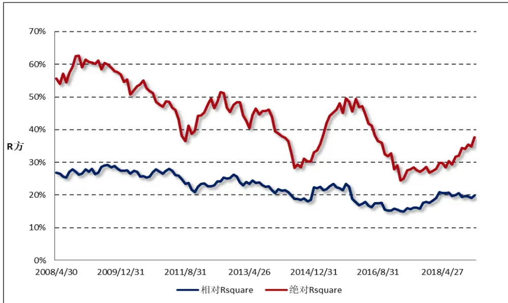
数据来源：财通证券研究所，Wind

在财通金工多因子模型中，自变量因子被分为国家因子、行业因子和风格因子三大类，因此我们可以通过计算将不同类别的解释变量纳入回归时，模型解释能力的提升幅度来观察每类因子对于股票收益的解释大小。由于需要观察截距项因子（即国家因子）的解释能力，因此此处我们用总R2进行说明（因为对于仅包含截距项回归的模型而言，其R2为 0）。由图 2 可以看到，当模型中仅加入国家因子时，模型的R2滚动均值为 27%，当加入了行业因子时R2滚动均值达到 37.5%，当再将风格因子加入时，模型R2滚动均值达到 43.2%，每类因子都对股票的波动增加一定的贡献，其中以市场因子为主，其次为行业因子，最后为风格类因子。

图2：包含不同类别的解释因子对模型R2的影响比较
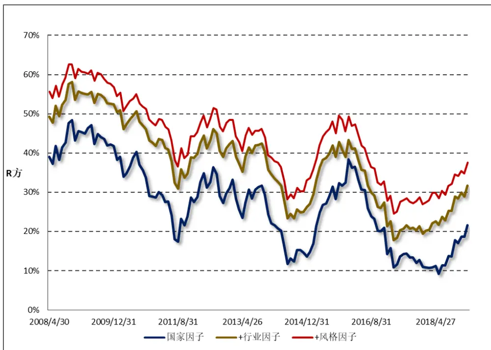
数据来源：财通证券研究所，Wind

图3：回归权重的选择对模型R2的影响
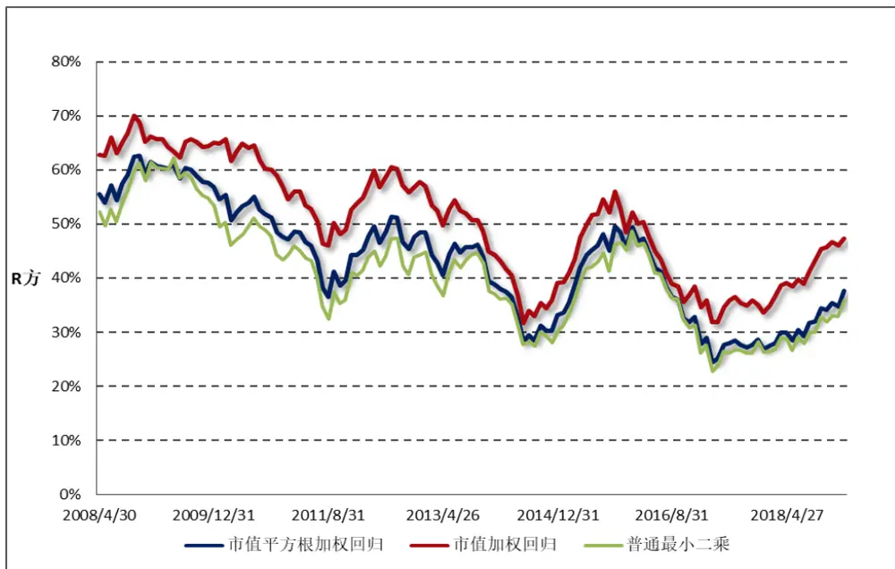
数据来源：财通证券研究所，Wind

在模型回归中，我们采用加权最小二乘法对股票特质收益的异方差性进行规避，在实际应用中普遍采用较多的是股票的市值平方根权重，即认为股票特质收益的波动与其市值平方根权重成反比。事实上，我们也可以采用股票市值权重进行加权回归。图 3 对比了采用普通最小二乘回归、市值平方根加权回归和采用市值加权回归三种方法得到的滚动 12 月R2均值，可以看到采用市值加权回归得到的R2普遍来讲要更高一些，究其原因很可能是大市值股票具有更为相似的波动方向，采用市值加权回归比市值平方根加权相比，对于大市值股票赋予的权重更大。

图4：多因子收益拟合模型在不同样本股中的相对R2比较
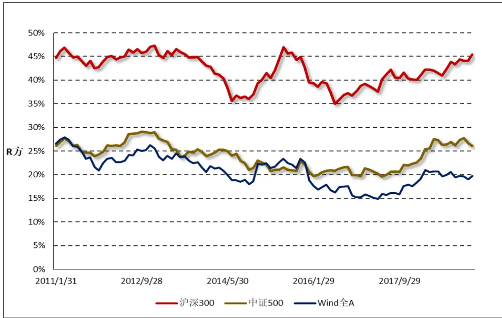
数据来源：财通证券研究所，Wind

最后，我们观察一下多因子模型在不同样本股中的解释能力，图 4 展示了收益模型在沪深 300、中证 500 和 Wind 全 A指数中的拟合情况，此处展示的是相对R2，回测样本区间段为 2011.1.31-2019.1.31。可以看到模型在沪深 300 中的拟合效果最佳，其滚动12月的相对R2均值达到42%，而在中证500指数中为24%，在 Wind 全 A中为 21%。造成这一结果的原因，财通金工认为一方面是因为 $沪$ 深300 指数成分股数量更少，拟合少数股票要比拟合多数股票的效果更好。此外，沪深 300指数在风格上偏向大盘价值，其成分股的风格更为一致，跟随市场波动的联动性更强。

## 1.3 名字的源起： $R^{2}$ 与 IC 的互通

本次专题讨论的最后一部分我们聊一聊 $R^{2}$ 名字的源起，此处 R 表示相关关系（Relation），因为在一元线性回归中， $R^{2}$ 等同于自变量与因变量的相关系数的平方。在单因子测试的研究中，该相关系数也被称为因子的 IC 值，因此 $R^{2}$ 等同于 IC 的平方。具体证明如下：

在一元线性回归中，回归系数的表达形式如下：

$$
\begin{array}{r}{\hat{\alpha}=\bar{y}-\hat{\beta}\bar{x},\quad\hat{\beta}=\frac{\sum_{i=1}^{n}(x_{i}-\bar{x})(y_{i}-\bar{y})}{\sum_{i=1}^{n}(x_{i}-\bar{x})^{2}}}\end{array}
$$

那么，我们即可对 SST 进行简单的变换：

$$
\begin{aligned}\sum_{i=1}^{n}(\hat{y}_{i}-\bar{y})^{2}&=\sum_{i=1}^{n}(\hat{\alpha}+\hat{\beta}x_{i}-\bar{y})^{2}=\sum_{i=1}^{n}(\bar{y}-\hat{\beta}\bar{x}+\hat{\beta}x_{i}-\bar{y})^{2}\\&=\hat{\beta}^{2}\sum_{i=1}^{n}(x_{i}-\bar{x})^{2}=\frac{[\sum_{i=1}^{n}(x_{i}-\bar{x})(y_{i}-\bar{y})]^{2}\sum_{i=1}^{n}(x_{i}-\bar{x})^{2}}{[\sum_{i=1}^{n}(x_{i}-\bar{x})^{2}]^{2}}\\&=\frac{[\sum_{i=1}^{n}(x_{i}-\bar{x})(y_{i}-\bar{y})]^{2}}{\sum_{i=1}^{n}(x_{i}-\bar{x})^{2}}\end{aligned}
$$

因此，即可得到模型的表达形式：

$$
R^{2}=\frac{SSE}{SST}=\frac{\sum_{i=1}^{n}(\hat{y}_{i}-\bar{y})^{2}}{\sum_{i=1}^{n}(y_{i}-\bar{y})^{2}}=\frac{[\sum_{i=1}^{n}(x_{i}-\bar{x})(y_{i}-\bar{y})]^{2}}{\sum_{i=1}^{n}(x_{i}-\bar{x})^{2}\sum_{i=1}^{n}(y_{i}-\bar{y})^{2}}
$$

证明完毕。

## 2、 一周行情回顾

受情绪面影响，开年以来市场涨势喜人，上周市场主要指数普遍上涨，中小板、成长类股票上涨势头仍然强于大盘、价值类股指。上周中小成长和深证成长指数分别上涨 8.11%和 7.29%，在所有样本指数中排名前二，而以大盘价值为主的上证 180 价值指数和沪深 300 价值指数分别录得 3.22%和 3.52%的收益，总体来讲上周权益市场风格更加偏好中小成长类股票。

图5：上周主要指数收益（2019.2.15-2019.2.22）
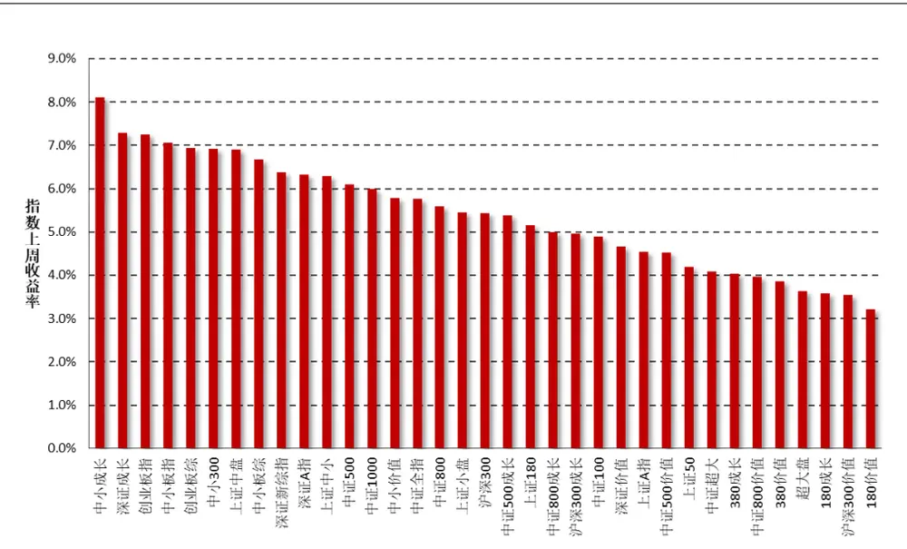
数据来源：财通证券研究所，Wind

行业方面，在所有 29 个中信一级行业中，所有行业均取得正收益，其中尤以非银金融和通信行业的表现最为亮眼。非银金融行业上周累计上涨 13.47%，排名全市场第一，特别是上周五的券商股集体涨停让市场印象深刻。

图6：上周中信一级行业指数收益（2019.2.1-2019.2.15）
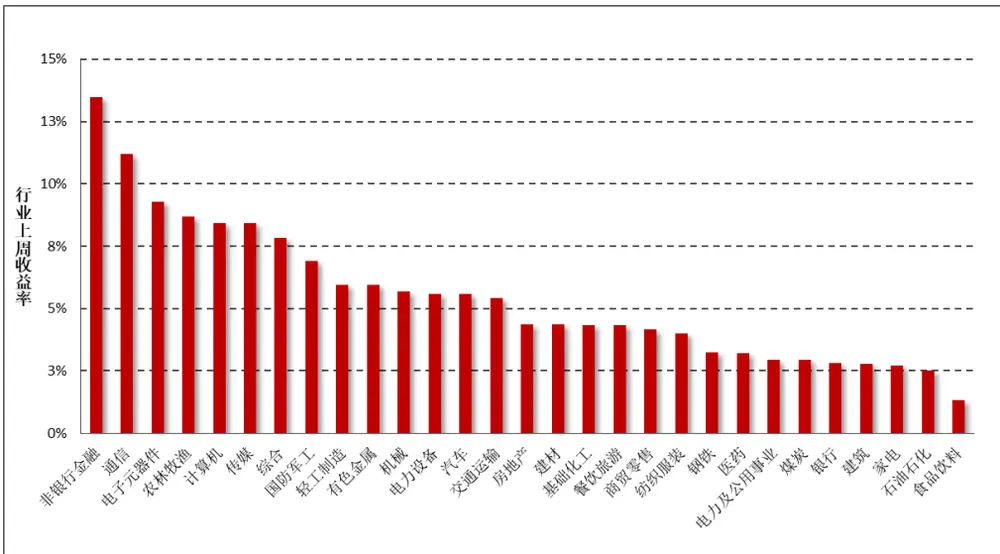
数据来源：财通证券研究所，Wind

## 3、 市场风格解析及指数风险预测

财通金工借鉴 Barra 模型，选取 Beta、规模、动量、波动率、非线性规模、、流动性、盈利、成长和杠杆率因子构建收益 风险归因模型，因子定义及计算细节参见附录二。本部分通过对近期风格因子的收益表现进行分析以期捕捉 A股市场的风格变化，同时对财通金工样本指数的未来一月风险进行预测来分析当前 A 股市场所处的风险水平。风格因子的收益拆解可参见财通金工专题报告《Barra 模型初探：A股市场风格解析》，资产组合的风险预测可参见财通金工专题报告《Barra 模型进阶：多因子模型风险预测》。

## 3.1 市场风格解析

各类风格因子在上周的累计收益可分为日度累计收益和周度收益两种，日度累计收益是根据风格因子的日度收益计算得到，周度收益是将股票在本周的收益率对股票在上周最后一个交易日的因子暴露度进行回归得到的因子纯净收益，二者之间的区别在于换仓频率的不同，前者为每日换仓，而后者在每周最后一个交易日换仓。

表1和图7展示了上周各类风格因子的累计收益和周度收益大小，可以看到，二者十分近似。上周市场风格与前一周保持类似，高波动、高 Beta 的股票表现更为优异，而规模因子连续两周收益为负，可见市场在近期仍然更为偏爱小盘股票。

表1：上周纯风格因子收益（2019.2.18-2019.2.22）

| 日期 | Beta | 规模 | 长期动量 | 波动率 | 非线性规模 | BP | 流动性 | 盈利 | 成长 | 杠杆 |
| --- | --- | --- | --- | --- | --- | --- | --- | --- | --- | --- |
| 2019/2/18 | 0.52% | 0.06% | -0.11% | 0.24% | 0.10% | 0.06% | 0.04% | 0.05% | 0.00% | -0.01% |
| 2019/2/19 | 0.09% | -0.24% | -0.25% | 0.62% | 0.01% | 0.23% | -0.13% | -0.08% | -0.14% | 0.02% |
| 2019/2/20 | 0.03% | -0.09% | -0.01% | 0.12% | -0.22% | 0.09% | -0.02% | 0.10% | -0.03% | 0.07% |
| 2019/2/21 | 0.06% | -0.02% | 0.29% | 0.23% | 0.05% | 0.02% | -0.06% | -0.13% | -0.09% | 0.02% |
| 2019/2/22 | 0.45% | 0.01% | 0.07% | 0.10% | 0.20% | 0.21% | 0.13% | -0.36% | -0.06% | 0.06% |
| 上周累计收益 | 1.16% | -0.27% | -0.02% | 1.32% | 0.13% | 0.60% | -0.05% | -0.42% | -0.32% | 0.17% |
| 周度收益 | 0.99% | -0.31% | -0.04% | 1.35% | 0.15% | 0.63% | 0.09% | -0.43% | -0.36% | 0.17% |
| 前一周度收益 | 0.44% | -0.54% | -1.14% | 1.32% | -0.03% | 0.67% | 0.41% | -0.30% | -0.07% | 0.06% |

数据来源：财通证券研究所，Wind

图7：近两周纯风格因子收益比较（2019.2.18-2019.2.22）
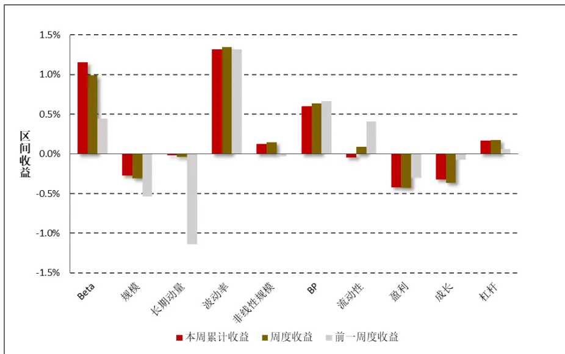
数据来源：财通证券研究所，Wind

图8：最近一个月风格因子净值走势（2019.1.16-2019.2.22）
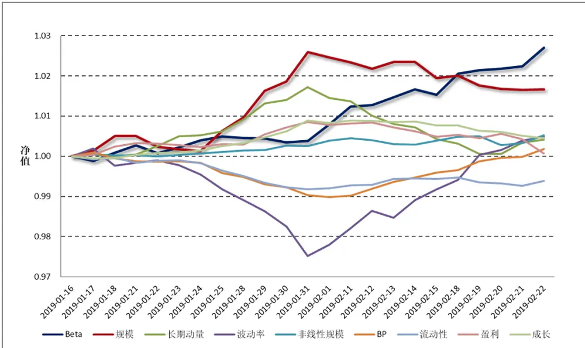
数据来源：财通证券研究所，Wind

图 8 和图9 分别展示了最近一个月各类风格因子的净值走势及累计收益，以观察各类风格因子在过去一段时间的持续盈利能力。整体来讲，在过去的一个月中，大盘价值股的表现优于小盘股，高 Beta、大市值的股票最近能获得较高的收益，而波动率因子在最近一个月的表现起伏较大，经过前期回撤之后在近两周均取得较大的正收益。

图9：最近一个月风格因子累计收益（2019.1.9-2019.2.15）
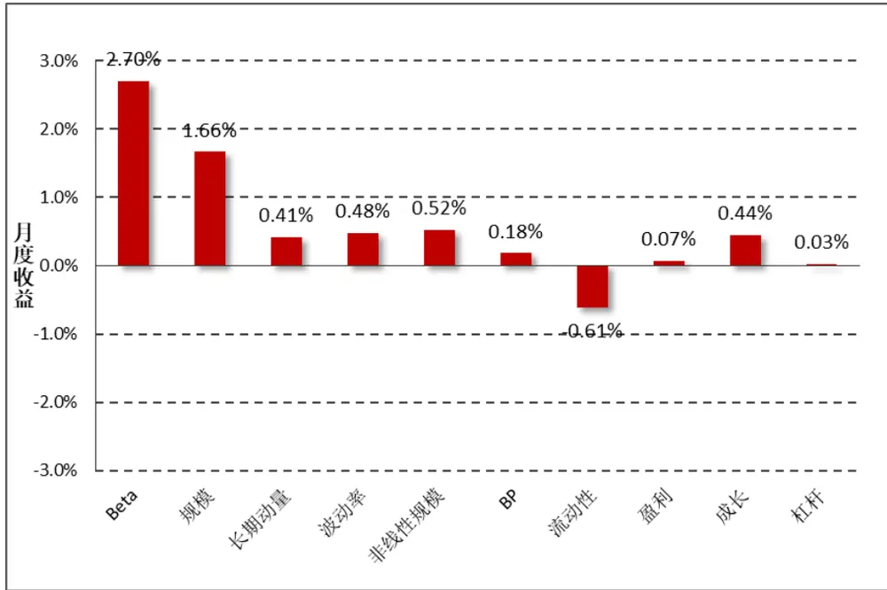
数据来源：财通证券研究所，Wind

## 3.2 指数风险预测

对收益的分解仅代表过去，对风险的预测才代表未来。多因子模型风险预测将股票风险拆解为共同风险和特质风险两部分，在通过稳健调整对共同风险矩阵和特质风险矩阵进行估计后，即可根据指数的成分股权重来估计指数在未来一段时间的波动情况。为了保证结果的严谨性，此处我们直接采用 Wind 提供的成分股权重数据，而非根据自由流通市值计算得到，尽管二者的结果十分类似。

$$
Risk(P)=W^{\prime}VW=W^{\prime}(X^{\prime}FX+\Delta)W
$$

图 10 展示了财通金工样本指数在未来一个月的预测波动率，为了方便展示我们将估计的月度波动率进行年化，波动的预测时间为上周最后一个交易日（2019.2.22）。可以看到，所有样本指数未来一月的年化波动区间在 15%-24%之间，预测波动相较上一周整体减小，中小板股票、成长类指数的风险较大，而偏大盘股票、价值类股票的风险普遍较小。

图10：财通金工样本指数未来一月波动预测（年化）（2019.2.15-2019.3.15）
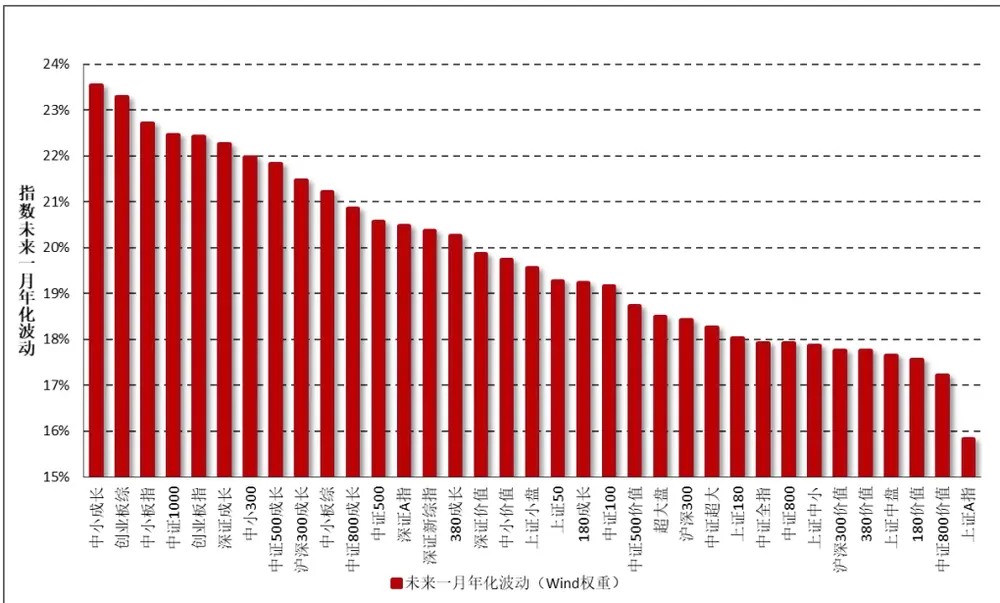
数据来源：财通证券研究所，Wind

由于在计算股票的风格因子时，我们会对暂停上市的股票、大类因子值存在缺失的股票进行剔除，因此在进行收益归因和风险预测时，并非所有指数成分股都纳入到了模型中，如果缺失股票个数过多或者缺失股票的权重占比过大，将会对模型结果造成较大影响。图 11 展示了各大指数在模型拟合过程中，纳入考虑的股票个数（权重）占指数成分股个数（权重）的比例，可以看到所有指数的比例均在 93%以上，数据质量的拟合较为合意。

图11：收益回归/风险预测样本股票占指数成分股比率
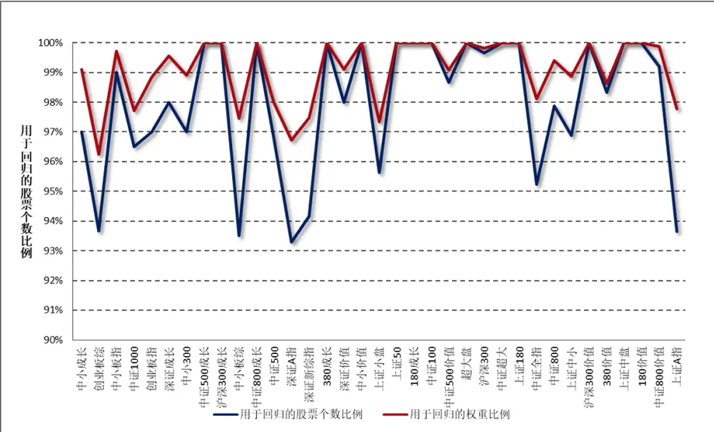
数据来源：财通证券研究所，Wind

## 4、 指数成分收益归因：

本部分财通金工对上周表现最好的三只指数和表现最差的三只指数进行归因分析，以观察涨幅较高（或较低）的指数风险暴露是否展现出较高的趋同性以及两类指数的持股风格是否会表现出明显的差别。

图12：上周表现最好三指数因子暴露度
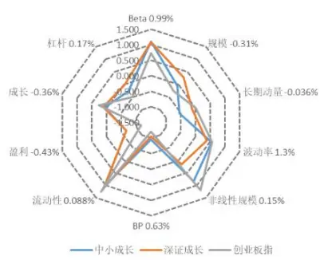
数据来源：财通证券研究所，Wind

图13：上周表现最差三指数因子暴露度
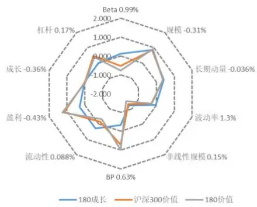
数据来源：财通证券研究所，Wind

表 2 展示了各大指数上周在各类因子上的暴露程度，可以看到，上周表现最好的两支创业板指数，在规模因子上较低的暴露程度和在 Beta 及波动率因子上较高的暴露帮助其获得了一个较好的收益。表现相对较差的三只指数都是大盘价值类指数，其在各个因子上的暴露趋同，较大的规模和在动量因子上的过高暴露，拖累了指数走势。

表2：指数在风格因子上的暴露程度（2019.2.22）

| 代码 指数名称 |  | Beta 0.99% | 规模-0.31% 长 | 期动量 -0.I波 | 动率 1.3% 非 | 线性规模 C | BP 0.63% | 流动性 0.08 | 8盈利-0.43% | 成长 -0.36% | 杠杆 0.17% | 实际收益 |
| --- | --- | --- | --- | --- | --- | --- | --- | --- | --- | --- | --- | --- |
| 399602.SZ 中小成长 |  | 1.103 | -0.059 | -0.541 | 0.535 | 0.828 | -0.945 | 1.032 | -0.669 | 0.069 | -0.268 | 8.11% |
| 399346.SZ 深证成长 |  | 1.078 | 0.279 | -0.118 | 0.384 | 0.161 | -1.042 | 1.100 | -0.657 | 0.127 | -0.037 | 7.29% |
| 399006.SZ 创业板指 |  | 0.727 | -0.263 | 0.005 | 0.557 | 1.198 | -1.210 | 1.243 | -1.167 | 0.266 | -0.497 | 7.25% |
| 399005.SZ 中小板指 |  | 1.066 | 0.150 | -0.364 | 0.391 | 0.775 | -1.022 | 0.958 | -0.783 | 0.115 | -0.323 | 7.05% |
| 399102.SZ 创业板综 |  | 0.777 | -1.243 | -0.278 | 0.397 | 1.288 | -0.976 | 0.966 | -1.171 | 0.203 | -0.605 | 6.94% |
| 399008.SZ 中小300 |  | 0.821 | -0.339 | -0.390 | 0.346 | 1.258 | -0.848 | 0.857 | -0.784 | 0.098 | -0.335 | 6.91% |
| 000044.SH 上证中盘 |  | -0.041 | 0.444 | 0.117 | 0.017 | 0.358 | -0.128 | 0.321 | -0.119 | -0.178 | 0.173 | 6.91% |
| 399101.SZ | 中小板综 | 0.583 | -0.746 | -0.379 | 0.339 | 1.164 | -0.737 | 0.603 | -0.816 | 0.064 | -0.399 | 6.68% |
| 399100.SZ | 深证新综指 | 0.607 | -0.611 | -0.270 | 0.195 | 0.904 | -0.574 | 0.634 | -0.585 | 0.067 | -0.222 | 6.38% |
| 399107.SZ | 深证A指 | 0.580 | -0.625 | -0.239 | 0.279 | 0.905 | -0.629 | 0.775 | -0.675 | 0.119 | -0.273 | 6.33% |
| 000046.SH | 上证中小 | 0.106 | -0.059 | -0.071 | -0.047 | 1.049 | -0.072 | 0.343 | -0.173 | -0.096 | 0.151 | 6.28% |
| 000905.SH | 中证500 | 0.443 | -0.806 | -0.335 | -0.039 | 2.132 | -0.163 | 0.510 | -0.396 | -0.006 | 0.026 | 6.10% |
| 000852.SH | 中证1000 | 0.484 | -1.537 | -0.450 | 0.173 | 1.940 | -0.422 | 0.647 | -0.750 | 0.127 | -0.299 | 5.99% |
| 399604.SZ | 中小价值 | 0.493 | -0.384 | -0.231 | 0.110 | 1.273 | -0.344 | 0.519 | -0.116 | -0.040 | -0.169 | 5.79% |
| 000985.CSI | 中证全指 | 0.256 | -0.222 | -0.054 | 0.009 | 0.317 | -0.210 | 0.408 | -0.190 | -0.012 | -0.074 | 5.77% |
| 000906.SH | 中证800 | 0.218 | 0.395 | 0.088 | -0.067 | -0.163 | -0.106 | 0.351 | 0.064 | -0.047 | 0.049 | 5.59% |
| 000045.SH | 上证小盘 | 0.311 | -0.761 | -0.334 | -0.136 | 2.013 | 0.006 | 0.373 | -0.249 | 0.019 | 0.120 | 5.44% |
| 000300.SH 沪深300 |  | 0.162 | 0.750 | 0.209 | -0.072 | -0.835 | -0.098 | 0.311 | 0.191 | -0.061 | 0.051 | 5.43% |
| H30351.CSI 中证500成长 |  | 0.747 | -0.716 | -0.452 | 0.089 | 2.126 | -0.383 | 0.861 | -0.065 | 0.131 | 0.030 | 5.37% |
| 000010.SH 上证180 |  | -0.144 | 0.812 | 0.342 | -0.165 | -1.089 | 0.154 | 0.102 | 0.409 | -0.121 | 0.085 | 5.15% |
| H30355.CSI 中证800成长 |  | 0.784 | 0.454 | 0.106 | -0.015 | -0.248 | -0.816 | 0.783 | 0.065 | 0.112 | -0.031 | 5.00% |
| 000918.SH | 沪深300成长 | 0.706 | 0.756 | 0.229 | -0.067 | -0.816 | -0.902 | 0.723 | 0.120 | 0.063 | -0.092 | 4.96% |
| 000903.SH | 中证100 | 0.031 | 0.986 | 0.348 | -0.171 | -1.676 | 0.048 | 0.140 | 0.452 | -0.084 | 0.058 | 4.90% |
| 399348.SZ | 深证价值 | 0.582 | 0.471 | 0.057 | -0.078 | -0.279 | -0.323 | 0.692 | 0.288 | 0.066 | 0.208 | 4.67% |
| 000002.SH | 上证A指 | -0.285 | 0.298 | 0.129 | -0.085 | -0.428 | 0.243 | -0.198 | 0.260 | -0.016 | 0.094 | 4.55% |
| H30352.CSI | 中证500价值 | 0.142 | -0.792 | -0.206 | -0.509 | 2.168 | 0.586 | 0.194 | 0.547 | -0.001 | 0.352 | 4.53% |
| 000016.SH | 上证50 | -0.197 | 1.002 | 0.458 | -0.259 | -1.836 | 0.301 | -0.012 | 0.681 | -0.091 | 0.040 | 4.20% |
| 000980.CSI | 中证超大 | -0.136 | 1.008 | 0.181 | -0.107 | -1.902 | 0.247 | -0.102 | 0.510 | 0.001 | 0.088 | 4.08% |
| 000117.SH | 380成长 | 0.562 | -0.753 | -0.252 | -0.043 | 1.973 | -0.565 | 0.686 | 0.029 | 0.159 | -0.065 | 4.04% |
| H30356.CSI | 中证800价值 | -0.289 | 0.657 | 0.255 | -0.288 | -0.817 | 0.573 | -0.019 | 0.956 | -0.038 | 0.458 | 3.96% |
| 000118.SH | 380价值 | -0.106 | -0.864 | -0.139 | -0.416 | 2.044 | 0.597 | 0.003 | 0.686 | 0.017 | 0.419 | 3.86% |
| 000043.SH | 超大盘 | -0.078 | 1.008 | 0.126 | -0.148 | -1.922 | 0.154 | 0.021 | 0.488 | -0.084 | -0.056 | 3.63% |
| 000028.SH | 180成长 | 0.111 | 0.857 | 0.411 | -0.043 | -1.225 | -0.324 | 0.272 | 0.302 | 0.022 | 0.013 | 3.58% |
| 000919.CSI | 沪深300价值 | -0.540 | 0.875 | 0.363 | -0.274 | -1.304 | 0.722 | -0.147 | 1.153 | -0.004 | 0.475 | 3.54% |
| 000029.SH | 180价值 | -0.773 | 0.913 | 0.364 | -0.284 | -1.493 | 0.973 | -0.312 | 1.241 | -0.038 | 0.380 | 3.22% |

数据来源：财通证券研究所，Wind

## 参考文献：

【1】“Introductory Econometrics: A Modern Approach”. Jeffrey M. Wooldridge, 5th edition, 2015.

【2】“The Barra Europe Equity Model (EUE3)”Beat G. Briner, Rachael C. Smith and Paul Ward, 2009.

## 5、 附录

| 附录一：财通金工指数池选取 |  |  |  |  |  |
| --- | --- | --- | --- | --- | --- |
| 上证规模/风格指数 |  | 深证综合/规模指数 |  | 中证规模/风格指数 |  |
| 000001.SH | 上证综指 | 399101.SZ | 中小板综 | 000300.SH | 沪深300 |
| 000002.SH | 上证A指 | 399102.SZ | 创业板棕 | 000852.SH | 中证 1000 |
| 000010.SH | 上证 180 | 399106.SZ | 深证综指 | 000985.CSI | 中证全指 |
| 000016.SH | 上证50 | 399107.SZ | 深证 A指 | 000980.CSI | 中证超大 |
| 000043.SH | 超大盘 | 399005.SZ | 中小板指 | 000903.SH | 中证100 |
| 000044.SH | 上证中盘 | 399006.SZ | 创业板指 | 000905.SH | 中证 500 |
| 000045.SH | 上证小盘 | 399008.SZ | 中小300 | 000906.SH | 中证 800 |
| 000046.SH | 上证中小 | 399346.SZ | 深证成长 | 000918.SH | 沪深 300 成长 |
| 000028.SH | 180成长 | 399348.SZ | 深证价值 | 000919.SH | 沪深 300 价值 |
| 000029.SH | 180 价值 | 399602.SZ | 中小成长 | H30351.CSI | 中证 500 成长 |
| 000117.SH | 380成长 | 399604.SZ | 中小价值 | H30352.CSI | 中证 500 价值 |
| 000118.SH | 380 价值 |  |  | H30355.CSI | 中证 800 成长 |
|  |  |  |  | H30356.CSI | 中证 800 价值 |

数据来源：财通证券研究所

| 附录二：财 | 通金工风格 | 因子定义 |  |  |
| --- | --- | --- | --- | --- |
| 大类因子 | 子类因子 | 因子定义及计算 | 权重 | 备注 |
| Beta | BETA | $\mathbf{r_{t}}=\alpha+\beta\mathbf{R_{t}}+\mathbf{e_{t}},$ 将单只股票过去252天的日度收益率对流通市值加权指数日度收益率进行半衰指数加权回归，半衰期为63 天 | 1 | 1)采用流通市值而非总市值加权，因为各大指数编制采用流通市值加权；2) 需要剔除当日停牌或者未上市日期的数据，并将权重进行归一化；3)若满足条件的样本数据少于42天，我们将其 Beta 置为 NaN。 |
| 规模 | SIZE | 股票总市值取对数 | 1 | 由于PB、PE等因子的计算是基于总市值的，因此此处也用总市值 |
| 动量 | RSTR | 过去一段时间个股的累计收益率，不含最近一个月， $\begin{array}{r}{\mathrm{RSTR}=\sum_{\mathrm{t}=\mathrm{L}}^{\mathrm{T}+\mathrm{L}}\mathrm{w}_{\mathrm{t}}(\ln(1+\mathrm{r}_{\mathrm{t}}),}\end{array}$ $\mathrm{r}_{\mathrm{t}}=\mathrm{P}_{\mathrm{t}}/\mathrm{P}_{\mathrm{t}-1}-1,\quad\mathrm{T}=504,\quad\mathrm{L}=21,$ 收益率序列采用半衰指数加权，半衰期为126天 | 1 | 1)对于数据质量较好的个股，计算动量时采用了2年的数据2) 需要剔除未上市日期数据，但无需剔除停牌日期数据，并将权重归一化3) 若满足条件的数据样本小于42天，我们将其动量置为NaN |
| 波动率(对Beta因子和市值因子进行正交化处理） | DASTD | 个股相对市值加权指数的超额收益率序列的半衰指数加权标准差，T=252，半衰期为42 天1/2 $\mathrm{DASTD}=\left(\sum_{\mathrm{t}=1}^{\mathrm{T}}\mathrm{w}_{\mathrm{t}}\left(\mathrm{r}_{\mathrm{t}}-\mu(\mathrm{r})\right)^2\right)^{\frac{1}{2}}$ | 0.7 | D2 采用流通市值加权计算指数收益需要剔除当日停牌或者未上市日期的数据，并将权重进行归一化3) 若满足条件的数据样本小于42天，我们将其因子值置为NaN |
|  | CMRA | 表示过去12个月的波动幅度， $\begin{array}{r}{\mathrm{CMRA}=\ln(1+\operatorname*{max}\{\mathrm{Z(T)}\})-\ln(1+\operatorname*{min}\{\mathrm{Z(T)}\}),}\end{array}$ $\mathrm{Z(T)=\exp(\sum_{t=1}^{T}\ln(1+r_t))-1}$ ，表示过去T个月的收益率 | 0.15 | 以 21 天为 1 个月 |
|  | HSIGMA | 计算 Beta 时残差的标准差， Hsigma = std(ei) | 0.15 | 同 Beta 因子的计算 |
| 非线性规模 | NonLinerSize | 中市值因子，将股票总市值对数的三次方对总市值对数回归，取残差的相反数 | 1 | 用于衡量市值因子的非线性性，总市值越大和越小的股票的非线性规模越小，中市值股票的非线性规模越大 |
| 估值 | BP | 市净率的倒数，1/PB | 1 | 采用 Wind 中的 pb_lf 因子的倒数 |
| 流动性(对市值因子进行正交化） | STOM | 月度换手率，STOM = In(mean(Σ211(Vt/St)))其中V为当日成交量，S为流通股本 | 0.5 | 1)采用流通股本值，而非自由流通股本值2）剔除未上市、停牌日期的数据 |
|  | STOQ | 季度换手率， $\mathrm{STOQ}=\ln(\mathrm{mean}(\sum_{t=1}^{63}(V_t/S_t))),$ | 0.25 | 同 STOQ 因子的计算 |
|  | STOA | 年度换手率，STOA = In(mean(Σ252(Vt/St)， | 0.25 | 同 STOQ 因子的计算 |
| 盈利 | CETOP | 过去滚动12个月的经营现金流除以当前市值实际计算中取市现率 PCF（经营现金流 TTM）的倒数 | 1/2 | 采用 Wind 中的 PCF_OCF_ttm 因子的倒数 |
|  | ETOP | 过去滚动12个月的利润除以当前市值实际计算中取市盈率 PETTM 的倒数 | 1/2 | 采用 Wind 中的 PE_ttm 因子的倒数 |
| 成长 | YOYProfit | 单季度净利润同比增长率 | 1/2 | 为避免使用未来数据，需要根据季报公布时间进行调整 |
|  | YOYSales | 单季度营业收入同比增长率 | 1/2 | 同 YOYProfit 因子的计算 |
| 杠杆 | MLEV | 市场杠杆率，MLEV=（总市值+非流动负债）/总市值 | 1/3 |  |
|  | DTOA | 资产负债率，DTOA=总资产/总负债 | 1/3 |  |
|  | BLEV | 账面杠杆率，BLEV=（账面价值+非流动负债）/账面价值 | 1/3 |  |

数据来源：财通证券研究所
备注：1.波动率因子需对Beta因子和市值因子进行正交化处理；
2.流动性因子需对市值因子进行正交化处理；
若大类因子下所有子类因子值全部缺失，则该股票的因子值记为缺失，否则用有数据的因子值进行替代，注意需对权重进行归一化处理

## 信息披露

## 分析师承诺

作者具有中国证券业协会授予的证券投资咨询执业资格，并注册为证券分析师，具备专业胜任能力，保证报告所采用的数据均来自合规渠道，分析逻辑基于作者的职业理解。本报告清晰地反映了作者的研究观点，力求独立、客观和公正，结论不受任何第三方的授意或影响，作者也不会因本报告中的具体推荐意见或观点而直接或间接收到任何形式的补偿。

## 资质声明

财通证券股份有限公司具备中国证券监督管理委员会许可的证券投资咨询业务资格。

## 公司评级

买入：我们预计未来 6个月内，个股相对大盘涨幅在 15%以上；

增持：我们预计未来 6个月内，个股相对大盘涨幅介于 5%与 15%之间；

中性：我们预计未来 6个月内，个股相对大盘涨幅介于-5%与 5%之间；

减持：我们预计未来 6个月内，个股相对大盘涨幅介于-5%与-15%之间；

卖出：我们预计未来 6个月内，个股相对大盘涨幅低于-15%。

## 行业评级

增持：我们预计未来 6个月内，行业整体回报高于市场整体水平 5%以上；

中性：我们预计未来 6个月内，行业整体回报介于市场整体水平-5%与5%之间；

减持：我们预计未来 6个月内，行业整体回报低于市场整体水平-5%以下。

## 免责声明

本报告仅供财通证券股份有限公司的客户使用。本公司不会因接收人收到本报告而视其为本公司的当然客户。

本报告的信息来源于已公开的资料，本公司不保证该等信息的准确性、完整性。本报告所载的资料、工具、意见及推测只提供给客户作参考之用，并非作为或被视为出售或购买证券或其他投资标的邀请或向他人作出邀请。

本报告所载的资料、意见及推测仅反映本公司于发布本报告当日的判断，本报告所指的证券或投资标的价格、价值及投资收入可能会波动。在不同时期，本公司可发出与本报告所载资料、意见及推测不一致的报告。

本公司通过信息隔离墙对可能存在利益冲突的业务部门或关联机构之间的信息流动进行控制。因此，客户应注意，在法律许可的情况下，本公司及其所属关联机构可能会持有报告中提到的公司所发行的证券或期权并进行证券或期权交易，也可能为这些公司提供或者争取提供投资银行、财务顾问或者金融产品等相关服务。在法律许可的情况下，本公司的员工可能担任本报告所提到的公司的董事。

本报告中所指的投资及服务可能不适合个别客户，不构成客户私人咨询建议。在任何情况下，本报告中的信息或所表述的意见均不构成对任何人的投资建议。在任何情况下，本公司不对任何人使用本报告中的任何内容所引致的任何损失负任何责任。

本报告仅作为客户作出投资决策和公司投资顾问为客户提供投资建议的参考。客户应当独立作出投资决策，而基于本报告作出任何投资决定或就本报告要求任何解释前应咨询所在证券机构投资顾问和服务人员的意见；

本报告的版权归本公司所有，未经书面许可，任何机构和个人不得以任何形式翻版、复制、发表或引用，或再次分发给任何其他人，或以任何侵犯本公司版权的其他方式使用。