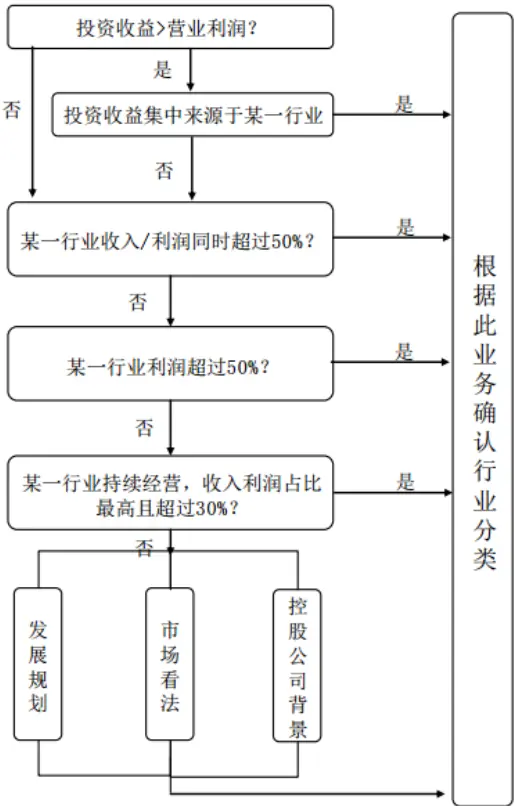
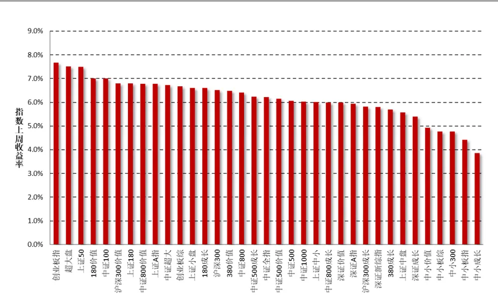
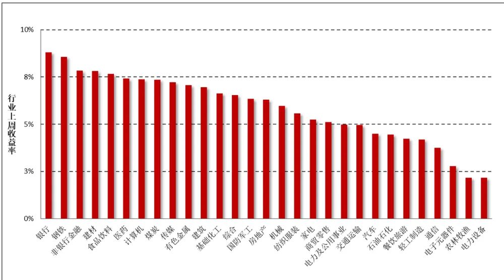
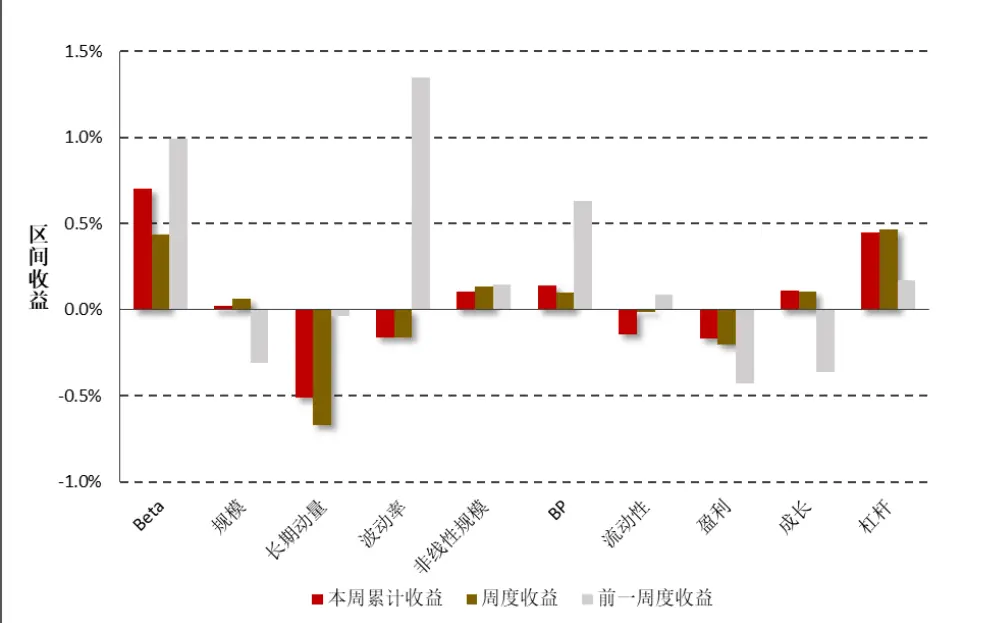
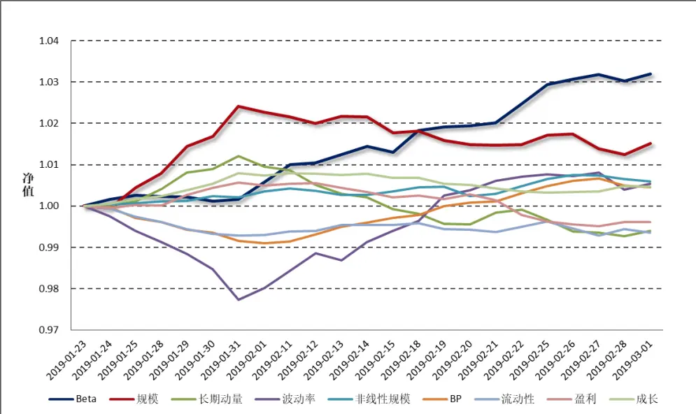
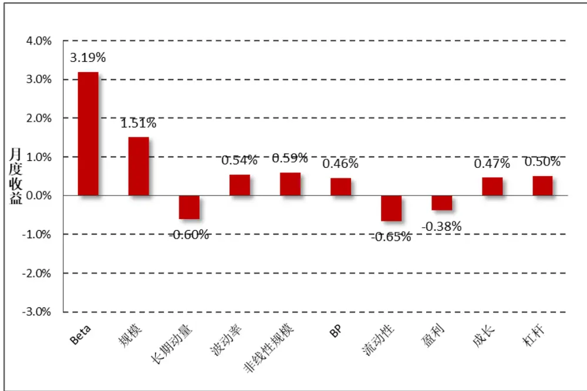
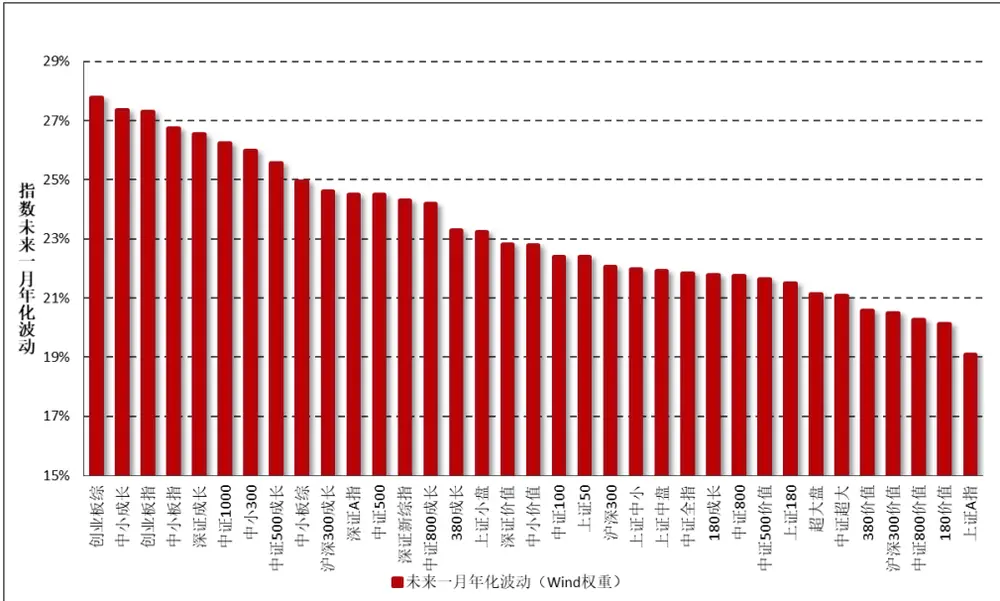
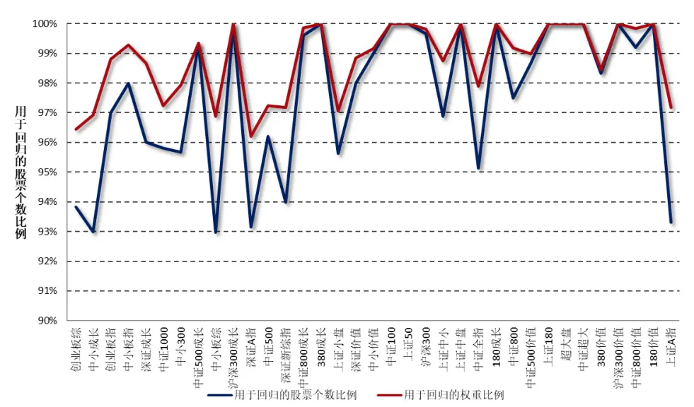
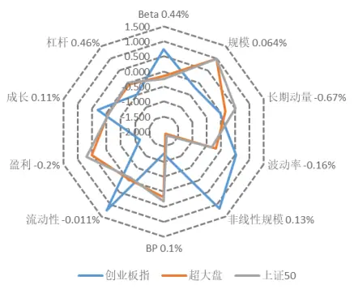
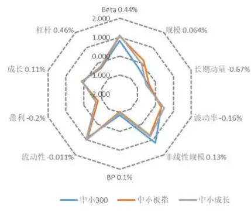

2019 年 03 月 03 日

# 行业因子选取：中信一级还是申万一级？

## “拾穗”多因子系列报告（第 3 期）

## 联系信息

陶勤英分析师

SAC 证书编号：S0160517100002021-68592393

taoqy@ctsec.com

张宇联系人

zhangyu1@ctsec.com 021-68592220 
176216888421

176216888421

## 相关报告

“星火”多因子系列（一）：《 模型初探：A 股市场风格解析》

“星火”多因子系列（二）：《Barra模型进阶：多因子模型风险预测》

“星火”多因子系列（三）：《Barra模型深化：纯因子组合构建》

“拾穗”多因子系列（一）：《带约束的加权最小二乘：一种解析解法》

“拾穗”多因子系列（二）：《你看到的不一定是你所想的：解密 R方》

## 投资要点：

- 行业因子选取：中信一级还是申万一级？

- 常见的行业类别划分有管理型和投资型两类，我们通常接触的中信一级和申万一级划分属于后者。

- 申万一级行业指数基准日更早，可回测周期更长，然而其在 2014年年初经历过较大调整，使用中信一级行业更为便捷。

- 由于指数编制原因，部分股票上市后出现无行业数据的情况。上市公司由于借壳、并购等原因，会使公司所在行业发生变化。因此在历史回测时，不能单纯使用某个截面上的行业划分作为替代。

## 一周行情回顾

受多方利好消息影响，上周市场主要指数普遍上涨，市场风格分化并不明显。

行业方面，在所有 29个中信一级行业中，所有行业均取得正收益，尤以银行、钢铁和非银金融行业的表现最为亮眼。

## 市场风格解析

上周市场风格基本与前一周保持类似，高 Beta 的股票表现更为优异，长期动量因子和波动率因子出现较为明显的回撤。

## 指数风险预测

所有样本指数在未来一个月的年化波动区间在 19%-28%之间，相较上周有明显的上升，财通金工特别提醒投资者注意当前市场的波动情况。

## 指数成分收益归因

上周表现最好的指数为创业板指、超大盘指数和上证 ，三者在不同风格因子上的暴露不完全相同，可见市场更多地是在行业上进行选择，对于风格方面并不存在明显的偏颇。

- 风险提示：本报告统计结果基于历史数据，过去数据不代表未来，市场风格变化可能导致模型失效。

在实际投资中，多因子模型被广泛地应用到资产定价、绩效归因、风险控制、组合优化、基金评价及资产配置等各个领域，一套完整、精细的多因子系统成为每位量化研究者必备的工具。“做最实用的研究”，是财通金工给自己的定位。我们将在之后的系列报告中，就投资者们最关心也最容易忽略的很多细节问题进行探讨，介绍我们在实际应用中遇到的问题和思考，以飨读者。

我们为本系列报告取名“拾穗”。一周市场风云变幻，和风细雨也好，狂风骤雨也罢，都留下一地故事等待梳理。作为勤劳的搬运工，财通金工从量化视角出发对市场风格进行捕捉、对风险水平进行预测，既是希望能够如拾穗者般专心、踏实地做研究，也是祝愿各位投资者能够在市场收获满地金黄。

本期是该系列报告的第三期，主要讨论多因子模型中行业因子的选取及使用。常见的行业类别划分分为管理型和投资型两类，我们通常接触的中信一级和申万一级划分属于后者。本文从行业指数覆盖率、行业分类相似度、股票行业因子更新的及时率和变更频率来探讨行业因子的选择及使用应该注意的细节。

## 1、 行业因子选取：中信一级还是申万一级？

同一行业的股票由于其主营业务的相似性、资源利用的同质化及受政策和周期影响的趋同性，更倾向于暴露于相同的系统性风险中，因此公司业绩和股价变动也更趋向于一致。在多因子收益归因模型中，行业因子通常比风格因子有着更为显著的解释能力。而在因子选股、指数增强的研究中，我们通常也希望能够有意识地做到行业中性的处理。那么，该选择何种类别的行业划分、各类行业指数编制存在哪些异同、在研究过程中针对行业因子是否有特别需要注意的地方呢？财通金工将在本文就此问题展开讨论。

## 1.1 常见行业类别划分

从使用者的需求角度来讲，行业的分类一般可分为管理型和投资型两种。

管理型分类主要用于正确反映国民经济内部的结构和发展状况，并为国家宏观管理、各级政府部门和行业协会的经济管理以及进行科研、教学、新闻宣传、信息服务咨询等提供统一的行业分类。这种分类方法的分类对象一般是国民经济活动总体，分类原则是按照产品的统一性、行业的技术特点来进行分类的。如联合国行业分类标准、北美的行业分类标准，我国统计局的《国民经济行业分类》，证监会颁布的《中国上市公司分类指引》均属于管理型的行业分类标准。

投资型分类是为满足金融组织对准确、完全、标准的行业定义的需要而设计，方便投资者进行投资分析、业绩评价、资产配置等投资活动。投资者只关心证券投资能否保值增值，因此这种行业分类要重点反映行业的盈利前景，分类后各行业收益有差别。比较有代表性的如：国内申万、中信的行业分类标准、国外 MSCI和 的联合发布的全球行业分类标准 、富时全球分类系统 等。

在针对国内二级市场的研究中，采用较多的是基于投资型的行业划分，国内常用的分类有申万一级行业（28 个）、中信一级行业（29 个）、Wind 二级行业划分（24 个）等，本文主要对前两种行业划分进行探讨。

表 1：申万一级行业与中信一级行业基本信息

| 基本信息 | 申万一级行业 | 中信一级行业 |
| --- | --- | --- |
| 基准日 | 2000/1/4 | 2004/12/31 |
| 加权规则 | 流通股本加权 | 流通股本分级靠挡后加权 |
| 调整规则 | 新股于申购日前完成行业分 类认定。个股退市日当天剔 除。不定期调整主营业务发生 变化的个股行业分类。 | 个股退市日当天剔除。不定期 调整主营业务发生变化的个 股行业分类。 |

数据来源：财通证券研究所，《申银万国行业分类标准》，Wind

申万行业指数的基准日为 2000 年 1 月 4 日，以成分股流通股本进行加权；中信一级行业指数的基准日为 2004 年 12 月 31 日，以成分股流通股本分级靠档后加权。从指数的基准日来看，申万行业指数的历史数据更长，更有利于历史回测中拉长样本时间段。但需要说明的是，申万一级行业指数于 年年初进行了一次较大的调整，由原本的 23 个行业扩充至 28 个行业，其中部分行业名字仅进行了微调（如黑色金属改为钢铁业，餐饮旅游改为休闲服务行业），另外部分一级行业进行了拆分，如原本的建筑建材行业一拆为二，机械交运设备拆分为电气设备、国防军工、汽车业和机械设备四个行业，原本的信息设备和信息服务两个一级行业拆分为计算机、通信和传媒三个行业，而金融服务行业分拆为银行和非银金融两个行业。此次申万一级行业的拆分变化为量化研究者的回测增加了工作难度，因此在这一方面中信一级行业分类似乎更具优势。此外，尽管在其调整规则中均表明新股于申购日前完成行业分类认定，但在实际研究中我们发现仍然存在部分股票在上市一段时间内暂无行业划分的情况。

就行业划分的具体标准来看，上市公司收入与利润的行业来源结构是划分行业分类时考虑的最重要指标，同时结合以下信息（包括但不限于）进行综合评判：市场看法与投资习惯、公司未来发展规划、控股公司背景等。当多个行业的收入和利润均较为接近且没有明显的发展规划和控股公司的背景时，归入综合类。申万行业的分类方法如图 1 所示。

图 1：申万行业分类方法

数据来源：财通证券研究所，《申银万国行业分类标准》2014 版

表 2 将申万一级行业（28 个）与中信一级行业（29 个）划分下的具体类别进行了一一对应，其中行业名称完全相同的有 15 个，其余较为类似的行业我们也进行了对应。另外我们将申万一级的采掘行业与煤炭及石油石化行业进行了对应。

| 表2：申万一级与中信一级行业对比 |  |  |  |
| --- | --- | --- | --- |
| 申万一级行业 | 中信一级行业 | 申万一级行业 | 中信一级行业 |
| 农林牧渔 | 农林牧渔 | 商业贸易 | 商贸零售 |
| 采掘 | 煤炭、石油石化 | 休闲服务 | 餐饮旅游 |
| 化工 | 基础化工 | 建筑材料 | 建材 |
| 钢铁 | 钢铁 | 建筑装饰 | 建筑 |
| 有色金属 | 有色金属 | 电气设备 | 电力设备 |
| 电子 | 电子元器件 | 国防军工 | 国防军工 |
| 家用电器 | 家电 | 计算机 | 计算机 |
| 食品饮料 | 食品饮料 | 传媒 | 传媒 |
| 纺织服装 | 纺织服装 | 通信 | 通信 |
| 轻工制造 | 轻工制造 | 银行 | 银行 |
| 医药生物 | 医药 | 非银金融 | 非银金融 |
| 公用事业 | 电力及公用事业 | 汽车 | 汽车 |
| 交通运输 | 交通运输 | 机械设备 | 机械 |
| 房地产 | 房地产 | 综合 | 综合 |

数据来源：财通证券研究所

## 1.2 行业指数覆盖率与行业分类相似度

理论上来讲，每只股票都有自己所对应的行业类别。然而实际上，由于指数编制更新不及时等问题，各个行业指数的覆盖率未必能够达到 100%。表3 展示了从 2014 年至 2019 年，每年最后一个交易日的 A 股数量及申万、中信一级行业所包含的股票数量，可以看到大多数情况下，行业因子能够覆盖绝大部分的股票代码（覆盖率达到 99%以上），但是仍有部分股票存在行业因子缺失的情况，这一点在实际操作中需要引起我们的重视。

表3：行业指数覆盖率

| 年份 | A 股数量 | 申万一级股票数量 | 中信一级股票数量 | 申万一级覆盖率 | 中信一级覆盖率 |
| --- | --- | --- | --- | --- | --- |
| 2014 | 2592 | 2577 | 2571 | 99.42% | 99.19% |
| 2015 | 2808 | 2797 | 2779 | 99.61% | 98.97% |
| 2016 | 3034 | 3016 | 2873 | 99.41% | 94.69% |
| 2017 | 3467 | 3452 | 3443 | 99.57% | 99.31% |
| 2018 | 3567 | 3558 | 3564 | 99.75% | 99.92% |
| 2019 | 3588 | 3578 | 3570 | 99.72% | 99.50% |

数据来源：财通证券研究所，Wind

表 4 统计了 2019 年2 月 22 日，中信一级和申万一级各行业中所含股票的个数及其相似度。此处我们对行业 A、B的相似度定义为：A、B中所共同含有的股票数量与行业 A、B股票数最大值的比值。可以看到，二者行业所含股票的数量基本类似，相似度在较多行业中保持着较高的比例，从这一维度来看二者并无明显的优劣。

表 4：中信一级和申万一级行业相似度

| 行业名称 | 股票个数(申万) | 股票个数(中信) | 相似度 |
| --- | --- | --- | --- |
| 农林牧渔 | 93 | 88 | 86.02% |
| 采掘 | 61 | 81 | 55.56% |
| 化工 | 321 | 290 | 81.93% |
| 钢铁 | 31 | 46 | 67.39% |
| 有色金属 | 116 | 106 | 84.48% |
| 电子 | 228 | 219 | 80.26% |
| 家用电器 | 64 | 73 | 75.34% |
| 食品饮料 | 89 | 100 | 87.00% |
| 纺织服装 | 87 | 88 | 93.18% |
| 轻工制造 | 124 | 104 | 75.00% |
| 医药生物 | 291 | 279 | 93.47% |
| 公用事业 | 156 | 160 | 90.63% |
| 交通运输 | 113 | 107 | 92.92% |
| 房地产 | 129 | 145 | 84.14% |
| 商业贸易 | 99 | 97 | 83.84% |
| 休闲服务 | 35 | 31 | 85.71% |
| 综合 | 43 | 47 | 61.70% |
| 建筑材料 | 72 | 87 | 66.67% |
| 建筑装饰 | 126 | 124 | 88.89% |
| 电气设备 | 191 | 156 | 73.30% |
| 国防军工 | 52 | 61 | 63.93% |
| 计算机 | 203 | 197 | 86.21% |
| 传媒 | 150 | 138 | 88.00% |
| 通信 | 106 | 128 | 75.00% |
| 银行 | 30 | 29 | 96.67% |
| 非银金融 | 71 | 63 | 85.92% |
| 汽车 | 171 | 180 | 85.56% |
| 机械设备 | 326 | 346 | 78.90% |

数据来源：财通证券研究所，Wind

## 1.3 更新及时度及行业变更率

前面我们提到，并非所有的股票都在上市后立即拥有行业划分，那么当某只股票上市后，需要多长时间才能将其纳入到行业指数的编制中即是我们关心的问题。由于数据限制，财通金工仅统计了 2005 年 1 月 4 日之后上市的股票中（共计 2292 只），其中信一级行业分类下，上市日期与拥有行业分类日期之间间隔的天数，结果如表 5 所示。

表 5：新股上市后纳入中信一级划分的天数统计

| 上市天数 | 频数 | 频率 | 上市天数 | 频数 | 频率 |
| --- | --- | --- | --- | --- | --- |
| 0 | 267 | 11.65% | 107 | 4 | 0.17% |
| 1 | 271 | 11.82% | 108 | 3 | 0.13% |
| 2 | 47 | 2.05% | 109 | 1 | 0.04% |
| 3 | 50 | 2.18% | 110 | 1 | 0.04% |
| 4 | 48 | 2.09% | 111 | 1 | 0.04% |
| 5 | 42 | 1.83% | 112 | 4 | 0.17% |
| 6 | 52 | 2.27% | 114 | 1 | 0.04% |
| 7 | 40 | 1.75% | 115 | 2 | 0.09% |
| 8 | 52 | 2.27% | 116 | 2 | 0.09% |
| 9 | 42 | 1.83% | 117 | 3 | 0.13% |
| 10 | 613 | 26.75% | 120 | 3 | 0.13% |
| 11 | 38 | 1.66% | 121 | 1 | 0.04% |
| 12 | 43 | 1.88% | 124 | 1 | 0.04% |
| 13 | 45 | 1.96% | 222 | 1 | 0.04% |
| 14 | 36 | 1.57% |  |  |  |
| 15 | 35 | 1.53% |  |  |  |

数据来源：财通证券研究所，Wind

由表5及财通金工统计计算可知，约26.75%的股票在上市10天的时候纳入到了中信一级行业中。上市10天后，拥有行业划分的股票占比为66.49%，上市21天后，拥有行业划分的股票占比83.64%，上市63天后，拥有行业划分的股票占比。由于在研究中，我们通常选择剔除上市时间较短的新股，因此上市三个月后拥有行业划分的股票占比达到96%，是一个可以接受的结果。

通常来讲，如果上市公司存在借壳、并购等操作，公司主营业务发生变化将会导致其所属行业类别发生变化，表6统计了从2005年1月4日至2019年2月22日期间，所有A股发生行业变更次数的频数。

表6：A股股票行业变更次数统计

| 行业变更次数 | 频数 | 频率 |
| --- | --- | --- |
| 0 | 2898 | 79.99% |
| 1 | 578 | 15.95% |
| 2 | 114 | 3.15% |
| 3 | 25 | 0.69% |
| 4 | 7 | 0.19% |
| 5 | 1 | 0.03% |

数据来源：财通证券研究所，Wind

可以看到，股票自有行业值后，会出现多次行业变更的情况，尽管接近 80%的股票行业不会发生变更，但是仍有许多股票行业值发生 1-5 次变更。其中发生5 次变更的股票是青海春天（600381.SH），行业分类依次是纺织服装、房地产、煤炭、综合、钢铁、食品饮料。因此在做历史回测的时候，应当尽量避免使用某一个截面期的行业划分作为其历史划分。

## 1.4 非银金融行业划分

最后，我们简单探讨一下行业编制中对于非银金融行业的划分。中信一级和申万一级行业将证券、信托和保险类机构划分为非银金融行业，而Wind二级分类将非银金融划分为多元金融和保险II两个行业。在实际研究中，投资者们又倾向于自己将非银金融拆分为证券、保险和信托三个行业。事实上，三个板块的指数走势相似度是我们在实际研究中是否进行拆分的关键。2019年2月22日和2月25日，中信二级证券II指数分别上涨9.63%和10%，行业指数罕见地出现连续两日涨停的情况，而这两个交易日保险II指数分别上涨2.72%和9.17%，信托行业指数分别上涨8.29%和9.84%，三者走势尽管十分类似，但仍然存在明显不同。

由此可见，如果我们以聚类的思想来划分行业，即认为同一行业内部的成分股具有更为紧密的股价变动方向，那么将非银金融板块进行进一步划分，无论对于风险控制还是收益增强都是非常有必要的。关于这一点，财通金工将在随后的报告中予以说明，敬请投资者持续关注。

## 2、 一周行情回顾

上周 A股市场延续开年的良好走势，多方利好消息对于市场情绪有所增强。A股在 MSCI 因子的比重提升至 20%，预计带来较为可观的外资被动基金。上周市场主要指数普遍上涨，大小盘普涨趋势更为明显。上周创业板指和超大盘指数分别上涨 7.66%和 7.50%，在所有样本指数中排名前二，而以小盘成长为代表的中小成长和中小板指分别录得 3.85%和 4.41%的收益，总体来讲上周权益市场受情绪面驱动较为明显，而在大小盘之间的风格分化并不明确。

图2：上周主要指数收益（2019.2.22-2019.3.1）

数据来源：财通证券研究所，Wind

行业方面，在所有 29 个中信一级行业中，所有行业均取得正收益，其中尤以银行、钢铁及非银金融行业的表现最为亮眼。上周银行和钢铁行业分别上涨8.8%和 8.57%，大部分行业指数都获得超过 5%的收益。

图3：上周中信一级行业指数收益（2019.2.22-2019.3.1）

数据来源：财通证券研究所，Wind

## 3、 市场风格解析及指数风险预测

财通金工借鉴 Barra 模型，选取 Beta、规模、动量、波动率、非线性规模、、流动性、盈利、成长和杠杆率因子构建收益 风险归因模型，因子定义及计算细节参见附录二。本部分通过对近期风格因子的收益表现进行分析以期捕捉 A股市场的风格变化，同时对财通金工样本指数的未来一月风险进行预测来分析当前 A 股市场所处的风险水平。风格因子的收益拆解可参见财通金工专题报告《Barra 模型初探：A股市场风格解析》，资产组合的风险预测可参见财通金工专题报告《Barra 模型进阶：多因子模型风险预测》。

## 3.1 市场风格解析

各类风格因子在上周的累计收益可分为日度累计收益和周度收益两种，日度累计收益是根据风格因子的日度收益计算得到，周度收益是将股票在本周的收益率对股票在上周最后一个交易日的因子暴露度进行回归得到的因子纯净收益，二者之间的区别在于换仓频率的不同，前者为每日换仓，而后者在每周最后一个交易日换仓。

表7和图4展示了上周各类风格因子的累计收益和周度收益大小，可以看到，二者十分近似。上周市场风格基本与前一周保持类似，高 Beta 的股票在近期表现持续优异，长期动量因子和波动率因子出现较为明显的回撤。

表7：上周纯风格因子收益（2019.2.22-2019.3.1）

| 日期 | Beta | 规模 | 长期动量 | 波动率 | 非线性规模 | BP | 流动性 | 盈利 | 成长 | 杠杆 |
| --- | --- | --- | --- | --- | --- | --- | --- | --- | --- | --- |
| 2019/2/25 | 0.46% | 0.23% | -0.24% | 0.07% | 0.16% | 0.17% | 0.14% | -0.17% | -0.03% | 0.22% |
| 2019/2/26 | 0.12% | 0.03% | -0.29% | -0.04% | 0.11% | 0.13% | -0.18% | -0.07% | 0.02% | 0.15% |
| 2019/2/27 | 0.11% | -0.35% | -0.03% | 0.09% | -0.01% | 0.06% | -0.17% | -0.03% | 0.02% | 0.20% |
| 2019/2/28 | -0.15% | -0.14% | -0.09% | -0.41% | -0.09% | -0.17% | 0.16% | 0.09% | 0.13% | -0.20% |
| 2019/3/1 | 0.16% | 0.26% | 0.13% | 0.14% | -0.06% | -0.04% | -0.10% | 0.01% | -0.02% | 0.07% |
| 上周累计收益 | 0.70% | 0.02% | -0.51% | -0.16% | 0.11% | 0.14% | -0.14% | -0.17% | 0.11% | 0.45% |
| 周度收益 | 0.44% | 0.06% | -0.67% | -0.16% | 0.13% | 0.10% | -0.01% | -0.20% | 0.11% | 0.46% |
| 前一周度收益 | 0.99% | -0.31% | -0.04% | 1.35% | 0.15% | 0.63% | 0.09% | -0.43% | -0.36% | 0.17% |

数据来源：财通证券研究所，Wind

图 4：近两周纯风格因子收益比较（2019.2.18-2019.3.1）

数据来源：财通证券研究所

图5：最近一个月风格因子净值走势（2019.1.23-2019.3.1）

数据来源：财通证券研究所，Wind

图 5 和图6 分别展示了最近一个月各类风格因子的净值走势及累计收益，以观察各类风格因子在过去一段时间的持续盈利能力。整体来讲，在过去的一个月中，高 Beta、大市值的股票能够获得相对较高的收益，而波动率因子在最近一个月的表现起伏较大，经过前期回撤之后在近两周均取得较大的正收益，而上周该因子又出现了一定程度的下行。

图6：最近一个月风格因子累计收益（2019.1.23-2019.3.1）

数据来源：财通证券研究所，Wind

## 3.2 指数风险预测

对收益的分解仅代表过去，对风险的预测才代表未来。多因子模型风险预测将股票风险拆解为共同风险和特质风险两部分，在通过稳健调整对共同风险矩阵和特质风险矩阵进行估计后，即可根据指数的成分股权重来估计指数在未来一段时间的波动情况。为了保证结果的严谨性，此处我们直接采用 提供的成分股权重数据，而非根据自由流通市值计算得到，尽管二者的结果十分类似。

$$
Risk(P)=W^{\prime}VW=W^{\prime}(X^{\prime}FX+\Delta)W
$$

图 展示了财通金工样本指数在未来一个月的预测波动率，为了方便展示我们将估计的月度波动率进行年化，波动的预测时间为上周最后一个交易日（2019.3.1）。可以看到，所有样本指数未来一月的年化波动区间在 19%-28%之间，预测波动相较上一周有明显的上升，财通金工特别提醒投资者注意当前市场波动情况。中小板股票、成长类指数的风险较大，而偏大盘股票、价值类股票的风险普遍较小。

由于在计算股票的风格因子时，我们会对暂停上市的股票、大类因子值存在缺失的股票进行剔除，因此在进行收益归因和风险预测时，并非所有指数成分股都纳入到了模型中，如果缺失股票个数过多或者缺失股票的权重占比过大，将会对模型结果造成较大影响。图 8 展示了各大指数在模型拟合过程中，纳入考虑的股票个数（权重）占指数成分股个数（权重）的比例，可以看到所有指数的比例均在 93%以上，数据质量的拟合较为合意。

图7：财通金工样本指数未来一月波动预测（年化）（2019.3.1-2019.3.29）

数据来源：财通证券研究所，Wind

图8：收益回归/风险预测样本股票占指数成分股比率

数据来源：财通证券研究所，Wind

## 4、 指数成分收益归因：

本部分财通金工对上周表现最好的三只指数和表现最差的三只指数进行归因分析，以观察涨幅较高（或较低）的指数风险暴露是否展现出较高的趋同性以及两类指数的持股风格是否会表现出明显的差别，其结果如图 9 和图 10 所示。

图9：上周表现最好三指数因子暴露度

数据来源：财通证券研究所，Wind

图10：上周表现最差三指数因子暴露度

数据来源：财通证券研究所，Wind

表 8 展示了各大指数上周在各类因子上的暴露程度，可以看到，上周表现最好的指数为创业板指、超大盘指数和上证 50，三者在不同风格因子上的暴露并不完全相同，可见市场更多的是在行业上进行选择，对于风格方面并不存在过多的偏颇。

表8：指数在风格因子上的暴露程度（2019.3.1）

| 代码 指数名称 |  | Beta 0.44% | 规模 0.064% 长 | 期动量 -0.波 | 动率 -0.16 非线性规模 |  | C BP 0.1% | 流动性-0.01 | 盈利 -0.2% | 成长 0.11%杠杆0.46% |  | 实际收益 |
| --- | --- | --- | --- | --- | --- | --- | --- | --- | --- | --- | --- | --- |
| 399006.SZ 创业板指 |  | 0.740 | -0.214 | -0.026 | 0.536 | 1.151 | -1.259 | 1.230 | -1.156 | 0.298 | -0.481 | 7.66% |
| 000043.SH 超大盘 |  | -0.149 | 0.995 | 0.157 | -0.184 | -1.919 | 0.193 | -0.044 | 0.515 | -0.071 | -0.050 | 7.50% |
| 000016.SH 上证50 |  | -0.249 | 0.990 | 0.511 | -0.318 | -1.832 | 0.330 | -0.101 | 0.703 | -0.080 | 0.022 | 7.49% |
| 000029.SH 180价值 |  | -0.826 | 0.902 | 0.378 | -0.330 | -1.484 | 1.036 | -0.394 | 1.272 | -0.029 | 0.357 | 7.01% |
| 000903.SH | 中证100 | -0.019 | 0.978 | 0.401 | -0.230 | -1.687 | 0.062 | 0.068 | 0.474 | -0.073 | 0.049 | 7.01% |
| 000919.CSI | 沪深300价值 | -0.599 | 0.866 | 0.387 | -0.321 | -1.295 | 0.772 | -0.218 | 1.185 | 0.005 | 0.457 | 6.80% |
| 000010.SH | 上证180 | -0.160 | 0.811 | 0.377 | -0.207 | -1.101 | 0.165 | 0.044 | 0.425 | -0.110 | 0.075 | 6.80% |
| H30356.CSI | 中证800价值 | -0.345 | 0.650 | 0.276 | -0.330 | -0.816 | 0.613 | -0.072 | 0.987 | -0.029 | 0.449 | 6.78% |
| 000002.SH | 上证A指 | -0.326 | 0.298 | 0.138 | -0.093 | -0.441 | 0.277 | -0.241 | 0.286 | -0.006 | 0.094 | 6.78% |
| 000980.CSI | 中证超大 | -0.204 | 0.995 | 0.223 | -0.154 | -1.900 | 0.279 | -0.167 | 0.535 | 0.012 | 0.085 | 6.72% |
| 399102.SZ | 创业板综 | 0.777 | -1.195 | -0.325 | 0.387 | 1.263 | -1.020 | 0.982 | -1.149 | 0.229 | -0.587 | 6.67% |
| 000045.SH | 上证小盘 | 0.270 | -0.746 | -0.323 | -0.118 | 1.997 | 0.013 | 0.386 | -0.217 | 0.025 | 0.142 | 6.61% |
| 000028.SH | 180成长 | 0.017 | 0.854 | 0.488 | -0.113 | -1.233 | -0.302 | 0.189 | 0.335 | 0.035 | 0.013 | 6.61% |
| 000300.SH | 沪深300 | 0.137 | 0.751 | 0.246 | -0.117 | -0.851 | -0.096 | 0.264 | 0.207 | -0.048 | 0.048 | 6.52% |
| 000118.SH | 380价值 | -0.170 | -0.863 | -0.151 | -0.379 | 2.033 | 0.646 | 0.003 | 0.730 | 0.027 | 0.442 | 6.49% |
| 000906.SH | 中证800 | 0.194 | 0.402 | 0.115 | -0.101 | -0.182 | -0.107 | 0.318 | 0.081 | -0.035 | 0.051 | 6.41% |
| H30351.CSI | 中证500成长 | 0.721 | -0.700 | -0.462 | 0.065 | 2.107 | -0.381 | 0.867 | -0.046 | 0.141 | 0.053 | 6.23% |
| 000985.CSI | 中证全指 | 0.229 | -0.209 | -0.043 | -0.005 | 0.296 | -0.212 | 0.395 | -0.170 | 0.000 | -0.066 | 6.22% |
| H30352.CSI | 中证500价值 | 0.100 | -0.784 | -0.211 | -0.506 | 2.148 | 0.617 | 0.200 | 0.581 | 0.009 | 0.373 | 6.16% |
| 000905.SH | 中证500 | 0.426 | -0.783 | -0.346 | -0.034 | 2.110 | -0.173 | 0.528 | -0.378 | 0.003 | 0.049 | 6.07% |
| 000852.SH | 中证1000 | 0.454 | -1.516 | -0.475 | 0.196 | 1.921 | -0.430 | 0.678 | -0.722 | 0.134 | -0.275 | 6.03% |
| 000046.SH | 上证中小 | 0.120 | -0.041 | -0.067 | -0.044 | 1.018 | -0.084 | 0.351 | -0.155 | -0.088 | 0.164 | 6.01% |
| H30355.CSI | 中证800成长 | 0.706 | 0.459 | 0.176 | -0.091 | -0.263 | -0.810 | 0.732 | 0.091 | 0.123 | -0.018 | 6.00% |
| 399348.SZ | 深证价值 | 0.478 | 0.470 | 0.102 | -0.129 | -0.290 | -0.315 | 0.667 | 0.319 | 0.076 | 0.225 | 6.00% |
| 399107.SZ | 深证A指 | 0.552 | -0.605 | -0.242 | 0.272 | 0.876 | -0.645 | 0.788 | -0.655 | 0.131 | -0.255 | 5.93% |
| 000918.SH | 沪深300成长 | 0.622 | 0.759 | 0.328 | -0.153 | -0.830 | -0.895 | 0.648 | 0.147 | 0.075 | -0.083 | 5.82% |
| 399100.SZ | 深证新综指 | 0.582 | -0.589 | -0.269 | 0.182 | 0.874 | -0.591 | 0.645 | -0.566 | 0.079 | -0.205 | 5.80% |
| 000117.SH | 380成长 | 0.490 | -0.750 | -0.250 | -0.041 | 1.959 | -0.546 | 0.677 | 0.070 | 0.169 | -0.038 | 5.69% |
| 000044.SH | 上证中盘 | 0.013 | 0.465 | 0.117 | 0.009 | 0.316 | -0.155 | 0.326 | -0.111 | -0.169 | 0.180 | 5.57% |
| 399346.SZ | 深证成长 | 1.003 | 0.299 | -0.131 | 0.355 | 0.097 | -1.060 | 1.100 | -0.645 | 0.136 | -0.015 | 5.39% |
| 399604.SZ | 中小价值 | 0.483 | -0.367 | -0.222 | 0.082 | 1.256 | -0.353 | 0.529 | -0.094 | -0.038 | -0.153 | 4.92% |
| 399101.SZ | 中小板综 | 0.578 | -0.723 | -0.385 | 0.331 | 1.131 | -0.751 | 0.621 | -0.805 | 0.072 | -0.380 | 4.78% |
| 399008.SZ | 中小300 | 0.815 | -0.315 | -0.401 | 0.319 | 1.222 | -0.865 | 0.871 | -0.776 | 0.105 | -0.316 | 4.77% |
| 399005.SZ | 中小板指 | 1.059 | 0.174 | -0.367 | 0.328 | 0.732 | -1.036 | 0.956 | -0.775 | 0.125 | -0.305 | 4.41% |
| 399602.SZ | 中小成长 | 1.092 | -0.030 | -0.521 | 0.476 | 0.775 | -0.970 | 1.031 | -0.664 | 0.072 | -0.249 | 3.85% |

数据来源：财通证券研究所，Wind

## 参考文献：

【1】申银万国行业分类标准（2014 版）

注：实习生上海财经大学伊兴龙参与本课题，为本报告作出重要贡献。

## 5、 附录

| 附录一：财通金工指数池选取 |  |  |  |  |  |
| --- | --- | --- | --- | --- | --- |
| 上证规模/风格指数 |  | 深证综合/规模指数 |  | 中证规模/风格指数 |  |
| 000001.SH | 上证综指 | 399101.SZ | 中小板综 | 000300.SH | 沪深300 |
| 000002.SH | 上证A指 | 399102.SZ | 创业板棕 | 000852.SH | 中证 1000 |
| 000010.SH | 上证 180 | 399106.SZ | 深证综指 | 000985.CSI | 中证全指 |
| 000016.SH | 上证50 | 399107.SZ | 深证 A指 | 000980.CSI | 中证超大 |
| 000043.SH | 超大盘 | 399005.SZ | 中小板指 | 000903.SH | 中证100 |
| 000044.SH | 上证中盘 | 399006.SZ | 创业板指 | 000905.SH | 中证500 |
| 000045.SH | 上证小盘 | 399008.SZ | 中小300 | 000906.SH | 中证 800 |
| 000046.SH | 上证中小 | 399346.SZ | 深证成长 | 000918.SH | 沪深 300 成长 |
| 000028.SH | 180成长 | 399348.SZ | 深证价值 | 000919.SH | 沪深 300 价值 |
| 000029.SH | 180 价值 | 399602.SZ | 中小成长 | H30351.CSI | 中证 500 成长 |
| 000117.SH | 380 成长 | 399604.SZ | 中小价值 | H30352.CSI | 中证 500 价值 |
| 000118.SH | 380 价值 |  |  | H30355.CSI | 中证 800 成长 |
|  |  |  |  | H30356.CSI | 中证 800 价值 |

数据来源：财通证券研究所

附录二：财通金工风格因子定义

| 附水一. | 财通金工风 |  |  |  |
| --- | --- | --- | --- | --- |
| 大类因子 | 子类因子 | 因子定义及计算 | 权重 | 备注 |
| Beta | BETA | $\mathbf{r_{t}}=\alpha+\beta\mathbf{R_{t}}+\mathbf{e_{t}},$ 将单只股票过去252天的日度收益率对流通市值加权指数日度收益率进行半衰指数加权回归，半衰期为63 天 | 1 | 1)采用流通市值而非总市值加权，因为各大指数编制采用流通市值加权；2) 需要剔除当日停牌或者未上市日期的数据，并将权重进行归一化；3) 若满足条件的样本数据少于42天，我们将其 Beta 置为 NaN。 |
| 规模 | SIZE | 股票总市值取对数 | 1 | 由于PB、PE等因子的计算是基于总市值的，因此此处也用总市值 |
| 动量 | RSTR | 过去一段时间个股的累计收益率，不含最近个月， $\begin{array}{r}{\mathrm{RSTR}=\sum_{\mathrm{t}=\mathrm{L}}^{\mathrm{T}+\mathrm{L}}\mathrm{w}_{\mathrm{t}}(\ln(1+\mathrm{r}_{\mathrm{t}}),}\end{array}$ $\mathrm{r}_{\mathrm{t}}=\mathrm{P}_{\mathrm{t}}/\mathrm{P}_{\mathrm{t}-1}-1,\quad\mathrm{T}=504,\quad\mathrm{L}=21,$ 收益率序列采用半衰指数加权，半衰期为126天 | 1 | 1)对于数据质量较好的个股，计算动量时采用了2年的数据2) 需要剔除未上市日期数据，但无需剔除停牌日期数据，并将权重归一化3)若满足条件的数据样本小于42天，我们将其动量置为NaN |
| 波动率(对Beta因子和市值因子进行正交化处理) | DASTD | 个股相对市值加权指数的超额收益率序列的半衰指数加权标准差，T=252，半衰期为42天1/2 $\mathrm{DASTD}=\left(\sum_{\mathrm{t}=1}^{\mathrm{T}}\mathrm{w}_{\mathrm{t}}\left(\mathrm{r}_{\mathrm{t}}-\mu(\mathrm{r})\right)^2\right)^{\frac{1}{2}}$ | 0.7 | 1) 采用流通市值加权计算指数收益2) 需要剔除当日停牌或者未上市日期的数据，并将权重进行归一化3) 若满足条件的数据样本小于42天，我们将其因子值置为NaN |
|  | CMRA | 表示过去12个月的波动幅度， $\begin{array}{r}{\mathrm{CMRA}=\ln(1+\operatorname*{max}\{\mathrm{Z(T)}\})-\ln(1+\operatorname*{min}\{\mathrm{Z(T)}\}),}\end{array}$ $\mathrm{Z(T)=\exp(\sum_{t=1}^{T}\ln(1+r_t))-1}$ ，表示过去T个月的收益率 | 0.15 | 以21天为 1 个月 |
|  | HSIGMA | 计算 Beta 时残差的标准差， Hsigma = std(ei) | 0.15 | 同 Beta 因子的计算 |
| 非线性规模 | NonLinerSize | 中市值因子，将股票总市值对数的三次方对总市值对数回归，取残差的相反数 | 1 | 用于衡量市值因子的非线性性，总市值越大和越小的股票的非线性规模越小，中市值股票的非线性规模越大 |
| 估值 | BP | 市净率的倒数，1/PB | 1 | 采用 Wind 中的 pb_lf 因子的倒数 |
| 流动性(对市值因子进行正交化） | STOM | 月度换手率，STOM = In(mean(Σ211(Vt/St)))其中V为当日成交量，S为流通股本 | 0.5 | 1)采用流通股本值，而非自由流通股本值2）剔除未上市、停牌日期的数据 |
|  | STOQ | 季度换手率， $\mathrm{STOQ}=\ln(\mathrm{mean}(\sum_{t=1}^{63}(V_t/S_t))),$ | 0.25 | 同 STOQ 因子的计算 |
|  | STOA | 年度换手率，STOA = n(mean(Σ25(Vt/St)))， | 0.25 | 同 STOQ 因子的计算 |
| 盈利 | CETOP | 过去滚动12个月的经营现金流除以当前市值实际计算中取市现率 PCF（经营现金流 TTM）的倒数 | 1/2 | 采用 Wind 中的 PCF_OCF_ttm 因子的倒数 |
|  | ETOP | 过去滚动12个月的利润除以当前市值实际计算中取市盈率 PETTM 的倒数 | 1/2 | 采用 Wind 中的 PE_ttm 因子的倒数 |
| 成长 | YOYProfit | 单季度净利润同比增长率 | 1/2 | 为避免使用未来数据，需要根据季报公布时间进行调整 |
|  | YOYSales | 单季度营业收入同比增长率 | 1/2 | 同 YOYProfit 因子的计算 |
| 杠杆 | MLEV | 市场杠杆率，MLEV=（总市值+非流动负债）/总市值 | 1/3 |  |
|  | DTOA | 资产负债率，DTOA=总资产/总负债 | 1/3 |  |
|  | BLEV | 账面杠杆率，BLEV=（账面价值+非流动负债）/账面价值 | 1/3 |  |

数据来源：财通证券研究所
备注：1.波动率因子需对Beta因子和市值因子进行正交化处理；
2.流动性因子需对市值因子进行正交化处理；
若大类因子下所有子类因子值全部缺失，则该股票的因子值记为缺失，否则用有数据的因子值进行替代，注意需对权重进行归一化处理

## 信息披露

## 分析师承诺

作者具有中国证券业协会授予的证券投资咨询执业资格，并注册为证券分析师，具备专业胜任能力，保证报告所采用的数据均来自合规渠道，分析逻辑基于作者的职业理解。本报告清晰地反映了作者的研究观点，力求独立、客观和公正，结论不受任何第三方的授意或影响，作者也不会因本报告中的具体推荐意见或观点而直接或间接收到任何形式的补偿。

## 资质声明

财通证券股份有限公司具备中国证券监督管理委员会许可的证券投资咨询业务资格。

## 公司评级

买入：我们预计未来 6 个月内，个股相对大盘涨幅在 15%以上；

增持：我们预计未来 6 个月内，个股相对大盘涨幅介于 5%与15%之间；

中性：我们预计未来 6 个月内，个股相对大盘涨幅介于-5%与5%之间；

减持：我们预计未来 6 个月内，个股相对大盘涨幅介于-5%与-15%之间；

卖出：我们预计未来 6 个月内，个股相对大盘涨幅低于-15%。

## 行业评级

增持：我们预计未来 6 个月内，行业整体回报高于市场整体水平 5%以上；

中性：我们预计未来 6 个月内，行业整体回报介于市场整体水平-5%与 5%之间；

减持：我们预计未来 6 个月内，行业整体回报低于市场整体水平-5%以下。

## 免责声明

本报告仅供财通证券股份有限公司的客户使用。本公司不会因接收人收到本报告而视其为本公司的当然客户。

本报告的信息来源于已公开的资料，本公司不保证该等信息的准确性、完整性。本报告所载的资料、工具、意见及推测只提供给客户作参考之用，并非作为或被视为出售或购买证券或其他投资标的邀请或向他人作出邀请。

本报告所载的资料、意见及推测仅反映本公司于发布本报告当日的判断，本报告所指的证券或投资标的价格、价值及投资收入可能会波动。在不同时期，本公司可发出与本报告所载资料、意见及推测不一致的报告。

本公司通过信息隔离墙对可能存在利益冲突的业务部门或关联机构之间的信息流动进行控制。因此，客户应注意，在法律许可的情况下，本公司及其所属关联机构可能会持有报告中提到的公司所发行的证券或期权并进行证券或期权交易，也可能为这些公司提供或者争取提供投资银行、财务顾问或者金融产品等相关服务。在法律许可的情况下，本公司的员工可能担任本报告所提到的公司的董事。

本报告中所指的投资及服务可能不适合个别客户，不构成客户私人咨询建议。在任何情况下，本报告中的信息或所表述的意见均不构成对任何人的投资建议。在任何情况下，本公司不对任何人使用本报告中的任何内容所引致的任何损失负任何责任。

本报告仅作为客户作出投资决策和公司投资顾问为客户提供投资建议的参考。客户应当独立作出投资决策，而基于本报告作出任何投资决定或就本报告要求任何解释前应咨询所在证券机构投资顾问和服务人员的意见；

本报告的版权归本公司所有，未经书面许可，任何机构和个人不得以任何形式翻版、复制、发表或引用，或再次分发给任何其他人，或以任何侵犯本公司版权的其他方式使用。