2019 年 03 月 10 日

总市值、流通市值、自由流通市值：谈谈取舍

## “拾穗”多因子系列报告（第 4 期）

## 联系信息

陶勤英分析师

SAC 证书编号：S0160517100002 021-68592393

taoqy@ctsec.com

张宇联系人

zhangyu1@ctsec.com 021-68592220

176216888421

## 相关报告

【1】“星火”多因子系列（一）：《Barra模型初探：A 股市场风格解析》

【2】“星火”多因子系列（二）：《Barra模型进阶：多因子模型风险预测》

【3】“星火”多因子系列（三）：《Barra模型深化：纯因子组合构建》

【4】“拾穗”多因子系列（一）：《带约束的加权最小二乘：一种解析解法》

【5】“拾穗”多因子系列（二）：《你看到的不一定是你所想的：解密 R 方》

【6】“拾穗”多因子系列（三）：《行业因子选取：中信一级还是申万一级？》

## 投资要点：

## 总市值、流通市值、自由流通市值：谈谈取舍

- Wind 中提供的 3 种总市值计算方法分别服务于不同的计算目的，财通金工提醒研究者注意在使用第三方供应商的衍生数据时，仍需保持一定的警惕性。

- 从 股市值分布来看，绝大多数公司属于小市值公司，市值分布呈现明显的右偏分布。总市值与自由流通市值之间差别极大，若简单混淆二者概念将会造成较大的误差。对市值进行对数处理能够使其分布更接近于正态。

在多因子模型中，若估值、盈利因子计算时以总市值为基准，那么财通金工建议市值数据也采用总市值。而对于换手率的计算，由于非流通股本无法进行交易，因此我们认为采用自由流通换手率更为合理。

- 在指数编制过程中，采用总市值加权与官方公布的权重相比误差较大，采用流通市值加权和分级靠档加权与官方公布的权重更为接近，是财通金工更为推荐的方法。

## 市场风格解析

整体来讲，在过去的一个月中，高 Beta、高波动的股票能够获得相对较高的收益，而大规模、前期涨幅过高的股票后市走势将会出现更为明显的回撤。

## 指数风险预测

所有样本指数在未来一个月的年化波动区间在 21%-30%之间，相较上周继续明显攀升，财通金工特别提醒投资者注意当前市场的波动情况。

## 指数成分收益归因

上周市场风格分化明显，中小盘指数在流动性、非线性规模和波动率上的较大暴露帮助其获得较高收益，而大盘价值指数由于在规模、盈利等因子上的较高暴露，拖累指数走势。

- 风险提示：本报告统计结果基于历史数据，过去数据不代表未来，市场风格变化可能导致模型失效。

在实际投资中，多因子模型被广泛地应用到资产定价、绩效归因、风险控制、组合优化、基金评价及资产配置等各个领域，一套完整、精细的多因子系统成为每位量化研究者必备的工具。“做最实用的研究”，是财通金工给自己的定位。我们将在之后的系列报告中，就投资者们最关心也最容易忽略的很多细节问题进行探讨，介绍我们在实际应用中遇到的问题和思考，以飨读者。

我们为本系列报告取名“拾穗”。一周市场风云变幻，和风细雨也好，狂风骤雨也罢，都留下一地故事等待梳理。作为勤劳的搬运工，财通金工从量化视角出发对市场风格进行捕捉、对风险水平进行预测，既是希望能够如拾穗者般专心、踏实地做研究，也是祝愿各位投资者能够在市场收获满地金黄。

本期是该系列报告的第四期，全文从股本概念着手，就最常见的总市值、流通市值、自由流通市值的概念区别及使用细节展开探讨。介绍不同市值计算方法的区别，并讨论在因子计算及指数构建中，使用何种市值数据更为合理。

## 1、 总市值、流通市值、自由流通市值：谈谈取舍？

观察一家公司的市值大小及股本结构几乎是所有股票研究者的第一步。根据公司股票发行上市板的不同，公司股本可分为 A股、B股、H股和海外股等，根据其是否可在二级市场流通，公司股本又可分为流通股本和非流通股本，由此公司的市值通常又可分为总市值、流通市值、自由流通市值等。这些概念在计算上到底存在哪些区别？在计算 、 等估值、盈利因子的时候通常采用何种市值？在指数权重的构建时采用何种市值最为接近？本文就这几个问题展开讨论。

## 1.1 A 股、B 股、H股和海外上市股

在讨论不同的市值计算方法之前，我们先来明晰一下 A 股、B 股和 H 股的基本概念、交易制度及主要投资者结构的区别。

A股即指人民币普通股票，是由中国境内公司发行，供境内机构、组织和个人以人民币认购和交易的普通股股票（从 2013 年 4 月 1 日起，境内、港澳台居民均可开设 A股账户）。A 股实行“T+1”交割制度，设置有 10%的涨跌幅（风险提示 ST 股为 5%）交易限制。

股即指人民币特种股票，是以人民币标明面值，以外币认购和买卖，在中国境内上市的外资股。B股实行“T+3”交割制度，有 10%的涨跌幅（风险提示ST 股为 5%）交易限制。参与投资者主要为港澳台居民和国外居民，持有合法外汇存款的大陆居民也可参与。B股公司的注册地和上市地都在境内，其中以港币交易的为深交所 B股，以美元交易的为上交所 B股。

H股是指注册地在内地、上市地在香港的外资股，H取自 Hong Kong 的第一个字母，实行“T+0”交割制度，无涨跌幅限制。类似的还有在新加坡（Singapore）上市的、主营业务和企业注册地都在内地的 S 股和在美国纽约（New York）上市的 N 股。

表 1：A 股、B 股和 H股基本信息比较

| 股票类别 | 简称 | 上市地点 | 认购和交易币种 | 交割制度及涨跌幅限制 | 主要投资者 |
| --- | --- | --- | --- | --- | --- |
| A 股 | 人民币普通股票 | 境内 | 人民币认购和交易 | T+1，10%涨跌幅限制（ST 股为 5%） | 主要为境内机构、组织和个人 |
| B股 | 人民币特种股票 | 境内 | 以外币认购和买卖(港币在深交所上市，美元在上交所上市） | T+3，10%涨跌幅限制（ST 股为 5%） | 主要为港澳台居民和国外居民 |
| H股 | 港股 | 香港 | 港币 | T+0，无涨跌幅限制 | 主要为港澳台及国外居民 |

数据来源：财通证券研究所

图 1 展示了 2019 年 3 月 4 日，在 A股上市交易的所有股票中发行了 B股、H股和美股的公司数量。可以看到，在全部 3590 家 A股公司中，同时发行了 B股的公司有 82 家（不含已退市 B股），同时发行了 H股的公司有 112 家，同时发行了美股的公司有 12 家（不含已退市美股）。同时在2 个及以上板块融资上市的公司有 193 家，占全部 A股数量的 5.38%。

图 1：全部上市A 股中发行 B股、H 股及美股统计
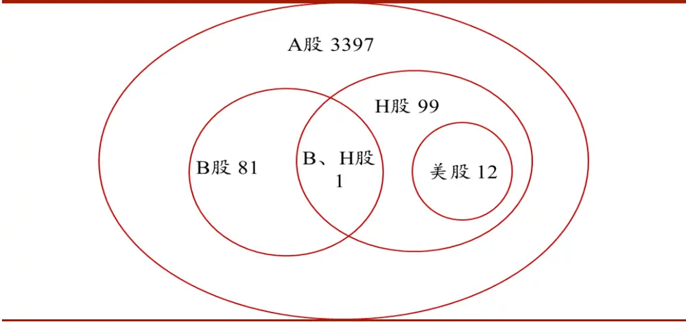
数据来源：财通证券研究所，Wind

图 2 以晨鸣纸业（000488.SZ）为例对公司股本结构进行说明，该公司在发行了 A 股的同时在深交所发行了 B 股晨鸣 B（200488.SZ）、在港交所发行了 H股（1812.HK），其中 A 股 1,669,917,684 股，B 股 706,385,266 股，H 股 528,305,250股，同时还有 45,000,000 股的优先股。由于优先股尚未上市，因此在后续讨论中我们暂不对其进行研究。

图 2：晨鸣纸业股本结构展示
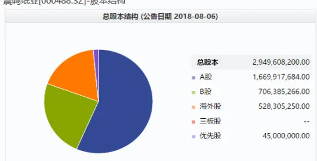

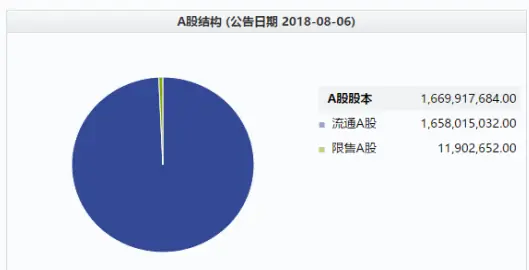

| 变动日期 | 2018-08-15 | 2018-06-30 | 2018-06-15 | 2017-12-31 | 2017-06-30 | 2016-12-31 | 2016-10-24 | 2016-09-12 |
| --- | --- | --- | --- | --- | --- | --- | --- | --- |
| 股本变动原因 | B股转增 | 高管股份变动 | H股送转股 | 股东变化导致股份结构变动 高管股份变动 股东变化导致股份结构变动 高管股份变动 高管股份变动 |  |  | 优先股 | 优先股 |
| 总股本(含优先股) | 2,949,608,200.00 | 2,157,507,217.00 | 2,157,507,217.00 | 1,981,405,467.00 | 1,981,405,467.00 | 1,981,405,467.00 | 1,981,405,467.00 | 1,968,905,467.00 |
| 总股本(存量股) | 2,904,608,200.00 | 2,112,507,217.00 | 2,112,507,217.00 | 1,936,405,467.00 | 1,936,405,467.00 | 1,936,405,467.00 | 1,936,405,467.00 | 1,936,405,467.00 |
| 非限售流通股 | 2,892,705,548.00 | 2,103,937,378.00 | 2,104,572,116.00 | 1,928,470,366.00 | 1,928,712,893.00 | 1,928,618,287.00 | 1,928,164,248.00 | 1,928,164,248.00 |
| 流通A股 | 1,658,015,032.00 | 1,104,708,617.00 | 1,105,343,355.00 | 1,105,343,355.00 | 1,105,585,882.00 | 1,105,491,276.00 | 1,105,037,237.00 | 1,105,037,237.00 |
| 流通B股 | 706,385,266.00 | 470,923,511.00 | 470,923,511.00 | 470,923,511.00 | 470,923,511.00 | 470,923,511.00 | 470,923,511.00 | 470,923,511.00 |
| 流通H股 | 528,305,250.00 | 528,305,250.00 | 528,305,250.00 | 352,203,500.00 | 352,203,500.00 | 352,203,500.00 | 352,203,500.00 | 352,203,500.00 |
| 境外流通股 | 0.00 | 0.00 | 0.00 | 0.00 | 0.00 | 0.00 | 0.00 | 0.00 |
| 三板A股 | 0.00 | 0.00 | 0.00 | 0.00 | 0.00 | 0.00 | 0.00 | 0.00 |
| 三板B股 | 0.00 | 0.00 | 0.00 | 0.00 | 0.00 | 0.00 | 0.00 | 0.00 |
| 限售流通股 | 11,902,652.00 | 8,569,839.00 | 7,935,101.00 | 7,935,101.00 | 7,692,574.00 | 7,787,180.00 | 8,241,219.00 | 8,241,219.00 |
| 限售A股 | 11,902,652.00 | 8,569,839.00 | 7,935,101.00 | 7,935,101.00 | 7,692,574.00 | 7,787,180.00 | 8,241,219.00 | 8,241,219.00 |
| 国家持股 | 0.00 | 0.00 | 0.00 | 0.00 | 0.00 | 0.00 | 0.00 | 0.00 |
| 国有法人持股 | 0.00 | 0.00 | 0.00 | 0.00 | 0.00 | 0.00 | 0.00 | 0.00 |
| 其他内资持股合计 | 11,902,652.00 | 8,569,839.00 | 7,935,101.00 | 7,935,101.00 | 7,692,574.00 | 7,787,180.00 | 8,241,219.00 | 8,241,219.00 |
| 其中：境内法人持股 | 0.00 | 0.00 | 0.00 | 0.00 | 0.00 | 0.00 | 0.00 | 0.00 |
| 机构配售股份 | 0.00 | 0.00 | 0.00 | 0.00 | 0.00 | 0.00 | 0.00 | 0.00 |
| 高管持股 |  |  |  |  |  |  |  |  |
| 其他境内自然人持股 | 11,902,652.00 | 8,569,839.00 | 7,935,101.00 | 7,935,101.00 | 7,692,574.00 | 7,787,180.00 | 8,241,219.00 | 8,241,219.00 |
| 外资持股合计 | 0.00 | 0.00 | 0.00 | 0.00 | 0.00 | 0.00 | 0.00 | 0.00 |
| 其中：境外法人持股 | 0.00 | 0.00 | 0.00 | 0.00 | 0.00 | 0.00 | 0.00 | 0.00 |
| 境外自然人持股 阳生D胚 | 0.00 000 | 0.00 0.00 | 0.00 000 | 0.00 0.00 | 0.00 0.00 | 0.00 0.00 | 0.00 0.00 | 0.00 0.00 |

数据来源：财通证券研究所，Wind

表 2：晨鸣纸业（000488.SZ）发行股本一览表

| 股票简称 | 股票代码 | 上市日期 | 交易所 | 证券类型 | 上市板 | 当前发行数量 | 当前交易状态 |
| --- | --- | --- | --- | --- | --- | --- | --- |
| 晨鸣纸业 | 000488.SZ | 2000/11/20 | 深圳证券交易所 | A股 | 主板 | 166,917,684 | 已上市 |
| 晨鸣B | 200488.SZ | 1997/5/26 | 深圳证券交易所 | B股 | 主板 | 706,385,266 | 已上市 |
| 晨鸣纸业 | 1812.HK | 2008/6/18 | 香港联交所 | H股 | 主板 | 528,305,250 | 上市 |
| 晨鸣优 01 | 140003.SZ | 1 | 深圳证券交易所 | 优先股 | / | / | 未上市 |
| 晨鸣优 02 | 140004.SZ | / | 深圳证券交易所 | 优先股 | / | / | 未上市 |
| 晨鸣优 03 | 140005.SZ | 1 | 深圳证券交易所 | 优先股 | / | / | 未上市 |

数据来源：财通证券研究所，Wind

## 1.2 流通股、限售股、自由流通股

由图 2 可以看到，晨鸣纸业（000488.SZ）A股的结构可拆分为流通 A股和限售 A 股，那么何为流通股，何为限售股？上市公司的各种市值管理操作将如何影响公司股本的结构和数量变化呢？本小节将就这些问题展开讨论。

通常来讲，总股本可以分为流通股和非流通股。非流通股是指不能在交易市场上自由买卖的股票（包括国家股、国有法人股、内资及外资法人股、发起自然人股等），这类股票除了流通权与流通股不一样外，其它权利和义务都是完全一样的。非流通股不能在二级市场上自由交易，只能通过拍卖或协议转让的方式进行流通。

然而，取得了流通权的股票，由于受到流通期限和流通比例的限制，也不能在二级市场上自由交易，这部分股票称为限售股。我国 A 股市场的限售股主要由两部分构成，一类是股改产生的限售股，另一类是新股 IPO 产生的限售股。具体来讲，2005 年实行的股权分置改革制度赋予了以前不能上市流通的国有股、法人股等流通权，但为了减少大量股份集中上市给股市带来的冲击，对这部分股份的上市时间进行了限制。同样，对于首次公开发行的股票，自上市日起 1-3 年，原股东的限售流通股方能陆续上市流通，在此期间这些限售股不允许买卖。

图 3：各类股本概念示意图
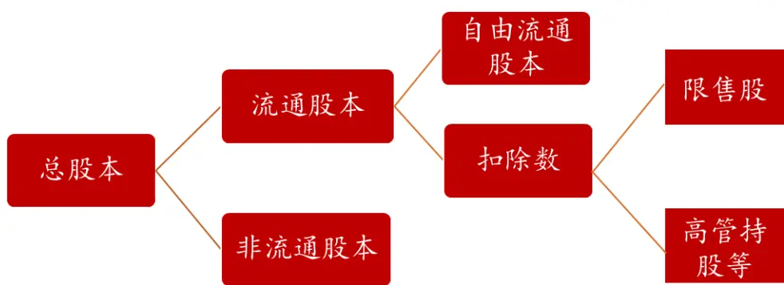
数据来源：财通证券研究所

最后我们介绍自由流通股本的概念。前面提到，将公司总股本减去非流通股本即为公司流通股，理论上来讲所有的流通股都能够在二级市场上进行交易。然而实际上，很多持股超过一定比例的大股东及其一致行动人、公司高管等由于其战略部署等原因，不会在二级市场上进行频繁操作，因此这部分股票并不属于市场上个人或机构投资者可以直接交易的股票，自由流通股本即为将流通股本减去这些扣除数得到的股本数量。我们参照 Wind 中自由流通股本的计算方法，对其进行介绍：

$$
\textcircled{\sharp}\frac{\dot{\pi}}{2\pi}\frac{\dot{\pi}}{12}\mathbb{R}\frac{\dot{\pi}}{2}\mathbb{R}\frac{\dot{\pi}}{2}\mathbb{R}=\frac{\dot{\pi}}{2\pi}\frac{\dot{\pi}}{12}\mathbb{R}\frac{\dot{\pi}}{2}\mathbb{R}-\frac{\ddagger}{2}\mathbb{R}\mathbb{L}\frac{\dot{\pi}}{2}\mathbb{\alpha}\mathbb{R}\frac{\dot{\pi}}{2}\mathbb{R}
$$

其他扣除数主要包括：

1）持股比例>=5%的大股东持有的流通股份；

2）持股比例<5%的股东持有的流通股份，考虑一致行动人（即和持股>=5%股东有关联关系或虽然持股<5%，但关联方累计>=5%）

3）前 10 大股东或前 10 大流通股东中公布的高管持股数，一般全流通情况下扣除 75%（因为公司法规定高管每年实际可流通的不超过其持股数的25%，其他情况视上市公司具体公布情况）。

## 1.3 总市值、流通市值和自由流通市值

在明晰了股本结构的概念区别后，我们即可开始讨论总市值、流通市值和自由流通市值的异同了。事实上三者的区别即为股本计算方法的区别，分别对应总股本、流通股本和自由流通股本三种，我们以 Wind 中提供的市值计算方法为例对此进行说明。

Wind 中提供了三种总市值数据计算方法，其名称和对应的 MATLAB API 接口函数名分别为：总市值 1（ev）、总市值 2（mkt_cap_ard）和总市值证监会算法（mkt_cap_CSRC）。具体来讲：

（1） 总市值 1（ev）：表示上市公司的股权公平市场价值。对于一家多地上市公司，区分不同类型的股份价格和股份数量分别计算类别市值，然后加总。

总市值1 =A股收盘价*A股合计+B股收盘价*B股合计*人民币外汇牌价+H 股收盘价*H 股合计*人民币外汇牌价＋海外上市股收盘价*海外上市股合计*人民币外汇牌价

（2） 总市值 2（mkt_cap_ard）：是将指定证券价格乘以指定日总股本来计算上市公司在该市场的估值。该总市值为 Wind 中计算 PE、PB 等估值指标的基础指标。

总市值 2= 个股当日股价 * 当日总股本

（3） 总市值证监会算法（mkt_cap_CSRC）：是公司在中国大陆已发行普通股的总市值，是证监会、上交所、深交所统计内地证券市场总流通市值时采用的算法。

总市值证监会算法 = A股收盘价*（总股数-H股-海外上市股-B股）+B股收盘价*人民币外汇牌价*B股合计

可以看到，如果一家公司在多地上市，那么总市值 1（ev）的计算将不同地区的股份数量与对应货币的交易价格相乘，并按照当日外汇牌价转换为人民币计价，是最为合理的计算方法。总市值证监会算法（mkt_cap_CSRC）统计的则是公司在境内的总市值（包含 A 股和 B 股市值，不含 H 股及海外股）。总市值 2

（mkt_cap_ard）则直接将公司总股本（包含 A股和 B股等）与当日 A股股价相乘，其中隐含了不同市场的交易价格经过汇率转换后与 A 股价格保持一致的无套利条件，是相对粗糙的市值计算方法。然而，Wind 中在计算 PB、PE 等估值因子时，是以总市值 2（mkt_cap_ard）为依据的，因此财通金工提醒研究者注意在使用第三方数据提供商的衍生数据时，仍需保持一定的警惕性。

除总市值外，流通市值（mkt_cap_float）是指在某特定时间内当时可交易的流通股股数乘以当时股价得到的流通股票总价值（含限售流通股）。而自由流通市值（mkt_freeshares）即为该只股票的自由流通股本与当日股价的乘积，公司的自由流通股本的计算方法可参见上一节的说明。此外，Wind 中还提供了 A股市值-含限售股（mkt_cap_ashare2）、A 股市值-不含限售股（mkt_cap_ashare）等多种数据计算方法，表 3 对各种市值计算的方法进行了总结，财通金工特别提醒投资者注意这些市值概念在具体使用上的区别。

表 3：不同市值计算方法比较

| 指标名称 | 指标代码 | 指标说明 |
| --- | --- | --- |
| 总市值1 | ev | 多地交易价格与股本乘积，按人民币汇率转换 |
| 总市值2 | mkt_cap_ard | 人民币交易价格与全部股本乘积 |
| 总市值-证监会算法 | mkt_cap_CSRC | A、B股交易价格与股本成绩，按人民币汇率转换 |
| 流通市值（含限售股） | mkt_cap_float | 1 |
| 自由流通市值 | mkt_freeshares | 流通股减去扣除数，乘以当日交易价格 |
| A 股市值（含限售股） | mkt_cap_ashare2 | / |
| A 股市值（不含限售股） | mkt_cap_ashare | / |

数据来源：财通证券研究所，Wind

图 4：A 股总市值分布直方图（2019.3.6）
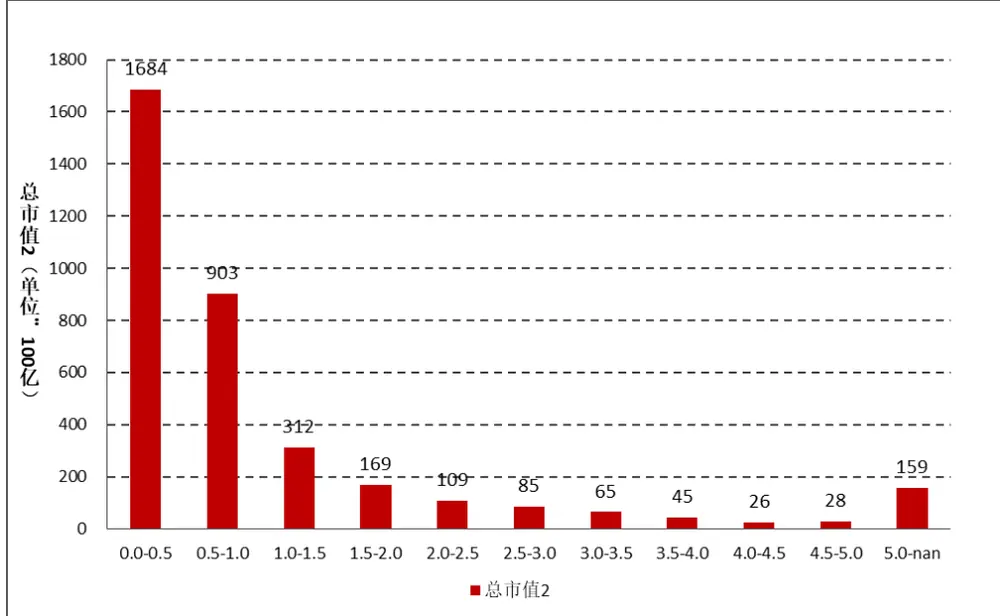
数据来源：财通证券研究所，Wind

图 4 统计了 2019 年 3 月 6 日全市场所有 A股的总市值分布情况。其中，A股中总市值最大的公司为工商银行（601398.SH），其总市值达到 20850 亿；总市值最小的公司为金亚科技（300028.SZ），其总市值仅为 2.65 亿元；A股总市值的平均值为 173 亿，中位数为 53 亿元。从 A股总市值分布的直方图可以看到，总市值达到 500 亿以上的公司有 159 家（我们将这部分公司认为是大市值公司），将近一半的公司市值落在了 50 亿元以下，超过 70%公司市值小于 100 亿。由此我们可以得出结论：A股市场上绝大多数的公司属于小市值公司，市值分布呈现出明显的右偏分布。

图 5：A 股市场自由流通市值分布直方图（2019.3.6）
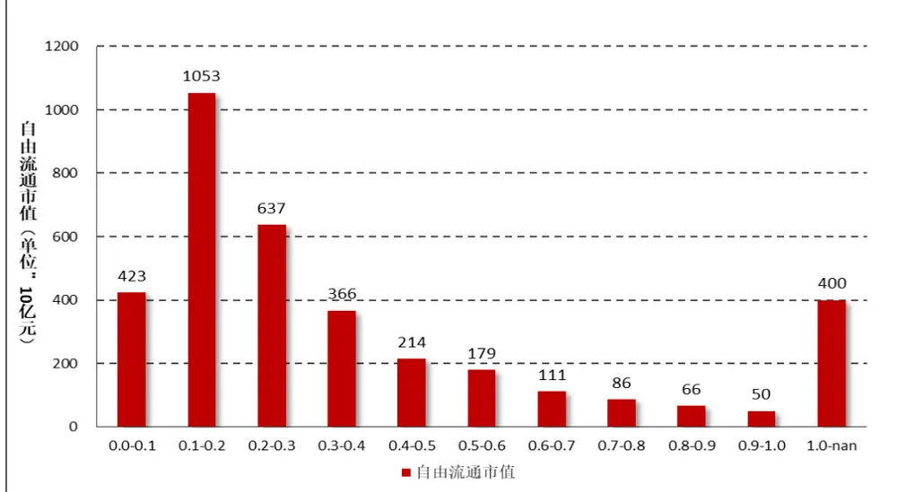
数据来源：财通证券研究所，Wind

图 5 对 A 股市场自由流通市值的分布情况进行了统计，可以看到，其分布情况与总市值的分布存在明显的区别。经统计，A股自由流通市值最大的公司为中国平安（601318.SH），最小的公司为金亚科技（300028.SZ），其平均值为 62亿，中位数为 24 亿。值得注意的是，在 A股中总市值最大的和自由流通市值最大的分别为工商银行和中国平安，二者并不一致。这一点可以在指数成分股权重中直接体现，在 2019 年2 月 27 日公布的沪深 300 指数权重中，中国平安的权重达到 6.61%，而工商银行的权重仅为 1.09%，关于指数权重的计算我们将在后续章节讨论。

图 6：A 股自由流通市值占总市值比例直方图（2019.3.6）
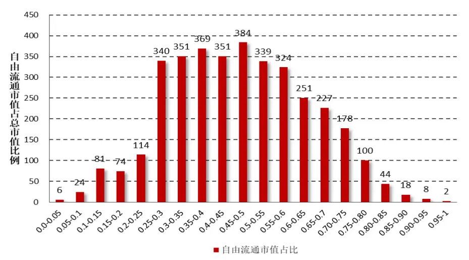
数据来源：财通证券研究所，Wind

图 6 统计了全部 A 股的自由流通市值占其总市值的比例情况，可以看到，超过 90%股票的占比在 20%-80%之间，较少股票的自由流通市值达到总市值的80%以上，由此可见如果我们直接用自由流通市值代替总市值，在研究过程中将会造成非常大的误差。

前面提到，由于 A 股公司的市值存在非常明显的右偏分布，绝大部分的公司都可以划分为小市值公司，而我们在进行数据标准化处理时，通常需要加入原数据服从正态分布的假设，因此在研究中最常用的做法就是对市值取对数。图7 展示了 A股市场自由流通市值对数分布直方图，可以看到进行对数化处理后的数据更接近于正态分布，因此对其进行异常值和标准化的处理就更为合理了。

图 7：A 股市场自由流通市值对数分布直方图（2019.3.6）
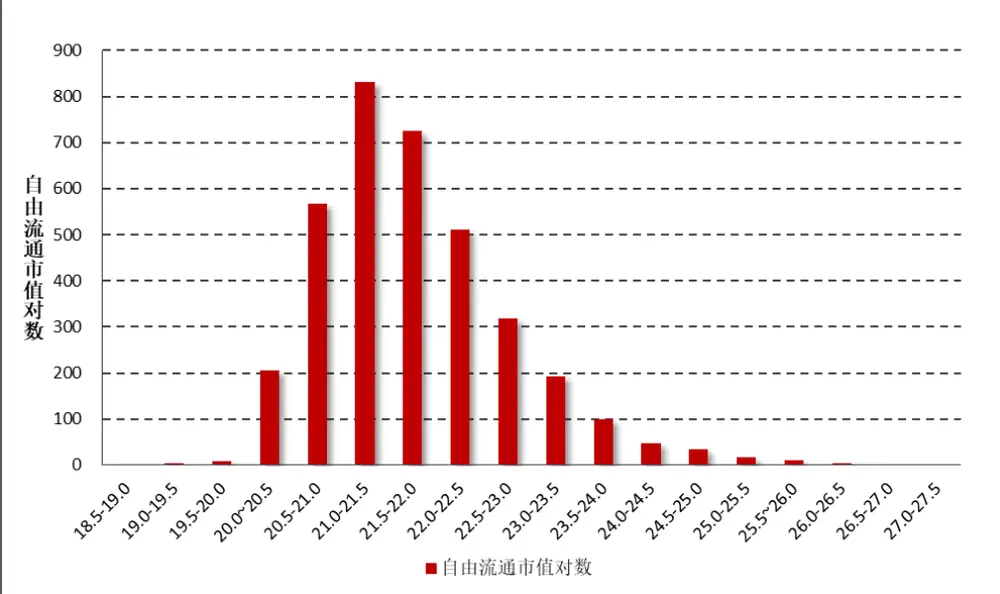
数据来源：财通证券研究所，Wind

接下来我们简单讨论当上市公司通过合法手段进行市值管理的时候，可能导致公司的股本结构和市值发生一定的变化。由图 2 可以看到，当公司进行增发或送转操作时，公司的总股本将会增多；当公司进行回购时，公司总股本将会减少；当公司限改限售股上市或者高管股份变动时，总股本不变，而流通股本会出现相应的变化。表 4 对主要的市值管理操作对总股本和流通股的影响进行了总结。

表 4：公司市值管理操作对股本结构影响

| 具体操作 | 对总股本影响 | 对流通股影响 |
| --- | --- | --- |
| 增发 | 增加 | 1 |
| 送转 | 增加 | 1 |
| 回购 | 减少 | 减少 |
| 限改限售股上市 | 不变 | 增加 |
| 高管股份变动 | 不变 | 相应方向变动 |

数据来源：财通证券研究所

另外，在多因子模型中，如果估值、盈利因子的计算是以总市值为基准的，那么我们建议市值因子也以总市值为基准。而对于换手率而言，由于非流通的股本不能进行交易，因此财通金工建议使用自由流通换手率数据。

## 1.4 指数权重

本次讨论最后一个部分我们聚焦指数编制过程中成分股权重的计算，通常指数成分股权重有等权、市值加权、波动率加权等不同方法，我们接触的最多的是根据市值加权编制的指数。以沪深300（000300.SH）为例，它是由沪深A股中规模大、流动性好的最具代表性的300只股票组成，其编制方法采用派许加权综合价格指数公式进行计算：

$$
4\textcircled{2}\frac{4}{5}+\frac{4}{5}\textcircled{1}\frac{4}{5}\frac{3}{5}=\frac{\frac{3}{7}\times\frac{4}{5}\textcircled{1}\frac{4}{5}-\frac{3}{7}\times\frac{2}{7}\times\frac{2}{7}\times\frac{3}{7}\times\frac{4}{15}\times\frac{3}{15}\times\frac{4}{15}}{\textcircled{1}\frac{4}{5}\times\frac{5}{7}}\times1000{\textcircled{1}\frac{5}{7}\frac{3}{5}\times\frac{5}{7}}.
$$

其中，调整市值 = ∑(股价 ×调整股本数)。调整股本数根据分级靠档的方法对样本股股本进行调整而获得，要计算调整股本数，需要确定自由流通量和分级靠档两个因素，具体来讲：

自由流通量是指在剔除上市公司股本中的限售股份以及由于战略持股或其他原因导致的基本不流通股份，剩下的股本即为自由流通股本。这里的其他股份包括：

（1） 公司创建者、家族、高级管理者等长期持有的股份

（2）国有股份

（3）战略投资者持有的股份

（4）员工持股计划。

上市公司公告明确的限售股份和上述四类股东及其一致行动人持股达到或超过5%的股份，被视为非自由流通股本。

分级靠档是根据自由流通股本所占 股总股本的比例（即自由流通比例）赋予A股总股本一定的加权比例，以确保计算指数的股本保持相对稳定，沪深300指数样本的加权比例依据表 确定。

$$
\sharp\sharp\dot{\lambda}_{n}^{\pm}\dot{\lambda}_{\sharp}^{\sharp}\rVert_{L^{\angle}(\mathcal{H})}=\sharp\sharp\sharp\dot{\lambda}_{n}^{\sharp}\dot{\lambda}_{\sharp}^{\sharp}\rVert_{L^{\angle}(\mathcal{A})\mathcal{Z}_{\epsilon}}^{\varphi}/\hbar\mathtt{H}_{\lambda}^{\mu},\dot{\Xi}_{\lambda}^{\sharp}\rVert_{\mathcal{X}_{\epsilon}}^{\mu}
$$

$$
1)12\leq x+1\leq1\leq x+1\leq1\leq x+1\leq1\leq x+1\leq1\leq x+1\leq1\leq1\leq1
$$

表5：沪深300指数分级靠档表

| 自由流通比例（%） | ≤15 | (15,20] | (20,30] | (30,40] | (40,50] | (50,60] | (60,70] | (70,80] | >80 |
| --- | --- | --- | --- | --- | --- | --- | --- | --- | --- |
| 加权比例（%） | 上调至最接近的整数值 | 20 | 30 | 40 | 50 | 60 | 70 | 80 | 100 |

数据来源：财通证券研究所，中证指数公司

在单因子测试的过程中，为了研究的简便性，我们通常会自行编制市值加权指数，而不再进行分级靠档的处理。而在多因子模型的收益归因系统中，加入截距项的模型的截距项因子收益即为市场指数的收益，因此在该模型中究竟采用何种市值作为每只股票的权重也是至关重要的。

由中证指数公司给出的指数编制方法可知，采用自由流通市值加权计算得到的成分股权重与指数公司公布的官方权重最为接近，下面我们对此进行验证。

图8到图10分别展示了中证指数公司公布的2019年2月27日中证500指数成分股的权重，与我们自行计算的总市值加权、流通市值加权和分级靠档加权权重的对比。可以看到，总市值加权与指数的实际权重之间的误差非常大，而采用流通市值加权和分级靠档加权的误差则相对较小。

图8：实际权重VS总市值加权
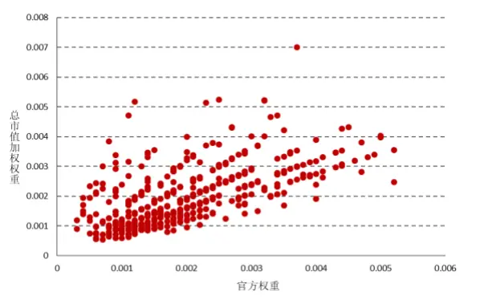
数据来源：财通证券研究所，Wind，中证指数公司

图9：实际权重VS流通市值加权
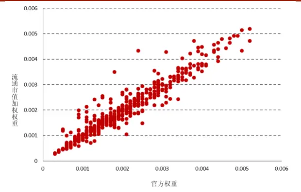
数据来源：财通证券研究所，Wind，中证指数公司

图10：实际权重VS分级靠档加权
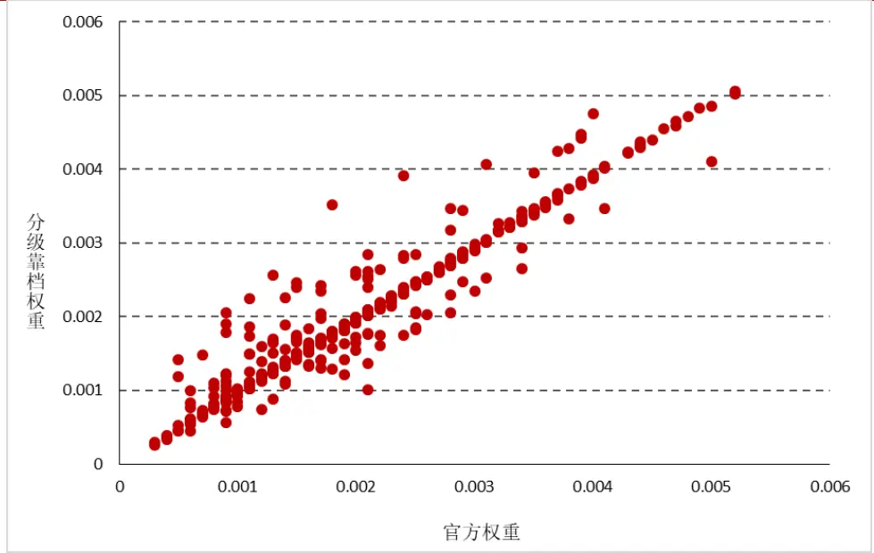
数据来源：财通证券研究所，Wind，中证指数公司

表6以沪深300和中证500指数为例，分别计算三种加权方法与官方公布权重的误差平方和。

$$
SquaredError=\sum_{i=1}^{N}\left(w_{i}-w_{i,B}\right)^{2}
$$

其中， $w_{i}\kslash^{\ =}w_{i,B}$ 分别表示自行计算和官方公布的股票i的权重。

表6：不同加权方法的误差平方和

| 指数名称 | 总市值加权 | 自由流通市值加权 | 分级靠档加权 |
| --- | --- | --- | --- |
| 沪深300 | 0.0097 | 0.000197 | 0.000147 |
| 中证500 | 0.000359 | 0.000046 | 0.000039 |

数据来源：财通证券研究所，Wind，中证指数公司

## 1.5 小结

本文从股本概念入手，就最常见的总市值、流通市值、自由流通市值的概念区别及其使用细节展开探讨，介绍不同市值计算方法的区别，并讨论在因子计算及指数构建中，使用何种市值数据更为合理，主要结论如下：

（1） 总股本可以划分为流通股本和非流通股本，流通股本中又可分为自由流通股本、限售股和其他由于战略原因持有的股份；

（2）Wind中提供了3种总市值的计算方法，分别服务于不同的计算目的。特别的，财通金工提醒研究者注意在使用第三方数据提供商的衍生数据时，仍需保持一定的警惕性；

（3） 从A股市值分布来看，绝大多数公司属于小市值公司，市值分布呈现出明显的右偏分布。总市值与自由流通市值之间差别极大，若简单混淆二者概念将会造成较大的误差。对市值数据取对数处理能够使得数据分布更接近于正态分布；

（4） 公司增发、送转、回购等操作会改变总股本数量，而限售股上市、公司高管持股变动则仅对流通股产生影响；

（5） 在多因子模型中，若估值、盈利因子计算时以总市值为基准，那么财通金工建议市值数据也采用总市值。而对于换手率的计算，由于非流通股本无法进行交易，因此我们认为采用自由流通换手率更为合理。

（6） 在指数编制过程中，采用总市值加权与官方公布的权重相比误差较大，采用自由流通市值加权和分级靠档加权与官方公布的权重更为接近，是财通金工更为推荐的方法。

## 2、 一周行情回顾

上周 A 股市场风险出现一定程度的释放，两篇券商做空报告给市场的狂热情绪降温，最后一个交易日出现较大跌幅。就主要指数层面来看，在大盘价值股出现明显下跌的时候，小盘股仍然持续走强。上周创业板指和创业板综分别上涨5.52%和 5.23%，在所有样本指数中排名前二，而以大盘价值为代表的 180 价值指数和上证 50 指数分别录得-4.21%%和-4.75%的收益，大小盘风格在市场情绪谨慎的行情下分化较为明显。

图11：上周主要指数收益（2019.3.1-2019.3.8）
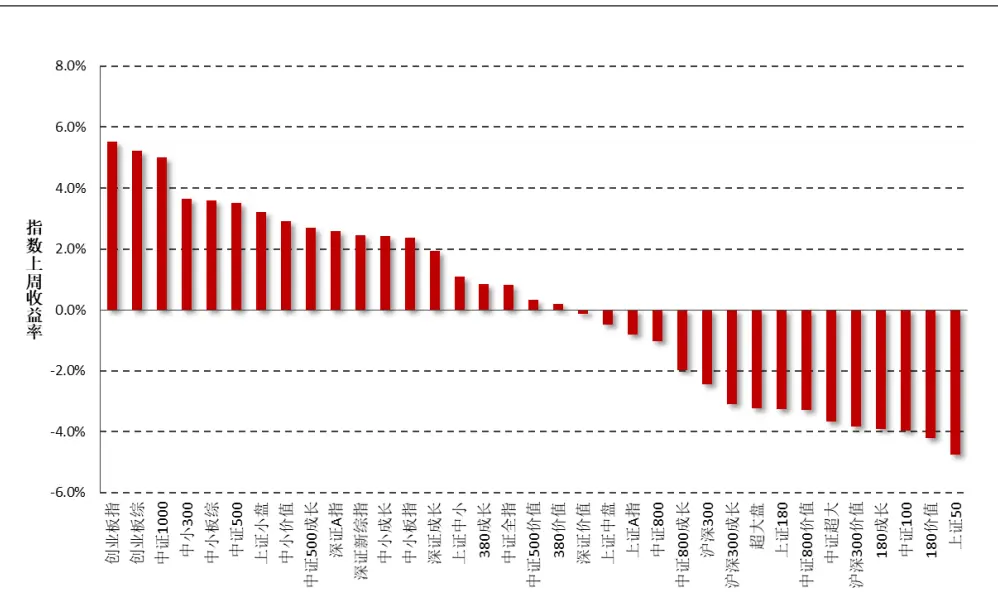
数据来源：财通证券研究所，Wind

行业方面，在所有 29 个中信一级行业中，计算机和农林牧渔行业分别大涨12.36%和 12.26%，而银行业和食品饮料行业分别收于-4.74%和-4.32%收益，排名垫底。

图12：上周中信一级行业指数收益（2019.3.1-2019.3.8）
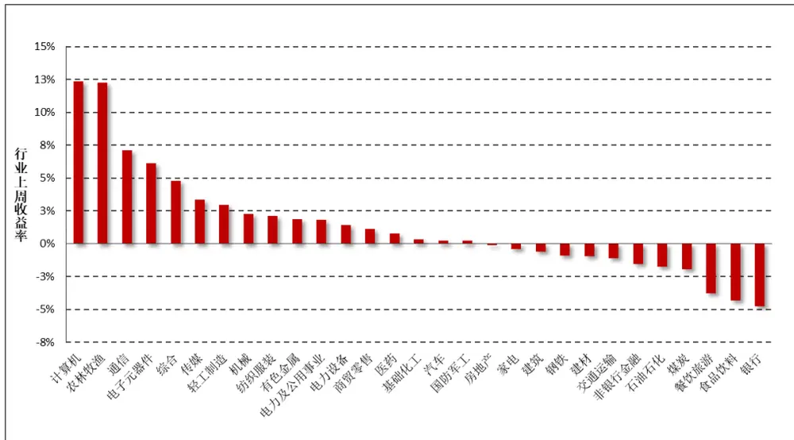
数据来源：财通证券研究所，Wind

## 3、 市场风格解析及指数风险预测

财通金工借鉴 Barra 模型，选取 Beta、规模、动量、波动率、非线性规模、、流动性、盈利、成长和杠杆率因子构建收益 风险归因模型，因子定义及计算细节参见附录二。本部分通过对近期风格因子的收益表现进行分析以期捕捉 A股市场的风格变化，同时对财通金工样本指数的未来一月风险进行预测来分析当前 A 股市场所处的风险水平。风格因子的收益拆解可参见财通金工专题报告《Barra 模型初探：A股市场风格解析》，资产组合的风险预测可参见财通金工专题报告《Barra 模型进阶：多因子模型风险预测》。

## 3.1 市场风格解析

各类风格因子在上周的累计收益可分为日度累计收益和周度收益两种，日度累计收益是根据风格因子的日度收益计算得到，周度收益是将股票在本周的收益率对股票在上周最后一个交易日的因子暴露度进行回归得到的因子纯净收益，二者之间的区别在于换仓频率的不同，前者为每日换仓，而后者在每周最后一个交易日换仓。

表 7 和图 13 展示了上周各类风格因子的累计收益和周度收益大小，可以看到，二者十分近似。在中小盘走势明显占优的上周，规模因子、盈利因子均取得较大的负收益，波动率因子和非线性规模因子的正收益更强。

表7：上周纯风格因子收益（2019.3.1-2019.3.8）

| 日期 | Beta | 规模 | 长期动量 | 波动率 | 非线性规模 | BP | 流动性 | 盈利 | 成长 | 杠杆 |
| --- | --- | --- | --- | --- | --- | --- | --- | --- | --- | --- |
| 2019/3/4 | 0.13% | 0.06% | 0.03% | 0.41% | 0.15% | 0.08% | 0.09% | -0.14% | -0.08% | 0.09% |
| 2019/3/5 | 0.49% | -0.33% | -0.14% | 0.39% | 0.16% | 0.32% | -0.04% | -0.21% | -0.07% | 0.18% |
| 2019/3/6 | -0.02% | -0.33% | -0.56% | 0.21% | 0.09% | 0.25% | 0.09% | -0.17% | -0.09% | 0.12% |
| 2019/3/7 | 0.00% | -0.69% | -0.37% | 0.10% | 0.27% | 0.37% | 0.12% | -0.35% | -0.26% | 0.04% |
| 2019/3/8 | -0.14% | 0.42% | 0.39% | -0.18% | 0.08% | -0.42% | -0.40% | -0.06% | 0.00% | -0.17% |
| 上周累计收益 | 0.47% | -0.87% | -0.64% | 0.93% | 0.74% | 0.60% | -0.14% | -0.91% | -0.50% | 0.27% |
| 周度收益 | 0.02% | -0.96% | -0.59% | 0.52% | 0.70% | 0.63% | 0.29% | -0.92% | -0.57% | 0.32% |
| 前一周度收益 | 0.44% | 0.06% | -0.67% | -0.16% | 0.13% | 0.10% | -0.01% | -0.20% | 0.11% | 0.46% |

数据来源：财通证券研究所，Wind

图 13：近两周纯风格因子收益比较（2019.2.22-2019.3.8）
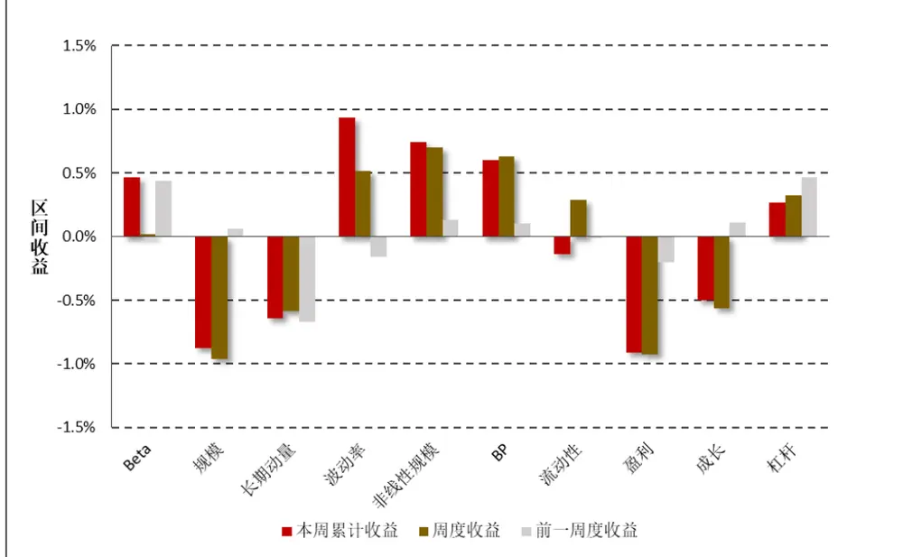
数据来源：财通证券研究所

图14：最近一个月风格因子净值走势（2019.1.30-2019.3.8）
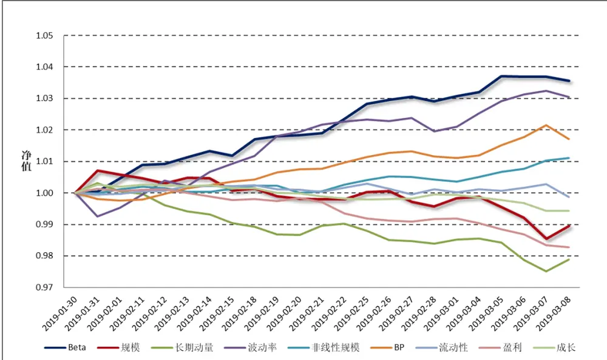
数据来源：财通证券研究所，Wind

图 和图 分别展示了最近一个月各类风格因子的净值走势及累计收益，以观察各类风格因子在过去一段时间的持续盈利能力。整体来讲，在过去的一个月中，高 Beta、高波动的股票能够获得相对较高的收益，而大规模、前期涨幅过高的股票后市将会出现较为明显的回撤。

图15：最近一个月风格因子累计收益（2019.1.30-2019.3.8）
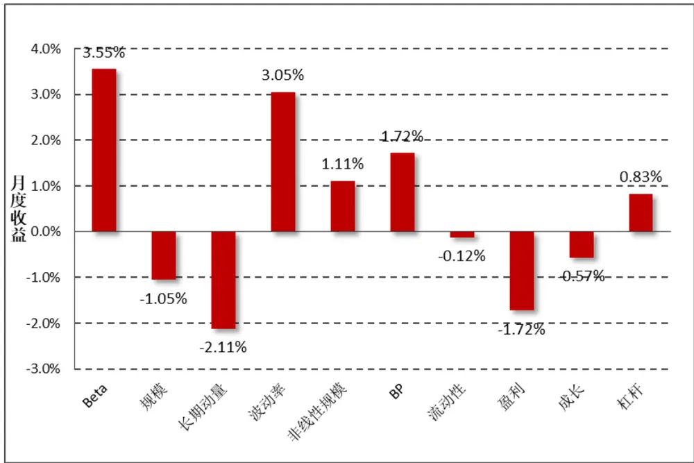
数据来源：财通证券研究所，Wind

## 3.2 指数风险预测

对收益的分解仅代表过去，对风险的预测才代表未来。多因子模型风险预测将股票风险拆解为共同风险和特质风险两部分，在通过稳健调整对共同风险矩阵和特质风险矩阵进行估计后，即可根据指数的成分股权重来估计指数在未来一段时间的波动情况。为了保证结果的严谨性，此处我们直接采用 Wind 提供的成分股权重数据，而非根据自由流通市值计算得到，尽管二者的结果十分类似。

$$
Risk(P)=W^{\prime}VW=W^{\prime}(X^{\prime}FX+\Delta)W
$$

图 16 展示了财通金工样本指数在未来一个月的预测波动率，为了方便展示我们将估计的月度波动率进行年化，波动的预测时间为上周最后一个交易日（2019.3.1）。可以看到，所有样本指数未来一月的年化波动区间在 21%-30%之间，预测波动相较上一周继续明显攀升，财通金工特别提醒投资者注意当前市场波动情况，对后市维持谨慎乐观态度。中小板股票、成长类指数的风险较大，而偏大盘股票、价值类股票的风险普遍较小。

图16：财通金工样本指数未来一月波动预测（年化）（2019.3.8-2019.4.5）
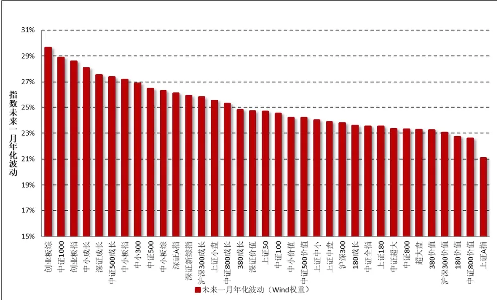
数据来源：财通证券研究所，Wind

由于在计算股票的风格因子时，我们会对暂停上市的股票、大类因子值存在缺失的股票进行剔除，因此在进行收益归因和风险预测时，并非所有指数成分股都纳入到了模型中，如果缺失股票个数过多或者缺失股票的权重占比过大，将会对模型结果造成较大影响。图 17 展示了各大指数在模型拟合过程中，纳入考虑的股票个数（权重）占指数成分股个数（权重）的比例，可以看到所有指数的比例均在 93%以上，数据质量的拟合较为合意。

图17：收益回归/风险预测样本股票占指数成分股比率
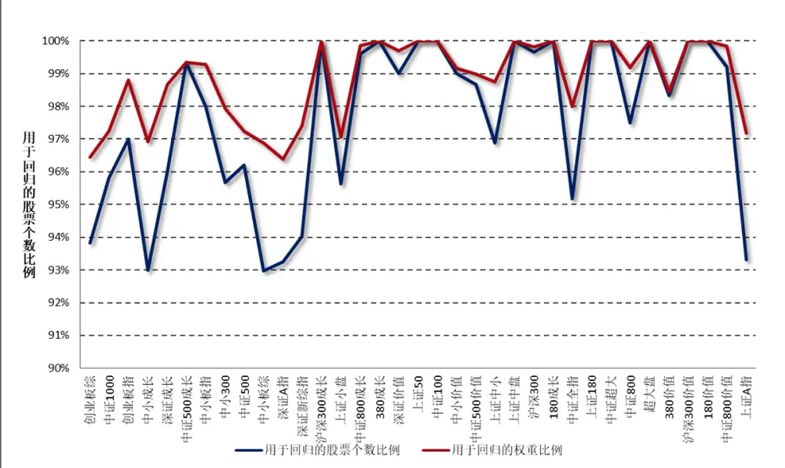
数据来源：财通证券研究所，Wind

## 4、 指数成分收益归因：

本部分财通金工对上周表现最好的三只指数和表现最差的三只指数进行归因分析，以观察涨幅较高（或较低）的指数风险暴露是否展现出较高的趋同性以及两类指数的持股风格是否会表现出明显的差别，其结果如图 18 和图 19 所示。

图18：上周表现最好三指数因子暴露度
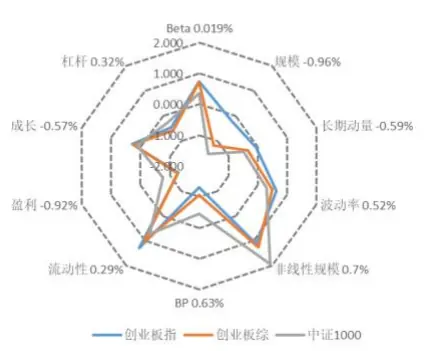
数据来源：财通证券研究所，Wind

图19：上周表现最差三指数因子暴露度
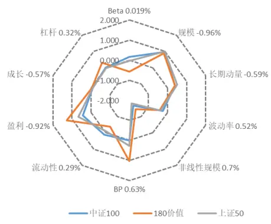
数据来源：财通证券研究所，Wind

表 8 展示了各大指数上周在各类因子上的暴露程度，可以看到，上周市场风格分化明显，以中小盘为代表的创业板指、创业板综和中证 100指数的涨幅最高，三者在流动性、非线性规模和波动率上的暴露较大，而在规模因子上的暴露较小。而以大盘价值为代表的中证 100、180价值和上证 50指数，由于其在规模、盈利等因子上的较高暴露，拖累指数走势。

表8：指数在风格因子上的暴露程度（2019.3.8）

| 代码 指数名称 |  | Beta 0.019% | 规模 -0.96% 长 | 期动量-0.波 | 动率 0.529非 | 线性规模C | BP 0.63% | 流动性 0.29 | 9 盈利 -0.92 | % 成长 -0.57% | 杠杆 0.32% | 实际收益 |
| --- | --- | --- | --- | --- | --- | --- | --- | --- | --- | --- | --- | --- |
| 399006.SZ 创业板指 |  | 0.744 | -0.212 | -0.062 | 0.630 | 1.123 | -1.303 | 1.291 | -1.280 | 0.290 | -0.444 | 5.52% |
| 399102.SZ 创业板综 |  | 0.713 | -1.191 | -0.344 | 0.477 | 1.249 | -1.063 | 1.034 | -1.254 | 0.224 | -0.557 | 5.23% |
| 000852.SH 中证1000 |  | 0.345 | -1.519 | -0.487 | 0.288 | 1.917 | -0.457 | 0.728 | -0.768 | 0.127 | -0.250 | 5.01% |
| 399008.SZ 中小300 |  | 0.658 | -0.330 | -0.405 | 0.419 | 1.237 | -0.878 | 0.897 | -0.806 | 0.102 | -0.294 | 3.64% |
| 399101.SZ | 中小板综 | 0.414 | -0.742 | -0.406 | 0.430 | 1.143 | -0.757 | 0.647 | -0.840 | 0.070 | -0.370 | 3.60% |
| 000905.SH | 中证500 | 0.368 | -0.794 | -0.385 | 0.042 | 2.109 | -0.189 | 0.574 | -0.415 | -0.010 | 0.072 | 3.52% |
| 000045.SH | 上证小盘 | 0.201 | -0.762 | -0.371 | -0.018 | 1.999 | -0.003 | 0.448 | -0.237 | 0.008 | 0.160 | 3.22% |
| 399604.SZ | 中小价值 | 0.310 | -0.392 | -0.214 | 0.165 | 1.271 | -0.355 | 0.540 | -0.099 | -0.042 | -0.141 | 2.91% |
| H30351.CSI | 中证500成长 | 0.631 | -0.711 | -0.500 | 0.129 | 2.105 | -0.385 | 0.891 | -0.117 | 0.129 | 0.081 | 2.69% |
| 399107.SZ | 深证A指 | 0.489 | -0.627 | -0.269 | 0.348 | 0.900 | -0.663 | 0.830 | -0.701 | 0.126 | -0.241 | 2.59% |
| 399100.SZ | 深证新综指 | 0.510 | -0.614 | -0.303 | 0.252 | 0.901 | -0.607 | 0.686 | -0.620 | 0.074 | -0.196 | 2.46% |
| 399602.SZ | 中小成长 | 0.853 | -0.039 | -0.531 | 0.593 | 0.825 | -1.006 | 1.031 | -0.704 | 0.082 | -0.209 | 2.41% |
| 399005.SZ | 中小板指 | 0.878 | 0.157 | -0.389 | 0.420 | 0.768 | -1.031 | 0.972 | -0.783 | 0.120 | -0.285 | 2.38% |
| 399346.SZ | 深证成长 | 0.960 | 0.289 | -0.166 | 0.420 | 0.144 | -1.061 | 1.135 | -0.723 | 0.143 | -0.010 | 1.94% |
| 000046.SH | 上证中小 | 0.164 | -0.064 | -0.117 | 0.028 | 1.050 | -0.090 | 0.434 | -0.167 | -0.118 | 0.155 | 1.09% |
| 000117.SH | 380成长 | 0.331 | -0.772 | -0.295 | 0.035 | 1.962 | -0.549 | 0.695 | 0.083 | 0.150 | -0.014 | 0.84% |
| 000985.CSI | 中证全指 | 0.261 | -0.252 | -0.082 | 0.047 | 0.360 | -0.251 | 0.459 | -0.225 | -0.011 | -0.075 | 0.81% |
| H30352.CSI | 中证500价值 | 0.005 | -0.790 | -0.253 | -0.483 | 2.146 | 0.657 | 0.220 | 0.574 | -0.010 | 0.390 | 0.32% |
| 000118.SH | 380价值 | -0.241 | -0.881 | -0.213 | -0.338 | 2.035 | 0.659 | 0.029 | 0.752 | 0.008 | 0.463 | 0.18% |
| 399348.SZ | 深证价值 | 0.463 | 0.454 | 0.062 | -0.096 | -0.251 | -0.302 | 0.680 | 0.293 | 0.039 | 0.235 | -0.13% |
| 000044.SH | 上证中盘 | 0.136 | 0.444 | 0.068 | 0.061 | 0.359 | -0.153 | 0.424 | -0.115 | -0.209 | 0.151 | -0.49% |
| 000002.SH | 上证A指 | -0.208 | 0.261 | 0.105 | -0.081 | -0.369 | 0.229 | -0.162 | 0.235 | -0.023 | 0.070 | -0.81% |
| 000906.SH | 中证800 | 0.285 | 0.376 | 0.078 | -0.077 | -0.118 | -0.147 | 0.378 | 0.030 | -0.048 | 0.034 | -1.03% |
| H30355.CSI | 中证800成长 | 0.662 | 0.433 | 0.135 | -0.021 | -0.197 | -0.826 | 0.731 | 0.060 | 0.110 | -0.009 | -1.99% |
| 000300.SH | 沪深300 | 0.264 | 0.739 | 0.225 | -0.118 | -0.815 | -0.133 | 0.318 | 0.169 | -0.062 | 0.020 | -2.46% |
| 000918.SH | 沪深300成长 | 0.588 | 0.738 | 0.309 | -0.072 | -0.764 | -0.918 | 0.629 | 0.128 | 0.074 | -0.078 | -3.09% |
| 000043.SH | 超大盘 | -0.035 | 0.998 | 0.109 | -0.207 | -1.913 | 0.118 | 0.053 | 0.446 | -0.062 | -0.097 | -3.23% |
| 000010.SH | 上证180 | 0.028 | 0.797 | 0.355 | -0.218 | -1.047 | 0.119 | 0.106 | 0.386 | -0.128 | 0.035 | -3.25% |
| H30356.CSI | 中证800价值 | -0.157 | 0.633 | 0.263 | -0.381 | -0.772 | 0.599 | -0.036 | 0.977 | -0.048 | 0.424 | -3.30% |
| 000980.CSI | 中证超大 | -0.036 | 0.998 | 0.157 | -0.190 | -1.887 | 0.218 | -0.108 | 0.498 | -0.002 | 0.052 | -3.68% |
| 000919.CSI | 沪深300价值 | -0.384 | 0.858 | 0.394 | -0.394 | -1.263 | 0.759 | -0.196 | 1.186 | -0.010 | 0.421 | -3.82% |
| 000028.SH | 180成长 | 0.029 | 0.839 | 0.499 | -0.073 | -1.175 | -0.335 | 0.190 | 0.313 | 0.046 | -0.008 | -3.91% |
| 000903.SH | 中证100 | 0.168 | 0.978 | 0.376 | -0.252 | -1.668 | 0.008 | 0.122 | 0.433 | -0.085 | 0.012 | -3.97% |
| 000029.SH | 180价值 | -0.573 | 0.897 | 0.395 | -0.409 | -1.461 | 1.018 | -0.369 | 1.268 | -0.042 | 0.313 | -4.21% |
| 000016.SH | 上证50 | -0.031 | 0.991 | 0.512 | -0.371 | -1.820 | 0.269 | -0.069 | 0.661 | -0.083 | -0.028 | -4.75% |

数据来源：财通证券研究所，Wind

注：实习生上海财经大学伊兴龙参与本课题，为本报告作出重要贡献。

## 5、 附录

| 附录一：财通金工指数池选取 |  |  |  |  |  |
| --- | --- | --- | --- | --- | --- |
| 上证规模/风格指数 |  | 深证综合/规模指数 |  | 中证规模/风格指数 |  |
| 000001.SH | 上证综指 | 399101.SZ | 中小板综 | 000300.SH | 沪深300 |
| 000002.SH | 上证A指 | 399102.SZ | 创业板棕 | 000852.SH | 中证 1000 |
| 000010.SH | 上证 180 | 399106.SZ | 深证综指 | 000985.CSI | 中证全指 |
| 000016.SH | 上证50 | 399107.SZ | 深证 A 指 | 000980.CSI | 中证超大 |
| 000043.SH | 超大盘 | 399005.SZ | 中小板指 | 000903.SH | 中证100 |
| 000044.SH | 上证中盘 | 399006.SZ | 创业板指 | 000905.SH | 中证500 |
| 000045.SH | 上证小盘 | 399008.SZ | 中小300 | 000906.SH | 中证 800 |
| 000046.SH | 上证中小 | 399346.SZ | 深证成长 | 000918.SH | 沪深 300 成长 |
| 000028.SH | 180成长 | 399348.SZ | 深证价值 | 000919.SH | 沪深 300 价值 |
| 000029.SH | 180 价值 | 399602.SZ | 中小成长 | H30351.CSI | 中证 500 成长 |
| 000117.SH | 380成长 | 399604.SZ | 中小价值 | H30352.CSI | 中证 500 价值 |
| 000118.SH | 380 价值 |  |  | H30355.CSI | 中证 800 成长 |
|  |  |  |  | H30356.CSI | 中证 800 价值 |

数据来源：财通证券研究所

附录二：财通金工风格因子定义

| 附水一. | 财通金工风 |  |  |  |
| --- | --- | --- | --- | --- |
| 大类因子 | 子类因子 | 因子定义及计算 | 权重 | 备注 |
| Beta | BETA | $\mathrm{r_{t}}=\alpha+\beta\mathrm{R_{t}}+\mathrm{e_{t}},$ 将单只股票过去252天的日度收益率对流通市值加权指数日度收益率进行半衰指数加权回归，半衰期为63天 | 1 | 1)采用流通市值而非总市值加权，因为各大指数编制采用流通市值加权；2) 需要剔除当日停牌或者未上市日期的数据，并将权重进行归一化；3)若满足条件的样本数据少于42天，我们将其 Beta 置为 NaN。 |
| 规模 | SIZE | 股票总市值取对数 | 1 | 由于PB、PE等因子的计算是基于总市值的，因此此处也用总市值 |
| 动量 | RSTR | 过去一段时间个股的累计收益率，不含最近一个月， $\begin{array}{r}{\mathrm{RSTR}=\sum_{\mathrm{t=L}}^{\mathrm{T+L}}\mathbf{w}_{\mathrm{t}}(\ln(1+\mathbf{r}_{\mathrm{t}}),}\end{array}$ $\mathrm{r_{t}=P_{t}/P_{t-1}-1,~T=504,~L=21,}$ 收益率序列采用半衰指数加权，半衰期为126天 | 1 | 1) 对于数据质量较好的个股，计算动量时采用了2年的数据2) 需要剔除未上市日期数据，但无需剔除停牌日期数据，并将权重归一化3)若满足条件的数据样本小于42天，我们将其动量置为NaN |
| 波动率(对Beta因子和市值因子进行正交化处理） | DASTD | 个股相对市值加权指数的超额收益率序列的半衰指数加权标准差，T=252，半衰期为42天1/2 $\mathrm{{DASTD}=\left(\sum_{t=1}^{T}w_{t}\big(r_{t}-\mu(r)\big)^{2}\right)}$ | 0.7 | 12 采用流通市值加权计算指数收益需要剔除当日停牌或者未上市日期的数据，并将权重进行归一化3) 若满足条件的数据样本小于42天，我们将其因子值置为NaN |
|  | CMRA | 表示过去12个月的波动幅度， $\begin{array}{r}{\mathbb{C}\mathbb{M}\mathbb{R}\mathbb{A}=\ln(1+\operatorname*{max}\{\mathrm{Z}(\mathrm{T})\})-\ln(1+}\\{\operatorname*{min}\{\mathrm{Z}(\mathrm{T})),}\end{array}$ $\sharp\Psi\mathrm{Z(T)}=\exp\bigl(\sum_{\mathrm{t=1}}^{\mathrm{T}}\ln(1+\mathrm{r_{t}})\bigr)-1$ ，表示过去T个月的收益率 | 0.15 | 以 21 天为 1 个月 |
|  | HSIGMA | 计算 Beta 时残差的标准差， Hsigma = std(ei) | 0.15 | 同 Beta 因子的计算 |
| 非线性规模 | NonLinerSize | 中市值因子，将股票总市值对数的三次方对总市值对数回归，取残差的相反数 | 1 | 用于衡量市值因子的非线性性，总市值越大和越小的股票的非线性规模越小，中市值股票的非线性规模越大 |
| 估值 | BP | 市净率的倒数，1/PB | 1 | 采用 Wind 中的 pb_lf 因子的倒数 |
| 流动性(对市值因子进行正交化） | STOM | 月度换手率，STOM = In(mean(Σ211(Vt/St)))其中V为当日成交量，S为流通股本 | 0.5 | 1)采用流通股本值，而非自由流通股本值2）剔除未上市、停牌日期的数据 |
|  | STOQ | 季度换手率， $\begin{array}{r}{\mathrm{STOQ}=\ln(\operatorname*{mean}(\sum_{t=1}^{63}(V_{t}/S_{t}))),}\end{array}$ | 0.25 | 同 STOQ 因子的计算 |
|  | STOA | 年度换手率，STOA = In(mean(Σ2=2(Vt/St)))， | 0.25 | 同 STOQ 因子的计算 |
| 盈利 | CETOP | 过去滚动12个月的经营现金流除以当前市值实际计算中取市现率 PCF（经营现金流 TTM）的倒数 | 1/2 | 采用 Wind 中的 PCF_OCF_ttm 因子的倒数 |
|  | ETOP | 过去滚动12个月的利润除以当前市值实际计算中取市盈率 PETTM 的倒数 | 1/2 | 采用 Wind 中的 PE_ttm 因子的倒数 |
| 成长 | YOYProfit | 单季度净利润同比增长率 | 1/2 | 为避免使用未来数据，需要根据季报公布时间进行调整 |
|  | YOYSales | 单季度营业收入同比增长率 | 1/2 | 同 YOYProfit 因子的计算 |
| 杠杆 | MLEV | 市场杠杆率，MLEV=（总市值+非流动负债）/总市值 | 1/3 |  |
|  | DTOA | 资产负债率，DTOA=总资产/总负债 | 1/3 |  |
|  | BLEV | 账面杠杆率，BLEV=（账面价值+非流动负债）/账面价值 | 1/3 |  |

数据来源：财通证券研究所
备注： 波动率因子需对 因子和市值因子进行正交化处理；
2.流动性因子需对市值因子进行正交化处理；
若大类因子下所有子类因子值全部缺失，则该股票的因子值记为缺失，否则用有数据的因子值进行替代，注意需对权重进行归一化处理

## 信息披露

## 分析师承诺

作者具有中国证券业协会授予的证券投资咨询执业资格，并注册为证券分析师，具备专业胜任能力，保证报告所采用的数据均来自合规渠道，分析逻辑基于作者的职业理解。本报告清晰地反映了作者的研究观点，力求独立、客观和公正，结论不受任何第三方的授意或影响，作者也不会因本报告中的具体推荐意见或观点而直接或间接收到任何形式的补偿。

## 资质声明

财通证券股份有限公司具备中国证券监督管理委员会许可的证券投资咨询业务资格。

## 公司评级

买入：我们预计未来 6个月内，个股相对大盘涨幅在 15%以上；

增持：我们预计未来 6个月内，个股相对大盘涨幅介于 5%与 15%之间；

中性：我们预计未来 6个月内，个股相对大盘涨幅介于-5%与 5%之间；

减持：我们预计未来 6个月内，个股相对大盘涨幅介于-5%与-15%之间；

卖出：我们预计未来 6个月内，个股相对大盘涨幅低于-15%。

## 行业评级

增持：我们预计未来 6个月内，行业整体回报高于市场整体水平 5%以上；

中性：我们预计未来 6个月内，行业整体回报介于市场整体水平-5%与5%之间；

减持：我们预计未来 6个月内，行业整体回报低于市场整体水平-5%以下。

## 免责声明

本报告仅供财通证券股份有限公司的客户使用。本公司不会因接收人收到本报告而视其为本公司的当然客户。

本报告的信息来源于已公开的资料，本公司不保证该等信息的准确性、完整性。本报告所载的资料、工具、意见及推测只提供给客户作参考之用，并非作为或被视为出售或购买证券或其他投资标的邀请或向他人作出邀请。

本报告所载的资料、意见及推测仅反映本公司于发布本报告当日的判断，本报告所指的证券或投资标的价格、价值及投资收入可能会波动。在不同时期，本公司可发出与本报告所载资料、意见及推测不一致的报告。

本公司通过信息隔离墙对可能存在利益冲突的业务部门或关联机构之间的信息流动进行控制。因此，客户应注意，在法律许可的情况下，本公司及其所属关联机构可能会持有报告中提到的公司所发行的证券或期权并进行证券或期权交易，也可能为这些公司提供或者争取提供投资银行、财务顾问或者金融产品等相关服务。在法律许可的情况下，本公司的员工可能担任本报告所提到的公司的董事。

本报告中所指的投资及服务可能不适合个别客户，不构成客户私人咨询建议。在任何情况下，本报告中的信息或所表述的意见均不构成对任何人的投资建议。在任何情况下，本公司不对任何人使用本报告中的任何内容所引致的任何损失负任何责任。

本报告仅作为客户作出投资决策和公司投资顾问为客户提供投资建议的参考。客户应当独立作出投资决策，而基于本报告作出任何投资决定或就本报告要求任何解释前应咨询所在证券机构投资顾问和服务人员的意见；

本报告的版权归本公司所有，未经书面许可，任何机构和个人不得以任何形式翻版、复制、发表或引用，或再次分发给任何其他人，或以任何侵犯本公司版权的其他方式使用。