2019 年 03 月 17 日

# 数据异常值处理：比较与实践

## “拾穗”多因子系列报告（第 5 期）

## 联系信息

陶勤英分析师

SAC 证书编号：S0160517100002 021-68592393

taoqy@ctsec.com

张宇联系人

zhangyu1@ctsec.com 021-68592220

176216888421

## 相关报告

【1】“星火”多因子系列（一）：《Barra模型初探：A 股市场风格解析》

【2】“星火”多因子系列（二）：《Barra模型进阶：多因子模型风险预测》

【3】“星火”多因子系列（三）：《Barra模型深化：纯因子组合构建》

【4】“拾穗”多因子系列（一）：《带约束的加权最小二乘：一种解析解法》

【5】“拾穗”多因子系列（二）：《你看到的不一定是你所想的：解密 R 方》

【6】“拾穗”多因子系列（三）：《行业因子选取：中信一级还是申万一级？》

【7】“拾穗”多因子系列（四）：《总市值、流通市值、自由流通市值：谈谈取舍》

## 投资要点：

## 数据异常值处理：比较与实践

- 在进行回归分析或因子相关性分析时，因子暴露的异常值可能会极大影响回归系数和数据的相关系数。

- 常用的异常值处理方法有均值标准差修正法、固定比率修正法、中位数去极值法、Beat G.Briner 方法、因子排序值标准化法、箱形图法和无量纲处理方法，这些方法各有优劣。

- 相较于价量因子，财务数据特别是增长率类数据所含的异常值更多。经实证检验，对于各类数据而言，中位数去极值法和箱形图法是更为稳健的方法。

相较于传统的 OLS 回归法，基于分位数回归的方法更不容易受极端值影响，且能够更为全面地描述被解释变量条件分布的全貌。

## 市场风格解析

整体来讲，在过去的一个月中，高 Beta、高波动的股票能够获得相对较高的收益，而大规模、前期涨幅过高的股票后市走势将会出现更为明显的回撤。

## 指数风险预测

所有样本指数在未来一个月的年化波动区间在 之间，相较上周出现小幅攀升，财通金工特别提醒投资者注意当前市场的波动情况。

## 指数成分收益归因

上周市场风格并不明朗，在表现占优的三只指数中，有以大盘、价值为代表的 380价值指数，也有以中小盘、成长为代表的中证 800指数，而在表现较差的三只指数中，有以大盘为代表的超大盘指数，也有以小盘为代表的创业板指数。

- 风险提示：本报告统计结果基于历史数据，过去数据不代表未来，市场风格变化可能导致模型失效。

在实际投资中，多因子模型被广泛地应用到资产定价、绩效归因、风险控制、组合优化、基金评价及资产配置等各个领域，一套完整、精细的多因子系统成为每位量化研究者必备的工具。“做最实用的研究”，是财通金工给自己的定位。我们将在之后的系列报告中，就投资者们最关心也最容易忽略的很多细节问题进行探讨，介绍我们在实际应用中遇到的问题和思考，以飨读者。

我们为本系列报告取名“拾穗”。一周市场风云变幻，和风细雨也好，狂风骤雨也罢，都留下一地故事等待梳理。作为勤劳的搬运工，财通金工从量化视角出发对市场风格进行捕捉、对风险水平进行预测，既是希望能够如拾穗者般专心、踏实地做研究，也是祝愿各位投资者能够在市场收获满地金黄。

本期是该系列报告的第五期，主要就数据处理过程中异常值的识别及处理方法进行介绍，并在实证检验中探讨对于不同类别的数据（如财务类因子和价量类因子），何种方法更为合适。

## 1、 数据异常值处理的常用方法比较与实践

如果将整套量化系统比喻成一座宫殿，那么数据就是构建这座宫殿的基石。在现实研究中，这些基石并不总是令人满意，它们或大或小、或有或无，如何根据设计师的设想对这些基石进行雕琢，便是每位量化研究者的基础工作。异常值的存在对于数据集所含的信息会造成哪些损害？常用的异常值识别及处理方法有哪些？这些方法的优劣及适用范围究竟如何？即便存在异常值，是否有一些特定方法对此进行规避？本文将围绕上述问题展开讨论。

## 1.1 初识：异常值的危害

在实际研究中，如果数据集的极值与异常值较多，可能会导致多因子模型在进行回归及相关性分析时误差较大。在处理因子暴露数据时，容易出现一些极端的异常值数据，或是不太符合实际的极端值，因此对极端值和异常值的识别和处理便显得尤为重要。当我们进行回归分析或因子相关性分析时，因子暴露的异常值可能会极大影响回归系数及相关系数。

图1：单季度净利润同比增长率VS单季度营业收入同比增长率
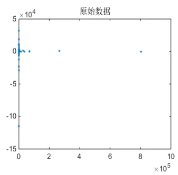

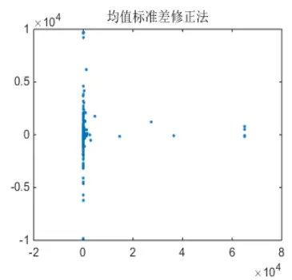

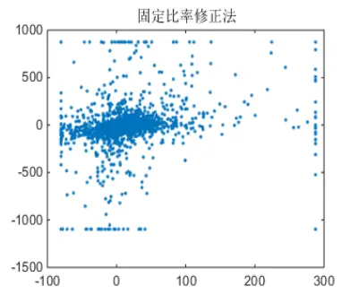

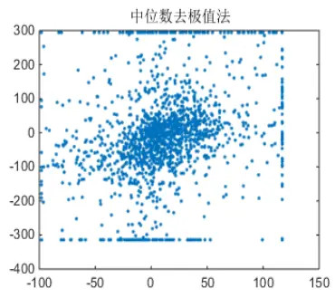
数据来源：财通证券研究所，Wind

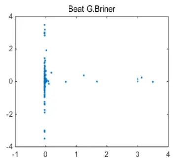

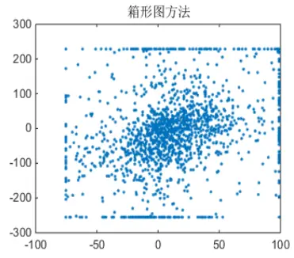

财通金工以单季度净利润同比增长率（YOY_Profit）和单季度营业收入同比增长率（YOY_Sales）为例对此进行说明，这两个指标是构建股票成长类因子（Growth）的细分因子。从直观含义来讲，二者之间应该存在同向的相关关系，对其绘制散点图如图1左上角所示。

与一般的价量因子不同，财务因子特别是增长率因子，通常是将本期指标与前期指标相除减1得到，若期初数据过小而本期经过较大幅度的增长，那么增长率数据将会求得一个异常大的数值。因此，增长率类的因子通常并不服从正态分布，且更容易出现极端值。由如图1左上角可以看到，由于两列数据都存在极端异常值，散点图无法看出二者之间的相关关系，经计算二者相关系数仅为0.0025，若仅凭该指标来判断，二者几乎不存在相关关系，这显然与我们的预期不符。

如果把原始数据中的异常值用几种不同的方法进行处理，从散点图和Pearson相关系数中可以发现数据之间相关性明显增大，且经过中位数去极值法和箱形图方法处理异常值后数据呈现的相关关系更加明显。

表 1：各种方法处理后两列数据相关系数

| 处理方法 | 原始数据 | 均值标准差修正法 | 固定比率修正法 | 中位数去极值法 | BeatG.Briner | 箱形图法 |
| --- | --- | --- | --- | --- | --- | --- |
| 相关系数 | 0.0025 | 0.0256 | 0.2879 | 0.3369 | 0.0237 | 0.3428 |

数据来源：财通证券研究所，Wind

## 1.2 探析：常用异常值处理方法介绍

本小节就实际投资和相关文献中，异常值处理常用的均值标准差修正法（3σ法）、 固定比率修正法（百分位法）、中位数去极值法（MAD 法）、Beat G.Briner方法、因子排序值标准化法、箱形图方法和无量纲化处理方法进行介绍。

图 2：异常值处理的主要方法介绍
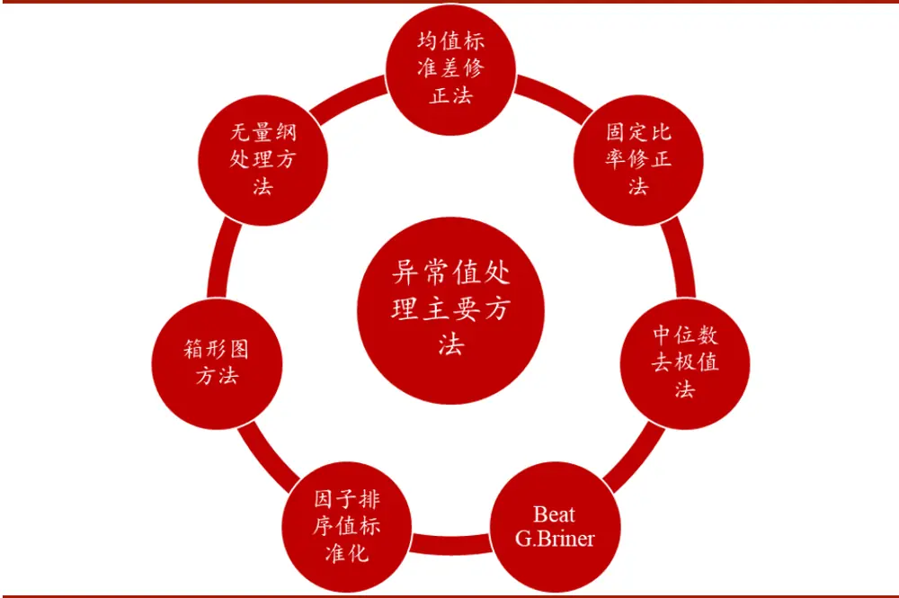
数据来源：财通证券研究所

## （1） 均值标准差修正法（3σ法）

假定已知数据 x 服从正态分布，现在需向该数据集中新增一个数据，那么该数据位于数据集平均值3σ以外的概率可以表示为：

$$
P(|x-\mu|>3\sigma)=P(\Big|\frac{x-\mu}{\sigma}\Big|>3)
$$

令 $\begin{array}{r}{\cdot y={\frac{x-\mu}{\sigma}}\in N(0,1)}\end{array}$ ，则由正态分布查表可知， $P(|y|>3)<0.3\%$ 。在因子值服从正态分布的条件下，数据偏离均值三个标准差以上为极小概率事件，通常认为这样的数据并不存在，因此可以认定这样的数据为异常值，我们可以将这些异常值拉回至距离均值三个标准差的地方。

用数学语言表示，假定因子值为 $x_{i}$ ，异常值处理后的因子值为 $\tilde{x}_{i}$ ，那么：

$$
\tilde{x}_{i}=\left\{\begin{array}{ll}{\begin{array}{rl}&{\mu+3*\sigma,\qquad x_{i}>\mu+3*\sigma}\\&{\mu-3*\sigma,\qquad x_{i}<\mu-3*\sigma}\\&{x_{i},\mu-3*\sigma\leq x_{i}\leq\mu+3*\sigma}\end{array}}\end{array}\right.
$$

## （2） 固定比率修正法（百分位法）

与均值标准差修正法不同，固定比率修正法没有因子值服从正态分布的前提条件。以 2%百分比为例，该数据处理方法将因子值按数值大小升序排列，将排位高于 98%及低于 2%的数据作为异常值进行调整，设因子值为 $x_{i}$ ，异常值处理后的因子值为 $\tilde{x}_{i},$ ，排序最接近2%和98%的因子值分别为 $P_{2}$ 和 $P_{98}$ ，则调整方法如下：

$$
\tilde{x}_{i}=\left\{\begin{array}{ll}{P_{98},\qquad x_{i}>P_{98}}\\{P_{2},\qquad x_{i}<P_{2}}\\{x_{i},\quad P_{2}\leq x_{i}\leq P_{98}}\end{array}\right.
$$

## （3） 中位数去极值法（MAD 方法）

中位数去极值法（ ），是一种较为稳健的异常值处理方法，其与均值标准差修正法有一定的相似性，即都是通过数据到中心的距离的大小定义异常值。所不同的是，中位数去极值法的中心为中位数而非均值，平均距离由绝对值的中位数定义而非标准差，MAD 方法具体如下：

$$
\tilde{x}_{i}=\left\{\begin{array}{c}{{MAD=median_{i}(|x_{i}-median(x)|)}}\\{{{}}}\\{{{\tilde{x}}_{i}=\left\{{median(x)+n*MAD,\qquad x_{i}>median(x)+n*MAD}_{i}\right\}}}\\{{{}}}\\{{{\nonumber}}{{median(x)-n*MAD,\qquad x_{i}<median(x)-n*MAD}_{else}}}\\{{{}}}\end{array}\right.
$$

## （4） Beat G..Briner 方法

Beat G.Briner（2009）介绍了一种新的因子数据异常值处理方法，该方法先将数据进行 z-score 标准化处理：

$$
x_{i}^{(std)}=\frac{x_{i}-\mu}{\sigma}
$$

其中， $\mu$ 为因子数据的市值加权平均， $\sigma$ 为简单平均标准差，随后再进行如下处理：

$$
\widetilde{x_{\iota}^{(std)}}=\{\begin{array}{ll}{3\cdot(1-s_{(+)})+x_{i}^{(std)}\cdot s_{(+)},\qquad x_{i}^{(std)}>3}\\{\qquad x_{i}^{(std)},\qquad-3\leq x_{i}^{(std)}\leq3}\\{-3\cdot(1-s_{(-)})+x_{i}^{(std)}\cdot s_{(-)},\qquad x_{i}^{(std)}<-3}\end{array}
$$

其中，

$$
s_{(+)}=Max(0,Min(1,\frac{0.5}{Max_{i}(x_{i}^{(std)}-3)}))
$$

$$
s_{(-)}=Max(0,Min(1,\frac{-0.5}{Min_{i}(x_{i}^{(std)}+3)}))
$$

可以看到，该方法将因子暴露值限制在[-3.5,3.5]之间，且能够保留原始数据的排序。

## （5） 箱形图方法

箱形图包括了一系列数据的上界、下界、均值、中位数、上四分位和下四分位。设上四分位为 U，表示所有数据中只有 1/4 的数据大于 U，同理，下四分位为 L, 表示所有数据中只有 1/4 的数据小于 $L_{\circ}$ 。定义上下四分位数之差 $IQR=U-L$ ，则上 ${\it\Omega}^{\mathrm{g}}=U+1.5IQR$ ，下界 $\cdot=L-1.5IQR$ 。在数据异常值处理中，把大于上界和小于下界的因子值拉回上界及下界即可。

图 3：箱形图处理方法示意图
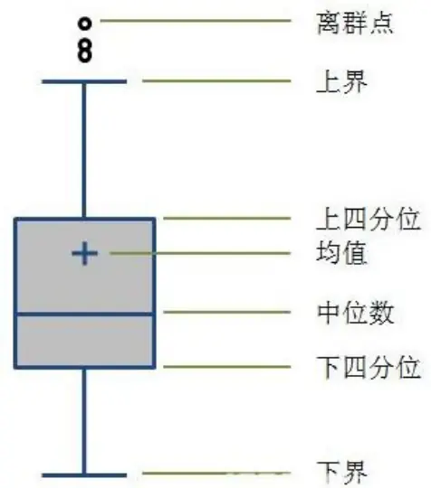
数据来源：财通证券研究所

## （6） 因子排序值标准化法

为了避免数据异常点对多因子模型的干扰，该方法直接将待处理的因子值转换为排序值，然后对排序值进行数据标准化处理。该方法只关注原始序列的排序，而对具体的因子值不做关注。

## （7） 无量纲处理方法

李伟伟（2018）介绍了一种异常值的识别和无量纲处理方法，我们对此进行简单介绍。

首先将数据 $x_{i}$ 从小到大进行排序，将排序后的值记为 $\{x_{1},x_{2},\ldots,x_{n}\}$ ，记x̅为数据的中位数，定义 $\mathcal{\rho}_{1}$ 和 ${\boldsymbol{\mathit{\Pi}}}^{\prime}\rho_{2}$ 分别表示中位数距离最大值和最小值的距离。

$$
\begin{array}{l}{\displaystyle\int\rho_{1}=x_{n}-\bar{x}}\\{\displaystyle\rho_{2}=x_{1}-\bar{x}}\end{array}
$$

规则 1：

1) 当 $\rho_{1}{\approx}\rho_{2}$ 时，认为原始数据中不存在异常值。

2) 当 $\rho_{1}\geq k\rho_{2}$ 时，认为排序后数据的最大值方向存在异常值。

3) 当 $\rho_{2}\geq k\rho_{1}$ 时，认为排序后数据的最小值方向存在异常值。

其中 k 的取值由人为决定，一般取 1.5-2之间的常数，我们取 k=1.5。

规则 2：

以最大值方向存在异常值为例：

1) 设置计数变量 r=0，并将 $r{=}r{+}1$

2) 计算此时的 $\rho_{1}^{(r)}\acute{\pi}\varpi\rho_{2}^{(r)}$ ,同时计算 $\varepsilon_{r}=\rho_{1}^{(r)}/\rho_{2}^{(r)}$

3) 若 $\varepsilon_{r}>1$ ，则剔除排序后最大值方向的端点值

重复 1）和 2），直至出现 $\mathcal{V}\varepsilon_{r}\leq$ 1的情形。

规则 3：

在循环停止之后，假设出现了 m 个 $\varepsilon_{r}>$ 0的情况。

1）当 m=1(或 2)且 $\scriptstyle{\mathcal{E}}_{r}\geq$ k时，可以认为排序后数据最大值方向的端点值(或最大端点值与次大端点值) 为异常值。

2) 当 $3\leq m\leq n/2$ 时，可以认为所有 $\dot{\varepsilon}_{r}\geq k$ 对应的端点值为异常值。

3) 当m $.>n/2\mathbb{H}\varepsilon_{r}\geq$ k对应的点很多时，剔除 $\varepsilon_{r}$ 中较大异常值对应的数据，并计算剩余 $\scriptstyle{\mathcal{E}}_{r}$ 数据的平均值，将 $\varepsilon_{r}$ 在其平均值以上的计数步对应的原始数据剔除。

最小值方向的异常值识别过程与上述类似，只是将规则 2 第二步中的$\varepsilon_{r}=\rho_{2}^{(r)}/\rho_{1}^{(r)}$ 且从最小值方向剔除极端值即可。

为了进一步判断数据的另一端是否存在异常值，将上述识别出的异常值删除并按规则 1 重新判断。当对剩余数据判断异常值存在的方向与之前相同时，则认为剩余数据中不存在异常值；反之，可进一步按上述异常值的识别规则判断剩余数据中是否存在异常值。

至此，就已经完成了异常值的识别，接下来开始对异常值进行处理。假设排序后数据集共 n 个数据，若最小值方向存在k 个异常值，记为 $\{x_{k}\},$ 最大值方向存在 h 个异常值，记为 $\left\{x_{\lambda}\right\}$ ，非异常值共 t 个，记为 $\{x_{t}\}$ ，那么肯定有如下等式：

$$
n=k+h+t
$$

令 $\begin{array}{r}{\Delta_{1}=\frac{k}{n},\Delta_{2}=\frac{t}{n}}\end{array}$ ，则异常值处理后数据如下：

$$
\left\{\begin{array}{c}{x_{k}^{*}=\Delta_{1}\times\displaystyle\frac{x_{k}-min\{x_{k}\}}{max\{x_{k}\}-min\{x_{k}\}}}\\{x_{h}^{*}=(1-\Delta_{2})+\Delta_{2}\times\displaystyle\frac{x_{h}-min\{x_{h}\}}{max\{x_{h}\}-min\{x_{h}\}}}\\{x_{t}^{*}=\Delta_{1}+(1-\Delta_{2}-\Delta_{1})\times\displaystyle\frac{x_{t}-min\{x_{t}\}}{max\{x_{t}\}-min\{x_{t}\}}}\end{array}\right.
$$

可以看到，该方法并不只是将异常值进行简单的拉回操作，而是将识别出来的极端异常值之间进行比较和规整化。最终处理得到的数据在[0,1]之间，且保留了异常值本身的信息。

## 1.3 比较：异常值处理方法的优劣性分析

上一部分我们对 7 种异常值的处理方法进行了介绍，本小节我们从定性的角度来谈谈财通金工对于这些方法优缺点的理解。

## （1） 均值标准差修正法（3σ法）

优点：

该方法实用性较强，能够识别出偏离较大的异常值，逻辑容易理解。

缺点：

a) 用标准差度量具体可能会放大偏离较为严重的点的偏离影响，若有部分极端的异常值出现，可能会极大地放大σ，导致上下界过宽，无法筛选部分异常值。

b) 该方法的前提条件是数据集分布近似服从正态分布，对于不满足正态分布且数据量不够多的数据集，该方法可能会存在一定的误差。

## （2） 固定比率修正法（百分位法）

优点：

处理方便，逻辑容易理解，若数据两端都存在异常值且比例相似，则效果较好。

缺点：

a) 该数据异常值处理方法与其余方法相比的最大不同点在于，它仅仅以数据在因子值中的比例而不以异常偏离程度筛选异常值。因此当数据较为集中时，或者数据集本身并没有异常值出现时，该方法依然要以一定比例处理和改变两头的极端值，存在一定的误差。

b) 百分比的比例选择太过主观，可能会与数据集实际异常值的比例相差较大。

## （3） 中位数去极值法（MAD 方法）

优点：

该方法用中位数作为中心点，并且用各点距离中心的中位数定义 MAD。中位数和绝对值距离相较于均值和标准差而言，能够减少极端值的影响，使得异常值的判断更为准确。

缺点：

超过异常值的点在处理过后拉回上下界，可能会导致medianj(x) ± n ∗MAD处出现数据堆叠，与现实中数据分布情况不同。

## （4） Beat G.Briner 方法

优点：

将标准化后的因子值限制在[-3.5,3.5]上，而且保留了原始数据的排序，不会使处理后的异常值堆叠在限制值两端。

缺点：

a) 一定程度上认为数据服从正态分布。

b) 在异常值处理之前用均值和标准差对数据进行标准化，此时计算出的均值和标准差可能会较大得受到异常值的影响，使得标准化后的数据存在一定误差。

## （5） 箱形图法

优点：

运用上下四分位数的数值和上下分位数之差确定上下界，可忽略极端值的影响，得出较为理想的上下界。

缺点：

与 MAD 方法相似，超过异常值的点在处理过后拉回上下界，造成上下界数据堆叠，与现实中数据分布情况不同。

## （6） 因子排序值标准化法

优点：

处理简便，且有利于做相关性分析

缺点：

完全忽视所有因子本身的数值大小，因此实际处理中丢失较多信息，误差较大，无法适用于多因子模型。

## （7） 无量纲处理方法

优点：

将异常值处理后的数据限制在[0,1]，并保留了原始数据的排序。用极值到中位数的绝对距离而非标准差来评判，能够减少极端值的影响。

缺点：

a) 对数据集两端都存在异常值且两端异常值距中位数距离相近的数据集处理效果不好

b) 通常只能识别一端的异常值。

c) 由于异常值部分的处理公式是根据异常值中的极大极小值进行的，与正常值处理的公式不同，因此如果一端的异常值太大，且异常值识别较多，可能出现断层现象。

## 1.4 检验：不同方法对于不同类别数据处理结果

本小节我们从实证层面出发，对财务类数据和价量类数据的异常值进行处理，观察各个方法在实际应用中的适用范围。通常来讲，价量因子的异常值比财务类数据的异常值小得多，因此对其进行处理更为简单，各种方法的差别不会太大。而对于财务类因子特别是增长率类型的因子，出现极端值的可能性大大增加。我们以单季度净利润同比增长率、资产负债率和市值因子对此进行说明。

图4展示了2019年3月8日全市场股票单季度净利润同比增长率因子的散点图。可以看到，该组数据存在十分极端的异常值，且异常值在数据的两端分布较为均匀。

图5展示了经过前述方法进行极值处理后的效果，可以发现，对于异常值较多且十分极端的数据集，均值标准差修正法和Beat G.Briner提出的方法效果并不理想，主要原因是这两种方法都用到了异常值处理之前的标准差数据，此时标准差受极端异常值的影响非常大，使得异常值的上下界太宽，识别出的异常值过小。同时，无量纲化方法对于该组数据的处理结果也不理想，主要原因是此时两端据中位数距离较为相似，仅识别出两个极小异常值点，其余异常值均无法识别，导致上下界过大。对于这种类型的数据，采用中位数去极值法和箱形图方法的处理效果较好。主要原因是，它们在处理过程中均未使用标准差指标，使得极端值对于确定上下界的影响较小。

图4：单季度净利润同比增长率散点图
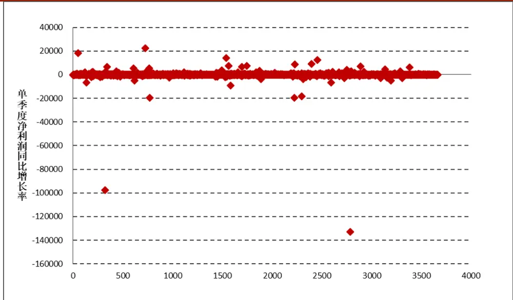
数据来源：财通证券研究所，Wind

图5：单季度净利润同比增长率因子异常值处理后对比图
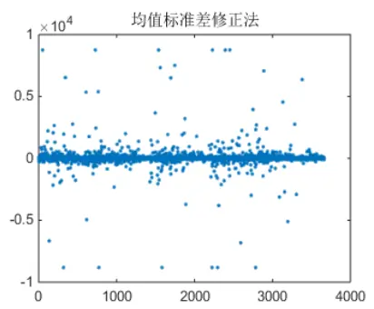

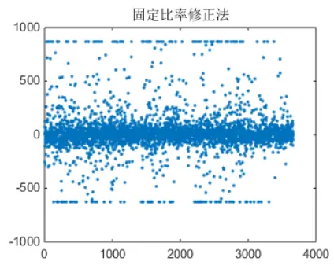

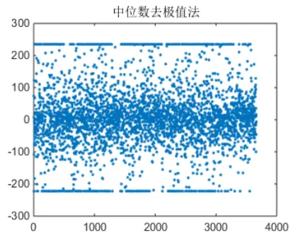

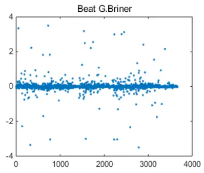
数据来源：财通证券研究所，Wind

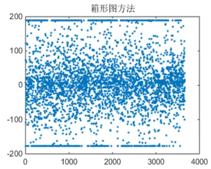

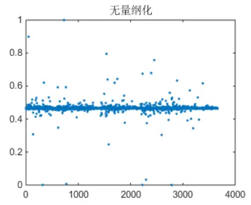

图6展示了2019年3月8日全市场股票资产负债率因子的散点图。与单季度利润同比增长率因子不同，资产负债率因子的极端值更多地分布在数据的一端（最大值方向），并不存在异常数据的对称性，且原始数据集的标准差相对较小。图7展示了经过前述方法进行极值处理后的效果，可以发现，对于这种原始数据异常值相对较小且单方面分布于数据一端的数据，通过6种方法进行处理后的结果均优于异常值较大的原始数据。在所有方法中，仍以中位数去极值和箱形图方法的效果最为令人满意。前面提到，由于无量纲处理方法对于异常值部分的处理是根据异常值中的极大极小值进行的，与正常值处理的公式不同，因此如果一端的异常值太大，且异常值识别较多，可能出现断层现象，图7右下角即展示了这一结果。

图6：资产负债率因子散点图
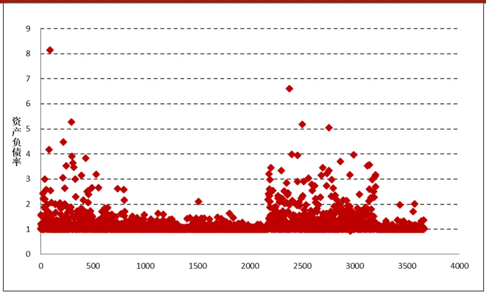
数据来源：财通证券研究所，Wind

图7：资产负债率因子异常值处理后对比图
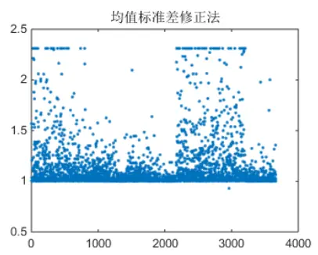

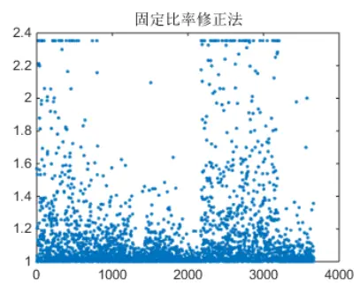

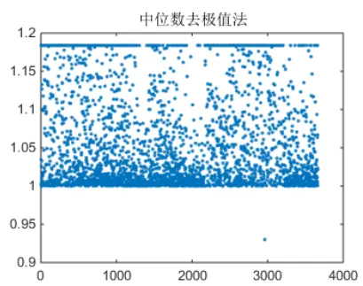

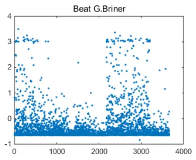
数据来源：财通证券研究所，Wind

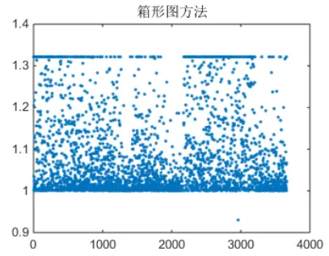

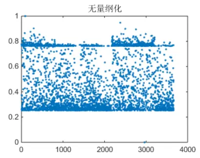

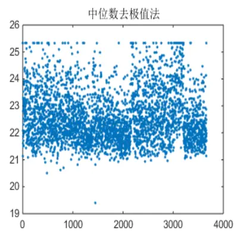

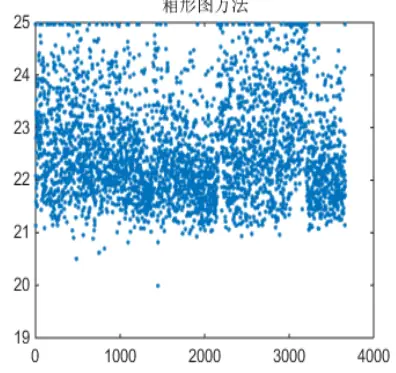

图8和图9以对数市值因子为例，展示了处理前后的效果。由于原始数据本身并不存在很多异常值点，因此对于这样的数据而言，所有方法的处理结果都令人合意。

图8：对数市值因子散点图
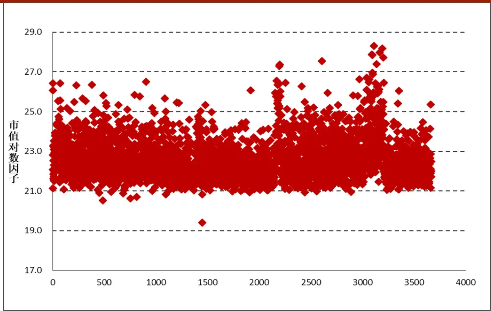
数据来源：财通证券研究所，Wind

图9：对数市值因子异常值处理后对比图
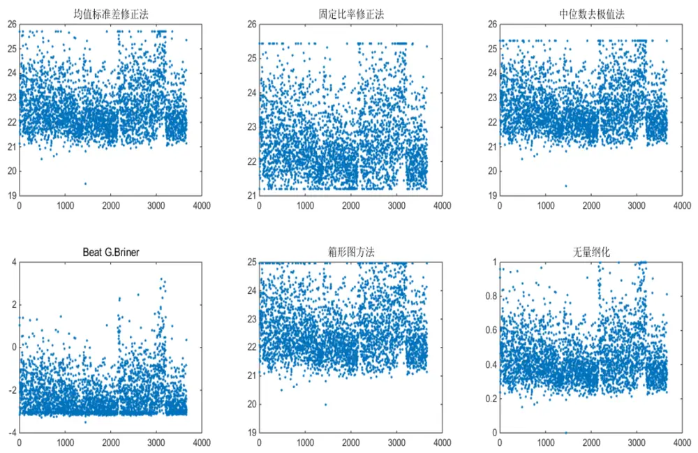

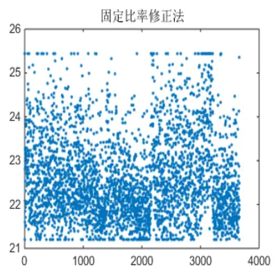

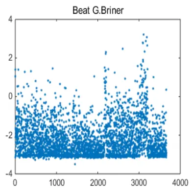
数据来源：财通证券研究所，Wind

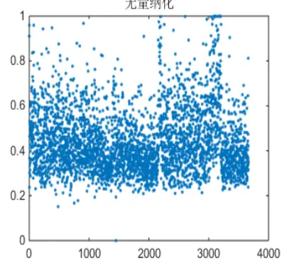

## 1.5 规避：基于分位数回归的方法

到目前为止，我们对于异常值的处理均是基于“识别-拉回”这样的两步操作，本小节我们介绍一种分位数回归方法（Quantile Regression），它最早由Koenker和Bassett（1978）提出。相对于OLS方法而言，这种方法对于离群点的处理表现更为稳健，且对误差项并不作强假设要求，因此对于非正态分布数据而言，分位数回归的系数估计量更为稳健。

传统的回归模型实际上是研究被解释变量的条件期望（即平均值），但往往我们也关心解释变量与被解释变量分布的中位数、分位数等呈现出怎样的关系。因此，分位数回归能够更全面地描述被解释变量条件分布的全貌，而不仅仅是分析解释变量对被解释变量的均值的影响。

此外，传统的OLS方法其最小化目标函数为残差平方和，这容易受极端值影响，而分位数回归方法使用残差绝对值的加权平均作为最小化目标函数，不容易受极端值影响，因此更为稳健。

图10以家庭收入与食品支出的关系为例，对比了分位数回归与OLS回归的结果。在该原始数据集中，由于家庭收入数据存在部分极端值，因此OLS回归的截距项更大，受到极端值的影响比分位数回归更大一些。

图10：分位数回归与OLS回归结果对比
家庭收入与食品支出的分位数回归
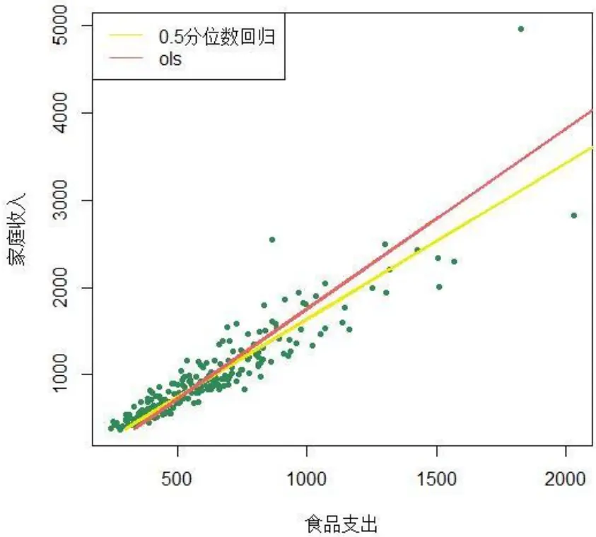
数据来源：财通证券研究所

由于不是本文讨论的重点，对于分位数回归方法的具体细节本文不进行过多赘述，仅以一个例子对其进行说明，为投资者提供一定的思路，感兴趣的客户欢迎与我们进行深入探讨。

## 1.6 小结

本文主要讨论多因子模型构建中，异常值数据的识别和处理，首先介绍异常值的存在对数据集所含信息的损害来阐述对异常值进行处理的必要性，随后介绍当前实际投资中运用最为广泛的7类异常值处理方法，并从定性和定量两个维度来分析各种方法的优劣及适用范围，最后介绍分位数回归的方法对异常值进行文件处理，主要结论如下：

（1） 在进行回归分析或因子相关性分析时，因子暴露的异常值可能会极大影响回归系数和数据的相关情况；

（2） 常用的异常值处理方法有均值标准差修正法、固定比率修正法、中位数去极值法、Beat G.Briner方法、因子排序值标准化法、箱形图法和无量纲化处理方法，这些方法各有优劣；

（3） 相较于价量因子数据，财务数据特别是增长率类数据所含的异常值更多。经实证检验，对于各类数据而言，中位数去极值法和箱形图是更为稳健的方法；

（4） 相较于传统的OLS回归法，基于分位数回归的方法更不容易受极端值影响，且能够更为全面地描述被解释变量条件分布的全貌，是一种更为稳健的回归方法。

## 2、 一周行情回顾

上周市场风格相较前一个月稍有变化，创业板指止住前段时间连续上涨的强势，本周步幅稍有放缓。科创板等概念的火爆带动成长股表现，上周沪深 300 成长和中证 800 成长指数分别上涨 4.96%和 4.50%，在所有样本指数中排名前二，而创业板指数和超大盘指数分别录得 0.49%%和 0.88%的收益，总体来讲市场整体风格并不明确。

图11：上周主要指数收益（2019.3.8-2019.3.15）
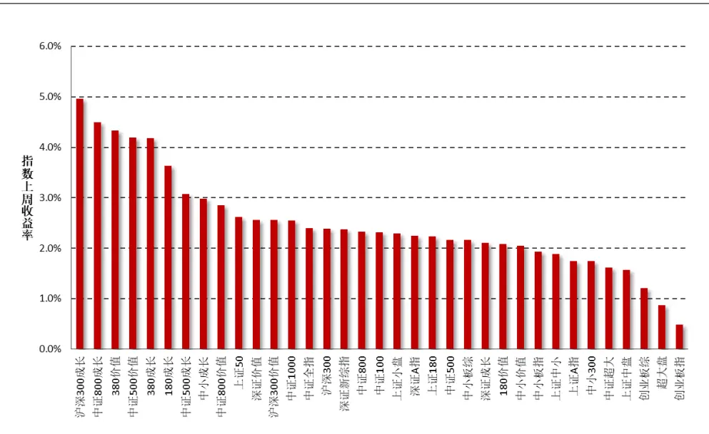
数据来源：财通证券研究所，Wind

行业方面，在所有 29 个中信一级行业中，电力设备和房地产行业分别上涨和 ，而计算机和通信行业分别收于 和 收益，排名垫底。

图12：上周中信一级行业指数收益（2019.3.8-2019.3.15）
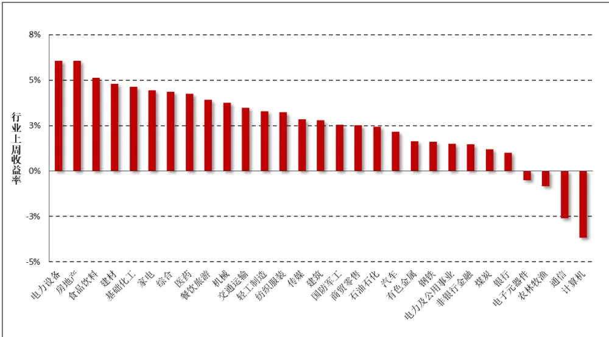
数据来源：财通证券研究所，Wind

## 3、 市场风格解析及指数风险预测

财通金工借鉴 模型，选取 、规模、动量、波动率、非线性规模、BP、流动性、盈利、成长和杠杆率因子构建收益-风险归因模型，因子定义及计算细节参见附录二。本部分通过对近期风格因子的收益表现进行分析以期捕捉 A股市场的风格变化，同时对财通金工样本指数的未来一月风险进行预测来分析当前 A 股市场所处的风险水平。风格因子的收益拆解可参见财通金工专题报告《Barra 模型初探：A股市场风格解析》，资产组合的风险预测可参见财通金工专题报告《Barra 模型进阶：多因子模型风险预测》。

## 3.1 市场风格解析

各类风格因子在上周的累计收益可分为日度累计收益和周度收益两种，日度累计收益是根据风格因子的日度收益计算得到，周度收益是将股票在本周的收益率对股票在上周最后一个交易日的因子暴露度进行回归得到的因子纯净收益，二者之间的区别在于换仓频率的不同，前者为每日换仓，而后者在每周最后一个交易日换仓。

表 2 和图 13 展示了上周各类风格因子的累计收益和周度收益大小，可以看到，二者十分近似。本周 Beta 因子继续之前的正向表现，而规模因子、波动率因子和流动性因子均收获负收益，市场在大小盘上的博弈仍然较为激烈。

表2：上周纯风格因子收益（2019.3.11-2019.3.15）

| 日期 | Beta | 规模 | 长期动量 | 波动率 | 非线性规模 | BP | 流动性 | 盈利 | 成长 | 杠杆 |
| --- | --- | --- | --- | --- | --- | --- | --- | --- | --- | --- |
| 2019/3/11 | 0.22% | -0.38% | -0.09% | -0.41% | 0.17% | 0.02% | 0.00% | -0.20% | 0.18% | -0.04% |
| 2019/3/12 | 0.07% | -0.23% | 0.08% | 0.48% | 0.12% | 0.05% | -0.17% | -0.01% | -0.02% | -0.04% |
| 2019/3/13 | 0.36% | -0.24% | 0.41% | 0.04% | -0.11% | 0.01% | -0.41% | 0.09% | 0.08% | -0.02% |
| 2019/3/14 | -0.02% | 0.41% | 0.29% | -0.54% | -0.13% | -0.27% | 0.00% | 0.37% | 0.14% | -0.13% |
| 2019/3/15 | 0.31% | -0.32% | 0.28% | -0.09% | -0.07% | -0.03% | -0.16% | 0.05% | 0.02% | 0.12% |
| 上周累计收益 | 0.95% | -0.76% | 0.97% | -0.53% | -0.02% | -0.23% | -0.74% | 0.30% | 0.39% | -0.11% |
| 周度收益 | 0.93% | -0.82% | 1.05% | -0.46% | -0.03% | -0.16% | -0.58% | 0.34% | 0.38% | -0.11% |
| 前一周度收益 | 0.02% | -0.96% | -0.59% | 0.52% | 0.70% | 0.63% | 0.29% | -0.92% | -0.57% | 0.32% |

数据来源：财通证券研究所，Wind

图 13：近两周纯风格因子收益比较（2019.3.1-2019.3.15）
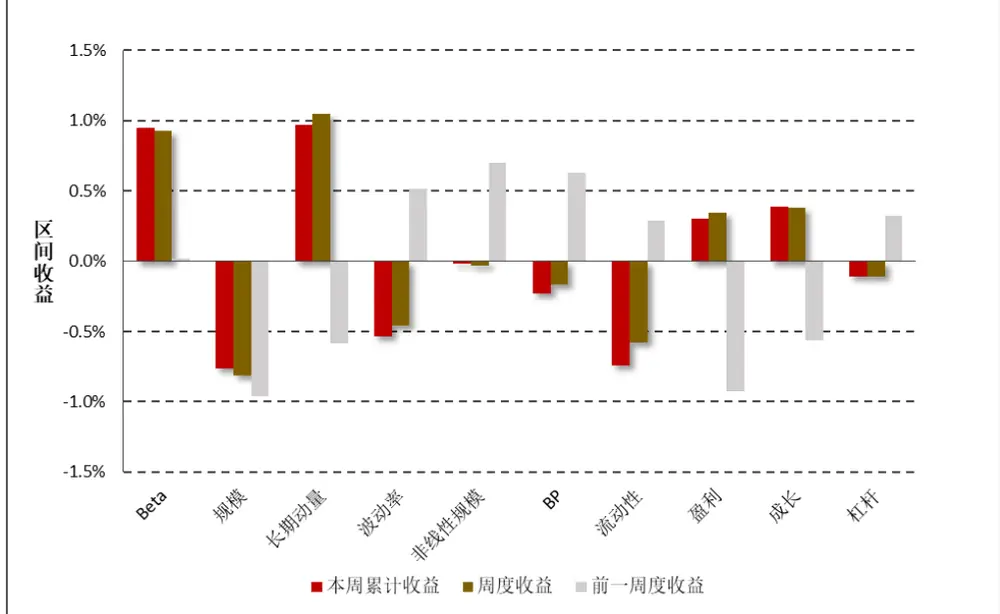
数据来源：财通证券研究所

图14：最近一个月风格因子净值走势（2019.2.13-2019.3.15）
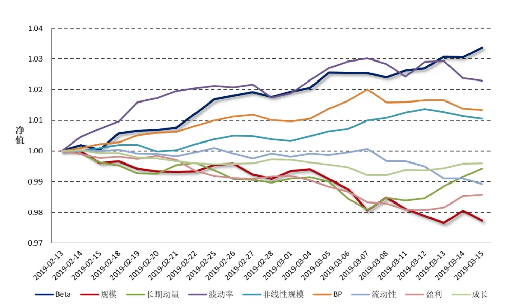
数据来源：财通证券研究所，Wind

图 14 和图 15 分别展示了最近一个月各类风格因子的净值走势及累计收益，以观察各类风格因子在过去一段时间的持续盈利能力。整体来讲，在过去的一个月中，高 Beta、高波动的股票能够获得相对较高的收益，而大规模、前期涨幅过高的股票后市将会出现较为明显的回撤。

图15：最近一个月风格因子累计收益（2019.2.13-2019.3.15）
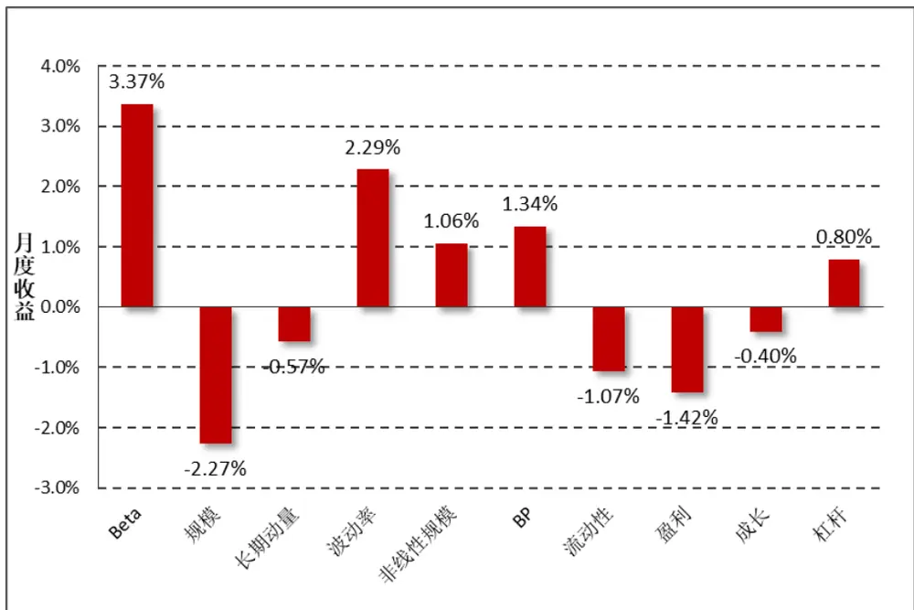
数据来源：财通证券研究所，Wind

## 3.2 指数风险预测

对收益的分解仅代表过去，对风险的预测才代表未来。多因子模型风险预测将股票风险拆解为共同风险和特质风险两部分，在通过稳健调整对共同风险矩阵和特质风险矩阵进行估计后，即可根据指数的成分股权重来估计指数在未来一段时间的波动情况。为了保证结果的严谨性，此处我们直接采用 Wind 提供的成分股权重数据，而非根据自由流通市值计算得到，尽管二者的结果十分类似。

$$
Risk(P)=W^{\prime}VW=W^{\prime}(X^{\prime}FX+\Delta)W
$$

图 16 展示了财通金工样本指数在未来一个月的预测波动率，为了方便展示我们将估计的月度波动率进行年化，波动的预测时间为上周最后一个交易日（2019.3.1）。可以看到，所有样本指数未来一月的年化波动区间在 21%-31%之间，预测波动相较上一周小幅攀升，财通金工特别提醒投资者注意当前市场波动情况，对后市维持谨慎乐观态度。中小板股票、成长类指数的风险较大，而偏大盘股票、价值类股票的风险普遍较小。

图17：收益回归/风险预测样本股票占指数成分股比率
图16：财通金工样本指数未来一月波动预测（年化）（2019.3.15-2019.4.12）
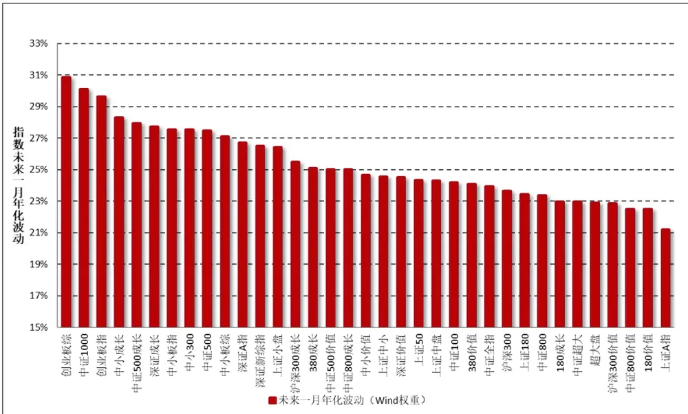
数据来源：财通证券研究所，Wind

由于在计算股票的风格因子时，我们会对暂停上市的股票、大类因子值存在缺失的股票进行剔除，因此在进行收益归因和风险预测时，并非所有指数成分股都纳入到了模型中，如果缺失股票个数过多或者缺失股票的权重占比过大，将会对模型结果造成较大影响。图 17 展示了各大指数在模型拟合过程中，纳入考虑的股票个数（权重）占指数成分股个数（权重）的比例，可以看到所有指数的比例均在 93%以上，数据质量的拟合较为合意。

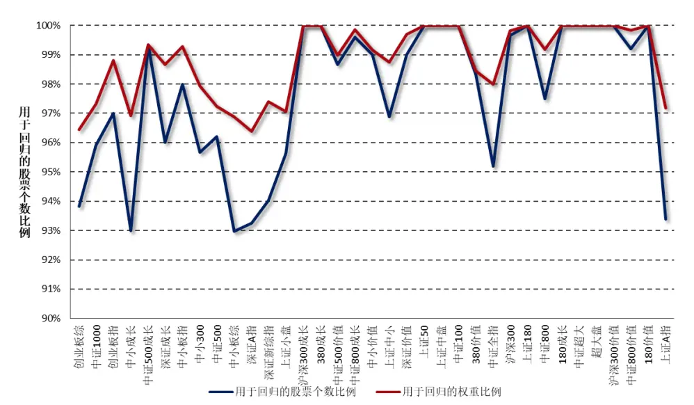
数据来源：财通证券研究所，Wind

## 4、 指数成分收益归因：

本部分财通金工对上周表现最好的三只指数和表现最差的三只指数进行归因分析，以观察涨幅较高（或较低）的指数风险暴露是否展现出较高的趋同性以及两类指数的持股风格是否会表现出明显的差别，其结果如图 18 和图 19 所示。

图18：上周表现最好三指数因子暴露度
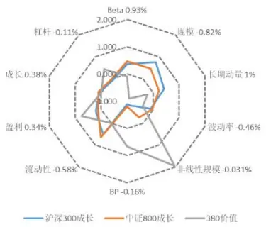
数据来源：财通证券研究所，Wind

图19：上周表现最差三指数因子暴露度
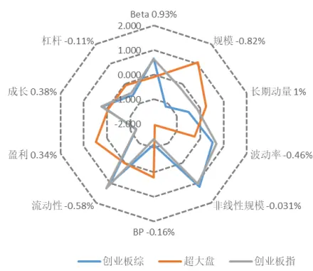
数据来源：财通证券研究所，Wind

表 3 展示了各大指数上周在各类因子上的暴露程度，可以看到，上周市场风格并不明朗，在表现占优的三只指数中，有以大盘、价值为代表的 380价值指数，也有以中小盘、成长为代表的中证 800指数，而在表现较差的三只指数中，有以大盘为代表的超大盘指数，也有以小盘为代表的创业板指数。

表3：指数在风格因子上的暴露程度（2019.3.15）

| 代码 指数名称 |  |  | Beta 0.93% | 规模 -0.82% 长 | 期动量 1% 波 | 动率 -0.46 非线性规模 |  | - BP -0.16% | 流动性-0.58 | 盈利 0.34% | 成长 0.38% | 杠杆 -0.11% 实 | 际收益 |
| --- | --- | --- | --- | --- | --- | --- | --- | --- | --- | --- | --- | --- | --- |
| 000002.SH 上证A指 |  |  | -0.191 | 0.300 | 0.148 | -0.126 | -0.420 | 0.273 | -0.195 | 0.272 | -0.018 | 0.079 | 1.75% |
| 000010.SH 上证180 |  |  | -0.027 | 0.842 | 0.451 | -0.269 | -1.081 | 0.182 | 0.054 | 0.440 | -0.124 | 0.051 | 2.24% |
| 000016.SH 上证50 |  |  | -0.150 | 1.062 | 0.657 | -0.398 | -1.829 | 0.360 | -0.139 | 0.722 | -0.079 | -0.008 | 2.61% |
| 000043.SH 超大盘 |  |  | -0.098 | 1.072 | 0.247 | -0.251 | -1.926 | 0.210 | 0.008 | 0.476 | -0.058 | -0.085 | 0.88% |
| 000044.SH |  | 上证中盘 | 0.196 | 0.441 | 0.075 | -0.033 | 0.281 | -0.140 | 0.405 | -0.074 | -0.205 | 0.158 | 1.57% |
| 000045.SH |  | 上证小盘 | 0.251 | -0.749 | -0.435 | 0.000 | 1.903 | -0.041 | 0.447 | -0.227 | 0.011 | 0.152 | 2.30% |
| 000046.SH |  | 上证中小 | 0.219 | -0.060 | -0.140 | -0.019 | 0.965 | -0.098 | 0.423 | -0.139 | -0.114 | 0.155 | 1.89% |
| 000028.SH |  | 180成长 | -0.165 | 0.885 | 0.592 | -0.074 | -1.199 | -0.283 | 0.091 | 0.381 | 0.051 | 0.001 | 3.64% |
| 000029.SH |  | 180价值 | -0.610 | 0.954 | 0.564 | -0.466 | -1.481 | 1.118 | -0.429 | 1.301 | -0.038 | 0.336 | 2.08% |
| 000117.SH |  | 380成长 | 0.237 | -0.778 | -0.318 | 0.040 | 1.872 | -0.556 | 0.647 | 0.097 | 0.149 | -0.021 | 4.18% |
| 000118.SH |  | 380价值 | -0.088 | -0.897 | -0.224 | -0.405 | 1.948 | 0.674 | 0.002 | 0.774 | 0.007 | 0.458 | 4.33% |
| 399101.SZ |  | 中小板综 | 0.317 | -0.711 | -0.465 | 0.434 | 1.041 | -0.800 | 0.617 | -0.827 | 0.068 | -0.377 | 2.16% |
| 399102.SZ |  | 创业板综 | 0.649 | -1.155 | -0.494 | 0.533 | 1.189 | -1.126 | 1.032 | -1.241 | 0.208 | -0.570 | 1.21% |
| 399100.SZ |  | 深证新综指 | 0.463 | -0.583 | -0.335 | 0.255 | 0.819 | -0.633 | 0.658 | -0.584 | 0.070 | -0.197 | 2.37% |
| 399107.SZ |  | 深证A指 | 0.440 | -0.596 | -0.324 | 0.346 | 0.816 | -0.690 | 0.803 | -0.668 | 0.123 | -0.243 | 2.25% |
| 399005.SZ |  | 中小板指 | 0.650 | 0.188 | -0.327 | 0.414 | 0.646 | -1.058 | 0.912 | -0.766 | 0.112 | -0.287 | 1.93% |
| 399006.SZ |  | 创业板指 | 0.624 | -0.173 | -0.121 | 0.680 | 1.051 | -1.364 | 1.277 | -1.254 | 0.245 | -0.460 | 0.49% |
| 399008.SZ |  | 中小300 | 0.491 | -0.296 | -0.404 | 0.434 | 1.127 | -0.919 | 0.861 | -0.794 | 0.099 | -0.301 | 1.74% |
| 399346.SZ |  | 深证成长 | 0.811 | 0.329 | -0.098 | 0.393 | 0.069 | -1.085 | 1.075 | -0.667 | 0.114 | -0.011 | 2.11% |
| 399348.SZ |  | 深证价值 | 0.391 | 0.488 | 0.214 | -0.087 | -0.304 | -0.284 | 0.614 | 0.369 | 0.051 | 0.247 | 2.56% |
| 399602.SZ |  | 中小成长 | 0.708 | -0.012 | -0.497 | 0.528 | 0.724 | -1.031 | 0.965 | -0.682 | 0.084 | -0.214 | 2.99% |
| 399604.SZ |  | 中小价值 | 0.227 | -0.362 | -0.186 | 0.182 | 1.153 | -0.384 | 0.494 | -0.093 | -0.038 | -0.147 | 2.05% |
| 000300.SH |  | 沪深300 | 0.179 | 0.781 | 0.332 | -0.165 | -0.863 | -0.086 | 0.259 | 0.230 | -0.065 | 0.031 | 2.39% |
| 000852.SH |  | 中证1000 | 0.384 | -1.486 | -0.640 | 0.327 | 1.839 | -0.522 | 0.741 | -0.765 | 0.132 | -0.262 | 2.55% |
| 000985.CSI |  | 中证全指 | 0.240 | -0.217 | -0.089 | 0.038 | 0.295 | -0.251 | 0.431 | -0.189 | -0.011 | -0.072 | 2.39% |
| 000980.CSI |  | 中证超大 | -0.099 | 1.071 | 0.326 | -0.265 | -1.898 | 0.287 | -0.167 | 0.549 | 0.003 | 0.065 | 1.62% |
| 000903.SH |  | 中证100 | 0.059 | 1.041 | 0.516 | -0.297 | -1.687 | 0.076 | 0.053 | 0.506 | -0.086 | 0.028 | 2.32% |
| 000905.SH |  | 中证500 | 0.351 | -0.777 | -0.430 | 0.068 | 2.012 | -0.230 | 0.569 | -0.407 | -0.006 | 0.065 | 2.16% |
| 000906.SH |  | 中证800 | 0.216 | 0.411 | 0.149 | -0.108 | -0.178 | -0.121 | 0.332 | 0.078 | -0.049 | 0.042 | 2.33% |
| 000918.SH |  | 沪深300成长 | 0.362 | 0.774 | 0.420 | -0.094 | -0.804 | -0.880 | 0.514 | 0.208 | 0.070 | -0.068 | 4.96% |
| 000919.CSI |  | 沪深300价值 | -0.424 | 0.909 | 0.565 | -0.446 | -1.290 | 0.848 | -0.260 | 1.237 | -0.005 | 0.440 | 2.56% |
| H30351.CSI |  | 中证500成长 | 0.592 | -0.700 | -0.490 | 0.140 | 2.009 | -0.413 | 0.867 | -0.114 | 0.133 | 0.076 | 3.08% |
| H30352.CSI |  | 中证500价值 | 0.145 | -0.804 | -0.231 | -0.530 | 2.060 | 0.658 | 0.197 | 0.588 | -0.006 | 0.390 | 4.20% |
| H30355.CSI |  | 中证800成长 | 0.464 | 0.465 | 0.230 | -0.035 | -0.246 | -0.801 | 0.637 | 0.128 | 0.108 | -0.004 | 4.50% |
| H30356.CSI | 中证800价值 |  | -0.169 | 0.674 | 0.413 | -0.445 | -0.808 | 0.675 | -0.094 | 1.030 | -0.044 | 0.441 | 2.85% |

数据来源：财通证券研究所，Wind

## 【参考文献】

【1】“The Barra Europe Equity Model（EUE3）”, Beat G.Briner, Rachael C.Smith, Paul Ward. 2009.6

【2】“Quantile Regression”，Roger Koenker, Kevin F.Hallock. Journal of Economic Perspectives. 2001

【3】《综合评价中异常值的识别及无量纲化处理方法》，李伟伟，易平涛，李玲玉，《运筹与管理》，2018.4

注：实习生上海财经大学李迪参与本课题，为本报告作出重要贡献。

## 5、 附录

| 附录一：财通金工指数池选取 |  |  |  |  |  |
| --- | --- | --- | --- | --- | --- |
| 上证规模/风格指数 |  | 深证综合/规模指数 |  | 中证规模/风格指数 |  |
| 000001.SH | 上证综指 | 399101.SZ | 中小板综 | 000300.SH | 沪深300 |
| 000002.SH | 上证A指 | 399102.SZ | 创业板棕 | 000852.SH | 中证 1000 |
| 000010.SH | 上证 180 | 399106.SZ | 深证综指 | 000985.CSI | 中证全指 |
| 000016.SH | 上证50 | 399107.SZ | 深证A 指 | 000980.CSI | 中证超大 |
| 000043.SH | 超大盘 | 399005.SZ | 中小板指 | 000903.SH | 中证 100 |
| 000044.SH | 上证中盘 | 399006.SZ | 创业板指 | 000905.SH | 中证500 |
| 000045.SH | 上证小盘 | 399008.SZ | 中小300 | 000906.SH | 中证 800 |
| 000046.SH | 上证中小 | 399346.SZ | 深证成长 | 000918.SH | 沪深 300 成长 |
| 000028.SH | 180成长 | 399348.SZ | 深证价值 | 000919.SH | 沪深 300 价值 |
| 000029.SH | 180 价值 | 399602.SZ | 中小成长 | H30351.CSI | 中证500 成长 |
| 000117.SH | 380 成长 | 399604.SZ | 中小价值 | H30352.CSI | 中证 500 价值 |
| 000118.SH | 380 价值 |  |  | H30355.CSI | 中证 800 成长 |
|  |  |  |  | H30356.CSI | 中证 800 价值 |

数据来源：财通证券研究所

附录二：财通金工风格因子定义

| 附水一. | 财通金工风 |  |  |  |
| --- | --- | --- | --- | --- |
| 大类因子 | 子类因子 | 因子定义及计算 | 权重 | 备注 |
| Beta | BETA | $\mathrm{r_{t}}=\alpha+\beta\mathrm{R_{t}}+\mathrm{e_{t}},$ 将单只股票过去252天的日度收益率对流通市值加权指数日度收益率进行半衰指数加权回归，半衰期为63天 | 1 | 1)采用流通市值而非总市值加权，因为各大指数编制采用流通市值加权；2) 需要剔除当日停牌或者未上市日期的数据，并将权重进行归一化；3)若满足条件的样本数据少于42天，我们将其 Beta 置为 NaN。 |
| 规模 | SIZE | 股票总市值取对数 | 1 | 由于PB、PE等因子的计算是基于总市值的，因此此处也用总市值 |
| 动量 | RSTR | 过去一段时间个股的累计收益率，不含最近一个月， $\begin{array}{r}{\mathrm{RSTR}=\sum_{\mathrm{t=L}}^{\mathrm{T+L}}\mathbf{w}_{\mathrm{t}}(\ln(1+\mathbf{r}_{\mathrm{t}}),}\end{array}$ $\mathrm{r_{t}=P_{t}/P_{t-1}-1,~T=504,~L=21,}$ 收益率序列采用半衰指数加权，半衰期为126天 | 1 | 1) 对于数据质量较好的个股，计算动量时采用了2年的数据2) 需要剔除未上市日期数据，但无需剔除停牌日期数据，并将权重归一化3)若满足条件的数据样本小于42天，我们将其动量置为NaN |
| 波动率(对Beta因子和市值因子进行正交化处理） | DASTD | 个股相对市值加权指数的超额收益率序列的半衰指数加权标准差，T=252，半衰期为42天1/2 $\mathrm{{DASTD}=\left(\sum_{t=1}^{T}w_{t}\big(r_{t}-\mu(r)\big)^{2}\right)}$ | 0.7 | 12 采用流通市值加权计算指数收益需要剔除当日停牌或者未上市日期的数据，并将权重进行归一化3) 若满足条件的数据样本小于42天，我们将其因子值置为NaN |
|  | CMRA | 表示过去12个月的波动幅度， $\begin{array}{r}{\mathbb{C}\mathbb{M}\mathbb{R}\mathbb{A}=\ln(1+\operatorname*{max}\{\mathrm{Z}(\mathrm{T})\})-\ln(1+}\\{\operatorname*{min}\{\mathrm{Z}(\mathrm{T})),}\end{array}$ $\sharp\Psi\mathrm{Z(T)}=\exp\bigl(\sum_{\mathrm{t=1}}^{\mathrm{T}}\ln(1+\mathrm{r_{t}})\bigr)-1$ ，表示过去T个月的收益率 | 0.15 | 以 21 天为 1 个月 |
|  | HSIGMA | 计算 Beta 时残差的标准差， Hsigma = std(ei) | 0.15 | 同 Beta 因子的计算 |
| 非线性规模 | NonLinerSize | 中市值因子，将股票总市值对数的三次方对总市值对数回归，取残差的相反数 | 1 | 用于衡量市值因子的非线性性，总市值越大和越小的股票的非线性规模越小，中市值股票的非线性规模越大 |
| 估值 | BP | 市净率的倒数，1/PB | 1 | 采用 Wind 中的 pb_lf 因子的倒数 |
| 流动性(对市值因子进行正交化） | STOM | 月度换手率，STOM = In(mean(Σ211(Vt/St)))其中V为当日成交量，S为流通股本 | 0.5 | 1)采用流通股本值，而非自由流通股本值2）剔除未上市、停牌日期的数据 |
|  | STOQ | 季度换手率， $\begin{array}{r}{\mathrm{STOQ}=\ln(\operatorname*{mean}(\sum_{t=1}^{63}(V_{t}/S_{t}))),}\end{array}$ | 0.25 | 同 STOQ 因子的计算 |
|  | STOA | 年度换手率，STOA = In(mean(Σ25(Vt/St)))， | 0.25 | 同 STOQ 因子的计算 |
| 盈利 | CETOP | 过去滚动12个月的经营现金流除以当前市值实际计算中取市现率 PCF（经营现金流 TTM）的倒数 | 1/2 | 采用 Wind 中的 PCF_OCF_ttm 因子的倒数 |
|  | ETOP | 过去滚动12个月的利润除以当前市值实际计算中取市盈率 PETTM 的倒数 | 1/2 | 采用 Wind 中的 PE_ttm 因子的倒数 |
| 成长 | YOYProfit | 单季度净利润同比增长率 | 1/2 | 为避免使用未来数据，需要根据季报公布时间进行调整 |
|  | YOYSales | 单季度营业收入同比增长率 | 1/2 | 同 YOYProfit 因子的计算 |
| 杠杆 | MLEV | 市场杠杆率，MLEV=（总市值+非流动负债）/总市值 | 1/3 |  |
|  | DTOA | 资产负债率，DTOA=总资产/总负债 | 1/3 |  |
|  | BLEV | 账面杠杆率，BLEV=（账面价值+非流动负债）/账面价值 | 1/3 |  |

数据来源：财通证券研究所
备注：1.波动率因子需对Beta因子和市值因子进行正交化处理；
2.流动性因子需对市值因子进行正交化处理；
若大类因子下所有子类因子值全部缺失，则该股票的因子值记为缺失，否则用有数据的因子值进行替代，注意需对权重进行归一化处理

## 信息披露

## 分析师承诺

作者具有中国证券业协会授予的证券投资咨询执业资格，并注册为证券分析师，具备专业胜任能力，保证报告所采用的数据均来自合规渠道，分析逻辑基于作者的职业理解。本报告清晰地反映了作者的研究观点，力求独立、客观和公正，结论不受任何第三方的授意或影响，作者也不会因本报告中的具体推荐意见或观点而直接或间接收到任何形式的补偿。

## 资质声明

财通证券股份有限公司具备中国证券监督管理委员会许可的证券投资咨询业务资格。

## 公司评级

买入：我们预计未来 6个月内，个股相对大盘涨幅在 15%以上；

增持：我们预计未来 6个月内，个股相对大盘涨幅介于 5%与 15%之间；

中性：我们预计未来 6个月内，个股相对大盘涨幅介于-5%与 5%之间；

减持：我们预计未来 6个月内，个股相对大盘涨幅介于-5%与-15%之间；

卖出：我们预计未来 6个月内，个股相对大盘涨幅低于-15%。

## 行业评级

增持：我们预计未来 6个月内，行业整体回报高于市场整体水平 5%以上；

中性：我们预计未来 6个月内，行业整体回报介于市场整体水平-5%与5%之间；

减持：我们预计未来 6个月内，行业整体回报低于市场整体水平-5%以下。

## 免责声明

本报告仅供财通证券股份有限公司的客户使用。本公司不会因接收人收到本报告而视其为本公司的当然客户。

本报告的信息来源于已公开的资料，本公司不保证该等信息的准确性、完整性。本报告所载的资料、工具、意见及推测只提供给客户作参考之用，并非作为或被视为出售或购买证券或其他投资标的邀请或向他人作出邀请。

本报告所载的资料、意见及推测仅反映本公司于发布本报告当日的判断，本报告所指的证券或投资标的价格、价值及投资收入可能会波动。在不同时期，本公司可发出与本报告所载资料、意见及推测不一致的报告。

本公司通过信息隔离墙对可能存在利益冲突的业务部门或关联机构之间的信息流动进行控制。因此，客户应注意，在法律许可的情况下，本公司及其所属关联机构可能会持有报告中提到的公司所发行的证券或期权并进行证券或期权交易，也可能为这些公司提供或者争取提供投资银行、财务顾问或者金融产品等相关服务。在法律许可的情况下，本公司的员工可能担任本报告所提到的公司的董事。

本报告中所指的投资及服务可能不适合个别客户，不构成客户私人咨询建议。在任何情况下，本报告中的信息或所表述的意见均不构成对任何人的投资建议。在任何情况下，本公司不对任何人使用本报告中的任何内容所引致的任何损失负任何责任。

本报告仅作为客户作出投资决策和公司投资顾问为客户提供投资建议的参考。客户应当独立作出投资决策，而基于本报告作出任何投资决定或就本报告要求任何解释前应咨询所在证券机构投资顾问和服务人员的意见；

本报告的版权归本公司所有，未经书面许可，任何机构和个人不得以任何形式翻版、复制、发表或引用，或再次分发给任何其他人，或以任何侵犯本公司版权的其他方式使用。