2019 年 03 月 24 日

# 因子缺失值处理：数以多为贵

## “拾穗”多因子系列报告（第 6 期）

## 联系信息

陶勤英分析师

SAC 证书编号：S0160517100002 021-68592393

taoqy@ctsec.com

张宇联系人

zhangyu1@ctsec.com 021-68592220

176216888421

## 相关报告

【1】“星火”多因子系列（一）：《Barra模型初探：A 股市场风格解析》

【2】“星火”多因子系列（二）：《Barra模型进阶：多因子模型风险预测》

【3】“星火”多因子系列（三）：《Barra模型深化：纯因子组合构建》

【4】“拾穗”多因子系列（一）：《带约束的加权最小二乘：一种解析解法》

【5】“拾穗”多因子系列（二）：《你看到的不一定是你所想的：解密 R方》

【6】“拾穗”多因子系列（三）：《行业因子选取：中信一级还是申万一级？》

【7】“拾穗”多因子系列（四）：《总市值、流通市值、自由流通市值：谈谈取舍》

【8】“拾穗”多因子系列（五）：《数据异常值处理：比较与实践》

## 投资要点：

- 因子缺失值处理：数以多为贵

- 在财通金工多因子模型中，大类因子的覆盖率基本保持在 95%以上，价量因子的覆盖率优于财务因子，总体而言数据完整度较好。

- 主要的缺失值填充方法有市场均值填充、行业均值填充、市值分组均值填充、前向数据填充和结构化填充等。

- 从实证检验来看，无论是对于财务因子还是价量因子，结构化填充的方法效果都更优，是财通金工更为推荐的方法。

## 市场风格解析

整体来讲，在过去的一个月中，高 Beta 的股票能够获得相对较高的收益，而大规模、高换手的股票后市走势将会出现更为明显的回撤。

## 指数风险预测

所有样本指数在未来一个月的年化波动区间在 21%-31%之间，相较上周基本维持在相同的水平，财通金工特别提醒投资者注意当前市场的波动情况。

## 指数成分收益归因

上周市场风格以小盘股强势为主，表现最好的三只指数都是中小盘指数，其在 Beta 和非线性规模因子上暴露较多，而表现较差的三只指数更多得偏向于大规模、高盈利股票。

- 风险提示：本报告统计结果基于历史数据，过去数据不代表未来，市场风格变化可能导致模型失效。

在实际投资中，多因子模型被广泛地应用到资产定价、绩效归因、风险控制、组合优化、基金评价及资产配置等各个领域，一套完整、精细的多因子系统成为每位量化研究者必备的工具。“做最实用的研究”，是财通金工给自己的定位。我们将在之后的系列报告中，就投资者们最关心也最容易忽略的很多细节问题进行探讨，介绍我们在实际应用中遇到的问题和思考，以飨读者。

我们为本系列报告取名“拾穗”。一周市场风云变幻，和风细雨也好，狂风骤雨也罢，都留下一地故事等待梳理。作为勤劳的搬运工，财通金工从量化视角出发对市场风格进行捕捉、对风险水平进行预测，既是希望能够如拾穗者般专心、踏实地做研究，也是祝愿各位投资者能够在市场收获满地金黄。

本期是该系列报告的第六期，主要就数据处理过程中因子缺失值填充的不同方法进行比较和探讨，我们认为基于结构化的方法（回归法）对因子填充的效果最佳，是财通金工更为推荐的方法。

## 1、 因子缺失值处理：数以多为贵

如果将整套量化系统比喻成一座宫殿，那么数据就是构建这座宫殿的基石。然而在现实研究中，这些基石并不总是令人满意，它们或大或小、或有或无，如何根据设计师的设想对这些基石进行雕琢，便是每位量化研究者的基础工作。在多因子模型构建过程中，因子覆盖率情况如何？有哪些方法可以对缺失值进行填充？各种方法的优劣及效果如何？本文将就这些问题展开探讨。

## 1.1 数以多为贵：因子覆盖率概况

表1：所有因子覆盖率概况

| 大类因子名称 | 大类因子代号 | 大类因子覆盖率 | 细分因子名称 | 细分因子代号 | 细分因子覆盖率 |
| --- | --- | --- | --- | --- | --- |
| Beta | Beta | 98.26% | Beta | Beta | 98.26% |
| 规模 | Size | 99.99% | 规模 | Size | 99.99% |
| 长期动量 | LongMomentum | 97.91% | 长期动量 | LongMomentum | 97.91% |
| 波动率 | Volatility | 99.30% | 超额标准差 | DASTD | 98.30% |
|  |  |  | 波动幅度 | CMRA | 99.30% |
|  |  |  | 残差波动率 | HSigma | 98.26% |
| 非线性规模 | NonlinearSize | 99.99% | 非线性规模 | SizeNL | 99.99% |
| 价值 | BP | 98.74% | 价值 | BP | 98.74% |
| 流动性 | Liquidity | 99.86% | 月度换手率 | STOM | 96.85% |
|  |  |  | 季度换手率 | STOQ | 98.64% |
|  |  |  | 年度换手率 | STOA | 99.86% |
| 盈利 | EarningYield | 95.00% | 市现率 | CETOP | 73.85% |
|  |  |  | 市盈率 | ETOP | 87.50% |
| 成长 | Growth | 98.96% | 单季度营业收入同比增长率 | YOYSales | 98.68% |
|  |  |  | 单季度净利润同比增长率 | YOYProfit | 98.96% |
| 杠杆率 | Leverage | 99.81% | 市场杠杆率 | MLEV | 91.20% |
|  |  |  | 资产负债率 | DTOA | 99.80% |
|  |  |  | 账面杠杆率 | BLEV | 91.21% |

数据来源：财通证券研究所，Wind

数据是模型的基础，数据的完整度影响着模型的准确性。财通金工多因子模型，从Beta、规模、动量、波动、非线性规模、价值、流动性、盈利、成长和杠杆率10个因子出发，对市场风格进行解析，因子的定义参见附录二。

由于每一项大类因子均是由子类因子合成的，因此在缺失值的处理过程中，如果某大类因子下面的所有子类因子均存在缺失，那么该大类因子的值置为空值。否则，就采用存在数据的子类因子值进行代替，并且对子类合成因子的权重进行归一化。表1对2007.6.1-2019.3.15期间所有大类和子类因子的覆盖率进行了统计。总体而言，价量因子的数据完整度较高，财务因子数据缺失值较多，在经过合成后，大类因子的覆盖率总体来讲较为理想。

进一步思考，我们可以发现因子缺失的原因各不相同。例如，新上市的股票由于其上市时间较短，无法获取较长回测时间段的交易数据，因此对于所需样本长度较长的因子（如Beta因子）而言，这部分新股的数据会存在缺失。此外，对于银行股而言，由于银行的资产负债表与其他行业公司的资产负债表科目存在区别，因此在计算杠杆率因子时通常无法获得银行的流动性资产或流动性负债数据。另外，如果股票处于长期停牌的状态，那么在计算 因子的时候并不能简单地将每日涨跌对市场涨跌进行回归，因为这样的回归是不具备意义的。

因子的总体覆盖率较高意味着原始数据本身的质量较好，但仍有部分股票存在因子缺失的情况，我们还是倾向于尽可能地用一些合意的数据将其进行填充，尽量保持样本股票的完整性。这是因为在对组合业绩进行风险收益归因时，投资者的持仓中往往包含一些新上市的股票，这部分股票对于组合的风险和收益均有贡献，因此将其纳入样本股的范围能够较大程度保持数据完整度。当然，财通金工不排除这些新股的异动或者填充数据的不合意造成的影响，究竟选择何种方式更多地还是由投资者根据自己的偏好来决定。

图1：风格因子平均覆盖率
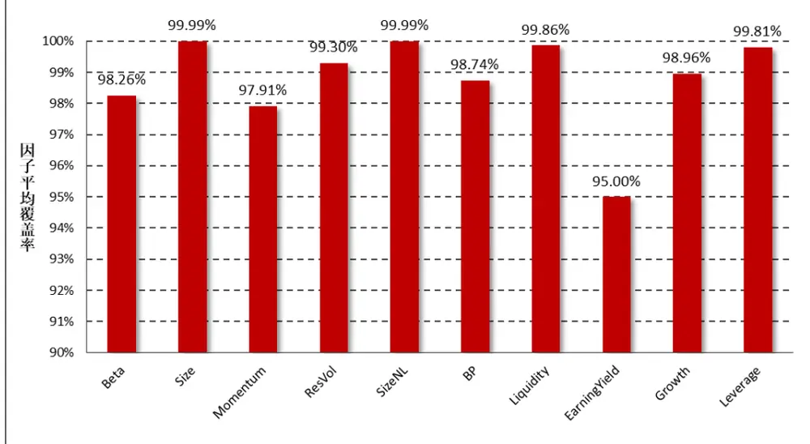
数据来源：财通证券研究所，Wind

## 1.2 数以类而聚：从聚类的角度看因子

究竟采用何种数据对缺失值进行填充，首先就要考虑有哪些数据与缺失值更为接近。在行业研究中，“可比公司法”是研究员通常采用的办法，它是指在公司业绩指标存在缺失时，由研究员依据行业逻辑和主观判断选择市场上与该公司的业务和发展最为相似的公司因子值进行代替填充。从量化角度来看，这就是一种聚类的思想。

图 2：缺失值填充主要方法介绍
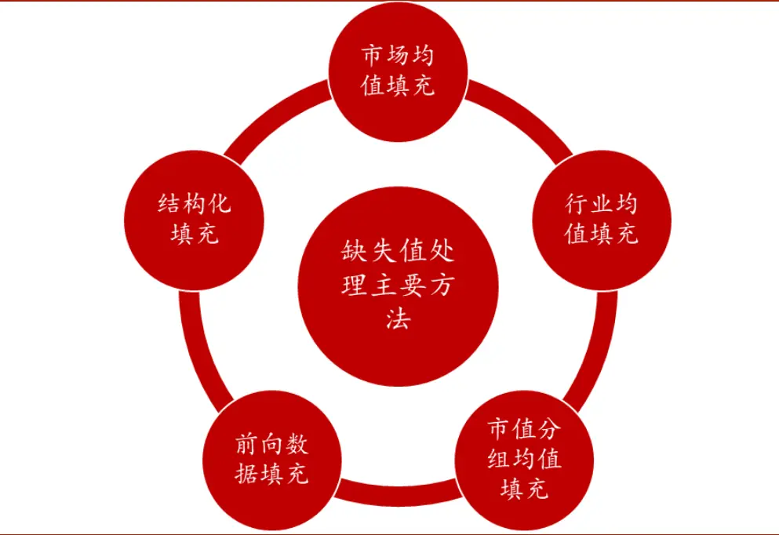
数据来源：财通证券研究所

在“拾穗”系列第三期关于行业因子选取的讨论中我们提到，同一行业的股票由于其主营业务的相似性、资源利用的同质化及受政策和周期影响的趋同性，更倾向于暴露在相同的系统性风险中，因此公司业绩和股价变动也更趋向于一致，因此采用行业均值填充也实际操作中也是一种常用的方法。

图 3：BP因子行业均值柱状图（2019.3.15）
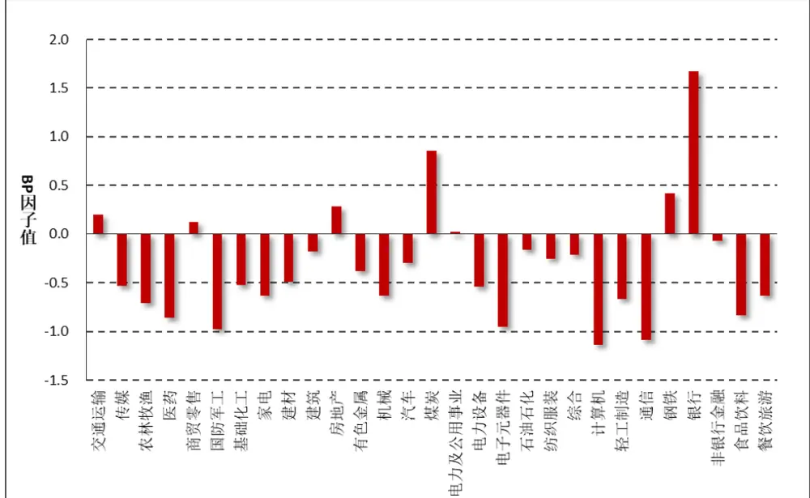
数据来源：财通证券研究所

图 3 以 BP 因子为例，展示了 29 个中信一级行业经标准化处理后的 BP 因子均值情况，可以看到不同行业的 BP 因子均值相差较大。银行、钢铁、煤炭、房地产、交通运输等行业股票的 BP 值明显更高，而科技类公司如计算机、通信等行业股票的 BP 值则明显较低。对于其他因子而言，由方差分析可以看到每个行业的因子均值同样存在显著的区别，由于篇幅限制此处不再过多赘述。由此可见，采用行业均值填充至少是一种比采用市场均值填充更为合理的方法。

图 4：不同市值分组的因子均值（2019.3.15）
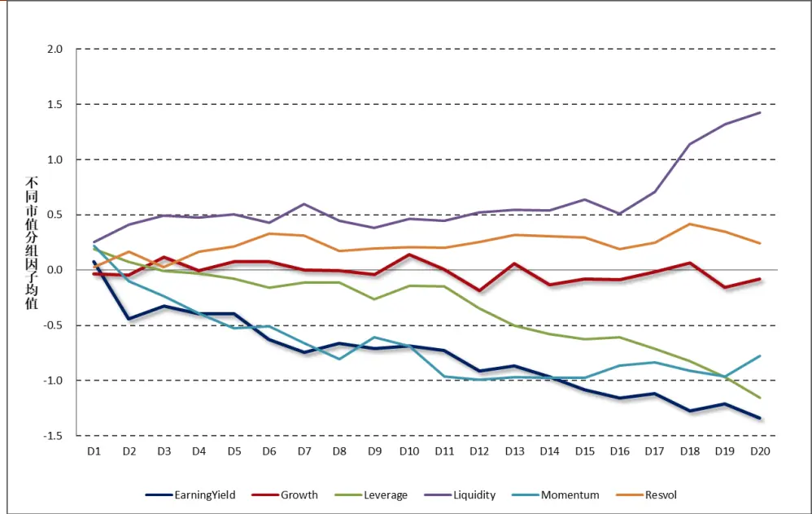
数据来源：财通证券研究所，Wind

缺失值填充的另外一种方法是采用股票所在的市值分组的均值进行代替。在股市场上，市值是一个强有效的因子，处于相同市值分组的行业由于其规模的相似性、融资难易的相似度，往往存在相似的波动情况。图 4 对 A 股市场的所有股票按照其流通市值分为 20 组，其中 D1 为市值最大的组别，D20 为市值最小的组别，绘制了各类因子的市值分组均值情况。可以看到，对于杠杆率因子和盈利因子而言，市值越大，相对应的因子值往往越小。而对于流动性因子而言，小市值股票的换手率比大市值股票的换手率要更高。正是由于各类风格因子与市值因子之间的强相关关系，使得采用股票市值分组均值对缺失值进行填充存在其逻辑上的合理性。

本文介绍的第三种方法是一种结构化模型调整的方法，该方法在财通金工“星火”专题（二）：《Barra 模型进阶：多因子风险预测》中有详细介绍，并被用于特质风险的异常值和缺失值处理的调整。结构化模型调整实质上是一种回归方法，它内在的逻辑在于将市场上的股票按照其数据质量分为两类，一类为数据存在缺失的股票（记为类别 A），另一类为数据完整度较高的股票（记为类别 B）。我们认为具有相似特征的股票往往具有相似的因子值，因此首先在类别 B 的样本股中，将待填充的因子对其他因子进行回归，得到回归系数，随后在类别 A的样本股中，将回归系数与其已有因子值进行相乘，反向求得其预估因子值进行填充。具体来讲，首先在类别 B中进行如下回归：

$$
x_{n}=\sum_{k}X_{nk}b_{k}+\varepsilon_{n}
$$

其中， $x_{n}$ 为类别 B中股票的因子值， $X_{nk}$ 为股票其他因子暴露值， $\widehat{b}_{k}$ 为经过WLS 回归拟合得到的系数。

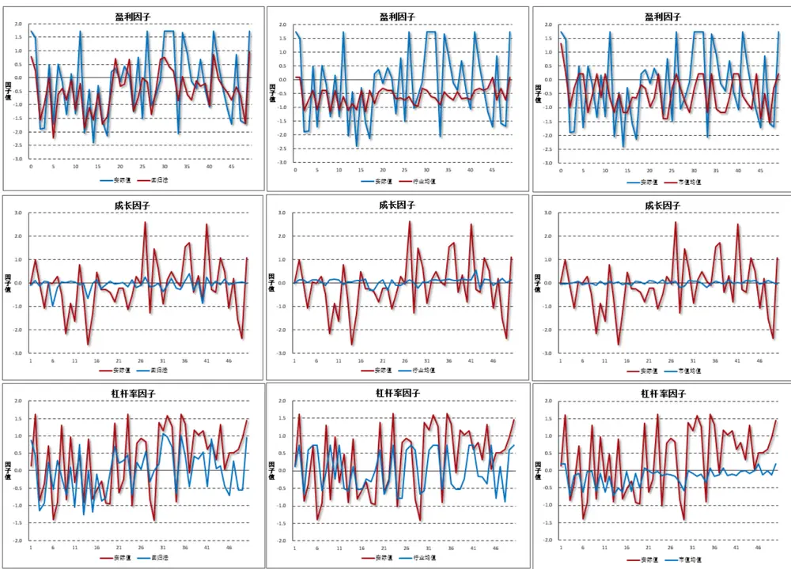
图5：主要财务因子实际值与填充值对比
数据来源：财通证券研究所，Wind

随后，在类别 A 中，将上一步所得的回归系数 $\widehat{b}_{k}$ 与因子值相乘即得到缺失值的预估填充值。

$$
\hat{x}_{n}=\sum_{k}X_{nk}\hat{b}_{k}
$$

## 1.3 实证检验：

在介绍了各种不同类别的填充方法及其背后的逻辑支持后，本部分从实证方面对因子值的填充效果进行检验，主要考察如下三种方法：

（1） 回归法填充

（2） 行业均值填充

（3） 市值均值填充

具体来讲，以2019年3月15日的Wind全A股票的风格因子值为例，为了检验填充效果，我们人为地对其中50只股票的因子值进行缺省处理，并用以上三种方法对其进行填充，观察实际值与预测值之间的相关关系。其中，回归法中采用的是不包含检验因子的9个因子，行业因子填充采用29个中信一级行业，市值分组按照其流通市值分为20组。

图5以财务因子为例，对盈利因子、成长因子和杠杆率因子的填充效果进行了比较。其中，最左边的为回归法、中间为行业均值填充、最右侧为市值均值填充，可以看到对于三种方法来讲，回归法的效果最佳，行业填充和市值填充分别对于不同的数据有不同的效果。

图6：主要价量因子实际值与填充值对比
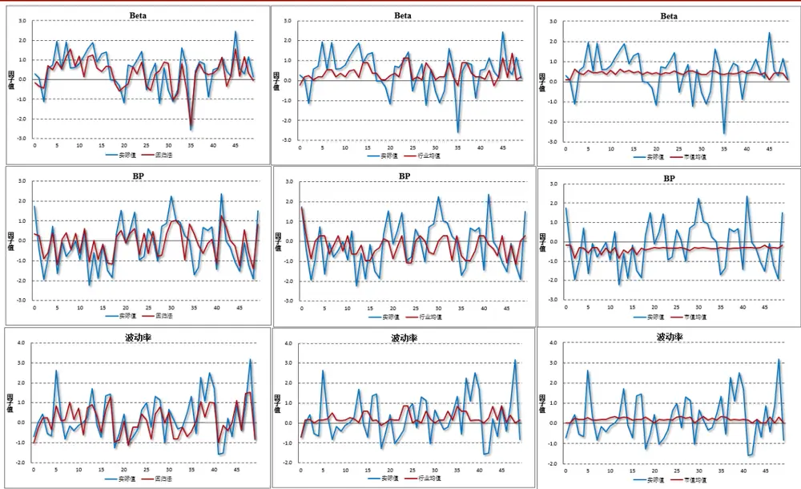
数据来源：财通证券研究所，Wind

图6对比了Beta、BP和波动率等因子的实际值与缺失值之间的拟合关系，可以看到对于这三类数据而言仍以回归法最优有效，行业均值填充其次，市值均值填充的效果最不理想。表2对10个因子采用3种方法填充的值与实际值之间的相关系数，总体来讲结构化方法的相关系数都要更高，而行业均值填充和市值分组均值填充对于不同的数据有不同的适用程度。

表2：各种方法实际值与填充值相关系数比较

| 因子名称 | 结构化法填充 | 行业均值填充 | 市值分组均值填充 |
| --- | --- | --- | --- |
| 盈利 | 77.88% | 34.89% | 49.61% |
| 成长 | 34.06% | 7.22% | 13.80% |
| Beta | 72.53% | 39.67% | 2.81% |
| BP | 73.39% | 37.77% | 44.13% |
| 杠杆率 | 65.66% | 34.56% | 61.52% |
| 流动性 | 74.58% | 30.89% | 3.71% |
| 动量 | 53.83% | 28.30% | 44.81% |
| 波动率 | 71.20% | 9.33% | 27.48% |

数据来源：财通证券研究所，Wind

## 1.4 小结

本文主要讨论多因子模型构建中，缺失值数据的处理方法及其实证检验。首先通过观察多因子模型中大类因子和细分因子覆盖率的概况，对数据完整度有一个总体的认知。其次，通过对不同行业和不同市值分组的风格因子情况进行观察，讨论缺失值处理背后的逻辑支持。最后通过实证对结构化方法、行业均值填充和市值分组均值填充三种方法进行比较，主要结论如下：

（1） 大类因子的覆盖率基本保持在95%以上，价量因子的覆盖率优于财务因子，总体而言数据完整度较好；

（2） 主要的缺失值填充方法有市场均值填充、行业均值填充、市值分组均值填充、前向数据填充和结构化填充方法等；

（3） 从实证检验来看，无论是对于财务因子还是价量因子，结构化填充的方法效果都更优，是财通金工更为推荐的方法。

## 2、 一周行情回顾

上周市场主要指数普遍上涨，总体而言小盘股走势强于大盘价值。上周中证500 价值指数和中证 500 指数分别上涨 5.19%和 4.91%，在所有样本指数中排名前二，而 180 价值指数和上证 50 指数分别录得 1.21%%和 1.44%的收益，总体来讲市场的情绪较好。

图7：上周主要指数收益（2019.3.15-2019.3.22）
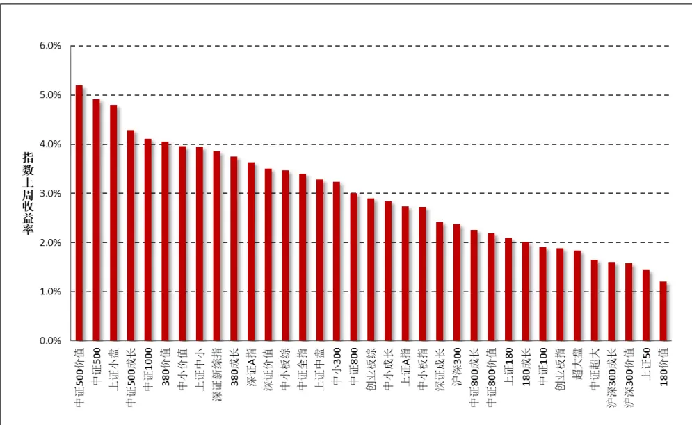
数据来源：财通证券研究所，Wind

行业方面，在所有 29 个中信一级行业中，综合和餐饮旅游行业分别上涨 7.85%和 7.58%，而农林牧渔和银行业分别收于 0.24%和 0.45%收益，排名垫底。

图8：上周中信一级行业指数收益（2019.3.15-2019.3.22）
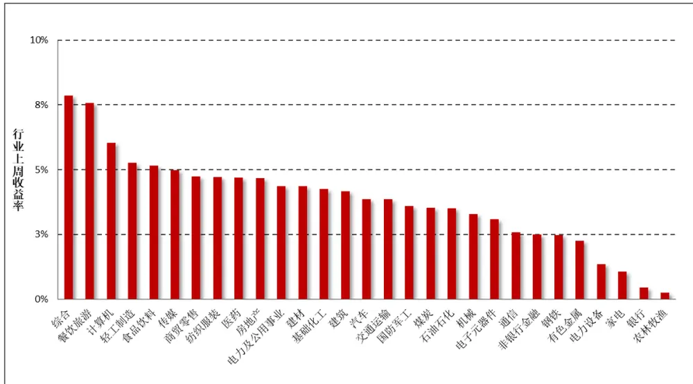
数据来源：财通证券研究所，Wind

## 3、 市场风格解析及指数风险预测

财通金工借鉴 Barra 模型，选取 Beta、规模、动量、波动率、非线性规模、BP、流动性、盈利、成长和杠杆率因子构建收益-风险归因模型，因子定义及计算细节参见附录二。本部分通过对近期风格因子的收益表现进行分析以期捕捉 A股市场的风格变化，同时对财通金工样本指数的未来一月风险进行预测来分析当前 A 股市场所处的风险水平。风格因子的收益拆解可参见财通金工专题报告《Barra 模型初探：A股市场风格解析》，资产组合的风险预测可参见财通金工专题报告《Barra 模型进阶：多因子模型风险预测》。

## 3.1 市场风格解析

各类风格因子在上周的累计收益可分为日度累计收益和周度收益两种，日度累计收益是根据风格因子的日度收益计算得到，周度收益是将股票在本周的收益率对股票在上周最后一个交易日的因子暴露度进行回归得到的因子纯净收益，二者之间的区别在于换仓频率的不同，前者为每日换仓，而后者在每周最后一个交易日换仓。

表3和图9展示了上周各类风格因子的累计收益和周度收益大小，可以看到，二者十分近似。本周 Beta 因子继续之前的正向表现，而规模因子、波动率因子和流动性因子均收获负收益，市场在大小盘上的博弈仍然较为激烈。

表3：上周纯风格因子收益（2019.3.18-2019.3.22）

| 日期 | Beta | 规模 | 长期动量 | 波动率 | 非线性规模 | BP | 流动性 | 盈利 | 成长 | 杠杆 |
| --- | --- | --- | --- | --- | --- | --- | --- | --- | --- | --- |
| 2019/3/18 | 0.19% | 0.14% | 0.14% | -0.22% | 0.00% | -0.05% | 0.09% | 0.23% | 0.03% | -0.05% |
| 2019/3/19 | -0.06% | -0.27% | 0.00% | 0.16% | 0.07% | 0.02% | 0.01% | -0.01% | 0.02% | 0.10% |
| 2019/3/20 | 0.12% | -0.22% | -0.07% | -0.06% | -0.02% | 0.13% | 0.02% | -0.04% | 0.00% | 0.06% |
| 2019/3/21 | 0.07% | -0.17% | -0.07% | 0.15% | 0.12% | 0.20% | -0.13% | -0.25% | -0.07% | 0.05% |
| 2019/3/22 | 0.17% | -0.14% | 0.20% | -0.07% | 0.10% | 0.16% | -0.24% | -0.19% | 0.03% | 0.04% |
| 上周累计收益 | 0.49% | -0.66% | 0.20% | -0.03% | 0.26% | 0.46% | -0.25% | -0.26% | 0.01% | 0.20% |
| 周度收益 | 0.46% | -0.72% | 0.22% | -0.13% | 0.25% | 0.50% | -0.19% | -0.27% | -0.02% | 0.22% |
| 前一周度收益 | 0.93% | -0.82% | 1.05% | -0.46% | -0.03% | -0.16% | -0.58% | 0.34% | 0.38% | -0.11% |

数据来源：财通证券研究所，Wind

图 9：近两周纯风格因子收益比较（2019.3.8-2019.3.22）
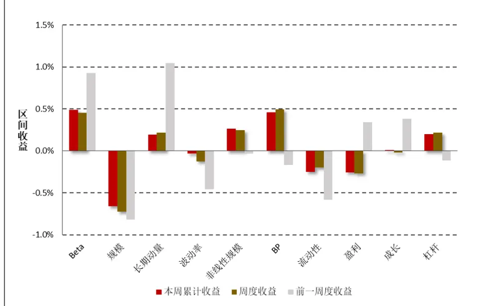
数据来源：财通证券研究所

图10：最近一个月风格因子净值走势（2019.2.20-2019.3.22）
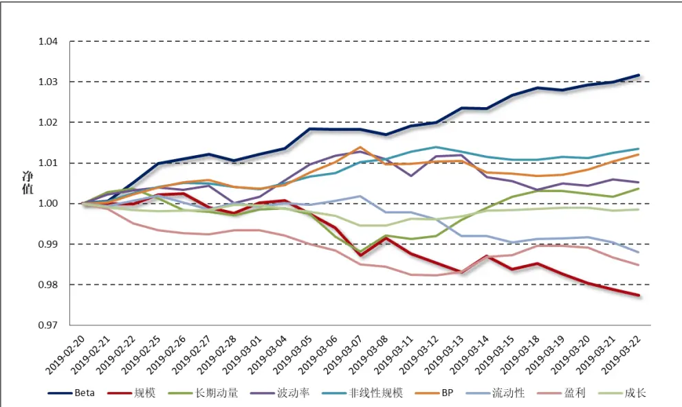
数据来源：财通证券研究所，Wind

图 10 和图 11 分别展示了最近一个月各类风格因子的净值走势及累计收益，以观察各类风格因子在过去一段时间的持续盈利能力。整体来讲，在过去的一个月中，高 Beta 的股票能够获得相对较高的收益，而大规模、高换手的股票后市将会出现较为明显的回撤。

图11：最近一个月风格因子累计收益（2019.2.20-2019.3.22）
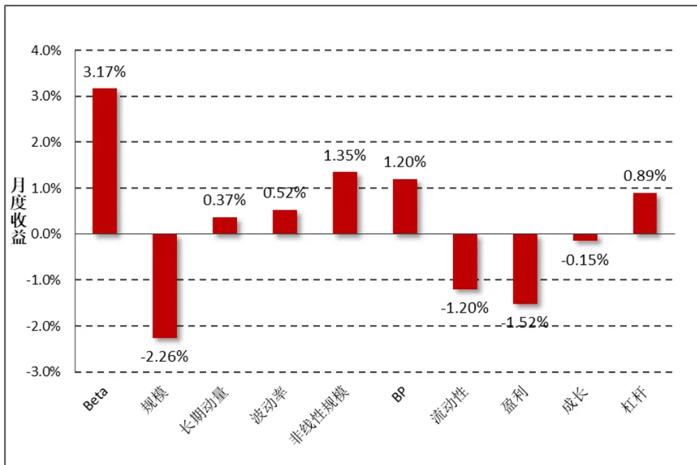
数据来源：财通证券研究所，Wind

## 3.2 指数风险预测

对收益的分解仅代表过去，对风险的预测才代表未来。多因子模型风险预测将股票风险拆解为共同风险和特质风险两部分，在通过稳健调整对共同风险矩阵和特质风险矩阵进行估计后，即可根据指数的成分股权重来估计指数在未来一段时间的波动情况。为了保证结果的严谨性，此处我们直接采用 Wind 提供的成分股权重数据，而非根据自由流通市值计算得到，尽管二者的结果十分类似。

$$
Risk(P)=W^{\prime}VW=W^{\prime}(X^{\prime}FX+\Delta)W
$$

图 12 展示了财通金工样本指数在未来一个月的预测波动率，为了方便展示我们将估计的月度波动率进行年化，波动的预测时间为上周最后一个交易日（2019.3.22）。可以看到，所有样本指数未来一月的年化波动区间在 21%-31%之间，预测波动与上周水平保持一致，财通金工特别提醒投资者注意当前市场波动情况，对后市维持谨慎乐观态度。中小板股票、成长类指数的风险较大，而偏大盘股票、价值类股票的风险普遍较小。

图12：财通金工样本指数未来一月波动预测（年化）（2019.3.22-2019.4.19）
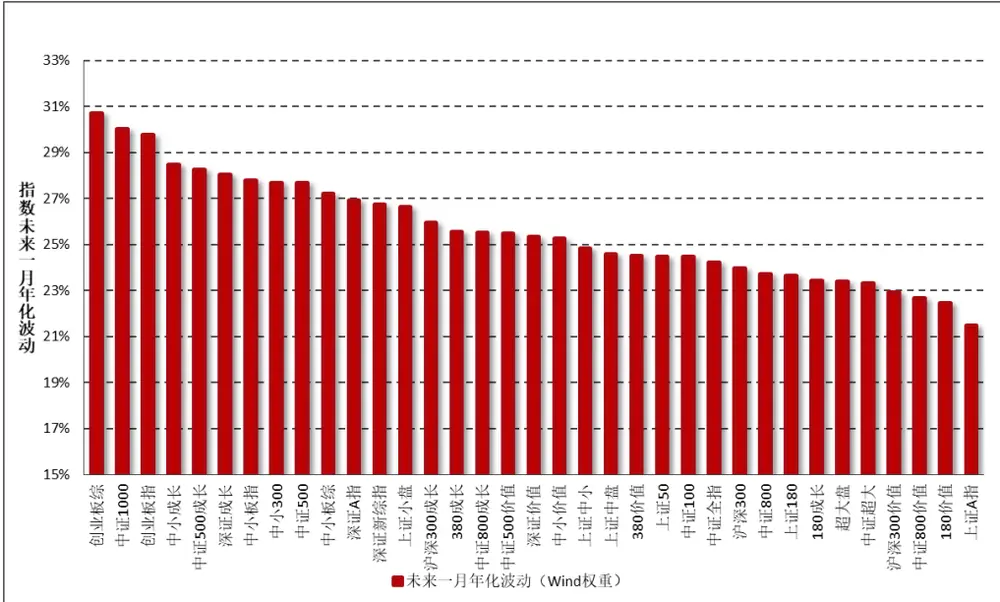
数据来源：财通证券研究所，Wind

由于在计算股票的风格因子时，我们会对暂停上市的股票、大类因子值存在缺失的股票进行剔除，因此在进行收益归因和风险预测时，并非所有指数成分股都纳入到了模型中，如果缺失股票个数过多或者缺失股票的权重占比过大，将会对模型结果造成较大影响。图 13 展示了各大指数在模型拟合过程中，纳入考虑的股票个数（权重）占指数成分股个数（权重）的比例，可以看到所有指数的比例均在 93%以上，数据质量的拟合较为合意。

图13：收益回归/风险预测样本股票占指数成分股比率
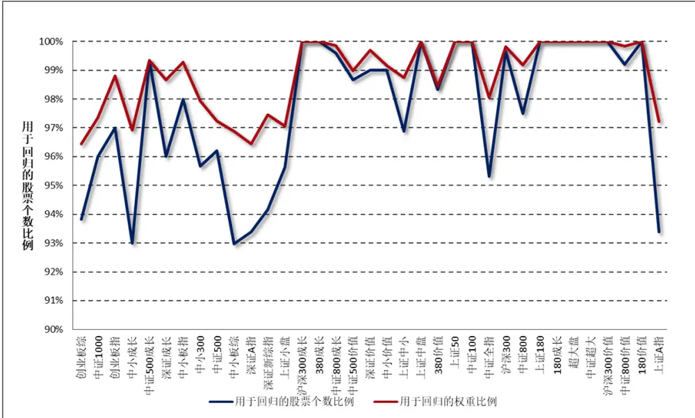
数据来源：财通证券研究所，Wind

## 4、 指数成分收益归因：

本部分财通金工对上周表现最好的三只指数和表现最差的三只指数进行归因分析，以观察涨幅较高（或较低）的指数风险暴露是否展现出较高的趋同性以及两类指数的持股风格是否会表现出明显的差别，其结果如图 14 和图 15 所示。

图14：上周表现最好三指数因子暴露度
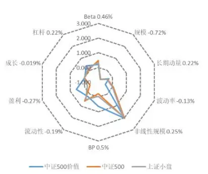
数据来源：财通证券研究所，Wind

图15：上周表现最差三指数因子暴露度
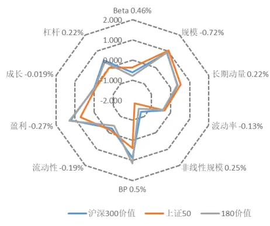
数据来源：财通证券研究所，Wind

表 4 展示了各大指数上周在各类因子上的暴露程度，可以看到，上周市场风格以小盘股票强势为主，表现最好的三只指数都是中小盘指数，其在 Beta 和非线性规模因子上暴露较多，而表现较差的三只指数则更多地偏向于大规模、高盈利股票。

谨请参阅尾页重要声明及财通证券股票和行业评级标准

表4：指数在风格因子上的暴露程度（2019.3.22）

| 代码 指数名称 |  | Beta 0.46% | 规模 -0.72% 长 | 期动量 0.2 波 | 动率 -0.13 非线性规模 C BP 0.5% |  |  | 流动性-0.19 | 盈利-0.27% 成 | 长-0.0199 | 杠杆 0.22% | 实际收益 |
| --- | --- | --- | --- | --- | --- | --- | --- | --- | --- | --- | --- | --- |
| H30352.CSI 中证500价值 |  | 0.199 | -0.771 | -0.249 | -0.510 | 2.026 | 0.633 | 0.208 | 0.578 | -0.014 | 0.391 | 5.19% |
| 000905.SH 中证500 |  | 0.466 | -0.763 | -0.352 | 0.054 | 1.985 | -0.228 | 0.583 | -0.402 | -0.007 | 0.067 | 4.91% |
| 000045.SH 上证小盘 |  | 0.345 | -0.733 | -0.383 | -0.006 | 1.879 | -0.035 | 0.461 | -0.222 | 0.007 | 0.154 | 4.80% |
| H30351.CSI 中证500成长 |  | 0.678 | -0.677 | -0.377 | 0.119 | 1.975 | -0.420 | 0.864 | -0.112 | 0.126 | 0.079 | 4.29% |
| 000852.SH | 中证1000 | 0.565 | -1.474 | -0.505 | 0.306 | 1.816 | -0.530 | 0.750 | -0.773 | 0.120 | -0.262 | 4.11% |
| 000118.SH | 380价值 | -0.031 | -0.862 | -0.259 | -0.373 | 1.925 | 0.646 | 0.016 | 0.757 | 0.007 | 0.458 | 4.05% |
| 399604.SZ | 中小价值 | 0.347 | -0.350 | -0.085 | 0.119 | 1.135 | -0.386 | 0.478 | -0.086 | -0.040 | -0.141 | 3.96% |
| 000046.SH | 上证中小 | 0.261 | -0.047 | -0.108 | -0.032 | 0.940 | -0.079 | 0.438 | -0.139 | -0.124 | 0.158 | 3.94% |
| 399100.SZ | 深证新综指 | 0.557 | -0.574 | -0.189 | 0.230 | 0.802 | -0.634 | 0.655 | -0.585 | 0.062 | -0.194 | 3.85% |
| 000117.SH | 380成长 | 0.253 | -0.747 | -0.230 | 0.067 | 1.842 | -0.574 | 0.645 | 0.095 | 0.139 | -0.015 | 3.75% |
| 399107.SZ | 深证A指 | 0.542 | -0.587 | -0.163 | 0.317 | 0.798 | -0.692 | 0.802 | -0.669 | 0.116 | -0.240 | 3.63% |
| 399348.SZ | 深证价值 | 0.350 | 0.493 | 0.342 | -0.079 | -0.307 | -0.277 | 0.591 | 0.369 | 0.047 | 0.250 | 3.50% |
| 399101.SZ | 中小板综 | 0.470 | -0.702 | -0.312 | 0.389 | 1.026 | -0.802 | 0.614 | -0.826 | 0.062 | -0.374 | 3.47% |
| 000985.CSI | 中证全指 | 0.254 | -0.210 | -0.036 | 0.046 | 0.284 | -0.246 | 0.433 | -0.192 | -0.017 | -0.072 | 3.40% |
| 000044.SH | 上证中盘 | 0.200 | 0.453 | 0.092 | -0.052 | 0.256 | -0.111 | 0.422 | -0.077 | -0.220 | 0.161 | 3.28% |
| 399008.SZ | 中小300 | 0.617 | -0.290 | -0.221 | 0.391 | 1.108 | -0.916 | 0.859 | -0.791 | 0.096 | -0.297 | 3.23% |
| 000906.SH | 中证800 | 0.159 | 0.416 | 0.166 | -0.090 | -0.187 | -0.111 | 0.330 | 0.076 | -0.050 | 0.041 | 3.00% |
| 399102.SZ | 创业板综 | 0.850 | -1.152 | -0.287 | 0.501 | 1.156 | -1.119 | 1.035 | -1.235 | 0.202 | -0.564 | 2.90% |
| 399602.SZ | 中小成长 | 0.768 | 0.003 | -0.248 | 0.503 | 0.691 | -1.035 | 0.949 | -0.686 | 0.079 | -0.212 | 2.84% |
| 000002.SH | 上证A指 | -0.242 | 0.305 | 0.086 | -0.115 | -0.421 | 0.290 | -0.196 | 0.275 | -0.021 | 0.077 | 2.73% |
| 399005.SZ | 中小板指 | 0.728 | 0.194 | -0.103 | 0.368 | 0.630 | -1.054 | 0.902 | -0.762 | 0.108 | -0.285 | 2.72% |
| 399346.SZ | 深证成长 | 0.830 | 0.336 | 0.133 | 0.387 | 0.057 | -1.090 | 1.071 | -0.668 | 0.110 | -0.010 | 2.42% |
| 000300.SH | 沪深300 | 0.067 | 0.783 | 0.330 | -0.138 | -0.866 | -0.073 | 0.252 | 0.226 | -0.066 | 0.029 | 2.37% |
| H30355.CSI | 中证800成长 | 0.361 | 0.480 | 0.338 | 0.013 | -0.280 | -0.810 | 0.627 | 0.093 | 0.103 | -0.005 | 2.26% |
| H30356.CSI | 中证800价值 | -0.303 | 0.678 | 0.288 | -0.395 | -0.813 | 0.684 | -0.101 | 1.023 | -0.042 | 0.437 | 2.19% |
| 000010.SH | 上证180 | -0.172 | 0.841 | 0.375 | -0.224 | -1.081 | 0.200 | 0.050 | 0.437 | -0.124 | 0.048 | 2.10% |
| 000028.SH | 180成长 | -0.338 | 0.890 | 0.562 | 0.004 | -1.221 | -0.288 | 0.068 | 0.360 | 0.034 | 0.002 | 2.01% |
| 000903.SH | 中证100 | -0.124 | 1.034 | 0.468 | -0.249 | -1.672 | 0.091 | 0.035 | 0.507 | -0.083 | 0.025 | 1.91% |
| 399006.SZ | 创业板指 | 0.787 | -0.170 | 0.111 | 0.676 | 1.033 | -1.355 | 1.296 | -1.243 | 0.240 | -0.456 | 1.88% |
| 000043.SH | 超大盘 | -0.229 | 1.063 | 0.225 | -0.245 | -1.899 | 0.251 | -0.006 | 0.504 | -0.018 | -0.102 | 1.84% |
| 000980.CSI | 中证超大 | -0.226 | 1.063 | 0.296 | -0.263 | -1.875 | 0.303 | -0.191 | 0.565 | 0.017 | 0.059 | 1.66% |
| 000918.SH | 沪深300成长 | 0.205 | 0.786 | 0.493 | -0.022 | -0.839 | -0.891 | 0.503 | 0.162 | 0.066 | -0.071 | 1.60% |
| 000919.CSI | 沪深300价值 | -0.609 | 0.907 | 0.370 | -0.373 | -1.286 | 0.862 | -0.273 | 1.230 | -0.006 | 0.439 | 1.58% |
| 000016.SH | 上证50 | -0.376 | 1.054 | 0.530 | -0.318 | -1.815 | 0.371 | -0.154 | 0.720 | -0.071 | -0.014 | 1.44% |
| 000029.SH | 180价值 | -0.792 | 0.949 | 0.346 | -0.403 | -1.469 | 1.133 | -0.446 | 1.300 | -0.041 | 0.334 | 1.21% |

数据来源：财通证券研究所，Wind

注：实习生上海财经大学李迪参与本课题，为本报告作出重要贡献。

## 5、 附录

| 附录一：财通金工指数池选取中证规模/风格指数 |  |  |  |  |  |  |  |
| --- | --- | --- | --- | --- | --- | --- | --- |
|  |  |  |  |  |  | 上证规模/风格指数 | 深证综合/规模指数 |
| 000001.SH | 上证综指 | 399101.SZ | 中小板综 | 000300.SH | 沪深 300 |  |  |
| 000002.SH | 上证A指 | 399102.SZ | 创业板棕 | 000852.SH | 中证 1000 |  |  |
| 000010.SH | 上证 180 | 399106.SZ | 深证综指 | 000985.CSI | 中证全指 |  |  |
| 000016.SH | 上证50 | 399107.SZ | 深证 A指 | 000980.CSI | 中证超大 |  |  |
| 000043.SH | 超大盘 | 399005.SZ | 中小板指 | 000903.SH | 中证100 |  |  |
| 000044.SH | 上证中盘 | 399006.SZ | 创业板指 | 000905.SH | 中证500 |  |  |
| 000045.SH | 上证小盘 | 399008.SZ | 中小300 | 000906.SH | 中证 800 |  |  |
| 000046.SH | 上证中小 | 399346.SZ | 深证成长 | 000918.SH | 沪深 300 成长 |  |  |
| 000028.SH | 180成长 | 399348.SZ | 深证价值 | 000919.SH | 沪深 300 价值 |  |  |
| 000029.SH | 180 价值 | 399602.SZ | 中小成长 | H30351.CSI | 中证 500 成长 |  |  |
| 000117.SH | 380成长 | 399604.SZ | 中小价值 | H30352.CSI | 中证 500 价值 |  |  |
| 000118.SH | 380 价值 |  |  | H30355.CSI | 中证800 成长 |  |  |
|  |  |  |  | H30356.CSI | 中证 800 价值 |  |  |

数据来源：财通证券研究所

附录二：财通金工风格因子定义

|  | 财通金工风 |  |  |  |
| --- | --- | --- | --- | --- |
| 大类因子 | 子类因子 | 因子定义及计算 | 权重 | 备注 |
| Beta | BETA | $\mathrm{r_{t}}=\alpha+\beta\mathrm{R_{t}}+\mathrm{e_{t}},$ 将单只股票过去252天的日度收益率对流通市值加权指数日度收益率进行半衰指数加权回归，半衰期为63 天 | 1 | 1) 采用流通市值而非总市值加权，因为各大指数编制采用流通市值加权；2) 需要剔除当日停牌或者未上市日期的数据，并将权重进行归一化；3)若满足条件的样本数据少于42天，我们将其 Beta 置为 NaN。 |
| 规模 | SIZE | 股票总市值取对数 | 1 | 由于PB、PE等因子的计算是基于总市值的，因此此处也用总市值 |
| 动量 | RSTR | 过去一段时间个股的累计收益率，不含最近一个月， $\begin{array}{r}{\mathsf{RSTR}=\sum_{\mathrm{t=L}}^{\mathrm{T+L}}\mathsf{w}_{\mathrm{t}}(\ln(1+\mathrm{r}_{\mathrm{t}}),}\end{array}$ $\mathrm{r_{t}=P_{t}/P_{t-1}-1,~T=504,~L=21,}$ 收益率序列采用半衰指数加权，半衰期为126天 | 1 | 1) 对于数据质量较好的个股，计算动量时采用了2年的数据2) 需要剔除未上市日期数据，但无需剔除停牌日期数据，并将权重归一化3) 若满足条件的数据样本小于42天，我们将其动量置为NaN |
| 波动率(对Beta因子和市值因子进行正交化处理) | DASTD | 个股相对市值加权指数的超额收益率序列的半衰指数加权标准差，T=252，半衰期为42天1/2 $\mathrm{{DASTD}=\left(\sum_{t=1}^{T}w_{t}\big(r_{t}-\mu(r)\big)^{2}\right)^{:}}$ | 0.7 | 1) 采用流通市值加权计算指数收益2) 需要剔除当日停牌或者未上市日期的数据，并将权重进行归一化3) 若满足条件的数据样本小于42天，我们将其因子值置为NaN |
|  | CMRA | 表示过去12个月的波动幅度， $\begin{array}{r}{\mathbb{C}\mathbb{M}\mathbb{R}\mathbb{A}=\ln(1+\operatorname*{max}\{\mathrm{Z}(\mathrm{T})\})-\ln(1+}\\{\operatorname*{min}\{\mathrm{Z}(\mathrm{T})),}\end{array}$ 其 $\begin{array}{r}{\mathsf{E}\oplus\mathsf{Z}(\mathrm{T})=\exp\bigl(\sum_{\mathrm{t}=1}^{\mathrm{T}}\ln(1+\mathrm{r_{t}})\bigr)-1}\end{array}$ ，表示过去T个月的收益率 | 0.15 | 以 21 天为 1 个月 |
|  | HSIGMA | 计算 Beta 时残差的标准差， ${\mathrm{Hsigma}}=s{\mathrm{td}}(e_{i})$ | 0.15 | 同 Beta 因子的计算 |
| 非线性规模 | NonLinerSize | 中市值因子，将股票总市值对数的三次方对总市值对数回归，取残差的相反数 | 1 | 用于衡量市值因子的非线性性，总市值越大和越小的股票的非线性规模越小，中市值股票的非线性规模越大 |
| 估值 | BP | 市净率的倒数，1/PB | 1 | 采用 Wind 中的 pb_lf 因子的倒数 |
| 流动性(对市值因子进行正交化） | STOM | 月度换手率，STOM = In(mean(Σt=1(Vt/St))其中V为当日成交量，S为流通股本 | 0.5 | 1)采用流通股本值，而非自由流通股本值2)剔除未上市、停牌日期的数据 |
|  | STOQ | 季度换手率， $\begin{array}{r}{\mathrm{STOQ}=\ln(\operatorname*{mean}(\sum_{t=1}^{63}(V_{t}/S_{t}))),}\end{array}$ | 0.25 | 同 STOQ 因子的计算 |
|  | STOA | 年度换手率， $\mathrm{STOA}=\ln(\mathrm{mean}(\sum_{t=1}^{252}(V_{t}/S_{t}))),$ | 0.25 | 同 STOQ 因子的计算 |
| 盈利 | CETOP | 过去滚动12个月的经营现金流除以当前市值实际计算中取市现率 PCF（经营现金流 TTM）的倒数 | 1/2 | 采用 Wind 中的 $\mathrm{PCF\_OCF\_ttm}$ 因子的倒数 |
|  | ETOP | 过去滚动12个月的利润除以当前市值实际计算中取市盈率 PETTM 的倒数 | 1/2 | 采用 Wind 中的 PE_ttm 因子的倒数 |
| 成长 | YOYProfit | 单季度净利润同比增长率 | 1/2 | 为避免使用未来数据，需要根据季报公布时间进行调整 |
|  | YOYSales | 单季度营业收入同比增长率 | 1/2 | 同 YOYProfit 因子的计算 |
| 杠杆 | MLEV | 市场杠杆率，MLEV=（总市值+非流动负债）/总市值 | 1/3 |  |
|  | DTOA | 资产负债率，DTOA=总资产/总负债 | 1/3 |  |
|  | BLEV | 账面杠杆率，BLEV=（账面价值+非流动负债）/账面价值 | 1/3 |  |

数据来源：财通证券研究所
备注： 波动率因子需对 因子和市值因子进行正交化处理；
2.流动性因子需对市值因子进行正交化处理；
3.若大类因子下所有子类因子值全部缺失，则该股票的因子值记为缺失，否则用有数据的因子值进行替代，注意需对权重进行归一化处理

## 信息披露

## 分析师承诺

作者具有中国证券业协会授予的证券投资咨询执业资格，并注册为证券分析师，具备专业胜任能力，保证报告所采用的数据均来自合规渠道，分析逻辑基于作者的职业理解。本报告清晰地反映了作者的研究观点，力求独立、客观和公正，结论不受任何第三方的授意或影响，作者也不会因本报告中的具体推荐意见或观点而直接或间接收到任何形式的补偿。

## 资质声明

财通证券股份有限公司具备中国证券监督管理委员会许可的证券投资咨询业务资格。

## 公司评级

买入：我们预计未来 6 个月内，个股相对大盘涨幅在 15%以上；

增持：我们预计未来 6 个月内，个股相对大盘涨幅介于 5%与15%之间；

中性：我们预计未来 6 个月内，个股相对大盘涨幅介于-5%与5%之间；

减持：我们预计未来 6 个月内，个股相对大盘涨幅介于-5%与-15%之间；

卖出：我们预计未来 6 个月内，个股相对大盘涨幅低于-15%。

## 行业评级

增持：我们预计未来 6 个月内，行业整体回报高于市场整体水平 5%以上；

中性：我们预计未来 6 个月内，行业整体回报介于市场整体水平-5%与 5%之间；

减持：我们预计未来 6 个月内，行业整体回报低于市场整体水平-5%以下。

## 免责声明

本报告仅供财通证券股份有限公司的客户使用。本公司不会因接收人收到本报告而视其为本公司的当然客户。

本报告的信息来源于已公开的资料，本公司不保证该等信息的准确性、完整性。本报告所载的资料、工具、意见及推测只提供给客户作参考之用，并非作为或被视为出售或购买证券或其他投资标的邀请或向他人作出邀请。

本报告所载的资料、意见及推测仅反映本公司于发布本报告当日的判断，本报告所指的证券或投资标的价格、价值及投资收入可能会波动。在不同时期，本公司可发出与本报告所载资料、意见及推测不一致的报告。

本公司通过信息隔离墙对可能存在利益冲突的业务部门或关联机构之间的信息流动进行控制。因此，客户应注意，在法律许可的情况下，本公司及其所属关联机构可能会持有报告中提到的公司所发行的证券或期权并进行证券或期权交易，也可能为这些公司提供或者争取提供投资银行、财务顾问或者金融产品等相关服务。在法律许可的情况下，本公司的员工可能担任本报告所提到的公司的董事。

本报告中所指的投资及服务可能不适合个别客户，不构成客户私人咨询建议。在任何情况下，本报告中的信息或所表述的意见均不构成对任何人的投资建议。在任何情况下，本公司不对任何人使用本报告中的任何内容所引致的任何损失负任何责任。

本报告仅作为客户作出投资决策和公司投资顾问为客户提供投资建议的参考。客户应当独立作出投资决策，而基于本报告作出任何投资决定或就本报告要求任何解释前应咨询所在证券机构投资顾问和服务人员的意见；

本报告的版权归本公司所有，未经书面许可，任何机构和个人不得以任何形式翻版、复制、发表或引用，或再次分发给任何其他人，或以任何侵犯本公司版权的其他方式使用。