2019 年 04 月 01 日

# 从纯因子组合的角度看待多重共线性

## “拾穗”多因子系列报告（第 7 期）

## 联系信息

陶勤英分析师

SAC 证书编号：S0160517100002 021-68592393

taoqy@ctsec.com

张宇联系人

zhangyu1@ctsec.com 021-68592337

176216888421

## 相关报告

【1】“星火”多因子系列（一）：《Barra模型初探：A 股市场风格解析》

【2】“星火”多因子系列（二）：《Barra模型进阶：多因子模型风险预测》

【3】“星火”多因子系列（三）：《Barra模型深化：纯因子组合构建》

【4】“拾穗”多因子系列（一）：《带约束的加权最小二乘：一种解析解法》

【5】“拾穗”多因子系列（二）：《你看到的不一定是你所想的：解密 R 方》

【6】“拾穗”多因子系列（三）：《行业因子选取：中信一级还是申万一级？》

【7】“拾穗”多因子系列（四）：《总市值、流通市值、自由流通市值：谈谈取舍》

【8】“拾穗”多因子系列（五）：《数据异常值处理：比较与实践》

【9】“拾穗”多因子系列（六）：《因子缺失值处理：数以多为贵》

## 投资要点：

- 从纯因子组合的角度看待多重共线性

- 对因子有效性的评价通常有分组法、Fama-Macbeth 方法、简单因子组合法和纯因子组合法。

- 简单因子组合衡量的是组合每增加一个单位因子的暴露对组合收益的影响情况；纯因子组合衡量的是在剔除其他因子的影响之后，每增加一个单位的目标因子暴露能够给组合带来的风险溢价。

- 在财通金工多因子模型中，因子之间的 VIF 系数小于 3，说明多重共线性的问题并不严重。但从因子权重系数 、因子收益相关系数 FRC 和因子杠杆率 LEV来看，部分行业和风格因子仍然会明显受到其他因子的影响。

## 市场风格解析

整体来讲，在过去的一个月中，高 Beta 的股票、前期涨幅较高的股票能够获得相对较高的收益，而大规模、高换手、高波动的股票后市走势将会出现更为明显的回撤。

## 指数风险预测

所有样本指数在未来一个月的年化波动区间在 之间，相较上周略有上涨，财通金工特别提醒投资者注意当前市场的波动情况。

## 指数成分收益归因

上周市场风格以大盘股为主，表现最好的三只指数都是大盘指数，其在规模因子和长期动量因子上暴露较多，而表现较差的三只指数更多得偏向于中小规模股票，其在非线性规模因子上的较大暴露拖累指数收益。

- 风险提示：本报告统计结果基于历史数据，过去数据不代表未来，市场风格变化可能导致模型失效。

在实际投资中，多因子模型被广泛地应用到资产定价、绩效归因、风险控制、组合优化、基金评价及资产配置等各个领域，一套完整、精细的多因子系统成为每位量化研究者必备的工具。“做最实用的研究”，是财通金工给自己的定位。我们将在之后的系列报告中，就投资者们最关心也最容易忽略的很多细节问题进行探讨，介绍我们在实际应用中遇到的问题和思考，以飨读者。

我们为本系列报告取名“拾穗”。一周市场风云变幻，和风细雨也好，狂风骤雨也罢，都留下一地故事等待梳理。作为勤劳的搬运工，财通金工从量化视角出发对市场风格进行捕捉、对风险水平进行预测，既是希望能够如拾穗者般专心、踏实地做研究，也是祝愿各位投资者能够在市场收获满地金黄。

本期是该系列报告的第七期，主要讨论如何从纯因子组合的角度看待因子之间的多重共线性关系，通过对简单因子组合和纯因子组合之间的关系进行探讨以期帮助投资者对因子之间的协同关系有更加深刻的认识。

## 1、 从纯因子组合的角度看待多重共线性

在财通金工“星火”多因子专题（三）《 模型深化：纯因子组合构建》中，我们讨论了纯因子组合在实际投资中的意义及其构建方法，我们认为随着国内市场的逐步完善，量化产品在未来将更多地偏向于工具化、指数化发展。对于投资者而言，当需要根据个人观点对国家、行业或者风格进行配置时，这种正交的、纯粹的纯因子组合产品将会大显威力。作为“星火”系列的衍生报告，本期我们仍然从纯因子组合（Pure Factor Portfolio）的构建出发，探讨其与简单因子组合（Simple Factor Portfolio）之间的关系，并讨论如何从纯因子组合的角度看待因子之间的多重共线性问题。

在实际研究中，因子的收益率往往需要落实在组合的收益率上。当我们构建了一个因子之后，通常有多种不同的方法对因子的有效性进行评价，主要方法包括：

（1） 分组法：将全市场所有股票根据因子的大小进行分组，根据因子对收益率的影响方向对第一组和最后一组构建多空组合，观察多空组合的收益情况；

（2）Fama-French方法：将全市场所有股票按照其市值分为S和 B两组，再根据目标因子的大小按照前 、中间 和后 的关系分别构建三个组合（记为 H、N、L），由此因子收益可以通过如下几个组合的收益之差计算得到：

$$
HML=\frac{SH+BH}{2}-\frac{SL+BL}{2}
$$

其中，每组收益可以采用等权或者市值加权求得；

（3） 简单因子组合：将全市场股票收益对股票因子值进行回归，将回归得到的系数视为因子收益，它衡量的是组合每增加一个单位因子的暴露对组合收益的影响情况；

（4） 纯因子组合：是指将所有可能的因子纳入到回归中，将回归得到的系数作为纯因子收益。纯因子组合对于目标因子存在单位暴露，对于其他因子则不存在暴露。它衡量的是在剔除其他因子的影响之后，每增加一个单位的目标因子暴露能够给组合带来的风险溢价。

由以上分析可知，分组法和 Fama-French 的方法均是通过人为地对股票进行分组来构建投资组合，然而如何对分位点进行选择通常是一件比较主观的事情。基于此，我们在本文的讨论中主要对简单因子组合及纯因子组合进行介绍，关于分组法和 Fama-French 方法对单因子的回测，财通金工将在后续的“星火”专题中进行介绍，欢迎投资者持续关注。

图 1：因子评价主要方法
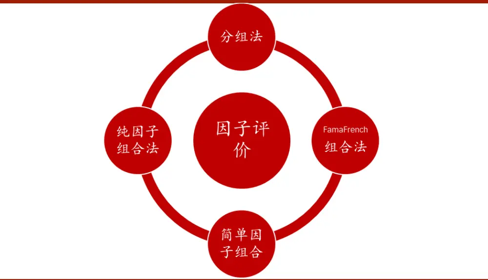
数据来源：财通证券研究所

## 1.1 简单风格因子组合

与纯因子组合不同，简单因子组合的收益是根据一元线性回归拟合得到的。以简单风格因子组合为例，在某个截面期上，将全市场所有股票的收益对单个风格因子进行如下回归：

$$
r_{n}=f_{c}^{S}+X_{ns}f_{s}^{S}+u_{c}^{S}
$$

其中 $r_{n}$ 表示股票n的收益率， $X_{ns}$ 为股票 $n.$ 在风格因子s上的暴露大小， $f_{c}^{S}$ 、 $f_{s}^{S}$ 和$u_{c}^{S}$ 分别为截距项因子收益、风格因子收益和特质收益。由于股票收益通常存在异方差性（即小市值股票的特质波动率会明显地高于大市值股票的特质波动），因此我们采用加权最小二乘方法（WLS）来主动减少这些特质波动较大的股票在回归中的权重。在实际应用中，通常采用市值的平方根加权作为回归权重 $v_{n}$ ，当然这并不是唯一的赋权方法，其他能够达到类似效果的权重选择我们认为都是合意的。

在进行模型拟合之前，我们还需对风格因子进行标准化处理。在财通金工纯因子组合的专题报告中，我们通常使得全市场股票因子的市值加权平均等于0，然而在对简单因子组合进行求解时，我们不做这样的处理，而是转而使股票因子的回归权重加权等于 ，用公式表示即为：

$$
\sum_{n}v_{n}X_{ns}=0
$$

其中 $v_{n}$ 表示股票n的回归权重。这样处理的好处在于，风格因子与截距项因子（市场因子）之间不存在共线性问题。同样的，在对风格因子的标准差进行归一化时，传统的做法是除以因子的普通标准差即可，但在此处我们使得因子的回归加权标准差等于1，用公式表示即为：

$$
\sum_{n}v_{n}X_{ns}^{2}=1
$$

在对因子值进行了标准化，并对股票的拟合方式进行了设定后，我们即可对模型进行求解。由于风格因子与截距项因子不存在共线性，我们可以直接采用最小加权二乘的解析解对上式进行求解。首先我们计算如下矩阵：

$$
\begin{array}{c}{\begin{array}{rl}{X^{T}VX={\binom{1}{X_{1s}}}\quad{\begin{array}{llll}{1}&{\cdots}&{1}\\{X_{2s}}&{X_{2s}}&{\cdots}&{X_{Ns}}\end{array}}{\left(\begin{array}{llll}{v_{1}}&{0}&{\cdots}&{0}\\{0}&{v_{2}}&{\cdots}&{0}\\{\vdots}&{\vdots}&{\ddots}&{\vdots}\\{0}&{0}&{\cdots}&{v_{N}}\end{array}\right)}{\left(\begin{array}{ll}{1}&{X_{1s}}\\{1}&{X_{2s}}\\{\vdots}&{\vdots}\\{1}&{X_{Ns}}\end{array}\right)}}\\&{={\left(\begin{array}{llll}{\displaystyle\sum_{n=1}^{N}v_{n}}&{\displaystyle\sum_{n=1}^{N}v_{n}X_{ns}}\\{\displaystyle\sum_{n=1}^{N}v_{n}X_{ns}}&{\displaystyle\sum_{n=1}^{N}v_{n}X_{ns}^{2}}\end{array}\right)}={\binom{1}{0}}}\end{array}}&{{\mathrm{(}}{\begin{array}{ll}{1}&{0}\\{0}&{1}\end{array}}{\mathrm{)}}}\end{array}
$$

上述最后一个等式之所以成立，是因为回归权重的总和等于1，标准化后的风格因子回归权重加权等于0，且其回归权重加权标准差等于1。由此，即可推导出截距项因子和风格因子的收益表达式：

$$
\begin{array}{rl}{\left.f_{S}^{S}\right.=(X^{T}VX)^{-1}X^{T}Vrr=X^{T}Vr}&{}\\{\left.f_{S}^{S}\right.=(X^{T}VX)^{-1}X^{T}Vrr=X^{T}Vr}&{}\\{=\left(\begin{array}{llll}{1}&{1}&{\cdots}&{1}\\{X_{1s}}&{X_{2s}}&{\cdots}&{X_{Ns}}\end{array}\right)\left(\begin{array}{llll}{v_{1}}&{0}&{\cdots}&{0}\\{0}&{v_{2}}&{\cdots}&{0}\\{\vdots}&{\vdots}&{\ddots}&{\vdots}\\{0}&{0}&{\cdots}&{v_{N}}\end{array}\right)\left(\begin{array}{l}{r_{1}}\\{\vdots}\\{\vdots}\\{r_{N}}\end{array}\right)}\\{=\left(\begin{array}{lllll}{v_{1}}&{v_{2}}&{\cdots}&{v_{N}}\\{v_{1}X_{1s}}&{v_{2}X_{2s}}&{\cdots}&{v_{N}X_{Ns}}\end{array}\right)\left(\begin{array}{l}{r_{1}}\\{\vdots}\\{r_{N}}\end{array}\right)=\left(\begin{array}{l}{\sum_{n}v_{n}r_{n}}\\{\sum_{n}(v_{n}X_{ns})r_{n}}\end{array}\right)}\end{array}
$$

将上述求解的矩阵形式拆解为向量形式，即可得到截距项因子和风格因子的收益表达式：

$$
f_{s}^{S}=\sum_{n}(v_{n}X_{ns})r_{n}~f_{c}^{S}=\sum_{n}v_{n}r_{n}
$$

可以看到，对于某个风格因子s而言，其简单因子组合中股票n的权重为 $v_{n}X_{ns}$ 根据我们之前对风格因子的标准化处理方法可知，该组合的所有股票权重总和等于0，也就是说它是一个零额投资组合（dollar-neutral）。进一步分析可知，该简单因子组合对风格因子的暴露度为1，这是由因子的回归加权波动等于1而决定的。

对于截距项因子（简单市场因子）组合而言，它实际上是全市场所有股票收益的回归权重加权。因此，如果我们采用的回归权重是股票的市值权重，那么简单市场因子即为全市场股票的市值加权平均，即通常所说的指数收益。

## 1.2 简单行业因子组合

在上一小节中我们讨论了简单风格因子组合的构建方法，本节我们探讨简单行业因子组合的构建，其主要模型如下：

$$
r_{n}=f_{c}^{S}+\sum_{i}X_{ni}f_{i}^{S}+u_{n}^{S}
$$

其中， $X_{ni}$ 代表股票 n 在行业因子 i 上的暴露值，我们采用 0-1 变量表示。由于每只股票属于且只属于一个行业，因此截距项因子与行业因子之间存在完全共线性，我们必须为其增加一个约束条件才能求得唯一解。常用的做法是使得单个行业因子收益的市值加权平均等于 0，即：

$$
\sum_{i}W_{i}f_{i}^{s}=0
$$

其中 $W_{i}$ 表示行业 i 的市值权重，所有行业的市值权重加总等于 1。

对以上公式进行求解，有：

$$
f_{c}^{s}=\sum_{i}W_{i}\sum_{n\in i}\left(\frac{v_{n}r_{n}}{V_{i}}\right)~f_{i}^{s}=\frac{1}{V_{i}}\sum_{n\in i}v_{n}r_{n}-f_{c}^{s}
$$

其中， $V_{i}$ 表示行业 i 中所有股票的回归权重之和， $W_{i}$ 表示行业 i 中所有股票的市值权重之和。由此可，对于简单行业因子组合中的市场因子组合fS而言，它是一个纯多头组合，且该组合中的成分股权重之和等于 1，它对于每个行业是市值加权的，但是对于行业内部的成分股则采用的是回归权重加权。对于简单行业因子组合 $f_{i}^{S}$ 而言，它可以通过做多单个行业成分股中回归权重加权组合、同时做空市场因子组合得到。

## 1.3 纯因子组合：

在财通金工多因子体系中，我们将全市场股票收益拆解到市场收益、行业收益、风格收益和特质收益四个部分：

$$
r_{n}=f_{c}^{P}+\sum_{i}X_{ni}f_{i}^{P}+\sum_{s}X_{ns}f_{s}^{P}+u_{n}^{P}
$$

其中， $X_{ni}$ 表示股票n在行业因子i上的暴露度， $X_{ns}$ 表示股票 $\mathbf{\nabla}\cdot\mathbf{n},$ 在风格因子s上的暴露度。由于截距项因子与行业因子之间存在完全共线性，我们需加入行业因子收益的市值加权均值等于0的约束条件，以使得方程有唯一解：

$$
\sum_{n}W_{i}f_{i}^{P}=0
$$

同样的，由于异方差性的存在，我们采用加权最小二乘法对上式进行求解，单个股票的权重即为其自由流通市值的平方根权重。特别需要注意的是，此处对于风格因子的标准化与简单因子组合中的因子标准化不同。在对纯因子组合进行构建的时候，我们使得因子的市值加权平均等于0，而非回归加权平均等于0。这样做的一个好处在于，对于截距项因子而言，其回归所得的收益即为市场指数的收益，这一点在“星火”系列的第一篇专题中有详细介绍。

在对模型的构建及因子预处理方法进行介绍后，我们就可以开始对模型进行拟合了。在财通金工“拾穗”系列（一）《带约束的加权最小二乘：一种解析解法》中，我们介绍了一种解析解法直接对各纯因子的收益进行求解：

$$
\hat{\beta}=S\hat{\gamma}=S(S^{T}X^{T}VXS)^{-1}(XS)^{T}Vr
$$

其中，V表示回归权重矩阵，r表示样本股票的收益，X为股票因子暴露矩阵，S为线性变换向量。由此，每个纯因子组合的权重矩阵 $\cdot\Omega^{P}$ 可以表示为：

$$
\Omega^{P}=S(S^{T}X^{T}VXS)^{-1}(XS)^{T}V
$$

上述矩阵的每一行代表每一个纯因子组合的权重向量。

## 1.4 实证检验

到目前为止，我们对简单风格因子组合、简单行业因子组合及纯因子组合的概念及其计算方法进行了介绍。本小节我们从实证角度出发，观察简单因子组合和纯因子组合在回测区间内的净值走势，其中各类风格因子的计算方法如附录2所示。

财通金工以2009.12.31-2019.2.28为回测区间，以Wind全A为样本，对全市场股票收益进行月度回归，图2和图3分别展示了Beta因子和换手率因子的简单因子谨请参阅尾页重要声明及财通证券股票和行业评级标准组合和纯因子组合的走势。可以看到，对于这两类因子组合而言，简单因子组合和纯因子组合的走势存在较为明显的区别。对于简单Beta因子组合而言，其样本回测区间累计收益为负，说明A股市场存在低Beta效应。然而在剔除了其他因子的影响之后，Beta因子的走势有较为明显的增强。同样的，对于换手率因子而言，剔除了其他已知风格因子影响的换手率因子收益更为稳定，这主要是由于换手率因子和波动率等因子存在非常明显的相关性，而波动率等因子在A股市场上又属于强有效的因子而导致的。

图2：Beta因子组合净值比较
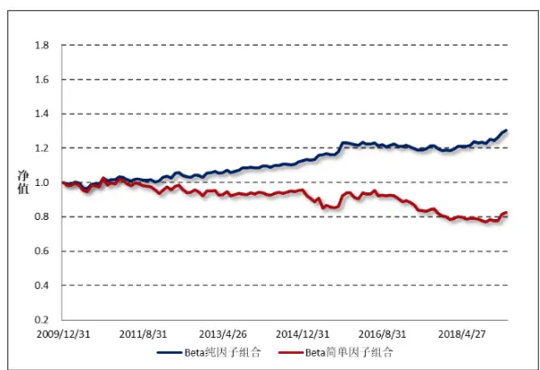
数据来源：财通证券研究所，Wind

图3：换手率因子组合净值比较
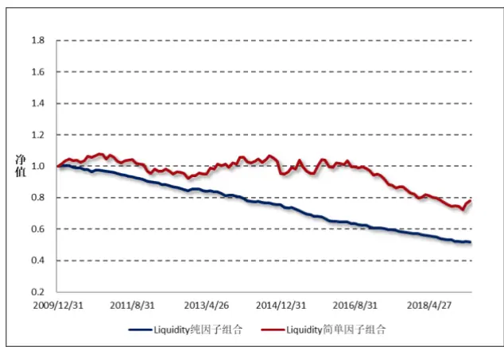
数据来源：财通证券研究所，Wind

事实上，并非所有风格因子组合的纯因子和简单因子收益都会存在非常明显的区别，图4和图5分别绘制了规模因子和价值（BP）因子的纯因子组合及简单因子组合的净值走势，可以看到对于这两类因子而言，两种组合的走势还是较为贴合的。究其原因，财通金工认为是这两类因子与其他因子的相关性较弱造成的。（注意，在因子计算时，波动率因子已经对 和市值进行了正交化，换手率因子也对市值进行了正交化，因此尽管原始的波动率因子和换手率因子都和市值因子存在强相关关系，但经过正交化处理之后的因子与市值因子的相关性大大减弱了）。

图4：规模因子组合净值比较
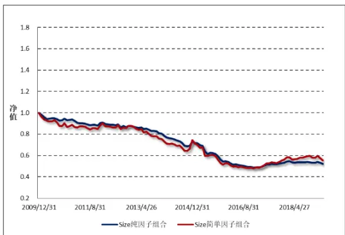
数据来源：财通证券研究所，Wind

图5：价值因子组合净值比较
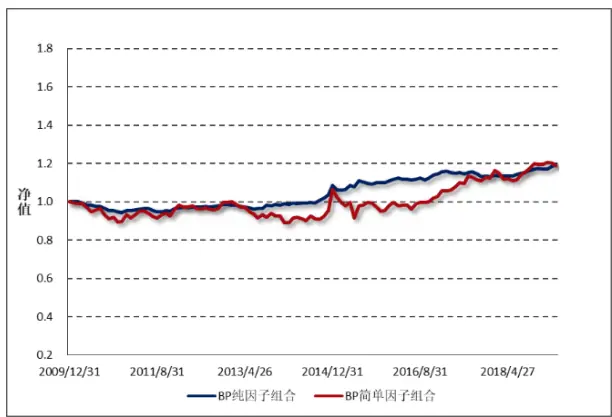
数据来源：财通证券研究所，Wind

## 1.5 多重共线性

由上一小节可知，对于不同的风格因子而言，其简单因子组合和纯因子组合的净值走势会出现不同的分化。有些因子的走势较为贴近，有些因子的走势则相差较大，这样的区别究竟是由于什么原因导致的呢？财通金工将在本小节从简单因子组合和纯因子组合的概念出发，为因子之间的共线性问题提供一定的思考。

提起多重共线性的检验，就不得不提方差膨胀系数（VIF 值）。VIF 值主要用于衡量自变量之间的多重共线性，它是通过将目标因子对其他因子进行横截面回归并根据回归模型的 $R^{2}$ 计算得到：

$$
X_{nk}=\sum_{k^{\prime}\neq k}X_{nk^{\prime}}b_{k^{\prime}}+\varepsilon_{nk}\qquad\Rightarrow\qquad VIF_{k}=\frac{1}{1-R_{k}^{2}}
$$

图6展示了回测区间，行业因子和风格因子的VIF平均值，一般我们认为VIF值小于3即说明该因子与其他因子之间不存在严重的完全共线性关系。由图中可以看到，所有因子的VIF值都小于3，说明在我们的多因子模型中完全共线性的影响并不十分严重。在所有的因子中，残差波动因子和换手率因子的VIF值相对较高。

图6：行业因子和风格因子的方差膨胀系数（VIF）
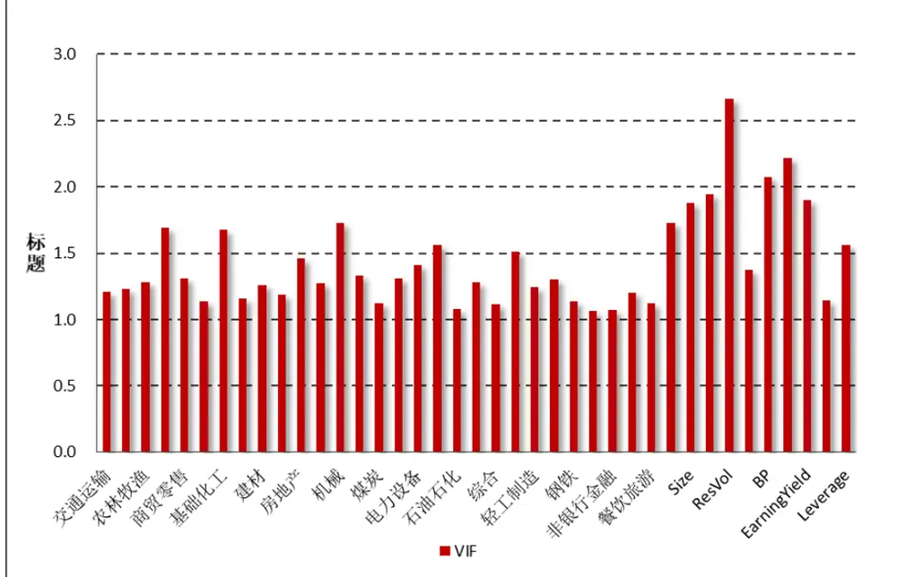
数据来源：财通证券研究所，Wind

前面提到，简单因子组合是不存在完全共线性的，而纯因子组合是剥离了其他已知因子的影响得到的组合，因此因子与因子之间的共线性问题，即可通过纯因子组合的权重与简单因子组合的权重对比来观察。

Menchero（2010）提出采用因子权重相关系数（Factor Weight Correlation）来衡量目标因子与其他因子之间的共线性，它表示的是简单因子组合和纯因子组合在横截面上的相关系数。具体来讲，假设 $\boldsymbol{\mathrm{2}}_{nk}^{P}$ 表示纯因子组合k中股票n的权重，$\Omega_{nk}^{s}$ 表示简单因子组合k中股票n的权重，那么FWC系数可以通过如下方法计算得到：

$$
\rho_{k}^{CS}=\frac{\frac{1}{n}\sum_{n}\Omega_{nk}^{P}\cdot\Omega_{nk}^{s}}{\sigma(\Omega_{k}^{P})\sigma(\Omega_{k}^{s})}
$$

由于纯因子组合和简单因子组合都是零额投资的，因此这些组合的权重均值等于0，FWC实际上就是两个组合权重的相关系数。

图7：行业及风格因子的因子权重相关系数平均值
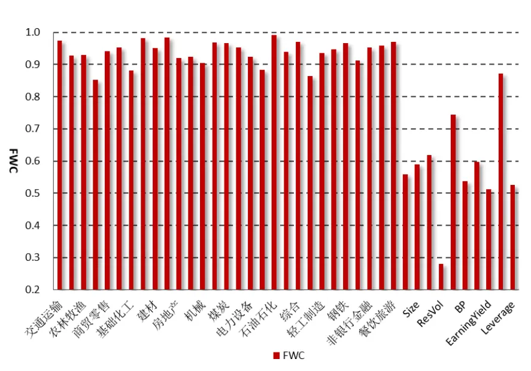
数据来源：财通证券研究所，Wind

图7绘制了回测区间段内，29个中信一级行业因子和10个风格因子在横截面上的因子权重相关系数平均值，可以看到所有行业因子的权重相关系数都在0.85以上，绝大部分超过了 ，说明行业因子与其他已知因子的共线性程度并不强。而对于风格因子而言，这一相关系数就大大减弱了。这主要是由于部分风格因子本身与其他风格因子甚至是行业因子之间也存在明显的共线性。

Menchero（2010）还提出了另外一项指标因子收益相关系数（Factor ReturnCorrelation），即通过计算因子收益的相关性来观察因子之间的共线性程度。FRC系数是通过计算简单因子组合的收益和纯因子组合的收益在时间序列上的相关系数得到：

$$
\rho_{k}^{TS}=\frac{\frac{1}{T}\sum_{t}\left(f_{kt}^{P}-\bar{f}_{k}^{P}\right)\left(f_{kt}^{S}-\bar{f}_{k}^{S}\right)}{\sigma(f_{k}^{P})\sigma(f_{k}^{S})}
$$

直观上来讲，如果单个因子与其他因子之间的共线性程度很低，那么其他因子的加入并不会对该因子的收益产生明显的影响，该因子的简单因子组合收益和纯因子组合收益将会存在一致性，即上一小节所说的分化程度较小。

图8展示了行业因子和风格因子在回测区间内的FRC系数，可以看到对于大部分行业而言，该系数能够保持在0.8以上，但是对于部分行业因子（如银行业）和部分风格因子（换手率因子），该系数就十分低了。

图8：行业因子和风格因子的因子收益相关系数
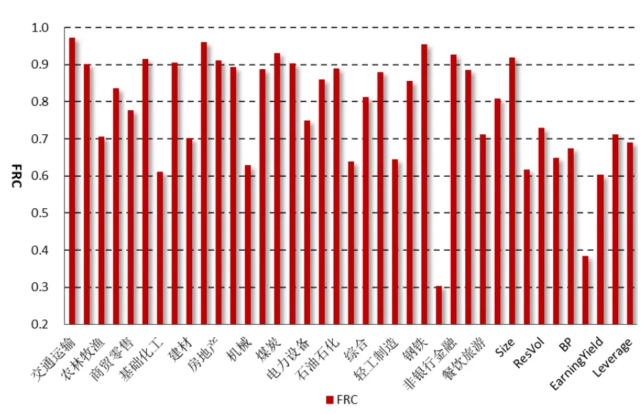
数据来源：财通证券研究所，Wind

Menchero（2010）提出的第三个衡量共线性的指标是因子杠杆率（FactorLeverage Ratio），它被定义为纯因子组合与简单因子组合的成分股权重杠杆率：

$$
LEV_{k}=\frac{\sum_{n}\left|\Omega_{nk}^{P}\right|}{\sum_{n}\left|\Omega_{nk}^{S}\right|}
$$

直观上来讲，如果因子杠杆率大于1，说明为了对冲掉其他因子对目标因子带来的风险暴露，目标因子的纯因子组合必须要在某些成分股上进行额外的做多或者做空操作，因此因子杠杆率的比值越大，说明目标因子与其他因子之间的共线性程度越高。

图9：行业因子和风格因子的因子杠杆率
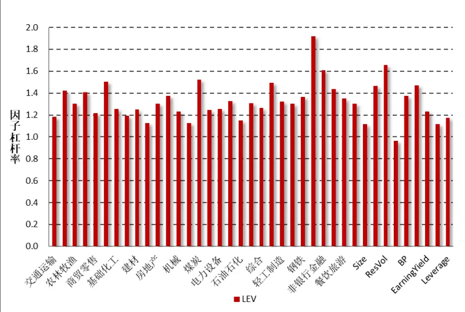
数据来源：财通证券研究所，Wind

图9绘制了回测期间所有行业因子和风格因子的因子杠杆率平均值，可以看到绝大多数的因子杠杆率小于1.3，说明仅存在较微弱的共线性问题。而银行业因子和波动率因子的杠杆率分别达到1.92和1.66，处于一个相对高位，这也再次验证了这两个因子与其他因子之间存在较强的相关性。

图10：多重共线性检验方法

数据来源：财通证券研究所

## 1.6 小结

作为财通金工“星火”系列的衍生报告，本文主要从纯因子组合的构建出发，探讨其与简单因子组合之间的关系，并讨论如何从纯因子组合的角度看待因子之间的多重共线性问题，主要结论如下：

（1） 对因子有效性的评价通常有分组法、Fama-Macbeth方法、简单因子组合法和纯因子组合法等；

（2） 简单因子组合衡量的是组合每增加一个单位因子的暴露对组合收益的影响情况；纯因子组合衡量的是在剔除其他因子的影响之后，每增加一个单位的目标因子暴露能够给组合带来的风险溢价；

（3） 在财通金工多因子模型中，因子之间的VIF系数均小于3，说明多重共线性的问题并不严重。但从因子权重系数FWC、因子收益相关系数FRC和因子杠杆率LEV来看，部分行业和风格因子与其他因子仍然存在较为明显的相关性。

## 2、 一周行情回顾

上周市场先跌后涨，指数于最后一个交易日触底反弹。总体来看大盘价值股的表现要优于中小盘指数。上周 180 成长指数和深证价值指数分别上涨 2.23%和1.86%，在所有样本指数中排名前二，而中证 1000 指数和上证小盘指数分别录得-1.72%%和-1.67%的收益，总体行情白马股要优于小票。

图11：上周主要指数收益（2019.3.22-2019.3.29）
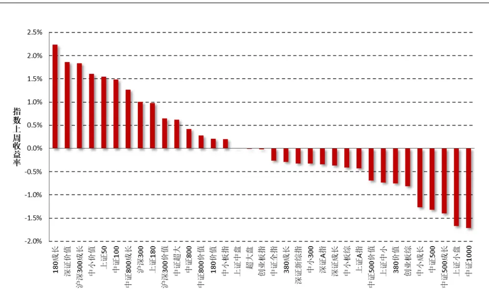
数据来源：财通证券研究所，Wind

行业方面，在所有 29 个中信一级行业中，食品饮料和餐饮旅游行业分别上涨 5.98%和 3.02%，而传媒和综合行业分别下跌 5.67%和 5.10%收益，排名垫底。

图12：上周中信一级行业指数收益（2019.3.22-2019.3.29）
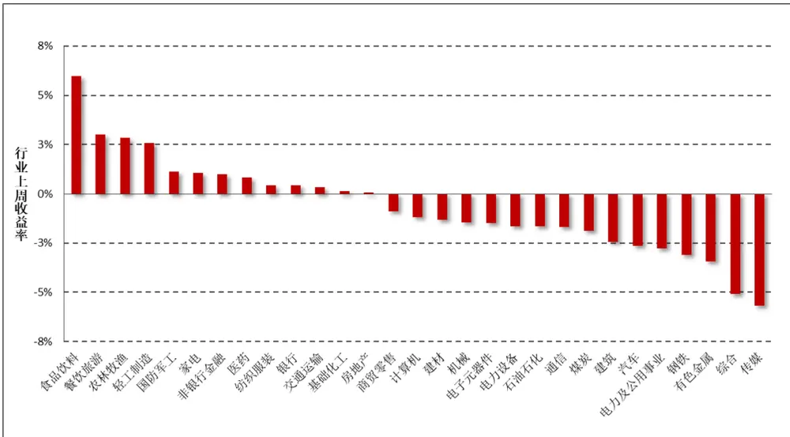
数据来源：财通证券研究所，Wind

## 3、 市场风格解析及指数风险预测

财通金工借鉴 Barra 模型，选取 Beta、规模、动量、波动率、非线性规模、、流动性、盈利、成长和杠杆率因子构建收益 风险归因模型，因子定义及计算细节参见附录二。本部分通过对近期风格因子的收益表现进行分析以期捕捉 A股市场的风格变化，同时对财通金工样本指数的未来一月风险进行预测来分析当前 A 股市场所处的风险水平。风格因子的收益拆解可参见财通金工专题报告《Barra 模型初探：A股市场风格解析》，资产组合的风险预测可参见财通金工专题报告《Barra 模型进阶：多因子模型风险预测》。

## 3.1 市场风格解析

各类风格因子在上周的累计收益可分为日度累计收益和周度收益两种，日度累计收益是根据风格因子的日度收益计算得到，周度收益是将股票在本周的收益率对股票在上周最后一个交易日的因子暴露度进行回归得到的因子纯净收益，二者之间的区别在于换仓频率的不同，前者为每日换仓，而后者在每周最后一个交易日换仓。

表 1 和图 13 展示了上周各类风格因子的累计收益和周度收益大小，可以看到，二者十分近似。本周 Beta因子、波动率因子出现明显的回撤，而规模因子、动量因子和盈利因子则获得正收益，市场在风格偏好上更倾向于大盘股票。

表1：上周纯风格因子收益（2019.3.25-2019.3.29）

| 日期 | Beta | 规模 | 长期动量 | 波动率 | 非线性规模 | BP | 流动性 | 盈利 | 成长 | 杠杆 |
| --- | --- | --- | --- | --- | --- | --- | --- | --- | --- | --- |
| 2019/3/25 | -0.31% | -0.39% | 0.04% | -0.09% | 0.12% | 0.01% | -0.14% | -0.21% | 0.08% | 0.18% |
| 2019/3/26 | -0.29% | 0.13% | 0.14% | -0.04% | -0.26% | -0.35% | -0.08% | 0.32% | 0.02% | -0.15% |
| 2019/3/27 | -0.14% | 0.07% | 0.10% | -0.21% | 0.03% | -0.11% | 0.14% | 0.11% | 0.05% | -0.07% |
| 2019/3/28 | 0.06% | 0.26% | 0.05% | -0.30% | -0.19% | -0.11% | -0.21% | -0.09% | 0.10% | -0.18% |
| 2019/3/29 | 0.58% | 0.24% | 0.25% | -0.13% | -0.05% | 0.00% | -0.04% | 0.00% | 0.02% | 0.12% |
| 上周累计收益 | -0.11% | 0.30% | 0.59% | -0.77% | -0.35% | -0.56% | -0.33% | 0.14% | 0.27% | -0.11% |
| 周度收益 | -0.11% | 0.30% | 0.61% | -0.71% | -0.33% | -0.53% | -0.23% | 0.11% | 0.22% | -0.12% |
| 前一周度收益 | 0.46% | -0.72% | 0.22% | -0.13% | 0.25% | 0.50% | -0.19% | -0.27% | -0.02% | 0.22% |

数据来源：财通证券研究所，Wind

图 13：近两周纯风格因子收益比较（2019.3.15-2019.3.29）
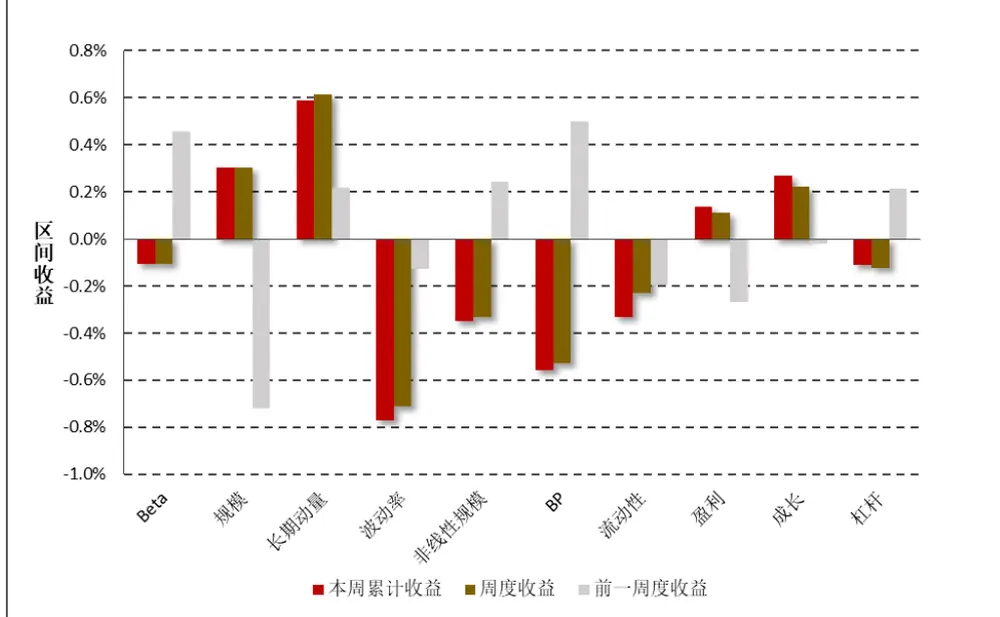
数据来源：财通证券研究所

图14：最近一个月风格因子净值走势（2019.2.27-2019.3.29）
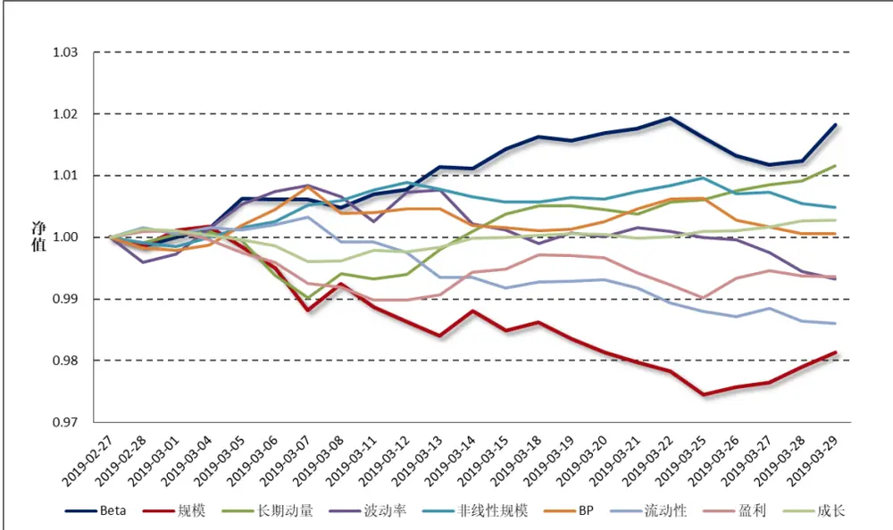
数据来源：财通证券研究所，Wind

图 14 和图 15 分别展示了最近一个月各类风格因子的净值走势及累计收益，以观察各类风格因子在过去一段时间的持续盈利能力。整体来讲，在过去的一个月中，高 Beta、前期涨幅较高的股票能够获得相对较高的收益，而大规模、高换手、高波动的股票后市将会出现较为明显的回撤。

图15：最近一个月风格因子累计收益（2019.2.27-2019.3.29）
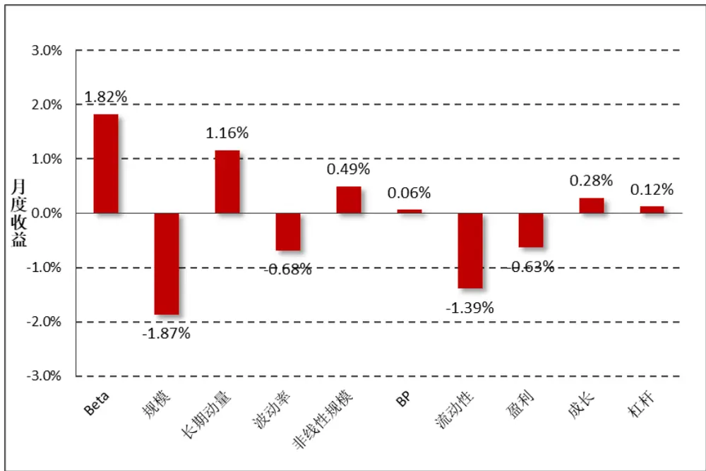
数据来源：财通证券研究所，Wind

## 3.2 指数风险预测

对收益的分解仅代表过去，对风险的预测才代表未来。多因子模型风险预测将股票风险拆解为共同风险和特质风险两部分，在通过稳健调整对共同风险矩阵和特质风险矩阵进行估计后，即可根据指数的成分股权重来估计指数在未来一段时间的波动情况。为了保证结果的严谨性，此处我们直接采用 Wind 提供的成分股权重数据，而非根据自由流通市值计算得到，尽管二者的结果十分类似。

$$
Risk(P)=W^{\prime}VW=W^{\prime}(X^{\prime}FX+\Delta)W
$$

图 16 展示了财通金工样本指数在未来一个月的预测波动率，为了方便展示我们将估计的月度波动率进行年化，波动的预测时间为上周最后一个交易日（2019.3.29）。可以看到，所有样本指数未来一月的年化波动区间在 22%-31%之间，预测波动与上周水平略有上涨，财通金工特别提醒投资者注意当前市场波动情况，对后市维持谨慎乐观态度。中小板股票、成长类指数的风险较大，而偏大盘股票、价值类股票的风险普遍较小。

图16：财通金工样本指数未来一月波动预测（年化）（2019.3.29-2019.4.26）
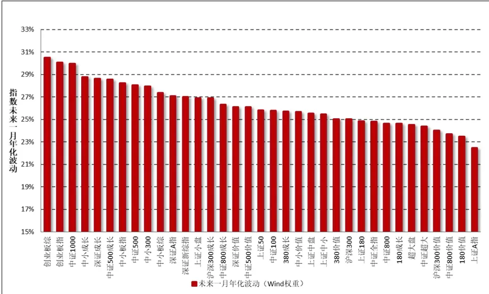
数据来源：财通证券研究所，Wind

由于在计算股票的风格因子时，我们会对暂停上市的股票、大类因子值存在缺失的股票进行剔除，因此在进行收益归因和风险预测时，并非所有指数成分股都纳入到了模型中，如果缺失股票个数过多或者缺失股票的权重占比过大，将会对模型结果造成较大影响。图 17 展示了各大指数在模型拟合过程中，纳入考虑的股票个数（权重）占指数成分股个数（权重）的比例，可以看到所有指数的比例均在 93%以上，数据质量的拟合较为合意。

图17：收益回归/风险预测样本股票占指数成分股比率
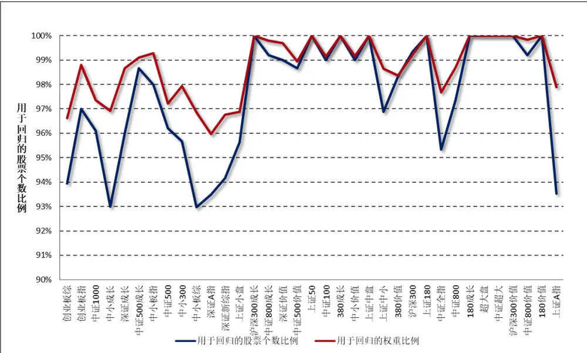
数据来源：财通证券研究所，Wind

## 4、 指数成分收益归因：

本部分财通金工对上周表现最好的三只指数和表现最差的三只指数进行归因分析，以观察涨幅较高（或较低）的指数风险暴露是否展现出较高的趋同性以及两类指数的持股风格是否会表现出明显的差别，其结果如图 18 和图 19 所示。

图18：上周表现最好三指数因子暴露度
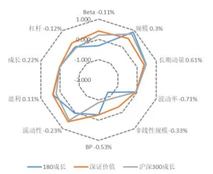
数据来源：财通证券研究所，Wind

图19：上周表现最差三指数因子暴露度
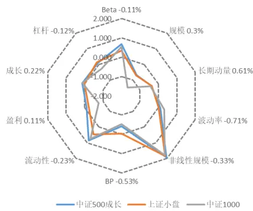
数据来源：财通证券研究所，Wind

表 2 展示了各大指数上周在各类因子上的暴露程度，可以看到，上周市场风格以大盘股为主，表现最好的三只指数都是大盘指数，其在规模因子和长期动量因子上暴露较多，而表现较差的三只指数则更多地偏向于大中小规模股票，其在非线性规模因子上的较大暴露拖累指数收益。

表2：指数在风格因子上的暴露程度（2019.3.29）

| 代码 指数名称 |  | Beta -0.11% | 规模 0.3% | 长期动量 0.6 波动率 -0.7 |  | 1 非线性规模- BP -0.53% |  | 流动性 -0.23 | 盈利 0.11% | 成长 0.22% | 杠杆-0.12% 实 | 际收益 |
| --- | --- | --- | --- | --- | --- | --- | --- | --- | --- | --- | --- | --- |
| 000028.SH 180成长 |  | -0.319 | 0.906 | 0.472 | -0.043 | -1.233 | -0.267 | 0.034 | 0.378 | 0.030 | 0.006 | 2.23% |
| 399348.SZ 深证价值 |  | 0.406 | 0.512 | 0.356 | -0.067 | -0.342 | -0.267 | 0.567 | 0.393 | 0.033 | 0.256 | 1.86% |
| 000918.SH 沪深300成长 |  | 0.208 | 0.797 | 0.450 | -0.039 | -0.857 | -0.866 | 0.472 | 0.214 | 0.033 | -0.063 | 1.84% |
| 399604.SZ | 中小价值 | 0.371 | -0.340 | -0.089 | 0.143 | 1.093 | -0.394 | 0.468 | -0.085 | -0.033 | -0.134 | 1.61% |
| 000016.SH | 上证50 | -0.393 | 1.077 | 0.457 | -0.354 | -1.821 | 0.404 | -0.176 | 0.793 | -0.061 | -0.016 | 1.54% |
| 000903.SH | 中证100 | -0.129 | 1.056 | 0.426 | -0.276 | -1.684 | 0.117 | 0.008 | 0.564 | -0.083 | 0.025 | 1.49% |
| H30355.CSI | 中证800成长 | 0.360 | 0.492 | 0.303 | -0.001 | -0.301 | -0.794 | 0.601 | 0.132 | 0.079 | 0.002 | 1.27% |
| 000300.SH | 沪深300 | 0.064 | 0.800 | 0.312 | -0.145 | -0.889 | -0.054 | 0.232 | 0.269 | -0.078 | 0.031 | 1.01% |
| 000010.SH | 上证180 | -0.182 | 0.859 | 0.341 | -0.244 | -1.098 | 0.223 | 0.034 | 0.485 | -0.136 | 0.047 | 0.98% |
| 000919.CSI | 沪深300价值 | -0.641 | 0.925 | 0.296 | -0.405 | -1.299 | 0.905 | -0.298 | 1.255 | -0.012 | 0.437 | 0.65% |
| 000980.CSI | 中证超大 | -0.226 | 1.086 | 0.231 | -0.297 | -1.879 | 0.332 | -0.223 | 0.618 | -0.023 | 0.061 | 0.62% |
| 000906.SH | 中证800 | 0.154 | 0.433 | 0.163 | -0.090 | -0.214 | -0.101 | 0.316 | 0.107 | -0.059 | 0.043 | 0.41% |
| H30356.CSI | 中证800价值 | -0.330 | 0.697 | 0.228 | -0.406 | -0.831 | 0.715 | -0.119 | 1.040 | -0.051 | 0.438 | 0.28% |
| 000029.SH | 180价值 | -0.828 | 0.968 | 0.253 | -0.447 | -1.477 | 1.178 | -0.473 | 1.314 | -0.035 | 0.331 | 0.20% |
| 399005.SZ | 中小板指 | 0.722 | 0.201 | -0.042 | 0.390 | 0.593 | -1.058 | 0.870 | -0.743 | 0.102 | -0.271 | 0.20% |
| 000044.SH | 上证中盘 | 0.203 | 0.463 | 0.130 | -0.045 | 0.217 | -0.106 | 0.417 | -0.075 | -0.272 | 0.163 | 1.25E-05 |
| 000043.SH | 超大盘 | -0.223 | 1.086 | 0.136 | -0.285 | -1.904 | 0.291 | -0.031 | 0.590 | -0.001 | -0.099 | -0.01% |
| 399006.SZ | 创业板指 | 0.771 | -0.170 | 0.235 | 0.688 | 1.004 | -1.352 | 1.278 | -1.220 | 0.221 | -0.448 | -0.02% |
| 000985.CSI | 中证全指 | 0.242 | -0.196 | -0.009 | 0.052 | 0.256 | -0.243 | 0.421 | -0.172 | -0.022 | -0.069 | -0.26% |
| 000117.SH | 380成长 | 0.270 | -0.739 | -0.260 | 0.026 | 1.803 | -0.570 | 0.643 | 0.083 | 0.124 | -0.010 | -0.29% |
| 399100.SZ | 深证新综指 | 0.555 | -0.562 | -0.125 | 0.243 | 0.766 | -0.640 | 0.636 | -0.576 | 0.064 | -0.188 | -0.33% |
| 399008.SZ | 中小300 | 0.607 | -0.282 | -0.157 | 0.405 | 1.072 | -0.923 | 0.832 | -0.776 | 0.093 | -0.286 | -0.33% |
| 399107.SZ | 深证A指 | 0.531 | -0.576 | -0.095 | 0.333 | 0.762 | -0.695 | 0.784 | -0.658 | 0.105 | -0.234 | -0.34% |
| 399346.SZ | 深证成长 | 0.838 | 0.351 | 0.224 | 0.405 | 0.022 | -1.087 | 1.038 | -0.637 | 0.038 | 0.003 | -0.37% |
| 399101.SZ | 中小板综 | 0.458 | -0.693 | -0.243 | 0.398 | 0.988 | -0.810 | 0.588 | -0.816 | 0.062 | -0.365 | -0.41% |
| 000002.SH | 上证A指 | -0.261 | 0.323 | 0.057 | -0.131 | -0.442 | 0.310 | -0.209 | 0.292 | -0.022 | 0.077 | -0.43% |
| H30352.CSI | 中证500价值 | 0.200 | -0.750 | -0.275 | -0.482 | 1.980 | 0.612 | 0.233 | 0.549 | -0.036 | 0.393 | -0.69% |
| 000046.SH | 上证中小 | 0.257 | -0.034 | -0.076 | -0.022 | 0.901 | -0.080 | 0.440 | -0.141 | -0.156 | 0.161 | -0.74% |
| 000118.SH | 380价值 | -0.049 | -0.851 | -0.289 | -0.361 | 1.891 | 0.653 | 0.022 | 0.751 | -0.029 | 0.461 | -0.75% |
| 399102.SZ | 创业板综 | 0.815 | -1.150 | -0.179 | 0.502 | 1.119 | -1.120 | 1.006 | -1.220 | 0.201 | -0.557 | -0.81% |
| 399602.SZ | 中小成长 | 0.767 | 0.014 | -0.170 | 0.512 | 0.652 | -1.041 | 0.910 | -0.671 | 0.075 | -0.192 | -1.27% |
| 000905.SH | 中证500 | 0.455 | -0.745 | -0.306 | 0.077 | 1.943 | -0.246 | 0.590 | -0.412 | -0.007 | 0.070 | -1.32% |
| H30351.CSI | 中证500成长 | 0.678 | -0.665 | -0.374 | 0.113 | 1.936 | -0.428 | 0.862 | -0.115 | 0.124 | 0.084 | -1.40% |
| 000045.SH | 上证小盘 | 0.331 | -0.716 | -0.358 | 0.008 | 1.840 | -0.045 | 0.472 | -0.232 | 0.003 | 0.157 | -1.67% |
| 000852.SH 中证1000 |  | 0.538 | -1.466 | -0.432 | 0.315 | 1.781 | -0.537 | 0.743 | -0.766 | 0.130 | -0.256 | -1.72% |

数据来源：财通证券研究所，Wind

## 【参考文献】

【1】Characteristics of Factor Portfolios, Jose Menchero, 2010.3, MSCI Working Paper

## 5、 附录

| 附录一：财通金工指数池选取 |  |  |  |  |  |
| --- | --- | --- | --- | --- | --- |
| 上证规模/风格指数 |  | 深证综合/规模指数 |  | 中证规模/风格指数 |  |
| 000001.SH | 上证综指 | 399101.SZ | 中小板综 | 000300.SH | 沪深 300 |
| 000002.SH | 上证A指 | 399102.SZ | 创业板棕 | 000852.SH | 中证 1000 |
| 000010.SH | 上证 180 | 399106.SZ | 深证综指 | 000985.CSI | 中证全指 |
| 000016.SH | 上证50 | 399107.SZ | 深证 A 指 | 000980.CSI | 中证超大 |
| 000043.SH | 超大盘 | 399005.SZ | 中小板指 | 000903.SH | 中证100 |
| 000044.SH | 上证中盘 | 399006.SZ | 创业板指 | 000905.SH | 中证 500 |
| 000045.SH | 上证小盘 | 399008.SZ | 中小300 | 000906.SH | 中证 800 |
| 000046.SH | 上证中小 | 399346.SZ | 深证成长 | 000918.SH | 沪深 300 成长 |
| 000028.SH | 180成长 | 399348.SZ | 深证价值 | 000919.SH | 沪深 300 价值 |
| 000029.SH | 180 价值 | 399602.SZ | 中小成长 | H30351.CSI | 中证 500 成长 |
| 000117.SH | 380 成长 | 399604.SZ | 中小价值 | H30352.CSI | 中证 500 价值 |
| 000118.SH | 380 价值 |  |  | H30355.CSI | 中证 800 成长 |
|  |  |  |  | H30356.CSI | 中证 800 价值 |

数据来源：财通证券研究所

谨请参阅尾页重要声明及财通证券股票和行业评级标准

附录二：财通金工风格因子定义

| 大类因子 | 子类因子 | 因子定义及计算 | 权重 | 备注 |
| --- | --- | --- | --- | --- |
| Beta | BETA | $\mathrm{r_{t}}=\alpha+\beta\mathrm{R_{t}}+\mathrm{e_{t}},$ 将单只股票过去252天的日度收益率对流通市值加权指数日度收益率进行半衰指数加权回归，半衰期为63天 | 1 | 1) 采用流通市值而非总市值加权，因为各大指数编制采用流通市值加权；2) 需要剔除当日停牌或者未上市日期的数据，并将权重进行归一化；3) 若满足条件的样本数据少于42天，我们将其 Beta 置为NaN。 |
| 规模 | SIZE | 股票总市值取对数 | 1 | 由于PB、PE等因子的计算是基于总市值的，因此此处也用总市值 |
| 动量 | RSTR | 过去一段时间个股的累计收益率，不含最近一个月， $\begin{array}{r}{\mathsf{RSTR}=\sum_{\mathrm{t=L}}^{\mathrm{T+L}}\mathsf{w}_{\mathrm{t}}(\ln(1+\mathrm{r}_{\mathrm{t}}),}\end{array}$ $\mathrm{r_{t}}=\mathrm{P_{t}}/\mathrm{P_{t-1}}-1,\ \mathrm{T}{=}504,\ \mathrm{L}{=}21,$ 收益率序列采用半衰指数加权，半衰期为126天 | 1 | 1)对于数据质量较好的个股，计算动量时采用了2年的数据2) 需要剔除未上市日期数据，但无需剔除停牌日期数据，并将权重归一化3)若满足条件的数据样本小于42天，我们将其动量置为NaN |
| 波动率(对Beta因子和市值因子进行正交化处理) | DASTD | 个股相对市值加权指数的超额收益率序列的半衰指数加权标准差，T=252，半衰期为42天1/2 $\mathrm{{DASTD}=\left(\sum_{t=1}^{T}w_{t}\big(r_{t}-\mu(r)\big)^{2}\right)}$ | 0.7 | 12 采用流通市值加权计算指数收益需要剔除当日停牌或者未上市日期的数据，并将权重进行归一化3) 若满足条件的数据样本小于42天，我们将其因子值置为NaN |
|  | CMRA | $\$123,456,7$ $\begin{array}{r}{\mathbb{C}\mathbb{M}\mathbb{R}\mathbb{A}=\ln(1+\operatorname*{max}\{\mathrm{Z}(\mathrm{T})\})-\ln(1+}\\{\operatorname*{min}\{\mathrm{Z}(\mathrm{T})),}\end{array}$ $\begin{array}{r}{\ddag{\Psi}\Psi\mathrm{Z}\mathrm{(T)}=\exp\bigl(\sum_{\mathrm{t=1}}^{\mathrm{T}}\ln(1+\mathrm{r_{t}})\bigr)-1}\\{\ddag{\mathrm{\Large~\int_{\Sigma}~}}\llangle_{\mathrm{\Large~\hat{\mathrm{T}}~}}\bigwedge_{\mathrm{\Large~\hat{\mathrm{t}}~}}\rlap/{\Psi}\llangle_{\mathrm{\Large~\hat{\mathrm{t}}~}}\ddag{\hat{\ddag}{\mathrm{\Large~\frac{\hat{\mathcal{G}}~}{\cos~\theta}~}}}\llangle_{\mathrm{\Large~\hat{\mathrm{t}}~}}^{\pm}}\end{array}$ 表示过 | 0.15 | 以 21 天为 1 个月 |
|  | HSIGMA | 计算 Beta 时残差的标准差， Hsigma = std(ei) | 0.15 | 同 Beta 因子的计算 |
| 非线性规模 | NonLinerSize | 中市值因子，将股票总市值对数的三次方对总市值对数回归，取残差的相反数 | 1 | 用于衡量市值因子的非线性性，总市值越大和越小的股票的非线性规模越小，中市值股票的非线性规模越大 |
| 估值 | BP | 市净率的倒数，1/PB | 1 | 采用 Wind 中的 pb_lf 因子的倒数 |
| 流动性(对市值因子进行正交化） | STOM | 月度换手率， $\mathrm{STOM}=\ln(\mathrm{mean}(\sum_{t=1}^{21}(V_{t}/S_{t})))$ 其中V为当日成交量，S为流通股本 | 0.5 | 1)采用流通股本值，而非自由流通股本值2)剔除未上市、停牌日期的数据 |
|  | STOQ | 季度换手率， $\begin{array}{r}{\mathrm{STOQ}=\ln(\operatorname*{mean}(\sum_{t=1}^{63}(V_{t}/S_{t}))),}\end{array}$ | 0.25 | 同 STOQ 因子的计算 |
|  | STOA | 年度换手率，STOA = In(mean(Σ25(Vt/St)))， | 0.25 | 同 STOQ 因子的计算 |
| 盈利 | CETOP | 过去滚动12个月的经营现金流除以当前市值实际计算中取市现率 PCF（经营现金流 TTM）的倒数 | 1/2 | 采用 Wind 中的 PCF_OCF_ttm 因子的倒数 |
|  | ETOP | 过去滚动12个月的利润除以当前市值实际计算中取市盈率 PETTM 的倒数 | 1/2 | 采用 Wind 中的 PE_ttm 因子的倒数 |
| 成长 | YOYProfit | 单季度净利润同比增长率 | 1/2 | 为避免使用未来数据，需要根据季报公布时间进行调整 |
|  | YOYSales | 单季度营业收入同比增长率 | 1/2 | 同 YOYProfit 因子的计算 |
| 杠杆 | MLEV | 市场杠杆率，MLEV=（总市值+非流动负债）/总市值 | 1/3 |  |
|  | DTOA | 资产负债率，DTOA=总资产/总负债 | 1/3 |  |
|  | BLEV | 账面杠杆率，BLEV=（账面价值+非流动负债）/账面价值 | 1/3 |  |

数据来源：财通证券研究所
备注：1.波动率因子需对Beta因子和市值因子进行正交化处理；
2.流动性因子需对市值因子进行正交化处理；

若大类因子下所有子类因子值全部缺失，则该股票的因子值记为缺失，否则用有数据的因子值进行替代，注意需对权重进行归一化处理

## 信息披露

## 分析师承诺

作者具有中国证券业协会授予的证券投资咨询执业资格，并注册为证券分析师，具备专业胜任能力，保证报告所采用的数据均来自合规渠道，分析逻辑基于作者的职业理解。本报告清晰地反映了作者的研究观点，力求独立、客观和公正，结论不受任何第三方的授意或影响，作者也不会因本报告中的具体推荐意见或观点而直接或间接收到任何形式的补偿。

## 资质声明

财通证券股份有限公司具备中国证券监督管理委员会许可的证券投资咨询业务资格。

## 公司评级

买入：我们预计未来 6个月内，个股相对大盘涨幅在 15%以上；

增持：我们预计未来 6个月内，个股相对大盘涨幅介于 5%与 15%之间；

中性：我们预计未来 6个月内，个股相对大盘涨幅介于-5%与 5%之间；

减持：我们预计未来 6个月内，个股相对大盘涨幅介于-5%与-15%之间；

卖出：我们预计未来 6个月内，个股相对大盘涨幅低于-15%。

## 行业评级

增持：我们预计未来 6个月内，行业整体回报高于市场整体水平 5%以上；

中性：我们预计未来 6个月内，行业整体回报介于市场整体水平-5%与 5%之间；

减持：我们预计未来 6个月内，行业整体回报低于市场整体水平-5%以下。

## 免责声明

本报告仅供财通证券股份有限公司的客户使用。本公司不会因接收人收到本报告而视其为本公司的当然客户。

本报告的信息来源于已公开的资料，本公司不保证该等信息的准确性、完整性。本报告所载的资料、工具、意见及推测只提供给客户作参考之用，并非作为或被视为出售或购买证券或其他投资标的邀请或向他人作出邀请。

本报告所载的资料、意见及推测仅反映本公司于发布本报告当日的判断，本报告所指的证券或投资标的价格、价值及投资收入可能会波动。在不同时期，本公司可发出与本报告所载资料、意见及推测不一致的报告。

本公司通过信息隔离墙对可能存在利益冲突的业务部门或关联机构之间的信息流动进行控制。因此，客户应注意，在法律许可的情况下，本公司及其所属关联机构可能会持有报告中提到的公司所发行的证券或期权并进行证券或期权交易，也可能为这些公司提供或者争取提供投资银行、财务顾问或者金融产品等相关服务。在法律许可的情况下，本公司的员工可能担任本报告所提到的公司的董事。

本报告中所指的投资及服务可能不适合个别客户，不构成客户私人咨询建议。在任何情况下，本报告中的信息或所表述的意见均不构成对任何人的投资建议。在任何情况下，本公司不对任何人使用本报告中的任何内容所引致的任何损失负任何责任。

本报告仅作为客户作出投资决策和公司投资顾问为客户提供投资建议的参考。客户应当独立作出投资决策，而基于本报告作出任何投资决定或就本报告要求任何解释前应咨询所在证券机构投资顾问和服务人员的意见；

本报告的版权归本公司所有，未经书面许可，任何机构和个人不得以任何形式翻版、复制、发表或引用，或再次分发给任何其他人，或以任何侵犯本公司版权的其他方式使用。