2019 年 04 月 09 日

# 非线性规模因子：A股市场存在中市值效应吗？

## “拾穗”多因子系列报告（第 8 期）

## 联系信息

陶勤英分析师

SAC 证书编号：S0160517100002 021-68592393

taoqy@ctsec.com

张宇研究助理

zhangyu1@ctsec.com 021-68592337

176216888421

## 相关报告

【1】“星火”多因子系列（一）：《Barra模型初探：A 股市场风格解析》

【2】“星火”多因子系列（二）：《Barra模型进阶：多因子模型风险预测》

【3】“星火”多因子系列（三）：《Barra模型深化：纯因子组合构建》

【4】“拾穗”多因子系列（一）：《带约束的加权最小二乘：一种解析解法》

【5】“拾穗”多因子系列（二）：《你看到的不一定是你所想的：解密 R 方》

【6】“拾穗”多因子系列（三）：《行业因子选取：中信一级还是申万一级？》

【7】“拾穗”多因子系列（四）：《总市值、流通市值、自由流通市值：谈谈取舍》

【8】“拾穗”多因子系列（五）：《数据异常值处理：比较与实践》

【9】“拾穗”多因子系列（六）：《因子缺失值处理：数以多为贵》

【10】“拾穗”多因子系列（七）：《从纯因子组合的角度看待多重共线性》

## 投资要点：

- 非线性规模因子：A 股市场存在中市值效应吗？

- 对非线性规模因子的计算有回归法和平方法两种，经实证检验发现二者在本质上并无区别。

- 从非线性规模纯因子组合的净值走势来看，其历年收益均为负，波动要明显小于规模纯因子，这表明中市值股票并不能跑赢甚至是经常跑输大小市值股票。

从分组法对非线性规模因子构建多空组合来看，对冲组合的年化收益达到 22.16%，年化波动为 8.17%，信息比率达到 2.17。

从 Fama-Macbeth 检验来看，非线性规模因子的加入有助于解释收益率在横截面上的波动，且其溢价能力不能被已有因子所解释。

- 中证 1000 指数成分股并非全市场市值最小的那部分股票，因此其非线性规模因子暴露与中证 500 指数的非线性规模因子暴露处于同等水平也就不足为奇了。

## 市场风格解析

整体来讲，在过去的一个月中，高 Beta 的股票、前期涨幅较高的股票能够获得相对较高的收益，而大规模、高换手、高波动的股票后市走势将会出现更为明显的回撤。

## 指数风险预测

所有样本指数在未来一个月的年化波动区间在 22%-31%之间，相较上周基本持平，财通金工特别提醒投资者注意当前市场的波动情况。

## 指数成分收益归因

上周市场风格以中小盘指数为主，表现最好的三只指数都是中小盘指数，其在非线性规模因子上暴露较多，而表现较差的三只指数更多得偏向于大规模股票，其在规模因子上的较大暴露拖累指数收益。

- 风险提示：本报告统计结果基于历史数据，过去数据不代表未来，市场风格变化可能导致模型失效。

在实际投资中，多因子模型被广泛地应用到资产定价、绩效归因、风险控制、组合优化、基金评价及资产配置等各个领域，一套完整、精细的多因子系统成为每位量化研究者必备的工具。“做最实用的研究”，是财通金工给自己的定位。我们将在之后的系列报告中，就投资者们最关心也最容易忽略的很多细节问题进行探讨，介绍我们在实际应用中遇到的问题和思考，以飨读者。

我们为本系列报告取名“拾穗”。一周市场风云变幻，和风细雨也好，狂风骤雨也罢，都留下一地故事等待梳理。作为勤劳的搬运工，财通金工从量化视角出发对市场风格进行捕捉、对风险水平进行预测，既是希望能够如拾穗者般专心、踏实地做研究，也是祝愿各位投资者能够在市场收获满地金黄。

本期是该系列报告的第八期，主要就广大投资者概念相对模糊的非线性规模因子展开讨论。首先介绍非线性规模因子的不同计算方法，随后从纯因子组合法、分组法和 的方法检验非线性规模因子的有效性，最后比较不同指数在非线性规模因子上的暴露度，对该因子的使用和需注意的细节进行提醒。

## 1、 非线性规模因子：A股市场存在中市值效应吗？

众所周知，市值因子在 A 股市场向来是一个强有效的因子。在过去的很多年，小市值股票的走势能够显著地战胜大市值股票，“小票效应”让很多量化基金品尝到了市场的红利。然而随着 2017 年市场风格的大变脸，白马股一骑绝尘、小盘股黯然失色，投资者们方才意识到，被市场当作 Alpha 因子很久的市值因子原来也只是 Beta 因子，对组合的风格暴露进行风险控制才逐步受到投资者们的重视。

近两周来（2019.3.22-2019.4.4），中证 500 指数的走势十分抢眼。作为中市值股票的代表性指数，它不仅战胜了以大市值为主导的上证 50 和沪深 300，还战胜了以小市值为主导的中证 1000 指数。图 2 分别以沪深 300、中证 500 和中证 1000 为大、中、小盘的代表，展示了其历年涨跌幅，可以看到中证 500 指数的走势都并不突出，基本上较为平庸地处于沪深 和中证 的涨跌幅之间。

图 1：主要指数近两周涨跌幅（2019.3.22-2019.4.4）
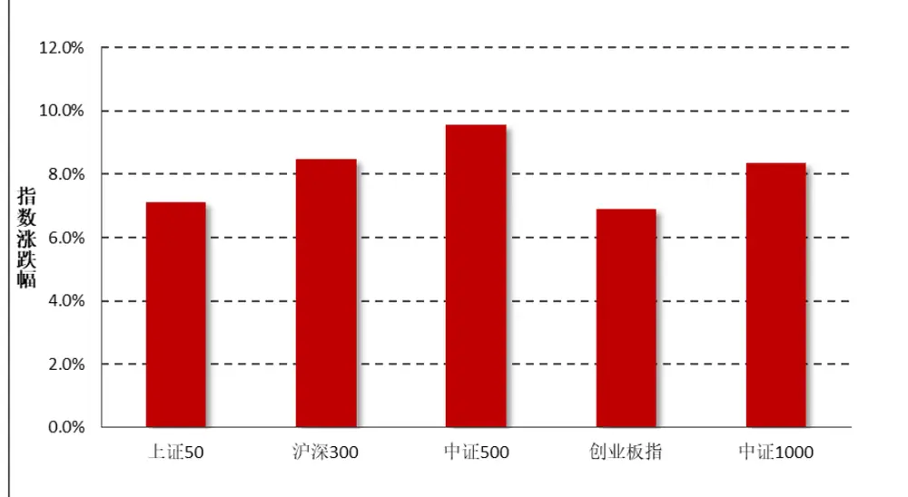
数据来源：财通证券研究所，Wind

在多因子风险模型框架中，作为旨在捕捉中市值效应的非线性规模因子总是被加入分析中。非线性规模因子的计算方法如何？它的加入是否能够有效解释股票在横截面上的收益？A 股市场究竟是否存在显著的中市值效应？作为财通金工向 Alpha 因子进行研究的前哨性报告，本文就以上问题展开探讨。

图 2：主要指数的年度涨跌幅（2008-2019）
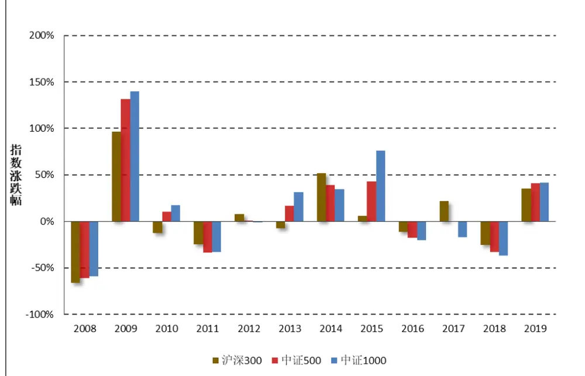
数据来源：财通证券研究所，Wind

## 1.1 非线性规模因子的计算

在Barra USE3文档中，非线性规模因子的定义为对数市值的三次方。在BarraCNE5文档中，非线性规模的计算是将对数市值的三次方对对数市值本身进行最小加权二乘回归，以回归得到的残差作为非线性规模因子的代理变量。由于非线性规模因子旨在捕捉市场的中市值效应，因此市值在中间的股票因子将会大于市值偏大或偏小的股票的因子即是我们的共识。基于此，本文介绍如下三种方法对非线性规模进行计算。

第一种方法参考Barra CNE5文档，将对数市值的三次方对对数市值进行回归，将回归得到的残差作为因子的代理变量。在财通金工“拾穗”系列（二）《你看到的不一定是你所想的：解密R2》中，我们特别提醒投资者在做回归处理时，如果没有任何证据显示数据将会穿过原点，那么在回归模型中我们建议一律加上截距项。

$$
\begin{aligned}&lnSize^{3}=\beta lnSize+\varepsilon\\&lnSize^{3}=\alpha+\beta lnSize+\varepsilon\\\end{aligned}
$$

以2019年3月28日全市场股票作为样本股票，将股票总市值对数的三次方对总市值对数进行回归，得到残差变量，此处我们取残差变量的相反数。图3和图4分别展示了不带截距项的回归残差和带截距项的回归残差与对数市值的散点图，可以看到带截距项的回归残差呈现出一条开口向下的抛物线形状，这表明中间市值的股票的因子值越大，而两端（大市值或小市值）股票的因子值越小，这一点与我们先前的共识是一致的，而不带截距项的回归残差并没有体现这一点。特别需要提醒的是，我们此处对回归残差取了相反数，这样处理的目的是为了让处于中等市值分位股票的非线性规模因子越大，这也与该因子体现出的中市值含义相契合。

图3：不带截距项的回归残差与对数市值散点图
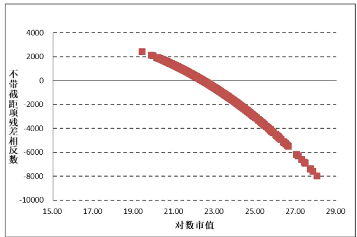
数据来源：财通证券研究所，Wind

图4：带截距项的回归残差与对数市值散点图
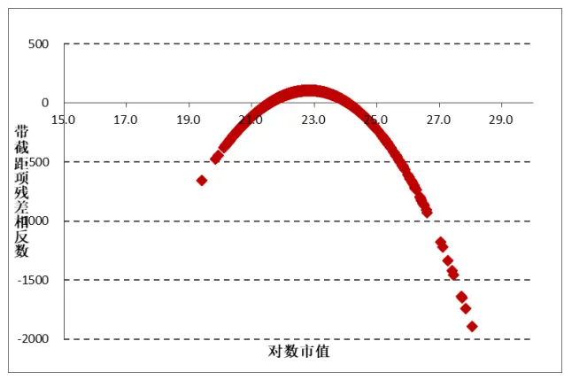
数据来源：财通证券研究所，Wind

第二种方法不采用回归的处理，首先直接对全市场股票的对数市值进行标准化处理（即减去市场均值后除以标准差），随后将标准化后的市值因子取平方项，以该平方项的相反数作为股票的非线性规模因子。由于进行zscore处理之后的对数市值因子有正有负，对其进行平方即可得到一条开口向上的抛物线，随后取相反数即能够得到与先前讨论相契合的因子特征。图5展示了这种方法得到的因子值与对数市值之间的散点图，与图4对比可以发现二者之间是非常类似的。

图5：平方法非线性规模与对数市值散点图
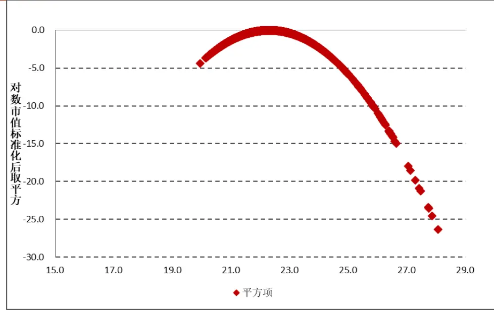
数据来源：财通证券研究所，Wind

图 通过观察方法一（回归残差项）与方法二（标准化后平方项）之间的散点图来观察两种方法的相似性，在全样本股票中，二者的相关系数达到0.87。在图中我们可以明显地看到散点图分为了两段，我们以两种颜色进行区分，其中红色散点图对应的是将对数市值进行标准化处理后，因子值大于0的股票的散点图（相关系数0.99），橙色部分对应的是标准化对数市值因子小于0的股票散点图（相关性数0.99）。由此也能看出，这两种方法在本质上并无区别，所不同的在于平方法得到的因子值标准差更小，而回归法的因子跨度较大。

图6：回归残差项与标准化后平方项散点图
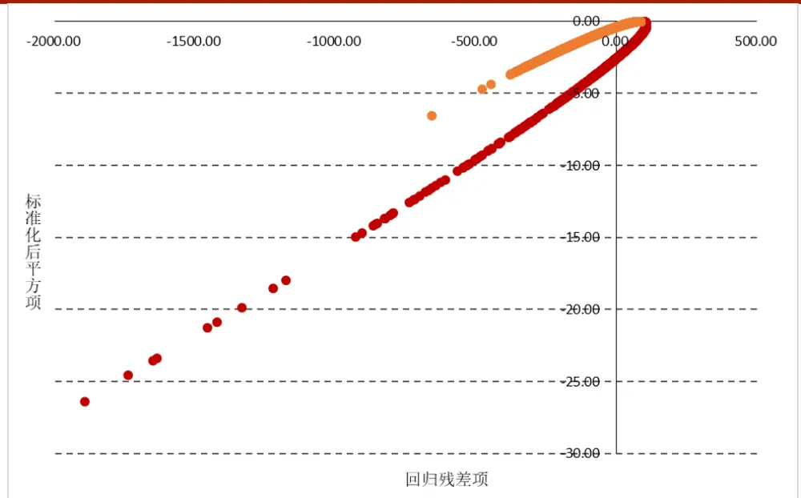
数据来源：财通证券研究所

在财通金工“拾穗”系列（七）《从纯因子组合的角度看待多重共线性》中，我们参考的Menchero（2010）提出了另外一种计算非线性规模的方法：先将对数市值进行标准化，再将标准化后因子的三次方对标准化后因子进行回归，将回归的残差项作为非线性规模因子。这种方法实质上对以上两种方法进行了结合，但在结果上与我们之前的处理并无区别。

图7：非线性规模因子处理示意图
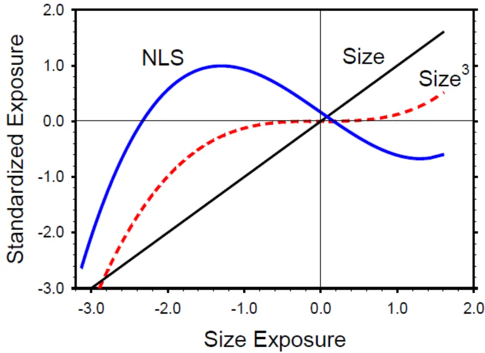
数据来源：财通证券研究所，Menchero（2010）

## 1.2 A 股市场存在中市值效应吗？

在了解了非线性规模因子的计算之后，本小节我们对其有效性进行测试，以检验 A股市场上是否存在显著的中市值效应。作为财通金工对 Alpha 因子研究的前哨性报告，本文从纯因子组合法、简单因子组合法和 Fama-Macbeth 方法来对因子进行回测。关于 Alpha 因子的研究成果，请持续关注财通金工的后续报告。

图 8：单因子测试主要方法
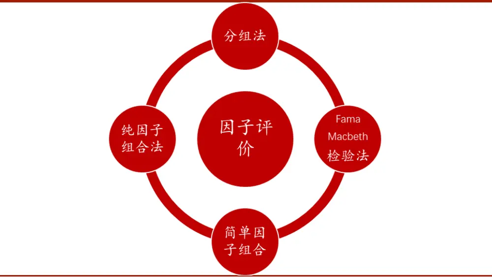
数据来源：财通证券研究所

从纯因子组合的角度探讨非线性规模因子的收益情况实际上在财通金工“拾穗”系列（七）《从纯因子组合的角度看待多重共线性》中已有说明。图 9 展示了 2009.12.31-2019.3.22 期间，规模纯因子组合和非线性规模纯因子组合的净值走势，可以看到在回测区间内二者都收获了显著的负收益。也就是说，非线性规模因子越大的股票通常收益要低于非线性规模因子小的股票，这说明中市值股票并不能跑赢甚至是经常跑输大小市值股票。

图 9：规模纯因子和非线性规模纯因子组合净值走势
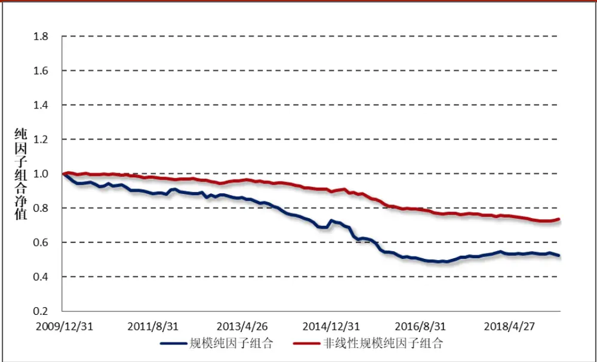
数据来源：财通证券研究所，Wind

图 10：规模纯因子和非线性规模纯因子组合历年收益
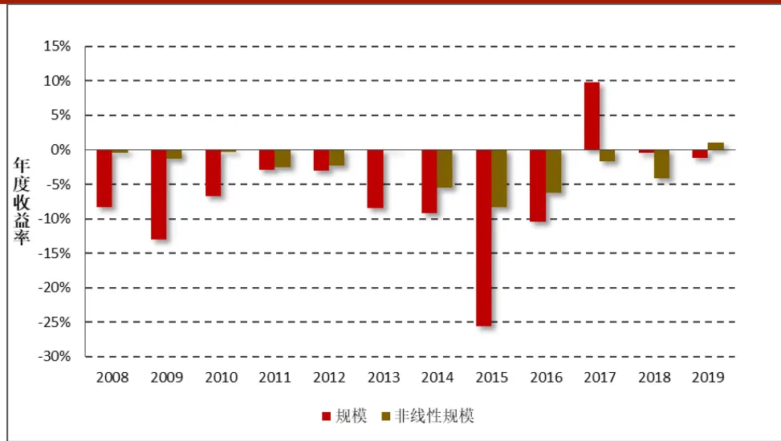
数据来源：财通证券研究所，Wind

图 10 展示了规模纯因子组合和非线性规模纯因子组合在 2008-2019 年每年的收益情况，其中 年为截止到 的收益。可以看到，规模因子在2008-2016 年期间稳定地为负，而在 2017 年出现明显的反转。对于非线性规模因子而言，其历年收益均为负，波动性要明显小于规模因子。

下面我们从分组法的角度对非线性规模因子对股票收益的影响进行测试，回测区间选定为 2006.1.25-2019.3.22，样本股选定为 Wind 全 A 成分股，在每个自然月的最后一个交易日根据股票因子值进行排序并分为 10 组（等权重构建组合），以因子值最小的组别（D0）为多头组合，因子值最大的组别（D9）为空头组合，构建对冲组合，观察对冲组合的月度收益和净值走势。在进行股票筛选时，我们剔除了上市时间小于 100 天的股票、剔除了调仓日涨停、跌停或停牌对股票，同时剔除了 ST 和*ST 股票。

图 11：分组法测试下每组月均超额收益
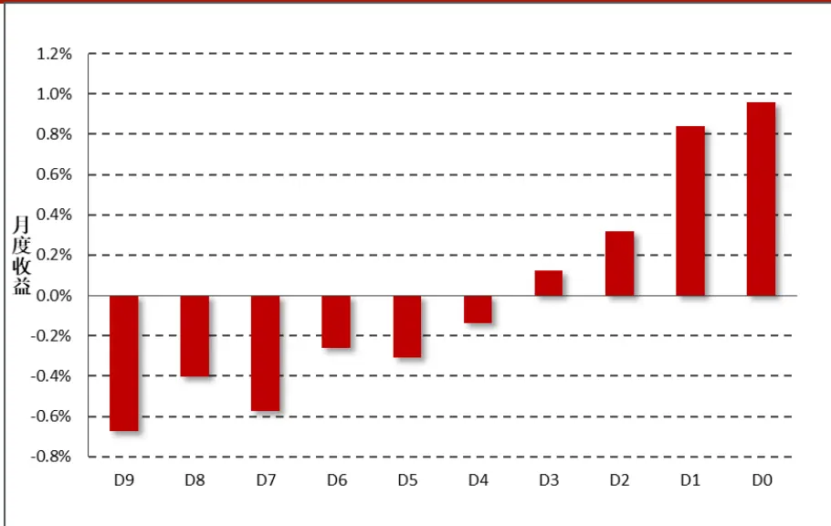
数据来源：财通证券研究所，Wind

图 11 展示了 10 组的月均超额收益，如果随着因子值的增加，每组的收益分化越明显，即说明该因子对于股票收益的解释能力较强，且具有较好的线性特征。可以看到，多头组合（D0）的月均收益达到 0.96%，空头组合（D9）的月均收益达到-0.68%，因子的线性特征较好。

表 1 对因子绩效进行了统计，在回测区间因子的 rankIC 为-5.38%，月胜率为29%，t 值显著为负（-6.00），其中多空组合月均收益达到 1.58%，胜率达到 72%。

表 1：分组法下因子绩效统计（2006.1.25-2019.3.2）

|  | IC | rankIC | 多头月均超额 | 空头月均超额 | 多空收益差 |
| --- | --- | --- | --- | --- | --- |
| 均值 | -2.90% | -5.38% | 0.96% | -0.68% | 1.58% |
| 月胜率 | 35% | 29% | 73% | 32% | 72% |
| t 值 | -5.55 | -6.00 | 6.35 | -4.29 | 6.52 |

数据来源：财通证券研究所，Wind

图 12 展示了多空对冲组合的月度收益和组合净值，可以看到该因子在 2017年出现了较为明显的回撤，在 2018 年之后又持续有效。回测期间对冲组合的年化收益为 22.16%，年化波动为 8.17%，年化 IR达到 2.71。

图 12：非线性规模因子多空对冲组合净值
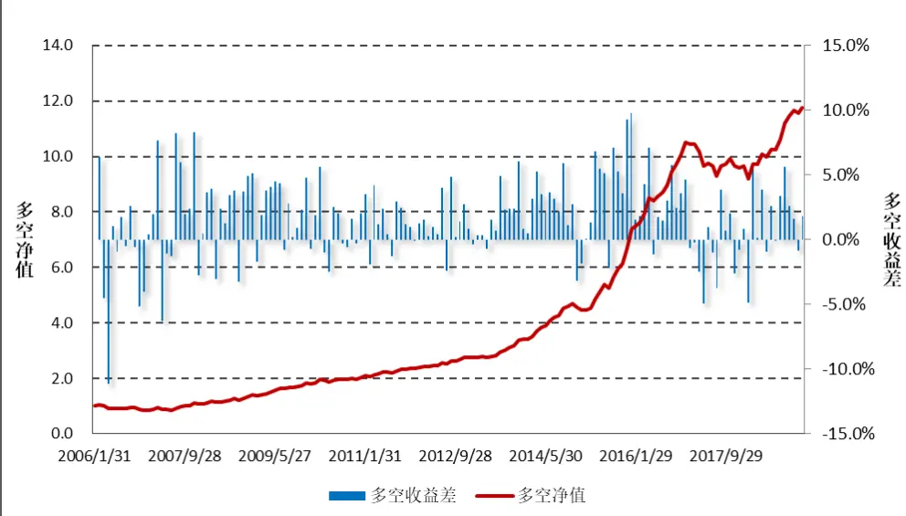

| 年化收益 | 年化波动 | 年化IR | 最大回撤 |
| --- | --- | --- | --- |
| 22.16% | 8.17% | 2.71 | 21.2% |

数据来源：财通证券研究所，Wind

下面我们从分组法的角度观察非线性规模因子与其他已知因子的相关关系，在每个调仓期我们计算每组股票在其他因子上的因子暴露均值，并对每组进行打分（得分为 10 表示因子最大，得分为1 表示因子最小），最终计算回测期间每个月每组在其他因子上的得分均值，其结果如图 11 所示。其中，Turnover21 表示最近一个月换手率，Ret21 是最近一个月收益率（反转因子），Vol21 表示最近 21天波动率。可以看到，尽管对市值做了中性化处理，但该因子在市值上的暴露仍然是非常明显的。此外，因子在换手率因子上的暴露也十分明显，空头组合（D9）的换手率较高，这在一定程度上增强了空头组合的负向收益。

需要说明的是，我们将非线性规模因子对市值、BP 和换手率因子进行了回归，取残差为代理变量并再度进行分组测试，因子的 rankIC 和胜率并没有太大的变化，而且这种处理与下面提到的 Fama-Macbeth 的处理比较类似，因此此处我们不再赘述。

图 13：分组法下每组对其他因子的得分均值
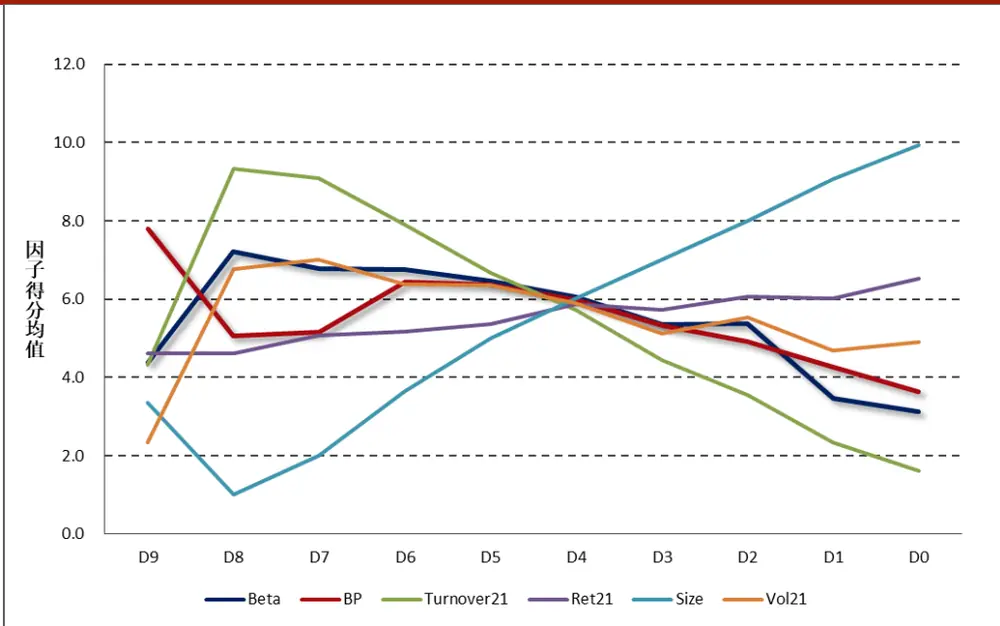
数据来源：财通证券研究所，Wind

最后我们对非线性规模因子进行 Fama-Macbeth 检验。具体来讲，在每个截面期我们将股票收益对已知因子进行多元线性回归，得到的回归系数即为该因子的风险溢价，它表示每承担一个单位因子暴露的风险所要求的溢价。此处我们进行两个回归，一个是将股票收益对 BP、换手率、反转、市值和波动率进行回归，另一个是加入非线性规模因子之后的回归。

$$
r=\alpha+\beta_{0}BP+\beta_{1}Turnover21+\beta_{2}Ret21+\beta_{3}Size+\beta_{4}Vol21
$$

$$
r=\alpha+\beta_{0}BP+\beta_{1}Turnover21+\beta_{2}Ret21+\beta_{3}Size+\beta_{4}Vol21+\beta_{5}SizeNL
$$

表 2：非线性规模 Fama-Macbeth 检验结果

|  | 截距项 | SizeNL | BP | Turnover21 | Ret21 | Size | Vol21 | RSquare |
| --- | --- | --- | --- | --- | --- | --- | --- | --- |
| 因子系数 | 2.00% |  | 0.13% | -0.79% | -0.45% | -0.76% | -0.06% | 9.28% |
| t 值 | 2.38 |  | 1.16 | -6.99 | -3.88 | -4.43 | -0.81 |  |
| 因子系数 | 2.00% | -0.30% | 0.10% | -0.79% | -0.45% | -0.67% | -0.03% | 9.78% |
| t 值 | 2.38 | -4.99 | 0.91 | -7.02 | -3.98 | -3.95 | -0.44 |  |

数据来源：财通证券研究所，Wind

由表 2 可以看到，加入非线性规模因子回归后，其他已知因子的t 值并没有太大的变化，且非线性规模因子的风险溢价显著为负，其 t 值达到-4.99，也就是说非线性规模因子是一个不能被其他因子解释的有效因子，而且该因子值越高，股票在未来的收益将会越低，图 14 展示了非线性规模因子的月度溢价，结论与前述结果基本保持一致。

图 14：非线性规模因子每月溢价及净值
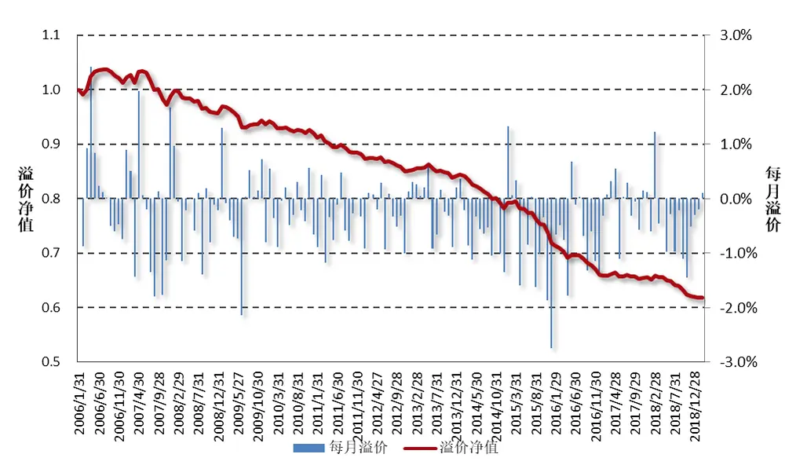
数据来源：财通证券研究所，Wind

## 1.3 不同指数在非线性规模因子的暴露

在财通金工多因子周报中，我们每周会统计指数在所有风格因子上的暴露度，其结果在表 中进行了展示，图 提取出所有指数在非线性规模上的暴露并绘制成柱状图。可以看到，对于大市值指数如超大盘、上证50、沪深300指数而言，这些指数的非线性规模明显为负，对于中市值如中证500指数而言，其非线性规模因子明显更大。但是我们同时也惊讶地发现，作为小市值指数代表的中证指数的非线性规模因子在所有指数中同样处于较高的位置。

图15：财通金工主要指数在非线性规模因子上的暴露
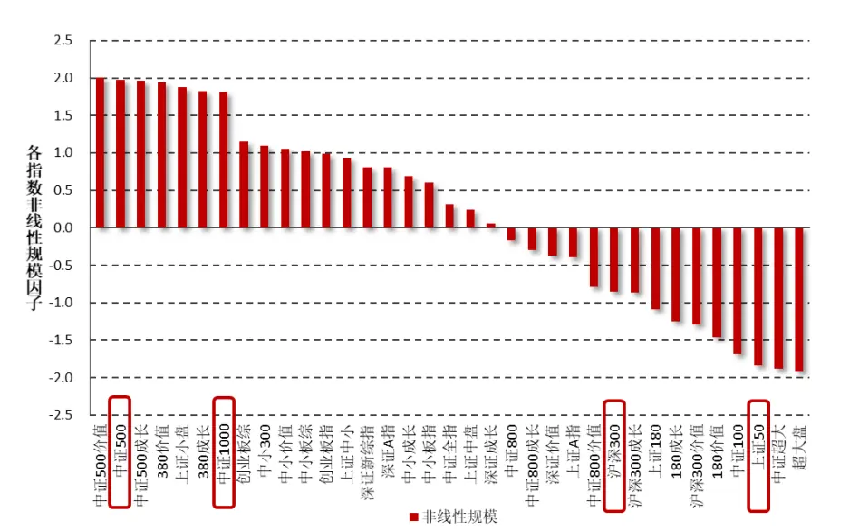
数据来源：财通证券研究所，Wind

理论上来讲，如果中证1000指数确实能够代表市场规模最小的那一部分股票走势，那么该指数的非线性规模因子应该与超大盘指数一样，会明显为负，但这明显与我们计算得到的结果不一致，问题出现在哪里了呢？

首先我们来回顾一下三只指数的成分股选择，沪深 指数是由上交所和深交所市值大、流动性好的300只股票组成；中证500指数是由全部A股剔除沪深300指数成分股及总市值排名前 名的股票之后，总市值排名靠前的 只股票组成；而中证1000指数是由全部A股中剔除中证800指数成分股（沪深300+中证500）后，规模偏小且流动性好的1000只股票组成。我们讨论的一个重点就在于，中证1000指数是否代表了市值最小的那1000只股票的走势呢？

图16：指数非线性规模因子及指数成分股标识
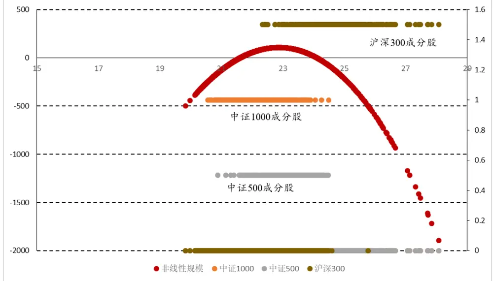
数据来源：财通证券研究所

财通金工给出的答案是否定的，图16对此进行了展示。在该图中横坐标为股票的对数市值，抛物线上的点对应的是股票的非线性规模因子。此外，我们分别以不同的点代表沪深300、中证500和中证1000的成分股，为了对三者进行区分，我们将其设置成不同的值。可以看到，沪深300对应的股票确实很明显地处于市值的较大区间，但中证500和中证1000之间虽然并无交集，但其成分股所处的市值分组非常相似。也就是说，中证1000指数并不代表市场上市值排名末尾的那些股票走势，因此它和中证500指数在非线性规模因子上的水平十分接近也就不足为奇了。

从图16也可以看到，非线性规模因子的形状虽然与抛物线十分类似，但它并不是严格意义上的抛物线，因为它的两边是不对称的——偏向大市值股票的非线性规模因子会急剧下降，而小市值股票的非线性规模下降没有那么明显。因此财通金工认为，非线性规模因子是否能够较好地代表中市值股票本身的特性，还是值得商榷的。

## 1.4 小结

作为财通金工对Alpha因子进行研究的前哨性报告，本文对非线性规模因子的计算和有效性进行讨论，探究A股市场是否存在中市值效应，主要结论如下：

（1） 对非线性规模因子的计算有回归法和平方法两种，前者将对数市三次方对对数市值进行回归、取残差的相反数作为代理变量，后者将对数市值进行标准化，直接取标准化后因子的平方，二者在本质上并无不同；

（2） 从非线性规模纯因子组合的净值走势来看，非线性规模纯因子的历年收益均为负，波动性要明显小于规模纯因子，中市值股票并不能跑赢甚至是跑输了大小市值股票；

（3） 从分组法对非线性规模因子构建多空组合来看，对冲组合的年化收益达到22.16%，年化波动为8.17%，信息比率IR达到2.71；

（4） 从Fama-Macbeth检验来看，非线性规模因子的加入有助于解释收益率在横截面上的波动，且其溢价能力并不能被已有因子所解释；

（5） 尽管中证1000指数目的是代表小市值股票，但我们深入研究发现，它并没有代表市场上市值最小的那部分股票走势，因此中证1000指数的非线性规模与中证500指数的非线性规模在相似水平也就不足为奇。

## 2、 一周行情回顾

上周市场总体由情绪面支撑，尽管日内波动较大，但 4 个交易日均录得正收益。总体来看中小盘指数的走势要强于大盘指数，但大盘指数在后两个交易日有反弹。上周中证 500 价值指数和 380 价值指数分别大涨 7.48%和 7.47%，在所有样本指数中排名前二，而上证 50 指数和超大盘指数分别录得 4.00%%和 4.07%的收益，涨幅相对落后。

图17：上周主要指数收益（2019.3.29-2019.4.4）
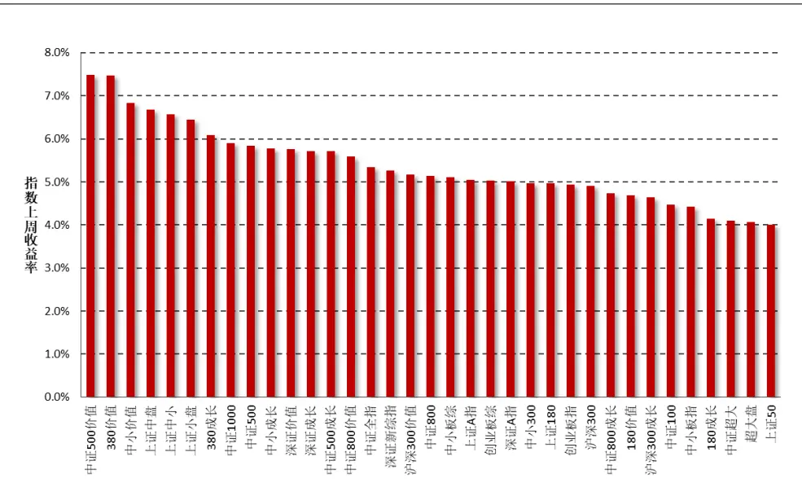
数据来源：财通证券研究所，Wind

行业方面，在所有 29 个中信一级行业中，基础化工和建材行业分别上涨 9.22%和 8.77%，而食品饮料和医药行业分别上涨 2.42%和 3.35%收益，排名相对靠后。

图18：上周中信一级行业指数收益（2019.3.29-2019.4.4）
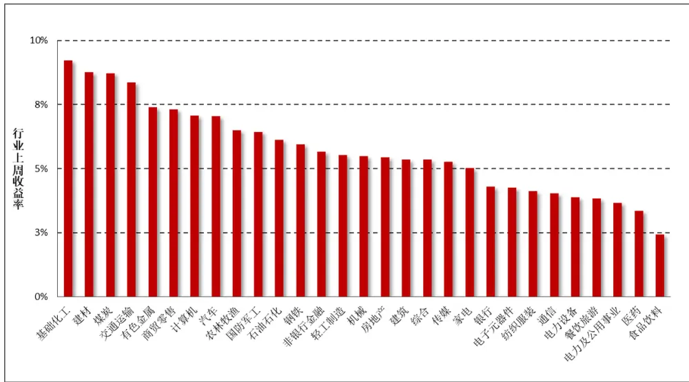
数据来源：财通证券研究所，Wind

## 3、 市场风格解析及指数风险预测

财通金工借鉴 Barra 模型，选取 Beta、规模、动量、波动率、非线性规模、、流动性、盈利、成长和杠杆率因子构建收益 风险归因模型，因子定义及计算细节参见附录二。本部分通过对近期风格因子的收益表现进行分析以期捕捉 A股市场的风格变化，同时对财通金工样本指数的未来一月风险进行预测来分析当前 A 股市场所处的风险水平。风格因子的收益拆解可参见财通金工专题报告《Barra 模型初探：A股市场风格解析》，资产组合的风险预测可参见财通金工专题报告《Barra 模型进阶：多因子模型风险预测》。

## 3.1 市场风格解析

各类风格因子在上周的累计收益可分为日度累计收益和周度收益两种，日度累计收益是根据风格因子的日度收益计算得到，周度收益是将股票在本周的收益率对股票在上周最后一个交易日的因子暴露度进行回归得到的因子纯净收益，二者之间的区别在于换仓频率的不同，前者为每日换仓，而后者在每周最后一个交易日换仓。

表 3 和图 19 展示了上周各类风格因子的累计收益和周度收益大小，可以看到，二者十分近似。本周 Beta 因子继续强势表现，非线性规模因子出现反弹，而动量因子则经历了较大回撤，市场在风格偏好上更倾向于中小市值股票。

表3：上周纯风格因子收益（2019.4.1-2019.4.4）

| 日期 | Beta | 规模 | 长期动量 | 波动率 | 非线性规模 | BP | 流动性 | 盈利 | 成长 | 杠杆 |
| --- | --- | --- | --- | --- | --- | --- | --- | --- | --- | --- |
| 2019/4/1 | 0.34% | -0.10% | 0.01% | 0.17% | 0.13% | -0.01% | 0.11% | 0.13% | -0.04% | 0.16% |
| 2019/4/2 | 0.20% | -0.21% | -0.17% | 0.14% | 0.08% | -0.09% | -0.06% | 0.05% | -0.05% | 0.11% |
| 2019/4/3 | 0.30% | 0.02% | -0.29% | -0.20% | -0.08% | 0.14% | -0.14% | -0.06% | 0.13% | 0.07% |
| 2019/4/4 | -0.01% | 0.19% | -0.10% | -0.17% | -0.03% | -0.06% | 0.09% | 0.22% | -0.07% | -0.01% |
| 上周累计收益 | 0.83% | -0.10% | -0.54% | -0.06% | 0.10% | -0.03% | 0.00% | 0.35% | -0.02% | 0.32% |
| 周度收益 | 0.66% | -0.18% | -0.48% | -0.13% | 0.12% | 0.00% | 0.10% | 0.40% | -0.09% | 0.36% |
| 前一周度收益 | -0.11% | 0.30% | 0.61% | -0.71% | -0.33% | -0.53% | -0.23% | 0.11% | 0.22% | -0.12% |

数据来源：财通证券研究所，Wind

图 19：近两周纯风格因子收益比较（2019.3.22-2019.4.4）
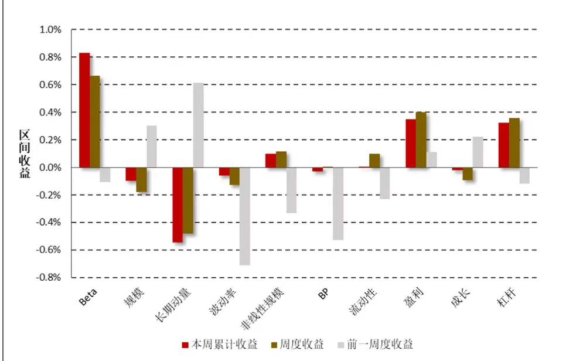
数据来源：财通证券研究所,Wind

图20：最近一个月风格因子净值走势（2019.3.5-2019.4.4）
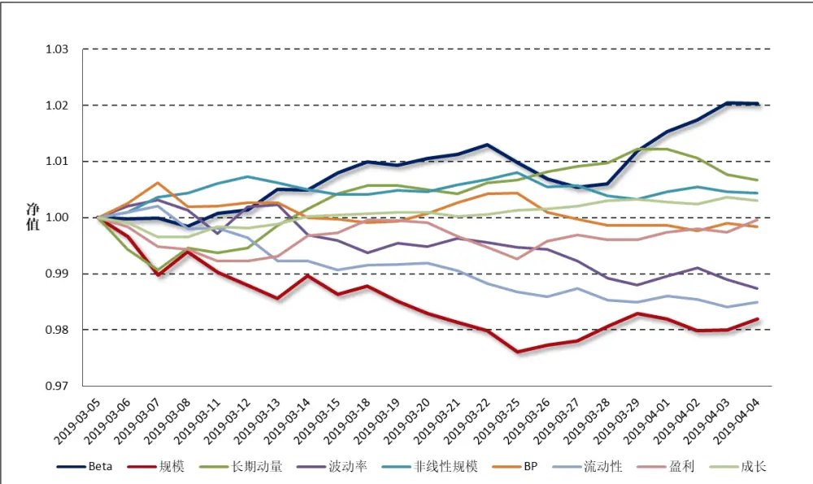
数据来源：财通证券研究所，Wind

图 20 和图 21 分别展示了最近一个月各类风格因子的净值走势及累计收益，以观察各类风格因子在过去一段时间的持续盈利能力。整体来讲，在过去的一个月中，高 Beta、前期涨幅较高的股票能够获得相对较高的收益，而大规模、高换手、高波动的股票后市将会出现较为明显的回撤。

图21：最近一个月风格因子累计收益（2019.3.5-2019.4.4）
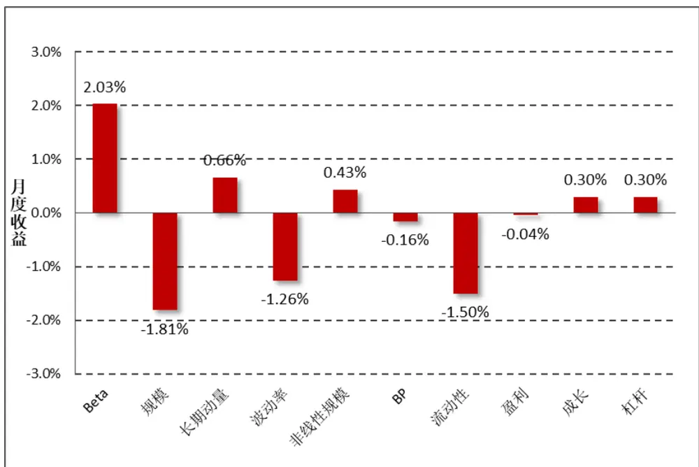
数据来源：财通证券研究所，Wind

## 3.2 指数风险预测

对收益的分解仅代表过去，对风险的预测才代表未来。多因子模型风险预测将股票风险拆解为共同风险和特质风险两部分，在通过稳健调整对共同风险矩阵和特质风险矩阵进行估计后，即可根据指数的成分股权重来估计指数在未来一段时间的波动情况。为了保证结果的严谨性，此处我们直接采用 Wind 提供的成分股权重数据，而非根据自由流通市值计算得到，尽管二者的结果十分类似。

$$
Risk(P)=W^{\prime}VW=W^{\prime}(X^{\prime}FX+\Delta)W
$$

图 22 展示了财通金工样本指数在未来一个月的预测波动率，为了方便展示我们将估计的月度波动率进行年化，波动的预测时间为上周最后一个交易日（2019.4.4）。可以看到，所有样本指数未来一月的年化波动区间在 22%-31%之间，预测波动与上周水平基本保持一致，财通金工特别提醒投资者注意当前市场波动情况，对后市维持谨慎乐观态度。中小板股票、成长类指数的风险较大，而偏大盘股票、价值类股票的风险普遍较小。

图22：财通金工样本指数未来一月波动预测（年化）（2019.4.4-2019.5.6）
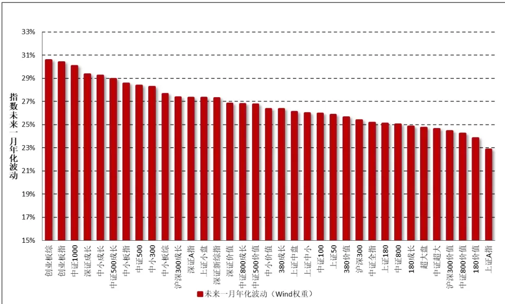
数据来源：财通证券研究所，Wind

由于在计算股票的风格因子时，我们会对暂停上市的股票、大类因子值存在缺失的股票进行剔除，因此在进行收益归因和风险预测时，并非所有指数成分股都纳入到了模型中，如果缺失股票个数过多或者缺失股票的权重占比过大，将会对模型结果造成较大影响。图 23 展示了各大指数在模型拟合过程中，纳入考虑的股票个数（权重）占指数成分股个数（权重）的比例，可以看到所有指数的比例均在 93%以上，数据质量的拟合较为合意。

图23：收益回归/风险预测样本股票占指数成分股比率
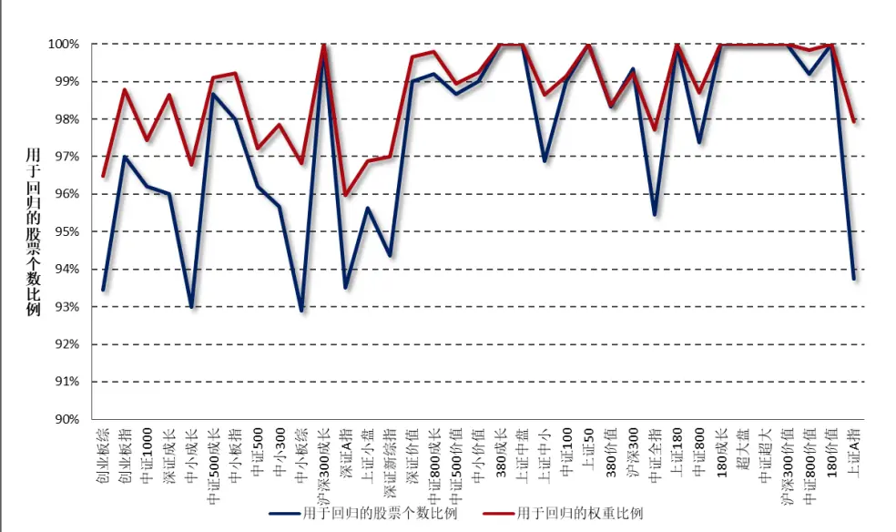
数据来源：财通证券研究所，Wind

## 4、 指数成分收益归因：

本部分财通金工对上周表现最好的三只指数和表现最差的三只指数进行归因分析，以观察涨幅较高（或较低）的指数风险暴露是否展现出较高的趋同性以及两类指数的持股风格是否会表现出明显的差别，其结果如图 24 和图 25 所示。

图24：上周表现最好三指数因子暴露度
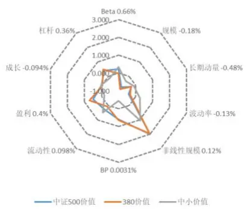
数据来源：财通证券研究所，Wind

图25：上周表现最差三指数因子暴露度
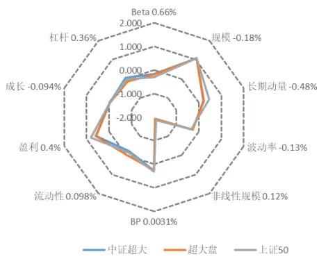
数据来源：财通证券研究所，Wind

表 4 展示了各大指数上周在各类因子上的暴露程度，可以看到，上周市场风格以中小盘指数为主，表现最好的三只指数是中小盘指数，其在非线性规模因子上暴露较多，而表现较差的三只指数则更多地偏向于大规模股票，其在规模因子上的较大暴露拖累指数收益。

表4：指数在风格因子上的暴露程度（2019.4.4）

| 代码 指数名称 |  | Beta 0.66% | 规模 -0.18% 长 | 期动量 -0.波 | 动率 -0.13 非 | 线性规模 C | BP 0.0031% 流 | 动性 0.098 | 盈利 0.4% | 成长-0.0949 | 杠杆 0.36% | 实际收益 |
| --- | --- | --- | --- | --- | --- | --- | --- | --- | --- | --- | --- | --- |
| H30352.CSI 中证500价值 |  | 0.227 | -0.748 | -0.252 | -0.402 | 2.005 | 0.584 | 0.302 | 0.499 | 0.008 | 0.403 | 7.48% |
| 000118.SH | 380价值 | -0.025 | -0.872 | -0.264 | -0.328 | 1.938 | 0.635 | 0.075 | 0.722 | -0.036 | 0.477 | 7.47% |
| 399604.SZ | 中小价值 | 0.342 | -0.312 | -0.105 | 0.256 | 1.053 | -0.448 | 0.510 | -0.170 | 0.033 | -0.136 | 6.83% |
| 000044.SH | 上证中盘 | 0.269 | 0.455 | 0.171 | -0.016 | 0.238 | -0.135 | 0.427 | -0.090 | -0.144 | 0.177 | 6.68% |
| 000046.SH | 上证中小 | 0.282 | -0.056 | -0.019 | 0.035 | 0.940 | -0.107 | 0.471 | -0.169 | -0.075 | 0.169 | 6.57% |
| 000045.SH | 上证小盘 | 0.298 | -0.738 | -0.272 | 0.103 | 1.875 | -0.071 | 0.530 | -0.275 | 0.017 | 0.157 | 6.44% |
| 000117.SH | 380成长 | 0.214 | -0.741 | -0.249 | 0.058 | 1.824 | -0.567 | 0.646 | 0.001 | 0.086 | -0.014 | 6.09% |
| 000852.SH | 中证1000 | 0.480 | -1.472 | -0.393 | 0.374 | 1.814 | -0.520 | 0.767 | -0.796 | 0.149 | -0.245 | 5.90% |
| 000905.SH | 中证500 | 0.459 | -0.751 | -0.247 | 0.146 | 1.969 | -0.250 | 0.638 | -0.440 | 0.038 | 0.072 | 5.84% |
| 399602.SZ | 中小成长 | 0.697 | -0.008 | -0.157 | 0.537 | 0.688 | -1.048 | 0.884 | -0.708 | 0.181 | -0.170 | 5.77% |
| 399348.SZ | 深证价值 | 0.402 | 0.518 | 0.277 | 0.001 | -0.367 | -0.323 | 0.577 | 0.270 | 0.049 | 0.232 | 5.77% |
| 399346.SZ | 深证成长 | 0.768 | 0.332 | 0.221 | 0.495 | 0.054 | -1.071 | 1.023 | -0.688 | 0.103 | 0.000 | 5.72% |
| H30351.CSI | 中证500成长 | 0.671 | -0.671 | -0.309 | 0.149 | 1.963 | -0.416 | 0.879 | -0.147 | 0.142 | 0.076 | 5.71% |
| H30356.CSI | 中证800价值 | -0.257 | 0.676 | 0.200 | -0.401 | -0.789 | 0.652 | -0.097 | 1.036 | -0.038 | 0.452 | 5.58% |
| 000985.CSI | 中证全指 | 0.251 | -0.234 | 0.000 | 0.098 | 0.313 | -0.274 | 0.443 | -0.208 | 0.026 | -0.073 | 5.35% |
| 399100.SZ | 深证新综指 | 0.516 | -0.585 | -0.126 | 0.290 | 0.811 | -0.634 | 0.636 | -0.620 | 0.109 | -0.196 | 5.26% |
| 000919.CSI | 沪深300价值 | -0.546 | 0.916 | 0.248 | -0.432 | -1.289 | 0.823 | -0.283 | 1.282 | -0.012 | 0.448 | 5.17% |
| 000906.SH | 中证800 | 0.199 | 0.407 | 0.172 | -0.052 | -0.164 | -0.144 | 0.333 | 0.081 | -0.005 | 0.039 | 5.14% |
| 399101.SZ | 中小板综 | 0.404 | -0.707 | -0.260 | 0.447 | 1.020 | -0.801 | 0.599 | -0.848 | 0.120 | -0.352 | 5.10% |
| 000002.SH | 上证A指 | -0.174 | 0.285 | 0.081 | -0.086 | -0.388 | 0.242 | -0.111 | 0.239 | -0.042 | 0.067 | 5.04% |
| 399102.SZ | 创业板综 | 0.739 | -1.157 | -0.103 | 0.555 | 1.145 | -1.096 | 1.004 | -1.246 | 0.240 | -0.555 | 5.03% |
| 399107.SZ | 深证A指 | 0.485 | -0.598 | -0.087 | 0.373 | 0.805 | -0.689 | 0.783 | -0.694 | 0.153 | -0.239 | 5.01% |
| 399008.SZ | 中小300 | 0.570 | -0.294 | -0.145 | 0.437 | 1.100 | -0.925 | 0.833 | -0.805 | 0.158 | -0.274 | 4.98% |
| 000010.SH | 上证180 | -0.098 | 0.848 | 0.361 | -0.226 | -1.087 | 0.152 | 0.052 | 0.481 | -0.081 | 0.046 | 4.96% |
| 399006.SZ | 创业板指 | 0.719 | -0.166 | 0.340 | 0.727 | 0.991 | -1.325 | 1.257 | -1.248 | 0.275 | -0.451 | 4.94% |
| 000300.SH | 沪深300 | 0.114 | 0.784 | 0.309 | -0.116 | -0.858 | -0.110 | 0.234 | 0.250 | -0.019 | 0.028 | 4.90% |
| H30355.CSI | 中证800成长 | 0.369 | 0.484 | 0.290 | 0.019 | -0.292 | -0.799 | 0.595 | 0.070 | 0.105 | -0.001 | 4.73% |
| 000029.SH | 180价值 | -0.752 | 0.957 | 0.201 | -0.482 | -1.466 | 1.107 | -0.470 | 1.392 | 0.002 | 0.336 | 4.69% |
| 000918.SH | 沪深300成长 | 0.227 | 0.796 | 0.424 | -0.033 | -0.867 | -0.882 | 0.461 | 0.157 | 0.098 | -0.062 | 4.64% |
| 000903.SH | 中证100 | -0.064 | 1.048 | 0.412 | -0.270 | -1.692 | 0.059 | -0.011 | 0.574 | -0.043 | 0.010 | 4.46% |
| 399005.SZ | 中小板指 | 0.707 | 0.197 | -0.017 | 0.398 | 0.604 | -1.070 | 0.861 | -0.773 | 0.175 | -0.261 | 4.43% |
| 000028.SH | 180成长 | -0.261 | 0.901 | 0.458 | -0.049 | -1.244 | -0.353 | 0.035 | 0.455 | 0.076 | -0.007 | 4.15% |
| 000980.CSI | 中证超大 | -0.178 | 1.077 | 0.214 | -0.283 | -1.882 | 0.274 | -0.225 | 0.565 | -0.035 | 0.052 | 4.10% |
| 000043.SH | 超大盘 | -0.197 | 1.080 | 0.209 | -0.277 | -1.918 | 0.257 | -0.029 | 0.603 | -0.041 | -0.118 | 4.07% |
| 000016.SH | 上证50 | -0.306 | 1.070 | 0.468 | -0.344 | -1.835 | 0.314 | -0.160 | 0.803 | -0.045 | -0.027 | 4.00% |

数据来源：财通证券研究所，Wind

## 【参考文献】

【1】Characteristics of Factor Portfolios, Jose Menchero, 2010.3, MSCI Working Paper

## 5、 附录

| 附录一：财通金工指数池选取 |  |  |  |  |  |
| --- | --- | --- | --- | --- | --- |
| 上证规模/风格指数 |  | 深证综合/规模指数 |  | 中证规模/风格指数 |  |
| 000001.SH | 上证综指 | 399101.SZ | 中小板综 | 000300.SH | 沪深300 |
| 000002.SH | 上证A指 | 399102.SZ | 创业板棕 | 000852.SH | 中证 1000 |
| 000010.SH | 上证 180 | 399106.SZ | 深证综指 | 000985.CSI | 中证全指 |
| 000016.SH | 上证50 | 399107.SZ | 深证A指 | 000980.CSI | 中证超大 |
| 000043.SH | 超大盘 | 399005.SZ | 中小板指 | 000903.SH | 中证100 |
| 000044.SH | 上证中盘 | 399006.SZ | 创业板指 | 000905.SH | 中证 500 |
| 000045.SH | 上证小盘 | 399008.SZ | 中小300 | 000906.SH | 中证 800 |
| 000046.SH | 上证中小 | 399346.SZ | 深证成长 | 000918.SH | 沪深 300 成长 |
| 000028.SH | 180成长 | 399348.SZ | 深证价值 | 000919.SH | 沪深 300 价值 |
| 000029.SH | 180 价值 | 399602.SZ | 中小成长 | H30351.CSI | 中证500 成长 |
| 000117.SH | 380 成长 | 399604.SZ | 中小价值 | H30352.CSI | 中证 500 价值 |
| 000118.SH | 380 价值 |  |  | H30355.CSI | 中证800 成长 |

谨请参阅尾页重要声明及财通证券股票和行业评级标准

| H30356.CSI | 中证 800 价值 |
| --- | --- |

数据来源：财通证券研究所

附录二：财通金工风格因子定义

|  | 财通金工规 |  |  |  |
| --- | --- | --- | --- | --- |
| 大类因子 | 子类因子 | 因子定义及计算 | 权重 | 备注 |
| Beta | BETA | $\mathbf{r_{t}}=\alpha+\beta\mathbf{R_{t}}+\mathbf{e_{t}},$ 将单只股票过去252天的日度收益率对流通市值加权指数日度收益率进行半衰指数加权回归，半衰期为 63 天 | 1 | 1) 采用流通市值而非总市值加权，因为各大指数编制采用流通市值加权；2) 需要剔除当日停牌或者未上市日期的数据，并将权重进行归一化；3)若满足条件的样本数据少于42天，我们将其 Beta 置为 NaN。 |
| 规模 | SIZE | 股票总市值取对数 | 1 | 由于PB、PE等因子的计算是基于总市值的，因此此处也用总市值 |
| 动量 | RSTR | 过去一段时间个股的累计收益率，不含最近一个月， $\begin{array}{r}{\mathrm{RSTR}=\sum_{\mathrm{t}=\mathrm{L}}^{\mathrm{T}+\mathrm{L}}\mathrm{w}_{\mathrm{t}}(\ln(1+\mathrm{r}_{\mathrm{t}}),}\end{array}$ $\mathrm{r}_{\mathrm{t}}=\mathrm{P}_{\mathrm{t}}/\mathrm{P}_{\mathrm{t}-1}-1,\quad\mathrm{T}=504,\quad\mathrm{L}=21,$ 收益率序列采用半衰指数加权，半衰期为126天 | 1 | 1) 对于数据质量较好的个股，计算动量时采用了2年的数据2) 需要剔除未上市日期数据，但无需剔除停牌日期数据，并将权重归一化3)若满足条件的数据样本小于42天，我们将其动量置为NaN |
| 波动率(对Beta因子和市值因子进行正交化处理） | DASTD | 个股相对市值加权指数的超额收益率序列的半衰指数加权标准差，T=252，半衰期为42天1/2 $\mathrm{DASTD}=\left(\sum_{\mathrm{t}=1}^{\mathrm{T}}\mathrm{w}_{\mathrm{t}}\left(\mathrm{r}_{\mathrm{t}}-\mu(\mathrm{r})\right)^2\right)^{\frac{1}{2}}$ | 0.7 | 1) 采用流通市值加权计算指数收益2) 需要剔除当日停牌或者未上市日期的数据，并将权重进行归一化3) 若满足条件的数据样本小于42天，我们将其因子值置为NaN |
|  | CMRA | 表示过去12个月的波动幅度， $\begin{array}{r}{\mathrm{CMRA}=\ln(1+\operatorname*{max}\{\mathrm{Z(T)}\})-\ln(1+\operatorname*{min}\{\mathrm{Z(T)}\}),}\end{array}$ $\mathrm{Z(T)=\exp(\sum_{t=1}^{T}\ln(1+r_t))-1}$ ，表示过去T个月的收益率 | 0.15 | 以21 天为 1 个月 |
|  | HSIGMA | 计算 Beta 时残差的标准差， Hsigma = std(ei) | 0.15 | 同 Beta 因子的计算 |
| 非线性规模 | NonLinerSize | 中市值因子，将股票总市值对数的三次方对总市值对数回归，取残差的相反数 | 1 | 用于衡量市值因子的非线性性，总市值越大和越小的股票的非线性规模越小，中市值股票的非线性规模越大 |
| 估值 | BP | 市净率的倒数，1/PB | 1 | 采用 Wind 中的 pb_lf 因子的倒数 |
| 流动性(对市值因子进行正交化） | STOM | 月度换手率，STOM = In(mean(Σt=1(Vt/St)))其中V为当日成交量，S为流通股本 | 0.5 | 1)采用流通股本值，而非自由流通股本值2)剔除未上市、停牌日期的数据 |
|  | STOQ | 季度换手率， $\begin{array}{r}{\mathrm{STOQ}=\ln(\mathrm{mean}(\sum_{t=1}^{63}(V_{t}/S_{t}))),}\end{array}$ | 0.25 | 同 STOQ 因子的计算 |
|  | STOA | 年度换手率， $\mathrm{STOA}=\ln(\mathrm{mean}(\sum_{t=1}^{252}(V_t/S_t)))$ | 0.25 | 同 STOQ 因子的计算 |
| 盈利 | CETOP | 过去滚动12个月的经营现金流除以当前市值实际计算中取市现率 PCF（经营现金流 TTM）的倒数 | 1/2 | 采用 Wind 中的 PCF_OCF_ttm 因子的倒数 |
|  | ETOP | 过去滚动12个月的利润除以当前市值实际计算中取市盈率 PETTM 的倒数 | 1/2 | 采用 Wind 中的 PE_ttm 因子的倒数 |
| 成长 | YOYProfit | 单季度净利润同比增长率 | 1/2 | 为避免使用未来数据，需要根据季报公布时间进行调整 |
|  | YOYSales | 单季度营业收入同比增长率 | 1/2 | 同 YOYProfit 因子的计算 |
| 杠杆 | MLEV | 市场杠杆率，MLEV=（总市值+非流动负债）/总市值 | 1/3 |  |
|  | DTOA | 资产负债率，DTOA=总资产/总负债 | 1/3 |  |
|  | BLEV | 账面杠杆率，BLEV=（账面价值+非流动负债）/账面价值 | 1/3 |  |

数据来源：财通证券研究所

备注：1.波动率因子需对Beta因子和市值因子进行正交化处理；

2.流动性因子需对市值因子进行正交化处理；

若大类因子下所有子类因子值全部缺失，则该股票的因子值记为缺失，否则用有数据的因子值进行替代，注意需对权重进行归一化处理

## 信息披露

## 分析师承诺

作者具有中国证券业协会授予的证券投资咨询执业资格，并注册为证券分析师，具备专业胜任能力，保证报告所采用的数据均来自合规渠道，分析逻辑基于作者的职业理解。本报告清晰地反映了作者的研究观点，力求独立、客观和公正，结论不受任何第三方的授意或影响，作者也不会因本报告中的具体推荐意见或观点而直接或间接收到任何形式的补偿。

## 资质声明

财通证券股份有限公司具备中国证券监督管理委员会许可的证券投资咨询业务资格。

## 公司评级

买入：我们预计未来 6个月内，个股相对大盘涨幅在 15%以上；

增持：我们预计未来 6个月内，个股相对大盘涨幅介于 5%与 15%之间；

中性：我们预计未来 6个月内，个股相对大盘涨幅介于-5%与 5%之间；

减持：我们预计未来 6个月内，个股相对大盘涨幅介于-5%与-15%之间；

卖出：我们预计未来 6个月内，个股相对大盘涨幅低于-15%。

## 行业评级

增持：我们预计未来 6个月内，行业整体回报高于市场整体水平 5%以上；

中性：我们预计未来 6个月内，行业整体回报介于市场整体水平-5%与 5%之间；

减持：我们预计未来 6个月内，行业整体回报低于市场整体水平-5%以下。

## 免责声明

本报告仅供财通证券股份有限公司的客户使用。本公司不会因接收人收到本报告而视其为本公司的当然客户。

本报告的信息来源于已公开的资料，本公司不保证该等信息的准确性、完整性。本报告所载的资料、工具、意见及推测只提供给客户作参考之用，并非作为或被视为出售或购买证券或其他投资标的邀请或向他人作出邀请。

本报告所载的资料、意见及推测仅反映本公司于发布本报告当日的判断，本报告所指的证券或投资标的价格、价值及投资收入可能会波动。在不同时期，本公司可发出与本报告所载资料、意见及推测不一致的报告。

本公司通过信息隔离墙对可能存在利益冲突的业务部门或关联机构之间的信息流动进行控制。因此，客户应注意，在法律许可的情况下，本公司及其所属关联机构可能会持有报告中提到的公司所发行的证券或期权并进行证券或期权交易，也可能为这些公司提供或者争取提供投资银行、财务顾问或者金融产品等相关服务。在法律许可的情况下，本公司的员工可能担任本报告所提到的公司的董事。

本报告中所指的投资及服务可能不适合个别客户，不构成客户私人咨询建议。在任何情况下，本报告中的信息或所表述的意见均不构成对任何人的投资建议。在任何情况下，本公司不对任何人使用本报告中的任何内容所引致的任何损失负任何责任。

本报告仅作为客户作出投资决策和公司投资顾问为客户提供投资建议的参考。客户应当独立作出投资决策，而基于本报告作出任何投资决定或就本报告要求任何解释前应咨询所在证券机构投资顾问和服务人员的意见；

本报告的版权归本公司所有，未经书面许可，任何机构和个人不得以任何形式翻版、复制、发表或引用，或再次分发给任何其他人，或以任何侵犯本公司版权的其他方式使用。