2019 年 04 月 16 日

# 牛市抢跑者：低Beta一定代表低风险吗？“拾穗”多因子系列报告（第 9 期）

## 联系信息

陶勤英分析师

SAC 证书编号：S0160517100002 021-68592393

taoqy@ctsec.com

张宇研究助理

zhangyu1@ctsec.com 021-68592337

176216888421

## 相关报告

【1】“星火”多因子系列（一）：《Barra模型初探：A 股市场风格解析》

【2】“星火”多因子系列（二）：《Barra模型进阶：多因子模型风险预测》

【3】“星火”多因子系列（三）：《Barra模型深化：纯因子组合构建》

【4】“星火”多因子系列（四）：《基于持仓的基金绩效归因：始于 Brinson，归于 Barra》【 】“拾穗”多因子系列（一）：《带约束的加权最小二乘：一种解析解法》

【6】“拾穗”多因子系列（二）：《你看到的不一定是你所想的：解密 R 方》

【7】“拾穗”多因子系列（三）：《行业因子选取：中信一级还是申万一级？》

【8】“拾穗”多因子系列（四）：《总市值、流通市值、自由流通市值：谈谈取舍》

【9】“拾穗”多因子系列（五）：《数据异常值处理：比较与实践》

【10】“拾穗”多因子系列（六）：《因子缺失值处理：数以多为贵》

【11】“拾穗”多因子系列（七）：《从纯因子组合的角度看待多重共线性》

【12】“拾穗”多因子系列（八）：《非线性规模因子： 股市场存在中市值效应吗？》

## 投资要点：

- 牛市抢跑者：低 Beta 一定代表低风险吗？

- 2019 年迄今为止，在所有风格因子中 Beta 因子的表现最为抢眼，在样本区间内已经获得了 5.36%的高收益，纯 Beta 因子的表现甚至优于纯规模因子。

- 简单 Beta 因子的走势持续向下，而剔除了其他风格暴露的纯 Beta因子却能够获得较为稳定的正收益，这是由于高 Beta 股票同时具有高换手和高波动导致的。

- 行业 Beta 的计算可以根据行业指数计算，也可根据行业成分股的Beta 市值加权计算得到，二者差异不大。银行业的 Beta 均值仅为0.67，这也是其今年涨幅仅为上证综指涨幅 70%的原因之一。

- 在全样本期间，Beta 并不是一个十分有效的单因子。但在市场由牛转熊的切换中，低 Beta 策略能够为组合提供一定的保护性。在市场由熊转牛的切换中，高 Beta 策略能够为组合带来较高的攻击性。在市场持续熊市状态下，财通金工也更建议配置低 Beta 策略。

## 市场风格解析

整体来讲，在过去的一个月中，高 Beta 的股票、前期涨幅较高的股票能够获得相对较高的收益，而大规模、高换手、高波动的股票后市走势将会出现更为明显的回撤。当前时点处于年报和季报陆续公开的时间，企业盈利的增加在消息面上能够带动股票价格上升，盈利因子本周表现较好。

## 指数风险预测

所有样本指数在未来一个月的年化波动区间在 22%-31%之间，相较上周攀升明显，财通金工特别提醒投资者注意当前市场的波动情况。

## 指数成分收益归因

上周市场中小盘股跌幅明显，表现最好的三只指数都偏大盘指数，其在规模因子上的正暴露和在非线性规模因子上的负暴露基本抵消了收益，而表现较差的三只指数更多得偏向于中小盘股票，其在 Beta、非线性规模和流动性上的较高暴露拖累指数走势。

- 风险提示：本报告统计结果基于历史数据，过去数据不代表未来，市场风格变化可能导致模型失效。

在实际投资中，多因子模型被广泛地应用到资产定价、绩效归因、风险控制、组合优化、基金评价及资产配置等各个领域，一套完整、精细的多因子系统成为每位量化研究者必备的工具。“做最实用的研究”，是财通金工给自己的定位。我们将在之后的系列报告中，就投资者们最关心也最容易忽略的很多细节问题进行探讨，介绍我们在实际应用中遇到的问题和思考，以飨读者。

我们为本系列报告取名“拾穗”。一周市场风云变幻，和风细雨也好，狂风骤雨也罢，都留下一地故事等待梳理。作为勤劳的搬运工，财通金工从量化视角出发对市场风格进行捕捉、对风险水平进行预测，既是希望能够如拾穗者般专心、踏实地做研究，也是祝愿各位投资者能够在市场收获满地金黄。

本期是该系列报告的第九期，主要就 2019年以来表现最为强势的 Beta因子展开讨论。本文以投资者传统认知中的低 Beta异象与纯 Beta因子的高收益现象作为矛盾出发点，探究二者表现截然不同的原因。随后介绍今年高 Beta 指数在沪深 300和中证 500中的不同表现，并分析为何高 Beta策略在沪深 300中的表现明显优于中证 500。在文章最后一部分，我们还通过情景分析法为投资者该在怎样的市场环境中配置低Beta 策略提供一定的参考。

## 1、 低 Beta 一定代表低风险吗？

作为2019年迄今为止表现最为闪耀的风格因子，Beta纯因子已经获得了5.36%的高收益，在所有风格因子中排名第一。然而低 Beta 异象在 A股市场上的讨论早已存在，低 Beta 是否一定代表低风险？低风险是否又一定意味着低收益？传统的 Beta 因子组合是否受其他已知的风格因子影响？如果 Beta 策略有效，那么该在何时高配或者低配 Beta 策略？本文主要就以上问题进行探讨。

## 1.1 故事的源起

在CAPM模型刚提出时，Beta因子衡量的是股票收益相对于市场收益的弹性。若单只股票的Beta值大于1，它表示股票波动大于市场波动，该股票的弹性较大；若Beta值小于1，它表示股票波动小于市场波动，该股票的弹性相对较小，因此传统意义上Beta因子可以被当作衡量股票风险的一个指标。

随着多因子模型的兴起，Beta因子本身也有了更为广泛的含义，它表示投资组合在风险因子上的暴露程度，衡量的是组合相对风险因子溢价的敏感度。若某个组合在Beta因子上的暴露越高，该组合在风险因子上的敞口也就越大，因而所暴露的市场风险也就越大。在本文的介绍中，我们取其狭义的Beta含义，也就是股票收益相对市场收益的波动幅度。

图1：组合A、B相对基准组合净值走势
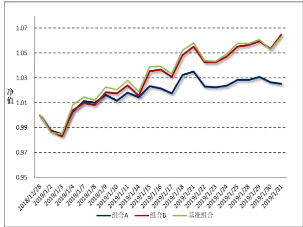
数据来源：财通证券研究所，“星火”专题（四）

图2：组合A、B在各风格因子上所得收益
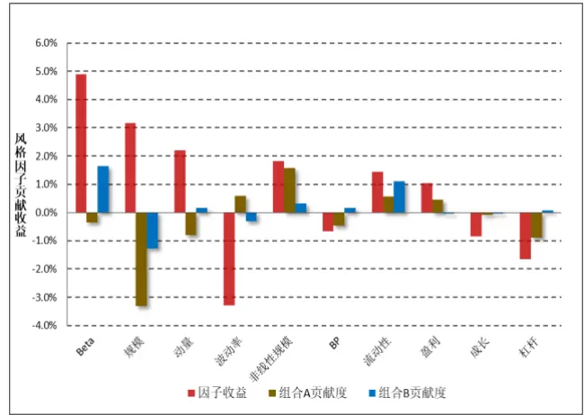
数据来源：财通证券研究所，“星火”专题（四）

在本文开始对Beta因子进行讨论之前，我们先来谈谈为何将Beta因子作为本期“拾穗”系列专题的讨论重点，这其中主要受到了两点启发。

其一，在财通金工“星火”专题（四）：《基于持仓的基金绩效归因：始于Brinson，归于Barra》中，我们对两只同样跟踪市场基准但净值表现截然不同的指数增强型基金的收益进行归因发现（如图2所示），在2018.12.28-2019.1.31期间，组合A之所以在净值表现上大幅落后组合B，其原因在于组合A在Beta因子上的暴露显著地落后于组合B，而在2019年1月份期间，Beta因子获取了非常高的正收益。

图3展示了财通金工多因子风险系统中，十大类风格因子在2019年迄今为止的累计收益情况。可以看到，在所有风格因子中，Beta因子的表现最为抢眼，在样本区间内已经获得了5.36%的高收益，Beta纯因子的表现甚至要优于纯规模因子的表现。

图3：各大风格因子收益情况（2018.12.28-2019.4.12）
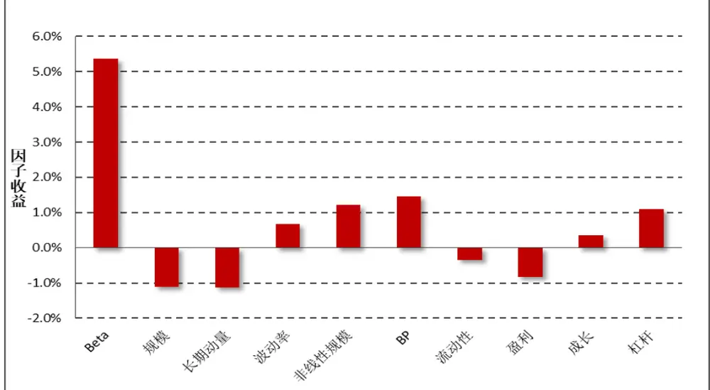
数据来源：财通证券研究所，Wind

图4展示了Beta纯因子在2008年-2019年期间每个年度的收益情况，可以看到在全部12个年份中，有8个年份获得了正收益，胜率达到66.7%。而且纯Beta因子在历年盈亏比较高，在收益为正的年份里，其在2009和2015年收益分别达到12.93%和8.91%，而在出现亏损的年份里，除了2008年获得-4.94%的负收益外，其余三个年份的亏损均不超过2%。

图4：Beta纯因子历年收益情况（2008-2019.4.12）
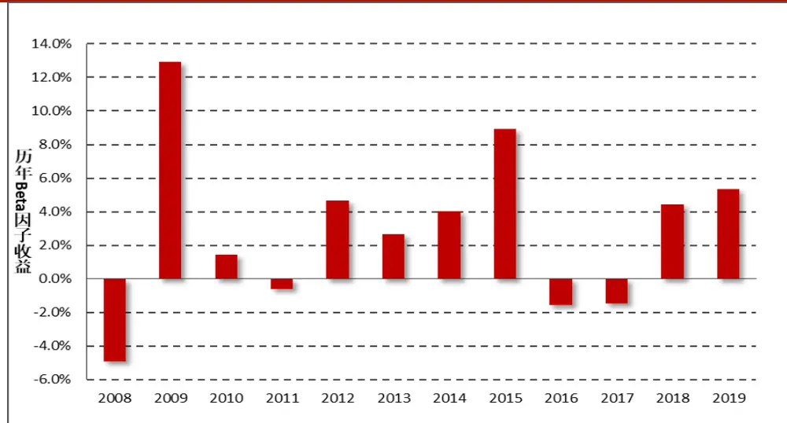
数据来源：财通证券研究所，Wind

对Beta因子展开探讨的第二个原因来自于财通金工“拾穗”系列（七）《从纯因子组合的角度看待多重共线性》。在该报告中我们探讨了各大风格因子的简单因子组合及纯因子组合之间的差异，并且发现对于Beta因子而言，其简单因子组合在样本回测期间获得了显著的负收益，而在剥离了其他风格因子的影响之后，纯 因子的走势却一直向上。

图5：简单Beta因子组合与纯Beta因子组合净值走势（2009.12.31-2019.4.4）
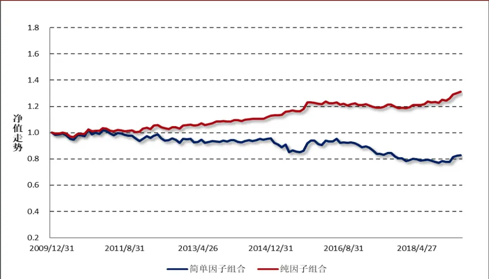
数据来源：财通证券研究所，“拾穗”系列（七）

那么简单Beta因子组合与其纯因子组合的走势为何如此不同呢，我们从组合的风格暴露角度对此进行分析。简单因子组合与纯因子组合不同，后者仅在目标因子上存在暴露，在其他风格因子上暴露为0，而简单因子组合则会显著地受到其他因子的影响。图6展示了简单Beta因子组合在各类风格因子上的暴露程度，可以看到高Beta的组合在流动性和波动率因子上的暴露非常高，而这两者在A股市场上是十分显著的负向因子。因此，简单Beta因子组合在流动性和波动率上的高暴露在一定程度上腐蚀了组合收益，从而导致高Beta组合走势不如低Beta组合。

图6：简单Beta因子组合在风格因子上的暴露度
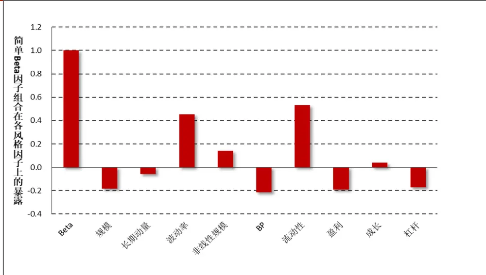
数据来源：财通证券研究所，Wind

## 1.2 闪耀的 Beta

在前一部分讨论中，我们都是从回归的角度探讨单个 Beta 因子和剥离了其他风格因子影响之后的纯 Beta 因子净值的表现。本小节我们从实际指数编制出发，观察高低 Beta 策略在指数上的表现情况。

在中证系列指数中，最具代表性的 Beta 指数包括有沪深 300 高低贝塔指数和中证 500 高低 Beta 指数。其中沪深 300 高、低贝塔指数分别选择排名前 100和后 100 的股票作为样本股，中证 500 高、低贝塔指数分别选择排名前 150 和后150 的股票作为样本股。高贝塔指数的样本股权重与其历史贝塔值成正比，低贝塔指数的样本股权重与其历史贝塔值的倒数成正比，Beta 值的计算采用过去 1 年的数据计算得到，其公式如下：

$$
Beta_{i}=\frac{cov(r_{i},r_{m})}{\sigma_{m}^{2}}
$$

其中r表示股票 i 的日收益率， $r_{m}$ 表示基准指数的日收益率。

表 1：高低贝塔指数编制方法

| 指数名称 | 指数代码 | 样本挑选 | 权重 |
| --- | --- | --- | --- |
| 沪深 300 高贝塔 | 000828.SH | 沪深 300 中 Beta 前 100 名 | 样本股权重与其历史 Beta成正比 |
| 沪深300低贝塔 | 000829.CSI | 沪深 300 中 Beta 后 100 名 | 样本股权重与其历史Beta倒数成正比 |
| 中证500高贝塔 | 000830.CSI | 中证 500 中 Beta 前 150 名 | 样本股权重与其历史Beta成正比 |
| 中证500低贝塔 | 000831.CSI | 中证 500 中 Beta 后 150 名 | 样本股权重与其历史Beta倒数成正比 |

数据来源：财通证券研究所，中证指数公司

图 7 展示了 2010.1.12-2019.4.12 期间，沪深 300 和中证 500 低贝塔指数相对其高贝塔指数的相对净值走势。可以看到整体而言相对净值呈现向上攀升的状态，这表明低 Beta 指数表现要优于高 Beta 指数，通过做多低 Beta 指数、做空高 Beta指数，将会获得不错的收益。然后在进入到 2019 年以后，该相对净值出现了非常明显的回撤，这一现象与我们前述观察到的今年 Beta 因子的正向表现息息相关。

图 7：沪深 300 和中证 500 低-高贝塔指数净值（2010.1.29-2019.4.12）
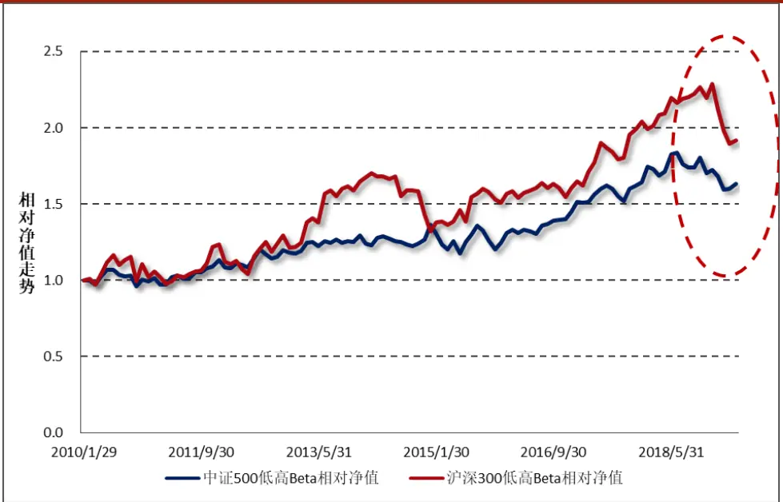
数据来源：财通证券研究所，Wind

在较长样本期内，低 Beta指数优于高 Beta指数，这一现象与投资者们经常提及的低 Beta 异象相契合。（因为低 Beta 通常表示低风险，而低风险获得的收益应该要更低。而通过前述观察我们发现实际情况与此相悖，因此我们将其称为异象）。然而进入到 2019年，这一现象出现了反转。图8 展示了沪深 300 和中证500 高贝塔指数相对于低贝塔指数在 2019 年的表现情况，可以看到与历史表现刚好相反 ，2019 年高贝 塔指数 的表现 要明显 优于 低贝塔 指数。在2018.12.28-2019.4.12 期间，沪深 300 高低贝塔相对净值已经获得 19%的收益，而中证 500 高低贝塔相对净值也获得了 6%的收益。

图 8：沪深 300 和中证 500 高-低贝塔指数净值（2018.12.28-2019.4.12）
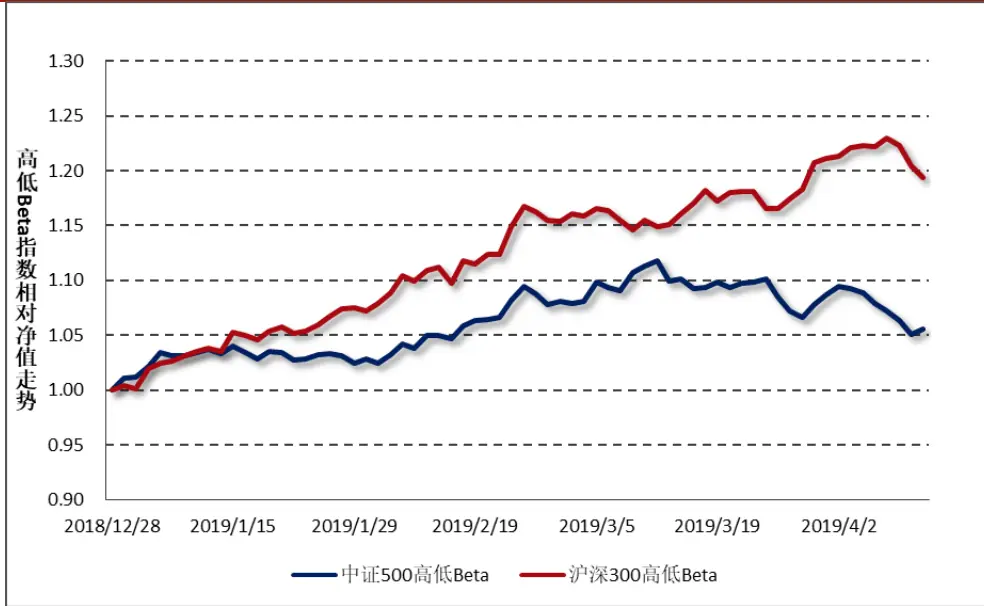
数据来源：财通证券研究所，Wind

那么为何沪深 300 高低 Beta 相对指数的表现要明显优于中证 500 高低 Beta的相对表现呢？图9和图10 展示了在2018.12.28的横截面上对冲指数在风格因子和行业因子上的暴露程度，以及2018.12.28-2019.4.12期间各因子的收益情况。

图 9：沪深300 和中证 500高低 Beta 对冲指数的风格暴露及因子收益
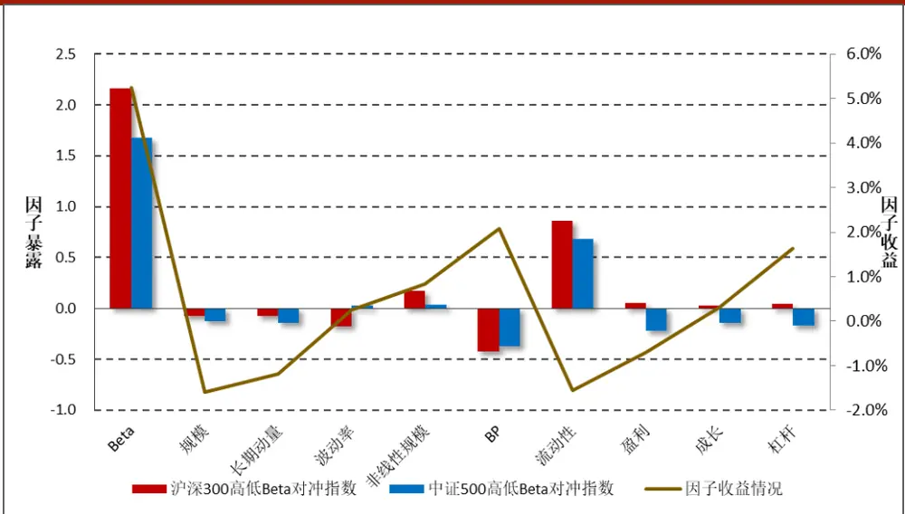
数据来源：财通证券研究所，Wind

图 10：沪深300 和中证 500高低 Beta 对冲指数的行业暴露及行业因子收益
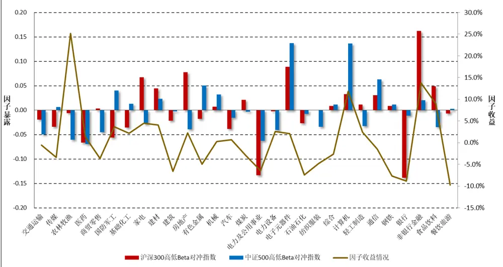
数据来源：财通证券研究所，Wind

结合图 11 可以看到，沪深 300 高低 Beta 对冲指数在 Beta 因子上的的暴露度要更高（2.16 VS 1.68），这让其在该因子的配置上获得了更高的收益（11.33%VS8.78%）。可以看到，两个对冲指数的收益来源大多源于 Beta因子的贡献。此外，沪深 300 高低对冲指数由于在非银金融行业因子上的正向暴露和在银行业因子上的负向暴露，帮助其在样本区间段内获取了更高的超额收益。由于篇幅限制，此处不再对具体的因子数据进行介绍，如需更多数据可与财通金工直接联系。

图 11：沪深300 和中证 500高低 Beta 对冲指数在各类因子上的收益情况
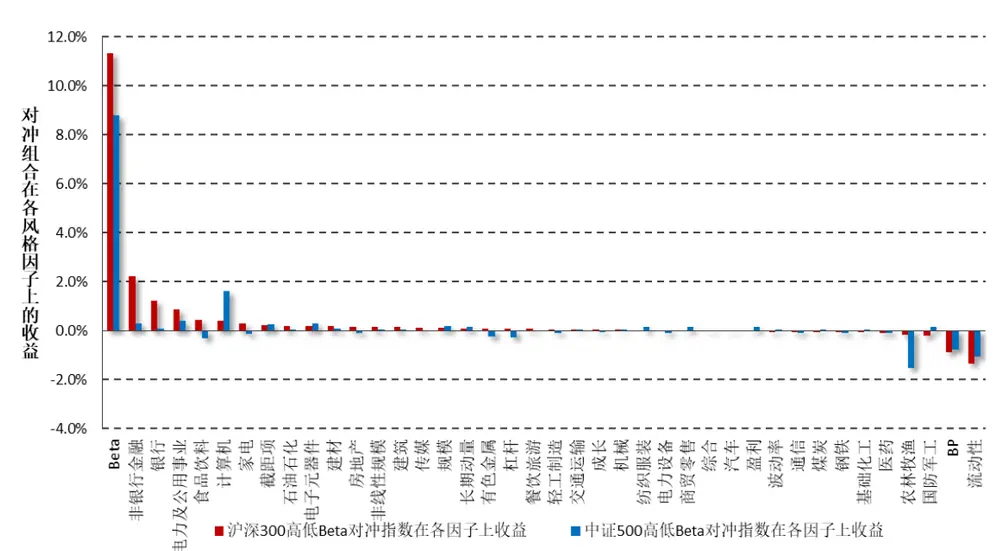
数据来源：财通证券研究所，Wind

## 1.3 行业的 Beta 特征

行业配置是很多投资者关心的话题，对行业风格的暴露进行了解就十分重要。在下一期“拾穗”系列讨论中，我们将就纯行业因子组合背后的一些性质展开探讨。在本期中，我们先以 Beta 因子为例，观察各行业在 Beta 因子上的暴露情况。

图 12 展示了 29 个中信一级行业在 2019 年以来的收益情况。在 2019 年的单边上涨行情中，上证综指整体上涨了 27.9%，然而银行业板块却仅有 19.6%的收益，仅跟随了指数的 70%涨幅，那么这一现象是否与行业的 Beta 有关呢？在进行探究之前我们先来介绍一下行业 Beta 的计算方法。

图 12：中信一级行业 2019 年涨跌幅（2018.12.28-2019.4.12）
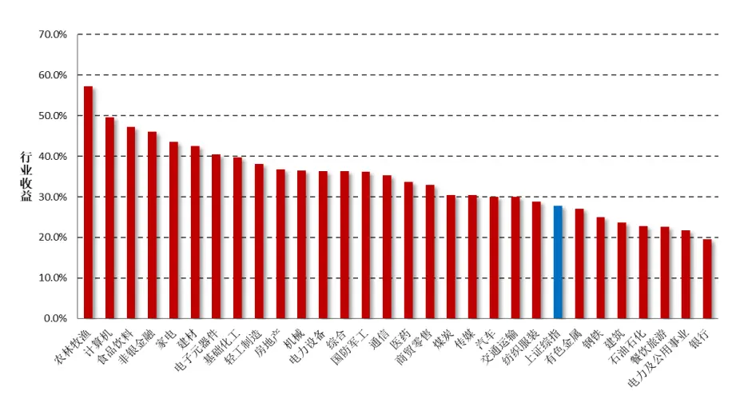
数据来源：财通证券研究所，Wind

行业是由个股组成，因此行业的 Beta 也有两种对应的计算方法。其一是将行业指数相对于市场综合指数的 Beta 因子值；其二是根据行业内个股的 Beta 因子进行加权计算，其中加权方法可以是市值加权法、Beta 加权法、等权法等等。由于行业指数可以被近似地认为是个股的市值加权，因此本文采用个股的市值加权Beta作为行业的Beta因子值，我们采用过去252天的日度交易数据进行计算。事实上财通金工检验发现，无论是个股加权的 Beta 还是根据行业指数计算得到的 Beta，二者都是十分近似的。

图 13：行业Beta因子均值分布
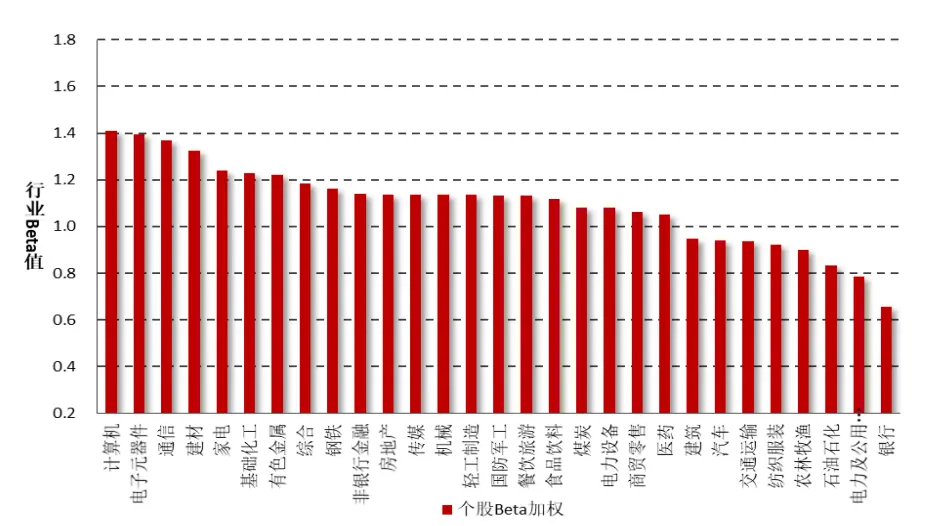
数据来源：财通证券研究所，Wind

随着市场的不断变化，各个板块和行业的 Beta 因子也处于不断变化中，如果直接用整个样本回测区间的 Beta 均值对行业的 Beta 因子值进行代替是不合理的。由于我们采用是过去一年的数据计算得到的 Beta，因此在短期来看 Beta 因子还是相对稳定的，特别是对于行业板块而非个股来讲。图 9 展示了 2018 年 1月至 2019 年4 月，每个行业的 Beta 因子均值分布图。可以看到，银行业的 Beta均值为 0.67，这与之前我们观察到了银行业涨幅是市场涨幅是 70%基本对应。此外，我们还可以看到计算机、电子元器件和通信等 TMT 概念行业的 Beta 因子普遍较高。

## 1.4 该何时配置 Beta？

本文的最后一部分我们探讨该在何时配置 策略，同样我们先从分组法的角度对 Beta 单因子进行测试，回测区间选定为 2006.1.25-2019.4.4，样本股选定为 Wind 全 A成分股，在每个自然月的最后一个交易日根据股票因子值进行排序并分为 10 组（等权重构建组合），以因子值最大的组别（D0）为空头组合，因子值最小的组别（D9）为多头组合，构建对冲组合，观察对冲组合的月度收益和净值走势。在进行股票筛选时，我们剔除了上市时间小于 100 天的股票、剔除了调仓日涨停、跌停或停牌对股票，同时剔除了 ST 和*ST 股票。

图 14：分组法测试下每组月均超额收益
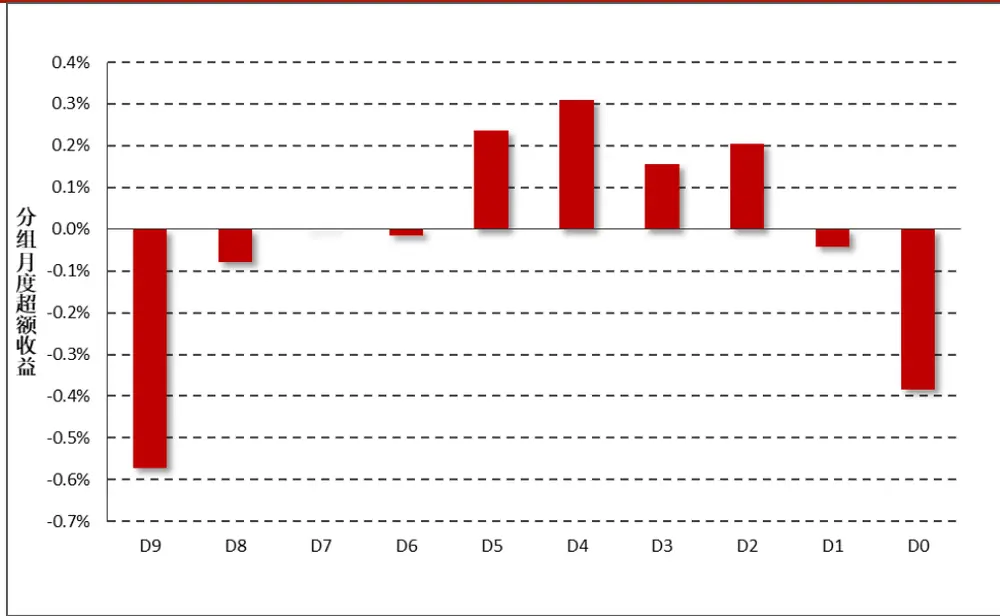
数据来源：财通证券研究所，Wind

图 14 展示了 10 组的月均超额收益，如果随着因子值的增加，每组的收益分化越明显，即说明该因子对于股票收益的解释能力较强，且具有较好的线性特征。可以看到，整体来讲 Beta 因子的分组情况并没有呈现显著的单调性，其多头和空头组合相对于基准来讲均呈现出较为明显的负收益。表 2 对因子绩效进行了统计，在回测区间因子的 rankIC 为-1.03%，月胜率为 45%，t 值并不显著（-0.77）。

表 2：分组法下因子绩效统计（2006.1.25-2019.4.4）

|  | IC | rankIC | 多头月均超额 | 空头月均超额 | 多空收益差 |
| --- | --- | --- | --- | --- | --- |
| 均值 | 0.21% | -1.03% | -0.57% | -0.38% | -0.01% |
| 月胜率 | 50% | 45% | 0.47 | 0.44 | 0.50 |
| t 值 | 0.17 | -0.77 | -1.86 | -1.34 | 0.36 |

数据来源：财通证券研究所，Wind

下面我们从分组法的角度观察 Beta 因子与其他已知因子的相关关系，在每个调仓期我们计算每组股票在其他因子上的因子暴露均值，并对每组进行打分（得分为 10 表示因子最大，得分为1 表示因子最小），最终计算回测期间每个月每组在其他因子上的得分均值，其结果如图 14 所示。其中，Turnover21 表示最近一个月换手率，Ret21 是最近一个月收益率（反转因子），Vol21 表示最近 21天波动率。可以看到，Beta 因子与换手率因子和波动率因子呈现出非常强的正相关关系，高 Beta 的股票通常具有很高的换手率和波动率，其市值特征则相对较小，这一点与前面图 6 展示的结果相一致。

图 15：分组法下每组对其他因子的得分均值
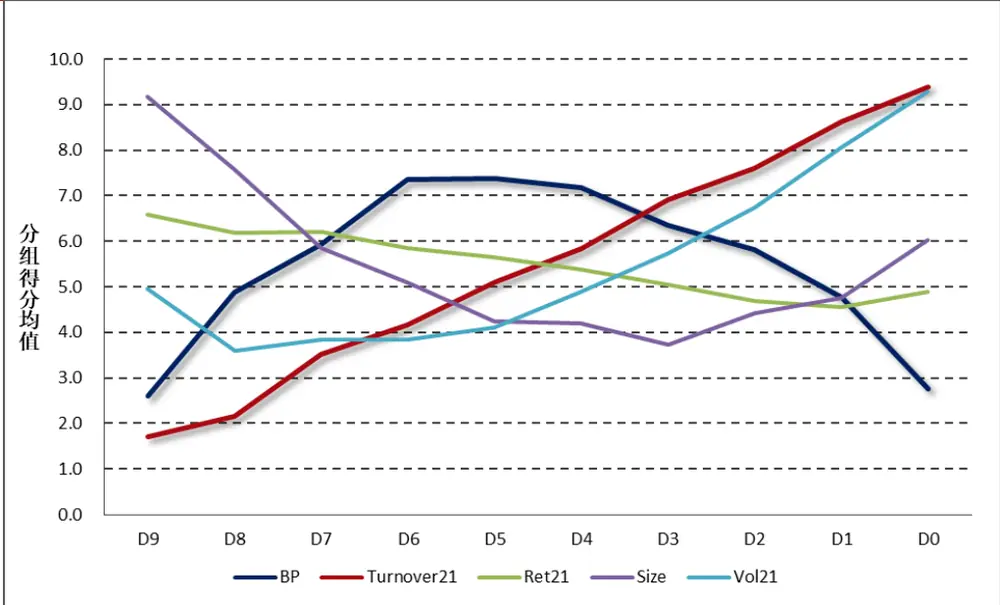
数据来源：财通证券研究所，Wind

既然 Beta 因子在整个样本期间内的有效性并不强，那么在不同的市场状态下是否会发生不一样的变化呢？表 3 通过情景分析法，将市场划分为不同的状态，观察在不同市场风格下 因子的有效性。我们以当前时刻往前推一年的全 A指数的涨跌幅作为市场涨跌的标志，若涨幅大于 0 我们认为市场处于 Up 状态，若涨幅小于 0 则认为市场处于 Down 状态。同样的，我们以 Wind 全 A指数本月的收益方向与前 12 个月的收益方向作为市场动量还是反转的标志，若二者维持一致则认为处于 Momentum 状态，否则认为处于 Reverse 状态。因此，市场可以划分为如下几个不同的不同的状态：

1）Up：前期市场处于上涨状态；

2）Down：前期市场处于下跌状态；

3）UpMomentum：前期市场上涨，且本月继续上涨

4）UpReverse：前期市场上涨，本月反转下跌

5）DownMomentum：前期市场下跌，本月市场继续下跌

6）DownReverse：前期市场下跌，本月反转上涨

表 3：不同市场状态下 Beta因子有效性

|  |  | 多空对冲组合 |  |  |  | IC |  |  |  |
| --- | --- | --- | --- | --- | --- | --- | --- | --- | --- |
| 市场状态 | 样本数 | 均值 | 胜率 | t 值 | IR | 均值 | 胜率 | t 值 | IR |
| Up | 94 | -0.29% | 46.81% | -0.47 | -0.26 | -2.41% | 42.55% | -1.58 | -0.16 |
| Down | 66 | 0.83% | 53.03% | 1.08 | 0.37 | 0.97% | 46.97% | 0.41 | 0.05 |
| upMomentum | 59 | 1.15% | 59.32% | 1.61 | 0.68 | 2.16% | 52.54% | 1.23 | 0.16 |
| upReverse | 35 | -2.70% | 25.71% | -2.67 | -1.45 | -10.10% | 25.71% | -4.36 | -0.74 |
| downMomentum | 30 | -2.42% | 33.33% | -3.18 | -1.85 | -10.24% | 23.33% | -4.35 | -0.79 |
| downReverse | 36 | 3.55% | 69.44% | 3.29 | 2.19 | 10.58% | 66.67% | 3.32 | 0.55 |

数据来源：财通证券研究所，Wind

表3展示了不同市场状态下，Beta因子多空对冲组合（分10组，做多高 Beta、做空低 Beta）和 Beta 因子的 rankIC 统计量，我们以 rankIC 值作为说明。可以看到，单纯的市场前期上涨或下跌的情况，Beta 因子的 rankIC 都并不显著，但是在前期市场上涨本月市场反转时，Beta 因子的 IC 显著为负，说明在市场由牛转熊的切换中（upReverse），高 Beta 股票的跌幅将会显著大于低 Beta 股票，这一点与 Beta 因子本身所代表的市场弹性含义相契合。同样的，当市场处于由熊转牛的切换中时（downResverse），高Beta的股票的涨幅将会显著大于低Beta股票。目前来看，A 股市场正处于 2018 年大跌、 2019 年单边上涨的行情下，因此在这种熊转牛的市场下，高 Beta 指数能够获取超高收益也就不足为奇了。此外，我们还观察到当市场处于持续下跌的行情时（downMomentum），Beta 因子的rankIC 值同样显著为负，这也能够解释在 2018 年的市场单边下跌行情中，低 Beta指数为何能够比高 Beta 指数表现更好。

事实上，今年沪深 300 高贝塔指数和跟踪该指数的招商沪深 300 高贝塔基金（161718.OF）的表现均优于沪深 300 指数。如果投资者判断市场处于牛市状态，又担心自己所选择的组合跑不赢指数，财通金工建议投资者可以适当考虑在当前时点配置一定量的高 Beta 策略。当然市场状态的切换也需要时刻关注，投资者必须做好风控准备。

图16：指数和基金收益对比
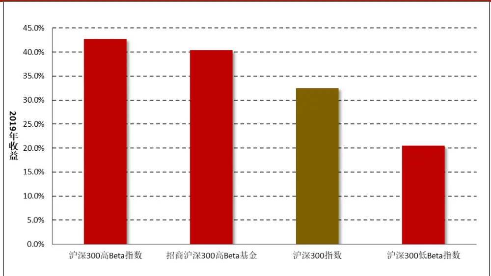
数据来源：财通证券研究所，Wind

## 1.5 小结

作为2019年迄今为止表现最为闪耀的风格因子，本期财通金工对Beta因子展开讨论，探究Beta因子的有效性及其风格来源，分析在怎样的市场状态下配置Beta策略，主要结论如下：

（1） 2019年迄今为止，在所有风格因子中Beta因子的表现最为抢眼，在样本区间内已经获得了5.36%的高收益，Beta纯因子的表现甚至优于纯规模因子；

（2） 简单Beta因子的走势持续向下，而剔除了其他风格暴露的纯Beta因子却能获取较为稳定的正收益，这是因为高Beta股票同时会暴露于高换手率和高波动率导致的；

（3） 行业Beta的计算可以根据行业指数计算，也可以根据行业成分股Beta值的市值加权计算得到，二者并无差异。银行业的Beta均值仅为0.67，这也是其今年落后指数的原因之一；

（4） 在全样本期间，Beta并不是一个十分有效的单因子。但在市场由牛转熊的切换中，低Beta策略能够为组合提供一定的保护性。在市场由熊转牛的切换中，高Beta策略能够为组合带来较高的正收益。在市场持续熊市状态下，财通金工也更建议配置低Beta策略。

## 2、 一周行情回顾

上周市场普跌，中小盘指数跌幅要大于大盘指数跌幅。上周沪深 300 成长指数和 180 成长指数分别收于-0.60%和-0.55%，在所有样本指数中排名前二，而创业板指和深证成长指数分别录得-4.59%和-4.11%的收益，在所有指数中跌幅最大。

图17：上周主要指数收益（2019.4.4-2019.4.12）
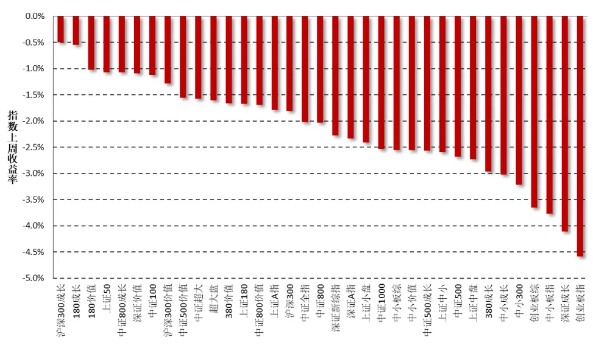
数据来源：财通证券研究所，Wind

行业方面，在所有 29 个中信一级行业中，家电和食品饮料行业分别小涨 1.21%和 0.94%，而计算机和电子元器件行业分别下跌 5.15%和 4.83%，排名靠后。

图18：上周中信一级行业指数收益（2019.4.4-2019.4.12）
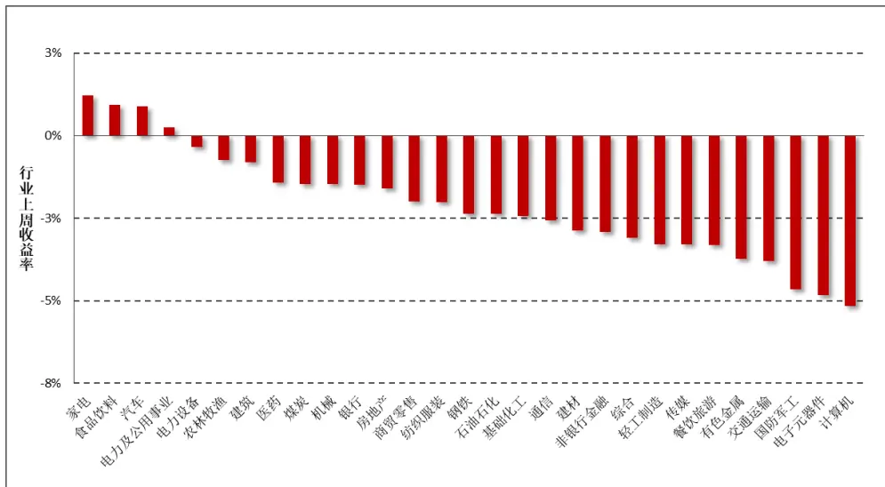
数据来源：财通证券研究所，Wind

## 3、 市场风格解析及指数风险预测

财通金工借鉴 Barra 模型，选取 Beta、规模、动量、波动率、非线性规模、BP、流动性、盈利、成长和杠杆率因子构建收益-风险归因模型，因子定义及计算细节参见附录二。本部分通过对近期风格因子的收益表现进行分析以期捕捉 A股市场的风格变化，同时对财通金工样本指数的未来一月风险进行预测来分析当前 A 股市场所处的风险水平。风格因子的收益拆解可参见财通金工专题报告《Barra 模型初探：A股市场风格解析》，资产组合的风险预测可参见财通金工专题报告《Barra 模型进阶：多因子模型风险预测》。

## 3.1 市场风格解析

各类风格因子在上周的累计收益可分为日度累计收益和周度收益两种，日度累计收益是根据风格因子的日度收益计算得到，周度收益是将股票在本周的收益率对股票在上周最后一个交易日的因子暴露度进行回归得到的因子纯净收益，二者之间的区别在于换仓频率的不同，前者为每日换仓，而后者在每周最后一个交易日换仓。

表4和图19展示了上周各类风格因子的累计收益和周度收益大小，可以看到，二者十分近似。本周规模因子、非线性规模和流动性因子都收于较大的负收益，中小盘股票的下跌势头十分迅猛。而 Beta 因子经历了前期较高的涨幅后，本周也出现了一定程度的回撤。当前时点处于在年报和季报相继公开的时间，企业盈利的增加一定程度上带动了股票涨幅，盈利因子本周表现较好。

表4：上周纯风格因子收益（2019.4.8-2019.4.12）

| 日期 | Beta | 规模 | 长期动量 | 波动率 | 非线性规模 | BP | 流动性 | 盈利 | 成长 | 杠杆 |
| --- | --- | --- | --- | --- | --- | --- | --- | --- | --- | --- |
| 2019/4/8 | -0.11% | -0.14% | 0.01% | -0.02% | 0.00% | 0.00% | 0.07% | 0.52% | 0.07% | -0.02% |
| 2019/4/9 | 0.08% | -0.19% | -0.11% | 0.13% | -0.24% | 0.05% | 0.00% | -0.11% | -0.02% | 0.02% |
| 2019/4/10 | -0.18% | -0.02% | -0.06% | -0.06% | -0.07% | -0.01% | -0.20% | 0.16% | -0.06% | -0.01% |
| 2019/4/11 | -0.07% | -0.26% | 0.03% | 0.12% | -0.06% | 0.18% | -0.34% | -0.21% | -0.11% | 0.11% |
| 上周累计收益 | 0.13% | -0.18% | 0.30% | -0.08% | -0.06% | 0.05% | -0.12% | 0.08% | 0.08% | -0.03% |
| 周度收益 | -0.16% | -0.79% | 0.17% | 0.09% | -0.43% | 0.26% | -0.59% | 0.44% | -0.05% | 0.08% |
| 前一周度收益 | -0.25% | -0.76% | 0.14% | 0.12% | -0.39% | 0.24% | -0.49% | 0.39% | -0.08% | 0.08% |

数据来源：财通证券研究所，Wind

图 19：近两周纯风格因子收益比较（2019.3.29-2019.4.12）
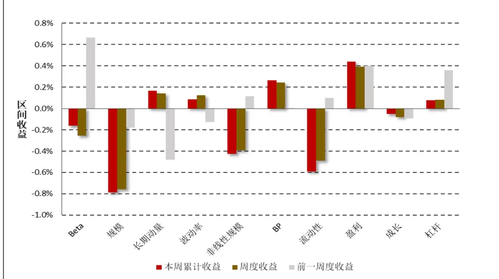
数据来源：财通证券研究所,Wind

图20：最近一个月风格因子净值走势（2019.3.15-2019.4.12）
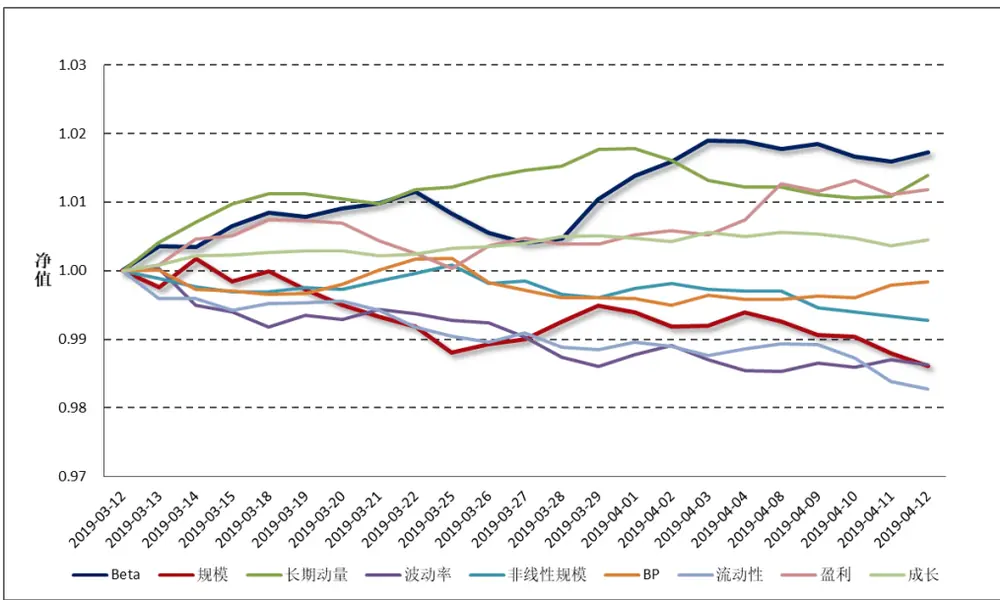
数据来源：财通证券研究所，Wind

图 20 和图 21 分别展示了最近一个月各类风格因子的净值走势及累计收益，以观察各类风格因子在过去一段时间的持续盈利能力。整体来讲，在过去的一个月中，高 Beta、前期涨幅较高的股票能够获得相对较高的收益，而大规模、高换手、高波动的股票后市将会出现较为明显的回撤。

图21：最近一个月风格因子累计收益（2019.3.15-2019.4.12）
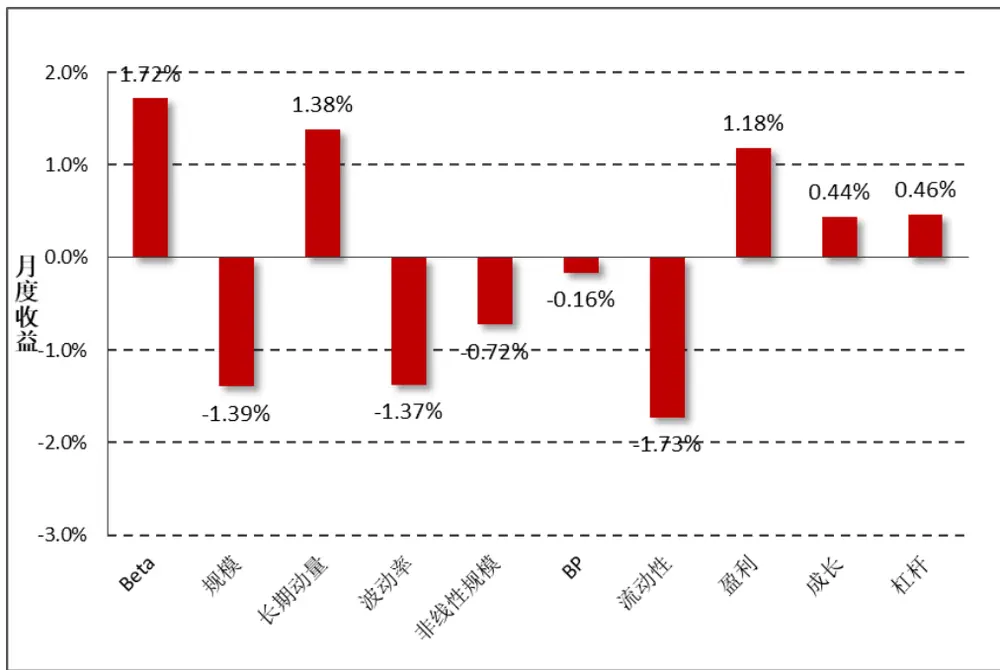
数据来源：财通证券研究所，Wind

## 3.2 指数风险预测

对收益的分解仅代表过去，对风险的预测才代表未来。多因子模型风险预测将股票风险拆解为共同风险和特质风险两部分，在通过稳健调整对共同风险矩阵和特质风险矩阵进行估计后，即可根据指数的成分股权重来估计指数在未来一段时间的波动情况。为了保证结果的严谨性，此处我们直接采用 Wind 提供的成分股权重数据，而非根据自由流通市值计算得到，尽管二者的结果十分类似。

$$
Risk(P)=W^{\prime}VW=W^{\prime}(X^{\prime}FX+\Delta)W
$$

图 22 展示了财通金工样本指数在未来一个月的预测波动率，为了方便展示我们将估计的月度波动率进行年化，波动的预测时间为上周最后一个交易日（ ）。可以看到，所有样本指数未来一月的年化波动区间在 之间，预测波动与上周水平相比出现明显攀升，财通金工特别提醒投资者注意当前市场波动情况，对后市维持谨慎乐观态度。中小板股票、成长类指数的风险较大，而偏大盘股票、价值类股票的风险普遍较小。

图22：财通金工样本指数未来一月波动预测（年化）（2019.4.12-2019.5.13）
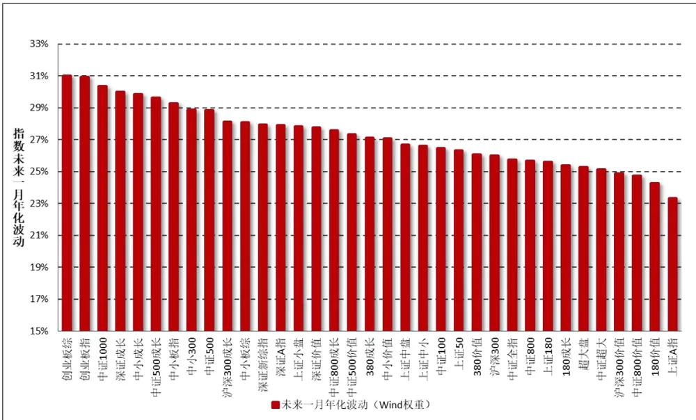
数据来源：财通证券研究所，Wind

由于在计算股票的风格因子时，我们会对暂停上市的股票、大类因子值存在缺失的股票进行剔除，因此在进行收益归因和风险预测时，并非所有指数成分股都纳入到了模型中，如果缺失股票个数过多或者缺失股票的权重占比过大，将会对模型结果造成较大影响。图 23 展示了各大指数在模型拟合过程中，纳入考虑的股票个数（权重）占指数成分股个数（权重）的比例，可以看到所有指数的比例均在 93%以上，数据质量的拟合较为合意。

图23：收益回归/风险预测样本股票占指数成分股比率
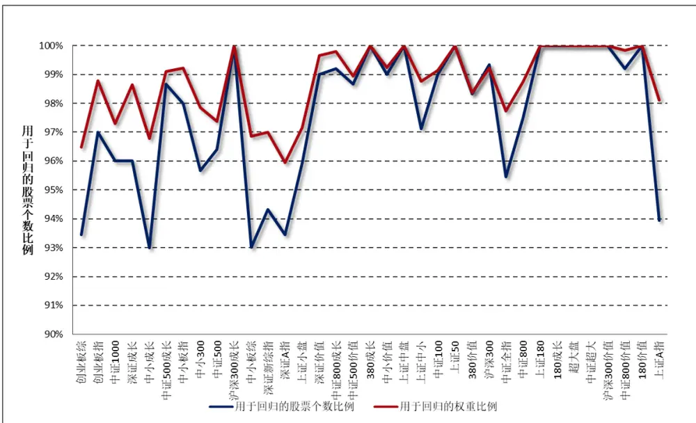
数据来源：财通证券研究所，Wind

## 4、 指数成分收益归因：

本部分财通金工对上周表现最好的三只指数和表现最差的三只指数进行归因分析，以观察涨幅较高（或较低）的指数风险暴露是否展现出较高的趋同性以及两类指数的持股风格是否会表现出明显的差别，其结果如图 24 和图 25 所示。

图24：上周表现最好三指数因子暴露度
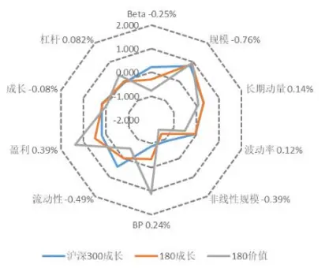
数据来源：财通证券研究所，Wind

图25：上周表现最差三指数因子暴露度
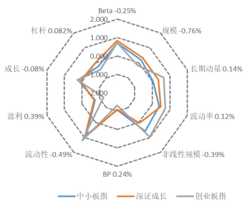
数据来源：财通证券研究所，Wind

表 5 展示了各大指数上周在各类因子上的暴露程度，可以看到，上周市场中小盘股跌幅明显，表现最好的三只指数是偏大盘指数，其在规模因子的正暴露和在非线性规模因子上的负暴露基本抵消了收益，而表现较差的三只指数均为中小盘指数，其在 Beta、非线性规模和流动性上的较高暴露拖累指数走势。

表5：指数在风格因子上的暴露程度（2019.4.4）

| 代码 指数名称 |  | Beta -0.25% | 规模 -0.76% 长 | 期动量 0.1 波 | 动率 0.129 | 非线性规模- BP 0.24% |  | 流动性-0.49 | 盈利 0.39% | 成长 -0.08% 杠 | 杆 0.082% 实 | 际收益 |
| --- | --- | --- | --- | --- | --- | --- | --- | --- | --- | --- | --- | --- |
| 000918.SH 沪深300成长 |  | 0.214 | 0.803 | 0.329 | -0.046 | -0.888 | -0.879 | 0.431 | 0.193 | 0.194 | -0.069 | -0.50% |
| 000028.SH 180成长 |  | -0.309 | 0.911 | 0.309 | -0.056 | -1.265 | -0.345 | -0.006 | 0.503 | 0.167 | -0.019 | -0.55% |
| 000029.SH 180价值 |  | -0.780 | 0.967 | 0.089 | -0.498 | -1.485 | 1.117 | -0.497 | 1.380 | -0.032 | 0.316 | -1.02% |
| 000016.SH 上证50 |  | -0.366 | 1.077 | 0.339 | -0.361 | -1.852 | 0.328 | -0.194 | 0.789 | -0.019 | -0.054 | -1.07% |
| H30355.CSI 中证800成长 |  | 0.356 | 0.490 | 0.239 | -0.001 | -0.306 | -0.797 | 0.565 | 0.101 | 0.162 | -0.004 | -1.07% |
| 399348.SZ | 深证价值 | 0.436 | 0.531 | 0.371 | -0.002 | -0.386 | -0.330 | 0.557 | 0.298 | 0.042 | 0.230 | -1.09% |
| 000903.SH | 中证100 | -0.102 | 1.057 | 0.320 | -0.282 | -1.713 | 0.068 | -0.043 | 0.575 | -0.022 | -0.008 | -1.12% |
| 000919.CSI | 沪深300价值 | -0.567 | 0.927 | 0.155 | -0.452 | -1.315 | 0.829 | -0.309 | 1.283 | -0.030 | 0.430 | -1.29% |
| H30352.CSI | 中证500价值 | 0.271 | -0.724 | -0.209 | -0.402 | 1.983 | 0.558 | 0.336 | 0.489 | -0.071 | 0.409 | -1.56% |
| 000980.CSI | 中证超大 | -0.218 | 1.087 | 0.144 | -0.290 | -1.898 | 0.294 | -0.256 | 0.552 | -0.060 | 0.035 | -1.58% |
| 000043.SH | 超大盘 | -0.243 | 1.088 | 0.135 | -0.301 | -1.939 | 0.292 | -0.065 | 0.543 | -0.078 | -0.134 | -1.60% |
| 000118.SH | 380价值 | 0.012 | -0.847 | -0.241 | -0.339 | 1.928 | 0.604 | 0.105 | 0.736 | -0.051 | 0.476 | -1.66% |
| 000010.SH | 上证180 | -0.133 | 0.859 | 0.286 | -0.229 | -1.110 | 0.154 | 0.030 | 0.476 | -0.041 | 0.028 | -1.68% |
| H30356.CSI | 中证800价值 | -0.261 | 0.689 | 0.138 | -0.415 | -0.812 | 0.653 | -0.111 | 1.028 | -0.072 | 0.439 | -1.69% |
| 000002.SH | 上证A指 | -0.202 | 0.293 | 0.046 | -0.086 | -0.405 | 0.247 | -0.122 | 0.234 | -0.049 | 0.057 | -1.79% |
| 000300.SH | 沪深300 | 0.096 | 0.790 | 0.262 | -0.121 | -0.870 | -0.110 | 0.217 | 0.254 | 0.016 | 0.021 | -1.81% |
| 000985.CSI | 中证全指 | 0.240 | -0.226 | 0.046 | 0.093 | 0.300 | -0.274 | 0.428 | -0.198 | 0.030 | -0.077 | -2.02% |
| 000906.SH | 中证800 | 0.181 | 0.416 | 0.161 | -0.060 | -0.181 | -0.144 | 0.315 | 0.091 | 0.014 | 0.031 | -2.03% |
| 399100.SZ | 深证新综指 | 0.516 | -0.581 | -0.021 | 0.284 | 0.803 | -0.633 | 0.618 | -0.596 | 0.106 | -0.193 | -2.27% |
| 399107.SZ | 深证A指 | 0.476 | -0.595 | 0.024 | 0.367 | 0.799 | -0.684 | 0.764 | -0.667 | 0.148 | -0.234 | -2.33% |
| 000045.SH | 上证小盘 | 0.317 | -0.724 | -0.193 | 0.094 | 1.867 | -0.079 | 0.537 | -0.261 | -0.046 | 0.163 | -2.41% |
| 000852.SH | 中证1000 | 0.487 | -1.464 | -0.230 | 0.372 | 1.809 | -0.524 | 0.758 | -0.791 | 0.122 | -0.245 | -2.54% |
| 399101.SZ | 中小板综 | 0.404 | -0.703 | -0.182 | 0.445 | 1.008 | -0.799 | 0.589 | -0.821 | 0.125 | -0.346 | -2.55% |
| 399604.SZ | 中小价值 | 0.380 | -0.294 | -0.035 | 0.296 | 1.016 | -0.477 | 0.532 | -0.129 | 0.119 | -0.145 | -2.55% |
| H30351.CSI | 中证500成长 | 0.684 | -0.664 | -0.187 | 0.136 | 1.956 | -0.433 | 0.870 | -0.131 | 0.089 | 0.078 | -2.56% |
| 000046.SH | 上证中小 | 0.295 | -0.041 | 0.026 | 0.043 | 0.917 | -0.122 | 0.474 | -0.157 | -0.065 | 0.169 | -2.59% |
| 000905.SH | 中证500 | 0.469 | -0.742 | -0.150 | 0.137 | 1.960 | -0.259 | 0.639 | -0.422 | 0.008 | 0.077 | -2.68% |
| 000044.SH | 上证中盘 | 0.279 | 0.471 | 0.191 | 0.004 | 0.203 | -0.155 | 0.426 | -0.079 | -0.079 | 0.174 | -2.73% |
| 000117.SH | 380成长 | 0.228 | -0.730 | -0.274 | 0.049 | 1.819 | -0.585 | 0.654 | 0.021 | 0.056 | -0.022 | -2.97% |
| 399602.SZ | 中小成长 | 0.723 | 0.000 | -0.144 | 0.527 | 0.662 | -1.068 | 0.873 | -0.692 | 0.207 | -0.153 | -3.02% |
| 399008.SZ | 中小300 | 0.565 | -0.292 | -0.078 | 0.434 | 1.087 | -0.927 | 0.822 | -0.775 | 0.177 | -0.266 | -3.21% |
| 399102.SZ | 创业板综 | 0.730 | -1.156 | 0.138 | 0.565 | 1.140 | -1.093 | 0.968 | -1.229 | 0.210 | -0.548 | -3.65% |
| 399005.SZ | 中小板指 | 0.689 | 0.197 | 0.030 | 0.394 | 0.592 | -1.073 | 0.844 | -0.729 | 0.227 | -0.249 | -3.77% |
| 399346.SZ | 深证成长 | 0.827 | 0.342 | 0.332 | 0.479 | 0.034 | -1.080 | 0.997 | -0.681 | 0.088 | 0.012 | -4.11% |
| 399006.SZ | 创业板指 | 0.724 | -0.161 | 0.634 | 0.728 | 0.977 | -1.319 | 1.209 | -1.235 | 0.263 | -0.448 | -4.59% |

数据来源：财通证券研究所，Wind

## 5、 附录

| 附录一：财通金工指数池选取 |  |  |  |  |  |
| --- | --- | --- | --- | --- | --- |
| 上证规模/风格指数 |  | 深证综合/规模指数 |  | 中证规模/风格指数 |  |
| 000001.SH | 上证综指 | 399101.SZ | 中小板综 | 000300.SH | 沪深 300 |
| 000002.SH | 上证A指 | 399102.SZ | 创业板棕 | 000852.SH | 中证1000 |
| 000010.SH | 上证 180 | 399106.SZ | 深证综指 | 000985.CSI | 中证全指 |
| 000016.SH | 上证50 | 399107.SZ | 深证A指 | 000980.CSI | 中证超大 |
| 000043.SH | 超大盘 | 399005.SZ | 中小板指 | 000903.SH | 中证100 |
| 000044.SH | 上证中盘 | 399006.SZ | 创业板指 | 000905.SH | 中证 500 |
| 000045.SH | 上证小盘 | 399008.SZ | 中小300 | 000906.SH | 中证 800 |
| 000046.SH | 上证中小 | 399346.SZ | 深证成长 | 000918.SH | 沪深 300 成长 |
| 000028.SH | 180成长 | 399348.SZ | 深证价值 | 000919.SH | 沪深 300 价值 |
| 000029.SH | 180 价值 | 399602.SZ | 中小成长 | H30351.CSI | 中证500 成长 |
| 000117.SH | 380 成长 | 399604.SZ | 中小价值 | H30352.CSI | 中证 500 价值 |
| 000118.SH | 380 价值 |  |  | H30355.CSI | 中证 800 成长 |
|  |  |  |  | H30356.CSI | 中证 800 价值 |

数据来源：财通证券研究所

| 附录二：财 | 通金工风格因子定义 |  |  |  |
| --- | --- | --- | --- | --- |
| 大类因子 | 子类因子 | 因子定义及计算 | 权重 | 备注 |
| Beta | BETA | $\mathrm{r_{t}}=\alpha+\beta\mathrm{R_{t}}+\mathrm{e_{t}},$ 将单只股票过去252天的日度收益率对流通市值加权指数日度收益率进行半衰指数加权回归，半衰期为63天 | 1 | 1) 采用流通市值而非总市值加权，因为各大指数编制采用流通市值加权；2) 需要剔除当日停牌或者未上市日期的数据，并将权重进行归一化；3)若满足条件的样本数据少于42天，我们将其 Beta 置为 NaN。 |
| 规模 | SIZE | 股票总市值取对数 | 1 | 由于PB、PE等因子的计算是基于总市值的，因此此处也用总市值 |
| 动量 | RSTR | 过去一段时间个股的累计收益率，不含最近-个月， $\begin{array}{r}{\mathsf{RSTR}=\sum_{\mathrm{t=L}}^{\mathrm{T+L}}\mathsf{w}_{\mathrm{t}}(\ln(1+\mathrm{r}_{\mathrm{t}}),}\end{array}$ $\mathrm{r_{t}}=\mathrm{P_{t}}/\mathrm{P_{t-1}}-1,\ \mathrm{T}{=}504,\ \mathrm{L}{=}21,$ 收益率序列采用半衰指数加权，半衰期为126天 | 1 | 1)对于数据质量较好的个股，计算动量时采用了2年的数据2) 需要剔除未上市日期数据，但无需剔除停牌日期数据，并将权重归一化3) 若满足条件的数据样本小于42天，我们将其动量置为NaN |
| 波动率(对Beta因子和市值因子进行正交化处理） | DASTD | 个股相对市值加权指数的超额收益率序列的半衰指数加权标准差，T=252，半衰期为42天1/2 $\mathrm{{DASTD}=\left(\sum_{t=1}^{T}w_{t}\big(r_{t}-\mu(r)\big)^{2}\right)}$ | 0.7 | 12 采用流通市值加权计算指数收益需要剔除当日停牌或者未上市日期的数据，并将权重进行归一化3) 若满足条件的数据样本小于42天，我们将其因子值置为NaN |
|  | CMRA | $\$123,456,7$ $\begin{array}{r}{\mathbb{C}\mathbb{M}\mathbb{R}\mathbb{A}=\ln(1+\operatorname*{max}\{\mathrm{Z}(\mathrm{T})\})-\ln(1+}\\{\operatorname*{min}\{\mathrm{Z}(\mathrm{T})),}\end{array}$ $\begin{array}{r}{\ddag{\Psi}\Psi\mathrm{Z}\mathrm{(T)}=\exp\bigl(\sum_{\mathrm{t=1}}^{\mathrm{T}}\ln(1+\mathrm{r_{t}})\bigr)-1}\\{\ddag{\mathrm{\Large~\int_{\Sigma}~}}\llangle_{\mathrm{\Large~\hat{\mathrm{T}}~}}\bigwedge_{\mathrm{\Large~\hat{\mathrm{t}}~}}\rlap/{\Psi}\llangle_{\mathrm{\Large~\hat{\mathrm{t}}~}}\ddag{\hat{\ddag}{\mathrm{\Large~\frac{\hat{\mathcal{G}}~}{\cos~\theta}~}}}\llangle_{\mathrm{\Large~\hat{\mathrm{t}}~}}^{\pm}}\end{array}$ 表示过 | 0.15 | 以 21 天为 1 个月 |
|  | HSIGMA | 计算 Beta 时残差的标准差， Hsigma = std(ei) | 0.15 | 同 Beta 因子的计算 |
| 非线性规模 | NonLinerSize | 中市值因子，将股票总市值对数的三次方对总市值对数回归，取残差的相反数 | 1 | 用于衡量市值因子的非线性性，总市值越大和越小的股票的非线性规模越小，中市值股票的非线性规模越大 |
| 估值 | BP | 市净率的倒数，1/PB | 1 | 采用 Wind 中的 pb_lf 因子的倒数 |
| 流动性(对市值因子进行正交化） | STOM | 月度换手率， $\mathsf{STOM}=\ln(\operatorname*{mean}(\sum_{t=1}^{21}(V_{t}/S_{t})))$ 其中V为当日成交量，S为流通股本 | 0.5 | 1)采用流通股本值，而非自由流通股本值2）剔除未上市、停牌日期的数据 |
|  | STOQ | 季度换手率， $\begin{array}{r}{\mathrm{STOQ}=\ln(\operatorname*{mean}(\sum_{t=1}^{63}(V_{t}/S_{t}))),}\end{array}$ | 0.25 | 同 STOQ 因子的计算 |
|  | STOA | 年度换手率，STOA = In(mean(Σ2(Vt/St))， | 0.25 | 同 STOQ 因子的计算 |
| 盈利 | CETOP | 过去滚动12个月的经营现金流除以当前市值实际计算中取市现率 PCF（经营现金流 TTM）的倒数 | 1/2 | 采用 Wind 中的 PCF_OCF_ttm 因子的倒数 |
|  | ETOP | 过去滚动12个月的利润除以当前市值实际计算中取市盈率 PETTM 的倒数 | 1/2 | 采用 Wind 中的 PE_ttm 因子的倒数 |
| 成长 | YOYProfit | 单季度净利润同比增长率 | 1/2 | 为避免使用未来数据，需要根据季报公布时间进行调整 |
|  | YOYSales | 单季度营业收入同比增长率 | 1/2 | 同 YOYProfit 因子的计算 |
| 杠杆 | MLEV | 市场杠杆率，MLEV=（总市值+非流动负债）/总市值 | 1/3 |  |
|  | DTOA | 资产负债率，DTOA=总资产/总负债 | 1/3 |  |
|  | BLEV | 账面杠杆率，BLEV=（账面价值+非流动负债）/账面价值 | 1/3 |  |

数据来源：财通证券研究所
备注：1.波动率因子需对Beta因子和市值因子进行正交化处理；
2.流动性因子需对市值因子进行正交化处理；
若大类因子下所有子类因子值全部缺失，则该股票的因子值记为缺失，否则用有数据的因子值进行替代，注意需对权重进行归一化处理

## 信息披露

## 分析师承诺

作者具有中国证券业协会授予的证券投资咨询执业资格，并注册为证券分析师，具备专业胜任能力，保证报告所采用的数据均来自合规渠道，分析逻辑基于作者的职业理解。本报告清晰地反映了作者的研究观点，力求独立、客观和公正，结论不受任何第三方的授意或影响，作者也不会因本报告中的具体推荐意见或观点而直接或间接收到任何形式的补偿。

## 资质声明

财通证券股份有限公司具备中国证券监督管理委员会许可的证券投资咨询业务资格。

## 公司评级

买入：我们预计未来 6个月内，个股相对大盘涨幅在 15%以上；

增持：我们预计未来 6个月内，个股相对大盘涨幅介于 5%与 15%之间；

中性：我们预计未来 6个月内，个股相对大盘涨幅介于-5%与 5%之间；

减持：我们预计未来 6个月内，个股相对大盘涨幅介于-5%与-15%之间；

卖出：我们预计未来 6个月内，个股相对大盘涨幅低于-15%。

## 行业评级

增持：我们预计未来 6个月内，行业整体回报高于市场整体水平 5%以上；

中性：我们预计未来 6个月内，行业整体回报介于市场整体水平-5%与 5%之间；

减持：我们预计未来 6个月内，行业整体回报低于市场整体水平-5%以下。

## 免责声明

本报告仅供财通证券股份有限公司的客户使用。本公司不会因接收人收到本报告而视其为本公司的当然客户。

本报告的信息来源于已公开的资料，本公司不保证该等信息的准确性、完整性。本报告所载的资料、工具、意见及推测只提供给客户作参考之用，并非作为或被视为出售或购买证券或其他投资标的邀请或向他人作出邀请。

本报告所载的资料、意见及推测仅反映本公司于发布本报告当日的判断，本报告所指的证券或投资标的价格、价值及投资收入可能会波动。在不同时期，本公司可发出与本报告所载资料、意见及推测不一致的报告。

本公司通过信息隔离墙对可能存在利益冲突的业务部门或关联机构之间的信息流动进行控制。因此，客户应注意，在法律许可的情况下，本公司及其所属关联机构可能会持有报告中提到的公司所发行的证券或期权并进行证券或期权交易，也可能为这些公司提供或者争取提供投资银行、财务顾问或者金融产品等相关服务。在法律许可的情况下，本公司的员工可能担任本报告所提到的公司的董事。

本报告中所指的投资及服务可能不适合个别客户，不构成客户私人咨询建议。在任何情况下，本报告中的信息或所表述的意见均不构成对任何人的投资建议。在任何情况下，本公司不对任何人使用本报告中的任何内容所引致的任何损失负任何责任。

本报告仅作为客户作出投资决策和公司投资顾问为客户提供投资建议的参考。客户应当独立作出投资决策，而基于本报告作出任何投资决定或就本报告要求任何解释前应咨询所在证券机构投资顾问和服务人员的意见；

本报告的版权归本公司所有，未经书面许可，任何机构和个人不得以任何形式翻版、复制、发表或引用，或再次分发给任何其他人，或以任何侵犯本公司版权的其他方式使用。