2019 年 04 月 23 日

# 行业的风格偏好：解析纯行业因子组合

## “拾穗”多因子系列报告（第 10 期）

## 联系信息

陶勤英分析师

SAC 证书编号：S0160517100002 021-68592393

taoqy@ctsec.com

张宇研究助理

zhangyu1@ctsec.com 021-68592337

176216888421

## 相关报告

【1】“星火”多因子系列（一）：《Barra模型初探：A 股市场风格解析》

【2】“星火”多因子系列（二）：《Barra模型进阶：多因子模型风险预测》

【3】“星火”多因子系列（三）：《Barra模型深化：纯因子组合构建》

【4】“星火”多因子系列（四）：《基于持仓的基金绩效归因：始于 Brinson，归于 Barra》

【5】“拾穗”多因子系列（一）：《带约束的加权最小二乘：一种解析解法》

【6】“拾穗”多因子系列（二）：《你看到的不一定是你所想的：解密 R 方》

【7】“拾穗”多因子系列（三）：《行业因子选取：中信一级还是申万一级？》

【8】“拾穗”多因子系列（四）：《总市值、流通市值、自由流通市值：谈谈取舍》

【9】“拾穗”多因子系列（五）：《数据异常值处理：比较与实践》

【10】“拾穗”多因子系列（六）：《因子缺失值处理：数以多为贵》

【11】“拾穗”多因子系列（七）：《从纯因子组合的角度看待多重共线性》

【 】“拾穗”多因子系列（八）：《非线性规模因子：A 股市场存在中市值效应吗？》

【13】“拾穗”多因子系列（九）：《牛市抢跑者：低 Beta一定低风险吗？》

## 请阅读最后一页的重要声明

## 投资要点：

## 行业的风格偏好：解析纯行业因子组合

- 银行和农林牧渔行业在 Beta 因子上都存在显著的负暴露，然而今年两个行业的收益却一个排名后二，一个排名前二。

- 行业因子的 t 值显著度要远高于风格因子，然而其夏普比率却远低于风格因子，这在一定程度上反映了构建一个稳定的行业轮动策略之难。

- 带截距项的简单行业因子收益等于行业实际收益减去市场收益，不带截距项的简单行业因子收益等于行业实际收益；加入截距项的纯行业因子组合在风格因子上的暴露为 0，在其他行业上的暴露却并不为 0。不加截距项的纯行业因子收益等于加入截距项的纯行业因子收益与市场收益之和。

银行业和农林牧渔行业在 Beta 上的暴露都非常低，但农林牧渔纯行业因子的收益非常之高，这是两个行业的实际收益相差明显的原因。

- 在对组合的收益进行归因时，行业因子是不容忽视的部分。当前很多投资者在对组合收益进行分析时仅仅观察组合在风格因子上的暴露就得出一些表面结论，这一点是远远不够的。

## 市场风格解析

整体来讲，在过去的一个月中，高 Beta 的股票、前期涨幅较高的股票能够获得相对较高的收益，而大规模、高换手、高波动的股票后市走势将会出现更为明显的回撤。

## 指数风险预测

所有样本指数在未来一个月的年化波动区间在 22%-31%之间，相较上周基本持平，财通金工特别提醒投资者注意当前市场的波动情况。

## 指数成分收益归因

上周市场风格以大盘指数为主，表现最好的三只指数都是大盘指数，其在非线性规模因子上暴露较少，而表现较差的三只指数更多得偏向于中小市值股票，其在非线性规模因子上的较大暴露拖累指数收益。

- 风险提示：本报告统计结果基于历史数据，过去数据不代表未来，市场风格变化可能导致模型失效。

以才聚财，财通天下

在实际投资中，多因子模型被广泛地应用到资产定价、绩效归因、风险控制、组合优化、基金评价及资产配置等各个领域，一套完整、精细的多因子系统成为每位量化研究者必备的工具。“做最实用的研究”，是财通金工给自己的定位。我们将在之后的系列报告中，就投资者们最关心也最容易忽略的很多细节问题进行探讨，介绍我们在实际应用中遇到的问题和思考，以飨读者。

我们为本系列报告取名“拾穗”。一周市场风云变幻，和风细雨也好，狂风骤雨也罢，都留下一地故事等待梳理。作为勤劳的搬运工，财通金工从量化视角出发对市场风格进行捕捉、对风险水平进行预测，既是希望能够如拾穗者般专心、踏实地做研究，也是祝愿各位投资者能够在市场收获满地金黄。

本期是该系列报告的第十期，主要就市场上较少涉及的纯行业因子组合的性质展开探讨。首先通过介绍银行和农林牧渔两个 Beta 值相似、收益却完全不同的行业引出本期讨论的初衷，随后介绍简单行业因子与纯行业因子组合之间的一些性质，并对行业因子与风格因子的显著度和绩效表现进行比较，最后分析不同行业在不同风格因子上的暴露程度，并探析行业收益来源于纯行业收益和纯风格收益的比例。

## 1、 行业的风格偏好：解析纯行业因子组合

## 1.1 相似的 Beta，不相似的收益

在财通金工“拾穗”系列（九）中，我们针对 2019 年表现最为闪耀的 Beta风格因子展开了讨论。在该报告中，我们对不同行业的 Beta 值进行了统计，并初步得出了今年银行板块之所以涨幅不及大盘指数的原因在于该板块的 Beta 值在所有行业中处于末位，较低的 Beta 成为银行板块上涨阻力的结论。然而细心的投资者也观察到，Beta 因子同样处于较低水平的农林牧渔行业却在今年取得了非常高的收益，在所有中信一级行业中排名位居前列，远超大盘指数。

那么究竟是什么原因导致银行和农林牧渔这两个 Beta 因子值处于相似水平的行业，却在收益表现上存在如此大的区别？行业在不同风格上究竟具有哪些偏好？行业的收益究竟多少来源于纯行业因子本身，多少来源于风格因子的贡献？带着这些问题，财通金工在本期小专题中对行业的风格偏好和纯行业因子背后的一些性质展开探讨。

图 1：不同行业的 Beta 值及其收益（2018.12.28-2019.4.12）
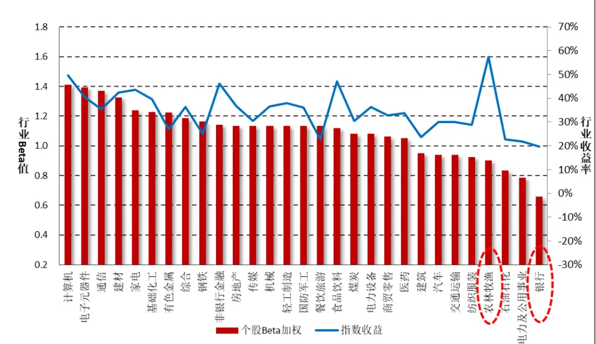
数据来源：财通证券研究所，“拾穗”系列（九）

## 1.2 行业股票数量、市值及地区分布

在从量化的角度介绍行业因子之前，我们先对不同行业股票的数量和市值分布有一个大致的了解。图2统计了中信一级行业分类下的29个行业所包含的股票数量及流通市值分布，可以看到尽管银行和非银金融行业的上市公司不多，但在市值上却占据所有行业的前两位，而上市公司数量排名前三的行业分别为机械、基础化工和医药行业。

图2：行业股票数量及市值分布（2019.4.19）
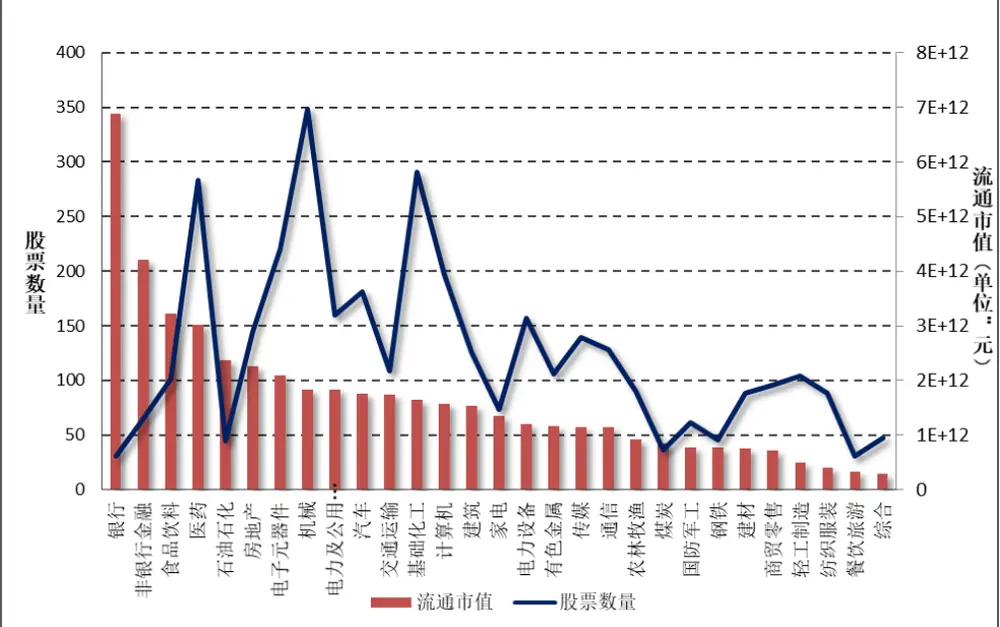
数据来源：财通证券研究所，Wind

此外，由于我国地理面积较大，不同省份所包含的自然资源存在着明显的区别，而不同自然资源的禀赋又通常有利于不同行业公司的发展，因此在不同省市上市的公司往往会具有类似的性质。财通金工统计了各个省份所包含上市公司中排名前五的行业及数量（统计中暂不包含我国港澳台地区），其结果如表1所示。可以看到，北方地区（如内蒙古、山东、河北等）所含基础化工领域的公司较多，江浙沪地区在机械相关行业的上市公司较多。

## 1.3 行业因子与风格因子显著度及绩效比较

在财通金工“星火”多因子系列（三）《Barra模型深化：纯因子组合构建》中，我们统计了行业因子和风格因子的t值显著度比例和其绝对值均值，同时对纯行业因子和纯风格因子的绩效进行了计算，其结果如图3所示。此处我们将下月股票收益对上月最后一个交易日的股票因子暴露度进行月度回归，回测区间选定为2007.5.31-2019.4.19，回测样本选定为Wind全A指数成分股。

可以看到，相较于风格因子而言，绝大多数的行业因子都是非常显著的，t值显著度比例全部保持在 以上，其均值水平达到 。从 值绝对值水平来看，所有行业因子的t值绝对值平均都超过2，均值达到5.3，而风格因子的t值显著度比例和绝对值平均值相较而言就小很多。从这一点也可以看到，相较风格因子而言，行业因子对股票收益的波动有着更强的解释能力，对行业因子进行分析就显得尤为必要。

表1：不同省份包含上市公司前五行业及数量

| 省份 | 行业1 |  | 行业2 |  | 行业3 |  | 行业4 |  | 行业5 |  |
| --- | --- | --- | --- | --- | --- | --- | --- | --- | --- | --- |
| 上海 | 计算机 | 24 | 房地产 | 23 | 机械 | 21 | 基础化工 | 21 | 交通运输 | 19 |
| 云南 | 有色金属 | 7 | 医药 | 6 | 基础化工 | 3 | 商贸零售 | 2 | 房地产 | 2 |
| 内蒙古 | 基础化工 | 5 | 有色金属 | 4 | 医药 | 3 | 煤炭 | 2 | 钢铁 | 2 |
| 北京 | 计算机 | 61 | 传媒 | 26 | 建筑 | 22 | 房地产 | 19 | 电力公用 | 19 |
| 吉林 | 医药 | 6 | 汽车 | 4 | 基础化工 | 3 | 房地产 | 3 | 电力公用 | 3 |
| 四川 | 基础化工 | 15 | 电力公用 | 12 | 机械 | 12 | 计算机 | 7 | 食品饮料 | 6 |
| 天津 | 医药 | 8 | 房地产 | 6 | 交通运输 | 5 | 电力公用 | 4 | 汽车 | 4 |
| 宁夏 | 机械 | 2 | 纺织服装 | 2 | 建材 | 2 | 交通运输 | 1 | 基础化工 | 1 |
| 安徽 | 基础化工 | 13 | 机械 | 10 | 汽车 | 8 | 医药 | 5 | 电力公用 | 5 |
| 山东 | 基础化工 | 29 | 机械 | 22 | 医药 | 17 | 汽车 | 13 | 电力设备 | 10 |
| 山西 | 煤炭 | 11 | 基础化工 | 5 | 医药 | 4 | 电力公用 | 3 | 机械 | 3 |
| 广东 | 电子器件 | 93 | 机械 | 45 | 医药 | 43 | 计算机 | 42 | 通信 | 37 |
| 广西 | 基础化工 | 5 | 医药 | 4 | 电力公用 | 4 | 食品饮料 | 3 | 交通运输 | 2 |
| 新疆 | 农林牧渔 | 9 | 石油石化 | 5 | 电力公用 | 5 | 建材 | 4 | 食品饮料 | 4 |
| 江苏 | 机械 | 66 | 基础化工 | 53 | 汽车 | 33 | 电力设备 | 26 | 电子元器件 | 25 |
| 江西 | 医药 | 6 | 基础化工 | 6 | 电子器件 | 4 | 有色金属 | 4 | 电力公用 | 3 |
| 河北 | 基础化工 | 9 | 机械 | 8 | 电子器件 | 4 | 食品饮料 | 4 | 电力公用 | 3 |
| 河南 | 机械 | 11 | 建材 | 8 | 有色金属 | 6 | 基础化工 | 6 | 医药 | 6 |
| 浙江 | 机械 | 66 | 医药 | 41 | 汽车 | 35 | 基础化工 | 35 | 电力设备 | 25 |
| 海南 | 医药 | 6 | 交通运输 | 4 | 房地产 | 3 | 农林牧渔 | 3 | 食品饮料 | 2 |
| 湖北 | 电子器件 | 12 | 基础化工 | 11 | 医药 | 11 | 通信 | 11 | 机械 | 8 |
| 湖南 | 医药 | 13 | 机械 | 12 | 农林牧渔 | 9 | 电子元器件 | 7 | 食品饮料 | 6 |
| 甘肃 | 食品饮料 | 5 | 建材 | 4 | 医药 | 3 | 农林牧渔 | 3 | 机械 | 3 |
| 福建 | 电子器件 | 10 | 计算机 | 10 | 轻工制造 | 9 | 农林牧渔 | 7 | 汽车 | 7 |
| 西藏 | 医药 | 6 | 食品饮料 | 3 | 有色金属 | 3 | 基础化工 | 1 | 非银行金融 | 1 |
| 贵州 | 基础化工 | 4 | 医药 | 4 | 电力公用 | 3 | 汽车 | 2 | 通信 | 2 |
| 辽宁 | 机械 | 12 | 商贸零售 | 6 | 电力公用 | 5 | 基础化工 | 5 | 传媒 | 5 |
| 重庆 | 医药 | 9 | 汽车 | 8 | 电力及公 | 6 | 房地产 | 5 | 基础化工 | 3 |
| 陕西 | 国防军工 | 8 | 机械 | 7 | 餐饮旅游 | 4 | 电力设备 | 4 | 非银行金融 | 3 |
| 青海 | 基础化工 | 2 | 食品饮料 | 2 | 传媒 | 1 | 钢铁 | 1 | 机械 | 1 |
| 黑龙江 | 医药 | 6 | 电力公用 | 4 | 商贸零售 | 3 | 电力设备 | 3 | 机械 | 3 |

数据来源：财通证券研究所，Wind

图 3：行业及风格因子的 t值显著度比例和t 值绝对值平均
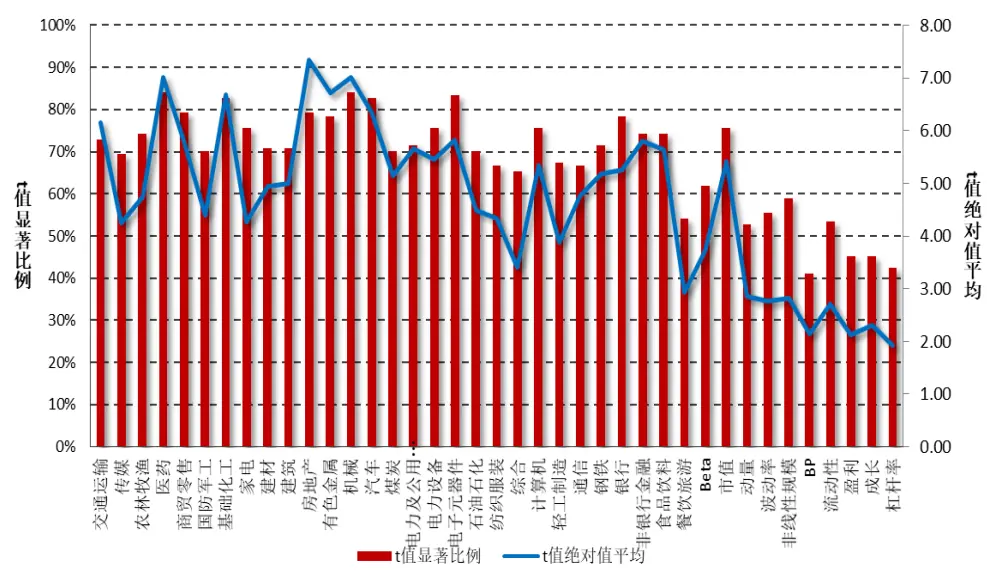
数据来源：财通证券研究所，“星火”（三）

图 4 展示了行业及风格因子在回测区间内因子净值的信息比率（年化收益与年化波动率的比值），可以看到与 t 值显著度不同，风格因子信息比率的绝对值水平比大部分行业因子都要高，这说明在 A 股市场上存在着较强且持续的风格效应。行业因子尽管与股票收益有着非常强的相关关系，但其影响方向变动较大，这在一定程度上也反映了构建一个稳定的行业轮动策略的难度之大。

图 4：行业及风格因子的信息比例
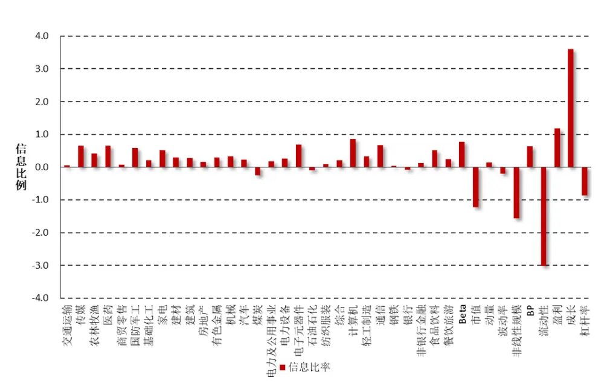
数据来源：财通证券研究所，“星火”（三）

## 1.4 简单行业因子与纯行业因子收益

在财通金工“拾穗”多因子系列（七）《从纯因子组合的角度看待多重共线性》和“星火”专题（四）《基于持仓的基金绩效归因：始于Brinson，归于Barra》中，我们介绍了简单行业因子与纯行业因子的区别，并将仅含行业因子的回归模型与自上而下的Brinson收益分解进行了比较，在本小节中我们对部分内容进行回顾。仅包含行业因子的回归模型如下所示：

$$
r_{n}=f_{c}^{S}+\sum_{i}X_{ni}f_{i}^{S}+u_{n}^{S}
$$

其中， $X_{ni}$ 代表股票 n 在行业因子 i 上的暴露值，我们采用 0-1 变量表示。由于每只股票属于且只属于一个行业，因此截距项因子与行业因子之间存在完全共线性，我们必须为其增加一个约束条件才能求得唯一解。常用的做法是使得单个行业因子收益的市值加权平均等于 0，即：

$$
\sum_{i}W_{i}f_{i}^{S}=0
$$

其中 $W_{i}$ 表示行业 i 的市值权重，所有行业的市值权重加总等于 1。对以上公式进行求解，有：

$$
f_{c}^{S}=\sum_{i}W_{i}\sum_{n\in i}\left(\frac{v_{n}r_{n}}{V_{i}}\right)\quad f_{i}^{S}=\frac{1}{V_{i}}\sum_{n\in i}v_{n}r_{n}-f_{c}^{S}
$$

其中， $V_{i}.$ 表示行业 i 中所有股票的回归权重之和， $W_{i}$ 表示行业 i 中所有股票的市值权重之和。由此可知，对于简单行业因子组合中的市场因子组合fS而言，它是一个纯多头组合，且该组合中的成分股权重之和等于 1，它对于每个行业是市值加权的，但是对于行业内部的成分股则采用的是回归权重加权。对于简单行业因子组合 $f_{i}^{S}$ 而言，它可以通过做多单个行业成分股中回归权重加权组合、同时做空市场因子组合得到。但是，如果我们采用股票的市值加权作为其回归权重，那么市场收益即为所有股票的市值加权收益，行业收益即为单个行业的实际收益与市场指数收益之间的差值，即行业的实际超额收益：

$$
f_{c}^{S}=\sum_{i}W_{i}\sum_{n\in i}\left(\frac{w_{n}r_{n}}{W_{i}}\right)=\sum_{n}w_{n}r_{n}\quad f_{i}^{S}=\frac{1}{W_{i}}\sum_{n\in i}w_{n}r_{n}-f_{c}^{S}
$$

同样的，如果在上述回归中不加上截距项，那么回归得到的行业因子的收益将与实际的中信一级行业指数的收益完全相同（就误差范围之内而言），此时不需要减去市场指数的收益。

在加入风格因子之后，财通金工将全市场股票收益拆解到市场收益、行业收益、风格收益和特质收益四个部分：

$$
r_{n}=f_{c}^{P}+\sum_{i}X_{ni}f_{i}^{P}+\sum_{s}X_{ns}f_{s}^{P}+u_{n}^{P}
$$

其中， $X_{ni}$ 表示股票n在行业因子i上的暴露度， $X_{ns}$ 表示股票n在风格因子s上的暴露度。由于截距项因子 $与$ 行业因子之间存在完全共线性，我们需加入行业因子收益的市值加权均值等于0的约束条件，以使得方程有唯一解：

$$
\sum_{n}W_{i}f_{i}^{P}=0
$$

由于异方差性的存在，我们采用加权最小二乘法对上式进行求解，单个股票的权重即为其自由流通市值的平方根权重。

在财通金工“星火”多因子系列（三）：《Barra模型深化：纯因子组合构建》中，我们探讨了如何利用组合优化的方法来构建A股市场上更具可投资性的纯因子组合，在该专题中我们主要讨论的是纯风格因子组合。所谓纯风格因子组合，是指该组合在其他所有因子（包括市场因子、行业因子和其他风格因子）上的暴露为0，而仅在目标风格因子上存在暴露的组合。然而财通金工需要特别提醒的是，与风格因子不同，市场因子和纯行业因子并不能做到在其他所有行业和风格上的暴露为 的要求。

由于篇幅的限制，表2展示了某一个截面期，市场因子、3个纯行业因子和4个纯风格因子组合在市场因子、4个行业因子和4个风格因子上的暴露情况，其中每一行代表一个因子组合，每一列代表这些组合在该因子上的暴露程度（若需更多数据，可与财通金工直接联系）。可以看到，市场因子组合在市场上的因子暴露为1，在风格因子上的暴露为0，而由于市场因子组合不存在做空而行业因子是由0-1表示的，因此市场因子组合在行业上仍然存在暴露。对于纯行业因子组合而言，其在所有风格因子上的暴露仍然为0，但在其他行业因子上却并不完全等于0。由分析可知，它在收益上实际上等同于一个对冲组合的收益，该组合可以被认为是做多一个仅在市场和行业因子上暴露为1、在其他行业和风格因子上不存在暴露的组合，同时做空市场因子组合。

表2：纯行业因子组合和纯风格因子组合在各因子上的暴露大小

| 组合名称 | 市场因子 | 交通运输 | 传媒 | 农林牧渔 | 医药 | Beta | 市值 | 动量 | 波动率 |
| --- | --- | --- | --- | --- | --- | --- | --- | --- | --- |
| 市场因子 | 1.000 | 0.036 | 0.024 | 0.019 | 0.066 | 0.000 | 0.000 | 0.000 | 0.000 |
| 交通运输 | 0.000 | 0.964 | -0.024 | -0.019 | -0.066 | 0.000 | 0.000 | 0.000 | 0.000 |
| 传媒 | 0.000 | -0.036 | 0.976 | -0.019 | -0.066 | 0.000 | 0.000 | 0.000 | 0.000 |
| 农林牧渔 | 0.000 | -0.036 | -0.024 | 0.981 | -0.066 |  | 0.000 | 0.000 | 0.000 |
| Beta | 0.000 | 0.000 | 0.000 | 0.000 | 0.000 |  |  | 1.000 | 0.000 |
| 市值 | 0.000 | 0.000 | 0.000 | 0.000 | 0.000 |  | 0.000 | 1.000 | 0.000 |
| 动量 | 0.000 | 0.000 | 0.000 | 0.000 | 0.000 | 0.000 | 0.000 | 1.000 | 0.000 |
| 波动率 | 0.000 | 0.000 | 0.000 | 0.000 | 0.000 | 0.000 | 0.000 | 0.000 | 1.000 |

数据来源：财通证券研究所，Wind

由于截距项的加入实际上仅仅是将市场因子从行业因子中剥离出来，对于风格因子收益的估计不存在影响，所以不加截距项的行业因子收益实际上等于加入了截距项的行业因子收益与市场因子收益之和。由此我们对几个因子组合收益总结如下：

1）不加截距项的简单行业因子组合收益 ⟹ 行业实际收益

2）加入截距项的简单行业因子组合收益 ⟹ 行业实际收益相对市场指数的超额收益

3）加入截距项的纯行业因子组合收益 ⟹ 在风格暴露上为0，相当于100%做多该行业，同时100%做空市场因子组合

4）不加截距项的纯行业因子组合收益 ⟹ 等于加入截距项的纯行业因子组合收益与市场收益之和。

## 1.5 行业的风格偏离

本次讨论的最后一个部分，我们关注行业的风格偏离。由于纯行业因子在理解上难度较大，且在实际操作中到底该关注中性化风格之后的行业收益还是认为风格本身也是行业的一部分特性这一争论仍然没有明确的答案，因此我们先来了解一下各个行业在不同风格上的偏离。

图5：行业的风格偏离（2019.4.12）

| 代码 指数名称 | Beta | 规模 | 长期动量 | 波动率 | 非线性规模 | BP | 流动性 | 盈利 | 成长 | 杠杆 |
| --- | --- | --- | --- | --- | --- | --- | --- | --- | --- | --- |
| CI005024.W 交通运输 | -0.174 | -0.141 | -0.312 | 0.063 | 0.495 | 0.143 | 0.006 | 0.032 | 0.144 | 0.369 |
| CI005028.W传媒 | 1.054 | -0.653 | -0.017 | 0.499 | 1.162 | -0.619 | 1.048 | -0.733 | 0.004 | -0.596 |
| CI005020.W 农林牧渔 | -0.759 | -0.263 | 1.274 | 1.647 | 0.356 | -1.157 | 0.727 | -1.119 | 0.024 | -0.265 |
| CI005018.W 医药 | 0.224 | -0.517 | -0.114 | 0.451 | 1.017 | -1.133 | 0.529 | -1.004 | 0.224 | -0.608 |
| CI005014.W商贸零售 | 0.128 | -0.843 | -0.506 | -0.198 | 1.019 | 0.105 | 0.231 | 0.092 | 0.056 | 0.023 |
| CI005012.W 国防军工 | 0.046 | -0.558 | 0.010 | 0.105 | 1.212 | -0.722 | 0.717 | -1.369 | 0.026 | -0.287 |
| CI005006.W 基础化工 | 0.378 | -1.202 | -0.346 | 0.444 | 1.244 | -0.393 | 0.892 | -0.302 | 0.051 | -0.193 |
| CI005016.W家电 | 0.584 | 0.441 | 0.022 | 0.028 | -0.793 | -0.965 | 0.495 | 0.225 | 0.177 | 0.202 |
| CI005008.W建材 | 0.352 | -0.631 | 0.070 | 0.156 | 0.697 | -0.441 | 0.911 | 0.431 | 0.516 | -0.324 |
| CI005007.W建筑 | -0.069 | -0.259 | -0.501 | -0.410 | 0.148 | 0.660 | 0.225 | 0.215 | -0.024 | 0.946 |
| CI005023.W 房地产 | 0.354 | -0.085 | 0.115 | 0.086 | 0.358 | 0.258 | 0.298 | 0.880 | 0.330 | 1.283 |
| CI005003.W有色金属 | 0.458 | -0.611 | -0.488 | -0.062 | 1.306 | -0.308 | 0.821 | -0.605 | -0.310 | 0.290 |
| CI005010.W机械 | 0.321 | -1.118 | -0.015 | 0.151 | 0.887 | -0.544 | 0.532 | -0.901 | 0.292 | -0.166 |
| CI005013.W汽车 | -0.181 | -0.492 | -0.319 | 0.312 | 0.464 | -0.137 | 0.316 | -0.117 | -0.252 | 0.200 |
| CI005002.W煤炭 | -0.176 | -0.166 | -0.383 | -0.273 | 0.508 | 0.866 | -0.031 | 1.074 | 0.075 | 0.521 |
| CI005004.W电力及公用事 | -0.643 | -0.569 | -0.271 | -0.064 | 0.948 | 0.141 | -0.352 | 0.069 | -0.006 | 0.860 |
| CI005011.W电力设备 | 0.170 | -0.915 | 0.427 | 0.560 | 1.140 | -0.417 | 0.510 | -0.898 | -0.067 | 0.180 |
| CI005025.W电子元器件 | 0.862 | -0.563 | 0.292 | 0.466 | 0.893 | -0.872 | 1.063 | -0.844 | 0.124 | -0.193 |
| CI005001.W石油石化 | -0.589 | 0.171 | -0.571 | -0.249 | -0.164 | 0.655 | -0.596 | 0.349 | 0.197 | 0.476 |
| CI005017.W纺织服装 | -0.339 | -1.728 | -0.597 | 0.227 | 1.278 | -0.225 | 0.028 | -0.634 | -0.199 | -0.564 |
| CI005029.W综合 | 0.906 | -1.335 | -0.024 | 0.191 | 1.545 | 0.140 | 0.604 | -0.402 | -0.040 | 0.493 |
| CI005027.W计算机 | 1.299 | -0.855 | 0.867 | 0.587 | 1.471 | -1.250 | 1.386 | -1.494 | 0.231 | -0.673 |
| CI005009.W轻工制造 | 0.159 | -1.437 | -0.257 | 0.453 | 1.520 | -0.624 | 0.725 | -0.513 | -0.023 | -0.358 |
| CI005026.W通信 | 0.824 | -0.896 | 0.422 | 0.670 | 1.169 | -0.810 | 1.443 | -0.978 | 0.137 | -0.527 |
| CI005005.W 钢铁 | 0.058 | -0.227 | -0.424 | -0.445 | 0.857 | 0.969 | 0.186 | 1.168 | -0.046 | 0.161 |
| CI005021.W银行 | -1.043 | 1.017 | -0.051 | -0.682 | -1.667 | 1.806 | -0.821 | 1.611 | -0.056 | 0.072 |
| CI005022.W非银行金融 | 1.272 | 0.772 | 0.645 | -0.453 | -0.966 | -0.189 | 0.712 | 0.159 | -0.560 | -0.389 |
| CI005019.W 食品饮料 | 0.123 | 0.491 | 0.357 | 0.250 | -0.811 | -1.546 | 0.117 | -0.882 | 0.335 | -0.947 |
| CI005015.W餐饮旅游 | -0.029 | -0.412 | -0.168 | 0.180 | 0.032 | -1.145 | 0.099 | -0.866 | 0.371 | -0.543 |

数据来源：财通证券研究所，Wind

图 展示了 年 月 日所有中信一级行业在各个风格因子上的暴露程度，这些行业组合在本身的行业因子上暴露为 ，在其他行业因子上的暴露为 ，而且绝大多数行业在风格上都存在明显的偏好。以上期讨论中提及的Beta因子为例，银行业和农林牧渔行业的Beta因子非常低，而计算机、非银金融和传媒等行业的Beta因子则处于一个较高的水平。同样的，以图2提及的行业市值分布为例，银行和非银金融两大市值巨头行业的规模因子排名占据前二。值得注意的是，此处我们在收益分解中采用的规模数据为总市值，因此其结果与根据流通市值排序的结果略有出入，关于总市值、流通市值和自由流通市值的区别可参见“拾穗”系列（四）《总市值、流通市值、自由流通市值：谈谈取舍》。

接下来我们将每个行业指数看成一个组合，将组合绩效归因中的收益分解模型应用到对行业的收益分解上，此处我们将行业组合的收益拆解到市场因子、行业因子和风格因子三个共同因子部分，实际上是隐含了将特质收益对于组合的贡献视为接近于0的假设。另外，由于所有行业在市场因子（截距项因子）上的暴露均为1，因此市场因子对所有行业的收益贡献都是完全相同的。基于此，我们在下面的讨论中仅关注行业因子和风格因子对于组合收益的贡献情况。

首先观察2019年至今所有行业因子和风格因子的收益情况，其结果如图6所示，其中行业因子用红色柱状图表示，风格因子用蓝色柱状图表示，且风格因子的名称用英文进行了标注。回测时间选定为2018.12.28-2019.4.19，回测样本选定为Wind全A成分股指数。可以看到，市场因子在今年已经获得了高达34.62%的收益，农林牧渔和非银金融行业排名前二，分别为24.26%和13.63%。相较之下，风格因子中排名最高的Beta因子获得了5.4%的收益，在数量级上仍然相距甚远。

图6：行业因子和风格因子收益（2018.12.28-2019.4.19）
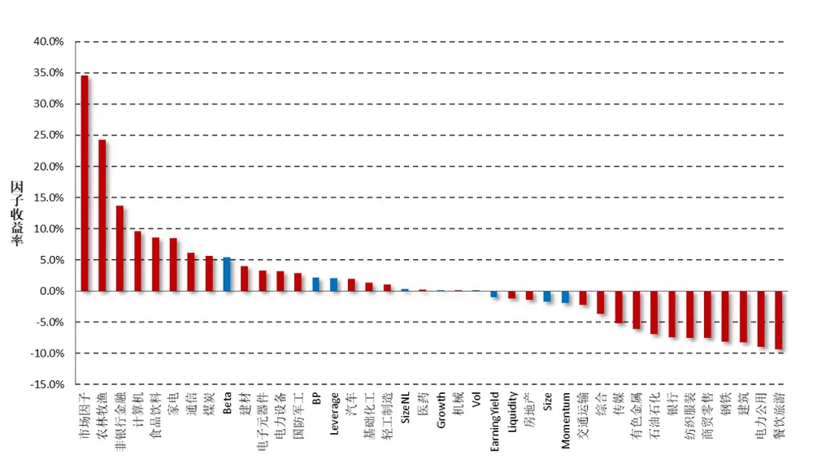
数据来源：财通证券研究所，Wind

图7展示了各个行业指数的估计收益与实际收益的相关情况，其中估计收益=市场因子收益 行业因子 风格因子收益，而实际收益采用的是中信一级行业指数的收盘价计算得到。可以看到二者相关系数达到95%，这说明我们的收益拆解与指数的实际收益呈现出十分一致的关系，因此这样的收益拆解具有可信性。

图7：估计收益与实际收益相关性
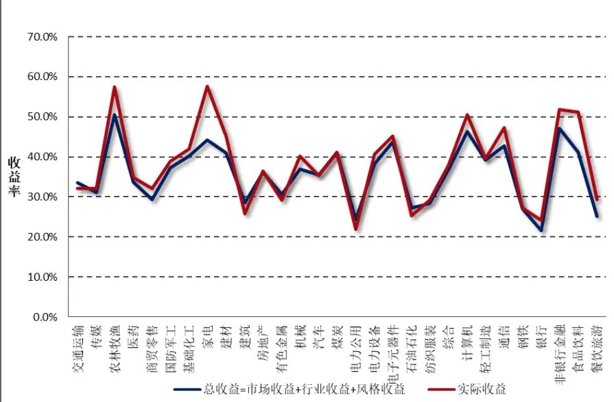
数据来源：财通证券研究所，Wind

图 展示了每个行业的收益中，来源于行业因子的部分和来源于风格因子部分的收益情况。以农林牧渔行业为例，前面提到该行业在今年的所有行业中收益排名第一，但在 因子上却有着明显的负暴露，而 因子在 年的收益表现在所有风格因子中排名第一。通过图 的分析可以看到，该行业的主要收益源于农林牧渔行业因子本身的强劲收益。而对于银行业而言，其在行业因子上贡献的收益与在风格因子上贡献的收益基本相当（-7.40% VS -5.58%），而进一步对银行业的风格因子收益进行拆解发现其负收益主要是由于银行板块在Beta因子上的低暴露造成的，因此我们之前得出的低Beta限制了银行业的上涨这一结论仍然具有一定的合理性，尽管它并不是所有的原因。

图8：行业收益拆解：纯行业贡献及纯风格贡献（2019年）
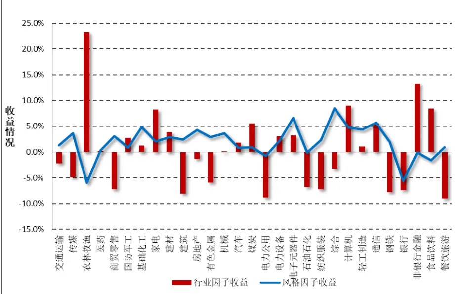
数据来源：财通证券研究所，Wind

由此我们也可以得出一个结论，在对组合的收益进行归因时，行业因子是非常重要的、不容忽视的部分。很多投资者在对组合进行分析时往往只观察组合在风格因子上的暴露就得出一些表面的结论，这一点是远远不够的。以本文讨论的案例为例，农林牧渔行业和银行业都在Beta因子上存在很高的负暴露，但是并不能说明这两个行业的收益就会十分一致，我们同时还需要考虑行业因子对于组合本身带来的贡献。

## 1.6 小结

本期“拾穗”系列小专题，我们就行业的风格偏好和纯行业因子组合的一些性质进行探讨，解析行业收益的不同来源，回答为何处于相似Beta水平的银行和农林牧渔两个板块而言，其收益情况截然不同的原因，主要结论如下：

1）银行和非银金融行业的市值最大，而机械、基础化工和医药行业的上市公司最多；

2）行业因子的t值显著度要远高于风格因子，然而行业因子的夏普比率却远低于风格因子，这在一定程度上反映了构建一个稳定行业轮动策略的难度之高；

3）带截距项的简单行业因子收益等于行业实际收益减去市场收益，不带截距项的简单行业因子收益等于行业实际收益本身，加入截距项的纯行业因子在风格因子上的暴露为0，相当于100%做多该行业，同时100%做空市场因子；不加截距项的纯行业因子组合等于加入截距项的纯行业因子组合与市场收益之和；

4）银行业和农林牧渔行业都在Beta上存在非常显著的暴露，但是农林牧渔纯行业因子的收益非常之高，这是两个行业的实际收益相差十分明显的主要原因；

5）在对组合的收益进行归因时，行业因子是不容忽视的部分。当前很多投资者在对组合进行分析时往往只观察组合在风格因子上的暴露就得出一些表面结论，这一点是远远不够的。

## 2、 一周行情回顾

上周市场呈现总体呈现出普涨状态，总体来看市场风格并不十分明显，稍微偏向大盘价值股。上周沪深300成长指数和中证100指数分别上涨4.86%和4.23%，在所有样本指数中排名前二，而 380 成长指数和 380 价值指数分别录得 0.71%和0.77%的收益，涨幅相对落后。

图9：上周主要指数收益（2019.4.12-2019.4.19）
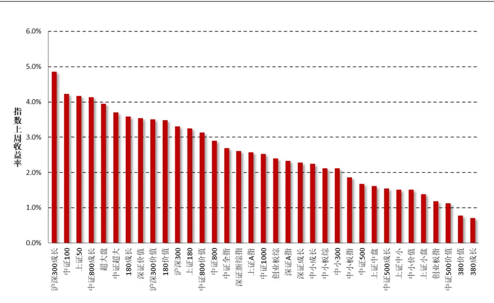
数据来源：财通证券研究所，Wind

行业方面，在所有 29 个中信一级行业中，家电、通信和煤炭行业分别上涨9.74%、8.91%和 8.09%，而商贸零售和房地产行业分别下跌 0.62%和 0.21%收益，排名相对靠后。

图10：上周中信一级行业指数收益（2019.4.12-2019.4.19）
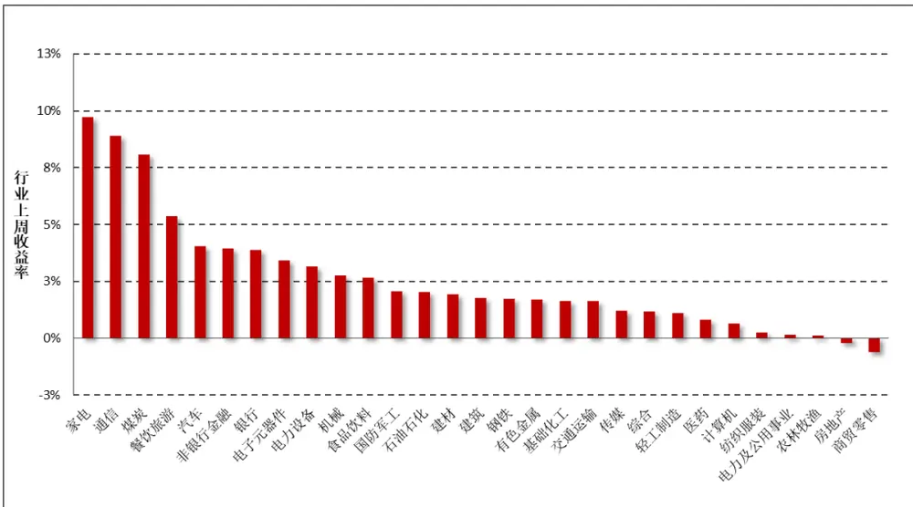
数据来源：财通证券研究所，Wind

## 3、 市场风格解析及指数风险预测

财通金工借鉴 Barra 模型，选取 Beta、规模、动量、波动率、非线性规模、、流动性、盈利、成长和杠杆率因子构建收益 风险归因模型，因子定义及计算细节参见附录二。本部分通过对近期风格因子的收益表现进行分析以期捕捉 A股市场的风格变化，同时对财通金工样本指数的未来一月风险进行预测来分析当前 A 股市场所处的风险水平。风格因子的收益拆解可参见财通金工专题报告《Barra 模型初探：A股市场风格解析》，资产组合的风险预测可参见财通金工专题报告《Barra 模型进阶：多因子模型风险预测》。

## 3.1 市场风格解析

各类风格因子在上周的累计收益可分为日度累计收益和周度收益两种，日度累计收益是根据风格因子的日度收益计算得到，周度收益是将股票在本周的收益率对股票在上周最后一个交易日的因子暴露度进行回归得到的因子纯净收益，二者之间的区别在于换仓频率的不同，前者为每日换仓，而后者在每周最后一个交易日换仓。

表 3 和图 11 展示了上周各类风格因子的累计收益和周度收益大小，可以看到，二者十分近似。本周 Beta 因子经过前周下跌后继续强势表现，非线性规模因子持续录得负收益，而动量因子则经历了较大回撤。

表3：上周纯风格因子收益（2019.4.15-2019.4.18）

| 日期 | Beta | 规模 | 长期动量 | 波动率 | 非线性规模 | BP | 流动性 | 盈利 | 成长 | 杠杆 |
| --- | --- | --- | --- | --- | --- | --- | --- | --- | --- | --- |
| 2019/4/15 | -0.19% | -0.04% | -0.07% | -0.10% | -0.10% | -0.11% | -0.05% | -0.08% | -0.02% | 0.06% |
| 2019/4/16 | 0.31% | 0.04% | 0.00% | -0.09% | -0.08% | 0.06% | 0.14% | -0.09% | 0.07% | 0.04% |
| 2019/4/17 | 0.09% | -0.11% | -0.07% | 0.45% | -0.08% | 0.23% | -0.10% | -0.16% | -0.03% | 0.12% |
| 2019/4/18 | 0.09% | 0.05% | 0.00% | -0.15% | -0.02% | -0.11% | -0.02% | 0.10% | 0.02% | 0.01% |
| 2019/4/19 | 0.11% | -0.05% | -0.10% | -0.05% | -0.07% | 0.00% | -0.01% | -0.03% | -0.04% | -0.04% |
| 上周累计收益 | 0.40% | -0.12% | -0.25% | 0.06% | -0.35% | 0.07% | -0.04% | -0.27% | 0.00% | 0.18% |
| 周度收益 | 0.32% | -0.14% | -0.32% | 0.04% | -0.37% | 0.10% | 0.05% | -0.29% | -0.03% | 0.19% |
| 前一周度收益 | -0.25% | -0.76% | 0.14% | 0.12% | -0.39% | 0.24% | -0.49% | 0.39% | -0.08% | 0.08% |

数据来源：财通证券研究所，Wind

图 11：近两周纯风格因子收益比较（2019.4.4-2019.4.19）
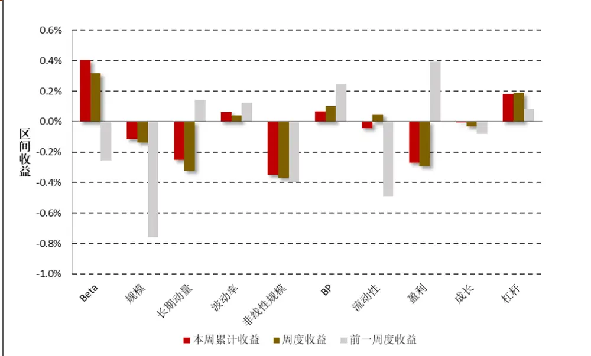
数据来源：财通证券研究所,Wind

图12：最近一个月风格因子净值走势（2019.3.19-2019.4.19）
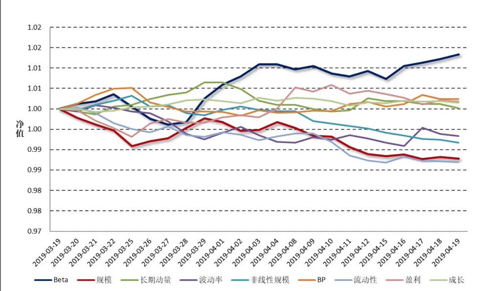
数据来源：财通证券研究所，Wind

图 12 和图 13 分别展示了最近一个月各类风格因子的净值走势及累计收益，以观察各类风格因子在过去一段时间的持续盈利能力。整体来讲，在过去的一个月中，高 Beta、前期涨幅较高的股票能够获得相对较高的收益，而大规模、高换手、高波动的股票后市将会出现较为明显的回撤。

图13：最近一个月风格因子累计收益（2019.3.19-2019.4.19）
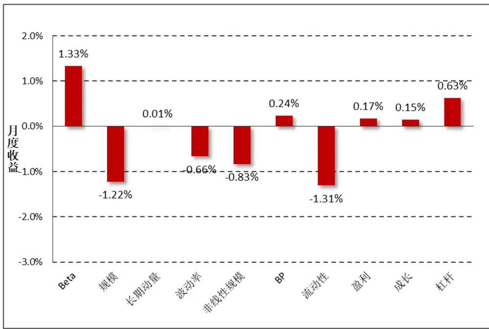
数据来源：财通证券研究所，Wind

## 3.2 指数风险预测

对收益的分解仅代表过去，对风险的预测才代表未来。多因子模型风险预测将股票风险拆解为共同风险和特质风险两部分，在通过稳健调整对共同风险矩阵和特质风险矩阵进行估计后，即可根据指数的成分股权重来估计指数在未来一段时间的波动情况。为了保证结果的严谨性，此处我们直接采用 Wind 提供的成分股权重数据，而非根据自由流通市值计算得到，尽管二者的结果十分类似。

$$
Risk(P)=W^{\prime}VW=W^{\prime}(X^{\prime}FX+\Delta)W
$$

图 14 展示了财通金工样本指数在未来一个月的预测波动率，为了方便展示我们将估计的月度波动率进行年化，波动的预测时间为上周最后一个交易日（2019.4.19）。可以看到，所有样本指数未来一月的年化波动区间在 22%-31%之间，预测波动与上周水平基本保持一致，财通金工特别提醒投资者注意当前市场波动情况，对后市维持谨慎乐观态度。中小板股票、成长类指数的风险较大，而偏大盘股票、价值类股票的风险普遍较小。

图14：财通金工样本指数未来一月波动预测（年化）（2019.4.19-2019.5.23）
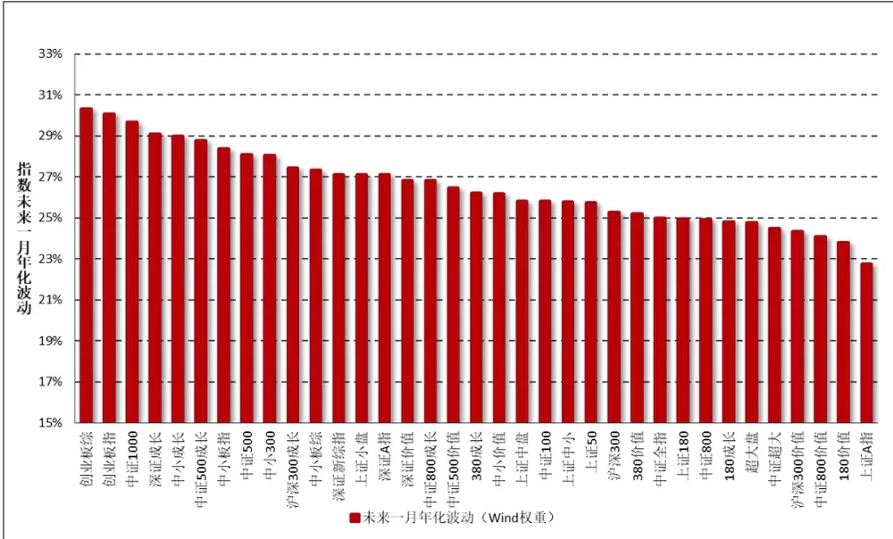
数据来源：财通证券研究所，Wind

由于在计算股票的风格因子时，我们会对暂停上市的股票、大类因子值存在缺失的股票进行剔除，因此在进行收益归因和风险预测时，并非所有指数成分股都纳入到了模型中，如果缺失股票个数过多或者缺失股票的权重占比过大，将会对模型结果造成较大影响。图 15 展示了各大指数在模型拟合过程中，纳入考虑的股票个数（权重）占指数成分股个数（权重）的比例，可以看到所有指数的比例均在 93%以上，数据质量的拟合较为合意。

图15：收益回归/风险预测样本股票占指数成分股比率
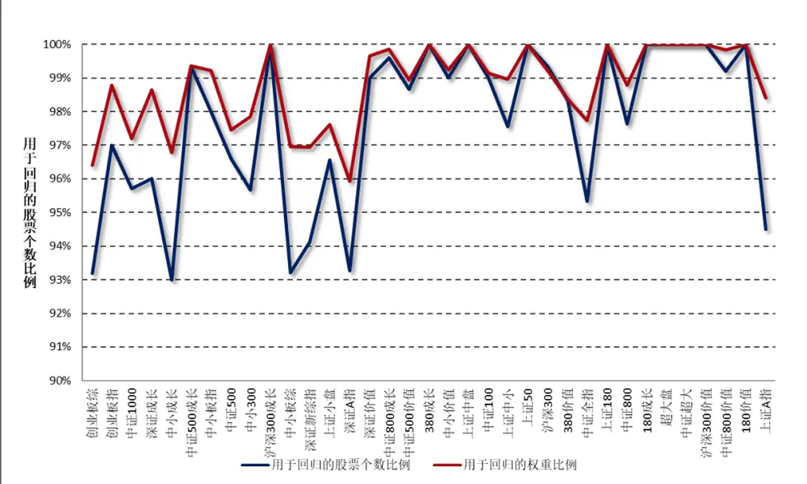
数据来源：财通证券研究所，Wind

## 4、 指数成分收益归因：

本部分财通金工对上周表现最好的三只指数和表现最差的三只指数进行归因分析，以观察涨幅较高（或较低）的指数风险暴露是否展现出较高的趋同性以及两类指数的持股风格是否会表现出明显的差别，其结果如图 16 和图 17 所示。

图16：上周表现最好三指数因子暴露度
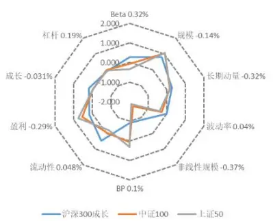
数据来源：财通证券研究所，Wind

图17：上周表现最差三指数因子暴露度
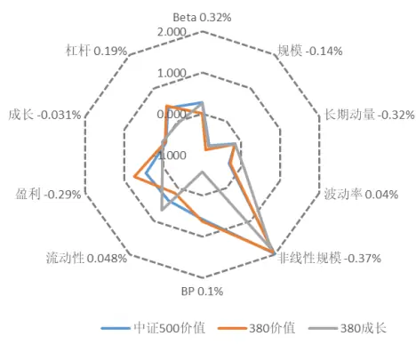
数据来源：财通证券研究所，Wind

表 4 展示了各大指数上周在各类因子上的暴露程度，可以看到，上周市场风格以大盘指数为主，表现最好的三只指数是大市值指数，其在非线性规模因子上暴露较少，而表现较差的三只指数则更多地偏向于中小市值股票，其在非线性规模因子上的较大暴露拖累指数收益。

表4：指数在风格因子上的暴露程度（2019.4.12）

| 代码 | 指数名称 | Beta 0.32% | 规模 -0.14% 长 | 期动量 -0.:波 | 动率 0.049非 | 线性规模 | - BP 0.1% | 流动性 0.048 | 盈利 -0.29% | 成长 -0.0319 | 杠杆 0.19% | 实际收益 |
| --- | --- | --- | --- | --- | --- | --- | --- | --- | --- | --- | --- | --- |
| 000918.SH | 沪深300成长 | 0.263 | 0.803 | 0.280 | -0.017 | -0.869 | -0.901 | 0.459 | 0.166 | 0.187 | -0.066 | 4.86% |
| 000903.SH | 中证100 | -0.070 | 1.062 | 0.147 | -0.278 | -1.697 | 0.063 | -0.025 | 0.549 | -0.021 | -0.004 | 4.23% |
| 000016.SH | 上证50 | -0.351 | 1.082 | 0.167 | -0.391 | -1.835 | 0.323 | -0.188 | 0.759 | -0.020 | -0.049 | 4.17% |
| H30355.CSI | 中证800成长 | 0.398 | 0.488 | 0.214 | 0.028 | -0.290 | -0.809 | 0.587 | 0.083 | 0.153 | -0.004 | 4.14% |
| 000043.SH | 超大盘 | -0.228 | 1.093 | -0.053 | -0.338 | -1.921 | 0.294 | -0.068 | 0.492 | -0.080 | -0.133 | 3.95% |
| 000980.CSI | 中证超大 | -0.188 | 1.092 | -0.035 | -0.298 | -1.883 | 0.292 | -0.237 | 0.531 | -0.061 | 0.039 | 3.70% |
| 000028.SH | 180成长 | -0.275 | 0.915 | 0.226 | -0.064 | -1.250 | -0.363 | 0.011 | 0.447 | 0.170 | -0.017 | 3.59% |
| 399348.SZ | 深证价值 | 0.502 | 0.534 | 0.261 | 0.098 | -0.376 | -0.327 | 0.616 | 0.269 | 0.020 | 0.229 | 3.54% |
| 000919.CSI | 沪深300价值 | -0.556 | 0.934 | 0.003 | -0.459 | -1.307 | 0.820 | -0.295 | 1.257 | -0.029 | 0.434 | 3.50% |
| 000029.SH | 180价值 | -0.779 | 0.974 | -0.069 | -0.515 | -1.479 | 1.106 | -0.482 | 1.343 | -0.029 | 0.323 | 3.49% |
| 000300.SH | 沪深300 | 0.130 | 0.790 | 0.157 | -0.125 | -0.850 | -0.109 | 0.228 | 0.243 | 0.012 | 0.023 | 3.31% |
| 000010.SH | 上证180 | -0.115 | 0.861 | 0.163 | -0.253 | -1.092 | 0.155 | 0.035 | 0.459 | -0.041 | 0.032 | 3.24% |
| H30356.CSI | 中证800价值 | -0.244 | 0.693 | 0.010 | -0.415 | -0.802 | 0.654 | -0.093 | 1.009 | -0.069 | 0.443 | 3.13% |
| 000906.SH | 中证800 | 0.211 | 0.412 | 0.118 | -0.062 | -0.165 | -0.139 | 0.324 | 0.080 | 0.011 | 0.033 | 2.90% |
| 000985.CSI | 中证全指 | 0.263 | -0.232 | 0.082 | 0.091 | 0.307 | -0.271 | 0.428 | -0.203 | 0.025 | -0.078 | 2.69% |
| 399100.SZ | 深证新综指 | 0.548 | -0.590 | 0.072 | 0.297 | 0.807 | -0.630 | 0.613 | -0.593 | 0.097 | -0.196 | 2.61% |
| 000002.SH | 上证A指 | -0.192 | 0.292 | 0.007 | -0.100 | -0.391 | 0.245 | -0.110 | 0.226 | -0.053 | 0.059 | 2.58% |
| 000852.SH | 中证1000 | 0.506 | -1.479 | -0.024 | 0.365 | 1.795 | -0.519 | 0.737 | -0.779 | 0.126 | -0.251 | 2.52% |
| 399102.SZ | 创业板综 | 0.753 | -1.181 | 0.304 | 0.537 | 1.134 | -1.077 | 0.919 | -1.217 | 0.164 | -0.548 | 2.39% |
| 399107.SZ | 深证A指 | 0.504 | -0.604 | 0.130 | 0.368 | 0.801 | -0.685 | 0.757 | -0.656 | 0.149 | -0.237 | 2.32% |
| 399346.SZ | 深证成长 | 0.862 | 0.328 | 0.349 | 0.427 | 0.066 | -1.054 | 0.984 | -0.659 | 0.026 | 0.019 | 2.28% |
| 399602.SZ | 中小成长 | 0.741 | -0.013 | -0.066 | 0.491 | 0.679 | -1.062 | 0.865 | -0.673 | 0.206 | -0.153 | 2.25% |
| 399101.SZ | 中小板综 | 0.428 | -0.714 | -0.028 | 0.424 | 1.014 | -0.793 | 0.571 | -0.812 | 0.120 | -0.349 | 2.12% |
| 399008.SZ | 中小300 | 0.600 | -0.307 | 0.050 | 0.397 | 1.103 | -0.913 | 0.801 | -0.758 | 0.174 | -0.267 | 2.12% |
| 399005.SZ | 中小板指 | 0.728 | 0.180 | 0.076 | 0.339 | 0.620 | -1.050 | 0.821 | -0.706 | 0.221 | -0.249 | 1.86% |
| 000905.SH | 中证500 | 0.488 | -0.756 | -0.002 | 0.135 | 1.961 | -0.244 | 0.639 | -0.429 | 0.004 | 0.078 | 1.68% |
| 000044.SH | 上证中盘 | 0.303 | 0.469 | 0.155 | -0.009 | 0.223 | -0.143 | 0.431 | -0.072 | -0.079 | 0.176 | 1.61% |
| H30351.CSI | 中证500成长 | 0.695 | -0.674 | -0.087 | 0.168 | 1.961 | -0.424 | 0.888 | -0.126 | 0.076 | 0.075 | 1.54% |
| 000046.SH | 上证中小 | 0.319 | -0.048 | 0.053 | 0.037 | 0.929 | -0.114 | 0.480 | -0.155 | -0.068 | 0.170 | 1.51% |
| 399604.SZ | 中小价值 | 0.422 | -0.302 | 0.032 | 0.291 | 1.020 | -0.451 | 0.568 | -0.113 | 0.099 | -0.148 | 1.51% |
| 000045.SH | 上证小盘 | 0.339 | -0.736 | -0.083 | 0.099 | 1.867 | -0.075 | 0.545 | -0.264 | -0.053 | 0.162 | 1.38% |
| 399006.SZ | 创业板指 | 0.750 | -0.185 | 0.729 | 0.669 | 1.003 | -1.299 | 1.158 | -1.233 | 0.181 | -0.446 | 1.18% |
| H30352.CSI | 中证500价值 | 0.271 | -0.724 | -0.152 | -0.319 | 1.971 | 0.566 | 0.390 | 0.447 | -0.066 | 0.409 | 1.13% |
| 000118.SH | 380价值 | 0.001 | -0.847 | -0.180 | -0.278 | 1.919 | 0.613 | 0.149 | 0.734 | -0.049 | 0.470 | 0.77% |
| 000117.SH | 380成长 | 0.260 | -0.745 | -0.163 | 0.075 | 1.828 | -0.579 | 0.680 | 0.021 | 0.020 | -0.027 | 0.71% |

数据来源：财通证券研究所，Wind

5、 附录

| 附录一：财通金工指数池选取 |  |  |  |  |  |
| --- | --- | --- | --- | --- | --- |
| 上证规模/风格指数 |  | 深证综合/规模指数 |  | 中证规模/风格指数 |  |
| 000001.SH | 上证综指 | 399101.SZ | 中小板综 | 000300.SH | 沪深300 |
| 000002.SH | 上证A 指 | 399102.SZ | 创业板棕 | 000852.SH | 中证 1000 |
| 000010.SH | 上证 180 | 399106.SZ | 深证综指 | 000985.CSI | 中证全指 |
| 000016.SH | 上证50 | 399107.SZ | 深证 A指 | 000980.CSI | 中证超大 |
| 000043.SH | 超大盘 | 399005.SZ | 中小板指 | 000903.SH | 中证100 |
| 000044.SH | 上证中盘 | 399006.SZ | 创业板指 | 000905.SH | 中证500 |
| 000045.SH | 上证小盘 | 399008.SZ | 中小300 | 000906.SH | 中证 800 |
| 000046.SH | 上证中小 | 399346.SZ | 深证成长 | 000918.SH | 沪深 300 成长 |
| 000028.SH | 180成长 | 399348.SZ | 深证价值 | 000919.SH | 沪深 300 价值 |
| 000029.SH | 180 价值 | 399602.SZ | 中小成长 | H30351.CSI | 中证500 成长 |
| 000117.SH | 380 成长 | 399604.SZ | 中小价值 | H30352.CSI | 中证 500 价值 |
| 000118.SH | 380 价值 |  |  | H30355.CSI | 中证 800 成长 |
|  |  |  |  | H30356.CSI | 中证 800 价值 |

数据来源：财通证券研究所

附录二：财通金工风格因子定义

| 大类因子 | 子类因子 | 因子定义及计算 | 权重 | 备注 |
| --- | --- | --- | --- | --- |
| Beta | BETA | $\mathbf{r_{t}}=\alpha+\beta\mathbf{R_{t}}+\mathbf{e_{t}},$ 将单只股票过去252天的日度收益率对流通市值加权指数日度收益率进行半衰指数加权回归，半衰期为63 天 | 1 | 1) 采用流通市值而非总市值加权，因为各大指数编制采用流通市值加权；2) 需要剔除当日停牌或者未上市日期的数据，并将权重进行归一化；3) 若满足条件的样本数据少于42天，我们将其 Beta 置为 NaN。 |
| 规模 | SIZE | 股票总市值取对数 | 1 | 由于PB、PE等因子的计算是基于总市值的，因此此处也用总市值 |
| 动量 | RSTR | 过去一段时间个股的累计收益率，不含最近一个月， $\begin{array}{r}{\mathrm{RSTR}=\sum_{\mathrm{t}=\mathrm{L}}^{\mathrm{T}+\mathrm{L}}\mathrm{w}_{\mathrm{t}}(\ln(1+\mathrm{r}_{\mathrm{t}}),}\end{array}$ $\mathrm{r}_{\mathrm{t}}=\mathrm{P}_{\mathrm{t}}/\mathrm{P}_{\mathrm{t}-1}-1,\quad\mathrm{T}=504,\quad\mathrm{L}=21,$ 收益率序列采用半衰指数加权，半衰期为126天 | 1 | 1)对于数据质量较好的个股，计算动量时采用了2年的数据2) 需要剔除未上市日期数据，但无需剔除停牌日期数据，并将权重归一化3)若满足条件的数据样本小于42天，我们将其动量置为NaN |
| 波动率(对Beta因子和市值因子进行正交化处理） | DASTD | 个股相对市值加权指数的超额收益率序列的半衰指数加权标准差，T=252，半衰期为42天1/2 $\mathrm{DASTD}=\left(\sum_{\mathrm{t}=1}^{\mathrm{T}}\mathrm{w}_{\mathrm{t}}\left(\mathrm{r}_{\mathrm{t}}-\mu(\mathrm{r})\right)^2\right)^{\frac{1}{2}}$ | 0.7 | 12 采用流通市值加权计算指数收益需要剔除当日停牌或者未上市日期的数据，并将权重进行归一化3) 若满足条件的数据样本小于42天，我们将其因子值置为NaN |
|  | CMRA | $\boxed{表示过去\;12\;个月的波动幅度,}$ $\begin{array}{r}{\mathrm{CMRA}=\ln(1+\operatorname*{max}\{\mathrm{Z(T)}\})-\ln(1+\operatorname*{min}\{\mathrm{Z(T)}\}),}\end{array}$ $\mathrm{Z}(\mathrm{T})=\exp(\sum_{\mathrm{t}=1}^{\mathrm{T}}\ln(1+\mathrm{r}_{\mathrm{t}}))-1$ 表示过 | 0.15 | 以 21 天为 1 个月 |
|  | HSIGMA | 计算 Beta 时残差的标准差， Hsigma = std(ei) | 0.15 | 同 Beta 因子的计算 |
| 非线性规模 | NonLinerSize | 中市值因子，将股票总市值对数的三次方对总市值对数回归，取残差的相反数 | 1 | 用于衡量市值因子的非线性性，总市值越大和越小的股票的非线性规模越小，中市值股票的非线性规模越大 |
| 估值 | BP | 市净率的倒数，1/PB | 1 | 采用 Wind 中的 pb_lf 因子的倒数 |
| 流动性(对市值因子进行正交化） | STOM | 月度换手率， $\mathrm{STOM}=\ln(\mathrm{mean}(\sum_{t=1}^{21}(V_t/S_t)))$ 其中V为当日成交量，S为流通股本 | 0.5 | 1)采用流通股本值，而非自由流通股本值2）剔除未上市、停牌日期的数据 |
|  | STOQ | 季度换手率， $\mathrm{STOQ}=\ln(\mathrm{mean}(\sum_{t=1}^{63}(V_t/S_t)))$ | 0.25 | 同 STOQ 因子的计算 |
|  | STOA | 年度换手率， $\mathrm{STOA}=\ln(\mathrm{mean}(\sum_{t=1}^{252}(V_t/S_t))),$ | 0.25 | 同 STOQ 因子的计算 |
| 盈利 | CETOP | 过去滚动12个月的经营现金流除以当前市值实际计算中取市现率 PCF（经营现金流 TTM）的倒数 | 1/2 | 采用 Wind 中的 PCF_OCF_ttm 因子的倒数 |
|  | ETOP | 过去滚动12个月的利润除以当前市值实际计算中取市盈率 PETTM 的倒数 | 1/2 | 采用 Wind 中的 PE_ttm 因子的倒数 |
| 成长 | YOYProfit | 单季度净利润同比增长率 | 1/2 | 为避免使用未来数据，需要根据季报公布时间进行调整 |
|  | YOYSales | 单季度营业收入同比增长率 | 1/2 | 同 YOYProfit 因子的计算 |
| 杠杆 | MLEV | 市场杠杆率，MLEV=（总市值+非流动负债）/总市值 | 1/3 |  |
|  | DTOA | 资产负债率，DTOA=总资产/总负债 | 1/3 |  |
|  | BLEV | 账面杠杆率，BLEV=（账面价值+非流动负债）/账面价值 | 1/3 |  |

数据来源：财通证券研究所
备注：1.波动率因子需对Beta因子和市值因子进行正交化处理；
2.流动性因子需对市值因子进行正交化处理；
若大类因子下所有子类因子值全部缺失，则该股票的因子值记为缺失，否则用有数据的因子值进行替代，注意需对权重进行归一化处理

## 信息披露

## 分析师承诺

作者具有中国证券业协会授予的证券投资咨询执业资格，并注册为证券分析师，具备专业胜任能力，保证报告所采用的数据均来自合规渠道，分析逻辑基于作者的职业理解。本报告清晰地反映了作者的研究观点，力求独立、客观和公正，结论不受任何第三方的授意或影响，作者也不会因本报告中的具体推荐意见或观点而直接或间接收到任何形式的补偿。

## 资质声明

财通证券股份有限公司具备中国证券监督管理委员会许可的证券投资咨询业务资格。

## 公司评级

买入：我们预计未来 6个月内，个股相对大盘涨幅在 15%以上；

增持：我们预计未来 6个月内，个股相对大盘涨幅介于 5%与 15%之间；

中性：我们预计未来 6个月内，个股相对大盘涨幅介于-5%与 5%之间；

减持：我们预计未来 6个月内，个股相对大盘涨幅介于-5%与-15%之间；

卖出：我们预计未来 6个月内，个股相对大盘涨幅低于-15%。

## 行业评级

增持：我们预计未来 6个月内，行业整体回报高于市场整体水平 5%以上；

中性：我们预计未来 6个月内，行业整体回报介于市场整体水平-5%与5%之间；

减持：我们预计未来 6个月内，行业整体回报低于市场整体水平-5%以下。

## 免责声明

本报告仅供财通证券股份有限公司的客户使用。本公司不会因接收人收到本报告而视其为本公司的当然客户。

本报告的信息来源于已公开的资料，本公司不保证该等信息的准确性、完整性。本报告所载的资料、工具、意见及推测只提供给客户作参考之用，并非作为或被视为出售或购买证券或其他投资标的邀请或向他人作出邀请。

本报告所载的资料、意见及推测仅反映本公司于发布本报告当日的判断，本报告所指的证券或投资标的价格、价值及投资收入可能会波动。在不同时期，本公司可发出与本报告所载资料、意见及推测不一致的报告。

本公司通过信息隔离墙对可能存在利益冲突的业务部门或关联机构之间的信息流动进行控制。因此，客户应注意，在法律许可的情况下，本公司及其所属关联机构可能会持有报告中提到的公司所发行的证券或期权并进行证券或期权交易，也可能为这些公司提供或者争取提供投资银行、财务顾问或者金融产品等相关服务。在法律许可的情况下，本公司的员工可能担任本报告所提到的公司的董事。

本报告中所指的投资及服务可能不适合个别客户，不构成客户私人咨询建议。在任何情况下，本报告中的信息或所表述的意见均不构成对任何人的投资建议。在任何情况下，本公司不对任何人使用本报告中的任何内容所引致的任何损失负任何责任。

本报告仅作为客户作出投资决策和公司投资顾问为客户提供投资建议的参考。客户应当独立作出投资决策，而基于本报告作出任何投资决定或就本报告要求任何解释前应咨询所在证券机构投资顾问和服务人员的意见；

本报告的版权归本公司所有，未经书面许可，任何机构和个人不得以任何形式翻版、复制、发表或引用，或再次分发给任何其他人，或以任何侵犯本公司版权的其他方式使用。