2019 年 05 月 07 日

# 多因子风险预测：从怎么做到为什么

## “拾穗”多因子系列报告（第 11期）

## 联系信息

陶勤英分析师

SAC 证书编号：S0160517100002 021-68592393

taoqy@ctsec.com

张宇研究助理

zhangyu1@ctsec.com 021-68592337

176216888421

## 相关报告

【1】“星火”多因子系列（一）：《Barra模型初探：A 股市场风格解析》

【2】“星火”多因子系列（二）：《Barra模型进阶：多因子模型风险预测》

【3】“星火”多因子系列（三）：《Barra模型深化：纯因子组合构建》

【4】“星火”多因子系列（四）：《基于持仓的基金绩效归因：始于 Brinson，归于 Barra》

【5】“拾穗”多因子系列（一）：《带约束的加权最小二乘：一种解析解法》

【6】“拾穗”多因子系列（二）：《你看到的不一定是你所想的：解密 R 方》

【7】“拾穗”多因子系列（三）：《行业因子选取：中信一级还是申万一级？》

【8】“拾穗”多因子系列（四）：《总市值、流通市值、自由流通市值：谈谈取舍》

【9】“拾穗”多因子系列（五）：《数据异常值处理：比较与实践》

【10】“拾穗”多因子系列（六）：《因子缺失值处理：数以多为贵》

【11】“拾穗”多因子系列（七）：《从纯因子组合的角度看待多重共线性》

【 】“拾穗”多因子系列（八）：《非线性规模因子：A 股市场存在中市值效应吗？》

【13】“拾穗”多因子系列（九）：《牛市抢跑者：低 Beta一定低风险吗？》

【14】“拾穗”多因子系列（十）：《行业的风格偏好：解析纯行业因子》

## 投资要点：

## 多因子风险预测：从怎么做到为什么

- 样本协方差矩阵估计存在三点不足：运算大、不可逆、偏差大，基于多因子的协方差矩阵估计可以针对这些问题发挥用武之地。

- 最优投资组合是指在相同期望收益的条件下，具有最小波动率的资产组合。对最优投资组合权重求解的准确性主要取决于对期望超额收益的估计（一阶风险）和对协方差矩阵的估计（二阶风险）。

- 在收益率满足正态分布的假设下，偏差统计量衡量的是实际风险与预测风险的比值，然而金融数据往往服从“尖峰厚尾”分布，因此即便对于完美的预测方法而言，也很难做到偏差统计量等于 1。

收益率分布对于偏差统计量落入其置信区间内的概率存在影响，随着收益分布的峰度逐渐变大，落入 95%置信区间的概率逐渐减小。

V Newey-West 调整主要用于解决协方差矩阵估计中股票收益的自相关性影响，财通金工通过蒙特卡洛模拟法探究其原理。

- 特征值调整的主要逻辑在于通过蒙特卡洛模拟法来试图模拟出各个特征组合的偏差统计量与 1 之间的偏差，继而进行调整。

- 特质风险估计中贝叶斯压缩调整的主要思想是将单只股票的特质风险向其所在的市值分组的市值加权平均风险压缩，实证发现股票特质风险与其市值之间存在强相关关系。

## 指数风险预测

所有样本指数在未来一个月的年化波动区间在 23%-33%之间，相较上周出现非常明显的攀升，财通金工特别提醒投资者注意当前市场的波动情况，后市维持谨慎观点。

## 指数成分收益归因

上周市场风格以大盘指数为主，表现最好的三只指数都是大盘指数，其在非线性规模因子上暴露较少，而表现较差的三只指数更多得偏向于中小市值股票，其在非线性规模因子上的较大暴露拖累指数收益。

- 风险提示：本报告统计结果基于历史数据，过去数据不代表未来，市场风格变化可能导致模型失效。

特异风险矩阵

在实际投资中，多因子模型被广泛地应用到资产定价、绩效归因、风险控制、组合优化、基金评价及资产配置等各个领域，一套完整、精细的多因子系统成为每位量化研究者必备的工具。“做最实用的研究”，是财通金工给自己的定位。我们将在之后的系列报告中，就投资者们最关心也最容易忽略的很多细节问题进行探讨，介绍我们在实际应用中遇到的问题和思考，以飨读者。

我们为本系列报告取名“拾穗”。一周市场风云变幻，和风细雨也好，狂风骤雨也罢，都留下一地故事等待梳理。作为勤劳的搬运工，财通金工从量化视角出发对市场风格进行捕捉、对风险水平进行预测，既是希望能够如拾穗者般专心、踏实地做研究，也是祝愿各位投资者能够在市场收获满地金黄。

本期是该系列报告的第 11 期，主要就多因子模型协方差矩阵估计中的很多细节展开探讨。在财通金工“星火”专题（二）中，我们介绍了如何根据多因子模型对股票收益的协方差矩阵进行稳健估计，但对其背后各项调整的原理并未做过多涉及。在本次讨论中，我们就其中的很多细节再次进行斟酌，以期帮助投资者对基于多因子模型的协方差矩阵估计有更为深入的理解。

## 1、 多因子风险预测：从怎么做到为什么

在财通金工“星火”多因子系列（二）《 模型进阶：多因子风险预测》中，我们针对传统股票收益率样本协方差矩阵估计的不足介绍了如何根据多因子模型对股票的风险矩阵进行更稳健的估计。基于结构化的协方差矩阵估计方法将股票收益协方差矩阵拆解为共同风险矩阵和特异风险矩阵两个部分，并对两个矩阵的估计进行了多步调整。在该篇专题研究中，我们更多的是向投资者介绍如何在模型中进行这些调整，对其背后的原理和逻辑并未做过多涉及。作为“星火”系列的衍生报告，本期我们着重就投资者日常使用过程中的一些疑惑和模糊的细节展开讨论，介绍财通金工对多因子模型风险预测中的理解和思考。

图 1：多因子风险矩阵估计主要框架
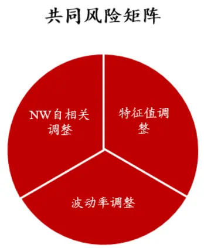
数据来源：财通证券研究所

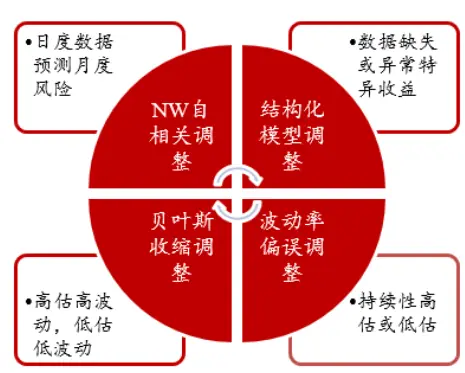

## 1.1 样本协方差矩阵的三个不足：运算大、不可逆、偏差大

在本文的开篇部分我们先来关注为何要采用结构化的方法对股票协方差矩阵进行估计，这主要是由于基于股票收益序列的样本协方差矩阵存在如下三点不足造成的：

首先，采用收益率的样本协方差进行估计的方法运算次数明显更大。假如要对 N只股票的协方差矩阵进行估计，那么就需要进行 $\frac{N(N{+}1)}{2}$ 次运算，而基于多因子模型的方法将 N只股票替换为 K个因子（其中 K≪ N），运算次数大大减少。当然在计算机运算能力发展到今天的时代，这样的运算次数也并非不可接受的。

其次，样本协方差矩阵通常并不可逆。在实际应用中，协方差矩阵通常被用于组合优化和风险控制中，对协方差矩阵进行求逆便是一个通用的操作。然而当股票数量N大于样本观测长度T时，简单协方差矩阵便是一个不满秩（not full rank）的矩阵，因此不能直接对其求逆操作，这使得其在实际应用中大打折扣。

最后，基于样本协方差矩阵的估计对于最优投资组合的风险预测存在较大偏差。Shepard（2009）指出，在正态性和平稳性的假设下，由于估计误差的存在，采用样本协方差矩阵得到的最优投资组合的风险通常会被低估，其模型估计值与真实风险之间的关系满足：

$$
\sigma_{true}\approx\frac{\sigma_{est}}{1-(N/T)}
$$

其中， $\sigma_{true}$ 表示最优投资组合的真实波动率， $\sigma_{est}$ 表示根据样本协方差矩阵估计得到的组合预测波动率，N表示股票数量，T表示样本观测数量。例如，当采用 100 个交易日数据来估计 50 只股票收益率的协方差矩阵时，最优投资组合的估计风险仅为真实风险的 1/2。

为了解这一关系的由来，我们先来明晰何为最优投资组合（optimal portfolio）。所谓最优投资组合，是指在相同期望收益的条件下，具有最小波动率的资产组合。用数学语言来表示，假设α为 N只股票的期望超额收益（N×1 向量），Ω为股票收益协方差矩阵（N×N矩阵），w 为股票的权重向量（N×1 向量），那么求解 w 的目标函数可以表示为：

$$
\mathop{min}_{w}w^{\prime}\Omega w,\qquad s.t.w^{\prime}\alpha=1
$$

如果采用拉格朗日乘数法对其进行求解，首先就需要构造拉格朗日函数：

$$
L(w)=w^{\prime}\alpha-1-\frac{1}{2}\lambda w^{\prime}\Omega w.
$$

其中，λ为调节参数，为方便起见将其值取为 1（注意，它的取值并不影响个股权重的相对大小）。将上式对 w 求偏导，即有：

$$
\cfrac{\partial L(\boldsymbol{w})}{\partial\boldsymbol{w}}=\boldsymbol{\alpha}-\cfrac{1}{2}\times2\times\boldsymbol{\Omega}\cdot\boldsymbol{w}=\boldsymbol{\alpha}-\boldsymbol{\Omega}\boldsymbol{w}=0.
$$

因此，最优投资组合的权重即为：

$$
w^{*}=\Omega^{-1}\alpha
$$

最优投资组合的风险即可以表示为：

$$
\Sigma^{2}={w^{*}}^{\prime}\Omega w^{*}
$$

Shepard（2009）认为，如果我们知道真实的协方差矩阵Ω，那么上面的估计将会是组合风险的良好估计。然而在实际应用中，我们只能够根据样本观测值对协方差矩阵Ω的真实分布进行估计（即Ω̂）。因此，根据估计得到的协方差矩阵Ω̂得到的最优投资组合的权重即可表示为：

$$
\widehat{w}\big(\widehat{\Omega}\big)=\widehat{\Omega}^{-1}\alpha
$$

由此可见，对于最优投资组合权重求解的准确性主要源于两个部分的估计准确性，其一是关于个股期望超额收益α的估计（一阶风险），其二为对真实协方差矩阵Ω的估计，此为二阶风险（Second Order Risk）。在传统的多因子研究中，我们更多关注对个股/组合/因子的收益预测，而忽略了对风险矩阵的估计。

那么二阶风险的存在对于最优投资组合的风险预测准确度到底有多大的影响呢？Shepard（2009）指出，如果收益率序列平稳且满足正态分布，那么样本协方差矩阵Ω̂将服从关于Ω的 Wishart 分布。根据 Wishart 分布的性质，即有：

$$
\begin{array}{c}{{E\left(\widehat{\Omega}^{-1}\right)=\displaystyle\frac{\widehat{\Omega}^{-1}}{\left(1-\displaystyle\frac{N-1}{T}\right)}}}\\{{E\left(\widehat{\Omega}^{-1}\Omega\widehat{\Omega}^{-1}\right)=T^{2}(T-1)[(T-N)(T-N-1)(T-N-3)]^{-1}\Omega^{-1}}}\\{{\approx\displaystyle\left(1-\displaystyle\frac{N}{T}\right)^{-3}\Omega^{-1}\approx\left(1-\displaystyle\frac{N}{T}\right)^{-2}E\left(\widehat{\Omega}^{-1}\right)}}\end{array}
$$

其中第二个和第三个近似分别忽略了 1/N和 1/T的微小影响得到的。

由此，对于最优投资组合（权重为 $\widehat{w}=\widehat{\Omega}^{-1}\alpha)$ 而言，其预测风险可表示为：

$$
E\bigl(\widehat{w}^{\prime}\widehat{\Omega}\widehat{w}\bigr)=\alpha^{\prime}E\bigl(\widehat{\Omega}^{-1}\widehat{\Omega}\widehat{\Omega}^{-1}\bigr)\alpha=\alpha^{\prime}E\bigl(\widehat{\Omega}^{-1}\bigr)\alpha
$$

而该组合的真实风险可以表示为：

$$
E\bigl(\widehat{w}^{\prime}\Omega\widehat{w}\bigr)=\alpha^{\prime}E\bigl(\widehat{\Omega}^{-1}\Omega\widehat{\Omega}^{-1}\bigr)\alpha\approx\biggl(1-\frac{N}{T}\biggr)^{-2}\alpha^{\prime}E\bigl(\widehat{\Omega}^{-1}\bigr)\alpha
$$

其中最后一个等式即可根据上面的推导得到。对上式两边同时取平方根，即可得到最优投资组合的实际波动与预测波动之间的比值：

$$
\sigma_{true}\approx\frac{\sigma_{est}}{1-(N/T)}
$$

证明完毕。

## 1.2 偏差统计量的含义及置信区间

在风险预测的研究中，我们通常采用偏差统计量来衡量风险测度的准确性。它可以通过如下两步计算得到，首先计算资 $产$ 组合收益率的样本外标准化收益：

$$
b_{t,q}=\frac{r_{t+q}}{\sigma_{t}}
$$

其中， $\sigma_{t}$ 表示资产在当前时刻t的预测风险， $r_{t+q}$ 表示从当前时刻t到t+q期间资产的收益率， $q$ 为预测时间长度，在我们的研究中通常将其取为21天。随后通过计算回测区间内样本外标准化收益的标准差，即为偏差统计量（bias statistics）：

$$
B=\sqrt{\frac{1}{T-1}\sum_{t=1}^{T}\bigl(b_{t}-\bar{b}_{t}\bigr)^{2}}.
$$

我们一直在强调偏差统计量实际上衡量的是实际风险与估计风险之间的比值。如果一个风险估计是完美的，那么它的偏差统计量应该恰好等于1。若偏差统计量大于1，则说明该组合的风险被低估；若偏差统计量小于1，则说明组合的风险被高估。但由于历史数据有限，即便对于完美的风险估计方法其偏差统计量也未必等于1，因此在收益率的正态分布假设下，我们认为偏差统计量的95%置信区间可以表示为：

$$
C_{t}=[1-\sqrt{2/T},1+\sqrt{2/T}]
$$

那么，为何完美风险预测方法的偏差统计量会等于1？为何偏差统计量衡量的是组合实际风险与预测风险之间的比值？偏差统计量的95%置信区间又是如何计算得到的呢？本部分财通金工试图介绍一下我们自己的思考。

假设收益率序列 $r_{t}$ 服从均值为 $\left(\mu\right.,$ ，标准差为 $\sigma_{t}$ 的正态分布： $r_{t}{\sim}N(\mu,{\sigma_{t}}^{2})$ ，那么对于一个准确估计其风险的测度 $\sigma_{t}而言$ ，其样本外标准化收益应该服从如下正态分布：

$$
b_{t}=\frac{r_{t}}{\sigma_{t}}\sim N\left(\frac{\mu}{\sigma_{t}},1\right),\quad b_{t}-\bar{b_{t}}\sim N(0,1).
$$

因此，如果风险测度是准确的，那么该样本外标准化收益 $.b_{t}$ 的标准差——偏差统计量应该等于1。同时我们也可看到，由于 $b_{t}-\bar{b}_{t}$ 服从标准 $1证$ 态分布，因此统计量 $(T-1)B^{2}$ 应该服从自由度为T的 $\chi^{2}$ 分布：

$$
(T-1)B^{2}{\sim}{\chi}^{2}(T)
$$

因此，偏差统计量B的95%置信区间即可表示为：

$$
\sqrt{\chi_{0.025}^{2}(T)/(T-1)}\leq B\leq\sqrt{\chi_{0.975}^{2}(T)/(T-1)}
$$

根据 $:\chi^{1}$ 2分布的特征，其95%置信区间可以近似地表示为：

$$
[1-\sqrt{2/T},1+\sqrt{2/T}]
$$

需要特别注意的是，此处的T并非波动率估计时回望的时间长度，而是回测区间内样本外收益序列的长度。例如当采用过去126天的日度收益的标准差来估计股票的日度风险时，若连续进行252天滚动估计，那么此时T的取值应为252。此时，95%置信度区间即可表示为：

$$
\begin{aligned}&\sqrt{\chi_{0.025}^{2}(T)/(T-1)}=0.9145,\quad\sqrt{\chi_{0.975}^{2}(T)/(T-1)}=1.0894,\\&1-\sqrt{2/T}=0.9109,\quad1+\sqrt{2/T}=1.0891\\\end{aligned}
$$

可以看到二者之间是非常近似的。

## 1.3 收益分布对偏差统计量的影响

在上一小节中我们所有关于偏差统计量的假设检验都是基于收益率分布服从正态分布的假设之上所做出的，然而现实中的股票收益率序列并不服从正态分布，而是服从“尖峰厚尾”分布，这也导致即便对于完美的风险预测方法来讲，采用现实数据的拟合并不一定就有95%的数据能够落在95%置信区间以内，本小节我们就来探讨收益率的不同分布对于偏差统计量能够落在 置信区间内概率的影响。

财通金工采用蒙特卡洛模拟法分别生成三个时间序列：a）均值为0，方差为0.2/252的正态分布；b)自由度为7的t分布；c)自由度为6/7+4的t分布。由于正态分布的偏度等于3，而t分布的偏度与其自由度v存在如下关系：

$$
k=\frac{6}{v-4}+3,v>4
$$

因此，以上三个收益率序列的峰度分别为a) k=3； b) k=5； c) k=10。对于每一个观测区间长度T（再次强调，此处的T并非指计算标准差时回望的天数），我们统一采用过去252天的滚动收益标准差作为第二天波动的预测值，对于每一个T值我们进行1000次蒙特卡洛模拟，它们分别对应1000个偏差统计量，最后再计算出这1000个偏差统计量落在 $[1-\sqrt{2/T},1+\sqrt{2/T}]$ 置信区间中的比例。

图2：不同收益分布下，偏差统计量落入95%置信区间内的比例
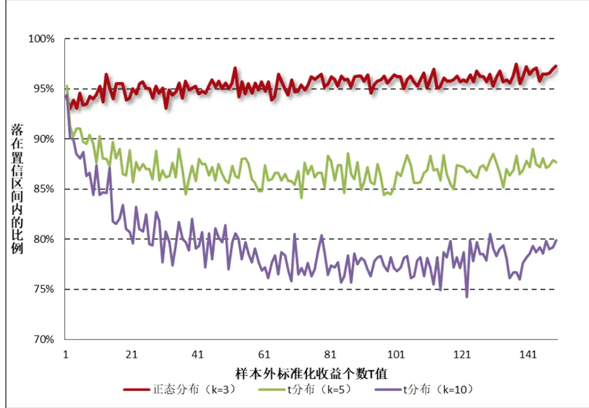
数据来源：财通证券研究所

图 2 展示了不同收益分布下，偏差统计量落入 95%置信区间内的比例。可以看到，如果收益率序列服从正态分布（k=3），那么对于所有的T值而言，偏差统计量落入到 95%置信度区间内的比例基本在 95%左右，这一点显然是合意的。随着收益分布的峰度逐渐变大，偏差统计量落入 95%置信区间内的比例逐步变小，对于 k=5 的分布其均值在 87%左右，对于 k=10 的分布其均值大概在80%左右。

由此我们认为，由于现实金融数据并不服从正态分布，我们应该允许计算得到的偏差统计量与 95%置信区间存在一定的偏离，而不能对其结果过于苛求。

## 1.4 指数移动加权平均 EWMA 调整

在将基本概念厘清后，我们开始讨论不同调整方法背后的逻辑。本部分我们先来关注共同风险矩阵的估计，传统的样本协方差矩阵估计法对所有数据点赋予相同的权重，然而由于市场变化较快且我们采用的历史数据较长，而近期数据对当前状态的影响比早期数据更大，因此我们采用指数移动加权平均（ExponentiallyWeighted Moving Average）的方法，对近期数据赋予更大的权重以增加它们对当前数据状态的影响，从而能够更及时地反映市场变化。在财通金工研究过程中，我们发现不少投资者对于半衰权重的计算存在疑虑，因此本部分我们对此进行较为详尽的阐述。

对于给定的一个T×1维收益率序列，采用简单的样本方差法计算其波动即是将收益率与其样本均值相减，再将其进行点乘并计算平均值，这实际上暗含着每个数据样本点的权重均为1/T的约束。然而对于半衰指数加权移动平均而言，我们假设当前时刻为 时刻，历史数据样本点（由远及近）分别为：

$$
a_{0},\quad a_{1},\quad a_{2},\quad\ldots,\quad a_{t-\tau},\quad\ldots,\quad a_{t-1},\quad a_{t}
$$

那么这些样本点对应的权重可以表示为：

$$
\lambda^{t},\ \lambda^{t-1},\lambda^{t-2},\ \ldots,\ \lambda^{\tau}{=}0.5,\ \ldots,\ \lambda^{t-1},\ \lambda^{0}=1
$$

其中， $\lambda=0.5^{1/\tau}$ ，τ为半衰期参数，它表示第 t− τ天的样本数据权重为当前日权重的 1/2（此处我们先假定当前日的数据权重为 1，之后再进行归一化）。图3 展示了当 h 取 252 天,半衰期取 90 天的时候，各个样本点的权重示意图。可以看到，当前时刻的数据权重为 1，当前时刻往前推 90 天时刻的样本点权重即衰减为当前的一半，这也就是“半衰”本身所代表的含义。需要注意的是，在最后计算的时候还需要对权重进行归一化，使得所有样本点权重之和等于 1。

图 3：不同时刻样本点权重
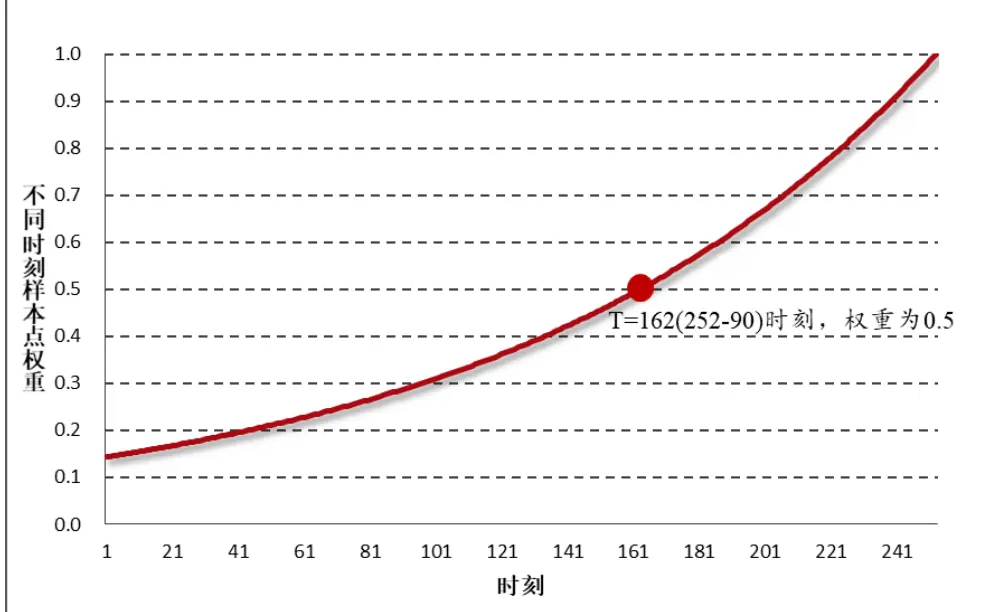
数据来源：财通证券研究所

要了解上式是如何推导的，我们首先来了解一下指数移动加权平均的含义，它在机器学习相关研究中也是非常基础的内容。假设 $.a_{k}$ 表示第k个数据，且 $.a_{0}=0$ 那么当前数据的取值即为历史数据与当前数据的加权平均，权重用 $\beta$ 表示：

$$
\begin{aligned}v_{0}&=a_{0}=0\\v_{1}=(1-\beta)a_{1}+\beta v_{0}&=(1-\beta)a_{1}\\v_{2}=(1-\beta)a_{2}+\beta v_{1}&=(1-\beta)a_{2}+(1-\beta)\beta a_{1}\\v_{3}=(1-\beta)a_{3}+\beta v_{2}=(1-\beta)a_{3}&+(1-\beta)\beta a_{2}+(1-\beta)\beta^{2}a_{1}\\&\vdots\\v_{t}=(1-\beta)a_{t}+\beta v_{t-1}&=(1-\beta)a_{t}+(1-\beta)\beta a_{t-1}+\cdots+(1-\beta)\beta^{t-1}a_{1}\\&=(1-\beta)[a_{t}+\beta a_{t-1}+\cdots+\beta^{t-1}a_{1}]\end{aligned}
$$

我们一般我们取 $\beta\geq0.9$ ，由等比数列的性质可知，当 t 趋向于无穷大的时候，所有数据的权重之和加起来趋近于 1：

$$
\operatorname*{lim}_{t\to\infty}\left(1+\beta+\cdots+\beta^{t-1}\right)=\operatorname*{lim}_{t\to\infty}\left({\frac{1-\beta^{t}}{1-\beta}}\right)={\frac{1}{1-\beta}}
$$

由上式可以看到，对于 $t{-}n$ 天的数据，其权重为 $\beta^{n}$ （暂时先忽略 $1-\beta$ 的系数）如果我们取半衰期为τ天，也就是说第 $t-\tau$ 天的样本数据权重为当前日的 1/2，那么即有 $[\beta^{\tau}=1/2$ ，因此 $\beta=0.5^{1/\tau}$ ，这一点恰好与我们前面提到的λ 值的计算完全相同。

在了解了各个样本数据点的权重之后，我们即可根据协方差的定义计算半衰指数加权平均处理过后的协方差矩阵。

$$
F_{kl}^{EWMA}=\sum_{s=t-h}^{t}\lambda^{t-s}\big(r_{k,s}-\bar{r}_{k}\big)\big(r_{l,s}-\bar{r}_{l}\big)/\sum_{s=t-h}^{t}\lambda^{t-s}
$$

其中， $r_{k,s}$ 表示因子k 在 s 期的收益， $\bar{r}_{k}$ 表示因子k 的收益在样本期内的指数加权平均，h 为样本时间长度。财通金工特别提醒投资者注意的是，在计算样本均值时需要计算指数加权平均而非简单平均，否则不能保证计算得到的协方差矩阵为半正定矩阵，从而影响后续特征值和特征向量的求解。

## 1.5 Newey-West 调整

样本协方差矩阵在经过指数加权移动平均处理后，下一步即进行Newey-West调整。持续关注财通金工多因子研究的投资者会看到，Newey-West调整不仅能够在多因子风险矩阵的自相关调整中发挥作用，后续还会频繁地出现在多因子选股研究中的因子有效性假设检验中，因此对这一步调整背后逻辑的理解十分必要，我们在本小节中对其进行探讨。

调整主要用于解决协方差矩阵估计中，数据的自相关性对数据协方差造成的影响。由于我们通常要对较长时间（如1个月）的风险进行预测，而我们之前的估计是采用股票日度收益数据来进行计算的，因此由日度数据转换成月度数据的时候就需要考虑到数据的自相关性，Newey-West调整在这一步的时候就发挥了其作用，具体来讲：

$$
F^{NW}=21\times\left(F^{EWMA}+\sum_{\Delta=1}^{D}\left(1-\frac{\Delta}{D+1}\right)\left(C_{+\Delta}^{(d)}+C_{-\Delta}^{(d)}\right)\right)
$$

其中， $F^{EWMA}$ 是根据日度数据经EWMA调整后计算得到的样本协方差矩阵，D表示总的滞后时间阶数， $C_{+\Delta}^{(d)}$ 表示的是t期数据与t-∆期数据之间的协方差，其具体关系如下：

$$
\begin{array}{r}{C_{kl,+\Delta}^{(d)}=cov(r_{k,t-\Delta},r_{l,t}),}\\{C_{kl,-\Delta}^{(d)}=cov(r_{k,t},r_{l,t-\Delta}),}\\{C_{+\Delta}^{(d)}={C_{-\Delta}^{(d)}}^{\prime}\quad}\end{array}
$$

由上述公式可以很直观地看到， $F_{kl}^{EWMA}$ 衡量的是t时刻因子k收益与t时刻因子l收益之间的协方差（步调一致），而 $C_{kl,+\Delta}^{(d)}$ 主要衡量的是 $t-\Delta$ 时刻因子k收益与t时刻因子l收益之间的协方差（步调相差∆阶），这也是Newey-West调整之所以可以处理序列自相关性的关键原因，很容易可以看到 $C_{+\Delta}^{(d)}$ 和 $rC_{-\Delta}^{(d)}$ 矩阵互为转置矩阵。

为了更加直观地理解序列自相关性给序列协方差计算带来的影响，我们仍然采用蒙特卡洛模拟的方法来进行说明。为理解的方便，我们以方差的计算为例进行说明，协方差的计算原理完全相同。假设一个服从正态分布N $I(0,0.2^{2})$ 的日度收益序列 $|r_{t}|$ ，那么 $r_{t}$ 的波动率即为0.2。假设新生成的序列存在一阶自相关性，且自相关系数为0.9，那么新生成的序列即可以表示为：

$$
\begin{aligned}{r_{t}\sim}&{{}N(0,0.2^{2})}\\{}&{{}y_{1}=r_{1}}\\{y_{t+1}}&{{}=0.9y_{t}+r_{t+1}.}\\\end{aligned}
$$

图4：新生成的一条路径中的时序图
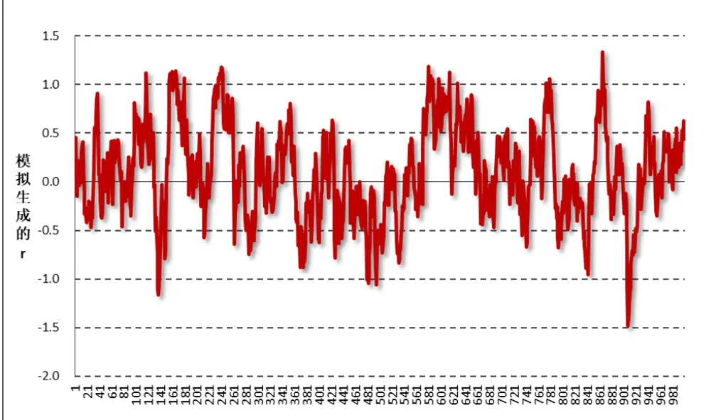
数据来源：财通证券研究所

图 展示了我们随机生成的序列 $y_{t}$ 中的其中一条，可以看到 $y_{t}$ 存在非常明显的自相关性：当上期数据较大时，下期数据也倾向于更大；当上期数据较小时，下期数据也倾向于更小。与我们模型中日度收益扩展为月度收益相类似的，我们可以认为 $r_{t}$ 是我们可以观察到的日度收益数据， $而y_{t}$ 是我们观察不到的月度收益数据。我们在实际计算中，仅可计算出 $r_{t}$ 的波动率（接近0.2），但是我们模拟生成的 $y_{t}$ 的波动率却远大于0.2。

现在我们来进行1000次模拟，每一次模拟过程中我们生成的 $r_{t}$ 和 $y_{t}$ 序列均为1000×1维向量，并且维持 $r_{t}$ 服从N(0,0.22)的分布。每次模拟过程中，我们可以计算生成的 $y_{t}$ 序列的波动率，其结果如图5中的横坐标所示。如果我们只根据观测得到的 $r_{t}$ 计算方差，那么得到的方差估计应该仅在0.2上下波动，这样的拟合效果就会变得很差。但是根据Newey-West调整方法，对序列的自相关性进行调整后，计算得到的波动率与序列真实的波动率之间的拟合效果就非常好了。实际上，图5中我们取D=1对其进行NW调整，二者之间的相关系数达到了0.99。

图5：模拟生成的y 方差与根据Newey-West调整计算的方差
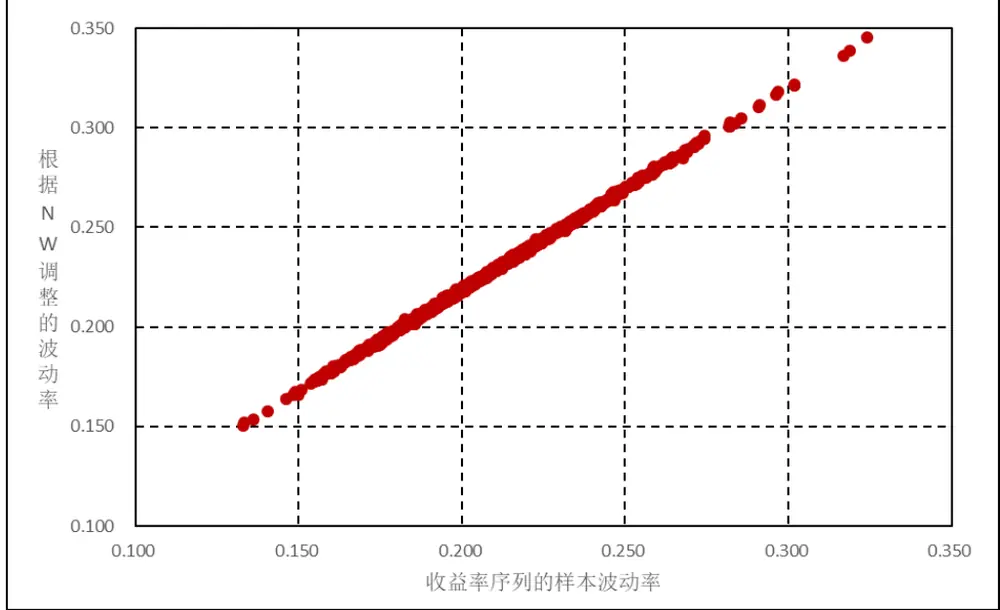
数据来源：财通证券研究所

最后需要说明的一点是，Newey-West对于协方差矩阵估计中自相关调整的最大贡献在于估计中权重（或叫核函数） $\begin{array}{r}{\left(1-\frac{\Delta}{D+1}\right)}\end{array}$ 的引入，正是由于这一权重的引入确保了估计出来的协方差矩阵仍然是一个半正定矩阵。

## 1.6 特征值调整的逻辑和原理

在共同因子风险矩阵中，特征值调整（Eigenfactor Risk Adjustment）是最关键也最为有效的一步。特征值调整主要针对样本协方差矩阵低估样本内低风险组合波动、高估样本内高风险组合波动的问题，同时对最优投资组合的风险预测也能起到有效的调整，其详细操作可参见财通金工“星火”系列（二）《Barra模型进阶：多因子风险预测》，本文仅就其背后的原理进行阐述。

所谓样本协方差矩阵“低估低波动、高估高波动”问题，即是指样本协方差矩阵对样本内低波动特征组合的未来波动预测存在明显低估、对样本内高波动特征组合的未来波动预测存在明显高估的问题。具体来讲，对简单样本协方差矩阵进行特征值分解，即有：

$$
D_{0}=U_{0}^{\prime}V_{0}U_{0}
$$

其中， $U_{0}$ 是一个N×N的正交矩阵， $U_{0}$ 的第k列即为第k个特征组合的权重向量，其满足权重平方和等于1的约束，且第k个特征组合的样本内波动即为对角矩阵 $D_{0}$ 中对角线上第k个元素的平方根。如果 $.D_{0}$ 中对角线上元素是由小到大进行排列的，那么 $U_{0}$ 中第1列对应的特征组合可被认为是满足资产组合权重平方和等于1的所有组合中波动率最小的组合，而第N列特征组合即是满足资产组合权重平方和等于1的所有组合中波动率最大的组合（Menchero，2011）。

现在我们再来深入了解一下特征值分解的含义，这一步对于后续蒙特卡洛模拟部分的理解非常重要。根据协方差矩阵的计算公式：

$$
V_{0}=\frac{rr^{\prime}}{T-1}
$$

其中，r表示股票的日度收益率矩阵 $(N\times T)$ 。如果我们将 $D_{0}$ 也视为N只股票收益率序列f的协方差矩阵，那么这N只股票的收益率序列之间应该满足互相正交、且第k只股票的收益率方差即为 $D_{0}$ 对角线上第k个元素：

$$
\stackrel{\circ}{D_{0}}=\frac{ff^{\prime}}{T-1}
$$

由此，我们有：

$$
\frac{ff'}{T-1}=\frac{U_{0}'rr'U_{0}}{T-1}=\frac{U_{0}'r(U_{0}'r)'}{T-1}
$$

由于 $U_{0}$ 为正交矩阵，因此其转置的逆矩阵即为矩阵本身。因此，原始股票的收益率矩阵r可以表示为N只收益率序列相互正交的股票收益矩阵f经过特征向量矩阵 $U_{0}$ 旋转而得到的：

$$
r=U_{0}f
$$

图6：特征组合偏误统计量（调整前）
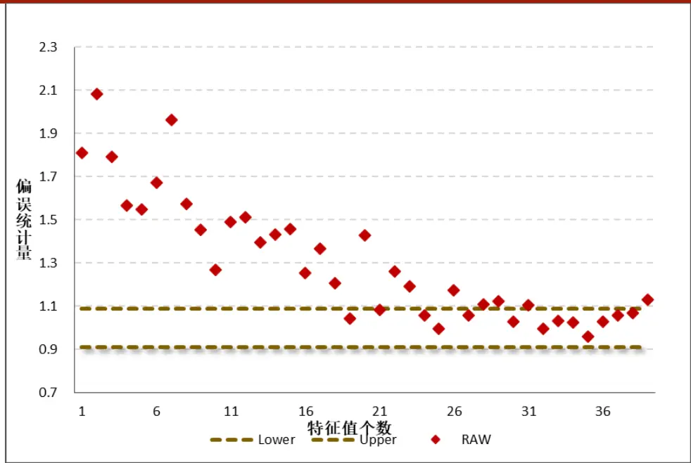
数据来源：财通证券研究所，“星火”专题（二）

图 将所有特征组合的样本内风险由小到大进行排列，绘制出各个特征组合的偏差统计量。可以看到，对于样本内低波动的特征组合（偏左侧组合）而言，其偏差统计量明显大于1；而对于样本内高波动的特征组合（偏右侧组合）而言，其偏差统计量则更接近于95%置信区间以内。由此，我们即需要对样本协方差矩阵进行特征值调整，以尽可能地消除这一影响，而调整的目的即是通过蒙特卡洛模拟的方法来试图模拟出各个特征组合的偏误统计量到底与1之间存在多大的偏差。具体来讲：

首先对样本协方差矩阵 $.V_{0}$ 进行特征值分解，得到特征矩阵 $U_{0}$ 和特征值矩阵 $.D_{0}.$ 此处我们先假设样本协方差矩阵 $\cdot V_{0}$ 即为真实的协方差矩阵，那么我们可以通过蒙特卡洛模拟随机生成一组收益率序列 $f_{m}$ （N×T矩阵），其每一行服从均值为0，方差为 $D_{0}$ 对应的对角线元素的正态分布。由于 $f_{m}$ 的每一行之间没有相关性，因此可以认为它们互相之间是正交的。由此，将特征向量权重与收益率序列相乘，即可得到组合的收益率序列：

$$
r_{m}=U_{0}f_{m}
$$

我们先来理解一下 $f_{m}$ 和 $r_{m}$ 分别代表什么含义。我们可以将每一个特征因子组合看作是一只股票，那么根据特征因子组合的样本内方差生成的收益率矩阵 $f_{m}$ 的第k行即可看作是第k只股票在每一个时刻的收益率序列，且这些收益率序列之间是互相正交的。由前面的分析可以知道，将这N只股票的收益率序列经过特征值矩阵 $U_{0}$ 进行旋转，即可认为得到了原始N只股票的收益率序列 $\boldsymbol{r}_{m^{\circ}}$ 对模拟生成的原始个股收益率矩阵 $r_{m}$ （N×T矩阵）计算其样本协方差 $.V_{m}$ ，即可得到原始矩阵 $.V_{0}$ 的无偏估计：

$$
E(V_{m})=V_{0}
$$

这是因为：

$$
E(V_m)=E\left(\frac{r_m\cdot r_m'}{T-1}\right)=E\left(\frac{U_0f_mf_m'U_0'}{T-1}\right)=E\left(\frac{U_0(T-1)D_0U_0'}{T-1}\right)=E(U_0D_0U_0')=V_0
$$

对模拟生成的样本协方差矩阵进行特征值分解，即有：

$$
D_{m}=U_{m}^{T}V_{m}U_{m}
$$

其中， $U_{m}$ 表示模拟生成的特征因子组合，这些特征因子组合的预测风险即为 $D_{m}$ 。由于我们前述假定了 $V_{0}$ 即为我们已知的真实风险，因此这些特征因子组合的“实际风险”可以表示为:

$$
\widetilde{D}_{m}=U_{m}^{T}V_{0}U_{m}
$$

因此， $\widetilde{D}_{m}$ 对角线上的元素与 $D_{m}$ 对角线上的元素的比值即为模拟特征因子组合的实际风险与预测风险之间的偏差，如果该偏差显著大于1说明低估了组合的未来风险，因此要对协方差矩阵的值进行放大；如果该偏差显著小于1，说明高估了组合的未来风险，因此要对协方差矩阵的值进行缩小。

$$
\lambda(k)=\sqrt{\frac{1}{M}{\sum_{m=1}^{M}\frac{\widetilde{D}_{m}(k)}{D_{m}(k)}}}.
$$

其中，M表示模拟的次数，λ(k)即反映出第k个特征组合的真实风险与预测风险之间的比值，即模拟偏差。

图7：模拟风险偏差统计量均值及分位数（调整前）
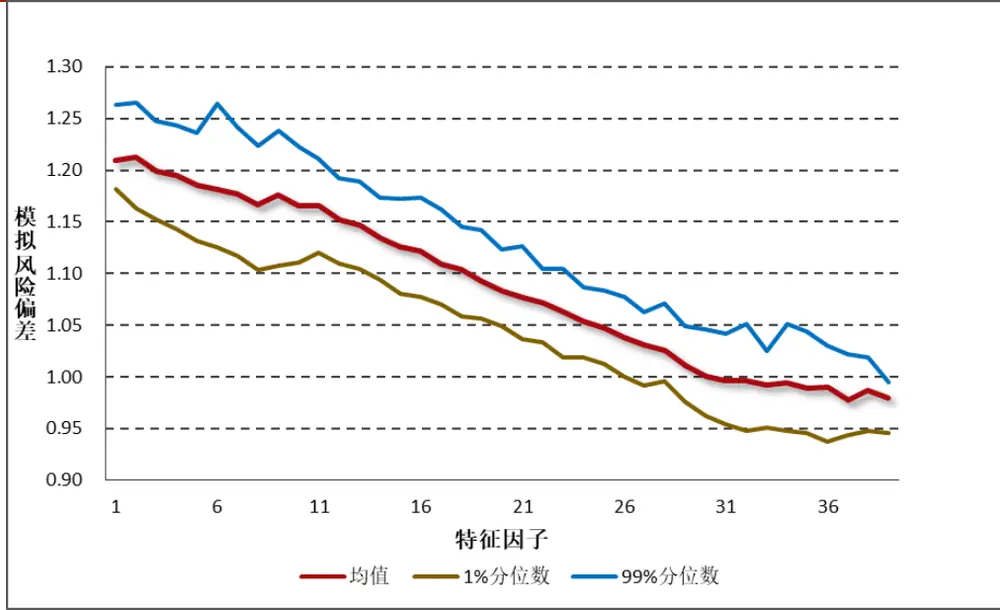
数据来源：财通证券研究所，“星火”专题（二）

图 反映了调整前的模拟偏差的均值及 和 分位数，可以看到其分布基本与特征组合的偏误保持一致。通过对低估组合的风险进行适当放大、对高估组合的风险进行适当缩小，即可得到更为准确的协方差矩阵。图8和图9分别展示了调整后的特征组合偏差统计量和最优投资组合的偏差统计量，可以看到特征值调整的效果十分明显，调整后的组合偏差统计量基本落在了95%置信区间以内。

图8：特征组合偏差统计量（调整后）
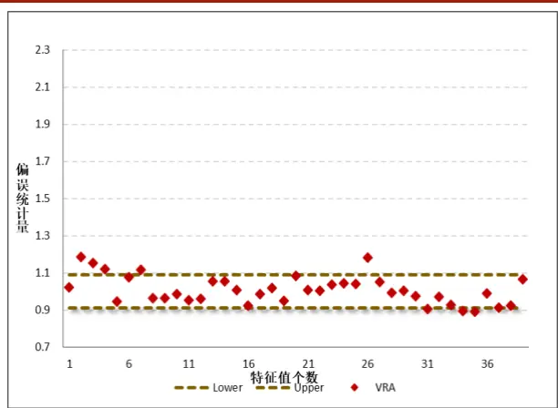
数据来源：财通证券研究所，“星火”专题（二）

图9：最优投资组合偏差统计量（调整前后对比）
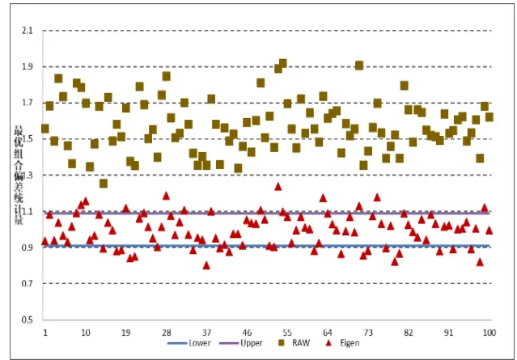
数据来源：财通证券研究所，“星火”专题（二）

## 1.7 特质风险结构化模型调整

在特质风险的计算中，我们假定股票特质风险与共同因子风险互不相关，且股票与股票之间的特质风险互不影响，因此单只股票的特质风险全由其历史特质收益序列计算得到。 然而对于上市不久、长期停牌和存在较大异常值的特质收益序列来讲，直接采用特质收益的历史波动率进行拟合将存在较大的问题，结构化模型（Structural Model）的引入正是用于解决数据存在缺失值和异常值的问题。

首先我们来看如何分辨数据质量的好坏，这主要是由协调参数γ来衡量，具体来讲：

$$
\gamma=\gamma_{1}\times\gamma_{2}=[min(1,max(0,\frac{h-60}{120}))]\times[min(1,max(0,exp(1-Z_{u})))]
$$

其中， 表示历史区间内股票特质收益存在数据（即不存在缺失）的个数。很容易看到，γ是一个0-1之间的参数，它用于衡量数据质量的优劣。γ值越接近于1说明数据质量越好，γ值越接近于0说明数据质量堪忧。其中 $\gamma_{1}$ 用于衡量数据完整度，如果过去252个交易日内有至少180个交易日有特质收益值 $\left(h\geq180时\right)$ ），说明数据较为完整， $\gamma_{1}$ 值为1。同样的， $\gamma_{2}$ 用于衡量数据异常值的存在对数据质量的影响， $Z_{u}$ 用于衡量特质收益的肥尾程度，当 $Z_{u}\leq$ 1时，说明数据异常值的存在对数据的影响不大， $\gamma_{2}=1$ 。现在我们来看一下该指标的计算方法：

$$
Z_{u}=\left|\frac{\sigma_{u,eq}-\tilde{\sigma}_{u}}{\tilde{\sigma}_{u}}\right|,
$$

其中， $\tilde{\sigma}_{u}=(1/1.35)*(Q_{3}-Q_{1})$ 是指特质收益的稳健标准差， $Q_{3}和Q_{1}$ 分别表示该股票特质收益序列的3/4和1/4分位数。之所以将两个分位点之差除以1.35作为序列的稳健标准差，是因为对于标准正态分布N(0,1)而言，其3/4分位数和1/4分位数分别为0.6745和-0.6745，二者的差值接近于1.35。假设时间序列服从正态分布 $\boldsymbol{V}(\boldsymbol{\mu},\sigma^{2})$ ，那么通过如上方法计算得到的稳健标准差即为σ。

当序列中存在异常值时，由于分位数对异常值相对没有那么敏感，因此序列的稳健标准差不会改变太大，而对于序列的简单标准差而言就会显著地增大。当简单标准差 $\sigma_{u,eq}$ 远大于稳健标准差 $\tilde{\sigma}_{u}$ 时，说明序列中存在较多异常值，此时 $z_{u}$ 将会显著大于1，从而导致 $\gamma_{2}小$ 于1。另外值得注意的是，由于指数函数的值域永远是大于0的，因此 $\mathrm{i}\gamma_{2}$ 的计算中 $max\left(0,exp(1-Z_{u})\right)$ 的表示方法实际上是略显累赘的，财通金工猜想之所以这样表示，是为了在形式上与前一部分的格式保持一致。

图10：标准正态分布1/4和3/4分位数示意图
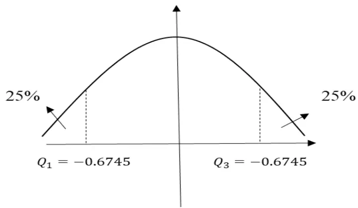
数据来源：财通证券研究所

在根据γ系数将全样本数据划分为数据质量较好和数据质量较差的两个样本池之后，接下来的工作即对数据质量较差的股票特质风险进行结构化填充，其主要思想是对于数据质量较差的股票A而言，在数据质量较好的股票池中找到与该股票具有相似特征的股票B，并将A股票的特质风险向B股票的特质风险靠拢。这种结构化是思想同样可以应用到数据缺失值的填充中，财通金工在“拾穗”系列（6）《因子缺失值处理：数以多为贵》中对此有详细介绍，感兴趣的投资者可以参考阅读。

图11：结构化模型示意图
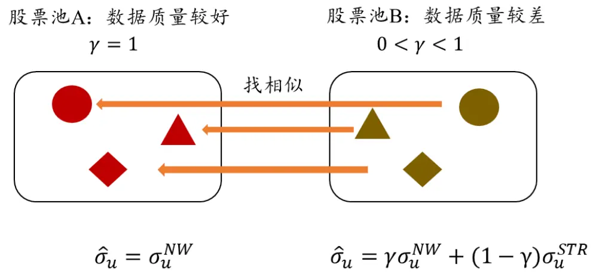
数据来源：财通证券研究所

## 1.8 特质风险贝叶斯压缩调整

贝叶斯压缩调整（Bayesian Shrinkage），是针对经指数移动平均、Newey-West调整以及结构化模型调整过后的矩阵对样本外特质风险存在“高估高波动、低估低波动”问题的修正。实际上，除了基于多因子模型的协方差矩阵估计之外，和Wolf（2003）两位学者相继提出的各种基于收益率序列的压缩矩阵估计法也是实际投资者使用比较广泛且计算相对简便、效果较好的方法（以下简称 方法），他们的估计方法也就是将简单样本协方差矩阵向先验协方差矩阵进行压缩，从而得到协方差矩阵的稳健估计。因此本小节我们针对多因子模型中的贝叶斯压缩调整进行简要介绍，在财通金工的后续研究中我们还将陆续探讨基于多因子模型的协方差矩阵估计以及基于 和 提出的压缩矩阵估计之间的优劣比较，欢迎感兴趣的投资者持续关注。

LW方法是将样本协方差矩阵 $\cdot\Sigma_{Sample}$ 和目标风险矩阵（或先验风险矩阵）$\Sigma_{Target}$ 的线性组合作为协方差矩阵的稳健估计：

$$
\Sigma_{Shrink}=\lambda\Sigma_{Target}+(1-\lambda)\Sigma_{Sample}
$$

其中， $0<\lambda<1$ ，它衡量的是协方差矩阵向目标风险矩阵压缩的强度。$\Sigma_{Sample}$ 是真实协方差矩阵的无偏估计量，但其估计方差较大； $\Sigma_{Target}$ 则是真实协方差矩阵的有偏估计量，但其估计方差较小。因此，二者的线性组合能够在一定程度上对二者的缺点进行中和。通常的目标风险矩阵有单位矩阵、平均相关系数矩阵和CAPM单因素协方差矩阵等，此处我们不做过多展开，留待后续专题进行介绍。

在多因子模型的贝叶斯收缩调整中，其主要思想是将单只股票的特异风险向其所在的市值分组的市值加权平均风险压缩：

$$
\begin{aligned}\sigma_{n}^{Shrink}&=v_{n}\bar{\sigma}(s_{n})+(1-v_{n})\hat{\sigma}_{n}\\\bar{\sigma}(s_{n})&=\sum_{n\in S_{n}}w_{n}\hat{\sigma}_{n}\end{aligned}
$$

其中， $\bar{\sigma}(s_{n})$ 即为贝叶斯先验风险矩阵（也就是上面提到的目标风险矩阵或者压缩目标矩阵），它表示股票所在的市值分组的市值加权平均， $v_{n}$ 为压缩密度。

所谓先验风险矩阵，即是指在给定任何其他附加条件之前，凭借我们主观的认知，我们认为单只股票的特质风险将会更加接近于哪些值。因此，如上的调整事实上隐含了股票的特质风险与其市值存在着强相关性的假定。正是因为具有相似市值的股票的特质风险将更为接近，我们才会将个股的特质风险向其所在的市值分组平均靠拢。图 展示了回测区间段内，不同市值分组下的特质风险市值加权平均，其中D1表示市值最小的分组，D10表示市值最大的分组。可以看到市值最大的前面两组的特质风险明显更小，而D1-D8组之间的分化则没有那么明显。

图12：不同市值分组下特质风险市值加权平均（月度化）
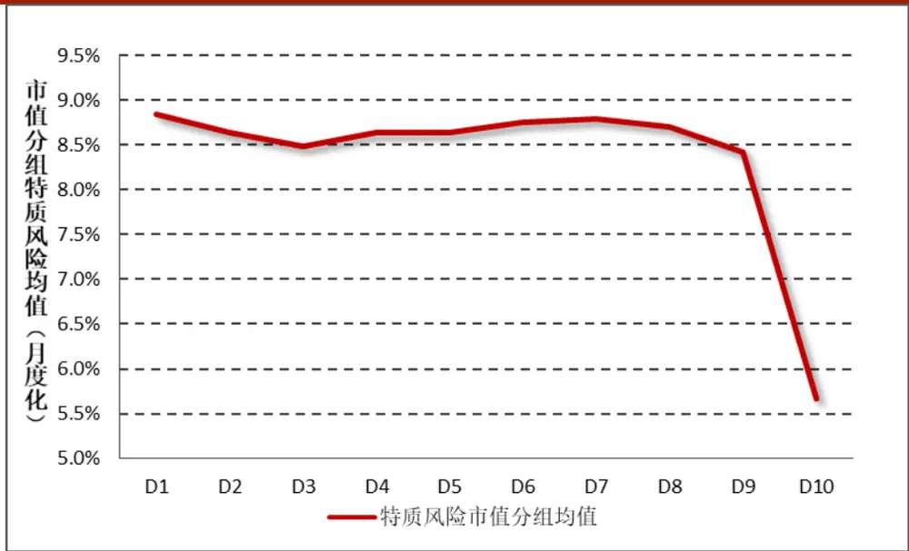
数据来源：财通证券研究所，Wind

最后我们讨论一下压缩密度 $v_{n}$ 的估计，它衡量的是个股特质风险与其所在的市值分组中的市值加权特质风险均值的偏离程度。如果个股特质预测风险越偏离其所在的市值分组平均风险时，压缩密度 $v_{n}$ 将会越大，压缩后的预测风险将更多地向其先验风险 $\bar{\sigma}(s_{n})$ 靠拢：

$$
\begin{aligned}v_{n}&=\frac{q|\hat{\sigma}_{n}-\bar{\sigma}(s_{n})|}{\Delta_{\sigma}(S_{n})+q|\hat{\sigma}_{n}-\bar{\sigma}(s_{n})|}\\\Delta_{\sigma}(S_{n})&=\sqrt{\frac{1}{N(S_{n})}\sum_{n\in S_{n}}\left(\hat{\sigma}_{n}-\bar{\sigma}(s_{n})\right)^{2}}\end{aligned}
$$

其中， $q$ 为压缩系数，通常根据经验对其进行赋值。在“星火”系列（二）《Barra模型进阶：多因子风险预测》中，我们将其值置为1，但是在Barra USE4文档中，该值取的是0.1。那么对于该值究竟如何设置呢？我们通过 $.q^{\prime}$ 值的选取对于压缩密度 $v_{n}$ 的取值影响作为参考。

图13展示了当q值分别取为0.1和1的时候，对于某一个截面期所有股票的压缩密度 $v_{n}$ 值的取值影响，此处我们将股票的压缩密度由小到大进行排序，可以看到 $q.$ 取值为1时，同一股票的 $v_{n}$ 值明显要比q取0.1时更大。当q取0.1时， $v_{n^{1}}$ 值最大为0.4，而 $q_{1}$ 取1时， $v_{n}$ 最大达到了0.85。由于 $v_{n^{\prime}}$ 值衡量的是先验风险矩阵所占的权重大小，我们认为股票的特质风险还是应该更多地取决于根据自己的历史数据计算得到的数据，而非结构化的市值加权平均数据，因此 $v_{n}$ 的取值应当适当地小一点，所以q取0.1值也有其合理的解释。

图13：压缩系数的不同取值对于压缩密度的影响
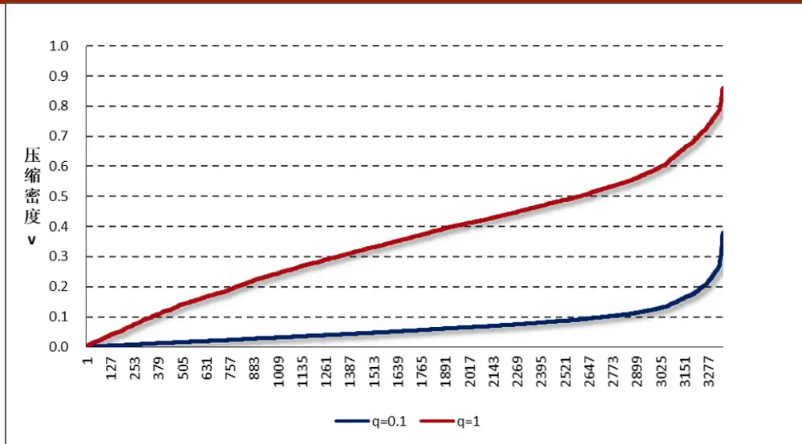
数据来源：财通证券研究所，Wind

## 1.9 小结

本期“拾穗”系列专题，我们就多因子模型协方差矩阵估计中的很多模糊的细节展开探讨，主要结论如下：

1）样本协防差矩阵估计存在三点不足：运算大、不可逆、偏差大，基于多因子的协方差矩阵估计可以针对这些问题发挥用武之地；

2）最优投资组合是指在相同期望收益的条件下，具有最小波动率的资产组合。对最优投资组合权重求解的准确性主要取决于对期望超额收益的估计（一阶风险）和对真实协方差矩阵的估计（二阶风险）；

3）在收益率满足正态分布的假设下，偏差统计量衡量的是实际风险与预测风险之间的比值。然而由于金融数据服从“尖峰厚尾”分布，因此即便对于完美的预测方法而言，也很难做到偏差统计量等于1；

4）收益率的分布对于偏差统计量落入其置信区间内的概率存在影响，随着收益分布的峰度逐渐变大，落入95%置信区间的概率逐渐减小；

5）基于多因子的写方差矩阵估计可以分为共同风险矩阵和特异风险矩阵的估计，前者要经过自相关、特征值和波动率偏误调整，后者要经过自相关、结构化、贝叶斯压缩和波动率偏误调整几个步骤；

6）Newey-West调整主要用于解决协方差矩阵估计中股票收益的自相关性，财通金工通过蒙特卡洛模拟法探究其原理；

7）特征值调整的主要逻辑在于通过蒙特卡洛模拟法来试图刻画各个特征组合的偏差统计量与1之间的偏差，并根据这一偏差进行放大或缩小调整；

8）特质风险中贝叶斯压缩调整的主要思想是将单只股票的特质风险向其所在的实质分组的市值加权平均风险压缩，实证检验发现股票特质风险与其市值之间存在强相关关系，市值越大，股票的特质风险越小。

## 2、 一周行情回顾

上周市场大小盘分化明显，大盘价值股明显占优，而小盘成长股的表现明显逊色。上周上证 50 指数和沪深 300 价值指数分别上涨 1.81%和 1.74%，在所有样本指数中排名前二，而创业板综和中证 1000 指数分别录得-2.79%和-2.61%的收益，在所有指数中跌幅最大。

图14：上周主要指数收益（2019.4.26-2019.4.30）
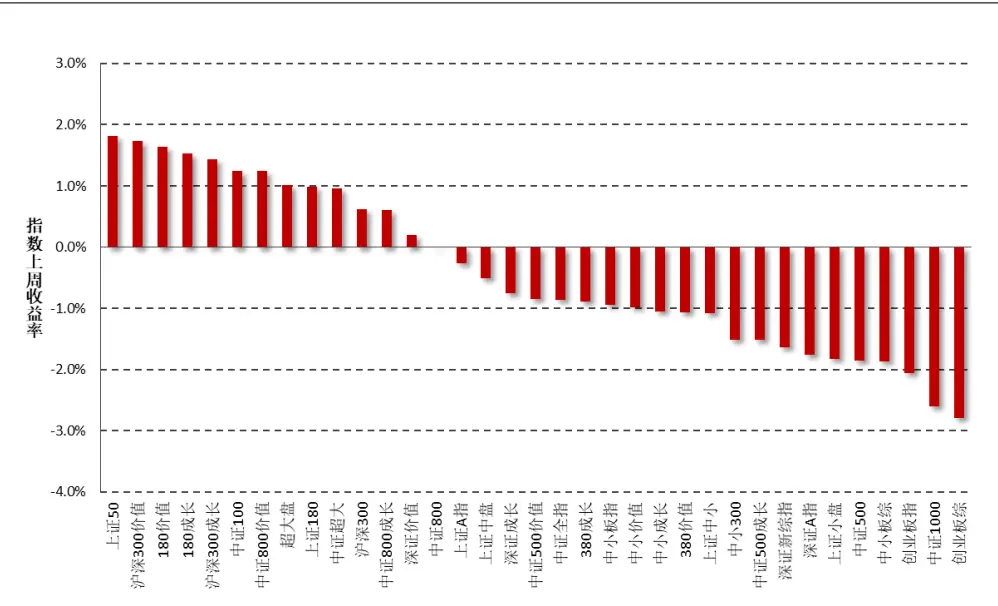
数据来源：财通证券研究所，Wind

行业方面，在所有 29 个中信一级行业中，银行和食品饮料分别上涨 2.06%、和 1.86%，而通信和计算机行业则分别下跌 6.45%和 3.85%，跌幅最大。

图15：上周中信一级行业指数收益（2019.4.26-2019.4.30）
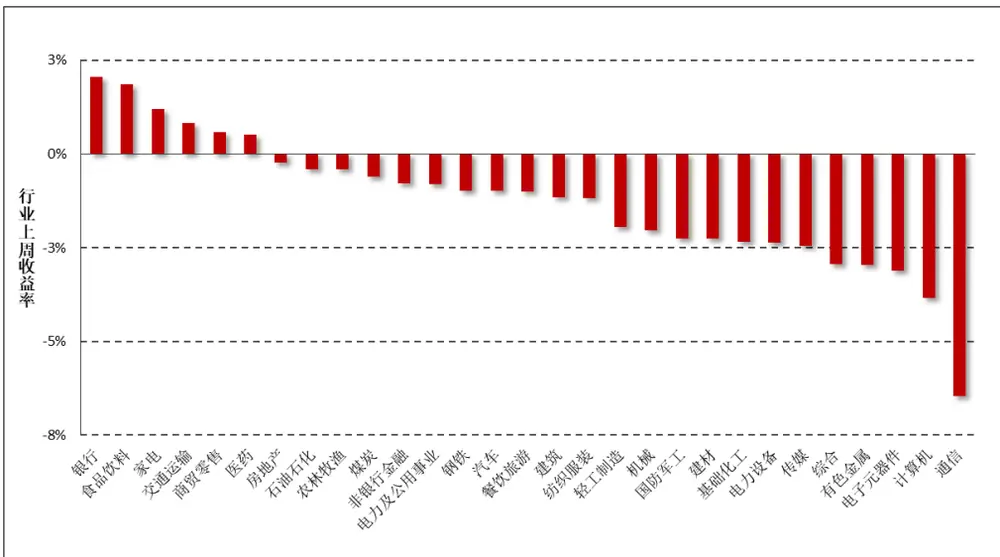
数据来源：财通证券研究所，Wind

## 3、 市场风格解析及指数风险预测

财通金工借鉴 模型，选取 、规模、动量、波动率、非线性规模、BP、流动性、盈利、成长和杠杆率因子构建收益-风险归因模型，因子定义及计算细节参见附录二。本部分通过对近期风格因子的收益表现进行分析以期捕捉 A股市场的风格变化，同时对财通金工样本指数的未来一月风险进行预测来分析当前 A 股市场所处的风险水平。风格因子的收益拆解可参见财通金工专题报告《Barra 模型初探：A股市场风格解析》，资产组合的风险预测可参见财通金工专题报告《Barra 模型进阶：多因子模型风险预测》。

## 3.1 市场风格解析

各类风格因子在上周的累计收益可分为日度累计收益和周度收益两种，日度累计收益是根据风格因子的日度收益计算得到，周度收益是将股票在本周的收益率对股票在上周最后一个交易日的因子暴露度进行回归得到的因子纯净收益，二者之间的区别在于换仓频率的不同，前者为每日换仓，而后者在每周最后一个交易日换仓。

表 1 和图 16 展示了上周各类风格因子的累计收益和周度收益大小，可以看到，二者十分近似。本周大盘股表现强制，规模因子录得较大正收益，同时波动率和流动性因子则收获较大的负收益。

表1：上周纯风格因子收益（2019.4.29-2019.4.30）

| 日期 | Beta | 规模 | 长期动量 | 波动率 | 非线性规模 | BP | 流动性 | 盈利 | 成长 | 杠杆 |
| --- | --- | --- | --- | --- | --- | --- | --- | --- | --- | --- |
| 2019/4/29 | -0.39% | 0.99% | 0.21% | -0.83% | -0.14% | -0.51% | -0.45% | 0.42% | 0.22% | -0.34% |
| 2019/4/30 | 0.12% | -0.32% | 0.25% | -0.06% | 0.02% | 0.21% | -0.17% | 0.03% | -0.01% | 0.06% |
| 上周累计收益 | -0.27% | 0.67% | 0.46% | -0.89% | -0.12% | -0.30% | -0.62% | 0.45% | 0.21% | -0.28% |
| 周度收益 | -0.29% | 0.70% | 0.45% | -0.88% | -0.12% | -0.29% | -0.60% | 0.38% | 0.13% | -0.26% |
| 前一周度收益 | -0.38% | 0.31% | 0.91% | -0.50% | 0.04% | -0.27% | -0.67% | -0.08% | 0.16% | -0.21% |

数据来源：财通证券研究所，Wind

图 16：近两周纯风格因子收益比较（2019.4.19-2019.4.30）
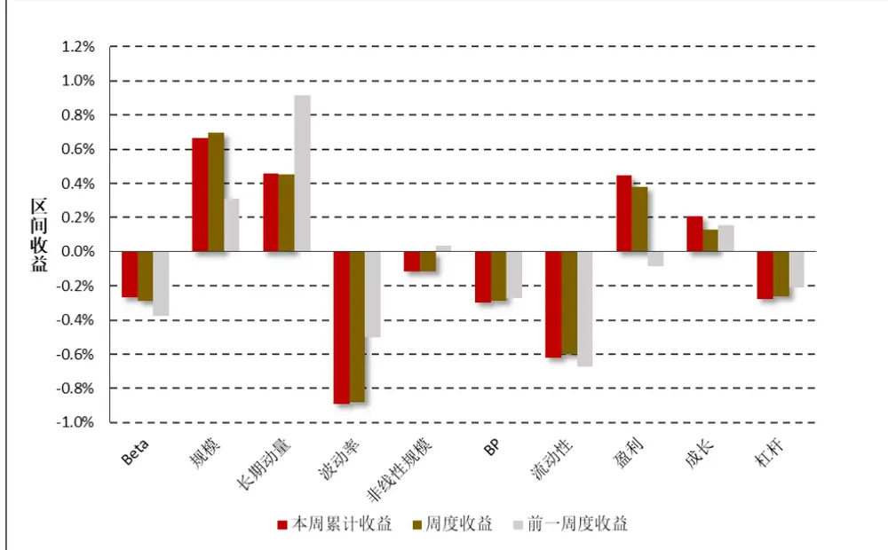
数据来源：财通证券研究所,Wind

图17：最近一个月风格因子净值走势（2019.3.28-2019.4.30）
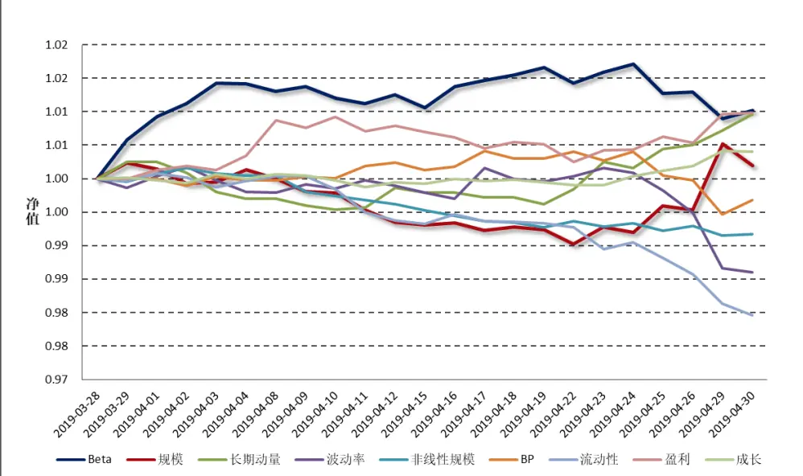
数据来源：财通证券研究所，Wind

图 和图 分别展示了最近一个月各类风格因子的净值走势及累计收益，以观察各类风格因子在过去一段时间的持续盈利能力。整体来讲，在过去的一个月中，高 Beta、前期涨幅较高的股票能够获得相对较高的收益，而高换手、高波动的股票后市将会出现较为明显的回撤。

图18：最近一个月风格因子累计收益（2019.3.28-2019.4.30）
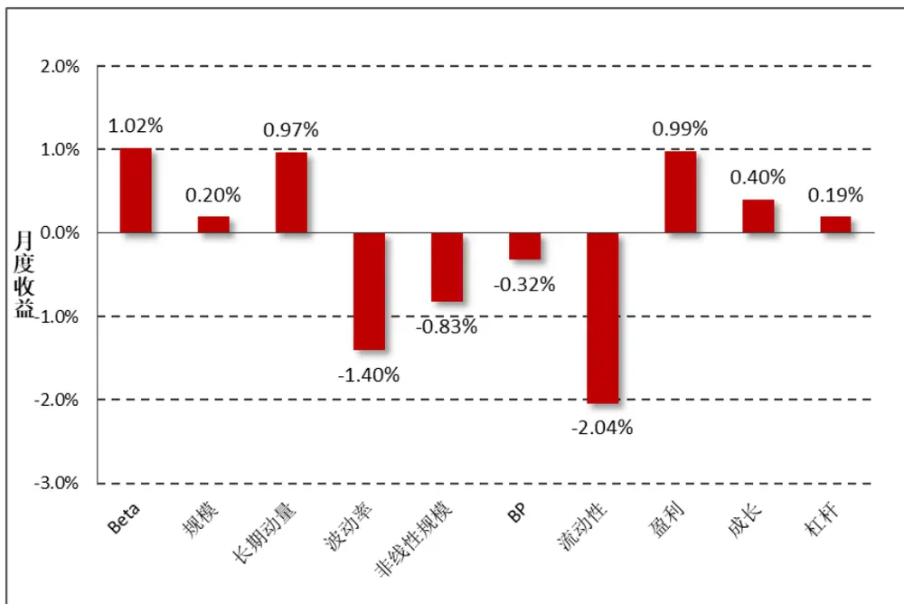
数据来源：财通证券研究所，Wind

## 3.2 指数风险预测

对收益的分解仅代表过去，对风险的预测才代表未来。多因子模型风险预测将股票风险拆解为共同风险和特质风险两部分，在通过稳健调整对共同风险矩阵和特质风险矩阵进行估计后，即可根据指数的成分股权重来估计指数在未来一段时间的波动情况。为了保证结果的严谨性，此处我们直接采用 Wind 提供的成分股权重数据，而非根据自由流通市值计算得到，尽管二者的结果十分类似。

$$
Risk(P)=W^{\prime}VW=W^{\prime}(X^{\prime}FX+\Delta)W
$$

图 19 展示了财通金工样本指数在未来一个月的预测波动率，为了方便展示我们将估计的月度波动率进行年化，波动的预测时间为上周最后一个交易日（2019.4.30）。可以看到，所有样本指数未来一月的年化波动区间在 23%-33%之间，预测波动相较上一周出现非常明显的攀升，财通金工特别提醒投资者注意当前市场波动情况，对后市维持谨慎观点。中小板股票、成长类指数的风险较大，而偏大盘股票、价值类股票的风险普遍较小。

图19：财通金工样本指数未来一月波动预测（年化）（2019.4.30-2019.6.3）
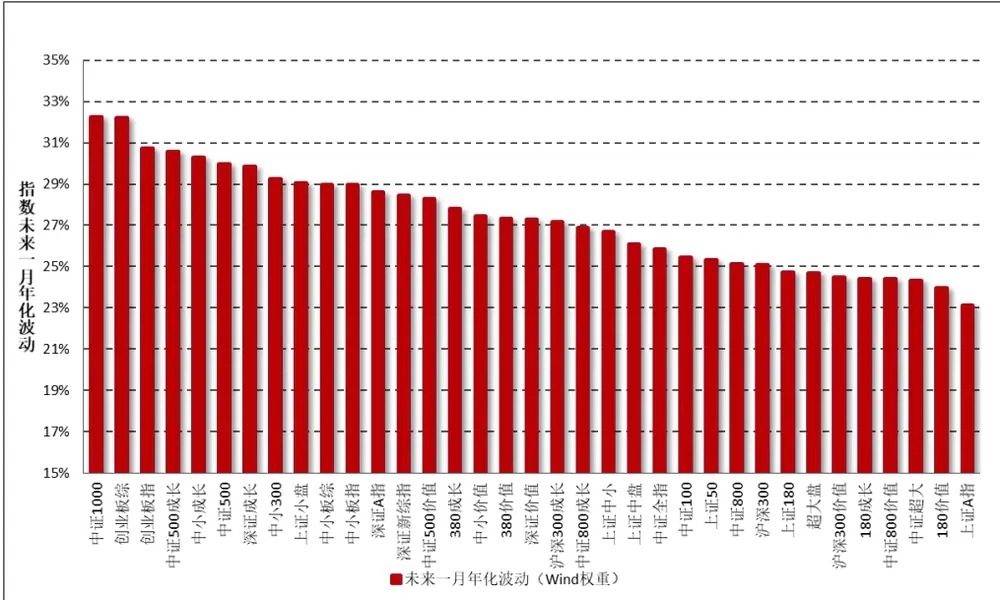
数据来源：财通证券研究所，Wind

由于在计算股票的风格因子时，我们会对暂停上市的股票、大类因子值存在缺失的股票进行剔除，因此在进行收益归因和风险预测时，并非所有指数成分股都纳入到了模型中，如果缺失股票个数过多或者缺失股票的权重占比过大，将会对模型结果造成较大影响。图 20 展示了各大指数在模型拟合过程中，纳入考虑的股票个数（权重）占指数成分股个数（权重）的比例，可以看到所有指数的比例均在 92%以上，数据质量的拟合较为合意。

图20：收益回归/风险预测样本股票占指数成分股比率
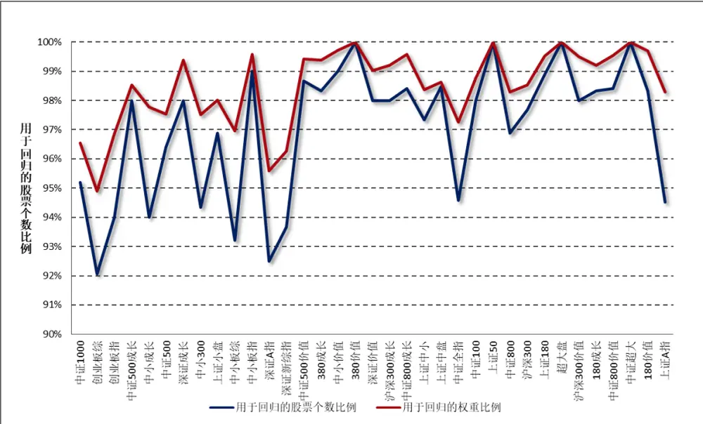
数据来源：财通证券研究所，Wind

## 4、 指数成分收益归因：

本部分财通金工对上周表现最好的三只指数和表现最差的三只指数进行归因分析，以观察涨幅较高（或较低）的指数风险暴露是否展现出较高的趋同性以及两类指数的持股风格是否会表现出明显的差别，其结果如图 21 和图 22 所示。

图21：上周表现最好三指数因子暴露度
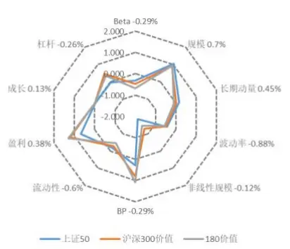
数据来源：财通证券研究所，Wind

图22：上周表现最差三指数因子暴露度
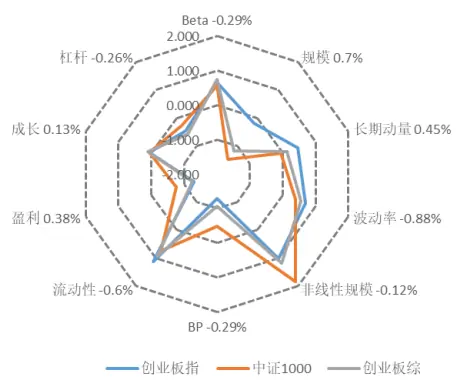
数据来源：财通证券研究所，Wind

表 2 展示了各大指数上周在各类因子上的暴露程度，可以看到，上周市场风格以大盘指数为主，表现最好的三只指数是大市值指数，其在规模因子上的较大暴露和在波动及非线性规模因子上的较低暴露帮助其获得稳健收益，而表现较差的三只指数则更多地偏向于中小市值股票，其在非线性规模因子上的较大暴露和在规模因子上的极小暴露拖累指数收益。

表2：指数在风格因子上的暴露程度（2019.4.30）

| 代码 | 指数名称 | Beta -0.29% | 规模 0.7% | 长期动量 0.4 | 波动率 -0.88 | 非线性规模 | - BP -0.29% | 流动性-0.6% | 盈利 0.38% | 成长 0.13% 杠 | 杆 -0.26% 实 | 际收益 |
| --- | --- | --- | --- | --- | --- | --- | --- | --- | --- | --- | --- | --- |
| 000016.SH | 上证50 | -0.325 | 1.050 | 0.159 | -0.430 | -1.832 | 0.295 | -0.180 | 0.691 | -0.027 | -0.034 | 1.81% |
| 000919.CSI | 沪深300价值 | -0.472 | 0.899 | 0.015 | -0.493 | -1.276 | 0.802 | -0.268 | 1.207 | -0.007 | 0.455 | 1.74% |
| 000029.SH | 180价值 | -0.685 | 0.940 | -0.099 | -0.561 | -1.460 | 1.079 | -0.440 | 1.308 | -0.011 | 0.343 | 1.64% |
| 000028.SH | 180成长 | -0.257 | 0.888 | 0.300 | -0.101 | -1.230 | -0.358 | 0.000 | 0.337 | 0.184 | -0.025 | 1.53% |
| 000918.SH | 沪深300成长 | 0.280 | 0.778 | 0.339 | -0.033 | -0.838 | -0.882 | 0.445 | 0.059 | 0.165 | -0.063 | 1.44% |
| 000903.SH | 中证100 | -0.060 | 1.031 | 0.154 | -0.305 | -1.688 | 0.049 | -0.012 | 0.514 | -0.022 | 0.009 | 1.25% |
| H30356.CSI | 中证800价值 | -0.184 | 0.659 | 0.031 | -0.439 | -0.765 | 0.648 | -0.071 | 0.982 | -0.067 | 0.466 | 1.25% |
| 000043.SH | 超大盘 | -0.192 | 1.061 | -0.154 | -0.343 | -1.928 | 0.278 | -0.022 | 0.445 | -0.117 | -0.099 | 1.01% |
| 000010.SH | 上证180 | -0.109 | 0.832 | 0.133 | -0.279 | -1.066 | 0.149 | 0.039 | 0.446 | -0.005 | 0.048 | 0.99% |
| 000980.CSI | 中证超大 | -0.174 | 1.058 | -0.090 | -0.311 | -1.882 | 0.285 | -0.197 | 0.524 | -0.093 | 0.065 | 0.96% |
| 000300.SH | 沪深300 | 0.131 | 0.763 | 0.150 | -0.148 | -0.821 | -0.105 | 0.230 | 0.226 | 0.023 | 0.036 | 0.62% |
| H30355.CSI | 中证800成长 | 0.411 | 0.463 | 0.271 | 0.017 | -0.256 | -0.785 | 0.573 | 0.003 | 0.141 | -0.008 | 0.61% |
| 399348.SZ | 深证价值 | 0.498 | 0.502 | 0.356 | 0.131 | -0.345 | -0.311 | 0.639 | 0.214 | -0.034 | 0.223 | 0.20% |
| 000906.SH | 中证800 | 0.222 | 0.385 | 0.114 | -0.079 | -0.128 | -0.129 | 0.323 | 0.072 | 0.019 | 0.039 | 0.01% |
| 000002.SH | 上证A指 | -0.178 | 0.261 | -0.003 | -0.099 | -0.352 | 0.247 | -0.089 | 0.224 | -0.032 | 0.069 | -0.26% |
| 000044.SH | 上证中盘 | 0.274 | 0.446 | 0.085 | -0.010 | 0.290 | -0.108 | 0.426 | 0.012 | 0.034 | 0.193 | -0.51% |
| 399346.SZ | 深证成长 | 0.832 | 0.298 | 0.211 | 0.418 | 0.113 | -1.018 | 0.979 | -0.683 | -0.120 | 0.022 | -0.75% |
| H30352.CSI | 中证500价值 | 0.334 | -0.753 | 0.022 | -0.290 | 2.028 | 0.615 | 0.398 | 0.495 | -0.091 | 0.398 | -0.84% |
| 000985.CSI | 中证全指 | 0.288 | -0.253 | 0.072 | 0.087 | 0.348 | -0.252 | 0.430 | -0.207 | 0.020 | -0.073 | -0.86% |
| 000117.SH | 380成长 | 0.236 | -0.766 | -0.003 | 0.098 | 1.880 | -0.520 | 0.653 | -0.006 | -0.048 | -0.037 | -0.89% |
| 399005.SZ | 中小板指 | 0.710 | 0.157 | -0.003 | 0.284 | 0.682 | -1.005 | 0.801 | -0.683 | 0.150 | -0.252 | -0.95% |
| 399604.SZ | 中小价值 | 0.431 | -0.333 | 0.130 | 0.279 | 1.090 | -0.380 | 0.572 | -0.060 | -0.003 | -0.141 | -0.98% |
| 399602.SZ | 中小成长 | 0.748 | -0.045 | -0.121 | 0.460 | 0.743 | -1.000 | 0.876 | -0.622 | -0.009 | -0.144 | -1.05% |
| 000118.SH | 380价值 | 0.069 | -0.869 | -0.037 | -0.223 | 1.973 | 0.663 | 0.167 | 0.752 | -0.066 | 0.474 | -1.06% |
| 000046.SH | 上证中小 | 0.312 | -0.072 | 0.046 | 0.050 | 0.992 | -0.083 | 0.474 | -0.104 | -0.003 | 0.182 | -1.08% |
| 399008.SZ | 中小300 | 0.608 | -0.329 | -0.019 | 0.358 | 1.159 | -0.868 | 0.791 | -0.719 | 0.088 | -0.269 | -1.51% |
| H30351.CSI | 中证500成长 | 0.708 | -0.700 | -0.055 | 0.168 | 2.019 | -0.367 | 0.880 | -0.133 | 0.061 | 0.045 | -1.51% |
| 399100.SZ | 深证新综指 | 0.568 | -0.603 | 0.066 | 0.299 | 0.849 | -0.601 | 0.621 | -0.591 | 0.058 | -0.200 | -1.64% |
| 399107.SZ | 深证A指 | 0.527 | -0.617 | 0.116 | 0.378 | 0.850 | -0.658 | 0.771 | -0.650 | 0.102 | -0.244 | -1.76% |
| 000045.SH | 上证小盘 | 0.363 | -0.756 | -0.005 | 0.129 | 1.920 | -0.049 | 0.537 | -0.258 | -0.052 | 0.167 | -1.83% |
| 000905.SH | 中证500 | 0.525 | -0.776 | 0.003 | 0.139 | 2.014 | -0.211 | 0.629 | -0.406 | 0.001 | 0.064 | -1.86% |
| 399101.SZ | 中小板综 | 0.457 | -0.733 | -0.064 | 0.412 | 1.070 | -0.752 | 0.579 | -0.775 | 0.056 | -0.348 | -1.87% |
| 399006.SZ | 创业板指 | 0.658 | -0.177 | 0.468 | 0.700 | 1.030 | -1.287 | 1.144 | -1.295 | 0.054 | -0.461 | -2.05% |
| 000852.SH | 中证1000 | 0.553 | -1.485 | -0.056 | 0.389 | 1.844 | -0.489 | 0.746 | -0.759 | 0.052 | -0.255 | -2.61% |
| 399102.SZ | 创业板综 | 0.746 | -1.179 | 0.123 | 0.552 | 1.183 | -1.063 | 0.935 | -1.251 | 0.117 | -0.558 | -2.79% |

数据来源：财通证券研究所，Wind

## 【参考文献】

[1] Second Order Risk. Shepard Peter, 2009, Working Paper

[2] Eigen-Adjusted Covariance Matrices. Menchero Jose, Jun Wang, D.J. Orr, 2011, MSCI Research Insight

[3] Honey, I Shrunk the Sample Covariance Matrix. Olivier Ledoit, Michael Wolf, 2003, Journal of Portfolio Management.

[4] A simple, positive semi-definite, heteroskedasticity and autocorrelation consistent covariance matrix. Newey W.K. and K.D. West. 1987. Econometrica

## 5、 附录

附录二：财通金工风格因子定义

| 大类因子 | 子类因子 | 因子定义及计算 | 权重 | 备注 |
| --- | --- | --- | --- | --- |
| Beta | BETA | $\mathbf{r_{t}}=\alpha+\beta\mathbf{R_{t}}+\mathbf{e_{t}},$ 将单只股票过去252天的日度收益率对流通市值加权指数日度收益率进行半衰指数加权回归，半衰期为63天 | 1 | 1) 采用流通市值而非总市值加权，因为各大指数编制采用流通市值加权；2) 需要剔除当日停牌或者未上市日期的数据，并将权重进行归一化；3) 若满足条件的样本数据少于42天，我们将其 Beta 置为 NaN。 |
| 规模 | SIZE | 股票总市值取对数 | 1 | 由于PB、PE等因子的计算是基于总市值的，因此此处也用总市值 |
| 动量 | RSTR | 过去一段时间个股的累计收益率，不含最近一个月， $\begin{array}{r}{\mathrm{RSTR}=\sum_{\mathrm{t}=\mathrm{L}}^{\mathrm{T}+\mathrm{L}}\mathrm{w}_{\mathrm{t}}(\ln(1+\mathrm{r}_{\mathrm{t}}),}\end{array}$ $\mathrm{r}_{\mathrm{t}}=\mathrm{P}_{\mathrm{t}}/\mathrm{P}_{\mathrm{t}-1}-1,\quad\mathrm{T}=504,\quad\mathrm{L}=21,$ 收益率序列采用半衰指数加权，半衰期为126天 | 1 | 1)对于数据质量较好的个股，计算动量时采用了2年的数据2) 需要剔除未上市日期数据，但无需剔除停牌日期数据，并将权重归一化3)若满足条件的数据样本小于42天，我们将其动量置为NaN |
| 波动率(对Beta因子和市值因子进行正交化处理) | DASTD | 个股相对市值加权指数的超额收益率序列的半衰指数加权标准差，T=252，半衰期为42天1/2 $\mathrm{DASTD}=\left(\sum_{\mathrm{t}=1}^{\mathrm{T}}\mathrm{w}_{\mathrm{t}}\left(\mathrm{r}_{\mathrm{t}}-\mu(\mathrm{r})\right)^2\right)^{\frac{1}{2}}$ | 0.7 | 1) 采用流通市值加权计算指数收益2) 需要剔除当日停牌或者未上市日期的数据，并将权重进行归一化3) 若满足条件的数据样本小于42天，我们将其因子值置为NaN |
|  | CMRA | 表示过去12个月的波动幅度， $\begin{array}{r}{\mathrm{CMRA}=\ln(1+\operatorname*{max}\{\mathrm{Z(T)}\})-\ln(1+\operatorname*{min}\{\mathrm{Z(T)}\}),}\end{array}$ $\begin{aligned}Z(T)=\exp(\sum_{t=1}^{T}\ln(1+r_{t}))-1\quad&\\去T个月的收益率\end{aligned}$ ，表示过 | 0.15 | 以 21 天为 1 个月 |
|  | HSIGMA | 计算 Beta 时残差的标准差， $\mathrm{Hsigma}=\mathrm{std}(e_{i})$ | 0.15 | 同 Beta 因子的计算 |
| 非线性规模 | NonLinerSize | 中市值因子，将股票总市值对数的三次方对总市值对数回归，取残差的相反数 | 1 | 用于衡量市值因子的非线性性，总市值越大和越小的股票的非线性规模越小，中市值股票的非线性规模越大 |
| 估值 | BP | 市净率的倒数，1/PB | 1 | 采用 Wind 中的 pb_lf 因子的倒数 |
| 流动性(对市值因子进行正交化） | STOM | 月度换手率， $\mathrm{STOM}=\ln(\mathrm{mean}(\sum_{t=1}^{21}(V_t/S_t)))$ 其中V为当日成交量，S为流通股本 | 0.5 | 1)采用流通股本值，而非自由流通股本值2)剔除未上市、停牌日期的数据 |
|  | STOQ | 季度换手率， $\mathrm{STOQ}=\ln(\mathrm{mean}(\sum_{t=1}^{63}(V_t/S_t))),$ | 0.25 | 同 STOQ 因子的计算 |
|  | STOA | 年度换手率， $\mathrm{STOA}=\ln(\mathrm{mean}(\sum_{t=1}^{252}(V_t/S_t)))$ | 0.25 | 同 STOQ 因子的计算 |
| 盈利 | CETOP | 过去滚动12个月的经营现金流除以当前市值实际计算中取市现率 PCF（经营现金流 TTM）的倒数 | 1/2 | 采用 Wind 中的 PCF_OCF_ttm 因子的倒数 |
|  | ETOP | 过去滚动12个月的利润除以当前市值实际计算中取市盈率 PETTM 的倒数 | 1/2 | 采用 Wind 中的 PE_ttm 因子的倒数 |
| 成长 | YOYProfit | 单季度净利润同比增长率 | 1/2 | 为避免使用未来数据，需要根据季报公布时间进行调整 |
|  | YOYSales | 单季度营业收入同比增长率 | 1/2 | 同 YOYProfit 因子的计算 |
| 杠杆 | MLEV | 市场杠杆率，MLEV=（总市值+非流动负债）/总市值 | 1/3 |  |
|  | DTOA | 资产负债率，DTOA=总资产/总负债 | 1/3 |  |
|  | BLEV | 账面杠杆率，BLEV=（账面价值+非流动负债）/账面价值 | 1/3 |  |

数据来源：财通证券研究所
备注：1.波动率因子需对Beta因子和市值因子进行正交化处理；
流动性因子需对市值因子进行正交化处理；

若大类因子下所有子类因子值全部缺失，则该股票的因子值记为缺失，否则用有数据的因子值进行替代，注意需对权重进行归一化处理

## 信息披露

## 分析师承诺

作者具有中国证券业协会授予的证券投资咨询执业资格，并注册为证券分析师，具备专业胜任能力，保证报告所采用的数据均来自合规渠道，分析逻辑基于作者的职业理解。本报告清晰地反映了作者的研究观点，力求独立、客观和公正，结论不受任何第三方的授意或影响，作者也不会因本报告中的具体推荐意见或观点而直接或间接收到任何形式的补偿。

## 资质声明

财通证券股份有限公司具备中国证券监督管理委员会许可的证券投资咨询业务资格。

## 公司评级

买入：我们预计未来 6个月内，个股相对大盘涨幅在 15%以上；

增持：我们预计未来 6个月内，个股相对大盘涨幅介于 5%与 15%之间；

中性：我们预计未来 6个月内，个股相对大盘涨幅介于-5%与 5%之间；

减持：我们预计未来 6个月内，个股相对大盘涨幅介于-5%与-15%之间；

卖出：我们预计未来 6个月内，个股相对大盘涨幅低于-15%。

## 行业评级

增持：我们预计未来 6个月内，行业整体回报高于市场整体水平 5%以上；

中性：我们预计未来 6个月内，行业整体回报介于市场整体水平-5%与5%之间；

减持：我们预计未来 6个月内，行业整体回报低于市场整体水平-5%以下。

## 免责声明

本报告仅供财通证券股份有限公司的客户使用。本公司不会因接收人收到本报告而视其为本公司的当然客户。

本报告的信息来源于已公开的资料，本公司不保证该等信息的准确性、完整性。本报告所载的资料、工具、意见及推测只提供给客户作参考之用，并非作为或被视为出售或购买证券或其他投资标的邀请或向他人作出邀请。

本报告所载的资料、意见及推测仅反映本公司于发布本报告当日的判断，本报告所指的证券或投资标的价格、价值及投资收入可能会波动。在不同时期，本公司可发出与本报告所载资料、意见及推测不一致的报告。

本公司通过信息隔离墙对可能存在利益冲突的业务部门或关联机构之间的信息流动进行控制。因此，客户应注意，在法律许可的情况下，本公司及其所属关联机构可能会持有报告中提到的公司所发行的证券或期权并进行证券或期权交易，也可能为这些公司提供或者争取提供投资银行、财务顾问或者金融产品等相关服务。在法律许可的情况下，本公司的员工可能担任本报告所提到的公司的董事。

本报告中所指的投资及服务可能不适合个别客户，不构成客户私人咨询建议。在任何情况下，本报告中的信息或所表述的意见均不构成对任何人的投资建议。在任何情况下，本公司不对任何人使用本报告中的任何内容所引致的任何损失负任何责任。

本报告仅作为客户作出投资决策和公司投资顾问为客户提供投资建议的参考。客户应当独立作出投资决策，而基于本报告作出任何投资决定或就本报告要求任何解释前应咨询所在证券机构投资顾问和服务人员的意见；

本报告的版权归本公司所有，未经书面许可，任何机构和个人不得以任何形式翻版、复制、发表或引用，或再次分发给任何其他人，或以任何侵犯本公司版权的其他方式使用。