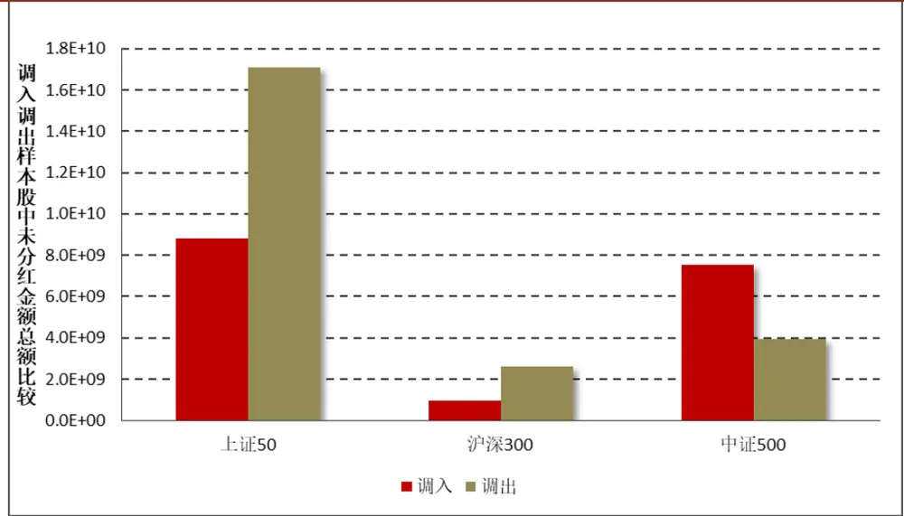
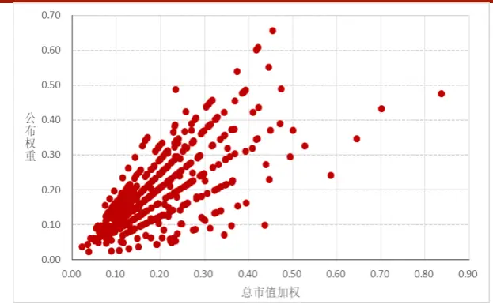
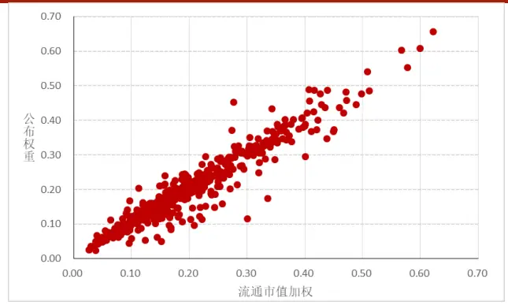
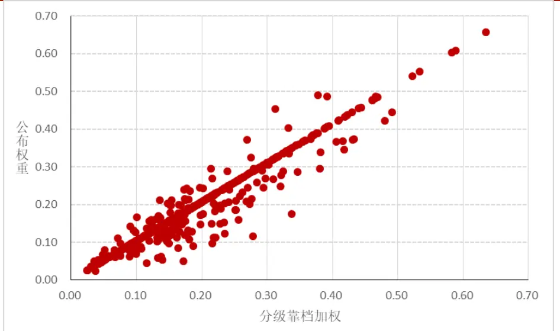

# 2019 年 06 月 19 日 权重复刻：指数成分股调整，分红点位测算更新

## “拾穗”多因子系列报告（第 12 期）

## 联系信息

陶勤英分析师

SAC 证书编号：S0160517100002 021-68592393

taoqy@ctsec.com

张宇研究助理

zhangyu1@ctsec.com 021-68592337

176216888421

## 相关报告

【1】“星火”多因子系列（一）：《Barra模型初探：A 股市场风格解析》

【2】“星火”多因子系列（二）：《Barra模型进阶：多因子模型风险预测》

【3】“星火”多因子系列（三）：《Barra模型深化：纯因子组合构建》

【4】“星火”多因子系列（四）：《基于持仓的基金绩效归因：始于 Brinson，归于 Barra》【5】“星火”多因子系列（五）：《源于动量，超越动量：特质动量因子全解析》

【6】“拾穗”多因子系列（一）：《带约束的加权最小二乘：一种解析解法》

【7】“拾穗”多因子系列（二）：《你看到的不一定是你所想的：解密 R方》

【8】“拾穗”多因子系列（三）：《行业因子选取：中信一级还是申万一级？》

【9】“拾穗”多因子系列（四）：《总市值、流通市值、自由流通市值：谈谈取舍》

【10】“拾穗”多因子系列（五）：《数据异常值处理：比较与实践》

【11】“拾穗”多因子系列（六）：《因子缺失值处理：数以多为贵》

【12】“拾穗”多因子系列（七）：《从纯因子组合的角度看待多重共线性》

【13】“拾穗”多因子系列（八）：《非线性规模因子：A 股市场存在中市值效应吗？》

【14】“拾穗”多因子系列（九）：《牛市抢跑者：低 Beta一定低风险吗？》

【15】“拾穗”多因子系列（十）：《行业的风格偏好：解析纯行业因子》

【16】“拾穗”多因子系列（十一）：《多因子风险预测：从怎么做到为什么》请阅读最后一页的重要声明

## 投资要点：

## 指数成分股调整、权重数据并未进行同步更新

2019 年 6月 17 日上证 50、沪深 300、中证 500 指数的成分股发生调整，但对应的成分股权重并未进行同步更新。

- 由于在指数编制过程中，对成分股的分红派息，指数不加任何修正，因此我们观察到的基差中实际上蕴含了成分股分红造成的影响。对于采用对冲策略和股指期货套利的投资者而言，计算剥离了分红影响后的真实基差，对实际操作中的多空方向选择意义重大。

- 财通金工将对股指期货的基差与剥离掉分红点位之后的真实基差进行每日跟踪，有需要的投资者可与我们直接联系。

## 不同市值对权重计算的偏差并不相同

- 直接采用总市值加权与官方公布的权重数据差异极大，采用流通市值与总市值结合的分级靠档加权法与中证指数公司公布的数据最为接近。

## 股指期货分红点位测算基本步骤

- 分红对股指期货影响的测算可简单分为如下几个步骤：（1）估计各成分股净利润（2）估计各成分股分红总额（3）预测分红时间（4）估计分红点位

## 分红点位最新结果

- 最新的分红预测结果显示，上证 50 的 7 月合约观察到的基差为-21.54 点（贴水）、考虑到分红影响的基差为 14.4 点（升水），沪深 300 的 7 月合约观察到的基差为-24.14 点（贴水）、考虑到分红影响的基差为 11.19 点（升水）。

- 风险提示：本报告统计结果基于历史数据，过去数据不代表未来，市场风格变化可能导致模型失效。

在实际投资中，多因子模型被广泛地应用到资产定价、绩效归因、风险控制、组合优化、基金评价及资产配置等各个领域，一套完整、精细的多因子系统成为每位量化研究者必备的工具。“做最实用的研究”，是财通金工给自己的定位。我们将在之后的系列报告中，就投资者们最关心也最容易忽略的很多细节问题进行探讨，介绍我们在实际应用中遇到的问题和思考，以飨读者。

我们为本系列报告取名“拾穗”。一周市场风云变幻，和风细雨也好，狂风骤雨也罢，都留下一地故事等待梳理。作为勤劳的搬运工，财通金工从量化视角出发对市场风格进行捕捉、对风险水平进行预测，既是希望能够如拾穗者般专心、踏实地做研究，也是祝愿各位投资者能够在市场收获满地金黄。

本期是该系列报告的第 12期，主要围绕市值加权指数的权重计算展开探讨。年 月 日，上证 、沪深 和中证 指数的成分股发生调整，然而上交所和中证指数公司对成分股的权重数据并未进行同步更新，因此需要由投资者自行计算成分股权重。在财通金工“拾穗”系列（四）中，我们介绍了采用不同市值数据对指数权重的计算带来的偏差，本期我们将其应用到最新的股指期货分红点位测算上，为投资者提供更为准确的预测结果。

## 1、 权重复刻：指数成分股调整，股指期货分红点位测算更新

对于采用对冲策略和关注股指期货套利的投资者而言，基差是决定他们操作方向的关键指标。然而指数对于成分股分红派息等情况不做处理，因此我们实际观察到的基差与真实的考虑分红的基差可能完全不同。近期主要指数成分股出现调整，调入的成分股分红总额与调出的成分股分红总额相差较为明显，而官方并未公布调整后成分股的权重数据，结合我们之前对多因子模型中采用何种市值数据对成分股权重进行计算的思考，我们本期将其应用到分红点位测算的更新上。

## 1.1 背景介绍：指数成分股调整、权重数据未同步更新

2019 年 6 月 17 日，上证 50、沪深 300、中证 500 指数的成分股发生调整，其中上证50指数中有5只成分股发生变化、沪深300中有19只成分股发生变化，中证 500 中有 50 只成分股发生变化，表 1 列出了上证 50 指数的样本调整名单，沪深 300 和中证 500 的调整数据可参见附录。

然而与此同时，中证指数公司和各大数据提供商的指数成分股权重数据仅在每月月末进行更新，当下时点我们暂时无法直接获取官方计算的成分股权重数据。基于此，投资者必须根据公司的市值数据，同时结合指数的编制方式，自行计算指数成分股的权重。

表 1：上证50 指数样本调整名单（2019/6/17）

| 调入 |  | 调出 |  |
| --- | --- | --- | --- |
| 600031.SH | 三一重工 | 600547.SH | 山东黄金 |
| 601066.SH | 海通证券 | 600606.SH | 绿地控股 |
| 601111.SH | 中信建投 | 601006.SH | 大秦铁路 |
| 601319.SH | 中国国航 | 601169.SH | 北京银行 |
| 601066.SH | 中国人保 | 601360.SH | 三六零 |

数据来源：财通证券研究所，Wind，上交所

在进行具体的分红测算之前，我们先来观察各大指数成分股中，调入股票和调出股票的分红金额之间是否存在明显的区别。由于已经实施分红的股票不再对指数的分红点位造成影响，因此我们首先对这类股票进行剔除，随后我们对各大指数调入样本股与调出样本股在 2019 年的分红金额总额进行比较。其中，上证50 指数调入样本和调出样本中分别有 5 只和 5 只股票尚未分红，沪深 300 指数调入样本和调出样本中，分别有 3 只和4 只尚未分红，中证 500 指数调入样本和调出样本中，分别有 25 只和 10 只股票尚未分红。

图 1：各大指数调入样本股与调出样本股 2019 年分红金额总额比较

数据来源：财通证券研究所，Wind

由图 1 可以看到，在中证 500 指数中，调入样本的分红金额明显高于调出样本，而在上证 50 和沪深 300 指数成分股中，调入样本的分红金额要低于调出样本，这进一步说明了我们有必要对样本股发生调整之后的数据进行重新测算。

## 1.2 权重计算：分级靠档法最优

在财通金工“拾穗”多因子系列（4）《总市值、流通市值、自由流通市值：谈谈取舍》中，我们从股本结构的角度详细阐释了几个市值概念的区别，并对指数编制时究竟采用何种市值数据进行计算能够更加贴近中证指数公司公布的真实权重数据展开了讨论，本小节中我们对其进行简要的回顾。

首先我们了解一下主要指数的编制方式，以沪深300（000300.SH）为例，它是由沪深A股中规模大、流动性好的最具代表性的300只股票组成，其编制方法采用派许加权综合价格指数公式进行计算：

$$
4\textcircled{2}\frac{4}{5}+\frac{4}{5}\textcircled{1}\frac{4}{5}\frac{3}{5}=\frac{\frac{3}{7}\times\frac{4}{5}\textcircled{1}\frac{4}{5}-\frac{3}{7}\times\frac{2}{7}\times\frac{2}{7}\times\frac{3}{7}\times\frac{4}{15}\times\frac{3}{15}\times\frac{4}{15}}{\textcircled{1}\frac{4}{5}\times\frac{5}{7}}\times1000{\textcircled{1}\frac{5}{7}\frac{3}{5}\times\frac{5}{7}}.
$$

其中，调整市值 = ∑(股价 ×调整股本数)。调整股本数根据分级靠档的方法对样本股股本进行调整而获得，要计算调整股本数，需要确定自由流通量和分级靠档两个因素，具体来讲：

自由流通量是指在剔除上市公司股本中的限售股份以及由于战略持股或其他原因导致的基本不流通股份，剩下的股本即为自由流通股本。这里的其他股份包括：

（1） 公司创建者、家族、高级管理者等长期持有的股份

（2）国有股份

（3）战略投资者持有的股份

（4）员工持股计划。

上市公司公告明确的限售股份和上述四类股东及其一致行动人持股达到或超过5%的股份，被视为非自由流通股本。

分级靠档是根据自由流通股本所占 股总股本的比例（即自由流通比例）赋予A股总股本一定的加权比例，以确保计算指数的股本保持相对稳定，沪深300指数样本的加权比例依据表2确定。

$$
\sharp\sharp\dot{\lambda}_{n}^{\pm}\dot{\lambda}_{\sharp}^{\sharp}\rVert_{L^{\angle}(\mathcal{H})}=\sharp\sharp\sharp\dot{\lambda}_{n}^{\sharp}\dot{\lambda}_{\sharp}^{\sharp}\rVert_{L^{\angle}(\mathcal{A})\mathcal{Z}_{\epsilon}}^{\varphi}/\hbar\mathtt{H}_{\lambda}^{\mu},\dot{\Xi}_{\lambda}^{\sharp}\rVert_{\mathcal{X}_{\epsilon}}^{\mu}
$$

调整股本数 = A股总股本×加权比例

表2：沪深300指数分级靠档表

| 自由流通比例（%） | ≤15 | (15,20] | (20,30] | (30,40] | (40,50] | (50,60] | (60,70] | (70,80] | >80 |
| --- | --- | --- | --- | --- | --- | --- | --- | --- | --- |
| 加权比例（%） | 上调至最接近的整数值 | 20 | 30 | 40 | 50 | 60 | 70 | 80 | 100 |

数据来源：财通证券研究所，中证指数公司

由中证指数公司给出的指数编制方法可知，采用自由流通市值加权计算得到的成分股权重与指数公司公布的官方权重最为接近，下面我们对此进行验证。图2到图4分别展示了中证指数公司公布的2019年5月31日中证500指数成分股的权重，与我们自行计算的总市值加权、自由流通市值加权和分级靠档加权权重的散点图。可以看到，总市值加权与指数的实际权重之间的误差非常大，而采用自由流通市值加权和分级靠档加权的误差则相对较小，其中又以采用分级靠档方式加权得到的股票成分股权重最为接近。

图2：实际权重VS总市值加权

数据来源：财通证券研究所，Wind，中证指数公司

图3：实际权重VS自由流通市值加权

数据来源：财通证券研究所，Wind，中证指数公司

（注：为了方便展示，我们将权重数据都乘以了100，下同。）

图4：实际权重VS分级靠档加权

数据来源：财通证券研究所，Wind，中证指数公司

谨请参阅尾页重要声明及财通证券股票和行业评级标准

此外需要特别提醒的是，由于中证指数公司在对公司自由流通股本的划分和第三方数据提供商（如Wind、恒生聚源等）的划分方式并不完全相同，因此即便采用相同的编制方法，我们仍然不能得到完全相同的结果，只能尽可能做到接近。

## 1.3 股指期货分红点位测算基本方法

由于指数的编制过程中，凡有样本股出现分红派息的情况，指数编制都不加修正，任其自然滑落。因此，对于采用多空对冲策略和关注股指期货套利的投资者而言，其对冲成本和多空操作方向对于股指期货相对现货指数的基差是十分敏感的（即当前究竟处于升水状态还是贴水状态）。特别是进入到每年的5月-7月份，上市公司进入到分红派息的高峰期，分红对股指期货基差造成的影响尤为明显。

基于此，财通金工将对上证50、沪深300和中证500的期货合约与现货指数之间的基差和剥离掉分红点位之后的真实基差进行每日跟踪，有需要的投资者可与我们直接联系。

在本小节中我们先来简单介绍一下分红点位测算的基本步骤，主要可以分为如下几个部分：

（1） 如果上市公司已经公布了本年度分红金额，则直接使用公布值代入计算。否则，需要分别根据其净利润和分红率来估算分红金额；

（2） 对于净利润而言，如果公司年报中已经公布，则直接采用公布值计算。否则，将分别采用业绩快报、业绩预报、三季度报告数据进行代替；

（3） 对于分红率而言，如果上市公司前一年度已经分红，则采用前一年度分红率作为估计值，否则采用前三年度分红率平均作为估计值；

（4） 对于除权除息日而言，如果上市公司已经公布该年除权除息日，则使用公布值；否则，选取该公司去年或者前年的除权除息日代入计算。如果该公司前两年均未分红，则默认采用7月31日作为代替。

（5） 根据预测得到的成分股分红金额总额，估算对指数造成的点位影响。

财通金工将在之后的研究中，对股指期货分红点位测算的具体步骤进行详细介绍，并以专题的方式推送给大家，欢迎感兴趣的投资者持续关注！

## 1.4 最新分红预测结果

由于Wind中经常出现数据缺失等问题，因此我们在进行分红点位的测算时，直接采用聚源的落地数据库进行处理。截止2019年6月19日，上证50指数成分中，17家已公布除权除息日（发布分红实施预案并决定分红），其中14家已实施；沪深300指数成分中，133家已公布除权除息日（发布分红实施预案并决定分红），其中106家已实施；中证500指数成分中，224家已公布除权除息日（发布分红实施预案并决定分红），其中187家已实施。

表3展示了财通金工在2019年6月19日，对主要股指期货合约分红点位的影响测算。由于临近6月合约到期日，因此分红对各大指数6月合约的影响都十分有限。对于沪深300的7月合约而言，我们观察到的基差点位为-24.14点，合约处于贴水状态。然而分红对IF1907的影响点数为35.33点，考虑了分红因素之后，合约的基差为11.19点，实质上处于升水状态，因此对于股指期货期现套利的投资者而言，此时更为明智的做法是做多现货同时做空期货。同样的，上证50的远月合约也出现了这种情况，而对于中证500合约而言，考虑了分红点位的影响之后，远期合约仍然存在较为明显的贴水。

表3：分红对股指期货的影响表（2019/6/19）

| 上证50 |  |  |  |  |  |
| --- | --- | --- | --- | --- | --- |
| 合约 | 合约收盘价 | 分红点数 | 实际价差 | 含分红价差 | 上证50收盘价 |
| IH1906 | 2844.2 | 1.89 | 1.46 | 3.35 | 2842.74 |
| IH1907 | 2821.2 | 35.93 | -21.54 | 14.4 | 2842.74 |
| IH1909 | 2805 | 44.45 | -37.74 | 6.71 | 2842.74 |
| IH1912 | 2803 | 44.42 | -39.74 | 4.68 | 2842.74 |
| 沪深300 |  |  |  |  |  |
| 合约 | 合约收盘价 | 分红点数 | 实际价差 | 含分红价差 | 沪深300收盘价 |
| IF1906 | 3718.4 | 1.53 | 2.46 | 3.99 | 3715.94 |
| IF1907 | 3691.8 | 35.33 | -24.14 | 11.19 | 3715.94 |
| IF1909 | 3669 | 47.52 | -46.94 | 0.58 | 3715.94 |
| IF1912 | 3659.8 | 47.4 | -56.14 | -8.74 | 3715.94 |
| 中证500 |  |  |  |  |  |
| 合约 | 合约收盘价 | 分红点数 | 实际价差 | 含分红价差 | 中证500收盘价 |
| IC1906 | 4855 | 1.96 | -3.92 | -1.96 | 4858.92 |
| IC1907 | 4785 | 18.76 | -73.92 | -55.16 | 4858.92 |
| IC1909 | 4663 | 31.39 | -195.92 | -164.53 | 4858.92 |
| IC1912 | 4544 | 30.58 | -314.92 | -284.33 | 4858.92 |

数据来源：财通证券研究所，恒生聚源

## 1.5 小结

本期“拾穗”系列专题，我们就市值加权指数的计算展开探讨，主要是为了解决当下时刻主要指数成分股发生调整而相对应权重并未进行同步更新的问题，主要结论如下：

1）由于在指数编制过程中，对成分股的分红派息不加任何修正，因此我们观察到的基差中实际上蕴含了成分股分红造成的影响。对于采用对冲策略和关注股指期货套利的投资者而言，获取剥离了分红影响后的真实极差，对实际操作中的多空方向选择至关重要；

2）直接采用总市值加权与官方公布的权重数据差异极大，采用自由流通市值与总市值结合的分级靠档方法与中证指数公司公布的数据最为接近；

3）分红对股指期货影响的测算可简单分为如下几个步骤，估计成分股净利润、估计成分股分红率及分红总额、估计成分股分红时间、估计分红点位；

4）最新的分红预测结果显示，上证50的7月合约的实际基差为-21.54点（贴水）、考虑到分红的基差为14.4点（升水），沪深300的7月合约实际基差为-24.14点（贴水）、考虑到分红价差的基差为11.19点（升水）。

附注：实习生波士顿大学硕士生杨舒媛参与本课题，对本课题有重要贡献。

表 4：沪深300 指数样本股调整

| 调出 |  |  |  |
| --- | --- | --- | --- |
| 000596.SZ | 古井贡酒 | 000503.SZ | 国新健康 |
| 000629.SZ | 攀钢钒钛 | 000792.SZ | *ST 盐湖 |
| 000656.SZ | 金科股份 | 000826.SZ | 启迪桑德 |
| 002010.SZ | 传化智联 | 000839.SZ | 中信国安 |
| 002410.SZ | 广联达 | 000959.SZ | 首钢股份 |
| 002739.SZ | 万达电影 | 000983.SZ | 西山煤电 |
| 002938.SZ | 鹏鼎控股 | 001965.SZ | 招商公路 |
| 002939.SZ | 长城证券 | 002085.SZ | 万丰奥威 |
| 002945.SZ | 华林证券 | 002450.SZ | *ST 康得 |
| 300413.SZ | 芒果超媒 | 002572.SZ | 索菲亚 |
| 300498.SZ | 温氏股份 | 002797.SZ | 第一创业 |
| 600299.SH | 安迪苏 | 600157.SH | 永泰能源 |
| 600663.SH | 陆家嘴 | 600518.SH | ST康美 |
| 600733.SH | 北汽蓝谷 | 600549.SH | 厦门钨业 |
| 601162.SH | 天风证券 | 600739.SH | 辽宁成大 |
| 601298.SH | 青岛港 | 600909.SH | 华安证券 |
| 601319.SH | 中国人保 | 601333.SH | 广深铁路 |
| 601577.SH | 长沙银行 | 601611.SH | 中国核建 |
| 603019.SH | 中科曙光 | 601991.SH | 大唐发电 |

数据来源：财通证券研究所，Wind

表 5：中证500 指数成分股调整

| 调出 |  |  |  |
| --- | --- | --- | --- |
| 002812.SZ | 恩捷股份 | 002663.SZ | 普邦股份 |
| 601611.SH | 中国核建 | 603658.SH | 安图生物 |
| 002382.SZ | 蓝帆医疗 | 002588.SZ | 史丹利 |
| 002217.SZ | 合力泰 | 300413.SZ | 芒果超媒 |
| 002387.SZ | 维信诺 | 002345.SZ | 潮宏基 |
| 600707.SH | 彩虹股份 | 000667.SZ | 美好置业 |
| 002405.SZ | 四维图新 | 002354.SZ | 天神娱乐 |
| 600515.SH | 海航基础 | 300347.SZ | 泰格医药 |
| 002419.SZ | 天虹股份 | 600743.SH | 华远地产 |
| 600486.SH | 扬农化工 | 600086.SH | 东方金钰 |
| 002572.SZ | 索菲亚 | 600655.SH | 豫园股份 |
| 300207.SZ | 欣旺达 | 600256.SH | 广汇能源 |

谨请参阅尾页重要声明及财通证券股票和行业评级标准

| 000301.SZ | 东方盛虹 | 600184.SH | 光电股份 |
| --- | --- | --- | --- |
| 002948.SZ | 青岛银行 | 600687.SH | *ST 刚泰 |
| 002607.SZ | 中公教育 | 600240.SH | *ST 华业 |
| 002941.SZ | 新疆交建 | 603169.SH | 兰石重装 |
| 600763.SH | 通策医疗 | 000418.SZ | 小天鹅A |
| 002926.SZ | 华西证券 | 002276.SZ | 万马股份 |
| 600903.SH | 贵州燃气 | 002642.SZ | *ST 荣联 |
| 002821.SZ | 凯莱英 | 002013.SZ | 中航机电 |
| 600845.SH | 宝信软件 | 600503.SH | 华丽家族 |
| 000869.SZ | 张裕A | 601598.SH | 中国外运 |
| 603939.SH | 益丰药房 | 002147.SZ | ST新光 |
| 000959.SZ | 首钢股份 | 002400.SZ | 省广集团 |
| 603517.SH | 绝味食品 | 300146.SZ | 汤臣倍健 |
| 002075.SZ | 沙钢股份 | 000969.SZ | 安泰科技 |
| 600521.SH | 华海药业 | 600594.SH | 益佰制药 |
| 002157.SZ | 正邦科技 | 600122.SH | 宏图高科 |
| 603501.SH | 韦尔股份 | 601020.SH | 华钰矿业 |
| 600549.SH | 厦门钨业 | 000596.SZ | 古井贡酒 |
| 601699.SH | 潞安环能 | 600614.SH | *ST 鹏起 |
| 600317.SH | 营口港 | 002359.SZ | *ST 北讯 |
| 601615.SH | 明阳智能 | 600773.SH | 西藏城投 |
| 002946.SZ | 新乳业 | 600600.SH | 青岛啤酒 |
| 002797.SZ | 第一创业 | 002477.SZ | *ST 雏鹰 |
| 600745.SH | 闻泰科技 | 000612.SZ | 焦作万方 |
| 601333.SH | 广深铁路 | 002410.SZ | 广联达 |
| 000883.SZ | 湖北能源 | 002277.SZ | 友阿股份 |
| 601139.SH | 深圳燃气 | 603899.SH | 晨光文具 |
| 002085.SZ | 万丰奧威 | 600366.SH | 宁波韵升 |
| 600497.SH | 驰宏锌锗 | 002041.SZ | 登海种业 |
| 600909.SH | 华安证券 | 300156.SZ | 神雾环保 |
| 600985.SH | 淮北矿业 | 002308.SZ | 威创股份 |
| 601068.SH | 中铝国际 | 002563.SZ | 森马服饰 |
| 601118.SH | 海南橡胶 | 601990.SH | 南京证券 |
| 300009.SZ | 安科生物 | 600618.SH | 氯碱化工 |
| 600739.SH | 辽宁成大 | 300202.SZ | 聚龙股份 |
| 000983.SZ | 西山煤电 | 000049.SZ | 德赛电池 |
| 000826.SZ | 启迪桑德 | 000656.SZ | 金科股份 |
| 002936.SZ | 郑州银行 | 300291.SZ | 华录百纳 |

数据来源：财通证券研究所，Wind

## 信息披露

## 分析师承诺

作者具有中国证券业协会授予的证券投资咨询执业资格，并注册为证券分析师，具备专业胜任能力，保证报告所采用的数据均来自合规渠道，分析逻辑基于作者的职业理解。本报告清晰地反映了作者的研究观点，力求独立、客观和公正，结论不受任何第三方的授意或影响，作者也不会因本报告中的具体推荐意见或观点而直接或间接收到任何形式的补偿。

## 资质声明

财通证券股份有限公司具备中国证券监督管理委员会许可的证券投资咨询业务资格。

## 公司评级

买入：我们预计未来 6 个月内，个股相对大盘涨幅在 15%以上；

增持：我们预计未来 6 个月内，个股相对大盘涨幅介于 5%与15%之间；

中性：我们预计未来 6 个月内，个股相对大盘涨幅介于-5%与5%之间；

减持：我们预计未来 6 个月内，个股相对大盘涨幅介于-5%与-15%之间；

卖出：我们预计未来 6 个月内，个股相对大盘涨幅低于-15%。

## 行业评级

增持：我们预计未来 6 个月内，行业整体回报高于市场整体水平 5%以上；

中性：我们预计未来 6 个月内，行业整体回报介于市场整体水平-5%与 5%之间；

减持：我们预计未来 6 个月内，行业整体回报低于市场整体水平-5%以下。

## 免责声明

本报告仅供财通证券股份有限公司的客户使用。本公司不会因接收人收到本报告而视其为本公司的当然客户。

本报告的信息来源于已公开的资料，本公司不保证该等信息的准确性、完整性。本报告所载的资料、工具、意见及推测只提供给客户作参考之用，并非作为或被视为出售或购买证券或其他投资标的邀请或向他人作出邀请。

本报告所载的资料、意见及推测仅反映本公司于发布本报告当日的判断，本报告所指的证券或投资标的价格、价值及投资收入可能会波动。在不同时期，本公司可发出与本报告所载资料、意见及推测不一致的报告。

本公司通过信息隔离墙对可能存在利益冲突的业务部门或关联机构之间的信息流动进行控制。因此，客户应注意，在法律许可的情况下，本公司及其所属关联机构可能会持有报告中提到的公司所发行的证券或期权并进行证券或期权交易，也可能为这些公司提供或者争取提供投资银行、财务顾问或者金融产品等相关服务。在法律许可的情况下，本公司的员工可能担任本报告所提到的公司的董事。

本报告中所指的投资及服务可能不适合个别客户，不构成客户私人咨询建议。在任何情况下，本报告中的信息或所表述的意见均不构成对任何人的投资建议。在任何情况下，本公司不对任何人使用本报告中的任何内容所引致的任何损失负任何责任。

本报告仅作为客户作出投资决策和公司投资顾问为客户提供投资建议的参考。客户应当独立作出投资决策，而基于本报告作出任何投资决定或就本报告要求任何解释前应咨询所在证券机构投资顾问和服务人员的意见；

本报告的版权归本公司所有，未经书面许可，任何机构和个人不得以任何形式翻版、复制、发表或引用，或再次分发给任何其他人，或以任何侵犯本公司版权的其他方式使用。