# 补充：基于特质动量因子的沪深300 指数增强策略

2019 年 07 月 02 日

## “拾穗”多因子系列报告（第 14 期）

## 联系信息

陶勤英分析师

SAC 证书编号：S0160517100002 021-68592393

taoqy@ctsec.com

张宇研究助理

zhangyu1@ctsec.com 021-68592337

176216888421

## 相关报告

【1】“星火”多因子系列（一）：《Barra模型初探：A 股市场风格解析》

【2】“星火”多因子系列（二）：《Barra模型进阶：多因子模型风险预测》

【3】“星火”多因子系列（三）：《Barra模型深化：纯因子组合构建》

【4】“星火”多因子系列（四）：《基于持仓的基金绩效归因：始于 Brinson，归于 Barra》【5】“星火”多因子系列（五）：《源于动量，超越动量：特质动量因子全解析》

【6】“拾穗”多因子系列（一）：《带约束的加权最小二乘：一种解析解法》

【7】“拾穗”多因子系列（二）：《你看到的不一定是你所想的：解密 R方》

【8】“拾穗”多因子系列（五）：《数据异常值处理：比较与实践》

【9】“拾穗”多因子系列（六）：《因子缺失值处理：数以多为贵》

【10】“拾穗”多因子系列（八）：《非线性规模因子：A 股市场存在中市值效应吗？》

【11】“拾穗”多因子系列（九）：《牛市抢跑者：低 Beta一定低风险吗？》

【 】“拾穗”多因子系列（十）：《行业的风格偏好：解析纯行业因子组合》

【13】“拾穗”多因子系列（十一）：《多因子风险预测：从怎么做到为什么》

【14】“拾穗”多因子系列（十三）：《恼人的显著性检验：多因子模型中 t 值的计算》

## 投资要点：

- 补充：基于特质动量因子的沪深300 指数增强策略

- 推荐特质动量因子的三大理由：外资偏好、质地优良、大市值有效

- 特质动量因子的多头组合是一些盈利能力强、成长性较好、现金流量较优且营运水平较高的标的，质地优良、基本面好，往往是主动型投资经理和外资比较偏好的股票；

- 长期特质波动率是一个比较显著的负向选股因子，在剔除特质波动率影响后的特质动量因子仍然体现出非常稳健的选股能力；

- 特质动量因子在大市值上的表现也比较优异，基于特质动量因子构建的沪深 300 指数增强策略能够稳健跑赢基准指数，在单边手续费千分之三的情况下，年化超额收益 5.24%；

- 与时间序列动量不同，横截面动量因子在剔除其他风格影响后，并未体现出较好的选股能力；

- 经过风险调整后的传统动量因子与未经风险调整的传统动量因子之间并不存在显著差别。

## 指数风险预测

所有样本指数在未来一个月的年化波动区间在 19%-30%之间，相较上周基本处于相似的水平，当前市场总体处于窄幅震荡状态，短期风格并不明朗。

## 指数成分收益归因

上周市场风格以大盘指数为主，表现最好的三只指数偏向大盘指数，其在规模因子上暴露较高，而表现较差的三只指数更多得偏向于中小市值股票，其在非线性规模因子上的较大暴露拖累指数收益。

- 风险提示：本报告统计结果基于历史数据，过去数据不代表未来，市场风格变化可能导致模型失效。

在实际投资中，多因子模型被广泛地应用到资产定价、绩效归因、风险控制、组合优化、基金评价及资产配置等各个领域，一套完整、精细的多因子系统成为每位量化研究者必备的工具。“做最实用的研究”，是财通金工给自己的定位。我们将在之后的系列报告中，就投资者们最关心也最容易忽略的很多细节问题进行探讨，介绍我们在实际应用中遇到的问题和思考，以飨读者。

我们为本系列报告取名“拾穗”。一周市场风云变幻，和风细雨也好，狂风骤雨也罢，都留下一地故事等待梳理。作为勤劳的搬运工，财通金工从量化视角出发对市场风格进行捕捉、对风险水平进行预测，既是希望能够如拾穗者般专心、踏实地做研究，也是祝愿各位投资者能够在市场收获满地金黄。

本期是该系列报告的第 14期，主要就“星火”专题（五）中介绍的特质动量因子进行补充。为何要在当下时点推荐特质动量因子？特质动量因子是否会出现“动量崩溃效应”？其多头组合的基本面如何？在沪深 300上的增强效果又是怎样？在剥离特质波动影响之后的特质动量因子是否继续有效？横截面动量和时间序列动量的表现是否存在显著差异？针对如上投资者们提出的问题，我们将从外资偏好、多头质地、大市值表现等多个角度阐述我们推荐特质动量因子的理由和逻辑，并为投资者们推荐一种简单的沪深 300指数增强策略。

## 1、 补充：基于特质动量因子的沪深300 指数增强策略

在财通金工“星火”多因子系列（五）《源于动量，超越动量：特质动量因子全解析》（以下简称原文报告）中，我们完整、详细地介绍了财通金工多因子选股的主要流程和测试框架，并以特质动量因子为例与市场展开了广泛的交流。事实上，当前市场中已经有大量的报告对反转因子进行讨论，却较少从动量的角度来探讨其在选股和产品构建上的可能性。财通金工认为，基于动量的选股逻辑更加符合主动型投资者及外资资金的选股偏好，且其多头组合是那些质地优良、盈利和成长性都相对较优的股票，非常适合价值投资者持有。此外，特质动量因子在大市值股票中的表现依然显著，基于单因子的沪深 300增强策略可获取 5.24%的年化超额收益，效果良好。

## 1.1 “动量崩溃效应”：都是Beta 惹的祸

所谓“动量崩溃效应”，是指动量因子会在短时间内出现极大的回撤，且这一回撤可能腐蚀掉动量因子长达数年的收益。在 1932 年的7 月-8 月以及 2009 年3 月-4 月期间的美股市场上，动量因子都出现了极大的回撤，而这两段时间恰恰对应前期的大萧条和经济危机，而后期市场出现复苏的状态。

在原文报告中，我们对特质动量因子进行分组测试发现，其原始值本身并不不具备稳定的选股效果，在回测区间段内 RankIC 值为负，体现出一定的反转效应。进一步地，我们观察该因子与 、 、 天换手率、 天涨跌幅、市值和 21 天波动率这六个因子的相关性（如图 1）发现，特质动量因子原始值的多头组合是那些高估值、高波动、高换手和大市值的股票，而估值、波动、换手和市值在 股市场上均呈现出非常强烈的反转效应，因此正是由于特质动量因子与这些反向因子的强相关性使得多头组合的收益被强烈腐蚀，从而导致原始动量因子的选股效果并不明显。值得注意的是，我们观察到十分组下，每组在短期反转因子（即 21 天涨跌幅）上的暴露并不呈现出单调性，这一点很好理解，因为我们在计算特质动量因子的时候为了剔除反转效应的影响，并不纳入最近 1 个月收益。然而，我们观察十分组在 Beta因子上的相关性可以看到，各组在 Beta上的得分也并没有呈现出明显的单调性，这也是我们在做风格剔除的时候，仅剔除了市值、21 天波动率、21 天换手率和 BP 因子，而未将 Beta 因子也剔除的原因。

图 1：特质动量因子在其他风格上的每组得分均值
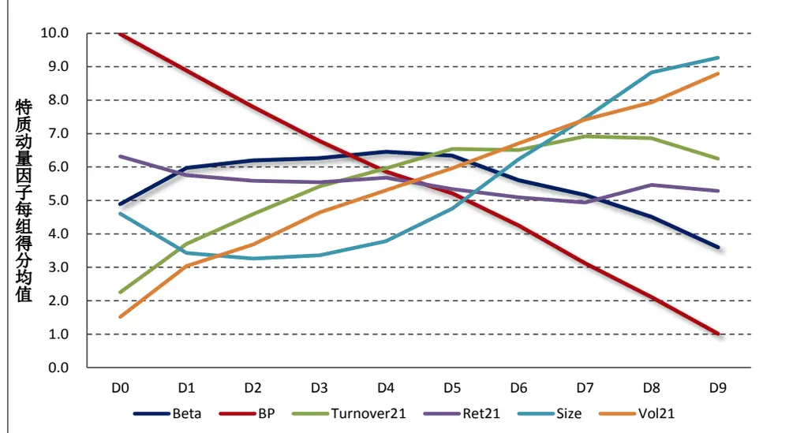
数据来源：财通证券研究所，恒生聚源

然而当我们在对特质动量因子在不同市场状态下的有效性进行情景分析发现，当市场处于由牛市转为熊市（UpReverse）和持续熊市（DownMomentum）的时候特质动量因子的 RankIC 分别达到 6.07%和 4.10%，是比较有效的选股因子，而在今年年初对应的这种熊市转牛市（DownReverse）的市场状态下，其RankIC 仅为 1.37%，t 值为 1.06，在统计意义上并不显著。结合我们之前在“拾穗”系列（九）《牛市抢跑者：低 Beta 一定代表低风险吗？》中对 Beta 因子有效性的检验发现，Beta 因子在牛市转熊市（UpReverse）和持续熊市（DownMomentum）中是比较显著的负向因子（RankIC 在-10%以上），而在熊市转牛市（DownReverse）状态下，是非常显著的正向因子（RankIC 在 10%以上）。

表 1：不同市场状态下，特质动量因子和 Beta 因子的多空收益及 RankIC 表现

| 特质动量(2005.1.31-2019.4.30) |  | 多空收益 |  |  |  | RankIC |  |  |  |
| --- | --- | --- | --- | --- | --- | --- | --- | --- | --- |
| 市场状态 | 样本数量 | 均值 | 胜率 | T值 | IR | 均值 | 胜率 | t 值 | IR |
| Up | 94 | 1.16% | 68.09% | 3.357 | 1.222 | 3.56% | 62.77% | 4.299 | 0.443 |
| Down | 78 | 0.61% | 60.26% | 1.828 | 0.692 | 2.64% | 62.82% | 2.727 | 0.309 |
| UpMomentum | 59 | 0.62% | 62.71% | 1.348 | 0.571 | 2.07% | 57.63% | 2.012 | 0.262 |
| UpReverse | 35 | 2.08% | 77.14% | 4.251 | 2.775 | 6.07% | 71.43% | 4.655 | 0.787 |
| DownMomentum | 37 | 1.00% | 70.27% | 1.922 | 1.113 | 4.10% | 70.27% | 2.844 | 0.468 |
| DownReverse | 41 | 0.26% | 51.22% | 0.612 | 0.292 | 1.37% | 56.10% | 1.058 | 0.165 |
| Beta 因子（2006.1.25-2019.4.4) |  | 多空收益 |  |  |  | RankIC |  |  |  |
| 市场状态 | 样本数量 | 均值 | 胜率 | T值 | IR | 均值 | 胜率 | t 值 | IR |
| Up | 94 | -0.29% | 46.81% | -0.47 | -0.26 | -2.41% | 42.55% | -1.58 | -0.16 |
| Down | 66 | 0.83% | 53.03% | 1.08 | 0.37 | 0.97% | 46.97% | 0.41 | 0.05 |
| UpMomentum | 59 | 1.15% | 59.32% | 1.61 | 0.68 | 2.16% | 52.54% | 1.23 | 0.16 |
| UpReverse | 35 | -2.70% | 25.71% | -2.67 | -1.45 | -10.10% | 25.71% | -4.36 | -0.74 |
| DownMomentum | 30 | -2.42% | 33.33% | -3.18 | -1.85 | -10.24% | 23.33% | -4.35 | -0.79 |
| DownReverse | 36 | 3.55% | 69.44% | 3.29 | 2.19 | 10.58% | 66.67% | 3.32 | 0.55 |

数据来源：财通证券研究所，“星火”专题（五），“拾穗”专题（九）

由这一分析我们可以初步猜测，特质动量因子可能与 Beta 因子呈现出非常明显的相关关系。那么，具体而言二者之间的相关性如何呢？在原文报告中的第四部分，我们绘制了特质动量因子和传统动量因子的多空组合在 Beta 上的差值以及 Wind 全 A指数的时间序列图，如图 2 所示。

图 2：特质动量因子和传统动量因子多空组合Beta 差值时序图
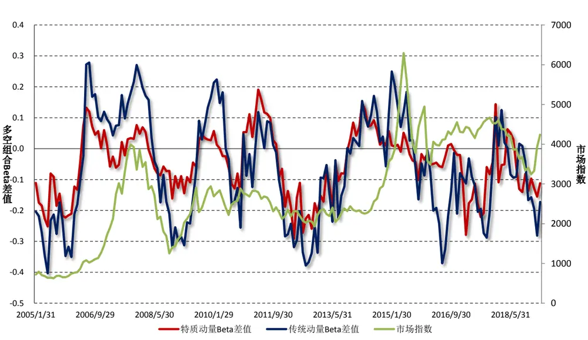
数据来源：财通证券研究所，“星火”专题（五）

可以看到，当前期市场处于单边上涨的状态（如 2005.1.31-2006.9.29）时，特质动量因子的多空组合在 上的暴露逐步增加，对冲组合在 上的暴露为正；而当市场处于下跌状态（如 2018 年）时，多空组合在 Beta 上的暴露逐步减少，对冲组合在Beta上的暴露为负。因此在经过了2018年市场的持续下跌后，特质动量因子多空组合的 Beta 暴露为负，而在今年的前面几个月中 Beta 因子是强有效的正向因子，因此特质动量因子和传统动量因子都会出现一定程度的回撤。然而值得注意的是，在大部分时间段内，特质动量因子的多空组合在 Beta 上的暴露的绝对值都要比传统动量因子多空组合的 Beta 暴露绝对值更低，这说明特质动量因子受市场风格转变的影响相对较弱，其在风格变化时是一个相对抗跌的组合。

由以上分析可知，特质动量因子与 Beta 因子之间实际上存在非常明显的相关性，可是为何在图 中我们发现十分组下的 值并未呈现出单调性呢？事实上，这是因为我们在图 1 中计算的是回测时间段内，每个组合在 Beta 因子上排序的均值，而由图 2 可以看到，多头组合在前期市场单边上涨时是高 Beta 的，而在前期市场单边下跌时是低 Beta 的，因此在回测时间段内直接取均值时就并没有呈现出明显的单调性。这也给我们这样一个提醒：在观察目标因子与其他风格因子的相关性时，不仅仅要观察每组在回测区间内的平均排序情况，还需要观察该因子在时间序列上与风格因子是否存在明显的相关关系。

自然而然地，我们可以观察在进一步剔除 Beta 因子的影响之后，特质动量因子的多空表现是否会有改善：

$$
IMOM\_NoBeta_{i}=\alpha_{i}+BP_{i}+Size_{i}+Turnover21_{i}+Vol21_{i}+\varepsilon_{i}
$$

$$
IMOM\_WithBeta_{i}=\alpha_{i}+Beta_{i}+BP_{i}+Size_{i}+Turnover21_{i}+Vol21_{i}+\varepsilon_{i}
$$

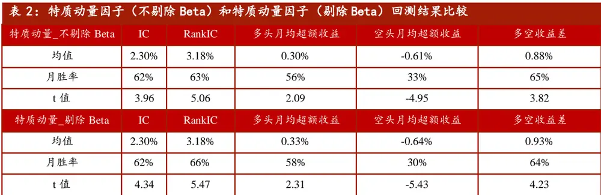
数据来源：财通证券研究所，恒生聚源，“星火”专题（五）

我们将回测区间段选定为 2005.1.29-2019.5.31，由表 2 可以看到，剔除了 Beta因子的影响之后，特质动量因子的效果得到进一步的改善，其 RankIC 的月胜率从63%提高到66%，t值由5.06提高到5.47，多空组合的月度收益差均值从0.88%提升至 0.93%，t 值从 3.82 提升至 4.23。因此在接下来的讨论中，本文采用的都是剔除了 Beta、BP、市值、21 天波动率和 21天换手率之后的特质动量因子。

## 1.2 价值投资的福音：特质动量因子基本面表现

上市公司的基本面往往是主动型基金经理非常关注的指标，那么基于特质动量因子进行选股得到的多头组合的基本面如何呢？本部分我们将从盈利能力、成长能力、现金流量和营运能力四个角度进行评估，主要选取的指标如下：

1）盈利能力：

$$
ROE=\frac{归属母公司股东净利润}{期末归属母公司股东的权益}
$$

2） 成长能力：

$$
净利润同比增长率=\left(\frac{本期归属母公司股东的净利润}{去年同期归属母公司股东的净利润}-1\right)\times100\%
$$

3）现金流量：

$$
CF0=\frac{经营活动产生的现金流量净额}{期末总资产}\times100\%
$$

4） 营运能力：

$$
总资产周转率=\frac{营业收入}{(期初总资产+期末总资产)/2}\times100\%
$$

图3展示了特质动量因子十分组下，在ROE、净利润同比增长率、CFO和总资产周转率四个基本面因子上的分布情况，可以看到十分组下各组的基本面呈现出非常强的单调性，多头组合（ 9）是一些盈利能力较强、成长情况较好、营运能力较高且现金管理较优的上市公司，这些公司在基本面上都是非常良好的标的，是非常适合信奉价值投资理念的投资者持有的。

图 3：特质动量因子十分组下基本面因子打分
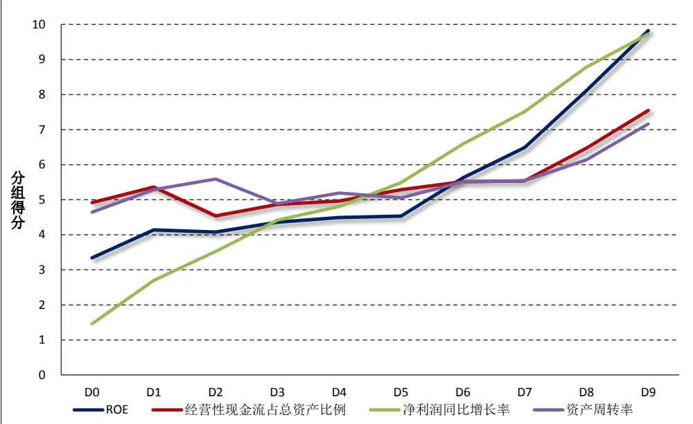
数据来源：财通证券研究所，恒生聚源

由上述分析可知，特质动量因子的多头组合往往是那些基本面较好、质地优良且前期有一定涨幅的股票，这些股票往往是主动型投资经理比较倾向于超配的标的，同时也是外资比较倾向于配置的风格。为了验证这一想法，财通金工对2019年1季度的QFII持股和2019年5月22日的沪股通和港股通的持股风格进行了分析，其结果如图4所示。

图 4：外资持股风格偏好解析
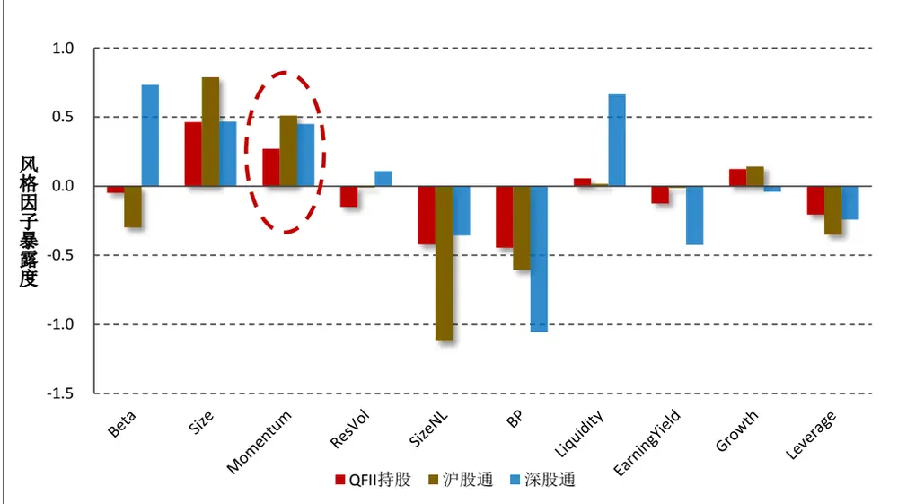
数据来源：财通证券研究所，Wind

可以看到，外资比较倾向于持有的个股风格往往偏向于大市值、高估值。特别地，QFII持股、沪股通持股和深股通持股在长期动量因子上均存在明显的正向暴露。一般来讲，量化研究者的选股思路往往是基于反转逻辑，比较倾向于超配低估值和超跌的股票，而本文介绍的动量因子的投资逻辑却完全相反，更符合主动型投资经理的选股风格，这也是我们一直在强调其与反转因子、特质波动因子等不同的原因。

## 1.3 剔除特质波动率之后是否依然有效？

在原文报告中介绍的特质动量因子中，我们计算的是经过风险调整过后的特质动量因子，也就是将股票在T-12月到T-1月之间的特质收益累计除以其特质波动率。

$$
IMOM_{i,t}=\frac{\prod_{t-12}^{t-1}(1+\varepsilon_{i,t})-1}{\sqrt{12}\times\sqrt{\frac{\sum_{t-12}^{t-1}\left(\varepsilon_{i,t}-\bar{\varepsilon}_{i}\right)^{2}}{12}}}
$$

然而过往大量的研究表明，国外市场和 股市场都存在明显的“特质波动异象”，过往特质波动率较低的股票在未来的走势往往能够战胜特质波动率较高的股票。然而当前市场上大量的研究关注的都是短期日频的特质波动率，而没有对较长期的特质波动因子进行讨论，因此长期特质波动率在 股市场上是否存在显著的选股效果？在剔除掉特质波动率之后，特质动量因子本身的表现是否会出现很大的变化？本部分将就这两个问题展开讨论。首先我们通过如下方法构建特质波动率因子，亦即特质动量计算公式中的分母部分：

$$
IV_{i,t}=\sqrt{\frac{\sum_{t-12}^{t-1}\bigl(\varepsilon_{i,t}-\bar{\varepsilon}_{i}\bigr)^{2}}{12}}
$$

选取2005.1.29-2019.5.31为回测区间，选取Wind全A为回测样本，其他的因子分组细节与原文报告中保持一致，其十分组下的每组月均超额收益及胜率如图5所示。

图5：特质波动率因子分组月均超额及胜率
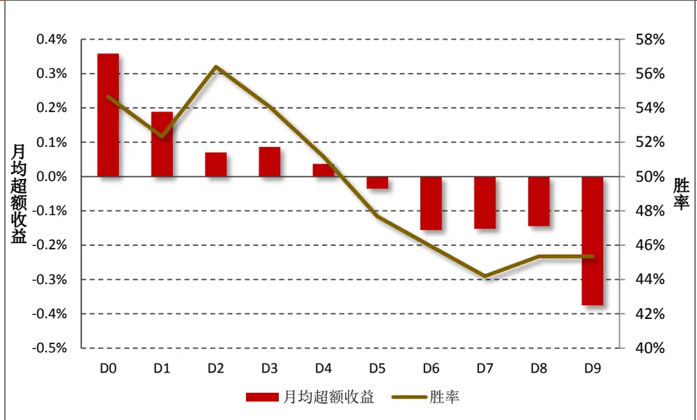
数据来源：财通证券研究所，恒生聚源

由图 5 可以看到，特质波动率因子呈现出比较强烈的反转效应，过往特质波动最高的组合（ 组合）将大幅跑输基准收益，而过往特质波动最低的组合（ ）相较市场收益而言能够录得将近 0.35%的月均超额收益。图6 展示了特质波动率因子多空组合的对冲净值，为了与特质动量因子保持一致，我们将因子值最高的组合作为多头组合，将因子值最低的 组合作为空头组合。由图 可以看到，特质波动率因子的对冲组合累计收益明显向下，是一个比较强烈的反转因子。

图6：特质波动因子多空组合对冲净值
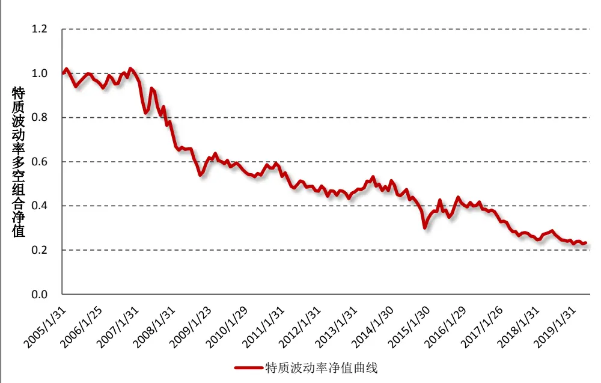
数据来源：财通证券研究所，恒生聚源

自然而然地，由于特质动量因子的构建是将累计特质收益与特质波动相除，而特质波动本身是一个强有效的负向因子，那么在剔除了特质波动率之后的特质动量因子是否仍然具有较好的选股表现呢？接下来我们将特质动量的原始因子值对特质波动率、Beta、BP、市值、换手率和波动率因子进行正交化，选择残差变量作为新的选股因子，其结果如表 3 所示。

$$
IMOM\_New_{i}=\alpha_{i}+IV_{i}+Beta_{i}+BP_{i}+Size_{i}+Turnover21_{i}+Vol21_{i}+\varepsilon_{i}
$$

表 3：特质动量因子（剔除 Beta、特质波动和其他风格因子）回测结果

| 特质动量_剔除IV | IC | RankIC | 多头月均超额收益 | 空头月均超额收益 | 多空收益差 |
| --- | --- | --- | --- | --- | --- |
| 均值 | 2.21% | 3.20% | 0.33% | -0.64% | 0.93% |
| 月胜率 | 63% | 67% | 58% | 30% | 64% |
| t值 | 4.26 | 5.88 | 2.31 | -5.43 | 4.23 |

数据来源：财通证券研究所，恒生聚源

由表 可以看出，在附加剔除了特质波动率因子的影响效果后的特质动量因子仍然展现出强劲的选股能力，其RankIC的胜率同样达到67%，其t值达到5.88，多空组合的月均收益达到 0.93%。也就是说，在剔除了特质波动率因子之后，特质动量因子的表现并未有所折扣，同样展现出优秀的选股效果，二者的收益来源并不一致。

## 1.4 基于特质动量因子的沪深300 指数增强策略

在大市值股票上的优异表现是我们推荐特质动量因子的另一重要原因。很多因子尽管在全A股样本中表现非常优异，但是在上证50和沪深300中的表现却不尽如人意。在原文报告中，我们对不同市值分组下特质动量因子的有效性进行了检验发现，特质动量因子本身不仅没有呈现出在大市值股票上失效的情况，反而在市值最大的这一组中的表现非常优异。基于这一观察，我们接下来对特质动量因子在沪深300增强策略上的表现进行检验。

我们仅在沪深300指数成分股中选股，最大化组合在经过市值、Beta、BP、21天换手率和21天波动率正交化之后的特质动量因子上的暴露值，同时限制组合在29个中信一级行业上的暴露度与沪深300在行业因子上的暴露保持完全一致，此外投资组合的权重加总等于1，且权重大于0，是一个不可做空的完全投资组合。

$$
\begin{array}{c}{{\displaystyle\operatorname*{min}_{w}w^{\prime}\cdot IMOM}}\\{{\displaystyle s.t.(w^{\prime}-w_{HS300}^{\prime})\cdot X_{Industry}=0}}\\{{\displaystyle\sum w_{i}=1}}\\{{\displaystyle\forall i,w_{i}>0,}}\end{array}
$$

需要说明的是，为了单纯检验特质动量因子在沪深300上的增强效果，我们仅最大化组合在该因子上的暴露值。而在实际的应用过程中，我们可以将其与一些已知的Alpha因子进行合成，最大化合成因子的暴露度。此外，在该模型中我们保证了增强组合在行业上与基准组合的暴露保持一致，这在一定程度上限制了组合相较基准的跟踪误差，然而更加精确的控制可以引入风险模型，将目标组合将对基准的主动风险控制在一定的阈值以内。

图7：基于特质动量因子的沪深300指数增强策略超额净值表现
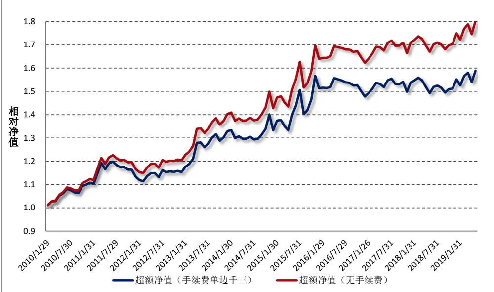
数据来源：财通证券研究所，恒生聚源

图 和表 分别展示了通过如上策略构建出的沪深 指数增强策略相较于沪深300全收益指数的超额净值走势及绩效表现。总体而言，基于单因子的特质动量因子在沪深 上的增强还是展现出不错的选股效果，在考虑手续费为单边的条件下，其超额收益能够达到年化5.24%的增强效果，信息比率也达到0.83。进一步地，在财通金工将Alpha因子库进行进一步完善后，在沪深300上的增强型策略将会更加稳健，欢迎感兴趣的投资者持续关注！

表4：指数增强型基金超额净值表现

|  | 年化收益率 | 年化波动率 | 信息比率 | 最大回撤 |
| --- | --- | --- | --- | --- |
| 无手续费 | 6.71% | 6.31% | 1.064 | 9.50% |
| 单边千分之三 | 5.24% | 6.33% | 0.827 | 9.65% |

数据来源：财通证券研究所，恒生聚源

## 1.5 横截面动量

到目前为止，我们讨论的动量实际上都是时间序列动量，每只股票是由单只股票的月度收益在时间序列上剔除Fama-French三因子得到的。关注财通金工的投资者知道，我们已经构建了一套完善的多因子收益-风险系统，而多因子收益模型的拆解是从横截面的角度剔除一些解释能力较强的风格因子得到的。那么，根据Barra模型进行收益分解得到的特质收益形成的横截面特质动量是否具备显著的选股能力呢？本部分我们将就这一问题展开探讨。

我们首先在横截面上将股票风格拆解为市场收益、行业收益、风格收益和特质收益，此处得到的特质收益被认为该个股在剔除市场、行业和风格影响之后的无法解释的部分，并且假设每只股票的特质收益之间互不相关，且单只个股的往期特质收益与本期特质收益也不存在相关性。

$$
r_{n}=f_{c}+\sum_{i=1}^{r}X_{ni}f_{i}+\sum_{s=1}X_{ns}f_{S}+\varepsilon_{n},
$$

接下来即可根据如上回归得到的特质收益计算该个股在 月到 月的特质收益累计，构建方法与原文报告中提到的传统动量因子的构建方法完全相同。

$$
Cross\mathrm{~-~}IMOM_{i,t}=\prod_{t-12}^{t-1}\bigl(1+\varepsilon_{i,t}\bigr)-1.
$$

图8：基于横截面动量的十分组选股表现
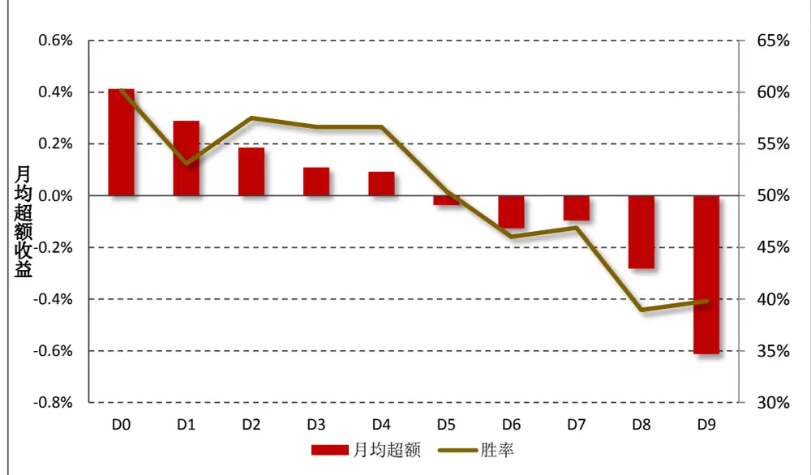
数据来源：财通证券研究所，恒生聚源

图8展示了基于横截面动量因子在十分组下的表现情况，可以看到横截面动量因子的原始值呈现出非常单调的反向选股效果，因子值最高的D9组合将大幅跑输市场，而因子值最低的 组别相较市场均值有 的月均超额收益。进一步地，我们同样想要了解横截面动量本身是否与一些其他因子值之间存在明显的相关关系，图9展示了横截面动量因子的十分组组合在已知风格因子上的得分均值，可以看到该因子与市值因子、21天换手率和21天波动率之间存在明显的正相关性，而与BP因子、Beta因子和21天涨跌幅之间存在明显的正向相关性，也就是说即便通过横截面回归得到的特质收益来构建的动量因子也同样在其他风格上存在非常相关的暴露，因此我们需要考察剔除掉这些风格因子影响之后，横截面动量的表现情况：

$$
\begin{aligned}Cross\_IMOM_{i}&=\alpha_{i}+Beta_{i}+BP_{i}+Size_{i}+Turnover21_{i}+Vol21_{i}+Ret21_{i}\\&\quad+\varepsilon_{i}\end{aligned}
$$

图9：横截面动量因子十分组组合在已知风格因子上的得分均值
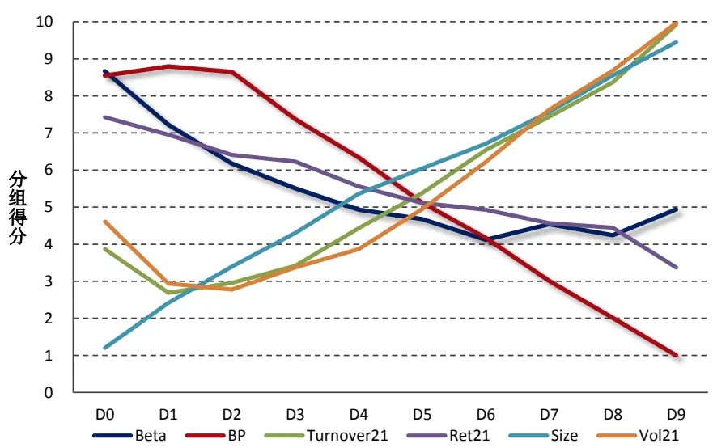
数据来源：财通证券研究所，恒生聚源

图10展示的是在剔除了已知风格因子影响之后，横截面动量因子的多空组合的月度净值及累计收益。可以看到，在剔除了已知因子影响之后的横截面动量因子并不具备选股能力，其RankIC的t值仅为0.93，并不显著。

图10：基于横截面动量的选股表现
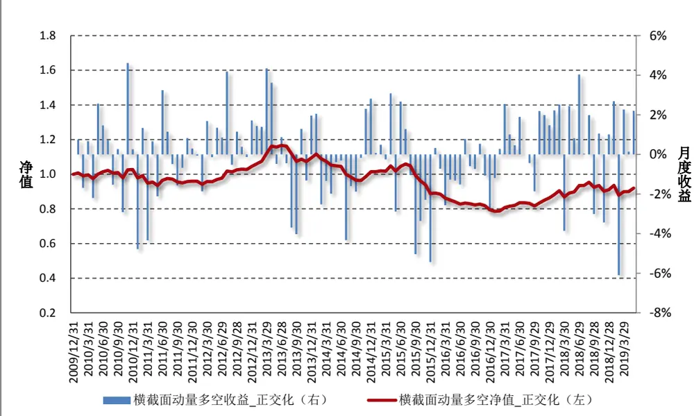
数据来源：财通证券研究所，恒生聚源

表 5：特质动量因子（剔除 Beta、特质波动和其他风格因子）回测结果

| 特质动量_剔除IV | IC | RankIC | 多头月均超额收益 | 空头月均超额收益 | 多空收益差 |
| --- | --- | --- | --- | --- | --- |
| 均值 | -0.22% | 0.51% | -0.32% | -0.37% | -0.07% |
| 月胜率 | 50% | 59% | 39% | 41% | 53% |
| t 值 | -0.41 | 0.93 | -2.04 | -2.36 | -0.23 |

数据来源：财通证券研究所，恒生聚源

## 1.6 稳健性检验：风险调整后的传统动量因子

最后，我们对传统动量因子再进行一次稳健性检验。在原文报告中，我们构建的特质动量因子是经过风险调整后的特质动量，而传统动量因子仅仅用的是T-12月到T-1月的累计收益，并未进行风险调整。那么，传统动量因子的表现之所以不如特质动量因子，是否是由于其没有进行风险调整的缘故呢？基于此，我们构建经过风险调整后的传统动量因子，对其进行稳健性检验：

$$
MOM_{Adjusted}=\frac{\prod_{t=12}^{t-1}\left(1+r_{i,t}\right)-1}{\sqrt{12}\times\sqrt{\frac{\sum_{t=12}^{t-1}\left(r_{i,t}-\bar{r}_{i}\right)^{2}}{12}}}
$$

图11：传统动量因子（经过风险调整VS不经过风险调整）多空净值表现
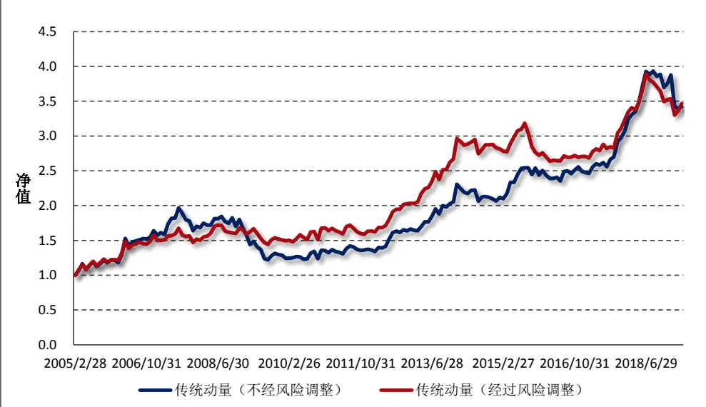
数据来源：财通证券研究所，恒生聚源

图11展示了传统动量因子经过风险调整过后以及不经风险调整后的多空组合的累计净值走势，两种方法都已经剔除掉了已知风格因子的影响。可以看到，二者之间并未存在明显的区别，经过风险调整后的传统动量因子的累计收益基本保持一致，在稳定性上有一定的提升，但是提升效果并不明显。

由此也可以说明，传统动量因子之所以表现不如特质动量因子，并不是由于其未经风险调整，而是源于其在市场风格上的暴露更高，且夹杂的信息过于糅杂的缘故。

## 1.7 勘误

在本次讨论的最后一个部分，我们对原文报告中的个别公式进行勘误。尽管财通金工已经尽可能通过多次检查力求报告表述的严谨性，但不可避免地还是存在一些问题，主要如下：

（1） 在特质动量因子的直接回归法介绍中，原文18页中的“接下来对股票在t-11到t-1月（共12个月）的特质收益进行处理…”应为对t-12到t-1（共12个月）的特质收益进行处理，相应的公式也应该表述为：

$$
IMOM_{i,t}=\frac{\frac{1}{12}\sum_{t-12}^{t-1}\varepsilon_{i,t}}{\sqrt{\frac{\sum_{t-12}^{t-1}\left(\varepsilon_{i,t}-\overline{{\varepsilon}}_{i}\right)^{2}}{12}}}\tag{2}
$$

（2） 在P19中的4.3公式中，三步求解法的特质收益应该用 $\epsilon_{i,t}$ 表示，而非用 $\varepsilon_{i,t}$ 表示，因此正确的公式应该为：

$$
IMOM_{i,t}=\frac{\prod_{t-12}^{t-1}\bigl(1+\epsilon_{i,t}\bigr)-1}{\sqrt{12}\times\sqrt{\frac{\sum_{t-12}^{t-1}\bigl(\epsilon_{i,t}-\overline{{\epsilon}}_{i}\bigr)^{2}}{12}}}\tag{4.3}
$$

## 1.8 小结

本期“拾穗”系列专题，我们对“星火”专题（五）中介绍的特质动量因子进行补充和完善，从外资偏好、多头质地、大市值表现等多个角度阐述我们推荐特质动量因子的理由和逻辑，主要结论如下：

（1） 推荐特质动量因子的三大理由：外资偏好、质地优良、大市值有效；

（2）“动量崩溃效应”在特质动量因子上的表现并不明显，在剔除 Beta因子影响之后，特质动量因子的表现有所提升；

（3） 从盈利能力、成长能力、现金流量和营运能力四个角度评估特质动量因子的多头组合发现，特质动量因子的多头组合是一些质地优良、基本面好的股票，这些股票往往是主动型投资经理和外资比较偏好的股票；

（4） 长期特质波动率是一个比较显著的负向选股因子，在剔除特质波动率影响之后的特质动量因子仍然表现出非常稳健的选股能力，这说明二者的收益来源并不相同；

（5） 特质动量因子在大市值上的表现也比较优异，本文基于特质动量因子构建的沪深 300 增强策略能够稳健跑赢基准指数；

（6） 在剔除了其他风格因子影响之后，横截面动量因子并未体现出较好的选股能力；

（7） 经过风险调整后的传统动量因子与未经风险调整的传统动量因子之间的差别并不显著。

## 2、 一周行情回顾

上周市场大小盘分化明显，大盘价值股明显占优，而小盘成长股的表现明显逊色。上周沪深 300 成长指数和中证 800 成长指数分别上涨 0.82%和 0.51%，在所有样本指数中排名前二，而创业板综和中证1000指数分别录得-1.75%和-1.57%的收益，在所有指数中跌幅最大。

图12：上周主要指数收益（2019.6.21-2019.6.28）
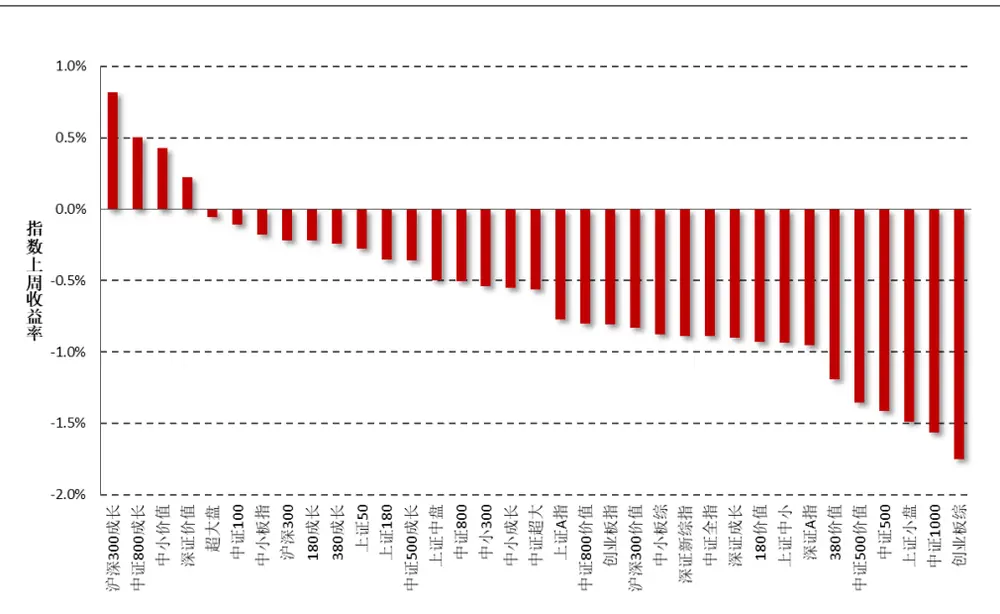
数据来源：财通证券研究所，Wind

行业方面，在所有 29 个中信一级行业中，食品饮料和餐饮旅游分别上涨 3.27%和 2.27%，而传媒和综合行业则分别下跌 3.79%和 2.76%，跌幅最大。

图13：上周中信一级行业指数收益（2019.6.21-2019.6.28）
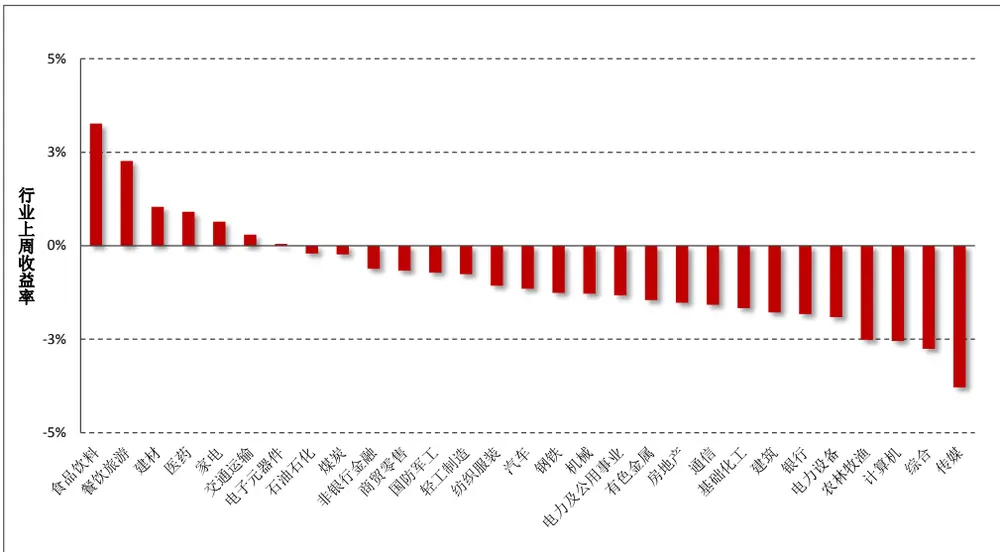
数据来源：财通证券研究所，Wind

## 3、 市场风格解析及指数风险预测

财通金工借鉴 Barra 模型，选取 Beta、规模、动量、波动率、非线性规模、、流动性、盈利、成长和杠杆率因子构建收益 风险归因模型，因子定义及计算细节参见附录二。本部分通过对近期风格因子的收益表现进行分析以期捕捉 A股市场的风格变化，同时对财通金工样本指数的未来一月风险进行预测来分析当前 A 股市场所处的风险水平。风格因子的收益拆解可参见财通金工专题报告《Barra 模型初探：A股市场风格解析》，资产组合的风险预测可参见财通金工专题报告《Barra 模型进阶：多因子模型风险预测》。

## 3.1 市场风格解析

各类风格因子在上周的累计收益可分为日度累计收益和周度收益两种，日度累计收益是根据风格因子的日度收益计算得到，周度收益是将股票在本周的收益率对股票在上周最后一个交易日的因子暴露度进行回归得到的因子纯净收益，二者之间的区别在于换仓频率的不同，前者为每日换仓，而后者在每周最后一个交易日换仓。

表 6 和图 14 展示了上周各类风格因子的累计收益和周度收益大小，可以看到，二者十分近似。本周大盘股表现较优，规模因子和长期动量因子录得较大正收益，而 Beta 因子则相较上周出现了明显的回撤。

表6：上周纯风格因子收益（2019.6.24-2019.6.28）

| 日期 | Beta | 规模 | 长期动量 | 波动率 | 非线性规模 | BP | 流动性 | 盈利 | 成长 | 杠杆 |
| --- | --- | --- | --- | --- | --- | --- | --- | --- | --- | --- |
| 2019/6/24 | -0.14% | -0.05% | 0.14% | 0.01% | -0.09% | 0.04% | 0.04% | 0.12% | -0.04% | -0.01% |
| 2019/6/25 | -0.19% | -0.03% | 0.00% | 0.01% | 0.00% | -0.01% | 0.00% | -0.03% | 0.08% | 0.06% |
| 2019/6/26 | -0.09% | 0.06% | -0.02% | -0.14% | -0.04% | -0.09% | -0.19% | 0.05% | 0.02% | -0.10% |
| 2019/6/27 | 0.24% | 0.16% | 0.20% | -0.07% | 0.02% | -0.12% | -0.06% | 0.10% | 0.09% | -0.13% |
| 2019/6/28 | -0.16% | 0.29% | 0.10% | -0.23% | -0.02% | -0.16% | -0.07% | 0.06% | 0.10% | -0.05% |
| 上周累计收益 | -0.34% | 0.42% | 0.42% | -0.42% | -0.12% | -0.34% | -0.28% | 0.30% | 0.25% | -0.22% |
| 周度收益 | -0.36% | 0.43% | 0.44% | -0.40% | -0.11% | -0.34% | -0.25% | 0.30% | 0.24% | -0.22% |
| 前一周度收益 | 1.27% | -0.31% | 0.40% | -0.15% | -0.26% | -0.10% | -0.13% | 0.09% | 0.05% | -0.15% |

数据来源：财通证券研究所，Wind

图 14：近两周纯风格因子收益比较（2019.6.14-2019.6.28）
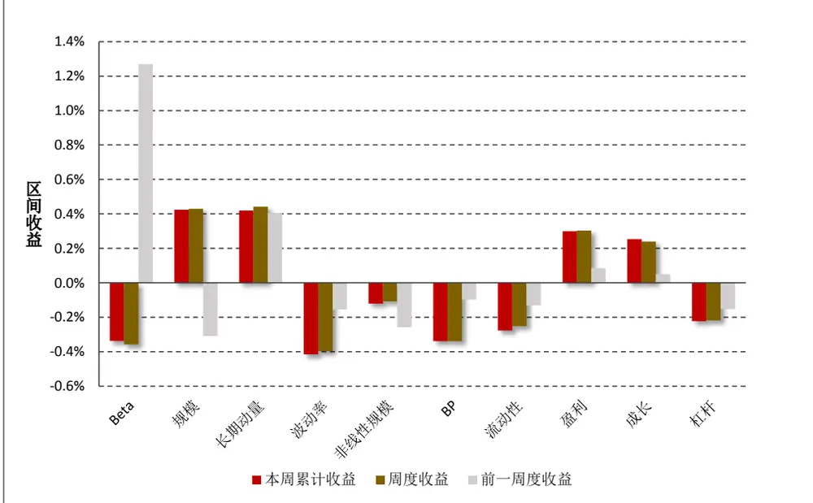
数据来源：财通证券研究所,Wind

图15：最近一个月风格因子净值走势（2019.5.28-2019.6.28）
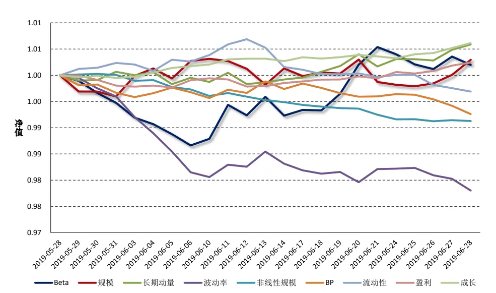
数据来源：财通证券研究所，Wind

图 和图 分别展示了最近一个月各类风格因子的净值走势及累计收益，以观察各类风格因子在过去一段时间的持续盈利能力。整体来讲，在过去的一个月中，前期涨幅较高的股票能够获得相对较高的收益，而前期波动较高的股票后市将会出现较为明显的回撤。

图16：最近一个月风格因子累计收益（2019.5.28-2019.6.30）
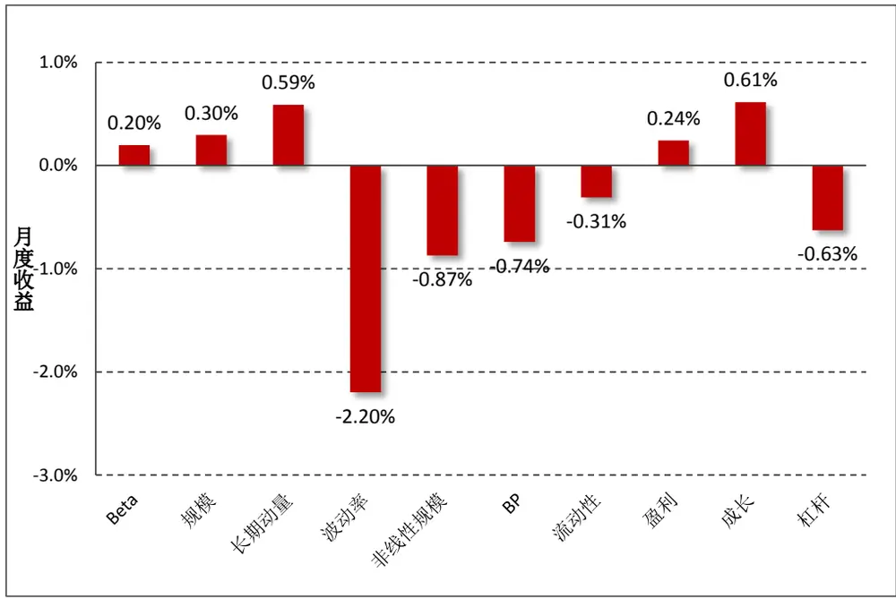
数据来源：财通证券研究所，Wind

## 3.2 指数风险预测

对收益的分解仅代表过去，对风险的预测才代表未来。多因子模型风险预测将股票风险拆解为共同风险和特质风险两部分，在通过稳健调整对共同风险矩阵和特质风险矩阵进行估计后，即可根据指数的成分股权重来估计指数在未来一段时间的波动情况。为了保证结果的严谨性，此处我们直接采用 Wind 提供的成分股权重数据，而非根据自由流通市值计算得到，尽管二者的结果十分类似。

$$
Risk(P)=W^{\prime}VW=W^{\prime}(X^{\prime}FX+\Delta)W
$$

图 17 展示了财通金工样本指数在未来一个月的预测波动率，为了方便展示我们将估计的月度波动率进行年化，波动的预测时间为上周最后一个交易日（ ）。可以看到，所有样本指数未来一月的年化波动区间在 之间，预测波动与上周维持相似的水平，总体而言近期市场处于窄幅震荡状态，波动率的提升并不明显。中小板股票、成长类指数的风险较大，而偏大盘股票、价值类股票的风险普遍较小。

图17：财通金工样本指数未来一月波动预测（年化）（2019.6.28-2019.7.26）
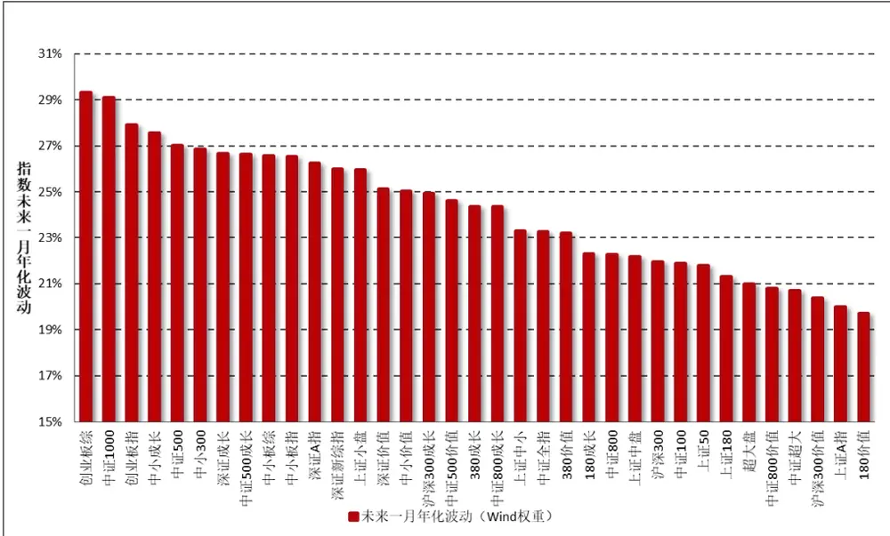
数据来源：财通证券研究所，Wind

由于在计算股票的风格因子时，我们会对暂停上市的股票、大类因子值存在缺失的股票进行剔除，因此在进行收益归因和风险预测时，并非所有指数成分股都纳入到了模型中，如果缺失股票个数过多或者缺失股票的权重占比过大，将会对模型结果造成较大影响。图 18 展示了各大指数在模型拟合过程中，纳入考虑的股票个数（权重）占指数成分股个数（权重）的比例，可以看到所有指数的比例均在 92%以上，数据质量的拟合较为合意。

图18：收益回归/风险预测样本股票占指数成分股比率
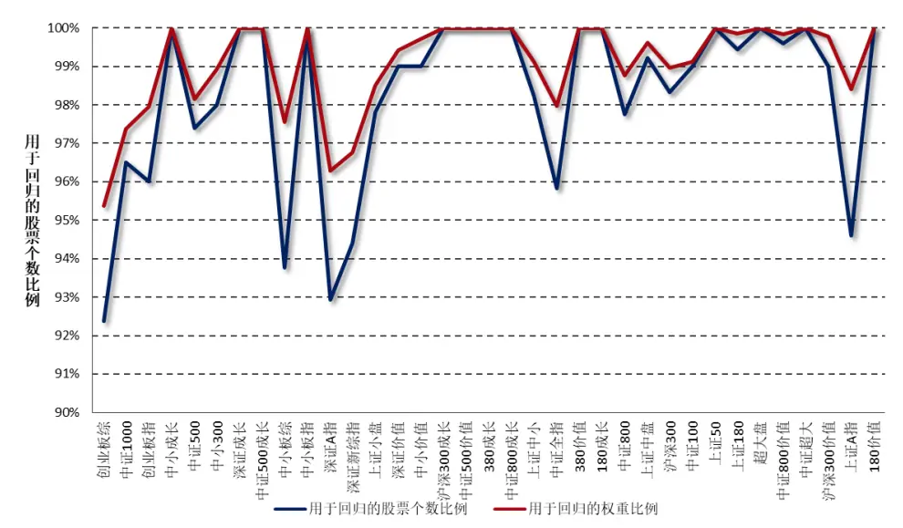
数据来源：财通证券研究所，Wind

## 4、 指数成分收益归因：

本部分财通金工对上周表现最好的三只指数和表现最差的三只指数进行归因分析，以观察涨幅较高（或较低）的指数风险暴露是否展现出较高的趋同性以及两类指数的持股风格是否会表现出明显的差别，其结果如图 19 和图 20 所示。

图19：上周表现最好三指数因子暴露度
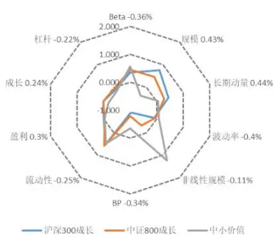
数据来源：财通证券研究所，Wind

图20：上周表现最差三指数因子暴露度
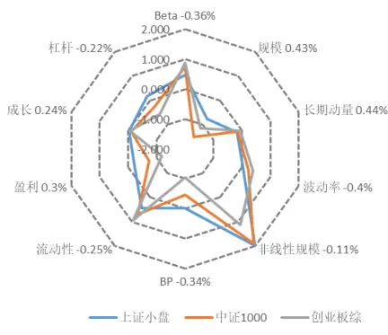
数据来源：财通证券研究所，Wind

表 7 展示了各大指数上周在各类因子上的暴露程度，可以看到，上周市场风格以大盘指数为主，表现最好的三只指数偏向大市值指数，其在规模因子上的较大暴露和帮助其获得稳健收益，而表现较差的三只指数则更多地偏向于中小市值股票，其在非线性规模因子上的较大暴露和在规模因子上的极小暴露拖累指数收益。

表7：指数在风格因子上的暴露程度（2019.6.21）

| 代码 | 指数名称 | Beta -0.36% | 规模 0.43% | 长期动量 0.4 | 波动率 -0.4%非 | 线性规模 | BP -0.34% | 流动性 -0.25 | 盈利 0.3% | 成长 0.24% | 杠杆-0.22% 实 | 际收益 |
| --- | --- | --- | --- | --- | --- | --- | --- | --- | --- | --- | --- | --- |
| 000918.SH | 沪深300成长 | 0.344 | 0.768 | 0.437 | -0.100 | -0.879 | -0.897 | 0.516 | -0.001 | 0.023 | -0.088 | 0.82% |
| H30355.CSI | 中证800成长 | 0.444 | 0.469 | 0.274 | -0.068 | -0.312 | -0.780 | 0.579 | -0.044 | 0.016 | -0.037 | 0.51% |
| 399604.SZ | 中小价值 | 0.566 | -0.373 | 0.051 | 0.079 | 1.232 | -0.343 | 0.467 | -0.042 | -0.180 | -0.166 | 0.43% |
| 399348.SZ | 深证价值 | 0.738 | 0.494 | 0.370 | -0.157 | -0.292 | -0.258 | 0.583 | 0.261 | 0.005 | 0.221 | 0.22% |
| 000043.SH | 超大盘 | -0.398 | 1.013 | -0.103 | -0.231 | -1.876 | 0.237 | -0.034 | 0.368 | -0.131 | -0.083 | -0.05% |
| 000903.SH | 中证100 | -0.144 | 0.993 | 0.288 | -0.218 | -1.662 | -0.003 | 0.045 | 0.457 | 0.078 | -0.013 | -0.11% |
| 399005.SZ | 中小板指 | 0.757 | 0.177 | -0.223 | 0.196 | 0.728 | -0.974 | 0.786 | -0.679 | 0.023 | -0.255 | -0.18% |
| 000300.SH | 沪深300 | 0.040 | 0.755 | 0.196 | -0.129 | -0.856 | -0.119 | 0.220 | 0.231 | 0.101 | 0.020 | -0.22% |
| 000028.SH | 180成长 | -0.308 | 0.867 | 0.472 | -0.060 | -1.243 | -0.429 | 0.098 | 0.215 | 0.054 | -0.067 | -0.22% |
| 000117.SH | 380成长 | 0.305 | -0.766 | -0.187 | 0.050 | 1.935 | -0.489 | 0.567 | -0.095 | -0.276 | -0.028 | -0.24% |
| 000016.SH | 上证50 | -0.455 | 1.006 | 0.257 | -0.265 | -1.792 | 0.225 | -0.084 | 0.644 | 0.051 | -0.046 | -0.28% |
| 000010.SH | 上证180 | -0.216 | 0.812 | 0.205 | -0.196 | -1.072 | 0.103 | 0.062 | 0.417 | 0.134 | 0.031 | -0.35% |
| H30351.CSI | 中证500成长 | 0.759 | -0.753 | -0.340 | 0.005 | 2.082 | -0.272 | 0.708 | -0.127 | -0.215 | 0.038 | -0.36% |
| 000044.SH | 上证中盘 | 0.227 | 0.452 | 0.109 | -0.066 | 0.262 | -0.125 | 0.334 | -0.003 | 0.286 | 0.175 | -0.50% |
| 000906.SH | 中证800 | 0.183 | 0.386 | 0.106 | -0.095 | -0.157 | -0.128 | 0.300 | 0.089 | 0.057 | 0.031 | -0.50% |
| 399008.SZ | 中小300 | 0.724 | -0.337 | -0.209 | 0.230 | 1.244 | -0.817 | 0.758 | -0.706 | -0.059 | -0.294 | -0.54% |
| 399602.SZ | 中小成长 | 0.799 | -0.102 | -0.421 | 0.290 | 0.983 | -0.901 | 0.860 | -0.578 | -0.185 | -0.170 | -0.55% |
| 000980.CSI | 中证超大 | -0.349 | 1.011 | -0.002 | -0.171 | -1.829 | 0.282 | -0.172 | 0.451 | -0.135 | 0.049 | -0.56% |
| 000002.SH | 上证A指 | -0.275 | 0.253 | -0.001 | -0.021 | -0.345 | 0.239 | -0.109 | 0.212 | 0.000 | 0.076 | -0.77% |
| H30356.CSI | 中证800价值 | -0.352 | 0.646 | 0.069 | -0.315 | -0.770 | 0.596 | -0.087 | 0.939 | -0.008 | 0.452 | -0.80% |
| 399006.SZ | 创业板指 | 0.766 | -0.140 | 0.193 | 0.422 | 0.964 | -1.266 | 1.062 | -1.146 | -0.053 | -0.494 | -0.81% |
| 000919.CSI | 沪深300价值 | -0.665 | 0.875 | 0.115 | -0.292 | -1.273 | 0.723 | -0.222 | 1.142 | -0.006 | 0.433 | -0.83% |
| 399101.SZ | 中小板综 | 0.613 | -0.762 | -0.240 | 0.272 | 1.139 | -0.695 | 0.563 | -0.741 | -0.081 | -0.327 | -0.88% |
| 399100.SZ | 深证新综指 | 0.701 | -0.594 | -0.021 | 0.154 | 0.855 | -0.579 | 0.598 | -0.564 | -0.010 | -0.203 | -0.89% |
| 000985.CSI | 中证全指 | 0.331 | -0.251 | 0.030 | 0.023 | 0.342 | -0.241 | 0.397 | -0.186 | 0.011 | -0.077 | -0.89% |
| 399346.SZ | 深证成长 | 0.840 | 0.223 | -0.138 | 0.149 | 0.413 | -0.856 | 0.929 | -0.374 | -0.102 | 0.118 | -0.90% |
| 000029.SH | 180价值 | -0.952 | 0.910 | 0.030 | -0.297 | -1.442 | 1.009 | -0.392 | 1.242 | -0.050 | 0.330 | -0.93% |
| 000046.SH | 上证中小 | 0.329 | -0.071 | -0.016 | -0.024 | 0.999 | -0.080 | 0.388 | -0.097 | 0.145 | 0.174 | -0.93% |
| 399107.SZ | 深证A指 | 0.667 | -0.621 | -0.008 | 0.235 | 0.869 | -0.635 | 0.736 | -0.626 | -0.004 | -0.241 | -0.95% |
| 000118.SH | 380价值 | 0.162 | -0.898 | -0.247 | -0.300 | 2.013 | 0.703 | 0.011 | 0.692 | -0.096 | 0.514 | -1.19% |
| H30352.CSI | 中证500价值 | 0.397 | -0.787 | -0.180 | -0.390 | 2.108 | 0.649 | 0.210 | 0.560 | -0.087 | 0.415 | -1.35% |
| 000905.SH | 中证500 | 0.637 | -0.805 | -0.186 | 0.014 | 2.079 | -0.154 | 0.556 | -0.365 | -0.089 | 0.061 | -1.41% |
| 000045.SH | 上证小盘 | 0.465 | -0.769 | -0.183 | 0.032 | 1.983 | -0.020 | 0.461 | -0.221 | -0.044 | 0.174 | -1.49% |
| 000852.SH | 中证1000 | 0.748 | -1.505 | -0.154 | 0.221 | 1.904 | -0.459 | 0.684 | -0.737 | -0.094 | -0.257 | -1.57% |
| 399102.SZ 创业板综 |  | 0.864 | -1.141 | -0.056 | 0.392 | 1.148 | -1.034 | 0.946 | -1.174 | -0.057 | -0.575 | -1.75% |

数据来源：财通证券研究所，Wind

## 5、 附录

附录二：财通金工风格因子定义

| 大类因子 | 子类因子 | 因子定义及计算 | 权重 | 备注 |
| --- | --- | --- | --- | --- |
| Beta | BETA | $\mathbf{r_{t}}=\alpha+\beta\mathbf{R_{t}}+\mathbf{e_{t}},$ 将单只股票过去252天的日度收益率对流通市值加权指数日度收益率进行半衰指数加权回归，半衰期为63天 | 1 | 1) 采用流通市值而非总市值加权，因为各大指数编制采用流通市值加权；2) 需要剔除当日停牌或者未上市日期的数据，并将权重进行归一化；3) 若满足条件的样本数据少于42天，我们将其 Beta 置为 NaN。 |
| 规模 | SIZE | 股票总市值取对数 | 1 | 由于PB、PE等因子的计算是基于总市值的，因此此处也用总市值 |
| 动量 | RSTR | 过去一段时间个股的累计收益率，不含最近一个月， $\begin{array}{r}{\mathrm{RSTR}=\sum_{\mathrm{t}=\mathrm{L}}^{\mathrm{T}+\mathrm{L}}\mathrm{w}_{\mathrm{t}}(\ln(1+\mathrm{r}_{\mathrm{t}}),}\end{array}$ $\mathrm{r}_{\mathrm{t}}=\mathrm{P}_{\mathrm{t}}/\mathrm{P}_{\mathrm{t}-1}-1,\quad\mathrm{T}=504,\quad\mathrm{L}=21,$ 收益率序列采用半衰指数加权，半衰期为126天 | 1 | 1)对于数据质量较好的个股，计算动量时采用了2年的数据2) 需要剔除未上市日期数据，但无需剔除停牌日期数据，并将权重归一化3)若满足条件的数据样本小于42天，我们将其动量置为NaN |
| 波动率(对Beta因子和市值因子进行正交化处理） | DASTD | 个股相对市值加权指数的超额收益率序列的半衰指数加权标准差，T=252，半衰期为42天1/2 $\mathrm{DASTD}=\left(\sum_{\mathrm{t}=1}^{\mathrm{T}}\mathrm{w}_{\mathrm{t}}\left(\mathrm{r}_{\mathrm{t}}-\mu(\mathrm{r})\right)^2\right)^{\frac{1}{2}}$ | 0.7 | 1) 采用流通市值加权计算指数收益2) 需要剔除当日停牌或者未上市日期的数据，并将权重进行归一化3) 若满足条件的数据样本小于42天，我们将其因子值置为NaN |
|  | CMRA | 表示过去12个月的波动幅度， $\begin{array}{r}{\mathrm{CMRA}=\ln(1+\operatorname*{max}\{\mathrm{Z(T)}\})-\ln(1+\operatorname*{min}\{\mathrm{Z(T)}\}),}\end{array}$ $\begin{aligned}Z(T)=\exp(\sum_{t=1}^{T}\ln(1+r_{t}))-1\quad&\\去T个月的收益率\end{aligned}$ ，表示过 | 0.15 | 以 21 天为 1 个月 |
|  | HSIGMA | 计算 Beta 时残差的标准差， $\mathrm{Hsigma}=\mathrm{std}(e_{i})$ | 0.15 | 同 Beta 因子的计算 |
| 非线性规模 | NonLinerSize | 中市值因子，将股票总市值对数的三次方对总市值对数回归，取残差的相反数 | 1 | 用于衡量市值因子的非线性性，总市值越大和越小的股票的非线性规模越小，中市值股票的非线性规模越大 |
| 估值 | BP | 市净率的倒数，1/PB | 1 | 采用 Wind 中的 pb_lf 因子的倒数 |
| 流动性(对市值因子进行正交化） | STOM | 月度换手率， $\mathrm{STOM}=\ln(\mathrm{mean}(\sum_{t=1}^{21}(V_t/S_t)))$ 其中V为当日成交量，S为流通股本 | 0.5 | 1)采用流通股本值，而非自由流通股本值2)剔除未上市、停牌日期的数据 |
|  | STOQ | 季度换手率， $\mathrm{STOQ}=\ln(\mathrm{mean}(\sum_{t=1}^{63}(V_t/S_t))),$ | 0.25 | 同 STOQ 因子的计算 |
|  | STOA | 年度换手率， $\mathrm{STOA}=\ln(\mathrm{mean}(\sum_{t=1}^{252}(V_t/S_t)))$ | 0.25 | 同 STOQ 因子的计算 |
| 盈利 | CETOP | 过去滚动12个月的经营现金流除以当前市值实际计算中取市现率 PCF（经营现金流 TTM）的倒数 | 1/2 | 采用 Wind 中的 PCF_OCF_ttm 因子的倒数 |
|  | ETOP | 过去滚动12个月的利润除以当前市值实际计算中取市盈率 PETTM 的倒数 | 1/2 | 采用 Wind 中的 PE_ttm 因子的倒数 |
| 成长 | YOYProfit | 单季度净利润同比增长率 | 1/2 | 为避免使用未来数据，需要根据季报公布时间进行调整 |
|  | YOYSales | 单季度营业收入同比增长率 | 1/2 | 同 YOYProfit 因子的计算 |
| 杠杆 | MLEV | 市场杠杆率，MLEV=（总市值+非流动负债）/总市值 | 1/3 |  |
|  | DTOA | 资产负债率，DTOA=总资产/总负债 | 1/3 |  |
|  | BLEV | 账面杠杆率，BLEV=（账面价值+非流动负债）/账面价值 | 1/3 |  |

数据来源：财通证券研究所
备注：1.波动率因子需对Beta因子和市值因子进行正交化处理；
流动性因子需对市值因子进行正交化处理；

3.若大类因子下所有子类因子值全部缺失，则该股票的因子值记为缺失，否则用有数据的因子值进行替代，注意需对权重进行归一化处理

## 信息披露

## 分析师承诺

作者具有中国证券业协会授予的证券投资咨询执业资格，并注册为证券分析师，具备专业胜任能力，保证报告所采用的数据均来自合规渠道，分析逻辑基于作者的职业理解。本报告清晰地反映了作者的研究观点，力求独立、客观和公正，结论不受任何第三方的授意或影响，作者也不会因本报告中的具体推荐意见或观点而直接或间接收到任何形式的补偿。

## 资质声明

财通证券股份有限公司具备中国证券监督管理委员会许可的证券投资咨询业务资格。

## 公司评级

买入：我们预计未来 6 个月内，个股相对大盘涨幅在 15%以上；

增持：我们预计未来 6 个月内，个股相对大盘涨幅介于 5%与15%之间；

中性：我们预计未来 6 个月内，个股相对大盘涨幅介于-5%与5%之间；

减持：我们预计未来 6 个月内，个股相对大盘涨幅介于-5%与-15%之间；

卖出：我们预计未来 6 个月内，个股相对大盘涨幅低于-15%。

## 行业评级

增持：我们预计未来 6 个月内，行业整体回报高于市场整体水平 5%以上；

中性：我们预计未来 6 个月内，行业整体回报介于市场整体水平-5%与 5%之间；

减持：我们预计未来 6 个月内，行业整体回报低于市场整体水平-5%以下。

## 免责声明

本报告仅供财通证券股份有限公司的客户使用。本公司不会因接收人收到本报告而视其为本公司的当然客户。

本报告的信息来源于已公开的资料，本公司不保证该等信息的准确性、完整性。本报告所载的资料、工具、意见及推测只提供给客户作参考之用，并非作为或被视为出售或购买证券或其他投资标的邀请或向他人作出邀请。

本报告所载的资料、意见及推测仅反映本公司于发布本报告当日的判断，本报告所指的证券或投资标的价格、价值及投资收入可能会波动。在不同时期，本公司可发出与本报告所载资料、意见及推测不一致的报告。

本公司通过信息隔离墙对可能存在利益冲突的业务部门或关联机构之间的信息流动进行控制。因此，客户应注意，在法律许可的情况下，本公司及其所属关联机构可能会持有报告中提到的公司所发行的证券或期权并进行证券或期权交易，也可能为这些公司提供或者争取提供投资银行、财务顾问或者金融产品等相关服务。在法律许可的情况下，本公司的员工可能担任本报告所提到的公司的董事。

本报告中所指的投资及服务可能不适合个别客户，不构成客户私人咨询建议。在任何情况下，本报告中的信息或所表述的意见均不构成对任何人的投资建议。在任何情况下，本公司不对任何人使用本报告中的任何内容所引致的任何损失负任何责任。

本报告仅作为客户作出投资决策和公司投资顾问为客户提供投资建议的参考。客户应当独立作出投资决策，而基于本报告作出任何投资决定或就本报告要求任何解释前应咨询所在证券机构投资顾问和服务人员的意见；

本报告的版权归本公司所有，未经书面许可，任何机构和个人不得以任何形式翻版、复制、发表或引用，或再次分发给任何其他人，或以任何侵犯本公司版权的其他方式使用。