2019 年 07 月 16 日

# 是聪明钱吗？探析外资持股的风格偏好

## 联系信息

陶勤英分析师

## “拾穗”多因子系列报告（第 15 期）

SAC 证书编号：S0160517100002 021-68592393

taoqy@ctsec.com

张宇研究助理

zhangyu1@ctsec.com 021-68592337

176216888421

## 相关报告

【1】“星火”多因子系列（一）：《Barra模型初探：A 股市场风格解析》

【2】“星火”多因子系列（二）：《Barra模型进阶：多因子模型风险预测》

【3】“星火”多因子系列（三）：《Barra模型深化：纯因子组合构建》

【4】“星火”多因子系列（四）：《基于持仓的基金绩效归因：始于 Brinson，归于 Barra》【5】“星火”多因子系列（五）：《源于动量，超越动量：特质动量因子全解析》

【6】“拾穗”多因子系列（一）：《带约束的加权最小二乘：一种解析解法》

【7】“拾穗”多因子系列（二）：《你看到的不一定是你所想的：解密 R 方》

【8】“拾穗”多因子系列（五）：《数据异常值处理：比较与实践》

【9】“拾穗”多因子系列（六）：《因子缺失值处理：数以多为贵》

【10】“拾穗”多因子系列（八）：《非线性规模因子：A 股市场存在中市值效应吗？》

【11】“拾穗”多因子系列（九）：《牛市抢跑者：低 Beta一定低风险吗？》

【 】“拾穗”多因子系列（十）：《行业的风格偏好：解析纯行业因子组合》

【13】“拾穗”多因子系列（十一）：《多因子风险预测：从怎么做到为什么》

【 】“拾穗”多因子系列（十三）：《恼人的显著性检验：多因子模型中 t 值的计算》

【 】“拾穗”多因子系列（十四）：《补充：基于特质动量因子的沪深 300 增强策略》

## 投资要点：

- 是聪明钱吗？探析外资持股的风格偏好

- 外资进入 A股主要有两个渠道：QFII 和陆港通，近年来有迹象表明外资入场的途径更多从 QFII 转向陆港通；

- 行业配置方面，QFII 和陆港通更多偏向大消费板块，陆港通资金在大金融板块存在明显超配，而 QFII 资金在银行板块超配明显，在非银金融板块低配明显；

- 在风格配置方面，QFII 和陆港通资金的风格十分类似，更多偏向大市值、高估值、高动量的股票；

- 从个股和行业构建外资追踪策略，探析外资资金的“聪明度”，我们发现跟踪外资资金的行业轮动策略在2018年4月以前表现优异，但之后出现了明显的失效。而跟踪外资的选股策略表现更为稳健，多空年化收益达到 ，夏普比率为 。

## 指数风险预测

所有样本指数在未来一个月的年化波动区间在 18%-28%之间，预测波动率相较上周出现明显的回落，当前市场总体处于窄幅震荡状态，短期风格并不明朗。

## 市场风格解析

本周各大类因子都出现了比较明显的回撤， Beta 因子、波动率因子、流动性因子和 BP 因子负收益明显。而成长因子最近两周走势较好，临近半年报披露季，我们提醒投资者可以适当关注财务因子。

- 风险提示：本报告统计结果基于历史数据，过去数据不代表未来，市场风格变化可能导致模型失效。

在实际投资中，多因子模型被广泛地应用到资产定价、绩效归因、风险控制、组合优化、基金评价及资产配置等各个领域，一套完整、精细的多因子系统成为每位量化研究者必备的工具。“做最实用的研究”，是财通金工给自己的定位。我们将在之后的系列报告中，就投资者们最关心也最容易忽略的很多细节问题进行探讨，介绍我们在实际应用中遇到的问题和思考，以飨读者。

我们为本系列报告取名“拾穗”。一周市场风云变幻，和风细雨也好，狂风骤雨也罢，都留下一地故事等待梳理。作为勤劳的搬运工，财通金工从量化视角出发对市场风格进行捕捉、对风险水平进行预测，既是希望能够如拾穗者般专心、踏实地做研究，也是祝愿各位投资者能够在市场收获满地金黄。

本期是该系列报告的第 15期，主要就外资持股的风格偏好进行探析。在“拾穗”系列（ ）中，我们提到特质动量因子的多头组合是一些基本面好、质地优良且前期有一定涨幅的股票，而这些股票往往是外资比较倾向超配的标的。自然而然地，财通金工想要对外资进行更深一步的探讨。外资进入 A 股的主要渠道有哪些？其股票持仓中往往会偏好怎样的行业和风格？外资资金本身是聪明钱吗，如果紧密追踪外资资金流动动向是否能够获取超额收益？本期讨论我们将就以上问题进行解答，从量化视角阐述我们的观点。

## 1、 是聪明钱吗？探析外资持股的风格偏好

随着 A股纳入 MSCI 指数权重的逐步扩大以及陆股通、沪伦通等多个互联互通市场的开通，海外投资者在 A 股的投资权限正在逐步扩大，外来资金在内地市场投资便利性的增加使得 A 股市场投资者结构正在发生巨大变化。作为中国资本市场上的神秘力量，外资资金有着诸多别称，“Smart Money”、聪明钱、洋韭菜等等。本文将系统性介绍外资进入A股市场的两类主要渠道及其发展历程，并从行业和风格配置的角度对外资持股偏好进行分析梳理，最后在此基础上检验一种追踪外资持股的策略。

## 1.1 外资主要投资渠道：QFII+陆港通

外资进入中国 A股市场主要包含两类渠道：QFII/RQFII 和陆港通，二者并行设立，互为补充。其中，QFII/RQFII 属于“中介代理”模式，主要针对境外机构投资者，委托境内中介机构在沪、深交易所进行投资；陆港通则属于“一点接通”模式，以交易所为主体，通过上交所和香港联交所的互相申报，使得内地和香港客户可以通过本土券商向本地交易所申报交易单，从而实现跨境买卖。由于两地交易所和结算公司直接互联，省去了 QFII / RQFII 业务中一系列的行政资格认定和审批，同时放开了对个人的投资限制，因此陆股通在近年来成为外资入场越来越重要的渠道。在陆港通正式开启之后，海外投资者可能主要通过陆港通渠道交易沪、深股通标的，而 QFII/RQFII 额度则主要用于陆股通以外的 A股标的和债券等其他品种。

## 1.1.1 QFII/RQFII 发展历程

QFII（Qualified Foreign Institutional Investors）制度即合格境外机构投资者制度，是指允许经核准的合格外国机构投资者，在一定规定和限制下汇入一定额度的外汇资金，并转换为当地货币，通过严格监管的专门账户投资当地证券市场，其资本利得、股息等经批准后可转为外汇汇出的一种市场开放模式。作为一种有限度的引入外资、开放资本市场的过渡性制度，QFII 已被广泛应用于部分新兴工业化国家和地区，积累了丰富的实践经验。

2002 年 11 月8 日，中国证监会和中国人民银行联合下发《合格境外机构投资者境内证券投资管理暂行办法》，标志着 QFII 制度在中国内地的确立和实施。2003 年 6 月，瑞银集团和日本野村证券正式获批准成为第一批 QFII 机构；同年7 月，QFII 投资者首次在 A股市场下单交易。

自 QFII 机制实施以来，QFII 机构数和获批总额度均保持逐年上涨，图1 展示了历年 QFII 机构总数量及获批总额度。总体来看，在 2012 年《合格境外机构投资者境内证券投资管理办法》颁布后，境外机构准入门槛放宽，QFII 更呈现出迅猛增长态势；最近几年，伴随着对外开放的全面提速，越来越多的外资选择通过机制更为灵活的陆股通入场，QFII 增长幅度较前期有所放缓。根据财通金工统计，截至 2019 年6 月 28 日，QFII 机构数合计 318 家，获批总额度 1069.97 亿美元，其中单个机构获批最高额度为 50 亿美元。

图 1：QFII 机构数及获批总额度
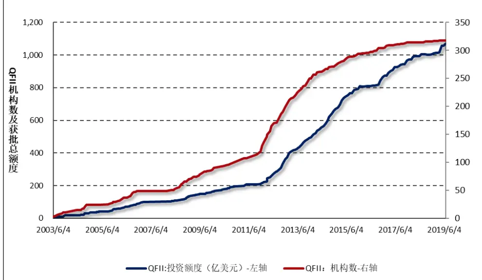
数据来源：财通证券研究所，Wind

RQFII（RMB Qualified Foreign Institutional Investors)即人民币合格境外机构投资者，又称小 QFII，是指境外人民币通过在香港的中资证券公司及基金公司投资 A股。2011 年 12 月 16 日，证监会、央行、外管局联合发布《基金管理公司、证券公司人民币合格境外机构投资者境内证券投资试点办法》，允许符合条件的基金公司、证券公司香港子公司作为试点机构开展 RQFII 业务。该业务初期试点额度约人民币 200 亿元。自 RQFII 实施以来，业务规模不断扩张。根据财通金工统计，截至2019年6月28日，获批RQFII机构数合计254家，获批总额度6779.72亿元，其中单个机构获批最高额度为 461 亿元。

## 1.1.2 陆股通发展历程

陆港通包含沪港通和深港通两大板块：沪 深港通，即沪 深港股票市场交易互联互通机制，指两地投资者委托上交所会员或者香港联交所参与者，通过上/深交所或者香港联交所在对方所在地设立的证券交易服务公司，买卖规定范围内的对方交易所上市股票。具体而言，沪/深港通包括沪/深股通和港股通两部分。沪/深股通，是指投资者委托香港联交所参与者，通过香港联交所证券交易服务公司，向上/深交所进行申报，买卖规定范围内的上/深交所上市股票，沪股通和深股通又合称“陆股通”。港股通则是指投资者委托上/深交所会员，通过上/深交所证券交易服务公司，向香港联交所进行申报，买卖规定范围内的香港联交所上市股票，具体释义如图 2 所示。

事实上，通常而言的“北上资金”和“南下资金”分别代指进入 A 股的香港国际资本（即陆股通）和进入港股的中国内地资本（通过港股通流入港股的资金）。

图 2：陆港通机制具体构成
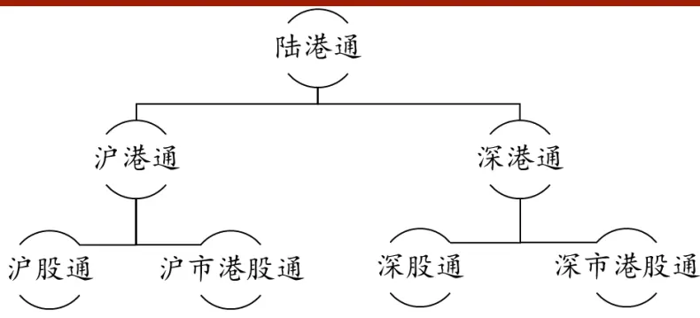
数据来源：财通证券研究所整理

2014 年 4月 10 日，中国证会和香港证监会发布《中国证券监督管理委员会香港证券及期货事务监察委员会联合公告》，决定原则批准上交所、香港联交所、中国结算、香港结算开展沪港股票市场交易互联互通机制试点，2014 年 11 月 17日起，沪港通正式启动；2016 年 12 月5 日，中国证监会与香港证监会发布联合公告正式启动深港通。开通之初至今，陆股通公布每日净买入额；同时，从 2017年 月 日开始公布每日的持股标的、数量。自 年 月 日起，陆港通每日额度大幅提升，沪股通及深股通每日额度从 130 亿元调整为 520 亿元，港股通每日额度从 105 亿元调整为 420 亿元。

## 1.1.3 外资入场重心：从 QFII 转向陆股通

伴随着我国对外开放的全面提速，近年来外资入场的重心逐渐由 QFII 通道向机制更为灵活的陆股通倾斜。特别的，自 2017 年起，借道陆股通北上的资金占据了绝大部分增量，甚至在 2018 年出现 QFII 持仓向陆股通切换的迹象。

图 3：陆股通买入（卖出）成交金额（周度）
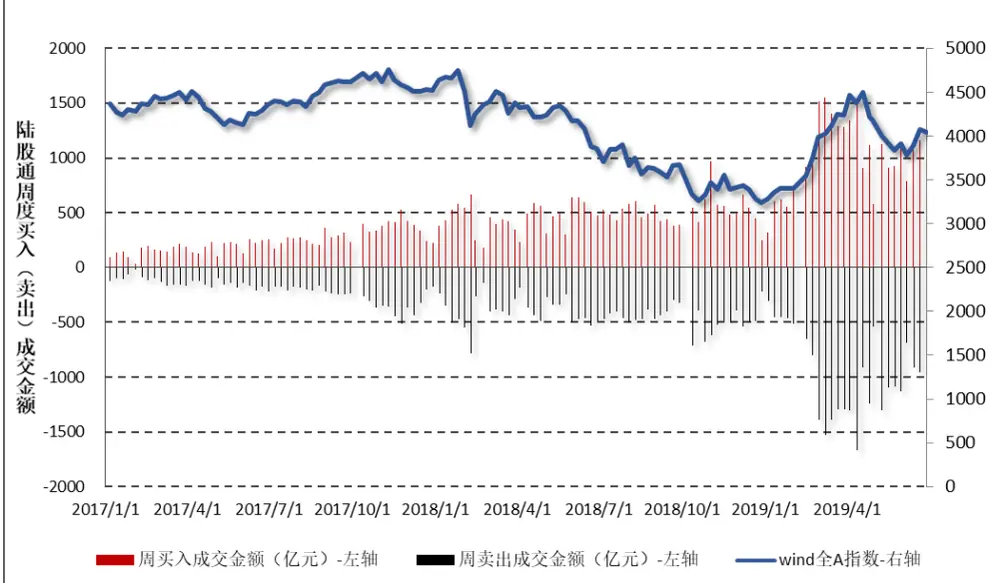
数据来源：财通证券研究所，Wind

图 3 展示了自 2017 年起陆股通周度买入/卖出成交金额数据，买入和卖出成交金额均呈现出整体上扬趋势，由 年初的周度买入（卖出）额不足 亿元到 2019 年3 月份超过 1500 亿元的周度买入（卖出）成交量。从 Wind 全 A指数走势与陆股通成交量对比数据来看，在 2019 年1 月-2019 年4 月指数迅速拉升的时间区间内，陆股通的买入（卖出）金额也呈现出迅速上涨态势，而在前期指数下滑区间内，陆股通周度买入/卖出交易金额基本维持在 500 亿左右，处于相对低位。

图 4：QFII 机构持仓总市值（季度）
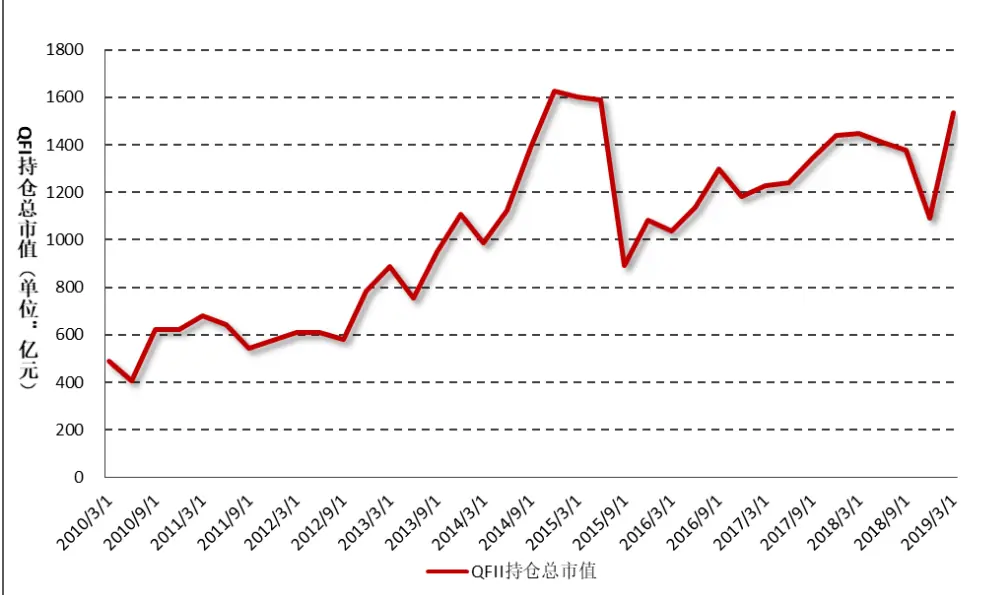
数据来源：财通证券研究所，Wind

而相较之下，QFII 机构的持仓总市值在近年来的增长速度相对缓慢，在部分阶段出现了一定程度的下滑（如图 4 所示）。固然，QFII 机构的持仓市值与 A股市场整体的走势密不可分，但由于我们目前无法获取 QFII 机构的实时成交量数据，因此持仓总市值也能够给我们提供另一维度的参考。

## 1.2 外资持股的行业及风格偏好

在简要介绍了 QFII 和陆股通的发展历程后，本部分我们想要探索外资持有的股票组合是否具有明显的特征。我们分别对陆股通和 QFII 持有股票组合收益在行业和风格上的偏好进行分析，并将其与沪深300 的风格进行比较。

由于 QFII 持股数据仅能从上市公司的定期报告中获取，因此我们能获取的数据频率相对较低，且部分报告期仅能够获取个股的前十大股东的 QFII 机构数据。相较之下，陆股通的持仓可以获取到日度数据，且公布较为完整。在本部分的讨论中，我们统计了 QFII 机构在每个季度的持股情况，而陆股通的数据则能够做到每日更新。关于持仓组合的行业和风格拆解的具体方法，可以参见财通金工“星火”多因子专题（四）《基于持仓的基金绩效归因：始于 Brinson，归于Barra》。

## 1.2.1 陆股通持股偏好

首先关注陆股通持仓组合在行业上的配置情况，图 5 展示了 2019年 5月 31日陆股通持仓组合及沪深 300 指数在 29 个中信一级行业中的权重配置。可以看到，近期陆股通在消费板块（食品饮料、家电、医药）存在明显的超配，其中在食品饮料行业的配置最高，持有该行业股票市值达到其全部持仓量 20%以上，后续可以看到这主要是由于外资在贵州茅台和五粮液等个股上的积极配置。而在大金融板块，尽管在陆股通中占比仍然较高，但权重配置不及沪深 300 基准。

图 5：陆股通持股行业暴露度（2019.5.31）
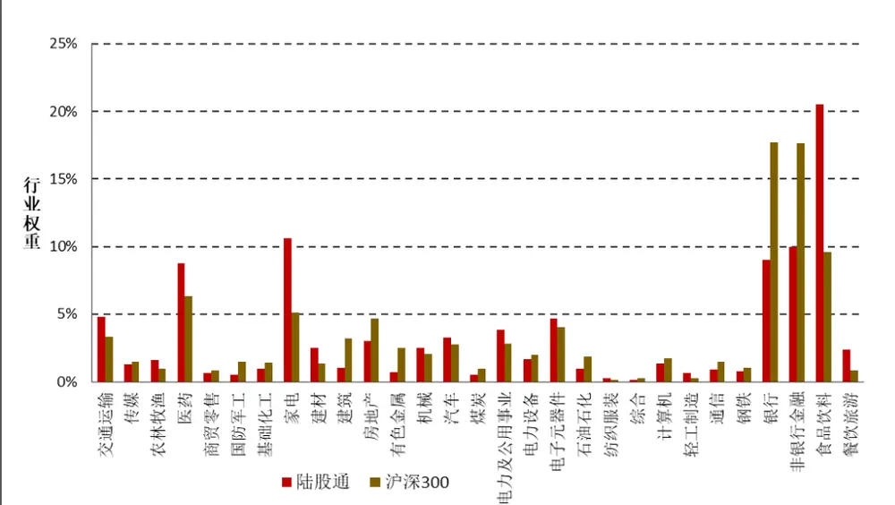
数据来源：财通证券研究所，Wind

图 6 展示了陆股通中重仓行业权重配置的时序变化图，可以看到陆股通在食品饮料行业的权重一直处于领先水平，基本上在 20%以上，而在家电、医药和金融板块的配置则更为平均。

图 6：陆股通重仓行业权重变化
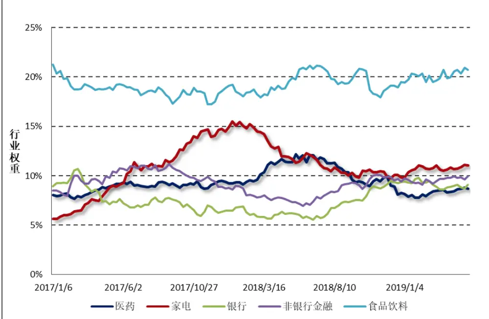
数据来源：财通证券研究所，Wind

在风格配置上，陆股通的持仓风格更接近于沪深 300 指数的风格，整体而言对大市值、前期收益更高、负债率低的股票存在明显偏好。在相对风格上，陆股通整体的估值更高（BP 更低），且前期涨幅也更高（动量因子更高）。

图 7：陆股通持股风格因子暴露度（2019.5.31）
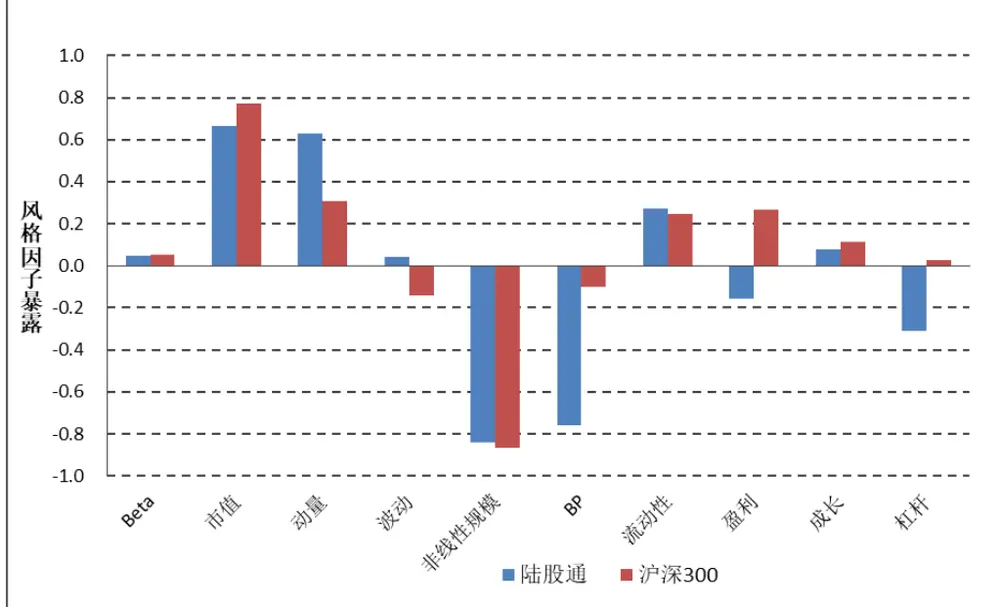
数据来源：财通证券研究所，Wind

从个股层面来看，表 1 展示了陆股通在 2019 年 7 月 12 日持仓量最大的前10 只股票，其中贵州茅台（600519.SH）吸纳了最多的陆港通资金，持股市值达到 1041.87 亿元，远超排名第 2 位的中国平安。同时也可以看到，以上 10 只股票所属行业分别为食品饮料、非银行金融、家电、医药、银行、交通运输和餐饮旅游行业，均属于陆港通持股所偏好的行业。

表 1：陆股通前 10 大重仓股（2019.7.12）

|  | 证券代码 | 证券简称 | 陆股通持股市值(亿元) | 占流通市值比例 | 所属行业 |
| --- | --- | --- | --- | --- | --- |
| 1 | 600519.SH | 贵州茅台 | 1041.865 | 8.41% | 食品饮料 |
| 2 | 601318.SH | 中国平安 | 692.6106 | 7.20% | 非银行金融 |
| 3 | 000333.SZ | 美的集团 | 532.2434 | 14.35% | 家电 |
| 4 | 000651.SZ | 格力电器 | 356.0244 | 10.56% | 家电 |
| 5 | 600276.SH | 恒瑞医药 | 350.4994 | 11.98% | 医药 |
| 6 | 000858.SZ | 五粮液 | 339.6223 | 7.12% | 食品饮料 |
| 7 | 600036.SH | 招商银行 | 300.5493 | 4.12% | 银行 |
| 8 | 600887.SH | 伊利股份 | 272.1899 | 13.28% | 食品饮料 |
| 9 | 600009.SH | 上海机场 | 219.7813 | 24.53% | 交通运输 |
| 10 | 601888.SH | 中国国旅 | 217.9161 | 12.72% | 餐饮旅游 |

数据来源：财通证券研究所，Wind

## 1.2.2 QFII 持股偏好

图 8 展示了 2019 年一季度 QFII 持股在行业上的配置情况，相较沪深 300 指数而言，QFII 在大金融板块的分歧十分明显，其中对银行业存在明显超配，而对于非银金融板块存在明显的低配。此外，与沪港通资金类似，QFII 对食品饮料、医药、家电等消费板块的配置均超过了 10%。

从风格配置角度而言，QFII 持股偏好于陆股通具有极大相似性，两者都对大市值、前期收益更高、负债率低且估值比较高的股票存在明显偏好。

在个股层面，表 2 中列示了 QFII 持仓量最大的前 10 支股票集合。与陆股通持仓数据频率不同，QFII 持股原始数据来源于上市公司财务报告（季度披露），因此截至目前只能获取 QFII 于 2019 年一季度末的持股情形。就具体持股而言，贵州茅台(600519.SH)、美的集团(000333.SZ)、恒瑞医药(600276.SH)和上海机场(600009.SH)四只股票同时位于陆股通和 QFII 持仓前十位股票集合中，两类外资资金都对其给予高度关注。

图 8：QFII 持股行业因子暴露（2019.3.31）
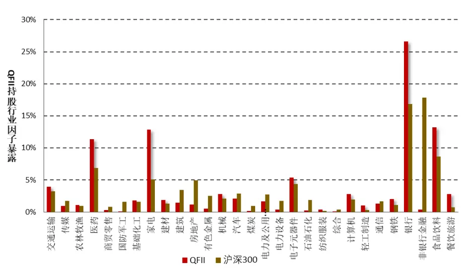
数据来源：财通证券研究所，Wind

图 9：QFII 持股风格因子暴露（2019.3.31）
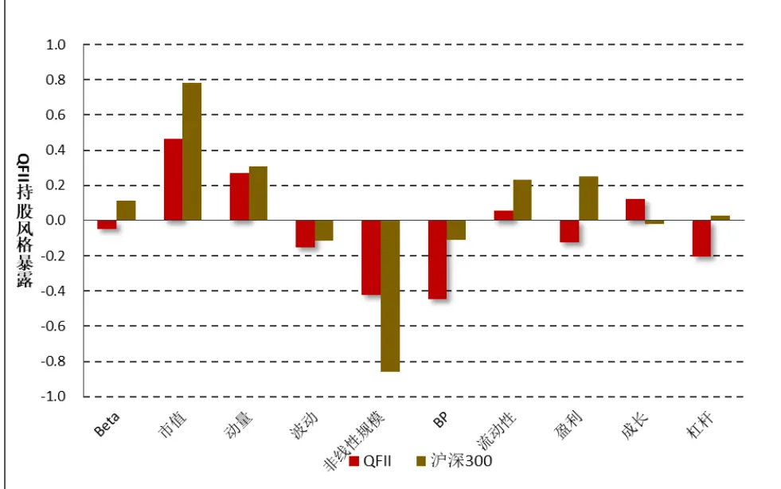
数据来源：财通证券研究所，Wind

表 2：QFII 前 10 大重仓股（2019.03.31）

|  | 证券代码 | 证券简称 | 陆股通持股市值(亿元) | 占流通市值比例 | 所属行业 |
| --- | --- | --- | --- | --- | --- |
| 1 | 601169.SH | 北京银行 | 154.35 | 13.64% | 银行 |
| 2 | 002142.SZ | 宁波银行 | 152.49 | 15.50% | 银行 |
| 3 | 600519.SH | 贵州茅台 | 139.23 | 1.30% | 食品饮料 |
| 4 | 000333.SZ | 美的集团 | 115.85 | 3.69% | 家电 |
| 5 | 601009.SH | 南京银行 | 99.78 | 14.87% | 银行 |
| 6 | 600276.SH | 恒瑞医药 | 60.42 | 2.10% | 医药 |
| 7 | 600690.SH | 海尔智家 | 39.85 | 3.82% | 家电 |
| 8 | 600009.SH | 上海机场 | 30.87 | 4.54% | 交通运输 |
| 9 | 601888.SH | 中国国旅 | 27.21 | 1.99% | 餐饮旅游 |
| 10 | 002415.SZ | 海康威视 | 23.49 | 0.83% | 电子元器件 |

数据来源：财通证券研究所，Wind

## 1.3 是聪明钱吗？跟踪外资资金的选股策略

本次讨论的最后一个部分，我们聚焦探讨外资资金是否是我们眼中更为聪明的资金，本部分财通金工尝试根据外资在个股上的持仓变动情况来构建投资策略。通常而言，如果外资是真正意义上的聪明钱（Smart Money），那么跟踪外资持股的投资策略应该可获得显著超额收益。

下面我们分别从个股和行业（采用中信一级行业分类）维度构建周度追踪策略，具体步骤如下：

1） 第 t 周最后一个交易日，获取单只个股（单个行业）陆股通资金本周净流入，并在横截面对股票（行业）对此由大到小进行排序；

2） 在t+1周第一个交易日，做多陆股通持股集合中第t周净流入最高的10%股票（净流入最高的前 5 个行业内所有股票），做空第 t 周净流入最少的 10%股票（净流入最少的前 5 个行业内所有股票）构建多空组合，组合内均采用等权重，周频换仓。

图 10：外资追踪策略股票多空净值（2017.1.13-2019.7.12）
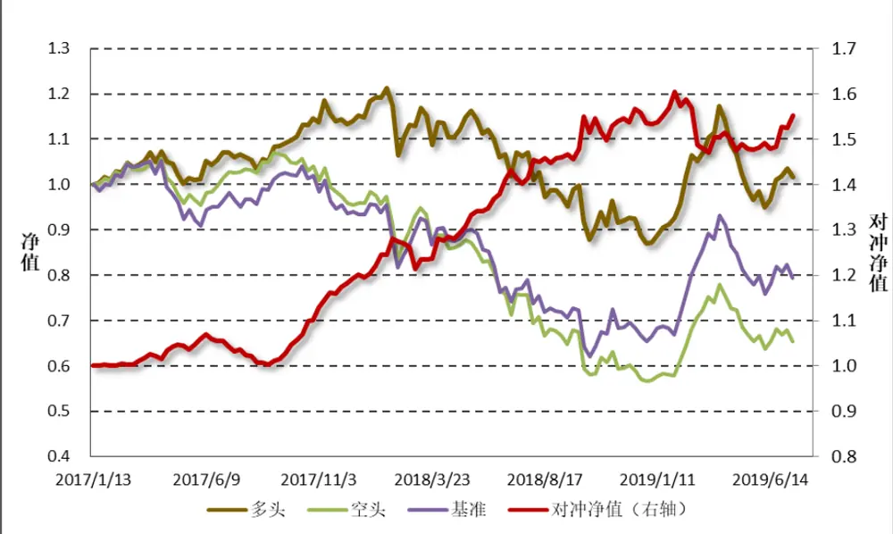
数据来源：财通证券研究所，Wind

选择 2017.1.13-2019.7.12 为回测区间，图 10 展示了在个股层面根据如上策略构建的外资跟踪策略多空组合净值图。可以看到，跟踪外资资金的选股策略在总体而言能够取得一定的超额收益，尽管在进入到 2019 年以后出现了一定程度的回撤，但在最近两周明显回升。在整个样本回测区间中，股票多空组合的平均年化收益为 20.02%，年化波动率为 9.25%，夏普比率 2.17。

图 11 展示了各组和基准的累计收益，可以看到各组基本呈现出比较良好的单调性，多头在全样本时间内超过基准 20%，而空头在全样本时间内跑输基准20%。

图 11：外资追踪策略股票各组累计净值（2017.1.13-2019.7.12）
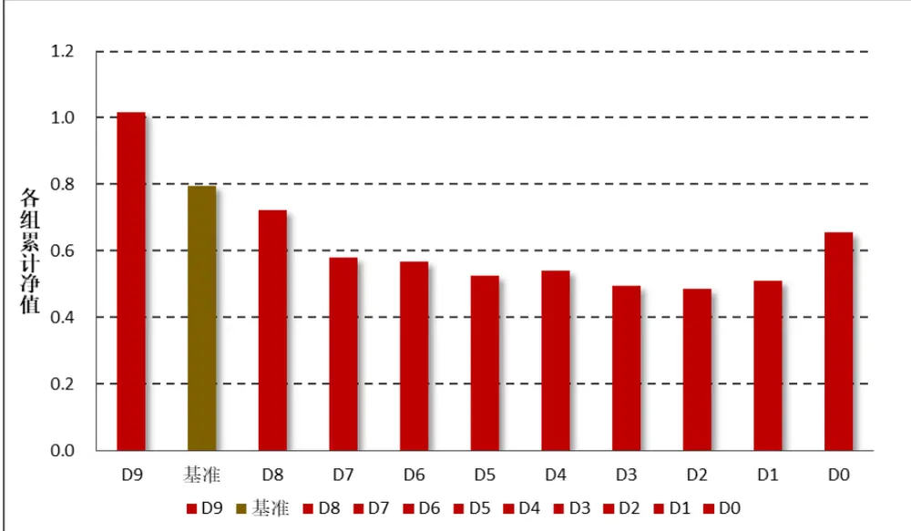
数据来源：财通证券研究所，Wind

事实上，我们会考虑这样一个问题：在数量级上而言，外资资金在单只股票的持仓占该股票的流通市值比例并非在所有股票上都很大，因此其对于不同股票的定价权是不一样的。如果外资在单只股票的持仓的比例较大，我们认为外资的定价权就更高。基于此，财通金工在如上的策略中尝试了另外一个思路，在每次选股时，仅仅选取外资在其流通市值中占比前 1/2 的股票进行筛选并构建组合，由于筛选过后股票数量变少，因此我们此处只分为 5 组。图 12 展示了加入该条件之后的多空组合对冲净值，可以看到基于如上的改进效果并不十分明显。

图 12：外资追踪策略行业多空净值-筛选外资定价权较高的股票（2017.1-2019.7）
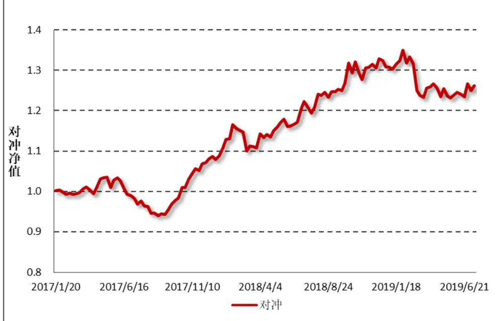
数据来源：财通证券研究所，Wind

在行业轮动的策略方面，通过如上步骤构建出的行业轮动组合的配置效果如图 13 所示。在 2018年 4月以前都能够获取稳健的收益，然而在 2018年 4月以后，多空组合之间的收益并未呈现出明显的分化。在整个样本回测区间中，行业多空组合的平均年化收益为 44.05%，波动率 14.89%，夏普比率 2.95。但是如果说 2018 年 4 月以前，外资还能够称得上是聪明资金，那么在当前的这一阶段，单单跟踪外资本周的资金流入流出情况在行业选择上并不能够获取稳健的超额收益。当然这里面失效的原因有很多，陆股通成分股的数量毕竟有限，无法代表整个行业的所有股票，因此会出现一定程度的失效。

图 13：外资追踪策略行业多空净值（2017.1-2019.6）
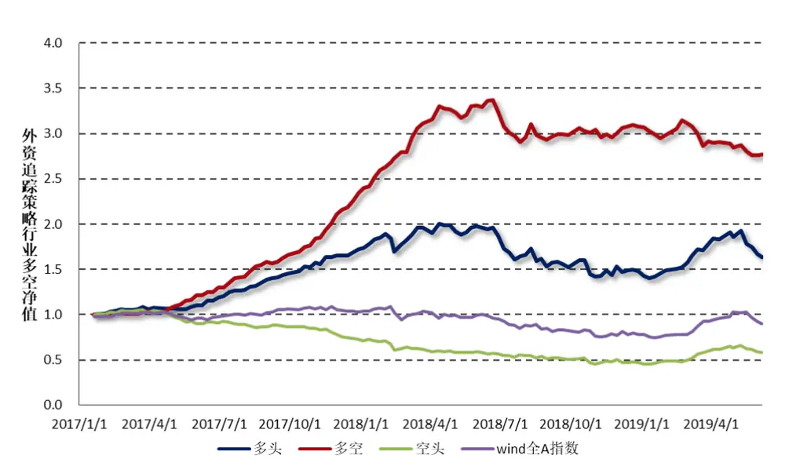
数据来源：财通证券研究所，Wind

## 1.4 小结

本期“拾穗”系列专题，我们对外资在A股市场上的投资渠道进行了梳理，并对其持股的风格及行业偏好进行了分析，最后构建出一个基于外资资金的选股及行业轮动策略，主要结论如下：

（1） 外资进入到 A股市场主要有两个渠道：QFII 和陆港通，其中近年来有迹象表明外资入场的途径有从 QFII 逐步转向陆港通的现象；

（2） 在行业配置方面，QFII 和陆港通都更多偏向大消费板块（如食品饮料、家电、医药等），陆港通资金在大金融板块上存在明显超配，而QFII 资金在银行板块超配明显，在非银金融板块低配明显；

（3） 在风格配置方面，QFII 和陆港通资金的风格十分类似，更多偏向大市值、高估值、高动量的股票；

（4） 从选股和行业轮动两个层面探究外资资金的“聪明度”，我们发现跟踪外资的选股策略表现更为稳健，多空年化收益达到 20.02%，夏普比率达到 2.17，而跟踪外资资金的行业轮动策略在 2018 年4 月以前表现优异，但之后出现了明显的失效。

## 2、 一周行情回顾

上周市场市场普跌，大小盘指数都出现了明显的回撤。上周深证价值指数和创业板指数分别下跌 1.80%和 1.92%，在所有样本指数中排名前二，而中证 1000和上证小盘指数分别录得-3.78%和-3.77%的收益，在所有指数中跌幅最大。

图14：上周主要指数收益（2019.7.5-2019.7.12）
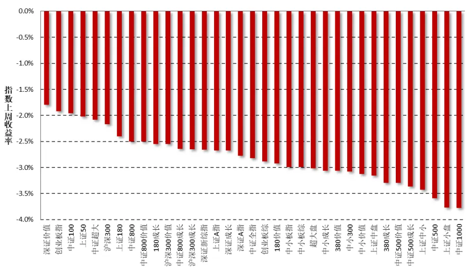
数据来源：财通证券研究所，Wind

行业方面，在所有 29 个中信一级行业中，餐饮旅游和农林牧渔分别微涨 0.07%和 0.03%，是唯二上涨的行业，而通信和计算机行业则分别下跌 5.45%和 5.16%，跌幅最大。

图15：上周中信一级行业指数收益（2019.7.5-2019.7.12）
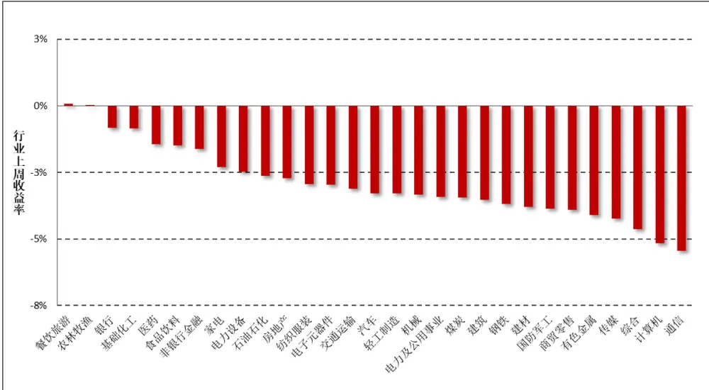
数据来源：财通证券研究所，Wind

## 3、 市场风格解析及指数风险预测

财通金工借鉴 Barra 模型，选取 Beta、规模、动量、波动率、非线性规模、、流动性、盈利、成长和杠杆率因子构建收益 风险归因模型，因子定义及计算细节参见附录二。本部分通过对近期风格因子的收益表现进行分析以期捕捉 A股市场的风格变化，同时对财通金工样本指数的未来一月风险进行预测来分析当前 A 股市场所处的风险水平。风格因子的收益拆解可参见财通金工专题报告《Barra 模型初探：A股市场风格解析》，资产组合的风险预测可参见财通金工专题报告《Barra 模型进阶：多因子模型风险预测》。

## 3.1 市场风格解析

各类风格因子在上周的累计收益可分为日度累计收益和周度收益两种，日度累计收益是根据风格因子的日度收益计算得到，周度收益是将股票在本周的收益率对股票在上周最后一个交易日的因子暴露度进行回归得到的因子纯净收益，二者之间的区别在于换仓频率的不同，前者为每日换仓，而后者在每周最后一个交易日换仓。

表 3 和图 16 展示了上周各类风格因子的累计收益和周度收益大小，可以看到，二者十分近似。本周各大类因子都出现了比较明显的回撤， Beta因子、波动率因子、流动性因子和 BP因子负收益明显。而成长因子最近两周走势较好。

表3：上周纯风格因子收益（2019.7.8-2019.7.12）

| 日期 | Beta | 规模 | 长期动量 | 波动率 | 非线性规模 | BP | 流动性 | 盈利 | 成长 | 杠杆 |
| --- | --- | --- | --- | --- | --- | --- | --- | --- | --- | --- |
| 2019/7/8 | -0.45% | 0.28% | 0.09% | -0.12% | -0.01% | -0.14% | -0.10% | 0.00% | 0.13% | -0.01% |
| 2019/7/9 | 0.15% | -0.14% | -0.05% | -0.02% | 0.01% | 0.03% | 0.02% | 0.07% | 0.11% | -0.06% |
| 2019/7/10 | -0.07% | 0.06% | 0.00% | -0.15% | -0.17% | -0.05% | -0.11% | -0.08% | -0.02% | 0.01% |
| 2019/7/11 | -0.09% | -0.09% | -0.13% | -0.04% | -0.02% | -0.06% | -0.05% | 0.06% | 0.06% | 0.02% |
| 2019/7/12 | 0.13% | 0.03% | 0.12% | -0.12% | -0.06% | -0.04% | -0.20% | 0.09% | 0.08% | 0.08% |
| 上周累计收益 | -0.33% | 0.13% | 0.03% | -0.45% | -0.25% | -0.27% | -0.43% | 0.13% | 0.37% | 0.04% |
| 周度收益 | -0.41% | 0.13% | 0.03% | -0.44% | -0.23% | -0.26% | -0.36% | 0.11% | 0.34% | 0.05% |
| 前一周度收益 | 0.17% | 0.03% | -0.14% | -0.22% | -0.02% | 0.06% | -0.06% | 0.29% | 0.36% | -0.03% |

数据来源：财通证券研究所，Wind

图 16：近两周纯风格因子收益比较（2019.6.28-2019.7.12）
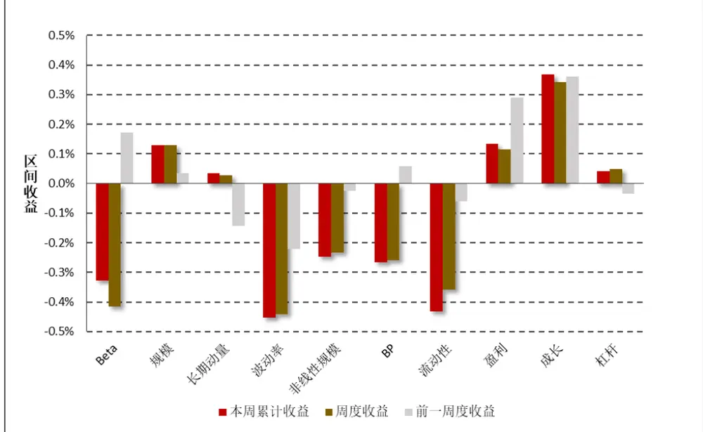
数据来源：财通证券研究所,Wind

图17：最近一个月风格因子净值走势（2019.6.12-2019.7.12）
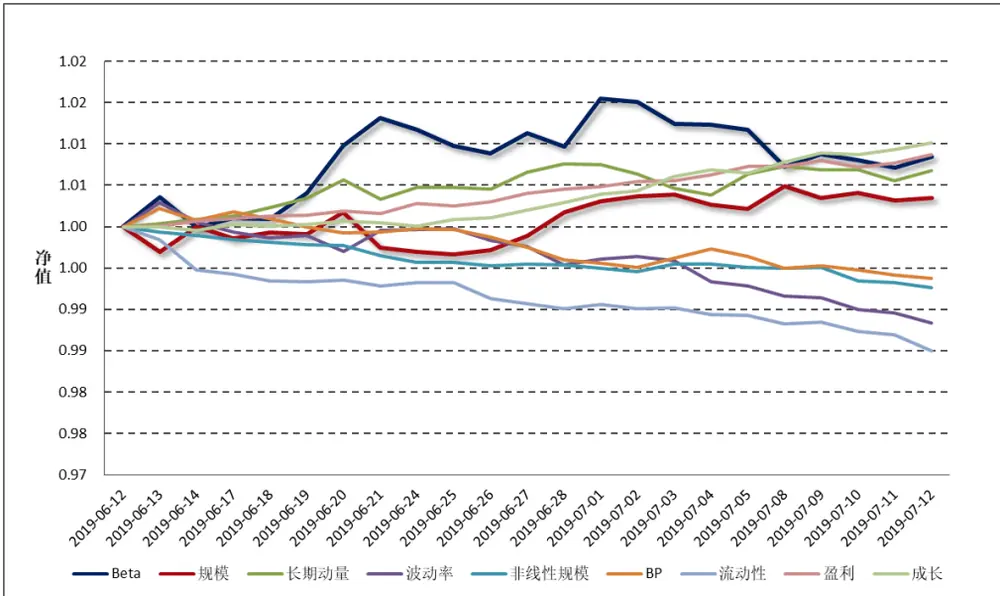
数据来源：财通证券研究所，Wind

图 17 和图 18 分别展示了最近一个月各类风格因子的净值走势及累计收益，以观察各类风格因子在过去一段时间的持续盈利能力。整体来讲，在过去的一个月中，前期涨幅较高的股票能够获得相对较高的收益，而前期波动较高的股票后市将会出现较为明显的回撤。

图18：最近一个月风格因子累计收益（2019.6.12-2019.7.12）
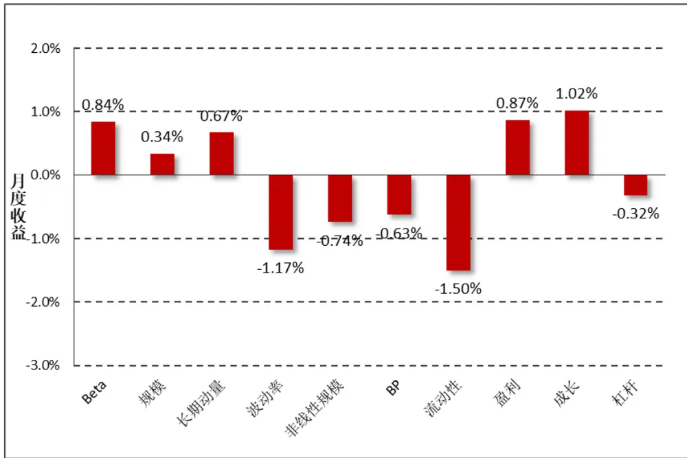
数据来源：财通证券研究所，Wind

## 3.2 指数风险预测

对收益的分解仅代表过去，对风险的预测才代表未来。多因子模型风险预测将股票风险拆解为共同风险和特质风险两部分，在通过稳健调整对共同风险矩阵和特质风险矩阵进行估计后，即可根据指数的成分股权重来估计指数在未来一段时间的波动情况。为了保证结果的严谨性，此处我们直接采用 Wind 提供的成分股权重数据，而非根据自由流通市值计算得到，尽管二者的结果十分类似。

$$
Risk(P)=W^{\prime}VW=W^{\prime}(X^{\prime}FX+\Delta)W
$$

图 19 展示了财通金工样本指数在未来一个月的预测波动率，为了方便展示我们将估计的月度波动率进行年化，波动的预测时间为上周最后一个交易日（ ）。可以看到，所有样本指数未来一月的年化波动区间在 之间，预测波动与上周出现较为明显的回落，总体而言近期市场处于窄幅震荡状态，波动率的提升并不明显。中小板股票、成长类指数的风险较大，而偏大盘股票、价值类股票的风险普遍较小。

图19：财通金工样本指数未来一月波动预测（年化）（2019.7.12-2019.8.12）
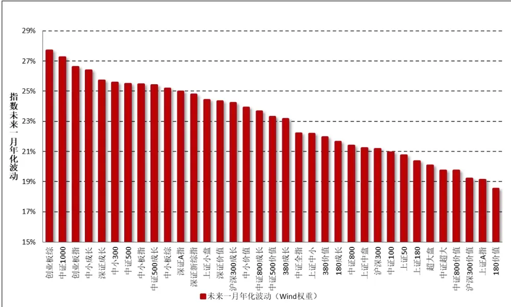
数据来源：财通证券研究所，Wind

由于在计算股票的风格因子时，我们会对暂停上市的股票、大类因子值存在缺失的股票进行剔除，因此在进行收益归因和风险预测时，并非所有指数成分股都纳入到了模型中，如果缺失股票个数过多或者缺失股票的权重占比过大，将会对模型结果造成较大影响。图 20 展示了各大指数在模型拟合过程中，纳入考虑的股票个数（权重）占指数成分股个数（权重）的比例，可以看到所有指数的比例均在 92%以上，数据质量的拟合较为合意。

图20：收益回归/风险预测样本股票占指数成分股比率
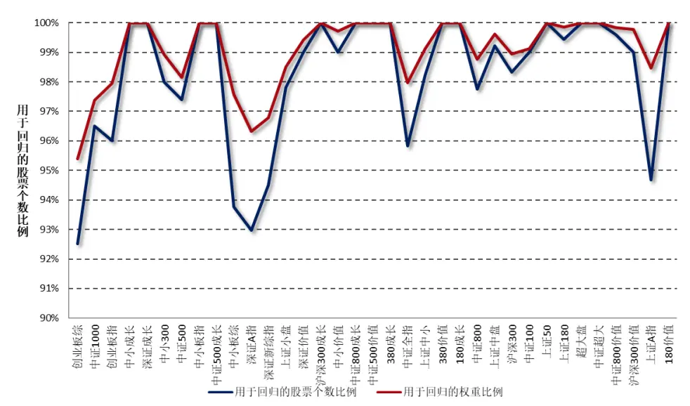
数据来源：财通证券研究所，Wind

## 4、 指数成分收益归因：

本部分财通金工对上周表现最好的三只指数和表现最差的三只指数进行归因分析，以观察涨幅较高（或较低）的指数风险暴露是否展现出较高的趋同性以及两类指数的持股风格是否会表现出明显的差别，其结果如图 21 和图 22 所示。

图21：上周表现最好三指数因子暴露度
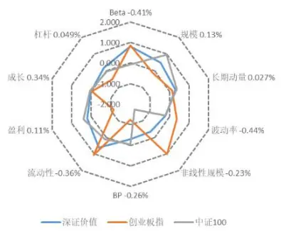
数据来源：财通证券研究所，Wind

图22：上周表现最差三指数因子暴露度
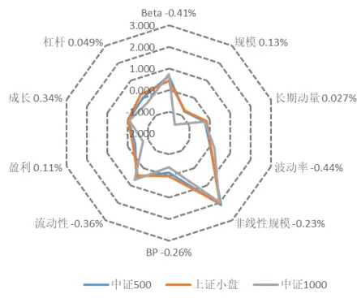
数据来源：财通证券研究所，Wind

表 4 展示了各大指数上周在各类因子上的暴露程度，可以看到，上周市场普跌，并未呈现出明显的风格偏好，表现最好的三只指数有以中小盘为代表的创业板指，也有以大盘为代表的中证 100，而表现较差的三只指数则更多地偏向于中小市值股票，其在非线性规模因子上的较大暴露和在规模因子上的极小暴露拖累指数收益。

表4：指数在风格因子上的暴露程度（2019.7.5）

| 代码 | 指数名称 | Beta -0.41% | 规模0.13% | 长期动量 0.0 | 波动率 -0.44 | 非线性规模 | - BP -0.26% | 流动性-0.36 | 盈利 0.11% | 成长 0.34% | 杠杆 0.049% 实 | 际收益 |
| --- | --- | --- | --- | --- | --- | --- | --- | --- | --- | --- | --- | --- |
| 399348.SZ | 深证价值 | 0.806 | 0.501 | 0.296 | -0.204 | -0.342 | -0.295 | 0.604 | 0.202 | 0.012 | 0.192 | -1.80% |
| 399006.SZ | 创业板指 | 0.843 | -0.144 | 0.134 | 0.374 | 1.011 | -1.241 | 1.047 | -1.138 | -0.029 | -0.507 | -1.92% |
| 000903.SH | 中证100 | -0.080 | 0.980 | 0.357 | -0.215 | -1.675 | -0.051 | 0.107 | 0.396 | 0.066 | -0.043 | -1.96% |
| 000016.SH | 上证50 | -0.269 | 0.990 | 0.373 | -0.292 | -1.809 | 0.148 | 0.017 | 0.594 | 0.120 | -0.071 | -2.02% |
| 000980.CSI | 中证超大 | -0.307 | 0.991 | -0.026 | -0.195 | -1.824 | 0.340 | -0.107 | 0.477 | -0.143 | 0.085 | -2.08% |
| 000300.SH | 沪深300 | 0.102 | 0.759 | 0.243 | -0.112 | -0.882 | -0.176 | 0.277 | 0.170 | 0.101 | -0.017 | -2.17% |
| 000010.SH | 上证180 | -0.164 | 0.807 | 0.265 | -0.180 | -1.086 | 0.074 | 0.129 | 0.405 | 0.140 | 0.003 | -2.40% |
| 000906.SH | 中证800 | 0.217 | 0.402 | 0.124 | -0.084 | -0.179 | -0.162 | 0.334 | 0.049 | 0.068 | 0.000 | -2.50% |
| H30356.CSI | 中证800价值 | -0.240 | 0.654 | 0.126 | -0.348 | -0.811 | 0.590 | -0.013 | 0.961 | 0.028 | 0.393 | -2.51% |
| 000028.SH | 180成长 | -0.006 | 0.811 | 0.512 | -0.007 | -1.043 | -0.540 | 0.271 | 0.164 | 0.132 | -0.080 | -2.55% |
| 000919.CSI | 沪深300价值 | -0.578 | 0.859 | 0.171 | -0.346 | -1.259 | 0.734 | -0.202 | 1.153 | 0.067 | 0.405 | -2.55% |
| H30355.CSI | 中证800成长 | 0.503 | 0.525 | 0.403 | -0.044 | -0.378 | -0.907 | 0.586 | -0.162 | 0.128 | -0.156 | -2.64% |
| 000918.SH | 沪深300成长 | 0.484 | 0.792 | 0.556 | -0.072 | -0.973 | -1.033 | 0.565 | -0.167 | 0.114 | -0.240 | -2.65% |
| 399100.SZ | 深证新综指 | 0.726 | -0.576 | -0.101 | 0.137 | 0.832 | -0.560 | 0.592 | -0.572 | 0.004 | -0.219 | -2.66% |
| 000002.SH | 上证A指 | -0.279 | 0.262 | 0.053 | -0.024 | -0.358 | 0.234 | -0.112 | 0.224 | 0.011 | 0.067 | -2.68% |
| 399346.SZ | 深证成长 | 0.941 | 0.227 | -0.180 | 0.088 | 0.400 | -0.850 | 0.906 | -0.396 | -0.083 | 0.099 | -2.68% |
| 399107.SZ | 深证A指 | 0.693 | -0.603 | -0.066 | 0.229 | 0.856 | -0.616 | 0.734 | -0.633 | 0.009 | -0.261 | -2.78% |
| 000985.CSI | 中证全指 | 0.340 | -0.223 | 0.012 | 0.014 | 0.323 | -0.242 | 0.412 | -0.190 | 0.030 | -0.101 | -2.82% |
| 399102.SZ | 创业板综 | 0.901 | -1.138 | -0.135 | 0.386 | 1.171 | -1.002 | 0.941 | -1.161 | -0.043 | -0.585 | -2.88% |
| 000029.SH | 180价值 | -0.788 | 0.897 | 0.109 | -0.321 | -1.393 | 0.918 | -0.331 | 1.235 | -0.013 | 0.354 | -2.93% |
| 399005.SZ | 中小板指 | 0.832 | 0.189 | -0.288 | 0.161 | 0.701 | -0.960 | 0.778 | -0.688 | 0.045 | -0.268 | -2.99% |
| 399101.SZ | 中小板综 | 0.638 | -0.734 | -0.313 | 0.251 | 1.124 | -0.680 | 0.541 | -0.737 | -0.061 | -0.338 | -2.99% |
| 000043.SH | 超大盘 | -0.396 | 0.995 | 0.065 | -0.243 | -1.880 | 0.253 | -0.013 | 0.542 | -0.097 | 0.008 | -3.02% |
| 399602.SZ | 中小成长 | 0.909 | -0.082 | -0.478 | 0.275 | 0.952 | -0.890 | 0.862 | -0.583 | -0.151 | -0.189 | -3.06% |
| 000118.SH | 380价值 | -0.041 | -0.802 | -0.277 | -0.322 | 1.998 | 0.767 | -0.112 | 0.807 | -0.026 | 0.476 | -3.07% |
| 399008.SZ | 中小300 | 0.774 | -0.315 | -0.276 | 0.213 | 1.225 | -0.810 | 0.743 | -0.713 | -0.036 | -0.309 | -3.08% |
| 399604.SZ | 中小价值 | 0.589 | -0.346 | 0.010 | 0.107 | 1.220 | -0.374 | 0.478 | -0.076 | -0.161 | -0.182 | -3.12% |
| 000044.SH | 上证中盘 | 0.041 | 0.451 | 0.053 | 0.039 | 0.328 | -0.069 | 0.349 | 0.036 | 0.177 | 0.149 | -3.16% |
| 000117.SH | 380成长 | 0.181 | -0.809 | -0.195 | -0.021 | 1.971 | -0.425 | 0.470 | 0.098 | -0.114 | 0.011 | -3.29% |
| H30352.CSI | 中证500价值 | 0.287 | -0.787 | -0.307 | -0.377 | 2.153 | 0.761 | 0.178 | 0.674 | -0.083 | 0.356 | -3.30% |
| H30351.CSI | 中证500成长 | 0.670 | -0.647 | -0.216 | 0.025 | 2.099 | -0.351 | 0.710 | -0.127 | 0.027 | 0.019 | -3.36% |
| 000046.SH | 上证中小 | 0.207 | -0.066 | -0.040 | 0.047 | 1.060 | -0.043 | 0.390 | -0.089 | 0.095 | 0.172 | -3.43% |
| 000905.SH | 中证500 | 0.643 | -0.766 | -0.255 | 0.013 | 2.120 | -0.161 | 0.549 | -0.375 | -0.040 | 0.039 | -3.59% |
| 000045.SH | 上证小盘 | 0.424 | -0.741 | -0.162 | 0.058 | 2.015 | -0.009 | 0.443 | -0.252 | -0.012 | 0.202 | -3.77% |
| 000852.SH | 中证1000 | 0.717 | -1.522 | -0.259 | 0.233 | 1.953 | -0.418 | 0.677 | -0.729 | -0.080 | -0.293 | -3.78% |

数据来源：财通证券研究所，Wind

（附注：实习生武汉大学硕士生邵新月全程参与本课题，对本课题有重要贡献。）

## 5、 附录

附录二：财通金工风格因子定义

| 大类因子 | 子类因子 | 因子定义及计算 | 权重 | 备注 |
| --- | --- | --- | --- | --- |
| Beta | BETA | $\mathbf{r_{t}}=\alpha+\beta\mathbf{R_{t}}+\mathbf{e_{t}},$ 将单只股票过去252天的日度收益率对流通市值加权指数日度收益率进行半衰指数加权回归，半衰期为63天 | 1 | 1) 采用流通市值而非总市值加权，因为各大指数编制采用流通市值加权；2) 需要剔除当日停牌或者未上市日期的数据，并将权重进行归一化；3) 若满足条件的样本数据少于42天，我们将其 Beta 置为 NaN。 |
| 规模 | SIZE | 股票总市值取对数 | 1 | 由于PB、PE等因子的计算是基于总市值的，因此此处也用总市值 |
| 动量 | RSTR | 过去一段时间个股的累计收益率，不含最近一个月， $\begin{array}{r}{\mathrm{RSTR}=\sum_{\mathrm{t}=\mathrm{L}}^{\mathrm{T}+\mathrm{L}}\mathrm{w}_{\mathrm{t}}(\ln(1+\mathrm{r}_{\mathrm{t}}),}\end{array}$ $\mathrm{r}_{\mathrm{t}}=\mathrm{P}_{\mathrm{t}}/\mathrm{P}_{\mathrm{t}-1}-1,\quad\mathrm{T}=504,\quad\mathrm{L}=21,$ 收益率序列采用半衰指数加权，半衰期为126天 | 1 | 1)对于数据质量较好的个股，计算动量时采用了2年的数据2) 需要剔除未上市日期数据，但无需剔除停牌日期数据，并将权重归一化3)若满足条件的数据样本小于42天，我们将其动量置为NaN |
| 波动率(对Beta因子和市值因子进行正交化处理） | DASTD | 个股相对市值加权指数的超额收益率序列的半衰指数加权标准差，T=252，半衰期为42天1/2 $\mathrm{DASTD}=\left(\sum_{\mathrm{t}=1}^{\mathrm{T}}\mathrm{w}_{\mathrm{t}}\left(\mathrm{r}_{\mathrm{t}}-\mu(\mathrm{r})\right)^2\right)^{\frac{1}{2}}$ | 0.7 | 1) 采用流通市值加权计算指数收益2) 需要剔除当日停牌或者未上市日期的数据，并将权重进行归一化3) 若满足条件的数据样本小于42天，我们将其因子值置为NaN |
|  | CMRA | 表示过去12个月的波动幅度， $\begin{array}{r}{\mathrm{CMRA}=\ln(1+\operatorname*{max}\{\mathrm{Z(T)}\})-\ln(1+\operatorname*{min}\{\mathrm{Z(T)}\}),}\end{array}$ $\begin{aligned}Z(T)=\exp(\sum_{t=1}^{T}\ln(1+r_{t}))-1\quad&\\去T个月的收益率\end{aligned}$ ，表示过 | 0.15 | 以 21 天为 1 个月 |
|  | HSIGMA | 计算 Beta 时残差的标准差， $\mathrm{Hsigma}=\mathrm{std}(e_{i})$ | 0.15 | 同 Beta 因子的计算 |
| 非线性规模 | NonLinerSize | 中市值因子，将股票总市值对数的三次方对总市值对数回归，取残差的相反数 | 1 | 用于衡量市值因子的非线性性，总市值越大和越小的股票的非线性规模越小，中市值股票的非线性规模越大 |
| 估值 | BP | 市净率的倒数，1/PB | 1 | 采用 Wind 中的 pb_lf 因子的倒数 |
| 流动性(对市值因子进行正交化） | STOM | 月度换手率， $\mathrm{STOM}=\ln(\mathrm{mean}(\sum_{t=1}^{21}(V_t/S_t)))$ 其中V为当日成交量，S为流通股本 | 0.5 | 1)采用流通股本值，而非自由流通股本值2)剔除未上市、停牌日期的数据 |
|  | STOQ | 季度换手率， $\mathrm{STOQ}=\ln(\mathrm{mean}(\sum_{t=1}^{63}(V_t/S_t))),$ | 0.25 | 同 STOQ 因子的计算 |
|  | STOA | 年度换手率， $\mathrm{STOA}=\ln(\mathrm{mean}(\sum_{t=1}^{252}(V_t/S_t)))$ | 0.25 | 同 STOQ 因子的计算 |
| 盈利 | CETOP | 过去滚动12个月的经营现金流除以当前市值实际计算中取市现率 PCF（经营现金流 TTM）的倒数 | 1/2 | 采用 Wind 中的 PCF_OCF_ttm 因子的倒数 |
|  | ETOP | 过去滚动12个月的利润除以当前市值实际计算中取市盈率 PETTM 的倒数 | 1/2 | 采用 Wind 中的 PE_ttm 因子的倒数 |
| 成长 | YOYProfit | 单季度净利润同比增长率 | 1/2 | 为避免使用未来数据，需要根据季报公布时间进行调整 |
|  | YOYSales | 单季度营业收入同比增长率 | 1/2 | 同 YOYProfit 因子的计算 |
| 杠杆 | MLEV | 市场杠杆率，MLEV=（总市值+非流动负债）/总市值 | 1/3 |  |
|  | DTOA | 资产负债率，DTOA=总负债/总资产 | 1/3 |  |
|  | BLEV | 账面杠杆率，BLEV=（账面价值+非流动负债）/账面价值 | 1/3 |  |

数据来源：财通证券研究所
备注：1.波动率因子需对Beta因子和市值因子进行正交化处理；
流动性因子需对市值因子进行正交化处理；

若大类因子下所有子类因子值全部缺失，则该股票的因子值记为缺失，否则用有数据的因子值进行替代，注意需对权重进行归一化处理

## 信息披露

## 分析师承诺

作者具有中国证券业协会授予的证券投资咨询执业资格，并注册为证券分析师，具备专业胜任能力，保证报告所采用的数据均来自合规渠道，分析逻辑基于作者的职业理解。本报告清晰地反映了作者的研究观点，力求独立、客观和公正，结论不受任何第三方的授意或影响，作者也不会因本报告中的具体推荐意见或观点而直接或间接收到任何形式的补偿。

## 资质声明

财通证券股份有限公司具备中国证券监督管理委员会许可的证券投资咨询业务资格。

## 公司评级

买入：我们预计未来 6个月内，个股相对大盘涨幅在 15%以上；

增持：我们预计未来 6个月内，个股相对大盘涨幅介于 5%与 15%之间；

中性：我们预计未来 6个月内，个股相对大盘涨幅介于-5%与 5%之间；

减持：我们预计未来 6个月内，个股相对大盘涨幅介于-5%与-15%之间；

卖出：我们预计未来 6个月内，个股相对大盘涨幅低于-15%。

## 行业评级

增持：我们预计未来 6个月内，行业整体回报高于市场整体水平 5%以上；

中性：我们预计未来 6个月内，行业整体回报介于市场整体水平-5%与5%之间；

减持：我们预计未来 6个月内，行业整体回报低于市场整体水平-5%以下。

## 免责声明

本报告仅供财通证券股份有限公司的客户使用。本公司不会因接收人收到本报告而视其为本公司的当然客户。

本报告的信息来源于已公开的资料，本公司不保证该等信息的准确性、完整性。本报告所载的资料、工具、意见及推测只提供给客户作参考之用，并非作为或被视为出售或购买证券或其他投资标的邀请或向他人作出邀请。

本报告所载的资料、意见及推测仅反映本公司于发布本报告当日的判断，本报告所指的证券或投资标的价格、价值及投资收入可能会波动。在不同时期，本公司可发出与本报告所载资料、意见及推测不一致的报告。

本公司通过信息隔离墙对可能存在利益冲突的业务部门或关联机构之间的信息流动进行控制。因此，客户应注意，在法律许可的情况下，本公司及其所属关联机构可能会持有报告中提到的公司所发行的证券或期权并进行证券或期权交易，也可能为这些公司提供或者争取提供投资银行、财务顾问或者金融产品等相关服务。在法律许可的情况下，本公司的员工可能担任本报告所提到的公司的董事。

本报告中所指的投资及服务可能不适合个别客户，不构成客户私人咨询建议。在任何情况下，本报告中的信息或所表述的意见均不构成对任何人的投资建议。在任何情况下，本公司不对任何人使用本报告中的任何内容所引致的任何损失负任何责任。

本报告仅作为客户作出投资决策和公司投资顾问为客户提供投资建议的参考。客户应当独立作出投资决策，而基于本报告作出任何投资决定或就本报告要求任何解释前应咨询所在证券机构投资顾问和服务人员的意见；

本报告的版权归本公司所有，未经书面许可，任何机构和个人不得以任何形式翻版、复制、发表或引用，或再次分发给任何其他人，或以任何侵犯本公司版权的其他方式使用。