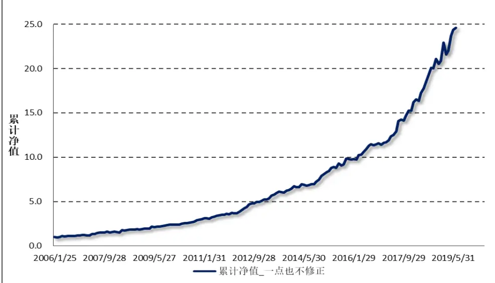
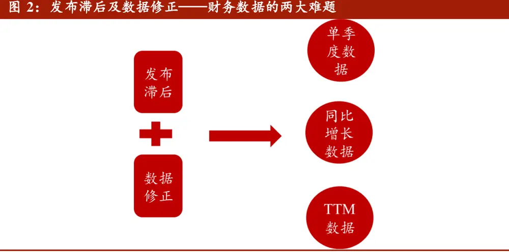
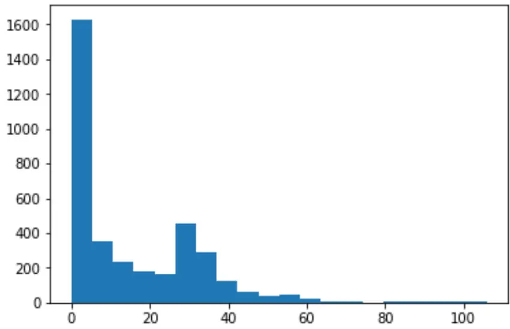
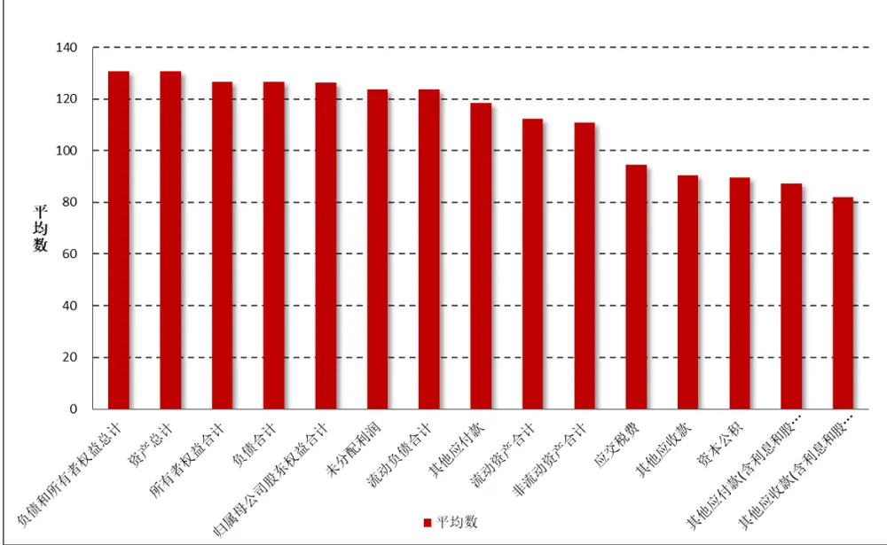
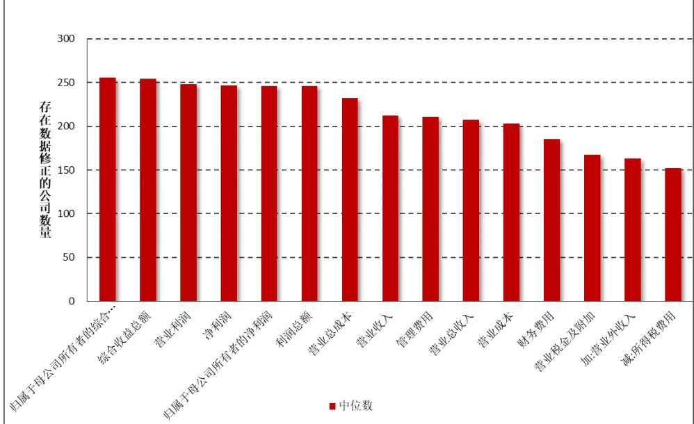
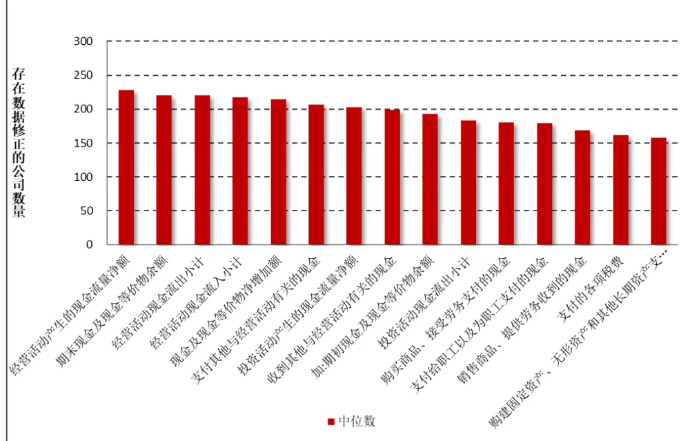
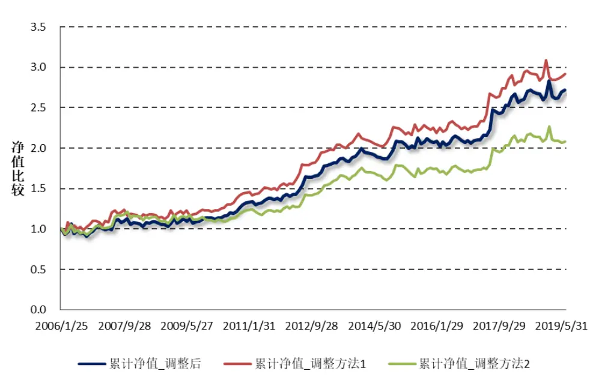
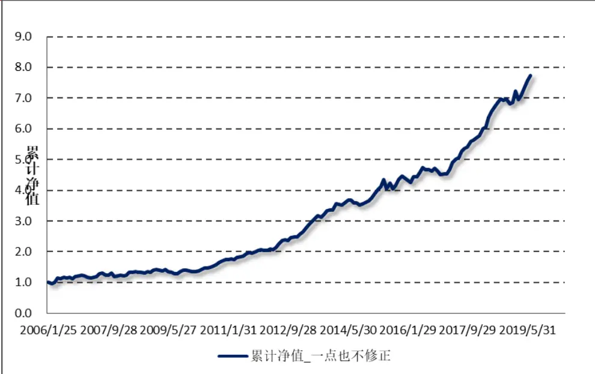
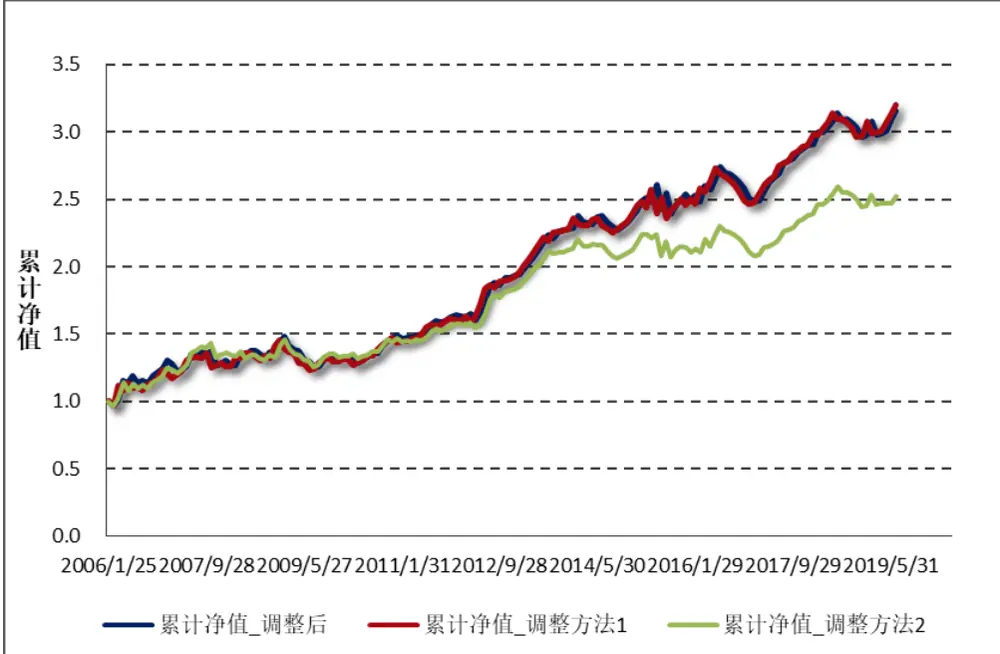

2019 年 07 月 30 日

# 水月镜花：正视财务数据的前向窥视问题

## “拾穗”多因子系列报告（第 16 期）

## 联系信息

陶勤英分析师

SAC 证书编号：S0160517100002 021-68592393

taoqy@ctsec.com

张宇研究助理

zhangyu1@ctsec.com 021-68592337

176216888421

## 相关报告

【1】“星火”多因子系列（一）：《Barra模型初探：A 股市场风格解析》

【2】“星火”多因子系列（二）：《Barra模型进阶：多因子模型风险预测》

【3】“星火”多因子系列（三）：《Barra模型深化：纯因子组合构建》

【4】“星火”多因子系列（四）：《基于持仓的基金绩效归因：始于 Brinson，归于 Barra》【5】“星火”多因子系列（五）：《源于动量，超越动量：特质动量因子全解析》

【6】“拾穗”多因子系列（一）：《带约束的加权最小二乘：一种解析解法》

【7】“拾穗”多因子系列（二）：《你看到的不一定是你所想的：解密 R 方》

【8】“拾穗”多因子系列（五）：《数据异常值处理：比较与实践》

【9】“拾穗”多因子系列（六）：《因子缺失值处理：数以多为贵》

【10】“拾穗”多因子系列（八）：《非线性规模因子：A 股市场存在中市值效应吗？》

【11】“拾穗”多因子系列（九）：《牛市抢跑者：低 Beta一定低风险吗？》

【 】“拾穗”多因子系列（十）：《行业的风格偏好：解析纯行业因子组合》

【13】“拾穗”多因子系列（十一）：《多因子风险预测：从怎么做到为什么》

【14】“拾穗”多因子系列（十三）：《恼人的显著性检验：多因子模型中 t 值的计算》【15】“拾穗”多因子系列（十四）：《补充：基于特质动量因子的沪深 300 增强策略》【16】“拾穗”多因子系列（十五）：《是聪明

钱吗？探析外资持股的风格偏好》

## 投资要点：

- 水月镜花：正视财务数据的前向窥视问题

- 财务数据处理中主要面临两大难题：发布滞后及数据修正；

- 这两大难题主要对如下三类数据的计算产生影响：同比增长率数据、单季度数据、TTM 数据；

- 通过对多种数据修正方法进行比较发现，一点也不修正的方式存在极大的前向偏差，将会导致因子回测的表现过度虚高；而根据证监会规定的公告截止日调整尽管在处理起来相对简便，但仍然存在较为明显的滞后性；直接采用第三方数据处理后的因子可能会用到被修正的数据从而间接使用到未来数据。财通金工花了较大精力解决了财务数据的发布时间和数据修正问题，从而得到一个与实际情况最为贴近的数据集。

- 风险提示：本报告统计结果基于历史数据，过去数据不代表未来，市场风格变化可能导致模型失效。

在实际投资中，多因子模型被广泛地应用到资产定价、绩效归因、风险控制、组合优化、基金评价及资产配置等各个领域，一套完整、精细的多因子系统成为每位量化研究者必备的工具。“做最实用的研究”，是财通金工给自己的定位。我们将在之后的系列报告中，就投资者们最关心也最容易忽略的很多细节问题进行探讨，介绍我们在实际应用中遇到的问题和思考，以飨读者。

我们为本系列报告取名“拾穗”。一周市场风云变幻，和风细雨也好，狂风骤雨也罢，都留下一地故事等待梳理。作为勤劳的搬运工，财通金工从量化视角出发对市场风格进行捕捉、对风险水平进行预测，既是希望能够如拾穗者般专心、踏实地做研究，也是祝愿各位投资者能够在市场收获满地金黄。

本期是该系列报告的第 16期，主要就策略回测中财务因子的处理细节展开探讨。发布滞后及数据修正是处理财务数据时面临的两大难题，如果不对二者进行处理，那么在回测中很容易使用到未来数据，从而得到优于实际的回测结果。在本报告中我们首先对财务数据存在的这些问题进行描述，探讨其对各种类别的数据产生的具体影响，最后以两个单季度同比指标为例对不同修正方法下的数据进行比较，从而让投资者有一个比较直观的理解。

## 1、 发布滞后及数据修正：财务数据处理的两大难题

随时信息化时代的到来，量化研究者使用的数据量越来越大，使用的模型越来越复杂，但是我们是否想过我们使用的数据集本身就存在一些问题？“对Alpha 因子库进行搭建”是财通金工三季度的重要工作，在数据处理过程中我们难免会涉及到对财务数据的处理。与价量因子不同，财务因子的公布频率低、发布期存在滞后，且通常会对前期数据进行修正，因此如何获取特定时间点上能够获取的最新信息是我们必须重视的问题。基于此，财通金工花了较大的精力对财务数据进行清洗，初步得到一个质量相对较优的数据集。在本期讨论中，财通金工就和大家分享一下我们在数据处理过程中遇到的一些问题及解决思路，以期与各位投资者共同探讨。

## 1.1 看上去的美好

在进入到正文之前，我们先来观察一个单季度净利润同比增长率因子（NetProfitQYOY）的多空回测效果，其结果如图 1 所示。可以看到，这个因子在A股市场上多空组合的收益十分惊人，RankIC均值达到7.33%，月胜率为77%，t 值达到 9.45。

图 1：未考虑发布滞后及数据修正的单季度净利润同比增长率因子多空净值

数据来源：财通证券研究所，Wind
谨请参阅尾页重要声明及财通证券股票和行业评级标准

数据来源：财通证券研究所整理

然而在实际投资中，单季度净利润同比增长率的效果真的如上述回测中表现地那么好吗？答案是否定的，因为上面的因子计算时在事实上使用了未来数据。在上述的因子构建时，我们首先从 Wind 中提取出所有股票在回测区间内的单季度净利润同比增长率数据，并随后将季度数据填充为日度数据，其填充方法如下：

（1） 每年 4 月 1 日至 6 月 30日，填充为当年一季度数据；

（2） 每年 7 月 1 日至 9 月 30日，填充为当年二季度数据；

（3） 每年 10 月 1 日至 12 月 31日，填充为当年三季度数据；

（4） 每年 1 月 1 日至 3 月 31日，填充为当年四季度数据。

很容易看到，上面这种在季度结束之后立即采用当季数据进行填充的方式是存在问题的。由于上市公司定期报告通常具有一定滞后期，在季度结束之后的翌日并不能立即获取到上市公司的财务信息，因此这种处理方式实际上使用了未来数据，因此该因子看上去的回测效果在实际应用中如水中月、镜中花般不可企及了。

## 1.2 发布滞后及数据修正

财务数据的处理通常会面临发布滞后及数据修正问题，本小节我们将就这两个方面进行探讨。

首先是发布滞后问题，根据证监会发布的《上市公司信息披露管理办法》第二十条，上市公司的定期报告发布的时间规定如下：

（1） 年度报告应当在每个会计年度结束之日起 4 个月内；

（2） 中期报告应当在每个会计年度的上半年结束之日起 2 个月内；

（3） 季度报告应当在每个会计年度第 3 月、第 9 个月结束后的 1 个月内编制完成并披露。

根据上述条款，我们即可大概总结出各类定期报告的披露截止日的规定：

（1） 一季报：最迟 4 月 30 日；

（2） 半年报：最迟 8 月 30 日；

（3） 三季报：最迟 10 月 30 日；

（4） 年报：最迟次年 4 月 30 日。

对于上市公司公告发布时间的规定，相信绝大多数投资者都有详细的了解，但是财通金工想要提醒如下两点：

首先，并非所有公司都会按照如上规定的截止日期公布定期报告。如表 1 所示，有三家上市公司直至 5 月和6 月底才公布 2018 年年报及 2019 年一季报，这一时间点已经大大超出了证监会规定的截止日期。当然我们也可以看到，这样的股票毕竟只是少数，而且全部都是 ST 股票。此外，公司在证监会规定截止日之前还会发布《关于预计无法在法定期限披露定期报告的风险提示公告》。

表 1：超过截止日期后公布报告期案例

| 股票代码 | 股票简称 | 报告期 | 信息发布日期 | 公司上市日期 |
| --- | --- | --- | --- | --- |
| 600610.SH | *ST 毅达 | 2018-12-31 | 2019-06-28 | 1992-08-05 |
| 600145.SH | *ST 新亿 | 2018-12-31 | 2019-05-09 | 1999-09-23 |
| 002263.SZ | *ST 东南 | 2018-12-31 | 2019-06-28 | 2008-07-28 |
| 600610.SH | *ST 毅达 | 2019-03-31 | 2019-06-28 | 1992-08-05 |
| 600145.SH | *ST 新亿 | 2019-03-31 | 2019-05-22 | 1999-09-23 |
| 002263.SZ | *ST 东南 | 2019-03-31 | 2019-06-28 | 2008-07-28 |

数据来源：财通证券研究所

其次，信息发布滞后的另一个需要注意的地方在于，很多上市公司的一季报和年报会选择在同一时间公布。以 2018 年年报和 2019 年一季报公布日期为例，展示了 A股共 3638 家公司的公布日期间隔天数的直方图。可以看到，共有 1245家公司的年报和季报选择在同一天公布（占比 34%），间隔时间不足 5 天的上市公司达到 1629 家（占比 45%），间隔时间不足 10 天的上市公司达到 1981 家（占比 54%）。如果公司的年报和一季报数据同时公布，那么在使用资产负债表中的指标时，我们就应该采用当前时刻能够获取到的最新数据。

图 3：2018 年年报及 2019年一季报间隔天数直方图

数据来源：财通证券研究所，恒生聚源

数据修正是财务因子面临的第二个问题，通常公司在发布定期报告时会对过往报告期的数据进行修正（通常在两年以内的报告期）。关于数据修正，财通金工提醒大家注意如下三点：

（1） 财务数据的修正有时并不需要很长的时间，有时在短短的一个季度甚至一个月内就会存在数据修正。如吉峰科技（300022.SZ）在 2019年 4 月 28 日发布一季报后，随即在 4 月 30 日又发布了一次补充更正报告。

（2）前面提到，很多上市公司的年报和一季报会在同一时间公布。然而，这两个报告中对于同一报告期的同一指标数据也未必相同，也就是说公司的一季报会对年报数据进行更正，尽管这两个公告是在同一天发布的。例如，中原特钢（002423.SZ）的年报和一季报均在 2019年 4 月 30 日发布，其中年报中披露的归属母公司股东所有者权益合计为 14.55 亿元，而一季报中披露的该指标为 178.7 亿元。

（3） 如果单纯地从 Wind API 接口中提取历史数据，那么将很可能提取的是经过修正后的指标。例如东软载波（300183.SZ）在 2019 年 5 月30 日对前期的数据进行了更正，此时 Wind 采取的是直接覆盖式的处理方法。

## 1.3 细分基础因子的计算

在了解了财务数据可能存在的问题之后，下面我们探讨其可能对哪些类别的数据计算造成影响，此处我们分别讨论同比增长率数据、单季度数据和 TTM 数据三种：

（1） 同比增长率：财务数据的同比增长计算相对简单，即将本期数据除以去年同期数据再减去 1 即可；

（2） 单季度数据：对于单季度数据，一、三季度数据直接采用报告中的数据，二季度数据等于半年报数据减去一季度数据，四季度数据等于年报数据减去三季度数据；

（3） TTM 数据：如果最新报告期是年报，则 TTM 数据等于年报数据；如果最新报告期不是年报，则 TTM= 半期数据 + （上年年报 – 上年同期合并数）；

为了描述的简便性，图 4 以 TTM 指标计算为例，简要说明存在数据修正的情况下如何计算更符合实际的数据。假设在 2018 年 9 月 30 日对 2017 年年报中的数据进行了修正，那么在 6 月 30 日时，计算该指标还只能用原始值，但是在9 月 30 日的时候就应该用修正过后的指标了。

图 4：数据修正下TTM数据的处理

| $\frac{A_{0}+A_{1}+A_{2}+A_{3}}{4}$ |  |  |  |  |  |
| --- | --- | --- | --- | --- | --- |
| A0 | A1 | A2 | A3 | A4 | A5 |
| 20170930 | 20171231 | 20180331 | 20180630 | 1 20180930 | 上 20181231 |
|  | A1 |  |  |  |  |
|  | 20180930 |  |  | $\frac{A_{1}^{\prime}+A_{2}+A_{3}+A_{4}}{4}$ |  |

数据来源：财通证券研究所

## 2、 哪些指标容易被修正？

在理解了财务因子存在的部分问题后，本小节我们从资产负债表、利润表和现金流量表中，观察每个报告期各个指标存在修正的公司数量，并取中位数或者平均数，从而方便投资者对经常被修正的指标有更加直观的认识（报告期取 2010年一季报到 2019 年三季报）。如果在某些指标中存在修正的公司数量较多，而该指标是我们通常用于构建 Alpha 因子的指标，那数据修正问题就更加值得引起我们的重视。

图 5：资产负债表各指标历年报告期存在修正的公司数量（平均数）

数据来源：财通证券研究所，Wind

图 5 展示了资产负债表中，历年报告期存在修正的公司数量平均值排名前十五的指标，可以看到经常被修正的数据有负债和所有者权益合计、资产总计、负债总计、归属母公司股东权益合计等数据，这些数据通常被用于杠杆率、ROE、ROA等因子的计算中。

图 6：利润表各指标历年报告期存在修正的公司数量（中位数）

数据来源：财通证券研究所，Wind

图 6 展示了利润表中，历年报告期存在修正的公司数量中位数排名前十五的指标，可以看到经常被修正的数据有归属母公司所有者的综合收益、营业利润、净利润、营业收入、管理费用等指标，这些指标常用于成长因子和盈利因子的计算。

图 7：现金流量表各指标历年报告期存在修正的公司数量（中位数）

数据来源：财通证券研究所，Wind

图 7 展示了现金流量表中，历年报告期存在修正的公司数量中位数排名前十五的指标，可以看到经常被修正的数据有经营活动产生的现金流量净额等数据，这些指标常用于衡量公司的营运能力。

## 3、 水月镜花：不同方法修正的财务数据后果比较

本次讨论的最后一个部分，我们来关注不同的数据修正方法对最终的策略回测的影响究竟存在怎样的区别。我们分别对如下几种方式进行调整：

（1） 不修正：不考虑信息发布滞后及数据修正问题，在每个季度结束之后的第二日即认为可以获得上一季度对应的数据，这种数据处理方法的偏差最为严重；

（2）调整方法 1：仅考虑数据发布的滞后问题，从 Wind 中一次性提取每个报告期的数据及对应的发布时间，根据发布时间向后填充。这种方法考虑到了信息的发布滞后问题，但是对数据的修正未做处理，一定程度上用到了未来数据；

（3） 调整方法 2：同样考虑发布的滞后问题，从 Wind 中一次性提取每个报告期的数据，并按照证监会规定的公告发布截止时点进行填充，具体表现为：4 月 30 日之后可使用一季度数据、8 月 31 日之后可使用半年报数据、10 月 31 日之后可使用三季报数据、次年 4 月 30 日之后可使用年报数据。这种修正方法处理起来最为方便，在一定程度上考虑了信息的发布滞后问题，但由于部分公司会在截止日之前发布公告，因此这种方式的信息过于滞后，同样未对数据修正进行处理；

（4） 调整后：同时考虑信息发布的滞后及数据修正的问题，深入到每个公告的发布时点上，获取该发布时点时投资者能够获得的最新数据，并根据当下所能获得的最新数据计算因子指标，这种处理最为复杂，但是与实际能够获得的数据最为接近，不存在未来数据的使用问题。

下面我们以单季度净利润同比增长率和单季度营业收入同比增长率因子为例，展示不同修正方法下在全样本股票中的多空组合的净值比较。

图 8：单季度净利润同比增长率多空组合净值比较（2005.12.31-2019.6.28）

数据来源：财通证券研究所，恒生聚源

图 展示了三种修正方法下单季度净利润同比增长率因子的多空组合净值比较，可以看到，仅考虑发布滞后问题但不考虑数据修正问题的调整方法 1 的表现最佳，因为它在一定程度上使用了未来数据；相较之下，按照证监会规定的公告发布截止时点进行调整的调整方法 2 由于存在一定程度的信息滞后，所以其表现最差；而财通金工处理得到的最为接近实际的数据集的表现居于中间，它反映了该因子的真实表现。

图 9：未考虑发布滞后及数据修正的单季度营业收入同比增长率因子多空净值

数据来源：财通证券研究所，恒生聚源

下面我们对单季度营业收入同比增长率因子的不同修正情况下表现进行考察，图 9 展示了不考虑发布滞后及数据修正的情况下该因子在全 A 股中的选股情况，其 RankIC 达到 4.07%，月胜率 70%，t 值达到 6.28，但是这一因子存在严重的前向窥视问题，与实际情况最不相符。

图 10：单季度营业收入同比增长率多空组合净值比较（2005.12.31-2019.6.28）

数据来源：财通证券研究所，恒生聚源

图 10 展示了三种修正方法下单季度营业收入同比增长率因子的多空组合净值比较，可以看到，仅考虑发布滞后问题但不考虑数据修正问题的调整方法 1 的和经过多项调整的真实数据集的表现比较类似，而按照证监会规定的公告发布截止时点进行调整的调整方法 2 由于存在一定程度的信息滞后，其表现大幅落后调整后的真实因子走势。

## 4、 小结

本期“拾穗”系列专题，我们对财务因子的处理细节展开讨论，介绍财务数据处理过程中面临的问题及解决方法的比较，主要结论如下：

（1） 财务数据处理中主要面临两大难题：发布滞后及数据修正；

（2） 在计算财务因子的同比增长率数据、单季度数据和 TTM 数据时，尤其需要考虑数据修正带来的影响；

（3）通过对多种数据修正方法进行比较发现，一点也不修正的方式存在极大的前向偏差，将会导致因子回测的表现过度虚高；而根据证监会规定的公告截止日调整尽管在处理起来相对简便，但仍然存在较为明显的滞后性；直接采用第三方数据处理后的因子可能会用到被修正的数据从而间接使用到未来数据。财通金工花了较大精力解决了财务数据的发布时间和数据修正问题，从而得到一个与实际情况最为贴近的数据集。

## 信息披露

## 分析师承诺

作者具有中国证券业协会授予的证券投资咨询执业资格，并注册为证券分析师，具备专业胜任能力，保证报告所采用的数据均来自合规渠道，分析逻辑基于作者的职业理解。本报告清晰地反映了作者的研究观点，力求独立、客观和公正，结论不受任何第三方的授意或影响，作者也不会因本报告中的具体推荐意见或观点而直接或间接收到任何形式的补偿。

## 资质声明

财通证券股份有限公司具备中国证券监督管理委员会许可的证券投资咨询业务资格。

## 公司评级

买入：我们预计未来 6个月内，个股相对大盘涨幅在 15%以上；

增持：我们预计未来 6个月内，个股相对大盘涨幅介于 5%与 15%之间；

中性：我们预计未来 6个月内，个股相对大盘涨幅介于-5%与 5%之间；

减持：我们预计未来 6个月内，个股相对大盘涨幅介于-5%与-15%之间；

卖出：我们预计未来 6个月内，个股相对大盘涨幅低于-15%。

## 行业评级

增持：我们预计未来 6个月内，行业整体回报高于市场整体水平 5%以上；

中性：我们预计未来 6个月内，行业整体回报介于市场整体水平-5%与5%之间；

减持：我们预计未来 6个月内，行业整体回报低于市场整体水平-5%以下。

## 免责声明

本报告仅供财通证券股份有限公司的客户使用。本公司不会因接收人收到本报告而视其为本公司的当然客户。

本报告的信息来源于已公开的资料，本公司不保证该等信息的准确性、完整性。本报告所载的资料、工具、意见及推测只提供给客户作参考之用，并非作为或被视为出售或购买证券或其他投资标的邀请或向他人作出邀请。

本报告所载的资料、意见及推测仅反映本公司于发布本报告当日的判断，本报告所指的证券或投资标的价格、价值及投资收入可能会波动。在不同时期，本公司可发出与本报告所载资料、意见及推测不一致的报告。

本公司通过信息隔离墙对可能存在利益冲突的业务部门或关联机构之间的信息流动进行控制。因此，客户应注意，在法律许可的情况下，本公司及其所属关联机构可能会持有报告中提到的公司所发行的证券或期权并进行证券或期权交易，也可能为这些公司提供或者争取提供投资银行、财务顾问或者金融产品等相关服务。在法律许可的情况下，本公司的员工可能担任本报告所提到的公司的董事。

本报告中所指的投资及服务可能不适合个别客户，不构成客户私人咨询建议。在任何情况下，本报告中的信息或所表述的意见均不构成对任何人的投资建议。在任何情况下，本公司不对任何人使用本报告中的任何内容所引致的任何损失负任何责任。

本报告仅作为客户作出投资决策和公司投资顾问为客户提供投资建议的参考。客户应当独立作出投资决策，而基于本报告作出任何投资决定或就本报告要求任何解释前应咨询所在证券机构投资顾问和服务人员的意见；

本报告的版权归本公司所有，未经书面许可，任何机构和个人不得以任何形式翻版、复制、发表或引用，或再次分发给任何其他人，或以任何侵犯本公司版权的其他方式使用。