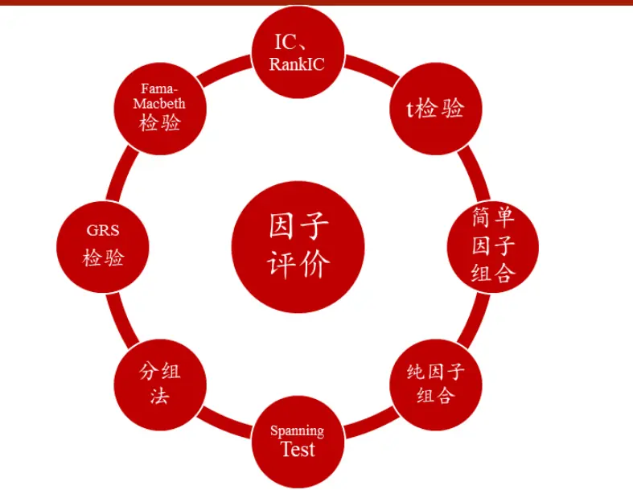
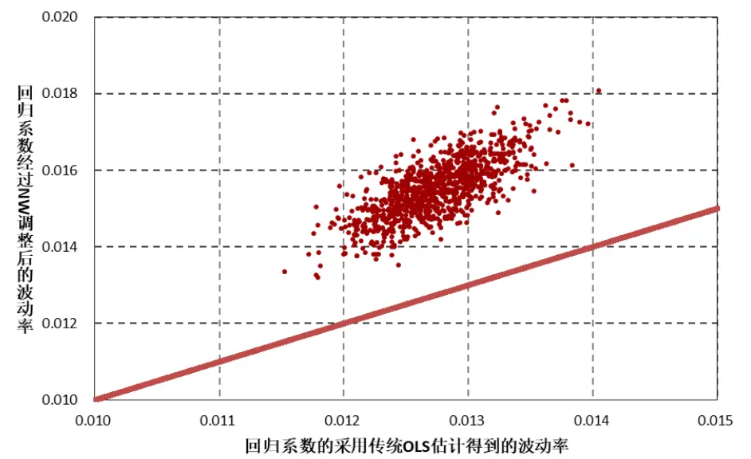
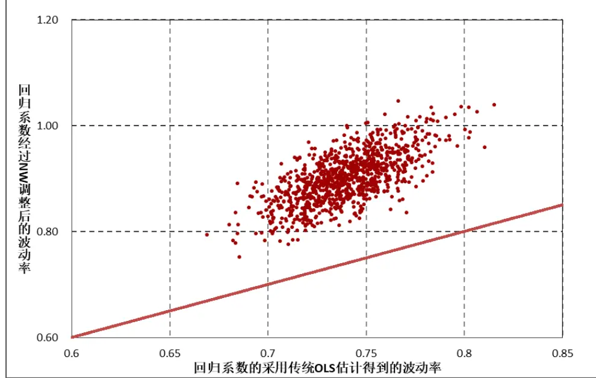
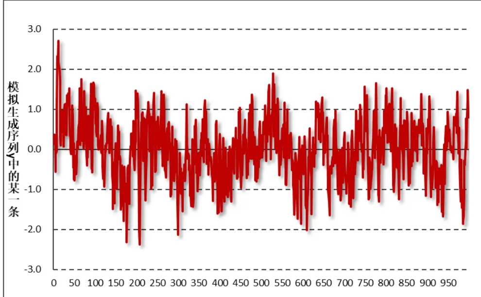
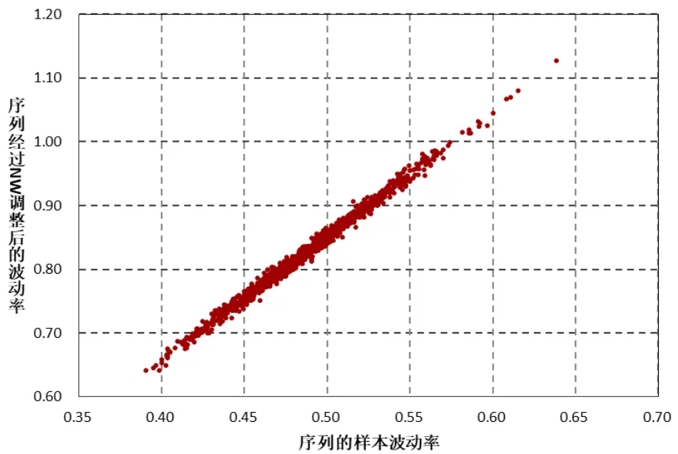

2019 年 08 月 13 日

## 联系信息

陶勤英分析师

SAC 证书编号：S0160517100002 021-68592393

taoqy@ctsec.com

张宇研究助理

zhangyu1@ctsec.com 021-68592337

176216888421

## 相关报告

【1】“星火”多因子系列（一）：《Barra模型初探：A 股市场风格解析》

【2】“星火”多因子系列（二）：《Barra模型进阶：多因子模型风险预测》

【3】“星火”多因子系列（三）：《Barra模型深化：纯因子组合构建》

【4】“星火”多因子系列（四）：《基于持仓的基金绩效归因：始于 Brinson，归于 Barra》【5】“星火”多因子系列（五）：《源于动量，超越动量：特质动量因子全解析》

【 】“拾穗”多因子系列（一）：《带约束的加权最小二乘：一种解析解法》

【7】“拾穗”多因子系列（二）：《你看到的不一定是你所想的：解密 R 方》

【8】“拾穗”多因子系列（五）：《数据异常值处理：比较与实践》

【9】“拾穗”多因子系列（六）：《因子缺失值处理：数以多为贵》

【10】“拾穗”多因子系列（八）：《非线性规模因子：A 股市场存在中市值效应吗？》

【11】“拾穗”多因子系列（九）：《牛市抢跑者：低 Beta一定低风险吗？》

【12】“拾穗”多因子系列（十一）：《多因子风险预测：从怎么做到为什么》

【13】“拾穗”多因子系列（十三）：《恼人的显著性检验：多因子模型中 t 值的计算》

【15】“拾穗”多因子系列（十六）：《水月镜花：正视财务数据的前向窥视问题》

因子检验中的时序相关性处理：Newey-West 调整

## “慧博资讯”专业的投资研究大数据分享平台

请阅读最后一页的重要声明

## “拾穗”多因子系列报告（第 17 期）

## 投资要点：

- Newey-West 调整的基本原理

- 在传统的多因子模型中，由于收益序列存在异方差和自相关特性，使得对其标准差的估计存在偏差，从而导致因子显著性检验结果失真。

- Newey-West 调整通过在计算协方差矩阵时加入自相关调整项，能够有效规避序列自相关对协方差矩阵估计带来的影响。

## Newey-West 调整的应用测试

- 根据蒙特卡洛模拟结果显示，当序列存在自相关时，经过Newey-West 调整后计算得到的序列标准差估计与其真实方差之间存在极高的相关性。当残差项自相关系数大于 0 时，NW 调整后序列标准差的估计大于传统的 OLS 估计结果（反之，当自相关系数小于 0 时，NW 调整估计得到的标准差小于 OLS 估计结果）。

- 风险提示：本报告统计结果基于历史数据，过去数据不代表未来，市场风格变化可能导致模型失效。

在实际投资中，多因子模型被广泛地应用到资产定价、绩效归因、风险控制、组合优化、基金评价及资产配置等各个领域，一套完整、精细的多因子系统成为每位量化研究者必备的工具。“做最实用的研究”，是财通金工给自己的定位。我们将在之后的系列报告中，就投资者们最关心也最容易忽略的很多细节问题进行探讨，介绍我们在实际应用中遇到的问题和思考，以飨读者。

我们为本系列报告取名“拾穗”。一周市场风云变幻，和风细雨也好，狂风骤雨也罢，都留下一地故事等待梳理。作为勤劳的搬运工，财通金工从量化视角出发对市场风格进行捕捉、对风险水平进行预测，既是希望能够如拾穗者般专心、踏实地做研究，也是祝愿各位投资者能够在市场收获满地金黄。

本期是该系列报告的第 17 期，主要就多因子框架下常见的 Newey-West 调整的基本原理及其具体实现方式展开讨论。在“拾穗”系列（11）中，我们介绍了 Barra多因子风险估计模型中，使用因子日频收益率数据估计其月度收益波动率时， Newey-West 调整对协方差矩阵的修正作用，但文中对 Newey-West调整的内在机理并未做详尽介绍。在“拾穗”系列（13）中，我们对多因子模型中的存在异方差情况下的带约束项和不带约束项的系数 t 检验计算进行了详细说明，但并未对存在自相关情况下的 t值计算展开探讨。作为补充，在本次讨论中我们深入了剖析 Newey-West 调整的基本原理及其在因子有效性检验中的具体应用，与大家分享。

## 1、 Newey-West 调整的基本原理

在财通金工“星火”多因子系列（五）《源于动量、超越动量：特质动量因子全解析》中，我们提到因子有效性检验的常用方法有：IC/RankIC 及其t 检验、简单因子组合、纯因子组合、Spanning Test、分组法、GRS 检验、Fama-Macbeth检验等不同方法。

图 1：因子有效性检验的常用方法

数据来源：财通证券研究所，“星火”专题（五）

在上述检验方法中，组合收益均值或回归系数（即因子收益）的显著性往往成为检验目标因子是否有效的重要考量指标，而这一显著性的检验通常采用 t 检验表示。然而，由于金融序列本身往往存在很强的异方差性和自相关性，从而使得利用传统方法估计得到的收益率标准差存在一定偏差，进而导致显著性检验结果失真。

为解决这一问题，Newey and West（1987）提出了一种一般性的修正方法，使得当序列存在异方差和自相关性时仍然能够得到对其标准差的一致性估计。本文将系统性介绍 Newey-West调整的基本原理和主要实现步骤，并采用蒙特卡洛模拟法直观展示 Newey-West调整后序列方差估计值的变化。

## 1.1 从广义线性回归模型说起

本文从一个简单的广义线性回归模型(generalized linear regression model)说起，该模型满足如下形式：

$$
\begin{array}{c}{{Y=\pmb{\beta}\cdot\pmb{X}+\pmb{\varepsilon}}}\\{{\pmb{E}[\pmb{\varepsilon}|\pmb{X}]=\pmb{0}}}\\{{\pmb{E}[\pmb{\varepsilon}\pmb{\varepsilon}^{\prime}|\pmb{X}]=\sigma^{2}\pmb{\Omega}=\pmb{\Sigma}}}\end{array}
$$

其中，Y 为T ×1维向量（T为时序期总期数），X为 $T\times K$ 阶矩阵（K为回归自变量的个数），ε为 $T\times1$ 维残差向量，Σ为残差协方差矩阵 $(T\times T$ 维)。在已知X和Y的前提下，回归的最终目标是得到 $\pmb{\beta}(K\times1)$ 的估计值并检验其显著性。

在传统多元回归模型中，假定残差项ε相互独立且同方差，亦即上述公式中的Ω为单位阵I，那么采用OLS估计方法最小化残差平方和即可得到β的估计值：

$$
\begin{array}{c}{{\varepsilon^{\prime}\varepsilon=(Y-\beta\cdot X)^{\prime}(Y-\beta\cdot X)}}\\{{{}}}\\{{{\frac{d\varepsilon^{\prime}\varepsilon}{d\beta}}=\bf{0}-X^{\prime}Y-X^{\prime}Y+2X^{\prime}X\beta}}\\{{{}}}\\{{{\widehat{\beta}}=(X^{\prime}X)^{-1}X^{\prime}Y}}\end{array}
$$

然而更一般地，在广义线性回归模型中，残差变量服从独立、同方差的这两个假设被打破，而是具有自相关和异方差性。如果残差变量具有异方差性，那么其协方差矩阵通常可以表示为如下形式：

$$
\sigma^{2}\pmb{\Omega}=\left[\begin{array}{cccc}{\sigma_{1}^{2}}&{0}&{\cdots}&{0}\\{0}&{\sigma_{2}^{2}}&{\cdots}&{0}\\{\vdots}&{\vdots}&{\ddots}&{\vdots}\\{0}&{0}&{\cdots}&{\sigma_{T}^{2}}\end{array}\right]
$$

如果残差变量具有自相关性，那么其协方差矩阵可以表示为如下形式：

$$
\sigma^{2}\pmb{\Omega}=\sigma^{2}\left[\begin{array}{cccc}{1}&{\rho_{1}}&{\cdots}&{\rho_{T-1}}\\{\rho_{1}}&{1}&{\cdots}&{\rho_{T-2}}\\{\vdots}&{\vdots}&{\ddots}&{\vdots}\\{\rho_{T-1}}&{\rho_{T-2}}&{\cdots}&{1}\end{array}\right]
$$

当如上两种情况的任意一种情况存在时，采用 OLS 估计得到的回归系数仍然是无偏（unbiased）和一致（consistent）的，但对其进行的显著性检验将不再有效：这是由于 OLS 估计中得到的回归系数标准差不再是真实标准差的一致性估计，因此其 t检验量不再服从 t分布，我们必须对其进行调整。

当Ω已知时，我们通过参数变换将其转换为普通最小二乘估计，从而得到参数的广义最小二乘估计量（具体推导可参见财通金工“拾穗”系列（13）：《恼人的显著性检验：多因子模型中 T 值的计算》1.3 小节）：

$$
{\widehat{\pmb{\beta}}}=(X^{\prime}{\pmb{\Omega}}^{-1}X)^{-1}X^{\prime}{\pmb{\Omega}}^{-1}Y
$$

但是当Ω未知时，如果继续采用 OLS估计方法求解 $\mathbf{\nabla}\cdot\pmb{\beta}$ 的估计值，那么：

$$
{\widehat{\pmb{\beta}}}=({\pmb X}^{\prime}{\pmb X})^{-1}{\pmb X}^{\prime}{\pmb Y}={\pmb\beta}+({\pmb X}^{\prime}{\pmb X})^{-1}{\pmb X}^{\prime}{\pmb\varepsilon}
$$

谨请参阅尾页重要声明及财通证券股票和行业评级标准

对上式两边取期望可得：

$$
E{\big(}{\widehat{\boldsymbol{\beta}}}{\big)}=E({\boldsymbol{\beta}}+(X^{\prime}X)^{-1}X^{\prime}\varepsilon)=\beta
$$

也就是说， $\widehat{\pmb{\beta}}$ 仍然是 $\mathbf{\delta}_{\mathbf{\cdot}\pmb{\beta}}$ 的无偏估计。进一步地，计算 $\mathbf{\widehat{\mathbf{\xi}}}\cdot\mathbf{\widehat{\mathbf{\xi}}}\mathbf{\widehat{\mathbf{\xi}}}$ 的协方差矩阵 $\mathbf{\nabla}\cdot\mathbf{V}_{oLs}$ ，即有：

$$
\begin{array}{c}{{{\cal V}_{OLS}=E\Big[\Big(\widehat{\beta}-\beta\Big)\Big(\widehat{\beta}-\beta\Big)^{\prime}\Big|X\Big]=E\big((X^{\prime}X)^{-1}X^{\prime}\varepsilon\varepsilon^{\prime}X(X^{\prime}X)^{-1}\big)}}\\{{=(X^{\prime}X)^{-1}X^{\prime}\sigma^{2}\Omega X(X^{\prime}X)^{-1}}}\\{{=\displaystyle\frac{1}{T}\Big(\frac{1}{T}X^{\prime}X\Big)^{-1}\bigg(\displaystyle\frac{1}{T}X^{\prime}(\sigma^{2}\Omega)X\bigg)\bigg(\displaystyle\frac{1}{T}X^{\prime}X\bigg)^{-1}}}\end{array}
$$

当序列满足独立且同方差的假设时， $\begin{array}{r}{{\bf\Omega}\pmb{\Omega}=\mathbf{I},}\end{array}$ ，上式即转变成经典的OLS形式，即参数的方差即为协方差矩阵 $V_{OLS}=(X^{\prime}X)^{-1}\sigma^{z}$ 对角线元素。但当序列存在自相关或异方差时，采用 OLS方法所得到参数方差的估计不准确，从而影响参数统计检验结果，此时便是 调整发挥作用的时候了。

## 1.2 Newey-West 调整的一般形式

如 1.1 小节中 $V_{OLS}$ 的推导公式可以看出，对参数协方差矩阵 $V_{OLS}$ 估计的核心在于对矩阵 $\pmb{-\frac{1}{T}}X^{\prime}(\sigma^{2}\pmb{\Omega})$ X的估计。为表述简便性起见，记该矩阵为 $\varrho_{:}$ ，那么有：

$$
\pmb{Q}=\frac{1}{T}X^{\prime}(\sigma^{2}\pmb{\Omega})X=\frac{1}{T}\sum_{i=1}^{T}\sum_{j=1}^{T}\sigma_{ij}X_{i}X_{j}^{\prime}
$$

其中 $X_{i}$ 为自变量矩阵X第i行的转置 $(K\times1$ 维），注意其与X第i列不相等。

为了计算中间矩阵 Q，White（1980）提出了一种估计方式，当残差项只存在异方差而不存在自相关性时，矩阵 Q 可简化为：

$$
\pmb{Q}=\frac{1}{T}X^{\prime}(\sigma^{2}\pmb{\Omega})X=\frac{1}{T}{\sum_{i=1}^{T}}\sigma_{i}^{2}X_{i}X_{i}^{\prime}
$$

White 证明使用矩阵 X 和回归残差 e 可求出矩阵 Q 的线性估计值 $s_{White}$

$$
Q_{White}=\frac{1}{T}\sum_{i=1}^{T}e_{i}^{2}X_{i}X_{i}^{\prime}
$$

将上式代入到 1.1 小节中，即可求得β̂的协方差矩阵 $\mathbf{\nabla}\cdot\mathbf{V}_{oLS}$ 的估计值。

White 提出的估计量解决了当残差变量存在异方差性且其结构未知时，对残差协方差矩阵的估计方法，但在实际应用中，除了异方差外，还需要考虑序列之间的自相关问题。Newey and West(1987)在 White 估计量的基础上，给出了当残差同时存在异方差和自相关时， $\varrho$ 矩阵的一致估计 $Q_{NW}$

$$
{\begin{array}{l}{\displaystyle{\boldsymbol{Q}}_{NW}={\frac{1}{T}}\Biggl\{\sum_{t=1}^{T}e_{t}^{2}X_{t}X_{t}^{\prime}+\sum_{l=1}^{L}\sum_{t=l+1}^{T}w_{l}e_{t}e_{t-l}(X_{t}X_{t-l}^{\prime}+X_{t-l}X_{t}^{\prime})\Biggr\}}\\{\displaystyle~\not{\mathrm{~\ast~}}\Psi,~w_{l}=1-{\frac{l}{1+L}}}\end{array}}
$$

上式即为 Newey-West调整的主要形式，其中大括号内第一项即为 White 异方差调整值（序列仅存在异方差而不存在自相关时的估计值），第二项为针对序列自相关性的调整，其中 L 是计算自相关性影响的最大滞后阶数， $w_{l}$ 为滞后期 l对应影响的系数（也称为核函数，该核函数的引入保证了估计得出的协方差矩阵仍然是一个半正定矩阵）。可以看到，自相关性的影响随着滞后期 l 的增大而减小。在得到了经过 Newey-West 调整后得到的 Q 矩阵的估计 $Q_{NW}|\overline{{\boldsymbol{\mathbf{z}}}}$ ，即可将其代入到 $V_{OLS}$ 的表达式内，得到回归系数的协方差矩阵估计量：

$$
V_{OLS\_NW}={\frac{1}{T}}\biggl({\frac{1}{T}}X^{\prime}X\biggr)^{-1}Q_{NW}\biggl({\frac{1}{T}}X^{\prime}X\biggr)^{-1}
$$

其中，协方差矩阵 $V_{OLS\_NW}$ 中的各对角线上的元素即为对应参数方差的估计值。

## 1.3 Newey-West 调整简化方法

到目前为止，我们介绍的都是在多元线性回归中，回归系数标准差的估计方法。然而正如前文所述，在单因子有效性的检验中，进行检验的往往是组合收益率序列或者因子收益率序列在时序上是否显著异于零，这一过程本身并不涉及回归过程，因此无法直接使用 1.2小节中介绍的调整方法。然而，我们知道组合收益或者因子收益在时序上极有可能存在异方差和自相关特性，因此在计算序列标准误差时，必须对其进行 Newey-West 调整，从而得到其标准差的一致性估计，进而得到更稳健的 t 值。

那么，如何将多因子回归中的 t检验与时间序列上的 t检验联系起来呢？为解决这一问题，Bali et al(2016)指出对于单个因子收益率序列的显著性检验，我们可以将其转换为一个简单的线性回归模型：将 1作为自变量，将因子收益率作为因变量，进行回归得到残差变量。此时残差项即为因子收益率减去它在时间序列上的均值，把残差项 e 和 X=1 带入 Newey-West 调整式中即可得简化结果，即对中间矩阵 Q 的估计值 $Q_{NW-simple}$ 为:

$$
\begin{array}{c}{{Q_{NW-simple}=\displaystyle\frac{1}{T}\Biggl\{\sum_{t=1}^{T}e_{t}^{2}+2*\sum_{l=1}^{L}\sum_{t=l+1}^{T}w_{l}e_{t}e_{t-l}\Biggr\}}}\\{{w_{l}=1-\displaystyle\frac{l}{1+L}}}\end{array}
$$

将 $Q_{NW-simple}$ 代入到 1.2 小节中 $\sharp\sqrt[3]{V_{OLS\_NW}}$ 的表达式内，即可得到收益率序列方差的估计值 ${\hat{\sigma}}^{2};$

$$
{\hat{\sigma}}^{2}=S_{NW-simple}/T
$$

## 1.4 多因子风险模型估计中的Newey-West 调整

在多因子风险模型的估计中，我们同样会采用 Newey-West 调整的思想对因子收益的自相关性进行调整。具体而言，当采用日频因子收益率数据估计月频因子波动率时，需要对日频因子收益率的协方差矩阵进行修正，以消除序列自相关性的影响，实现方式如下：

$$
F(m)^{NW}=21\times[F(d)+\sum_{\triangle=1}^{D}\left(1-{\frac{\triangle}{D+1}}\right)(C_{+\triangle}^{(d)}+C_{-\triangle}^{(d)})]
$$

谨请参阅尾页重要声明及财通证券股票和行业评级标准

上式中 $F(d)$ 即为日度因子收益率协方差矩阵，D为计算自相关性影响的最大滞后阶数（与 1.2 和 1.3 小节中变量 L含义相同）， $C_{+\Delta}^{(d)}$ 代指 t 期数据与 t-Δ期数据之间的协方差，即：

$$
C_{kl,+\triangle}^{(d)}=cov(r_{k,t-\triangle},r_{l,t})
$$

$$
C_{kl,-\Delta}^{(d)}=cov(r_{l,t},r_{k,t-\Delta})
$$

$$
C_{+\Delta}^{(d)}={C_{-\Delta}^{(d)}}^{'}
$$

上式中 k,l 分别代指因子 k 和因子 l。值得注意的是，Barra 因子框架下的Newey-West 调整与 1.2 节中介绍的 Newey-West(1987)的调整方式并不完全相同，Barra 的修正针对的是因子日度收益的协方差矩阵而并非是回归系数的协方差矩阵，并不涉及任何回归过程，仅在修正过程中采用 Newey-West(1987)的思想引入滞后项以调节数据自相关性的影响。关于这一调整的具体细节，可以参加财通金工“拾穗”系列（11）《多因子模型风险预测：从怎么做到为什么》。

## 2、 Newey-West 调整的应用测试

为了更为直观地展示当序列存在自相关性时，采用 Newey-West 调整对其协方差矩阵估计值时的修正效果，本小节将采用蒙特卡洛模拟法对其效果进行说明。

## 2.1 回归模型中的 Newey-West 调整

对于回归模型而言，我们首先模拟生成具有一阶自相关残差序列的回归数据$e_{t}$ ，具体步骤如下：

1) 设定样本容量为 1000，首先生成正态随机误差项 $\varepsilon_{t}$ ，从而得到具有一阶自相关的残差序列 $e_{t}$ （相关系数大于 0，取为 0.5）：

$$
\begin{array}{c}{\varepsilon_{t}{\sim}N(0,~10^{2})}\\{e_{t}=0.5\times e_{t-1}+\varepsilon_{t}}\\{e_{0}=\varepsilon_{0}}\end{array}
$$

2) 随后生成服从 1-100 均匀分布的自变量序列 x（1000×1 向量），并同时根据如下方式生成因变量序列 ${\mathrm{y}},$ ，其中 $\beta_{0}=1$ $\beta_{1}=0.3$

$$
y_{t}=\beta_{0}+\beta_{1}x_{t}+e_{t}
$$

3) 在得到模拟数据序列后，我们分别采用传统 OLS 估计以及经过Newey-West 调整的估计，得到回归系数标准差的估计值。

将上述步骤重复 1000 次，图 2 和图 3 分别展示了 1000 次模拟中 $\beta_{1}$ 和 $\boldsymbol{\beta}_{0}$ 在两种情况下的标准差估计散点图。结果显示，对于 $\pmb{\beta_{1}}$ 和 $\mathbf{\delta}_{\mathbf{\beta}}$ 而言，经过 Newey-West调整后计算得到的标准差估计值均大于传统 OLS 方法得到的估计结果。这主要是因为我们在模拟过程中预先假定了误差项自相关系数为 0.5（大于 0），从而导致Newey-West调整在对协方差矩阵进行估计时加入了对残差自相关性的调整项，从而放大了回归系数标准差的估计值。同样的，如果此处残差项自相关系数小于0，那么对应 Newey-West调整后计算得到的标准差估计值应小于传统 OLS方法得到的估计结果。

表 1 中展示了单次回归过程中系数的估计值以及对应的标准差和 t 统计量。可以看到，由于经过 Newey-West 调整后计算得出的系数估计值较传统 OLS 方法而言相对更高，从而导致调整后的 t 统计量数值相对更低，系数显著性减弱（若残差项自相关系数为负则结论相反）。

图 2：采用 OLS 估计和 NW 调整后的系数标准差估计值（β ）

数据来源：财通证券研究所

图 3：采用 OLS 估计和 NW 调整后的系数标准差估计值（β ）

数据来源：财通证券研究所

表 1：传统OLS 估计和 NW 调整后回归系数估计值及对应标准差和 t统计量

|  | coef | OLS 估计 |  | Newey-West 调整 |  |
| --- | --- | --- | --- | --- | --- |
|  |  | std | t-statistic | std | t-statistic |
| Intercept | 2.8055 | 0.689 | 4.071 | 0.816 | 3.44 |
| X | 0.2785 | 0.012 | 23.454 | 0.014 | 19.279 |

数据来源：财通证券研究所

## 2.2 因子收益检验的 Newey-West 调整效果

为说明 Newey-West 调整在因子有效性检验中的效果，我们首先生成一个时间序列 $\varepsilon_{t}$ 服从均值为 0，标准差为 0.5 的正态分布，即：

$$
\varepsilon_{t}{\sim}N(0,\ 0.5^{2})
$$

由 $\varepsilon_{t}$ 生成一个存在一阶自相关的序列 $y_{t}$ （1000×1 维），自相关系数为 0.7，即：

$$
\begin{array}{c}{{y_{1}=\varepsilon_{1}}}\\{{\nonumber}}\\{{y_{t+1}=0.7y_{t}+\varepsilon_{t+1}}}\end{array}
$$

图 4 展示了按照上述规则生成的序 $\mathcal{F}\mathbb{J}_{t}$ 中的某一条序列走势，可以看到该序列本身存在明显的自相关性，上期数据更大时下期数据也趋向于更大，反之亦然。

图 4：模拟生成序列 y中的某一条

数据来源：财通证券研究所

同样的，我们按照如上规则进行 1000 次蒙特卡洛模拟，在每次模拟中均按照上述方式生成1000×1维向量 $\cdot\varepsilon_{t}\star\mathsf{\pi}y_{t}$ ，并同时计算序列 $y_{t}$ 的真实波动率和经过Newey-West 方法调整后的序列估计波动率，其结果如图 5 所示（此处在进行 NW调整时选取的最大滞后阶数 L=1）。

可以看到，经过 NW 调整后计算出的波动率与实际波动率之间存在极高相关性（相关系数达到 0.99），但由于序列本身正向自相关性（自相关系数大于 0）的存在，导致经过 NW 调整后计算得到的波动率相对更高（若序列自相关系数小于 $\mathbf{0},$ ，则 NW 调整后计算得到的波动率将低于序列真实波动率）。由于经过 NW调整后计算得到的波动率与序列真实波动率存在差异，因此经过NW 调整后的序列显著性检验结果也会随之改变。对于我们模拟生成的序列 y 而言，由于 NW 调整后计算得到的波动率相对更高，因此其 t 统计量的绝对值较传统的学生 t 检验而言相对更低，从而可能导致传统的显著的序列变得不再显著。

图 5：模拟生成序列 y波动率与经过 NW 调整后计算出的波动率

数据来源：财通证券研究所

## 3、 小结

在本期“拾穗”系列专题中，我们就多因子模型中常用的Newey-West调整的主要原理和具体实现方法予以概括总结，并采用蒙特卡洛模拟法直观展示了整在序列存在自相关时Newey-West调整在序列方差估计中发挥的作用，主要结论如下：

（1） 在传统的多因子模型中，由于收益序列存在的异方差和自相关特性，往往导致序列的协方差矩阵估计值存在偏差，从而使得因子显著性性检验结果失真。Newey-West 调整通过在计算协方差矩阵时加入自相关调整项有效规避序列自相关对方差估计带来的影响。

（2）蒙特卡洛模拟结果显示，当序列存在自相关时，经过 Newey-West调整后的计算出序列方差估计值与真实方差之间保持极高的相关性，当残差项自相关系数大于 0 时，Newey-West 调整后序列方差估计值大于传统 OLS 估计结果（自相关系数小于 0 时则相反）。

## 【参考文献】

【1】A Simple, Positive Semi-Definite, Heteroskedasticity and Autocorrelation Consistent Covariance Matrix. Whitney K. Newey and Kenneth D. West. Econometrica, Vol.55, No.3. 1987

【2】A Heteroskedasticity-Consistent Covariance Matrix Estimator and a Direct Test For Heteroskedasticity. Halbert White. Econometrica, Vol.48, No.4. 1980

【3】Empirical Asset Pricing. The Cross Section of Stock Returns. Turan G. Bali, Robert F. Engle and Scott M urray. Wiley Press.

附注：实习生武汉大学邵新月全程参与本项研究，对本课题有重要贡献。

## 信息披露

## 分析师承诺

作者具有中国证券业协会授予的证券投资咨询执业资格，并注册为证券分析师，具备专业胜任能力，保证报告所采用的数据均来自合规渠道，分析逻辑基于作者的职业理解。本报告清晰地反映了作者的研究观点，力求独立、客观和公正，结论不受任何第三方的授意或影响，作者也不会因本报告中的具体推荐意见或观点而直接或间接收到任何形式的补偿。

## 资质声明

财通证券股份有限公司具备中国证券监督管理委员会许可的证券投资咨询业务资格。

## 公司评级

买入：我们预计未来 6个月内，个股相对大盘涨幅在 15%以上；

增持：我们预计未来 6个月内，个股相对大盘涨幅介于 5%与 15%之间；

中性：我们预计未来 6个月内，个股相对大盘涨幅介于-5%与 5%之间；

减持：我们预计未来 6个月内，个股相对大盘涨幅介于-5%与-15%之间；

卖出：我们预计未来 6个月内，个股相对大盘涨幅低于-15%。

## 行业评级

增持：我们预计未来 6个月内，行业整体回报高于市场整体水平 5%以上；

中性：我们预计未来 6个月内，行业整体回报介于市场整体水平-5%与5%之间；

减持：我们预计未来 6个月内，行业整体回报低于市场整体水平-5%以下。

## 免责声明

本报告仅供财通证券股份有限公司的客户使用。本公司不会因接收人收到本报告而视其为本公司的当然客户。

本报告的信息来源于已公开的资料，本公司不保证该等信息的准确性、完整性。本报告所载的资料、工具、意见及推测只提供给客户作参考之用，并非作为或被视为出售或购买证券或其他投资标的邀请或向他人作出邀请。

本报告所载的资料、意见及推测仅反映本公司于发布本报告当日的判断，本报告所指的证券或投资标的价格、价值及投资收入可能会波动。在不同时期，本公司可发出与本报告所载资料、意见及推测不一致的报告。

本公司通过信息隔离墙对可能存在利益冲突的业务部门或关联机构之间的信息流动进行控制。因此，客户应注意，在法律许可的情况下，本公司及其所属关联机构可能会持有报告中提到的公司所发行的证券或期权并进行证券或期权交易，也可能为这些公司提供或者争取提供投资银行、财务顾问或者金融产品等相关服务。在法律许可的情况下，本公司的员工可能担任本报告所提到的公司的董事。

本报告中所指的投资及服务可能不适合个别客户，不构成客户私人咨询建议。在任何情况下，本报告中的信息或所表述的意见均不构成对任何人的投资建议。在任何情况下，本公司不对任何人使用本报告中的任何内容所引致的任何损失负任何责任。

本报告仅作为客户作出投资决策和公司投资顾问为客户提供投资建议的参考。客户应当独立作出投资决策，而基于本报告作出任何投资决定或就本报告要求任何解释前应咨询所在证券机构投资顾问和服务人员的意见；

本报告的版权归本公司所有，未经书面许可，任何机构和个人不得以任何形式翻版、复制、发表或引用，或再次分发给任何其他人，或以任何侵犯本公司版权的其他方式使用。