2019 年 09 月 03 日

当我们在做因子正交化的时候，我们在做什么？

## 联系信息

陶勤英分析师

SAC 证书编号：S0160517100002 021-68592393

taoqy@ctsec.com

张宇研究助理

zhangyu1@ctsec.com 021-68592337

176216888421

## 相关报告

【1】“星火”多因子系列（一）：《Barra模型初探：A 股市场风格解析》

【2】“星火”多因子系列（二）：《Barra模型进阶：多因子模型风险预测》

【3】“星火”多因子系列（三）：《Barra模型深化：纯因子组合构建》

【4】“星火”多因子系列（四）：《基于持仓的基金绩效归因：始于 Brinson，归于 Barra》

【5】“星火”多因子系列（五）：《源于动量，超越动量：特质动量因子全解析》

【6】“星火”多因子系列（六）：《Alpha因子重构：引入协方差矩阵的因子检验法》

【7】“拾穗”多因子系列（五）：《数据异常值处理：比较与实践》

【8】“拾穗”多因子系列（六）：《因子缺失值处理：数以多为贵》

【9】“拾穗”多因子系列（十三）：《恼人的显著性检验：多因子模型中 t 值的计算》

【10】“拾穗”多因子系列（十四）：《补充：基于特质动量因子的沪深 300 增强策略》

【11】“拾穗”多因子系列（十六）：《水月镜花：正视财务数据的前向窥视问题》

【12】“拾穗”多因子系列（十七）：《多因子检验的时序相关性处理：Newey-West 调整》

## “拾穗”多因子系列报告（第 18 期）

## 投资要点：

- 因子剥离方法比较：回归法 VS 分组法

- 因子剥离方法通常有回归法和分组法两种。

- 回归法操作简单、逻辑直观，但只能用于线性剔除，对于非线性部分的作用并不明显，且该方法受因子之间的相关性及因子本身的分布影响较大。

- 分组法中性化效果更佳，但通常只能用于单因子剔除，对于多因子影响的剔除往往无能为力，且分组法无法与最终的组合优化相契合。

## 实证结果检验

- 根据回归的正交化方法可以近似地看作是根据因子值进行综合打分，因子之间的权重由回归系数决定。

在对子样本中的因子有效性进行检验时，正交化的样本选择通常颇具考究，欢迎感兴趣的投资者与我们共同探讨。

- 后续我们还将针对行业因子的中性化展开讨论，欢迎感兴趣的投资者持续关注！

- 风险提示：本报告统计结果基于历史数据，过去数据不代表未来，市场风格变化可能导致模型失效。

在实际投资中，多因子模型被广泛地应用到资产定价、绩效归因、风险控制、组合优化、基金评价及资产配置等各个领域，一套完整、精细的多因子系统成为每位量化研究者必备的工具。“做最实用的研究”，是财通金工给自己的定位。我们将在之后的系列报告中，就投资者们最关心也最容易忽略的很多细节问题进行探讨，介绍我们在实际应用中遇到的问题和思考，以飨读者。

我们为本系列报告取名“拾穗”。一周市场风云变幻，和风细雨也好，狂风骤雨也罢，都留下一地故事等待梳理。作为勤劳的搬运工，财通金工从量化视角出发对市场风格进行捕捉、对风险水平进行预测，既是希望能够如拾穗者般专心、踏实地做研究，也是祝愿各位投资者能够在市场收获满地金黄。

本期是该系列报告的第 18期，我们试图对因子正交化的方法和逻辑展开更加深入的探讨。传统理解上的因子正交化即是剔除已知因子的影响，通常有回归法和分组法两种方式，在“星火”系列（六）中，我们构建了 57个基础因子，并对其剥离市值影响后的效果进行了检验。然而为何要对因子进行剥离？剥离因子影响的方法有哪些？各种方法的效果是否存在差别？剥离后的新因子是否就确定剔除了已知因子的影响？本期我们将就这些问题展开讨论。

## 1、 故事的源起：从换手率因子的正交化说起

因子正交化是多因子研究中最为常用的一类因子处理方式，其目的是为了剥离已知因子对于目标因子的影响。在财通金工“星火”多因子系列（六）《Alpha因子重构，引入协方差矩阵的因子有效性检验》中，我们介绍了财通金工 Alpha因子库的搭建，并检验了 57 个基础因子在剥离掉市值因子影响之后的表现情况，图 1 展示了基础因子在进行市值正交化前后的 RankIC-T 值对比。由图中可以看到，很多因子在剥离市值影响之后的表现都会得到很大程度的增强，这说明这些因子与市值因子之间存在非常明显的相关性。

图 1：对市值进行正交化前后基础因子 RankIC-T值对比
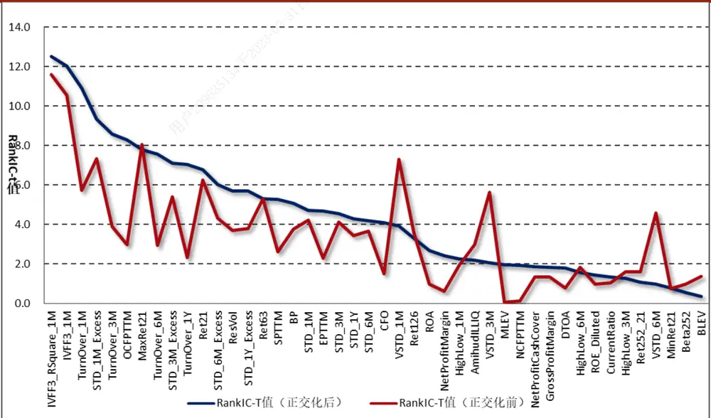
数据来源：财通证券研究所，恒生聚源

以 21 天换手率因子（Turnover_1M）为例，图 2 是在每个截面期上按照换手率因子由高到低进行排序分为 10 组，随后计算每组股票的市值（经过标准化之后）的均值，最后再在时间序列上计算每组市值得分的平均。可以看到，换手率和市值之间存在非常明显的单调性。换手率越高的组别市值明显更小，而换手率越低的组别明显偏向大市值股票。

图 2：经换手率排序分组后每组市值平均
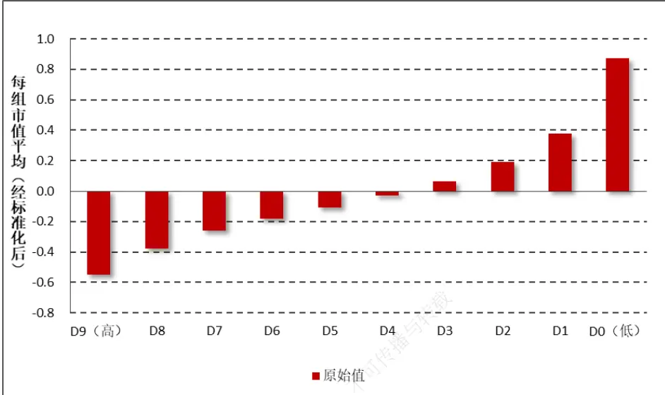
数据来源：财通证券研究所，恒生聚源

然而我们知道，低换手（D0 组）的股票未来收益往往越高，大市值的股票未来收益却往往越低，而低换手的股票往往是大市值股票，二者之间的负向关系将会明显影响换手率因子的表现。因此，我们必须将市值影响从换手率因子中进行剔除，从而观察剥离市值影响后的换手率因子表现。

图 3：21天换手率原始值分组累计净值
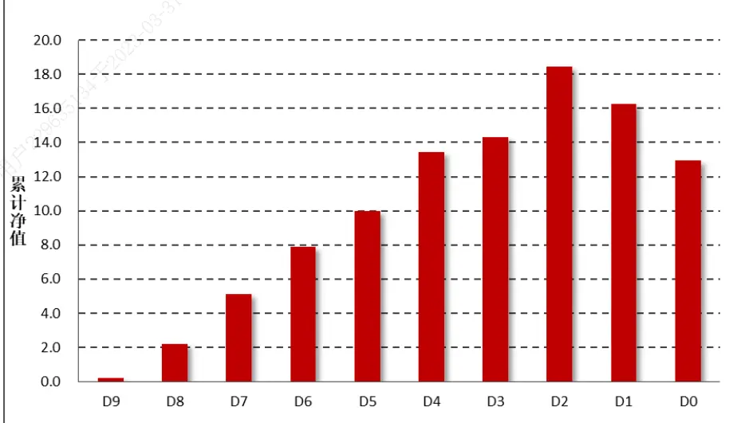
数据来源：财通证券研究所，恒生聚源

为了观察市值对于换手率因子的影响，图 3 展示了1 个月换手率原始值因子分组累计收益图，可以看到十分组下的累计收益并未呈现出明显的单调性。具体来看，在换手率较高的 D9-D2 之间分组单调性较好，但在换手率最低的两组中反而出现了明显的下滑。考虑到换手率最低的两组对应的是市值最大的两组，而大市值股票在很长的一段时间中的表现逊色于小市值股票，因此在市值因子上的过高暴露拉低了换手率因子多头的收益，从而出现低换手组的累计收益反而更低的情况。

基于如上分析，我们必须将市值影响从换手率因子中剥离出来。此处我们采用线性回归的方法，在每个横截面上将换手率因子对对数市值因子进行 OLS回归，将回归后的残差作为剔除市值效应后的换手率因子代理变量。

表 1 展示了经过市值正交化后的换手率因子在 Wind 全 A中的表现情况，回测区间为 2005.1.31-2019.7.31，其他细节与前述专题报告中保持一致。可以看到，剔除市值影响后的换手率因子的绩效表现明显更优，其 RankIC 均值能够达到-11.75%，t 值绝对值增大到 12.76，多空组合的年化 IR（月度）达到 3.21，大幅高于正交化之前的年化 1.58 倍的夏普比率。此外，正交化之后的因子在最大回撤和月胜率等统计指标上也有明显的改善。

表 1：21天换手率因子经过市值正交化前后绩效统计

|  | RankIC 胜率 | RankIC 均值 | RankIC-t 值 | 年化收益 | 年化波动 | 年化IR | 最大回撤 | 月胜率 |
| --- | --- | --- | --- | --- | --- | --- | --- | --- |
| 正交化前 | 27.0% | -8.5% | -7.16 | 32.4% | 20.0% | 1.58 | 21% | 68% |
| 正交化后 | 18.0% | -11.75% | -12.76 | 52.1% | 16.0% | 3.21 | 7% | 78% |

数据来源：财通证券研究所，恒生聚源

由上述分析可知，当目标因子与其他已知因子之间存在明显的相关性时，因子之间的互相影响可能导致目标因子有效性检验的失真，我们必须剔除已知因子的影响。那么，对已知因子进行剔除的方法有哪些？这些方法之间具体存在哪些区别？各类方法的剔除效果如何？针对这些问题，我们将在下一节中进行详细的介绍。

## 2、 因子剥离：回归法和分组法

在财通金工“星火”专题（三）《Barra 模型深化：纯因子组合构建》和“星火”专题（五）《源于动量，超越动量：特质动量因子全解析》中，我们分别介绍了目前主流的因子剥离方法：回归法和分组法。为了阅读的方便，我们接下来对两种方法进行简要的回顾。

## 2.1 回归法 VS 分组法

在因子选股的研究中，投资者通常希望做到诸如市值中性或是行业中性的要求，也就是说，需要从目标因子中剔除市值因子或是行业因子的影响。为实现这一目的，通常有如下两种方法：

## 1） 回归法

回归法的主要步骤是在横截面上将目标因子对所需剔除的因子进行回归，将回归得到的残差项作为新因子的代理变量。

$$
X_{New}=\alpha+\beta_{0}\cdot Industry+\beta_{1}\cdot Size+\beta_{2}\cdot Mon+\beta_{3}\cdot Vol+\varepsilon
$$

如上所示，将待检验的因子 $\cdot X_{New}$ 作为因变量，待剔除的因子作为自变量进行回归，由于残差项与自变量之间互不相关，因此将残差项作为新因子的代理变量，可以认为已经消除了行业、市值、动量和波动的影响。然而财通金工需要提醒如下几个方面：

第一， 由于因子之间通常处于不同的量级，因此在进行回归之前最好先将单个因子本身在横截面上进行去极值和标准化处理；

第二， 当需对多个因子进行剥离时，由于自变量因子之间同样存在相关关系，这种因子之间的相关性可能对因子剥离的结果造成影响。例如，在“星火”系列（五）中介绍的特质动量原始因子与 1 个月反转因子并不存在明显的单调性（因为在计算时已经跳过了最近 1 个月的收益），但却在 BP、换手率、波动率和市值上存在明显的单调性，因此我们需要将特质动量原始因子对 BP、换手率、波动率和市值进行正交化。然而，由于反转因子本身与换手率、波动率和市值本身就存在相关性，因此导致经过正交化之后的因子确实能够剥离对换手、波动和市值的影响，但在剥离之后的该因子与 1 个月反转因子却出现了明显的负相关关系（如图4 和图5 中的Ret21 线条）。

图 4：特质动量因子各组暴露（正交化前）
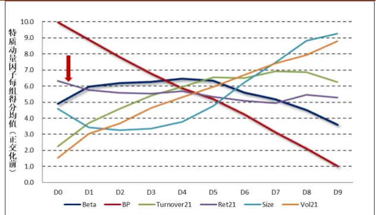
数据来源：财通证券研究所，“星火”（五）

图 5：特质动量因子各组暴露（正交化后）
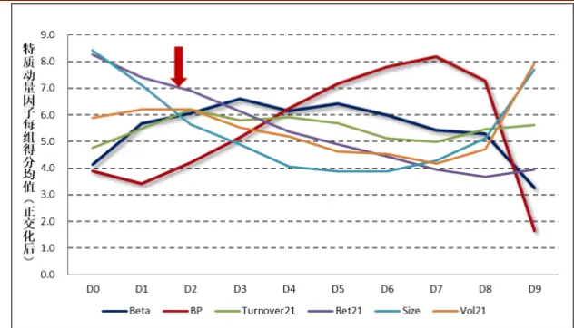
数据来源：财通证券研究所，“星火”（五）

第三， 如果自变量因子中不包含非线性部分，那么根据 OLS回归得到的代理变量只能认为剔除了已知因子的线性影响，对于非线性部分的影响仍然无法消除。也就是说，尽管残差变量与已知因子之间的相关系数为 0，但这仅仅只能说明二者之间是线性不相关的。如果目标因子与已知因子之间存在非线性关系，那么对残差变量进行分组后，仍然不能保证各组的风格保持在相同的、非单调的水平；

第四， 对于一个好的模型而言，自变量和因变量应该尽可能地服从正态分布，如果数据本身存在严重的厚尾性，也会对回归剔除的结果造成一定的影响。

## 2） 分层法

如图 6 所示，分层法通常用于剔除单个因子对目标因子的影响，其主要步骤如下：

a) 根据待剔除因子（如 Size）的大小将样本股票分为 10 层；

b) 在每层中再根据待检测因子XNew将股票分为 10 组；

c) 每层中的第 1 组-第 10 组进行合并，得到新的 10 个分组；

d) 计算十分组的月度收益，最终观察分组收益之间是否存在明显的单调性。

图6：分层法中性化示意图
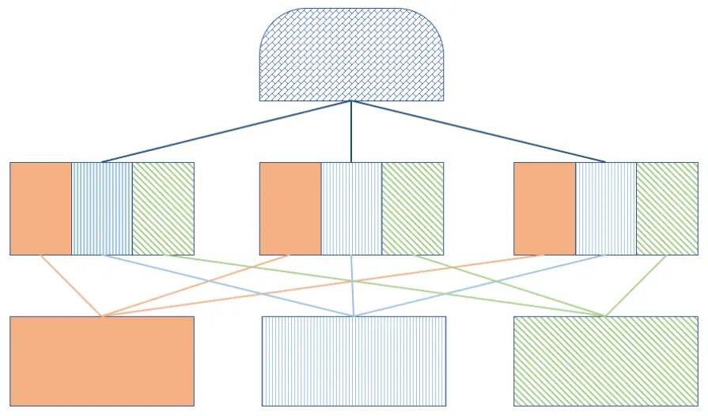
数据来源：财通证券研究所

回归法操作简单、逻辑直观，但由于自变量因子之间往往存在强相关性，因此有时并不能将其他因子剔除干净，且这种方法只能用于线性剔除，对于因子的非线性特征作用并不明显；分层法中性化的效果更佳，但若有多个待中性化因子，则在分组中会存在股票数量不够等问题，正因如此后者通常被用于剔除单个因子的影响上。此外，正交化的方法通常有对称正交法、规范正交法、施密特正交法等，这些方法是否都适用于因子正交化的范围内，财通金工将在后续的专题研究中进行探讨，欢迎投资者持续关注！

## 2.2 剥离市值影响之后的换手率因子表现对比

在介绍了回归法和分组法两种剥离已知因子影响的方法后，我们在实证层面观察两种方法的表现情况。图 7 和图8 分别展示了经过回归法和分组法剥离了市值影响后的换手率因子分组累计收益，可以看到两种方法下的十分组累计收益呈现出明显的单调性：高换手组的收益最低，低换手组的收益最高，这一点与图3 展示的原始换手率因子表现存在明显的区别。

图7：回归法剔除后换手率因子分组累计收益
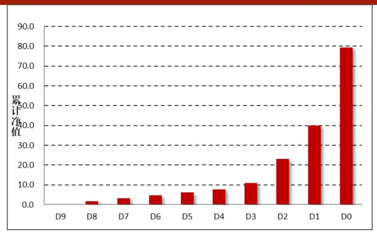
数据来源：财通证券研究所，恒生聚源

图8：分组法剔除后换手率因子分组累计收益
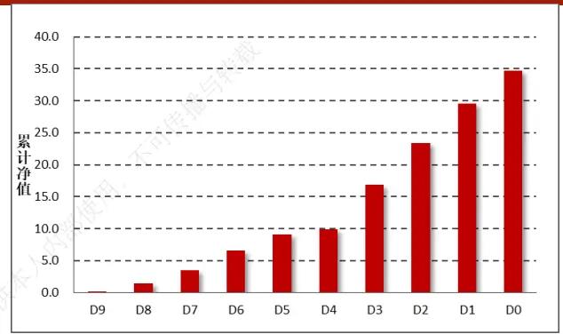
数据来源：财通证券研究所，恒生聚源

那么，经过两种方法对市值因子进行剥离后的实际效果如何呢？理论上来讲，如果剥离效果足够好，那么经过换手率分组后的每组的市值水平应该处于差不多的水平，既不会呈现出明显的线性关系，也不会呈现出明显的非线性关系。

图9：经过不同处理后，十分组下每组市值的平均值
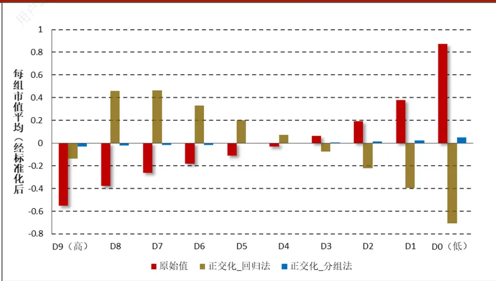
数据来源：财通证券研究所，恒生聚源

图 展示了原始值、经回归处理和经分组处理后换手率因子的十分组中每组市值的均值。可以看到，原始值与市值因子呈现出明显的负相关关系，而经过回归剔除后的分组却与市值呈现出明显的非线性关系。正交化后的换手率因子和市值在D7-D0组之间呈现出明显的正相关关系，而D7-D9组之间却呈现出负相关关系，整体而言出现中间高、两边低的情况。而相较之下，根据分组法得到的十分组下的市值相对而言非常平均，这一点与该方法本身的逻辑是自洽的，因为分组法下每个换手率分组中的股票都较为均匀地散布在各个市值分组中。

毫无疑问的，分组法在逻辑和实际效果上对于单个因子的剥离效果都是最佳的，然而它同样会仍然存在一些微小的问题。如图10所示，我们展示了分组法下的十分组的市值平均柱状图，本质上它是图9的放大版。可以看到，如果细化来看其十分组下仍然表现出非常明显的单调性，只是其纵坐标非常小，小到基本上可以忽略的影响。那么为何会出现这种情况呢？实际上原因十分简单，因为换手率的原始值和市值本身就是强烈的负相关关系的，那么在每个市值分组中，换手率最高的那一组更多的是这一市值分组中市值最小的那些股票，因此最终形成的高换手组合的市值自然而然的就会更小一些。

图10：根据分组法剥离市值影响后的换手率十分组的市值平均值
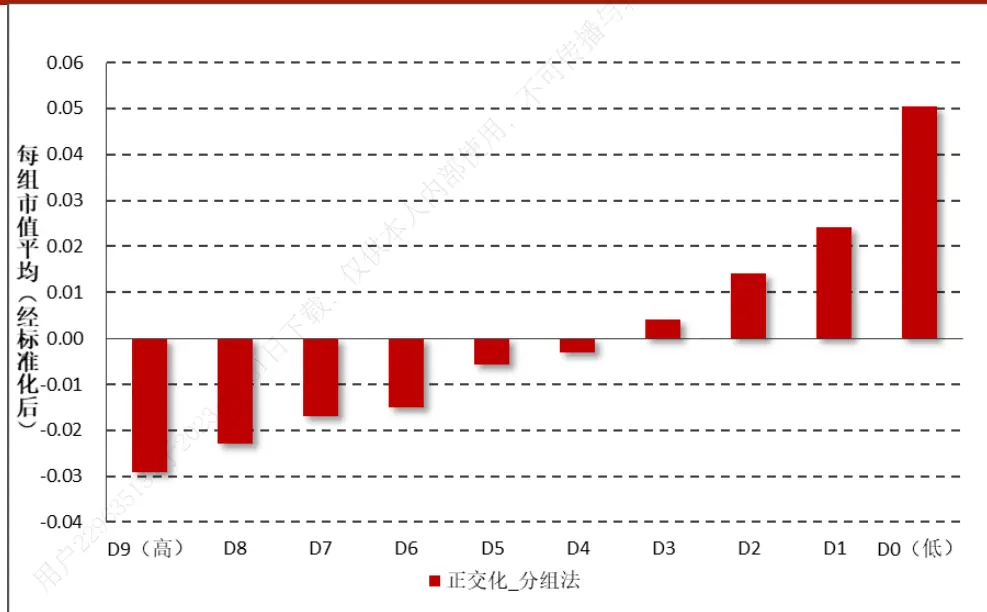
数据来源：财通证券研究所，恒生聚源

另一方面，由图 和图 可以看到，回归法下的每组收益要比分组法下的每组收益更高。究其原因，我们认为回归法下的 组中换手率与市值的关系由原本的负相关变成了正相关，低换手组中有原来的大市值变成了偏小市值的股票，两种效应的叠加造成了回归法下的多头组合的收益要明显高于分组法下的多头组合收益。相比之下，分组法下的每组的市值大小更为平均，因此反映的是纯粹的换手率对于股票未来收益的影响。

## 3、 当我们在做因子正交化的时候，我们在做什么？

到目前为止，我们从实证层面看到回归法和分组法都能够在一定程度上剥离市值因子给换手率因子的影响。本节我们将进一步细化，观察回归之后的残差变量到底发生了什么样的变化。

首先来观察一个随机生成的模型，假设变量X和Y均服从正态分布，且二者之间的线性相关系数为0.5，那么将Y对X进行回归，即可认为将X从Y中剥离出来：

$$
Y=\alpha+\beta X+\varepsilon
$$

图11展示的是随机生成的X与Y变量之间的散点图情况，可以看到二者之间呈现出比较强的相关关系，这一点与我们的模型设定是一致的。

图11：蒙特卡洛模拟生成的X与Y之间的散点图（相关系数0.5）
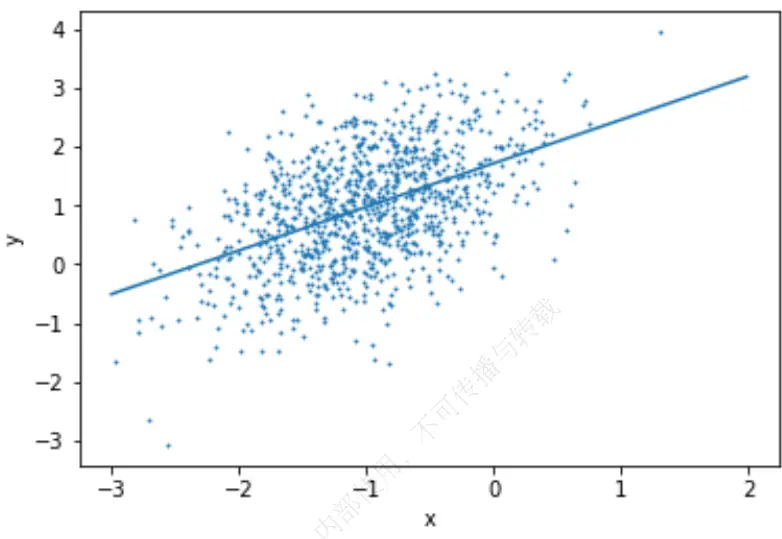
数据来源：财通证券研究所

图12和图13分别展示了经过正交化剔除之后，残差与因变量Y和自变量X之间的散点图情况，可以看到经过处理后残差仍然与因变量Y保持较高的相关性，然而其与自变量X之间的散点图可以近似地认为是白噪声。也就是说，如果自变量与因变量之间仅存在线性相关性时，无论其线性相关系数多大，通过正交化回归的方法都能够较好地剔除已知因子的影响。

图12：因变量Y与残差之间的散点图
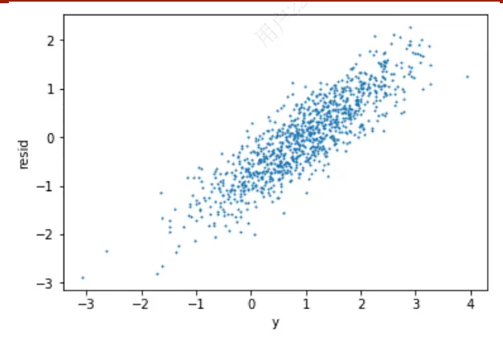
数据来源：财通证券研究所

图13：自变量X与残差之间的散点图
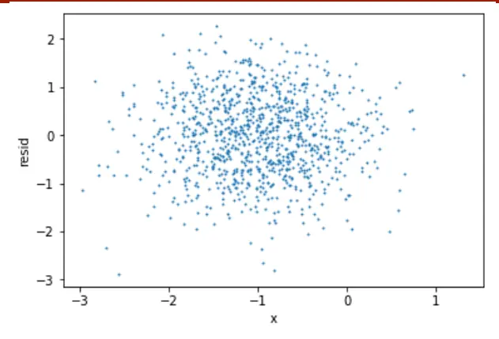
数据来源：财通证券研究所

那么实际应用中是否如此呢？下面我们以一个实际案例进行说明，以2018年11月30日的换手率因子和市值因子为例，我们将换手率对市值进行线性回归，其原始值和拟合值散点图如图14所示。

由图14可以看到，正交化的处理可以近似地认为将原始数据集以左下角为轴进行逆时针旋转，原本小市值股票的换手率因子变小，大市值股票的换手率因子变大，且后者的变化幅度要远高于前者。由散点图可以看出，换手率与市值之间并不是完全的线性关系，由图9也可以看到直接进行线性剔除后二者之间也存在非线性的关系，因此我们在想如果引入市值的平方项和三次方项作为自变量，对于换手率因子的拟合程度将会产生怎样的变化呢？

图14：Turnover~Size拟合情况
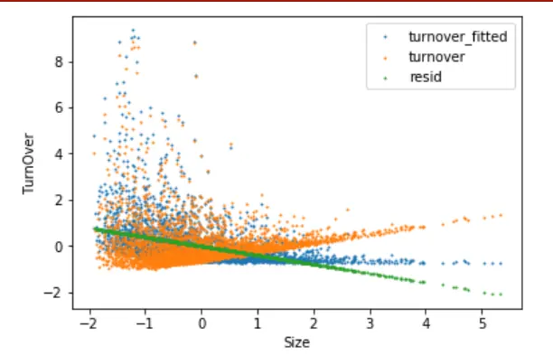
数据来源：财通证券研究所

图15：Turnover~Size+Size^2拟合情况
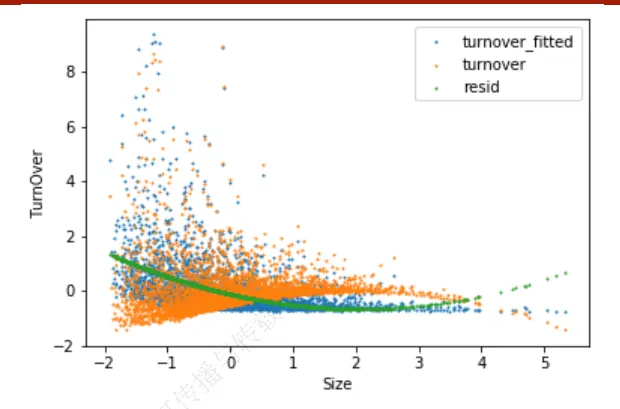
数据来源：财通证券研究所

图15展示了加入市值平方项的散点图，表2展示了不同回归模型中的系数t值及模型R方。可以看到，市值平方项的引入为模型的解释度提高了4.5%，平方项的t值达到14.12，非常显著。我们同样也检验了市值三次方对于换手率的解释能力，发现尽管市值立方的t值同样显著，但其R方的增加却仅有1.3%，对模型解释力度的提升效果相对有限。

表2：不同回归模型的系数及拟合R方

| 不同的回归模型 | 截距 | Size | Size 平方 | Size 立方 | R方 |
| --- | --- | --- | --- | --- | --- |
| ModellTurnover = α + β1Size | 0.00(0.00) | -0.39(-25.43) |  |  | 15.5% |
| Model2Turnover = α + β1Size + β2Size² | -0.13(-7.16) | -0.52(-29.67) | 0.13(14.12) |  | 20.0% |
| Model3Turnover = α + β1Size + β2Size² + β3Size³ | -0.19(-9.82) | -0.45(-22.97) | 0.23(14.33) | -0.35(-7.65) | 21.3% |

数据来源：财通证券研究所，备注：括号中为对应系数的t值

由于在回归过程中仅剔除了市值的线性影响，因此残差部分可以表示为：

$$
resid=Turnover+0.39\times Size
$$

上述表达式可以近似地看成根据股票的换手率因子和市值因子进行综合打分，权重由回归系数确定。由于二者之间呈现出负相关关系，因此权重系数为正（回归系数为负）。此外，由于已经对市值进行了标准化处理，因此对于小市值股票（Size<0）而言，残差将会相应变小；对于大市值股票（Size>0）而言，残差将会相应变大。然而在相同的系数下为何大市值的股票变化率会比小市值更大呢？事实上，这是由于市值本身的厚尾分布造成的。由图16和图17可以看出，换手率和市值因子都表现出明显的尖峰厚尾特性，大市值的股票市值因子明显更大，因此会造成修正后的换手率因子明显偏高（主要由于其市值因子较大引起），而对于小市值的股票而言其市值的负向影响不及换手率的正向影响（主要由于其换手率因子较高引起）。

综合起来看我们猜想，D9组的高换手是由于该组股票本身的换手率就已经很大（对应的是小市值股票），因此其市值会偏小，而D8-D5组的高换手是由于该组股票的市值较大（也许本身对应的都是低换手的股票）引起的，这才造成了修正后的换手率因子与市值呈现出正相关的情况。

图16：换手率因子直方图（2018.11.30）
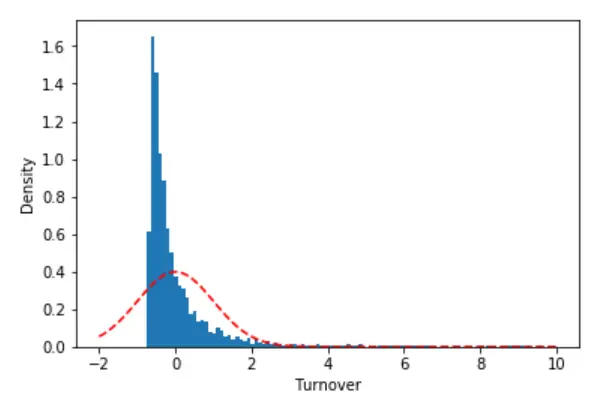
数据来源：财通证券研究所，恒生聚源

图17：对数流通市值因子直方图（2018.11.30）
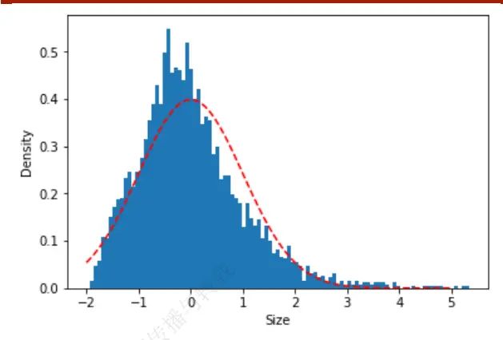
数据来源：财通证券研究所，恒生聚源

## 4、 正交化时样本的选择

本期讨论的最后一个部分，我们简单讨论一下因子正交化时样本范围的选择，这一选择通常会出现在对因子在子样本中的有效性检验中。通常来讲我们会选择在全样本范围内进行正交化处理，这是因为当股票数量足够多、风格足够分散时，因子的分布将更加平均。然而我们通常还会关心因子在沪深300或者中证500中的表现情况，此时通常有两种处理方式：

（1）第一种方法是在全样本中进行正交化，随后将正交化后的因子在子样本中进行有效性检验；

（2）第二种方法是在子样本中进行正交化，随后将正交化后的因子在子样本中进行有效性检验。

就如上两种方法的选择而言，目前并没有统一的说法何种更好，财通金工“星火”专题（五）中特质动量因子的沪深300有效性检验选择的是前者方法，主要是基于样本覆盖率的考虑。在构建沪深300增强型策略的时候，我们并非强制要求所选择的样本股只能在沪深300中选股，而是可以在全市场中进行筛选，因此我们希望全市场中的其他股票和沪深300中的股票因子处于可比的状态。

然而在全样本中进行正交化同样也会带来一些问题。以上证50指数为例，绝大部分上证50指数成分股的市值处于全市场的最大值，因此在对市值因子进行异常值处理后其因子会被识别为边界点，我们可以近似地看作上证50股票的市值因子是相同的。那么在线性回归中，被修正的换手率因子等于原始换手率因子减去市值因子与一个固定系数的乘积，因此如果以上证50指数为样本股进行筛选，事实上被修正的因子即等于原始因子减去一个固定的常数，本质上起不到任何修正的作用。当然，当样本扩充到沪深300或者中证500时，这一效应会相对减弱一些，但究竟影响程度如何还值得未来我们进行进一步的探索。

如果投资者们关于这一处理有更好的想法和见解，也非常欢迎和我们进行更为深入的交流，共同进步！后续我们还将针对行业因子的正交化进行讨论，欢迎感兴趣的投资者持续关注。

## 5、 总结

在本期“拾穗”系列专题中，我们就单因子有效性检验中的剥离已知风格因子的方法进行了介绍，并对因子剥离的效果、逻辑和样本的选择进行了探讨，主要结论如下：

（1） 因子剥离方法通常有回归法和分组法两种；

（2） 回归法操作简单、逻辑直观，但只能用于线性剔除，对于非线性部分的作用并不明显，且该方法受因子之间的相关性及因子本身的分布影响较大；

（3） 分组法中性化效果更佳，但通常只能用于单因子剔除，对于多因子影响的剔除往往无能为力，且分组法无法与最终的组合优化相契合；

（4） 将换手率对市值进行回归的正交方法可以近似地看作是根据因子值进行综合打分，二者之间的系数由回归权重确定。然而市值本身的厚尾性将会影响正交的结果；

（5） 在对子样本中的因子有效性检验中，正交化的样本选择通常颇具考究，我们欢迎感兴趣的投资者与我们共同探讨。

（6） 后续我们还将针对行业因子的正交化进行讨论，欢迎感兴趣的投资者持续关注。

（附注：实习生武汉大学潘慧丽全程参与本项研究，对本课题有重要贡献）

## 信息披露

## 分析师承诺

作者具有中国证券业协会授予的证券投资咨询执业资格，并注册为证券分析师，具备专业胜任能力，保证报告所采用的数据均来自合规渠道，分析逻辑基于作者的职业理解。本报告清晰地反映了作者的研究观点，力求独立、客观和公正，结论不受任何第三方的授意或影响，作者也不会因本报告中的具体推荐意见或观点而直接或间接收到任何形式的补偿。

## 资质声明

财通证券股份有限公司具备中国证券监督管理委员会许可的证券投资咨询业务资格。

## 公司评级

买入：我们预计未来 6个月内，个股相对大盘涨幅在 15%以上；

增持：我们预计未来 6个月内，个股相对大盘涨幅介于 5%与 15%之间；

中性：我们预计未来 6个月内，个股相对大盘涨幅介于-5%与 5%之间；

减持：我们预计未来 6个月内，个股相对大盘涨幅介于-5%与-15%之间；

卖出：我们预计未来 6个月内，个股相对大盘涨幅低于-15%。

## 行业评级

增持：我们预计未来 6个月内，行业整体回报高于市场整体水平 5%以上；

中性：我们预计未来 6个月内，行业整体回报介于市场整体水平-5%与5%之间；

减持：我们预计未来 6个月内，行业整体回报低于市场整体水平-5%以下。

## 免责声明

本报告仅供财通证券股份有限公司的客户使用。本公司不会因接收人收到本报告而视其为本公司的当然客户。

本报告的信息来源于已公开的资料，本公司不保证该等信息的准确性、完整性。本报告所载的资料、工具、意见及推测只提供给客户作参考之用，并非作为或被视为出售或购买证券或其他投资标的邀请或向他人作出邀请。

本报告所载的资料、意见及推测仅反映本公司于发布本报告当日的判断，本报告所指的证券或投资标的价格、价值及投资收入可能会波动。在不同时期，本公司可发出与本报告所载资料、意见及推测不一致的报告。

本公司通过信息隔离墙对可能存在利益冲突的业务部门或关联机构之间的信息流动进行控制。因此，客户应注意，在法律许可的情况下，本公司及其所属关联机构可能会持有报告中提到的公司所发行的证券或期权并进行证券或期权交易，也可能为这些公司提供或者争取提供投资银行、财务顾问或者金融产品等相关服务。在法律许可的情况下，本公司的员工可能担任本报告所提到的公司的董事。

本报告中所指的投资及服务可能不适合个别客户，不构成客户私人咨询建议。在任何情况下，本报告中的信息或所表述的意见均不构成对任何人的投资建议。在任何情况下，本公司不对任何人使用本报告中的任何内容所引致的任何损失负任何责任。

本报告仅作为客户作出投资决策和公司投资顾问为客户提供投资建议的参考。客户应当独立作出投资决策，而基于本报告作出任何投资决定或就本报告要求任何解释前应咨询所在证券机构投资顾问和服务人员的意见；

本报告的版权归本公司所有，未经书面许可，任何机构和个人不得以任何形式翻版、复制、发表或引用，或再次分发给任何其他人，或以任何侵犯本公司版权的其他方式使用。