# 似是而非：横截面回归还是时间序列回归？

2019 年 10 月 29 日

## “拾穗”多因子系列报告（第 19 期）

## 联系信息

陶勤英分析师

SAC 证书编号：S0160517100002 021-68592393

taoqy@ctsec.com

张宇研究助理

zhangyu1@ctsec.com 021-68592337

176216888421

## 相关报告

【1】“星火”多因子系列（一）：《Barra模型初探：A 股市场风格解析》

【2】“星火”多因子系列（二）：《Barra模型进阶：多因子模型风险预测》

【3】“星火”多因子系列（三）：《Barra模型深化：纯因子组合构建》

【4】“星火”多因子系列（四）：《基于持仓的基金绩效归因：始于 Brinson，归于 Barra》【5】“星火”多因子系列（五）：《源于动量，超越动量：特质动量因子全解析》

【6】“星火”多因子系列（六）：《Alpha因子重构：引入协方差矩阵的因子检验法》

【 】 星火 多因子系列（七）：《借因子组合之力，优化 Alpha因子合成》

【8】“星火”多因子系列（八）：《组合风险控制：协方差矩阵的估计方法介绍及比较》

【9】“拾穗”多因子系列（五）：《数据异常值处理：比较与实践》

【10】“拾穗”多因子系列（六）：《因子缺失值处理：数以多为贵》

【11】“拾穗”多因子系列（十三）：《恼人的显著性检验：多因子模型中 t 值的计算》

【12】“拾穗”多因子系列（十四）：《补充：基于特质动量因子的沪深 300 增强策略》

【13】“拾穗”多因子系列（十六）：《水月镜花：正视财务数据的前向窥视问题》

【14】“拾穗”多因子系列（十七）：《多因子检验的时序相关性处理：Newey-West 调整》

## 投资要点：

## 因子暴露与因子收益

- 在资产定价模型中，以 Fama-French 模型为代表的时间序列回归将因子收益视为已知、因子暴露视为待估计的参数；而在以 Barra 模型为代表的横截面回归中，将因子暴露视为已知、因子收益视为待估计的参数。

- 根据 Fama-French 方法构建的因子收益更像是一种多空分组法或者 Double-Sort 分组法，其主要目的是根据分组的方法剔除目标因子与其他因子之间的相关关系，这种方式在因子数量较多时将受到较大的限制。

- 通过时间序列回归计算得到的因子暴露与采用个股特征直接得到的因子暴露之间体现出一定的相关关系，但二者之间仍然存在明显区别。在选股能力方面，用个股特征得到的因子暴露具有更好的选股效果。

## 资产定价解释度 R方的比较

- Fama-French 回归更加注重收益的解释，而 Barra 模型更加注重收益的预测，两种回归模型讨论的并不是同一个问题，因此不能直接将其 R 方进行比对。

## 两个问题

- 给定一个公式，判断其是时间序列回归还是横截面回归的关键在于截距项的表示，这一概念的明晰对于公式的规范表达至关重要。

- 在特质动量因子的计算中，我们在时间序列上剥离了市值和价值的影响之后，在横截面上个股与 Size 和 BP 仍然体现出强烈的相关关系。究其原因，我们认为时间序列上的剔除与横截面上的剥离是存在区别的，二者并不能完全等同。

- 风险提示：本报告统计结果基于历史数据，过去数据不代表未来，市场风格变化可能导致模型失效。

在实际投资中，多因子模型被广泛地应用到资产定价、绩效归因、风险控制、组合优化、基金评价及资产配置等各个领域，一套完整、精细的多因子系统成为每位量化研究者必备的工具。“做最实用的研究”，是财通金工给自己的定位。我们将在之后的系列报告中，就投资者们最关心也最容易忽略的很多细节问题进行探讨，介绍我们在实际应用中遇到的问题和思考，以飨读者。

我们为本系列报告取名“拾穗”。一周市场风云变幻，和风细雨也好，狂风骤雨也罢，都留下一地故事等待梳理。作为勤劳的搬运工，财通金工从量化视角出发对市场风格进行捕捉、对风险水平进行预测，既是希望能够如拾穗者般专心、踏实地做研究，也是祝愿各位投资者能够在市场收获满地金黄。

本期是该系列报告的第 19期，我们对资产定价中常用到的时间序列回归和横截面回归两种方式的异同展开比较。给定一个公式，如何判别其是时间序列回归还是横截面回归？以 Fama-French 模型为代表的时间序列回归和以 Barra 模型为代表的横截面回归对因子暴露和因子收益的计算方式存在哪些异同？两种方式对于资产组合收益的解释程度相差多大？在时序上剔除了 SMB、HML 等因子影响之后，为何从横截面上个股在相应因子上仍然存在暴露？本期“拾穗”专题，我们将针对以上问题展开详细论述，试图用实证结果为投资者提供最为直观的结论。

## 1、 资产定价模型：从单因子到多因子

资产定价的核心在于找到驱动个股价格变动的核心要素，这些要素要求能够较好地解释市场股票收益的相对波动。在最早提出的资本资产定价 CAPM 模型中，William Sharpe 等人第一次将资 $\dot{\bar{y}}$ 的预期收益与预期风险之间的理论关系用线性公式表达出来，该模型认为资产的预期收益与其承担的市场风险之间成正比：

$$
\begin{array}{c}{{r_{i}-r_{f}=\beta_{i}\big[r_{m}-r_{f}\big]+\varepsilon_{i}}}\\{{E(r_{i})=r_{f}+\beta_{i}\big[E(r_{m})-r_{f}\big]}}\end{array}
$$

其中， $r_{i}$ 表示单支股票的收益率， $r_{f}$ 表示市场无风险利率（常用 10 年期国债利率表示）， $r_{m}$ 表示市场收益率， $\varepsilon_{i}$ 为单只股票的残差收益，其期望收益为 。CAPM 模型认为单个资产的期望收益率由两部分组成：无风险利率部分以及风险溢价部分。风险溢价的大小取决于β值的大小，β值越高，表明单个证券的风险越高，所得到的风险补偿也就越大。CAPM 结论背后的逻辑其实相当简单，其认为：投资者承担的必要风险会得到补偿，而承担的非必要风险则不会得到任何补偿。值得注意的是，CAPM理论假设每个资产的残差收益期望值为 0（即单个资产的残差收益在时间序列上的均值为 0），然而这并不意味着不同资产的残差收益是互不相关的（即在横截面上，不同资产之间的残差收益仍然会存在某种关联），也就是说仍然可能存在某些驱动力量使得股票收益朝着相同的方向变化。也正是在实际投资中，投资者们发现具有某些相同特征的股票通常会拥有更高的超额收益，因此催生了后续由单因子模型到多因子模型的理论发展。

1993 年，Fama 和French 在对美国市场研究中发现，除了个股承担的市场风险之外，还有两种类型的股票收益往往会优于市场平均表现——小市值股票（Size）和低账面市值比（BM）股票，因此他们提出增加两个变量对股票的收益率进行解释。后来，他们又将盈利因子和投资因子纳入到三因子框架中，构建了五因子模型。为阐述的简便起见，本文以 Fama-French 三因子模型为例进行说明，其模型构建如下：

$$
r_{i}-r_{f}=\alpha_{i}+\beta_{i}\big(r_{m}-r_{f}\big)+s_{i}SMB+h_{i}HML+\varepsilon_{i}
$$

其中，SMB HML 分别表示市值因子（Size）和账面市值比因子（BP）的收益，其具体计算方法将在本文第二小节中进行详细介绍，而 $\beta_{i}$ 、 $s_{i}$ 、 $h_{i}$ 分别表示股票 i 在市场因子、市值因子和 BP 因子上的暴露程度。

如上回归方程是在时间序列上，将单个股票或者单个组合的收益对因子收益进行回归得到的，其因子的收益 $.r_{m}.$ 、SMB、HML是已知的，而因子暴露 $\cdot\beta_{i}\setminus s_{i}.$ $\pmb{h}_{i}$ 为待估计的参数。

图 1：时间序列回归 VS 横截面回归
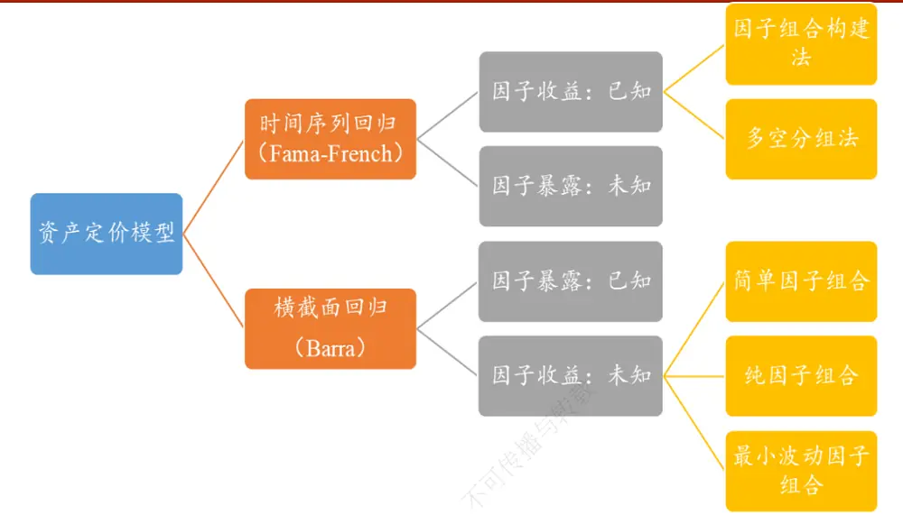
数据来源：财通证券研究所

基于时间序列的定价模型是学术研究中采用的最多的形式，然而在业界关于多因子模型的研究中，采用较多的却是仿照 Barra模型构建的横截面回归。其主要模型如下所示：

$$
r_{n}=f_{c}+\sum_{s=1}X_{ns}f_{s}+\varepsilon_{n}
$$

其中， $r_{n}$ 表示个股在 T+1 期的收益情况， $X_{ns}$ 表示 T 期股票 n 在因子 i（如市值因子、价值因子等）上的暴露度，由公司特征（Firm Characteristics）决定。

如上回归方程是在横截面上，将下期股票的收益对上期因子暴露度进行回归得到的，其个股在因子上的暴露 $X_{ns}$ 是已知的，而因子在下一期的收益率 $\mathbf{\nabla}\cdot\mathbf{f}_{s}$ 为待估计的参数。

由以上分析我们可以知道，以 Fama-French 模型为代表的时间序列回归将因子收益（或因子溢价）视为已知，通过回归法得到个股或组合在各个定价因子上的暴露程度，其隐含的条件是个股或组合在时间序列上的因子暴露度是稳定不变的。而以 Barra 模型为代表的横截面回归，则是将因子暴露（或因子载荷）视为已知，通过回归法得到因子在回测区间内的收益大小。那么，这两种方式计算得到的因子暴露和因子收益究竟是否相同？二者之间存在哪些区别呢？下一小节我们将会对如上问题进行回答。

## 2、 因子暴露与因子收益

在以 Fama-French 模型为代表的时间序列回归中，因子收益是已知的，可以通过组合构建法来得到，而因子暴露则是通过回归方程估计得到。在以 Barra 模型为代表的横截面回归中，因子暴露是已知的，可以根据个股的特征得到，而因子暴露则是通过回归方程估计得到。既然二者都可以用于进行资产定价，那么通过这两种方式得到的因子暴露和因子收益之间究竟存在哪些区别？本小节将分两个方面对此进行探讨。

## 2.1 因子收益计算：

## 2.1.1 Fama-French 因子收益计算：

在 Fama-French 三因子模型中，因子收益可以根据组合构建法得到，每个因子的计算说明如表 1 所示。在每月最后一个交易日，根据股票的自由流通市值进行从大到小排序，将其市值排序的前50%和后50%划分为Big和Small两个组合，随后根据股票的账面市值比 BP 因子由大到小进行排序，将其前 30%、中间 40%和后 30%分别划分为 High（价值股）、Neutral和 Low（成长股）三个组合。

表 1：因子计算说明

| 代号 | 全称 | 排序因子 | 说明 |
| --- | --- | --- | --- |
| S | Small | 市值 | 最小50% |
| B | Big | 市值 | 最大 50% |
| L | Low | 账面市值比 | 最小 30% |
| N | Neutral | 账面市值比 | 中间 40% |
| H | High | 账面市值比 | 最大30% |

数据来源：财通证券研究所

那么，SMB（Small-Minus-Big）和 HML（High-Minus-Low）的计算方式即可表示为：

$$
SMB=\frac{(S/L+S/N+S/H)}{3}-\frac{(B/L+B/N+B/H)}{3}
$$

由以上分析可知，SMB 因子收益表示的是小市值股票的平均收益与大市值股票的平均收益之间的差额，而 HML 因子收益则表示的是高账面市值比（价值股）股票的平均收益与低账面市值比（成长股）股票的平均收益的差额，每一个组合的收益我们采用个股的流通市值加权进行计算。

那么，既然 HML 反映的是高 BP股票相对低 BP股票的溢价程度，那么为何要采用如上看上去比较复杂的方式进行构建，而不是直接将市场上的个股根据其 BP值进行排序，将排名在前 30%的个股的流通市值加权收益减去排名后 30%的个股流通市值加权收益呢？事实上，这二者之间并不完全等同，Fama-French之所以采用这种因子组合构建的方式来计算因子收益，其目的是为了剔除因子之间的相互影响，因为其本质上类似于一种采用分组法进行因子正交的方法。

图2：Fama-French因子计算
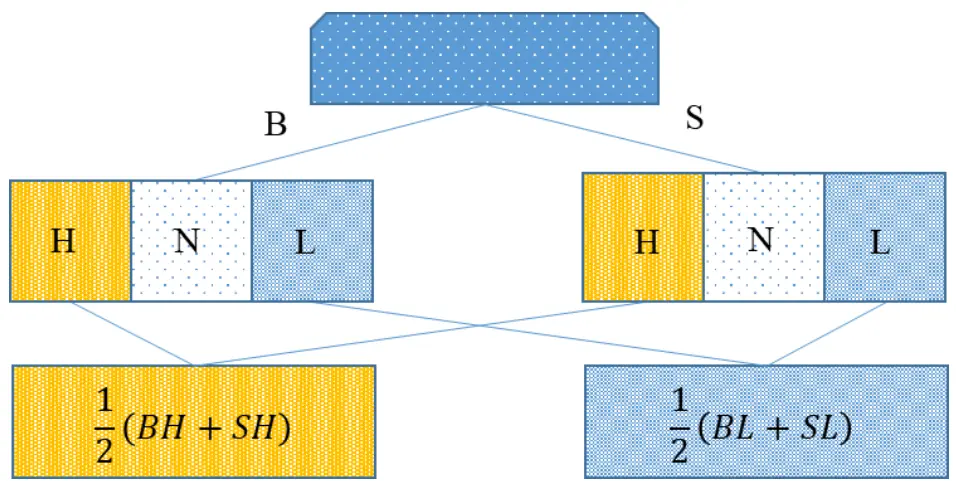
数据来源：财通证券研究所

在财通金工“拾穗”系列（ ）《当我们在做因子正交化的时候，我们在做什么？》中，我们讨论了采用回归法和分组法对因子相关性进行剔除的方法，其中分组法的操作示意图如图 2 所示。可以看到，首先根据市值大小分为 B 和 S两层，随后分别在每一层中根据股票 BP 值大小分为 H、N 和 L三组，最后再将每一层对应 H组结合起来形成最终的高 BP 组合、将每一层对应的 L组结合起来形成最终的低 BP 组合。可以看到，这种采用分组法剔除市值影响，并观察 BP因子多空组合收益的构建方式恰恰与 Fama-French 采用的因子组合构建方式完全一致，这种因子收益计算方式在学术文献中通常也被称为 Double-Sort法。图3 展示了根据两种思路计算的因子收益，可以看到二者之间的相关性极高。

图 3：HML因子与 BP 分组法构建的因子收益时序图
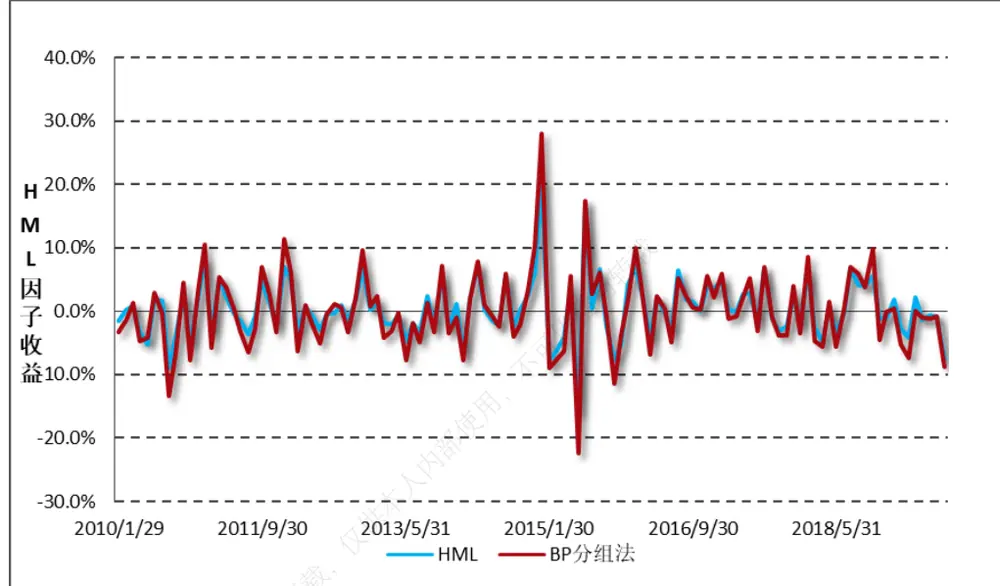
数据来源：财通证券研究所，恒生聚源

## 2.1.2 Barra 模型中因子收益的计算：

在了解了时序模型中因子收益的计算方法之后，接下来我们观察横截面上因子收益的计算方式。在 Barra 模型中，因子收益的计算是通过横截面回归模型拟合得到的。具体来讲，将个股收益对主要的行业及风格因子进行 WLS 回归即有：

$$
r_{n}=f_{c}+\sum_{s=1}X_{ns}f_{s}+\varepsilon_{n}
$$

事实上，在横截面上求解因子收益的方法根据纳入的自变量因子的不同而对应不同的构建方式。财通金工在“星火”专题（七）《借因子组合之力，优化 Alpha因子合成》以及“拾穗”系列（7）《从纯因子组合的角度看待多重共线性》中分别介绍了简单因子组合、纯因子组合和最小波动因子组合的构建方式。其中，简单因子组合是将个股收益对目标因子本身进行一元回归得到的目标因子溢价，通过这种方法得到的因子收益实际上包含了其他风格因子的影响；纯因子组合则是将所有的风格因子纳入到解释变量中进行多元回归，其因子收益可以被认为是剔除了其他风格的影响；而最小波动因子组合则是在目标因子上存在单位暴露的组合中事前风险最小的组合，其有着最高的事前信息比率。

表 2：时序因子收益与横截面因子收益的月度相关系数

| 组合因子 | 简单因子组合 | 纯因子组合 | 最小波动因子组合 |
| --- | --- | --- | --- |
| SMB | 96.94% | 64.77% | 44.03% |
| HML | 97.91% | 86.45% | 57.19% |

数据来源：财通证券研究所，恒生聚源

表 2 展示了 SMB因子与根据横截面回归得到的三种因子组合收益在时间序列上的月度相关系数。可以看到，SMB因子收益与 HML因子收益都与其对应的简单因子组合有着更为紧密的关联，其相关系数能够达到 0.96 以上，而相较之下二者与对应的纯因子组合和最小波动因子组合之间的相关关系就更弱一些。

到目前为止我们可以看到，根据 Fama-French 方法构建的因子收益更像是一种多空分组法或者是 Double-Sort的分组方法，其主要目的是根据分组的方法剔除目标因子与其他因子之间的相关关系。然而这样的计算方法也存在一定的局限性，根据分组法进行因子剔除的方式只能够剔除单个无关因子的影响，当待剔除的因子数量较多时，这种方法的应用范围将会受到极大的限制。正是基于这一点，根据横截面进行多元回归的方法能够更加简单地剥离掉多个因子之间的相关关系，其应用范围自然就更为广泛。

## 2.2 Fama-French 因子暴露度计算

在介绍了因子收益的计算后，本小节我们关注两种模型中因子暴露的估计方式。在横截面回归模型中，股票在因子上的暴露程度可以根据个股的特征（FirmCharacteristics）直接得到，例如股票的市值因子暴露可用其自由流通市值来衡量，而股票的价值因子可用其市净率的倒数 PB因子来衡量。

然而在 Fama-French 模型中，个股在因子上的暴露却是根据时间序列回归得到的。自然而然地，我们就会提出一个问题，通过这两种方式构建的个股因子暴露是否相似呢？为了回答这一问题，我们将个股在过去 252 个交易日的收益率对Fama-French 三因子的日度收益率进行时间序列回归，将回归得到的系数作为个股在对应因子上的暴露程度，并将其与横截面上的因子暴露度进行比较。

图4：时序VS横截面市值因子相关系数
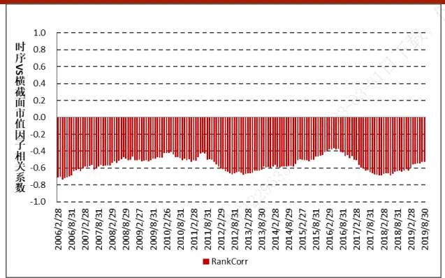
数据来源：财通证券研究所，恒生聚源

图5：时序VS横截面价值因子相关系数
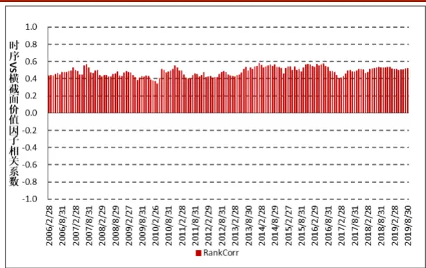
数据来源：财通证券研究所，恒生聚源

图4和图5分别展示了根据时序回归和根据个股特征计算得到的市值因子和价值因子在每个横截面上的秩相关系数，由于Fama-French模型中市值因子体现的是其在小市值上的暴露程度，因此其与Size因子之间呈现出负相关关系。由图中可以看到，根据时间序列回归得到的因子暴露与根据个股特征计算得到的因子暴露之间的相关系数绝对值大约在0.5左右，二者之间存在一定的关联，但并不等同。

那么根据这两种计算方式得到的因子暴露的选股效果如何呢？表3展示了两类因子在Wind全A指数中的选股效果，回测时间为2006.2.28-2019.9.27。可以看到，根据横截面上直接获取的个股特征因子值的选股效果均更为显著，其中Size因子的T值达到-2.81，而BP因子在经过市值和行业中性化之后达到4.81，而相较之下，根据时间序列回归得到的SMB系数和HML系数的选股效果并不明显。由此可见，采用时序回归系数进行选股的效果并不理想。

表3：时序回归系数与因子值的RankIC绩效统计

| 因子值 | 月胜率 | RankIC均值 | RankIC-T值 |
| --- | --- | --- | --- |
| 时序SMB系数 | 54.9% | 2.0% | 1.40 |
| Size | 41.4% | -4.7% | -3.00 |
| 时序HML系数 | 51.2% | 1.60% | 1.55 |
| BP | 63.6% | 5.1% | 5.75 |

数据来源：财通证券研究所，恒生聚源

## 3、 资产定价解释度：R方的差别

本次讨论的第三个部分，我们来厘清两类模型对于资产收益的解释度——R方之间的区别。在日常文献阅读中我们经常可以看到，根据Fama-French模型的时间序列回归R方通常能够达到95%以上，然而在Barra模型中，我们的横截面模型解释度却经常只有25%左右。如何判定定价因子的有效性？上面提到的两个回归模型R方表达的是否是同一个意思？我们将在本部分对其进行探讨。

图6展示了从2007.1.31-2019.9.27期间，Fama-French三因子的净值走势，可以看到在回测区间，市值因子的波动出现最为明显的波动。在2017年以前，小市值的表现显著优于大市值股票，而在2017年以后市值因子出现了极为明显的回撤。相较之下，价值因子的走势较为平稳，大部分时间内估值较低的股票能够获得明显的超额收益，只是今年以来出现了明显的下滑。

图6：Fama-French三因子净值走势
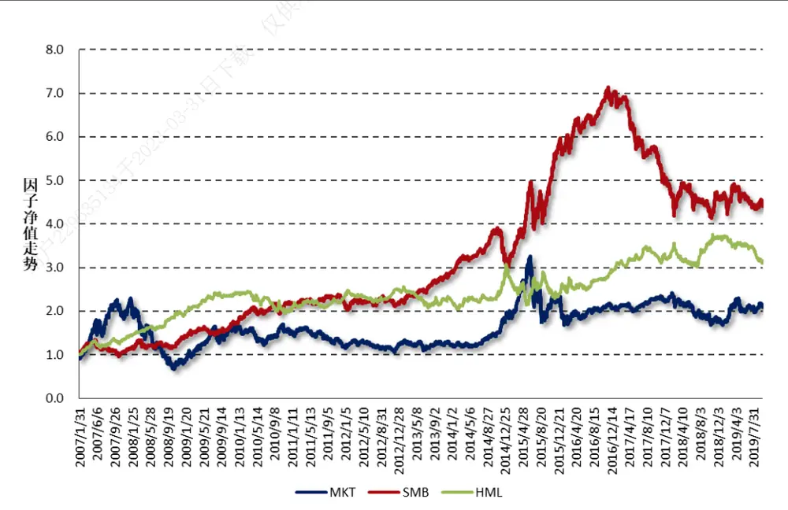
数据来源：财通证券研究所，恒生聚源

为了观察Fama-French三因子对主要资产组合的解释能力，财通金工选取了大盘成长（399372.SZ）、大盘价值（399373.SZ）、小盘成长（399376.SZ）和小盘价值（399377.SZ）四种典型的风格指数进行时间序列滚动回归，将指数过去252天的收益率对Fama-French三因子的日度收益进行回归，并绘制了月度因子暴露图，如图7和图8所示。

图7：四类风格指数在SMB因子上的时序暴露值
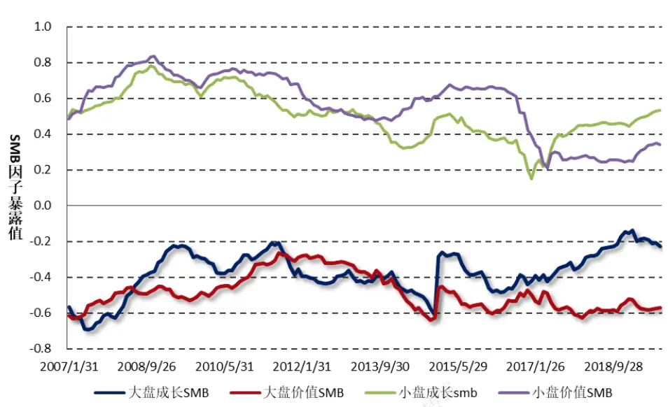
数据来源：财通证券研究所，恒生聚源

图8：四类风格指数在HML因子上的时序暴露值
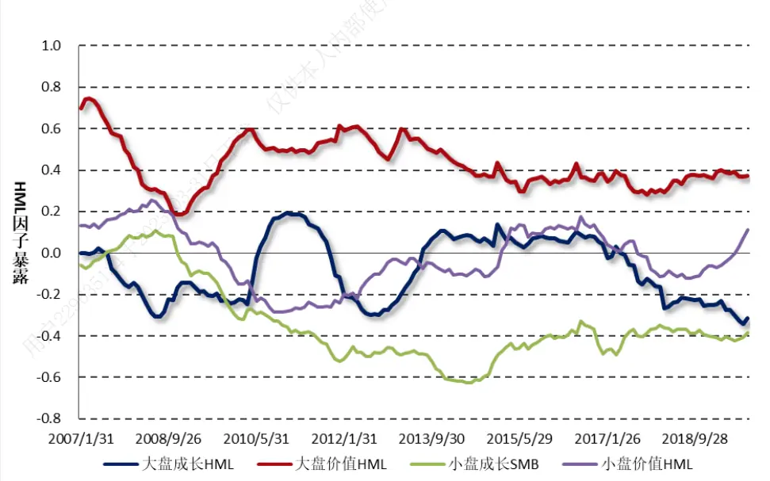
数据来源：财通证券研究所，恒生聚源

图 和图 的结论大致符合我们的预期，对于 因子暴露而言，大盘指数的SMB暴露明显为负，小盘指数的SMB暴露明显为证，二者之间呈现出明显的负相关关系，且大盘价值与大盘成长的SMB暴露因子走势十分一致。而对于HML因子而言，大盘价值指数的HML因子暴露明显为负，而小盘价值指数的HML因子在很长的时间内却出现了负值。究其原因，我们认为由于BP因子与市值因子之间呈现出比较明显的正相关关系，小市值的估值普遍偏高（BP因子偏低），因此在小市值里面BP相对较高的那些股票放在全样本领域而言BP因子仍然偏低，从而导致了小盘价值指数的HML因子暴露呈现出负值，同样的情况也适用于大盘成长指数的HML因子呈现出长时间的正向暴露问题。

以上我们选取的四类指数在市值和价值因子上都存在明显的区分，然而在指数构建过程中对Beta因子的暴露大小却没有直观的区别。下面我们以沪深300高贝塔指数（000828.SZ）、沪深300低贝塔指数（000829.CSI）、中证500高贝塔指数（000830.CSI）、中证500低贝塔指数（000831.CSI）为例，同样进行滚动的时间序列回归，四类指数在MKT因子上的暴露如图9所示。

图9：主要高低Beta指数在MKT因子上的暴露度
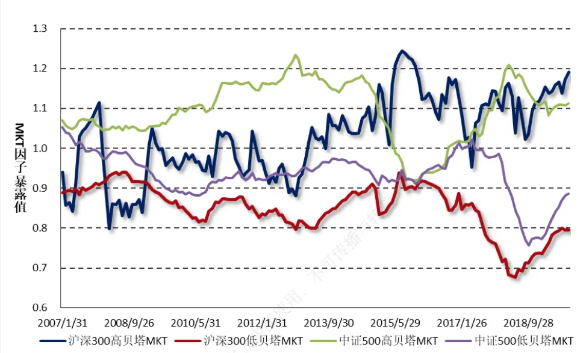
数据来源：财通证券研究所，恒生聚源

图 展示的结果大体上符合我们的预期，高贝塔指数的 暴露度因子都相对较高，且中证500对应指数的MKT因子暴露要高于沪深300对应指数的MKT暴露。然而这一关系并不是稳定的，高贝塔指数的MKT因子暴露并非始终高于低贝塔指数的MKT暴露。财通金工认为，这一方面是因为指数成分股的Beta值始终随着市场环境的变化而发生变化导致，另一方面是由于时间序列回归上，各个因子之间的相关性导致回归系数的不稳健导致的。根据时间序列回归可以给投资者提供一个简单、直观的解释，但是在数值的精确度上并不如横截面回归那么准确，也正是因为这一原因，基于横截面回归的Barra模型才会被更多地应用到组合风险的精确控制上。

在Fama-French的原文中，研究者首先根据股票的市值Size划分为5个等分，同时根据股票的BP因子划分为5个等分，形成一个5×5的组合。将每个组合进行个股流通市值加权，并计算其收益序列，各个组合的年化收益率如图10所示。

可以看到，在 因子处于相同组别的个股中，小市值组合的表现明显优于大市值组合；而对于市值相同的组别中，高BP组合的表现明显优于低BP组合，这一点与我们观察到的小市值、高账面市值比股票的溢价相符。接下来我们对25个组合收益率分别进行时间序列回归，观察各组回归模型的解释度及回归系数。表4展示了回归的主要结果，从行来看，D4行代表市值最大组别，D0行代表市值最小组别；从列来看，D4列代表BP最大组别，D0列代表BP最小组别。可以看到各组的模型拟合R方都较高，其均值在96%左右；各组的截距项Alpha都接近于0，且其系数并不显著，说明Fama-French三因子模型能够较好地解释个股的波动。此外，从SMB和HML因子系数来看，回归结果也与我们的直观相符合。

图10：5×5组合年化收益
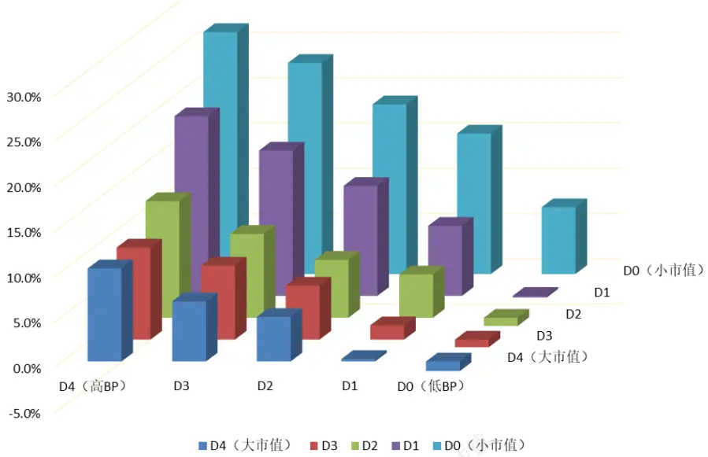
数据来源：财通证券研究所，恒生聚源

表4：5×5组合时间序列回归主要结果

| Rsquare | D4 (BP) | D3 | D2 | D1 | D0 | AlphaD4D3D2D1DO | D4 | D3 | D2 | D1 | D0 |
| --- | --- | --- | --- | --- | --- | --- | --- | --- | --- | --- | --- |
| D4（市值） | 0.942 | 0.930 | 0.919 | 0.938 | 0.936 |  | 0.000 | 0.000 | 0.000 | 0.000 | 0.000 |
| D3 | 0.953 | 0.956 | 0.953 | 0.953 | 0.940 |  | 0.000 | 0.000 | 0.000 | 0.000 | 0.000 |
| D2 | 0.963 | 0.969 | 0.964 | 0.960 | 0.949 |  | 0.000 | 0.000 | 0.000 | 0.000 | 0.000 |
| D1 | 0.966 | 0.973 | 0.974 | 0.971 | 0.960 |  | 0.000 | 0.000 | 0.000 | 0.000 | 0.000 |
| D0 | 0.933 | 0.962 | 0.962 | 0.958 | 0.943 |  | 0.000 | 0.000 | 0.000 | 0.000 | 0.000 |

| SMB | D4 (BP ) | D3 | D2 | D1 | DO | HML | D4 | D3 | D2 | D1 | DO |  |
| --- | --- | --- | --- | --- | --- | --- | --- | --- | --- | --- | --- | --- |
| D4（市值） | -0.271 | -0.193 | -0.224 | -0.179 | -0.142 | D4 | 0.627 | 0.137 | -0.146 | -0.473 | -0.890 |  |
| D3 | 0.594 | 0.626 | 0.621 | 0.573 | 0.478 | D3 | 0.275 | -0.022 | -0.217 | -0.426 | -0.688 |  |
| D2 | 0.823 | 0.843 | 0.840 | 0.802 | 0.679 | D2 | 0.259 | 0.015 | -0.184 | -0.376 | -0.597 |  |
| D1 | 0.999 | 0.990 | 0.965 | 0.942 | 0.854 |  | D1 | 0.242 | 0.011 | -0.126 | -0.292 | -0.472 |
| D0 | 1.092 | 1.085 | 1.072 | 1.072 | 1.068 | D0 | 0.165 | -0.040 | -0.171 | -0.300 | -0.404 |  |

数据来源：财通证券研究所，恒生聚源

值得注意的是，此处我们进行时间序列回归时，因变量为组合在T期的收益情况，而自变量为Fama-French三因子在T期的收益情况，二者均为T期的因子收益数据。因此我们可以认为，Fama-French回归更加注重的是因子对于个股的解释程度，它更侧重于收益的解释，而不涉及到任何的预测。

而在Barra模型中，我们在进行横截面回归时，作为因变量的为个股在T期的收益，而作为自变量的是公司在 期的因子值，二者之间存在一期的滞后。也正是基于此，横截面回归更多的关注的是因子对于下期收益的预测程度，而并非对于当期收益的解释程度，因此其R方往往在25%左右，相较之下更小。

由此可见，基于时序回归得到的模型R方与基于横截面回归得到的模型R方之间讨论的并不是同一个问题，前者更注重于收益的解释，而后者更注重于收益的预测。在实际投资中，前者通常用于归因，而后者通常用于选股，这也是业界使用横截面模型更多的原因之一。

## 4、 两个问题

本次讨论的最后一个部分，我们对两个细节问题进行探讨。

## 4.1.1 公式规范化

给定一个回归模型，研究者是否能够快速地分辨出该回归是基于横截面回归还是时间序列回归呢？在学术论文的阅读时，我们常常模糊于一个回归方程本身代表的含义，除了联系作者的上下文之外，是否能够从公式本身分辨出其回归类型呢？如表5所示，Fama-French在2019年发布的《Comparing Cross-Section andTime-Series Factor Models》一文中，就针对三个回归模型进行了具体的比较。

| 表5：Fama-French（2019）三个公式比较 |  |
| --- | --- |
| 模型代号 | 模型公式 |
| (1) | $R_{it}-R_{ft}=a_{i}+b_{i}\big(R_{mt}-R_{ft}\big)+s_{i}SMB_{t}+h_{i}HML_{t}+r_{i}RMW_{t}+c_{i}CMA_{t}+e_{it}$ |
| (2) | $R_{it}=R_{zt}+MC_{it-1}R_{MCt}+BM_{it-1}R_{BMt}+OP_{it-1}R_{OPt}+INV_{it-1}R_{INVt}+e_{it}$ |
| (3) | $R_{it}-R_{ft}=a_{i}+b_{1i}\big(R_{mt}-R_{ft}\big)+b_{2i}R_{MCt}+b_{3i}R_{BMt}+b_{4i}R_{OPt}+b_{5i}R_{INVt}+e_{it}$ |

数据来源：财通证券研究所
注：MC代表Market Capitalization，市值因子

其中，模型（1）即为传统的Fama-French五因子模型，它是一个时间序列回归，因变量为个股或者组合的收益率序列，自变量为通过组合构建法计算得到的因子收益 $(SMB_{t}$ 等），待估计的参数为个股或组合在每个因子上的暴露程度 $(s_{i}$ 等）。

模型（2）是一个横截面回归，其中因变量为个股的收益率，自变量为个股在每个因子上的暴露程度 $(MC_{it-1}\frac{\ast s}{\intercal})$ ，因子暴露由个股特征直接决定，待估计的参数为各个因子的收益率 $(R_{MCt})$ 。

模型（3）同样是一个时间序列回归，其中因变量为个股的收益率序列，自变量为通过横截面回归法得到的因子收益 $(R_{MCt}\frac{\sharp{\xi}}{\vec{\tau}})$ ），待估计的参数为个股或组合在每个因子上的暴露程度 $(b_{2i}\div)$ ）。模型（3）与模型（1）直接对标，其唯一的区别在于因子收益率的计算是根据Fama-French方式提出的组合构建法得到的，还是根据Barra提出的横截面回归方法得到的。

除了以上三类模型之外，还有另一种因子有效性检验方式——Fama-Macbeth回归。与模型（2）相同之处在于，二者在本质上都属于横截面回归，而不同的地方在于最初版本的Fama-Macbeth回归中，个股在因子上的暴露度通常是经过时间序列回归得到的，而模型（2）中的因子暴露通常采用的是个股特征。关于Fama-Macbeth检验的相关内容，财通金工“星火”专题（五）《源于动量，超越动量——特质动量因子全解析》中有着详细的描述。实际上目前很多学术界论文关于Fama-Macbeth检验中都直接忽略时间序列回归得到因子暴露度这一步，而是直接采用模型（ ）的构建方式，将个股特征作为公司因子暴露的直接表示。关于以上各类模型的实证结果并非此处讨论重点，具体结论可参见Fama-French（2019）的原文论述。本部分我们想要探讨，给定了以上三个公式之后，如何能够快速地知道每个回归模型到底是时间序列回归还是横截面回归呢？

事实上，分辨的关键在于截距项的表示。在时间序列回归中，由于截距项对于所有的时间来讲是固定的，因此其截距项并不会带上t的下角标。而对于横截面回归而言，不同时刻的截距项是不同的，因此其表示方式与时间t有关，从而带有角标t。观察表5可以看到，基于时间序列回归的模型（1）和模型（3）中，截距项均表示为 $a_{i},$ ，而基于横截面回归的模型（2）中，截距项为 $R_{zt}$ 。同样的表述在Blitz（2018）关于特质动量因子的计算中也是如此：

$$
R_{i,t}-R_{f,t}=\alpha_{i}+\beta_{mkt,i}\big(R_{mkt,t}-R_{f,t}\big)+\beta_{hml,i}R_{hml,t}+\beta_{smb,i}R_{smb,t}+\varepsilon_{i,t}
$$

上面这一回归模型也是基于时间序列上的回归，因此其截距项表示为 $\alpha_{i}$ ，是一个与时间无关的变量。

## 4.1.2 时间序列相关和横截面相关

本次讨论的最后一个部分，我们思考这样一个问题。在财通金工“星火”系列（五）关于特质动量因子的讨论中，我们将个股收益对 三因子进行回归，试图剔除市场、市值和价值因子对个股收益的影响，从而获得其特质收益。然而，当我们将计算得到的个股特质动量因子在横截面上排序，并计算其与Size、BP等因子的相关性时，我们惊讶的发现特质动量因子与Size及BP因子之间仍然存在非常单调的线性关系。如图11所示，特质动量因子与BP因子之间存在非常明显的负相关系，高特质动量组合更多的是一些大市值、高估值的股票，而低特质动量组合更倾向于小市值、低估值的股票。

这不禁让我们产生了疑问：既然在计算特质收益的时候我们已经剔除了市值和 因子的影响，那么为何最后得到的因子又与 和 之间存在如何强的相关关系呢？事实上，我们认为在第一步从时间序列上对市值和价值因子进行剔除，与传统的基于横截面分组或回归的剔除方法之间是存在区别的，二者并不能等同对待。以大市值股票为例，由于大市值股票的波动本身就很小，因此其特质收益的波动率自然而然的就会更小，这是由其个股特征决定的。然而，我们在衡量特质动量因子与Size和BP因子的相关性时，是在横截面上进行衡量的，二者之间并不能完全等同。

图 11：特质动量因子每组得分均值
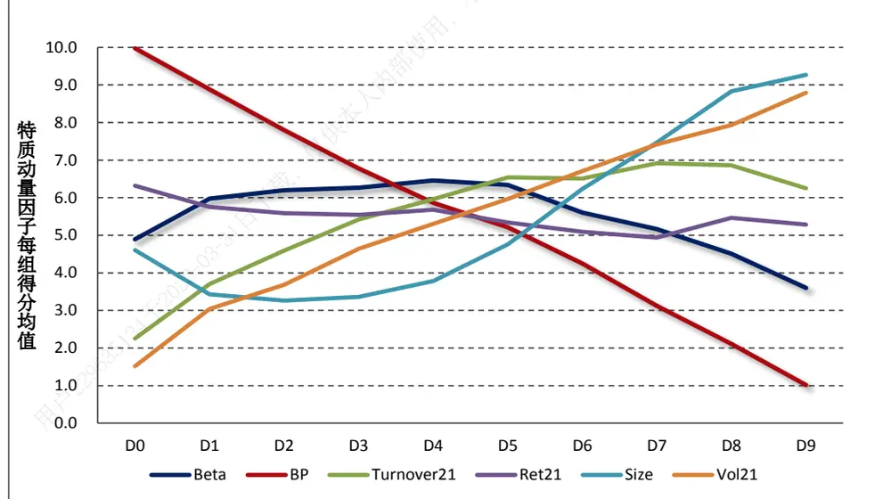
数据来源：财通证券研究所，“星火”专题（五）

在本文第1小节关于CAPM模型的介绍中我们也提到，CAPM模型中个股特质收益的期望接近于0并不代表着不存在其他的因子对其特质收益产生驱动作用，而仅仅是说明个股的特质收益在时间序列上的均值为0。在横截面上，个股的特质收益之间仍然会存在某种特定的关联。因此，如果要使得计算出来的因子在横截面上与Size、BP因子无关，那么就还需要在横截面上对其进行一次正交化，而关于因子正交的更多细节，可以参考财通金工“拾穗”系列（18）《当我们在做因子正交化的时候，我们在做什么》。

## 5、 总结

在本期“拾穗”系列专题中，我们就资产定价中经常用到的却又特别容易混淆的时间序列回归和横截面回归进行了详细的探讨，主要结论如下：

（1） 在资产定价模型中，以Fama-French模型为代表的时间序列回归将因子收益视为已知、因子暴露视为待估计的参数；而在以Barra模型为代表的横截面回归中，将因子暴露视为已知、因子收益视为待估计的参数；

（2） 根据Fama-French方法构建的因子收益更像是一种多空分组法或者Double-Sort的分组方法，其主要目的是根据分组的方法剔除目标因子与其他因子之间的相关关系，这种方式在因子数量较多时将受到较大的限制。

（3） 通过时间序列回归计算得到的因子暴露与采用个股特征直接得到的因子暴露之间体现出一定的相关关系，但二者之间仍然存在明显的区别。在选股能力方面，用个股特征得到的因子暴露具有更理想的效果。

（4） Fama-French回归更加注重收益的解释，而Barra模型更加注重收益的预测，两种回归模型的R方讨论的并不是同一个问题。

（5） 给定一个公式，判断其是时间序列回归还是横截面回归的关键在于截距项的表示。

（6）在特质动量因子的计算中，我们在时间序列上剥离了市值和价值的影响之后，在横截面上个股与Size和BP仍然体现出强烈的相关关系。究其原因，我们认为时间序列上的剔除与横截面上的剔除是存在区别的，二者并不能完全等同。

## 【参考文献】

【1】 Fama, E.F., French, K.R. “Comparing Cross-Section and Time-Series Factor Models”. 2019, SSRN

【2】 Fama, E.F., French, K.R. “The Cross Section of Expected Stock Returns”. 1992. Journal of Finance.

【3】 Fama, E.F., French, K.R. “Common Risk Factors in the Retusn on Stocks and Bounds”. 1993. Journal of Financial Economics.

【4】 Blitz D., Hanauer M.X., Vidojeciv M. “The Idiosyncratic Momentum Anomaly”. 2018.

## 信息披露

## 分析师承诺

作者具有中国证券业协会授予的证券投资咨询执业资格，并注册为证券分析师，具备专业胜任能力，保证报告所采用的数据均来自合规渠道，分析逻辑基于作者的职业理解。本报告清晰地反映了作者的研究观点，力求独立、客观和公正，结论不受任何第三方的授意或影响，作者也不会因本报告中的具体推荐意见或观点而直接或间接收到任何形式的补偿。

## 资质声明

财通证券股份有限公司具备中国证券监督管理委员会许可的证券投资咨询业务资格。

## 公司评级

买入：我们预计未来 6个月内，个股相对大盘涨幅在 15%以上；

增持：我们预计未来 6个月内，个股相对大盘涨幅介于 5%与 15%之间；

中性：我们预计未来 6个月内，个股相对大盘涨幅介于-5%与 5%之间；

减持：我们预计未来 6个月内，个股相对大盘涨幅介于-5%与-15%之间；

卖出：我们预计未来 6个月内，个股相对大盘涨幅低于-15%。

## 行业评级

增持：我们预计未来 6个月内，行业整体回报高于市场整体水平 5%以上；

中性：我们预计未来 6个月内，行业整体回报介于市场整体水平-5%与5%之间；

减持：我们预计未来 6个月内，行业整体回报低于市场整体水平-5%以下。

## 免责声明

本报告仅供财通证券股份有限公司的客户使用。本公司不会因接收人收到本报告而视其为本公司的当然客户。

本报告的信息来源于已公开的资料，本公司不保证该等信息的准确性、完整性。本报告所载的资料、工具、意见及推测只提供给客户作参考之用，并非作为或被视为出售或购买证券或其他投资标的邀请或向他人作出邀请。

本报告所载的资料、意见及推测仅反映本公司于发布本报告当日的判断，本报告所指的证券或投资标的价格、价值及投资收入可能会波动。在不同时期，本公司可发出与本报告所载资料、意见及推测不一致的报告。

本公司通过信息隔离墙对可能存在利益冲突的业务部门或关联机构之间的信息流动进行控制。因此，客户应注意，在法律许可的情况下，本公司及其所属关联机构可能会持有报告中提到的公司所发行的证券或期权并进行证券或期权交易，也可能为这些公司提供或者争取提供投资银行、财务顾问或者金融产品等相关服务。在法律许可的情况下，本公司的员工可能担任本报告所提到的公司的董事。

本报告中所指的投资及服务可能不适合个别客户，不构成客户私人咨询建议。在任何情况下，本报告中的信息或所表述的意见均不构成对任何人的投资建议。在任何情况下，本公司不对任何人使用本报告中的任何内容所引致的任何损失负任何责任。

本报告仅作为客户作出投资决策和公司投资顾问为客户提供投资建议的参考。客户应当独立作出投资决策，而基于本报告作出任何投资决定或就本报告要求任何解释前应咨询所在证券机构投资顾问和服务人员的意见；

本报告的版权归本公司所有，未经书面许可，任何机构和个人不得以任何形式翻版、复制、发表或引用，或再次分发给任何其他人，或以任何侵犯本公司版权的其他方式使用。