2020 年 3 月 24 日

# 微观市场结构研究：如何度量股市流动性？

## “拾穗”多因子系列报告（第 20 期）

## 联系信息

陶勤英

## 首席分析师

SAC 证书编号：S0160517100002

taoqy@ctsec.com

021-68592393

张宇

分析师

SAC 证书编号：S0160519120001

zhangyu1@ctsec.com

17621688421

021-68592337

## 相关报告

【1】“星火”多因子系列（一）：《Barra模型初探：A 股市场风格解析》

【2】“星火”多因子系列（二）：《Barra模型进阶：多因子模型风险预测》

【3】“星火”多因子系列（三）：《Barra模型深化：纯因子组合构建》

【4】“星火”多因子系列（四）：《基于持仓的基金绩效归因：始于 Brinson，归于 Barra》

【5】“星火”多因子系列（五）：《源于动量，超越动量：特质动量因子全解析》

【6】“星火”多因子系列（六）：《Alpha 因子重构：引入协方差矩阵的因子有效性检验》

【7】“星火”多因子系列（七）：《借因子组合之力，优化 Alpha因子合成》

【 】 星火 多因子系列（八）：《组合风险控制：协方差矩阵估计方法介绍及比较》

【 】“星火”多因子系列（九）：《博彩偏好还是风险补偿？高频特质偏度因子全解析》

【10】“星火”多因子系列（十）：《如何对Beta因子进行稳健估计？》

【 】“星火”多因子系列（十一）：《在下跌中寻找惊喜：业绩超预期与反转因子的融合》

【12】“拾穗”多因子系列（五）：《数据异常值处理：比较与实践》

【13】“拾穗”多因子系列（六）：《因子缺失值处理：数以多为贵》

【 】“拾穗”多因子系列（八）：《非线性规模因子：A 股市场存在中市值效应吗？》

【15】“拾穗”多因子系列（十一）：《多因子风险预测：从怎么做到为什么》

【16】“拾穗”多因子系列（十四）：《补充：基于特质动量因子的沪深 300 增强策略》

## 投资要点：

## 引言

- 随着新冠疫情在全球范围内的扩散以及OPEC与俄罗斯之间的石油冲突爆发，近期外围市场出现了剧烈的波动，其中以美国市场的波动最为明显。在过去短短的数 10 天之内，美股出现了 4 次熔断。一时之间，“股市流动性”成为投资者们关注的热点话题。

- 该如何度量股市流动性？美国股票市场发生了“流动性危机”吗？A股市场的流动性情况如何？本期“拾穗”专题，我们从微观市场结构的研究视角出发，介绍几种度量市场流动性的指标，并对中美两市近期的流动性情况进行比较，以供投资者参考。

## “流动性是市场的一切”

- 市场微观结构理论是研究交易价格的形成与发现过程与交易运作机制的一个金融分支，市场结构的研究主要包括流动性、透明性、有效性、稳定性、公平性、可靠性，而其中“流动性是市场的一切”。

- 流动性是在一定时间内完成交易所需的时间或成本，概括起来流动性包含速度（交易时间）、价格（交易成本）、交易数量和弹性四个方面。

## 股市流动性度量指标介绍

- 从市场流动性冲击出发，对 Amihud 非流动性指标、Pastor Gamma指标、LOT Zeros 方法进行介绍。

- 从股票买卖价格出发，对采用日内高频交易数据构建的有效价差指标和采用日度低频价量指标的 Roll 价差，Corwin and Schultz 指标进行介绍。

## 实证检验

- 通过对美股市场的整体流动性进行监测发现，近期美股市场的流动性冲击达到一个高峰，部分指标甚至高过 年金融危机时刻。近期美股市场确实承受了较大的卖压，由于投资者的恐慌性抛售导致的市场信心不足从多个流动性指标维度得到了验证。

- 相较之下，A 股市场受近期全球波动影响虽然也出现了一定的波动放大情况，但总体而言 A股市场流动性情况比较良好，并没有出现股市流动性紧张的情况。

- 风险提示：本报告统计数据基于历史数据，过去数据不代表未来，市场风格变化可能导致模型失效。

未找到图形项目表。

在实际投资中，多因子模型被广泛地应用到资产定价、绩效归因、风险控制、组合优化、基金评价及资产配置等各个领域，一套完整、精细的多因子系统成为每位量化研究者必备的工具。“做最实用的研究”，是财通金工给自己的定位。我们将在之后的系列报告中，就投资者们最关心也最容易忽略的很多细节问题进行探讨，介绍我们在实际应用中遇到的问题和思考，以飨读者。

我们为本系列报告取名“拾穗”。一周市场风云变幻，和风细雨也好，狂风骤雨也罢，都留下一地故事等待梳理。作为勤劳的搬运工，财通金工从量化视角出发对市场风格进行捕捉、对风险水平进行预测，既是希望能够如拾穗者般专心、踏实地做研究，也是祝愿各位投资者能够在市场收获满地金黄。

本期是该系列报告的第 期，随着新冠疫情在全球范围内的扩散以及与俄罗斯之间的石油冲突爆发，近期外围市场出现了剧烈的波动，其中以美国市场的波动最为明显。在过去短短的数 10 天之内，美股出现了 4 次熔断，要知道美国股市自 1988 年设立熔断机制以来，总共也才发生过 5 次熔断。一时之间，“股市流动性”成为投资者们关注的热点话题。该如何度量股市流动性？美国股票市场发生了“流动性危机”吗？A股市场的流动性情况如何？本期“拾穗”专题，我们从微观市场结构的研究视角出发，介绍几种市场流动性度量的间接指标，并对美股及 A股近期的流动性情况进行比较，以供投资者参考。

## 1、 “流动性是市场的一切”

市场微观结构理论（Market Microstructure）也称为市场微观结构经济学，是研究交易价格的形成与发现过程与交易运作机制的一个金融分支。市场微观结构理论主要包括两大类内容：一是关于价格发现的模型及其实证研究，二是关于市场结构与设计方面的理论研究与经验研究。根据刘逖（2002），市场结构所要实现的主要政策目标可以概括为 6个方面：流动性、稳定性、透明性、有效性、公平性和可靠性。其中，流动性（Liquidity）是证券市场的生命力所在，二级市场的流动性为投资者提供了转让和买卖证券的机会，也为筹资者提供了筹资的必要前提。如果市场缺乏流动性而导致交易难以完成，那么市场也就失去了存在的必要。如 Amihud 和 Mendelson（1988）所言：“流动性是市场的一切”。

图 1：市场结构设计的基本目标

数据来源：财通证券研究所，刘逖（2002）
谨请参阅尾页重要声明及财通证券股票和行业评级标准

流动性的定义有很多，我们参考 Amihud and Mendelson（1986）的研究，认为流动性是在一定时间内完成交易所需要的时间或成本，或者说是寻找一个理想的价格所需要的时间或成本。概括起来，流动性包含速度（交易时间）、价格（交易成本）、交易数量和弹性四个方面（如图 2所示），具体来讲：

（1） 速度：即是指证券交易的即时性（Immediacy），流动性意味着一旦投资者有买卖证券的愿望，这种愿望总可以立即得到满足。

（2） 价格：也称为交易成本，流动性意味着交易即时性必须在成本尽可能小的情况下获得，或者说资产交易的买方溢价或者卖方折价必须在交易者能够接受的范围之内。

（3） 数量：在一个流动性良好的市场中，光有速度和价格还不足够，数量上的限制必须突破。良好的流动性意味着市场中较大量的交易订单能够按照合理的价格较快执行。

（4） 弹性：由于较大数量的交易订单需要在较短的时间内执行，因此这可能造成资产价格上的较大变化。弹性（Resiliency）是指由于一定数量的交易导致价格偏离均衡水平后恢复均衡价格的速度，恢复均衡价格的速度越快，意味着市场弹性越好。

图 2：衡量市场流动性的四个维度

数据来源：财通证券研究所，刘逖（2002）

在本期专题中，我们主要从交易成本的角度来考察市场的流动性。一般来讲，交易成本主要包括显性成本和隐性成本两个部分，其中显性成本主要包括手续费、印花税等税费，而隐性成本则主要包括买卖价差、冲击成本和时间成本三个方面的内容。在隐性成本的研究领域中，买卖价差的度量是其重要组成部分，也是目前市场微观结构研究中比较主流的部分。在下文中，我们将对买卖价差的直接指标和间接指标进行介绍，并从实证方面对 股和美股的交易数据进行比较。

## 2、 股市流动性度量指标介绍

本部分主要对股票市场流动性度量的指标进行介绍，其中既包括常见的衡量个股流动性的换手率、Amihud 非流动性指标，也包括衡量个股买卖价差的直接指标和间接指标等。

## 2.1 换手率（TurnOver）

换手率，又称买卖周转率，是指一段时间内市场中股票转手买卖的频率，它是反映股票流动性强弱的指标之一。在不同语境下，换手率表达的含义可能并不完全一致。它可以表示全市场所有上市股票的总换手率，也可以表示单个股票流通数量的周转率，还可以表示某个投资组合在进行调仓时候，各个股票仓位的变化频率。本部分我们关注个股的换手率，其主要计算方式如下：

$$
换手率=\frac{成交量(手)}{股本数量(股)}\times100\%
$$

在 Wind API 接口关于换手率指标的计算中，有三种不同的计算方式，分别为 turn、free_turn 和 free_turn_n，其中 turn 指标的计算中分母采用的是流通股本，free_turn和 free_turn_n 的计算采用的是由 Wind 自己计算的自由流通股本，但是在具体的结果上仍然会存在一些区别，此处我们提醒研究者注意一下。

财通金工采用的换手率数据是将成交量除以总股本数据，采用总股本进行计算的好处在于如果上市公司不进行股本增发、可转债转股等情况，那么其总股本将保持相对稳定，计算得到的换手率也不容易发生跳变。否则，无论是采用自由流通股本还是流动股本，当大股东解禁导致原本的非流通股上市时，其换手率可能存在明显跳变。不过，无论采用哪种数据，我们最终的计算结果都十分类似，保持较好的稳健性。

## 2.2 Amihud 非流动性指标

Amihud 非流动性指标是目前采用的最广泛的市场冲击指标之一，其计算方法如下：

$$
AmihudIIIig=\frac{区间收益率}{区间成交金额}\times100\%
$$

可以看到，Amihud 非流动性指标等于区间收益率的绝对值与区间成交金额的比值，它衡量的是单位成交金额所能够驱动的个股收益率的变化幅度。当Amihud 指标越高时，说明较小的成交量就能够导致较大幅度的价格变化，这意味着这笔交易对于个股价格的冲击较大，从某种层面意味着个股的流动性越差。本文根据日度的交易数据计算个股的 Amihud 指标，如果股票在当天没有交易，那么其 Amihud 指标记为 0。

## 2.3 Pastor Gamma 指标

Pastor and Stambaugh（2003）为了分析前期交易量和交易方向对当期股票收益率的影响，提出通过如下时间序列回归来度量个股流动性：

$$
\begin{array}{r}{r_{i,d+1,t}^{e}=\theta_{i,t}+\phi_{i,t}r_{i,d,t}+\gamma_{i,t}sign\big(r_{i,d,t}^{e}\big)\cdot v_{i,d,t}+\epsilon_{i,d+1,t},d=1,\dots,D}\\{r_{i,d,t}^{e}:=r_{i,d,t}-r_{m,d,t}}\end{array}
$$

其中， $r_{i,d,t}^{e}$ 表示股票 i 在 t 月中的第 d 天的日度超额收益率， $r_{m,d,t}$ 表示市场日度收益率， $r_{i,d,t}$ 表示股票 i 在 t 月中的第 d 天的日度收益率， $\upsilon_{i,d,t}$ 表示股票 i在 t 月中的第 d 天的成交量，sign(x)为符号函数，当 x 大于0 时取 1,否则取 0。

在 Pastor 回归中， $\gamma_{i,t}$ 表示的是个股交易量和交易方向对股票未来收益率的影响程度，是体现交易冲击的重要指标。一般来讲，个股的短期订单交易会导致其未来价格出现一定程度的反转，如果这种反转程度越大，说明股票的流动性越低。所以，我们预期 $\gamma_{i,t}$ 应该是一个负值，并且 $\gamma_{i,t}$ 值的绝对值越大，说明其流动性越差。然而，在实证研究中我们也会发现，通过如上时间序列回归得到的 $\gamma_{i,t}$ 并不一定为负，正值出现的次数也比较多。

## 2.4 LOT（Lesmond, Ogden and Trzcinka）模型

Lesmond, Ogden and Trzcinka（1999）认为当股票的流动性越差时，没有交易的天数就会越多，从而导致零收益率的天数越多。其次，对于交易成本比较高的股票，通过私有信息交易获利不容易弥补高昂的交易成本，因此投资者在这些股票上进行交易时不容易包含私有信息，也就更容易出现零收益率的交易日。基于以上思想，Lesmond 等（1999）提出如下两个公式来衡量个股流动性：

$$
\frac{考察时期内零收益率的天数}{考察时期的天数}
$$

$$
\frac{考察时期内交易金额为正但是零收益率的天数}{考察时期的天数}
$$

## 2.5 买卖价差指标之有效价差

前面提到，买卖价差的估计是隐性交易成本中最为主要的内容。一般来讲，买卖价差的度量分为直接指标和间接指标两种。直接指标是根据日内高频的交易数据（TAQ，Tick And Quote 数据）来计算买卖价差的方法，其中有四种度量指标：

（1） 绝对报价价差：最低卖价－最高买价

（2） 绝对有效价差：2×|成交价－买卖价中点价格|（|·|表示绝对值）

（3） 相对报价价差：（最低卖价－最高买价）/买卖价中点价格

（4） 相对有效价差：2×|成交价－买卖价中点价格|/买卖价中点价格

由于一天之内存在多笔成交，因此根据 McInish and Wood（1992）在度量日度的买卖价差时，通常可以分为时间加权的平均买卖价差、简单平均的买卖价差、收盘时刻的买卖价差三种。

采用日内 Tick 数据来衡量交易价差在逻辑上简洁明了且极具说服力，但是目前国内绝大多数数据提供商提供的 Tick 级别交易数据价格高昂，且其内存所占空间巨大（仅仅 1 天 A 股所有股票的 Tick、成交、订单、队列数据大小就可能达到近 20G），在数据存储和数据处理上都为研究者带来了很大的难度，因此很多学术文献致力于从低频的价格和成交量数据出发，对个股的买卖价差数据进行估计。下面，我们对最为经典的 Roll价差估计和 Corwin and Schultz 方法进行介绍。

## 2.6 买卖价差间接指标之 Roll价差

Roll价差是一种根据日度交易数据，采用一阶差分的价格序列协方差来衡量有效市场中个股买卖价差的估计方式。这种方式采用日度交易价格数据进行计算，简单便捷，但却需要如下两个假设：

（1） 市场处于一种信息有效市场中（Informationally Efficient Market）；

（2） 股票价格变化的分布在短期内（如两个月内）是平稳的。

在如上的两个假设中，有效市场意味着投资者观察到的价格包含了所有已知的信息——只有当投资者接收到未预期到的信息时，股票的交易价格才会发生变化。在这一假设下，股票价格的变化是不存在序列相关性的。然而，由于交易成本的存在，我们观察到的价格变动就不再是序列无关的，这可以通过如下的方式进行说明。

假设个股交易的价差 s 在一定时期内保持稳定，那么由于接下来的交易者可能随机地来自于买方（Purchase）或者卖方（Sale），因此我们观察到的价格可能是买入价格（Ask）或者卖出价格（Bid）。如图 3 所示，假设 t-1 日的交易价格来自于卖方（Bid Price），此时的成交价格记为 $P_{t-1}$ ，如果股票的真实价值保持不变，那么在 t 日，由于交易价格可能来源于买方或者卖方，因此观察到的价格 $-P_{t}$ 可能是 $P_{t-1}$ （当交易价格来自于卖出者的推动时）或者 $P_{t-1}$ + s（当交易价格来自于买入者的推动时），此时价格的变化 $\Delta P_{t}$ 相应地可记为 0 或者 s。

图 3：有效市场下，价格变动示意图
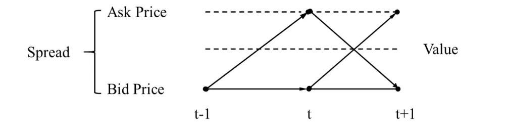
数据来源：财通证券研究所，Roll（1984）

同样的，当 t-1 日的价格为买方（Ask Price）价格所推动的时候，我们也可以绘制出与图 3 类似的示意图。由于观察到的价格来自于买方还是卖方是完全随机的，因此我们即可对价格变动 $\Delta P_{t}$ 的走势进行分析，如图 4 所示。

图 4：不同情境模式下的价差走势分析
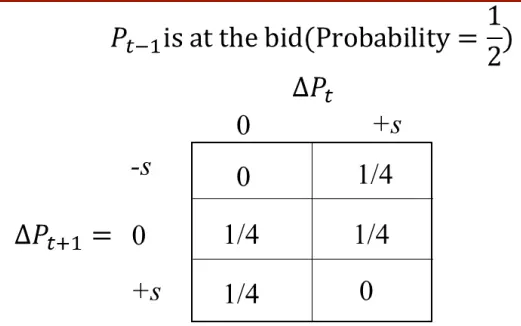

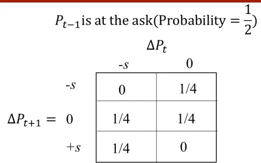
数据来源：财通证券研究所，Roll（1984）

其中， $\Delta P_{t}$ 表示t日观察价格相较t-1日价格的变动幅度。由于 $P_{t-1}$ 是 Bid Price还是 Ask Price 是完全随机的，因此二者发生的概率都是 1/2，所以对如上两种情况进行综合，即可描述出综合情况下的隔日价差走势分析轨迹，如图 5 所示。

图 5：综合情境模式下的价差走势分析
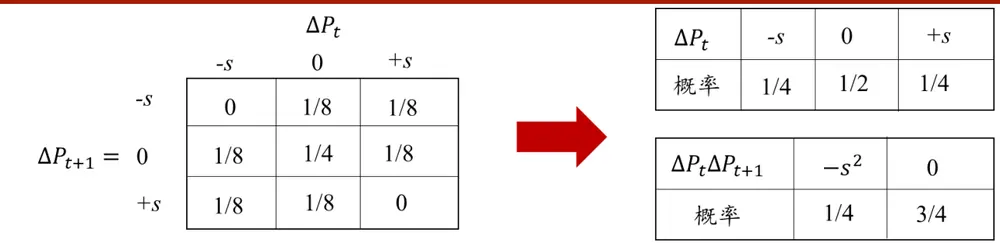
数据来源：财通证券研究所，Roll（1984）

由于图 5 所表示的 $\Delta P_{t}、\Delta P_{t}\Delta P_{t+1}$ 等可视为概率论中的随机变量，因此我们即可计算 $\Delta P_{t}和\Delta P_{t}\Delta P_{t+1}$ 的期望值：

$$
\begin{align*}E\big(\Delta P_t\big)&=0\\E\big(\Delta P_t\Delta P_{t+1}\big)&=-\frac{1}{4}S^2\end{align*}
$$

由此，我们即可计算得到隔日价格变动 $\Delta P_{t}$ 与 $\Delta P_{t+1}$ 的协方差：

$$
\mathsf{cov}(\Delta P_{t},\Delta P_{t+1})=E(\Delta P_{t}\Delta P_{t+1})-E(\Delta P_{t})E(\Delta P_{t}+1)=-\frac{1}{4}S^{2}
$$

将如上等式进行变化，即可得到价差 S 的估计：

$$
S=2\sqrt{-cov(\Delta P_{t},\Delta P_{t+1})}
$$

## 2.7 买卖价差间接指标之 Corwin and Schultz 高低价差估计

最后一部分，我们介绍一种采用每日最高价和最低价来估计个股买卖价差的方法，其最早由 Corwin and Schultz（2010）提出。通常情况下，最高价和最低价的比值既可以反映股价的真实方差，又反映买卖价差，其中方差部分会随着时间的延长而等比例增加，但价差成分却不会。基于此，我们即可采用连续两个交易日的最高价和最低价对个股买卖价差进行估计，具体公式如下：

$$
\begin{aligned}S&=\frac{2(e^{\alpha}-1)}{1+e^{\alpha}}\\\alpha&=\frac{\sqrt{2\beta}-\sqrt{\beta}}{3-2\sqrt{2}}-\sqrt{\frac{\gamma}{3-2\sqrt{2}}}\\\beta&=E\left\{\sum_{j=0}^{1}\left[\ln\left(\frac{H_{t+j}^{O}}{L_{t+j}^{O}}\right)\right]^{2}\right\}\\\gamma&=\left[\ln\left(\frac{H_{t,t+1}^{O}}{L_{t,t+1}^{O}}\right)\right]^{2}\end{aligned}
$$

其中，S 为计算得到的价差水平，HO和LO分别表示观察到的 t 日的最高价和最低价， $H^{O}_{t,t+1}和L^{O}_{t,t+1}$ 分别表示观察到的 t 日和 t+1 日的最高价和最低价，其实际上等于两日最高价的较大值和两日最低价的较小值。在 Corwin and Schultz（2010）的原文推导中，其假设股票价格在开市的情况下是连续交易的，并且在闭市的情况下没有任何变化。但很多实证研究均表明，股票市场存在明显的开盘跳价情况，因此需要对这种情况进行如下修正：

（1） 当 t+1 日的最低价高于 t 日的收盘价时，即可认为价格在晚间从收盘价上升至最低价，进而在计算 t+1 日的最高价和最低价时均减去晚间的价格变化；

（2） 当 t+1 日的最高价低于 t 日的收盘价时，即可认为价格在晚间从收盘价下降至最高价，进而在计算 t+1 日的最高价和最低价时加上晚间的价格变化。

事实上，如上修正也可根据 t+1 日开盘价与t 日收盘价进行比较进行，但是作者处于一些数据上的一些考量并不建议这么去做，具体推导和细节可参见原文。

图 6：股市流动性度量指标汇总
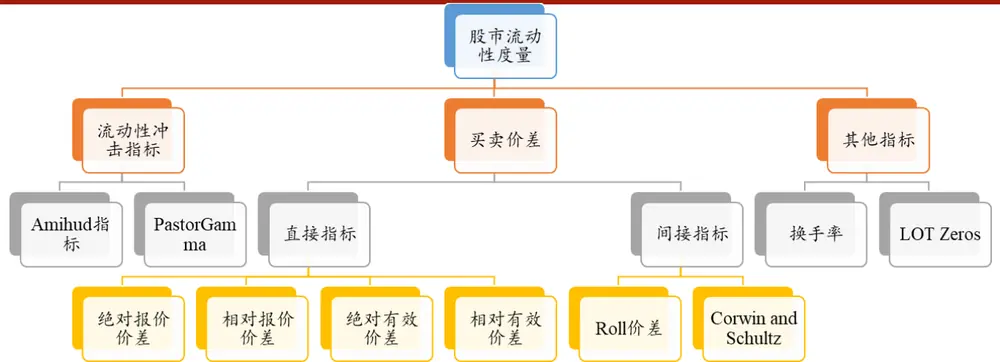
数据来源：财通证券研究所

到目前为止，我们已经对部分常用的流动性度量指标方法进行了总结（如图6 所示），在下一部分我们将就其中的部分指标展开实证检验，观察近期美股和 A股的流动性变化。

## 3、 A股与美股主要流动性指标对比

随着新冠疫情在全球范围内的扩散以及 OPEC 与俄罗斯之间的石油冲突爆发，近期外围市场出现了剧烈的波动，其中以美国市场的波动最为剧烈。在过去短短的数 10 天之内，美股出现了 4 次熔断（分别为 3月 9 日、3 月 12 日、3 月16 日和 3月 18 日），要知道美国股市自 1988 年设立熔断机制以来，总共也才发生过 5 次熔断。一时之间，“股市流动性”成为投资者们关注的热点话题。

图 7：A 股及美股大盘日涨跌幅（2020.3.9-2020.3.20）
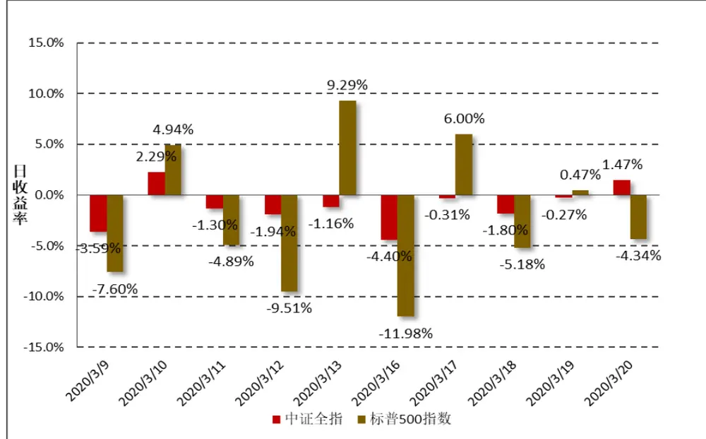
数据来源：财通证券研究所，Wind

如图 7 所示，标普 500 指数在短短两个星期内遭受重挫，机构相继抛售导致市场出现恐慌，“美股出现流动性危机”的新闻频繁地出现在头版头条。本部分，我们将借助前文介绍的几个衡量股市的流动性指标，观察中美两市近期流动性变化。

## 3.1 美股市场流动性分析

基于我们可获得的数据，本部分我们选取 AmihudIlliq 非流动性指标、Roll价差指标以及 Corwin and Schultz 高低价差指标对美股流动性进行衡量。

具体来讲，我们首先计算市场上所有个股的流动性指标，随后将全市场所有个股的流动性指标值取中位数（剔除指标值等于 0 的情况），作为衡量全市场流动性的代理变量。其中 AmihudIlliq 指标的计算仅涉及到个股的日度涨跌幅及成交额数据，Roll 价差指标在计算单日价格变动的协方差时采用过去 21 天的滚动数据，Corwin and Schultz 高低价差指标的计算仅需个股的最高价、最低价和收盘价即可。

图 8、图 9、图 10 分别展示了美股市场（包括纽交所、纳斯达克及美国证券交易所三个市场的全部股票）的 AmihudIlliq、Roll价差指标及高低价差指标的时间序列走势。可以看到，在金融危机发生的 2008 年，各指标均出现了大幅度急速攀升的情况，这一现象在近几个交易日又出现了重演。特别是高开低收价差指标，其近期峰值已经达到了历史高点，远高于 2008 年金融危机时候的峰值。由三个指标综合来看，近期美股市场确实承受了较大的卖压，由于投资者的恐慌性抛售导致的市场信心不足从多个流动性指标维度得到了验证。

图 8：美股市场 AmihudIlliq 非流动性指标（2007.1.3-2020.3.20）
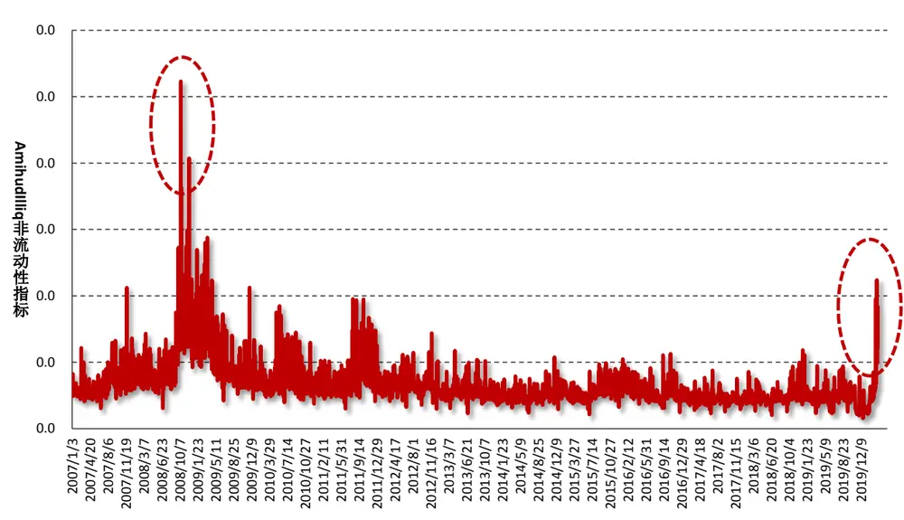
数据来源：财通证券研究所，恒生聚源

图 9：美股市场 Roll 价差指标（2007.1.3-2020.3.20）
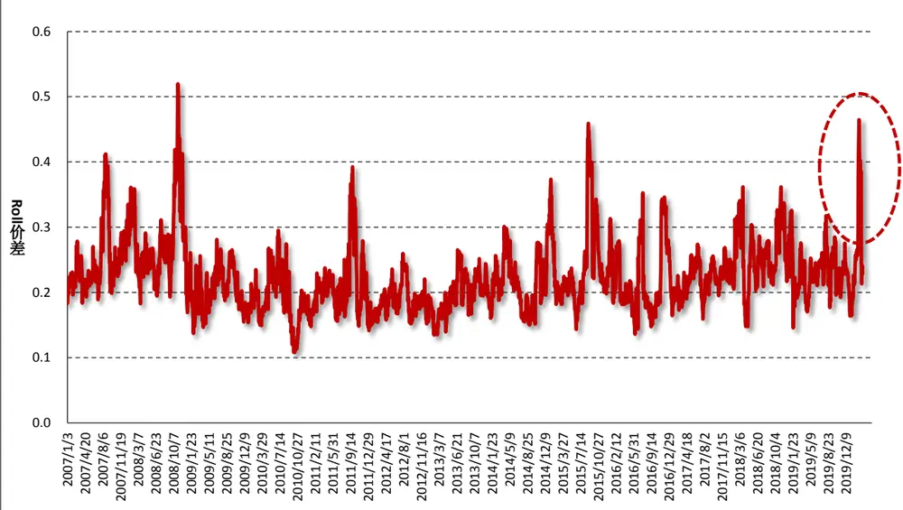
数据来源：财通证券研究所，恒生聚源

图 10：美股市场高开低收价差指标（2007.1.3-2020.3.20）
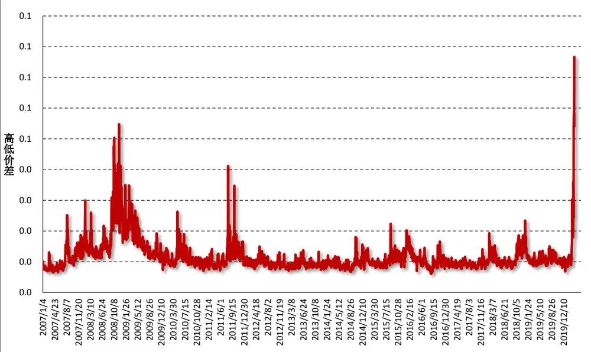
数据来源：财通证券研究所，恒生聚源

## 3.2 A 股市场流动性分析

图 11、图 12、图 13 分别展示了 A 股市场上的 AmihudIlliq 指标、Roll 价差指标及高低价差指标。在 A股的历史上，2008 年金融危机、2015 年的中旬都出现过急速的牛熊切换，可以看到，在这些时间段内，主要的流动性指标都出现了不同程度的攀升。不过有趣的是，每个指标的峰值发生的时间却并不一样，其中AmihudIlliq 指标在 2008 年期间达到峰值，而在此后的 2015 年和 2020 年均未出现明显的攀升，相较之下，Roll 价差则在 2015 年时达到最高点，并且在近期也出现了一定程度的攀升。不过拉长到历史区间来看，这点攀升并不足以导致投资者的紧张。总体而言，A股市场的流动性目前来看还是比较好的，并未出现股市流动性紧张的情况。

## 4、 总结

本文从微观市场结构的研究视角出发，对市场流动性的衡量指标进行介绍，并从实证层面出发检验近期全球市场波动加剧的情况下，中美股市的流动性变化，主要结论如下：

（1） 市场微观结构研究包括流动性、透明性、有效性、稳定性、公平性、可靠性，而其中“流动性是市场的一切”。

（2） 流动性是在一定时间内完成交易所需的时间或成本，概括起来流动性包含速度（交易时间）、价格（交易成本）、交易数量和弹性四个方面。

（3） 本文介绍衡量市场流动性的多项衡量指标，包括换手率、Amihud 非流动性指标、Pastor Gamma、LOT Zeros、有效价差、Roll 价差以及基于高低价差的指标。

（4） 对中美两市的实证检验发现，美国市场近期多次熔断造成市场恐慌，流动性压力极大，“流动性危机”确实存在，而 A股市场的整体流动性情况仍然良好。

图 11：A 股市场 AmihudIlliq 非流动性指标（2007.1.3-2020.3.20）
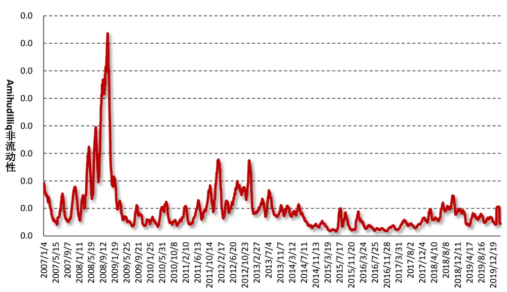
数据来源：财通证券研究所

图 12：A 股市场 Roll 价差指标（2007.1.3-2020.3.20）
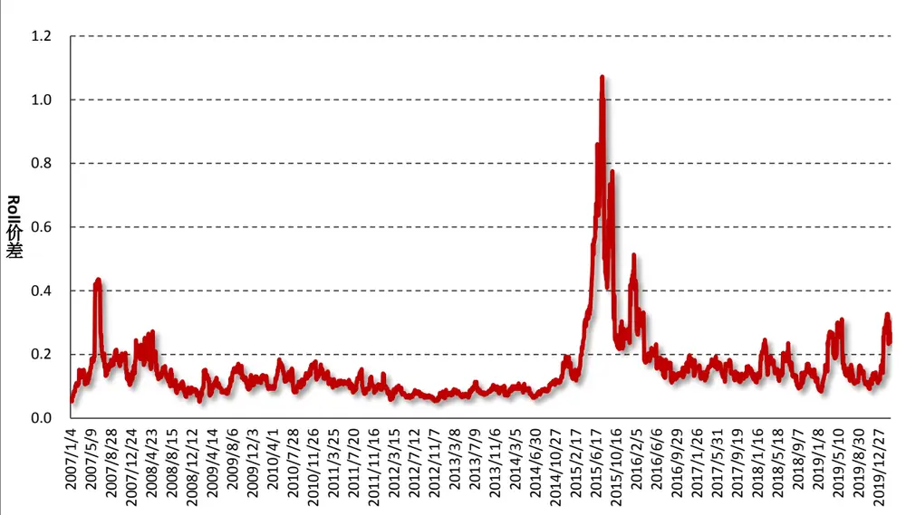
数据来源：财通证券研究所

图 13：A 股市场高低价差指标（2007.1.3-2020.3.20）
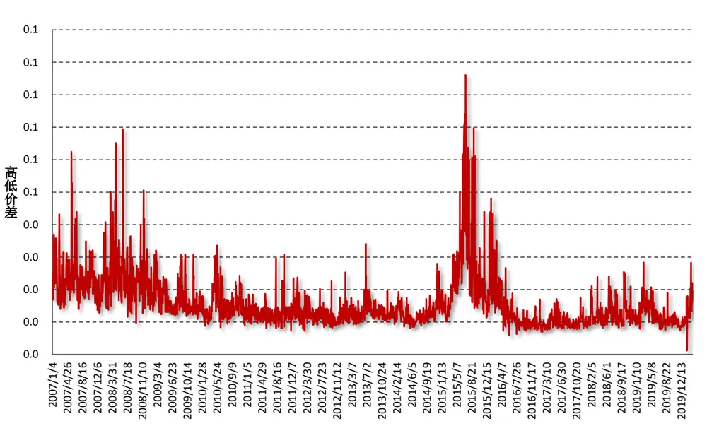
数据来源：财通证券研究所

## 5、 风险提示

多因子模型拟合均基于历史数据，市场风格的变化将可能导致模型失效。

## 参考文献：

【1】 Lesmond,D., C.Trzcinka, J. Ogden. “A New Measure of Transaction Costs.” Review of Financial Studies, 1999, 12(5).

【2】 Corwin S. and P. Schultz. “A Simple Way to Estimate Bid-Ask Spreads from Daily Highand Low Prices.”

【3】 Pastor L. and R. Stambaugh. “Liquidity Risk and Expected Stock Returns.” Journal of Political Economy, 2003. 111(3).

【4】 Roll R. “A Simple Implicit Measure of the Effective Bid-Ask Spread in an Efficient Market.” The Journal of Finance. 1984. 39(4).

【5】 Amihud. Y. and H. Mendelson. “Asset Pricing and the Bid-Ask Spread.” Journal of Financial Economics. 1986, 17(2)

【6】张峥，李怡宗，张玉龙等.“中国股市流动性间接指标的检验——基于买卖价差的实证分析”. 经济学（季刊），2013. 13(1).

【7】 刘逖. “证券市场微观结构理论与实践.” 复旦大学出版社. 2002

【8】 McInish, T., and B. Van Ness. “An Intraday Examination of the Components of the Bid-Ask Spread”. Financial Review, 2002, 37(4).

## 信息披露

## 分析师承诺

作者具有中国证券业协会授予的证券投资咨询执业资格，并注册为证券分析师，具备专业胜任能力，保证报告所采用的数据均来自合规渠道，分析逻辑基于作者的职业理解。本报告清晰地反映了作者的研究观点，力求独立、客观和公正，结论不受任何第三方的授意或影响，作者也不会因本报告中的具体推荐意见或观点而直接或间接收到任何形式的补偿。

## 资质声明

财通证券股份有限公司具备中国证券监督管理委员会许可的证券投资咨询业务资格。

## 公司评级

买入：我们预计未来 6 个月内，个股相对大盘涨幅在 15%以上；

增持：我们预计未来 6 个月内，个股相对大盘涨幅介于 5%与15%之间；

中性：我们预计未来 6 个月内，个股相对大盘涨幅介于-5%与5%之间；

减持：我们预计未来 6 个月内，个股相对大盘涨幅介于-5%与-15%之间；

卖出：我们预计未来 6 个月内，个股相对大盘涨幅低于-15%。

## 行业评级

增持：我们预计未来 6 个月内，行业整体回报高于市场整体水平 5%以上；

中性：我们预计未来 6 个月内，行业整体回报介于市场整体水平-5%与 5%之间；

减持：我们预计未来 6 个月内，行业整体回报低于市场整体水平-5%以下。

## 免责声明

本报告仅供财通证券股份有限公司的客户使用。本公司不会因接收人收到本报告而视其为本公司的当然客户。

本报告的信息来源于已公开的资料，本公司不保证该等信息的准确性、完整性。本报告所载的资料、工具、意见及推测只提供给客户作参考之用，并非作为或被视为出售或购买证券或其他投资标的邀请或向他人作出邀请。

本报告所载的资料、意见及推测仅反映本公司于发布本报告当日的判断，本报告所指的证券或投资标的价格、价值及投资收入可能会波动。在不同时期，本公司可发出与本报告所载资料、意见及推测不一致的报告。

本公司通过信息隔离墙对可能存在利益冲突的业务部门或关联机构之间的信息流动进行控制。因此，客户应注意，在法律许可的情况下，本公司及其所属关联机构可能会持有报告中提到的公司所发行的证券或期权并进行证券或期权交易，也可能为这些公司提供或者争取提供投资银行、财务顾问或者金融产品等相关服务。在法律许可的情况下，本公司的员工可能担任本报告所提到的公司的董事。

本报告中所指的投资及服务可能不适合个别客户，不构成客户私人咨询建议。在任何情况下，本报告中的信息或所表述的意见均不构成对任何人的投资建议。在任何情况下，本公司不对任何人使用本报告中的任何内容所引致的任何损失负任何责任。

本报告仅作为客户作出投资决策和公司投资顾问为客户提供投资建议的参考。客户应当独立作出投资决策，而基于本报告作出任何投资决定或就本报告要求任何解释前应咨询所在证券机构投资顾问和服务人员的意见；

本报告的版权归本公司所有，未经书面许可，任何机构和个人不得以任何形式翻版、复制、发表或引用，或再次分发给任何其他人，或以任何侵犯本公司版权的其他方式使用。