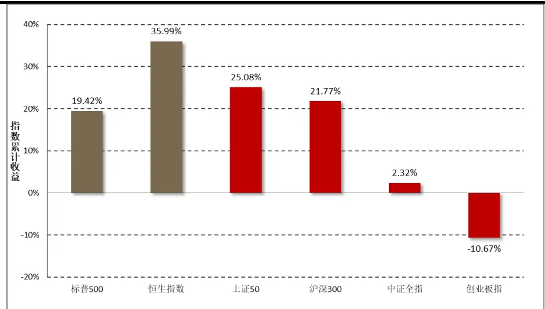
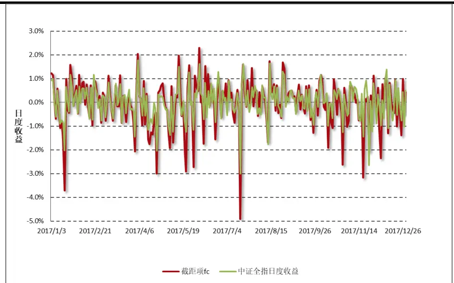
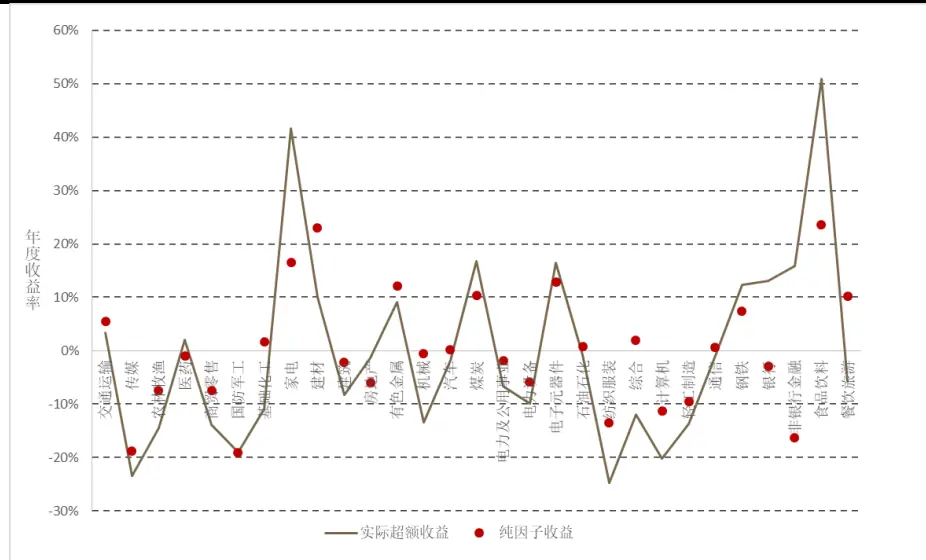
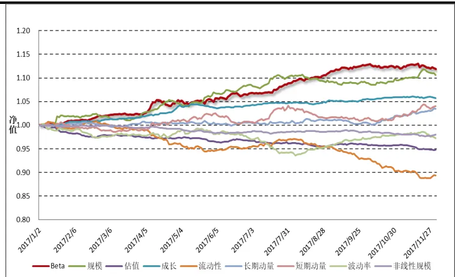
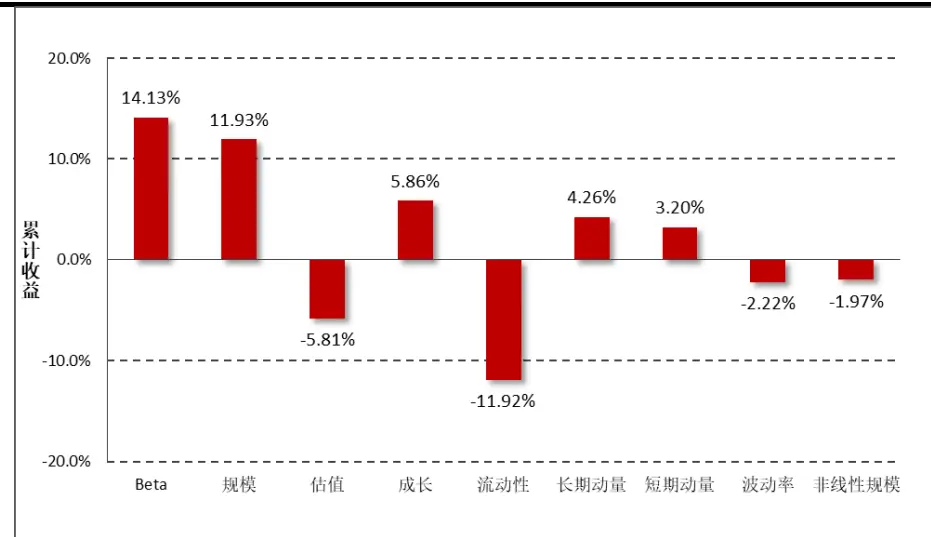
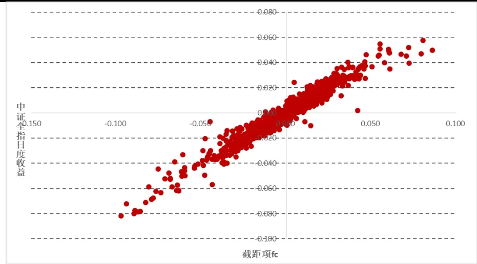
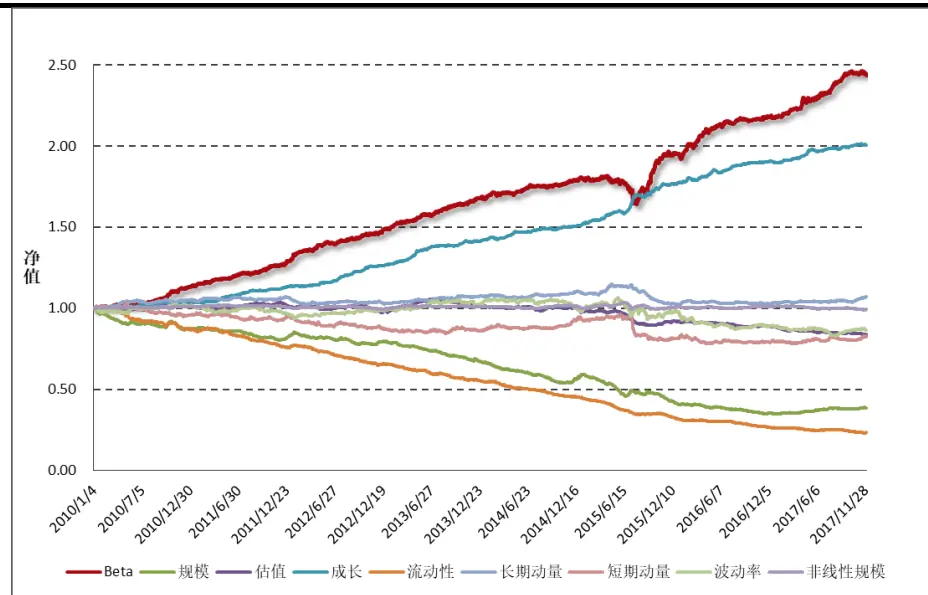
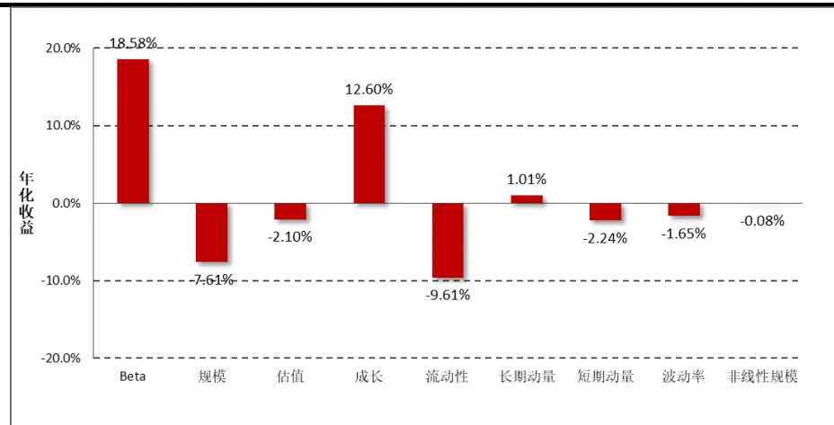
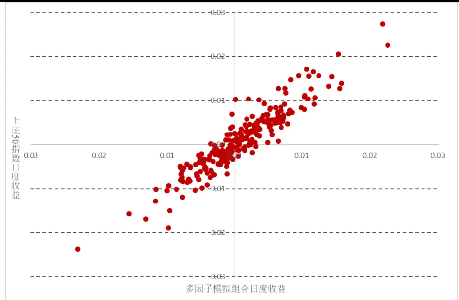
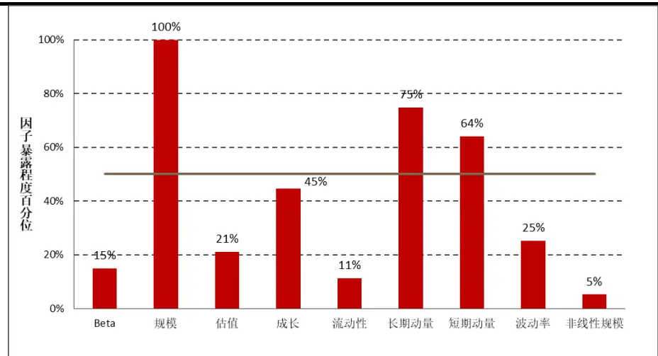

## 方正证券研究所证券研究报告

“星火”多因子系列（一）

金融工程研究

2018.1.6

[分析师： TABLE_ANALYSI韩振国

执业证书编号：S1220515040002

[Table_Author] 联系人： 张宇

TEL: 021-61375691

E-mail： zhangyu0@foundersc.com

联系人： 朱定豪

E-mail： zhudinghao@foundersc.com

## 相关研究

## 请务必阅读最后特别声明与免责条款

## 投资要点

## 市场风格急剧转变，大盘蓝筹异军突起

2017 年 A 股市场风格急剧转变，大盘股异军突起，小盘股风光不再。一半是海水，一半是火焰，市场的结构性牛市让投资者几家欢喜几家愁。

方正金工通过构建自己的多因子风险-收益归因模型，全面窥探市场风格，及时捕捉市场风格变化，力争成为投资者风险管理的一大利器。

## Barra风险-收益归因模型

多因子模型可以将对N只股票的收益-风险分析转换为对K 个因子的收益-风险分析，简化分析工作量的同时提高了预测准确度。

在模型构建中，需对模型的多重共线性、系数显著性、因子标准化方法及残差的异方差性进行考虑。

## 方正金工多因子收益归因模型

方正金工对市场主流风格因子进行梳理，选取 Beta因子、规模因子、估值因子、成长因子、流动性因子、长短期动量因子、波动率因子和非线性规模因子构建收益归因模型。

2010-2016 年期间，Beta、成长、流动性和规模因子表现较为突出，高Beta、高成长、低换手、小市值的股票获得持续的超额收益。2017 年市场风格发生了明显的变化，规模因子方向反转，大市值股票全年占优。成长因子收益下滑，估值因子收益上升，低估值的股票备受青睐，短期动量的收益方向也发生了变化。

采用方正金工多因子模型，可以对任意给定的投资组合的收益进行分解，并观察投资组合在各大风格因子上的暴露程度，成为投资者风险控制的一大利器。

## 风险提示

本报告统计结果基于历史数据，未来市场可能发生重大变化。

## 1 引言

不知不觉间时光的脚步由 2017 迈入 2018，岁月年轮稳步增长的同时，也给资本市场带来了许多令人回味的故事。回顾今年全球主要市场，美股市场一路向好，标普 500指数屡创新高，全年涨幅逾20%。与此同时，港股市场也跟上了全球经济复苏的脚步，恒生指数时隔十年之后再破 3万点，全年涨幅更是超过35%，成为全球表现最好的主要指数。

对于国内市场而言，2017 年 A 股市场风格急剧转变，“漂亮 50”当仁不让成为市场热词，大盘股异军突起，小盘股风光不再。在整个2017 年度，中证全指小幅上涨 2.3%，而以大盘蓝筹股为标的的上证50指数和沪深 300指数的涨幅高达 25.1%和 21.7%，一时之间，大盘蓝筹股成为投资者们竞相追逐的对象，“业绩为王”的投资理念备受追捧。另一方面，创业板指遭遇重创，全年下跌 10.7%。“一半是海水，一半是火焰”， 2017年 A股市场的结构性牛市让几家欢喜几家愁。

图表 1：2017 年度主要指数收益

资料来源：Wind资讯，方正证券研究所整理

所谓“横看成岭侧成峰，远近高低各不同”，市场的神秘在于它的多元。如果只从一个维度去剖析市场走势，那么投资者很可能只能讲述一个“盲人摸象”的故事。然而正如故事中所讲，将所有人的讲述拼凑起来其实不难发现市场真正的全貌。正是基于这样的考虑，方正金工借鉴 Barra模型，构建自己的多因子风险-收益归因模型，全面窥探市场风格，及时捕捉市场风格变化，力争成为投资者风险管理的一大利器。

本篇报告是方正金工“星火”多因子系列报告的第一篇，主要对Barra模型的基本原理进行介绍，对模型的细节部分进行说明，并在最后提出方正金工多因子收益归因模型，探讨 Barra模型在 A股市场上的用武之地。

## 2 BARRA风险-收益归因模型

1974 年，美国学者 BarrRosenberg 第一次提出采用多因子风险模型来对投资组合的风险和收益进行分析。多因子模型的基础理论认为：股票的收益是由一些共同的因子来驱动的，不能被这些因子解释的部分被称为股票的“特质收益率”，而每支股票的特质收益率之间是互不相关的。

Rosenberg 之后成立了 Barra，并于 1975 年提出 Barra USE1 模型。随后在 1985 年、1997 年和 2011 年相继发布 USE2、USE3、USE4 等版本的 Barra模型，对市场收益及风险的归因模型进行不断优化。

## 2.1 BARRA 模型概述

前面提到，多因子模型的基础理论认为股票的收益是由一些共同的因子来驱动的。假设市场上有 K个驱动股票收益的共同因子，那么Barra模型的主要形式可以表示为：

$$
r_{i}=\sum_{k=1}^{K}X_{ik}f_{k}+u_{i},
$$

其中， $r_{i}$ 为股票的收益率， $f_{k}$ 为因子的收益率， $X_{ik}$ 表示股票i在因子k上的暴露程度，一般取前一期的因子暴露度， $u_{i}$ 表示股票的特质收益率。

假设有一个由N只股票组成的资 $产$ 组合，股票i在该组合中的权重为 $w_{i}$ ，那么该投资组合的收益率 $R_{p}$ 可表示为：

$$
R_{p}=\sum_{i=1}^{N}w_{i}r_{i}
$$

同样，整个投资组合在风险因子k上的暴露程度可以表示为：

$$
X_{k}^{P}=\sum_{i=1}^{N}w_{i}X_{ik}
$$

因此，投资组合的收益可以进一步表示为单个因子收益的加权形式，权重即为 $X_{k}^{P}$ 。

$$
R_{p}=\sum_{k=1}^{K}X_{k}^{P}f_{k}+\sum_{i=1}^{N}w_{i}u_{i},
$$

由上式可以看到，利用多因子模型可以将对N只股票的收益-风险分析转换为对 K个因子的收益-风险分析。在实际运用过程中，股票数量N要远远大于共同因子数量 $K,$ ，因此借助多因子模型进行分析可以起到降维的效果，在降低分析工作量的同时提高了预测准确度。

由于单个因子的收益与特质收益率互不相关，且不同股票的特质收益率之间也互不相关，因此投资组合的风险可以表示为：

$$
var\big(R_{p}\big)=\sum_{k,l}X_{k}^{P}F_{kl}X_{k}^{P}+\sum_{i=1}^{N}w_{i}^{2}var(u_{i}),
$$

其中， $F_{kl}$ 为因子k与因子l之间的协方差矩阵。

## 2.2 模型细节说明

## 3.2.1 多重共线性

在构建多因子模型时，因子的选择往往是模型成功与否的关键。在考虑是否将特定因子纳入模型时，首先需要观察该因子与现有因子之间是否存在多重共线性（Multicollinearity）。具有多重共线性的因子之间往往存在高度相关关系，这将导致参数的估计结果不具稳健性，数据很小的变化将会导致参数估计很大的变化。此外，尽管系数的联合显著性很强、模型的 $R^{2}$ 很高，但它们可能有较高的标准差和较低的显著性水平。

一种衡量单个因子与其他因子的共线性程度的指标是方差膨胀系数 VIF（Variance Inflation Factor），它可以通过将该因子对其他因子进行回归，并根据回归模型的 $R^{2}$ 计算得到。

$$
\begin{aligned}X_{ik}&=\sum_{k'\neq k}X_{ik'}b_{k'}+\varepsilon_{ik}\\&VIF_k=\frac{1}{1-R_k^2}\end{aligned}
$$

越大的VIF值意味着该因子与其他因子之间的共线性程度越严重，这是因为假设新加入的因子与现有因子之间存在多重共线性，即能够被现有因子很好地解释，那么由以上回归得到的 $R^{2}$ 将会是一个较大的值，从而导致该因子的 VIF 值变大。

存在多重共线性的因子在纳入模型时需要对其对已有因子进行正交化，以剥离得到纯净的因子。如非线性规模因子，在将规模因子的三次方对规模因子进行正交化之后，得到的新因子实际上反映了中市值股票的收益与全市场收益之间的差额，因此非线性规模因子也被称为中市值因子。

## 3.2.2 系数显著性

由于市场上因子众多，且各类风格因子对不同样本、不同时间段的市场影响各不相同，因此需要对因子收益的显著性进行假设检验，从而观察因子是否与股票收益率显著相关。首先建立原假设和备择假设：

$$
\begin{aligned}&1原假设H_{0}:f_{i}=0\\&2备择假设H_{1}:f_{i}\neq0\end{aligned}
$$

在线性回归分析中，因子收益的 t检验统计量可以表示为：

$$
|t|=\bigg|\frac{f_{i}-0}{se(f_{i})}\bigg|\sim t_{N-K-1}.
$$

其中 $N$ 为股票的个数，K 为因子的个数（不含截距项），一般来讲 N 远远大于 $K,$ ，因此在 5%的显著性水平下，若 t 检验统计量绝对值大于 2，则说明拒绝原假设，接收备择假设，也就是认为该因子在当期的收益显著地不为 0。

需要说明的是，存在一些因子并非对所有考察期都有效，因此若某因子在单期回归中不显著并不意味着该因子在所有的考察期都是无效的。为检验因子有效性的持续能力，一般可以计算历史上发生|t|大于 2的次数占比。

## 3.2.3 因子标准化

由于不同因子在数量级上存在差别，例如规模因子在取对数之后仍然是 BP 因子的数十倍甚至百倍，因此在实际回归中需要对单个因子在横截面上进行标准化，从而得到均值为 0、标准差为 1 的标准化因子。为保证全市场基准指数对每个风格因子的暴露程度均为 $0,$ ，我们需要对每个因子减去其市值加权均值，再除以其标准 $差$ ，计算方法如下：

$$
\begin{aligned}X_{ik}&=\frac{X_{ik}^{Raw}-\mu_{k}}{\sigma_{k}}\\\mu_{k}&=\sum_{i=1}^{N}w_{i}\cdot X_{ik}^{Raw}\end{aligned}
$$

考虑一个由市值加权构成的投资组合，可以通过如下验证看出，该投资组合对于任意因子的暴露度均为 0。

$$
\begin{aligned}X_{k}^{P}=\sum_{i=1}^{N}w_{i}X_{ik}&=\sum_{i=1}^{N}w_{i}\frac{X_{ik}^{Raw}-\mu_{k}}{\sigma_{k}}=\frac{1}{\sigma_{k}}\Biggl(\sum_{i=1}^{N}w_{i}X_{ik}^{Raw}-\mu_{k}\sum_{i=1}^{N}w_{i}\Biggr)\\&=\frac{1}{\sigma_{k}}\Biggl(\sum_{i=1}^{N}w_{i}X_{ik}^{Raw}-\mu_{k}\Biggr)=0\\\end{aligned}
$$

## 3.2.4 加权最小二乘回归

前面提到，在 Barra 模型中我们假设每只股票的特质收益率互不相关，但是每只股票的特质收益率序列的方差并不相同，这就导致了回归模型出现异方差性。为解决这一问题，可以采用加权最小二乘WLS方法进行回归，对不同的股票赋予不同的权重。

$$
\begin{array}{c}{{r=Xf+u}}\\{{f=(X^{T}WX)^{-1}X^{T}Wr}}\end{array}
$$

在计量经济学方法中，WLS 回归模型的权重 W通常选定为特质收益率方差的倒数 $1/var(u)$ ，然而在模型解出之前股票的特质收益率是未知的，无法直接使用。观察到股票特质收益率方差通常与股票的市值规模成反比，即大市值股票的特质收益率方差通常较小，因此在实际回归中我们将以市值的平方根占比作为每只股票的回归权重。

## 2.3 市场主流因子介绍

因子的选取是构建多因子分析框架的基石，目前市场上对于风格因子的分类主要有：价值因子、成长因子、盈利因子、规模因子、动量因子、反转因子、波动率因子、流动性因子、Beta因子、杠杆因子、一致预测因子、技术分子因子及其他因子。方正金工对目前市场主流风格因子的分类进行了梳理，并在图表 2中对其常用小类因子及其在Wind量化接口中的指标进行了说明。

图表 2：市场主流风格因子分类及定义

| 大类因子 | 常用指标 | 指标说明 | Wind 相关指标名称 |
| --- | --- | --- | --- |
| 价值因子 | 市盈率PE | PE=市值/归属母公司股东净利润 | pe/ pe_ttm |
|  | 市净率PB | PB=市值/归属母公司股东权益 | pb /pb_lf |
|  | 市销率PS | PS=市值/营业收入 | ps / ps_ttm |
|  | 市现率 PCF | PCF=市值/经营现金流量净额 | pcf/pcf_ttm |
|  | PEG 指标 | 市盈率/eps增长速度 | Peg |
|  | EV2/EBITDA | 企业价值倍数=公司价值/税息折旧及摊销前利润 | ev2_to_ebitda |
|  | 每股派息 DP | DP=分红/总市值 | wgsd_dps |
| 成长因子 | 营业收入增长率 | 营业收入（同比增长率）营业收入（N年，增长率） | wgsd_yoy_or |
|  | 经营性现金流增长率 | 经营活动产生的现金流量净额（同比增长率) | wgsd_yoyocf |
|  | 净利润增长率 | 净利润-扣除非经常损益（近N年增长率）净利润-扣除非经常损益（复合年增长率） | wgsd_yoynetprofit_deducted |
|  | EPS 增长率 | 基本每股收益（同比增长率）基本每股收益（近N年增长率） | wgsd_yoyeps_basic |
|  | 净资产收益率增长率 | 净资产收益率（同比增长率）净资产收益率（近N年增长率） | wgsd_yoyroe |
| 盈利因子 | 销售毛利率 | （营业收入-营业成本）/营业收入*100% | wgsd_grossprofitmargin |
|  | 销售净利率 | (归属母公司股东的净利润+少数股东损益）/营业收入*100% | wgsd_netprofitmargin |
|  | 净资产收益 ROE | 净利润/（期初归属母公司股东损益+期末归属母公司股东权益）/2*100% | wgsd_roe |
|  | 总资产报酬率ROA | （股东应战溢礼+少数股东损益）/（期初总资产+期末总资产）/2 | wgsd_roa |
| 规模因子 | 市值 | 流通市值 =指定证券指定交易日收盘价*截至日该证券的发行上市股数总市值 =个股当日股价*当日总股本 | mkt_cap_asharemkt_cap_ardev |
| 动量反转因子 | 过去n月的收益率 | 过去N月的收益率/过去N月收益率减去最近一月收益率 |  |
|  | 对数收益率加权求和 | 改进的动量因子 |  |
|  | 换手率加权日均收益率 | 改进的动量因子 |  |
| 波动率因子 | 收益率的标准差 | 取最近N日收益率标准差 |  |
|  | 最高价/最低价 | 取最近N日高低价加权 |  |
|  | 股价取对数 |  |  |
| 流动性因子 | 换手率 | 取最近N日换手率平均 | turn |
| 技术因子 | MACD、DIF、DEA | 当MACD从负数转向正数，是买的信号。当MACD从正数转向负数，是卖的信号。当MACD变化，代表了一个市场大趋势的转变 | wind 技术分析-技术指标栏 |

“慧博资讯”是中国领先的研究源于数据6研究创造价值

图表 2（续）：市场主流风格因子分类及定义

| Beta 因子 | Beta 因子 | CAPM 回归 | beta_24m/beta_100w |
| --- | --- | --- | --- |
| 杠杆因子 | 资产负债率 | 资产负债率 = 负债总额 /资产总额长期资产负债率 = 非流动负债合计/(非流动负债合计+归属母公司股东的权益） | debttoassets |
|  | 现金比率 | (货币资金+交易性金融资产+应收票据)/流动负债合计 | cashtocurrentdebt |
|  | 速动比率 | (流动资产一存货净额)/流动负债 | quick |
|  | 流动比率 | 流动资产/流动负债 | current |
| 一致预期 | 预测 eps（均值，最值，中值，标准差） | 截至指定交易日，各机构对该证券未来某年每股收益预测值的算术平均 | est_eps1/est_maxeps1/est_mineps1 |
|  | 预测净利润（均值，最值，中值，标准差) | 预测净利润平均值/最大/最小中值 | est_netprofit |
|  | 评级指标 | wind一致预测栏 | rating_average |
|  | 其他预测财务指标 | 预测净利润增长率预测营业收入平均值 |  |
| 其他因子 | 股东因子 | 户均持股比例户均持股数量股东户数 | holder_avgpctholder_avgnumholder_num |

资料来源：方正证券研究所整理

## 3 方正金工多因子收益归因模型框架

本部分将从模型框架、因子选取、A股实证三个方面对方正金工多因子收益归因模型进行介绍。在此之前，先介绍一下 Barra USE3和 USE4的两个版本之间的区别。

## 3.1 模型构建

$$
USE3\colon r_{n}=\sum_{i=1}X_{ni}f_{i}+\sum_{s=1}X_{ns}f_{S}+u_{n},
$$

$$
USE4\colon r_{n}=f_{c}+\sum_{i=1}X_{ni}f_{i}+\sum_{s=1}X_{ns}f_{S}+u_{n}
$$

在两个版本的 Barra 模型中，从横截面上对股票收益率进行回归时均需包含行业因子 $\cdot f_{i}$ 及风格因子 $f_{S}$ 。其中， $X_{ni}$ 表示股票 n 在行业 i上的暴露度，此处采用二元哑变量表示，股票所属的行业因子暴露度为 1，否则为 0，行业分类采用中信一级行业划分。 $X_{ns}$ 表示股票在风格因子上的暴露度，所有风格因子均经过标准化处理。采用加权最小二乘法 WLS进行回归，权重即为该股票的流通市值平方根权重。

USE4 版本相对于 USE3 版本的最大改进之处在于，前者在回归中显式地加入了截距项因子，这样处理的好处在于可以将市场因子从行业因子中剥离出来，从而观察纯净的行业因子表现情况。

需要说明的是，对于单只股票而言，其在所有行业因子上的暴露度加总恒等于 1。因此，截距项因子的加入将会导致截距项与行业因子之间存在完全共线性，从而无法直接推导出模型的解析解。因此在实际回归中，还需引入一个新的约束条件，使得所有行业因子的加权平均为 0。

$$
\sum_{i}w_{i}f_{i}=0
$$

其中， $w_{i}$ 表示行业 i 中所有股票的流通市值占全市场流通市值的比例。值得注意的是，该约束条件的选择不会影响模型的拟合和解释能力，但却会对因子的直观解释 $产$ 生直接的影响。上述约束条件的选择将会为因子提供直观的解释意义：考虑一个由市值加权构成的全市场投资组合 P，假设其在股票 n上的持仓为 $h_{n}^{E}$ ，那么该投资组合的收益可表示为：

$$
R_{P}=f_{c}+\sum_{i}w_{i}f_{i}+\sum_{s}X_{s}^{P}f_{s}+\sum_{n}h_{n}^{E}u_{n},
$$

由前文可知，通过因子标准化可以使得该投资组合对于任意风格因子的暴露度均为 0，因此上式的第三项为 0。而约束条件的加入，可以上式的第二项为 0。上式的最后一项可当成是一个分散化投资组合的特质收益率，其值可近似地认为等于 0。因此，该市值加权全样本投资组合的收益率可被认为近似得与截距项因子相等，这一部分将在后面的实证部分进行说明。

$$
R_{P}\approx f_{c}
$$

## 3.2 模型求解

由上一部分可知，截距项因子的加入导致自变量因子之间存在多重共线性，因此因子的拟合无法直接通过解析解求得，模型的求解转变成一个带约束条件的加权最小二乘法求解：

$$
min\sum_{n}w_{n}\cdot\left(r_{n}-f_{c}-\sum_{i=1}X_{ni}f_{i}-\sum_{s=1}X_{ns}f_{S}\right)^{2}
$$

$$
s.t\sum_{i}w_{i}f_{i}=0
$$

注意，此处 $w_{n}$ 是指单只股票 n 的市值权重，而 $w_{i}$ 表示的是行业 i内所有股票的市值占全体样本股票市值的比例。

## 3.3 A股市场风格因子收益

基于以上对 Barra 模型框架构建及求解过程的介绍，方正金工构建了自己的多因子风险收益归因系统，并将其运用到 A股市场上，从截距项、行业受益、风格收益三方面验证模型正确性，观察市场风格的变化及投资组合的风险收益来源。方正金工选取的风格因子及定义如图表 3所示，此处我们采用 Beta因子、规模因子、估值因子、成长因子、流动性因子、长短期动量因子、波动率因子和非线性规模因子作为模型的解释变量，为减少单个数据缺失带来的因子质量问题，在某些大类下我们还选取了特定的小类进行等权赋值。

图表 3：方正金工风格因子定义

| 大类因子 | 子类因子 | 权重 |
| --- | --- | --- |
| Beta 因子 | CAPM 模型 Beta 值(21 天，基准为中证全指) | 1 |
| 规模因子 | 流通市值自然对数 | 1 |
| 估值因子 | PB 因子 | 1/3 |
|  | PE因子 | 1/3 |
|  | PS 因子 | 1/3 |
| 成长 | 单季度净利润同比增长率 | 1/2 |
|  | 单季度营业收入同比增长率 | 1/2 |
| 流动性 | 过去一个月换手率均值 | 1/3 |
|  | 过去三个月换手率均值 | 1/3 |
|  | 过去六个月换手率均值 | 1/3 |
| 长期动量 | 过去六个月收益率减去最近一个月收益 | 1 |
| 短期动量 | 过去一个月收益率 | 1 |
| 波动率 | 过去一个月收益率标准差 | 1/3 |
|  | 过去三个月收益率标准差 | 1/3 |
|  | 过去六个月收益率标准差 | 1/3 |
| 非线性规模 | 规模三次方对规模因子正交化 | 1 |

资料来源：方正证券研究所整理

选 定 2017.1.3-2017.12.29 为 样 本 考 察 期 间 ， 以 中 证 全 指（000905.CSI）成分股为考察样本，对 2017年度市场风格因子的表现进行实证研究，在实际计算中还需对数据进行如下处理：

1）剔除当日停牌的股票；

## 2）剔除任意因子为 NaN的股票；

为避免回归模型中自变量之间产生多重共线性，方正金工引入相关强度指标 ${:}RSI_{AB}$ ，对各风格因子之间的相关程度进行检验，该指标的构造方法如下：

$$
RSI_{AB}=\frac{mean(Corr_{t}^{AB})}{std(Corr_{t}^{AB})},t=1,2,\ldots T
$$

其中， $Corr_{t}^{AB}$ 是指在截面 t期，所有股票的 A、B 因子之间的相关系数。类似于绩效评价中的信息比率 IR， $RSI_{AB}$ 指标综合考虑了因子的平均相关系数以及相关系数的稳定性大小。图表 4 展示了2010-2017 年期间各风格因子之间的相关强度，可以看到，波动率因子与估值因子之间、波动率因子与流动性因子之间存在一定的正相关关系，规模因子与流动性因子之间存在一定的负相关关系，而其他大部分的因子之间的相关性较弱。为保证报告严谨性，图表 5 和图表6对相关系数的平均值及标准差进行了说明。

图表 4：各风格因子相关强度

| 相关强度 | Beta | 规模 | 估值 | 成长 | 流动性 | 长期动量 | 短期动量 | 波动率 | 非线性规模 |
| --- | --- | --- | --- | --- | --- | --- | --- | --- | --- |
| Beta |  | -0.765 | 0.215 | 0.021 | 2.662 | 0.197 | -0.682 | 1.272 | 0.401 |
| 规模 | -0.765 |  | -1.816 | 1.075 | -3.008 | 0.301 | 0.248 | -1.665 | -1.252 |
| 估值 | 0.215 | -1.816 |  | 1.138 | 1.751 | 1.092 | 0.734 | 3.508 | 1.579 |
| 成长 | 0.021 | 1.075 | 1.138 |  | 0.163 | 1.484 | 0.775 | 1.600 | 0.072 |
| 流动性 | 2.662 | -3.008 | 1.751 | 0.163 |  | 1.450 | 0.596 | 4.634 | 0.171 |
| 长期动量 | 0.197 | 0.301 | 1.092 | 1.484 | 1.450 |  | -0.194 | 2.202 | -0.294 |
| 短期动量 | -0.682 | 0.248 | 0.734 | 0.775 | 0.596 | -0.194 |  | 1.247 | -0.115 |
| 波动率 | 1.272 | -1.665 | 3.508 | 1.600 | 4.634 | 2.202 | 1.247 |  | 0.352 |
| 非线性规模 | 0.401 | -1.252 | 1.579 | 0.072 | 0.171 | -0.294 | -0.115 | 0.352 |  |

资料来源：Wind资讯，方正证券研究所

图表 5：各风格因子相关系数平均值

| 相关强度 | Beta | 规模 | 估值 | 成长 | 流动性 | 长期动量 | 短期动量 | 波动率 | 非线性规模 |
| --- | --- | --- | --- | --- | --- | --- | --- | --- | --- |
| Beta |  | -0.121 | 0.017 | 0.001 | 0.323 | 0.026 | -0.109 | 0.199 | 0.020 |
| 规模 | -0.121 |  | -0.108 | 0.042 | -0.368 | 0.054 | 0.044 | -0.187 | -0.085 |
| 估值 | 0.017 | -0.108 |  | 0.073 | 0.156 | 0.144 | 0.078 | 0.313 | 0.037 |
| 成长 | 0.001 | 0.042 | 0.073 |  | 0.008 | 0.082 | 0.044 | 0.059 | 0.002 |
| 流动性 | 0.323 | -0.368 | 0.156 | 0.008 |  | 0.194 | 0.092 | 0.648 | 0.009 |
| 长期动量 | 0.026 | 0.054 | 0.144 | 0.082 | 0.194 |  | -0.023 | 0.352 | -0.014 |
| 短期动量 | -0.109 | 0.044 | 0.078 | 0.044 | 0.092 | -0.023 |  | 0.225 | -0.006 |
| 波动率 | 0.199 | -0.187 | 0.313 | 0.059 | 0.648 | 0.352 | 0.225 |  | 0.016 |
| 非线性规模 | 0.020 | -0.085 | 0.037 | 0.002 | 0.009 | -0.014 | -0.006 | 0.016 |  |

资料来源：Wind资讯，方正证券研究所

图表 6：各风格因子相关系数标准差

| 相关强度 | Beta | 规模 | 估值 | 成长 | 流动性 | 长期动量 | 短期动量 | 波动率 | 非线性规模 |
| --- | --- | --- | --- | --- | --- | --- | --- | --- | --- |
| Beta |  | 0.158 | 0.079 | 0.044 | 0.121 | 0.133 | 0.159 | 0.157 | 0.049 |
| 规模 | 0.158 |  | 0.059 | 0.039 | 0.123 | 0.178 | 0.177 | 0.112 | 0.068 |
| 估值 | 0.079 | 0.059 |  | 0.064 | 0.089 | 0.132 | 0.106 | 0.089 | 0.023 |
| 成长 | 0.044 | 0.039 | 0.064 |  | 0.048 | 0.055 | 0.057 | 0.037 | 0.023 |
| 流动性 | 0.121 | 0.123 | 0.089 | 0.048 |  | 0.134 | 0.155 | 0.140 | 0.050 |
| 长期动量 | 0.133 | 0.178 | 0.132 | 0.055 | 0.134 |  | 0.119 | 0.160 | 0.048 |
| 短期动量 | 0.159 | 0.177 | 0.106 | 0.057 | 0.155 | 0.119 |  | 0.181 | 0.052 |
| 波动率 | 0.157 | 0.112 | 0.089 | 0.037 | 0.140 | 0.160 | 0.181 |  | 0.044 |
| 非线性规模 | 0.049 | 0.068 | 0.023 | 0.023 | 0.050 | 0.048 | 0.052 | 0.044 |  |

资料来源：Wind资讯，方正证券研究所

方正金工参考 Barra USE4 模型对 A 股市场进行实证分析，图表7绘制了截距项因子 fc与中证全指日度收益之间的关系。由前述分析可知，理论上截距项因子即为市值加权的全样本投资组合收益。事实上，由图表 7可以看到二者走势高度相关，相关系数高达 92%。之所会不会完全相等，方正金工认为原因有二，其一， 中证全指成分股权重计算采用派许加权法，与本报告中的市值加权并不完全相同；其二，本报告在数据处理中剔除了当日停牌、任意因子值为 NaN的股票，样本数量与中证全指成分股并不完全相同。

图表 7：截距项 fc与中证全指日度收益（2017 年度）

资料来源：Wind资讯，方正证券研究所

市场投资者对于特定行业前景的一致看好，使得 A股市场展现出较强的行业轮动效应。Barra USE4模型中截距项的引入，可以将市场收益从行业收益中剥离出来，从而得到纯净的行业因子收益。然而在实际情况中，每个行业在不同风险因子上都长期存在特定的暴露，因此我们并不预期纯净的行业因子与该行业指数的走势保持完全一致。图表8展示了29个中信一级行业在2017年度的行业指数超额收益（相对中证全指而言）及对应的纯净行业因子年度收益，可以看到二者之间展现出较强的相关性。由于 2017 年市场整体收益并不明显（中证全指年度收益仅为 2.83%），因此二者之间在数值上也有较好的拟合性。

图表 8：纯净行业因子与相应行业实际累计超额收益（2017年度）

资料来源：Wind资讯，方正证券研究所

在总共 29 个一级行业中，仅有银行业和非银行金融两个行业的收益出现较大背离，方正金工认为是由于其他显性风格因子的作用而造成的。图表 9 给出了各行业内成分股在 2017 年期间在每个风格因子上的暴露程度百分位，可以看到银行和非银行金融两个行业中的成分股在规模因子上的暴露普遍较大，而规模因子在 2017 年的表现十分稳健，行业纯净因子的下跌被规模因子等其他风险因子的收益抵冲，因此表现在行业指数上的正向收益。

图表 9：各行业因子暴露百分位（2017年度）

| 行业因子暴露度 Beta | 规模 | 估值 | 成长 |  | 流动性 | 长期动量 | 短期动量 | 波动率 | 非线性规模 |
| --- | --- | --- | --- | --- | --- | --- | --- | --- | --- |
| 交通运输 | 42.33% | 69.99% | 38.53% | 48.49% | 47.92% | 64.03% | 56.56% | 36.29% | 51.16% |
| 传媒 | 48.25% | 58.55% | 61.54% | 42.44% | 42.73% | 33.81% | 43.53% | 48.28% | 55.98% |
| 农林牧渔 | 46.83% | 39.63% | 49.73% | 44.77% | 54.10% | 47.15% | 48.14% | 48.11% | 69.88% |
| 医药 | 39.68% | 55.28% | 60.01% | 47.26% | 28.08% | 48.04% | 53.20% | 31.30% | 51.82% |
| 商贸零售 | 45.84% | 53.00% | 20.03% | 42.80% | 43.02% | 54.57% | 49.02% | 40.73% | 53.10% |
| 国防军工 | 55.91% | 72.78% | 61.23% | 35.09% | 50.68% | 41.78% | 49.56% | 49.14% | 38.78% |
| 基础化工 | 56.32% | 42.21% | 44.79% | 56.49% | 64.18% | 52.38% | 49.42% | 56.84% | 53.83% |
| 家电 | 48.73% | 48.51% | 31.68% | 53.70% | 46.92% | 53.47% | 57.73% | 48.60% | 55.50% |
| 建材 | 60.83% | 46.60% | 53.12% | 61.91% | 72.23% | 59.20% | 53.02% | 71.30% | 54.00% |
| 建筑 | 55.72% | 52.42% | 27.29% | 48.77% | 65.04% | 58.07% | 52.82% | 60.58% | 44.43% |
| 房地产 | 41.89% | 68.67% | 39.70% | 51.39% | 41.38% | 54.32% | 51.06% | 46.74% | 47.87% |
| 有色金属 | 60.62% | 67.66% | 54.39% | 71.94% | 70.57% | 56.28% | 52.51% | 62.15% | 44.84% |
| 机械 | 59.67% | 27.57% | 66.06% | 53.66% | 63.56% | 45.94% | 47.19% | 60.94% | 58.27% |
| 汽车 | 50.73% | 52.88% | 33.73% | 48.70% | 52.78% | 53.89% | 50.50% | 48.30% | 50.04% |
| 煤炭 | 60.22% | 74.00% | 17.60% | 87.60% | 71.55% | 66.77% | 54.88% | 58.05% | 49.32% |
| 电力及公用事业 | 39.39% | 59.83% | 41.35% | 37.27% | 37.41% | 54.46% | 52.15% | 34.79% | 52.59% |
| 电力设备 | 51.22% | 45.47% | 45.15% | 40.86% | 44.66% | 47.08% | 48.69% | 46.82% | 57.15% |
| 电子元器件 | 65.12% | 50.24% | 55.76% | 59.07% | 61.11% | 47.42% | 54.67% | 61.48% | 55.51% |
| 石油石化 | 48.07% | 57.74% | 34.05% | 57.35% | 56.58% | 61.55% | 52.02% | 53.88% | 56.29% |
| 纺织服装 | 42.11% | 36.19% | 36.84% | 51.89% | 43.90% | 50.69% | 48.81% | 36.08% | 60.51% |
| 综合 | 50.71% | 48.48% | 56.91% | 56.84% | 42.96% | 47.78% | 47.88% | 45.08% | 58.62% |
| 计算机 | 69.85% | 46.37% | 73.38% | 49.11% | 61.83% | 31.96% | 44.63% | 61.91% | 52.26% |
| 轻工制造 | 51.40% | 40.97% | 50.98% | 52.68% | 51.56% | 47.75% | 49.60% | 49.27% | 54.13% |
| 通信 | 65.10% | 48.78% | 61.57% | 43.98% | 60.72% | 40.21% | 50.12% | 64.48% | 52.51% |
| 钢铁 | 61.04% | 66.30% | 15.82% | 73.90% | 71.71% | 70.99% | 55.58% | 61.79% | 59.53% |
| 银行 | 12.72% | 100.00% | 18.61% | 35.78% | 9.11% | 70.89% | 58.74% | 16.11% | 4.52% |
| 非银行金融 | 35.26% | 98.70% | 61.41% | 29.85% | 23.30% | 57.78% | 53.29% | 22.01% | 30.78% |
| 食品饮料 | 41.89% | 57.89% | 52.67% | 47.70% | 47.31% | 57.38% | 57.94% | 45.33% | 49.77% |
| 餐饮旅游 | 37.24% | 41.69% | 60.69% | 42.77% | 37.00% | 48.97% | 50.03% | 31.99% | 64.78% |

资料来源：方正证券研究所

图表 10：各纯净因子净值走势（2017年度）

资料来源：Wind资讯，方正证券研究所

接下来观察各类风格因子在 2017年度的表现情况，图表 10和图表 11 展示了各类纯净风格因子的净值走势和累计收益。尽管各类风格因子对于收益的影响有正向和反向之分，但投资者总可以选择性地在某些风格因子上进行或多或少的暴露，因此我们将累计收益绝对值异于 0的因子（无论是正向收益还是反向收益）认为是有效因子。可以看到，在整个 2017 年，影响方向为正的因子如 Beta 因子和规模因子表现最优，累计收益高达 14.13%和 11.93%；影响方向为负的因子如流动性因子和估值因子，分别收获得-11.92%和-5.81%的收益。这一结论与市场直观事实相符，2017 年市场风格轮动，白马股一骑绝尘，小盘股风光不再。在 2017.1.3-2017.12.29 期间，上证 50 指数和沪深300 指数相继上涨 25.08%和 21.77%，远高于同期中证全指 2.32%的涨幅。

图表 11：各纯净因子累计收益（2017年度）

资料来源：Wind资讯，方正证券研究所

下面将样本时间拉长，观察 2010.1.4-2017.12.29 期间，中证全指成分股中各纯净因子的净值走势及年化收益情况。图表 12 展示了截距项 fc与中证全指日度收益散点图，二者相关系数高达 97%，这种高度相关关系恰好反映了模型估计的正确性。

图表 12：截距项 fc与中证全指日度收益散点图（2010-2017）

资料来源：Wind资讯，方正证券研究所

图表13和图表14列出了各纯净因子的净值走势及年化收益情况。可以看到，在全样本期间段内，Beta因子和成长因子仍然是表现较好的纯净因子，流动性和规模因子效果同样显著。小盘股在 2017 年度的迷失、大盘股在 2017 年度的回归，完完全全地反映在了规模因子的收益表现上。

研究源于数据12研究创造价值

图表 13：各纯净因子净值走势（2010-2017）

资料来源：Wind资讯，方正证券研究所

图表 14：各纯净因子年化收益（2010-2017）

资料来源：Wind资讯，方正证券研究所

图表 15 通过展示 2010 年-2017 年期间，各纯净因子在每年度的收益大小，以观察各类风格因子对收益的影响情况。可以看到，对收益影响方向为正的因子如 Beta 因子和成长因子在全样本期间保持着较好的稳定性，流动性因子在全样本时间段内对于收益有着显著的负向影响。规模因子在2010-2016年期间获得稳定的负向收益，而在2017年由于市场风格的变化获得正向收益，这一现象与今年 A股市场价值投资的回归、投资者对于大盘股的青睐相契合。

图表 15：各纯净因子每年收益（2010-2017）

| 年份 | Beta | 规模 | 估值 | 成长 | 流动性 | 长期动量 | 短期动量 | 波动率 | 非线性规模 |
| --- | --- | --- | --- | --- | --- | --- | --- | --- | --- |
| 2010 | 13.45% | -12.54% | 1.98% | 3.72% | -13.19% | 5.35% | -3.97% | 1.97% | 1.19% |
| 2011 | 13.92% | -5.31% | -0.68% | 9.47% | -12.58% | 1.16% | -1.51% | -5.46% | -0.66% |
| 2012 | 15.36% | -3.74% | -2.89% | 11.62% | 13.75 | -3.16% | -7.74% | 2.50% | -0.74% |
| 2013 | 13.09% | 15.84% | 2.76% | 12.00% | 15.85 | 4.37% | -1.39% | 4.21% | 1.16E-02 |
| 2014 | 7.10% | -13.00% | -3.03% | 6.51% | -18.28% | 2.07% | 9.53% | -4.29% | -0.59% |
| 2015 | 7.98% | -30.22% | -6.10% | 17.35% | -29.60% | -7.11% | -13.35% | -1.11% | 0.94% |
| 2016 | 11.71% | 14.20% | -4.02% | 6.89% | 173 % | 1.52% | -2.64% | -8.88% | 0.10% |
| 2017 | 14.13% | 11.93% | -5.81% | 5.86% | -112 | 4.26% | 3.20% | -2.22% | -1.97% |

资料来源：方正证券研究所

## 3.4 应用：任意资产组合收益分解

市场风格瞬息万变，推动股票上涨或下跌的因素众多，了解收益从何而来能够帮助投资者更好地对所持标的风险暴露有更直观的理解，方正金工多因子收益归因模型是帮助投资者了解其投资组合对于各项风格因子暴露情况的一大利器。

由前述分析可知，在回归得到各纯净因子的日度收益之后，根据股票在因子上的暴露即可求得该股票的日度收益。同样，根据股票在投资组合中的市值占比，即可求得该投资组合收益。也就是说，给定任意的投资组合，通过方正金工多因子收益归因模型，即可求得该投资组合的日度收益，并观察该投资组合在各项因子上的暴露程度。

$$
R_{p}=\sum_{k=1}^{K}X_{k}^{P}f_{k}+\sum_{i=1}^{N}w_{i}u_{i},
$$

为方便进行验证，假设投资者持有一份上证 50 指数成分股，以2017.1.3-2017.12.29 为观察时间段，通过多因子模型计算得到的该投资组合的收益情况如图表 16 所示。二者的相关系数高达 93%，反映在散点图上是一条斜向右上方偏斜的直线，这也进一步验证了方正金工多因子模型的有效性和正确性。

图表 16：多因子模拟组合 VS上证 50日度收益（2017年度）

资料来源：Wind资讯，方正证券研究所

图表17绘制了上证50模拟投资组合在每个因子上的暴露度均值。所谓因子暴露程度百分位，即是指该投资组合中的股票在每个因子上的暴露相对于全市场所有样本股票的百分位数，中性组合为 50%的暴露度。可以看到，上证 50 投资组合的规模因子暴露度极高，这其实很容易理解，因为上证 50 指数是挑选市场规模大、成交量较活跃的最具代表性的 50 只股票构成。同样的，由于非线性规模因子刻画的是中市值股票的收益，因此上证 50 投资组合在该因子上的暴露度极低。在其他因子方面，该投资组合在动量因子上有较高的暴露，而在Beta、估值及流动性等因子上的暴露较小。

图表 17：上证 50投资组合因子暴露度百分位（2017年度）

资料来源：Wind资讯，方正证券研究所

## 3.5 小结

本报告是方正金工“星火”多因子系列报告的第一篇，主要对Barra模型基本框架进行介绍、对模型细节进行探讨，并将其运用到 A股市场上进行收益归因分析，解析市场风格变化。本报告采用带约束条件的加权最小二乘法对 Barra 模型进行求解，截距项的引入能够将市场因子从行业因子中剥离出来，从而得到纯净的风格因子收益，主要有以下几点结论：

1）2010-2016年期间，Beta、成长、流动性和规模因子表现较为突出，高 Beta、高成长、低换手、小市值的股票获得持续的超额收益。2017 年市场风格发生了明显的变化，规模因子方向反转，大市值股票全年占优。成长因子收益下滑，估值因子收益上升，低估值的股票备受青睐。短期动量的收益方向也发生了变化，技术指标大面积失效。

2）通过对纯净行业因子与行业实际超额收益的对比发现，二者之间有较强相关性。通过分析各大一级行业在每个风格因子上的暴露程度，对行业收益的来源提供一定的解释。

了解收益过去从何而来能够帮助投资者了解收益将何处而去，根据本报告提出的收益归因模型，可以对任意给定的投资组合收益进行分解，并观察投资组合在各大风格因子上的暴露程度，成为投资者风险控制的一大利器。后续方正金工还将陆续推出多因子系列的其他专题，探讨 Barra 模型在 A股市场上的后续应用，敬请期待！

## 4 风险提示

本报告统计结果基于历史数据，未来市场可能发生重大变化。

（附注：实习生刘盛尧参与了本项研究，对本课题有重要贡献。）

## 分析师声明

作者具有中国证券业协会授予的证券投资咨询执业资格，保证报告所采用的数据和信息均来自公开合规渠道，分析逻辑基于作者的职业理解，本报告清晰准确地反映了作者的研究观点，力求独立、客观和公正，结论不受任何第三方的授意或影响。研究报告对所涉及的证券或发行人的评价是分析师本人通过财务分析预测、数量化方法、或行业比较分析所得出的结论，但使用以上信息和分析方法存在局限性。特此声明。

## 免责声明

方正证券股份有限公司（以下简称“本公司”）具备证券投资咨询业务资格。本报告仅供本公司客户使用。本报告仅在相关法律许可的情况下发放，并仅为提供信息而发放，概不构成任何广告。

本报告的信息来源于已公开的资料，本公司对该等信息的准确性、完整性或可靠性不作任何保证。本报告所载的资料、意见及推测仅反映本公司于发布本报告当日的判断。在不同时期，本公司可发出与本报告所载资料、意见及推测不一致的报告。本公司不保证本报告所含信息保持在最新状态。同时，本公司对本报告所含信息可在不发出通知的情形下做出修改，投资者应当自行关注相应的更新或修改。

在任何情况下，本报告中的信息或所表述的意见均不构成对任何人的投资建议。在任何情况下，本公司、本公司员工或者关联机构不承诺投资者一定获利，不与投资者分享投资收益，也不对任何人因使用本报告中的任何内容所引致的任何损失负任何责任。投资者务必注意，其据此做出的任何投资决策与本公司、本公司员工或者关联机构无关。

本公司利用信息隔离制度控制内部一个或多个领域、部门或关联机构之间的信息流动。因此，投资者应注意，在法律许可的情况下，本公司及其所属关联机构可能会持有报告中提到的公司所发行的证券或期权并进行证券或期权交易，也可能为这些公司提供或者争取提供投资银行、财务顾问或者金融产品等相关服务。在法律许可的情况下，本公司的董事、高级职员或员工可能担任本报告所提到的公司的董事。

市场有风险，投资需谨慎。投资者不应将本报告为作出投资决策的惟一参考因素，亦不应认为本报告可以取代自己的判断。

本报告版权仅为本公司所有，未经书面许可，任何机构和个人不得以任何形式翻版、复制、发表或引用。如征得本公司同意进行引用、刊发的，需在允许的范围内使用，并注明出处为“方正证券研究所”，且不得对本报告进行任何有悖原意的引用、删节和修改。

## 公司投资评级的说明：

强烈推荐：分析师预测未来半年公司股价有20%以上的涨幅；

推荐：分析师预测未来半年公司股价有10%以上的涨幅；

中性：分析师预测未来半年公司股价在-10%和10%之间波动；

减持：分析师预测未来半年公司股价有10%以上的跌幅。

## 行业投资评级的说明：

推荐：分析师预测未来半年行业表现强于沪深300指数；

中性：分析师预测未来半年行业表现与沪深300指数持平；

减持：分析师预测未来半年行业表现弱于沪深300指数。

|  | 北京 | 上海 | 深圳 | 长沙 |
| --- | --- | --- | --- | --- |
| 地址： | 北京市西城区阜外大街甲34号方正证券大厦8楼(100037)3 | 上海市浦东新区浦东南路60号新上海国际大厦36楼(200120) | 深圳市福田区深南大道4013号兴业银行大厦201(418000)华 | 长沙市芙蓉中路二段200号侨国际大厦24楼(410015) |
| 网址： | http://www.foundersc.com | http://www.foundersc.comh | ttp://www.foundersc.com | http://www.foundersc.com |
| E-mail:yj | zx@foundersc.com | yjzx@foundersc.com | yjzx@foundersc.com | yjzx@foundersc.com |