## 方正证券研究所证券研究报告

“星火”多因子系列（二）

金融工程研究

2018.3.3

[分析师： TABLE_ANALYS韩振国

执业证书编号：S1220515040002

[Table_Author] 联系人： 张宇

E-mail： zhangyu0@foundersc.com

联系人： 朱定豪

E-mail： zhudinghao@foundersc.com

## 相关研究

Wind全 A 指数预测波动率 VS实际波动率
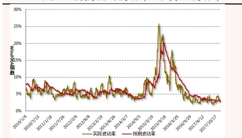
数据来源：Wind，方正证券研究所

上证综指 GMV 对冲组合净值走势
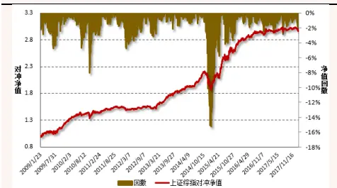
数据来源：Wind，方正证券研究所

请务必阅读最后特别声明与免责条款

## 投资要点

## 多因子模型风险预测：百尺竿头，更进一步

投资是一把双刃剑，投资者既是收益的追逐者，同时也是风险的承担者。一个好的多因子模型框架通常包含收益模型、风险模型、绩效归因三个模块，本报告聚焦多因子模型的第二大功能—风险预测。

## 多因子风险矩阵估计方法

采用多因子结构化风险矩阵估计时，为保证样本内外估计的一致性、增加估计结果的准确性，需要对因子协方差矩阵和特异风险矩阵的估计作如下调整：

- 因子协方差矩阵估计：Newey-West 自相关调整、特征值调整、波动率偏误调整

特异风险矩阵估计：Newey-West 自相关调整、结构化模型调整、贝叶斯收缩调整、波动率偏误调整

## 多因子风险预测模型应用

在实际投资中，风险预测的应用十分广泛。本报告主要介绍如何对任意投资组合的风险进行预测，以及如何构建 Smart Beta 最小期望风险组合。

任意投资组合风险预测：给定投资组合权重向量，即可对其未来 1个月波动进行预测，回测发现预测波动率与实际波动率走势十分相似，对于 Wind 全A 指数，二者相关关系高达74%。

最小期望风险 GMV 组合：在给定投资标的的情况下，每月月底调整权重，使得投资组合的预期风险最小。研究发现，GMV 组合的实际风险明显小于基准组合，夏普比率有明显的提高。

## 风险提示

本报告统计结果基于历史数据，未来市场可能发生重大变化。

## 1 多因子模型进阶：百尺竿头，更进一步

投资是一把双刃剑，投资者既是收益的追逐者，同时也是风险的承担者。与看得见的收益相比，看不见的风险通常更容易被投资者忽视。然而事实上，良好的风险控制能够帮助投资者起到事半功倍的效果。如何对投资组合的未来风险进行估计自然而然地就成为本篇报告关注的重点。

Markowitz于1952年提出采用收益率方差来度量单个资产的风险，开辟了定量度量资产风险的新纪元。然而在实际应用中发现，根据资产收益协方差矩阵得到的最优投资组合在样本外的表现往往不尽如人意。Shepard（2009）指出，在正态性和平稳性的假设下，由于估计误差的存在，采用样本协方差矩阵得到的最优投资组合的风险通常会被低估，其模型估计值与真实风险之间的关系满足：

$$
\sigma_{true}\approx\frac{\sigma_{est}}{1-(N/T)}
$$

其中， $\sigma_{true}$ 表示最优投资组合的真实波动率， $\sigma_{est}$ 为根据风险模型估计的组合风险，N表示资产数量，T为观测样本数量。例如，当采用 100 个交易日数据来估计 50 只股票收益率的协方差矩阵时，最优投资组合的估计风险仅为真实风险的 。此外，由于收益率序列的非平稳性，在估计样本协方差矩阵时不会选择过长的时间区间，然而市场处于交易状态的股票数量众多，当股票数量远远大于样本时间长度时，样本协方差矩阵将不可逆，且会造成较大的估计误差。根据多因子模型估计股票收益协方差，仅需对共同因子之间的协方差矩阵和股票特异风险协方差矩阵进行估计，大大降低了估计量。例如，假设市场上有 只股票，那么直接计算其协方差矩阵需要经过 多万次运算，而采用多因子模型进行估计的次数将会大幅降低，估计准确性也有明显提高。

方正金工继续深入多因子系列研究，事实上，一个好的多因子模型框架通常会包含如下三个模块：

1）收益模型：识别与股票收益密切相关的风格因子，并刻画各个因子对股票收益率的影响方向及影响大小；

2）风险模型：引入股票收益率协方差矩阵的结构化估计方法，在降低估计参数个数的同时提高估计的稳健性和可信性，以便对投资组合未来的风险水平进行预测；

3）绩效归因：结合收益模型和风险模型，可以对投资组合的业绩和风险进行分析，帮助投资者了解收益的来源以及投资组合的风险暴露敞口。

本系列前一篇专题报告《 模型初探： 股市场风格解析》聚焦多因子模型的第一大功能—收益分解，通过对市场主流风格因子进行梳理，选取九大类风格因子对A股市场的风格进行解析，观察各类风格因子在历年的收益情况及方向变化情况，并将该模型应用到对任意给定投资组合的收益分解、风险敞口计算上，效果显著。

“百尺竿头，更进一步”。本篇报告是方正金工“星火”多因子系列报告的第二篇，重点关注多因子模型的第二大功能—风险预测。借助多因子模型对股票收益率协方差矩阵进行结构化估计，并将其运用到对任意给定投资组合的未来风险预测中，可以看到组合预测风险与实际风险之间的相关性较高，结果具有可信性。此外，我们还采用风险预测模型构建 Smart Beta 最小化方差组合，与基准组合相比，该组合的风险显著下降，组合的夏普比率较基准组合显著提升。

## 2 多因子风险矩阵估计方法

本部分将对多因子结构化风险矩阵的估计方法进行介绍，多因子模型认为资产的收益可以由共同因子驱使下的收益和资产的特异收益两部分组成，且单个资产的特异收益是互不相关的，因此在进行风险估计时就需要对风格因子协方差矩阵和特异风险方差矩阵进行分别估计。为保证样本内外估计的一致性、增加估计结果的准确性，我们将先后采用 Newey-West 自相关调整、特征值调整和波动率偏误调整对风格因子矩阵进行估计，采用 Newey-West 自相关调整、结构化模型调整、贝叶斯收缩调整和波动率偏误调整对股票特异风险进行估计，这些调整的方法及效果将在以下部分进行逐一介绍。

## 2.1 多因子模型回顾：

本部分对方正金工多因子模型进行一个简要的回顾：假设市场上有K个驱动股票收益的共同因子，那么多因子模型可以表示为：

$$
r_{n}=\sum_{k=1}^{K}X_{nk}f_{k}+u_{n}\quad\stackrel{*}{\vec{\mathscr{x}}}\quad\quad r_{n}=Xf+u_{n}
$$

其中， $r_{n}$ 为股票n的收益率， $f_{k}$ 为因子k的收益率， $X_{nk}$ 表示股票n在因子k上的暴露程度，一般取前一期的因子暴露度，u 表示股票 $u_{n}$ n的特质收益率。特别地，当将共同因子拆解为市场因子、行业因子和风格因子时，单只股票的收益可以表示为：

$$
r_{n}=f_{c}+\sum_{i=1}X_{ni}f_{i}+\sum_{s=1}X_{ns}f_{S}+u_{n}
$$

在本报告中，我们采用 个中信一级行业作为行业因子虚拟变量，风格因子的定义及计算方法如图表1所示。在采用带约束的加权最小二乘方法（WLS）对因子收益进行拟合后，即可计算得到股票收益率之间的协方差矩阵：

$$
V=XFX^{T}+\Delta
$$

其中，V表示股票收益率之间的协方差矩阵，X表示股票的因子暴露矩阵，F为共同因子协方差矩阵，∆为股票的特异风险矩阵。若已知任意给定投资组合的权重向量W，那么该投资组合的风险为：

$$
Risk(P)=W^{T}VW
$$

由此可见，在对投资组合进行风险估计时就需要先估计出风格因子协方差矩阵F和特异风险方差矩阵∆。

图表 1：方正金工风格因子定义

| 大类因子 | 子类因子 | 权重 |
| --- | --- | --- |
| Beta 因子 | CAPM 模型 Beta 值(21 天，基准为中证全指) | 1 |
| 规模因子 | 流通市值自然对数 | 1 |
| 估值因子 | PB 因子 | 1/3 |
|  | PE因子 | 1/3 |
|  | PS 因子 | 1/3 |
| 成长 | 单季度净利润同比增长率 | 1/2 |
|  | 单季度营业收入同比增长率 | 1/2 |
| 流动性 | 过去一个月换手率均值 | 1/3 |
|  | 过去三个月换手率均值 | 1/3 |
|  | 过去六个月换手率均值 | 1/3 |
| 长期动量 | 过去六个月收益率减去最近一个月收益 | 1 |
| 短期动量 | 过去一个月收益率 | 1 |
| 波动率 | 过去一个月收益率标准差 | 1/3 |
|  | 过去三个月收益率标准差 | 1/3 |
|  | 过去六个月收益率标准差 | 1/3 |
| 非线性规模 | 规模三次方对规模因子正交化 | 1 |

资料来源：方正证券研究所整理

## 2.2 风险测度准确性评价：偏差统计量

在正式介绍如何估计协方差矩阵之前，我们还需了解如何采用偏差检验（Bias Tests）对风险测度的准确性进行度量。首先定义资产组合收益率的样本外标准化收益值：

$$
b_{t,q}=\frac{r_{t+q}}{\sigma_{t}}
$$

其中， $\sigma_{t}$ 表示资产在当前时刻t的预测风险， $r_{t+q}$ 表示从当前时刻t到 $t+q$ 日时间段内资产的收益率， $q$ 为预测时间长度，一般将其取为1 个月 $(21~\bar{\kappa})$ 。在一个检验窗口期内，计算标准化收益的标准差，即为偏差统计量：

$$
B=\sqrt{\frac{1}{T-1}\sum_{t=1}^{T}\bigl(b_{t}-\bar{b_{t}}\bigr)^{2}}
$$

直观地看，偏差统计量衡量的是实际风险与估计风险之间的比率，因此若对风险的估计是完美的，那么偏差统计量的值应该恰好等于 。若偏差统计量大于 1，则说明低估了组合的风险；若偏差统计量小于，则说明高估了组合的风险。然而由于样本区间段是有限的，即便对于完美的预测方法来说，该偏差统计量也会偏离于 。因此在对收益率序列的正态性假定下，我们认为较好的风险预测的偏差统计量将会落在其95%置信区间 $C_{T}$ 内，其中：

$$
C_{T}=[1-\sqrt{2/T},1+\sqrt{2/T}]
$$

需要说明的是，由于实际的金融数据并不服从正态性假定，而是具有“尖峰厚尾”的特性，因此上述置信区间仍然是较为严格的。

## 2.3 风格因子协方差矩阵估计

## 2.3.1 Newey-West 自相关调整

传统方法直接采用股票收益率的协方差矩阵来度量股票之间的相关情况，这种方法将所有数据视为同等重要，然而现实中市场每天都会发生很多的变化，近期数据对当前状态的影响更大，因此我们采用半衰指数加权平均（EWMA）的方法计算日度协方差矩阵 $F^{Raw}$ ，对越靠近当前日期的数据赋予越高的权重：

$$
F_{kl}^{Raw}=cov(f_{k},f_{l})_{t}=\sum_{s=t-h}^{t}\lambda^{t-s}\big(f_{k,s}-\overline{{f_{k}}}\big)\big(f_{l,s}-\overline{{f_{l}}}\big)/\sum_{s=t-h}^{t}\lambda^{t-s}
$$

其中， $f_{k,s}$ 表示因子 k在s期的收益， $\overline{{f_{k}}}$ 表示因子 k的收益在样本期内的指数加权平均，h 表示样本时间长度，半衰期参数τ表示第t−τ天的数据权重为当前日的 1/2， $\lambda=0.5^{1/\tau}$ 。在实际计算中，我们取h=252，τ=90。

由于我们需要对未来 个月的风险进行预测，而因子的相关系数矩阵是根据因子的日度收益数据计算得到的，因此必须考虑因子收益之间的序列相关性影响。我们可以在 $F^{Raw}$ 的基础上进行 Newey-West调整，计算得到调整后的矩阵 $.F^{NW}$ ，具体来讲：

$$
F^{NW}=21\cdot[F^{Raw}+\sum_{\Delta=1}^{D}(1-\frac{\Delta}{D+1})(C_{+\Delta}^{(d)}+C_{-\Delta}^{(d)})]
$$

其中，D 表示滞后时间长度， $C_{+\Delta}^{(d)}$ 和 ${\cdot}C_{-\Delta}^{(d)}$ 的计算方法如下，符号的上角标 $d$ 表示该指标是根据日度数据计算得到的：

$$
C_{kl,+\Delta}^{d}=\mathrm{cov}\big(f_{k,t-\Delta},f_{l,t}\big)=\sum_{s=t-h+\Delta}^{t}\lambda^{t-s}\big(f_{k,s-\Delta}-\overline{{f_{k}}}\big)\big(f_{l,s}-\overline{{f_{l}}}\big)/\sum_{s=t-h+\Delta}^{t}\lambda^{t-s}
$$

$$
C_{kl,-\Delta}^{d}={\mathrm{cov}}{\left(f_{k,t},f_{l,t-\Delta}\right)}=\sum_{s=t-h+\Delta}^{t}\lambda^{t-s}{\left(f_{k,s}-\bar{f}_{k}\right)}{\left(f_{l,s-\Delta}-\bar{f}_{l}\right)}/\sum_{s=t-h+\Delta}^{t}\lambda^{t-s}
$$

可以验证，二者之间满足如下关系：

$$
C_{+\Delta}^{d}=C_{-\Delta}^{d}{}^{T}
$$

在实际计算中，我们对方差和协方差的序列相关滞后时间长度均取为D=2，其他参数设置为 h=252，半衰期为90。

## 2.3.2 特征值调整

如前文所述，直接采用协方差矩阵进行估计的方法将会对最优投资组合的风险产生明显的低估。基于此，Menchero（2011）提出采用特征值调整（Eigenfactor Risk Adjustment）的方法对协方差矩阵进行修正。对最优投资组合的风险低估与协方差矩阵特征值的概念紧密相关：在数学意义上，特征值是由因子协方差矩阵的特征向量计算得到的，从经济意义上讲，它们表示互不相关的投资组合。

将样本协方差矩阵 $.F^{NW}$ 进行特征根分解，即可得到一个对角矩阵$D_{0}$ 和一个正交矩阵 $U_{0}$ ：

$$
D_{0}=U_{0}^{T}F^{NW}U_{0}
$$

其中， $U_{0}$ 为一个 的正交矩阵， $U_{0}$ 的第 列即为 $F^{NW}$ 的第个特征向量，该向量中的N个元素分别表示一个特定投资组合中N个资产的权重，我们将这个特定的投资组合称为 $F^{NW}$ 的第 个特征组合。由于 $U_{0}$ 为正交矩阵，因此各个特征组合之间是互不相关的，并且每个特征组合资产权重的平方和为 1。 $D_{0}$ 是一个对角矩阵，其对角线上的第 个元素表示第 个特征组合的方差，其平方根即为第 个特征组合的风险。

图表 2：特征组合偏差统计量（调整前）
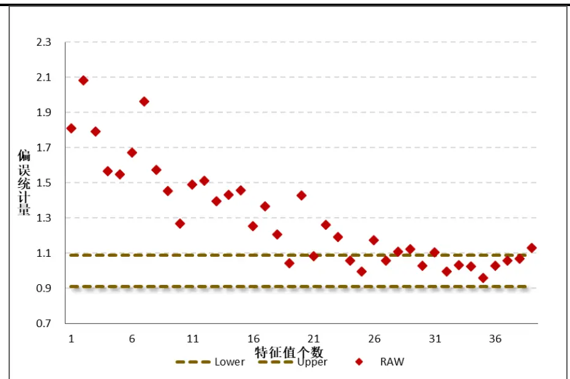
资料来源：Wind资讯，方正证券研究所

本报告选定回测时间段为 ，各因子的收益率估计在本系列报告第一篇专题中有详细介绍。图表 将特征组合按照其风险由小到大排列，绘制出各个特征组合的偏差统计量，可以看到二者之间存在明显的相关关系：低波动特征组合的实际风险要比其预测风险高得多，有的甚至高出 以上；而高波动特征因子的偏差统计量则刚好落在 的置信区间内，因此有必要对该协方差矩阵进行修正。

尽管并不知道真实的因子协方差矩阵，但在进行模拟的时候，可以将 $F^{NW}$ 视为“真实”的协方差矩阵，将 $U_{0}$ 视为“真实”的特征组合权重，将 $D_{0}$ 视为“真实”的特征因子方差矩阵。在第m次模拟过程中，遵循如下几个步骤：

（1） 首先生成一个N×T的模拟特征因子收益矩阵 $b_{m}$ ，其第k行元素为服从均值为0、方差为 $D_{0}$ 第k个对角线元素 $D_{0}(k)$ 的正态分布随机变量，这样第 k 行元素的方差即为第 k个特征因子的“真实”方差。

（2） 根据以下公式计算得到一个N×T的模拟因子收益矩阵：

$$
r_{m}=U_{0}b_{m}
$$

（3） 计算模拟因子的协方差矩阵：

$$
F_{m}^{MC}=cov(r_{m},r_{m})
$$

可以证明，模拟因子协方差矩阵 $F_{m}^{MC}$ 是“真实”协方差矩阵 $.F^{NW}$ 的一个无偏估计， $E[F_{m}^{MC}]=F^{NW}$

（4） 对模拟协方差矩阵进行特征值分解：

$$
D_{m}=U_{m}^{T}F_{m}^{MC}U_{m}
$$

并将计算得到的模拟特征因子与“真实”的协方差矩阵$F^{NW}$ 结合起来，得到模拟的特征因子的真实协方差矩阵：

$$
\widetilde{D}_{\mathrm{m}}=U_{m}^{T}F^{NW}U_{m}
$$

需要注意的是，由于 $U_{m}$ 是模拟的特征因子而 $F^{NW}$ 是“真实”的资产收益协方差矩阵，因此 ${\widetilde{D}}_{\mathrm{m}}$ 并不是对角矩阵、尽管如此，依然可以将${\widetilde{D}}_{\mathrm{m}}$ 的对角元素看作是第 k个模拟的特征因子的真实方差。

在完成以上四步后即完成了一次模拟，我们总共进行 M次模拟，并定义对第k个特征因子的模拟风险偏差为：

$$
\lambda(k)=\sqrt{\frac{1}{M}\sum_{m=1}^{M}\frac{\widetilde{D}_{m}(k)}{D_{m}(k)}}
$$

在模拟过程中，我们假定资产收益服从正态性和平稳性的假设，然而实际的金融数据存在“尖峰厚尾”的特性，因此在进行协方差矩阵修正之前，还需对模拟风险偏差进行适当调整：

$$
\gamma(k)=a[\lambda(k)-1]+1
$$

其中,a是一个调整系数，在实际计算中，通常是一个略大于 1 的值，此处取为1.2。

接下来即可根据经验风险偏差 $\gamma(k)$ 对特征因子方差“去偏”，进$\hslash$ 得到“去偏”的协方差矩阵：

$$
\widetilde{D}_{0}=\gamma^{2}D_{0}
$$

其中， $\gamma^{2}$ 是一个的对角阵，其第 k个对角线元素为 $\gamma^{2}(k)$ 。最后可以通过一个正交旋转得到“去偏”的因子协方差矩阵 $F^{Eigen}$

$$
F^{Eigen}=U_{0}\widetilde{D}_{0}U_{0}^{T}
$$

在实际计算中，我们进行 次蒙特卡洛模拟，对 $F^{NW}$ 矩阵进行修正。首先观察模拟生成的风险偏差是否与实际的风险偏差具有相同的分布规律，图表3绘制出了模拟风险偏差统计量的均值及其1%、分位数，可以看到模拟风险偏差的变化规律在样本期间是非常稳定的，其规律与图表 中展现出的实际风险偏差规律一致。

图表 ：模拟风险偏差统计量均值及分位数（调整前）
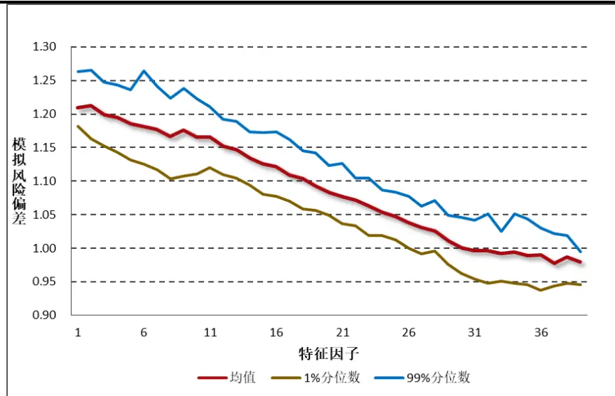
资料来源：Wind资讯，方正证券研究所

图表 展示了经过本部分介绍的特征值调整过后，各个特征组合的偏差统计量，与图表 进行对比可以发现，经过特征值调整过后的特征组合偏差统计量大部分落在95%置信区间内，可以说该调整的效果十分理想。

图表 4：特征组合偏差统计量（调整后）
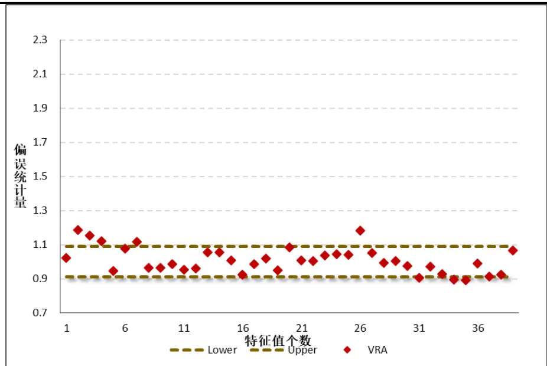
资料来源：Wind资讯，方正证券研究所

前面提到，传统协方差估计方法会对最优投资组合的预期风险存在明显的低估。为验证特征值调整的有效性，图表 展示了经过调整前后，最优投资组合的偏差统计量对比，最优投资组合的构造方法将在2.3.4小节介绍。

通过构造100个最优投资组合并计算其样本期内偏差统计量可以发现，调整前最优投资组合的偏差统计量（Raw）显著地高于95%置信区间的上边界，这说明该风险测度方法对于风险估计存在显著的低估。而在经过特征值修正之后，最优投资组合的偏差统计量（Eigen）大部分落在置信区间内，这说明经过特征值调整过后，风险测度的准确性有较大幅度的提高。

图表5：最优投资组合偏差统计量对比（调整前后）
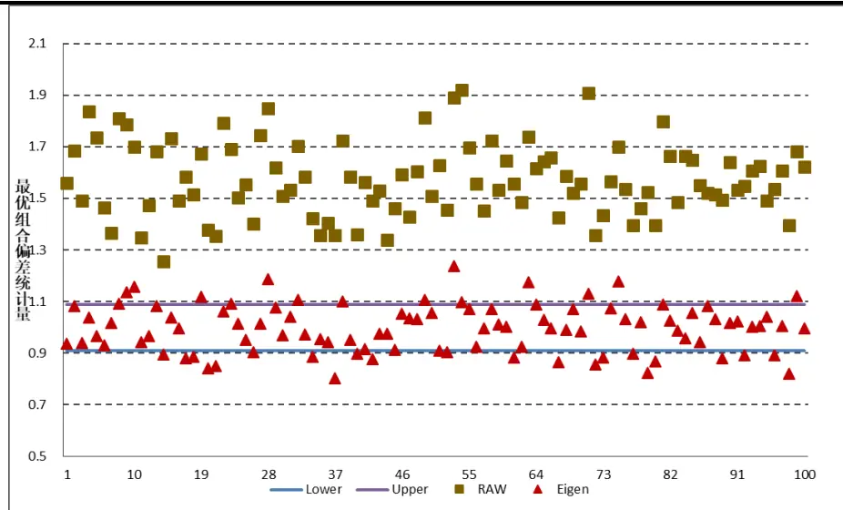
资料来源：Wind资讯，方正证券研究所

## 2.3.3 波动率偏误调整

传统的多因子模型在估计单个因子的风险时，将每个因子视为独立的。也就是说每个因子本身的风险大小是通过该因子自己的时间序列数据计算得到的，与其他因子的表现情况无关。然而在实际应用中发现，这种方法将会导致风险预测存在持续的高估或低估情况，因此本部分还需进行波动率偏误调整（Volatility Regime Adjustment）。

前面介绍到，对于标准化收益 $f_{kt}/\sigma_{kt}$ 而言，若该风险预测是准确的，那么其标准差应该等于 。前述部分提到的偏差统计量均是在时间序列上对某个资产组合的标准化收益进行计算，在进行波动率偏误调整时，我们根据日度数据，计算 个因子在横截面维度上的偏差统计量 $B_{t}^{F}$ ：

$$
B_{t}^{F}=\sqrt{\frac{1}{K}\sum_{k}(\frac{f_{kt}}{\sigma_{kt}})^{2}}
$$

该指标衡量的是每日风险预测的即时偏差（instantaneous bias），若某日所有的因子预测均低于实际风险，那么将会导致 $B_{t}^{F}{>}1$ 。由此可以通过指数移动加权平均的方法，计算出过去一段时间内的平均偏误系数 $\lambda_{F}$ ，称其为因子波动率乘数（factor volatility multiplier）：

$$
\lambda_{F}=\sqrt{\varDelta_{t}(B_{t}^{F})^{2}w_{t}}
$$

此处我们取 $_{\mathrm{h=252}}$ ，半衰期为 $42\textdegree$ 。最后，需要将波动率乘数作用到特征值协方差矩阵 $F^{Eigen}$ 上，即可得到经过波动率调整过后的最终的因子协方差矩阵 $.F^{VRA}$

$$
F^{VRA}={\lambda_{F}}^{2}F^{Eigen}
$$

可以看到，波动率调整是将协方差矩阵的值进行一定程度的缩放，它并不影响因子之间的相关关系。

我们定义在t日因子横截面波动率 $CSV_{t}^{F}$ 为：

$$
CSV_{t}^{F}=\sqrt{\frac{1}{K}{\sum_{k}f_{kt}}^{2}}
$$

图表 展示了因子波动率乘数 与因子横截面波动率之间的关系，可以看到二者之间存在一定的正相关关系。例如在年，当市场波动率增大时，由于多因子风险预测模型未能及时捕捉市场变化，将导致风险预测存在一定的低估，因此波动率乘数会显著地高于1，从而使得协方差矩阵整体上移。

图表 6：因子波动乘数λ VS 横截面波动率CSVF
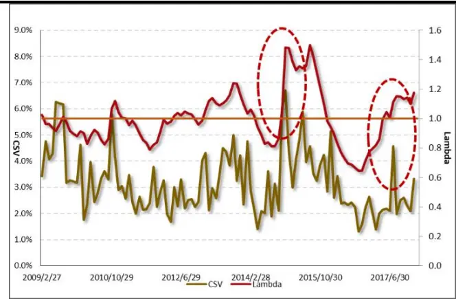
资料来源：Wind资讯，方正证券研究所

图表 ：偏误统计量 个月滚动平均值（调整前后）
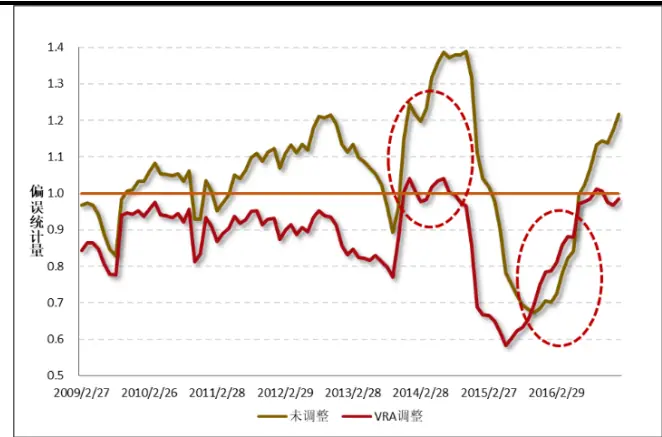
资料来源：Wind资讯，方正证券研究所

图表 7 绘制出了在时间序列上，调整前后偏误统计量的 12 个月滚动平均值，可以看到与调整前相比，经过 调整过后的偏误统计量更接近于 1。当未调整的协方差矩阵显著低估（或高估）实际风险，导致偏误统计量远大于 1（或小于 1）时，VRA 调整的偏误统计量均在 1附近。

## 2.3.4 不同调整下偏误统计量比较

到目前为止，我们已经对因子协方差矩阵的估计进行了完整的介绍，本部分我们构造 4类投资组合，对不同调整下的投资组合偏误统计量进行比较。这四类投资组合分别是：

（1） 单因子投资组合：将单个因子视为一个纯因子投资组合，本报告中共有 39 个因子，其中包括 1个市场因子、29 个行业因子、9个风格因子；

（2） 随机投资组合：模拟生成100组来自标准正态分布的K×1维随机向量W作为随机投资组合的权重，共100个组合；

（3） 特征因子组合：如 2.3.2小节所述，将协方差矩阵F进行特征值分解，将所得到的特征向量 U 作为一个特征因子组合的权重，共 39个组合；

（4） 最优投资组合：假设有N只股票，其收益协方差矩阵为V，每只股票的期望收益为 ${\mathfrak{a}}=(\alpha_{1},\ldots,\alpha_{N})^{T}$ ，那么若要求解具有单位期望收益的最小风险投资组合的持仓权重，即为求解问题：

$$
\operatorname*{min}_{h}{h^{T}Vh}
$$

$$
s.t.h^{T}\alpha=1
$$

根据Grinold和Kahn（2000），持仓权重存在解析解：

$$
h=\frac{V^{-1}\alpha}{\alpha^{T}V^{-1}\alpha}
$$

本报告中我们生成 100组α向量，因此可以构建 100个最优投资组合。

图表 图表 分别展示了单因子组合、随机投资组合、特征因子组合及最优投资组合在非调整（RAW）、Newey-West 调整（NW）、特征值调整（Eigen）和波动率调整（VRA）四种协方差矩阵下的偏差统计量比较，样本时间选择为 2009.1.23-2018.1.31。可以看到，经过调整后协方差矩阵将能够更好地对各类组合的未来风险进行预测。

图表8：单因子组合偏差统计量比较
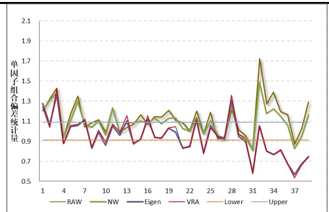
资料来源：Wind资讯，方正证券研究所

图表 9：随机投资组合偏差统计量比较
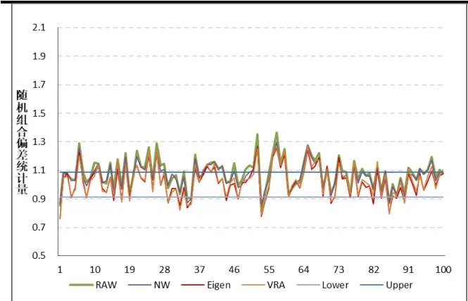
资料来源：Wind资讯，方正证券研究所

图表10：特征因子组合偏差统计量比较
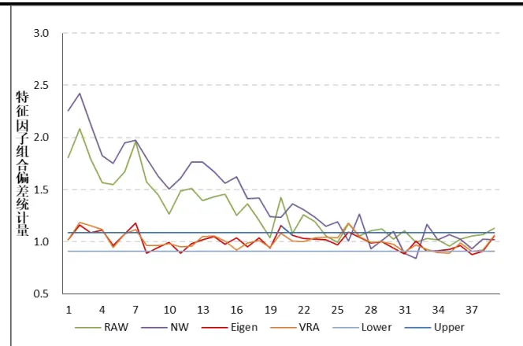
资料来源：Wind资讯，方正证券研究所

图表11：最优投资组合偏差统计量比较
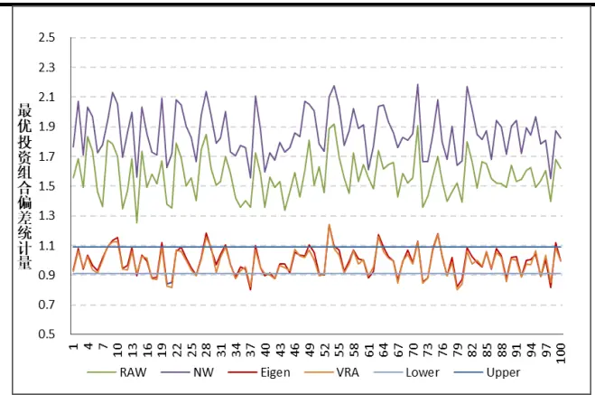
资料来源：Wind资讯，方正证券研究所

## 2.4 特异风险方差矩阵估计

## 2.4.1 Newey-West 自相关调整

准确的特异风险预测是结构化多因子风险模型的另一个重要因素，在模型构建中我们假定单只股票的特异风险与共同因子之间互不相关，且各股票之间的特异风险也是互不相关的，因此股票组合的特异风险∆是一个对角矩阵，其非对角线上元素为 0。

与计算因子协方差矩阵部分类似，对特异风险的方差矩阵估计同样也用到指数移动加权平均和 Newey-West 调整，方法完全一样，此处不加赘述。在实际计算中，我们选取样本长度h=252，半衰期τ=90，Newey-West 调整滞后期 D=5。

## 2.4.2 结构化模型调整

在实际运用中由于新上市股票、长期停牌股票的存在，单只股票的特异风险数据可能存在一定的缺失。此外，若单个公司进行重大事件披露，将可能导致该股票的特异收益出现较大的异常值，结构化模型调整（Structural Model）正是用于解决数据的缺失性和特异收益存在异常值的问题，其基本思想很直观：具有相同特征的股票很可能也会具有相同的特异波动。具体操作如下：

（1） 首先计算每只股票特异收益的稳健标准差 $\tilde{\sigma}_{\mathrm{u}}$ ：

$$
\widetilde{\sigma}_{\mathrm{u}}=(1/1.35)*(Q_{3}-Q_{1})
$$

其中， $Q_{1}\hbar\pm Q_{3}$ 分别表示该股票特异收益的 1/4和 3/4分位数，我们选取样本时间长度 h=252。

（2） 随后可计算特异收益的肥尾程度指标 $Z_{u}$ ：

$$
Z_{u}=\left|\frac{\sigma_{u,eq}-\tilde{\sigma}_{\mathrm{u}}}{\tilde{\sigma}_{\mathrm{u}}}\right|
$$

其中， $\sigma_{u,eq}$ 为特异收益的样本标准差，若 $Z_{u}$ 值过大，则说明该特异收益序列中存在异常值。

（3） 引入协调参数γ，并计算最终的特异风险值 $\hat{\sigma}_{u}$ ：

$$
\gamma=\Big[min\Big(1,max\Big(0,\frac{h-60}{120}\Big)\Big)\Big]\times[min(1,max(0,exp(1-Z_{u})))]
$$

其中 $\sigma_{u}^{NW}$ 为经过 NW 调整过后的特异风险， $\sigma_{u}^{STR}$ 为股票的结构化风险，γ是一个在 0-1 之间的参数。可以看到，当某只股票的特异收益数据质量不佳，如存在过多的缺失值或异常值时，将会导致协调参数γ更接近于 0，因此最终计算的特异风险 $\hat{\sigma}_{u}$ 更偏向于使用结构化风险 $\sigma_{u}^{STR}$ 非根据数据本身计算得到的风险值 $\sigma_{u}^{NW}$ 。

（4） 单只股票的结构化风险 $\cdot\sigma_{u}^{(STR)}$ 是根据回归计算得到的，对于所有 $\scriptstyle\gamma=1$ 的股票，进行如下回归：

$$
\ln(\sigma_{n}^{TS})=\sum_{k}X_{nk}b_{k}+\varepsilon_{n}
$$

其中 $X_{nk}$ 即为股票对应的因 $\Finv$ 暴露矩阵，采用 WLS 回归拟合得到系数 $b_{k}$ 后，即可对所有股票（包括γ<1 的股票）计算其结构化风险值：

$$
\sigma_{n}^{STR}=E_{0}*\exp(\sum_{k}X_{nk}b_{k})
$$

其中 $E_{0}$ 是一个略大于 1 的常数，用于去除残差项的指数次幂带来的偏误，我们取 $E_{0}{=}1.05$ 。

数据质量是多因子模型构建的重中之重，假如全市场存在过多股票的特异收益数据质量不佳的情况，那么通过上述第（4）步进行回归的效果就不会理想，图表 12 绘制了从 2007.6.29-2018.1.31 期间，特异收益数据质量较优（即γ=1）的股票在全市场股票中所占比率的柱状图，可以看到该比例的均值维持在87%，这是一个较为理想的比例。

图表 12：特异收益数据质量较优（γ=1）股票比率
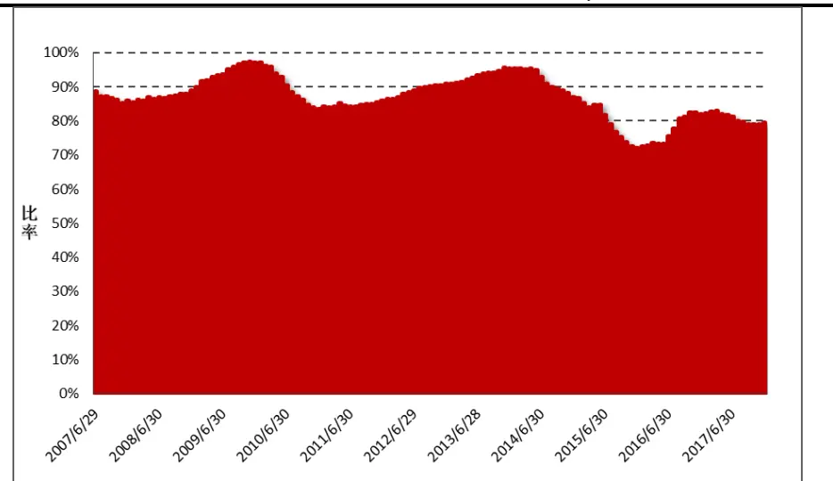
资料来源：Wind资讯，方正证券研究所

## 2.4.3 贝叶斯压缩调整

到目前为止，对于股票特异风险的估计均是通过在时间序列上进行处理得到的，在实际运用中我们发现这将会导致预测风险在样本外的表现并不理想：它会高估高波动率股票的未来风险，同时低估低波动率股票的未来风险。

图表 13：不同波动率分组下的偏误统计量
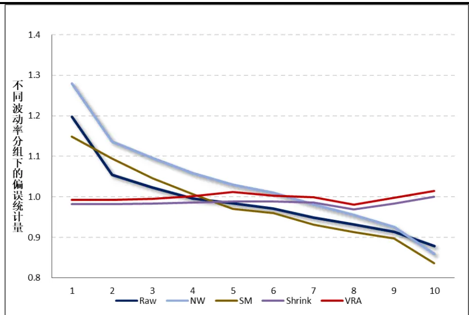
资料来源：Wind资讯，方正证券研究所

将股票按照其预测波动率从小到大分为 组，并计算每组的平均偏误统计量，其结果如图表 13 所示。可以看到对于未调整的特异协方差矩阵（Raw），存在明显的低估低波动、高估高波动的规律，因此需要引入贝叶斯收缩调整（Bayesian Shrinkage）对此进行处理，其主要思想是将单只股票的特异风险向其所在的市值分组的市值加权平均风险压缩，具体来讲，单只股票的特异风险可表示为：

$$
\begin{array}{c}{{\displaystyle\sigma_{n}^{SH}=v_{n}\bar{\sigma}(s_{n})+(1-v_{n})\hat{\sigma}_{n}}}\\{{\displaystyle\bar{\sigma}(s_{n})=\sum_{n\subset S_{n}}w_{n}\hat{\sigma}_{n}}}\end{array}
$$

其中， $\boldsymbol{\bar{\sigma}}(s_{n})$ 被称为贝叶斯先验风险矩阵（Bayesian Prior），也就是压缩目标矩阵（ShrinkageTarget），它表示股票所在的市值分组的市值加权平均风险， $\hat{\sigma}_{n}$ 为经过结构化模型调整后的特异风险值， $v_{n}$ 为压缩密度（Shrinkage Intensity），其计算方式如下：

$$
v_{n}=\frac{q|\hat{\sigma}_{n}-\bar{\sigma}(S_{n})|}{\Delta_{\sigma}(S_{n})+q|\hat{\sigma}_{n}-\bar{\sigma}(S_{n})|}
$$

其中， $q$ 为压缩系数，根据经验我们将其设置为 1， $\Delta_{\sigma}(S_{n})$ 表示该股票所处的市值分组的特异风险标准差：

$$
\Delta_{\sigma}(S_{n})=\sqrt{\frac{1}{N(S_{n})}\sum_{n\subset S_{n}}(\hat{\sigma}_{n}-\bar{\sigma}(S_{n}))^{2}}
$$

可以看到，随着股票的预测风险与其所在市值分组的平均风险的偏离度越大时，其压缩密度 $v_{n}$ 值越大，那么经过压缩后的风险值 $\sigma_{n}^{SH}$ 将对其贝叶斯先验风险 $\textstyle{\overline{{\sigma}}}(s_{n})$ 赋予更高的权重。

由图表 13可以看到，经过压缩过后的协方差矩阵（Shrink）在每个波动率分组中的分布保持一致，均在 附近，由此说明经过贝叶斯压缩调整过后的特异风险预测效果更好。

## 2.4.4 波动率偏误调整

与因子协方差矩阵的估计类似，由于预测风险的持续性高估或低估的现象，我们同样需要进行波动率偏误调整，其方法与 2.3.3 小节完全一致。定义 t时刻特异风险的横截面偏误统计量 $B_{t}^{S}$ ：

$$
B_{t}^{S}=\sqrt{\sum_{n}w_{nt}\left(\frac{u_{nt}}{\sigma_{nt}})\right)^{2}}
$$

其中， $w_{nt}$ 为股票 n 的市值权重，那么特异风险的波动乘数 $\lambda_{s}$ 就可表示为 $B_{t}^{S}$ 的指数加权平均：

$$
\lambda_{s}=\sqrt{\sum_{n}(B_{t}^{S})^{2}w_{t}}
$$

在实际应用中，本报告取h=252，半衰期为 $^{42}$ ，由此即可得到

$$
\sigma_{n}^{VRA}=\lambda_{s}\sigma_{n}^{SH}
$$

同样可以定义特异风险的横截面波动率 $CSV_{t}^{S}$ 为：

$$
CSV_{t}^{S}=\sqrt{\sum_{n}w_{nt}u_{nt}^{2}}
$$

图表 展示出了特异风险波动调整乘数 $\lambda_{s}$ 与横截面波动率 $CSV_{t}^{S}$ 之间的关系，可以看到当横截面波动率增大时， $\lambda_{s}$ 系数也会大于 1，从而使得整体预测风险增大，从而更直观放映市场的实际变化。图表展示出特异风险的偏差统计量在过去 个月内的滚动平均值，可以看到，与经过贝叶斯压缩后的特异风险矩阵相比，经过 VRA 调整的特异风险更接近于 ，说明其预测准确度更高。

图表 14：特异风险波动乘数λ VS 横截面波动CSVs
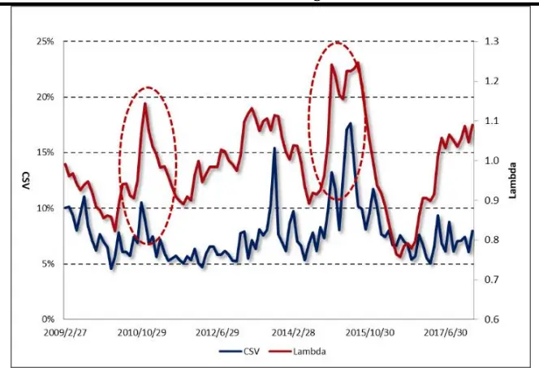
资料来源：Wind资讯，方正证券研究所

图表 15：特异风险偏差统计量 12 个月滚动平均
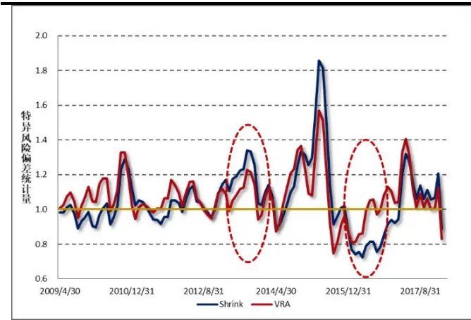
资料来源：Wind资讯，方正证券研究所

## 3 多因子风险预测模型应用

在经过了较为复杂的方法论介绍后，本节将对多因子风险预测模型的应用进行介绍。在实际投资中，风险预测的应用十分广泛，方正金工也将在后续研究中不断深入挖掘。本部分我们先抛砖引玉，介绍如何对任意投资组合的风险进行预测，并构建SmartBeta 最小期望风险组合。

## 3.1 任意投资组合风险预测

如前文所述，采用前文所述方法得到风格因子协方差矩阵 F和特异风险方差矩阵∆后（协方差矩阵的估计参数在附录一中有详细介绍），即可根据股票的因子暴露矩阵计算股票收益率之间的协方差矩阵：

$$
V=XFX^{T}+\Delta
$$

若已知任意给定投资组合的权重向量，那么该投资组合的风险为：

$$
Risk(P)=W^{T}VW
$$

由于市场指数中股票的权重大致与其市值权重相符，因此本部分以市场指数视为一个投资组合进行分析。以创业板指数（399006.SZ）为例，选定样本时间段为 ，其预测波动率与实际波动率如图表 16所示。其中，预测区间选定为21 天，实际波动率即为未来21天的日度收益率标准差，计算方法如下：

$$
\sigma_{true}=std(r_{t}),r_{t}=\frac{P_{t}-P_{t-1}}{P_{t-1}}
$$

图表16：创业板指预测波动率VS实际波动率
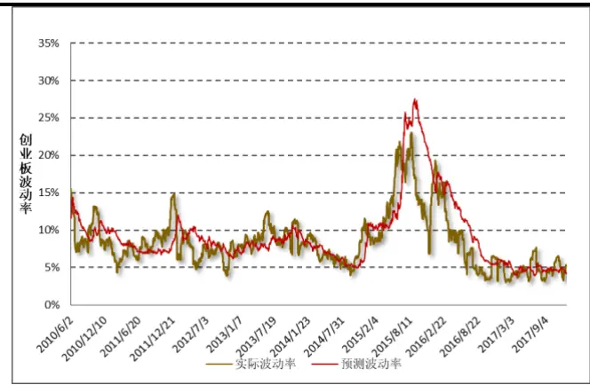
资料来源：Wind资讯，方正证券研究所

图表 17：Wind全A 预测波动率 VS 实际波动率
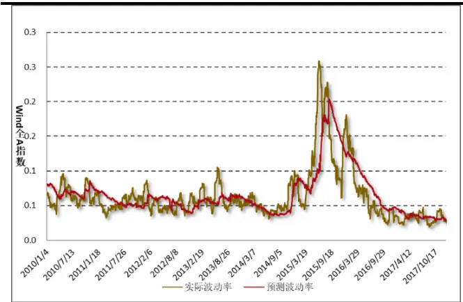
资料来源：Wind资讯，方正证券研究所

由图表 可以看出，创业板指的预测波动率与实际波动率走势十分相似，二者之间的相关系数达到 73.9%。同样的，图表 17展示出对于 Wind 全 A 指数（881001.WI）在 2010.1.4-2018.1.31 期间的风险预测情况，二者相关系数也较高，达到 74.1%。方正金工认为，有如下几个原因可能对预测风险产生偏差：

（1） 在计算组合权重时，我们采用市值权重作为个股在指数中的权重，然而实际上二者并不严格地相等，不过此偏差在投资者对自己的头寸进行分析时并不存在；

（2） 由于在进行风格因子收益拟合时对停牌股票、因子数据存在缺失的股票进行了剔除，当市场上存在大面积停牌或存在较多股票无因子数据时，将会导致很多股票未能纳入样本范围内，从而导致风险预测不准确。

总体来看，采用本文介绍的多因子风险预测模型能够较好地对任意资产的未来风险进行预测，效果较为理想。

## 3.2 Smart Beta 组合构建：最小期望风险组合

最小期望风险 GMV 组合，又称全局最小方差组合（GlobalMinimum Variance）是指在给定投资组合成分股的情况下，对其个股权重进行优化，使得整个投资组合的预期风险最小。由于A 股市场的做空机制尚未完善，因此我们限定个股权重大于 ，且权重之和为 。由此可转化为如下优化问题：

$$
\begin{array}{c}{{\displaystyle\operatorname*{min}_{h}h^{T}Vh,}}\\{{\displaystyle s.t\quad h^{T}e=1,h^{T}>0}}\end{array}
$$

将指数视为投资组合，选定样本时间段为 2009.1.23-2018.1.31，共计108个月。如若选择在每个月月底进行权重调整，构造最小期望风险组合，我们预期该组合的实际风险要小于基准指数的风险。图表18 和图表 19 分别展示了沪深 300 指数和上证综指及其对应的最小期望风险 GMV 组合的净值走势，可以看到由于组合标的相同，基准指数与 组合的净值走势仍然较为一致，但 组合的回撤明显要更小。

图表 18：沪深 300 VS 沪深 300GMV 组合净值
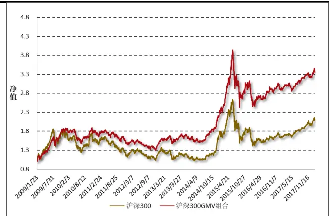
资料来源：Wind资讯，方正证券研究所

图表 19：上证综指 VS 上证综指 GMV 组合净值
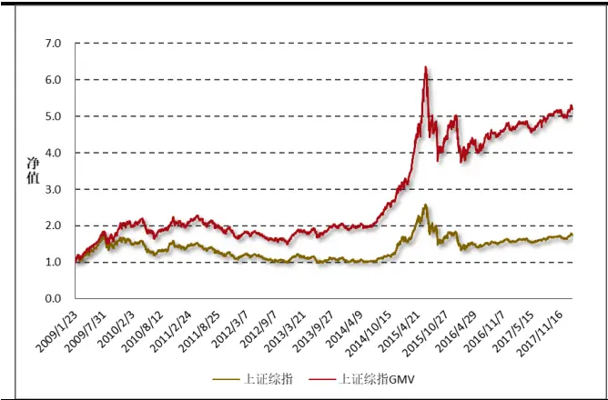
资料来源：Wind资讯，方正证券研究所

图表20列出了各大指数对应的基准组合及其GMV组合净值的绩效评价指标，可以看到 组合的年化预期波动率和年化实际波动率都要小于对应的基准组合，这说明采用多因子框架构建的风险预测模型具有较好的效果。由于 GMV 组合能够显著降低风险，其夏普比率比基准指数有了较为明显的提升。

图表 20：基准组合与对应 GMV 组合策略评价指标（2009.1.23-2018.1.31）

| 指数 | 组合类别 | 年化预期波动率 | 年化收益率 | 年化实际波动率 | 夏普比率 | 最大回撤 |
| --- | --- | --- | --- | --- | --- | --- |
| 上证50 | 基准组合 | 24.3% | 8.4% | 25.2% | 33.5% | 50.4% |
|  | GMV 组合 | 20.6% | 11.0% | 19.7% | 56.2% | 43.0% |
| 沪深300 | 基准组合 | 23.3% | 8.9% | 24.7% | 36.0% | 46.7% |
|  | GMV 组合 | 19.9% | 14.9% | 19.9% | 74.8% | 38.3% |
| 创业板指 | 基准组合 | 31.8% | 9.0% | 32.0% | 28.2% | 58.4% |
|  | GMV 组合 | 25.9% | 14.3% | 27.0% | 53.1% | 50.2% |
| 上证综指 | 基准组合 | 23.1% | 6.6% | 23.0% | 28.8% | 48.6% |
|  | GMV 组合 | 22.1% | 20.8% | 21.8% | 95.4% | 41.2% |
| Wind 全 A | 基准组合 | 23.7% | 12.7% | 26.4% | 48.3% | 52.2% |
|  | GMV 组合 | 22.4% | 16.8% | 20.9% | 80.7% | 38.9% |

资料来源：Wind资讯，方正证券研究所

最后我们通过做多 GMV 组合、做空基准组合，观察策略的净值走势。以上证综指为例，通过做多上证综指 GMV 组合、做空上证综指构建的对冲组合净值如图表 21 所示，该样本回测区间内该对冲组合的年化收益达到13.3%，年化波动为7.1%，夏普比率达到 1.87。

值得注意的是，本报告中仅对预期方差进行了最小化限制，其对冲效果已经有了较为明显的改善，后续研究中还可以加入其它限制条件或者在某些表现较好的因子上适当增加暴露，以期获得更稳健的收益，欢迎持续关注。

图表 21：上证综指GMV对冲组合净值
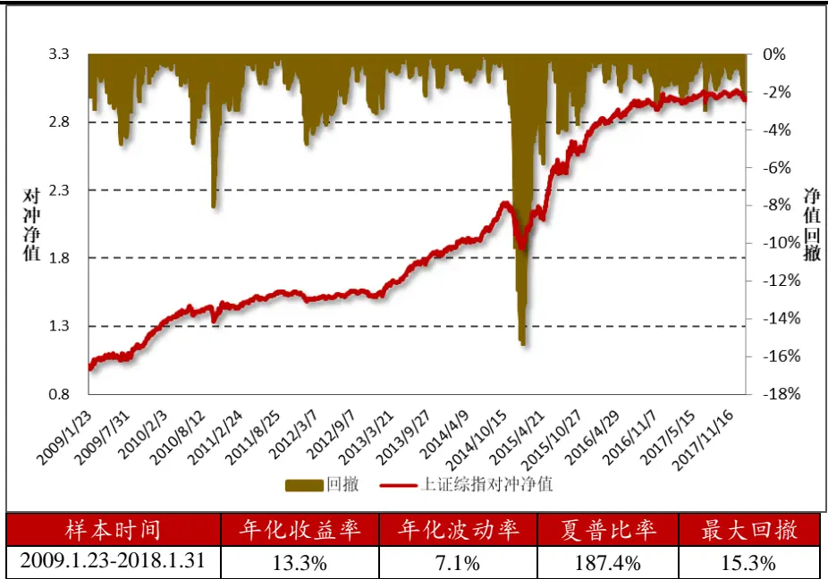

| 样本时间 | 年化收益率 | 年化波动率 | 夏普比率 | 最大回撤 |
| --- | --- | --- | --- | --- |
| 2009.1.23-2018.1.31 | 13.3% | 7.1% | 187.4% | 15.3% |

资料来源：Wind资讯，方正证券研究所

## 4 小结及展望

一个好的多因子模型框架通常包含收益模型、风险模型和绩效归隐三大模块，在方正金工“星火”多因子系列第一篇《Barra 模型初探： 股市场风格解析》中，方正金工聚焦于市场收益分解，选取九大类风格因子对A 股市场风格变化进行分析，并将其运用到对任意给定投资组合的收益分解、风险敞口计算上，效果显著。

本报告是该系列报告的第二篇，主要利用多因子模型对股票收益协方差矩阵进行结构化估计，分别对因子协方差矩阵和特异风险矩阵进行估计。为保证样本内外估计的一致性、增加估计结果的准确性，先后在其估计中进行多处调整。与调整前相比，调整后的协方差矩阵在样本外的表现更加稳健。

方正金工提出了多因子风险预测模型的两处应用：对任意投资组合未来风险进行预测及构建最小预期风险的Smart Beta 组合。从实证结果中发现，本报告中采用的方法对主要指数的风险预测较为准确，相关系数在 以上。此外，根据月末权重调整的最小预期风险组合在预期风险和实际风险均低于相应的基准组合，策略的夏普比率也有较为明显的提升。对投资组合的风险预测还有很多应用，方正金工在后续研究中还会深入挖掘扩展，欢迎投资者持续关注！

## 5 风险提示

多因子模型拟合均基于历史数据，市场风格的变化将可能导致模型失效。

参考文献：

[1]Shepard Peter, 2009. Second Order Risk. Working Paper

[2]Menchero Jose, Jun Wang, D.J.Orr, 2011. Eigen-Adjusted Covariance Matrices. MSCI Research Insight.

[3]Grinold R, R. Kahn, 2000, Active Portfolio Management, New York: McGraw-Hill

[4]Menchero Jose, D.J. Orr, Jun Wang, 2011, The Barra USE Equity Model (USE4)

## 6 附录

附录一：主要参数定义及设置

| 协方差矩阵类别 | 调整类别 | 参数含义 | 参数符号 | 参数值 |
| --- | --- | --- | --- | --- |
| 因子协方差矩阵 | 指数移动加权平均 | 样本长度 | h | 252 |
|  |  | 方差半衰期 | $\boldsymbol{\tau}_{\sigma}^{F}$ | 90 |
|  |  | 协方差半衰期 | $\tau_{\rho}^{F}$ | 90 |
|  | Newey-West 调整 | 样本长度 | h | 252 |
|  |  | 方差滞后期数 | $L_{\sigma}^{F}$ | 2 |
|  |  | 方差半衰期 | $\boldsymbol{\tau}_{\sigma}^{F}$ | 90 |
|  |  | 协方差滞后期数 | $L_{\rho}^{F}$ | 2 |
|  |  | 协方差半衰期 | $\tau_{\rho}^{F}$ | 90 |
|  | 特征值调整 | 蒙特卡洛模拟次数 | $M$ | 10000 |
|  |  | 调整系数 | a | 1.2 |
|  | 波动率偏误调整 | 波动率乘数样本长度 | h | 252 |
|  |  | 波动率乘数半衰期 | $\tau_{VRA}^{F}$ | 42 |
| 特异风险方差矩阵 | 指数移动加权平均 | 样本长度 | $h$ | 252 |
|  |  | 半衰期 | $\boldsymbol{\tau}_{\sigma}^{F}$ | 90 |
|  | Newey-West 调整 | 滞后期数 | $L_{\sigma}^{F}$ | 5 |
|  | 结构化模型调整 | 调整系数 | $E_{0}$ | 1.05 |
|  | 贝叶斯压缩调整 | 压缩系数 | q | 1 |
|  | 波动率调整 | 样本长度 | h | 252 |
|  |  | 半衰期 | $\tau_{VRA}^{F}$ | 42 |

资料来源：Wind资讯，方正证券研究所

## 分析师声明

作者具有中国证券业协会授予的证券投资咨询执业资格，保证报告所采用的数据和信息均来自公开合规渠道，分析逻辑基于作者的职业理解，本报告清晰准确地反映了作者的研究观点，力求独立、客观和公正，结论不受任何第三方的授意或影响。研究报告对所涉及的证券或发行人的评价是分析师本人通过财务分析预测、数量化方法、或行业比较分析所得出的结论，但使用以上信息和分析方法存在局限性。特此声明。

## 免责声明

方正证券股份有限公司（以下简称“本公司”）具备证券投资咨询业务资格。本报告仅供本公司客户使用。本报告仅在相关法律许可的情况下发放，并仅为提供信息而发放，概不构成任何广告。

本报告的信息来源于已公开的资料，本公司对该等信息的准确性、完整性或可靠性不作任何保证。本报告所载的资料、意见及推测仅反映本公司于发布本报告当日的判断。在不同时期，本公司可发出与本报告所载资料、意见及推测不一致的报告。本公司不保证本报告所含信息保持在最新状态。同时，本公司对本报告所含信息可在不发出通知的情形下做出修改，投资者应当自行关注相应的更新或修改。

在任何情况下，本报告中的信息或所表述的意见均不构成对任何人的投资建议。在任何情况下，本公司、本公司员工或者关联机构不承诺投资者一定获利，不与投资者分享投资收益，也不对任何人因使用本报告中的任何内容所引致的任何损失负任何责任。投资者务必注意，其据此做出的任何投资决策与本公司、本公司员工或者关联机构无关。

本公司利用信息隔离制度控制内部一个或多个领域、部门或关联机构之间的信息流动。因此，投资者应注意，在法律许可的情况下，本公司及其所属关联机构可能会持有报告中提到的公司所发行的证券或期权并进行证券或期权交易，也可能为这些公司提供或者争取提供投资银行、财务顾问或者金融产品等相关服务。在法律许可的情况下，本公司的董事、高级职员或员工可能担任本报告所提到的公司的董事。

市场有风险，投资需谨慎。投资者不应将本报告为作出投资决策的惟一参考因素，亦不应认为本报告可以取代自己的判断。

本报告版权仅为本公司所有，未经书面许可，任何机构和个人不得以任何形式翻版、复制、发表或引用。如征得本公司同意进行引用、刊发的，需在允许的范围内使用，并注明出处为“方正证券研究所”，且不得对本报告进行任何有悖原意的引用、删节和修改。

## 公司投资评级的说明：

强烈推荐：分析师预测未来半年公司股价有20%以上的涨幅；

推荐：分析师预测未来半年公司股价有10%以上的涨幅；

中性：分析师预测未来半年公司股价在-10%和10%之间波动；

减持：分析师预测未来半年公司股价有10%以上的跌幅。

## 行业投资评级的说明：

推荐：分析师预测未来半年行业表现强于沪深300指数；

中性：分析师预测未来半年行业表现与沪深300指数持平；

减持：分析师预测未来半年行业表现弱于沪深300指数。

|  | 北京 | 上海 | 深圳 | 长沙 |
| --- | --- | --- | --- | --- |
| 地址： | 北京市西城区阜外大街甲34号方正证券大厦8楼(100037)3 | 上海市浦东新区浦东南路60号新上海国际大厦36楼(200120) | 深圳市福田区深南大道4013号兴业银行大厦201(418000)华 | 长沙市芙蓉中路二段200号侨国际大厦24楼(410015) |
| 网址： | http://www.foundersc.com | http://www.foundersc.comh | ttp://www.foundersc.com | http://www.foundersc.com |
| E-mail:y | jzx@foundersc.com | yjzx@foundersc.com | yjzx@foundersc.com | yjzx@foundersc.com |