2019 年 02 月 14 日

# Barra 模型深化：纯因子组合构建

## “星火”多因子专题报告（三）

## 联系信息

陶勤英分析师

SAC 证书编号：S0160517100002021-68592393

taoqy@ctsec.com

张宇联系人

zhangyu1@ctsec.com 021-68592220 
17621688421

17621688421

## 相关报告

1 《“星火”多因子系列（一）：Barra模型初探：A 股市场风格解析》

2.《“星火”多因子系列（二）：Barra模型进阶：多因子风险预测》

## 调整后最优化纯成长因子净值走势

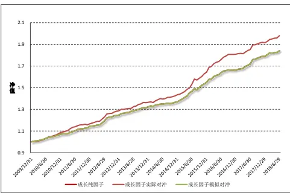
数据来源：财通证券研究所

## 投资要点：

## 纯因子组合构建

- 如同立体世界可以用三维坐标来丈量，纯因子组合的提出有利于将投资者从风格因子的协同变化中解放出来，形成单一的、纯粹的、正交的资产组合工具。

- 传统的 Smart Beta 指数在风格因子上的暴露并不纯粹，其在目标因子上进行主动正向暴露的同时，会给其他因子带来正向或反向暴露，如何构建纯粹的风格因子成为本报告探讨的主要问题。

## 构建方法：完全复制法VS 最优化复制法

- 完全复制法：能够保证组合的收益即为纯因子的收益，但无法约束组合的事前风险

- 最优复制法：根据带约束的均值-方差优化求解，可以控制组合的事前风险，但可能出现一定程度的跟踪误差

- 两种方法均存在做空、换手率较高等问题，可投资性较弱

## 组合优化：构建更具可投资性的纯因子组合

财通金工试图找到一个比较基准，使得构建的投资组合在其他因子上的暴露与基准暴露保持一致，同时最大化投资组合在目标因子上的暴露，有时还可以加入最小化组合风险作为目标函数。

## 再思考：如何解决特质收益的“腐蚀”

本文提出通过减少股票权重的集中度，对每只股票的权重设置一定的上限，增加组合股票数量来解决特质收益为组合回报带来的不确定性，实证结果表明：优化后的纯因子组合与预想的因子走势更加贴合。

- 风险提示：本报告统计数据基于历史数据，过去数据不代表未来，市场风格变化可能导致模型失效。

随着市场有效性的逐步提升，公募量化产品在未来越来越趋向于工具化、指数化发展。特别是在市场普跌的行情下，指数化产品成为公募量化新的增长点和突破口，这其中又以偏好特定风格的 Smart Beta 产品最具吸引力，2018 年国内指数基金和 ETF 基金的逆市扩张即为我们提供了有力的证据。如同立体世界可以用三维坐标来丈量，纯因子组合的提出有利于将投资者从风格因子的协同变化中解放出来，形成一个单一的、纯粹的、正交的资产组合工具。

## 1、 风格因子：竞相追逐还是主动回避？

## 1.1 从 Smart Beta 说起

“Alpha 还是 Beta?这是个问题。” Sharpe 于 1964 年提出的资本资产定价（CAPM）模型奠定了现代金融理论的基石，他将股票收益拆解为与市场紧密相关的系统性收益和与市场风险无关的特质收益两个部分。Sharpe 认为，风险因子（也称为 Beta 因子）能够捕捉市场系统性风险的来源，投资者在任何风险因子上的暴露都需要一定的收益作为补偿。然而，与“一分收益、一分风险”的Beta因子不同，Alpha 因子是指那些能够实现稳定的“高收益、低风险”的因子。由此，市场的投资类型也分为主动投资和被动投资两大类，Melas（2010）认为，被动投资管理的本质是最优化投资组合对不同 Beta 因子的暴露，而主动投资管理的本质则是最优化投资组合对不同 Alpha因子的暴露。研究者们曾花费大量精力寻找稳定的 Alpha 因子，然而近些年来，随着市场有效性的不断提升，寻找纯粹 Alpha 因子的难度越来越大。同时，研究者们发现传统的 Alpha 因子又可以被剥离为 Beta 因子和更为纯粹的 Alpha 因子，Smart Beta 的概念逐渐成为了市场关注的热点。

相较于国外市场的迅猛发展，国内对于 产品的研究仍然有很大的发展空间。表 1 列出了中证指数、上证指数及深证指数在各种不同类别的 SmartBeta 策略上的代表性指数，可以看到目前国内各大指数公司采用的因子主要集中于规模、价值、成长、波动、红利、CAPM Beta、基本面、动量及质量等因子上。

表1：中证/上证/深证系列Smart Beta代表指数

| 因子 | 中证系列指数 | 上证系列指数 | 深证系列指数 |
| --- | --- | --- | --- |
| 规模 | 中证超大等 | 超大盘指数等 |  |
| 价值 | 300价值、300R价值、500价值、500R价值、800价值、800R价值 | 180价值、180R价值、380价值、380R价值、全指价值、全R价值 | 深证价值、中小价值、中创500 价值、700 价值 |
| 成长 | 沪深300成长、沪深300R成长、中证500成长、中证500R成长、中证800 成长、中证 800R成长 | 上证180成长、上证180R成长、上证380成长、上证380R 成长、全指成长、全R成长 | 深证成长、中小成长、中创500成长、700成长、1000成长 |
| 波动率 | 300波动、500波动、稳健低波 | 180 波动、380 波动 | 100低波、深证低波、中小低波、中创低波、创业低波 |
| 红利 | 中证500红利、中证红利、红利潜力、红利价值、红利低波、红利增长等 | 180红利、380红利、上高股息、红利指数、上红潜力、上红回报 | 深红利 50 |
| Beta | 沪深 300 高贝塔、中证500高贝塔、 | 上证180高/低贝塔、上证380高/低贝塔、180SNLV、180ERC | 深证高贝、中小高贝、中创高贝、创业高贝、 |
| 等权 | 等权90、300等权、500等权 | 50等权、180等权、380等权 |  |
| 基本面 | 基本面50、基本200、基本300、基本 400、基本 500、基本 600 | 50基本、180基本、380基本、上证F200、上证 F300、上证 F500 | 深证F60、深证 F120、深证F200 |
| 动量 | 300动量、800动量、香港100动量 | 180动量、380动量 |  |
| 质量 | 质量低波、财务稳健、盈利质量、500质量、CS质量、HK质量、财富大盘 |  |  |
| 公司治理 | 中证环保、ESG40、ESG80、环境质量、内地低碳等 | 180治理、责任指数、上证环保、180碳效、治理指数、持续产业 |  |
| 宏观因子 | 100动态、300动态、500动态等 | 180动态、380 动态 |  |

数据来源：财通证券研究所，中证指数有限公司

然而，通过上述方法构建的 组合是否能够代表纯粹的目标风格因子呢？所谓“纯粹的目标风格因子组合”，即是指该组合目标因子上具有较大的暴露，而在其他因子上的暴露与基准指数保持一致。为了验证这一问题，财通金工以沪深 300 价值指数（000919.SH）为例，观察其与基准指数沪深 300 指数（000300.SH）在各类风格因子暴露上的区别。图 1 展示了在 2019 年2 月1 日的截面日期上，二者的成分股在各大风格因子上的暴露百分位，此处单个因子的暴露百分位是指指数成分股相对于全市场所有股票而言，在某个风格因子上的暴露百分数的市值权重加权。可以看到，二者的风格因子暴露十分相似，在市值、盈利、长期动量因子上都有较大的暴露，而在非线性规模、流动性和波动率因子上的暴露则相对较小，这一结论与直观认识相符。

图1：沪深300及沪深300价值在各风格因子的暴露百分位
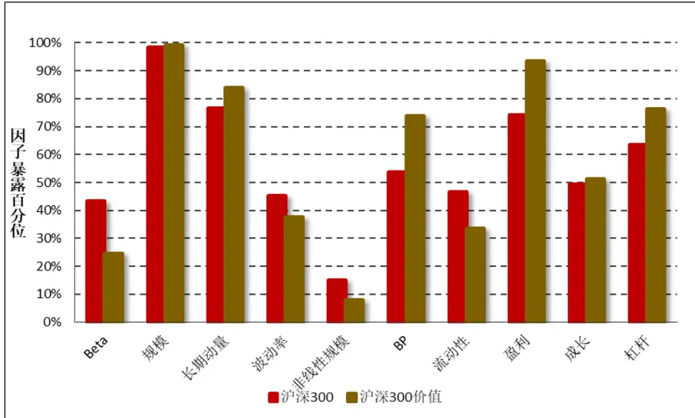
数据来源：财通证券研究所，Wind

图2：沪深300及沪深300价值风格因子暴露百分位比值
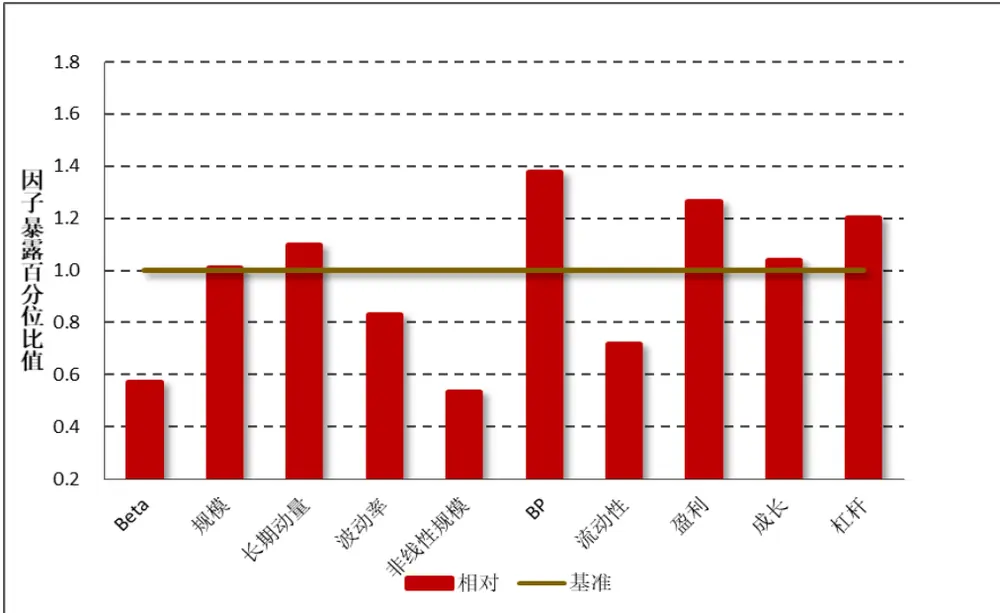
数据来源：财通证券研究所，Wind

图2展示了沪深300价值指数相对于基准沪深300指数的风格因子暴露百分位比值，可以看到，价值指数成分股在价值（BP）因子上的暴露比基准指数高出将近 40%，这一点与其突出“价值指数”的目的显然是合意的。然而，价值指数在盈利和杠杆因子上的暴露也同样显著地更高，而在 Beta、流动性和非线性规模因子上的暴露却显著地更低。也就是说，通过这种方式构建的风格因子组合并不纯粹，其在目标因子上进行主动正向暴露的同时，会带来组合在其他因子上的正向或反向暴露。如何构建纯粹的风格因子组合成为了我们接下来需要探讨的主要问题。

## 1.2 竞相追逐还是主动回避？

通常来讲，由于风格因子自身带有一定的风险敞口，投资者在构建投资组合时就需要根据自己的风险偏好来选择到底是追逐还是回避这样的风险。因此，在介绍如何最大化投资组合在风格因子上的暴露之前，我们先来了解如何避免某些风格因子对资产组合产生影响。事实上，在因子选股的研究中，投资者通常希望做到诸如市值中性或是行业中性的要求，也就是说，需要从目标因子中剔除市值因子或是行业因子的影响。为实现这一目的，通常有如下两种方法：

## 1）回归法

回归法的主要步骤是将目标因子对所需剔除的因子进行回归，将回归得到的残差项作为新因子的代理变量。

$$
X_{New}=\alpha+\beta_{0}\cdot Industry+\beta_{1}\cdot Size+\beta_{2}\cdot Mom+\beta_{3}\cdot Vol+\varepsilon
$$

如上述公式所述，将待检测的因子 $X_{New}$ 作为因变量，待剔除的因子作为自变量进行回归，由于残差项与自变量之间互不相关，因此对新的代理变量进行排序分组，可以认为已经消除了行业、市值、动量和波动的影响。

2） 分层法

分层法通常用于剔除单个因子对目标因子的影响，其主要步骤如下：

a) 根据待剔除因子（如 Size）的大小将样本股票分为 10 层；

b) 在每层中再根据待检测因子 $X_{New}$ 将股票分为 10 组；

c) 每层中的第 1 组-第 10 组进行合并，得到新的 10 个分组。

回归法操作简单、逻辑直观，但有时并不能将待中性化因子完全剔除干净；分层法中性化的效果更佳，但若有多个待中性化因子，则在分组中会存在股票数量不够等问题，正因如此后者通常被用于剔除单个因子的影响上。

图3：分层法中性化示意图
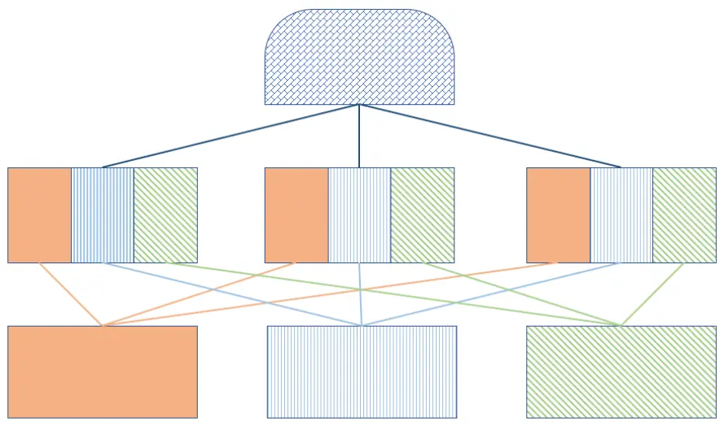
数据来源：财通证券研究所

在财通金工“星火”多因子系列的前两篇专题报告中，《Barra 模型初探：A股市场风格解析》详述了多因子模型的构建方法和计算方式，利用多因子模型对A股市场的风格进行解析，并将其应用到对任意给定投资组合的收益分解、风险敞口的计算上，效果显著。在《Barra 模型进阶：多因子风险预测》中，财通金工借助多因子模型对股票收益率协方差矩阵进行结构化估计，并将其运用到对任意给定投资组合的未来风险预测及预期最小风险组合的构建中，可以看到预测效果具有可信性、最小预期风险组合的实际风险也显著更低。

本报告是该系列研究的第三篇专题，主要讨论如何构建可投资性较强的纯因子组合。通过完全复制法和最优化复制法，投资者可以获取与纯因子收益相同的投资组合。然而考虑到这些组合换手率较高、国内市场做空机制尚不完善等实际情况，还需通过组合优化的方法构造更具可行性的投资策略。此外，本报告还探讨特质收益部分给纯因子组合净值带来的不确定性，以及如何通过组合优化的方法对此进行规避，从而获取稳定而纯净的风格因子收益。

## 2、 多因子模型回顾及纯因子收益

本部分主要对多因子模型的构建进行简要回顾，对主要风格因子进行重新定义和计算，对纯因子的收益、稳定性、共线性进行介绍，是第一篇专题的补充。

## 2.1 多因子模型回顾

无论是 Barra USE3 还是 USE4 模型，在横截面上对股票收益率进行回归时均需包含行业因子 $f_{i}$ 及风格因子 $f_{S}$ ，二者的区别仅在于是否加入截距项（国家因子）。

$$
USE3\colon r_{n}=\sum_{i=1}X_{ni}f_{i}+\sum_{s=1}X_{ns}f_{s}+\varepsilon_{n}
$$

$$
USE4;r_{n}=f_{c}+\sum_{i=1}X_{ni}f_{i}+\sum_{s=1}X_{ns}f_{s}+\varepsilon_{n}
$$

其中， $X_{ni}$ 表示股票 n 在行业i 上的暴露度，此处采用 0-1 哑变量表示，股票所属的行业因子暴露度为 1，否则为 $0\circ X_{ns}$ 表示股票在风格因子上的暴露度，所有风格因子均经过去极值化、标准化处理，部分因子经过正交化处理。由于股票特质收益的波动率呈现出异方差性，为此我们采用加权最小二乘 WLS 法对模型进行回归，权重即为股票的流通市值平方根权重。

在本报告中，我们采用 29 个中信一级行业作为行业因子虚拟变量，风格因子的定义和计算方法如表 2 所示。在拟合因子收益时，我们采用 USE4 版本的方法，将市场收益从行业纯因子收益中剥离出来。而在构建纯因子组合时，由于需要对因子矩阵进行求逆，故需用到 USE3 版本的模型，关于这点后续将有进一步的论述。

## 2.2 纯因子组合收益

本文选定回测时间为 2009.12.31-2019.1.31，以全市场所有股票（Wind 全 A指数成分股）为样本构建月度回归多因子模型，由于投资者股票池中可能存在停牌或 ST 股票，为便于对投资组合进行收益和风险归因，我们暂不对这两类样本进行处理。各类风格因子的净值走势如图 4 所示，模型回归的具体细节请参见《Barra 模型初探：A股市场风格解析》。

表2：财通金工风格因子定义

| 大类因子 | 子类因子 | 因子定义及计算 | 权重 | 备注 |
| --- | --- | --- | --- | --- |
| Beta | BETA | $\mathrm{r_{t}}=\alpha+\beta\mathrm{R_{t}}+\mathrm{e_{t}},$ 将单只股票过去252天的日度收益率对流通市值加权指数日度收益率进行半衰指数加权回归，半衰期为63 天 | 1 | 1) 采用流通市值而非总市值加权，因为各大指数编制采用流通市值加权；2) 需要剔除当日停牌或者未上市日期的数据，并将权重进行归一化；3)若满足条件的样本数据少于42天，我们将其 Beta 置为 NaN。 |
| 规模 | SIZE | 股票总市值取对数 | 1 | 由于PB、PE等因子的计算是基于总市值的，因此此处也用总市值 |
| 动量 | RSTR | 过去一段时间个股的累计收益率，不含最近一个月， $\begin{array}{r}{\mathsf{RSTR}=\sum_{\mathrm{t=L}}^{\mathrm{T+L}}\mathsf{w}_{\mathrm{t}}(\ln(1+\mathrm{r}_{\mathrm{t}}),}\end{array}$ $\mathrm{r_{t}}=\mathrm{P_{t}}/\mathrm{P_{t-1}}-1,\ \mathrm{T}{=}504,\ \mathrm{L}{=}21,$ 收益率序列采用半衰指数加权，半衰期为126天 | 1 | 1)对于数据质量较好的个股，计算动量时采用了2年的数据2) 需要剔除未上市日期数据，但无需剔除停牌日期数据，并将权重归一化3)若满足条件的数据样本小于42天，我们将其动量置为NaN |
| 波动率(对Beta因子和市值因子进行正交化处理) | DASTD | 个股相对市值加权指数的超额收益率序列的半衰指数加权标准差，T=252，半衰期为42天1/2 $\mathrm{{DASTD}=\left(\sum_{t=1}^{T}w_{t}\big(r_{t}-\mu(r)\big)^{2}\right)}$ | 0.7 | 12 采用流通市值加权计算指数收益需要剔除当日停牌或者未上市日期的数据，并将权重进行归一化3) 若满足条件的数据样本小于42天，我们将其因子值置为NaN |
|  | CMRA | 表示过去12个月的波动幅度， $\begin{array}{r}{\mathbb{C}\mathbb{M}\mathbb{R}\mathbb{A}=\ln(1+\operatorname*{max}\{\mathrm{Z}(\mathrm{T})\})-\ln(1+}\\{\operatorname*{min}\{\mathrm{Z}(\mathrm{T})),}\end{array}$ $\sharp\Psi\mathrm{Z(T)}=\exp\bigl(\sum_{\mathrm{t=1}}^{\mathrm{T}}\ln(1+\mathrm{r_{t}})\bigr)-1$ ，表示过去T个月的收益率 | 0.15 | 以 21 天为 1 个月 |
|  | HSIGMA | 计算 Beta 时残差的标准差， Hsigma = std(ei) | 0.15 | 同 Beta 因子的计算 |
| 非线性规模 | NonLinerSize | 中市值因子，将股票总市值对数的三次方对总市值对数回归，取残差的相反数 | 1 | 用于衡量市值因子的非线性性，总市值越大和越小的股票的非线性规模越小，中市值股票的非线性规模越大 |
| 估值 | BP | 市净率的倒数，1/PB | 1 | 采用 Wind 中的 pb_lf 因子的倒数 |
| 流动性(对市值因子进行正交化） | STOM | 月度换手率，STOM = ln(mean(Σ2=1(Vt/St))其中V为当日成交量，S为流通股本 | 0.5 | 1)采用流通股本值，而非自由流通股本值2)剔除未上市、停牌日期的数据 |
|  | STOQ | 季度换手率， $\begin{array}{r}{\mathrm{STOQ}=\ln(\operatorname*{mean}(\sum_{t=1}^{63}(V_{t}/S_{t}))),}\end{array}$ | 0.25 | 同 STOQ 因子的计算 |
|  | STOA | 年度换手率， $\mathrm{STOA}=\ln(\mathrm{mean}(\sum_{t=1}^{252}(V_{t}/S_{t}))),$ | 0.25 | 同 STOQ 因子的计算 |
| 盈利 | CETOP | 过去滚动12个月的经营现金流除以当前市值实际计算中取市现率 PCF（经营现金流 TTM）的倒数 | 1/2 | 采用 Wind 中的 PCF_OCF_ttm 因子的倒数 |
|  | ETOP | 过去滚动12个月的利润除以当前市值实际计算中取市盈率 PETTM 的倒数 | 1/2 | 采用 Wind 中的 PE_ttm 因子的倒数 |
| 成长 | YOYProfit | 单季度净利润同比增长率 | 1/2 | 为避免使用未来数据，需要根据季报公布时间进行调整 |
|  | YOYSales | 单季度营业收入同比增长率 | 1/2 | 同 YOYProfit 因子的计算 |
| 杠杆 | MLEV | 市场杠杆率，MLEV=（总市值+非流动负债）/总市值 | 1/3 |  |
|  | DTOA | 资产负债率，DTOA=总资产/总负债 | 1/3 |  |
|  | BLEV | 账面杠杆率，BLEV=（账面价值+非流动负债）/账面价值 | 1/3 |  |

数据来源：财通证券研究所
备注：1.波动率因子需对Beta因子和市值因子进行正交化处理；
2.流动性因子需对市值因子进行正交化处理；
3.若大类因子下所有子类因子值全部缺失，则该股票的因子值记为缺失，否则用有数据的因子值进行替代，注意需对权重进行归一化处理

图4：纯因子组合净值走势
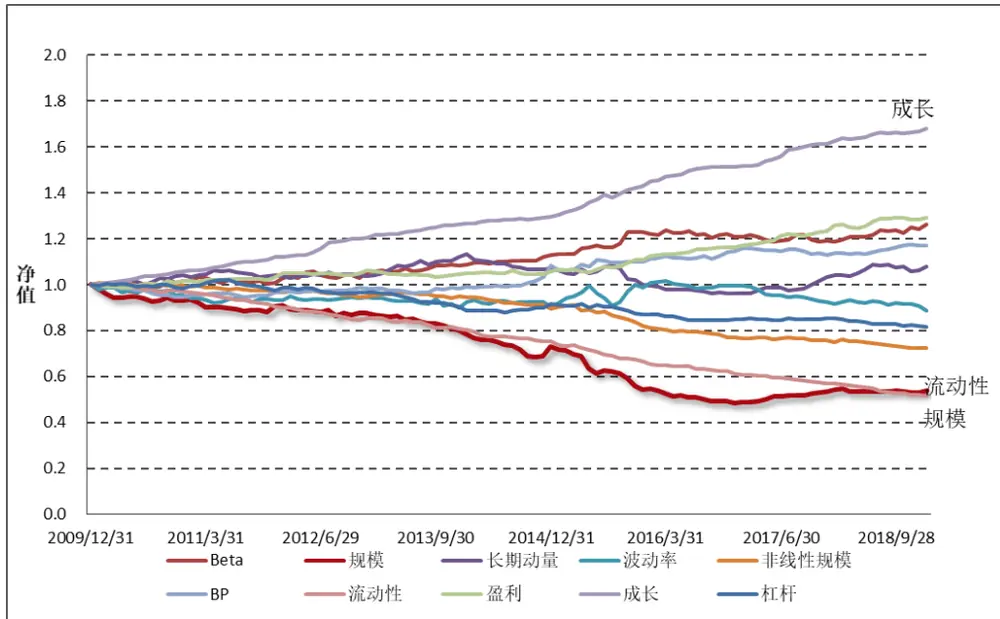
数据来源：财通证券研究所，Wind

在实际计算中，由于某些股票上市时间较短导致某些风格因子存在缺失、部分股票无法参与到回归过程中，这将一定程度上影响因子模型对市场风格的解释能力。图 5 绘制出了回测时间段内股票利用率（用于回归的股票个数与全样本股票个数比值）的变化，可以看到每期回归中的股票利用率基本在 85%以上，其均值达到 90.6%，股票因子缺失带来的影响有限。在模型回归的解释度方面，模型的R2平均为 21.1%，最高达到 61.3%，最低只有 5.86%。

图5：多因子回归R方及股票利用率
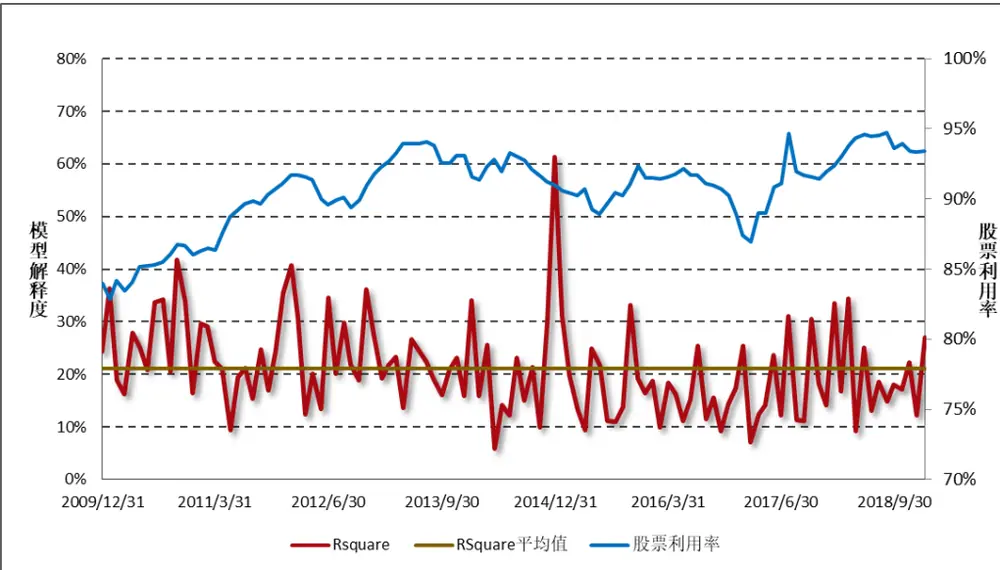
数据来源：财通证券研究所，Wind

表 和表 列出了纯行业因子及纯风格因子的因子显著度、值绝对值平均、自稳定相关系数、多重共线性检验的方差膨胀系数 VIF 值及绩效表现情况。因子显著度是指在回测期间，每期回归中因子 t 值绝对值大于 2 的次数占比；自稳定相关系数 $\mathbf{\xi}_{\rho_{kt}}$ 是指相邻两个截面日期股票因子暴露度的相关系数，其计算方法如下：

$$
\rho_{kt}=\frac{\sum_{K}w_{n}^{t}(X_{nk}^{t}-\bar{X}_{k}^{t})(X_{nk}^{t+1}-\bar{X}_{k}^{t+1})}{\sqrt{\sum_{K}w_{n}^{t}(X_{nk}^{t}-\bar{X}_{k}^{t})^{2}}\sqrt{\sum_{K}w_{n}^{t}(X_{nk}^{t+1}-\bar{X}_{k}^{t+1})^{2}}}
$$

其中， $w_{n}^{t}$ 是指股票 n 在t 时期的市值权重，此处我们衡量因子的月度自稳定系数，相邻的两个截面日期即为每月最后一个交易日期。

VIF 值主要用于衡量自变量之间的多重共线性，是将该因子对其他因子进行回归并根据回归模型 $R^{2}$ 的计算得到：

$$
X_{ik}=\sum_{k^{\prime}\neq k}X_{ik^{\prime}}b_{k^{\prime}}+\varepsilon_{ik}\qquad\Rightarrow\qquad VIF_{k}=\frac{1}{1-R_{k}^{2}}
$$

表3：纯行业因子显著度及绩效统计

| 因子名称 | 因子显著度 | t值绝对值平均 | 因子年化收益 | 因子年化波动 | 因子夏普比率 |
| --- | --- | --- | --- | --- | --- |
| 交通运输 |  |  |  | 25.65% |  |
|  |  |  | 15.00% |  | 55.30% |
| 农林牧渔 |  |  |  | 23.45% | 25.54% |
| 医药 | 84.40% | 6.920 | 12.41% | 23.01% | 53.92% |
| 商贸零售 | 79.43% | 5.811 | -0.40% | 24.43% | -1.65% |
| 国防军工 | 70.21% | 4.349 | 15.90% | 31.85% | 49.92% |
| 基础化工 | 82.98% | 6.607 | 2.18% | 23.55% | 9.23% |
| 家电 | 75.89% | 4.190 | 9.60% | 24.04% | 39.92% |
| 建材 | 70.92% | 4.907 | 4.33% | 24.28% | 17.84% |
| 建筑 | 70.92% | 4.958 | 4.99% | 26.37% | 18.94% |
| 房地产 | 79.43% | 7.284 | 1.36% | 25.93% | 5.23% |
| 有色金属 | 79.43% | 6.715 | 5.75% | 27.65% | 20.79% |
| 机械 | 84.40% | 6.951 | 5.51% | 24.75% | 22.24% |
| 汽车 | 82.98% | 6.281 | 2.67% | 24.52% | 10.88% |
| 煤炭 | 70.92% | 5.128 | -9.51% | 25.76% | -36.93% |
| 电力及公用事业 | 71.63% | 5.646 | 1.93% | 22.71% | 8.49% |
| 电力设备 | 75.89% | 5.475 | 4.40% | 24.77% | 17.77% |
| 电子元器件 | 83.69% | 5.765 | 13.41% | 23.08% | 58.09% |
| 石油石化 | 70.21% | 4.461 | -4.57% | 22.93% | -19.93% |
| 纺织服装 | 67.38% | 4.332 | -0.11% | 24.08% | -0.44% |
| 综合 | 65.96% | 3.388 | 2.34% | 24.87% | 9.42% |
| 计算机 | 75.89% | 5.248 | 20.35% | 27.27% | 74.61% |
| 轻工制造 | 67.38% | 3.831 | 4.94% | 23.18% | 21.33% |
| 通信 | 66.67% | 4.656 | 13.37% | 24.84% | 53.84% |
| 钢铁 | 72.34% | 5.184 | -1.06% | 24.32% | -4.37% |
| 银行 | 78.72% | 5.215 | -3.80% | 22.42% | -16.95% |
| 非银行金融 | 74.47% | 5.675 | 0.48% | 33.27% | 1.44% |
| 食品饮料 | 74.47% | 5.532 | 10.07% | 25.30% | 39.80% |
| 餐饮旅游 | 54.61% | 2.893 | 3.08% | 24.10% | 12.79% |

数据来源：财通证券研究所，Wind

表4：纯风格因子显著度、自稳定系数、VIF及绩效统计

| 因子名称 | 显著度 | t值绝对值平均 | 年化收益 | 年化波动 | 夏普比率 | 自稳定系数 | VIF |
| --- | --- | --- | --- | --- | --- | --- | --- |
| Beta | 61.70% | 3.729 | 2.64% | 3.77% | 70.12% | 0.954 | 1.500 |
| 规模 | 75.89% | 5.387 | -6.57% | 5.65% | -116.23% | 0.997 | 1.504 |
| 长期动量 | 52.48% | 2.802 | 0.82% | 3.66% | 22.31% | 0.887 | 1.812 |
| 波动率 | 56.74% | 2.748 | -1.30% | 4.58% | -28.30% | 0.937 | 2.501 |
| 非线性规模 | 58.87% | 2.808 | -3.48% | 2.12% | -163.94% | 0.996 | 1.18 |
| BP | 41.13% | 2.118 | 1.73% | 2.96% | 58.33% | 0.989 | 1.87 |
| 流动性 | 53.90% | 2.717 | -7.00% | 2.27% | -308.91% | 0.968 | 2.12 |
| 盈利 | 43.97% | 2.097 | 2.85% | 2.20% | 129.62% | 0.976 | 1.75 |
| 成长 | 45.39% | 2.316 | 5.86% | 1.55% | 377.88% | 0.832 | 1.09 |
| 杠杆 | 41.84% | 1.916 | -2.19% | 2.26% | -96.98% | 0.992 | 1.37 |

数据来源：财通证券研究所，Wind

从因子的显著度和 t 值绝对值平均可以看到，绝大多数的行业因子和风格因子都较为显著，说明我们选取的行业和风格因子对股票未来收益存在较显著的影响。风格因子的自稳定系数基本在 0.85 以上，大部分因子稳定系数在 0.95 以上，这说明如果能够在期初较好地控制组合的风险暴露，那么在期末组合的风格偏好并不会发生明显的变化。此外，所有风格因子的 VIF 均在 3 以下，说明风格因子之间的共线性问题并不明显，在对波动率因子和流动性因子进行正交化处理之前，其 VIF 值分别为 2.95 和 2.52，在进行正交化处理后降低至 2.50和 2.11，说明正交化处理有效地降低了变量之间的共线性特征。结合图 4 和表4 可以看出，成长因子、流动性因子和规模因子的因子夏普比率较高，这些风格因子尤其值得投资者关注，我们在后续章节中将以这些因子为例进行说明。

## 3、 纯因子组合构建：完全复制法VS 最优复制法

本节我们讨论两种构造纯因子组合的方法：完全复制法（Full Replication）和最优化复制法（Optimize Replication）。其中，完全复制法是根据多因子模型本身的解析解来构造组合权重，这种方法能够保证组合的收益即为纯因子的收益；最优化复制方法是根据带约束的均值—方差优化的方法来求解的，这种方法可以限制组合的事前风险，但可能会出现一定程度的跟踪误差。

## 3.1 方法介绍

## 3.1.1 完全复制法

由于采用 0-1 哑变量作为行业因子的代理变量，因此 Barra USE4 版本中截距项的引入实际上是将市场收益从行业收益中剥离出来，而对风格因子的收益并不产生影响。由于在完全复制法的计算过程中，需要用到矩阵的逆，而 USE4 版本中截距项引入带来的自变量之间的完全共线性将导致因子矩阵是不满秩的，因此我们在完全复制法计算纯因子组合收益时采用 USE3 版本的模型，具体来讲：

$$
r=Xf+\varepsilon\Rightarrow{\hat{f}}=(X^{\prime}WX)^{-1}X^{\prime}Wr{\mathrm{:}}=W^{\ast}r
$$

其中 W 矩阵为回归的权重矩阵，将上述公式表示为向量形式，即为：

$$
\begin{array}{r}{\left(\begin{array}{c}{\hat{f}_{1}}\\{\hat{f}_{2}}\\{\vdots}\\{\hat{f}_{k}}\end{array}\right)_{k\times1}=\left(\begin{array}{ccc}{w_{11}}&{\cdots}&{w_{1n}}\\{\vdots}&{\ddots}&{\vdots}\\{w_{k1}}&{\cdots}&{w_{kn}}\end{array}\right)_{k\times n}\left(\begin{array}{c}{r_{1}}\\{r_{1}}\\{\vdots}\\{r_{n}}\end{array}\right)_{n\times1}}\end{array}
$$

可以看到， $W^{*}$ 矩阵的每一行即为每一个纯因子组合对应的权重向量。采用完全复制法得到的纯因子组合权重能够精确地复制纯因子收益，然而其缺点在于它并不能对组合的事前风险进行控制，基于此下文将介绍如何通过最优化复制方法对此进行改进。

## 3.1.2 最优复制法

根据纯因子组合的定义，可将对纯因子组合的权重求解问题表述为一个优化问题：我们试图构建这样一个投资组合，该组合在满足对其他因子的暴露为 0 的条件下，能够最大化对目标因子暴露、同时最小化组合的预期风险。采用数学语言表达即为：我们试图找到一个最优权重向量 h，满足：

$$
\begin{array}{c}{{\displaystyle\operatorname*{max}_{h}\bigg\{h^{\prime}X_{\alpha}-\frac12\lambda h^{\prime}Vh\bigg\}}}\\{{s.t.\quad h^{\prime}X_{\sigma}=0}}\end{array}
$$

此处， $X_{\alpha}$ 和 $X_{\sigma}$ 分别表示投资组合对目标因子α和对其他因子σ的暴露程度，表示投资者在风格暴露与风险偏好之间的强弱程度，矩阵V即为成分股收益的协方差矩阵，可以通过《Barra 模型进阶：多因子模型风险预测》中的方法求得。采用拉格朗日乘数法即可推导出该优化的解析解（具体推导过程可参见附录），其公式如下：

$$
h^{\ast}=\frac{1}{\lambda}V^{-1}[X_{\alpha}-X_{\sigma}(X_{\sigma}^{\prime}V^{-1}X_{\sigma})^{-1}(X_{\sigma}^{\prime}V^{-1}X_{\alpha})]
$$

有趣的是，当我们采用回归矩阵 W来代替上式的 $V^{-1}$ 时，纯因子组合的权重与完全复制法得到的权重将会完全相同，也就是说，完全复制法可以被视为最优化复制法的一种特殊情况，具体推导可参见附录。

## 3.2 实证检验

选定 2009.12.31-2019.1.31 作为回测时间段，选定 Wind 全 A 成分股作为样本股，我们对成长因子、流动性因子和规模因子的纯因子组合进行实证检验，观察组合收益是否能够与纯因子收益保持一致。

图 展示了成长因子月度净值、基于完全复制法和基于最优复制法构建的纯因子组合的月度净值走势，图 7 展示了两个投资组合的日度净值走势。可以看到，通过这两种方法构建的投资组合均能够紧跟纯因子组合的收益走势，这说明这两种投资组合在复制纯因子收益方面是较为理想的。图 8 和图9 分别展示了完全复制法和最优化复制法在构建流动性因子和规模因子的纯因子组合时的月度净值表现，可以看到纯因子组合的净值与风格因子的净值走势仍然十分贴近。

图6：成长因子月度净值走势
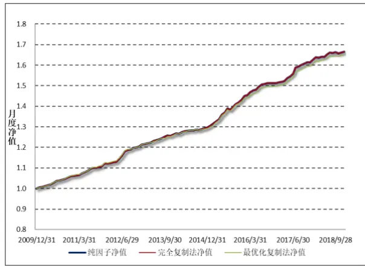
数据来源：财通证券研究所，Wind

图7：成长因子日度净值走势
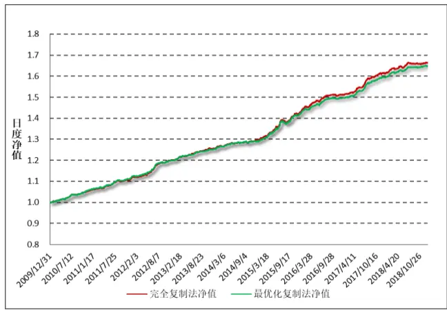
数据来源：财通证券研究所，Wind

图8：流动性因子月度净值走势
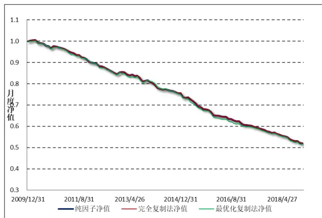
数据来源：财通证券研究所，Wind

图9：规模因子月度净值走势
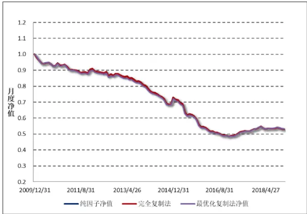
数据来源：财通证券研究所，Wind

表 5 展示了 10 大风格因子纯因子组合的绩效表现，与表 4 对比可以看到，纯因子组合的绩效表现与纯因子收益的走势基本保持一致。在夏普比率的绝对值方面，成长因子、流动性因子和规模因子仍然是较为有效的因子。

表5：纯风格因子组合绩效表现

| 因子 | 复制方法 | 年化收益 | 年化风险 | 夏普比率 | 最大回撤 |
| --- | --- | --- | --- | --- | --- |
| Beta | 完全复制 | 2.68% | 4.33% | 61.86% | 6.19% |
|  | 最优化复制 | 2.70% | 4.40% | 61.28% | 7.81% |
| 规模 | 完全复制 | -6.78% | 3.92% | -173.02% | 51.64% |
|  | 最优化复制 | -6.77% | 3.88% | -174.63% | 51.92% |
| 长期动量 | 完全复制 | 0.88% | 3.19% | 27.70% | 15.32% |
|  | 最优化复制 | 0.35% | 3.10% | 11.46% | 17.91% |
| 波动率 | 完全复制 | -1.38% | 4.01% | -34.31% | 13.56% |
|  | 最优化复制 | -0.40% | 3.89% | -10.29% | 11.89% |
| 非线性规模 | 完全复制 | -3.62% | 1.74% | -207.31% | 28.43% |
|  | 最优化复制 | -4.78% | 1.66% | -287.54% | 35.58% |
| BP | 完全复制 | 1.79% | 2.31% | 77.59% | 5.93% |
|  | 最优化复制 | 1.54% | 2.11% | 72.70% | 5.99% |
| 流动性 | 完全复制 | -7.24% | 2.20% | -329.86% | 48.59% |
|  | 最优化复制 | -7.39% | 2.25% | -327.85% | 49.21% |
| 盈利 | 完全复制 | 2.97% | 1.95% | 152.15% | 3.35% |
|  | 最优化复制 | 3.06% | 1.80% | 170.27% | 2.42% |
| 成长 | 完全复制 | 6.08% | 1.27% | 478.64% | 1.22% |
|  | 最优化复制 | 5.98% | 1.17% | 511.89% | 1.08% |
| 杠杆 | 完全复制 | -2.27% | 1.88% | -120.78% | 20.28% |
|  | 最优化复制 | -2.45% | 1.87% | -130.54% | 21.63% |

数据来源：财通证券研究所，Wind

接下来我们对这两种方法构建的纯因子组合的持仓细节进行探讨，图 绘制了 2019 年1 月 31 日，两个成长因子纯因子组合的持仓散点图，可以看到两种方法构建出来的投资组合持仓权重十分相似，相关系数达到 89%。同时也可以看到，投资组合的持仓中有很大一部分权重是小于 0 的，这说明组合存在做空。进一步分析可知，由于纯风格因子组合对于行业因子的暴露为 0，而行业因子采用的是0-1二元哑变量表示，因此纯风格因子投资组合实际上是一个零额投资组合，也就是说组合中的权重加总为0，必定存在做空的情况。

图10：完全复制法与最优化复制法持仓对比
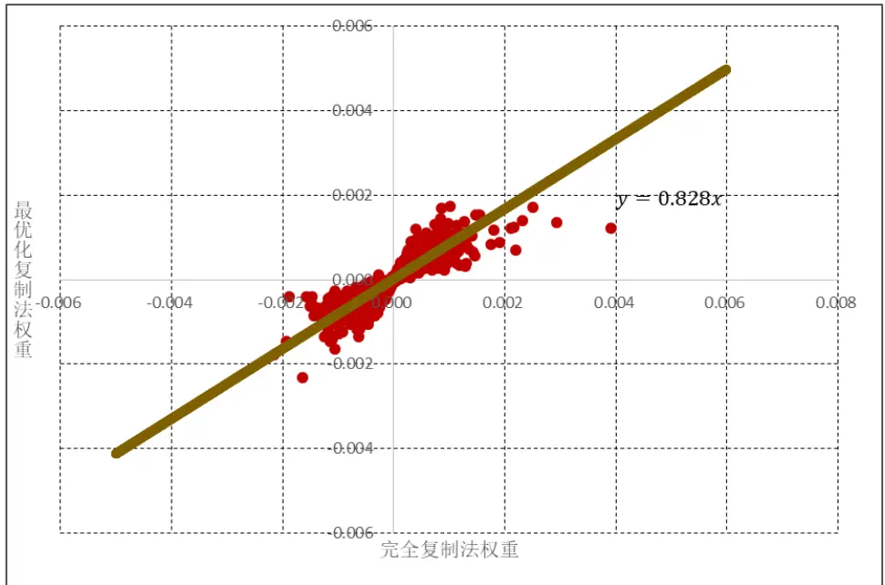
数据来源：财通证券研究所，Wind

## 4、 组合优化：构建更具投资性的纯因子组合

## 4.1 不同的优化目标

如前所述，无论是通过完全复制的方法还是最优化复制的方法，得到的纯因子组合均存在做空的情况。然而，目前我国国内市场做空机制尚不完善、做空股票的成本较高，因此我们需要构建更具可投资性的纯因子组合。

然而需要注意的是，由于行业因子采用 二元哑变量表示，若直接构建对行业中性的投资组合，则必定存在做空的情况。因此，更为合理的方法是找到一个比较基准，使得构建的投资组合在其他因子的暴露与基准组合的暴露保持一致，同时最大化投资组合在目标因子上的暴露，有时还可以加入最小化组合风险作为优化的目标函数。由于目标函数和约束条件的多样性，此处列出几种优化方式作为后续讨论：

1）最小化组合全局风险（即最小化事前风险）：

$$
\begin{array}{c}{\displaystyle\operatorname*{min}_{w}w^{\prime}Vw}\\{\displaystyle}\\{s.t.\ (w-w_{B})^{\prime}X_{\sigma}=0,}\\{\displaystyle(w-w_{B})^{\prime}X_{\alpha}=1,}\\{\displaystyle\sum_{\forall i,w_{i}=1,}w_{i}=1,}\\{\displaystyle\forall i,w_{i}>0,}\end{array}
$$

2）最小化组合主动风险（即最小化跟踪误差）

$$
\begin{array}{l}{\displaystyle\operatorname*{min}_{w}(w-w_{B})^{\prime}V(w-w_{B})}\\{\displaystyle\quad s.t.~(w-w_{B})^{\prime}X_{\sigma}=0,}\\{\displaystyle~(w-w_{B})^{\prime}X_{\alpha}=1,}\\{\displaystyle~\displaystyle\sum_{\forall i,w_{i}=1,}w_{i}=1,}\\{\displaystyle\quad\forall i,w_{i}>0,}\end{array}
$$

## 3）最大化目标因子暴露

$$
\begin{array}{c}{\displaystyle{\operatorname*{max}_{w}w^{\prime}X_{\alpha}}}\\{\displaystyle{s.t.~(w-w_{B})^{\prime}X_{\sigma}=0,}}\\{\displaystyle{\sum_{w_{i}=1,}w_{i}=1,}}\\{\displaystyle{\forall i,w_{i}>0,}}\end{array}
$$

观察以上三种类型的优化方式，（1）和（2）是二次规划，通过引入风险矩阵来最小化组合的全局风险或者是相对于基准组合的主动风险。然而在实际计算中我们发现，由于样本股票数量较大、约束条件较多，经常存在无最优解的情况，此时我们需要进一步放松约束条件，在保证相对基准组合在其他因子上的暴露为0 的条件下，最大化对目标因子的暴露。第（3）种优化方式为线性规划，该求解不考虑风险部分的影响，因此其运算速度要显著地快于二次规划。

## 4.2 实证检验

本小节根据前述优化方法进行实证检验，同样选取 为样本时间段，选取 Wind 全 A成分股指数作为样本股，构建纯因子组合。在实际计算过程中，由于二次规划会频繁出现无最优解的情况，因此我们直接采用（3）中的目标函数进行优化求解。需要注意的是，由于（3）中的优化目标为最大化特定风格因子的暴露，因此构建出的最优组合在该目标因子上的暴露并不恒等于1。换句话说，由这种方法构建的组合不再是“单位纯因子组合”，但仍然是“纯因子组合”。因此在后续将组合收益与纯因子收益进行比较时，需要对纯因子收益乘以一个系数，该系数即为组合在该因子上的暴露度大小。假设经过最优化求解后，得到的风格因子 s 的纯因子组合权重向量为 w，那么该组合的收益可以表示为：

$$
w^{\prime}r=w^{\prime}(Xf+\varepsilon)=w^{\prime}Xf+w^{\prime}\varepsilon=af_{s}+w^{\prime}\varepsilon
$$

其中 a 为组合在因子 s 上的暴露度大小， $f_{s}$ 为因子 s 在当期的收益，ε为当期个股的特质收益向量，后续我们可以看到，这部分收益需要引起高度关注。当投资组合足够分散时，特质收益部分可以视为近似地等于 0，那么该纯因子组合的收益会近似地等于纯因子的收益。然而由后续分析可以看到，当组合权重高度集中或者组合的股票较少时，特质收益部分会对纯因子组合的收益产生较大的影响，从而使得纯因子组合的收益走势与比较基准之间存在明显的偏差。

图11：成长因子纯因子组合每期因子暴露度大小
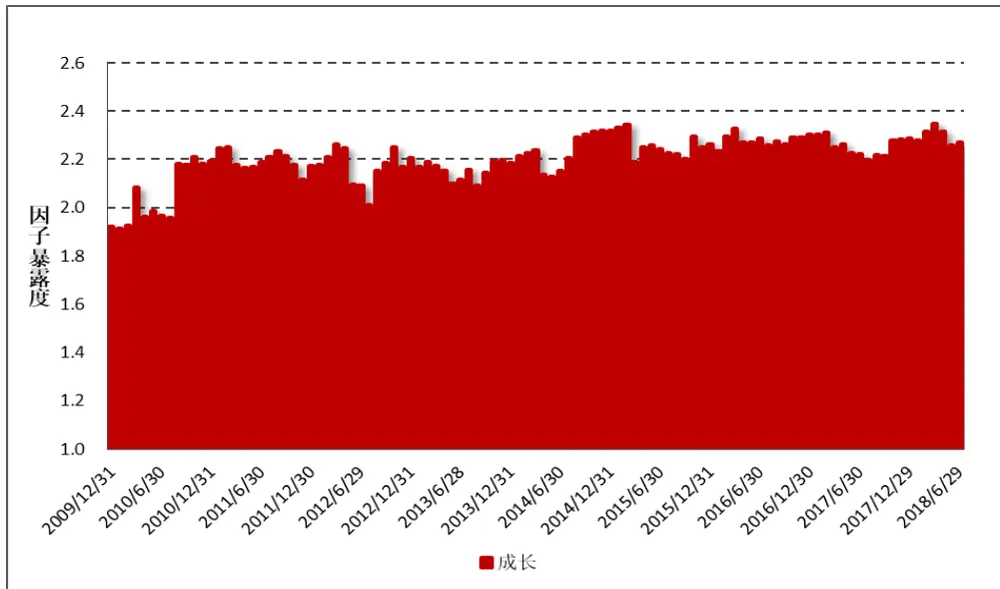
数据来源：财通证券研究所，Wind

由于目标函数为最大化目标因子的暴露度，因此每期构建的投资组合在目标因子上的暴露大小并不相同。以成长因子为例，图 11 绘制出成长因子的纯因子组合在每次调仓时对成长因子的暴露度大小，可以看到该暴露度经常会大于 1。因此，通过这种方法构建的纯因子组合不再是“单位纯因子组合”，而仅仅是“纯因子组合”了。

图 12 以成长因子为例，绘制出了纯成长因子月度净值走势、成长因子纯因子组合月度净值走势和成长因子模拟对冲走势，这三个指标的含义如下：

1) 成长纯因子：是指根据多因子模型进行月度回归得到的纯因子组合的收益情况；

2) 成长因子对冲组合：是指根据组合优化的方法得到的投资组合权重后，做多该组合，同时做空基准组合，得到的对冲组合月度净值走势；

3) 成长因子模拟对冲：所谓的模拟对冲，是指首先计算优化组合相对于基准组合的风格暴露乘以风格因子收益，即w′Xf= af。

图12：调整前最优化纯因子组合净值走势
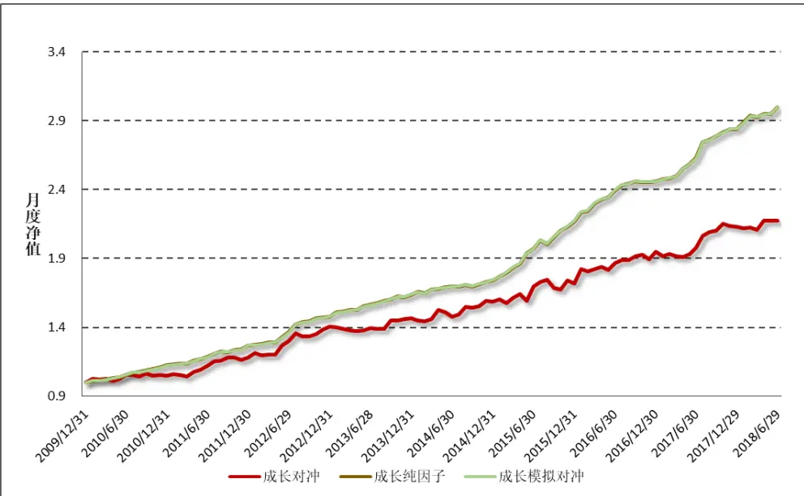
数据来源：财通证券研究所，Wind

需要特别说明的是，由于在收益模型拟合时采用的是市值平方根加权，根据回归的特性，特质收益的市值平方根加权之和的期望为 （但其市值加权之和的期望并不为 0），因此下文所指的基准组合权重是指成分股的市值平方根加权组合，而不再是成分股的市值加权。

$$
X^{\prime}W{\hat{\varepsilon}}=X^{\prime}W{\big(}Y-X{\hat{\beta}}{\big)}=X^{\prime}WY-(X^{\prime}WX)(X^{\prime}WX)^{-1}X^{\prime}WY=0
$$

由图 12 可以看到，成长纯因子净值走势与模拟对冲的走势保持一致，说明我们通过组合优化的方法确实能够得到在其他因子上暴露为 ，而仅在目标因子上有一定暴露的组合。然而，这仅仅是模拟出来的对冲收益，真正的实际收益（即成长因子对冲组合的收益）与我们预想的并不一致，这其中原因究竟是什么呢？

前面提到，成长因子对冲组合的收益由因子收益和特质收益两部分构成，由于“成长因子模拟对冲收益”与纯成长因子的收益走势十分一致，因此问题很可能出现在了特质收益部分。图 13 绘制出了 10 个风格因子特质收益的期末累计收益，可以看到，纯成长因子组合的特质收益部分在全样本期间“腐蚀”了将近40%的收益，而在其他因子上特质收益累计回报的绝对值也相当地高。正是这部分意想不到也无法预料的特质收益，为纯因子对冲组合的净值走势带来极大的不确定性。

图13：调整前纯因子组合特异收益累计回报
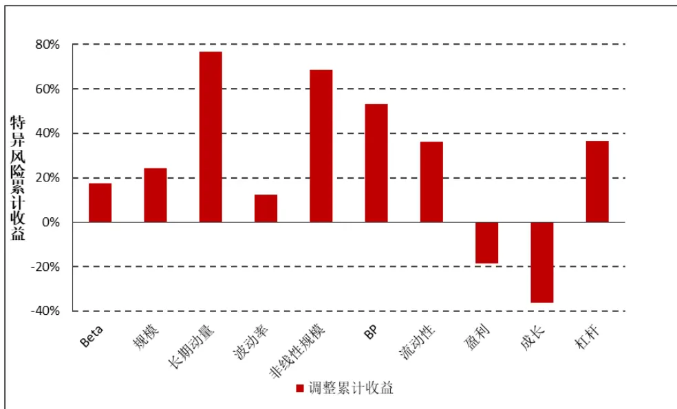
数据来源：财通证券研究所，Wind

## 4.3 再思考：如何解决特质收益的“腐蚀”？

为了解决收益杀手—特质收益给组合带来的不确定性，我们需要找到一种途径，来减少特质收益给整个投资组合带来的“收益腐蚀”。一个直观的想法是：是否能够通过降低组合过往的特质收益来降低组合在本期的特质收益呢？

实际上，这一想法的可行性需要股票特质收益需要具有持续性的假设作为支撑。为了检验这一现象是否存在，我们计算了前一期样本股票的特质收益与本期样本股票的特质收益之间的相关系数，图 14 绘制出了这一相关系数的柱状图。可以看到，该相关系数有正有负，且负相关的情况较多。此外，该相关系数本身的绝对值较小，说明个股特质收益本身并不存在稳定的持续效应。因此，直接通过控制投资组合的样本内特质收益的方法，并不能在样本外也得到相对合意的效果，我们需要寻找其他解决方法。

图14：前一期与本期特质收益相关系数走势
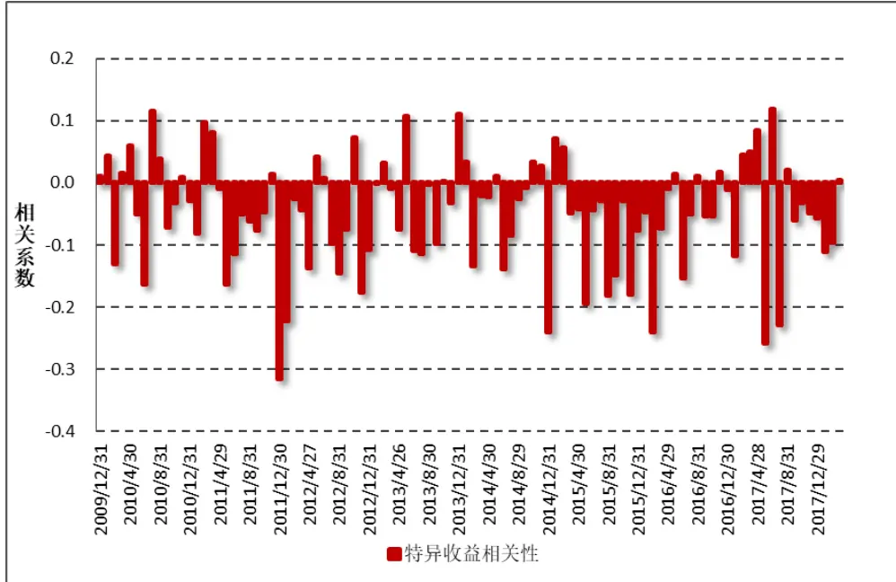
数据来源：财通证券研究所，Wind

前面提到，当投资组合充分分散时，特质收益可以被认为趋近于 0，由此造成的不确定性也就相应地更小。为实现“充分分散”这一目的，主要考虑两种途径：第一，尽量增加样本股票的数量；第二，尽量减少股票权重的集中度。我们先来检查一下投资组合中有效股票的数量大小，图 15 展示了 2019.1.31 截面日期上各个风格因子组合的持股数量，通过组合优化的方法求得的组合权重，每个纯因子组合中持股数量大约在 38 只左右，这大大低于全市场所有样本股票数量。因此，为了解决这一问题，我们可以考虑将持股数量作为限制条件加入到权重优化的计算中。

图15：调整前后平均持股数量比较
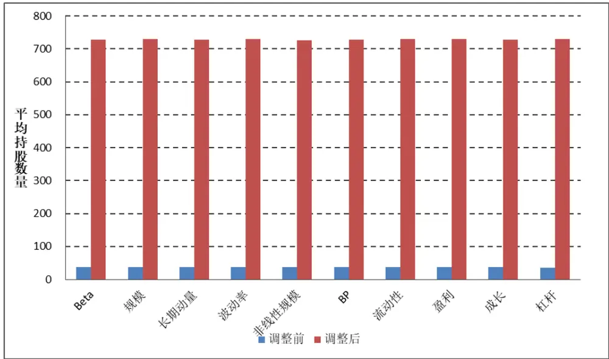
数据来源：财通证券研究所，Wind

考虑如下的权重优化方法：

$$
\begin{array}{c}{{\displaystyle{\operatorname*{max}_{w}w^{\prime}X_{\alpha}}}}\\{{}}\\{{s.t.\ (w-w_{B})^{\prime}X_{\sigma}=0}}\\{{}}\\{{\displaystyle{\sum_{w_{i}=1}\ w_{i}=1}}}\\{{\forall i,w_{i}>0}}\\{{\displaystyle{\sum_{sign}(w_{i})>MinNum}}}\end{array}
$$

其中 sign 为符号函数，当个股权重大于 0 时返回 1，否则返回 0，也就是说这里实际上是加入组合最少持股数量的要求。然而，在实际求解中，符号函数的加入增加了求解的困难，因此我们转换一种思路，对每只股票的权重设置一定的上限（如每只股票权重最大不超过 0.1%），由此构建的投资组合将必须包含至少1000 只股票：

$$
\begin{array}{c}{\displaystyle\operatorname*{max}_{w}w^{\prime}X_{\alpha}}\\{s.t.\ (w-w_{B})^{\prime}X_{\sigma}=0}\\{\displaystyle\sum_{\forall i,w_{i}=1}w_{i}=1}\\{\forall i,w_{i}>0}\\{\forall i,w_{i}<\bar{w}}\end{array}
$$

下面我们观察通过加入单只股票权重上限的调整方法对于组合收益的影响情况，此处我们选取为w̅的值为 0.1%，当求不到最优解时我们将w̅值以 0.0001的步长放宽，因此最后实际的权重上限不一定都为 0.1%。首先调整后的平均股票数量，从图 15 中可以看到，调整后的平均持股数在 730 只左右，大大多于调整前 38 只股票的均值。图 16 绘制出了调整后的最优化纯因子组合的净值走势，与图 12 相比，纯成长因子组合的实际收益与预想的纯因子收益的走势更加贴合，说明这种方法有效地分散了特质收益部分所带来的不确定性。

图16：调整后最优化纯因子组合净值走势
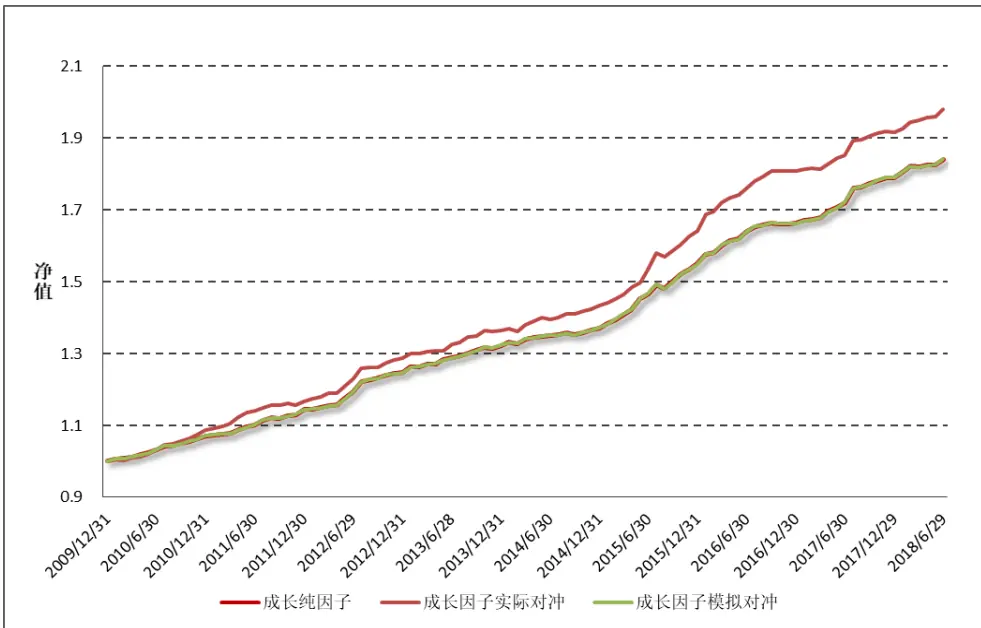
数据来源：财通证券研究所，Wind

图 17 绘制出了调整前后各个风格因子的月度特质收益的累计净值，可以看到，经过调整之后的特质收益累计收益有较为明显的下降，但是在部分因子（如波动率、长期动量、BP）因子上的效果仍然较为一般。若想进一步减少不确定性，需要寻找解释能力更强的风格因子，这样可以有效减少单只股票的特质收益。

图17：调整前后特质累计收益对比
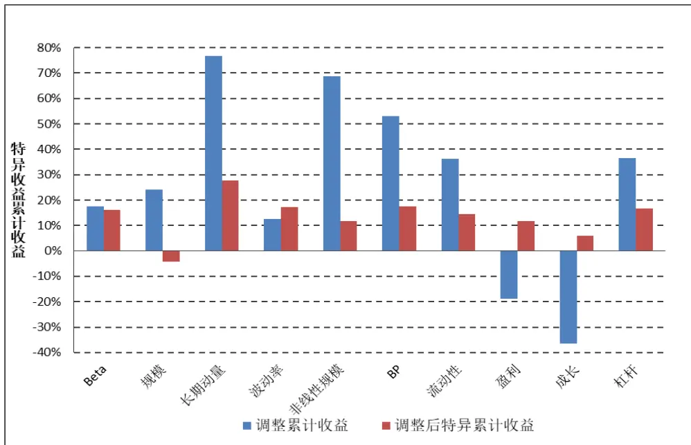
数据来源：财通证券研究所，Wind

## 5、 小结与展望

在财通金工“星火”多因子系列的前两篇专题报告中，《Barra 模型初探：A股市场风格解析》聚焦收益分解和绩效归因两个模块，对 A 股市场的风格进行解析，并将其应用到对任意给定投资组合的收益分解、风险敞口的计算上，效果显著。《Barra 模型进阶：多因子风险预测》则聚焦风险模块，通过结构化方法对股票协方差矩阵进行稳健估计，能够有效地运用到投资组合波动预测、风险控制的研究中。

本报告是该系列报告的第三篇专题，主要讨论如何构建可投资性较强的纯因子组合。通过完全复制法和最优化复制法，投资者可以获取与纯因子收益相同的投资组合。然而这些组合换手率较高、且组合需要做空成分股票，因此在 A 股市场上的实际应用存在诸多限制，本文提出采用组合优化的方法，通过引入比较基准来构造更具可行性的投资策略。在实证结果中我们发现，常被忽略的特质收益对纯因子组合的净值走势带来了不确定性，本文通过加入最大股票投资权重的约束对此进行规避，从而获取稳定而纯净的风格因子收益，研究结果表明通过加入最大权重的约束，能够明显地降低特质收益为组合回报带来的不确定性。

本报告为组合优化的研究开拓了思路，通过构建单一的、纯粹的、正交的资产组合工具，将投资者从风格因子的协同变化中解放出来，有利于投资者更为明确地配置自己的风格偏好。组合优化的研究还可以将 Alpha 端收益和 Beta 端风险结合起来，构建更为稳健的投资组合，财通金工将继续深入这部分的研究，欢迎投资者持续关注！

## 6、 风险提示

多因子模型拟合均基于历史数据，市场风格的变化将可能导致模型失效。

## 7、 附录

## 7.1 最优复制法的拉格朗日推导

根据给定的目标函数和约束条件，可以构建拉格朗日函数：

$$
L(h,\eta)=h^{\prime}X_{\alpha}-\frac{1}{2}\lambda h^{\prime}Vh+\eta h^{\prime}X_{\sigma}
$$

对拉格朗日函数求偏导，即有如下式子：

$$
\begin{array}{c}{\displaystyle\frac{\partial L(h,\eta)}{\partial h}=X_{\alpha}-\frac12\lambda\times2\times Vh+X_{\sigma}\eta=X_{\alpha}-\lambda Vh+X_{\sigma}\eta=0\ }\\{\displaystyle\frac{\partial L(h,\eta)}{\partial\eta}=h^{\prime}X_{\sigma}=0}\end{array}
$$

将上式中的第一个式子进行变换，有：

$$
h=\frac{X_{\alpha}+X_{\sigma}\eta}{\lambda V}=\frac{V^{-1}}{\lambda}(X_{\alpha}+X_{\sigma}\eta)
$$

将其代入到第二个公式中，有：

$$
h^{\prime}X_{\sigma}=(X_{\alpha}^{\prime}+\eta X_{\sigma}^{\prime}){\frac{V^{-1}X_{\sigma}}{\lambda}}=0\quad\Rightarrow\quad\eta=-(X_{\sigma}^{\prime}V^{-1}X_{\sigma})^{-1}(X_{\alpha}^{\prime}V^{-1}X_{\sigma})
$$

将求解出来的η代入到前一个式子中，即有：

$$
h=\frac{V^{-1}}{\lambda}(X_{\alpha}+X_{\sigma}\eta)=\frac{V^{-1}}{\lambda}[X_{\alpha}-X_{\sigma}(X_{\sigma}^{\prime}V^{-1}X_{\sigma})^{-1}(X_{\alpha}^{\prime}V^{-1}X_{\sigma})]
$$

证毕。

## 7.2 最优复制法是完全复制的特殊情况

我们可以采用两步回归法计算目标因子的收益大小，第一步先将目标因子对其他因子进行 WLS 回归，剔除其他因子对目标因子的影响：

$$
X_{\alpha}=X_{\sigma}b+\alpha
$$

将残差变量视为目标因子的代理变量，即有：

$$
\hat{\alpha}=X_{\alpha}-X_{\sigma}\hat{b}=X_{\alpha}-X_{\sigma}({X_{\sigma}}^{'}WX_{\alpha})^{-1}(X_{\sigma}{}^{'}WX_{\alpha})
$$

第二步将股票收益对残差变量进行 WLS 回归，得到的收益即为纯因子收益：

$$
\begin{array}{c}{{r=\hat{\alpha}f_{\alpha}+\varepsilon}}\\{{{}}}\\{{\hat{f}_{\alpha}=(\hat{\alpha}^{\prime}W\hat{\alpha})^{-1}\hat{\alpha}^{\prime}Wr=h_{\alpha}^{\prime}r}}\end{array}
$$

由上式可以知道，通过完全复制法得到的权重可以表示为：

$$
h_{\alpha}=\frac{W\widehat{\alpha}}{\widehat{\alpha}^{\prime}W\widehat{\alpha}}
$$

回顾 3.2 部分中最优复制法的解，当我们取 $\lambda=\hat{\alpha}^{\prime}W\hat{\alpha}$ 并且 ${\cal V}^{-1}=W$ 时，即有：

$$
h^{\ast}=\frac{1}{\lambda}V^{-1}\left[X_{\alpha}-X_{\sigma}(X_{\sigma}^{\prime}V^{-1}X_{\sigma})^{-1}(X_{\sigma}^{\prime}V^{-1}X_{\alpha})\right]=\frac{W\hat{\alpha}}{\hat{\alpha}^{\prime}W\hat{\alpha}}=h_{\alpha}
$$

由此可见，当满足 $\lambda=\hat{\alpha}^{\prime}W\hat{\alpha}$ 并且 $V^{-1}=W$ 时，最优化复制法和完全复制法得到的组合权重完全相同，可以认为最优复制法是完全复制法的一种特殊情况，证毕。

## 参考文献：

[1] “Efficient Replication of Factor Returns：Theory and Applications”，Dimitries Melas, Raghu Suryanarayanan, and Stefano Cavaglia, The Journal of Portfolio Management. 2010

[2] “The Barra USE Equity Model (USE4)”, Menchero Jose, D.J. Orr, Jun Wang. MSCI Barra Working Paper. 2011

## 信息披露

## 分析师承诺

作者具有中国证券业协会授予的证券投资咨询执业资格，并注册为证券分析师，具备专业胜任能力，保证报告所采用的数据均来自合规渠道，分析逻辑基于作者的职业理解。本报告清晰地反映了作者的研究观点，力求独立、客观和公正，结论不受任何第三方的授意或影响，作者也不会因本报告中的具体推荐意见或观点而直接或间接收到任何形式的补偿。

## 资质声明

财通证券股份有限公司具备中国证券监督管理委员会许可的证券投资咨询业务资格。

## 公司评级

买入：我们预计未来 6个月内，个股相对大盘涨幅在 15%以上；

增持：我们预计未来 6个月内，个股相对大盘涨幅介于 5%与 15%之间；

中性：我们预计未来 6个月内，个股相对大盘涨幅介于-5%与 5%之间；

减持：我们预计未来 6个月内，个股相对大盘涨幅介于-5%与-15%之间；

卖出：我们预计未来 6个月内，个股相对大盘涨幅低于-15%。

## 行业评级

增持：我们预计未来 6个月内，行业整体回报高于市场整体水平 5%以上；

中性：我们预计未来 6个月内，行业整体回报介于市场整体水平-5%与5%之间；

减持：我们预计未来 6个月内，行业整体回报低于市场整体水平-5%以下。

## 免责声明

本报告仅供财通证券股份有限公司的客户使用。本公司不会因接收人收到本报告而视其为本公司的当然客户。

本报告的信息来源于已公开的资料，本公司不保证该等信息的准确性、完整性。本报告所载的资料、工具、意见及推测只提供给客户作参考之用，并非作为或被视为出售或购买证券或其他投资标的邀请或向他人作出邀请。

本报告所载的资料、意见及推测仅反映本公司于发布本报告当日的判断，本报告所指的证券或投资标的价格、价值及投资收入可能会波动。在不同时期，本公司可发出与本报告所载资料、意见及推测不一致的报告。

本公司通过信息隔离墙对可能存在利益冲突的业务部门或关联机构之间的信息流动进行控制。因此，客户应注意，在法律许可的情况下，本公司及其所属关联机构可能会持有报告中提到的公司所发行的证券或期权并进行证券或期权交易，也可能为这些公司提供或者争取提供投资银行、财务顾问或者金融产品等相关服务。在法律许可的情况下，本公司的员工可能担任本报告所提到的公司的董事。

本报告中所指的投资及服务可能不适合个别客户，不构成客户私人咨询建议。在任何情况下，本报告中的信息或所表述的意见均不构成对任何人的投资建议。在任何情况下，本公司不对任何人使用本报告中的任何内容所引致的任何损失负任何责任。

本报告仅作为客户作出投资决策和公司投资顾问为客户提供投资建议的参考。客户应当独立作出投资决策，而基于本报告作出任何投资决定或就本报告要求任何解释前应咨询所在证券机构投资顾问和服务人员的意见；

本报告的版权归本公司所有，未经书面许可，任何机构和个人不得以任何形式翻版、复制、发表或引用，或再次分发给任何其他人，或以任何侵犯本公司版权的其他方式使用。