# 2019 年 04 月 10 日 基于持仓的基金业绩归因：始于 Brinson，归于 Barra

## “星火”多因子专题报告（四）

## 联系信息

陶勤英分析师

SAC 证书编号：S0160517100002

taoqy@ctsec.com

021-68592393

张宇研究助理

zhangyu1@ctsec.com 021-68592337 
17621688421

17621688421

## 投资要点：

## 财通金工多因子风险模型研究框架

- 一个完善的多因子风险系统通常包含如下三个模块：收益模型、风险模型和绩效归因模型。

- 对基金业绩进行归因通常可以分为对收益归因和对风险归因两个部分，本文基于持仓数据对组合业绩归因进行探讨。

## 相关报告

【1】“星火”多因子系列（一）：《Barra模型初探：A 股市场风格解析》

【2】“星火”多因子系列（二）：《Barra模型进阶：多因子模型风险预测》

【3】“星火”多因子系列（三）：《Barra模型深化：纯因子组合构建》

【4】“拾穗”多因子系列（一）：《带约束的加权最小二乘：一种解析解法》

【 】“拾穗”多因子系列（二）：《你看到的不一定是你所想的：解密 R 方》

【6】“拾穗”多因子系列（三）：《行业因子选取：中信一级还是申万一级？》

【7】“拾穗”多因子系列（四）：《总市值、流通市值、自由流通市值：谈谈取舍》

【8】“拾穗”多因子系列（五）：《数据异常值处理：比较与实践》

【9】“拾穗”多因子系列（六）：《因子缺失值处理：数以多为贵》

【10】“拾穗”多因子系列（七）：《从纯因子组合的角度看待因子多重共线性》

【11】“拾穗”多因子系列（八）：《非线性规模因子：A 股市场存在中市值效应吗？》

## Brinson 模型与多因子模型收益分解

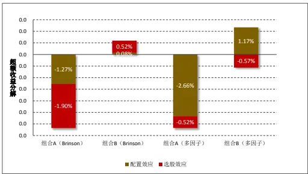

## 基于 Brinson模型的组合收益归因

- 经典版 模型：将组合的超额收益分解为配置收益、选股收益和交互收益三个部分。

改进版 BF模型：引入行业超额收益，将组合超额收益分解为配置效应和选股效应两个部分。

## 基于多因子模型的组合收益归因

- 基于行业的多因子收益归因：与自下而上的 Brinson模型完全一致

- 基于行业和风格的多因子收益归因：可以同时对行业和风格上的配置进行分析，在实际投资中更具指导意义。

## 基于多因子模型的组合风险归因

- 单一波动分解法：将每个因子单独考虑，计算简单，但忽略因子之间的协同影响，且不具可加性。

- 边际风险分解法：将组合风险分解为因子暴露度与因子边际风险 贡献的乘积，然而偏导数的概念相对模糊，指导意义不强。

三要素分解法：将风险分解为因子暴露（x）、因子波动（sigma）和因子-组合相关系数（rho），对风险的分解更为透彻，更有利于投资经理对风险进行控制。

## 细节探讨

- 基于多因子模型的收益归因中，回归的样本股为基准指数成分股，因此在对投资组合成分股的因子标准化时需费些心思。

- 基于多因子模型的风险归因中，基准指数的风格暴露不为 0，是因为协防差矩阵的估计是在全市场样本中估计的。

- Brinson 模型中主动收益与多因子模型中组合残差收益不完全相等，这是由组合在某些行业中权重为 0导致的。

- 风险提示：本报告统计数据基于历史数据，过去数据不代表未来，市场风格变化可能导致模型失效。

如果将资产组合比喻成投资者的武器，那么组合的业绩表现无疑就是投资者的生命线，对组合的风险和收益进行归因就能够帮助投资者更加了解自己所持武器的进攻和防御能力，从而在竞争激烈的市场中做到有的放矢、脱颖而出。

## 1、 财通金工多因子风险模型研究框架

## 1.1 最后一块拼图：组合绩效归因

对于所有的量化研究者而言，研究是立身之本，但再精细的模型、再优秀的策略最终都需要落实在投资组合的构建上。如果想要预测自己的净值曲线将走向何方，首先就需要了解自己的收益究竟缘何而来，对资产组合的绩效进行归因即能够帮助投资者了解持仓组合的收益来源和风险暴露。尽管历史业绩并不代表未来，但历史能够获取较高超额和控制较低风险的能力却足以让普通投资者信赖。在实际研究中，我们通常会发现风格相似、目标相同的基金表现往往大相径庭。图 1 展示了两只指数增强型基金产品在 2019 年 1 月的净值表现情况，可以看到在短短的 1 个月内，组合 A落后基准指数达 4%，而组合 B则与基准走势十分贴合，这不禁让我们疑问究竟是什么原因导致了这样的差距？基于此，本文提出从多因子的角度对组合的业绩和风险进行归因，它不仅能够帮助投资者对持仓组合有更清晰的认识，更是能够在资产组合出现较大回撤时为投资者提供解决问题的出发点和着力点。

图 1：跟踪相同基准的指数增强型基金净值表现大相径庭
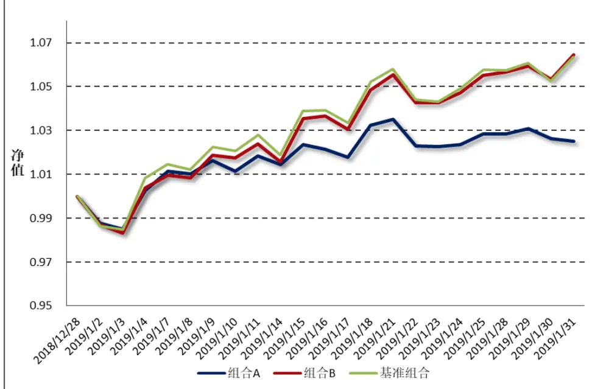
数据来源：财通证券研究所，Wind

在本篇专题中，财通金工承袭一直以来对多因子模型细致、深入的研究，聚焦投资组合收益和风险分解，对基金组合的业绩进行评价。财通金工认为，一个完善的多因子风险系统通常需要包含如下三个模块：

1）收益模型：识别与股票收益密切相关的风格因子，并刻画各个因子对股票收益率的影响方向及影响大小；

2）风险模型：引入股票收益率协方差矩阵的结构化估计方法，在降低估计参数个数的同时提高估计的稳健性和可信性，以便对投资组合未来的风险水平进行预测；

3）绩效归因：结合收益模型和风险模型，对投资组合的业绩和风险进行归因，帮助投资者了解收益的来源以及投资组合的风险暴露敞口。

图 2：财通金工多因子风险系统基本框架
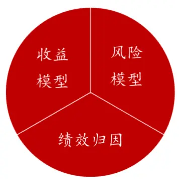
数据来源：财通证券研究所

在财通金工“星火”多因子系列的前三篇专题报告中，《Barra 模型初探：A股市场风格解析》聚焦收益模型部分，详述因子构建和模型拟合方法，利用多因子模型对 A 股市场的风格进行解析，并将其应用到对任意给定投资组合的收益分解、风险敞口的计算上，效果显著。《 模型进阶：多因子风险预测》主要对风险模型进行探讨，借助多因子模型对股票收益率协方差矩阵进行结构化估计，并将其运用到对任意投资组合的未来风险预测及预期最小风险组合的构建中，可以看到预测效果具有可信性、最小预期风险组合的实际风险也显著更低。《Barra模型深化：纯因子组合构建》则更多关注组合优化的部分，借助组合优化的思想，构建 A 股市场上更具可投资性的纯因子组合，财通金工认为这种单一、正交、纯粹的纯因子组合在量化产品工具化、指数化发展的趋势下将大放异彩。

作为“星火”系列报告的第四篇专题，本文旨在对多因子风险系统的最后一块拼图 组合绩效归因进行完善。首先介绍仅包含行业的多因子模型来观察其与 Brinson模型的等同性，随后采用加入风格因子的扩展多因子模型对组合收益进行分解，助力投资者了解持仓组合的收益来源。在风险归因部分，本文比较了单一波动分解法、边际风险分解法和波动率的 x-sigma-rho三要素方法，将组合风险进行深入拆分，为投资者的实际投资提供更为直观的操作指南。

图 3：财通金工“星火”多因子系列报告回顾
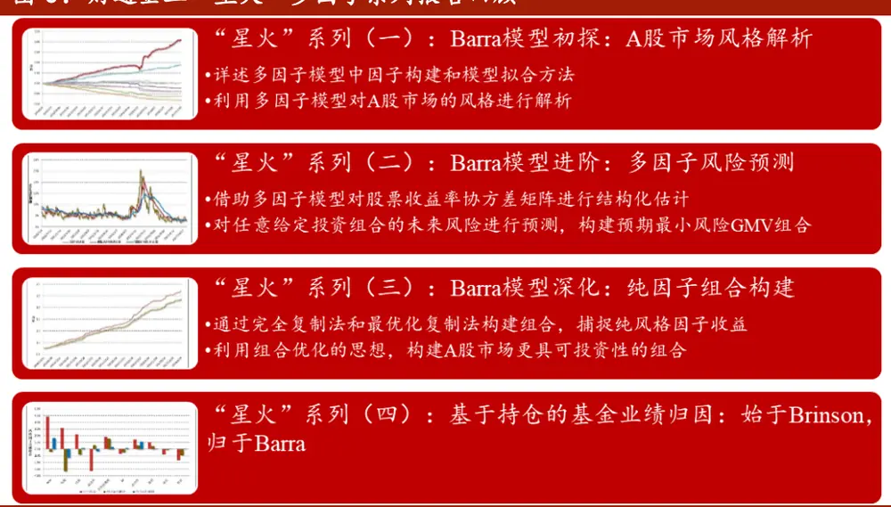
数据来源：财通证券研究所

## 1.2 基金绩效归因框架

随着我国资本市场对 FOF 基金和 MOM 基金模式的不断探索，对基金产品进行分析在量化研究领域就扮演着越来越重要的角色。通常来讲，对基金产品的研究可以大致分为两类，一类是对产品设计、交易制度层面的研究，另一类则是对基金评价、基金精选层面的研究，本文我们聚焦后者。

图 4 对财通金工基金绩效归因的框架进行了简单介绍，根据基金类型的分类，可以将其划分为股票型基金归因、债券型基金归因、混合型基金归因等。对于债券型基金而言，在实际投资中运用地较多的是 Brinson 模型和 Campisi模型，本文对此不做过多介绍。

图 4：基金绩效归因基本框架
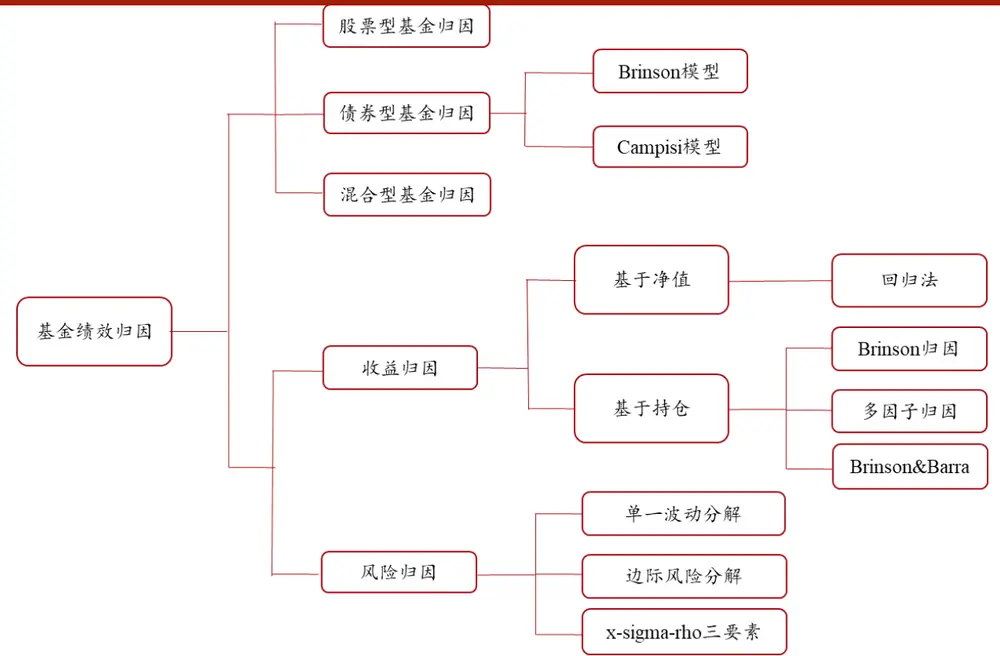
数据来源：财通证券研究所

对股票型基金的绩效进行归因是本文的研究重点，它通常包含收益归因和风险归因两个部分。其中，对于收益归因部分通常又可分为基于净值和基于持仓两大类。基于净值的归因方法通常根据基金的日度收益对主要风格因子的日度收益在时间序列上进行回归，从而观察基金在每种风格上的暴露和偏好。这种方法对数据的要求较低、操作层面简单易行，但在结果的准确性和可靠性上往往不尽如人意。基于持仓的业绩归因方法是对投资组合的全部持仓进行分析，其结果更为可靠。但由于公募基金仅在半年报和年报中公布全部持仓，且其公布的时点具有一定的滞后性，因此数据的不可获得性成为制约外部基金研究者的最大桎梏。然而，本文的基金业绩归因模型更多地是面向自有投资者，而投资者对于自有持仓是完全了解的，因此从这一角度而言，基于持仓的基金绩效归因仍然有着非常高的研究价值。本文我们介绍 Brinson模型归因、Barra 模型归因以及二者相结合的方法。

模型是基于持仓的业绩归因中应用最为广泛的方法，它从自上而下的角度将组合的超额收益分解到配置效应、选股效应和交互效应三个部分，被广泛地应用到股票型、债券型和大类资产配置归因上。基于 Barra 的多因子模型则能够将持仓组合收益分解到不同行业和风格配置上，是一种自下而上的分解方法。在本文中可以看到，仅包含行业分类的多因子模型实际上是与 Brinson模型完全等同的。而引入了风格因子的扩展多因子模型则不仅能够从行业配置层面，还能够从风格配置方面对基金收益进行分析，与我们先前对多因子的研究思路一脉相承。

对风险归因方面的研究是本文的一大亮点，传统的单一波动分解法直观简单，但没有考虑到因子之间的协同影响且这种风险分解方法不具备可加性。基于边际风险分解的方法通过求导的方式计算每个因子对于组合风险的边际贡献度，但偏导数本身的含义在实际操作中较为模糊。本文介绍的 x-sigma-rho波动三要素方法将每个因子的风险贡献分解到因子暴露（x）、因子波动（sigma）和组合-因子相关性（rho）三个部分，这种对于风险的进一步拆解更加贴合投资者的实际操作，能够为投资者的风险控制提供更为直观、深入的参考。

## 2、 基于 Brinson模型的组合收益归因

本部分主要对 Brinson 模型的两种形式进行介绍。经典的 BHB 模型将组合超额收益分解到配置效应、选股效应和交互效应三个部分，而改进版的 BF 模型引入板块超额收益，将组合超额收益分解到配置效应和选股效应两个部分。

## 2.1 Brinson 形式 1：经典版 BHB 模型

Brinson，Hood 和 Beebower 提出 Brinson 模型的经典版本（以下记为 BHB模型），将投资组合的超额收益率分解为配置收益、选股收益和交互收益三个部分，其基本框架如图 5 所示，其中红色渲染部分表示投资组合的超额收益。

图 5：经典版Brinson模型基本框架

| ri riB |  |  |  |
| --- | --- | --- | --- |
|  | 选股收益 $SR=w_{i}^{B}(r_{i}^{P}-r_{i}^{B})$ | 交互收益 $IR=\sum_{i=1}^{I}(w_{i}^{P}-w_{i}^{B})(r_{i}^{P}-r_{i}^{B})$ |  |
|  | 基准收益 $R^{B}=w_{i}^{B}r_{i}^{B}$ wB | 配置收益 $AR=(w_{i}^{P}-w_{i}^{B})r_{i}^{B}$ | wi |

数据来源：财通证券研究所，Brinson，Hood 和 Beebower（1986）

具体来讲，如果从行业配置的角度来看，假设 $w_{i}^{P}\mathcal{\ k_{P}}w_{i}^{B}$ 分别表示投资组合和基准组合中行业 i 的权重， $r_{\mathrm{i}}^{P}\hbar{^\alpha}r_{\mathrm{i}}^{B}$ 分别表示投资组合和基准组合中行业 的收益率，那么投资组合的收益率 $R^{P}$ 和基准组合的收益率 $\cdot R^{B}$ 可分别表示为：

$$
R^{P}=\sum_{i=1}^{I}w_{i}^{P}r_{i}^{P},\quad\sharp\dag\dag\sum_{i=1}^{I}w_{i}^{P}=1
$$

$$
R^{B}=\sum_{i=1}^{I}w_{i}^{B}r_{i}^{B},\sharp\sharp\sum_{i=1}^{I}w_{i}^{B}=1
$$

其中，I 表示行业的个数。由此，投资组合的超额收益RA即可表示为：

$$
R^{A}=R^{P}-R^{B}=\sum_{i=1}^{I}w_{i}^{P}r_{i}^{P}-\sum_{i=1}^{I}w_{i}^{B}r_{i}^{B}
$$

BHB模型将组合超额收益拆解为配置收益（Allocation Return，AR）、选股收益（Selection Return，SR）和交互收益（Interaction Return，IR）三个部分，具体来讲：

$$
R^{A}=AR+SR+IR
$$

其中，

配置收益： $AR=\sum_{i=1}^{I}(w_{i}^{P}-w_{i}^{B})r_{i}^{B}$

选择收益： $SR=\sum_{i=1}^{I}w_{i}^{B}(r_{i}^{P}-r_{i}^{B})$

交互收益： $IR=R^{A}-AR-SR=\sum_{i=1}^{I}(w_{i}^{P}-w_{i}^{B})(r_{i}^{P}-r_{i}^{B})$

配置收益（AR）等于投资组合在每个行业上的超额权重与基准行业收益率的乘积（ 超额权重 基准行业收益率），它表示在行业内部不进行任何选股操作的前提下，持有与基准组合完全相同的行业，并通过超配收益为正、低配收益为负的行业所能够获取的超额收益。

选择收益（SR）等于基准权重与投资组合在行业上超额收益率的乘积（SR=基准权重×行业超额收益），它表示在组合中保持每个行业权重与基准指数行业权重完全一致的前提下，通过行业内部的选股操作所能够获取的超额收益。

交互收益（IR）等于超额权重与超额收益的乘积（IR=超额权重×超额收益），它表示由配置和选股共同产生的超额收益。

需要说明的是，本文的所有示例都是按照行业进行划分的，但 Brinson模型的应用远不止于此。对于大类资产配置的投资者而言，他可以将收益拆解到股票、债券、现金、基金和衍生品等不同类别的大类资产配置和选择带来的收益，对于债券投资者而言，他可以将超额收益拆解到企业债、信用债、利率债、国债等不同债券类别的配置和选择带来的收益。

## 2.2 Brinson 形式 2：改进版 BF 模型

在实际应用中，我们会发现 BHB模型存在诸多不足之处：

首先，在配置效应 $\begin{array}{r}{AR=\sum_{i=1}^{I}(w_{i}^{P}-w_{i}^{B})r_{i}^{B}}\end{array}$ 中，当某个行业的绝对收益为正时，BHB 模型认为通过超配该行业我们即可获取配置效应。但是，如果某些行业只是具有正收益 $(r_{\bar{\mathfrak{i}}}^{B}>0)$ 但却没能够跑赢基准指数 $(r_{\mathrm{{i}}}^{B}<R^{B})$ ）时，对这种行业的超额配置显然不能说是成功的。

另外，对于选择效应 $\begin{array}{r}{SR=\sum_{i=1}^{I}w_{i}^{B}(r_{i}^{P}-r_{i}^{B})\sqrt{\mathfrak{s}}\frac{\mathfrak{s}}{\overline{{\mathfrak{s}}}}}\end{array}$ ，当某个行业相对于基准行业确实存在超额收益，但如果组合对于该行业的权重配置低于基准权重配置$(w_{\bar{i}}^{P}<w_{\bar{i}}^{B})$ 时，如果仍然按照基准权重来计算其选择效应，其结果会存在一定程度的高估。

此外，对于交互效应 $\begin{array}{r}{IR=\sum_{i=1}^{I}(w_{i}^{P}-w_{i}^{B})(r_{i}^{P}-r_{i}^{B})}\end{array}$ 而言，该项收益的概念相对模糊。如果说配置效应是对超额收益为正的行业的超配、对超额收益为负的行业的低配带来的收益，选股效应是对超额收益为正的个股的超配、对超额收益为负的个股低配带来的收益，那么交互项收益部分很难从操作层面去解释，这为组合的管理带来了很大的难题。

基于此，Brinson 和 Fachler 提出了改进版的 Brinson 模型——BF 模型，增加了基准收益 $R^{B}$ 对配置收益的影响，其基本框架如图 6 所示，其中仍以红色渲染部分表示投资组合的超额收益。

图 6：改进版Brinson模型基本框架
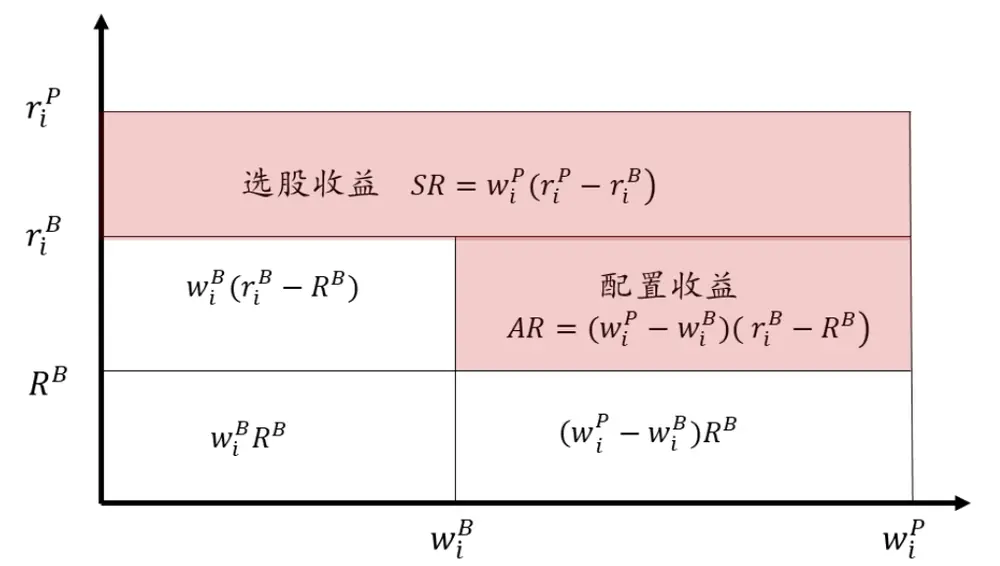
数据来源：财通证券研究所，Brinson 和 Fachler（1985）

具体来看，BF 模型在配置效应部分的计算引入了基准收益 $R^{B}$ ，新的配置效应可以表示为：

$$
AR_{BF}=\sum_{i=1}^{I}(w_{i}^{P}-w_{i}^{B})(r_{i}^{B}-R^{B})
$$

由于资 $\dot{\bar{y}}$ 组合的权重 $\mathbf{\dot{\omega}}_{w_{i}^{P}}^{P}$ 和基准组合的权重 $w_{i}^{B}$ 加总起来均为 1，而 $R^{B}$ 可以看作是一个常数，因此

$$
\begin{array}{c}{{{\displaystyle\sum_{i=1}^{I}(w_{i}^{P}-w_{i}^{B})R^{B}=0}}}\\{{\displaystyle{AR_{BHB}=\sum_{i=1}^{I}(w_{i}^{P}-w_{i}^{B})r_{i}^{B}=\sum_{i=1}^{I}(w_{i}^{P}-w_{i}^{B})(r_{i}^{B}-R^{B})=A{R_{BF}}}}}\end{array}
$$

也就是说，相较于 BHB模型 $\bar{\kappa}_{\mathfrak{h}}$ 言，BF 模型中对于基准收益的引入并不会改变其配置效应的大小，二者是完全等同的，但在直观解释上 BF 模型却与投资者的实际操作更为贴合，它认为：只有超配那些相较基准指数具有正向超额收益的行业、低配那些相较基准指数具有负向超额收益的行业，才能算是成功的行业配置策略。

此外，BF 模型还将 BHB模型中的选择效应和交互效应进行了合并，形成新的选股效应：

$$
SR_{BF}=SR_{BHB}+IR_{BHB}=\sum_{i=1}^{I}w_{i}^{B}(r_{i}^{P}-r_{i}^{B})+\sum_{i=1}^{I}(w_{i}^{P}-w_{i}^{B})(r_{i}^{P}-r_{i}^{B})=\sum_{i=1}^{I}w_{i}^{P}(r_{i}^{P}-r_{i}^{B})
$$

因此，BF 模型就将投资组合的超额收益 $(R^{A})$ 分解到了对行业的配置效应（AR）和行业内部的选股效应（SR）两个部分：

$$
R_{BF}^{A}=AR_{BF}+SR_{BF}=\sum_{i=1}^{I}(w_{i}^{P}-w_{i}^{B})(r_{i}^{B}-R^{B})+\sum_{i=1}^{I}w_{i}^{P}(r_{i}^{P}-r_{i}^{B})
$$

## 2.3 Brinson 模型推导：从自下而上的方式

截至目前，我们对于 Brinson 模型的推导都是基于自上而下的，也就是说我们先假定投资经理先对不同的行业板块进行配置，然后在单个行业内对其成分个股进行选择。本小节我们从股票收益的分解出发，进行自下而上的 Brinson模型推导，对本部分的介绍有助于加深后文从多因子模型对收益进行归因的理解。

对于单只股票而言，我们可将其收益拆解到基准收益、行业相对基准超额和个股相对行业超额三个部分：

$$
r_{n}=R^{B}+\left(r_{i}^{B}-R^{B}\right)+(r_{n}-r_{i}^{B})
$$

那么，投资组合的收益即为成分股的收益加权：

$$
\begin{array}{c}{{{\displaystyle R^{P}=\sum_{n=1}^{N}w_{n}^{P}r_{n}=\sum_{n=1}^{N}w_{n}^{P}\left(R^{B}+\left(r_{i}^{B}-R^{B}\right)+\left(r_{n}-r_{i}^{B}\right)\right)}}}\\{{{}}}\\{{{=R^{B}+\sum_{n=1}^{N}w_{n}^{P}\left(r_{i}^{B}-R^{B}\right)+\sum_{n=1}^{N}w_{n}^{P}\left(r_{n}-r_{i}^{B}\right)}}}\end{array}
$$

上式中的第二项和第三项均是从个股层面出发的，我们可以将其提升至行业层面：

$$
\sum_{n=1}^{N}w_{n}^{P}\left(r_{i}^{B}-R^{B}\right)=\sum_{i=1}^{I}\sum_{n\in i}w_{n}^{P}\left(r_{i}^{B}-R^{B}\right)=\sum_{i=1}^{I}w_{i}^{P}\left(r_{i}^{B}-R^{B}\right)
$$

上式中第二步成立的原因在于，对于同一个行业 $\mathcal{F}_{\mathfrak{p}}\frac{\mathfrak{s}}{\bar{\Xi}}$ ，其 $r_{\mathrm{i}}^{B}-R^{B}$ 是完全相同的，因此可以对行业内成分股的权重直接加总。

$$
\begin{array}{c}{{\displaystyle\sum_{n=1}^{N}w_{n}^{P}(r_{n}-r_{i}^{B})=\displaystyle\sum_{i=1}^{I}\sum_{n\in i}w_{n}^{P}(\ r_{n}-r_{i}^{B})=\displaystyle\sum_{i=1}^{I}(\sum_{n\in i}w_{n}^{P}r_{n}-\sum_{n\in i}w_{n}^{P}r_{i}^{B})}}\\{{\displaystyle\qquad=\sum_{i=1}^{I}(\frac{\sum_{n\in i}w_{n}^{P}r_{n}}{w_{i}^{P}}w_{i}^{P}-r_{i}^{B}w_{i}^{P})=\displaystyle\sum_{i=1}^{I}w_{i}^{P}(r_{i}^{P}-r_{i}^{B})}}\end{array}
$$

将上式推导进行代入，即有：

$$
R^{P}=R^{B}+\sum_{i=1}^{I}w_{i}^{P}\big(r_{i}^{B}-R^{B}\big)+\sum_{i=1}^{I}w_{i}^{P}\big(r_{i}^{P}-r_{i}^{B}\big)
$$

若是该组合为基准组合，则有：

$$
R^{B}=R^{B}+\sum_{i=1}^{I}w_{i}^{B}\big(r_{i}^{B}-R^{B}\big)+\sum_{i=1}^{I}w_{i}^{B}\big(r_{i}^{B}-r_{i}^{B}\big)
$$

其中最后一项等于 0，将以上两式相减，有：

$$
R^{A}=R^{P}-R^{B}=\sum_{i=1}^{I}(w_{i}^{P}-w_{i}^{B})\big(r_{i}^{B}-R^{B}\big)+\sum_{i=1}^{I}w_{i}^{P}\big(r_{i}^{P}-r_{i}^{B}\big)=AR+SR
$$

至此，我们可以看到，从个股层面出发对股票的收益进行分解，再经过累计汇总推导出的行业配置及选股收益与 Brinson模型推导出的公式完全一致。在后续多因子模型的收益归因介绍中，我们将从回归的角度将个股收益拆解到市场收益、行业收益和特质收益三个部分，这一思想与本部分的讨论十分类似，因此本小节的探讨是非常必要的。

表 1：基于Brinson模型的组合A 超额收益归因

| 行业代码 | 行业名称 | 资产组合权重 | 基准权重 | 主动权重 | 资产组合收益 | 基准组合收益 | 相对收益 | 主动收益 | 配置效应 | 进效股应 | 总效应 |
| --- | --- | --- | --- | --- | --- | --- | --- | --- | --- | --- | --- |
|  |  | wi | wB | wi −wi | rp | rB | rf −RB | rf-rf | AR | SR | +F5 |
| 0 | 现金 | 0.00% | 0.00% | 0.00% | 0.00% | 0.00% | -5.87% | 0.00% | 0.00% | 0.00% | 0.00% |
| 1 | 交通运输 | 1.47% | 3.36% | -1.89% | 8.90% | 3.76% | -2.11% | 5.13% | 0.04% | 0.08% | 0.12% |
| 2 | 传媒 | 0.00% | 0.97% | -0.97% | 0.00% | 1.75% | -4.12% | -1.75% | 0.04% | 0.00% | 0.04% |
| 3 | 农林牧渔 | 0.00% | 0.56% | -0.56% | 9.20% | 13.18% | 7.31% | -3.98% | -0.04% | 0.00% | -0.04% |
| 4 | 医药 | 4.45% | 5.00% | -0.54% | -15.07% | -1.03% | -6.90% | -14.04% | 0.04% | -0.63% | -0.59% |
| 5 | 商贸零售 | 2.97% | 0.66% | 2.31% | 2.87% | 3.74% | -2.13% | -0.87% | -0.05% | -0.03% | -0.07% |
| 6 | 国防军工 | 0.00% | 1.30% | -1.30% | 0.00% | 2.86% | -3.01% | -2.86% | 0.04% | 0.00% | 0.04% |
| 7 | 基础化工 | 1.65% | 1.01% | 0.65% | 2.71% | -3.04% | -8.91% | 5.75% | -0.06% | 0.10% | 0.04% |
| 8 | 家电 | 1.54% | 2.95% | -1.42% | 12.24% | 15.93% | 10.05% | -3.68% | -0.14% | -0.06% | -0.20% |
| 9 | 建材 | 1.47% | 0.99% | 0.48% | 10.89% | 10.56% | 4.69% | 0.34% | 0.02% | 0.00% | 0.03% |
| 10 | 建筑 | 13.98% | 3.96% | 10.02% | -0.69% | -0.67% | -6.54% | -0.01% | -0.66% | 0.00% | -0.66% |
| 11 | 房地产 | 11.36% | 3.84% | 7.52% | 6.37% | 11.37% | 5.50% | -5.00% | 0.41% | -0.57 | -0.15%% |
| 12 | 有色金属 | 3.03% | 2.06% | 0.97% | 1.86% | -3.27% | -9.14% | 5.13% | -0.09% | 0.16% | 0.07% |
| 13 | 机械 | 4.66% | 1.69% | 2.97% | 4.98% | -0.29% | -6.16% | 5.28% | -0.18% | 0.25% | 0.06% |
| 14 | 汽车 | 4.71% | 3.24% | 1.48% | 9.64% | 2.11% | -3.76% | 7.53% | -0.06% | 0.35% | 0.30% |
| 15 | 煤炭 | 5.94% | 2.19% | 3.74% | 6.00% | 9.13% | 3.26% | -3.13% | 0.12% | -0.19% | -0.06% |
| 16 | 电力公用 | 1.60% | 3.11% | -1.52% | -6.22% | -1.90% | -7.77% | -4.32% | 0.12% | -0.07% | 0.05% |
| 17 | 电力设备 | 3.01% | 1.12% | 1.89% | 1.52% | 10.74% | 4.87% | -9.22% | 0.09% | -0.28% | -0.19% |
| 18 | 电子元器件 | 1.45% | 2.84% | -1.39% | -8.80% | 5.09% | -0.78% | -13.89% | 0.01% | -0.20% | -0.19% |
| 19 | 石油石化 | 2.93% | 8.49% | -5.55% | 1.45% | 4.96% | -0.92% | -3.50% | 0.05% | -0.10% | -0.05% |
| 20 | 纺织服装 | 0.02% | 0.18% | -0.16% | 11.05% | 4.25% | -1.63% | 6.80% | 0.00% | 0.00% | 0.00% |
| 21 | 综合 | 1.62% | 0.29% | 1.33% | -4.29% | -1.90% | -7.77% | -2.39% | -0.10% | -0.04% | -0.14% |
| 22 | 计算机 | 4.62% | 1.15% | 3.47% | -7.19% | 6.46% | 0.59% | -13.66% | 0.02% | -0.63% | -0.61% |
| 23 | 轻工制造 | 0.02% | 0.08% | -0.06% | -7.74% | -0.66% | -6.53% | -7.08% | 0.00% | 0.00% | 0.00% |
| 24 | 通信 | 3.12% | 1.44% | 1.68% | -0.86% | 1.12% | -4.75% | -1.99% | -0.08% | -0.06% | -0.14% |
| 25 | 钢铁 | 6.02% | 1.22% | 4.80% | 4.95% | 5.35% | -0.52% | -0.40% | -0.02% | -0.02% | -0.05% |
| 26 | 银行 | 18.31% | 26.69% | -8.38% | 7.06% | 6.88% | 1.01% | 0.18% | -0.08% | 0.03% | -0.05% |
| 27 | 非银金融 | 0.01% | 11.78% | -11.77% | 12.24% | 8.96% | 3.08% | 3.29% | -0.36% | 0.00% | -0.36% |
| 28 | 食品饮料 | 0.04% | 7.17% | -7.13% | 16.88% | 12.26% | 6.39% | 4.62% | -0.46% | 0.00% | -0.45% |
| 29 | 餐饮旅游 | 0.00% | 0.66% | -0.66% | 0.00% | -9.37% | -15.24% | 9.37% | 0.10% | 0.00% | 0.10% |
| 汇总 |  | 100.00% | 100.00% | 0.00% | 2.70% | 5.87% |  | -3.17% | -1.27% | -1.90% | -3.17% |

数据来源：财通证券研究所，Wind

表 2：基于Brinson模型的组合B 超额收益归因

| 行业代码 | 行业名称 | 资产组合权重 | 基准权董 | 主动权 | 资产组合收益 | 基准组合收益 | 相对收益 | 主动收益 | 配置效应 | 选股效应 | 总效应 |
| --- | --- | --- | --- | --- | --- | --- | --- | --- | --- | --- | --- |
|  |  | wp | w曰 | w −wł | rp | rB | rf -RB | rf -rf | AR | SR | 4+5R |
| 0 | 现金 | 0.00% | 0.00% | 0.00% | 0.00% | 0.00% | -5.87% | 0.00% | 0.00% | 0.00 | 0.00%% |
| 1 | 交通运输 | 2.82% | 3.36% | -0.54% | 0.02% | 3.76% | -2.11% | -3.75% | 0.01% | -0.11 | -0.09%% |
| 2 | 传媒 | 1.63% | 0.97% | 0.65% | -18.06% | 1.75% | -4.12% | -19.81% | -0.03% | -0.32 | -0.35%% |
| 3 | 农林牧渔 | 0.18% | 0.56% | -0.38% | 8.72% | 13.18% | 7.31% | -4.46% | -0.03% | -0.01 | -0.04%% |
| 4 | 医药 | 6.19% | 5.00% | 1.20% | 1.21% | -1.03% | -6.90% | 2.24% | -0.08% | 0.14% | 0.06% |
| 5 | 商贸零售 | 1.56% | 0.66% | 0.90% | -1.05% | 3.74% | -2.13% | -4.78% | -0.02% | -0.07% | -0.09% |
| 6 | 国防军工 | 0.32% | 1.30% | -0.98% | -6.89% | 2.86% | -3.01% | -9.75% | 0.03% | -0.03% | 0.00% |
| 7 | 基础化工 | 2.21% | 1.01% | 1.20% | 7.66% | -3.04% | -8.91% | 10.71% | -0.11% | 0.24% | 0.13% |
| 8 | 家电 | 4.46% | 2.95% | 1.50% | 13.70% | 15.93% | 10.05% | -2.23% | 0.15% | -0.10% | 0.05% |
| 9 | 建材 | 1.51% | 0.99% | 0.52% | 6.86% | 10.56% | 4.69% | -3.70% | 0.02% | -0.06% | -0.03% |
| 10 | 建筑 | 3.48% | 3.96% | -0.48% | 2.70% | -0.67% | -6.54% | 3.37% | 0.03% | 0.12% | 0.15% |
| 11 | 房地产 | 5.23% | 3.84% | 1.39% | 10.19% | 11.37% | 5.50% | -1.18% | 0.08% | -0.06% | 0.01% |
| 12 | 有色金属 | 2.09% | 2.06% | 0.03% | -2.58% | -3.27% | -9.14% | 0.70% | 0.00% | 0.01% | 0.01% |
| 13 | 机械 | 1.28% | 1.69% | -0.41% | 0.23% | -0.29% | -6.16% | 0.52% | 0.03% | 0.01% | 0.03% |
| 14 | 汽车 | 3.16% | 3.24% | -0.08% | 6.37% | 2.11% | -3.76% | 4.26% | 0.00% | 0.13% | 0.14% |
| 15 | 煤炭 | 0.58% | 2.19% | -1.61% | -2.11% | 9.13% | 3.26% | -11.24% | -0.05% | -0.07% | -0.12% |
| 16 | 电力公用 | 4.41% | 3.11% | 1.30% | -0.82% | -1.90% | -7.77% | 1.08% | -0.10% | 0.05% | -0.05% |
| 17 | 电力设备 | 1.12% | 1.12% | 0.01% | 5.46% | 10.74% | 4.87% | -5.28% | 0.00% | -0.06% | -0.06% |
| 18 | 电子元器件 | 4.82% | 2.84% | 1.97% | 10.18% | 5.09% | -0.78% | 5.10% | -0.02% | 0.25% | 0.23% |
| 19 | 石油石化 | 1.88% | 8.49% | -6.61% | 5.45% | 4.96% | -0.92% | 0.50% | 0.06% | 0.01% | 0.07% |
| 20 | 纺织服装 | 0.00% | 0.18% | -0.18% | 0.00% | 4.25% | -1.63% | -4.25% | 0.00% | 0.00% | 0.00% |
| 21 | 综合 | 0.00% | 0.29% | -0.29% | 0.00% | -1.90% | -7.77% | 1.90% | 0.02% | 0.00% | 0.02% |
| 22 | 计算机 | 2.05% | 1.15% | 0.90% | -7.24% | 6.46% | 0.59% | -13.70% | 0.01% | -0.28% | -0.28% |
| 23 | 轻工制造 | 0.00% | 0.08% | -0.08% | 0.00% | -0.66% | -6.53% | 0.66% | 0.01% | 0.00% | 0.01% |
| 24 | 通信 | 1.90% | 1.44% | 0.46% | 2.68% | 1.12% | -4.75% | 1.55% | -0.02% | 0.03% | 0.01% |
| 25 | 钢铁 | 1.67% | 1.22% | 0.45% | 1.46% | 5.35% | -0.52% | -3.90% | 0.00% | -0.07% | -0.07% |
| 26 | 银行 | 18.99% | 26.69% | -7.70% | 8.55% | 6.88% | 1.01% | 1.66% | -0.08% | 0.32% | 0.24% |
| 27 | 非银金融 | 16.72% | 11.78% | 4.93% | 11.99% | 8.96% | 3.08% | 3.04% | 0.15% | 0.51% | 0.66% |
| 28 | 食品饮料 | 8.57% | 7.17% | 1.40% | 11.64% | 12.26% | 6.39% | -0.62% | 0.09% | -0.05% | 0.04% |
| 29 | 餐饮旅游 | 1.17% | 0.66% | 0.51% | -9.47% | -9.37% | -15.24% | -0.10% | -0.08% | 0.00% | -0.08% |
| 汇总 |  | 100.00% | 100.00% | 0.00% | 6.47% | 5.87% |  | 0.60% | 0.08% | 0.52% | 0.60% |

数据来源：财通证券研究所，Wind

## 2.4 Brinson 模型的实证检验

在对 Brinson 模型的理论框架进行介绍后，本部分财通金工从实证角度出发对组合的收益进行归因。我们以前述提到的基金 A和基金 B为例，以 2018 年年报中的全部持仓为依据进行分析，此处我们假设基金在接下来的 1个月中的持仓保持不变，结果如表 1 和表 2 所示。我们对行业进行中信一级划分，探究基金经理在每个一级行业上的配置能力和选股能力。

从总体超额收益分解来看，在 2018.12.28-2019.1.31 期间，组合 A相对于基准组合的超额收益为-3.17%，其中在行业配置方面的超额收益为-1.27%，在选股方面的超额收益为-1.90%。组合 B相对于基准组合的超额收益为 0.6%，其中 0.08%的超额收益来自于行业配置效应，0.52%的超额收益来自于选股效应。需要说明的是，从实际净值走势来看，组合 A 和组合 B 相较于基准指数的超额收益分别为-4.0%和 0.2%，但我们的分析中组合 A和组合 B相较于基准指数的超额收益分别为-3.17%和 0.6%，这主要是由于基金经理可能在回测区间内对持仓组合进行了调整以及基金申购赎回对基金净值的影响造成的。

图 7：组合A 和组合 B 超额收益分解
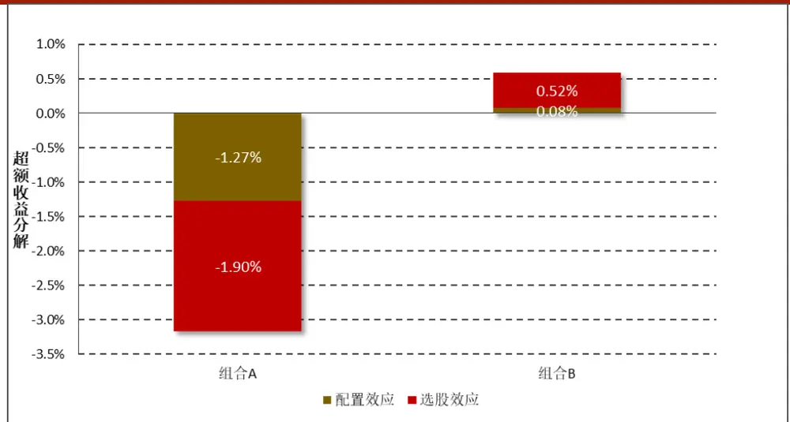
数据来源：财通证券研究所，Wind

对组合的配置效应和选股效应深入分析我们发现，组合 在建筑行业的配置效应达到-0.66%，这主要是源于基金经理对建筑行业进行了超配（超额权重为10.02%），而该行业的相对收益却为负值（-6.54%）。同样的，该组合在医药行业的选股效应达到-0.63%，但是组合相较基准在医药行业上的权重配置却并不明显（4.45% VS 5.00%），究其原因是因为基金经理在医药行业内的选股出现了明显的错配，投资组合在该行业上的收益跑输基准指数达 14.04%。

图 8 展示了组合 A和组合 B 在每个行业上相对基准指数的主动权重，可以看到相较于组合 B而言，组合 A在行业上的偏离更加明显。组合 A在建筑、房地产、钢铁、煤炭、机械等周期性行业有明显超配，而在银行、非银金融、食品饮料和石油石化行业有明显低配。相比之下，组合 B仅在非银金融行业存在明显超配，在石油石化和银行业存在明显低配，因此我们有理由认为在实际操作方面，组合 B更偏向于行业中性的操作。

图 8：组合A 和组合 B 在每个行业上相对基准指数的主动权重
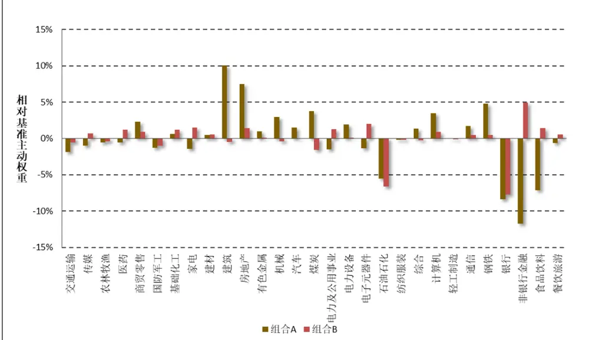
数据来源：财通证券研究所，Wind

## 3、 基于多因子模型的组合收益归因

模型对组合超额收益的分解简单直观，对基金经理的实际操作有着非常实际的指导意义，但它在应用上仍然存在诸多的局限。在大多数情况下，基金经理不仅仅会从行业层面对资产进行配置，还需对市场风格（如大市值还是小市值、价值股还是成长股、高波动还是低波动等）做出选择。与标称型分类的行业因子不同，风格因子往往是数值型数据，通过人为指定划分边界往往存在很多不确定性。而且即便对风格因子进行了划分，风格分类与行业分类的结合将会催生出大量的分类，从而造成归因分析上的“维度灾难”。基于此，我们将介绍基于多因子模型的组合收益归因，从行业和风格层面对组合的收益进行分解。

## 3.1 基于行业的简单因子组合

在财通金工“拾穗”多因子系列（七）《从纯因子组合的角度看待多重共线性》中，我们对简单风格因子组合、简单行业因子组合和纯因子组合之间的性质做了详细的推导，在后续的介绍中我们会利用到简单行业因子组合的一些性质，因此本部分我们对其进行回顾。在仅含行业因子的简单因子组合中：

$$
r_{n}=f_{c}^{S}+\sum_{i}X_{ni}f_{i}^{S}+u_{n}^{S}
$$

其中， ${{X}_{ni}}\mathrm{{\ddot{\Omega}}}$ 表股票 n 在行业因子 i 上的暴露值，我们采用 0-1 变量表示。由于每只股票属于且只属于一个行业，因此截距项因子与行业因子之间存在完全共线性，我们必须为其增加一个约束条件才能求得唯一解。常用的做法是使得单个行业因子收益的市值加权平均等于 0，即：

$$
\sum_{i}W_{i}f_{i}^{s}=0
$$

其中 $W_{i}$ 表示行业 i 的市值权重，所有行业的市值权重加总等于 1。采用加权最小二乘对上式进行求解，有：

$$
f_{c}^{S}=\sum_{i}W_{i}\sum_{n\in i}\left(\frac{v_{n}r_{n}}{V_{i}}\right)~f_{i}^{S}=\frac{1}{V_{i}}\sum_{n\in i}v_{n}r_{n}-f_{c}^{S}
$$

其中， $V_{i}.$ 表示行业 i 中所有股票的回归权重之和， $W_{i}$ 表示行业 i 中所有股票的市值权重之和。由于股票异方差性的存在，在回归中我们通常会采用市值的平方根加权作为回归权重 $v_{n}.$ 。但在财通金工“拾穗”多因子系列（七）《从纯因子组合的角度看待多重共线性》中，我们提到这并不是唯一的赋权方法，其他能够达到类似效果的权重选择我们认为都是合意的。如果我们采用的回归权重是股票的市值权重，那么简单市场因子即为全市场股票的市值加权平均（即指数收益），而单个行业因子的收益即为组合的行业收益与基准收益之差。因此，在后文的简单行业因子组合的构建中，我们采用市值加权 $w_{n}$ 作为回归权重 $v_{n}$ ，即：

$$
w_{n}=v_{n}
$$

## 3.2 基于行业的多因子模型收益归因

在 2.3 小节 Brinson 模型的自下而上推导中，财通金工将股票收益拆解到基准收益、行业相对基准超额和个股相对行业超额三个部分：

$$
r_{n}=R^{B}+\left(r_{i}^{B}-R^{B}\right)+(r_{n}-r_{i}^{B})
$$

在基于行业的多因子模型收益归因中，股票收益被拆分到基准收益、行业收益和特质收益三个部分：

$$
r_{n}=f_{B}+\sum_{i}X_{ni}f_{i}+\ u_{n}s.t.\sum_{i}W_{i}f_{i}=0
$$

在上式中，所有的行业因子都是 0-1 暴露的，回归模型的样本空间是基准指数中的所有成分股。我们采用股票的市值权重作为回归权重进行最小二乘拟合，根据上一节的分析，有：

$$
\begin{array}{c}{{f_{B}=\displaystyle\sum_{i}W_{i}\sum_{n\in i}\left(\frac{w_{n}r_{n}}{W_{i}}\right)=\sum_{n}w_{n}r_{n}=R^{B}}}\\{{f_{i}=\displaystyle\frac{1}{W_{i}}\sum_{n\in i}w_{n}r_{n}-f_{B}=r_{i}^{B}-R^{B}}}\end{array}
$$

其中， $R^{B}$ 表示基准收益率， $r_{i}^{B}$ 表示基准中行业 i 的收益率，因此特质收益可以表示为：

$$
u_{n}=r_{n}-r_{i}^{B}
$$

由此，基于行业的多因子模型与自下而上的 Brinson模型推导完全一致，其中截距项因子收益对应市场基准收益，行业因子收益对应基准中行业相对基准的超额收益，特质收益对应基准中个股相对其所属行业的超额收益。

表 4 和表 5 展示了组合 A和组合 B基于多因子模型的分解结果，读者可与表 1 和表 2 进行一一对照，对应情况可参考表 3。

表 3：Brinson 模型与基于行业多因子模型的对应条目

| Brinson模型中的对应条目 | 基于行业多因子模型中的对应条目 |
| --- | --- |
| 资产组合权重 | 资产组合暴露 |
| 基准权重 | 基准暴露 |
| 主动权重 | 相对暴露 |
| 相对收益 | 因子收益（通过回归得到） |
| 主动收益 | 资产组合残差收益 |
| 配置效应 | 因子收益贡献 |
| 选股效应 | 残差收益贡献 |
| 总效应 | 总贡献 |

数据来源：财通证券研究所

| 表4：基于行业多因子模型的组合A超额收益归因 |  |  |  |  |  |  |  |  |  |  |  |  |  |  |  |
| --- | --- | --- | --- | --- | --- | --- | --- | --- | --- | --- | --- | --- | --- | --- | --- |
| 行业代码 | 行业名称 | 资产组合暴露 | 基准暴露 | 相对暴露 | 因子收益 | 因子收益贡献 |  | 资产组合残差收益 | 基准组合残差收益 | 残差收益贡献 |  |  | 总贡献 |  |  |
| 0 | 现金 | 100.00% | 100.00% | 0.00% | 5.87% | 0.00% |  | 0.00% | 0.00% | 0.00% |  |  | 0.00% |  |  |
| 1 | 交通运输 | 1.47% | 3.36% | -1.89% | -2.11% | 0.04% |  | 5.13% | 0.00% | 0.08% |  |  | 0.12% |  |  |
| 2 | 传媒 | 0.00% | 0.97% | -0.97% | -4.12% | 0.049 | .04% | 0.00% | 0.00% | 0.00% |  |  | 0.04% |  |  |
| 3 | 农林牧渔 | 0.00% | 0.56% | -0.56% | 7.31% | -0.04% |  | -3.98% | 0.00% | 0.00% |  |  | -0.04% |  |  |
| 4 | 医药 | 4.45% | 5.00% | -0.54% | -6.90% | 0.04% |  | -14.04% | 0.00% | -0.63% |  |  | -0.59% |  |  |
| 5 | 商贸零售 | 2.97% | 0.66% | 2.31% | -2.13% | -0.05% |  | -0.87% | 0.00% | -0.03 |  | .03% | -0.07% |  |  |
| 6 | 国防军工 | 0.00% | 1.30% | -1.30% | -3.01% | 0.04% |  | 0.00% | 0.00% | 0.00% |  |  | 0.04% |  |  |
| 7 | 基础化工 | 1.65% | 1.01% | 0.65% | -8.91% | -0.06% |  | 5.75% | 0.00% | 0.10% |  |  | 0.04% |  |  |
| 8 | 家电 | 1.54% | 2.95% | -1.42% | 10.05% | -0.14% |  | -3.68% | 0.00% | -0.06% |  |  | -0.20% |  |  |
| 9 | 建材 | 1.47% | 0.99% | 0.48% | 4.69% | 0.02% |  | 0.34% | 0.00% | 0.00% |  |  | 0.03% |  |  |
| 10 | 建筑 | 13.98% | 3.96% | 10.02% | -6.54% | -0.66% |  | -0.01% | 0.00% | 0.00% |  |  | -0.66% |  |  |
| 11 | 房地产 | 11.36% | 3.84% | 7.52% | 5.50% | 0.41% |  | -5.00% | 0.00% | -0.5 | 7% |  | -0.15% |  |  |
| 12 | 有色金属 | 3.03% | 2.06% | 0.97% | -9.14% | -0.09% |  | 5.13% | 0.00% | 0.16% |  |  | 0.07% |  |  |
| 13 | 机械 | 4.66% | 1.69% | 2.97% | -6.16% | -0.18% |  | 5.27% | 0.00% | 0.25% |  |  | 0.06% |  |  |
| 14 | 汽车 | 4.71% | 3.24% | 1.48% | -3.76% | -0.06% |  | 7.53% | 0.00% | 0.3 |  |  |  |  |  |
|  |  |  |  |  |  |  |  |  |  |  | 0.35% |  |  |  |  |
|  |  |  |  |  |  |  |  |  |  |  |  |  |  | 5% | 0.30% |
| 15 | 煤炭 | 5.94% | 2.19% | 3.74% | 3.26% | 0.12% |  | -3.13% | 0.00% | -0.19% |  |  | -0.06% |  |  |
| 16 | 电力公用 | 1.60% | 3.11% | -1.52% | -7.77% | 0.12% |  | -4.32% | 0.00% | -0.07% |  |  | 0.05% |  |  |
| 17 | 电力设备 | 3.01% | 1.12% | 1.89% | 4.87% | 0.09% |  | -9.22% | 0.00% | -0.289 |  | 0.28% | -0.19% |  |  |
| 18 | 电子元器件 | 1.45% | 2.84% | -1.39% | -0.78% | 0.01% |  | -13.89% | 0.00% | -0.2 | 0.20% |  | 0% |  |  |
| 19 | 石油石化 | 2.93% | 8.49% | -5.55% | -0.92% | 0.05% |  | -3.50% | 0.00% | -0.10 |  | 10% | -0.05% |  |  |
| 20 | 纺织服装 | 0.02% | 0.18% | -0.16% | -1.63% | 0.00% |  | 6.80% | 0.00% | 0.00% |  |  | 0.00% |  |  |
| 21 | 综合 | 1.62% | 0.29% | 1.33% | -7.77% | -0.10% |  | -2.39% | 0.00% | -0.04 | 0.04% |  | -0.14% |  |  |
| 22 | 计算机 | 4.62% | 1.15% | 3.47% | 0.59% | 0.02% |  | -13.66% | 0.00% | -0.63% |  |  | -0.61% |  |  |
| 23 | 轻工制造 | 0.02% | 0.08% | -0.06% | -6.53% | 0.00% |  | -7.08% | 0.00% | 0.00% |  |  | 0.00% |  |  |
| 24 | 通信 | 3.12% | 1.44% | 1.68% | -4.75% | -0.08% |  | -1.99% | 0.00% | -0.0 | 0.06% |  | 6% |  |  |
| 25 | 钢铁 | 6.02% | 1.22% | 4.80% | -0.52% | -0.02% |  | -0.40% | 0.00% | -0.02 |  | 02% | -0.05% |  |  |
| 26 | 银行 | 18.31% | 26.69% | -8.38% | 1.01% | -0.08% |  | 0.18% | 0.00% | 0.03% |  |  | -0.05% |  |  |
| 27 | 非银金融 | 0.01% | 11.78% | -11.77% | 3.08% | -0.36% |  | 3.29% | 0.00% | 0.00% |  |  | -0.36% |  |  |
| 28 | 食品饮料 | 0.04% | 7.17% | -7.13% | 6.39% | -0.46% |  | 4.62% | 0.00% | 0.0 | 000 | 0% | -0.45% |  |  |
|  |  |  |  |  |  |  |  |  |  |  | 7.00% |  |  |  |  |
| 29 | 餐饮旅游 | 0.00% | 0.66% | -0.66% | -15.24% | 0.10% |  | 0.00% | 0.00% | 0.0 | 000 |  | 0% |  |  |
|  |  |  |  |  |  |  |  |  |  |  | 0.00% |  |  |  |  |
| 汇总 |  |  |  |  |  | -1.27% |  |  |  | -1.90% |  |  | -3.17% |  |  |

数据来源：财通证券研究所，Wind

表 5：基于行业多因子模型的组合 B 超额收益归因

| 行业代码 | 行业名称 | 资产组合暴露 | 基准暴露 | 相对暴露 | 因子收益 | 因子收益贡献 |  | 资产组合残差收益 | 基准组合残差收益 | 残差收益贡献 | 总贡献 |  |
| --- | --- | --- | --- | --- | --- | --- | --- | --- | --- | --- | --- | --- |
| 0 | 现金 | 100.00% | 100.00% | 0.00% | 5.87% | 0.00% |  | 0.00% | 0.00% | 0.00% | 0.00% |  |
| 1 | 交通运输 | 2.82% | 3.36% | -0.54% | -2.11% | 0.01% |  | -3.75% | 0.00% | -0.11% | -0.09% |  |
| 2 | 传媒 | 1.63% | 0.97% | 0.65% | -4.12% | -0.0 | 3% | -19.81% | 0.00% | -0.32% |  |  |
|  |  |  |  |  |  |  |  |  |  |  | .05% |  |
|  |  |  |  |  |  |  |  |  |  |  |  | -0.35% |
| 3 | 农林牧渔 | 0.18% | 0.56% | -0.38% | 7.31% | -0.03% |  | -4.46% | 0.00% | -0.01% | -0.04% |  |
| 4 | 医药 | 6.19% | 5.00% | 1.20% | -6.90% | -0.08% |  | 2.24% | 0.00% | 0.14% | 0.06% |  |
| 5 | 商贸零售 | 1.56% | 0.66% | 0.90% | -2.13% | -0.02% |  | -4.78% | 0.00% | -0.07% | -0.09% |  |
| 6 | 国防军工 | 0.32% | 1.30% | -0.98% | -3.01% | 0.03% |  | -9.75% | 0.00% | -0.03% | 0.00% |  |
| 7 | 基础化工 | 2.21% | 1.01% | 1.20% | -8.91% | -0.11% |  | 10.71% | 0.00% | 0.24% | 0.13% |  |
| 8 | 家电 | 4.46% | 2.95% | 1.50% | 10.05% | 0.15% |  | -2.23% | 0.00% | -0.10% | 0.05% |  |
| 9 | 建材 | 1.51% | 0.99% | 0.52% | 4.69% | 0.02% |  | -3.70% | 0.00% | -0.06% | -0.03% |  |
| 10 | 建筑 | 3.48% | 3.96% | -0.48% | -6.54% | 0.03% |  | 3.37% | 0.00% | 0.12% | 0.15% |  |
| 11 | 房地产 | 5.23% | 3.84% | 1.39% | 5.50% | 0.08% |  | -1.18% | 0.00% | -0.06% | 0.01% |  |
| 12 | 有色金属 | 2.09% | 2.06% | 0.03% | -9.14% | 0.00% |  | 0.70% | 0.00% | 0.01% | 0.01% |  |
| 13 | 机械 | 1.28% | 1.69% | -0.41% | -6.16% | 0.03% |  | 0.51% | 0.00% | 0.01% | 0.03% |  |
| 14 | 汽车 | 3.16% | 3.24% | -0.08% | -3.76% | 0.00% |  | 4.26% | 0.00% | 0.13% | 0.14% |  |
| 15 | 煤炭 | 0.58% | 2.19% | -1.61% | 3.26% | -0.05% |  | -11.24% | 0.00% | -0.07% | -0.12% |  |
| 16 | 电力公用 | 4.41% | 3.11% | 1.30% | -7.77% | -0.10% |  | 1.08% | 0.00% | 0.05% | -0.05% |  |
| 17 | 电力设备 | 1.12% | 1.12% | 0.01% | 4.87% | 0.00% |  | -5.28% | 0.00% | -0.06% | -0.06% |  |
| 18 | 电子元器件 | 4.82% | 2.84% | 1.97% | -0.78% | -0.02% |  | 5.12% | 0.00% | 0.25% | 0.23% |  |
| 19 | 石油石化 | 1.88% | 8.49% | -6.61% | -0.92% | 0.06% |  | 0.50% | 0.00% | 0.01% | 0.07% |  |
| 20 | 纺织服装 | 0.00% | 0.18% | -0.18% | -1.63% | 0.00% |  | 0.00% | 0.00% | 0.00% | 0.00% |  |
| 21 | 综合 | 0.00% | 0.29% | -0.29% | -7.77% | 0.02% |  | 0.00% | 0.00% | 0.00% | 0.02% |  |
| 22 | 计算机 | 2.05% | 1.15% | 0.90% | 0.59% | 0.0 | 1% | -13.70% | 0.00% | -0.28% | -0.28% |  |
| 23 | 轻工制造 | 0.00% | 0.08% | -0.08% | -6.53% | 0.01% |  | 0.00% | 0.00% | 0.00% | 0.01% |  |
| 24 | 通信 | 1.90% | 1.44% | 0.46% | -4.75% | -0.02% |  | 1.55% | 0.00% | 0.03% | 0.01% |  |
| 25 | 钢铁 | 1.67% | 1.22% | 0.45% | -0.52% | 0.00% |  | -3.90% | 0.00% | -0.07% | -0.07% |  |
| 26 | 银行 | 18.99% | 26.69% | -7.70% | 1.01% | -0.08% |  | 1.68% | 0.00% | 0.32% | 0.24% |  |
| 27 | 非银金融 | 16.72% | 11.78% | 4.93% | 3.08% | 0.15% |  | 3.04% | 0.00% | 0.51% | 0.66% |  |
| 28 | 食品饮料 | 8.57% | 7.17% | 1.40% | 6.39% | 0.09% |  | -0.62% | 0.00% | -0.05% | 0.04% |  |
| 29 | 餐饮旅游 | 1.17% | 0.66% | 0.51% | -15.24% | -0.08% |  | -0.10% | 0.00% | 0.00% | -0.08% |  |
| 汇总 |  |  |  |  |  | 0.08% |  |  |  | 0.52% | 0.60% |  |

数据来源：财通证券研究所，Wind

表 6：基于行业+风格多因子模型的组合 A 超额收益归因

| 行业代码 | 行业名称 | 资产组合暴露 | 基准暴露 | 相对暴露 | 因子收益 | 因子收益贡献 |  |  | 资产组合残差收益 | 基准组合残差收益 | 残差收益贡献 | 总贡献 |  |  |  |  |
| --- | --- | --- | --- | --- | --- | --- | --- | --- | --- | --- | --- | --- | --- | --- | --- | --- |
| 0 | 现金 | 100.00% | 100.00% | 0.00% | 5.87% | 0.00% |  |  | 0.00% | 0.00% | 0.00% | 0.00% |  |  |  |  |
| 1 | 交通运输 | 1.47% | 3.36% | -1.89% | 0.85% | -0.02% |  |  | 6.92% | 0.00% | 0.10% | 0.09% |  |  |  |  |
| 2 | 传媒 | 0.00% | 0.97% | -0.97% | -4.36% | 0.04%-0.05% |  |  | 0.00% | 0.00% | 0.00% | 0.04% |  |  |  |  |
| 3 | 农林牧渔 | 0.00% | 0.56% | -0.56% | 9.27% |  |  |  | -0. |  | 5% |  | -4.18% | 0.00% | 0.00% | -0.05% |
| 4 | 医药 | 4.45% | 5.00% | -0.54% | -6.07% | 0.03% |  |  | -8.62% | 0.00% | -0.38% | -0.35% |  |  |  |  |
| 5 | 商贸零售 | 2.97% | 0.66% | 2.31% | -2.34% | -0.05% |  |  | -2.15% | 0.00% | -0.06% | -0.12% |  |  |  |  |
| 6 | 国防军工 | 0.00% | 1.30% | -1.30% | 1.33% | -0.0 | 2% |  | 0.00% | 0.00% | 0.00% | -0.02% |  |  |  |  |
| 7 | 基础化工 | 1.65% | 1.01% | 0.65% | -5.26% |  |  |  | -0.03% | 1.49% | 0.00% | 0.02% |  |  |  |  |
| 8 | 家电 | 1.54% | 2.95% | -1.42% | 4.55% | -0.06 |  | 0.06% | % | 2.31% | 0.00% | 0.04% |  |  |  |  |
| 9 | 建材 | 1.47% | 0.99% | 0.48% | -0.51% | 0.00% |  |  | 0.96% | 0.00% | 0.01% | 0.01% |  |  |  |  |
| 10 | 建筑 | 13.98% | 3.96% | 10.02% | -2.83% | -0.28% |  |  | 0.88% | 0.00% | 0.12% | -0.16% |  |  |  |  |
| 11 | 房地产 | 11.36% | 3.84% | 7.52% | 5.97% | 0.45% |  |  | -1.54% | 0.00% | -0.18% | 0.27% |  |  |  |  |
| 12 | 有色金属 | 3.03% | 2.06% | 0.97% | -5.69% | -0.06% |  |  | 5.37% | 0.00% | 0.16% | 0.11% |  |  |  |  |
| 13 | 机械 | 4.66% | 1.69% | 2.97% | -5.93% | -0.18% |  |  | 6.75% | 0.00% | 0.31% | 0.14% |  |  |  |  |
| 14 | 汽车 | 4.71% | 3.24% | 1.48% | 0.24% | 0.00% |  |  | 5.26% | 0.00% | 0.25% | 0.25% |  |  |  |  |
| 15 | 煤炭 | 5.94% | 2.19% | 3.74% | 4.25% | 0.16% |  |  | -3.00% | 0.00% | -0.18% | -0.02% |  |  |  |  |
| 16 | 电力公用 | 1.60% | 3.11% | -1.52% | -0.17% | 0.00% |  |  | -4.25% | 0.00% | -0.07% | -0.07% |  |  |  |  |
| 17 | 电力设备 | 3.01% | 1.12% | 1.89% | 8.96% | 0.17% |  |  | -5.25% | 0.00% | -0.16% | 0.01% |  |  |  |  |
| 18 | 电子元器件 | 1.45% | 2.84% | -1.39% | -3.01% | 0.04% |  |  | -3.91% | 0.00% | -0.06% | -0.01% |  |  |  |  |
| 19 | 石油石化 | 2.93% | 8.49% | -5.55% | 1.73% | -0.1 |  |  |  |  |  |  |  |  |  |  |
|  |  |  |  |  |  |  | 0.10% |  |  |  |  |  |  |  |  |  |
|  |  |  |  |  |  |  |  |  |  | 0% | 0.13% | 0.00% | 0.00% | -0.09% |  |  |
| 20 | 纺织服装 | 0.02% | 0.18% | -0.16% | 1.88% |  |  |  |  |  |  |  |  |  |  |  |
|  |  |  |  |  |  | 0.00%-0.05%-0.02% |  |  |  |  |  |  |  |  |  |  |
|  |  |  |  |  |  |  |  |  | .00% |  |  | 19.49% | 0.00% | 0.00% | 0.00% |  |
| 21 | 综合 | 1.62% | 0.29% | 1.33% | -3.38% |  |  |  | -2.12% | 0.00% | -0.03% | -0.08% |  |  |  |  |
| 22 | 计算机 | 4.62% | 1.15% | 3.47% | -0.45% | -0.0 | 2% |  | -12.41% | 0.00% | -0.57% | -0.59% |  |  |  |  |
| 23 | 轻工制造 | 0.02% | 0.08% | -0.06% | -6.70% | 0.00% |  |  | 9.01% | 0.00% | 0.00% | 0.01% |  |  |  |  |
| 24 | 通信 | 3.12% | 1.44% | 1.68% | -7.54% | -0.13% |  |  | -1.53% | 0.00% | -0.05% | -0.17% |  |  |  |  |
| 25 | 钢铁 | 6.02% | 1.22% | 4.80% | 0.74% | 0.04%-0.14% |  |  | 1.73% | 0.00% | 0.10% | 0.14% |  |  |  |  |
| 26 | 银行 | 18.31% | 26.69% | -8.38% | 1.71% |  |  |  | 0.14% |  |  | 0.46% | 0.00% | 0.08% | -0.06% |  |
| 27 | 非银金融 | 0.01% | 11.78% | -11.77% | -2.11% | 0.25%-0.06% |  |  | .25% | -3.33% | 0.00% | 0.00% |  |  |  |  |
| 28 | 食品饮料 | 0.04% | 7.17% | -7.13% | 0.81% |  |  |  | 1.70% | 0.00% | 0.00% | -0.06% |  |  |  |  |
| 29 | 餐饮旅游 | 0.00% | 0.66% | -0.66% | -17.83% | 0.12% |  |  | 0.00% | 0.00% | 0.00% | 0.12% |  |  |  |  |
| 1 | Beta | -0.07 | 0.00% | -0.07 | 4.89% | -0.36% |  |  |  |  | 0.00% | -0.36% |  |  |  |  |
| 2 | 规模 | -1.04 | 0.00% | -1.04 | 3.17% | -3.31%-0.81% |  |  |  |  | 0.00% | -3.31% |  |  |  |  |
| 3 | 动量 | -0.37 | 0.00% | -0.37 | 2.20% |  |  |  | -0.8 |  | 1% |  |  |  | 0.00% | -0.81% |
| 4 | 波动率 | -0.18 | 0.00% | -0.18 | -3.30% | 0.6 |  |  |  |  |  |  |  |  |  |  |
|  |  |  |  |  |  |  | 0.00 |  |  |  |  |  |  |  |  |  |
|  |  |  |  |  |  |  |  |  | 0% |  |  |  | 0.00% | 0.60% |  |  |
| 5 | 非线性规模 | 0.86 | 0.00% | 0.86 | 1.83% | 1.58% |  |  |  |  | 0.00% | 1.58% |  |  |  |  |
| 6 | BP | 0.68 | 0.00% | 0.68 | -0.68% | -0.46% |  |  |  |  | 0.00% | -0.46% |  |  |  |  |
| 7 | 流动性 | 0.40 | 0.00% | 0.40 | 1.44% | 0.57% |  |  |  |  | 0.00% | 0.57% |  |  |  |  |
| 8 | 盈利 | 0.44 | 0.00% | 0.44 | 1.03% | 0.46% |  |  |  |  | 0.00% | 0.46% |  |  |  |  |
| 9 | 成长 | 0.11 | 0.00% | 0.11 | -0.84% | -0.09% |  |  |  |  | 0.00% | -0.09% |  |  |  |  |
| 10 | 杠杆 | 0.54 | 0.00% | 0.54 | -1.66% | -0.90% |  |  |  |  | 0.00% | -0.90% |  |  |  |  |
| 汇总 |  |  |  |  |  | -2.66% |  |  |  |  | -0.52% | -3.17% |  |  |  |  |

数据来源：财通证券研究所，Wind

表 7：基于行业+风格多因子模型的组合 B 超额收益归因

| 行业代码 | 行业名称 | 资产组合暴露 | 基准暴露 | 相对暴露 | 因子收益 | 因子收益贡献 |  | 资产组合残差收益 | 基准组合残差收益 | 成监贡献 | 总贡献 |  |  |  |
| --- | --- | --- | --- | --- | --- | --- | --- | --- | --- | --- | --- | --- | --- | --- |
| 0 | 现金 | 100.00% | 100.00% | 0.00% | 5.87% | 0.00% |  | 0.00% | 0.00% | 0.00% | 0.00% |  |  |  |
| 1 | 交通运输 | 2.82% | 3.36% | -0.54% | 0.85% | 0.00% |  | -6.17% | 0.00% | -0.17% | -0.18% |  |  |  |
| 2 | 传媒 | 1.63% | 0.97% | 0.65% | -4.36% | -0.03% |  | -7.53% | 0.00% | -0.12% | -0.15% |  |  |  |
| 3 | 农林牧渔 | 0.18% | 0.56% | -0.38% | 9.27% | -0.04% |  | 1.30% | 0.00% | 0.00% | -0.03% |  |  |  |
| 4 | 医药 | 6.19% | 5.00% | 1.20% | -6.07% | -0.07% |  | -0.58% | 0.00% | -0.04% | -0.11% |  |  |  |
| 5 | 商贸零售 | 1.56% | 0.66% | 0.90% | -2.34% | -0.02% |  | -6.09% | 0.00% | -0.10% | -0.12% |  |  |  |
| 6 | 国防军工 | 0.32% | 1.30% | -0.98% | 1.33% | -0.01% |  | -6.37% | 0.00% | -0.02% | -0.03% |  |  |  |
| 7 | 基础化工 | 2.21% | 1.01% | 1.20% | -5.26% | -0.06% |  | 4.20% | 0.00% | 0.09% | 0.03% |  |  |  |
| 8 | 家电 | 4.46% | 2.95% | 1.50% | 4.55% | 0.07% |  | -1.91% | 0.00% | -0.09% | -0.02% |  |  |  |
| 9 | 建材 | 1.51% | 0.99% | 0.52% | -0.51% | 0.0 |  |  |  |  |  |  |  |  |
|  |  |  |  |  |  |  | 007 |  |  |  |  |  |  |  |
|  |  |  |  |  |  |  |  | 0% |  | -1.59% | 0.00% | -0.02% | -0.03% |  |
| 10 | 建筑 | 3.48% | 3.96% | -0.48% | -2.83% | 0.0 |  |  |  |  |  |  |  |  |
|  |  |  |  |  |  |  | .01% |  |  |  |  |  |  |  |
|  |  |  |  |  |  |  |  |  | 1% |  | 4.76% | 0.00% | 0.17% | 0.18% |
| 11 | 房地产 | 5.23% | 3.84% | 1.39% | 5.97% | 0.08%0.00% |  | 08% | -0.69% | 0.00% | -0.04% |  |  |  |
| 12 | 有色金属 | 2.09% | 2.06% | 0.03% | -5.69% |  |  | -0.86% | 0.00% | -0.02% | -0.02% |  |  |  |
| 13 | 机械 | 1.28% | 1.69% | -0.41% | -5.93% | 0.02% |  | 0.99% | 0.00% | 0.01% | 0.04% |  |  |  |
| 14 | 汽车 | 3.16% | 3.24% | -0.08% | 0.24% | 0.00% |  | 0.94% | 0.00% | 0.03% | 0.03% |  |  |  |
| 15 | 煤炭 | 0.58% | 2.19% | -1.61% | 4.25% | -0.07% |  | -3.83% | 0.00% | -0.02% | -0.09% |  |  |  |
| 16 | 电力公用 | 4.41% | 3.11% | 1.30% | -0.17% | 0.00% |  | -0.06% | 0.00% | 0.00% | 0.00% |  |  |  |
| 17 | 电力设备 | 1.12% | 1.12% | 0.01% | 8.96% | 0.00%-0.06% |  | 00% | -4.44% | 0.00% | -0.05% |  |  |  |
| 18 | 电子元器件 | 4.82% | 2.84% | 1.97% | -3.01% |  |  | 3.51% | 0.00% | 0.17% | 0.11% |  |  |  |
| 19 | 石油石化 | 1.88% | 8.49% | -6.61% | 1.73% | -0.11% |  | -0.55% | 0.00% | -0.01% | -0.12% |  |  |  |
| 20 | 纺织服装 | 0.00% | 0.18% | -0.18% | 1.88% | 0.00% |  | 0.00% | 0.00% | 0.00% | 0.00% |  |  |  |
| 21 | 综合 | 0.00% | 0.29% | -0.29% | -3.38% | 0.01% |  | 0.00% | 0.00% | 0.00% | 0.01% |  |  |  |
| 22 | 计算机 | 2.05% | 1.15% | 0.90% | -0.45% | 0.00% |  | -12.16% | 0.00% | -0.25% | -0.25% |  |  |  |
| 23 | 轻工制造 | 0.00% | 0.08% | -0.08% | -6.70% | 0.01% |  | 0.00% | 0.00% | 0.00% | 0.01% |  |  |  |
| 24 | 通信 | 1.90% | 1.44% | 0.46% | -7.54% | -0.03% |  | 1.32% | 0.00% | 0.03% | -0.01% |  |  |  |
| 25 | 钢铁 | 1.67% | 1.22% | 0.45% | 0.74% | 0.00% |  | -2.74% | 0.00% | -0.05% | -0.04% |  |  |  |
| 26 | 银行 | 18.99% | 26.69% | -7.70% | 1.71% | -0.13%-0.10% |  | 0.13% | 0.85% | 0.00% | 0.16% |  |  |  |
| 27 | 非银金融 | 16.72% | 11.78% | 4.93% | -2.11% |  |  | 0.10% |  |  | -1.27% | 0.00% | -0.21% | -0.32% |
| 28 | 食品饮料 | 8.57% | 7.17% | 1.40% | 0.81% | 0.01% |  | -0.22% | 0.00% | -0.02% | -0.01% |  |  |  |
| 29 | 餐饮旅游 | 1.17% | 0.66% | 0.51% | -17.83% | -0.09%1.65% |  | -0.40% | 0.00% | 0.00% | -0.10% |  |  |  |
| 1 | Beta | 0.34 | 0.00% | 0.34 | 4.89% |  |  | 55% |  |  |  |  | 0.00% | 1.65% |
| 2 | 规模 | -0.40 | 0.00% | -0.40 | 3.17% | -1.2 | 8% |  |  | 0.00% | -1.28% |  |  |  |
| 3 | 动量 | 0.08 | 0.00% | 0.08 | 2.20% |  |  | 0.17% |  |  | 0.00% |  |  |  |
| 4 | 波动率 | 0.10 | 0.00% | 0.10 | -3.30% | -0.32 | 32% | % |  |  | 0.00% |  |  |  |
|  |  |  |  |  |  |  | 52% |  |  |  |  |  |  |  |
| 5 | 非线性规模 | 0.17 | 0.00% | 0.17 | 1.83% | 0.31% |  |  |  | 0.00% | 0.31% |  |  |  |
| 6 | BP | -0.25 | 0.00% | -0.25 | -0.68% | 0.17% |  |  |  | 0.00% | 0.17% |  |  |  |
| 7 | 流动性 | 0.76 | 0.00% | 0.76 | 1.44% | 1.10% |  |  |  | 0.00% | 1.10% |  |  |  |
| 8 | 盈利 | -0.04 | 0.00% | -0.04 | 1.03% | -0.04% |  |  |  | 0.00% | -0.04% |  |  |  |
| 9 | 成长 | 0.04 | 0.00% | 0.04 | -0.84% | -0.03% |  |  |  | 0.00% | -0.03% |  |  |  |
| 10 | 杠杆 | -0.05 | 0.00% | -0.05 | -1.66% | 0.08% |  |  |  | 0.00% | 0.08% |  |  |  |
| 汇总 |  |  |  |  |  | 1.17% |  |  |  | -0.57% | 0.60% |  |  |  |

数据来源：财通证券研究所，Wind

表 8：基准组合中行业在各风格因子上的暴露及相对收益

| 行业代码 | 行业名称 | Beta暴露 | 规模暴露 | 动量暴露 | 波动率暴露 | 非线性规模暴露 | BP因子暴露 | 流动性暴露 | 盈利暴露 | 成长暴露 | 杠杆暴露 | 风格因子贡献 | 纯行业因子贡献 | 相对收益 |
| --- | --- | --- | --- | --- | --- | --- | --- | --- | --- | --- | --- | --- | --- | --- |
| 1 | 交通运输 | 0.06 | -0.91 | -0.40 | 0.03 | 0.53 | -0.12 | -0.02 | -0.42 | -0.11 | 0.05 | -0.03 | 0.01 | -0.02 |
| 2 | 传媒 | 0.72 | -1.51 | -0.50 | 1.00 | 1.37 | -1.09 | 1.57 | -1.07 | 0.47 | -1.16 | 0.00 | -0.04 | -0.04 |
| 3 | 农林牧渔 | -0.07 | -1.67 | 0.91 | 0.84 | 1.58 | -1.06 | 0.86 | -1.22 | -0.21 | -0.42 | -0.02 | 0.09 | 0.07 |
| 4 | 医药 | 0.53 | -1.28 | 0.19 | 1.34 | 1.08 | -1.34 | 1.26 | -1.29 | 0.38 | -0.96 | -0.01 | -0.06 | -0.07 |
| 5 | 商贸零售 | 0.08 | -1.04 | -0.42 | -0.05 | 0.76 | -0.52 | 0.79 | -0.74 | -1.12 | -0.49 | 0.00 | -0.02 | -0.02 |
| 6 | 国防军工 | -0.32 | -1.54 | -0.19 | 0.07 | 1.33 | -0.65 | 0.65 | -1.58 | 0.09 | -0.38 | -0.04 | 0.01 | -0.03 |
| 7 | 基础化工 | 0.76 | -1.72 | -1.39 | 1.50 | 1.52 | -0.56 | 1.50 | 0.31 | -0.21 | -0.16 | -0.04 | -0.05 | -0.09 |
| 8 | 家电 | 1.16 | -0.11 | -0.16 | 0.26 | -0.20 | -1.01 | 0.92 | -0.33 | 0.15 | -0.11 | 0.06 | 0.05 | 0.10 |
| 9 | 建材 | 1.01 | -0.95 | 0.31 | 0.48 | 0.44 | -0.56 | 1.31 | 0.51 | 1.21 | -0.96 | 0.05 | -0.01 | 0.05 |
| 10 | 建筑 | -0.11 | -0.31 | -0.16 | -0.03 | -0.15 | 0.39 | 0.25 | 0.22 | -0.20 | 1.31 | -0.04 | -0.03 | -0.07 |
| 11 | 房地产 | 0.80 | -0.64 | 0.31 | 0.62 | 0.35 | -0.18 | 0.83 | 0.64 | 1.07 | 1.65 | 0.00 | 0.06 | 0.06 |
| 12 | 有色金属 | 0.18 | -1.53 | -0.90 | 0.52 | 1.36 | -0.59 | 1.43 | -0.91 | -0.42 | 0.09 | -0.03 | -0.06 | -0.09 |
| 13 | 机械 | -0.07 | -0.41 | -0.10 | -0.22 | 0.23 | -0.64 | 0.46 | -0.89 | 0.25 | -0.31 | 0.00 | -0.06 | -0.06 |
| 14 | 汽车 | -0.40 | -0.33 | -0.66 | 0.21 | 0.18 | -0.18 | 0.12 | -0.03 | -0.48 | -0.09 | -0.04 | 0.00 | -0.04 |
| 15 | 煤炭 | -0.21 | 0.06 | 0.06 | 0.06 | -0.03 | 0.45 | -0.54 | 0.63 | -0.13 | -0.19 | -0.01 | 0.04 | 0.03 |
| 16 | 电力公用 | -1.14 | -0.59 | -0.14 | -0.34 | 0.48 | -0.32 | -0.25 | -0.30 | -0.17 | 0.92 | -0.08 | 0.00 | -0.08 |
| 17 | 电力设备 | -0.16 | -1.29 | 0.15 | 0.56 | 1.14 | -0.59 | 0.61 | -1.02 | -0.25 | 0.12 | -0.04 | 0.09 | 0.05 |
| 18 | 电子元器件 | 1.56 | -0.91 | -1.03 | 1.09 | 0.69 | -0.98 | 1.26 | -0.95 | 0.05 | -0.38 | 0.02 | -0.03 | -0.01 |
| 19 | 石油石化 | -0.65 | 1.00 | 0.16 | -0.32 | -0.54 | 0.45 | -1.45 | 0.15 | 1.19 | -0.12 | -0.03 | 0.02 | -0.01 |
| 20 | 纺织服装 | 0.49 | -1.69 | -1.20 | 0.73 | 1.63 | -1.21 | 0.14 | -0.55 | -0.68 | -0.30 | -0.04 | 0.02 | -0.02 |
| 21 | 综合 | 0.85 | -2.21 | -1.05 | 0.53 | 1.94 | 0.41 | 0.93 | -0.60 | 0.17 | 0.80 | -0.04 | -0.03 | -0.08 |
| 22 | 计算机 | 1.06 | -1.70 | -0.03 | 1.29 | 1.58 | -1.32 | 1.58 | -1.44 | 0.18 | -0.70 | 0.01 | 0.00 | 0.01 |
| 23 | 轻工制造 | 1.83 | -2.37 | -1.78 | 1.39 | 2.05 | -1.31 | 1.37 | -0.98 | 0.12 | -1.05 | 0.00 | -0.07 | -0.07 |
| 24 | 通信 | 1.24 | -0.97 | -0.56 | 0.94 | 0.57 | -0.61 | 1.75 | -0.84 | -0.24 | -0.48 | 0.03 | -0.08 | -0.05 |
| 25 | 钢铁 | 0.06 | -0.79 | -0.41 | -0.05 | 0.31 | 1.02 | 0.16 | 1.05 | -0.10 | -0.25 | -0.01 | 0.01 | -0.01 |
| 26 | 银行 | -0.88 | 0.94 | 0.36 | -0.76 | -0.66 | 1.19 | -0.95 | 1.16 | -0.07 | 0.33 | -0.01 | 0.02 | 0.01 |
| 27 | 非银金融 | 0.66 | 0.04 | -0.02 | -0.25 | -0.04 | -0.22 | 0.30 | -0.40 | -0.95 | -0.10 | 0.05 | -0.02 | 0.03 |
| 28 | 食品饮料 | 0.97 | 0.50 | -0.03 | 0.61 | -0.52 | -1.56 | 0.39 | -1.23 | -0.07 | -1.15 | 0.06 | 0.01 | 0.06 |
| 29 | 餐饮旅游 | 1.08 | -0.65 | 1.08 | 1.55 | 0.18 | -1.59 | 0.82 | -1.41 | 1.08 | -1.14 | 0.03 | -0.18 | -0.15 |

数据来源：财通证券研究所，Wind

## 3.3 基于行业和风格的多因子收益归因

经过前文的分析，我们可以看到基于行业的多因子模型收益归因与 Brinson模型是完全等同的。在本部分，我们对多因子模型进行扩展，加入风格因子，将股票收益分解到基准收益、行业收益、风格收益和特质收益四个部分。

$$
r_{n}=f_{c}^{P}+\sum_{i}X_{ni}f_{i}^{P}+\sum_{s}X_{ns}f_{s}^{P}+u_{n}^{P}
$$

在财通金工“拾穗”多因子系列一《带约束的加权最小二乘：一种解析解法》中，我们介绍了一种解析解法对如上模型进行求解，因此组合的超额收益就可表示为：

$$
\begin{array}{r}{R^{A}=\displaystyle\sum_{n}w_{n}^{A}r_{n}=\displaystyle\sum_{n}w_{n}^{A}\left(\displaystyle\sum_{k}X_{nk}f_{k}+u_{n}\right)=\displaystyle\sum_{n}w_{n}^{A}\sum_{k}X_{nk}f_{k}+\displaystyle\sum_{n}w_{n}^{A}u_{n}}\\{=\displaystyle\sum_{k}\left(\displaystyle\sum_{n}w_{n}^{A}X_{nk}\right)f_{k}+\displaystyle\sum_{n}w_{n}^{A}u_{n}=\displaystyle\sum_{k}X_{k}^{A}f_{k}+\displaystyle\sum_{n}w_{n}^{A}u_{n}}\end{array}
$$

其中，XA表示组合在因子 k 上相对基准的主动暴露。将组合 A和组合 B的收益根据扩展版的多因子模型进行分解，其结果如表 6 和表7 所示。其中表中的因子收益是根据上述公式进行回归得到的，它表示每个纯因子的收益。由于股票收益的拟合是在基准指数中进行的，因此基准指数在风格因子上的暴露完全为0。值得注意的是，这里的行业因子收益是指行业在剔除了其他风格因子的影响后的收益大小，因此它和仅基于行业因子回归得到的收益是不相同的。

图 9：加入风格因子后的超额收益分解
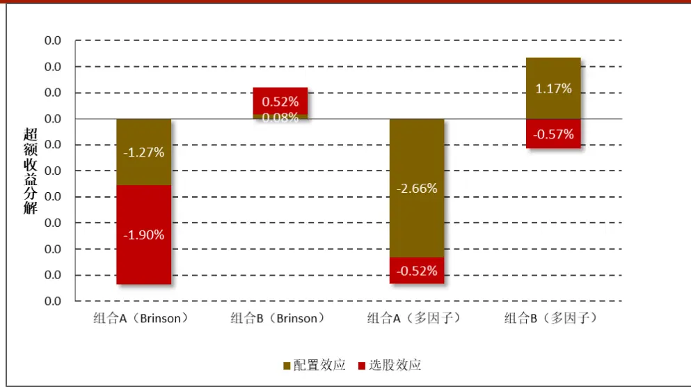
数据来源：财通证券研究所，Wind

图 9 展示了在加入风格因子之后，对两个组合的配置（共同收益）和选股效应（特质收益）的分解。在仅包含行业因子的分解中，组合 A 的配置收益和选股收益分别为-1.27%和-1.90%，在加入风格因子后，组合 A的配置收益和选股收益达到-2.66%和-0.52%，也就是说组合 A存在明显的风格错配。在仅包含行业因子的分解中，组合 B的配置收益和选股收益分别为 0.08%和 0.52%，在加入风格因子后，其配置收益和选股收益变为 1.17%和-0.57%，也就是说组合 B在风格配置上的操作较为成功。

下面我们探究为何组合 B在风格因子的配置上更为成功。图 10 展示了两个组合在 10 个风格因子上相对基准的暴露程度，可以看到组合 A 在非线性规模、杠杆因子、BP 因子和盈利因子上存在明显的超配，而在规模和动量因子上有着明显的低配。组合 B则更多地配置于流动性因子和 Beta 因子，在规模因子上的配置也存在低配，但其低配程度没有组合 A那么明显。

图 10：组合A、B在各风格因子上相对基准的暴露度
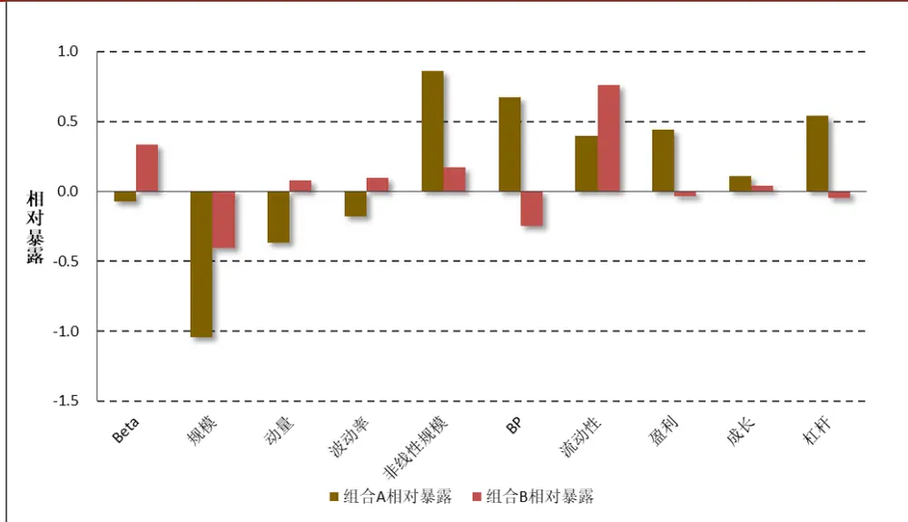
数据来源：财通证券研究所，Wind

图 11 展示了两个组合在各个风格因子上的收益情况，它等于组合在风格因子上的主动暴露度与风格因子收益的乘积。可以看到，在回测区间 Beta 因子、规模因子和动量因子的收益显著为正，组合 A 由于其在规模因子上的低配导致其必须承担较大的损失，而组合 B 在规模因子上的暴露相较组合 A 而言没有那么极端，因而其损失较小，且该损失能够被组合 B在 Beta 因子上的正向暴露基本抹平。

图 11：组合A、B在各风格因子上的收益
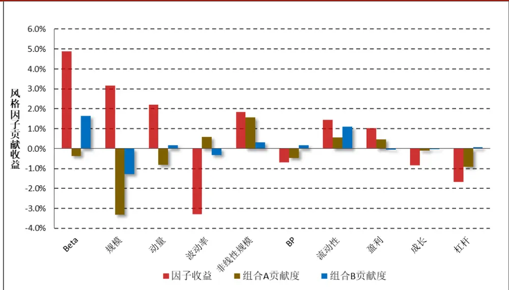
数据来源：财通证券研究所，Wind

图 12 展示了基于 Brinson 模型和基于扩展多因子模型对组合 A的超额收益在各个行业上的分解，可以看到二者之间还是存在明显不同的，这主要是由于行业因子所包含的内容不同。通常来讲，每个行业并不是风格中性的，它们都有自己的风格偏好，如银行业通常包含大市值、高 BP 的股票，而计算机行业通常是低 BP、高成长的股票，基于扩展多因子模型的行业收益即是指在剔除了这些风格因子的影响之后，组合在这些纯行业因子上进行配置能够获得的超额收益。可以看到，在 Brinson模型中，组合 A 在非银金融行业的配置收益明显为负，但是在剔除风格因子影响后其配置效应显著为正。究其原因，我们认为是非银金融行业本身对于风格因子上存在明显的风格偏离导致的。

图 12：基于Brinson模型和扩展多因子模型的组合 A配置收益对比
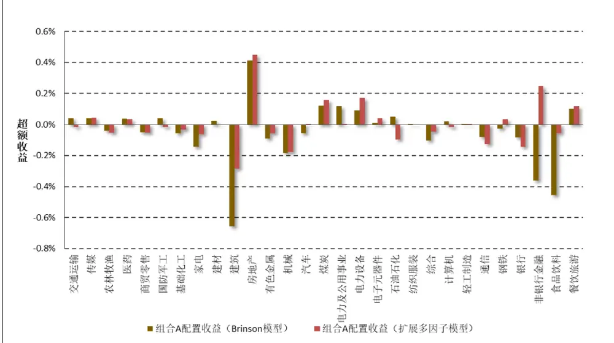
数据来源：财通证券研究所,Wind

图 13 展示了非银金融行业在各个风格因子上的暴露，结合表 8 可以看到，该行业在 Beta 因子上具有非常高的暴露，由于 Beta 因子在当期收益显著为正，因此对非银金融行业的超配是能够获得较高超额收益的。但是组合 A 在非银行业相对基准存在明显的低配（-11.77%），因此这就导致了在没有剥离风格影响的Brinson 模型归因中，该组合对非银金融行业的配置收益为明显的负值。

图 13：非银金融行业在各个风格因子上的暴露
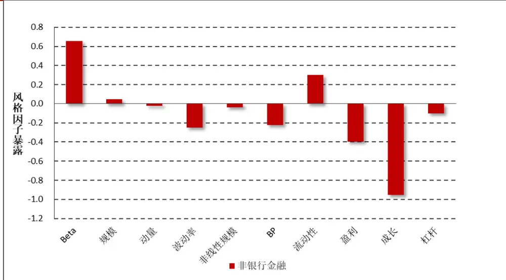
数据来源：财通证券研究所，Wind

## 3.4 基于 Brinson 和 Barra 模型的收益归因小结

到目前为止，本文对投资组合收益归因部分的讨论就告一个段落。回顾前文，我们从经典版 BHB 模型出发将组合超额收益分解为配置收益、选择收益和交互收益三个部分，针对 BHB 模型存在的诸多不足，我们引入行业基准收益并将选择收益和交互收益进行合并，介绍了改进版的 模型。

在多因子模型收益归因部分，我们从简单行业因子的推导出发，介绍了基于行业因子的多因子收益归因与自下而上推导的 Brinson 模型的等同性，并在此基础上引入风格因子，将收益归因不再局限于行业分类，而是可以反映组合在风格上的偏好，这样的改进与投资经理的实际操作更为贴合，在实际投资中更具指导意义。

## 4、 基于多因子模型的组合风险归因

从风险模块着手，对多因子模型进行构建和完善是财通金工多因子框架中最为特色的研究，对投资组合的风险进行归因是本报告的最大亮点。从本节开始，我们着手对组合的风险进行归因，从理论和实证层面出发对单一波动分解法、边际风险分解法和波动率的三要素方法进行介绍和比较。

在对风险进行归因之前，我们先来明晰一下风险的定义。假设投资组合的收益率可以被分解为不同的因子暴露与因子收益的乘积之和：

$$
R=\sum_{k}x_{k}r_{k}=X^{\prime}r
$$

其中 表示组合的收益率， $x_{k}$ 表示组合在因子 上的暴露度， $r_{k}$ 表示因子在当期的收益率，X 是因子暴露的向量形式（K×1），r为因子收益的向量形式（K×1），那么该组合的风险即可用组合收益率的标准差进行衡量：

$$
\begin{array}{r}{\sigma(R)=\sigma(X^{\prime}r)=\sqrt{X^{\prime}\Sigma X}}\end{array}
$$

其中，Σ为股票收益率的协方差矩阵，财通金工“星火”多因子系列二《Barra模型进阶：多因子风险预测》的所有工作即是对其进行稳健估计。

## 4.1 单一波动分解法

单一波动分解法，是将每个因子进行单独考虑，计算其对组合整体风险贡献度的方法。对于因子k 而言，它对组合的收益贡献为 $x_{k}r_{k}$ ，那么在单一波动分解法中，它对组合的风险贡献就是 $\sigma(x_{k}r_{k})$ o

单一波动分解法将每个因子看成完全独立的板块，在计算上十分简单，但是它没有考虑到因子与因子之间的相关影响，因此单个因子风险贡献度的加总并不等于整个投资组合的风险，也就是说它不具备可加性。

$$
\sigma(R)\neq\sum_{k}\sigma(x_{k}r_{k})
$$

因此，基于单一波动分解的方法对组合风险分解存在一定的错漏，并不能够捕捉到投资组合的所有风险

## 4.2 边际风险分解法

边际风险分解法是将组合风险分解为因子暴露度与因子边际风险贡献的乘积得到的。由于标准差函数是线性齐次函数，即对于任意的常数 c≥0，有：

$$
\sigma(cX)=\sqrt{(cX)^{\prime}\Sigma(cX)}=c\sqrt{X^{\prime}\Sigma X}=c\sigma(x)
$$

那么根据欧拉定理，就可以将其分解为单个因子边际贡献度与因子权重的乘积。具体来讲，记风险函数对因子权重的一阶偏导为边际风险贡献 MCR（MarginalContribution to Risk）：

$$
MCR_{k}=\frac{\partial\sigma(R)}{\partial x_{k}}
$$

它衡量的是组合每增加 1 单位的暴露对整个组合风险的贡献度，那么根据欧拉定理，即可进行如下分解：

$$
\sigma(R)=\sum_{k}x_{k}{\frac{\partial\sigma(R)}{\partial x_{k}}}=\sum_{k}x_{k}MCR_{k}=\sum_{k}CR_{k}
$$

其中， $CR_{k}$ 表示因子 k 对组合风险的风险贡献度（Contribution to Risk），那么因子 k 对组合的风险贡献比例 PCR（Percentage Contribution to Risk）即可表示为：

$$
PCR_{k}={\frac{CR_{k}}{\sum_{k}CR_{k}}}={\frac{CR_{k}}{\sigma(R)}}
$$

在多因子模型风险预测中，我们将股票协方差矩阵拆分为共同风险矩阵F 和特质风险矩阵Δ两个部分：

$$
V=XFX^{\prime}+\Delta
$$

其中X表示所有股票的因子暴露矩阵（N×K），那么组合的风险即可表示为：

$$
\sigma(R)=\sqrt{w^{\prime}VW}=\sqrt{w^{\prime}(XFX^{\prime}+\Delta)w}=\sqrt{(X^{P})^{\prime}FX^{P}+w^{\prime}\Delta w}
$$

其中， $X^{P}$ 组合在所有因子上的暴露度，它是一个 $K\times1$ 向量。共同风险可以表示为 $(X^{P})^{\prime}FX^{P}$ ，特质风险可以表示为 $w^{\prime}\Delta w$ ，我们通常只对共同风险部分进行拆解，那么因子 k 对共同风险的贡献比例就可被表示为：

$$
PCR_{k}=\frac{X_{i}^{P}\left(FX^{P}\right)_{k}}{(X^{P})^{\prime}FX^{P}}
$$

## 4.3 波动率的三要素法：x-sigma-rho

在 Alpha 策略的研究中，我们有众所周知的α三要素：因子波动、因子IC 和因子得分：

$$
\sigma=Volatility\times IC\times Score
$$

与α的三要素类似，Menchero（2010）提出了σ的三要素：因子暴露（x）、因子波动（sigma）和因子-组合的相关系数（rho）。与边际风险分解法相比，波动率的三要素分解法更加深入地探讨了因子对组合风险的边际贡献度，更有利于投资经理对风险进行控制。

$$
\sigma=x\times sigma\times rho
$$

对波动的三要素分解法的推导十分简单，它实际上只用到了协方差的计算公式而已：

$$
{\begin{array}{c}{\displaystyle{R=\sum_{k}x_{k}r_{k}}}\\{{\boldsymbol{var}(R)=cov{(R,R)}=\sum_{k}cov{(x_{k}r_{k},R)}=\sum_{k}x_{k}cov{(r_{k},R)}}}\\{\displaystyle{\sigma{(R)}\sigma{(R)}=\sum_{k}x_{k}\sigma{(r_{k})}\sigma{(R)}\rho{(r_{k},R)}}}\end{array}}
$$

上式实际上是将协方差的计算公式拆解为相关系数与标准差的乘积而 $\sqsubset$ ，将两边同时除以收益标准差，即有：

$$
\sigma^{\aa}(R)=\sum_{k}x_{k}\sigma(r_{k})\rho(r_{k},R)
$$

其中， $x_{k}\notin\#\pi\sigma(r_{k})$ 相对更容易理解， $x_{k}$ 是指组合在因子k 上的暴露大小（x），在给定组合权重之后即可对其进行计算。 $\sigma(\boldsymbol{r}_{k})$ 是指因子k 的波动率（sigma），我们以因子的日度收益标准差对其进行衡量。

图 14：三要素分解法与单一波动分解和边际风险分解法相通性

$\rho(\boldsymbol{r}_{k},R)$ 在理解上则稍有难度，它是指单个因子的收益与资产组合收益之间的相关系数，这里的资产组合收益是指与当前组合具有相同因子暴露的组合在历史样本期间的收益情况。但是，即便对于不做任何调仓的指数组合而言，它在历史样本期内在每个风格因子上的暴露都是不断变化的，因此我们这里计算出来的资产组合收益率实际上是一个模拟收益率。

值得注意的是，风险的三要素分解法与单一波动分解法和边际风险分解法具有共通性。如图 14 所示，因子暴露（x）与因子波动（sigma）的乘积即为单一风险分解中单个因子对风险的贡献，因子波动（sigma）与因子-组合相关系数（rho）的乘积即为边际风险分解法中单个因子的边际风险贡献度（MCR）。在下一小节的实证部分，我们会看到二者之间是非常类似的。

$$
\sigma(r_{k})\rho(r_{k},R)=MCR_{k}=\frac{\partial\sigma(R)}{\partial x_{k}}
$$

$$
\begin{array}{l}{{\displaystyle\sigma(R)=\sum_{k}^{1}\jmath_{k}^{--\ --\ -\gamma}}{\displaystyle\sum_{k}^{1}\jmath_{k}\sigma(r_{k})\overset{1}{\ p}(r_{k},R)}}\\{{\displaystyle\qquad\prod_{k=\frac{1}{2}}^{-\ -\ -\gamma}}{\displaystyle\sum_{k=\frac{1}{2}}^{1}\jmath_{k}^{-\ -\gamma}}{\displaystyle\sum_{k=\frac{1}{2}}^{1}\jmath_{k}^{-\gamma}}}\\{{\displaystyle\qquad\ncong-\mathcal{K}\cup\underset{k=1}{\underbrace{|\mathbb{K}\circ\mathbb{S}\cap\mathbb{R}\mathscr{S}\cap\mathbb{R}\mathscr{S}\cap\mathbb{R}\mathscr{L}}}}}\end{array}
$$

$$
\sigma(R)=\sum_{k}x_{k}^{{\mathrm{~i~}}^{-}}\sigma(r_{k})\rho(r_{k},R)\mathbf{\phi}_{\mathrm{i}}^{{\mathrm{~i~}}}
$$

数据来源：财通证券研究所

## 4.4 组合风险归因实证检验

本部分从实证角度出发，对组合 A 和组合 B 的风险进行分解，主要对边际风险分解和三要素分解法的一些细节进行说明，其完整版结果如表 和表 所示。与之前类似，我们将股票收益分解到市场收益、行业收益、风格收益和特质收益四个部分。由于本报告中讨论的两只基金均为指数增强型基金，因此我们在计算风险时计算的是资产组合对基准指数的相对偏离所带来的风险，也就是组合相对于基准的跟踪误差。在本报告中，我们对组合未来一个月（ 天）的跟踪误差进行预测和分解。由表 10 和表 11 可以看到，组合 A在未来一个月的预计跟踪误差为 ，组合 在未来一个月的预计跟踪误差为 。结合前面提到组合 A 相对于基准来讲存在更多行业和风格上的偏离，因此其跟踪误差更大的结论也是十分合理的。

在边际风险分解法中，我们的协方差矩阵来源于多因子模型计算得到的协方差矩阵 V，它的具体介绍可以参见“星火”系列的第二篇报告。与业绩归因部分仅对基准指数的成分股进行回归不同，此处的协方差矩阵我们用的是全市场股票的协方差矩阵。在三要素分解法中，因子的标准差是根据风格因子过去 252 天的日度收益标准差进行月度化求得的，当然这里我们也可以考虑直接采用协方差矩阵 V的对角矩阵取平方根，我们在实证中发现二者也是非常相关的。在计算因子收益与组合收益的相关性时，我们生成一个模拟组合在过去 252天的日度收益，该组合在任意一个时刻的风格暴露与当前组合的风格暴露保持一致。

需要说明的是，由于我们在估计协方差矩阵V的时候，对其进行了多步调整，因此最后估计得到的结果 V并不等同于股票收益的简单协方差矩阵，因此 MCR与 sigma×rho 之间并不是完全相等的。图 15 对组合 A的风险进行分解，并比对了基于边际风险分解法计算得到的因子风险贡献（对应表 10 中的 CR 列）与基于三要素分解法计算得到的因子风险贡献（对应表 10 中的 RC 列）之间的区别，可以看到二者之间是非常相似的，其相关系数达到 95%。

图15：基于边际风险分解法与三要素法的因子风险贡献对比
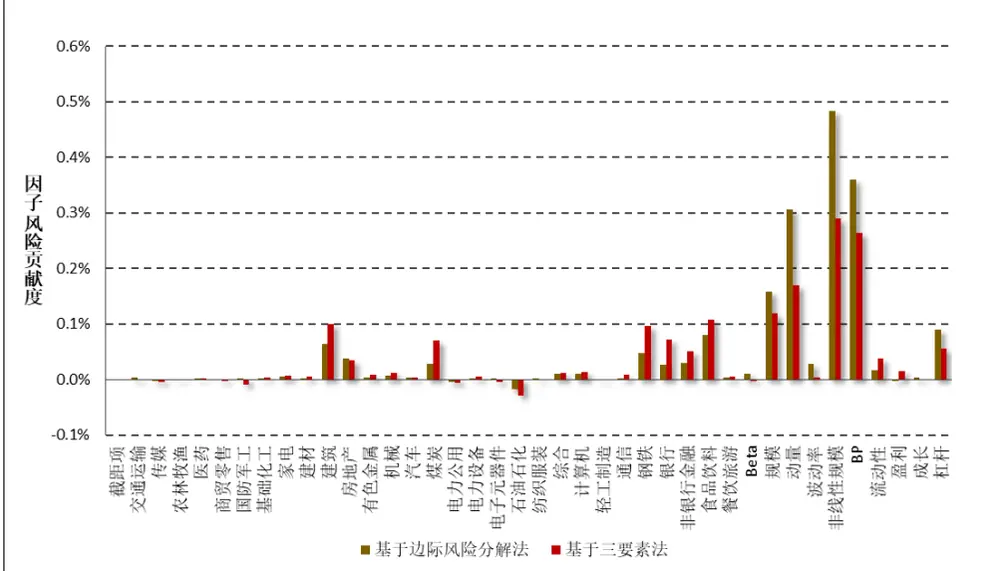
数据来源：财通证券研究所，Wind

图 16 展示了两个组合在各类因子上的风险贡献比例（PCR），可以看到，组合 A在非线性规模、BP 因子、动量因子和规模因子上的风险贡献百分比较高。具体分析我们可以发现，组合在非线性规模和 BP 因子上的暴露较大，主要是因为它在这两个因子上相对暴露较多（分别为 1.17 和 0.83），而在动量因子和规模因子上的较高暴露，主要是由于这两个因子本身的暴露较高造成的。从这一点也可以看到，对风险进行三要素分解法，可以更加清楚地看出组合的风险来源到底是因为对因子有过高的暴露，还是因子本身就有很高的波动，还是因子本身与组合存在强烈的相关关系。

图16：组合在各类因子上的风险贡献比例
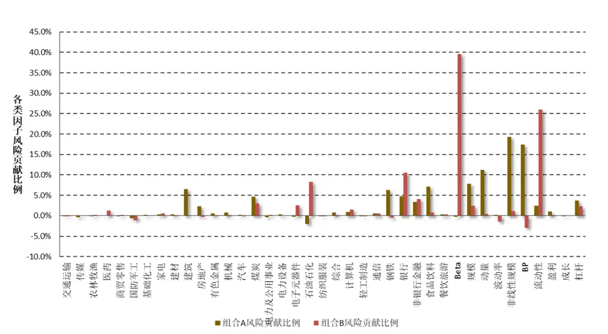
数据来源：财通证券研究所，Wind

表9：组合A风险贡献百分比较高的因子风险分解

| 行业名称 | X | sigma | rho | PCR |
| --- | --- | --- | --- | --- |
| 非线性规模 | 1.17 | 0.55% | 45.44% | 19.28% |
| 动量 | -0.37 | 1.02% | -44.66% | 11.23% |
| BP | 0.83 | 0.60% | 52.59% | 17.49% |
| 规模 | -0.31 | 1.04% | -36.96% | 7.87% |

数据来源：财通证券研究所，Wind

## 5、 小结与展望

作为财通金工“星火”多因子系列的第四篇专题，本文对财通金工多因子风险系统的最后一块拼图——组合绩效归因模块进行完善。

本文首先对经典版 模型和改进版 模型进行介绍，并从实证层面出发对两只指数增强型基金的超额收益进行分解。随后我们从多因子模型的角度出发，探讨了仅含行业的多因子模型与 Brinson 模型的等同性，并基于此加入风格因子，形成扩展版的多因子收益归因模型。基于扩展版多因子模型的收益归因能够对行业和风格同时进行归因，从而为投资经理的实际操作提供更为直观的操作建议。

从风险模块着手，对多因子模型进行构建和完善是财通金工多因子框架中最为特色的研究，对投资组合的风险进行归因是本报告的最大亮点。本文从理论和实证层面出发，对单一波动分解法、边际风险分解法和 x-sigma-rho 三要素分解法进行了介绍和比较。实证结果表明，基于三要素的风险分解法能够对收益进行更为细致的拆解，更加贴近投资经理在组合构建过程中的实际操作。

到目前为止，财通金工对多因子风险模型的研究框架基本较为完善，关于更多细节方面的探讨可以参见我们“星火”系列的衍生报告 “拾穗”多因子系列报告。在本文的开头我们提到，如果将投资组合比作是投资者的武器，那么组合的净值曲线无疑就是投资者的生命线。如果说对风险的控制能够帮助投资者走得更“稳”，那么对收益端的增强则能够帮助投资者走得更“好”。在财通金工的后续研究中，我们将把精力和目光更多地转向 Alpha 因子的研究，为组合的收益增光添彩，欢迎感兴趣的投资者持续关注！

## 6、 细节探讨

## 6.1 基于多因子模型的收益归因中，回归的样本股如何选择？

在基于多因子模型的收益归因中，当通过回归方法对市场因子、行业因子和风格因子进行估计时，就涉及到样本股的选择。我们采用的回归样本股是基准指数的成分股，主要原因在于我们必须保证基准指数在所有风格因子上的暴露要严格地等于 0，这样回归的截距项才会与市场基准指数的收益相等，回归得到的行业因子收益与根据 模型计算得到的行业收益才会对等。

特别需要注意的是，当资产组合总包含基准指数中没有的成分股时，对资产组合中的股票进行因子标准化就需要多费一些心思。为了保证所有股票的因子是在同一个标准下进行标准化的，我们需要将投资组合中所有成分股的因子值减去基准指数成分股因子值的市值加权平均，再除以基准指数成分股因子值的简单标准差。

## 6.2 基于多因子模型的风险归因中，为何基准指数的风格暴露不为0？

由表 10 和表 11 可以看到，在基于多因子模型的风险归因中，基准指数在各类风格因子上的暴露并不等于 0，这与上一小节提到的完全不同。主要的原因在于，我们在进行风险归因的时候，采用的协方差矩阵是基于全市场回归计算得到的协方差矩阵，而非基于基准指数样本股回归得到的协方差矩阵。

这样处理的主要原因有两个：第一，资产组合中可能包含基准指数成分股之外的股票，如果仅对基准指数样本股回归得到协方差矩阵，那么很容易忽略掉这些样本股之外的股票对风险的影响；第二，协方差矩阵的估计是一个相对耗时的操作，如果每更换一个基准就进行一次估计，这样做的时间成本和维护成本就是非常大的。

## 6.3 Brinson 模型中主动收益和多因子模型中组合残差收益是完全对等的吗？

在我们前文的介绍中，我们提到基于 模型的收益归因和基于简单行业因子的收益归因是完全等同的，其中两个模型的各个条目的等同性我们在表中进行了介绍。然而对比表 和表 我们发现，表 中的“主动收益”和表4 中的“资产组合残差收益”并不完全对等，例如在传媒行业，前者为-1.75%，后者为 0.00%。这其中的原因在于，组合 A并未在传媒行业进行任何配置，而基准指数在传媒行业进行了配置。因此通过 Brinson 模型计算得到的该项是不为 0的，但是基于多因子模型计算得到的是严格等于 0 的。尽管如此，这并不会为最终的结果有任何影响，因为组合在该行业上的选股效应是等于组合权重与主动收益（或残差收益）的乘积，既然组合权重等于 0 了，那么最终得到的选股效应二者都是等于 0，也就是完全对等的了。

## 7、 风险提示

多因子模型拟合均基于历史数据，市场风格的变化将可能导致模型失效。

## 参考文献：

[1] “Beyond Brinson: Establishing the Link Between Sector and Factor Models”，Ben Davis and Jose Menchero. MSCI Barra Research. 2010

[2] “Risk Contribution is Esposure times Volatility times Correlation”, Ben Davis and Jose Menchero. MSCI Barra Research. 2010

[3] “Determinants of portfolio performance”, Brinson G., Hood R. and Beebower G. Financial Analyst Journal [J], 1986

[4] “Measuring non-US equity portfolio performance”, Brinson G, Fachler N. Journal of Portfolio Management [J], 1985

表 10：基金组合 A 风险分解

| 行业代码 | 行业名称 | 资产组合暴露 | 基准暴露 | 相对暴露 | MCR | CR | PCR | X | sigma | rho | RC |
| --- | --- | --- | --- | --- | --- | --- | --- | --- | --- | --- | --- |
| 0 | 现金 | 100% | 100% | 0.00% | -0.42% | 0.00% | 0.00% | 0.00% | 5.78% | -3.75% | 0.00% |
| 1 | 交通运输 | 1.50% | 3.37% | -1.87% | -0.22% | 0.00% | 0.24% | -1.87% | 1.72% | 1.30% | 0.00% |
| 2 | 传媒 | 0.00% | 0.98% | -0.98% | 0.28% | 0.00% | -0.15% | -0.98% | 2.52% | 18.89% | 0.00% |
| 3 | 农林牧渔 | 0.00% | 0.56% | -0.56% | 0.19% | 0.00% | -0.06% | -0.56% | 3.06% | 2.64% | 0.00% |
| 4 | 医药 | 4.53% | 4.89% | -0.36% | -0.23% | 0.00% | 0.05% | -0.36% | 3.38% | -16.96% | 0.00% |
| 5 | 商贸零售 | 3.02% | 0.66% | 2.36% | -0.10% | 0.00% | -0.13% | 2.36% | 1.88% | -6.05% | 0.00% |
| 6 | 国防军工 | 0.00% | 1.30% | -1.30% | -0.01% | 0.00% | 0.01% | -1.30% | 4.57% | 15.46% | -0.01% |
| 7 | 基础化工 | 1.68% | 1.01% | 0.67% | 0.28% | 0.00% | 0.11% | 0.67% | 1.49% | 33.21% | 0.00% |
| 8 | 家电 | 1.56% | 2.96% | -1.40% | -0.39% | 0.01% | 0.30% | -1.40% | 2.68% | -15.81% | 0.01% |
| 9 | 建材 | 1.50% | 0.99% | 0.51% | 0.26% | 0.00% | 0.07% | 0.51% | 2.82% | 32.25% | 0.00% |
| 10 | 建筑 | 14.22% | 3.97% | 10.25% | 0.62% | 0.06% | 3.56% | 10.25% | 2.37% | 40.89% | 0.10% |
| 11 | 房地产 | 11.55% | 3.85% | 7.70% | 0.49% | 0.04% | 2.09% | 7.70% | 2.90% | 15.43% | 0.03% |
| 12 | 有色金属 | 3.08% | 2.06% | 1.02% | 0.35% | 0.00% | 0.20% | 1.02% | 3.16% | 27.43% | 0.01% |
| 13 | 机械 | 4.72% | 1.69% | 3.03% | 0.21% | 0.01% | 0.36% | 3.03% | 1.24% | 30.26% | 0.01% |
| 14 | 汽车 | 4.79% | 3.24% | 1.55% | 0.21% | 0.00% | 0.19% | 1.55% | 1.71% | 14.77% | 0.00% |
| 15 | 煤炭 | 6.04% | 2.20% | 3.84% | 0.73% | 0.03% | 1.56% | 3.84% | 4.92% | 37.50% | 0.07% |
| 16 | 电力公用 | 1.62% | 3.12% | -1.50% | 0.31% | 0.00% | -0.26% | -1.50% | 1.80% | 21.07% | -0.01% |
| 17 | 电力设备 | 3.06% | 1.12% | 1.94% | 0.04% | 0.00% | 0.05% | 1.94% | 1.66% | 14.89% | 0.00% |
| 18 | 电子元器件 | 1.48% | 2.85% | -1.37% | -0.13% | 0.00% | 0.10% | -1.37% | 2.93% | 9.99% | 0.00% |
| 19 | 石油石化 | 2.98% | 8.51% | -5.53% | 0.33% | -0.02% | -1.02% | -5.53% | 3.73% | 14.36% | -0.03% |
| 20 | 纺织服装 | 0.02% | 0.18% | -0.16% | -0.07% | 0.00% | 0.01% | -0.16% | 1.88% | 2.27% | 0.00% |
| 21 | 综合 | 1.65% | 0.29% | 1.36% | 0.70% | 0.01% | 0.53% | 1.36% | 2.29% | 38.09% | 0.01% |
| 22 | 计算机 | 3.02% | 1.02% | 2.00% | 0.48% | 0.01% | 0.54% | 2.00% | 4.19% | 16.20% | 0.01% |
| 23 | 轻工制造 | 0.02% | 0.08% | -0.06% | 0.08% | 0.00% | 0.00% | -0.06% | 1.68% | 12.40% | 0.00% |
| 24 | 通信 | 3.17% | 1.44% | 1.73% | 0.15% | 0.00% | 0.14% | 1.73% | 3.79% | 12.33% | 0.01% |
| 25 | 钢铁 | 6.12% | 1.22% | 4.89% | 0.98% | 0.05% | 2.67% | 4.89% | 4.47% | 43.72% | 0.10% |
| 26 | 银行 | 18.60% | 26.76% | -8.15% | -0.33% | 0.03% | 1.50% | -8.15% | 3.27% | -27.10% | 0.07% |
| 27 | 非银金融 | 0.02% | 11.81% | -11.80% | -0.25% | 0.03% | 1.68% | -11.80% | 3.48% | -12.51% | 0.05% |
| 28 | 食品饮料 | 0.04% | 7.19% | -7.15% | -1.13% | 0.08% | 4.49% | -7.15% | 4.12% | -36.51% | 0.11% |
| 29 | 餐饮旅游 | 0.00% | 0.66% | -0.66% | -0.55% | 0.00% | 0.20% | -0.66% | 3.46% | -23.56% | 0.01% |
| 1 | Beta | -0.30 | -0.21 | -0.09 | -0.10% | 0.01% | 0.51% | -9.10% | 1.43% | 3.00% | 0.00% |
| 2 | 规模 | 0.50 | 0.81 | -0.31 | -0.51% | 0.16% | 8.81% | -30.78% | 1.04% | -36.96% | 0.12% |
| 3 | 动量 | -0.08 | 0.29 | -0.37 | -0.82% | 0.31% | 17.13% | -37.20% | 1.02% | -44.66% | 0.17% |
| 4 | 波动率 | -0.30 | -0.08 | -0.22 | -0.12% | 0.03% | 1.53% | -22.10% | 0.89% | -1.32% | 0.00% |
| 5 | 非线性规模 | 0.10 | -1.06 | 1.17 | 0.41% | 0.48% | 27.02% | 116.89% | 0.55% | 45.44% | 0.29% |
| 6 | BP | 1.04 | 0.21 | 0.83 | 0.43% | 0.36% | 20.08% | 82.92% | 0.60% | 52.59% | 0.26% |
| 7 | 流动性 | 0.07 | -0.21 | 0.28 | 0.06% | 0.02% | 0.90% | 27.95% | 0.67% | 19.91% | 0.04% |
| 8 | 盈利 | 0.85 | 0.39 | 0.46 | -0.01% | 0.00% | -0.15% | 46.40% | 0.56% | 5.97% | 0.02% |
| 9 | 成长 | 0.09 | -0.02 | 0.11 | 0.03% | 0.00% | 0.17% | 11.04% | 0.31% | -6.35% | 0.00% |
| 10 | 杠杆 | 0.66 | 0.12 | 0.54 | 0.17% | 0.09% | 4.98% | 53.85% | 0.37% | 28.41% | 0.06% |
| 汇总 |  |  |  |  |  | 1.79% | 100% |  |  |  | 1.50% |

数据来源：财通证券研究所，Wind

表 11：基金组合 B 风险分解

| 行业代码 | 行业名称 | 资产组合暴露 | 基准暴露 | 相对暴露 | MCR | CR | PCR | X | sigma | rho | RC |
| --- | --- | --- | --- | --- | --- | --- | --- | --- | --- | --- | --- |
| 0 | 现金 | 100% | 100.0% | 0.00% | 2.47% | 0.00% | 0.00% | 0.00% | 5.78% | 64.04% | 0.00% |
| 1 | 交通运输 | 2.84% | 3.37% | -0.53% | 0.22% | 0.00% | -0.11% | -0.53% | 1.72% | 1.21% | 0.00% |
| 2 | 传媒 | 1.11% | 0.98% | 0.13% | 0.14% | 0.00% | 0.02% | 0.13% | 2.52% | 24.26% | 0.00% |
| 3 | 农林牧渔 | 0.18% | 0.56% | -0.38% | -0.14% | 0.00% | 0.05% | -0.38% | 3.06% | -20.25% | 0.00% |
| 4 | 医药 | 6.23% | 4.89% | 1.35% | 0.48% | 0.01% | 0.57% | 1.35% | 3.38% | 29.41% | 0.01% |
| 5 | 商贸零售 | 1.57% | 0.66% | 0.91% | 0.09% | 0.00% | 0.07% | 0.91% | 1.88% | 15.77% | 0.00% |
| 6 | 国防军工 | 0.32% | 1.30% | -0.98% | 0.29% | 0.00% | -0.25% | -0.98% | 4.57% | 23.44% | -0.01% |
| 7 | 基础化工 | 2.22% | 1.01% | 1.21% | 0.05% | 0.00% | 0.06% | 1.21% | 1.49% | 2.78% | 0.00% |
| 8 | 家电 | 4.49% | 2.96% | 1.52% | 0.20% | 0.00% | 0.27% | 1.52% | 2.68% | 13.33% | 0.01% |
| 9 | 建材 | 1.52% | 0.99% | 0.53% | -0.14% | 0.00% | -0.07% | 0.53% | 2.82% | -8.48% | 0.00% |
| 10 | 建筑 | 3.50% | 3.97% | -0.47% | -0.12% | 0.00% | 0.05% | -0.47% | 2.37% | -0.31% | 0.00% |
| 11 | 房地产 | 5.26% | 3.85% | 1.42% | 0.10% | 0.00% | 0.13% | 1.42% | 2.90% | -4.86% | 0.00% |
| 12 | 有色金属 | 2.10% | 2.06% | 0.04% | -0.29% | 0.00% | -0.01% | 0.04% | 3.16% | -17.39% | 0.00% |
| 13 | 机械 | 1.25% | 1.69% | -0.44% | 0.06% | 0.00% | -0.02% | -0.44% | 1.24% | 31.39% | 0.00% |
| 14 | 汽车 | 3.18% | 3.24% | -0.06% | 0.14% | 0.00% | -0.01% | -0.06% | 1.71% | 19.00% | 0.00% |
| 15 | 煤炭 | 0.59% | 2.20% | -1.61% | -1.47% | 0.02% | 2.11% | -1.61% | 4.92% | -38.30% | 0.03% |
| 16 | 电力公用 | 4.43% | 3.12% | 1.32% | 0.23% | 0.00% | 0.27% | 1.32% | 1.80% | 11.60% | 0.00% |
| 17 | 电力设备 | 1.13% | 1.12% | 0.01% | 0.12% | 0.00% | 0.00% | 0.01% | 1.66% | 15.08% | 0.00% |
| 18 | 电子元器件 | 4.82% | 2.85% | 1.97% | 0.67% | 0.01% | 1.18% | 1.97% | 2.93% | 45.40% | 0.03% |
| 19 | 石油石化 | 1.89% | 8.51% | -6.62% | -1.12% | 0.07% | 6.61% | -6.62% | 3.73% | -33.72% | 0.08% |
| 20 | 纺织服装 | 0.00% | 0.18% | -0.18% | 0.16% | 0.00% | -0.03% | -0.18% | 1.88% | 4.64% | 0.00% |
| 21 | 综合 | 0.00% | 0.29% | -0.29% | 0.06% | 0.00% | -0.02% | -0.29% | 2.29% | 5.99% | 0.00% |
| 22 | 计算机 | 2.06% | 1.02% | 1.05% | 0.66% | 0.01% | 0.61% | 1.05% | 4.19% | 35.56% | 0.02% |
| 23 | 轻工制造 | 0.00% | 0.08% | -0.08% | 0.31% | 0.00% | -0.02% | -0.08% | 1.68% | 19.02% | 0.00% |
| 24 | 通信 | 1.91% | 1.44% | 0.47% | 0.43% | 0.00% | 0.18% | 0.47% | 3.79% | 35.03% | 0.01% |
| 25 | 钢铁 | 1.68% | 1.22% | 0.46% | -0.89% | 0.00% | -0.36% | 0.46% | 4.47% | -23.72% | 0.00% |
| 26 | 银行 | 19.08% | 26.76% | -7.68% | -0.68% | 0.05% | 4.62% | -7.68% | 3.27% | -42.35% | 0.11% |
| 27 | 非银金融 | 16.82% | 11.81% | 5.00% | 0.90% | 0.04% | 4.00% | 5.00% | 3.48% | 23.46% | 0.04% |
| 28 | 食品饮料 | 8.63% | 7.19% | 1.43% | 0.37% | 0.01% | 0.48% | 1.43% | 4.12% | 14.30% | 0.01% |
| 29 | 餐饮旅游 | 1.18% | 0.66% | 0.51% | 0.54% | 0.00% | 0.24% | 0.51% | 3.46% | 20.66% | 0.00% |
| 1 | Beta | 0.16 | -0.21 | 0.37 | 0.85% | 0.32% | 28.32% | 37.24% | 1.43% | 74.71% | 0.40% |
| 2 | 规模 | 0.71 | 0.81 | -0.11 | -0.26% | 0.03% | 2.47% | -10.68% | 1.04% | -21.64% | 0.02% |
| 3 | 动量 | 0.39 | 0.29 | 0.09 | 0.22% | 0.02% | 1.85% | 9.46% | 1.02% | 4.61% | 0.00% |
| 4 | 波动率 | -0.14 | -0.08 | -0.06 | 0.07% | 0.00% | -0.35% | -6.07% | 0.89% | 25.80% | -0.01% |
| 5 | 非线性规模 | -0.88 | -1.06 | 0.18 | 0.06% | 0.01% | 0.95% | 18.26% | 0.55% | 11.35% | 0.01% |
| 6 | BP | -0.12 | 0.21 | -0.32 | -0.16% | 0.05% | 4.64% | -32.16% | 0.60% | 15.52% | -0.03% |
| 7 | 流动性 | 0.50 | -0.21 | 0.70 | 0.63% | 0.44% | 39.40% | 70.50% | 0.67% | 55.31% | 0.26% |
| 8 | 盈利 | 0.34 | 0.39 | -0.05 | 0.03% | 0.00% | -0.13% | -5.27% | 0.56% | 5.61% | 0.00% |
| 9 | 成长 | 0.00 | -0.02 | 0.02 | -0.02% | 0.00% | -0.03% | 2.25% | 0.31% | 19.49% | 0.00% |
| 10 | 杠杆 | -0.01 | 0.12 | -0.13 | -0.20% | 0.03% | 2.27% | -12.65% | 0.37% | -51.00% | 0.02% |
| 汇总 |  |  |  |  |  | 1.12% | 100.% |  |  |  | 1.01% |

数据来源：财通证券研究所，Wind

## 信息披露

## 分析师承诺

作者具有中国证券业协会授予的证券投资咨询执业资格，并注册为证券分析师，具备专业胜任能力，保证报告所采用的数据均来自合规渠道，分析逻辑基于作者的职业理解。本报告清晰地反映了作者的研究观点，力求独立、客观和公正，结论不受任何第三方的授意或影响，作者也不会因本报告中的具体推荐意见或观点而直接或间接收到任何形式的补偿。

## 资质声明

财通证券股份有限公司具备中国证券监督管理委员会许可的证券投资咨询业务资格。

## 公司评级

买入：我们预计未来 6个月内，个股相对大盘涨幅在 15%以上；

增持：我们预计未来 6个月内，个股相对大盘涨幅介于 5%与 15%之间；

中性：我们预计未来 6个月内，个股相对大盘涨幅介于-5%与 5%之间；

减持：我们预计未来 6个月内，个股相对大盘涨幅介于-5%与-15%之间；

卖出：我们预计未来 6个月内，个股相对大盘涨幅低于-15%。

## 行业评级

增持：我们预计未来 6个月内，行业整体回报高于市场整体水平 5%以上；

中性：我们预计未来 6个月内，行业整体回报介于市场整体水平-5%与 5%之间；

减持：我们预计未来 6个月内，行业整体回报低于市场整体水平-5%以下。

## 免责声明

本报告仅供财通证券股份有限公司的客户使用。本公司不会因接收人收到本报告而视其为本公司的当然客户。

本报告的信息来源于已公开的资料，本公司不保证该等信息的准确性、完整性。本报告所载的资料、工具、意见及推测只提供给客户作参考之用，并非作为或被视为出售或购买证券或其他投资标的邀请或向他人作出邀请。

本报告所载的资料、意见及推测仅反映本公司于发布本报告当日的判断，本报告所指的证券或投资标的价格、价值及投资收入可能会波动。在不同时期，本公司可发出与本报告所载资料、意见及推测不一致的报告。

本公司通过信息隔离墙对可能存在利益冲突的业务部门或关联机构之间的信息流动进行控制。因此，客户应注意，在法律许可的情况下，本公司及其所属关联机构可能会持有报告中提到的公司所发行的证券或期权并进行证券或期权交易，也可能为这些公司提供或者争取提供投资银行、财务顾问或者金融产品等相关服务。在法律许可的情况下，本公司的员工可能担任本报告所提到的公司的董事。

本报告中所指的投资及服务可能不适合个别客户，不构成客户私人咨询建议。在任何情况下，本报告中的信息或所表述的意见均不构成对任何人的投资建议。在任何情况下，本公司不对任何人使用本报告中的任何内容所引致的任何损失负任何责任。

本报告仅作为客户作出投资决策和公司投资顾问为客户提供投资建议的参考。客户应当独立作出投资决策，而基于本报告作出任何投资决定或就本报告要求任何解释前应咨询所在证券机构投资顾问和服务人员的意见；

本报告的版权归本公司所有，未经书面许可，任何机构和个人不得以任何形式翻版、复制、发表或引用，或再次分发给任何其他人，或以任何侵犯本公司版权的其他方式使用。