# 源于动量，超越动量：特质动量因子全解析

2019 年 05 月 21 日

## “星火”多因子专题报告（五）

## 联系信息

陶勤英分析师

SAC 证书编号：S0160517100002021-68592393

taoqy@ctsec.com

张宇研究助理

zhangyu1@ctsec.com 021-68592337 699.42

17621688421

## 相关报告

【1】“星火”多因子系列（一）：《Barra模型初探：A 股市场风格解析》

【2】“星火”多因子系列（二）：《Barra模型进阶：多因子模型风险预测》

【3】“星火”多因子系列（三）：《Barra模型深化：纯因子组合构建》

【5】“拾穗”多因子系列（一）：《带约束的加权最小二乘：一种解析解法》

【6】“拾穗”多因子系列（五）：《数据异常值处理：比较与实践》

【7】“拾穗”多因子系列（六）：《因子缺失值处理：数以多为贵》

【8】“拾穗”多因子系列（七）：《从纯因子组合的角度看待多重共线性》

【9】“拾穗”多因子系列（八）：《非线性规模因子：A 股市场存在中市值效应吗？》

【10】“拾穗”多因子系列（九）：《牛市抢跑者：低 Beta一定低风险吗？》

【11】“拾穗”多因子系列（十）：《行业的风格偏好：解析纯风格因子组合》

【12】“拾穗”多因子系列（十一）：《多因子风险预测：从怎么做到为什么》

特质动量因子多空收益及净值走势
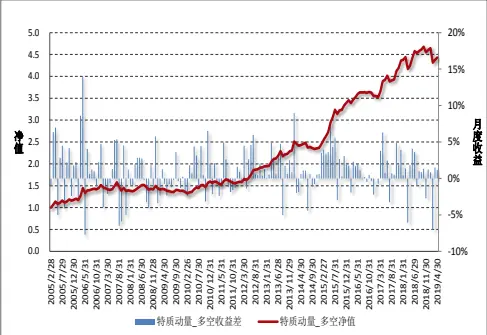

## 投资要点：

## 财通金工多因子选股框架综述

- 多因子模型的主要研究框架可划分为收益模型、风险模型、组合优化和绩效归因四个部分。

财通金工从数据获取、数据预处理、因子构建及有效性检验、因子深度分析、组合优化、组合评价及绩效归因出发，从无到有、从数据到产品，对多因子研究的流程进行了总结。

- 因子有效性检验方法有 IC/RankIC法、t 检验、简单因子组合法、纯因子组合法、Spanning Test、分组法、GRS 检验和 Fama-Macbeth检验法等。

## 特质动量因子的计算及因子特征

- 特质动量因子的构造有直接回归法和三步法两种，其中三步法中又可分为加截距项和不加截距项两种。

特质动量因子和传统动量因子的原始值与 因子存在强烈负相关，而与换手率因子、波动率因子和市值因子存在明显的正相关。

## 特质动量因子和传统动量因子PK

经正交化后的特质动量因子和传统动量因子都有一定的选股能力，特质动量因子表现更稳健、分组单调性更好、最大回撤更小。

- 特质动量因子和传统动量因子在前期市场上涨时的表现优于前期 市场下跌时的表现，且在牛转熊和持续熊市的状态下更为有效。

- 当市场由熊市转为牛市时，传统动量因子会出现明显回撤，而特质动量因子的回撤相对较小。

## 因子深度分析

- 特质动量因子在大市值中的表现仍然较好，并不会出现传统价量因子在大市值成分股中的失效情况。

- 特质动量因子多空组合的 Beta差值绝对值要明显小于传统动量因子，这是其最大回撤明显更小的主要原因。

- 通过 Overlapping 组合构建法发现，特质动量因子和传统动量因子 在中长期也不会出现明显的反转现象。

- 风险提示：本报告统计数据基于历史数据，过去数据不代表未来，市场风格变化可能导致模型失效。

市场如战场，收益为攻，风险为盾。在财通金工“星火”和“拾穗”系列的前期报告中，我们花了大量的笔墨介绍如何构建一套稳健的多因子风险系统。从本期开始，我们正式转向投资者们最为关心但同时难度最大的收益端研究。本期我们以对特质动量因子的研究为开篇，正式吹响财通金工在 Alpha 因子研究领域的嘹亮号角。

## 1、 财通金工多因子选股框架综述

## 1.1 由守转攻：从风险到收益

对于大多数投资者而言，收益是直接的，风险是潜在的；收益是极具诱惑力的，风险则是经常被忽略的。然而与此同时收益是不稳定的，风险却是可控制的，因此在实际投资中，对收益端的研究往往比对风险端的研究难度更大。财通金工将整个多因子模型的主要研究框架划分为如下四个部分：

1）收益模型：主要研究如何对股票的收益进行预测。Alpha 研究主要从估值理论和投资者行为等不同角度出发，挖掘对股票未来收益有显著影响的因子，并对其有效性及适用性进行检验。在构建完善的单因子库之后，即需考虑如何对因子进行合成和择时；

2）风险模型：主要研究如何对组合的风险进行控制。Risk 研究重点在于如何对股票收益的协方差矩阵进行稳健估计，由于二阶矩比一阶矩更具稳定性，因此对风险的预测和控制比对收益的预测更为有效；

3）组合优化：将收益模型和风险模型相结合，研究如何在最大化组合预期收益的同时最小化组合的预期风险。由于实际投资中投资经理还会受到换手率、最大权重、跟踪误差、风格偏离等各种细节层面的约束，因此通常需要从组合优化层面出发，求解满足投资者预期约束的组合权重；

4）绩效归因：从收益来源和风险暴露两个层面对组合绩效进行综合评价。对投资组合的绩效进行归因，有利于投资者更加了解自己持仓的攻击性和防御性，从而在不同的市场状态切换下操作自如。

图 1：财通金工多因子研究基本框架
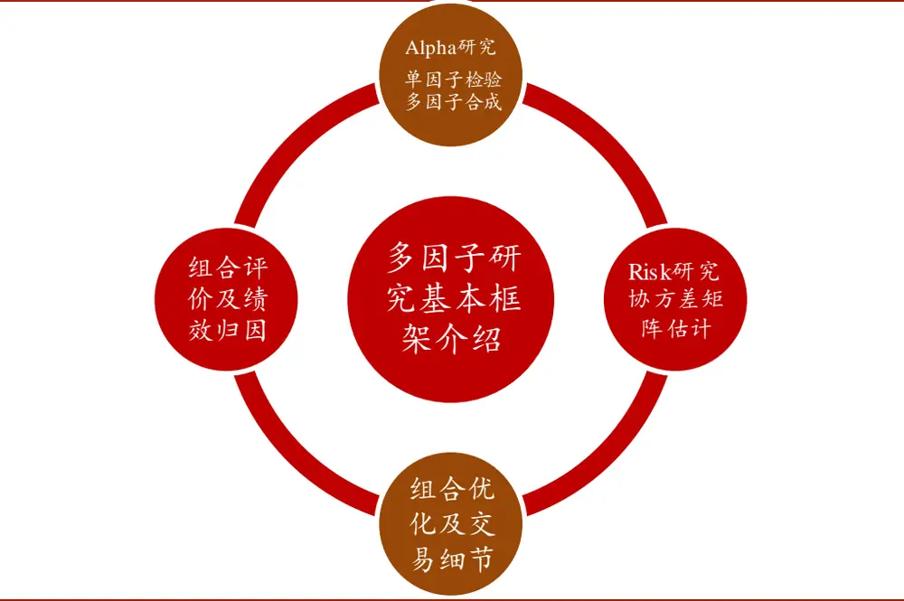
数据来源：财通证券研究所

在财通金工“星火”多因子系列的前四篇专题报告中，我们花了大量的笔墨介绍如何构建一套完整的多因子风险系统，其中《Barra 模型初探：A股市场风格解析》聚焦风险系统中的收益分解部分，详述因子构建和模型拟合方法，利用多因子模型对 股市场的风格进行解析，并将其应用到对任意给定投资组合的收益分解和风险敞口的计算上，效果显著。《 模型进阶：多因子风险预测》主要对风险模型协方差矩阵估计进行探讨，借助多因子模型对股票收益率协方差矩阵进行结构化估计，并将其运用到对任意投资组合的未来风险预测及预期最小风险组合的构建中，可以看到预测效果具有可信性、最小预期风险组合的实际风险也显著更低。《Barra模型深化：纯因子组合构建》更多关注组合优化的部分，借助组合优化的思想，构建 A 股市场上更具可投资性的纯因子组合，财通金工认为这种单一、正交、纯粹的纯因子组合在量化产品工具化、指数化发展的趋势下将大放异彩。《基于持仓的基金绩效归因：始于 Brinson，归于 Barra》则聚焦组合的绩效归因，从收益和风险两个层面对组合的收益来源和风格暴露进行分解，为研究者的实际投资提供更为直观的操作指南。

图 2：财通金工“星火”多因子系列报告回顾
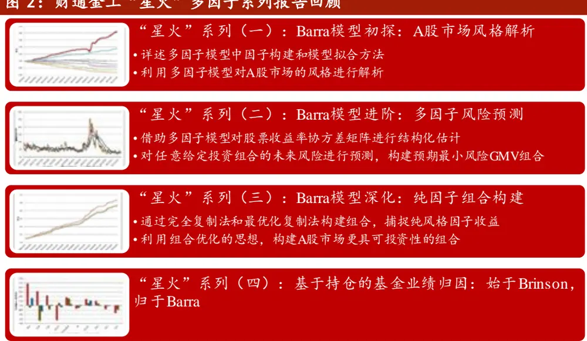
数据来源：财通证券研究所

作为“星火”系列报告的第五篇专题，同时也是本系列对于 Alpha 因子进行探讨的第一篇报告，我们首先对财通金工多因子选股的总体框架进行介绍，随后从因子构建、因子相关性、因子有效性和因子情景分析等不同角度出发，对传统动量因子和特质动量因子在 A 股市场上的表现进行全景解析，并讨论如何从特质动量因子的角度对传统的动量因子进行改进和优化。

## 1.2 财通金工多因子选股研究框架介绍

尽管市场上已经有很多优秀的研究报告对多因子选股的研究体系进行了概括，但作为财通金工对 Alpha 因子进行讨论的开篇报告，我们认为有必要再度对其流程和框架进行一次总览式的介绍。“举一反三”，后续我们的一系列报告都会对其中的主要模块再度涉及。图 3 从数据获取、数据预处理、因子构建及有效性检验、因子深度分析、组合优化、组合评价及绩效归因等不同步骤出发，从无到有、从数据到产品，对多因子研究的流程进行了总结，本节我们就其中的一些细节部分展开讨论。

图 3：财通金工多因子选股研究框架介绍
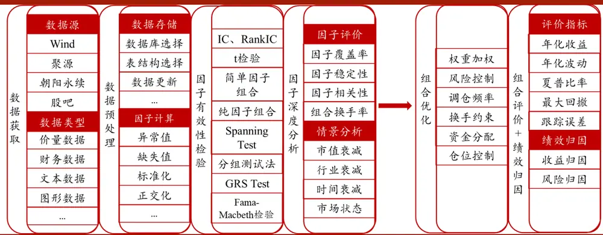
数据来源：财通证券研究所

## 1.2.1 数据获取

数据是研究之本，如果没有优质的数据来源，巧妇也难为无米之炊。目前市场上很多优秀的第三方数据提供商均各具特色，比如 Wind 数据种类齐全、提取方便、使用人数广，聚源数据质量较优、价格实惠，朝阳永续在一致预期和私募基金数据上独占鳌头，天软科技在高频数据上优势明显，其他的数据提供商还有国泰安、通联、大智慧、东方财富、巨潮资讯、集思录等。值得一提的是，随着量化研究的受众越来越广，很多量化交易平台或接口如 tushare、Quandl、vnpy等都能够获取一些免费数据。而随着爬虫技术及文本分析技术的发展，很多非结构化的数据如股吧评论、微博热评、雪球观点、百度搜索等蕴含着市场参与者强烈主观情绪的数据也越来越受到关注。

从数据类型上看，我们可以将数据划分为价量数据、财务数据、文本数据、图形数据等。价量数据在实际交易中最为常见，它们通常是市场参与者交易过后的结果，里面蕴含着丰富的交易信息。价量数据可信度好、更新频率快、覆盖率广、结构化程度高、处理难度小，是非常适合量化研究者分析的数据。财务数据则更多从公司和行业的基本面出发，更加贴近“价值投资”的理念。然而，财务数据在更新频率、数据完整度和数据准确性上往往不及价量数据，而且在实际处理中我们还需特别关注上市公司对财务数据的修正和财务造假等问题。文本数据和图片数据同属非结构化类型的数据，它们在机器学习和语义分析等研究领域不断发展的背景下也颇受关注，如可以对公司新闻的标题进行语义分析了解市场预期，也可以结合 K线图和循环神经网络进行择时交易等等。文本数据和图形数据本身十分新颖、涉及研究者较少，但是数据本身所含噪音较大、信噪比低且处理难度相对较高，因此研究难度相对较大。

## 1.2.2 数据预处理

在从数据源获取了数据之后，下一步即需对数据进行预处理，我们从数据存储和数据清洗两个方面对此进行探讨。

数据存储部分涉及到数据库选择、表结构选择和数据更新方式的选择等。首先是数据库选择，在数据量不大的情况下我们通常可以考虑.mat、.h5、Pickle、或者 文件等，但当数据增长到一定程度或需提供定制化服务时，采用数据库对其进行存储就必不可少了。常见的数据库划分有关系型数据库（如 MySQL、SQLServer 等）、非关系型数据库（NoSQL）和介于二者之间的 MongoDB。对于量化研究中的绝大多数数据而言，关系型数据库能够满足需求，但有时为了结构化数据的表结构简便性处理或当数据本身就是非结构化数据时，我们仍需配合MongoDB数据库进行读写操作（如多因子风险模型中协方差矩阵的存储）。

在选择好合适的数据库之后，接下来就需要对数据的框架及具体的表结构进行设计。由于财通金工使用的是聚源的落地数据库，因此我们要做的工作即是从落地数据库中提取数据并将其预处理成合适的表格式。对于大多数数据而言，我们倾向于将一个指标处理成一张 T×N的表格，其中 T表示交易天数，N表示股票数量，其横坐标为交易日期，纵坐标为股票代码。表1 列出了财通金工数据库表结构的主要框架，其中指数和股票的行情数据及估值数据处理起来较为方便，因为它们在数据库中本身就是每日更新的。但指数成分股、所属行业、 标志和停复牌信息等数据处理起来就相对繁琐，因为它们在数据库中对应的是一张进出流量表——原始数据本身并非是每日更新的。例如在原始数据库中记录的是某只股票在何时进入和退出指数，某只股票在何时被记为 ST、何时被摘除 ST，某只股票何时划分为行业A、何时划分为行业B 等等，对于这样的数据我们也需具体情况具体分析，并将其处理成 T×N的表格式，以便后续处理。

表 1：财通金工数据库表结构一览表

| 数据类别 | 含义 | 包含指标 | 备注 |
| --- | --- | --- | --- |
| Data_AIndexEODPrices | 指数行情数据 | 高开低收、成交量、成交额、换手率、涨跌幅、市值等行情数据 | T*N表格，T 为交易天数，N为指数数量 |
| Data_AIndexMembers | 指数所含成分股 | 记录某只股票在某个交易日内是否属于该指数，一个指数一张表 | 1 表示属于成分股，0表示不属于 |
| Data_AIndexM embers Weight | 指数成分股权重 | 记录交易日期中成分股的权重数据 | / |
| Data_AShareDescription | 股票基本信息 | 记录股票的基础数据，如代码、简称、上市日期、退市日期 | N*K表格，N表示股票数量，K表示指标个数 |
| Data_AShareEODPrices | 股票行情数据 | 高开低收、成交量、成交额、换手率、涨跌幅、市值等行情数据 | T*N表格，T为交易天数，N为股票数量 |
| Data_AShareEODIndicator | 股票估值衍生指标 | 记录PB、PE、PCF、股息率、市值等估值数据（日度更新） | 同上 |
| Data_AShareTradeStatus | 股票交易状态 | 记录股票在每个交易日的交易状态，如停牌一天、午间停牌、上午停牌等 | 对于不同的交易状态用不同的数字进行标识 |
| Data_AShareST | 股票是否 ST 标志 | 记录股票在每个交易日是否是ST、*ST、PT、暂停上市等状态 | 对于不同的风险提示状态用不同数字进行标识 |
| Data_AShareIndustryClass | 股票所属行业 | 记录股票在每个交易日所属的行业因子 | 对于不同的行业因子用不同的数字标识 |
| Data_AShareBalanceSheet | 资产负债表 | 记录股票在每个报告期的资产负债表科目数据 | 除存储数据本身外，还需存储信息公告时间，及数据是否被修正标识 |
| Data_AShareIncomeStatement | 利润分配表表 | 记录股票在每个报告期的利润分配表科目数据 | 同上 |
| Data_CashFlowStatement | 现金流量表 | 记录股票在每个报告期的现金流量表科目数据 | 同上 |
| Data_MutualFundNetValue | 公募基金净值数据 | 记录公募基金的每日净值、复权因子、涨跌幅等数据 | T*N表格，T为交易天数，N为公募基金数量 |
| Data_MutualFundFinancialQ | 公募基金财务数据 | 记录公募基金在每个报告期的份额、净值等数据 | 除存储数据本身外，还需存储信息公告时间 |
| Data_MutualFundStockPortfolio | 公募基金持股明细数据 | 记录公募基金在报告期公布的所有持仓和重仓股数据 | 存储为字典格式，键为基金代码，值为持仓信息 |

数据来源：财通证券研究所

在规划好数据表的格式之后，第三个问题即涉及到数据的下载和更新方式，我们采用批量下载和增量更新相结合的方法。由于财通金工的主要数据源来自聚源落地数据库，不像 API 接口存在流量限制，因此我们通常在第一次数据库搭建的时候采用一次性批量下载的方式进行数据读取并经过数据预处理将其存入到本地。以后在每次更新的时候都只需对新的交易日产生的新数据进行更新，这样不仅更新速度快，也不会改变原有的数据，从而保证数据的一致性和准确性。

另外需要特别注意的是，在处理财务因子的衍生指标（特别是涉及到同比、环比增长率指标）时，由于上市公司经常会对很久以前（比如上一个年报）的财务数据进行修正，因此在计算这些衍生指标时，我们建议每次根据落地数据库中的基础数据（而非我们处理好的财务数据）进行计算，这样能够有效避免未来数据的使用问题。如图 4 所示，假设我们要计算某个财务因子前 5 期数据的均值，如果该上市公司在 2018 年年报里对 2017 年年报里的数据进行了修正（数据由A更新为A′ ），那么在 2018 年三季报公布后到 2018 年年报公布前的交易日内，我们在计算时都只能采用数据A ，而在 2018 年年报公布后，计算时才能采用数据A′ 。我们之所以建议每次根据落地数据库中的底层数据进行计算，是因为存在数据修正情况的数据表本身不再适合只用一张基础表来进行存储，而财务数据的更新频率通常以季度为单位，数据量并不大，因此为了处理上的方便性及结果的准确性，我们建议直接根据底层数据进行计算。

图 4：财务因子修正问题
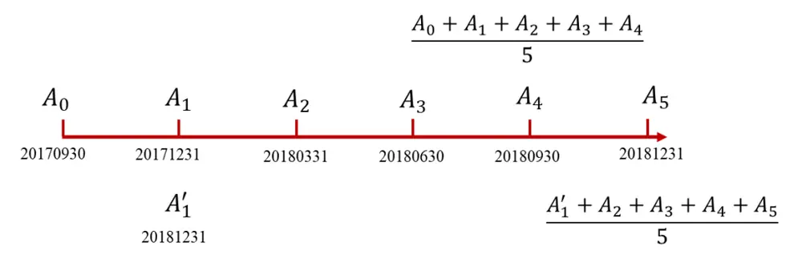
数据来源：财通证券研究所

在将基础数据进行规整化处理后，接下来即可着手因子指标的构建。由于现实数据经常存在异常值和缺失值等问题，因此需对数据进行进一步的清洗。财通金工在“拾穗”系列（五）《数据异常值处理：比较与实践》中，详细介绍了异常值处理中常用的均值标准差修正法、固定比率修正法、中位数去极值法、BeatG.Briner 方法、因子排序值标准化法、箱型图法和无量纲处理方法的具体步骤，并从定性和定量两个角度对这些方法的优劣进行了比较。在“拾穗”系列（六）《因子缺失值处理：数以多为贵》中，我们介绍了缺失值处理中采用较多的市场均值填充、行业均值填充、市值分组均值填充、前向数据填充和结构化填充等多种方法，感兴趣的投资者可做参考，此处不再过多赘述。

图 5：数据异常值处理方法

数据来源：财通证券研究所，“拾穗”（五）

图 6：数据缺失值处理方法
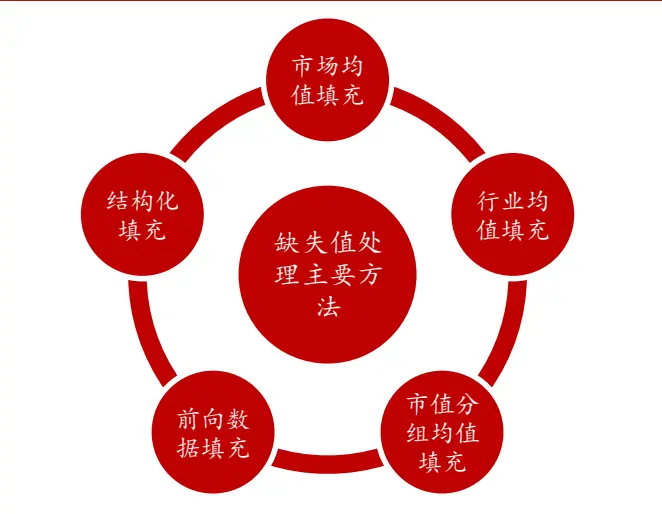
数据来源：财通证券研究所，“拾穗”（六）

关于数据处理部分我们讨论的最后一个问题是因子的正交化。事实上，在因子选股的研究中，投资者通常希望做到诸如市值中性或是行业中性的要求，也就是说，需要从目标因子中剔除市值因子或是行业因子的影响。为实现这一目的，通常有如下两种方法：

## 1）回归法

回归法的主要步骤是将目标因子对所需剔除的因子进行回归，将回归得到的残差项作为新因子的代理变量。

$$
X_{New}=\alpha+\beta_{0}\cdot Industry+\beta_{1}\cdot Size+\beta_{2}\cdot Mom+\beta_{3}\cdot Vol+\varepsilon
$$

如上所示，将待检验的因子 $X_{New}$ 作为因变量，待剔除的因子作为自变量进行回归，由于残差项与自变量之间互不相关，因此将残差项作为新因子的代理变量，可以认为已经消除了行业、市值、动量和波动的影响。

## 2） 分层法

分层法通常用于剔除单个因子对目标因子的影响，其主要步骤如下：

a) 根据待剔除因子（如 Size）的大小将样本股票分为 10 层；

b) 在每层中再根据待检测因子 $-X_{New}$ 将股票分为 10 组；

c) 每层中的第 1 组-第 10 组进行合并，得到新的 10 个分组。

图7：分层法中性化示意图
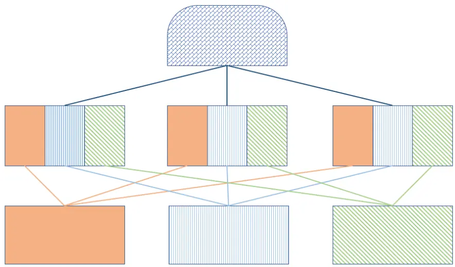
数据来源：财通证券研究所

回归法操作简单、逻辑直观，但由于自变量因子之间往往存在强相关性，因此有时并不能将其他因子剔除干净，且这种方法只能用于线性剔除，对于因子的非线性特征作用并不明显；分层法中性化的效果更佳，但若有多个待中性化因子，则在分组中会存在股票数量不够等问题，正因如此后者通常被用于剔除单个因子的影响上。此外，正交化的方法通常有对称正交法、规范正交法、施密特正交法等，这些方法是否都适用于因子正交化的范围内，财通金工将在“拾穗”系列的后续报告中予以介绍，欢迎投资者持续关注。

## 1.2.3 因子有效性检验

寻找对资产定价具有显著影响的单因子是多因子研究中的基础，对单因子的有效性进行检验便是重中之重。目前学术界和业界有多种方法对因子的有效性进行检验，大致可以分为统计法和组合法两大类。基于统计类的方法（如IC、RankIC、t 检验、简单因子组合、纯因子组合、Fama-Macbeth 回归、Spanning Test 等）主要从因子本身出发，观察其是否存在显著溢价；基于组合类的方法则更多落实到组合构建层面，观察投资者在实际操作中是否能够获取稳健的超额收益。

图 8：因子有效性检验主要方法
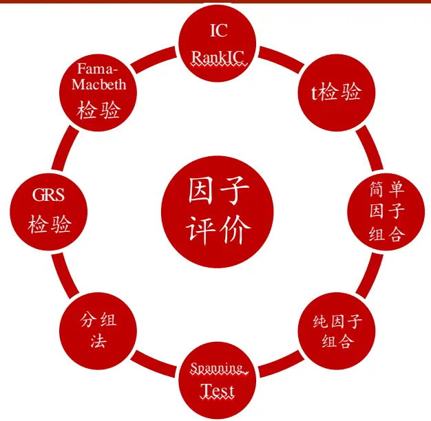
数据来源：财通证券研究所

## 1） IC、RankIC 及 t 检验

在单因子测试中，因子的 IC 值由于其计算方法简单直观，且不受交易细节的影响，是衡量因子有效性的重要指标。本质上而言，它是本期因子值与下期股票收益之间的 Pearson 相关系数：

$$
IC=corr\big(x_{i,t},r_{i,t+1}\big)
$$

在财通金工“拾穗”系列（二）《你看到的不一定是你所想的：解密 R 方》中，我们推导了一元回归中的 R 方与 IC 平方之间的等同性。然而由于在构建组合时我们更多的是根据因子的相对大小进行分组，因此相较因子的实际取值，我们更关注其相对排序，秩相关系数（或称 Spearman 相关系数）RankIC 因而成为衡量因子有效性更为常用的指标。

由于因子在每个截面期对于股票收益的影响大小并不稳定，在部分时间段内其可能是十分显著的定价因子，然而在其他时间该因子可能对股票收益的预测作用并不明显，因此我们需要对整个回测区间内的因子显著性进行检验，从而观察该因子在全样本区间内的风险溢价均值是否显著地不等于 0。在数理统计中，给定一列服从正态分布的样本数据 x，如果要检验该数据的均值x̅是否显著地不等于 0，最常用的方法是 t检验，其计算方法如下：

$$
t={\frac{{\bar{x}}-x_{0}}{s/{\sqrt{n}}}}\sim t(n-1),{\bar{x}}={\frac{1}{n}}\sum_{i=1}^{n}x_{i},s={\sqrt{\frac{\sum_{i=1}^{n}(x_{i}-{\bar{x}})^{2}}{n-1}}}
$$

其中，x̅表示数据的均值，s 表示数据的样本标准差，n 表示样本数量， $x_{0}$ 表示待检验的值，如果我们需要检验序列的均值是否显著地不等于0，那么可将 $x_{0}$ 置为0，可以证明通过如上方法构建的检验统计量 t值服从自由度为n-1的 t分布。假设数据x服从正态分布 $\scriptstyle x\sim N(\mu,\sigma^{2})$ ，那么其样本均值同样服从正态分布：

$$
\bar{x}{\sim}N(\mu,\frac{\sigma^{2}}{n})\frac{\bar{x}-\mu}{\sigma/\sqrt{n}}{\sim}N(0,1)
$$

由 Cochran 定理可知，数据的样本方差与总体方差之间服从如下 $\chi^{2}$ 分布：

$$
{\frac{(n-1)s^{2}}{\sigma^{2}}}{\sim}\chi_{(n-1)}^{2}
$$

因此，通过上述方法构建出的 t 值即可进行如下变换：

$$
t={\frac{{\bar{x}}-x_{0}}{s/{\sqrt{n}}}}={\frac{\frac{{\bar{x}}-x_{0}}{\sigma/{\sqrt{n}}}}{\sqrt{\frac{(n-1)s^{2}/\sigma^{2}}{(n-1)}}}}={\frac{X}{\sqrt{Y/(n-1)}}}\sim t(n-1)
$$

其中， $\begin{array}{r}{X=\frac{{\bar{x}}-x_{0}}{\sigma/\sqrt{n}}}\end{array}$ 服从标准正态分布， $\begin{array}{r}{Y=\frac{(n-1)s^{2}}{\sigma^{2}}}\end{array}$ 服从自由度为 n-1 的 $\chi^{2}$ 分布，因此检验统计量 t 值服从自由度为 n-1 的 t 分布，证明完毕。

在构建出每一期的 t 值之后，我们一般需要将 t 值的绝对值与 2 进行比较，如果 t值的绝对值大于 2，则说明该因子显著。在对因子组合的收益进行显著性检验时，由于每个截面期都有一个 t 值，因此我们还需计算 t 值绝对值大于 2 的次数占比。那么，为什么会选取 2作为比较的阈值呢，这实际上是与 t分布的 95%置信度区间有关。图 9 和图 10 展示了在不同自由度下 t 分布 95%置信区间的上下限，可以看到随着自由度逐渐增大（大于 30 后），置信区间的上下界非常接近-2 和 2。由于我们在实证研究中的数据个数经常会大于 30，因此直接将t 检验量的绝对值与 进行比较来判断其显著性即是非常方便的操作。

图 9：t 分布 95%置信区间示意图
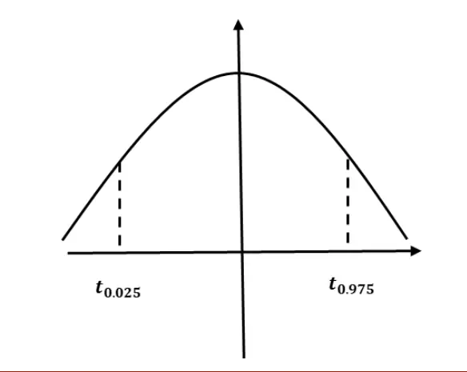
数据来源：财通证券研究所

图 10：不同自由度下 t分布 95%置信区间上下限
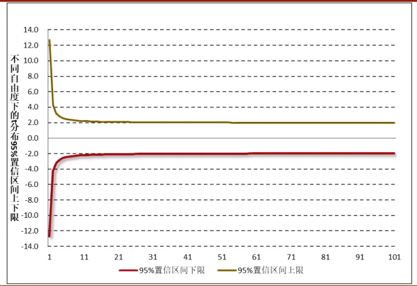
数据来源：财通证券研究所

## 2）简单因子组合及纯因子组合法

简单因子组合法和纯因子组合法也能用于因子有效性的检验中，关于其具体概念及求解方法可以参照财通金工“拾穗”系列（七）《从纯因子组合的角度看待多重共线性》，二者之间的主要区别在于是否考虑其他因子对于目标因子的影响。简单因子组合的收益是根据一元线性回归拟合得到的，具体来讲在某个截面期上，将全市场所有股票的下期收益对本期目标因子暴露度进行横截面回归：

$$
r_{n}=f_{c}^{S}+X_{ns}f_{s}^{S}+u_{c}^{S}
$$

其中， $r_{n}$ 表示股票 n 在下期的收益率， $X_{ns}$ 为股票 n 在本期目标因子 s 上的暴露度， $\begin{array}{r}{f_{c}^{S},\ f_{s}^{S}\sharp\ d\tau u_{c}^{S}}\end{array}$ 分别为截距项因子收益、目标因子收益和特质收益。简单因子组合收益衡量的是当期因子每增加 1个单位，股票收益所需要的风险补偿。

纯因子组合模型中则纳入了更多的风格因子作为解释变量，将全市场股票收益拆解到市场收益、行业收益、风格收益和特质收益四个部分：

$$
r_{n}=f_{c}^{P}+\sum_{i}X_{ni}f_{i}^{P}+\sum_{s}X_{ns}f_{s}^{P}+u_{n}^{P}
$$

其中， $X_{ni}$ 表示股票n在行业因子i上的暴露度， $X_{ns}$ 表示股票n在风格因子s上的暴露度。由于截距项因子与行业因子之间存在完全共线性，我们需加入行业因子收益的市值加权均值等于0的约束条件，以使得方程有唯一解：

$$
\sum_{n}W_{i}f_{i}^{P}=0
$$

与简单因子组合收益不同，纯因子组合收益衡量的是在剔除了其他风格因子和行业因子的影响之后，每增加1 个单位的目标因子所带来的风险溢价。

无论是简单因子组合还是纯因子组合法，在根据横截面回归求解出目标因子的每期收益后，通常都有两种方法对其显著性进行检验：其一，通过计算每期回归中目标因子 t 值绝对值的平均，以及 t 值绝对值大于 2 的比例来判断该因子是否是一个有效的定价因子；其二，对每期回归得到的目标因子收益按照前面提到的方法进行 t 检验，观察 t 值是否显著。

## 3） Spanning Test

Spanning Test 实质上是一个时间序列上的回归，它以 Fama-French 三因子的计算方法为基础，通过将目标因子的模拟组合收益（Factor Mimicking Portfolio）对 MKT、SMB、HML 因子进行时间序列回归，观察回归的截距项是否显著地不等于 0 从而判断在剔除了 FF3 因子或 FF5 因子之后该因子的定价能力。下面，我们以 Fama-French 三因子版本为例进行说明：

在每个截面期上将所有股票按照市值大小分为 S（市值最小 50%）和B（市值最大50%）两组，按照账面市值比分为L（BP最小30%）、N（BP介于30%-70%）和 H（BP 最大 30%）三组，随后进行两两组合并计算每组股票在下一期收益的市值加权平均。由此，市值因子 SMB（Small-Minus-Big）和账面市值比因子 HML（High-Minus-Low）的收益即可通过如下方法计算得到：

$$
SMB=\frac{(S/L+S/N+S/H)}{3}-\frac{(B/L+B/N+B/H)}{3}
$$

同样的，假如我们的目标因子为动量因子，我们将动量因子由小到大排序分为 L（动量最小 30%）、N（动量介于 30%-70%）和 W（动量最大 30%），那么动量因子的因子模拟组合收益 WML（Winner-Minus-Loser）即为：

$$
WML=\frac{(S/W+B/W)}{2}-\frac{(S/L+B/L)}{2}
$$

可以看到该因子的计算框架与 HML 因子的计算完全一样，因此在函数编写的过程中我们可以考虑将其整合为一个类，传入不同的因子值即可返回不同的因子模拟组合收益。

最后我们将 WML因子收益对 MKT、SMB和 HML因子收益进行时间序列回归，观察截距项的显著性。如果截距项是显著的，那么说明 Fama-French 三因子无法解释目标因子异象，因此有理由该因子是一个显著的定价因子：

$$
WML_{t}=\alpha_{t}+MKT_{t}+SMB_{t}+HML_{t}+\varepsilon_{t}
$$

## 4）分组法

到目前为止，简单因子组合和纯因子组合均是通过横截面回归的方法来判断目标因子对股票下期收益的影响情况，其衡量的是因子在统计意义上的显著度，于实际投资层面来讲并不十分直观。分组法通过对因子值进行排序分组构建投资组合，并观察各组累计收益是否存在明显的分化，是一种更加贴近实际投资的因子检验方法。

具体来讲，在每个调仓日（通常为每个月月末）根据目标因子从小到大分为K 组（一般取 K=10），通过等权或者市值加权构建 K 个组合，并计算这 K 个组合在下一个月的超额收益，最终形成一个 T×K的收益率矩阵。一方面我们关注这 个组合在回测区间内的累计收益是否存在良好的单调性，另一方面我们通过做多第一组、做空最后一组构建一个零额投资的多空对冲组合，观察该对冲组合的累计收益是否稳定。

## 5） GRS 检验

GRS 检验最早由 Gibbons, Ross 和 Shanken 于 1989 年提出，用于检验十分组情况下各组的超额收益 Alpha 是否联合不等于 0。其具体步骤如下：

a) 分组：在每月月末的最后一个交易日根据目标因子由小到大进行排序分为 10 组，计算每组股票在下一个月的市值加权平均收益，从而形成一个 T×N收益矩阵（T表示交易月数，N表示分组数量）；

b) 回归：将每个组合的月度收益序列对已知因子的收益率序列（如 MKT、SMB、HML等因子）进行带有截距项的时间序列回归（若有 N个组合，则进行 N次回归）：

$$
D_{i,t}=\alpha_{i}+\beta_{i,mkt}MKT_{t}+\beta_{i,smb}SMB_{t}+\beta_{i,hml}HML_{t}+\varepsilon_{i,t}
$$

随后可将上述回归得到的每组超额收益 ${\hat{\alpha}}_{i}$ （标量）和残差收益向量 $\cdot\hat{\varepsilon}_{i}$ （T×1 向量）进行拼接，形成超额收益向量α̂（N×1 向量）和残差收益矩阵ê（T×N矩阵）；

c) 检验：在经过时间序列回归得到各组的超额收益和残差收益之后，接下来即可对各组的超额收益是否显著地不等于 0 进行检验。如果某个因子是有效的定价因子，那么该因子的分组收益不能被已知因子完全解释，即将各组收益对已知因子进行时间序列回归后得到的截距项 $\alpha_{i}$ 联合起来不等于 0。由此，原假设可以表示如下：

$$
H_{0}\colon\alpha_{1}=\alpha_{2}=\cdots=\alpha_{N}=0
$$

假如残差收益独立同分布且服从正态分布，那么即可构建如下检验统计量：

$$
\frac{T}{N}\times\frac{T-N-K}{T-K-1}\times\frac{\hat{\alpha}^{\prime}\hat{\Sigma}^{-1}\hat{\alpha}}{1+\bar{f}^{\prime}\hat{\Omega}^{-1}\bar{f}}{\sim}F_{(N,T-N-K)}
$$

其中，T 表示交易月数量，N 表示组别数量，K 表示时间序列回归中纳入模型的自变量因子数量，α̂为各组经过时间序列回归得到的截距项向量（N×1），f̅表示时间序列回归中自变量因子的历史收益均值（K×1）：

$$
{\bar{f}}=\left({\bar{f}}_{1},{\bar{f}}_{2},\dots,{\bar{f}}_{K}\right)^{\prime}
$$

其中， $\bar{f}_{k}$ 表示第 k 个因子收益的均值（标量）。Σ̂为各组收益进行时间序列回归后残差向量 $\varepsilon_{i}$ 的协方差矩阵（N×N），其计算方法如下：

$$
\hat{\Sigma}=\frac{1}{T-K-1}\hat{e}^{\prime}\hat{e}
$$

其中，ê为经过时间序列回归得到的残差收益矩阵（T×N），由 OLS 回归的性质可知，Σ̂是残差向量协方差的无偏估计量。此外，Ω̂是回归模型中自变量因子的协方差矩阵（K×K），其计算方法如下：

$$
\widehat{\Omega}=\frac{1}{T-1}\sum_{t=1}^{T}\bigl(f_{t}-\overline{{f_{t}}}\bigr)\bigl(f_{t}-\overline{{f_{t}}}\bigr)^{\prime}
$$

其中，Ω̂是样本协方差矩阵，它是总体协方差矩阵的无偏估计量。Gibbons，Ross 和 Shanken（1989）证明该检验统计量服从自由度为（N T-N-K）的 分布，因此我们可以通过计算上述 检验统计量结合 分布的性质，来判断是否接受或者拒绝原假设。若 GRS 检验统计量很大（如超过 95%置信区间），则需要拒绝原假设，也即说明该因子是一个有效的定价因子。

需要说明的是，目前为止我们都认为回归残差之间不存在自相关和异方差性，如果这一条件不满足，我们估计得到的残差协方差矩阵就不再是无偏和一致的，因此需要用 Newey-West 或者 GMM 方法进行调整，此处不做过多展开。

## 6） Fama-Macbeth 检验

在前面提到的 Spanning Test和 GRS 检验中，我们均是将组合的月度收益率对已知因子的月度收益率进行时间序列回归，观察截距项的显著性，而在 Fama和 Macbeth（1993）提出的 Fama-Macbeth 回归法中，则是通过结合时间序列回归和横截面回归，采用如下的两步回归法来对因子有效性进行检验的。

具体来讲：

a) 时间序列回归：在某个月月末，将每一只股票的历史收益率对已知因子的收益率进行时间序列回归，计算得到相应的回归系数

$$
\begin{array}{r}{r_{i,t}=\alpha_{i}+\beta_{i,1}x_{1,t}+\cdots+\beta_{i,k}x_{k,t}+\varepsilon_{i,t}}\end{array}
$$

在上面的回归中，自变量因子既可以是已知因子的收益（如SMB、MKT、等），也可以是一些宏观经济指标（如 、 、 等），但我们认为在对每只股票进行时间序列回归时，这些自变量的取值需要保持一致，因为回归的目的是要得到不同的股票在这些因子上的暴露程度。也就是说，如果想要衡量市值、BP 等因子对股票收益的影响，我们回归时并不是将股票收益对市值因子本身和 因子本身进行回归，而是将股票收益对 SMB和 HML的收益序列进行回归。这是因为每只股票的市值因子和 因子都是不相同的，如果直接将个股收益对因子值本身进行时间序列回归，将得到的回归系数被认为是该因子的预期收益的话，那么对于不同股票进行回归得到因子的预期收益却并不相同，这一点与我们的预想并不一致，因为这种情况下股票所暴露的因子值和因子的收益都不相同，无法进行比较。相较之下，由于每个时期所有股票所暴露的宏观环境是一致的，因此可以直接将宏观指标的因子值本身作为回归变量，这样回归得到的系数就代表了每只股票对宏观经济指标变化的敏感性。

b) 横截面回归：在经过时间序列回归得到每只股票在单个因子上的暴露度之后，接下来就是进行横截面回归，观察不同的因子暴露度对股票收益的影响，这一点与前面提到的纯因子组合法十分类似。具体来讲：

$$
\boldsymbol{r}_{i}=\boldsymbol{\alpha}_{i}+\beta_{i,1}\boldsymbol{x}_{1}+\cdots+\beta_{i,k}\boldsymbol{x}_{k}+\varepsilon_{i}
$$

此处回归中的自变量因子为上一步回归得到的因子系数。对于每一个截面期 t 时刻我们都可以得到一个因子溢价向量 $\left(\beta_{t,1},\beta_{t,2},\ldots,\beta_{t,k}\right)$ （1×K向量），那么假设共有T个时期，即可得到一个T×K维的因子溢价矩阵。

c) 均值检验：对于单个因子而言，在得到其因子溢价的时间序列后，接下来的工作就是对其显著性进行检验了。假设数据服从正态分布，我们即可采用前面提到的 t 检验对因子溢价的显著性进行检验。

由以上分析可知，Fama-Macbeth回归法与纯因子组合分析法的概念十分类似，所不同的是 FM回归中因子的暴露度先根据时间序列上进行回归所求得的，而对于纯因子组合分析法中，股票在单个因子上的暴露度就是因子本身经过标准化处理所得到的。

到目前为止，我们详细介绍了因子有效性检验的几种方法，其中t 检验是所有检验中的基础，IC 和 RankIC 是衡量因子有效性非常直观的指标，简单因子组合和纯因子组合与 Barra 模型中的回归方式一脉相承，是业界采用的比较多的方法；Spanning Test 则以 Fama-French 因子的构建为基础，从时间序列回归的角度观察组合是否存在超额收益；分组法通过将因子进行排序分组构建投资组合，对投资者的实际操作更具指导意义；GRS 检验在分组的基础上，通过时间序列回归观察所有组别的超额收益是否联合不等于 0；Fama-Macbeth 检验则将时间序列回归和横截面回归联系起来，是学术界采用比较多的因子检验方法。总体而言，这些方法都没有明显的优劣，投资者在实际研究中都可进行尝试。

## 1.2.4 因子深度分析

为了对因子的适用性有进一步的理解，我们还需关注一些其他指标，典型的如因子覆盖率、因子相关性和因子稳定性等。

## 1) 因子覆盖率

首先我们需要关心因子在每个截面期上的覆盖率情况，较高的覆盖率使得可供选股的范围较大，通常来讲价量因子的覆盖率较优，财务因子和一些特色因子（如专利因子、公司治理因子）的覆盖率相对较窄。

## 2) 因子相关性

为了避免目标因子与已知 Alpha 因子之间存在完全共线性，我们需要了解目标因子与已知因子之间的相关情况。通常有两种方法对因子之间的相关性进行检验，第一种方法通过构造相关强度指标 $RSI_{AB}$ ，对各因子之间的相关系数进行检验，该指标计算方法如下：

$$
RSI_{AB}=\frac{mean(Corr_{t}^{AB})}{std(Corr_{t}^{AB})},t=1,2,...T
$$

其中， $Corr_{t}^{AB}$ 是指在 t 期所有股票的 A、B 因子之间的相关系数， $RSI_{AB}$ 指标实际上衡量的是因子相关系数的稳定性。需要注意的是，为了避免极端异常值对相关系数的影响，此处我们建议对因子进行标准化后再计算相关系数，或者在指标构建时采用因子的秩相关系数作为代替。

因子相关性检验的第二种方法是分组法，首先在每个截面期根据目标因子从小到大分成 10 组，随后计算每组股票在其他已知因子上的加权平均，最终计算每个组合在回测区间内的均值，观察 10 个组合在已知因子上的暴露度是否存在单调性。同样的，为了避免因子值的较大变化所带来的影响或者为了方便不同的因子之间可以进行比较，我们也可采用打分法或对因子预先进行标准化处理。具体来讲，可分为如下几种方式：

a) 在每个截面期上，直接计算每个组别在原始因子上的加权平均，随后计算每个组别在时间序列上的均值；

b) 在每个截面期上，先将所有股票的因子值进行标准化，随后计算每个组别在标准化后因子上的加权平均，最后计算各组时间序列均值；

c) 在每个截面期上，先将因子值转换成排序值，随后计算每组在排序值上的加权平均，再根据加权平均打分，最后计算各组得分时间序列均值；

如果各个组别在其他已知因子上的排序存在明显的单调性，则说明目标因子与其他因子之间存在强相关性，我们需要考虑对其进行正交化处理，从而剔除已知因子的影响。

## 3) 因子稳定性

因子的稳定性也是我们关注的重要指标，如果因子在相邻两期中的变化十分剧烈，那么根据该因子构造的组合换手率将会非常高，这将为因子的实际应用造成较大的困扰。我们采用自稳定相关系数 $\rho_{kt}$ 对因子稳定性进行衡量，其计算方法如下：

$$
\rho_{kt}=\frac{\sum_{N}^{}(X_{nk}^{t}-\bar{X}_{k}^{t})(X_{nk}^{t+1}-\bar{X}_{k}^{t+1})}{\sqrt{\sum_{N}^{}(X_{nk}^{t}-\bar{X}_{k}^{t})^{2}}\sqrt{\sum_{N}^{}(X_{nk}^{t+1}-\bar{X}_{k}^{t+1})^{2}}}
$$

其中， $X_{nk}^{t}$ 是指 t 时期股票 n 在因子k 上的取值，可以看 $\Xi\|\rho_{kt}$ 实质上是相邻两个截面日期上股票因子值的相关系数。

## 4) 情景分析

对不同样本指数和不同市场状态下的因子有效性进行情景分析则是加深因子理解的另一途径。在前面的介绍中我们通常是对全样本股票进行回测，然而不同因子可能呈现出不同的市值特征和行业特征，因此对因子的市值衰减和行业衰减进行分析即能够帮助我们更加了解因子在不同成分股中选股的有效性。

对于因子的市值衰减，一般可以将全市场股票按照其市值由小到大分为 10组，分别测试每个市值分组下目标因子的有效性（一般观察 RankIC、胜率等）。而对于行业因子而言，我们一般采用中信一级的 29 个行业进行回测。需要注意的是，由于部分行业包含的样本股较少（如银行业），如果回测区间选择过长或者分组组别数量过多，将会使得因子在行业内的检验存在失真，因此在进行行业衰减检验时我们一般分为 5 组。

因子的时间衰减衡量的是因子对于收益预测的持续能力，在前面的介绍中我们通常持有组合 1 个月后调仓，然而更一般的，我们想要了解因子要经过多长时间后失效或者在中长期是否会出现反转，可以通过 RankIC 的时间衰减进行衡量：

$$
IC_{\Delta}=corr(X_{t},r_{t+\Delta})
$$

其中， $X_{t}$ 表示 t 期因子值， $\Delta.$ 表示滞后阶数， $r_{t+\Delta}$ 表示从当前时刻 t $\Xi\|t+\Delta$ 期间股票的收益情况。衡量因子时间衰减的另一种方法是 Jagadeesh 和Titman（1993）提出的 Overlapping 组合构建法，其示意图如图11 所示。

图 11：Overlapping 组合构建示意图（K=3）
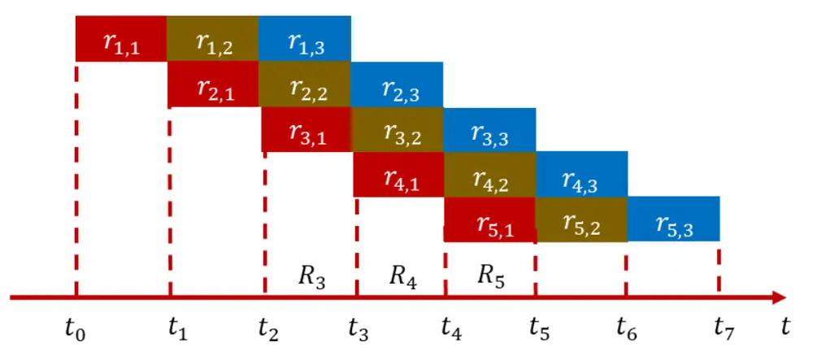
数据来源：财通证券研究所

具体来讲，假设要检验目标因子在未来 3 个月的持续性，就需要在每期对因子进行排序后分组，观察每个组别在未来 3 个月的收益情况。为了避免每 3个月才换一次仓导致的样本数量过少以及初始日期的选择对回测结果造成的影响，我们在每个月都将因子进行重新分组，并将这样的组别划分持续持有 3 个月。因此，在回测中 T 月每个组别中实际上就有 3 个组合，它们分别是根据T-1 月月末、T-2月月末和 T-3 月月末的因子值进行排序来构建的。为了处理的简便性，我们对 3个组合的资金进行平均分配，每个组别内部的个股权重也进行等权处理，由此组合在第三个月的收益即为：

$$
R_{3}=\frac{1}{3}\times\left(r_{1,3}+r_{2,2}+r_{3,1}\right)
$$

最后，我们关注因子在不同的市场状态下呈现出的不同特征。可以通过情景分析法将市场划分为不同的状态，观察在不同市场风格下目标因子的有效性。具体来讲，以当前时刻往前推一年的Wind全A指数的涨跌幅作为市场涨跌的标志，若涨幅大于0认为市场处于Up状态，若涨幅小于0则认为市场处于Down状态。同样的，我们以 Wind 全 A 指数本月的收益方向与前 12 个月的收益方向作为市场动量还是反转的标志，若二者维持一致则认为处于 Momentum 状态，否则认为处于 Reverse 状态。因此，市场可以划分为如下几个不同的状态：

1）Up：前期市场处于上涨状态；

2）Down：前期市场处于下跌状态；

3）UpMomentum：前期市场上涨，且本月继续上涨

4）UpReverse：前期市场上涨，本月反转下跌

5）DownMomentum：前期市场下跌，本月市场继续下跌

6）DownReverse：前期市场下跌，本月反转上涨

在财通金工“拾穗”系列（九）《牛市抢跑者：低 一定代表低风险吗？》我们对 因子进行情景分析发现，尽管该因子并不是一个在全样本时间段内都有效的因子，但是其在持续熊市或牛转熊的市场状态中是一个非常显著的负向因子，而在熊转牛的行情下则是一个非常显著的正向因子。挖掘一个在任何时间段都有效的 Alpha 因子是十分困难的，对因子在不同市场状态下的有效性进行检验，更有利于投资者结合当前市场行情的主观判断进行配置。

## 1.2.5 从单因子到多因子

截止到目前，我们对单因子的有效性和适用性进行了较为完善的分析，研究者们在构建了有效的 Alpha 因子库之后即需将单因子合成为多因子，继而落实到实际的组合构建方面。从单因子到多因子的飞跃涉及到的细节很多，由于本篇报告仅就单个 Alpha 因子进行分析，因此对组合优化、组合评价和绩效归因部分我们仅做简要介绍。

因子合成的第一个问题是对因子权重进行赋权，目前市场上使用的较多的是等权法、 加权法（滚动加权 半衰加权等）、最小波动率合成法等。此外，在实际投资过程中，投资经理还有跟踪误差、换手约束、最大权重、仓位控制等限制，因此需要将这些约束转换成对应的约束条件放入到模型中进行求解，以下是其中的一种优化模式：

$$
\begin{array}{rl}&{max(w-w_{B})^{\prime}\alpha-\lambda_{1}TE^{2}-\lambda_{2}\cdot\mathbf{1}^{\prime}|w-w_{0}|}\\&{\qquad X_{S}^{lower}\leq(w-w_{B})^{\prime}X_{S}\leq X_{S}^{upper}}\\&{\qquad X_{I}^{lower}\leq(w-w_{B})^{\prime}X_{I}\leq X_{I}^{upper}}\\&{\qquad w^{\prime}1=1}\\&{\qquad w^{lower}\leq w\leq w^{upper}}\end{array}
$$

其中，w 表示组合权重（N×1 向量）， $w_{B}$ 表示基准组合权重（N×1 向量），$w_{0}$ 表示组合在调仓前的权重（N×1 向量），α表示个股期望收益（或因子值）， $X_{S}$ 和$X_{I}$ 分别表示股票在风格因子和行业因子上的暴露度（N×K矩阵，K为因子个数），Xlower和Xupper分别代表组合在因子上暴露度的下界和上界，为 K×1 向量。

可以看到， $(w-w_{B})^{\prime}$ α表示组合的超额期望收益， $TE^{2}$ 表示组合的跟踪误差（或主动风险）：

$$
TE^{2}=(w-w_{B})^{\prime}V(w-w_{B})=(w-w_{B})^{\prime}(XFX^{\prime}+\Delta)(w-w_{B})
$$

$1^{\prime}|\boldsymbol{w}-\boldsymbol{w}_{0}$ |表示组合的换手率， $\lambda_{1}\hbar\pmb{\mathscr{n}}\lambda_{2}$ 为调配系数，它们调节投资经理在最大化目标收益、最小化跟踪误差以及最小化换手率约束上的偏好。

在确定了组合权重的构建方法之后，即可根据预先设定的参数在历史时间上进行回测，观察组合的绩效表现，常用的评价指标有年化收益、年化波动率、夏普比率、胜率、最大回撤、跟踪误差等。

最后我们还需对组合的绩效表现进行归因，从而帮助投资者更加了解组合的收益来源和风险暴露。对组合绩效归因的详细步骤可以参考财通金工“星火”系列（四）《基于持仓的基金绩效归因：始于 Brinson，归于 Barra》，此处我们不做过多赘述。

## 2、 特质动量因子计算方法及因子特征

在上一部分中，我们对财通金工多因子选股的整体框架和单因子检验的具体步骤进行了详细的说明。从本部分开始，我们以特质动量因子为例，开展 Alpha因子的研究。本部分主要对特质动量因子的不同计算方式进行说明，从因子覆盖率、因子稳定性及与已知因子的相关性来探究特质动量因子的初步特征。

## 2.1 特质动量因子计算方法

特质动量因子，又称残差动量因子，是指在剔除了传统的风格因子影响之后，根据个股的特质收益计算得到的特质动量因子。然而就因子具体的计算来讲，不同的文献给出了不同的构造方法：

## 1）直接回归法

Chang（2018）在对特质动量因子在日本市场的有效性检验研究中，采用的是相对简单的直接回归取残差的方法。具体来讲，假设当前时刻为t 月月末的最后一个交易日，对于单只股票而言，我们将其 t-35 月到 t 月（共 36 个月）个股月度收益率对 Fama-French 三因子进行时间序列回归，有：

$$
r_{i,t}=\alpha_{i}+m_{i}MKT_{t}+s_{i}SMB_{t}+h_{i}HML_{t}+\varepsilon_{i,t}\tag{1}
$$

根据上述回归得到的残差变量即可认为是该股票在剔除了已知风格因子影响后的特质收益 $\cdot\varepsilon_{i,t^{\circ}}$ 。接下来对股票在 t-11 到 t-1 月（共 12 个月）的特质收益进行处理，得到 t 月该股票经风险调整后的特质收益——特质动量因子值：

$$
IMOM_{i,t}=\frac{\frac{1}{12}\sum_{t-11}^{t-1}\varepsilon_{i,t}}{\sqrt{\frac{\sum_{t=11}^{t-1}\left(\varepsilon_{i,t}-\overline{{\varepsilon}}_{i}\right)^{2}}{11}}}\tag{2}
$$

## 2） 三步法

在关于特质动量因子研究的经典文章中，Gutierrez（2007）、Blitz（2011）和 Blitz（2018）采用的都是三步法求解。具体来讲，假设当前为 t 月月末的最后一个交易日，对于单只股票而言，首先将其 t-36 月到 t-1 月（共 36 个月）的月度收益率对 Fama-French 三因子进行时间序列回归得到股票在 MKT、SMB 和HML 因子上的暴露系数：

$$
r_{i,t}=\alpha_{i}+m_{i}MKT_{t}+s_{i}SMB_{t}+h_{i}HML_{t}+\varepsilon_{i,t}\tag{3}
$$

随后，根据上述回归得到的因子暴露系数与 t 月 Fama-French 三因子的月度收益相乘，即可得到根据 FF3 因子模型拟合得到的股票月度收益，将股票在t 月的实际收益与该拟合收益相减，即可得到股票在 t 月的特质收益：

$$
\begin{array}{r}{e_{i,t}=r_{i,t}-\hat{\alpha}_{i}-\widehat{m}_{i}MKT_{t}-\hat{s}_{i}SMB_{t}-\hat{h}_{i}HML_{t}}\\{\epsilon_{i,t}=r_{i,t}-\widehat{m}_{i}MKT_{t}-\hat{s}_{i}SMB_{t}-\hat{h}_{i}HML_{t}}\end{array}\tag{4.1}
$$

(4.2)

需要特别注意的是，以上两种特质收益的计算在是否需要加入截距项中产生了分歧。Blitz（2011）中特别指出，不加截距项是因为在时间序列回归中截距项α更多地被认为是模型的设定误差，而且在回归中我们采用的是 t-36 到 t-1 月的因子收益，而在计算特质动量因子的时候我们仅采用 t-12 到 t-1 月的特质收益。也就是说在估计α时采用的数据有大约 2/3 的数据在计算特质动量因子时不会被使用，因此α更多地反映的是个股在 t-36 到 t-13 月之间的异常收益。例如，假如某个股票在 到 月之间有非常高的正（负）收益，那么将很可能导致该股票的特质动量因子偏低（高），由此特质动量因子不仅反映的是中期的动量效应，还包括了长期的反转效应，所以我们倾向于在计算特质收益时不加入截距项。

最后，我们对每只股票 t-12 到 t-1 个月（共 12 个月）的特质收益进行标准化，求得其风险调整后的收益，即为我们所构建的特质动量因子 IMOM：

$$
IMOM_{i,t}=\frac{\prod_{t-11}^{t-1}\bigl(1+\varepsilon_{i,t}\bigr)-1}{\sqrt{12}\times\sqrt{\frac{\sum_{t-11}^{t-1}\bigl(\varepsilon_{i,t}-\overline{{\varepsilon}}_{i}\bigr)^{2}}{11}}}\tag{4.3}
$$

此处，我们将特质收益的年化收益率除以其年化波动率，构建特质动量因子。由于我们采用的过去 12 期的数据，因此特质收益的年化收益即为各期特质收益的累计收益率，而其年化波动率为特质收益标准差乘以根号 12。

图 12：直接回归法和三步法因子自稳定系数
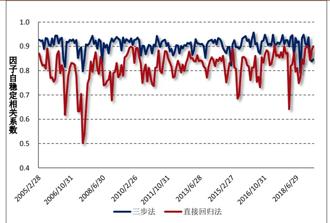
数据来源：财通证券研究所，恒生聚源

图 13：直接回归法和三步法因子相关系数
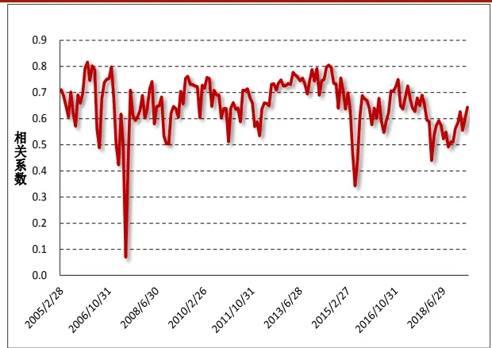
数据来源：财通证券研究所，恒生聚源

关于究竟使用“直接回归法”还是“三步法”来对特质动量因子进行计算，目前并没有一个统一的说法，财通金工试图从因子自稳定系数的角度提供一些思考。由两种方式的计算方法可以看到，直接回归法是将个股收益对 FF3 因子回归得到残差，再根据近期残差收益来计算特质动量因子。那么，这样的处理可能导致一个问题——在每次滚动回归时所求的残差变量并不相同，因此可能导致这种方法计算出来的特质动量因子稳定性没有那么好。相较之下，通过三步法计算得到的特质动量因子的稳定性就会更好，因为在相邻两个截面期计算因子值时，共用了其中的 11个数据，其示意图如图 14所示。由图 12可以看到，通过三步法计算得到的特质动量因子的稳定性要优于直接回归法。

图 14：三步法中相邻两期特质动量因子计算时共用11 期数据
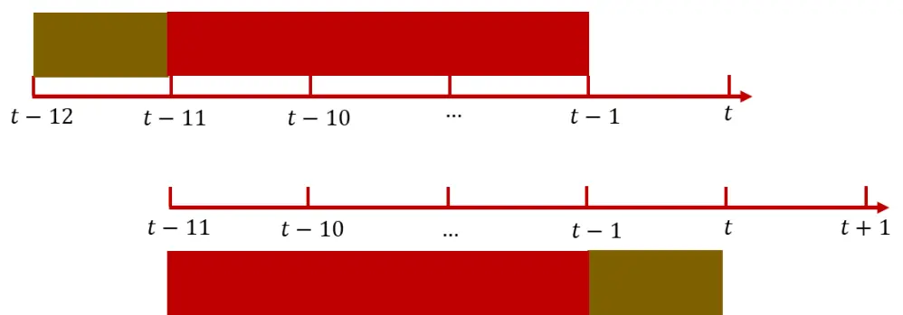
数据来源：财通证券研究所

## 2.2 计算细节及 Fama-French 三因子走势

本小节对特质动量因子和 Fama-French 三因子的计算细节进行说明，选定2005.1.31-2019.4.30 为回测区间，选定 Wind 全 A 为回测样本股，在每个月月末最后一个交易日的时候，我们先剔除上市时间不超过 100 天的股票、剔除当日停牌一天的股票、剔除 ST 或*ST 股票。随后按照所选股票的自由流通市值大小分为 S和 B两组，根据账面市值比 BP 因子分为 L、N 和 H三组，继而计算每组股票在下一期的流通市值加权平均收益，其具体计算方法参见 1.2.3 小节。

图 15：财通金工 Fama-French 三因子净值走势
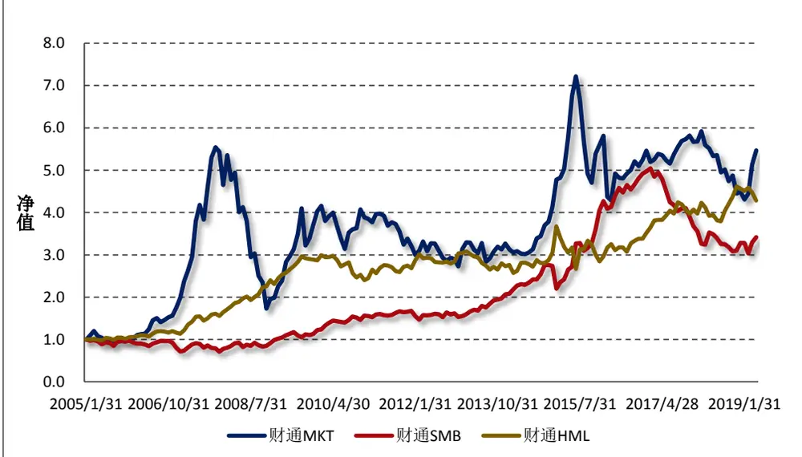
数据来源：财通证券研究所，恒生聚源

图 15 展示了财通金工计算得到的 Fama-French 三因子的净值走势，可以看到在样本回测区间内小市值股票表现要优于大市值股票，低估值股票表现要优于高估值股票，而 MKT 因子则与 Wind 全 A指数的走势十分相似。

图 16：财通金工特质动量因子覆盖率
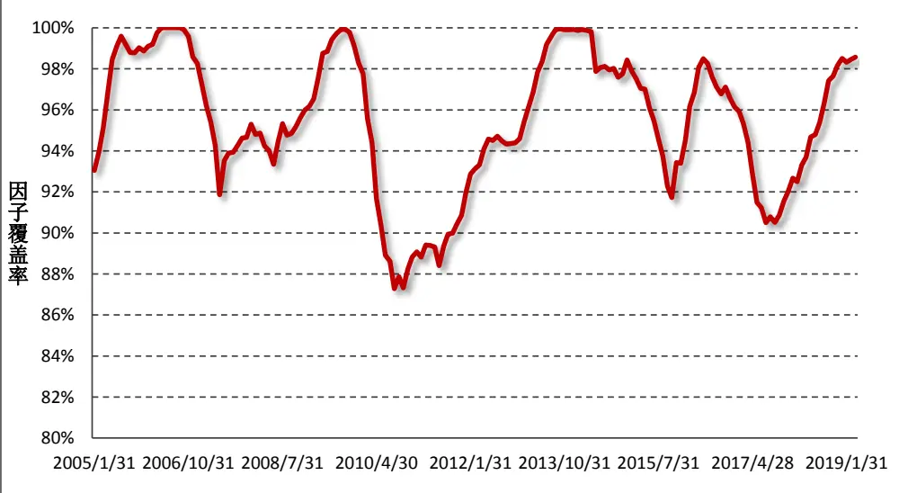
数据来源：财通证券研究所，恒生聚源

在特质动量因子的计算中我们还需考虑数据的完整度情况进行一些处理。首先在第一步个股时间序列回归求回归系数时，如果某个月该股票处于长期停牌状态，那么股票在该月的收益就很难与风格因子收益保持一致，因此如果股票在某个月的交易天数少于 10天，我们就不将该月数据纳入到回归模型中。此外，在第三步根据特质收益来计算特质动量因子时，如果回望的 12个月中少于 3个月有数据，那么我们也不计算该股票在当月的特质动量因子值。财通金工采用不加截距项的三步法来计算特质动量因子，其因子覆盖率的时间序列如图 16 所示，可以看到各期因子覆盖率基本上保持在 90%以上，回测区间内因子覆盖率均值达到 95%，说明因子的完整性较好，数据质量较高。

在后续的章节中，我们会将特质动量因子与传统动量因子的有效性进行比较，我们在此介绍一下传统动量因子的计算方法。假设当前处于 t 月的月末，那么单只股票传统动量因子即是该股票在 t-12 月到 t-1 月之间的累计收益：

$$
MOM_{i,t}=\prod_{t-12}^{t-1}\left(1+r_{i,t}\right)-1
$$

## 3、 实证结果分析

本部分我们对传统动量因子和特质动量因子的有效性进行检验，我们发现原始因子与市值、换手率、波动率等因子存在强相关性，因此要对因子进行正交化处理。正交化处理过后的因子选股效果明显增强，且特质动量因子的选股效果比传统动量因子更为稳定。

## 3.1 原始因子有效性检验

下面我们对传统动量因子和特质动量因子在全样本进行分组测试，回测细节如下：

回测时间：2005.1.31-2019.4.30

回测样本：Wind 全 A样本股

样本筛选：剔除上市时间少于 100 天、剔除调仓日停牌一天、剔除 ST、*ST、PT 等被标为风险预警的股票、剔除调仓日涨停或者跌停的股票

调仓时间：每月最后一个交易日

分组方式：按照因子值从小到大分 10 组（D0-D9），每组成分股进行等权处理，因子值最小的一组（D0）作为空头，因子值最大的一组（D9）作为多头基准指数：每期满足条件的样本股收益等权平均

表 2：特质动量因子和传统动量因子回测结果比较（原始值）

| 特质动量_原始值 | IC | RankIC | 多头月均超额收益 | 空头月均超额收益 | 多空收益差 |
| --- | --- | --- | --- | --- | --- |
| 均值 | -0.67% | -1.92% | -0.18% | 0.16% | -0.43% |
| 月胜率 | 47% | 44% | 47% | 51% | 50% |
| t 值 | -0.75 | -1.97 | -0.6 | 1.11 | -0.88 |

| 传统动量_原始值 | IC | RankIC | 多头月均超额收益 | 空头月均超额收益 | 多空收益差 |
| --- | --- | --- | --- | --- | --- |
| 均值 | -1.81% | -2.12% | -0.68% | -0.20% | -0.62% |
| 月胜率 | 43% | 43% | 43% | 44% | 46% |
| t值 | -1.57 | -1.71 | -2.03 | -0.74 | -0.97 |

数据来源：财通证券研究所，恒生聚源

表 2 展示了特质动量因子和传统动量因子的 IC、RankIC、多头及空头基准指数的超额收益，可以看到在全样本时间段内原始因子的 IC和 RankIC 值的绝对值军小于 1，在统计意义上并不显著。

由上面分析可知，传统动量因子和特质动量因子的原始值在全样本区间内的选股效果并不理想，这可能是由于原始因子本身与其他已知风格因子之间存在强相关性造成的吗？图 17 和图 18 对特质动量因子和传统动量因子在 Beta、BP、最近 21 天换手率均值（Tunover21）、最近 21 天收益率（Ret21）、市值（Size）、最近 21 天相对市场的超额收益波动率（Vol21）的相关性。

图 17：特质动量因子每组得分均值
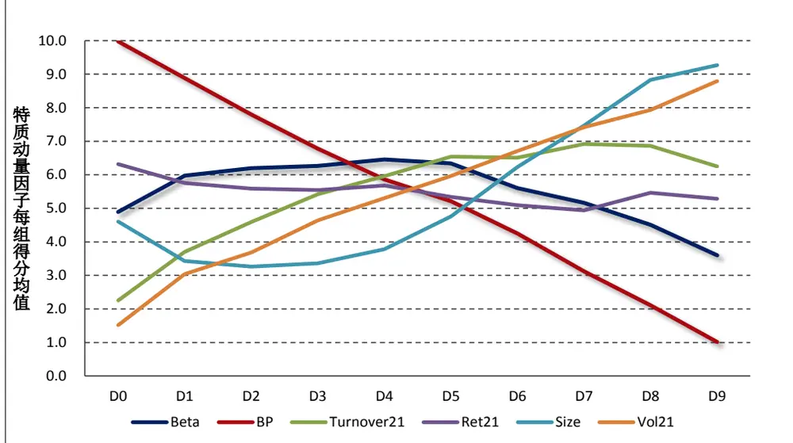
数据来源：财通证券研究所，恒生聚源

为了避免各期因子值的较大变化对最后计算时间序列均值时造成的影响，也为了方便不同因子之间可以进行比较，我们首先将股票的风格因子值转化成排序值，计算各组成分股在该风格因子上的加权均值，然后再根据每组的加权均值进行打分（ 分），最终计算每组得分在时间序列上的均值。

由图 可以看到，特质动量因子与 因子之间存在明显的负相关性，特质动量因子越高的组别 BP 因子值越小；此外，特质动量因子值最大的 D9 组别市值明显更大；最为重要的是，特质动量因子与换手率因子和波动率因子之间存在非常明显的正相关性，特质动量因子最大的那一组的波动率和换手率都明显更高，由于 A 股市场上波动率和换手率是非常明显的反向因子，因此多头组合在波动率、换手率和大市值上的暴露在一定程度上削弱了组合收益。最后我们看一下特质动量因子与反转因子（Ret21）之间的相关性，由于在因子计算的过程中我们剔除了最近 1 个月的收益，因此二者之间并不存在明显的相关关系。

同样的，由图 18 可以看到，传统动量因子与 BP 因子之间也存在较为明显的负相关性，与市值、波动率和换手率之间存在明显的正相关关系，而与 Beta因子和反转因子之间的关系并不明显。

由以上分析可知，特质动量因子与传统动量因子在市 BP、市值、21 天换手率和 21 天波动率之间均存在明显的相关关系，这种相关关系会在一定程度上削弱多头收益、增强空头收益，因此我们需要对这些因子进行剔除，具体来讲：

$$
IMOM_{i}=\alpha_{i}+BP_{i}+Size_{i}+Turnover21_{i}+Vol21_{i}+\varepsilon_{i}
$$

$$
MOM_{i}=\alpha_{i}+BP_{i}+Size_{i}+Turnover21_{i}+Vol21_{i}+\epsilon_{i}
$$

在每个横截面上，我们将目标因子对已知因子进行横截面回归，将回归得到的残差变量作为新因子的代理变量，继而检验经正交化后的因子在全样本区间内的选股效果。

图 18：传统动量因子每组得分均值
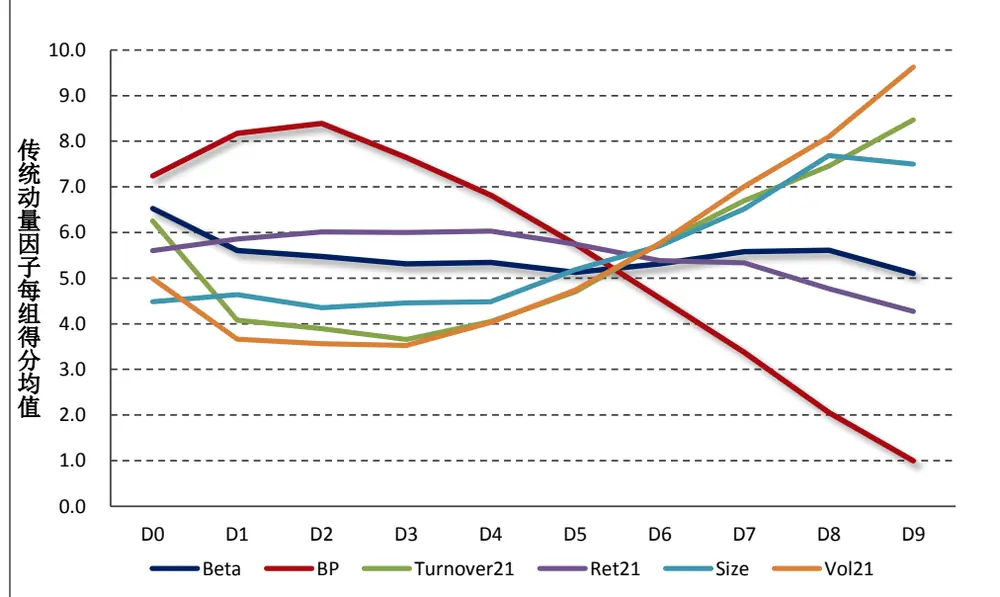
数据来源：财通证券研究所，恒生聚源

## 3.2 正交化因子选股有效性检验

表 3 展示了经过正交之后的特质动量因子和传统动量因子的 IC、RankIC、多空相对基准的超额收益及多空收益差，可以看到经过正交化处理后二者的选股能力都明显增强。全样本区间内，特质动量因子的 RankIC 为 3.15%，稍低于传统动量因子的 3.28%，二者的 t 值分别为 4.98 和 4.14，统计意义上显著。此外，特质动量因子多空组合收益差的月度溢价达到 0.87%，优于传统动量因子 0.72%的溢价程度，且其胜率要明显更高（64%VS 56%）。

表 3：特质动量因子和传统动量因子回测结果比较（正交化）

| 特质动量_正交化后 | IC | RankIC | 多头月均超额收益 | 空头月均超额收益 | 多空收益差 |
| --- | --- | --- | --- | --- | --- |
| 均值 | 2.28% | 3.15% | 0.30% | -0.61% | 0.87% |
| 月胜率 | 62% | 63% | 56% | 33% | 64% |
| t值 | 3.91 | 4.98 | 2.07 | -4.88 | 3.76 |
| 传统动量_正交化后 | IC | RankIC | 多头月均超额收益 | 空头月均超额收益 | 多空收益差 |
| 均值 | 1.23% | 3.28% | -0.16% | -0.95% | 0.72% |
| 月胜率 | 53% | 62% | 48% | 35% | 56% |
| t 值 | 1.73 | 4.14 | -0.51 | -4.96 | 2.5 |

数据来源：财通证券研究所，恒生聚源

图 19 和图 20 分别展示了十分组情况下，特质动量因子和传统动量因子相对基准指数的月均超额收益，可以看到特质动量因子的分组单调性更好，其多头组合的月均超额收益为 （胜率 ），空头组合的月均超额收益为 （胜率 33%）。相较之下，传统动量因子的单调性就明显更弱，在传统动量因子最大的那一组甚至出现了一定程度的反转，也就是说对于前期涨幅过高的股票而言，在下一个月落后市场基准指数的概率更大。

图 19：特质动量因子分组累计收益及胜率
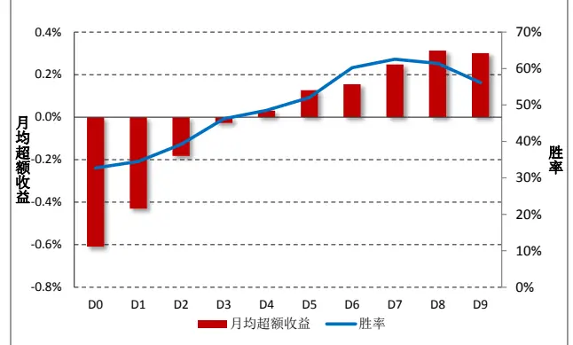
数据来源：财通证券研究所，恒生聚源

图 20：传统动量因子分组累计收益及胜率
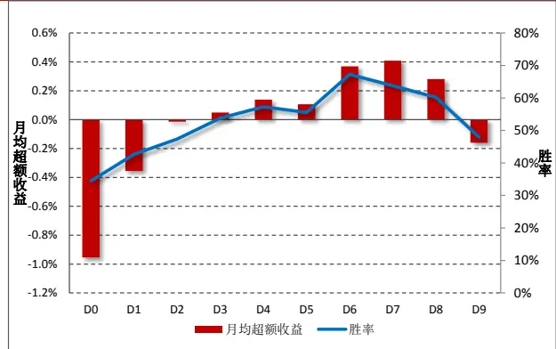
数据来源：财通证券研究所，恒生聚源

图 21：正交化后特质动量因子多空净值及月度收益差
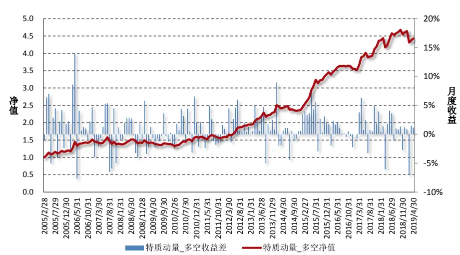

| 年化收益率 | 年化波动率 | 年化IR | 最大回撤 | 胜率 |
| --- | --- | --- | --- | --- |
| 12.8% | 9.05% | 1.42 | 16.3% | 64 % |

数据来源：财通证券研究所，恒生聚源

图 22：正交化后传统动量因子多空净值及月度收益差
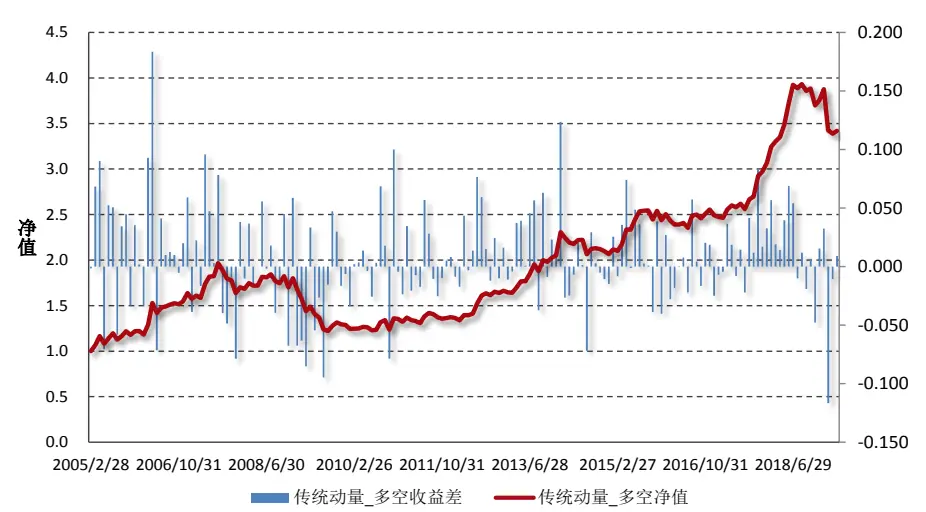

| 年化收益率 | 年化波动率 | 年化 IR | 最大回撤 | 胜率 |
| --- | --- | --- | --- | --- |
| 11.35% | 11.19% | 1.01 | 37.2% | 56% |

数据来源：财通证券研究所，恒生聚源

图21和图22分别展示了经过正交化处理后特质动量因子和传统动量因子多空组合的净值走势、月度收益差和绩效统计，可以看到基于特质动量因子构建的多空组合信息比率要明显高于传统动量因子（1.42 VS 1.01），而且该组合的最大回撤也明显更小（16.3%VS 37.2%），从这两个指标来看，基于特质动量因子构建的组合都明显更优。

关于动量因子的回撤是国外研究中最为关心的部分，Daniel和 Moskowitz（2013）对美国市场上的“动量崩溃”（Momentum Crash）效应进行了探讨，在后面的章节中我们将从多空组合对 Beta 因子上的暴露度出发，对特质动量因子相较传统动量因子的回撤明显更小的原因进行分析。

## 3.3 情景分析

本部分我们对特质动量因子和传统动量因子在不同市场状态下的多空收益差和因子的 RankIC 进行分析，观察因子的适用情况。根据 1.2.4 小节中提到的方法，我们将市场状态分为上涨市（Up）、下跌市（Down）、持续上涨（UpMomentum）、上涨反转（UpReverse）、持续下跌（DownMomentum）和下跌反转（DownReverse）六种情况。

表 4：不同市场状态下，特质动量因子和传统动量因子的多空收益及 RankIC 表现

| 特质动量因子 |  | 多空收益 |  |  |  | RankIC |  |  |  |
| --- | --- | --- | --- | --- | --- | --- | --- | --- | --- |
| 市场状态 | 样本数量 | 均值 | 胜率 | T值 | IR | 均值 | 胜率 | t 值 | IR |
| Up | 94 | 1.16% | 68.09% | 3.357 | 1.222 | 3.56% | 62.77% | 4.299 | 0.443 |
| Down | 78 | 0.61% | 60.26% | 1.828 | 0.692 | 2.64% | 62.82% | 2.727 | 0.309 |
| UpMomentum | 59 | 0.62% | 62.71% | 1.348 | 0.571 | 2.07% | 57.63% | 2.012 | 0.262 |
| UpReverse | 35 | 2.08% | 77.14% | 4.251 | 2.775 | 6.07% | 71.43% | 4.655 | 0.787 |
| DownMomentum | 37 | 1.00% | 70.27% | 1.922 | 1.113 | 4.10% | 70.27% | 2.844 | 0.468 |
| DownReverse | 41 | 0.26% | 51.22% | 0.612 | 0.292 | 1.37% | 56.10% | 1.058 | 0.165 |
| 传统动量因子 |  | 多空收益 |  |  |  | RankIC |  |  |  |
| 市场状态 | 样本数量 | 均值 | 胜率 | T值 | IR | 均值 | 胜率 | t 值 | IR |
| Up | 94 | 1.14% | 58.51% | 2.552 | 0.894 | 3.75% | 62.77% | 3.904 | 0.403 |
| Down | 78 | 0.40% | 53.85% | 0.862 | 0.274 | 2.72% | 60.26% | 2.074 | 0.235 |
| UpMomentum | 59 | 1.02% | 57.63% | 1.678 | 0.721 | 2.99% | 59.32% | 2.453 | 0.319 |
| UpReverse | 35 | 1.34% | 60.00% | 2.120 | 1.285 | 5.04% | 68.57% | 3.227 | 0.545 |
| DownMomentum | 37 | 1.27% | 62.16% | 2.206 | 1.299 | 6.37% | 75.68% | 4.274 | 0.703 |
| DownReverse | 41 | -0.39% | 46.34% | -0.556 | -0.371 | -0.49% | 46.34% | -0.250 | -0.039 |

数据来源：财通证券研究所，恒生聚源

表 4 给出了一些非常有意思的结果，首先对于前期市场上涨和前期市场下跌两种状态中，特质动量因子和传统动量因子都在前期市场上涨的状态下更为有效，体现在多空收益均值和 RankIC均值更高。此外，二者在牛市反转（UpReverse）和持续熊市（DownMomentum）情况下都更为有效，而对于熊转牛（DownRevese）的行情下，传统动量因子的 RankIC为负，而特质动量因子的 RankIC仍然维持为正（尽管其在统计意义上并不显著）。

在 Daniel和 Moskowitz（2013）关于美国市场的“动量崩溃”现象进行探讨的研究中提到，当市场前期出现持续下跌（Down）时，前期涨幅更多的那些股票对应的即是 Beta 因子更低的那些股票，因此多头组合的 Beta 要显著低于空头组合。假如此时市场出现大幅上涨（Reverse），那么空头组合由于其高 Beta 属性其表现将会远远超过多头组合，从而导致多空组合收益差出现明显的回撤。

2019 年，A 股市场在经历了去年的大幅下跌之后出现了强势反弹，市场正处于 DownReverse 的状态中。在财通金工“拾穗”系列（九）《牛市抢跑者，低Beta 一定低风险吗？》我们提到，Beta 因子在今年是一个非常显著的风格因子，高Beta股票指数的表现要明显优于低Beta指数。而对于传统动量因子组合而言，多头组合的 Beta 值要明显低于空头组合，因此在这样的行情下传统动量因子组合将会出现明显的回撤，如图 21 和图 22 所示。相较之下，特质动量因子是由剔除了市场风格影响后的特质收益构建的指标，因此受市场波动的影响要相对更小，这也是特质动量因子的表现要优于传统动量因子的原因。

## 3.4 市值和行业衰减

本部分我们关注特质动量因子在不同市值分组和不同行业下的选股能力，图23 展示了根据流通市值进行十分组划分后，特质动量因子的选股能力，其中 D0表示市值最小的分组，D9 表示市值最大的分组。可以看到，特质动量因子在不同市值分组下并没有展现出单调特征，究其原因可能是我们在因子构建时已经对市值因子做了正交化处理。特别的，对于市值最大的组别 D9 来讲，其全样本区间内的 RankIC 达到 3.5%，并没有呈现出传统价量因子在大市值股票中的失效情况，这是该因子值得关注的原因之一。

图 23：特质动量因子在不同市值分组下的RankIC 及其胜率
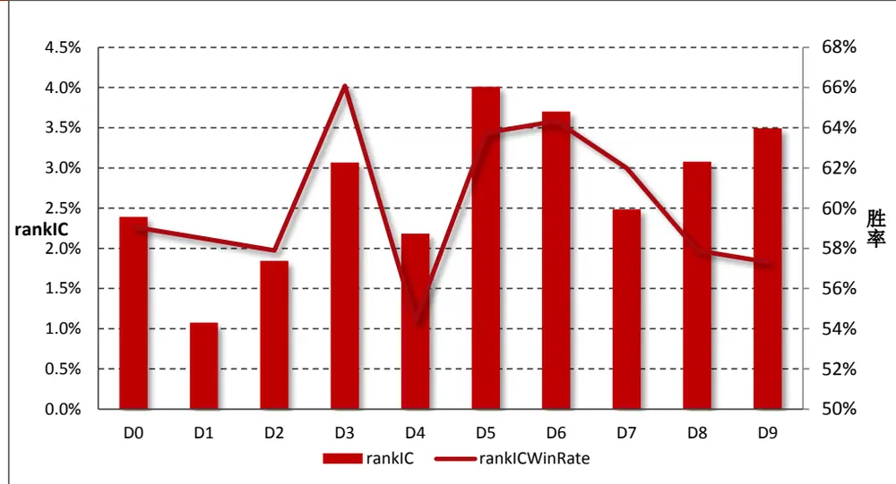
数据来源：财通证券研究所，恒生聚源

下面我们关注特质动量因子在沪深 300 成分股中的选股能力，选定2005.4.29-2019.4.30 为回测区间，每期按照因子值大小分为 5 组，图 24 展示了多空组合的月度收益及净值走势。在全样本期间，因子的 RankIC 达到 3.98%，t 值达到 3.88，在统计意义上显著。

图 24：特质动量因子在沪深 300 成分股中的表现情况
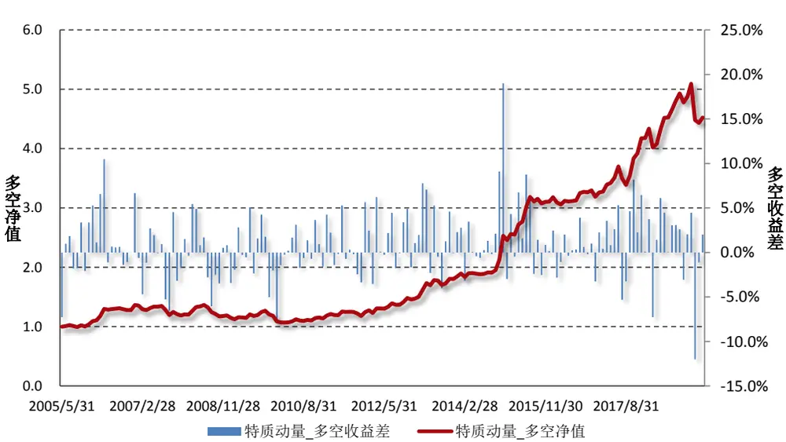

| 指标 | IC | RankIC | 多头月均超额 | 空头月均超额 | 多空收益差 |
| --- | --- | --- | --- | --- | --- |
| 均值 | 3.15% | 3.98% | 0.32% | -0.62% | 0.89% |
| 月胜率 | 57% | 58% | 57% | 34% | 64% |
| t值 | 3.11 | 3.88 | 2.14 | -5.01 | 3.84 |

数据来源：财通证券研究所，恒生聚源

在特质动量因子的行业衰减检验中，图 25 展示了其在不同行业内的 RankIC及其胜率，可以看到在全部 29 个中信一级行业中，共有 12 个行业的 RankIC 的t 值大于 2，这部分行业的 RankcIC 均值为 4.53%，月度胜率均值为 63.32%。在全部行业中仅有银行业的 RankIC 均值为负且并不显著（均值为-1.1%，t 值为-0.40），而该因子在农林牧渔行业中最为有效，其全样本区间内 RankIC 均值达到6.5%。

图 25：特质动量因子在不同行业下的 RankIC 及其胜率
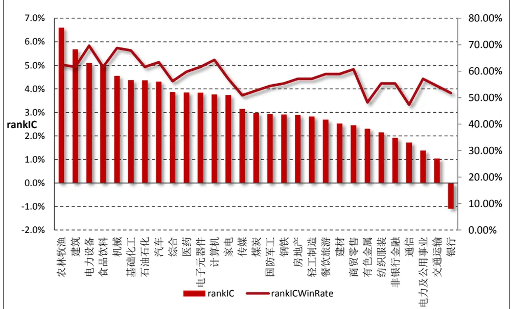
数据来源：财通证券研究所，恒生聚源

## 3.5 Fama-Macbeth 回归检验及 Spanning Test

本节最后一个部分我们对因子有效性进行 Fama-Macbeth 回归和 SpanningTest，二者的具体计算细节在 1.2.3 小节中已有详细说明。此处为了简便处理，我们在进行 Fama-Macbeth 回归的时候并不通过时间序列回归法来获取股票在因子上的暴露程度，而是直接将股票收益对已知 因子进行横截面回归，得到回归系数，最后计算回归系数的均值及其t值。此处我们进行如下两个回归：

$$
\begin{array}{c}{r_{i,t}=\alpha_{t}+\beta_{1}BP_{i,t}+\beta_{2}Turnover21_{i,t}+\beta_{3}Ret21_{i,t}+\beta_{4}Size_{i,t}+\varepsilon_{t}}\\{r_{i,t}=\alpha_{t}+\beta_{0}IMOM_{i,t}+\beta_{1}BP_{i,t}+\beta_{2}Turnover21_{i,t}+\beta_{3}Ret21_{i,t}+\beta_{4}Size_{i,t}+\varepsilon_{t}}\end{array}
$$

表 5：特质动量因子和传统动量因子的 Fama-Macbeth回归检验

| 系数 | 截距项 | 特质动量因子 | 传统动量因子 | BP | Turnover21 | Ret21 | Size | RSquare |
| --- | --- | --- | --- | --- | --- | --- | --- | --- |
| 回归系数均值 | 1.89% |  |  | 0.17% | -0.82% | -0.46% | -0.73% | 9.04% |
| 系数t值 | 2.393 |  |  | 1.590 | -7.434 | -4.221 | -4.498 |  |
| 回归系数均值 | 1.86% | 0.19% |  | 0.16% | -0.86% | -0.45% | -0.70% | 9.49% |
| 系数t值 | 2.343 | 3.104 |  | 1.515 | -7.642 | -4.189 | -4.377 |  |
| 回归系数均值 | 1.89% |  | 0.08%0.933 | 0.17% | -0.82% | -0.45% | -0.73% | 10.02% |
| 系数t值 | 2.393 |  |  | 1.580 | -7.432 | -4.077 | -4.454 |  |

数据来源：财通证券研究所，恒生聚源

由表 5 可以看到，在剔除了已知因子影响后，特质动量因子每月溢价均值为0.19%，其 t 值显著（3.104），而传统动量因子的每月溢价均值仅为 0.08%，其 t值不显著（0.933）。然而对于模型的解释能力来讲，特质动量因子的加入对模型的解释能力提高了 0.45%，而传统动量因子的加入对模型的解释能力提高了将近1%，这也说明传统动量因子更多的是一个风格因子，而非 Alpha 因子。

表 6：特质动量因子和传统动量因子的 Spanning Test

| 质皇凶 T々 c匆 星特质动量因子 截距项 |  | 西 J *y opaningMKT | Tes |  |
| --- | --- | --- | --- | --- |
|  |  |  | SMB | HML |
| 回归系数 | 0.53% | 0.32% | -10.66% | 0.75% |
| t 值 | 4.285 | 0.213 | -4.135 | 0.246 |
| 传统动量因子 | 截距项 | MKT | SMB | HML |
| 回归系数 | 0.49% | 0.70% | -12.01% | 2.25% |
| t 值 | 2.633 | 0.311 | -3.120 | 0.494 |

数据来源：财通证券研究所，恒生聚源

表 6 对特质动量因子和传统动量因子进行 Spanning Test，可以看到在剔除Fama-French 三因子影响后，特质动量因子仍然存在一定的风险溢价，其超额收益的 t 值达到 4.285，远高于传统动量因子的 t 值 2.633，从这个角度来看特质动量因子也比传统动量因子更为有效。

## 4、 因子深入分析

在前一部分中，我们针对特质动量因子和传统动量因子在全样本、不同市值分组和不同行业分组的样本股中，从 IC、RankIC、多空收益、Fama-Macbeth 和Spanning Test 等不同角度对因子有效性进行了检验，发现相较传统的动量因子而言，特质动量因子的表现更加稳健，回撤更小且在各种市场状态下都不容易发生明显的反转，本小节我们针对其背后的原因进行探讨。

## 4.1 多空组合 Beta 暴露对比

在前面的分析中，我们多次提及美国市场的“动量崩溃”效应，具体来讲它是指美国市场动量因子在1932年和2009年动量因子在短短两个月的时间内分别亏损近 70%和 50%的收益，而这两个时刻无疑都对应着美股市场前期暴跌而在该月暴涨的情况。Daniel和 Moskowitz（2013）指出，造成这种现象的最主要原因在于当市场前期暴跌时，根据动量因子分组的多头组合和空头组合的 Beta 因子值会存在明显的区别，当后市出现报复性的上涨时，多头组合由于其低 Beta 特性将会大幅落后高 Beta 空头组合带来的收益，从而导致多空组合的大幅回撤，下面我们就 A 股市场上的传统动量因子和特质动量因子之间的多空组合在 Beta因子上的暴露差值进行分析，其结果如图 26 所示。

图 26：特质动量因子和传统动量因子多空组合Beta 差值时序图
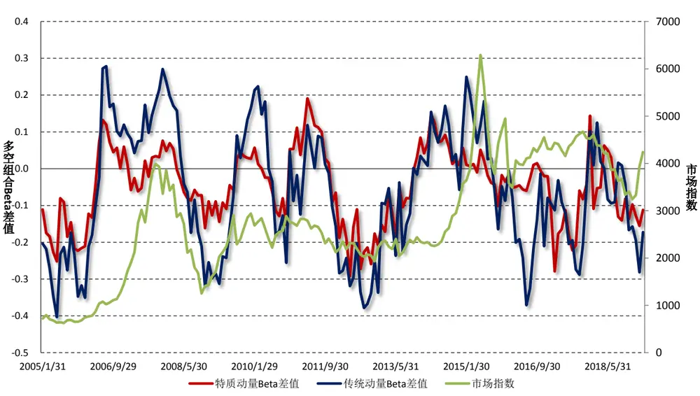
数据来源：财通证券研究所，恒生聚源

可以看到，当市场前期大幅上涨时，多空组合的 Beta 差值显著大于 0；而一旦市场持续下跌，多空组合的 Beta 因子差将明显小于 0，而且在大多数情况下，除非市场出现大幅且持续的上涨，否则多空组合的 Beta 因子差值将长期处于 0以下。以今年的市场行情为例，经过了 2018 年的持续下，传统动量因子的多空组合的 Beta 因子处于-0.3 的水平，而特质动量因子多空组合的 Beta 因子值在-0.1的水平，在今年熊转牛的市场行情下，二者在 Beta 因子上的负暴露使得组合收益出现了明显回撤。进一步分析我们发现，在全样本区间内，特质动量因子多空组合的 Beta 因子的绝对值普遍比传统动量因子多空组合的 Beta 绝对值更低，这说明前者有效地控制了组合风险，从而在市场状态发生转变时能够有效地控制最大回撤。

## 4.2 Overlapping 组合法

在本文的最后部分，我们观察特质动量因子和传统动量因子的持续性，此处我们根据 Jagadeesh 和 Titman（1993）提出的 Overlapping 方法构建因子组合，观察二者在中长期中是否会出现反转，其结果如表 7 所示。

表 7：Overlapping 法构建的多空组合情况

| 特质动量因子 | K=1 |  |  |  |  |
| --- | --- | --- | --- | --- | --- |
|  |  | K=3 | K=6 | K=9 |  |
|  |  |  |  |  | K=12 |
| Winner Ret | 0.30% | 0.04% | -0.10% | -0.29% | -0.40% |
| Winner TValue | 2.04 | 0.57 | 0.44 | 0.18 | 0.05 |
| Loser Ret | -0.61% | -0.53% | -0.44% | -0.53% | -0.59% |
| Loser TValue | -4.86 | -0.28 | 0.01 | -0.10 | -0.14 |
| Winner-Loser Ret | 0.87% | 0.47% | 0.25% | 0.16% | 0.10% |
| Winner-Loser TValue | 3.73 | 2.14 | 1.26 | 0.91 | 0.68 |
| Sharpe Ratio | 0.98 | 0.53 | 0.29 | 0.19 | 0.14 |
| 传统动量因子 | K=1 | K=3 | K=6 | K=9 | K=12 |
| Winner Ret | -0.16% | -0.45% | -0.46% | -0.59% | -0.64% |
| Winner TValue | -0.51 | -0.14 | -0.02 | -0.17 | -0.20 |
| Loser Ret | -0.95% | -0.84% | -0.70% | -0.79% | -0.82% |
| Loser TValue | -4.93 | -0.71 | -0.32 | -0.45 | -0.44 |
| Winner-Loser Ret | 0.72% | 0.31% | 0.17% | 0.16% | 0.14% |
| Winner-Loser TValue | 2.48 | 1.28 | 0.85 | 0.87 | 0.84 |
| Sharpe Ratio | 0.61 | 0.28 | 0.17 | 0.18 | 0.18 |

数据来源：财通证券研究所，恒生聚源

可以看到，当持有 1 个月的时候，特质动量因子和传统动量因子的对空组合都很显著，前者多空组合的月均收益和 t 值分别为 0.87%和 3.73，而后者多空组合的月均收益和 t 值分别为 0.72%和 2.48，特质动量因子的效果仍然更为稳健。随着持有期的数量逐步增加，二者在中长期时间段内都没有发生反转，特质动量因子的表现仍然总体优于传统动量因子。

## 5、 总结与展望

作为财通金工对 Alpha 因子研究的开篇报告，本文花了较大的篇幅详述了多因子选股过程中的流程及细节，并对单因子有效性的检验步骤进行了详尽的描述。随后，我们以特质动量因子为例，从因子构建、相关性测试、有效性检验和情景分析等不同角度出发，对特质动量因子和传统动量因子之间的优劣进行全方位解析，主要结论如下：

（1） 多因子选股流程通常包括数据获取、数据预处理、因子构建及有效性检验、因子深度分析、组合优化、组合评价及绩效归因，其中对因子的有效性检验方法介绍是本文的最大亮点；

（2） 因子有效性检验方法有 IC/RankIC 法、t 检验法、简单因子组合法、纯因子组合法、Spanning Test、分组法、GRS 检验和 Fama-Macbeth检验法等；

（3） 特质动量因子和传统动量因子的原始值与 BP 因子存在负相关，与换手率、波动率和市值因子存在明显正相关，因此需对这些风格进行正交；

（4） 经正交化后的特质动量因子和传统动量因子都体现出一定的选股能力，且特质动量因子表现更为稳健、分组单调性更好、最大回撤更小；

（5） 特质动量因子和传统动量因子在前期市场上涨时的表现要优于前期市场下的时的表现，且在牛转熊和持续熊市的市场风格下更有效；

（6） 当市场由熊市转为牛市时，传统动量因子会出现明显回撤，而特质动量因子的回撤相对较小，这主要是因为特质动量因子多空组合在Beta 因子上的绝对暴露都要更小；

（7） 通过对因子的时间衰减发现，特质动量因子和传统动量因子在中长期不会出现明显反转，可以考虑长期持有。

## 6、 风险提示

多因子模型拟合均基于历史数据，市场风格的变化将可能导致模型失效。

## 参考文献：

[1] “Momentum, Reversal, and the Trading Behaviors of Insitutions”，Roberto C.Gutierrez and Christo A. Pirinsky. Journal of Financial M arkets. 2007

[2] “Residual Momentum”. D. Blitz, J. Huij and M. Martens. Journal of Empirical Finance. 2011

[3] “The Idiosyncratic Momentum Anomaly”. D. Blitz, M.X.Hanauer, M. Vidojeciv. 2018

[4] “Residual Momentum in Japan”. R. Chang, K. Ko, S. Nakano and G. Rhee. Journal of Empirical Finance. 2018

[5] “Momentum Crashes”. K. Daniel and T. Moskowitz. Journal of Financial Economics. 2016

[6] “Risk, Return and Equilibrium”. E. Fama and J. MacBeth. Journal of Political Economy. 1973

[7] “A Test of the Efficiency of a Given Portfolio”. M.R.Gibbons, S.A.Ross, and J. Shanken. Econometrica. 1989

[8] “Returns to Buying Winners and Selling Losers: Implications for Stock Market Efficiency”. N. Jegadeesh and S. Titman. Journal of Finance. 1993

## 信息披露

## 分析师承诺

作者具有中国证券业协会授予的证券投资咨询执业资格，并注册为证券分析师，具备专业胜任能力，保证报告所采用的数据均来自合规渠道，分析逻辑基于作者的职业理解。本报告清晰地反映了作者的研究观点，力求独立、客观和公正，结论不受任何第三方的授意或影响，作者也不会因本报告中的具体推荐意见或观点而直接或间接收到任何形式的补偿。

## 资质声明

财通证券股份有限公司具备中国证券监督管理委员会许可的证券投资咨询业务资格。

## 公司评级

买入：我们预计未来 6 个月内，个股相对大盘涨幅在 15%以上；

增持：我们预计未来 6 个月内，个股相对大盘涨幅介于 5%与15%之间；

中性：我们预计未来 6 个月内，个股相对大盘涨幅介于-5%与5%之间；

减持：我们预计未来 6 个月内，个股相对大盘涨幅介于-5%与-15%之间；

卖出：我们预计未来 6 个月内，个股相对大盘涨幅低于-15%。

## 行业评级

增持：我们预计未来 6 个月内，行业整体回报高于市场整体水平 5%以上；

中性：我们预计未来 6 个月内，行业整体回报介于市场整体水平-5%与 5%之间；

减持：我们预计未来 6 个月内，行业整体回报低于市场整体水平-5%以下。

## 免责声明

本报告仅供财通证券股份有限公司的客户使用。本公司不会因接收人收到本报告而视其为本公司的当然客户。

本报告的信息来源于已公开的资料，本公司不保证该等信息的准确性、完整性。本报告所载的资料、工具、意见及推测只提供给客户作参考之用，并非作为或被视为出售或购买证券或其他投资标的邀请或向他人作出邀请。

本报告所载的资料、意见及推测仅反映本公司于发布本报告当日的判断，本报告所指的证券或投资标的价格、价值及投资收入可能会波动。在不同时期，本公司可发出与本报告所载资料、意见及推测不一致的报告。

本公司通过信息隔离墙对可能存在利益冲突的业务部门或关联机构之间的信息流动进行控制。因此，客户应注意，在法律许可的情况下，本公司及其所属关联机构可能会持有报告中提到的公司所发行的证券或期权并进行证券或期权交易，也可能为这些公司提供或者争取提供投资银行、财务顾问或者金融产品等相关服务。在法律许可的情况下，本公司的员工可能担任本报告所提到的公司的董事。

本报告中所指的投资及服务可能不适合个别客户，不构成客户私人咨询建议。在任何情况下，本报告中的信息或所表述的意见均不构成对任何人的投资建议。在任何情况下，本公司不对任何人使用本报告中的任何内容所引致的任何损失负任何责任。

本报告仅作为客户作出投资决策和公司投资顾问为客户提供投资建议的参考。客户应当独立作出投资决策，而基于本报告作出任何投资决定或就本报告要求任何解释前应咨询所在证券机构投资顾问和服务人员的意见；

本报告的版权归本公司所有，未经书面许可，任何机构和个人不得以任何形式翻版、复制、发表或引用，或再次分发给任何其他人，或以任何侵犯本公司版权的其他方式使用。