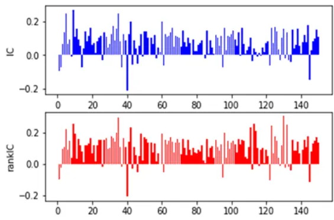
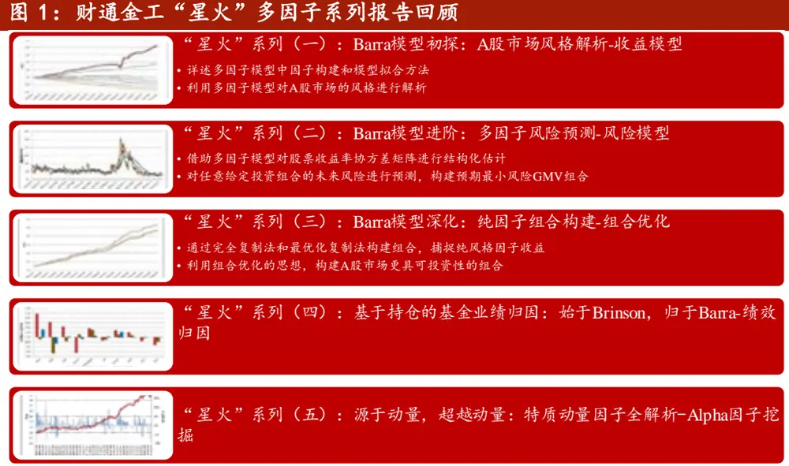
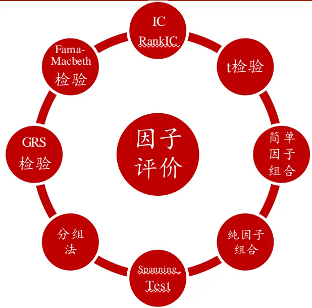
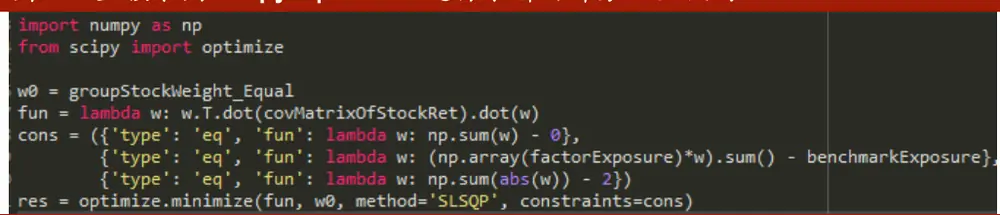
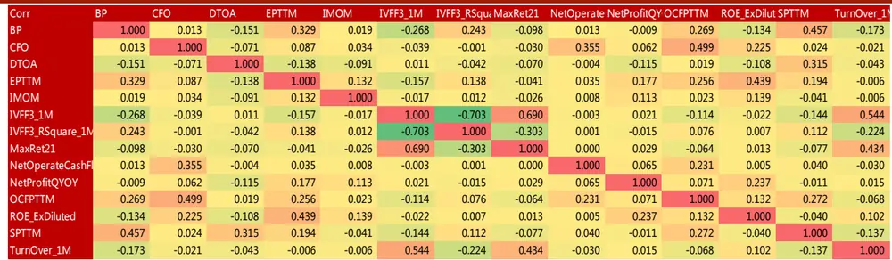
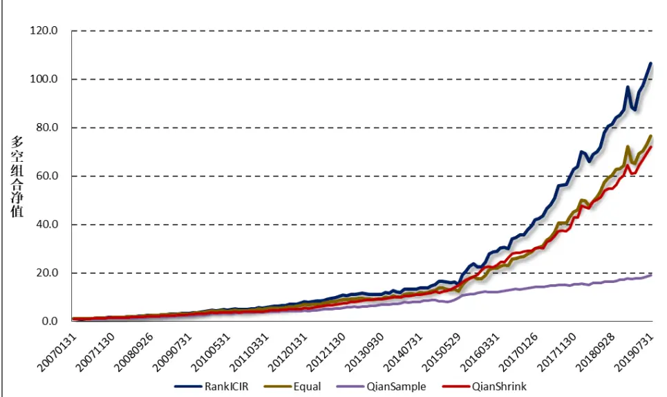
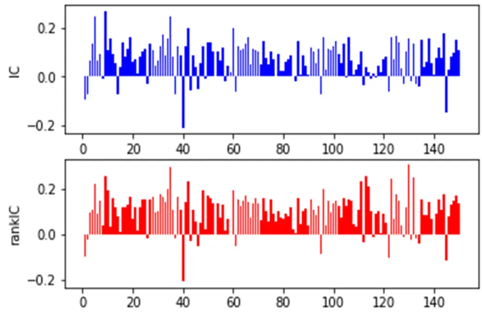
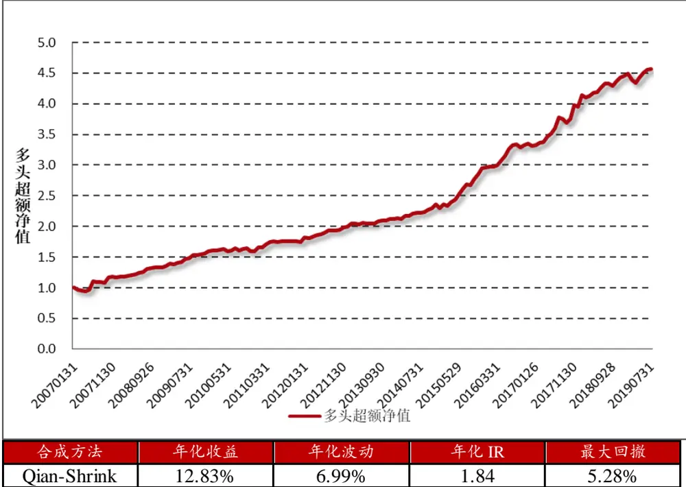

# 2019 年 08 月 27 日 Alpha 因子重构：引入协方差矩阵的因子有效性检验

## “星火”多因子专题报告（六）

## 联系信息

陶勤英分析师

SAC 证书编号：S0160517100002021-68592393

taoqy@ctsec.com

张宇研究助理

zhangyu1@ctsec.com 021-68592337 699.42

17621688421

## 相关报告

【1】“星火”多因子系列（一）：《Barra模型初探：A 股市场风格解析》

【2】“星火”多因子系列（二）：《Barra模型进阶：多因子模型风险预测》

【3】“星火”多因子系列（三）：《Barra模型深化：纯因子组合构建》

【4】“星火”多因子系列（四）：《基于持仓的基金绩效归因：始于 Brinson，归于 Barra》【5】“星火”多因子系列（五）：《源于动量，超越动量：特质动量因子全解析》

【6】“拾穗”多因子系列（五）：《数据异常值处理：比较与实践》

【7】“拾穗”多因子系列（六）：《因子缺失值处理：数以多为贵》

【8】“拾穗”多因子系列（八）：《非线性规模因子：A 股市场存在中市值效应吗？》

【9】“拾穗”多因子系列（十一）：《多因子风险预测：从怎么做到为什么》

【10】“拾穗”多因子系列（十四）：《补充：基于特质动量因子的沪深 300 增强策略》

【11】“拾穗”多因子系列（十六）：《水月镜花：正视财务数据的前向窥视问题》

【12】“拾穗”多因子系列（十七）：《多因子检验中时序相关性处理：Newey-West 调整》

## 投资要点：

## 引入协方差矩阵的因子有效性检验法

- 传统的因子有效性检验法更多关注个股对于组合在收益上的贡献程度，忽略了个股对于组合在风险层面的影响，从而在一定程度上损失部分有效信息。

- 引入协方差矩阵的因子有效性检验法的 值比多空分组法的 值应该更大，且与实际投资中的组合优化方法更为贴近。理论上而言是一种更能准确反映因子有效性程度的方法。

- 带绝对值的组合优化求解更为复杂，我们提出两种引入新变量的方法和一种直接求解法，分享在此问题上的一些探索。

## 从点到面：财通金工 Alpha因子库构建

- 财通金工从 Beta、规模、动量、波动、换手、估值、成长、质量、盈利、杠杆和特色因子出发，构建 57个基础因子，并对其有效性进行检验。

- 我们综合考虑大类因子覆盖率及子类因子表现进行手动筛选，最终选取 14个基础 Alpha 因子，作为信号选择来源。

## 集众之长：Alpha因子合成效果检验

- 常用的因子合成法有等权法、RankICIR加权法、Qian（2007）方法等。

- 实证结果表明，基于 Qian_Shrink方法得到的合成Alpha 因子效果最佳，在全样本中，多空对冲组合的信息比率达到 3.51，月胜率达到 84%，且纯多头组合相较基准存在稳健的超额收益。

Qian-Shrink 合成法 RankIC 时序图

数据来源：财通证券研究所

- 风险提示：本报告统计数据基于历史数据，过去数据不代表未来，市场风格变化可能导致模型失效。

“你以为的 Alpha最终都会成为 Beta”。在多因子选股研究中，选取并挖掘稳定的 Alpha 因子是一项难度颇高的工作。从财通金工“星火”专题（五）开始，我们从对风险模型的研究转向对收益模型的探索，正式吹响了财通金工在 Alpha因子研究领域的号角。然而独木难支，想要构建一套稳定的多因子选股模型，就必须拥有一套完善的 Alpha 因子框架。作为一篇总领性的报告，本文的首要目的即是介绍财通金工 Alpha 因子库的搭建与完善。与此同时，我们会提出一些关于因子有效性检验方法的思考，与读者共享。

## 1、 引入协方差矩阵的因子有效性检验法

## 1.1 从风险到收益：财通金工多因子系列框架

在“星火”专题系列的前四篇报告中，我们分别从收益模型、风险模型、组合优化和绩效归因四个方面出发，介绍了财通金工在多因子研究过程中的一些成果。从“星火”系列（五）《源于动量，超越动量：特质动量因子全解析》开始，我们将研究视角正式拓展到 Alpha 因子的挖掘领域，对财通金工多因子选股的总体框架和单因子检验的详细步骤进行了介绍，并以特质动量因子为例介绍了我们关注该因子的逻辑及其在不同行业、不同成分股以及不同市场情景下的表现。

数据来源：财通证券研究所

然而随着市场环境的变化，单一的 Alpha 因子经常存在阶段性失效的情况，因此我们需要搭建一套完善的基础 因子库，以便后续研究的拓展。作为“星火”系列报告的第六篇专题，同时也是我们在 Alpha 因子研究领域进行探索的第二篇报告，本文的首要目的即是总领性地为大家介绍财通金工现有的基础Alpha 因子库，从而为后续 Alpha 因子表现的周度跟踪打下坚实的基础。此外，为了解决传统的分组法在因子有效性检验中的不足，我们介绍一种引入协方差矩阵的因子有效性检验法，并为大家介绍我们在该方法研究中走过的一些弯路和思考，与读者共同探讨。

## 1.2 引入协方差矩阵的因子有效性检验

在“星火”系列（五）中，我们介绍了单因子有效性检验中，学术界和业界较为常用的一些方法，如图 2 所示。在这些不同的因子有效性检验方法中，IC/RankIC（及其 t 检验）、简单因子/纯因子组合以及 Fama-Macbeth 检验法更多地从统计学角度出发，检验因子值与下期收益在统计学意义上的显著性。相较之下，分组法、Spanning Test 和 GRS 检验则是根据因子值的大小构建投资组合，进而观察不同投资组合之间在收益上的区分程度。然而，这些因子检验方法更多关注的是个股对于组合在收益上的贡献程度，却忽略了个股对于组合在风险层面带来的影响，从而在一定程度上会损失部分有效信息。

图 2：因子有效性检验主要方法

数据来源：财通证券研究所，“星火”（五）

以传统的分组法为例，它是指在每次调仓时间点上根据目标因子由小到大进行排序并分为 N 组，以第一组为空头组合（假设该因子为正向因子），最后一组为多头组合构建多空对冲组合，并观察多空组合收益在回测时间段内的稳定性（通常用多空组合收益的 t 值表示）。然而这种方法往往只能观察到头部和尾部两个组合在未来收益上的区分程度，并未考虑处于中间分组中的股票收益带来的影响，这一点与我们实际投资组合的构建存在明显的区别。在实际应用中，投资者们往往通过组合优化的方法，最大化组合在目标因子上的暴露程度同时最小化组合的预期风险，在一定的换手、风格、行业及权重约束条件下，求解得到对应的组合权重：

$$
\begin{array}{rl}&{maxw^{\prime}\alpha-\lambda_{1}w^{\prime}Vw-\lambda_{2}\cdot\mathbf{1^{\prime}}|w-w_{0}|}\\&{~X_{S}^{lower}\leq\mathbf{w^{\prime}}X_{S}\leq X_{S}^{upper}}\\&{~X_{I}^{lower}\leq w^{\prime}X_{I}\leq X_{I}^{upper}}\\&{~w^{\prime}1=1}\\&{~w^{lower}\leq w\leq w^{upper}}\end{array}
$$

可以看到，通过上述优化方法最终形成的投资组合并非只做多头或者只做空头，而是根据每只个股对于组合的收益贡献（因子暴露）和风险贡献（协方差矩阵）的不同程度进行综合考虑求解得到的。因此我们在想，如果将协方差矩阵引入到单因子有效性的检验中，应该能更加准确地反映该因子的有效性，因为这是一种与实际情况更加贴合的检验方法。

下面我们采用数学语言对如上问题进行描述，假设样本股中共有N只股票，将其按照因子值 ${\mathbf{}}.m_{t}$ 由小到大进行排序有：

$$
m_{t,(1)}\leq m_{t,(2)}\leq\cdots\leq m_{t,(N)}
$$

如果我们将样本股分为 D 组，每个组别中有 d 只股票，那么 d 即为小于等于 N/D 的最大整数。对于多空分组法（Quantile-Based Sorting）而言，整个投资组合的权重向量 $w_{t}^{Qu}$ 即可表示为：

$$
\begin{array}{rl}&{w_{t,(1)}^{Qu}=\cdots=w_{t,(d)}^{Qu}=-1/d}\\&{w_{t,(d+1)}^{Qu}=\cdots=w_{t,(N-d)}^{Qu}=0}\\&{w_{t,(N-d+1)}^{Qu}=\cdots=w_{t,(N)}^{Qu}=1/d}\end{array}
$$

可以看到，多头和空头组合的个股权重均为 $1/d,$ ，中间组别的个股权重被置为 0。由此，组合的期望收益即可表示为： $r_{t}^{Qu}=x_{t}^{\prime}w_{t}^{Qu}$ 。其中， $x_{t}$ 表示 t 时期的个股收益向量（N×1 向量）。

与此对应的，引入协方差矩阵对因子有效性进行检验（Efficient Sorting）即是根据如下优化的方法求解组合权重：

$$
\begin{array}{c}{{\displaystyle\min w^{\prime}Vw}}\\{{\mathrm{s.t}~{m_{t}}^{\prime}w=m_{t}^{\prime}w^{Qu}}}\\{{\displaystyle\sum_{w_{i}>0}\lvert w_{i}\rvert=\displaystyle\sum_{w_{i}<0}\lvert w_{i}\rvert=1}}\end{array}
$$

其中，V表示股票的协方差矩阵，可以采用多因子模型对其进行稳健估计，具体可以参见“星火”系列（二）《Barra 模型进阶：多因子模型风险预测》和“拾穗”系列（十一）《多因子模型风险预测：从怎么做到为什么》。为了与多空分组法可以进行直接的比对，我们要求组合在目标因子上的暴露与多空组合在目标因子上的暴露保持一致，同时要求该组合是一个零额投资组合（dollar-neutral），其多头权重之和及空头权重之和均等于 1，也就是说整个组合的杠杆率为 2。

由以上分析可知，引入协方差矩阵构建的组合与多空组合在目标因子上的暴露是完全一致的，如果我们认为因子值与因子收益之间是等同的话（事实上二者之间并不完全等同），那么两个组合的期望收益应当处于相同的水平。此外，由于组合优化的目标是最小化其预期风险，因此该组合的波动应当小于多空组合收益的波动。也就是说，引入协方差矩阵构建的组合收益 t值绝对值应当大于多空分组法计算得到的组合收益t值绝对值：

$$
\mathsf{t}-\mathrm{value}=\frac{\overline{{r_{t}}}}{se\left(r_{t}\right)},\qquad\overline{{r_{t}}}=\frac{1}{T}\sum_{t=1}^{T}r_{t}
$$

从另一方面来看，引入协方差矩阵的因子有效性检验法与实际投资组合的构建过程十分类似，同时考虑到了个股在收益端和风险端对于组合的贡献程度。因此理论上而言，这种方法更能准确地反映出因子有效性程度。

## 1.3 带绝对值的组合优化求解

协方差矩阵的引入固然给我们的因子检验带来了更多的信息，但同时也为我们的组合构建带来了难度。前面提到，为了能够与多空对冲组合进行直接的比较，我们要求目标组合与多空对冲组合在因子暴露上保持一致，同时要求多头权重之和以及空头权重之和都等于 1。然而，优化过程中绝对值的引入对于组合权重的求解带来了难度，它不再是一个传统意义上的二次规划，无法简单地代入到Python 或者 MATLAB的优化包中进行快速求解。

由此，我们将引入新的变量对原问题进行转化，介绍一些我们在组合优化方面的初步探索。我们将原问题描述如下，假设 V是个股协方差矩阵（N×N）， $m_{t}$ 表示个股在目标因子上的暴露大小， $w^{Qu}$ 表示多空分组下的个股权重，那么：

$$
\begin{array}{c}{\displaystyle\min_{w}^{\operatorname*{min}w^{\prime}Vw}}\\{\mathrm{s.t}\ m_{t}^{\prime}w=m_{t}^{\prime}w^{Qu}}\\{\displaystyle\sum_{w_{i}}w_{i}=0,\ \sum_{w_{i}}\lvert w_{i}\rvert=2}\end{array}
$$

下面我们分别介绍两种引入新变量的方法和一种直接求解的方法，对上述问题进行求解：

## （1） 引入新变量 $w^{+}\hbar{\pi}w^{-}$

我们考虑的第一种求解方法是通过引入两个新的变量 $w^{+}\hbar^{\pm}w^{-}$ ，将原问题中的绝对值之和转化为两个变量之和：

$$
w^{+}=\mathrm{max}(0,w),\qquad w^{-}=-\mathrm{min}(0,w)
$$

那么，原来的权重 $w$ 及其绝对值|w|即可表示为：

$$
\begin{array}{r}{w=w^{+}-w^{-}}\\{|w|=w^{+}+w^{-}}\end{array}
$$

下面，将新的变量合成为一个向量作为待求解的权重 $\boldsymbol{X}=\binom{w^{+}}{w^{-}}_{2N\times1}$ 那么，原问题即可转化为：

$$
\begin{array}{c}{{\displaystyle\operatorname*{min}_{X}X^{\prime}HX}}\\{{\mathrm{s.t}{M_{t}}^{\prime}X=m_{t}^{\prime}w^{Qu}}}\\{{AX={\binom{1}{1}}_{2\times1}}}\end{array}
$$

其中 $M_{t}=\binom{m_{t}}{-m_{t}}_{2N\times1}$ $\mathrm{H}=\left(\begin{array}{cc}{V_{t}}&{-V_{t}}\\{-V_{t}}&{V_{t}}\end{array}\right)_{2N\times2N}$ ，A =Ι1×N 01×N01×NΙ1×N 2×2N

由上述表示可知，通过引 $\lambda w^{+}$ 和w−两个新的变量，原问题即可转换为一个标准的二次规划问题，在求解出向量 之后，即可进一步地得到原始权重 w的值。然而在实际求解中我们发现，这样的权重变换仍然存在一个问题，即无法保证 $w^{+}$ 和w−之间的对应关系。由二者的定义可知，当 $w^{+}$ 中对应位置的元素为 0 时， $w^{-}$ 对应位置的元素不为 0，反之亦然。然而在实际求解中却无法保证二者之间的一一对应关系，因此最终求解出来的结果与我们预想的结果仍然存在差别。

## （2） 引入新变量 x

由于上一种方法无法保证 $w^{+}$ 和 ${\mathfrak{r}}w^{-}$ 之间的一一对应关系，因此我们转换一种思路，引入新的变量 $x,$ ，使得个股权重 $w_{i}\ /\pm$ 缩在 $-x_{i}\hbar^{\mathrm{{r}}}x_{i}$ 之间：

$$
\begin{array}{c}{x=(x_{1},x_{2},\ldots,x_{n})^{\prime}}\\{-x_{i}\leq w_{i}\leq x_{i},\qquad x_{i}\geq0}\end{array}
$$

那 $\boldsymbol{\mathcal{Z}}$ ，将原权重与新变量合成为一个向量 $\boldsymbol{\cdot}\boldsymbol{X}=\binom{w}{x}_{2N\times1}$ 作为待优化的权重，原问题即可转化为：

$$
\begin{array}{c}{\underset{X}{\mathrm{min}}X^{\prime}HX}\\{\mathrm{s.t}~M_{t}^{\prime}X=m_{t}^{\prime}w^{Qu}}\\{AX=\binom{0}{2}_{2\times1}}\\{x_{i}\geq0,w_{i}\leq x_{i},~-w_{i}\leq x_{i}}\end{array}
$$

其中， $H=\left({\begin{array}{cc}{V_{t}}&{\mathbf{0}}\\{\mathbf{0}}&{\mathbf{0}}\end{array}}\right)_{2N\times1},M_{t}=\left({\begin{array}{c}{m_{t}}\\{\mathbf{0}}\end{array}}\right)_{2N\times1},\mathsf{A}=\left({\begin{array}{cc}{I_{1\times N}}&{0_{1\times N}}\\{0_{1\times N}}&{I_{1\times N}}\end{array}}\right)$ 。同样的，上述问题转化成了一个标准的二次规划问题，只是在表述上显得更为复杂。此外，最终求解的权重未必会打在边界点上，我们可以增加一个限制条件，最小化组合风险的同时最小化 x 的值，从而让 w 与 x 不断逼近。

## （3） 直接求解

前面两种方法通过引入新的变量，将原本待优化的N×1 维向量变成了 2N×1 维向量。当数据量较小时问题不大，而当数据量较大时（如目前 A股市场共有三千多只股票时），其运算精度将会出现一定的折扣，仅给部分个股赋权，大多数个股权重接近于 0，且有时并不能求得边际最优解。因此，我们也可以适当考虑直接调用 scipy.optimize包进行求解，其核心代码如图 3 所示：

图 3：直接采用scipy.optimize 进行求解的部分优化代码

数据来源：财通证券研究所

直接调用 scipy.optimize 包进行权重求解直观便捷，且最终确实能够求解出满足条件的组合权重。但是相较于二次规划问题求解而言，其运行速度十分缓慢，单单对于一个因子而言，对总共114个月的优化就需要将近30个小时甚至更多，时间花销极大。

到目前为止，我们讨论了三种可能的方法对带绝对值约束的组合优化进行求解。然而，实际的组合构建将会涉及到更多层面的约束，例如投资经理通常有最大换手、跟踪误差、行业暴露、风格暴露、权重上限、个股数量等不同方面的限制，唯有通过组合优化的方法才能获取满足条件的组合权重。在后续的研究中，我们将就该方面的内容进行持续探索，欢迎投资者们持续关注！

## 2、 从点到面：财通金工 Alpha 因子库构建

到目前为止，我们对引入协方差矩阵的单因子有效性检验方法进行了介绍。从本节开始我们将构建具体的 Alpha 因子，并对其在 A股市场上的有效性进行检验。根据国内外研究者们的过往经验，我们将基础的 Alpha 大类因子分为 Beta、规模、动量、波动、换手、估值、成长、质量、盈利、杠杆和财通金工特色因子。

图 4：财通金工Alpha 因子库所属大类

数据来源：财通证券研究所

如果按照构建因子采用的基础数据进行分类，我们可以将基础 Alpha 因子划分为价量因子和财务因子两个大类。其中价量因子的数据相对标准、数据更新频率高、覆盖率广、处理起来难度较小。对于财务数据而言，由于存在数据修正和发布滞后两大问题，因此需要花费更多的精力进行数据预处理。为了解决这些问题，我们从落地数据库中获取上市公司定期报告发布的原始数据及发布时间，自行构建对应的衍生数据指标，得到了一个质量相对较优的数据集，具体细节可参见“拾穗”系列（16）《水月镜花：正视财务数据的前向窥视问题》。

表 1：财通金工基础 Alpha 因子库计算说明

| 大类因子 | 因子名称 | 计算说明 | 备注 |
| --- | --- | --- | --- |
| Beta | Beta | 个股过去252 天日度收益对市场指数回归，市场指数收益采用样本股市值加权构建 | 1） 需剔除停牌日2）若满足条件的样本数据少于 42 天，置为 NaN |
| 规模/MV | totalM V/lnTotalMV | 总市值/总市值对数 |  |
|  | negotiableM V / lnNegotiablM V | 流通市值/流通市值对数 | 各家数据提供商存在细微区别 |
|  | SizeNL / FreeSizeNL | 非线性规模 | 计算参见“拾穗”系列（八） |
| 动 量/Momentum | Ret21/Ret63/Ret126/Ret252_21 | 过去N日收益率 | 长期动量 Ret252_21 需要将过去252 天收益率减去最近21 天收益 |
|  | MinRet21/MaxRet21 | 过去N日最大收益率/最小收益率 |  |
| 波动率/Volatility | HighLow_1M /3M/6M | 过去N月最高收盘价与最低收盘价比值 |  |
|  | STD_1M/3M/6M | 过去N月日度收益率标准差 | 需剔除停牌日数据 |
|  | STD_1M_Excess/3M/6M | 过去N月日度超额收益率标准差 | 市场收益采用样本股流通市值加权收益 |
|  | IVFF_1M/IVFF_RSquare_1M | 特质波动率/特异度 | 个股过去 21 天收益对 FF3 因子进行时序回归，取残差波动率及R方 |
| 换手率/Liquidity | VSTD_1M/3M/6M | 过去N月成交量标准差 | 需剔除停牌日数据 |
|  | Amihud Illiqudity | 过去21个交易日的日涨跌幅绝对值除以成交额指标的均值 | 衡量个股成交量对于价格的冲击 |
|  | TurnOver_1M/3M/6M/1Y | 最近N月日度换手率平均 | 需剔除停牌日数据 |
| 估值/Value | BP | 市净率PB的倒数=净资产/总市值 | 对应 Wind 中 pb_lf 倒数 |
|  | EP | 市盈率PE的倒数=净利润TTM/总市值 | 对应 Wind 中 pe_ttm 倒数 |
|  | SP | 市销率PS的倒数=营业收入TTM/总市值 | 对应 Wind 中 ps_ttm 倒数 |
|  | NCFPTTM | 现金净流入TTM/总市值 | 对应 Wind 中 pcf_ncf_ttm 倒数 |
|  | OCFPTTM | 经营性现金流入TTM/总市值 | 对应 Wind 中 pcf_ocf_ttm 倒数 |
| 成 长/Growth | OperatingRevenueQYOY | 单季度营业收入（最新财报）同比增长率 | 采用最新可获得的数据，避免数据修正和发布滞后问题 |
|  | NetProfitQYOY | 单季度净利润（最新财报）同比增长率 | 同上 |
|  | NetOperateCashFlowQYOY | 单季度经营性现金流（最新财报）同比增长率 | 同上 |
| 质 量/Quality | CFO | 经营活动产生的现金流量净额/期末总资产*100% | 衡量企业现金流量 |
|  | 总资产周转率 AssetsTurn | 营业收入/（期初总资产+期末总资产）/2*100% | 衡量企业营运能力 |
|  | 流动比率 CurrentRatio | 流动资产/流动负债 | 衡量企业资本结构 |
|  | 净利润现金含量NetProfitCashCover | 经营活动产生的现金流量净额/归属母公司所有者的净利润 | 衡量企业盈利质量 |
| 盈 利/EarningYield | 净资产收益率ROE(摊薄)ROE_Diluted | 归属母公司股东净利润/期末归属母公司股东的权益*100% |  |
|  | 扣非后净资产收益率ROE（摊薄）ROE_ExDiluted | 扣除非经常性损益后归属母公司股东净利润/期末归属母公司股东的权益*100% |  |
|  | 总资产报酬率ROA | 净利润（含少数股东损益）*2/(期初总资产+期末总资产)*100% | 轻资产行业（如计算机行业）比较少看 ROA 指标 |
|  | 销售毛利率 GrossProfitM argin | （营业收入-营业成本）/营业收入*100% |  |
|  | 销售净利率 NetProfitM argin | 净利润/营业收入*100% |  |
| 杠杆率/Leverage | 市场杠杆率MLEV | (总市值+非流动负债)/总市值 | 对于银行股不适用 |
|  | 资产负债率DTOA | 总负债/总资产 |  |
|  | 账面杠杆率 BLEV | (账面价值+非流动性负债)/账面价值 | 对于银行股不适用 |
| 特色因子 | 特质动量 IMOM | 具体参见“星火”（五）和“拾穗”（12） | 采用对 Beta 进行正交的版本 |

数据来源：财通证券研究所

表 1 展示了所有大类因子下面的子类因子名称及其具体的计算细节，我们在此进行如下几点说明：

（1）可以看到，部分 Alpha因子与 Barra 因子所属的类别和计算方式非常相似，但我们必须明确二者之间仍然是存在区别的。作为构建风险模型的子类因子，我们对于风险因子的基本要求即是其要有较高的稳定性（通常用自稳定系数表示，具体可参见“星火”（三）），这样将更加有利于组合的风险控制。如果风险因子本身的变化十分迅速，那么将会出现在期初控制的风险在期末时间出现明显偏离的情况，也正是基于此我们在风险因子的计算中尽可能地用较长时间段的数据。例如在计算动量因子时，我们采用的是个股在过去 1 年的收益率。而在计算 Alpha 因子时，我们通常会采用有效性更强的反转因子（Ret21）。

（2）在基础Alpha因子计算中，我们列出了规模因子和非线性规模因子。然而，由于 A 股市场存在明显的大小盘轮动效应，特别是在 2017年白马股抬头的市场行情下，传统的小市值因子出现明显回撤。因此，越来越多的投资者在进行组合构建的过程中采用市值中性的策略。在我们的后续研究中，同样将规模因子作为风险因子看待，不将其加入到因子选股的应用中。在进行单因子检验时，我们同样要求将目标因子对市值因子进行中性化处理。

（3） 由于财务报表披露规则的不同，银行股在部分因子上存在普遍的缺失（如市场杠杆率和账面杠杆率等）。对于这种情况，我们可以将小类因子合成大类因子进行处理。

## 3、 Alpha 因子有效性检验

在介绍了基础 Alpha 因子库的构建后，本部分我们对这些因子的有效性进行检验。由于篇幅限制，我们在此仅列出各类因子在全样本中的绩效表现。如需了解因子在沪深 300 和中证 500 中的表现情况，可以与我们直接联系获取。

前面提到，由于 A 股市场存在明显的大小盘轮动效应，且很多因子与规模因子之间存在明显的相关性，因此我们在进行单因子检验时，首先将目标因子对规模因子进行中性化处理，随后再检验中性化后因子值的有效性：

$$
X_{i}=\alpha_{i}+\beta_{i}\cdot Size+\varepsilon_{i}
$$

需要说明的是，在检验目标因子在沪深300和中证500样本股中的有效性时，我们先在全样本中进行中性化处理，随后在沪深300和中证500中进行选股检验。表 3 展示了所有基础因子在全 A股中的绩效表现，回测细节如下：

（1） 回测时间：2005.1.31-2019.7.31

（2） 回测样本：Wind 全 A样本股

（3） 样本筛选：剔除上市时间少于 100 天、剔除调仓日停牌一天、剔除ST、*ST、PT 等被标为风险预警的股票、剔除调仓日涨停或者跌停的股票

（4） 调仓时间：每月最后一个交易日

（5） 分组方式：按照因子值从小到大分为 10 组（D0-D9），每组成分股进行等权处理，因子值最小的一组（D0）作为空头，因子值最大的一组（D9）作为多头

（6） 因子方向：如果最终因子值较大的多头组合收益高于因子值较小的空头组合收益，那么认为该因子方向为正，反之为负。

表 3：Alpha 因子绩效表现-全样本（2005.1.31-2019.7.31）

| 因子名称 | 因子方向 | 年化收益 | 年化波动 | 年化IR | 胜率 | RankIC 绝对值平均 | RankIC 绝对值-t 值 |
| --- | --- | --- | --- | --- | --- | --- | --- |
| IVFF3_RSquare_1M | 1 | 29.84% | 11.15% | 2.675 | 80.46% | 0.087 | 12.527 |
| IVFF3_1M | -1 | 24.98% | 12.50% | 1.998 | 20.11% | 0.097 | 12.034 |
| TurnOver_1M | -1 | 31.42% | 16.78% | 1.873 | 25.29% | 0.106 | 10.925 |
| STD_1M_Excess | -1 | 22.07% | 14.83% | 1.488 | 27.59% | 0.087 | 9.327 |
| TurnOver_3M | -1 | 24.26% | 15.62% | 1.553 | 29.31% | 0.081 | 8.597 |
| OCFPTTM | 1 | 10.95% | 8.34% | 1.313 | 64.94% | 0.042 | 8.282 |
| MaxRet21 | -1 | 12.13% | 15.76% | 0.769 | 33.91% | 0.066 | 7.811 |
| TurnOver_6M | -1 | 20.96% | 14.99% | 1.398 | 30.46% | 0.069 | 7.581 |
| STD_3M_Excess | -1 | 17.60% | 16.73% | 1.052 | 33.33% | 0.074 | 7.095 |
| TurnOver_1Y | -1 | 17.48% | 14.80% | 1.181 | 36.21% | 0.061 | 7.043 |
| Ret21 | -1 | 19.16% | 17.71% | 1.082 | 32.76% | 0.072 | 6.792 |
| TotalM VNL | -1 | 15.58% | 10.02% | 1.554 | 29.31% | 0.047 | 6.411 |
| STD_6M_Excess | -1 | 14.91% | 17.77% | 0.839 | 36.78% | 0.065 | 6.040 |
| NetProfitQYOY | 1 | 16.05% | 12.02% | 1.335 | 68.71% | 0.050 | 5.868 |
| Res Vol | -1 | 14.81% | 17.76% | 0.834 | 37.36% | 0.061 | 5.715 |
| STD_1Y_Excess | -1 | 15.06% | 17.92% | 0.840 | 39.66% | 0.062 | 5.696 |
| Ret63 | -1 | 17.33% | 18.78% | 0.923 | 39.08% | 0.062 | 5.315 |
| SPTTM | 1 | 10.61% | 11.70% | 0.906 | 55.75% | 0.037 | 5.281 |
| BP | 1 | 15.45% | 19.90% | 0.776 | 55.17% | 0.057 | 5.064 |
| IMOM | 1 | 11.17% | 10.80% | 1.035 | 63.22% | 0.029 | 4.756 |
| STD_1M | -1 | 11.68% | 19.26% | 0.606 | 38.51% | 0.055 | 4.715 |
| EPTTM | 1 | 10.46% | 13.87% | 0.754 | 60.34% | 0.041 | 4.670 |
| STD_3M | -1 | 11.98% | 20.40% | 0.587 | 40.80% | 0.057 | 4.571 |
| NegotiableM VNL | -1 | 10.56% | 11.01% | 0.959 | 40.23% | 0.032 | 4.470 |
| STD_1Y | -1 | 12.49% | 19.48% | 0.641 | 41.95% | 0.051 | 4.285 |
| STD_6M | -1 | 12.72% | 19.83% | 0.642 | 40.80% | 0.052 | 4.202 |
| CFO | 1 | 4.99% | 8.85% | 0.564 | 56.32% | 0.020 | 4.108 |
| VSTD_1M | -1 | 14.12% | 16.15% | 0.874 | 37.36% | 0.042 | 3.925 |
| LnTotalMV | -1 | 19.36% | 25.33% | 0.764 | 39.08% | 0.055 | 3.710 |
| TotalMV | -1 | 19.36% | 25.33% | 0.764 | 39.08% | 0.055 | 3.710 |
| NetOperateCashFlowQYOY | 1 | 7.77% | 11.74% | 0.662 | 54.60% | 0.028 | 3.478 |
| Ret126 | -1 | 8.87% | 18.35% | 0.484 | 45.98% | 0.038 | 3.310 |
| ROE_ExDiluted | 1 | 8.54% | 15.26% | 0.560 | 61.59% | 0.031 | 3.052 |
| LnNegotiableMV | -1 | 14.22% | 27.00% | 0.527 | 40.80% | 0.044 | 2.814 |
| NegotiableMV | -1 | 14.22% | 27.00% | 0.527 | 40.80% | 0.044 | 2.814 |
| ROA | 1 | 7.91% | 14.54% | 0.544 | 55.75% | 0.026 | 2.685 |
| NetProfitM argin | 1 | 9.66% | 22.46% | 0.430 | 58.62% | 0.033 | 2.435 |
| HighLow_1M | -1 | 3.84% | 17.77% | 0.216 | 49.43% | 0.024 | 2.246 |
| NegotiableM VToTotalM V | 1 | 9.94% | 14.88% | 0.668 | 60.34% | 0.022 | 2.225 |
| AmihudILLIQ | -1 | 5.71% | 21.45% | 0.266 | 43.10% | 0.027 | 2.211 |
| OperatingRevenueQYOY | 1 | 8.82% | 15.12% | 0.584 | 61.96% | 0.023 | 2.211 |
| VSTD_3M | -1 | 8.11% | 17.03% | 0.476 | 44.83% | 0.023 | 2.049 |
| AssetsTurn | 1 | 3.45% | 10.15% | 0.340 | 54.60% | 0.011 | 1.985 |
| MLEV | 1 | 4.03% | 14.98% | 0.269 | 48.85% | 0.018 | 1.971 |
| NCFPTTM | 1 | 3.05% | 8.19% | 0.372 | 57.47% | 0.008 | 1.937 |
| NetProfitCashCover | 1 | 2.07% | 7.17% | 0.289 | 57.47% | 0.010 | 1.862 |
| GrossProfitM argin | 1 | 5.78% | 12.11% | 0.477 | 59.20% | 0.014 | 1.849 |
| DTOA | -1 | 6.03% | 18.09% | 0.334 | 41.95% | 0.020 | 1.812 |
| HighLow_6M | -1 | 2.03% | 18.40% | 0.110 | 48.28% | 0.018 | 1.558 |
| ROE_Diluted | 1 | 3.28% | 17.54% | 0.187 | 57.47% | 0.016 | 1.428 |
| CurrentRatio | -1 | 2.48% | 10.54% | 0.235 | 51.72% | 0.009 | 1.339 |
| HighLow_3M | -1 | 1.04% | 18.77% | 0.055 | 49.43% | 0.015 | 1.277 |
| Ret252_21 | -1 | 0.60% | 17.78% | 0.034 | 47.13% | 0.012 | 1.087 |
| VSTD_6M | -1 | 4.68% | 17.17% | 0.273 | 45.40% | 0.011 | 0.985 |
| MinRet21 | -1 | 0.04% | 17.95% | 0.002 | 52.87% | 0.009 | 0.777 |
| Beta252 | 1 | 0.15% | 19.98% | 0.007 | 50.00% | 0.007 | 0.549 |
| BLEV | 1 | 2.47% | 14.96% | 0.165 | 47.70% | 0.003 | 0.356 |

数据来源：财通证券研究所，恒生聚源

## 4、 集众之长：Alpha 因子合成效果

前面我们提到，当宏观环境和市场情绪发生变化时，单个 Alpha 因子往往会出现失效的情况，因此我们需要综合考察多个有效的 Alpha 因子，从而在一定程度上做到互相弥补，集众之长。本小节主要就几种常见的因子合成方法进行介绍，主要目的是对我们选取的 Alpha 因子有效性进行考察。

## 4.1 因子加权方式总结

常见的因子合成方法有等权法、RankICIR 加权法和 Qian（2007）方法：

## （1） 等权法（Equal）

顾名思义，等权法即是指对不同的 Alpha 因子赋予相同的权重。由于单个 Alpha 因子的量级往往不同，因此首先需要在横截面上对因子进行去极值及标准化处理，随后将各个Alpha因子进行等权合成：

$$
X_{i}=\frac{1}{K}\sum_{i}ZScore\_Alpha_{i}
$$

其中，K 表示纳入选股体系的 Alpha 因子个数，ZScore_Alpha 表示经过异常值和标准化处理过后的 Alpha 因子，我们选用 5 倍中位数去极值，随后减去横截面均值除以标准差的因子处理方法。

## （2） RankICIR 加权法

与等权合成不同，RankICIR 加权是根据因子过往的 RankICIR 进行权重赋值。具体来讲，我们首先计算单个 Alpha 因子在过去 T 个月中的 RankIC，随后将其均值除以标准差得到单个因子的 RankICIR，由此 RankICIR 衡量的是该 Alpha因子在过去一段时间的稳定性。

$$
\begin{array}{c}{{X_{i}=w_{i}\cdot\displaystyle\sum_{i}ZScore\_Alpha_{i}}}\\{{w_{i}=\displaystyle\frac{RankICIR_{i}}{\sum_{i}RankICIR_{i}}}}\end{array}
$$

若因子的有效性和稳定性越强，在因子合成时我们对其赋予更高的权重，反之亦然。

## （3） Qian’s Approach

Qian（2007）提出的因子加权方法本质上也是一种 RankICIR 加权方法，其具体方法如下：假设 Alpha 池中有 K个因子，其过去 T个月的 序列矩阵可以表示为 $IC(T\times K)$ 。那么，单个因子的期望IC 值可以用其均值表示̅IC̅̅(K×1)，而因子 IC 之间的协方差矩阵即可表示为 $\Sigma_{IC}(K\times K)$ 。如果将单个因子视为一只股票，那么我们的目的就是求解出一个最优组合权重，使得整个组合的预期收益与预期波动的比值（即预期信息比率）最大化。具体来讲：

$$
\operatorname*{max}_{w}{ICIR}=\frac{w^{\prime}\overline{{IC}}}{\sqrt{w^{\prime}\Sigma_{IC}w}}
$$

将目标函数对权重求一阶导，即可得到最优解： $w^{*}=\delta\Sigma_{IC}^{-1}\overline{{IC}}$ ，其中δ为任意正数，可用于对权重进行归一化。

## 4.2 合成 Alpha 因子表现

在搭建好基础的 Alpha 因子库之后，接下来即是将各种不同的 Alpha 信号进行合成，形成一个最终的 Alpha 合成因子。考虑到很多大类因子下面的子类因子之间的相关性较高，我们同时考虑大类因子覆盖率及子类因子表现进行手动筛选，最终选取 14 个基础 Alpha 因子，作为最终的信号选择来源，其具体定义如表 4所示。

表 4：用于组合构建的 Alpha 因子定义及基本信息

| 大类因子 | 子类因子 | 因子 RankIC-t 值 | 因子方向 |
| --- | --- | --- | --- |
| 盈利/EarningYield | ROE_ExDiluted | 3.05 | 1 |
| 成长/Growth | NetProfitQYOY | 5.87 | 1 |
|  | NetOperateCashFlowQYOY | 3.48 | 1 |
| 杠杆率/Leverage | DTOA | 1.82 | -1 |
| 流动性/Liquidity | Turnover_1M | 10.93 | -1 |
| 动量/Momentum | MaxRet_21 | 7.81 | -1 |
| 质量/Quality | CFO | 4.11 | 1 |
| 估值/Value | OCFPTTM | 8.28 | 1 |
|  | SPTTM | 5.28 | 1 |
|  | BP | 5.06 | 1 |
|  | EPTTM | 4.67 | 1 |
| 波动率/Volatility | IVFF3_1M | 12.03 | -1 |
|  | IVFF3_RSquare_1M | 12.53 | 1 |
| 特色因子 | IMOM | 4.76 | 1 |

数据来源：财通证券研究所，恒生聚源

图 5：子类因子相关性

数据来源：财通证券研究所

图 5 展示了我们所选择的子类因子在每个截面上相关系数的均值，可以看到绝大部分的因子之间的相关性较低，对于部分因子而言（如换手率、波动率与最大涨幅因子），相关系数的绝对值达到 0.5 左右，直观上来讲因子之间的共线性程度应该能满足要求。

接下来我们采用上一小节中提及的等权合成、RankICIR 加权以及 Qian（2007）方法进行 Alpha 因子合成。其中，RankICIR 加权及 Qian（2007）方法均采用过去 24 个月的因子 RankIC 值为基础数据进行计算。此外，在 Qian（2007）方法中，我们对协方差矩阵的估计又可分为样本协方差矩阵（Sample Covariance）和压缩协方差矩阵（Shrink Covariance）估计，后者的估计方法可表示为：

$$
\hat{\Sigma}_{Shrink}=\lambda\Phi+(1-\lambda)\hat{\Sigma}_{IC}
$$

其中， $\widehat{\Sigma}_{IC}$ 表示 RankIC 矩阵的样本协方差矩阵，Φ为压缩目标估计量，我们采用平均相关系数形式表示。由于并非本文关注的重点，因此有关压缩矩阵估计的详细感兴趣的读者可参见 Ledoit and Wolf（2004），作者在官网上也将核心代码进行了开源。财通金工也将在后续的专题报告中对不同方法的协方差矩阵估计进行详细的比较，敬请投资者持续关注。

由于需要回望 24 个月的历史数据，且部分因子早期数据存在缺失，因此我们将样本的回测时间段选定为 2007.1.31-2019.7.31，同样在 Wind 全 A中进行回测，基础细节与单因子测试流程保持一致，图 6 展示了根据不同方法对 Alpha 因子进行合成后，在全样本中的多空组合净值走势。

由图 6 可以看出，根据 RankICIR 加权合成的 Alpha 因子年化收益最高，其年化收益达到 44.92%，年化波动为 15.33%，信息比率达到 2.93，月胜率 78%。采用压缩矩阵估计 RankIC 协方差矩阵并根据 Qian（2007）的方法合成的方法的信息比率最高，达到 3.51，月胜率高达 84.67%。

图 6：合成 Alpha 因子多空组合净值走势-全样本（2007.1.31-2019.7.31）

| 合成方法 | 年化收益 | 年化波动 | 年化 IR | 最大回撤 | 月度胜率 |
| --- | --- | --- | --- | --- | --- |
| RankICIR | 44.92% | 15.33% | 2.93 | 9.76% | 78.00% |
| Equal | 41.16% | 14.23% | 2.89 | 9.92% | 80.67% |
| QianSample | 26.37% | 9.80% | 2.69 | 8.63% | 80.67% |
| QianShrink | 40.47% | 11.51% | 3.51 | 6.49% | 84.67% |

数据来源：财通证券研究所，恒生聚源

值得注意的是，在估计 的协方差矩阵时，采用压缩矩阵估计法与采用样本协方差矩阵估计法的效果存在明显的区别，这主要是由于采用样本协方差矩阵估计的方法存在较大的误差，对该矩阵求逆将会进一步放大其中的误差项。图 7 展示了 Qian_Shrink 方法合成的因子的月度 IC 及 RankIC 序列。

图 7：采用 Qian_Shrink 方法合成因子的 RankIC 序列

数据来源：财通证券研究所，恒生聚源

进一步地，结合 A 股市场存在较多做空限制的实际情况，我们观察多头组合相较等权基准指数的超额收益。由图 8 可以看到，相较基准指数而言，多头组合仍然取得了较为稳健的收益。在回测时间段内，多头组合相较市场指数的年化超额收益为 12.83%，年化波动为 6.99%，夏普比率为 1.84，最大回撤为 5.28%。

图 8：多头组合相较基准指数超额净值走势

| 合成方法 | 年化收益 | 年化波动 | 年化 IR | 最大回撤 |
| --- | --- | --- | --- | --- |
| Qian-Shrink | 12.83% | 6.99% | 1.84 | 5.28% |

数据来源：财通证券研究所，恒生聚源

## 5、 总结与展望

本文是财通金工在 Alpha 因子研究领域的第二篇专题报告。作为一篇总领性的报告，本文的主要目的是为投资者介绍财通金工 Alpha 库的搭建和完善。与此同时，提出一些我们在因子有效性检验方法的思考，主要结论如下：

（1） 传统的因子有效性检验法更多关注的是个股对于组合在收益上的贡献程度，忽略了个股对于组合在风险层面的影响，从而在一定程度上损失部分有效信息；

（2） 引入协方差矩阵的因子有效性检验法的t值比多空分组法的t值应该更大，且与实际投资中的组合优化方法更为贴近，理论上而言是一种更能准确反映因子有效性程度的方法；

（3） 带绝对值的组合优化求解更为复杂，我们提出两种引入新变量的方法和一种直接求解法，分享我们在此问题上的一些探索；

（4） 财通金工从 Beta、规模、动量、波动、换手、估值、成长、质量、盈利、杠杆和特色因子出发，构建 57 个基础因子，并对其有效性进行测试；

（5） 因子合成方法通常有等权法、RankICIR 加权法和 Qian（2007）方法。实证结果表明，基于 Qian_Shrink 方法得到的合成 Alpha 因子效果最佳，其 IR 达到 3.51，月胜率达到 84%。

## 6、 风险提示

多因子模型拟合均基于历史数据，市场风格的变化将可能导致模型失效。参考文献：

【1】 Efficient Sorting: A M ore Powerful Test for Cross-Sectional Anomalies. Olivier Ledoit. Michael Wolf and Zhao Zhao. University of Zurich Department of Economics. Working Paper No.238

【2】 Quantitative Equity Portfolio Management: Modern Techniques and Applications. Qian, E. Hua, R. Sorensen. Chapman & Hall/CRC Financial Mathematics Series.

【3】 Honey, I Shrunk the Sample Covariance Matrix. Oliver Ledoit, Michael Wolf. 2004.

（附注：实习生武汉大学硕士生邵新月全程参与本项研究，对本课题有重要贡献）

## 信息披露

## 分析师承诺

作者具有中国证券业协会授予的证券投资咨询执业资格，并注册为证券分析师，具备专业胜任能力，保证报告所采用的数据均来自合规渠道，分析逻辑基于作者的职业理解。本报告清晰地反映了作者的研究观点，力求独立、客观和公正，结论不受任何第三方的授意或影响，作者也不会因本报告中的具体推荐意见或观点而直接或间接收到任何形式的补偿。

## 资质声明

财通证券股份有限公司具备中国证券监督管理委员会许可的证券投资咨询业务资格。

## 公司评级

买入：我们预计未来 6 个月内，个股相对大盘涨幅在 15%以上；

增持：我们预计未来 6 个月内，个股相对大盘涨幅介于 5%与15%之间；

中性：我们预计未来 6 个月内，个股相对大盘涨幅介于-5%与5%之间；

减持：我们预计未来 6 个月内，个股相对大盘涨幅介于-5%与-15%之间；

卖出：我们预计未来 6 个月内，个股相对大盘涨幅低于-15%。

## 行业评级

增持：我们预计未来 6 个月内，行业整体回报高于市场整体水平 5%以上；

中性：我们预计未来 6 个月内，行业整体回报介于市场整体水平-5%与 5%之间；

减持：我们预计未来 6 个月内，行业整体回报低于市场整体水平-5%以下。

## 免责声明

本报告仅供财通证券股份有限公司的客户使用。本公司不会因接收人收到本报告而视其为本公司的当然客户。

本报告的信息来源于已公开的资料，本公司不保证该等信息的准确性、完整性。本报告所载的资料、工具、意见及推测只提供给客户作参考之用，并非作为或被视为出售或购买证券或其他投资标的邀请或向他人作出邀请。

本报告所载的资料、意见及推测仅反映本公司于发布本报告当日的判断，本报告所指的证券或投资标的价格、价值及投资收入可能会波动。在不同时期，本公司可发出与本报告所载资料、意见及推测不一致的报告。

本公司通过信息隔离墙对可能存在利益冲突的业务部门或关联机构之间的信息流动进行控制。因此，客户应注意，在法律许可的情况下，本公司及其所属关联机构可能会持有报告中提到的公司所发行的证券或期权并进行证券或期权交易，也可能为这些公司提供或者争取提供投资银行、财务顾问或者金融产品等相关服务。在法律许可的情况下，本公司的员工可能担任本报告所提到的公司的董事。

本报告中所指的投资及服务可能不适合个别客户，不构成客户私人咨询建议。在任何情况下，本报告中的信息或所表述的意见均不构成对任何人的投资建议。在任何情况下，本公司不对任何人使用本报告中的任何内容所引致的任何损失负任何责任。

本报告仅作为客户作出投资决策和公司投资顾问为客户提供投资建议的参考。客户应当独立作出投资决策，而基于本报告作出任何投资决定或就本报告要求任何解释前应咨询所在证券机构投资顾问和服务人员的意见；

本报告的版权归本公司所有，未经书面许可，任何机构和个人不得以任何形式翻版、复制、发表或引用，或再次分发给任何其他人，或以任何侵犯本公司版权的其他方式使用。