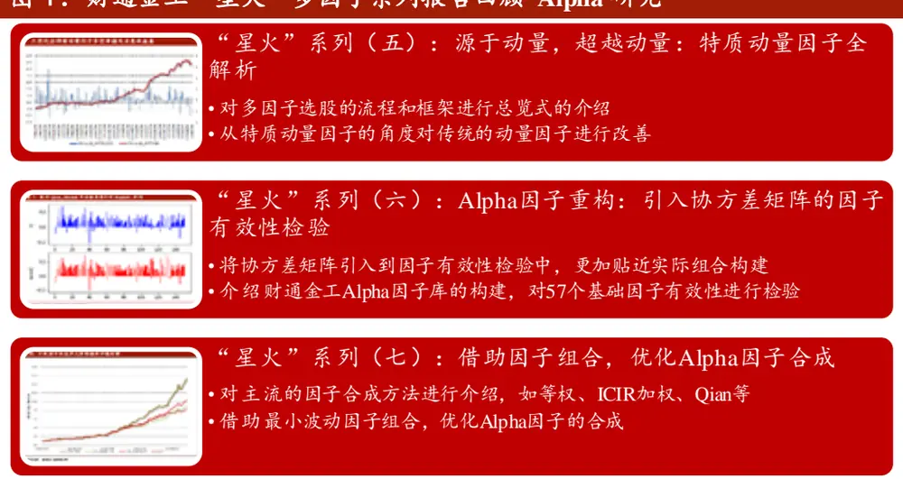
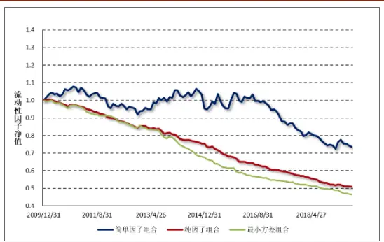
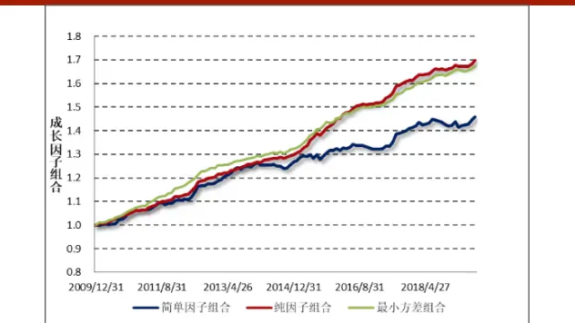
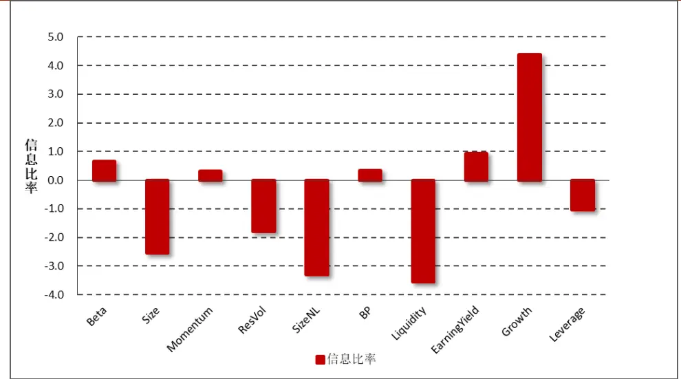
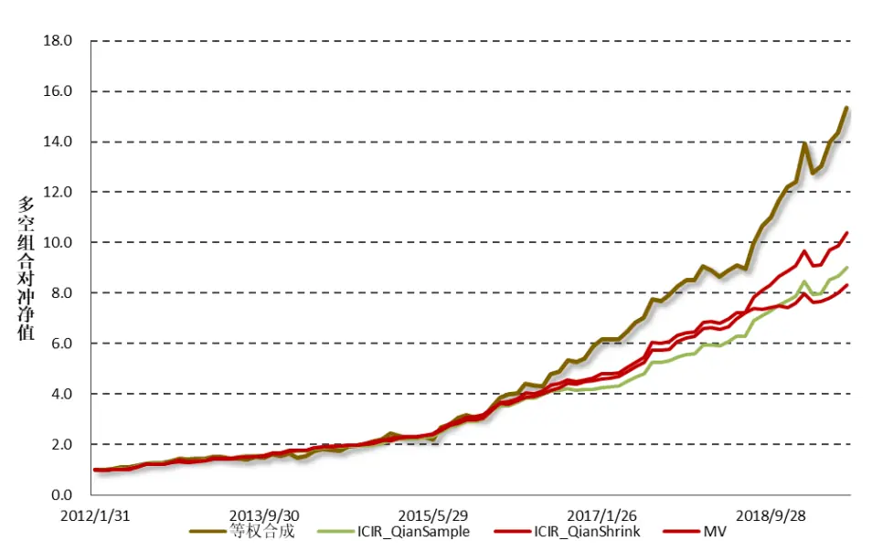

# 借因子组合之力，优化 Alpha 因子合成

2019 年 09 月 10 日

## “星火”多因子专题报告（七）

## 联系信息

陶勤英分析师

SAC 证书编号：S0160517100002

taoqy@ctsec.com

021-68592393

张宇研究助理

zhangyu1@ctsec.com 021-68592337 
17621688421

17621688421

## 相关报告

【1】“星火”多因子系列（一）：《Barra模型初探：A 股市场风格解析》

【2】“星火”多因子系列（二）：《Barra模型进阶：多因子模型风险预测》

【3】“星火”多因子系列（三）：《Barra模型深化：纯因子组合构建》

【4】“星火”多因子系列（四）：《基于持仓的基金绩效归因：始于 Brinson，归于 Barra》【5】“星火”多因子系列（五）：《源于动量，超越动量：特质动量因子全解析》

【6】“星火”多因子系列（六）：《Alpha因子重构：引入协方差矩阵的因子有效性检验》

【7】“拾穗”多因子系列（五）：《数据异常值处理：比较与实践》

【8】“拾穗”多因子系列（六）：《因子缺失值处理：数以多为贵》

【9】“拾穗”多因子系列（七）：《从纯因子组合的角度看待多重共线性》

【10】“拾穗”多因子系列（八）：《非线性规模因子：A 股市场存在中市值效应吗？》

【11】“拾穗”多因子系列（十一）：《多因子风险预测：从怎么做到为什么》

【 】“拾穗”多因子系列（十四）：《补充：基于特质动量因子的沪深 300 增强策略》

【13】“拾穗”多因子系列（十六）：《水月镜花：正视财务数据的前向窥视问题》

【14】“拾穗”多因子系列（十七）：《多因子检验中时序相关性处理：Newey-West 调整》【15】“拾穗”多因子系列（十八）：《当我们

## 投资要点：

## 因子组合的概念及构建方式

- 简单因子组合：是一种跟踪目标因子收益最直接的方式，其主要思路是做多在目标因子上存在正暴露的股票，做空在目标因子上存在负暴露的股票，其个股权重可以由一元线性回归得到。

- 纯因子组合：是根据多元线性回归拟合得到，其主要思路是在横截面上将股票收益对上期因子暴露进行回归求解得到。

- 最小波动因子组合：是所有在目标因子上具有单位暴露的组合中，预期风险最小的组合。其模型设定与纯因子组合完全一致，不同的是其权重是根据均值-方差模型优化得到的。

## 常用单因子合成方法介绍

- 目前，市场上最为常用的因子合成方法有等权合成法、RankICIR加权法、最大化 ICIR加权的方法等。

- 本文借鉴 Menchero(2015）的做法，引入一种借助最小波动组合优化 Alpha 因子合成的方法，这是一种在逻辑上自洽的因子合成法。

## 实证分析

- 从实证结果来看，纯因子组合及最小波动因子组合的信息比率都要比简单因子组合更高，且最小波动因子组合的波动及回撤相对而言都要更小。

- 在各类不同的因子合成方法中，通过最大化 ICIR加权并采用压缩矩阵估计协方差方法的信息比率最高，其在样本回测区间能够达到 3.58。相较之下，借助最小波动因子组合的方法在信息比率上虽然稍低，但其波动和最大回撤都得到了较为有效的控制。

- 风险提示：本报告统计数据基于历史数据，过去数据不代表未来，市场风格变化可能导致模型失效。

“一人计短，百人计长”。在多因子选股研究中，我们通常需要从技术面、基本面、情绪面、消息面等多个维度出发对个股特征进行分析。在财通金工“星火”专题（五）和（六）中，我们详细介绍了因子选股的基本流程及主要框架，同时引入了基础因子库搭建和检验的新思路。然而对于主动型投资经理而言，挖掘新的有效因子固然是投资过程中最为重要的一部分，但如果没有好的因子合成方法，再优秀的单个 Alpha因子也不能发挥其最大作用。这好比如果团队没有凝聚力，再好的个人也无法最大化发挥其所长一样。本期专题我们将研究重心聚焦于单个 Alpha 因子的合成，系统性地介绍目前市场上主流的单因子合成方法，随后引入一种借助最小波动因子组合优化因子合成的新思路。

## 1、 财通金工选股研究进阶：从单因子到多因子

从本系列的前面两篇专题开始，财通金工将多因子选股的研究从风险、归因层面转化到更接近投资的选股层面。在“星火”专题（五）中，我们聚焦单个因子的挖掘及有效性检验，详述了多因子选股的基本流程和主要框架，并以特质动量因子为例，正式吹响了我们在 Alpha 因子研究领域的号角。然而独木难支，随着市场风格的不断变化，单一的因子经常存在阶段性失效的情况，搭建一套完整的基础因子库便是我们后续研究拓展的重中之重。在“星火”专题（六）中，我们对 个基础因子的有效性进行了检验，并根据经验和相关性挑选出其中的 14 个子类因子、9 个大类因子构建复合因子，结果显示复合因子的多头部分具有较为稳定的选股能力。

图 1：财通金工“星火”多因子系列报告回顾-Alpha 研究

数据来源：财通证券研究所

到目前为止，我们对单因子库的搭建、检验及筛选进行了系统性的介绍，然而对单因子的合成却并未作过多涉及。作为“星火”系列报告的第七篇专题，同时也是我们在 Alpha 因子研究领域进行探索的第三篇报告，本文首先对简单因子组合、纯因子组合及最小波动因子组合的概念和构建方法进行介绍，随后我们将对目前市场主流的 Alpha因子合成方法进行梳理，主要涉及等权合成法、ICIR加权法、最大化 ICIR合成法以及借助最小波动因子组合进行 Alpha因子合成的方法。最后，我们将从实证层面出发，比较各种不同因子合成方法的实际效果。

## 2、 各类因子组合的概念及构建方式

在财通金工“拾穗”系列（ ）《从纯因子组合的角度看待多重共线性》中，我们从因子组合的角度出发，通过构建简单因子组合和纯因子组合，探究因子之间的多重共线性关系。事实上，无论是简单因子组合还是纯因子组合，二者均可通过对个股分配权重从而跟踪目标因子收益，其主要区别在于是否剔除其他风格因子的影响。在本文后续部分，我们还将介绍一种根据最小波动因子组合来优化Alpha 因子合成的方法。因此，在本小节中我们先对简单因子组合（Simple FactorPortfolio）、纯因子组合（Pure Factor Portfolio）及最小波动因子组合（MinimumVolatility Factor Portfolio）的概念及构建方式进行介绍。

## 2.1 简单因子组合（Simple Factor Portfolio）

简单因子组合是一种跟踪目标因子收益最直接的方式，其主要思路是做多在目标因子上存在正暴露的股票，做空在目标因子上存在负暴露的股票，其个股权重可以由一元线性回归拟合得到。具体来讲，在某个截面期上，将全市场所有股票的收益对单个Alpha因子进行如下回归：

$$
r_{n}=f_{c}^{S}+X_{ns}f_{s}^{S}+u_{c}^{S}
$$

其中 $r_{n}$ 表示股票n的收益率， $X_{ns}$ 为股票n在目标因子s上的暴露大小， $f_{c}^{S}$ 、 $f_{s}^{S}$ 和$u_{c1}^{s}$ 分别为截距项因子收益、目标因子收益和特质收益。由于股票收益通常存在异方差性（即小市值股票的特质波动率会明显地高于大市值股票的特质波动），因此我们采用加权最小二乘方法（ ）来主动减少这些特质波动较大的股票在回归中的权重。在实际应用中，通常采用市值的平方根加权作为回归权重 $v_{n}$ ，当然这并不是唯一的赋权方法，其他能够达到类似效果的权重选择我们认为都是合意的。

在进行模型拟合之前，我们还需对目标因子进行标准化处理。在财通金工纯因子组合的专题报告中，我们通常使得全市场股票因子的市值加权平均等于0，然而在对简单因子组合进行求解时，我们不做这样的处理，而是转而使股票因子的回归权重加权等于0，用公式表示即为：

$$
\sum_{n}v_{n}X_{ns}=0
$$

其中 $v_{n}$ 表示股票n的回归权重。这样处理的好处在于，目标因子与截距项因子（市场因子）之间不存在共线性问题。同样的，在对目标因子的标准差进行归一化时，传统的做法是除以因子的普通标准差即可，但在此处我们使得因子的回归加权标准差等于1，用公式表示即为：

$$
\sum_{n}v_{n}X_{ns}^{2}=1
$$

在对因子值进行了标准化，并对股票的拟合方式进行了设定后，我们即可对模型进行求解。由于风格因子与截距项因子不存在共线性，我们可以直接采用最小加权二乘的解析解对上式进行求解，得到如下形式（具体推导过程可参见财通金工“拾穗”系列（7））：

$$
f_{s}^{S}=\sum_{n}(v_{n}X_{ns})r_{n}
$$

可以看到，对于某个目标因子s而言，其简单因子组合中股票n的权重为 $v_{n}X_{ns}.$ 根据我们之前对风格因子的标准化处理方法可知，该组合的所有股票权重总和等于0，也就是说它是一个零额投资组合（dollar-neutral）。进一步分析可知，该简单因子组合对风格因子的暴露度为1，这是由因子的回归加权波动等于1而决定的。

## 2.2 纯因子组合（Pure Factor Portfolio）

与根据一元线性回归拟合得到的简单因子组合权重不同，纯因子组合是根据多元线性回归拟合得到的。其具体构建方式如下：在一个横截面日期上，将股票收益对市场因子、行业因子及目标因子暴露进行回归：

$$
r_{n}=f_{c}^{P}+\sum_{i}X_{ni}f_{i}^{P}+\sum_{s}X_{ns}f_{s}^{P}+u_{n}^{P}
$$

其中， $X_{ni}$ 表示股票n在行业因子i上的暴露度， $X_{ns}$ 表示股票n在目标因子s上的暴露度。由于截距项因子与行业因子之间存在完全共线性，我们需加入行业因子收益的市值加权均值等于0的约束条件，以使得方程有唯一解：

$$
\sum_{n}W_{i}f_{i}^{P}=0
$$

同样的，由于异方差性的存在，我们采用加权最小二乘法对上式进行求解，单个股票的权重即为其自由流通市值的平方根权重。特别需要注意的是，此处对于风格因子的标准化与简单因子组合中的因子标准化不同。在对纯因子组合进行构建的时候，我们使得因子的市值加权平均等于0，而非回归加权平均等于 $\text{" }0\text{。 }$ 。这样做的一个好处在于，对于截距项因子而言，其回归所得的收益即为市场指数的收益，这一点在“星火”系列的第一篇专题中有详细介绍。

在对模型的构建及因子预处理方法进行介绍后，我们就可以开始对模型进行拟合了。在财通金工“拾穗”系列（一）《带约束的加权最小二乘：一种解析解法》中，我们介绍了一种解析解法直接对各纯因子的收益进行求解：

$$
\hat{\beta}=S\hat{\gamma}=S(S^{T}X^{T}VXS)^{-1}(XS)^{T}Vr
$$

其中，V表示回归权重矩阵，r表示样本股票的收益，X为股票因子暴露矩阵，S为线性变换向量。由此，每个纯因子组合的权重矩阵 $-\Omega^{P}$ 可以表示为：

$$
\Omega^{P}=S(S^{T}X^{T}VXS)^{-1}(XS)^{T}V
$$

上述矩阵的每一行代表每一个纯因子组合的权重向量。

## 2.3 最小波动因子组合（Minimum Volatility Factor Portfolio）

最小波动因子组合是所有在目标因子上具有单位暴露的组合中，预期风险最小的组合。其模型设定与纯因子组合的模型设定完全相同，不同的是其权重是根据均值-方差模型优化得到的。具体来讲：

$$
\begin{array}{c}{{\displaystyle\operatorname*{min}_{w}w^{\prime}Vw}}\\{{s.t.w^{\prime}X_{k}=1}}\end{array}
$$

其中，V表示股票收益的协方差矩阵（N×N 维），可以通过多因子的方法对其进行稳健估计（具体可参见“星火”专题（二）《 模型进阶：多因子风险预测》及“拾穗”系列（十一）《多因子风险预测：从怎么做到为什么》）。 $X_{k}$ 表示股票在因子k 上的暴露度（N×1 维）。根据给定的目标函数和约束条件，即可构建拉格朗日函数：

$$
L(w,\lambda)=\frac{1}{2}w^{\prime}Vw-\lambda(w^{\prime}X_{k}-1)
$$

对拉格朗日函数求偏导，即有如下公式：

$$
\begin{array}{rl}&{\cfrac{\partial L(w,\lambda)}{\partial w}=Vw-\lambda X_{k}=0}\\&{\cfrac{\partial L(w,\lambda)}{\partial\lambda}=w^{\prime}X_{k}-1=0}\end{array}
$$

对以上两式进行求解，最小波动组合权重的显式解即可表示为：

$$
\Omega_{k}^{MV}=\frac{V^{-1}X_{k}}{X_{k}^{\prime}V^{-1}X_{k}}
$$

其中， $\Omega_{k}^{MV}$ 表示因子k 对应的最小波动因子组合的权重向量（N×1 维）。可以看到，因子 k 的最小波动因子组合在目标因子上的暴露度为 1：

$$
\Omega_{k}^{MV}{}^{\prime}X_{k}=1
$$

此外，因子k 的最小波动因子组合与其他因子m 的纯因子组合之间的权重向量是不相关的：

$$
\mathrm{cov}(\Omega_{m}^{P},\Omega_{k}^{MV})=\frac{(\Omega_{m}^{P})^{\prime}V(V^{-1}X_{k})}{X_{k}^{\prime}V^{-1}X_{k}}=\frac{(\Omega_{m}^{P})^{\prime}X_{k}}{X_{k}^{\prime}V^{-1}X_{k}}=0,k\neq m.
$$

这是因为当 k≠m 的时候，因子 m 对应的纯因子组合在其他的因子k 上的暴露为 0：

$$
(\Omega_{m}^{P})^{\prime}X_{k}=0
$$

## 3、 常用单因子合成方法介绍

在对简单因子组合、纯因子组合及最小波动因子组合的概念和构建方式进行梳理后，本小节我们对目前市场上主流的 Alpha 因子合成方法进行介绍，主要包括等权合成法、ICIR 加权合成法、最大化ICIR 法以及本文引入的根据最小波动因子组合进行合成的方法。

## 3.1 等权合成法

顾名思义，等权法即是指对不同的 Alpha 因子赋予相同的权重。由于单个Alpha 因子的量级往往不同，因此首先需要在横截面上对因子进行去极值及标准化处理，随后将各个 Alpha 因子进行等权合成：

$$
X_{i}=\frac{1}{K}{\sum_{i}ZScore\_Alpha_{i}}
$$

其中，K表示纳入选股体系的 Alpha 因子个数，ZScore_Alpha 表示经过异常值和标准化处理过后的 Alpha 因子，我们选用 5 倍中位数去极值，随后减去横截面均值除以标准差的因子处理方法。

## 3.2 ICIR 加权合成法

与等权合成不同，RankICIR加权是根据因子过往的RankICIR进行权重赋值。具体来讲，我们首先计算单个 Alpha 因子在过去 T 个月中的 RankIC，随后将其均值除以标准差得到单个因子的 RankICIR，由此 RankICIR 衡量的是该 Alpha因子在过去一段时间的稳定性。

$$
\begin{aligned}X_{i}=w_{i}\cdot&\sum_{i}ZScore\_Alpha_{i}\\w_{i}=&\frac{RankICIR_{i}}{\sum_{i}RankICIR_{i}}\end{aligned}
$$

若因子的有效性和稳定性越强，在因子合成时我们对其赋予更高的权重，反之亦然。

## 3.3 最大化 ICIR 方法（Qian,2007）

Qian（2007）提出的因子加权方法本质上也是一种 RankICIR 加权方法，其具体方法如下：假设 Alpha 池中有 K个因子，其过去 T个月的 RankIC 序列矩阵可以表示为IC $(T\times K)$ 。那么，单个因子的期望IC 值可以用其均值表示̅IC̅̅(K×1)，而因子 IC 之间的协方差矩阵即可表示为Σ $\iota_{IC}(K\times K)$ 。如果将单个因子视为一只股票，那么我们的目的就是求解出一个最优组合权重，使得整个组合的预期收益与预期波动的比值（即预期信息比率）最大化。具体来讲：

$$
\mathop{max}_{w}ICIR=\frac{w^{\prime}\overline{{IC}}}{\sqrt{w^{\prime}\Sigma_{IC}w}}
$$

将目标函数对权重求一阶导，即可得到最优解： $w^{*}=\delta\Sigma_{IC}^{-1}\overline{{IC}},$ ，其中δ为任意正数，可用于对权重进行归一化。值得注意的是，在对 IC 序列的协方差矩阵进行估计时，可以分为样本协方差矩阵（Sample Covariance）和压缩协方差矩阵（Shrink Covariance）估计。前者的估计方式简单直接，但是可能存在较大的估计误差，后者的估计方法则更为稳健，具体表示如下：

$$
\widehat{\Sigma}_{Shrink}=\lambda\Phi+(1-\lambda)\widehat{\Sigma}_{IC}
$$

其中， $\hat{\Sigma}_{IC}$ 表示 RankIC 矩阵的样本协方差矩阵，Φ为压缩目标估计量，我们采用平均相关系数形式表示，它是将所有股票之间的相关系数用全体相关系数的平均值表示，随后再用相关系数平均值乘以单个个股的波动率得到：

$$
\begin{aligned}\Phi_{ii}&=s_{ii},\Phi_{ij}=\bar{r}*\sqrt{s_{ii}*s_{jj}}\\其中,\begin{array}{l}\bar{r}=\frac{2}{(N-1)N}\sum_{I=1}^{N}\sum_{J=I+1}^{N}r_{ij},r_{ij}=\frac{s_{ij}}{\sqrt{s_{ii}*s_{jj}}},\end{array}\end{aligned}
$$

在平均相关系数模型中，压缩目标 $\hat{\Sigma}_{IC}$ 的对角线元素和样本协方差保持一致，非对角线元素由公式 $\Phi_{ij}=\bar{r}*\sqrt{s_{ii}*s_{jj}}$ 确定，其中r̅是由样本协方差估计出来的相关系数的平均值。

## 3.4 借助最小波动因子组合法

前面提到，在所有的因子组合中，最小波动因子组合是在单位目标因子暴露的条件下预期风险最小的组合，因此其夏普比率在理论上来讲是最高的。接下来我们介绍一种借助最小波动因子组合法优化 Alpha 因子合成的思路，其本质上是将对 K个因子的配置问题转化为对 K个最小波动因子组合的配置问题。假设我们已经有 K个 Alpha 因子，股票 n 在因子k 上的暴露度表示为 $X_{nk}^{(\alpha)}$ ，那么最终合成的复合因子即可表示为单个因子的线性组合：

$$
\alpha_{n}=\sum_{k=1}^{K}v_{k}X_{nk}^{(\alpha)},
$$

那么，根据该复合因子构建出的最小波动因子组合的权重即可表示为：

$$
h=\frac{V^{-1}\alpha}{\lambda},\lambda=\alpha^{\prime}V^{-1}\alpha^{\prime}
$$

其中，V即为个股收益率的协方差矩阵（N×N 维）。将如上复合因子拆分为单个 Alpha 因子的线性组合，那么最终形成的个股权重即可表示为：

$$
h=\frac{1}{\lambda}V^{-1}\left[\sum_{k=1}^{K}v_{k}X_{k}^{(\alpha)}\right]
$$

将协方差矩阵的逆移入到求和项中，即有：

$$
h=\frac{1}{\lambda}\Biggl[\sum_{k=1}^{K}v_{k}V^{-1}X_{k}^{(\alpha)}\Biggr],
$$

前面提到，单个Alpha因子k 的最小波动因子组合的个股权重 $h_{k}$ 可以表示为：

$$
h_{k}=\frac{V^{-1}X_{k}^{(\alpha)}}{s_{k}}
$$

其中，分母 $s_{k}$ 是使得组合在目标因子上暴露为 1 的权重归一系数：

$$
s_{k}=X_{k}^{\prime(\alpha)}V^{-1}X_{k}^{(\alpha)}
$$

因此，最终形成的复合因子的最小波动组合个股权重ℎ，即可视为单个 Alpha因子 k 的最小波动组合个股权重 $h_{k}$ 的加权：

$$
h=\frac{1}{\lambda}\Biggl[\sum_{k=1}^{K}v_{k}s_{k}h_{k}\Biggr]=\sum_{k=1}^{K}w_{k}h_{k},
$$

其权重 $w_{k}$ 即可表示为：

$$
w_{k}=\frac{1}{\lambda}v_{k}s_{k}
$$

因此，我们就可以将求解因子之间的权重 $v_{k}$ 问题，转化为求解多个因子的最小波动组合的资产配置权重 $w_{k}$ 问题：

$$
v_{k}=\frac{\lambda w_{k}}{s_{k}}
$$

现在我们将单个因子的最小波动组合（Portfolio）视为一个资产（Assest），即可通过均值方差优化的方法来确定这 K个组合之间的权重配比。具体来看，我们首先可以构建这 K个“资产”收益的协方差矩阵 G，其单个元素即可表示为：

$$
G_{kl}=h_{k}^{\prime}Vh_{l}
$$

其中， $G_{kl}$ 表示因子k 的最小波动组合收益率与因子l 的最小波动组合收益率之间的协方差， $h_{k}$ 和 $rh_{l}.$ 分别表示因子k 和因子l 的最小波动组合权重（N×1 维），V仍然表示个股协方差矩阵（N×N 维）。在估计了各个“资产”之间的协方差矩阵之后，接下来即需要估计单个“资产”的预期收益。由于单个最小波动因子组合的权重是已知的，因此因子 k 的最小波动组合的预期收益即为其在各个 Alpha因子上的暴露与其对应的纯因子组合收益的乘积：

$$
\alpha_{k}^{MV}=\sum_{m=1}^{K}X_{km}^{MV}\alpha_{m}^{P},
$$

那么，如果估计纯因子组合的预期收益呢？与传统的采用因子组合收益平均值作为其预期收益不同，我们可以通过计算纯因子组合收益在过去N 个月中的信息比例 IR 与其波动率σ之间的乘积计算得到：

$$
E(\alpha_{m}^{P})=IR_{m}^{P}\cdot\sigma_{m}^{P}
$$

由此，在估计得到了 K个组合的预期收益及协方差矩阵之后，即可得到 K个因子之间的最优配置权重 w：

$$
w=\frac{1}{\lambda}G^{-1}\alpha^{MV}
$$

将上述向量的形式进行拆分，即可得到：

$$
w_{k}=\frac{1}{\lambda}\sum_{j=1}^{K}G_{kj}^{-1}\alpha_{j}^{MV},
$$

因此，最终的因子权重即可表示为：

$$
v_{k}=\frac{\lambda w_{k}}{s_{k}}=\frac{1}{s_{k}}\sum_{j=1}^{K}G_{kj}^{-1}\alpha_{j}^{MV}
$$

## 4、 实证分析

到目前为止，我们对各类因子组合的概念和构建方式进行了详细的介绍，并对各种不同的因子合成方法进行了说明，接下来我们将从实证层面出发对不同因子合成方法的效果进行检验。首先我们将观察 10 个大类因子的简单因子组合、纯因子组合及最小波动因子组合的净值比较，随后我们将观察采用不同因子合成方式的多空组合净值绩效表现。

## 4.1 各类因子组合净值走势比较

与财通金工“星火”系列（三）《Barra 模型深化：纯因子组合构建》一致，我们将市场风格拆解为市场收益、行业收益、风格收益及特质收益四个部分，其中风格因子包含 Beta 因子、市值、动量、波动、非线性规模、BP、流动性、盈利、成长和杠杆因子。

表 1 展示了十个因子的简单因子组合、纯因子组合及最小波动因子组合之间的绩效表现。可以看到各类因子的最小波动因子组合都会明显降低，这与我们预期的组合构建逻辑是相符的。相较简单因子组合而言，纯因子组合和最小波动因子组合的信息比率的绝对值都要明显更大。

表 1：不同因子组合绩效表现

| 因子名称 | 组合类别 | 年化收益 | 年化波动 | 信息比率 | 最大回撤 |
| --- | --- | --- | --- | --- | --- |
| Beta | 简单因子组合 | -2.45% | 6.75% | -0.364 | 26.21% |
|  | 纯因子组合 | 2.59% | 4.31% | 0.602 | 6.19% |
|  | 最小波动因子组合 | 1.76% | 2.66% | 0.660 | 7.39% |
| Size | 简单因子组合 | -5.63% | 7.15% | -0.788 | 52.51% |
|  | 纯因子组合 | -6.65% | 3.91% | -1.698 | 51.64% |
|  | 最小波动因子组合 | -8.83% | 3.46% | -2.551 | 60.18% |
| Momentum | 简单因子组合 | -1.81% | 4.96% | -0.364 | 31.17% |
|  | 纯因子组合 | 1.12% | 3.17% | 0.353 | 15.32% |
|  | 最小波动因子组合 | 0.95% | 3.15% | 0.303 | 12.96% |
| Res Vol | 简单因子组合 | -3.25% | 6.67% | -0.487 | 34.38% |
|  | 纯因子组合 | -1.45% | 3.98% | -0.364 | 15.56% |
|  | 最小波动因子组合 | -5.67% | 3.18% | -1.782 | 42.36% |
| SizeNL | 简单因子组合 | -2.82% | 4.93% | -0.571 | 29.20% |
|  | 纯因子组合 | -3.53% | 1.73% | -2.038 | 29.23% |
|  | 最小波动因子组合 | -5.90% | 1.79% | -3.290 | 43.92% |
| BP | 简单因子组合 | 1.47% | 5.91% | 0.249 | 15.54% |
|  | 纯因子组合 | 1.62% | 2.31% | 0.699 | 5.93% |
|  | 最小波动因子组合 | 0.66% | 1.96% | 0.338 | 5.11% |
| Liquidity | 简单因子组合 | -3.13% | 6.81% | -0.460 | 33.41% |
|  | 纯因子组合 | -7.01% | 2.18% | -3.209 | 49.56% |
|  | 最小波动因子组合 | -7.83% | 2.21% | -3.544 | 53.53% |
| EarningYield | 简单因子组合 | 0.56% | 6.45% | 0.087 | 18.37% |
|  | 纯因子组合 | 2.60% | 1.97% | 1.319 | 3.35% |
|  | 最小波动因子组合 | 1.64% | 1.76% | 0.928 | 3.06% |
| Growth | 简单因子组合 | 4.17% | 2.16% | 1.926 | 4.13% |
|  | 纯因子组合 | 5.83% | 1.27% | 4.596 | 1.22% |
|  | 最小波动因子组合 | 5.66% | 1.29% | 4.386 | 1.02% |
| Leverage | 简单因子组合 | -2.58% | 5.73% | -0.450 | 27.65% |
|  | 纯因子组合 | -2.15% | 1.85% | -1.161 | 20.61% |
|  | 最小波动因子组合 | -1.68% | 1.62% | -1.034 | 17.82% |

数据来源：财通证券研究所，Wind

图 2 和图 3 以流动性因子和成长因子为例，说明了各因子的简单因子组合、纯因子组合及最小方差组合之间的净值走势对比，可以看到简单因子组合由于没有剥离其他风格，其波动较大，净值走势非常不稳定。

图 2：流动性因子各类组合净值走势

数据来源：财通证券研究所，Wind

图 3：成长因子各类组合净值走势

数据来源：财通证券研究所，Wind

图 4 展示了回测期间不同大类因子的最小波动因子组合信息比率，从信息比率的绝对值来看，排名最高的是成长率因子，其信息比率达到 4.39，其次为流动性因子，达到-3.54，接下来为非线性规模因子（-3.29）等。

图 4：不同大类因子的最小波动因子组合信息比率

数据来源：财通证券研究所，Wind

## 4.2 借助最小波动因子组合法

结合上一小节中展示的各类因子的信息比率来看，我们将成长因子（Growth）、流动性因子（Liquidity）、非线性规模因子（SizeNL）和残差波动率因子（ResVol）视为 Alpha 因子，将其他因子视为风格因子。注意，尽管市值因子的信息比率较高，但我们此处仍将其视为风格因子，而不纳入到选股信号中。

下面，我们以等权合成、最大化 ICIR 加权合成以及借助最小波动率因子合成的方式对 4 个 Alpha 因子信号进行合成，并对其多空组合的表现进行统计，如图 5 和表 2 所示。

图 5：不同因子合成方式多空组合净值走势

数据来源：财通证券研究所，Wind

由表 2 可以看到，从信息比率来看，通过最大化 ICIR 加权并采用压缩矩阵估计协方差矩阵的方法信息比率最高，在样本回测区间内能够达到 3.58。相较之下，借助最小波动因子组合的方法在信息比率上虽然稍低，但其年化波动及最大回撤都得到了较为有效的控制，这说明通过这种方法合成的因子能够在一定程度上控制组合的相对波动。

表 2：不同因子合成方式多空组合对空净值表现

| 合成方式 | 年化收益 | 年化波动 | 信息比率 | 最大回撤 | 月胜率 |
| --- | --- | --- | --- | --- | --- |
| Equal | 44.32% | 18.47% | 2.40 | 11.11% | 71.11% |
| QianSample | 34.48% | 10.20% | 3.38 | 5.83% | 84.44% |
| QianShrink | 37.10% | 10.37% | 3.58 | 6.05% | 87.78% |
| MV | 33.15% | 9.72% | 3.41 | 5.10% | 86.67% |

数据来源：财通证券研究所，Wind

## 5、 总结与展望

本文是财通金工在 Alpha 因子研究领域的第三篇专题报告，主要通过介绍等权合成、ICIR 因子合成、最大化 ICIR 加权法等主流的 Alpha 因子合成方法，并同时介绍一种借助最小波动因子组合，优化 Alpha 因子合成的方法，其主要结论如下：

（1） 通过介绍简单因子组合、纯因子组合及最小波动因子组合的概念及构建方式可以看到，在剥离掉其他风格因子的影响之后，纯因子组合及最小波动因子组合的信息比率都有较大幅度的提高，且最小波动因子的回撤和波动都更小；

（2） 传统的因子合成方法有等权合成法、ICIR 加权合成法、最大化 ICIR方法。本文介绍一种借助最小波动率因子组合进行权重分配的因子合成法，可以看到这是一种逻辑上自洽的方法；

（3） 从实证层面分析可以看到，通过最大化 ICIR 加权并采用压缩矩阵估计协方差矩阵的方法构建的因子多空对冲组合信息比率最高；而相较之下，借助最小波动因子组合合成的 Alpha 因子的波动及最大回撤都得到了有效的控制。

## 6、 风险提示

多因子模型拟合均基于历史数据，市场风格的变化将可能导致模型失效。参考文献：

【1】 Efficiently Combining Multiple Sources of Alpha. Jose Menchero and Jyh-Huei Lee. Journal of Investment Management. Vol.13, No.4, 2015

## 信息披露

## 分析师承诺

作者具有中国证券业协会授予的证券投资咨询执业资格，并注册为证券分析师，具备专业胜任能力，保证报告所采用的数据均来自合规渠道，分析逻辑基于作者的职业理解。本报告清晰地反映了作者的研究观点，力求独立、客观和公正，结论不受任何第三方的授意或影响，作者也不会因本报告中的具体推荐意见或观点而直接或间接收到任何形式的补偿。

## 资质声明

财通证券股份有限公司具备中国证券监督管理委员会许可的证券投资咨询业务资格。

## 公司评级

买入：我们预计未来 6个月内，个股相对大盘涨幅在 15%以上；

增持：我们预计未来 6个月内，个股相对大盘涨幅介于 5%与 15%之间；

中性：我们预计未来 6个月内，个股相对大盘涨幅介于-5%与 5%之间；

减持：我们预计未来 6个月内，个股相对大盘涨幅介于-5%与-15%之间；

卖出：我们预计未来 6个月内，个股相对大盘涨幅低于-15%。

## 行业评级

增持：我们预计未来 6个月内，行业整体回报高于市场整体水平 5%以上；

中性：我们预计未来 6个月内，行业整体回报介于市场整体水平-5%与5%之间；

减持：我们预计未来 6个月内，行业整体回报低于市场整体水平-5%以下。

## 免责声明

本报告仅供财通证券股份有限公司的客户使用。本公司不会因接收人收到本报告而视其为本公司的当然客户。

本报告的信息来源于已公开的资料，本公司不保证该等信息的准确性、完整性。本报告所载的资料、工具、意见及推测只提供给客户作参考之用，并非作为或被视为出售或购买证券或其他投资标的邀请或向他人作出邀请。

本报告所载的资料、意见及推测仅反映本公司于发布本报告当日的判断，本报告所指的证券或投资标的价格、价值及投资收入可能会波动。在不同时期，本公司可发出与本报告所载资料、意见及推测不一致的报告。

本公司通过信息隔离墙对可能存在利益冲突的业务部门或关联机构之间的信息流动进行控制。因此，客户应注意，在法律许可的情况下，本公司及其所属关联机构可能会持有报告中提到的公司所发行的证券或期权并进行证券或期权交易，也可能为这些公司提供或者争取提供投资银行、财务顾问或者金融产品等相关服务。在法律许可的情况下，本公司的员工可能担任本报告所提到的公司的董事。

本报告中所指的投资及服务可能不适合个别客户，不构成客户私人咨询建议。在任何情况下，本报告中的信息或所表述的意见均不构成对任何人的投资建议。在任何情况下，本公司不对任何人使用本报告中的任何内容所引致的任何损失负任何责任。

本报告仅作为客户作出投资决策和公司投资顾问为客户提供投资建议的参考。客户应当独立作出投资决策，而基于本报告作出任何投资决定或就本报告要求任何解释前应咨询所在证券机构投资顾问和服务人员的意见；

本报告的版权归本公司所有，未经书面许可，任何机构和个人不得以任何形式翻版、复制、发表或引用，或再次分发给任何其他人，或以任何侵犯本公司版权的其他方式使用。