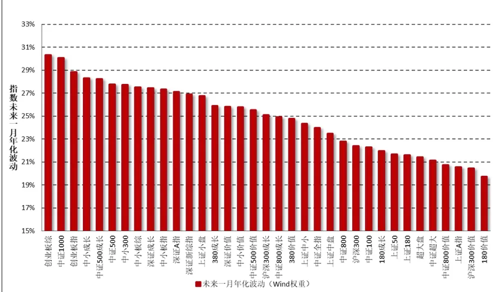
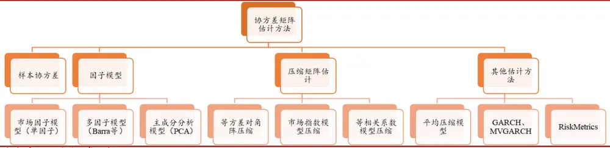
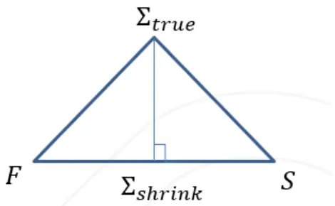
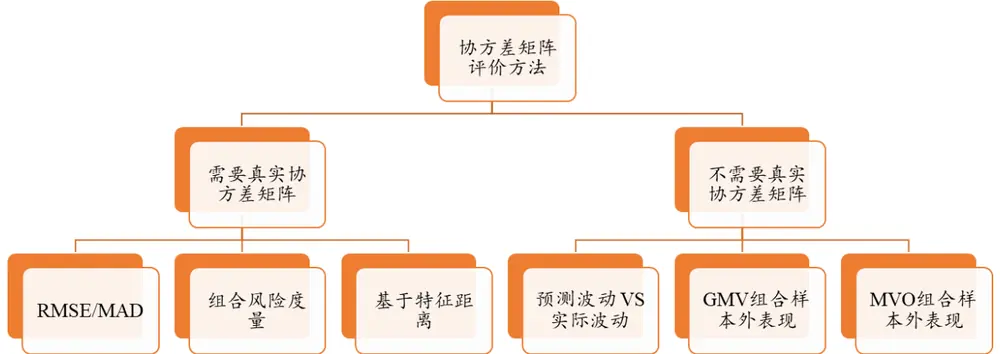
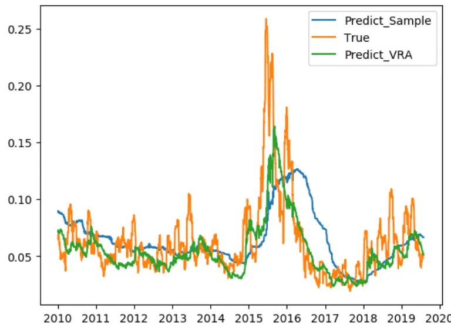
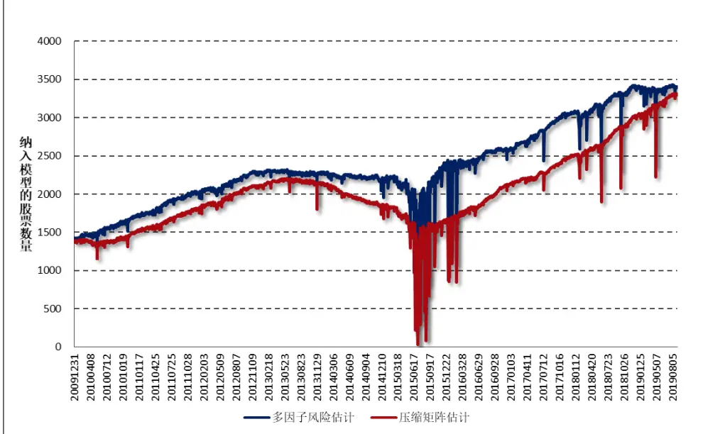
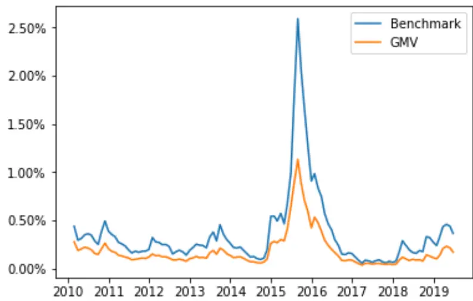
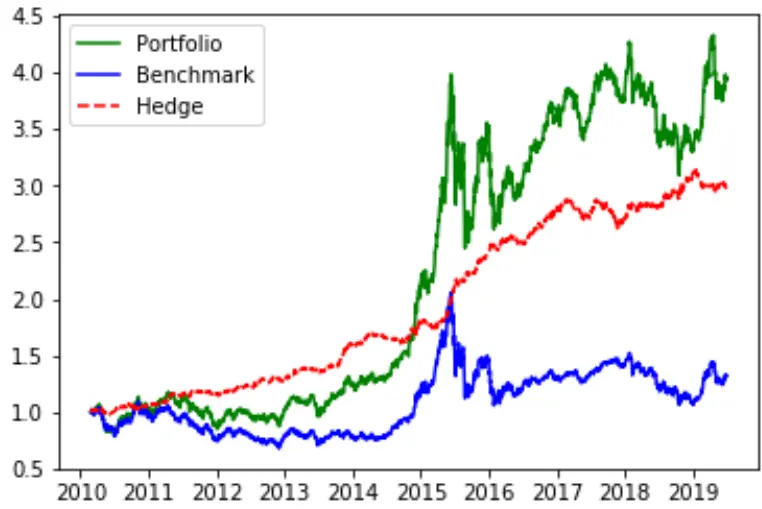
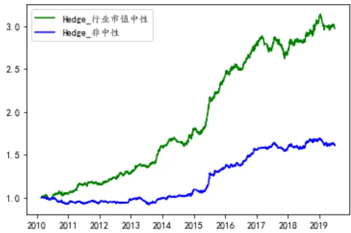

# 2019 年 10 月 15 日 组合风险控制：协方差矩阵估计方法介绍及比较

## “星火”多因子专题报告（八）

## 联系信息

陶勤英分析师

SAC 证书编号：S0160517100002

taoqy@ctsec.com

021-68592393

张宇研究助理

zhangyu1@ctsec.com 021-68592337 
17621688421

17621688421

## 相关报告

【1】“星火”多因子系列（一）：《Barra模型初探：A 股市场风格解析》

【2】“星火”多因子系列（二）：《Barra模型进阶：多因子模型风险预测》

【3】“星火”多因子系列（三）：《Barra模型深化：纯因子组合构建》

【4】“星火”多因子系列（四）：《基于持仓的基金绩效归因：始于 Brinson，归于 Barra》【5】“星火”多因子系列（五）：《源于动量，超越动量：特质动量因子全解析》

【6】“星火”多因子系列（六）：《Alpha 因子重构：引入协方差矩阵的因子有效性检验》

【7】“星火”多因子系列（七）：《借因子组合之力，优化 Alpha因子合成》

【8】“拾穗”多因子系列（五）：《数据异常值处理：比较与实践》

【9】“拾穗”多因子系列（六）：《因子缺失值处理：数以多为贵》

【10】“拾穗”多因子系列（八）：《非线性规模因子：A 股市场存在中市值效应吗？》

【11】“拾穗”多因子系列（十一）：《多因子风险预测：从怎么做到为什么》

## 不可或缺的风险模型：协方差矩阵应用领域介绍

【12】“拾穗”多因子系列（十四）：《补充：基于特质动量因子的沪深 300 增强策略》

【13】“拾穗”多因子系列（十六）：《水月镜花：正视财务数据的前向窥视问题》

【14】“拾穗”多因子系列（十七）：《多因子检验中时序相关性处理：Newey-West 调整》

## 投资要点：

- 组合的波动是度量组合风险的重要指标，而组合成分股收益率的协方差矩阵便是估计组合波动的重要工具。

- 股票收益率的协方差矩阵在组合绝对风险估计、组合相对风险控制、组合优化和因子组合构建以及多因子合成四个部分都有着十分广泛的应用。

## 协方差矩阵的估计方法

- 市场上主流的协方差矩阵估计方法包括样本协方差矩阵、因子模型估计的协方差矩阵、压缩矩阵估计和其他基于时变模型的估计方法。

- 样本协方差虽然是真实协方差的无偏估计，但待估参数过多、估计误差较大，且当股票（资产）数量大于样本数量时，样本协方差矩阵将不可逆。

- 因子模型通过设定一定的结构来减少待估参数，从而降低估计误差，但是可能存在模型设定偏误。传统多因子模型的构建较为复杂，因子选取和构成具有一定争议；统计多因子模型构建简单，但缺乏增量信息。

压缩估计的出发点是想综合考虑估计误差与估计偏误，经典的 LW线性压缩基于Frobenius形式的二次损失函数给出了线性压缩的计算方式。

## 协方差矩阵估计效果评价方法

- 协方差矩阵估计效果的评价方法主要分为两大类，一种需要真实协方差矩阵，一种不需要真实协方差矩阵。

需要真实协方差矩阵的评价方法有 MAD/RMSE 指标法、组合风险度量法、基于特征距离等，不需要真实协方差矩阵的评价方法可以通过观察实际波动与预测波动相关性、GMV组合及 MVO组合的样本外表现来进行评价。

## 实证检验

- 从组合的风险预测来看，经过多步调整的多因子模型效果显著更好。GMV组合的实际风险均显著小于基准组合，说明协方差矩阵的估计起到良好的效果。多因子模型在指数增强型产品的构建中能够精确控制跟踪误差。

- 综合以上结论表明，多因子模型的协方差矩阵估计的效果最佳，财通金工可以定期提供 A 股协方差矩阵数据，有需要的投资者可与我们联系获取。当然，如果从模型构造的简便性出发，基于压缩矩阵估计的方法也能够取得不错的效果。

- 风险提示：本报告统计数据基于历史数据，过去数据不代表未来，市场风格变化可能导致模型失效。

随着A股市场有效性的不断加强，市场风格出现切换，挖掘持续有效的Alpha因子难度正在不断加大。“从风险模型入手”是财通金工多因子研究的一大特色，特别在经历了 2017 年的市场大小盘风格切换之后，我们对于风险模型的深入研究受到了市场的广泛关注。通常来讲，组合的波动是度量组合风险的重要指标，而组合成分股收益率的协方差矩阵便是估计组合波动的重要工具。在财通金工的前述研究中，我们主要从多因子模型的角度对股票协方差矩阵进行了稳健估计，然而基于多因子模型的风险估计构建方式复杂、调整步数较多、后续维护成本较高。与此同时，市场上也出现了很多基于个股收益率进行结构化估计的方法。作为对多因子风险模型的补充，本文主要对各类协方差矩阵的估计方法进行详细介绍，并从组合绝对风险估计、组合相对风险控制以及最小风险组合构建等多个维度比较各类协方差矩阵估计方法的优劣，以供投资者参考。

## 1、 不可或缺的风险模型：协方差矩阵应用领域介绍

股票收益率的协方差矩阵在各个方面均有非常重要的应用，本部分我们将从组合绝对风险估计、组合相对风险控制、组合优化及因子组合构建和多因子合成四个部分对协方差矩阵的主要应用范围进行介绍。

图 1：协方差矩阵应用范围

数据来源：财通证券研究所

## 1.1 组合绝对风险估计

组合绝对风险估计是指给定一个投资组合的权重向量后，根据个股协方差矩阵对其未来一段时间的绝对波动水平进行估计。具体来讲：

$$
Risk(P)=w^{\prime}Vw
$$

其中，w 表示投资组合的个股权重向量（N×1 维），V表示个股收益率的协方差矩阵（N×N 维）。当协方差矩阵表示未来一个月的个股收益率协方差时，估计得到的组合绝对风险Risk(P)即为该组合未来一个月收益率的方差。如图 2 所示，财通金工在每周发布的多因子跟踪周报中，对市场主要指数未来一个月的波动水平进行了估计，以供投资者参考。

## 1.2 组合相对风险估计

在实际应用中，我们发现对于组合绝对风险水平的估计往往并不准确。最典型的，对于期权投资者而言，50ETF 波动率的走势是其最为关心的问题。然而财通金工研究表明，在横截面上基于多因子模型或是压缩矩阵模型对上证 50 指数的波动率走势进行预测的准确度往往不如在时间序列上采用历史波动率、EWMA或是 GARCH模型的波动率拟合效果。相比之下，在横截面上进行协方差矩阵估计在控制组合与基准之间相对波动水平方面却能够起到非常好的效果。

图 2：财通金工样本指数未来一个月波动预测（年化）

数据来源：财通证券研究所，Wind

特别地，随着近几年来市场对指数增强型产品的不断热捧，如何精确地控制组合与基准之间的跟踪误差便是该类产品构建过程中需要重点关注的内容。表1 列出了部分指数增强型基金的跟踪误差阈值，可以看到综合考虑到收益和风险之后，绝大多数的增强型基金的年化跟踪误差设定都限制在 7.75%以内。

表 1：部分指数增强型基金跟踪偏离度阈值

| 跟踪标的 | 跟踪指数代码 | 证券代码 | 证券简称 | 日均跟踪偏离度阀值(%) | 年化跟踪误差阀值（%） | 基金规模(亿) |
| --- | --- | --- | --- | --- | --- | --- |
| 上证380 | 000009.SH | 590007.OF | 中邮上证 380 指数增强 | 0.50 | 7.75 | 0.38 |
| 上证50 | 000016.SH | 110003.OF | 易方达上证 50 指数 A | 0.35 | 4.00 | 147.55 |
|  | 000016.SH | 399001.OF | 中海上证50 指数增强 | 0.50 | 7.75 | 1.98 |
| 沪深300 | 000300.SH | 100038.OF | 富国沪深 300 增强 | 0.50 | 7.75 | 89.73 |
|  | 000300.SH | 000311.OF | 景顺长城沪深 300 增强 | 0.50 | 7.75 | 89.65 |
|  | 000300.SH | 163407.0F | 兴全沪深 300 指数增强 A | 0.50 | 7.75 | 33.05 |
| 中证 800 | 000842.SH | 150138.0F | 银华中证 800 指数增强 A | 0.50 | 7.75 | 0.33 |
| 中证1000 | 000852.SH | 161039.OF | 富国中证 1000 指数增强 | 0.50 | 8.00 | 0.91 |
|  | 000852.SH | 003646.OF | 创金合信中证 1000 增强 A | 0.50 | 7.50 | 0.49 |
| 中证100 | 000903.SH | 163808.0F | 中银中证 100 指数增强 | 0.50 | 7.75 | 4.19 |
|  | 000903.SH | 213010.0F | 宝盈中证 100 指数增强 A | 0.50 | 7.75 | 2.36 |
| 中证500 | 000905.SH | 000478.OF | 建信中证 500 指数增强 A | 0.50 | 7.75 | 57.44 |
|  | 000905.SH | 161017.OF | 富国中证 500 指数增强 | 0.50 | 7.75 | 42.28 |
|  | 000905.SH | 006682.OF | 景顺长城中证 500 指数增强 | 0.50 | 7.75 | 12.21 |

数据来源：财通证券研究所，Wind

事实上，协方差矩阵的引入正是帮助投资者进行更为精确的跟踪误差限制。在指数增强型研究产品的构建中，通常采用组合优化的方法构建投资组合。简单来讲：

$$
\begin{array}{c}{max(w-w_{B})^{\prime}\alpha}\\{(w-w_{B})^{\prime}V(w-w_{B})\leq7.75\%}\\{X_{S}^{lower}\leq(w-w_{B})^{\prime}X_{S}\leq X_{S}^{upper}}\\{X_{I}^{lower}\leq(w-w_{B})^{\prime}X_{I}\leq X_{I}^{upper}}\\{w^{\prime}1=1}\\{w^{lower}\leq w\leq w^{upper}}\end{array}
$$

其中，w 表示组合权重（N×1 向量）， $w_{B}$ 表示基准组合权重（N×1 向量），α表示个股期望收益或因子值。上述优化的主要目的是在给定个股权重上下限以及满足组合相对基准在行业和风格上的偏离后，尽可能最大化组合在 Alpha 因子上的暴露，同时控制其相对基准的跟踪误差在 7.75%以内。

## 1.3 因子组合构建

与指数增强型组合的控制类似，因子组合的构建通常也需要用到股票的协方差矩阵。其中，纯因子组合的构建可以参考财通金工“星火”专题（三）《Barra模型深化：纯因子组合构建》，最小波动因子组合的构建可以参考“星火”专题（七）《借因子组合之力，优化 Alpha 因子合成》。以最小波动因子组合为例，其是所有在目标因子上有单位暴露的组合中，预期风险最小的组合：

$$
\begin{array}{c}{{\displaystyle\operatorname*{min}_{w}w^{\prime}Vw}}\\{{s.t.w^{\prime}X_{k}=1}}\end{array}
$$

通过拉格朗日乘数法，即可求得最小波动组合权重的显式解：

$$
\Omega_{k}^{MV}=\frac{V^{-1}X_{k}}{X_{k}^{\prime}V^{-1}X_{k}}
$$

可以看到，最小波动因子组合是在目标因子上存在单位暴露的组合中预期信息比率最大的组合。在不附加任何做空限制的条件下，其可以借助因子暴露与个股协方差矩阵进行显式求解。

## 1.4 最大化 ICIR 因子合成

将单因子合成为多因子的过程中，协方差矩阵的估计同样能够发挥其用武之地。在前述研究中，我们介绍了 Qian（2007）提出的最大化 ICIR 方法来进行多个因子的合成。与个股收益率协方差矩阵估计不同，此处估计的是单个因子 IC或者 RankIC的协方差矩阵。它将一个因子视为一个股票，因子的IC或者RankIC即为这只股票的收益率，将单个因子的期望 IC 值用其均值表示 $\overline{{IC}}(K\times1)$ ，因子IC 之间的协方差矩阵 $用\Sigma_{IC}(K\times K)$ 表示。那么，我们即可求解出一个最优组合权重，使得整个组合的预期收益与预期波动的比值（即预期信息比率）最大。具体来讲：

$$
\mathop{max}_{w}ICIR=\frac{w^{\prime}\overline{{IC}}}{\sqrt{w^{\prime}\Sigma_{IC}w}}
$$

将目标函数对权重求一阶导，即可得到最优解：

$$
w^{*}=\delta\Sigma_{IC}^{-1}\widetilde{IC}
$$

其中δ为任意正数，可用于对权重进行归一化。由此可见，在单因子合成过程中，也需要用到因子 IC 的协方差矩阵的逆。

## 2、 协方差矩阵的估计方法

由上一部分可知，协方差矩阵的估计能够在多个领域发挥重要作用。然而，协方差矩阵的估计方式多种多样，各类估计方法都有着各自不同的优点及缺陷。图 3 中我们对目前市场上采用的比较主流的估计方法进行了总结，主要包括样本协方差矩阵估计、采用因子模型的结构化估计、压缩矩阵估计以及基于时间序列上的多元 GARCH估计等。

图 3：协方差矩阵估计方法汇总

数据来源：财通证券研究所

## 2.1 样本协方差矩阵估计

样本协方差是协方差矩阵估计方式中最为简单的方式，其计算方法方式完全根据个股在样本内的收益率计算得到。具体来讲：

$$
S_{ij}=\frac{1}{T}{\sum_{t=1}^{T}}(x_{it}-\bar{x}_{i})*\left(x_{jt}-\bar{x}_{j}\right)
$$

其中， $S_{ij}$ 表示协方差矩阵第 i 行第j 列的元素， $x_{it}$ 表示股票 i 在第 t 期的收益率， ${\bar{x}}_{i}.$ 是股票 i 收益率的平均值。采用矩阵方式即可表示为：

$$
S={\frac{1}{T}}X\left(I-{\frac{1}{T}}11^{\prime}\right)X
$$

其中，X表示个股收益率数据（N×T 维），I是单位矩阵（N×N 为），1′是单位向量（N×1 维）。

样本协方差矩阵的计算方式简单易懂，是真实协方差矩阵的无偏估计，当 T趋近于无穷大时，样本协方差矩阵将收敛至真实协方差矩阵。然而样本协方差估计误差较大且当个股数量大于回测区间时该协方差矩阵并不可逆等问题成为其实际应用中大打折扣的主要原因。具体来看：

首先，当样本中的个股数量较多时，协方差矩阵中待估计的元素个数将会呈平方级增长，从而引入较大的估计误差。那些被高估或者低估的极端元素将在“均值方差优化器（MVO）”中被进一步放大，这一现象被 Michaud (1989)称为“Error-Maximization”。 此外，Shepard（2009）指出，在正态性和平稳性的假设下，由于估计误差的存在，采用样本协方差矩阵得到的最优投资组合的风险通常会被低估，其模型估计值与真实风险之间的关系满足：

$$
\sigma_{true}=\frac{\sigma_{est}}{1-(N/T)}
$$

当采用 100 个交易日数据来估计 50 只股票收益率的协方差矩阵时，最优投资组合的估计风险仅为真实的 1/2，这一推到亦可参见财通金工“拾穗”（11）《多因子风险预测：从怎么做到为什么》。

其次，当个股数量 N远远大于回测长度 T时，样本协方差矩阵将是不满秩矩阵，从而也不可逆。从样本协方差矩阵S 的计算公式中可以看出，其秩不超过 T-1。而当 N≥T 时，S 总是不满秩的，也就是说总能找到一组权重向量w，使得计算出的组合方差w′Sw等于 0，这显然与直观并不符合。矩阵不满秩的另一结果是无法直接求得其逆矩阵。然而从上一小节可知，协方差矩阵的逆通常在因子组合构建及因子合成过程中发挥十分重要的作用。

- 最后，尽管样本协方差矩阵是真实协方差的无偏估计量，但其逆矩阵却并不是真实协方差矩阵的逆的无偏估计量。当 T>N 时，样本协方差矩阵 S 的逆矩阵与真实协方差Σ的逆矩阵满足如下关系（在收益率满足正态分布的假设下）：

$$
E(S^{-1})=\frac{T}{T-N-2}\Sigma^{-1}
$$

这意味着虽然S是Σ的无偏估计，但S−1却是Σ−1的有偏估计，且当 N 越来越大时，二者之间的偏差将越来越大。Fan(2008)认为，在估计协方差矩阵的逆时，多因子模型比样本协方差具有明显的优势，而在估计组合的方差时（不需要求逆），多因子模型的优势会削弱。

需要强调的是，当股票（资产）数量不多时，样本协方差矩阵确实是一个非常好的估计量。例如在估计几个大类资产之间的协方差矩阵时，样本协方差矩阵的表现是比较稳定的。然而一旦涉及到大量的股票的协方差矩阵估计时，样本量的限制导致其表现大打折扣，因此实际应用中基于因子模型和压缩矩阵估计的方法才得到其用武之地。

## 2.2 因子模型

与样本协方差矩阵不同，因子模型假定股票收益率可由某些共同因子驱动，共同因子不能解释的部分为股票的特质收益率。在这种模型假定下，股票收益率的协方差矩阵将由股票在因子上的暴露、因子收益协方差矩阵、个股特质收益率的方差共同决定。由于因子数量往往远小于股票数量，因此使用因子模型时需要估计的参数较少，引入的估计误差也较小。本小节我们将就单因子模型、多因子模型和统计因子模型三类方法的构建进行介绍。

## 2.2.1 市场指数模型（单因子模型）

在单因子模型中，最为常用的属于市场指数模型，它是根据 CAPM 模型演化而来。Sharpe (1963)认为股票收益来源于其对系统性风险承担的回报，个股对于市场风险的承担大小可用β值进行衡量：

$$
x_{it}{=}\alpha_{i}+\beta_{i}*x_{mt}+\varepsilon_{it}
$$

其中， $x_{it}$ 表示个股收益， $x_{mt}$ 表示市场收益， $\varepsilon_{it}$ 为无法被市场风险解释的个股收益。由单因子模型估计出来的股票协方差矩阵即可表示为：

$$
V=\sigma_{m}^{2}*(\beta\beta^{\prime})+\varDelta
$$

其中， $\sigma_{m}^{2}$ 是市场收益的方差， $\beta$ 是由个股 $\beta_{i}$ 值构成的列向量（N×1 维），Δ是由个股残差收益 $.\varepsilon_{it}$ 的方差构成的对角阵。在上述模型中，个股的β值一般可由时间序列回归直接得到。然而，个股的β值并不是维持不变的，我们还可以采用不同的方法对其未来 $:\beta:$ 值进行估计，常用的方法有 Blume(1971)调整和 Vasicek(1973)调整等，对于个股 Beta 因子的估计我们将在后续的专题报告中进行介绍。

## 2.2.2 多因子模型

事实上，单因子模型是多因子模型的一个特例。随着研究的不断深入，越来越多的研究者发现个股的回报不仅与其承担的市场风险相关，个股在其他特征维度上承担的风险也与其预期收益存在密切的关系。多因子模型将因子数量增加到了K个，该模型假设股票的收益率可以由K个共同因子和个股特质收益率决定：

$$
r=\alpha+Xf+u
$$

其中，r表示股票的收益率向量（N×1 维），X表示股票在 K 个因子上的暴露度（N×K 维），f表示因子收益率向量（K×1 维），u表示股票特质收益率向量（N×1 维）。在多因子模型假设下，个股收益率的协方差矩阵即可表示为：

$$
V=XFX^{\prime}+\Delta
$$

其中，F是因子收益的协方差矩阵，Δ是特质收益率的方差构成的对角阵。有关多因子模型的风险预测方法，财通金工在“星火”系列（二）《Barra 模型进阶：多因子风险预测》和“拾穗”系列（11）《多因子模型风险预测：从怎么做到为什么》均有着十分深入的介绍，此处不做过多赘述。

## 2.2.3 统计因子模型

在前面提到的基于多因子模型的协方差矩阵构建中，研究者首先需要根据市场的风格特征寻找到对资产定价存在显著关系的因子。然而业界对这些因子的选取并不存在统一的结论，即便是应用最为广泛的 Barra模型，对于其因子的选取、构建及配权问题也同样存在诸多非议。本节我们介绍一种统计因子模型，其因子选取不再是来源于个股的基本面或技术面特征，也无需根据研究者的主观判断进行选择，而是直接从个股收益率序列数据中提取得到。

统计因子模型和传统的多因子模型有着十分类似的形式，其最大区别在于因子的确定方式不同：统计因子模型中的隐藏因子可以采用主成分分析 PCA（或极大似然 MLE）来提取，从而使得构造的统计因子之间存在相互正交的关系，进而使得因子收益率的协方差矩阵中非对角元素为 0，大大简化了计算量。

$$
r=\alpha+Pf+u
$$

其中，P 表示根据个股的收益率矩阵R（T×N 维）提取出的主成分矩阵（N×P 维），其形式与多因子模型完全一致。

统计因子可能不具有实际含义，缺乏解释度，但胜在不需要像传统多因子模型一样去主观地选取因子，近几年来学术界和业界也不断有新的成果关注统计因子模型。需要注意的是，统计因子模型构建过程中的一个重要问题即是确定隐藏因子的个数。目前，学术界已经提出了很多种不同的选取方法，本文采用一种比较直观的方法：方差解释度大于 90%的最少因子数，且不超过 N/2，不低于 5。

## 2.2.4 因子模型小结

由以上分析可知，采用因子模型构建协方差矩阵的优点在于“降维”。通过设置一定的结构，将原本需要对 N 只股票的协方差估计转化为对 K个因子的协方差估计（其中 N>>K），从而减少了待估参数的个数，降低估计误差。然而多因子模型也可能带来一定的模型设定偏误：多因子模型中因子选取和构造的方式并无统一结论，且构建方式繁琐、维护成本较高；统计因子模型的构建虽然更为简单，但最优因子个数的选取会影响估计结果，且缺乏外部增量信息。基于此，Ledoit&Wolf 提出的一系列关于压缩矩阵估计的方法，综合考虑了样本协防差矩阵的无偏性和因子模型的结构性，给我们提供了另一种协方差矩阵估计思路。

## 2.3 压缩矩阵估计（LW 估计法）

到目前为止我们对样本协方差矩阵和因子模型协方差矩阵估计进行了介绍：一方面，尽管样本协方差矩阵是真实协方差矩阵的无偏估计但因为其待估参数过多而导致其估计误差较大。另一方面，尽管因子模型的待估参数较少，但其存在一定的设定偏误从而导致估计出来的协方差矩阵是真实协方差的有偏估计。这两种方法各有优劣，一个很自然的想法就是将二者中和，兼顾无偏性和估计误差，压缩矩阵估计方法正是源于这种思想。

“压缩估计”的概念最早由 Stein（1956）提出，事实上，熟悉多因子模型风险预测的研究者对于压缩估计的概念一定并不陌生。在特质风险估计中的贝叶斯压缩调整（Bayesian Shrinkage）中，正是将单只股票的特质风险向其所在的市值分组的市值加权平均风险压缩靠拢，其具体内容可以参见“拾穗”（11）《多因子风险预测：从怎么做到为什么》。

$$
\sigma_{n}^{Shrink}=v_{n}\bar{\sigma}(s_{n})+(1-v_{n})\hat{\sigma}_{n}
$$

Ledoit & Wolf（2003）将压缩估计的方法用于协方差矩阵的估计中，提出了最为经典的三种线性压缩目标，这也是本文主要关注的三种线性压缩方式。值得一提的是近年来又出现了许多非线性压缩方法，这些非线性压缩方法计算较为复杂且效果提升有限，因此本文对这些方法暂时不做过多阐述。LW 线性压缩的核心思想可以表示为：

$$
\Sigma_{shrink}=\alpha*F+(1-\alpha)*S
$$

其中， $\Sigma_{shrink},$ 表示根据压缩估计方法得到的协方差矩阵，F表示压缩目标，它通常可以通过设置一定的结构（如因子模型结构）使其估计误差较小，但同时可能会存在一定的模型设定偏误。S表示股票的样本协方差矩阵，其待估参数较多、估计误差大，但胜在是真实协方差矩阵的无偏估计。α表示压缩强度，是一个介于 0 和1 之间的常数，它通常可以表示研究者在模型偏差和模型误差之间的取舍。

由以上分析可知，压缩矩阵估计的出发点在于兼顾样本协方差矩阵的无偏性和结构化模型的较小误差性，二者之间的权重由α决定。α越大，代表研究者越想减少模型的估计误差；α越小，则表示研究者越想保证估计的无偏性。α的选取非常关键，LW 在他们的论文中给出了具体的计算方法。下图是对 LW 线性压缩的一种更形象的解释，它表示在 F 和S 中间寻找到一个中和，从而使得最终得到的压缩矩阵结果离真实协方差矩阵的距离最近。

图 4：压缩矩阵估计示意图

数据来源：财通证券研究所， Ledoit&Wolf（2003）

关于压缩强度α的估计，LW 在其原文中有详细的推导方式，其主要思想是使得估计得到的协方差矩阵尽可能地与真实的协方差矩阵靠拢。具体来讲，采用 Frobenius 距离定义估计协方差与真实协方差之间的相似度，不同于其他方式的损失函数，Frobenius 形式不需要使用到矩阵的逆，因此在矩阵不满秩时该度量方法仍然有效。该损失函数具体可表示为如下形式：

$$
L(\alpha)=||\alpha F+(1-\alpha)S-\Sigma_{true}||^{2}=\sum_{i=1}^{N}\sum_{j=1}^{N}(\alpha f_{ij}+(1-\alpha)s_{ij}-\sigma_{ij})^{2}
$$

其中 $f_{ij},~s_{ij},~\sigma_{ij}$ 分别对应F，S， $\Sigma_{true}$ 中的各个元素。随后我们令L(α)的一阶导等于 0，即有 $\begin{array}{r}{\frac{dE(L(\alpha))}{d\alpha}=0\quad,\quad\frac{d^{2}E(L(\alpha))}{d\alpha^{2}}>0}\end{array}$ ，从而可以得到α的最优估计值：

$$
\alpha^{*}=\frac{\sum_{i=1}^{N}\sum_{j=1}^{N}Var\left(s_{ij}\right)-Cov\left(f_{ij},s_{ij}\right)}{\sum_{i=1}^{N}\sum_{j=1}^{N}Var\left(f_{ij}-s_{ij}\right)+(\phi_{ij}-\sigma_{ij})^{2}}
$$

其中 $E(f_{ij})=\phi_{ij},E(s_{ij})=\sigma_{ij}$ 。Ledoit & Wolf（2003）指出， $\alpha^{*}=\frac{\kappa}{T}+O(\frac{1}{T^{2}})$ 其中κ是一个常数，其值渐进协方差有关，可由收益率数据估计得到，κ的估计方法和压缩目标有关。由此可见，当 T 趋近于无穷大时， $\pmb{\alpha}^{*}$ 趋近于 $\mathbf{0},$ 这也符合我们直观的理解，即当样本数据量足够多时，只用样本协方差便能够得到较好的估计效果。

在 LW 先后发布的三篇论文中，作者分别给出了三种不同的线性压缩目标F。不同的压缩目标分别对应了不同的压缩强度估计方式：

## （1） 等方差模型：

等方差模型是将所有个股的波动视为同一水平，即所有个股波动的均值，具体来讲：

$$
\begin{array}{r}{F=I*(\frac{1}{T}{\sum_{i=1}^{N}s_{ii}})}\end{array}
$$

其中，I表示单位矩阵， $s_{ii}$ 即为股票 i 收益率的样本方差。可以看到，等方差模型下压缩目标 F 是一个对角矩阵，其对角线上的元素相等，为个股方差的平均值，非对角线上的元素为 0。

## （2） 市场指数模型：

市场指数模型是采用 CAPM 估计得到的协方差矩阵：

$$
F=\sigma_{m}^{2}*\left(\beta\beta^{\prime}\right)+\varDelta
$$

其估计方式与前面提到的因子模型中的单一市场模型基本相同，区别在于LW 推荐使用股票的等权组合作为市场组合。在使用市场模型作为压缩目标时，压缩估计可以理解为另一种角度上的“多因子模型”，因为市场指数模型是单因子模型，而样本协方差可以理解为 N 因子模型（每只股票为一个因子），单因子模型和 N 因子模型的线性结合相当于产生了一个“多因子”模型。

## （3） 等相关系数模型：

等相关系数模型是实际应用中最为常用的压缩目标模型，其具体表示如下：

$$
f_{ii}=s_{ii},\quad f_{ij}=\bar{r}*\sqrt{s_{ii}*s_{jj}}
$$

其中， $\begin{array}{r}{\bar{r}=\frac{2}{(N-1)N}{\sum_{I=1}^{N}}{\sum_{J=I+1}^{N}}r_{ij},\quad r_{ij}=\frac{s_{ij}}{\sqrt{s_{ii}*s_{jj}}}.}\end{array}$ 在等相关系数模型中，压缩目标 F 的对角线上的元素与样本协方差对角线上的元素保持一致。而其非对角线上的元素 $f_{ij}$ （即协方差）则由相关系数（r̅）与个股的波动乘积 $(s_{ii},s_{jj})$ 确定，不同的是所有协方差计算中的相关系数r̅是由样本协方差估计出来的相关系数的平均值。

压缩估计方法的推导过程看似复杂，但在实际应用中它有着非常大的优点，具体可总结为如下两个方面：

（1） 首先，只要压缩目标 F 是正定矩阵（很容易保证），且压缩强度α不等于 0，那么压缩后得到的矩阵一定是正定的，因为样本协方差总是可以保证是半正定的。

（2） 其次，压缩矩阵估计的输入非常简单，只需要将个股的历史收益率数据作为输入即可。它不像因子模型的构建一样需要太多的额外信息，其所需信息和模型参数都相对较少。

## 2.4 其他协方差矩阵估计方法

## 2.4.1 估计量组合

除了上述介绍的样本协方差矩阵、因子模型协方差矩阵和压缩估计矩阵之外，学术界也提出了一些其他方法对协方差矩阵的估计做出改进。其中，Jagannathan& Ma（2000）提出将市场模型、样本协方差和个股方差的对角阵这三种协方差矩阵进行组合，得到最终的估计量：

$$
\Sigma={\frac{1}{3}}F+{\frac{1}{3}}S+{\frac{1}{3}}D
$$

其中，F表示采用市场单因子模型估计得到的协方差，S 表示样本协方差，D表示由个股样本方差构成的对角矩阵。这种组合方法在本质上也是一种压缩估计，其区别在于压缩强度的选择较为主观，因为上式可以被改写为：

$$
\Sigma=\frac{2}{3}*\left(\frac{1}{2}F+\frac{1}{2}D\right)+\frac{1}{3}*S
$$

由此可以看出，估计量组合是压缩估计的一种特殊形式，其压缩目标被选取为 $\textstyle{\cdot{\frac{1}{2}}F+{\frac{1}{2}}D}$ ，压缩强度为 $\alpha={\frac{2}{3}},$

## 2.4.2 GARCH+时变模型

到目前为止，我们介绍的协方差矩阵估计法均是从横截面出发，探究个股收益波动之间的相关关系，其隐含假设在于个股收益之间的相关性将在较长的时间内保持稳定。然而，由于个股收益率之间的关系会随时间发生变化，使用时变模型可能可以更好地估计协方差矩阵。

在这类模型中，高维的 模型不太适用，因为 模型需要的参数较多，估计起来存在很大误差。较适用的是指数加权移动平均法（EWMA），例如经典的 。使用 时，越新的数据被赋予更高的权重，越陈旧的数据权重越低，一般使用半衰期来控制衰减程度。

## 2.4.3 其他压缩方法

以上提出的各类方法在学术界和业界都有了较为成熟的应用，与此同时也有很多研究者致力于开发更为稳健的协方差矩阵估计方法。其中，Chen et al.（2010）根据 Rao-Blackwell定理对 LW 提出的线性压缩方法进行了改进，提出了 RBLW估计方法。为了进一步减小估计误差，还提出了 Oracle Approximating Shrinkage的方法，该方法在数据量显著小于股票个数时表现甚至还优于 RBLW。在 Python的 Sklearn 包中还提供了相应的 Oracle Approximating Shrinkage 的函数。

此外，Lam, C. et al. (2016)、Engle et al. (2017)、Ledoit and Wolf (2015, 2017a,b,2018)等在近年来海提出了许多非线性压缩的方法，有兴趣的读者可以参阅本文附录提及的相关文献。

## 3、 协方差矩阵估计效果的评价方法

到目前为止，我们对协方差矩阵的应用范围以及各种不同的协方差矩阵估计方式及其优劣进行了详细的介绍。在进行具体的实证检验何种估计方式更好之前，我们必须引入一些协方差矩阵估计效果的评价指标，通过量化手段来评判不同估计方法的优劣。如图 8 所示，协方差矩阵估计效果评价方法大致可以分为两类，第一类是需要“真实协方差矩阵”的评价方法，这种方法主要是比较估计出来的协方差矩阵和真实协方差矩阵之间的差距大小；第二类评价方法则“不需要真实协方差矩阵”，主要通过比较组合的样本外表现来评判不同协方差矩阵估计方法的优劣。

图 5：协方差矩阵估计效果评价方法分类

数据来源：财通证券研究所

## 3.1 需要“真实协方差矩阵”的评价方法

## 3.1.1 MAD、RMSE 等统计指标

平均绝对误差 MAD （Mean Absolute Deviation） 和均方根误差 RMSE （RootMean Square Error） 是度量协方差估计值和真实值距离最直观的统计方法，二者的计算方式如下：

$$
{MAD=}\frac{1}{N}{\sum_{i=1}^{N}}\sum_{j=1}^{N}|s_{ij}-\sigma_{ij}|\quad RMSE=\sqrt{\frac{1}{N^{2}}{\sum_{i=1}^{N}}\sum_{j=1}^{N}(s_{ij}-\sigma_{ij})^{2}}
$$

其中， $s_{\mathrm{ij}}$ 表示协方差矩阵的估计值， $\mathbf{\sigma_{ij}}$ 表示真实协方差矩阵的对应元素。由从 RMSE和 MAD 的计算方式可以看出，二者实际上度量的是估计协方差与真实协方差在每个元素上的距离，这种距离分别用 L1 范式和L2 范式（即前面提到的Frobenius 距离）来衡量。然而，这两种度量方式为协方差矩阵中的每个元素都赋予了相同的权重，且计算出来的结果缺乏实际含义，对实际投资并不具备指导意义。

## 3.1.2 组合绝对风险度量

组合绝对风险度量指给定一个组合的权重向量 w 后，估计其未来波动与真实波动之间的差别。如果对于多组组合而言，二者之间的波动都相差较小，那么这种度量方法即为一种好的风险度量方法：

$$
D=w^{\prime}\varSigma_{estimate}w-w^{\prime}\varSigma_{true}w
$$

其中，w表示投资组合的权重向量， $\Sigma_{estimate}$ 表示估计出来的协方差矩阵，$\Sigma_{true}$ 表示真实的协方差矩阵, $w^{\prime}\varSigma_{estimate}$ w是对组合风险的估计，而 $w^{\prime}\varSigma_{True}w$ 代表了组合的真实风险。这种评价方式的最大问题在于如何对权重向量进行随机选择，因为不同权重向量的选取对评价结果的影响很大。

## 3.1.3 基于特征距离的评价方法

Lan Liu(2007)提出了一种基于特征距离的方法来度量估计协方差矩阵与真实协方差矩阵之间的距离，其定义方式如下：

$$
d(\varSigma_{estimate},\varSigma_{true})=\log\left(\frac{max_{x}\frac{x^{'}\Sigma_{estimate}x}{x^{'}\Sigma_{true}x}}{min_{y}\frac{y^{'}\Sigma_{estimate}y}{y^{'}\Sigma_{true}y}}\right)
$$

其中，log 中的分子部分代表“使用估计出来的协方差矩阵，对组合的风险最大能高估多少”，分母部分代表“使用估计出来的协方差矩阵，对组合的风险最低能低估多少”。Lan Liu(2007)为上式提供了一种解析解方法，感兴趣的读者可参考原文介绍。

相较于上一小节中对单个组合绝对风险水平进行度量的评价方法，基于特征距离的评价方式从全局考虑了风险高估和低估的极端情况，理论上来讲这种评价方法更科学。然而财通金工认为，当这种方式取到极值的时候，组合权重很可能对应的是一种极端权重，且这种权重向量没有做任何的约束限制。在实际投资中，这种权重组合几乎不会出现。也就是说这种评价方式不会告诉我们“实际投资组合”的风险估计好坏，只能告诉我们极端情况的信息。

## 3.1.4 小结

本部分我们介绍了三种判断真实协方差矩阵与估计协方差矩阵之间的相似度的方法，然而在实际运用时我们并不推荐这种需要真实协方差矩阵 $\mathbf{\cdot}\pmb{\Sigma}_{true}$ 的评价方法。要确定真实协方差矩阵是很困难的，大部分研究者都使用组合持仓期内收益率数据算出来的样本协方差作为其真实协方差矩阵的估计，即在 时刻使用未来收益数据算出来样本协方差作为真实协方差矩阵。然而，当股票数量较多时，这种对 $\Sigma_{true}$ 的估计方式本来就存在很大误差，此时再去比较 $\Sigma_{estimate}和\Sigma_{true}$ 的差距实在难以让人信服。

当然，也有研究者利用仿真模拟的方式，通过预设一个真实的协方差矩阵再进行蒙特卡洛模拟生成对应的收益率序列，随后根据模拟生成的收益率序列进行协方差矩阵估计，最后再来比较真实协方差矩阵与估计协方差矩阵之间距离的方式。也就是说，研究者首先给定一个协方差矩阵，并假设收益率服从某种特定的分布（一般为多元正态分布），然后根据这种分布去生成仿真收益率数据，再由仿真数据去估计协方差矩阵。在这种方法下，真实协方差矩阵的确是已知的，但是仿真的方法和实际之间仍然存在差距，其中最大问题在于很难保证“分布的假设是合理的”。实际的金融资产收益率数据通常存在尖峰、厚尾等特征，单纯的正态分布假设并不合理，要找到合理的分布存在很大困难。由此，我们在下一节中介绍几种不需要真实协方差矩阵的评价方法，它主要是根据构建组合的样本外表现观察得到。

## 3.2 不需要“真实协方差矩阵”的评价方法

## 3.2.1 组合的预测波动和实际波动

与上一小节中提到的组合绝对风险度量方式类似，不同的在于此处比较的是组合的预估风险与实际波动之间的差别，具体来讲：

$$
D=(w^{\prime}\Sigma_{estimate}w)-Var(R_{t})
$$

其中， $w^{\prime}\varSigma_{estimate}v$ 表示组合的预测方差， $Var(R_{t})$ 表示组合在未来一段时间内的实际收益率的方差。这种计算方式与前一小节提到的方式非常类似，区别在于后者使用真实协方差矩阵计算真实风险，而这里使用组合未来的实际收益来计算真实风险。在后面的实证部分，我们将以特定的指数为例，计算指数的预测波动与实际波动之间的相关系数来评价各种预测方法的优劣。

## 3.2.2 GMV 组合样本外表现

GMV 组合检验是通过观察最小方差组合（Global Minimum Variance）的实际波动情况来比较各种不同估计方法优劣的评价方法。最小方差组合检验法最早由 Karceski & Laknoishok (1999)使用，后来的许多研究者也延续了这种方法去评价协方差矩阵的估计效果。该组合的构建方法如下:

$$
\begin{aligned}&\min w^{\prime}\Sigma_{estimate}w\\&\quad s.t.\quad w^{\prime}\mathbf{1}=1\\&\quad 叔罢上万厌(可递)\\\end{aligned}
$$

GMV 检验主要存在两个问题，第一个问题是这种比较方法仍然只使用了单一组合进行检验，第二个问题在于组合构建过程中是否需要添加权重上下限。如果不加权重上下限的限制，那么得到的组合可能是非常极端的组合；但如果添加了权重上下限约束，根据 Jagannathan and Ma (2003)，这种方法实际上等价于对协方差矩阵进行特殊的压缩估计。

## 3.2.3 均值方差最优（MVO）组合样本外表现

此处介绍的第三种评价方法是通过观察均值方差最优 MVO 组合（Mean-Variance Optimization Portfolio）的样本外表现来评价各种方式的优劣，从直观意义上 $,而言$ ，这种组合构建方式更加接近实际的投资组合，为指数增强型产品的构建提供更为精细化的指导。构建 MVO 组合的一般形式为：

$$
\begin{aligned}max&\omega^{\prime}R\\s.t.&\omega^{\prime}\mathbf{1}=1\\\omega^{\prime}\Sigma_{estimate}&\omega\leq TE\\灰麦二万厌&\langle 可逆\rangle\end{aligned}
$$

其他限制（行业中性、跟踪误差约束等）

在以上介绍的所有投资组合中，MVO 组合是与实际投资最为贴近的组合，但其同样也存在一些自身的问题。与 GMV 组合检验类似，MVO 组合也只考虑了单个组合的样本外表现情况，该类组合的表现是否具有普适性我们并不确定。此外，MVO 组合的构建过程将会极大地受个股预期收益 R 向量的输入影响。例如，如果协方差矩阵对某只股票的方差以及协方差有所低估，且其收益率向量中对该股票的预期收益也存在明显低估时，那么在组合构建的结果中该股票的权重将会很低甚至趋近于 0，因此协方差矩阵中对这只股票方差和协方差的低估就不会被发现。表 2对以上介绍的各种不同评价方式进行了总结。

表2：不同协方差矩阵评价方法比较

| 评价方法 |  | 主要特点 |
| --- | --- | --- |
| 需要真实协方差矩阵 | MAD、RMSE | 每一个元素同等重要，缺乏实际含义（脱离了风险范畴） |
|  | 组合风险度量 | 组合权重的选取影响评价结果 |
|  | 基于特征距离 | 从全局考虑，但用到的极端组合在实际中可能不会出现 |
| 不需要真实协方差矩阵 | 组合预测波动和实际波动 | 往往都出现低估现象；计算实际波动的时间长度选取需要斟酌 |
|  | 最小方差组合（GMV）测试 | 仅考虑了一个组合；权重的限制会影响结果 |
|  | 均值方差组合（MVO）测试 | 与实际投资关系更紧密，但收益率向量输入会影响结果 |

数据来源：财通证券研究所

## 4、 实证检验结果

截止到目前，我们已经将协方差矩阵的应用范围、不同协方差矩阵的估计方式以及各种协方差矩阵有效性评价方法进行了介绍，本章我们将从实证层面出发对 9 种不同的协方差矩阵估计进行比较。在本文中，我们以 Wind全 A股票的协方差矩阵为回测样本，需要注意的是，对于不同规模的股票池，最适用的估计方法可能也有所不同。

## 4.1 估计方法介绍

本文选取的 9 种协方差矩阵估计方法，包括样本协方差、因子模型、压缩估计、估计量组合四大类，其中因子模型估计中的多因子模型协方差矩阵估计使用了调整前（不经过任何调整）、调整后（经过各类调整）和 PCA三种。

表3：采用的协方差矩阵估计方法

| 类别 | 模型 | 简写 |
| --- | --- | --- |
| 样本协方差 | 样本协方差 | Sample |
| 因子模型 | 市场指数模型 | Beta |
|  | 财通金工多因子模型（调整前） | MultiFactor_Raw |
|  | 财通金工多因子模型（调整后） | MultiFactor_VRA |
|  | 统计因子模型（PCA） | PCA |
| 压缩估计 | 压缩估计-等方差对角阵 | LW_Diag |
|  | 压缩估计-市场模型 | LW_Index |
|  | 压缩估计-等相关系数模型 | LW_ConstCoeff |
| 估计量组合 | 估计量组合 | Avg |

数据来源：财通证券研究所

考虑到“真实协方差矩阵”难以获取，因此我们在实证部分采用的是不需要“真实协方差矩阵”的三种评价方法：组合绝对风险估计、GMV 组合样本外表现以及 MVO 组合样本外表现。

## 4.2 组合未来风险预测

我们选取 Wind 全 A指数、沪深 300 指数、中证 500 指数作为样本指数，以指数成分股的流通市值权重作为样本股的权重。值得注意的是，由于中证指数公司对于指数编制过程通常采用分级靠档的方法来赋予个股权重，因此成分股流通市值加权仅能作为真实权重的一种近似，二者并不完全一致。财通金工根据每日得到的协方差矩阵估计指数未来 21 天的波动情况，随后计算指数在未来 21 天日度收益率的真实波动，进而通过计算估计波动率与真实波动率之间的相关系数，评价不同估计方法之间的优劣。

$$
\begin{aligned}Risk_{Estime}&=\sqrt{w'\Sigma_{estimate}w}\\Risk_{Trule}&=std(R_t)\end{aligned}
$$

表4 展示了对于 Wind 全 A指数、沪深 300 指数和中证 500 指数，每日对指数未来 21 天收益波动进行预测的风险与其实际风险之间的相关系数。可以看到，对 全 市 场 指 数 而 言 表 现 最 好 的 是 经 过 多 步 调 整 的 多 因 子 模 型（MultiFactor_VRA），其预测风险与实际风险之间相关系数能够达到 0.708，而其他的协方差估计方法的相关系数普遍在 0.4 左右，相差较大。

表 4：各类指数未来风险预测与实际风险相关系数（2009.12.31-2019.8.30）

| 估计方法大类 | 估计方法小类 | Wind 全 A 相关系数 | 沪深 300 相关系数 | 中证 500 相关系数 |
| --- | --- | --- | --- | --- |
| 样本协方差 | Sample | 0.418 | 0.399 | 0.356 |
| 因子模型 | Beta | 0.348 | 0.374 | 0.357 |
|  | MultiFactor_Raw | 0.413 | 0.425 | 0.355 |
|  | MultiFactor_VRA | 0.708 | 0.652 | 0.663 |
|  | PCA | 0.414 | 0.399 | 0.353 |
| 压缩估计 | LW_Diag | 0.413 | 0.393 | 0.353 |
|  | LW_Index | 0.394 | 0.396 | 0.357 |
|  | LW_ConstCoeff | 0.423 | 0.384 | 0.356 |
| 估计量组合 | Avg | 0.390 | 0.391 | 0.355 |

数据来源：财通证券研究所，恒生聚源

图 展示了样本协方差矩阵预测的 全 预测风险、多因子模型经多步调整后得到的 Wind 全 A预测风险以及 Wind 全 A实际风险之间的走势图，可以看到仅采用样本协方差的估计方法更加平滑，无法快速地反映出市场波动的急剧上涨或下跌，而经过多因子模型调整后的预测协方差则能够更好地拟合指数的实际波动。

图 6：Wind全 A 指数实际风险与预测风险走势图

数据来源：财通证券研究所，恒生聚源

有一点需要特别提醒的是，采用压缩矩阵估计的方法尽管模型构建比较简单，使用的数据也不复杂，但对股票的数据质量却有着较高的要求。当个股上市时间较短或者出现长时间的停牌时，将其纳入到样本范围内就并非一个好的选择，财通金工采用将上市时间较短或停牌时间过长的股票进行直接剔除的方法。

图7展示了在Wind全 A样本股中采用多因子模型与压缩矩阵估计模型每天的股票样本数量走势图，可以看到采用多因子风险预测的方法股票数量明显更多。此外，当市场出现大面积停牌（如 2015 年）时，两种方法的样本股数量均有较大程度的回落。

图 7：多因子风险模型与压缩矩阵估计模型股票样本数量

数据来源：财通证券研究所，恒生聚源

## 4.3 最小风险 GMV 组合样本外表现

GMV 检验通过比较最小预期风险组合的实际波动率大小来评价各类协方差矩阵估计的优劣，组合权重的计算方式如 3.2.2 小节中所示。为了与实际情况更为贴近，我们限制组合成分股的权重之和等于 1，且个股权重大于 0。

同样以 Wind 全 A中的所有股票为回测样本，在每个月最后一个交易日对组合权重进行调整，考虑到调仓日部分股票上市时间较短或存在长期停牌导致其历史收益率数据或因子数据存在缺失，我们将预先剔除掉这些无法计算协方差的股票。在计算协方差矩阵时，统一使用过去 252 天的日度收益率进行计算，回测区间是 2009.12.31-2019.6.28。

表 5：最小风险GMV 组合样本外表现

| 估计方法大类 | 估计方法小类 | 年化收益 | 年化波动 | 年化夏普比率 | 最大回撤 | 月度胜率 |
| --- | --- | --- | --- | --- | --- | --- |
| 样本协方差 | Sample | 1.41% | 17.03% | 8.30% | 59.49% | 51.32% |
| 因子模型 | Beta | 6.87% | 17.47% | 39.35% | 38.17% | 51.32% |
|  | MultiFactor_Raw | 6.62% | 16.69% | 39.65% | 44.41% | 53.39% |
|  | MultiFactor_VRA | 4.41% | 17.06% | 25.85% | 50.98% | 52.09% |
|  | PCA | 3.37% | 18.96% | 17.77% | 52.95% | 52.98% |
| 压缩估计 | LW_Diag | 1.35% | 17.13% | 7.85% | 59.56% | 51.45% |
|  | LW_Index | 3.06% | 16.67% | 18.39% | 52.18% | 51.91% |
|  | LW_ConstCoeff | 6.89% | 16.71% | 41.27% | 42.30% | 51.91% |
| 估计量组合 | Avg | 3.71% | 16.71% | 22.23% | 50.91% | 51.74% |
| 基准（市值加权） | Benchmark | 2.38% | 22.90% | 10.40% | 47.70% | 52.60% |

数据来源：财通证券研究所，恒生聚源

表 5 展示了最小风险 GMV组合的样本外表现，可以看到所有 GMV组合的实际波动（一般在 17%左右）都要明显小于基准组合（年化波动高达 23%），这也从另一个层面说明了组合风险控制的有效性。事实上，各类方法构建的 GMV组合的样本外波动并没有明显的区别，部分组合相较基准还能够获取一定的超额收益。

图 8：基准组合预期波动与 GMV 组合预期波动

数据来源：财通证券研究所，恒生聚源

为了探究 组合的构建是否有效，我们以多因子模型经多步调整后的协方差矩阵构建的 GMV组合为例，观察它在每个调仓时点的预期波动与基准组合的预期波动之间的走势图，如图 8 所示。可以看到，在任意一个时间点上，GMV组合的预期波动都会小于基准组合的预期波动，这一点与我们的组合构建初衷相一致。而就各类不同的协方差矩阵估计效果来看，各类方法之间并没有明显的区别。

## 4.4 均值方差优化 MVO 组合样本外表现

均值方差优化问题在本质上类似于一个指数增强型组合构建问题：在限定组合相对于基准的跟踪误差后，去最大化超额收益。如果组合相对于基准的实际跟踪误差确实能达到所约束的范围内，那么认为输入的协方差矩阵是一个较好的估计。

根据 1.2 小节的介绍可知，目前市场上超过 85%的指数增强基金的年化跟踪误差阈值都介于 7.5%至 8%之间，因此我们在构建组合时同样将跟踪误差控制在年化 7.5%以内。不同于最小方差组合，跟踪误差约束问题更偏重于实际投资问题，因此必须要考虑到权重的上下限，如果组合存在做空或者组合权重过度集中都没有意义。

选定 Wind 全 A 指数作为回测样本，选定 2010.2.26-2019.6.28 为回测区间，我们最大化组合在合成 Alpha 因子上的暴露，同时控制组合相对基准的跟踪误差在年化 7.5%以内。有关组合是否需要控制其他行业和风格的偏离，我们进行两种测试：

$$
\begin{aligned}max\ w^{\prime}R&\\s.t.w^{\prime}\mathbf{1}&=1\\w^{\prime}\varSigma_{estimate}w&\leq0.075/252\\w&\geq0\\其他厌劾\ (存业少丝、风疹少丝孝)&\\\end{aligned}
$$

如表 6 所示，我们合成的 Alpha 因子主要来盈利、成长、杠杆、流动性、动量、质量、估值、波动和特色因子等多个维度选取的 14 个 Alpha 单因子，随后采用 Qian（2007）的最大化 ICIR 方法进行了合成。关于因子选取和因子合成的具体细节，可以参考财通金工“星火”专题（六）《Alpha 因子重构：引入协方差矩阵的因子有效性检验》。

表 6：用于组合构建的 Alpha 因子定义及基本信息

| 大类因子 | 子类因子 | 因子 RankIC-t 值 | 因子方向 |
| --- | --- | --- | --- |
| 盈利/EarningYield | ROE_ExDiluted | 3.05 | 1 |
| 成长/Growth | NetProfitQYOY | 5.87 | 1 |
|  | NetOperateCashFlowQYOY | 3.48 | 1 |
| 杠杆率/Leverage | DTOA | 1.82 | -1 |
| 流动性/Liquidity | Turnover_1M | 10.93 | -1 |
| 动量/Momentum | MaxRet_21 | 7.81 | -1 |
| 质量/Quality | CFO | 4.11 | 1 |
| 估值/Value | OCFPTTM | 8.28 | 1 |
|  | SPTTM | 5.28 | 1 |
|  | BP | 5.06 | 1 |
|  | EPTTM | 4.67 | 1 |
| 波动率/Volatility | IVFF3_1M | 12.03 | -1 |
|  | IVFF3_RSquare_1M | 12.53 | 1 |
| 特色因子 | IMOM | 4.76 | 1 |

数据来源：财通证券研究所，“星火”系列（六）

首先构造一个 Wind全 A中的指数增强型组合，该组合不对行业和风格进行任何限制，对冲组合的样本内绩效表现如表7 所示。可以看到，在年化波动 7.5%的限制下，仅有经过多步调整的多因子模型风险估计和 PCA 风险矩阵达到了要求，其他方式构建的协方差矩阵估计得到的组合风险都要显著更高。在组合的信息比率方面，多因子风险模型构建的组合年化 IR 最高，达到 1.95，而其他方式构建的对冲组合样本外表现稍弱。

表 7：指数增强对冲组合样本外表现（2010.2.26-2019.6.28） 不加行业及风格限制

| 估计方法大类 | 估计方法小类 | 年化收益 | 年化波动 | 年化夏普比率 | 最大回撤 | 日度胜率 |
| --- | --- | --- | --- | --- | --- | --- |
| 样本协方差 | Sample | 13.38% | 8.30% | 1.611 | 14.57% | 53.48% |
| 因子模型 | Beta | 14.84% | 9.43% | 1.573 | 13.69% | 53.79% |
|  | MultiFactor_VRA | 12.86% | 6.60% | 1.948 | 9.14% | 53.26% |
|  | PCA | 10.51% | 5.38% | 1.956 | 9.70% | 55.24% |
| 压缩估计 | LW_Diag | 13.94% | 8.31% | 1.678 | 14.40% | 53.92% |
|  | LW_Index | 15.35% | 8.83% | 1.740 | 13.34% | 54.45% |
|  | LW_ConstCoeff | 13.80% | 8.58% | 1.608 | 14.43% | 53.88% |
| 估计量组合 | Avg | 15.07% | 8.79% | 1.715 | 13.09% | 54.23% |

数据来源：财通证券研究所，恒生聚源

图 9 展示了经多步调整的多因子模型风险矩阵构建的指数增强组合及其对冲组合的日度净值走势，可以看到在样本区间内对冲组合的净值走势保持较为稳定的上升趋势。也就是说，在组合风险控制层面，我们已经开发了一套较为成熟的量化模型，后续的主要研究重心可以放入到 Alpha 因子的挖掘及合成上。

图 9：多因子模型风险矩阵构建的指数增强及对冲组合走势

数据来源：财通证券研究所，恒生聚源

接下来我们观察控制了行业和市值中性后，应用各种不同模型构建的指数增强型组合的表现情况，此处我们采用中性一级行业中性化，其结果如表 8 所示。可以看到，在增加了行业和市值中性约束后，各类对冲组合的年化收益和年化波动均有很大的折扣。在风险控制方面，所有对冲组合的年化波动均满足既定的跟踪误差要求。在组合的信息比率方面，仍以多因子和 PCA方法构建的组合最高。

表 8：指数增强对冲组合样本外表现（2010.2.26-2019.6.28） 中性一级行业及市值中性

| 估计方法大类 | 估计方法小类 | 年化收益 | 年化波动 | 年化夏普比率 | 最大回撤 | 日度胜率 |
| --- | --- | --- | --- | --- | --- | --- |
| 样本协方差 | Sample | 4.32% | 4.61% | 0.938 | 6.38% | 49.38% |
| 因子模型 | Beta | 4.59% | 4.64% | 0.989 | 6.38% | 49.60% |
|  | MultiFactor_VRA | 5.42% | 5.41% | 1.002 | 8.64% | 49.07% |
|  | PCA | 4.75% | 4.16% | 1.141 | 5.71% | 50.13% |
| 压缩估计 | LW_Diag | 4.57% | 4.62% | 0.990 | 6.38% | 49.52% |
|  | LW_Index | 4.59% | 4.64% | 0.989 | 6.38% | 49.60% |
|  | LW_ConstCoeff | 4.59% | 4.64% | 0.989 | 6.38% | 49.60% |
| 估计量组合 | Avg | 4.59% | 4.64% | 0.989 | 6.38% | 49.60% |

数据来源：财通证券研究所，恒生聚源

图 10 展示了加入行业及市值中性的对冲组合与非行业市值中性对冲组合的绩效走势图，可以看到适当地暴露一定的风格能够帮助组合获取一定的超额收益，其代价在于组合的风险也会有一定程度的上升。关于何时需要暴露哪些风险以及是否有必要做到完全中性，这是财通金工后续需要研究的重要课题，欢迎感兴趣的投资者持续关注我们后续的研究！

图 10：对冲组合的净值走势（行业市值中性 VS 非中性）

数据来源：财通证券研究所，恒生聚源

## 4.5 小结

本小节我们从三个不同的层面对 9 种协方差矩阵估计方法进行了比较，主要结论如下：

（1） 从组合收益率的未来绝对波动来看，采用多步调整的多因子模型（ ）的预测效果显著优于其他方法；

（2） 从最小风险组合GMV的表现来看，各类方法之间的差别并不明显，且最小风险组合的实际风险确实显著低于基准组合；

（3） 从指数增强型组合的表现来看，不对行业和市值进行任何约束的组合，多因子模型的效果最佳。而加入行业和市值中性化约束后，各类产品的收益和风险均出现明显的折扣。

## 5、 总结与展望

“从风险入手”，是财通金工多因子研究的特色之一。作为对多因子模型风险预测的补充，本文对协方差矩阵的应用范围、各种不同协方差矩阵估计方法以及对协方差矩阵的有效性评价方式进行了详细介绍，主要结论如下：

（1） 股票收益率的协方差矩阵在组合绝对风险估计、组合相对风险控制、因子组合构建以及多因子合成等多个领域均有着非常广泛的应用；

（2） 目前市场上对于协方差矩阵的估计方法包括样本协方差矩阵估计法、因子模型估计法、压缩矩阵估计法以及其他基于时变调整的估计法；

（3）协方差矩阵估计效果的评价主要分为两大类，一种需要得到真实的协方差矩阵，包括 MAD/RMSE 等统计指标、组合风险度量、基于特征距离的度量方式；另一种不需要真实协方差矩阵，包括测度预测波动与实际波动相关性、观察最小风险组合的实际风险以及观察限定跟踪误差的指数增强型产品的实际跟踪误差大小等

（4） 本文对 9 种不同的协方差矩阵估计方法进行了实证层面的检验，从组合未来风险预测方面来看，经过多步调整的多因子模型明显优于其他各种方法；在最小风险组合构建上，不同的估计方法得到的最小风险组合的实际风险均明显小于基准组合，表明这些估计方法均取得了不错的效果，而各类方法之间的差别并不明显；在指数增强型产品的构建中，经过多步调整的多因子模型估计得到的协方差矩阵能够保证组合年化跟踪误差在既定的范围以内，效果最佳；

（5） 综合以上研究结论，我们认为多因子模型的协方差矩阵估计的实际效果要优于其他方法，如果愿意投入足够的精力和维护成本，我们建议优选多因子模型。财通金工可以定期提供多因子模型构建的协方差矩阵，有需要的投资者可以直接与我们联系获取。如果从模型构造的简便性出发，基于压缩矩阵估计的方法也能够取得不错的效果。

## 6、 风险提示

多因子模型拟合均基于历史数据，市场风格的变化将可能导致模型失效。

## 参考文献：

【1】 The Markowitz Optimization Enigma: Is ‘Optimized’ Optimal? M ichaud, R.O. , 1989. Financial Analyst Journal.

【2】 Second Order Risk. Shepard Peter, 2009. Working Paper.

【3】 High dimensional covariance matrix estimation using a factor model. Fan, Jianqing, Fan, Yingying, Lv, Jinchi, 2008. Journal of Econometrics.

【4】 Capital Asset Prices: A Theory of Market Equilibrium Under Conditions of Risk. Sharpe, W.F. 1964. Journal of Finance.

【5】 On the Assessment of Risk. Blume M.E. 1971. The Journal of Finance.

【6】 A Note on Using Cross-Sectional Information in Bayesian Estimation of Security Betas. Vasicek. 1973. The Journal of Finance.

【7】 Chen et al., “Shrinkage Algorithms for MMSE Covariance Estimation”, IEEE Trans. on Sign. Proc., Volume 58, Issue 10, October 2010.

【8】 Ledoit, O., & Wolf, M. (2003). Improved Estimation of the Covariance Matrix of Stock Returns With An Application to Portfolio Selection. Journal of Empirical Finance.

【9】 Ledoit, O., & Wolf, M. (2004). Honey, I Shrunk the Sample Covariance Matrix. TheJournal of Portfolio Management, 30(4), 110–119. doi:10.3905/jpm.2004.110

【10】 Liu L. Portfolio risk measurement: the estimation of the covariance of stock returns[D]. University of Warwick, 2007

（注：实习生复旦大学硕士生史周全程参与本项研究，对本课题有重要贡献。）

## 信息披露

## 分析师承诺

作者具有中国证券业协会授予的证券投资咨询执业资格，并注册为证券分析师，具备专业胜任能力，保证报告所采用的数据均来自合规渠道，分析逻辑基于作者的职业理解。本报告清晰地反映了作者的研究观点，力求独立、客观和公正，结论不受任何第三方的授意或影响，作者也不会因本报告中的具体推荐意见或观点而直接或间接收到任何形式的补偿。

## 资质声明

财通证券股份有限公司具备中国证券监督管理委员会许可的证券投资咨询业务资格。

## 公司评级

买入：我们预计未来 6个月内，个股相对大盘涨幅在 15%以上；

增持：我们预计未来 6个月内，个股相对大盘涨幅介于 5%与 15%之间；

中性：我们预计未来 6个月内，个股相对大盘涨幅介于-5%与 5%之间；

减持：我们预计未来 6个月内，个股相对大盘涨幅介于-5%与-15%之间；

卖出：我们预计未来 6个月内，个股相对大盘涨幅低于-15%。

## 行业评级

增持：我们预计未来 6个月内，行业整体回报高于市场整体水平 5%以上；

中性：我们预计未来 6个月内，行业整体回报介于市场整体水平-5%与5%之间；

减持：我们预计未来 6个月内，行业整体回报低于市场整体水平-5%以下。

## 免责声明

本报告仅供财通证券股份有限公司的客户使用。本公司不会因接收人收到本报告而视其为本公司的当然客户。

本报告的信息来源于已公开的资料，本公司不保证该等信息的准确性、完整性。本报告所载的资料、工具、意见及推测只提供给客户作参考之用，并非作为或被视为出售或购买证券或其他投资标的邀请或向他人作出邀请。

本报告所载的资料、意见及推测仅反映本公司于发布本报告当日的判断，本报告所指的证券或投资标的价格、价值及投资收入可能会波动。在不同时期，本公司可发出与本报告所载资料、意见及推测不一致的报告。

本公司通过信息隔离墙对可能存在利益冲突的业务部门或关联机构之间的信息流动进行控制。因此，客户应注意，在法律许可的情况下，本公司及其所属关联机构可能会持有报告中提到的公司所发行的证券或期权并进行证券或期权交易，也可能为这些公司提供或者争取提供投资银行、财务顾问或者金融产品等相关服务。在法律许可的情况下，本公司的员工可能担任本报告所提到的公司的董事。

本报告中所指的投资及服务可能不适合个别客户，不构成客户私人咨询建议。在任何情况下，本报告中的信息或所表述的意见均不构成对任何人的投资建议。在任何情况下，本公司不对任何人使用本报告中的任何内容所引致的任何损失负任何责任。

本报告仅作为客户作出投资决策和公司投资顾问为客户提供投资建议的参考。客户应当独立作出投资决策，而基于本报告作出任何投资决定或就本报告要求任何解释前应咨询所在证券机构投资顾问和服务人员的意见；

本报告的版权归本公司所有，未经书面许可，任何机构和个人不得以任何形式翻版、复制、发表或引用，或再次分发给任何其他人，或以任何侵犯本公司版权的其他方式使用。