# 2019 年 12 月 10 日 博彩偏好还是风险补偿？高频特质偏度因子全解析

## “星火”多因子专题报告（九）

## 联系信息

陶勤英分析师

SAC 证书编号：S0160517100002

taoqy@ctsec.com

021-68592393

张宇

分析师

SAC 证书编号：S0160519120001

zhangyu1@ctsec.com 021-68592337

17621688421

## 相关报告

【1】“星火”多因子系列（一）：《Barra模型初探：A 股市场风格解析》

【2】“星火”多因子系列（二）：《Barra模型进阶：多因子模型风险预测》

【3】“星火”多因子系列（三）：《Barra模型深化：纯因子组合构建》

【4】“星火”多因子系列（四）：《基于持仓的基金绩效归因：始于 Brinson，归于 Barra》

【5】“星火”多因子系列（五）：《源于动量，超越动量：特质动量因子全解析》

【6】“星火”多因子系列（六）：《Alpha 因子重构：引入协方差矩阵的因子有效性检验》

【7】“星火”多因子系列（七）：《借因子组合之力，优化 Alpha因子合成》

【 】 星火 多因子系列（八）：《组合风险控制：协方差矩阵估计方法介绍及比较》

【9】“拾穗”多因子系列（五）：《数据异常值处理：比较与实践》

【10】“拾穗”多因子系列（六）：《因子缺失值处理：数以多为贵》

【11】“拾穗”多因子系列（八）：《非线性规模因子：A 股市场存在中市值效应吗？》

【12】“拾穗”多因子系列（十一）：《多因子风险预测：从怎么做到为什么》

【13】“拾穗”多因子系列（十四）：《补充：基于特质动量因子的沪深 300 增强策略》

【14】“拾穗”多因子系列（十六）：《水月镜花：正视财务数据的前向窥视问题》

【15】“拾穗”多因子系列（十七）：《多因子检验中时序相关性处理：Newey-West 调整》【16】“拾穗”多因子系列（十九）：《似是而非：时间序列回归 VS横截面回归》

## 投资要点：

## 2019 年度因子绩效表现回顾

- 2019 年，低估值、低特质波动、低换手因子遭遇了明显回撤。因此，在观察因子有效性时不仅要观察期 RankIC的表现情况，更需注重多头在近年的超额表现情况。

- 财通金工开发了一套初步的量化工具箱，每周（每月）就单因子的周度（月度）表现进行了更新。

## 高频特质偏度因子

- 基于日内 5分钟高频数据构建的特质偏度因子在 A 股市场上表现优异，RankIC均值达到-9.5%，且多头相对基准指数在今年也有显著超额收益。

- 高频特质偏度因子与 Beta、21 天换手率、21 天收益率及 21 天波动率呈现出明显的正相关关系，而与 BP 因子呈现出明显的负相关关系。剥离掉这些风格之后的特质偏度因子仍然表现出稳健的选股效果。

- 通过对高频特质偏度因子的基本面情况进行考察发现，其多头组合往往是那些基本面较好、质地较为优良的股票，这一点与我们前期构造的特质动量因子的表现较为一致。

## 博彩偏好还是风险补偿？

- 基于特质偏度异象的成因，学术界大致将其划分为“博彩偏好”和“风险补偿”两类。通过构建“暴涨因子”和“暴跌因子”，我们将两种效应剥离开来并检验其在 A股市场上的表现情况。结果显示，“暴涨因子”的选股能力显著强于“暴跌因子”，“博彩偏好”效应在个人投资者居多的 A股市场占主导地。

- 通过个股的非流动性指标、是否有分析师覆盖、是否是股指期货指数成分股、是否为融券标的，我们将 A股进行了不同样本的划分，并检验了特质偏度因子在不同样本中的表现情况。结果显示，在冲击成本高、无分析师覆盖、非股指期货指数对应成分股及非融券标的个股中，特质偏度因子均有着更好的表现。

- 风险提示：本报告统计数据基于历史数据，过去数据不代表未来，市场风格变化可能导致模型失效。

临近岁末，又是一年好时节。在财通金工“星火”系列的前述研究中，我们对 Alpha 因子库的搭建、检验及合成进行了系统性的介绍。然而随着市场投资者结构及市场风格的不断变化，传统有效的 Alpha 因子在今年正经受着考验。本文通过对 2019 年度因子绩效表现情况进行回顾，发现低换手、低波动及低估值策略在今年普遍遭遇回撤，挖掘有效的 Alpha 信息对于所有主动投资者而言迫在眉睫。在财通金工的后续研究中，我们将从财务数据和高频数据出发，对现有的Alpha 因子库进行补充，以丰富组合信号源的生产。本文我们借助高频数据构建特质偏度因子，并对其因子溢价的原因进行深度探讨，以供投资者参考。

## 1、 2019 年度因子绩效表现回顾：部分因子遭遇回撤

在财通金工“星火”系列（六）《Alpha 因子重构：引入协方差矩阵的因子有效性检验》中，我们构建了一套完善的多因子库系统，并将协方差矩阵引入到Alpha 因子有效性的检验过程中，以期考察因子多头组合的表现情况。以作为回测时间，以 全 股票（剔除上市不足 天、风险警示股及调仓日停牌个股）作为回测样本池，我们从 RankIC、RankIC-T 值、胜率、多空组合绩效表现等多个方面检验了各类单因子的历史区间表现情况。需要说明的是，所有的价量因子都对市值进行了正交化，而所有的财务类因子对行业和市值进行了正交化。

表 1：用于组合构建的 Alpha 因子定义及基本信息

| 大类因子 | 子类因子 | 计算说明 | 因子 RankIC-t 值 | 因子方向 |
| --- | --- | --- | --- | --- |
| 盈利/EarningYield | ROE_ExDiluted | 扣非后净资产收益率ROE（摊薄） | 2.94 | 1 |
|  | ROE_Diluted | 净资产收益率（摊薄） | 2.65 | 1 |
| 成长/Growth | NetProfitQYOY | 单季度净利润同比增长率 | 6.49 | 1 |
|  | NetOperateCashFlowQYOY | 单季度经营性现金流同比增长率 | 6.17 | 1 |
|  | OperatingRevenueQYOY | 单季度营业利润同比增长率 | 5.99 | 1 |
| 杠杆率/Leverage | MLEV | (总市值+非流动负债)/总市值 | 2.49 | 1 |
| 流动性/Liquidity | Turnover_1M | 过去1个月换手率 | -10.13 | -1 |
| 动量/Momentum | Ret21 | 过去 21 天收益率 | -7.17 | -1 |
| 质量/Quality | CFO | 经营活动产生的现金流量净额/期末总资产*100% | 4.98 | 1 |
|  | NetProfitCashCover | 经营活动产生的现金流量净额/归属母公司所有者的净利润 | 3.25 | 1 |
|  | AssetsTurn | 营业收入/(期初总资产+期末总资产)/2*100% | 3.66 | 1 |
| 估值/Value | OCFPTTM | 经营性现金流入TTM/总市值 | 7.55 | 1 |
|  | SPTTM | 营业收入 TTM/总市值 | 5.69 | 1 |
|  | BP | 净资产/总市值 | 6.05 | 1 |
|  | EPTTM | 净利润 TTM/总市值 | 5.66 | 1 |
| 波动率/Volatility | IVFF3_1M | 特质波动因子 | -11.85 | -1 |
|  | IVFF3_RSquare_1M | 特异度因子 | -12.64 | -1 |
| MV | TotalMVNL | 非线性规模因子 | -6.37 | -1 |
| 特色因子 | IMOM | 特质动量因子 | 3.61 | 1 |
|  | APBFactor_5D | 价差偏离度因子 | 10.58 | 1 |

数据来源：财通证券研究所，恒生聚源

表 1 从财通金工单因子库中挑选出了历史表现较为优异的 20 个单因子，随后我们采用 RankICIR 滚动加权法（用过去 24 个月的 RankICIR）将其合成为最终的复合因子进行分组测试，图 1 展示了该复合因子在 2006.12.29-2019.11.29 区间内的各组等权组合相较等权基准指数的表现情况。

图 1：复合因子各组相对基准年化超额收益
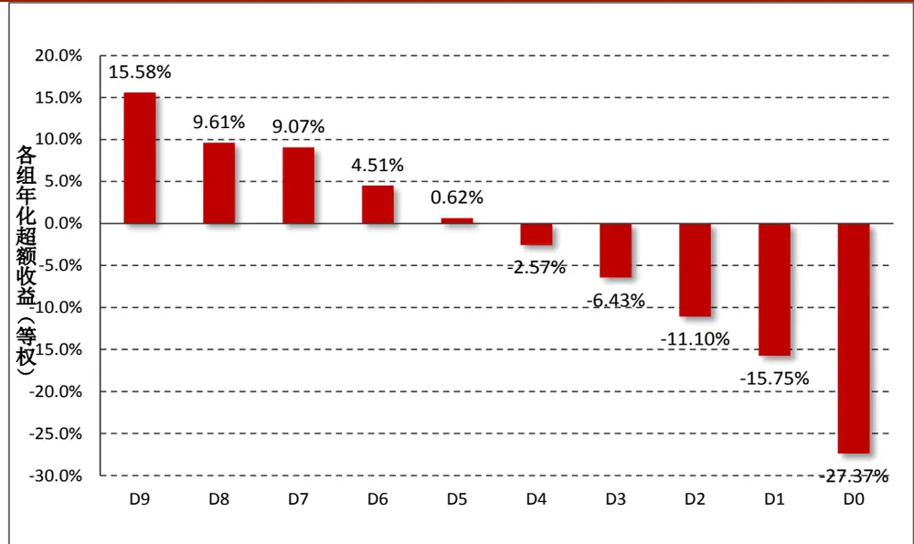
数据来源：财通证券研究所，恒生聚源

由图 1 可以看到，各组相对市场等权组合的年化超额收益基本上呈现出较好的单调分布情况，其中多头组合的年化超额收益达到 15.58%，空头组合的年化超额收益为-27.37%。由于在多因子构建过程中加入了大量的价量因子，因此空头组合的负向超额收益更为明显，这一点与预想的情况基本一致。

图 2：复合因子多空组合月度收益及净值表现
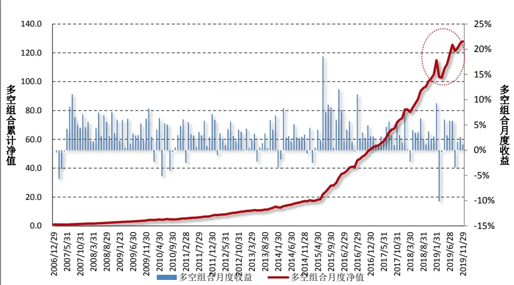

|  | IC | RankIC | 多头月均超额 | 空头月均超额 | 多空收益差 |
| --- | --- | --- | --- | --- | --- |
| 均值 | 9.2% | 12.5% | 1.17% | -2.07% | 3.18% |
| 月胜率 | 87% | 88% | 76.77% | 12.26% | 87.10% |
| T值 | 12.06 | 15.57 | 7.64 | -12.19 | 11.39 |

数据来源：财通证券研究所，恒生聚源

进一步地，图 2 展示了复合因子多空组合的月度收益及月度净值表现情况。可以看到，复合因子的月度RankIC均值达到12.5%，RankIC月度胜率达到88%。从多头组合来看，其相较市场等权组合的月均超额收益为 1.17%，月胜率 76.7%，T 值为 7.64，十分显著。

到目前为止，我们从因子的 RankIC、分组超额收益的单调性以及多空组合的绩效表现考察了复合因子的表现情况。然而，再多、再全面的单因子检验方式最终还需落实到产品的组合构建过程中。基于此，财通金工构建了中证 500指数增强组合，为了保证其与基准指数的行业分布较为一致，我们构建行业中性组合，其具体方式如下：

在每月的最后一个交易日，首先在 29 个中信一级行业中选取复合因子值排名前 10%的股票，并对同一行业内的个股进行等权配置。为了保证组合与基准组合在行业上的分布较为一致，我们将组合在中信一级行业间的权重与基准组合权重保持相同。图 3 展示了 2009.12.31-2019.11.29 期间，根据如上方法构建的中证500 指数增强型组合的绩效表现情况。

图 3：中证 500 指数增强组合表现情况（2009.12.31-2019.11.29）
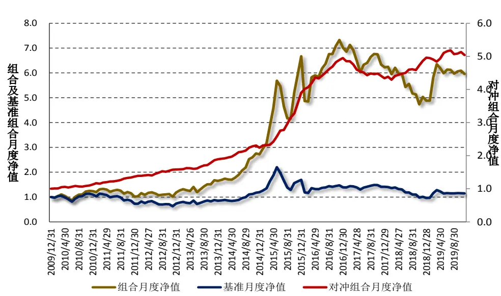

|  | 年化收益 | 年化波动 | 年化IR | 最大回撤 | 日胜率 |
| --- | --- | --- | --- | --- | --- |
| 资产组合 | 20.52% | 28.12% | 0.73 | 46.62% | 57.33% |
| 基准组合 | 1.47% | 28.93% | 0.05 | 64.47% | 54.09% |
| 对冲组合 | 18.43% | 5.44% | 3.39 | 13.64% | 59.07% |

数据来源：财通证券研究所，恒生聚源

由图 3 可以看到，对冲组合的年化收益达到 18.43%，年化波动达到 5.44%，年化信息比率能够达到 3.38，从数据统计上来看似乎是一个不错的组合。然而进一步分析可以发现，该组合在近几年尤其是 201 年以来的绩效表现并不令人满意。为了观察对冲组合在每个年份的表现情况，我们展示了该对冲组合在 2010年-2019 年分年度的绩效表现，其结果如表 2 所示。可以看到，在市场风格剧烈切换的 2017 年，该组合遭遇了较大的回撤，随后组合在 2018 年表现逐步企稳。然而进入到 2019年，该组合的超额收益仅仅达到 1.61%，远低于其历史上年化超额收益 的平均水平。

| 表2：中证500指数增强型对冲组合历年绩效表现（2010-2019） |  |  |  |  |
| --- | --- | --- | --- | --- |
| 年份 | 年化收益 | 年化波动 | 年化IR | 最大回撤 |
| 20101231 | 12.81% | 5.44% | 2.356 | 3.64% |
| 20111230 | 21.31% | 4.20% | 5.078 | 2.94% |
| 20121231 | 15.52% | 3.70% | 4.195 | 1.51% |
| 20131231 | 19.62% | 4.54% | 4.324 | 2.12% |
| 20141231 | 18.48% | 4.31% | 4.283 | 5.29% |
| 20151231 | 73.89% | 8.28% | 8.920 | 3.66% |
| 20161230 | 26.96% | 3.78% | 7.128 | 2.34% |
| 20171229 | -12.34% | 5.85% | -2.109 | 13.23% |
| 20181228 | 14.38% | 5.83% | 2.468 | 2.43% |
| 20191129 | 1.61% | 4.55% | 0.354 | 4.31% |

数据来源：财通证券研究所，恒生聚源

表 3：单因子全样本、最近 3年及年初至今（2019.11.29）表现情况

| 因子名称 | 全样本T值 | RankIC均值(全样本） | RankIC 均值（近3年) | RankIC均值(年初至今) | 多头年化超额(全样本) | 多头年化超额(近3年) | 多头年化超额(年初至今) | 空头年化超额(全样本) | 空头年化超额(近3年) | 空头年化超额(年初至今) |
| --- | --- | --- | --- | --- | --- | --- | --- | --- | --- | --- |
| ROE_ExDiluted | 2.94 | 2.53% | 4.52% | 4.34% | 4.43% | 7.16% | 5.64% | -9.86% | -13.21% | -14.35% |
| ROE_Diluted | 2.65 | 2.40% | 4.07% | 3.85% | 3.88% | 5.56% | 4.24% | -9.78% | -10.52% | -9.97% |
| NetProfitQYOY | 6.49 | 3.67% | 3.88% | 4.99% | 7.02% | 3.67% | 7.35% | -12.41% | -8.63% | -15.21% |
| NetOperateCashFlowQYOY | 6.17 | 1.19% | 1.10% | 1.27% | 1.35% | 0.44% | 3.11% | -3.58% | -3.56% | -5.20% |
| OperatingRevenueQYOY | 5.99 | 2.95% | 3.23% | 4.92% | 4.53% | 2.34% | 4.79% | -11.19% | -9.76% | -18.93% |
| MLEV | 2.49 | 1.41% | 1.80% | -0.37% | 4.00% | 2.83% | -2.74% | -5.41% | -5.02% | 0.47% |
| Turnover_1M | -10.13 | -10.53% | -12.13% | -8.81% | 10.48% | 8.10% | 0.92% | -26.07% | -19.17% | -19.77% |
| Ret21 | -7.17 | -7.35% | -6.15% | -7.06% | 5.12% | 2.02% | 4.87% | -18.65% | -14.85% | -17.37% |
| CFO | 4.98 | 1.79% | 2.95% | 3.00% | 3.41% | 4.72% | 7.22% | -6.04% | -8.24% | -9.52% |
| NetProfitCashCover | 3.25 | 0.85% | 1.28% | 1.08% | 1.32% | -0.60% | 0.25% | -2.74% | -1.66% | -4.54% |
| AssetsTurn | 3.66 | 1.44% | 2.46% | 2.52% | 2.07% | 2.14% | 2.61% | -5.56% | -7.05% | -12.44% |
| OCFPTTMSPTTMBPEPTTMIVFF3_1M | 7.55 | 3.15% | 4.51% | 2.10% | 5.88% | 6.80% | -0.05% | -9.09% | -9.05% | -5.92% |
|  | 5.69 | 3.76% | 4.46% | 1.96% | 7.02% | 5.28% | 0.82% | -14.53% | -10.77% | -2.66% |
|  | 6.05 | 5.11% | 5.52% | 2.63% | 6.26% | 6.40% | -2.06% | -15.68% | -10.48% | 6.33% |
|  | 5.66 | 3.93% | 5.94% | 3.56% | 4.42% | 8.54% | 0.22% | -10.95% | -14.00% | -7.61% |
|  | -11.85 | -9.59% | -10.98% | -8.61% | 8.68% | 6.59% | -0.52% | -20.44% | -16.08% | -21.68% |
| IVFF3_RSquare_1M | -12.64 | -8.63% | -7.32% | -7.82% | 12.15% | 7.06% | 4.34% | -16.88% | -10.16% | -11.59% |
| TotalMVNL | -6.37 | -4.60% | -3.42% | -2.82% | 13.41% | 12.63% | 13.46% | -5.89% | -2.28% | -4.79% |
| IMOM | 3.61 | 2.21% | 2.55% | 2.85% | 5.70% | 4.02% | 3.01% | -11.37% | -6.91% | -12.44% |
| APBFactor_5D | 10.58 | 7.80% | 9.90% | 8.54% | 9.84% | 7.45% | 10.62% | -25.38% | -22.03% | -27.48% |

数据来源：财通证券研究所，恒生聚源

那么，问题出现在哪里，是不是我们纳入复合因子的 Alpha单因子出现了失效的情况？为了探究这一问题，我们将单因子在全样本期间、最近 3 年期间及2019 年年初至今的 RankIC 值、多头相较基准的年化超额收益及空头相较基准的年化超额收益进行了计算，其结果如表 3 所示。

可以看到，表 3 的结果为我们如上的困惑提供了强有力的解释。从单因子在全样本的 T 值绝对值可以看到，换手率因子（Turnover_1M）、特质波动率因子（IVFF3_1M）及估值类因子（BP、OCFPTTM、BP 等）名列前茅，因此在进行RankICIR 加权的过程中，对这些单因子赋予的权重相对来讲将会更大。进一步地，我们观察各个因子在最近几年的 RankIC均值表现，从RankIC的角度来看，这些因子似乎也并未失效：Turnover_1M 年初至今的月均 RankIC 达到-8.81%，与全样本期间的-10.53%基本处于相同的水平。然而观察其多头组合相较基准组合的年化超额收益就可明显地看到，年初至今该因子多头组合的超额收益仅为0.92%，远远低于全样本期间 10.48%的年化超额收益。而从空头组合的表现来看，高换手的股票组合落后市场基准组合达 19.77%，呈现出显著的负 Alpha 效应。也就是说，因子的空头组合显著落后基准组合保证了因子 的水平与其历史均值处于相似的状态，然而因子多头表现的明显回撤，是导致构建指数增强组合过程中出现较大回撤的最主要因素。

同样的情况发生在估值因子中，由表 3 可以看到，几乎所有的估值因子多头组合均在 2019 年折戟。以 BP 因子为例，低估值组合跑输基准 2.06%，而高估值组合却跑赢基准 6.33%，因子方向呈现出明显的反转，说明 2019 年低估值策略在 A股市场几近失效。此外，特质波动率因子（IVFF3_1M）空头组合表现尽管显著落后于基准，但其多头组合的超额收益却为-0.52%，远远低于 8.68%的历史年化超额收益。

图 4：财通金工量化工具箱 V0.1
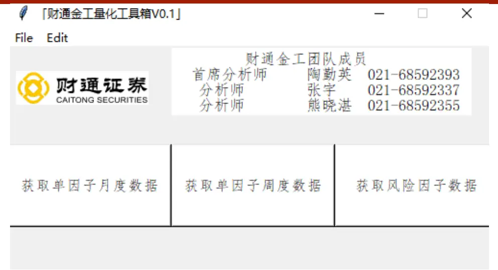
数据来源：财通证券研究所

由上述分析可知，在对因子的有效性进行检验及跟踪时，不仅要观察其RankIC的表现情况，更重要的是需要关注其多头组合相较基本组合的超额收益。基于此，财通金工开发了量化工具箱 V0.1 版本，每周（每月）就单因子的周度（月度）表现进行更新，可直接在用户的个人电脑上直接安装运行（如图 4 所示），感兴趣的投资者欢迎与财通金工联系获取，后续我们还将在此基础上开发更多功能，欢迎大家持续关注。

## 2、 高阶矩与资产定价：高频特质偏度因子计算

由前一部分的分析可知，低换手、低估值及低特质波动策略在 2019 年出现了明显的回撤，因此在后续 Alpha 因子的研究过程中，多头组合的表现情况成为我们关注的一大重点。

高阶矩因子与资产定价之间的关系在学术界被不断探讨，近几年又进一步地从对动量、波动及偏度因子的探讨演化到对特质动量、特质波动及特质偏度因子有效性的探讨上。在财通金工“星火”系列（五）《源于动量，超越动量：特质动量因子全解析》中，我们就剥离掉市场风格之后的动量因子表现情况进行了验证。作为该特质因子系列的第二篇报告，本文对市场中涉及相对较少的特质偏度因子的有效性及其成因展开讨论。与传统的研究不同，本文将借助日内高频交易数据构建出更加有效的特质偏度因子。

## 2.1 样本高阶矩计算方法说明

在统计学中，矩（Moment）是对变量分布和形态特点的一组度量，n 阶矩被定义为该变量的 n 次方与其概率密度函数之积的积分。进一步地，直接使用变量计算的矩被称为原始矩（Raw Moment），去除均值后计算的矩被称为中心矩（Central Moment）。最为普遍的，变量的一阶原始矩等价于其数学期望（Expectation），二阶至四阶中心矩则被定义为数据的方差（Variance）、偏度（Skewness）及峰度（Kurtosis）。

假设连续变量 x 及其单变量概率密度函数为P(x)，那么其n 阶矩 ${\dot{\boldsymbol{\cdot}}}{\boldsymbol{\mu}}_{n}$ 即可被定义为：

$$
\mu_{n}=\int x^{n}P(x)dx
$$

在实际应用中，我们通常处理的为离散变量，因此其 n 阶矩 $\dot{\boldsymbol{\mathbf{\mu}}}\mu_{n}^{\prime}$ 即可被定义为：

$$
\mu_{n}^{\prime}=\sum x^{n}P(x)
$$

由此，我们可对数据的均值、方差、偏度和峰度进行统一框架下的表示：

（1） 一阶原点矩：均值

$$
\mu=E(x)
$$

（2） 二阶中心矩：方差

$$
\sigma^{2}=E(x-E(x))^{2}=E(x^{2})-\mu^{2}
$$

（3） 三阶中心矩：偏度

$$
skew(x)=E\left(\frac{x-E(x)}{\sigma}\right)^{3}
$$

图 5：数据正偏、无偏、负偏示意图
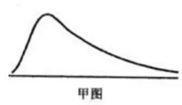

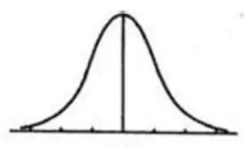
数据来源：财通证券研究所

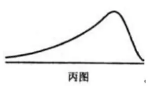

如果说方差衡量的是数据的波动性，那么偏度统计量则主要用于衡量数据的厚尾性。如图5 所示，甲图所示的数据偏度>0，数据右偏，在图形上表现为其分布呈现出一条长尾在右侧；乙图偏度=0，数据无偏，在图形上表现为左右对称分布；丙图偏度<0，数据左偏，在图形上表现为有一条长尾在左侧。

（4） 四阶中心矩：峰度

$$
kurtosis(x)=E\left(\frac{x-E(x)}{\sigma}\right)^{4}
$$

峰度越高意味着数据方差的增大是由低频度的偏离平均值的极端差值引起的。也就是说在相同的标准差下，数据的峰度越大，意味着数据分布中有更多的极端值，因此其它值更加集中在众数周围，从而导致数据分布更加陡峭。

## 2.2 高频特质偏度因子计算

在对样本高阶矩的数学定义进行了介绍之后，本部分开始对特质偏度因子的计算进行说明。为了更加快速地捕捉到市场情绪的变化，我们采用个股日内高频交易数据对其日内收益率的偏度进行了计算，为了避免市场微观结构造成的误差，我们参照主流文献中采用日内 5 分钟交易数据进行计算。具体方法如下：

首先，对于每一个交易日中，计算个股的日内 5 分钟收益率，并将其对Fama-French 三因子的日内收益率进行时间序列回归：

$$
r_{i,t}=\alpha_{i}+\beta_{mkt}MKT_{t}+\beta_{smb}SMB_{t}+\beta_{hml}HML_{t}+\varepsilon_{i,t}
$$

上述回归计算得到的残差项 $\varepsilon_{i,t}$ 即为个股的日内特质收益率，由于特质收益率高度有偏，因此我们将其进行对数化处理：

$$
w_{i,t}=ln(1+\varepsilon_{i,t})
$$

在对残差数据进行对数化处理后，下面即可根据偏度的定义计算个股的日内偏度数据：

$$
ISKEW_{i,t}=\frac{1}{N(t)}\times\frac{\sum w_{i,t}^{3}}{\left(\frac{\sum w_{i,t}^{2}}{N(t)}\right)^{\frac{3}{2}}}
$$

其中，N(t)表示个股日内存在交易的数据个数。为了避免数据存在过多的不稳定性，我们将个股在过去 21 天的日内特质偏度的均值作为其特质偏度因子：

$$
IdioSkew_{i}=\frac{1}{21}\sum_{t-21}^{t}ISKEW_{i,t}
$$

## 3、 因子实证检验：多头收益显著、多头组合基本面优异

在介绍了高频特质偏度因子的具体构建方式之后，本部分我们从实证角度观察该因子在 A 股市场上的表现情况。我们将从因子分组表现情况、多空组合绩效表现、多头组合超额收益及多头组合基本面特征等多个角度对该因子进行考察。

## 3.1 原始因子绩效表现

由于我们获取的最早个股日内交易数据仅为 2013 年 3 月，因此本文的回测起始时间选定为 2013 年 5 月 31 日，具体细节如下：

因子预处理：在横截面上将高频特质偏度对个股对数市值进行正交化处理

回测时间：2013.5.31-2019.11.29，月度调仓

回测样本：Wind 全 A样本股

样本筛选：剔除上市时间少于 100 天、剔除调仓日停牌一天、剔除 ST、*ST、PT 等被标为风险预警的股票、剔除调仓日涨停或者跌停的股票

调仓时间：每月最后一个交易日

分组方式：按照因子值从小到大分 10 组（D0-D9），每组成分股进行等权处理，因子值最大的一组（D9）作为空头，因子值最小的一组（D0）作为多头基准指数：每期满足条件的样本股收益等权平均

图 6：高频特质偏度因子多空月度收益及累计净值（2013.5.31-2019.11.29）
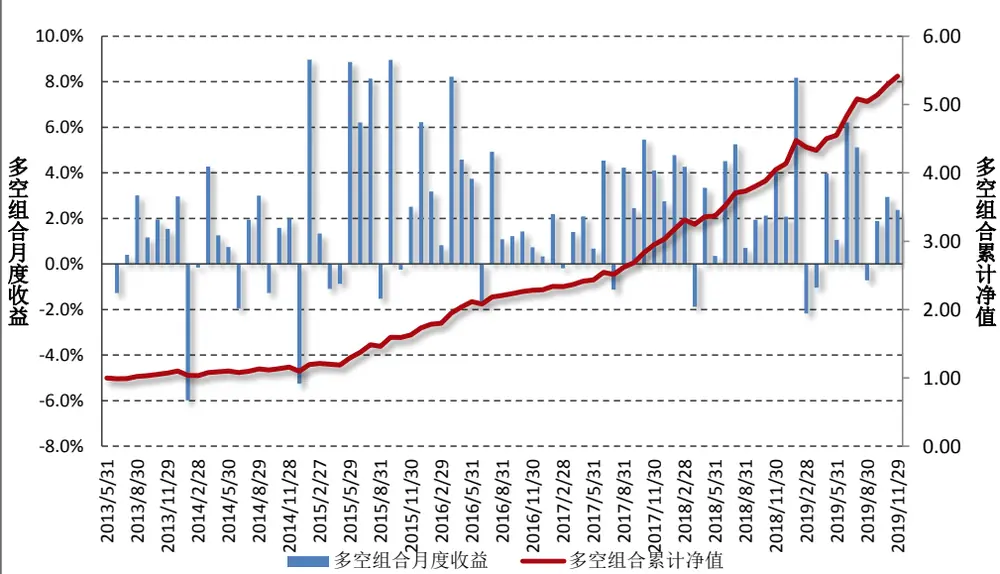

|  | IC | RankIC | 多头月均超额 | 空头月均超额 | 多空收益差 |
| --- | --- | --- | --- | --- | --- |
| 均值 | -7.40% | -9.50% | 0.66% | -1.71% | 2.19% |
| 月胜率 | 15% | 10% | 67.95% | 10.26% | 82.05% |
| t 值 | -9.21 | -11.68 | 4.28 | -8.99 | 7.78 |

数据来源：财通证券研究所，Wind

图 6 展示了回测区间高频特质偏度因子的多空月度收益及累计净值情况，可以看到该因子的月均 RankIC 达到-9.5%，T 值达到-11.68，多空组合的月度收益为 2.19%，月胜率达到 82.05%，表现优异。

图 7：各组相较基准指数的年化超额收益
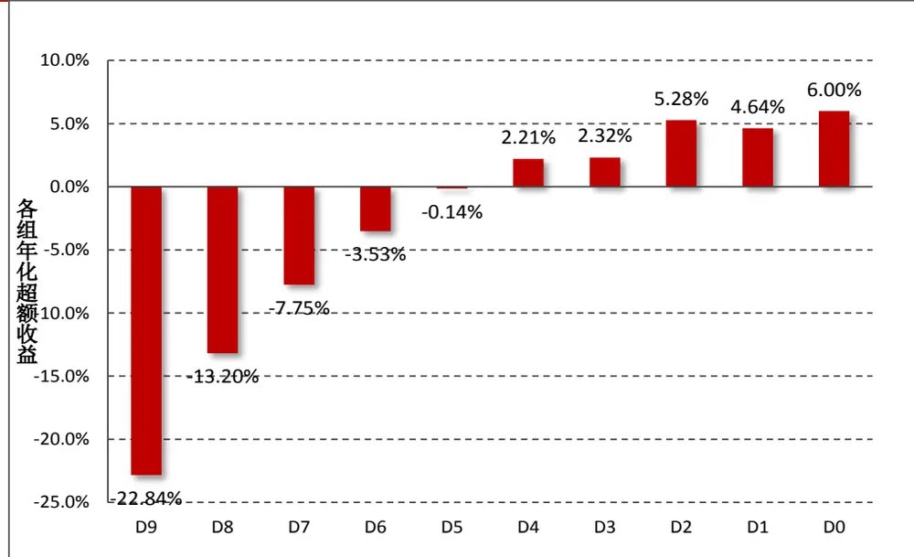
数据来源：财通证券研究所

图 7 展示了各组相较市场基本指数的年化超额收益，与大部分价量因子类似，该因子的空头组合显著落后市场基准，年化超额达到-22.84%，而多头组合相较市场均值也有一定的正向贡献，年化收益为 6%。

表 4：高频特质因子各组分年度超额收益表现情况（相较等权市场基准指数）

| 对市值正交化 | D9(空头) | D8 | D7 | D6 | D5 | D4 | D3 | D2 | D1 | D0(多头) |
| --- | --- | --- | --- | --- | --- | --- | --- | --- | --- | --- |
| 20141231 | -12.21% | -3.96% | -7.91% | -0.14% | 2.69% | -4.36% | -3.12% | -2.36% | -5.25% | -5.47% |
| 20151231 | -57.54% | -37.53% | -18.01% | -11.95% | 4.31% | 7.99% | 11.57% | 19.54% | 26.13% | 24.91% |
| 20161230 | -16.66% | -11.30% | -8.83% | -2.80% | -2.41% | 1.24% | 1.39% | 4.07% | 3.84% | 9.95% |
| 20171229 | -19.23% | -9.80% | -6.30% | -0.11% | 0.10% | 2.96% | 0.51% | 5.93% | 2.82% | 1.41% |
| 20181228 | -16.07% | -11.28% | -6.06% | -3.69% | -1.37% | 2.77% | 1.64% | 4.92% | 5.86% | 6.50% |
| 20191129 | -26.30% | -11.42% | -5.56% | -1.02% | -0.41% | 5.15% | 4.62% | 2.15% | -0.37% | 4.90% |

数据来源：财通证券研究所，Wind

进一步地，表 4 展示了各组在 2014-2019 年期间各组的超额收益，可以看到多头组合近几年相较市场均值的超额收益较为稳定，2019 年至今相较市场均值超额为 ，优于前面提到的特质波动率因子。

## 3.2 因子风格特征情况

本小节我们观察高频特质偏度因子在主要的风格因子及基本面因子上的表现情况。为了避免各期因子值的较大变化对最后计算时间序列均值时造成的影响，也为了方便不同因子之间可以进行比较，我们首先将股票的风格因子值转化成排序值，计算各组成分股在该风格因子上的加权均值，然后再根据每组的加权均值进行打分（1-10分），最终计算每组得分在时间序列上的均值。

图 8：各组在主要的风格因子上的得分均值
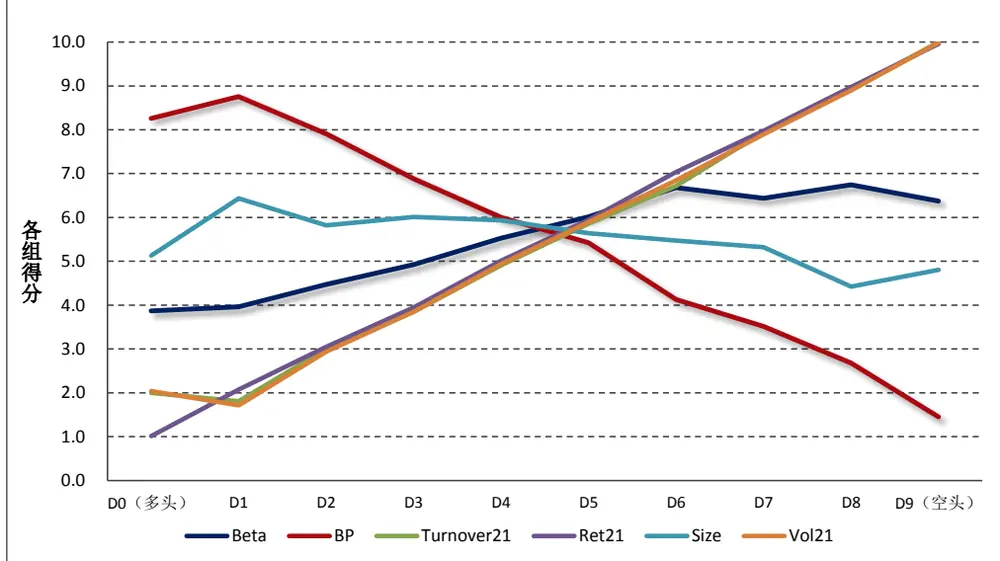
数据来源：财通证券研究所

图 8 展示了各组在不同风格因子上的平均得分情况，可以看到由于预先将因子对市值进行了正交化处理，因此十分组下在市值因子上的得分基本比较平均。此外，可以很清楚的看到，该因子与 Beta 因子、21 天换手率（Turnover21）、21天收益率（Ret21）及 21 天波动率（Vol21）呈现出明显的正相关关系，而与估值因子 BP 呈现出明显的负相关关系。也就是说，该组合的多头是一些低 Beta、低换手、低波动及前期涨幅较低的低估值股票。

图 9：各组在主要基本面因子上的得分均值
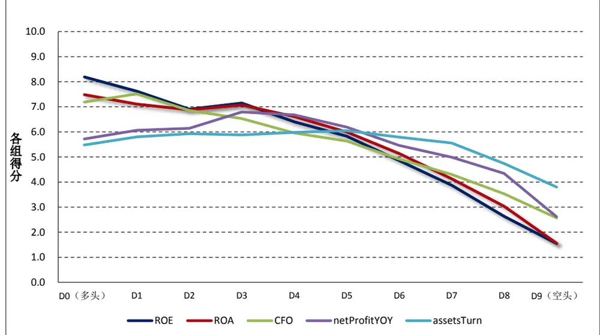
数据来源：财通证券研究所

图 9 展示了高频特质偏度因子的十分组在主要基本面因子上的得分情况，其中 ROE 及 ROA 主要反映公司的盈利能力，CFO 主要反映公司的现金流量，净利润同比增长率（netProfitYOY）主要反映公司的成长能力，总资产周转率（assetsTurn）主要反映公司的营运能力，各指标的具体计算方法可参见财通金工“拾穗”系列（14）《补充：基于特质动量因子的沪深 300 指数增强策略》。可以看到，高频特质因子的多头组合（D0 组）往往是那些基本面较好、质地较为优良的股票，这一点与我们前期构造的特质动量因子的表现较为一致。

## 3.3 正交化后因子绩效表现

图 10：剥离其他风格因子影响之后的高频特质偏度因子表现
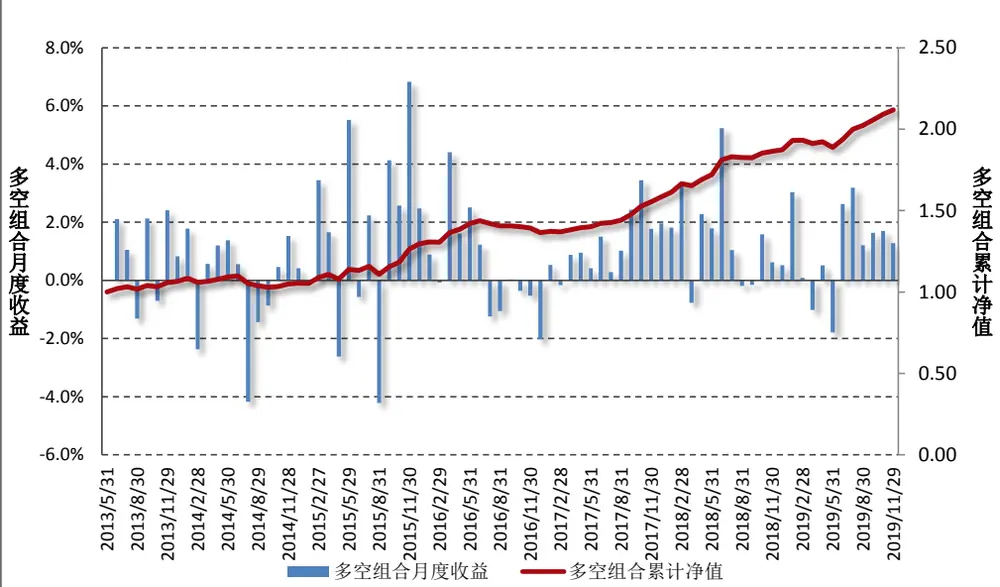

|  | IC | RankIC | 多头月均超额 | 空头月均超额 | 多空收益差 |
| --- | --- | --- | --- | --- | --- |
| 均值 | -3.40% | -4.40% | 0.34% | -0.67% | 0.96% |
| 月胜率 | 30% | 23% | 64% | 27% | 72% |
| t 值 | -6.085 | -7.65 | 2.78 | -4.53 | 4.46 |

数据来源：财通证券研究所，Wind

由 3.2 小节可知，高频特质偏度因子与主要的风格因子存在着非常强烈的相关关系，自然而然地，我们必须了解在剥离主要的风格因子影响之后，该因子的表现情况。由此，我们对 Beta、BP、Size、Turnover21、Vol21 及 Ret21 因子进行横截面回归，并取其残差作为该因子的代理变量：

$$
\begin{array}{rl}&{IdioSkew_{i}=\alpha_{i}+\beta_{1}Beta_{i}+\beta_{2}BP_{i}+\beta_{3}Size_{i}+\beta_{4}Turnover21_{i}+\beta_{5}Vol21_{i}}\\&{\qquad+\beta_{6}Ret21_{i}+\varepsilon_{i}}\end{array}
$$

图 10 展示了正交化所有风格因子后，高频特质偏度因子的表现情况。可以看到，其 RankIC 均值仍然达到-4.4%，月胜率 23%，t 值为-7.65。多空组合的月均收益率达到 0.96%，月度胜率 72%，t 值为 4.46。

## 4、 博彩偏好还是风险补偿？特质偏度因子拆解

在上一部分我们对高频特质偏度因子在 A股市场上的效果进行了检验，可以看到无论是原始因子还是剥离主要风格因子之后的正交化因子，都表现出不错的选股能力。在本部分，我们将从博彩偏好还是风险补偿两个角度出发，探讨特质偏度溢价形成的深层原因。

## 4.1 博彩偏好与风险补偿

关于特质偏度异象的成因，学术界的主流观点大致可以分为如下两种。一类来源于投资者对于高偏度股票的“博彩偏好”，即特质偏度较高的股票通常是过去出现过“暴涨”的股票，投资者倾向于认为这种“暴涨”现象将会在未来重演，从而买入持有导致价格高估，使得股票的后续价格出现回落。这种“博彩偏好”将偏度较高的股票视为“彩票”，通常是投资者投机交易的结果，对于个人投资者占比较高的 A 股市场而言这种现象尤甚。另一类观点认为特质偏度异象的成因来源于投资者对于低偏度股票的“风险补偿”。特质偏度为负的股票往往对应于过去出现过“暴跌”的股票，投资者持有这类股票将要获取一定的风险补偿，因此这类股票在未来的价格将会出现上涨。为了将特质偏度效应中的“博彩偏好”和“风险补偿”效应进行拆分，我们构建暴涨效应（Jump）和暴跌效应（Crash）因子对这两类效应进行分别探讨。

在每个交易日，我们根据 2.2 小节的方法构建对数处理过后的残差收益 $w_{i,t}$ 后，对其进行 ZScore 标准化处理，构建 $Le\nu el$ 指标：

$$
Level_{i,t}=\frac{w_{i,t}-\mu_{i,t}}{\sigma_{i,t}}
$$

其中， $\mu_{i,t}$ 表示日内残差收益 $w_{i,t}$ 的均值， $\sigma_{i,t}$ 表示其标准差，之所以对其进行标准化处理，是为了使得不同交易日的 Level 指标可以在相同的量纲下进行比较。随后，取该日 $Level_{i,t}$ 中的最大值作为个股日内暴涨指标 $(DJump\_Level_{i,t})$ 的代理变量，取该日 $Level_{i,t}$ 中的最小值作为个股日内暴跌指标 $(DCrash\_Level_{i,t})$ 的代理变量：

$$
\begin{array}{r}{DJump\_Level_{i,t}=max(Level_{i,t})}\\{DCrash\_Level_{i,t}=min(Level_{i,t})}\end{array}
$$

与高频特质偏度因子的计算类似，我们将过去 21 天的DJump $Level_{i,t}$ 因子均值作为其“暴涨效应”的代理变量，将过去 21 天的 $\boldsymbol{D}Crash\_Level_{i,t}$ 因子均值作为其“暴跌效应”的代理变量：

$$
\begin{array}{l}{{\displaystyle Jump\_Level_{i,t}=\frac{1}{21}\sum_{t-21}^{t}{DJump\_Level_{i,t}}}}\\{{\displaystyle Crash\_Level_{i,t}=\frac{1}{21}\sum_{t-21}^{t}{DCrash\_Level_{i,t}}}}\end{array}
$$

最后，为了防止个股“暴涨风险”与“暴跌风险”之间的互相影响，我们在横截面上对二者进行相互回归，以剔除二者之间的相关性：

$$
\begin{array}{r}{Jump\_Level_{i,t}=\beta_{0}+\beta_{0}Crash\_Level_{i,t}+\varepsilon_{i,t}}\\{Crash\_Level_{i,t}=\beta_{0}+\beta_{0}Jump\_Level_{i,t}+\epsilon_{i,t}}\end{array}
$$

由此， $\varepsilon_{i,t}$ 即可作为剥离掉“暴跌效应”的“暴涨因子”代理变量，而 $\epsilon_{i,t}$ 即可作为剥离掉“暴涨效应”的“暴跌因子”代理变量。为了表述的简便性，我们将前者命名为 Jump 因子，将后者的相反数命名为 Crash 因子。

$$
\epsilon_{i,t}=(-1)\times\epsilon_{i,t}
$$

表 5：特质偏度因子对 Jump及 Crash 因子回归结果

|  | (1) | (2) | (3) | (4) | (5) | (6) | (7) | (8) | (9) |
| --- | --- | --- | --- | --- | --- | --- | --- | --- | --- |
| 回归结果 | 全样本 | 全样本 | 全样本 | 左偏样本 | 左偏样本 | 左偏样本 | 右偏样本 | 右偏样本 | 右偏样本 |
| 截距项 | 0.32 | 0.32 | 0.32 | 0.16 | 0.13 | 0.24 | 0.43 | 0.50 | 0.38 |
| t值 | 806.72 | 596.12 | 1153.85 | 285.94 | 285.78 | 461.25 | 746.81 | 781.50 | 717.44 |
| Jump | 0.82 |  | 0.89 | 0.30 |  | 0.63 | 0.66 |  | 0.77 |
| t值 | 485.68 |  | 747..49 | 121.25 |  | 280.41 | 277.32 |  | 374.15 |
| Crash |  | -0.70 | -0.87 |  | -0.30 | -0.69 |  | -0.37 | -0.67 |
| t值 |  | -199.57 | -469.96 |  | -107.67 | -271.78 |  | -78.51 | -211.52 |
| R2 | 0.53 | 0.16 | 0.77 | 0.12 | 0.10 | 0.49 | 0.42 | 0.06 | 0.60 |

数据来源：财通证券研究所，Wind

首先我们需要考察 Jump 因子与 Crash 因子对于特质偏度因子的解释能力，因此我们进行如下三种类别回归。首先，将全样本所有特质偏度因子对全样本所有 Jump 因子和 Crash 因子分别回归，最后将二者一起回归，表 5 中的（1）、（2）、（3）分别展示了三个回归的结果。可以看到 Jump 因子对于特质偏度的影响系数（0.89）显著为正，Crash 因子对应特质偏度的影响显著为负（-0.87），二者在绝对值上相差并不明显，且对特质偏度因子的解释能力达到 77%。

随后，我们按照每个横截面上，将大于其偏度中位数的个股作为右偏样本，小于其偏度中位数的个股作为左偏样本，同样按照如上方法进行回归。可以看到，对于左偏样本而言，Crash 因子的影响能力更强，而对于右偏样本而言，Jump因子的影响能力更强。

## 4.2 Jump 因子及 Crash 因子绩效表现

为了进一步展示暴涨效应和暴跌效应的强弱，我们对 Jump 因子和 Crash 因子在 A股市场上的选股效应进行了检验，其结果如表 6 所示。

表 6：暴涨因子及暴跌因子回测效果

|  | IC | RankIC | 多头月均超额 | 空头月均超额 | 多空收益差 |
| --- | --- | --- | --- | --- | --- |
|  |  | 暴涨因子 | （Jump） |  |  |
| 均值 | -6.20% | -8.70% | 0.54% | -1.48% | 2.00% |
| 月胜率 | 23% | 12% | 66.67% | 20.51% | 75.64% |
| t值 | -6.95 | -8.86 | 2.707 | -6.906 | 5.871 |
|  |  | 暴跌因子（ | Crash） |  |  |
| 均值 | -3.30% | -4.10% | 0.39% | -0.88% | 1.18% |
| 月胜率 | 24% | 28% | 65.38% | 26.92% | 74.36% |
| t值 | -4.03 | -4.53 | 2.305 | -3.689 | 3.217 |

数据来源：财通证券研究所，Wind

由表 6 可以看到，暴涨因子的 RankIC 均值达到-8.7%，其月胜率为 12%，T值达到-8.86；相较之下，暴跌因子的 RankIC 均值仅为-4.1%，月胜率为 28%，T值为-4.53。从这一角度来看，暴涨因子相较暴跌因子有着更强的选股能力，这一结论与多空组合的表现情况也相符。

由前面可知，特质偏度因子与很多风格因子之间存在着强相关关系，因此我们需要检验剥离这些风格因子之后的纯净因子的选股能力。同样的，暴涨因子与暴跌因子在主要的风格因子上存在着十分强烈的偏好，财通金工将二者对这些因素进行了剥离，并对其选股效果进行了检验，其结果如表 7 所示。

表 7：暴涨因子及暴跌因子回测效果（正交化后）

|  | IC | RankIC | 多头月均超额 | 空头月均超额 | 多空收益差 |
| --- | --- | --- | --- | --- | --- |
|  |  | 暴涨因子 | （Jump） |  |  |
| 均值 | -3.60% | -4.40% | 0.45% | -0.78% | 1.20% |
| 月胜率 | 24% | 21% | 65% | 28% | 78% |
| t 值 | -6.42 | -7.85 | 3.59 | -4.87 | 5.16 |
|  |  | 暴跌因子（ | Crash） |  |  |
| 均值 | -1.60% | -2.30% | -0.05% | -0.47% | 0.38% |
| 月胜率 | 33% | 28% | 46% | 28% | 65% |
| t值 | -3.24 | -4.33 | -0.43 | -3.82 | 1.96 |

数据来源：财通证券研究所，Wind

由表 7 可以看到，在剥离了 Beta、BP、Ret21、Turnover21、Size 和 Vol21等风格因子的影响之后，暴涨因子和暴跌因子均展现出一定的选股能力。两相比较之下，暴涨因子的选股能力显著优于暴跌因子，这说明在 A 股市场上，投资者对于个股的“博彩偏好”占据主导地位。

## 4.3 不同样本表现情况

前一部分我们从特质偏度因子的溢价成因出发，分别检验了投资者“博彩偏好”和“风险补偿”两种效应对特质偏度因子的解释能力，结果显示在 A 股市场上，投资者对于个股的“博彩偏好”占据主导地位。事实上，由于个人投资者过于追求“彩票型”股票而导致这类股票的价格被显著高估，而 A 股市场目前缺乏广泛有效的做空制度，因此个股的信息不对称性和套利机制的限制性将会进一步加强这一效应。在本文的最后一部分，我们从交易制度的限制性出发，探讨特质偏度因子在不同样本中的表现情况。

参照 Gu、Kang and Xu（2018）对于特质波动因子成因的探讨，我们根据如下几类标准对全市场股票进行划分：

（1） AmihudHigh VS AmihudLow：在每个截面期，根据个股的 Amihud指标是否大于全样本的中位数将其分为 AmihudHigh 和 AmihudLow两类样本。

$$
Amihud_{i}=\sum_{t-21}^{t}\frac{|r_{t}|}{Volume_{t}}
$$

由于 Amihud 指标衡量的是个股的非流动性，因此 AmihudHigh 样本中的个股流动性更差，冲击成本高，因此其套利机制将更不完善；

（2） NoAnalystCoverage VS analystCoverage：根据个股是否有分析师覆盖，将全样本分为无分析师覆盖样本和有分析师覆盖样本，无分析师覆盖的样本股票信息不对称性越强；

（3）NotFutures VS Futures：目前 A股市场股指期货有上证 50 股指期货、沪深 300 股指期货和中证 500 股指期货。假如个股为上证 50、沪深300 或中证 500 指数成分股，那么可以通过卖空股指期货的做法变相做空个股。基于此，我们将样本划分为非股指期货对应的指数成分股和股指期货对应的指数成分股两类；

（4） NotShortSelling VS ShortSelling：目前 A 股市场做空个股最直接的方式即为融券卖出，因此可以根据是否为融券标的将其划分为两类。

表 8 给出了不同样本空间中，经过市值正交化后的特质偏度因子的月均RankIC均值、RankIC月胜率及T值。可以看到，在冲击成本较高的（AmihudHigh）、无分析师覆盖的（NoAnalystCoverage）、非股指期货指数对应成分股（NotFutures）及非融券标的（NotShortSelling）的个股中，特质偏度因子均有着更好的表现。

表 8：不同样本情况下的 RankIC 均值、月胜率及 T值

|  | AmihudHigh | AmihudLow | NoAnalystCoverage | Analy stCoverage | NotFutures | Futures | NotShortSelling | ShortSelling |
| --- | --- | --- | --- | --- | --- | --- | --- | --- |
| RankIC 均值 | -8.4% | -10.1% | -12.0% | -8.7% | -10.3% | -7.9% | -10.0% | -8.2% |
| RankIC 月胜率 | 8% | 15% | 5% | 14% | 5% | 21% | 6% | 22% |
| RankIC-T 值 | -11.3 | -9.2 | -13.4 | -10.7 | 13.1 | -7.5 | -12.9 | -7.6 |

数据来源：财通证券研究所，Wind

表 9：不同样本情况下多空组合绩效表现

|  | 年化收益 | 年化波动 | 年化 IR | 最大回撤 | 月度胜率 |
| --- | --- | --- | --- | --- | --- |
| AmihudIlqHigh | 35.70% | 9.10% | 3.92 | 2.33% | 84.61% |
| AmihudIlliqLow | 24.26% | 11.09% | 2.19 | 7.80% | 75.60% |
| NoAnaly stCoverage | 44.40% | 10.90% | 4.06 | 4.00% | 88.50% |
| Analy stCoverage | 28.90% | 10.20% | 2.83 | 613.00% | 82.10% |
| NotFutures | 38.10% | 9.40% | 4.04 | 6.30% | 88.50% |
| Futures | 18.90% | 11.50% | 1.64 | 10.60% | 66.70% |
| NotShortSelling | 38.00% | 8.00% | 4.32 | 4.90% | 89.70% |
| Short Selling | 18.00% | 12.00% | 1.47 | 15.80% | 70.50% |

数据来源：财通证券研究所，Wind

表 9 展示了不同样本中，特质偏度因子多空组合的绩效表现情况。从多空组合的年化 IR 来看，因子在冲击成本较高的、无分析师覆盖的、非股指期货指数对应成分股及非融券的个股中，特质偏度因子均有着更好的表现。由此也可以看出，套利制度的限制以及个股信息的不对称性确实会对特质偏度因子产生强烈的影响。值得一提的是，本文提出的这一样本划分在后续其他因子的检验当中同样适用。

## 4.4 小结

本小节我们将特质偏度溢价的成因进行深入探讨，将其划分为“暴涨效应”和“暴跌效应”，并针对两种效应下的选股能力进行了检验。可以看到，无论是原始因子值还是剥离其他风格之后的因子值，“暴涨因子”在 A股市场上的选股能力显著高于“暴跌因子”，这为特质偏度因子背后的“博彩偏好”提供了强有力的证据。

此外，针对 A 股市场的卖空制度限制以及个股的信息不对称性，我们将 A股的样本进行了划分，并检验不同样本划分下的特质偏度因子选股效果，发现特质偏度因子在那些冲击成本高、无分析师覆盖、非股指期货指数成分股及非融券标的个股中表现更为强势。

## 5、 总结与展望

随着市场投资者结构及市场风格的不断变化，传统有效的 Alpha 因子在今年正经受着考验。本文对 2019 年度因子绩效表现情况进行了回顾，并基于日内高频数据构建了特质偏度因子并检验其在 A 股市场上的有效性。此外，我们将特质偏度溢价划分为“博彩偏好”和“风险补偿”两类，并检验何者对特质偏度因子的贡献更强。主要结论如下：

（1） 2019 年，低估值、低特质波动、低换手因子遭遇了明显回撤。因此我们在观察因子有效性时不仅要观察其 RankIC 的表现情况，更需注重多头在近年的超额表现情况；

（2） 财通金工开发了一套初步的量化工具箱，每周（每月）就单因子的周度（月度）表现进行更新；

（3） 基于日内 5 分钟高频数据构建的特质偏度因子在 A股市场上表现优异，RankIC 均值达到-9.5%，且多头相对基准指数在今年也有显著超额收益；

（4） 高频特质偏度因子与 Beta、21 天换手率、21 天收益率及 21 天波动率呈现出明显的正相关关系，而与 BP 因子呈现出明显的负相关关系。剥离掉这些风格之后的特质偏度因子仍然表现出稳健的选股效果；

（5） 通过对高频特质偏度因子的基本面情况进行考察发现，其多头组合往往是那些基本面较好、质地较为优良的股票，这一点与我们前期构造的特质动量因子的表现较为一致；

（6）关于特质偏度异象的成因，学术界大致将其划分为“博彩偏好”和“风险补偿”两类。通过构建“暴涨因子”和“暴跌因子”，我们将两种效应剥离开来并检验其在 A 股市场上的表现情况。结果显示，“暴涨因子”的选股能力显著强于“暴跌因子”，“博彩偏好”效应在个人投资者居多的 A股市场占主导地位；

（7） 通过个股的非流动性指标、是否有分析师覆盖、是否是股指期货指数成分股、是否为融券标的，我们将 A股进行了不同样本的划分，并检验了特质偏度因子在不同样本中的表现情况。结果显示，在冲击成本高、无分析师覆盖、非股指期货指数对应成分股及非融券标的个股中，特质偏度因子均有着更好的表现。

## 6、 风险提示

多因子模型拟合均基于历史数据，市场风格的变化将可能导致模型失效。

参考文献：

【1】 “Limits of arbitrage and idiosyncratic volatility: Evidence from China Stock Market”.

Ming Gu, Wenjin Kang, Bu Xu. Journal of Banking and Finance. 2018

【2】“基于中国股票市场的预期特质偏度溢价研究”，王少峰，南京财经大学，2017

## 信息披露

## 分析师承诺

作者具有中国证券业协会授予的证券投资咨询执业资格，并注册为证券分析师，具备专业胜任能力，保证报告所采用的数据均来自合规渠道，分析逻辑基于作者的职业理解。本报告清晰地反映了作者的研究观点，力求独立、客观和公正，结论不受任何第三方的授意或影响，作者也不会因本报告中的具体推荐意见或观点而直接或间接收到任何形式的补偿。

## 资质声明

财通证券股份有限公司具备中国证券监督管理委员会许可的证券投资咨询业务资格。

## 公司评级

买入：我们预计未来 6 个月内，个股相对大盘涨幅在 15%以上；

增持：我们预计未来 6 个月内，个股相对大盘涨幅介于 5%与15%之间；

中性：我们预计未来 6 个月内，个股相对大盘涨幅介于-5%与5%之间；

减持：我们预计未来 6 个月内，个股相对大盘涨幅介于-5%与-15%之间；

卖出：我们预计未来 6 个月内，个股相对大盘涨幅低于-15%。

## 行业评级

增持：我们预计未来 6 个月内，行业整体回报高于市场整体水平 5%以上；

中性：我们预计未来 6 个月内，行业整体回报介于市场整体水平-5%与 5%之间；

减持：我们预计未来 6 个月内，行业整体回报低于市场整体水平-5%以下。

## 免责声明

本报告仅供财通证券股份有限公司的客户使用。本公司不会因接收人收到本报告而视其为本公司的当然客户。

本报告的信息来源于已公开的资料，本公司不保证该等信息的准确性、完整性。本报告所载的资料、工具、意见及推测只提供给客户作参考之用，并非作为或被视为出售或购买证券或其他投资标的邀请或向他人作出邀请。

本报告所载的资料、意见及推测仅反映本公司于发布本报告当日的判断，本报告所指的证券或投资标的价格、价值及投资收入可能会波动。在不同时期，本公司可发出与本报告所载资料、意见及推测不一致的报告。

本公司通过信息隔离墙对可能存在利益冲突的业务部门或关联机构之间的信息流动进行控制。因此，客户应注意，在法律许可的情况下，本公司及其所属关联机构可能会持有报告中提到的公司所发行的证券或期权并进行证券或期权交易，也可能为这些公司提供或者争取提供投资银行、财务顾问或者金融产品等相关服务。在法律许可的情况下，本公司的员工可能担任本报告所提到的公司的董事。

本报告中所指的投资及服务可能不适合个别客户，不构成客户私人咨询建议。在任何情况下，本报告中的信息或所表述的意见均不构成对任何人的投资建议。在任何情况下，本公司不对任何人使用本报告中的任何内容所引致的任何损失负任何责任。

本报告仅作为客户作出投资决策和公司投资顾问为客户提供投资建议的参考。客户应当独立作出投资决策，而基于本报告作出任何投资决定或就本报告要求任何解释前应咨询所在证券机构投资顾问和服务人员的意见；

本报告的版权归本公司所有，未经书面许可，任何机构和个人不得以任何形式翻版、复制、发表或引用，或再次分发给任何其他人，或以任何侵犯本公司版权的其他方式使用。