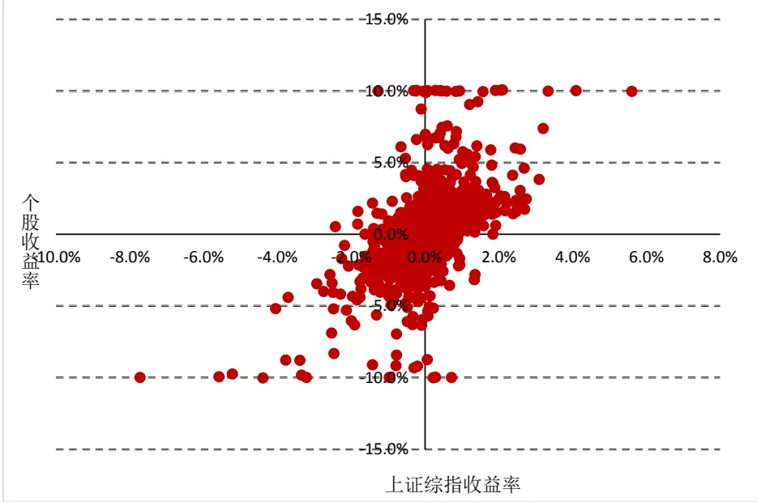
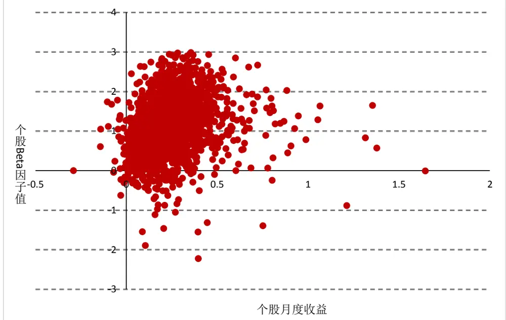
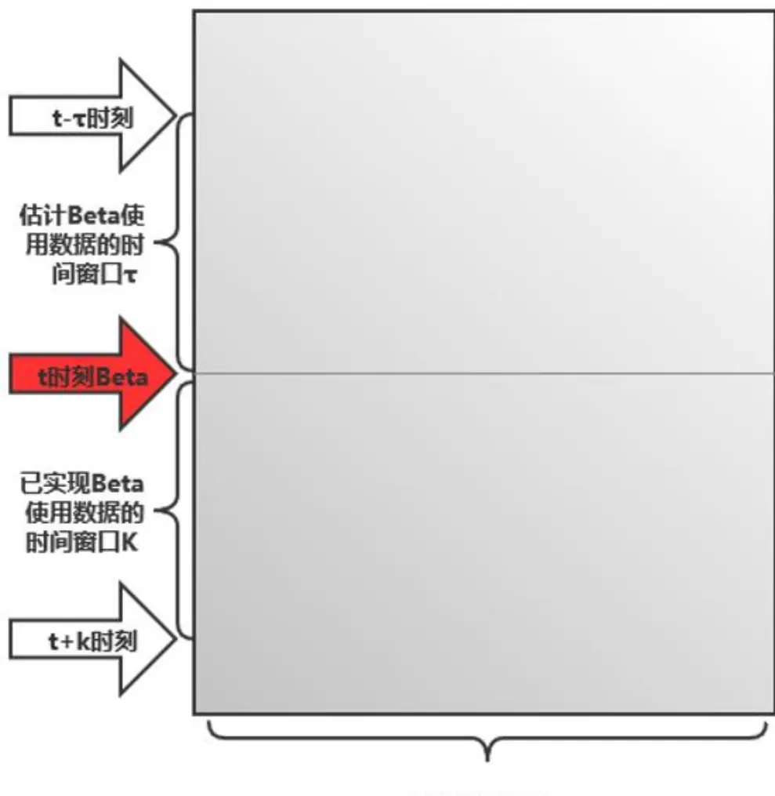
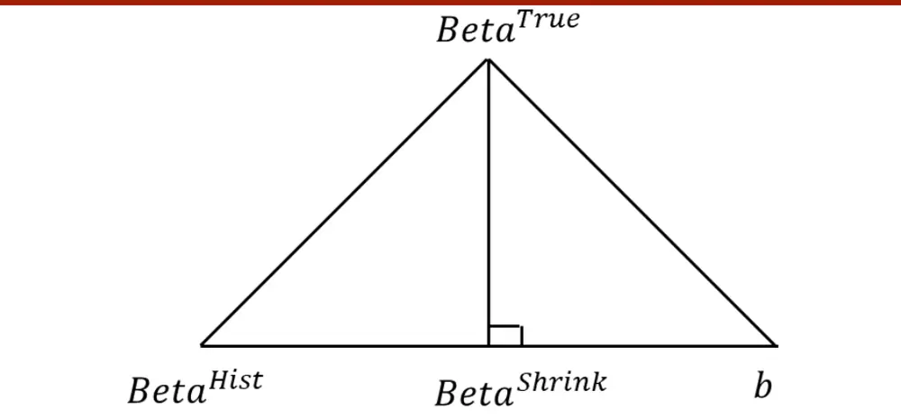
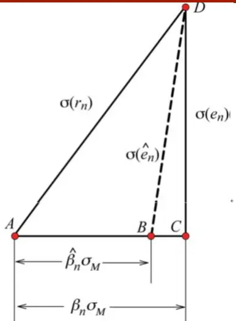
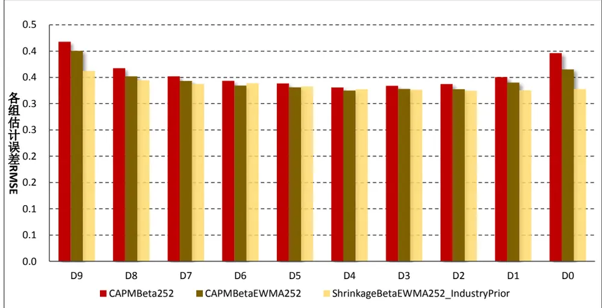
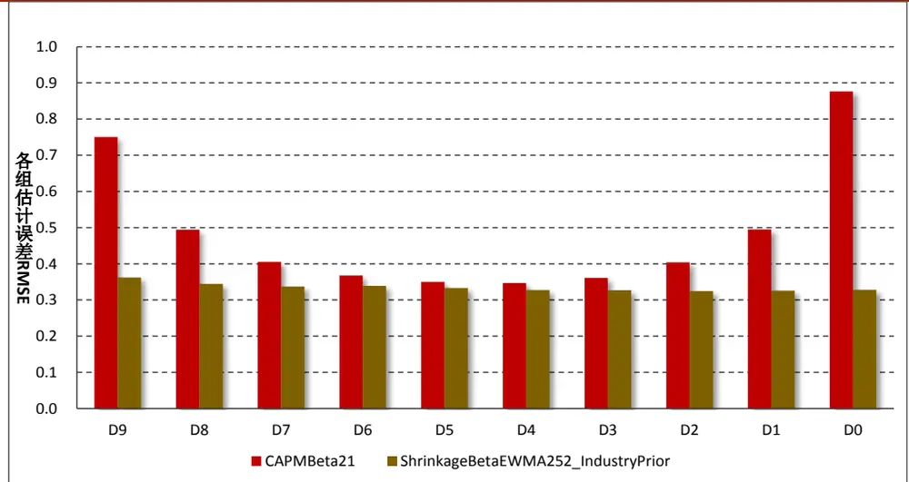
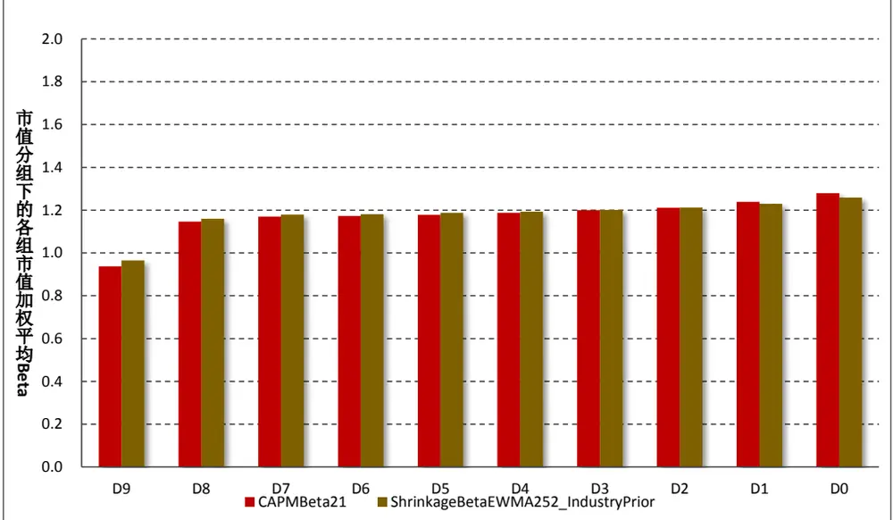

2020 年 2 月 18 日

## 如何对 Beta 因子进行稳健估计？

## 联系信息

陶勤英

分析师

SAC 证书编号：S0160517100002

021-68592393

taoqy@ctsec.com

张宇

分析师

SAC 证书编号：S0160519120001

zhangyu1@ctsec.com

021-68592337

17621688421

## 相关报告

【1】“星火”多因子系列（一）：《Barra模型初探：A 股市场风格解析》

【2】“星火”多因子系列（二）：《Barra模型进阶：多因子模型风险预测》

【3】“星火”多因子系列（三）：《Barra模型深化：纯因子组合构建》

【4】“星火”多因子系列（四）：《基于持仓的基金绩效归因：始于 Brinson，归于 Barra》

【5】“星火”多因子系列（五）：《源于动量，超越动量：特质动量因子全解析》

【6】“星火”多因子系列（六）：《Alpha 因子重构：引入协方差矩阵的因子有效性检验》

【7】“星火”多因子系列（七）：《借因子组合之力，优化 Alpha因子合成》

【 】 星火 多因子系列（八）：《组合风险控制：协方差矩阵估计方法介绍及比较》

【 】“星火”多因子系列（九）：《博彩偏好还是风险补偿：高频特质偏度因子全解析》

## “星火”多因子专题报告（十）

【 】“拾穗”多因子系列（八）：《非线性规模因子： 股市场存在中市值效应吗？》

【11】“拾穗”多因子系列（十一）：《多因子风险预测：从怎么做到为什么》

【12】“拾穗”多因子系列（十四）：《补充：基于特质动量因子的沪深 300 增强策略》

【13】“拾穗”多因子系列（十六）：《水月镜花：正视财务数据的前向窥视问题》

【14】“拾穗”多因子系列（十七）：《多因子检验中时序相关性处理：Newey-West 调整》【15】“拾穗”多因子系列（十九）：《似是而非：时间序列回归 VS横截面回归》

“慧博资讯”专业的投资研究大数据分享平台

## 投资要点：

## 引言：从 CAPM模型说起

- 作为最早的单因子定价系统——CAPM 模型认为个股预期收益之间的差别取决于其承担的系统性风险大小，而该系统性风险的大小可用 Beta 因子衡量。

- 由于 因子的估计本身涉及到较多参数，如何对参数进行选择才能够得到稳健的 Beta 估计值，业界现有的探讨却并不多见。本文我们从不同估计周期、加权方式、压缩方法三个方面出发，从实证角度介绍如何对Beta 因子进行稳健估计。

## Beta 估计方式及误差衡量方式

- Beta 因子的估计可以划分为等权情况下的 CAPM Beta、EWMA加权情况下的 CAPM Beta 及压缩估计的 Beta 方法。

关于估计误差的衡量，本文介绍了均方根误差 RMSE、平均绝对误差 MAE 及 Menchero（2016）方法。

## 实证检验

回望周期的选择：采用过去 6 个月和1 年的日度收益率数据要明显优于 1 个月和 3 个月。

- 加权方式的选择：采用 EWMA加权方式的 Beta 因子估计要优于等权方式的 Beta 因子估计。

- 先验因子的选择：采用压缩方法对 Beta 因子进行估计能够显著减小其预测误差，且行业均值作为先验因子效果最佳。

- 结论：采用过去 1年的日度收益率数据，并经过 EWMA 加权，同时采用个股所在行业的行业均值作为先验因子进行压缩的方式，能够有效地改善 Beta 因子的预测能力。

- 风险提示：本报告统计数据基于历史数据，过去数据不代表未来，市场风格变化可能导致模型失效。

作为最早的单因子定价系统——CAPM 模型认为个股预期收益之间的差别取决于其承担的系统性风险大小，而该系统性风险大小可用Beta因子进行衡量。在财通金工“拾穗”系列（9）《牛市抢跑者：低 Beta 一定代表低风险吗？》中，我们对 2019 年表现优异的高 Beta 策略进行了分析，并得出牛市时买入高 Beta资产能够轻松战胜指数的结论。然而，由于 Beta 因子的估计本身涉及到较多参数，如何对参数进行选择才能够得到稳健的 Beta 估计值，业界现有的探讨却并不多见。在本篇专题中，我们将就 Beta 因子计算当中的不同估计周期、加权方式、压缩方法进行比较，从实证角度介绍如何对 Beta 因子进行稳健估计。

## 1、 引言：从CAPM 模型说起

作为最早的单因子定价模型——资本资产定价（CAPM）模型认为个股预期收益之间的差别取决于个股承担的系统性风险，而该系统性风险的大小则可通过Beta 因子进行衡量，具体表示如下：

$$
E(r_{i})=r_{f}+\beta_{i}(E(r_{m})-r_{f})
$$

其中， $E(r_{i})$ 表示股票 i 的预期收益， $r_{f}$ 表示市场无风险收益， $E(r_{m})$ 表示市场的预期收益，β 则表示股票 i 的 Beta 系数。特别需要注意的是，个股的 Beta因子是通过如上的时间序列回归估计得到的，它可以理解为个股收益相对于市场收益的倍数，通俗理解它表示的是个股价格跟随市场走势的波动幅度。

为了对如上模型有更深刻的理解，我们首先观察单只个股的收益率与市场指数收益率在时间序列上的相关关系。图 1 展示了第一创业（002797.SZ）在2016.5.12-2020.2.14 期间，个股的日度收益与市场指数日度收益之间的散点图（该股票的 Beta 均值为 1.80）。可以看到，该股票的日度收益与市场收益之间呈现出非常强的正相关关系，也正是由于这一相关关系的存在，使得上述根据时间序列回归计算 Beta 因子的方法存在其合理性。

图 1：第一创业（002797.SZ）日度收益率与市场指数收益率散点图

数据来源：财通证券研究所，恒生聚源

接下来我们再来观察横截面上，个股的预期收益与其 Beta 因子值之间的相关关系。图 2展示了2019年2月全市场所有的个股Beta因子（2019.1.31因子值）与其月度收益率（2 月的月度收益）之间的散点图。由于该月的市场收益为正（17.84%），因此个股收益与其 Beta 因子值之间呈现出明显的正相关关系。

图 2：2019年 2 月个股收益率与个股 Beta值散点图

数据来源：财通证券研究所，恒生聚源

在CAPM模型刚提出时，Beta因子衡量的是股票收益相对于市场收益的弹性。若单只股票的Beta值大于1，它表示股票波动大于市场波动，该股票的弹性较大；若Beta值小于1，它表示股票波动小于市场波动，该股票的弹性相对较小，因此传统意义上Beta因子可以被当作衡量股票风险的一个指标。

随着多因子模型的兴起，Beta因子本身也有了更为广泛的含义，它表示投资组合在风险因子上的暴露程度，衡量的是组合相对风险因子溢价的敏感度。若某个组合在Beta因子上的暴露越高，该组合在风险因子上的敞口也就越大，因而所暴露的市场风险也就越大。在本文的介绍中，我们取其狭义的Beta含义，也就是股票收益相对市场收益的波动幅度。

在美股市场中，将Beta因子作为选股因子的文献有很多，“低Beta异象”广泛存在。 等（ ）对美股市场进行分析发现，低 的股票在未来的表现要普遍优于高Beta股票，这似乎在长牛的美股市场上来说是一个令人费解的现象。Frazzini等（2014）提出BAB因子（Betting Against Beta），通过杠杆做多低Beta股票同时做空高Beta股票的Beta中性组合，从杠杆资金限制的角度来解释低Beta异象的存在。然而，财通金工在前述的“拾穗”系列（9）中同样检验了将Beta因子作为选股因子在A股市场上的表现情况，结果发现在全样本内Beta因子并不是有效的Alpha因子：在不同的市场状态下，Beta因子展现出不同方向的有效性。

本文的主要目的是介绍如何选择有效的参数对 Beta 进行稳健估计，因此在下文中，我们将重点关注 Beta 估计时的方法及参数选择（如回望时间、加权方式、压缩方法等），对于“低 Beta 异象”的具体研究我们将留在以后再进行探讨。

## 2、 Beta 因子估计方式比较

在上文中，我们从 CAPM 模型出发，对 Beta 因子的基本概念进行了简要介绍。事实上，我们关心的永远是个股或组合在未来一段时间的 Beta 值，但由于无法获取未来的数据来计算 Beta，因此最为有效的方法即是根据股票过去一段时间内的交易数据计算其历史 Beta 值，并将其作为个股未来 Beta 值的近似估计。

图 3：Beta因子估计示意图

所有股票样本
数据来源：财通证券研究所

图 3 展示了个股 Beta 因子估计示意图：假设当前为 t 时刻，如需计算t 时刻的已实现 Beta 值（即未来一段时间的 Beta 因子值），使用的数据是t~t + k时间窗口的数据；而在估计其历史 Beta 因子值时，则需采用t−τ~t时间窗口的数据。由此，我们自然而然地会提出如下问题：

（1） 在采用历史数据时，采用多长时间长度较为合理？

（2） 对于不同的历史样本点，每日数据权重是等权还是加权更为合理？

（3） 是否存在结构性的先验值进行压缩调整，从而减小估计误差？

（4） 估计 Beta 与实际 Beta 之间的误差究竟该如何衡量？

在接下来的章节中，我们将就如上问题进行一一解答。首先，我们对等权方式下的 CAPM 模型历史 Beta（CAPM Beta）、EWMA（半衰指数加权）方式下的CAPM 模型历史 Beta（EWMA Beta），以及 Vasicek(1973)提出的贝叶斯压缩 Beta（Shrinkage Beta）的计算方式进行介绍。

## 2.1 等权方式下的 CAPMBeta(CAPM Beta)

如前所述，Beta 因子衡量的是个股收益相对指数收益的波动幅度，因此可以通过如下的时间序列回归对其进行估计：

$$
r_{i,\tau}=\alpha_{i}+\beta_{i,t}^{HIST}r_{m,\tau}+\epsilon_{i,\tau}
$$

其中， $r_{i,\tau}$ 表示股票 i 在τ时刻的收益率， $\alpha_{i}$ 为回归的截距项， $\beta_{i,t}^{HIST}$ 表示股票i 在时刻 t 的历史 Beta， $r_{m,\tau}$ 表示市场组合在τ时刻的收益率， $\epsilon_{i,\tau}$ 为回归残差项，τ表示从时刻 t-k 至时刻 t 之间的任一时间点。

在实际计算中，采用怎样的数据频率及选取多长的历史数据进行回归对于估计结果至关重要。一般来讲，为了保证回归过程中有足够多的数据样本点，相较于采用周度、月度或季度收益数据，我们更倾向于采用日度收益率数据进行采样。在后续的实证分析中，我们将分别对采用过去 1 个月、3 个月、6 个月和 12 个月的日度收益数据估计得到的 Beta 因子误差进行比较。

值得一提的是，上面提及的 Beta 因子计算是根据时间序列回归得到的。在实际编程中，由于回归所耗费的时间成本相对较大，我们推荐采用解析解进行直接求解。根据一元线性回归的解， $\beta_{i,t}^{HIST}$ 的估计值可表示为如下：

$$
\beta_{i,t}^{HIST}=\frac{\sum_{i=1}^{n}(x_{i}-\overset{}{\bar{x}})(y_{i}-\bar{y})}{\sum_{i=1}^{n}(x_{i}-\bar{x})^{2}}=\frac{cov(r_{i,t},r_{M,t})}{\sigma_{M,t}^{2}}
$$

其中，分子可以表示为个股日度收益与市场日度收益的协方差，而分母可以表示为市场日度收益的方差。在 Python中，采用如上解析解方法对 Beta因子进行计算时，可以考虑采用 pd.rolling函数，从而在保证数据计算准确性的前提下大大加快 Beta 因子的计算时间。

## 2.2 EWMA 方式下的 CAPM Beta（EWMA Beta）

在实际计算中，由于我们采用的历史数据较长（通常长达 1 年甚至更久），而距离当前时间较远的日期价格信息对当前市场的影响相对较小，因此我们可以在简单历史 Beta 估计的基础上，对不同的时间样本点赋予不同的权重，这种方式的 Beta 因子估计也是 Barra 模型中估计的主要方式。

具体来讲，我们在采用 2.1 小节的方法来估计 Beta 因子时，不再采用普通最小二乘 OLS 回归（这种方法将每个样本点视为等权对待）， $\hslash$ 是采用加权最小二乘 WLS 回归。假设当前时间为 t 时刻，

$$
a_{0},\quad a_{1},\qquad a_{2},\qquad...,\qquad a_{t-\tau},\qquad...,\qquad a_{t-1},\qquad a_{t}
$$

那么这些样本点对应的权重可以表示为：

$$
\lambda^{t},~\lambda^{t-1},~\lambda^{t-2},~...,~\lambda^{\tau}=0.5,~...,~\lambda^{t-1},~\lambda^{0}=1
$$

其中， $\lambda=0.5^{1/\tau}$ ，τ为半衰期参数，它表示第 t− τ天的样本数据权重为当前日权重的 1/2（此处我们先假定当前日的数据权重为 1，之后再进行归一化）。关于 EWMA模型的具体推导，可以参见财通金工“拾穗”系列（11）《多因子风险预测：从怎么做到为什么》。

相较于简单历史 Beta因子可以采用 rolling 的方式进行计算，EWMA 方式下的计算显得更显复杂。事实上，我们仍然可以采用 WLS 回归的解析解对其进行求解：

$$
\left[{\alpha}_{i},\beta_{i,t}^{EWMA}\right]^{\prime}=(X^{\prime}WX)^{-1}X^{\prime}WY
$$

其中，X 为自变量矩阵（T×2 维），其第一列为单位向量，第二列为市场日度收益率，W为对角矩阵（T×T维），其对角线上的每一个值即为对应数据点的权重，Y为因变量向量（T×1 维），表示个股日度收益数据。

尽管可以采用 WLS方法对 EWMA Beta进行解析解的求解，但是在 Python中却并不能直接采用 pd.rolling的方式对其进行向量化的计算，这在一定程度上加大了 EWMA Beta估计的复杂性。这背后主要的原因在于，个股在交易过程中会存在停牌的情况，而对于停牌日的数据点权重我们需要进行逐个剔除，最终将权重进行归一化处理。由于每只股票的停牌日期并不相同，因此对于历史数据点赋予的权重也不一样，所以暂时只能采用循环的方式对其进行求解。

## 2.3 贝叶斯压缩 Beta 估计

长期关注财通金工多因子模型研究的投资者对于贝叶斯压缩调整（BayesianShrinkage）的概念应该并不陌生，在我们关于多因子风险矩阵调整和 Ledoit-Wolf压缩矩阵调整的相关报告中，就多次介绍过贝叶斯压缩调整的方法（具体细节可参见财通金工“拾穗”系列（11）及“星火”系列（八）《组合风险控制：协方差矩阵估计方法介绍及比较》）。

事实上，关于 Beta 因子的贝叶斯压缩调整最早由 Vasicek(1973)提出，它是将采用历史数据估计得到的 Beta值与采用结构化估计的先验 Beta进行权重组合，得到新的估计 $\mathbf{Beta_{\circ}}$ 理论上而言，采用历史数据得到的 Beta 值是真实 Beta 值的无偏估计量，但是其估计方差较大；而另一方面，先验 Beta 是真实协方差矩阵的有偏估计量，但其估计方差较小。因此，二者的线性组合在一定程度上可以认为是在“取己之长，补彼之短”，其示意图如图 4 所示。

图 4：压缩Beta 估计示意图

数据来源：财通证券研究所

具体来讲，个股 Beta 因子的贝叶斯压缩调整估计可表示为：

$$
\begin{array}{r}{\beta_{i,t}^{Shrink}=\lambda\cdot\beta_{i,t}^{Hist}+\left(1-\lambda\right)\cdot b_{i,t}}\\{\lambda=\frac{s_{b_{i,t}}^{2}}{\sigma_{\beta_{i,t}^{Hist}}^{2}+s_{b_{i,t}}^{2}}}\end{array}
$$

其中， $\beta_{i,t}^{Hist}$ 为根据历史数据估计得到的 Beta 值（在后续实证部分，我们采用经过 EWMA 估计得到的 Beta 因子）， $b_{i,t}$ 表示个股的先验 Beta 值， $\sigma_{\beta_{i,t}^{Hist}}^{2}$ 表示历史 Beta 值的估计误差大小（其可通过 2.2 小节的回归计算得到）， $s_{b_{i,t}}^{2}$ 则表示先验 Beta 值的方差大小。可以看到，压缩 Beta 估计量赋予其历史 Beta 值的权重与其估计误差成反比，当历史 Beta 估计的方差 $\sigma_{\beta_{i,t}^{Hist}}^{2}$ 较大时，λ值将会较小，从而使得压缩估计量赋予历史 Beta 估计的权重就更小。关于个股先验 Beta 值的选择，通常有如下三种选择：

（1） 某个横截面上，全样本所有股票平均 Beta 值。此时， $s_{b_{i,t}}^{2}$ 即为全市场所有个股 Beta 值的方差；

（2） 某个横截面上，个股所处行业分类的行业平均 Beta值。此时， $s_{b_{i,t}}^{2}$ 即为个股所在行业的成分股 Beta 值方差；

（3） 某个横截面上，个股所处市值分组下的市值加权平均Beta值。此时，$s_{b_{i,t}}^{2}$ 即为个股所处市值分组下的成分股 Beta 值方差。

在后面的实证研究中，我们将对如上三种先验 Beta 值的选择展开探讨。

## 3、 估计误差衡量方法介绍

到目前为止，我们已经对三种不同的 Beta 因子估计方法进行了介绍。在实证检验何种方式的估计效果更好之前，我们必须寻找一个行之有效的误差衡量方法。在本小节中，我们介绍统计学中常用的均方根误差（ ）、平均绝对误差（MAE）及 Menchero（2016）提出的方法，为后续实证研究打下基础。

## 3.1 均方根误差 RMSE

均方根误差 RMSE（Root Mean Squared Error）是通过计算估计 Beta 与已实现Beta 之间误差平方和来衡量估计误差的一种方法，RMSE的计算方式为：

$$
RMSE_{t}=\sqrt{\frac{1}{N}\sum_{i=1}^{N}(\beta_{i,t}^{Estimate}-\beta_{i,t}^{True})^{2}}
$$

其中，RMSE 表示t期的估计误差， $\beta_{i,t}^{Estimate}$ 表示股票i在t期的估计 Beta值，$\beta_{i,t}^{True}$ 表示股票i在t期的真实 Beta，N表示 t 期全样本股票的数量。在计算了单期的 RMSE 之后，全样本期间内的 RMSE即为各个不同时期的平均：

$$
RMSE=\frac{1}{T}\sum_{t=1}^{T}RMSE_{t}
$$

## 3.2 平均绝对误差 MAE

平均绝对误差 MAE（Mean Absolute Error）是通过计算 Beta 与已实现 Beta之间的绝对误差的平均值来衡量估计误差的一种方法，MAE的计算方式为：

$$
MAE_{t}=\frac{1}{N}\sum_{i=1}^{N}|\beta_{i,t}^{Estimate}-\beta_{i,t}^{True}|
$$

可以看到，MAE计算的是 L1 范式，而 RMSE计算的是 L2 范式。同样的，在计算了单期的 MAE之后，全样本期间的 MAE即为各个不同时期的平均：

$$
MAE=\frac{1}{T}\sum_{t=1}^{T}MAE_{t}
$$

## 3.3 Menchero(2016)方法

均方根误差 RMSE 和平均绝对误差 MAE 更多的是从统计学上来衡量估计Beta 与实际 Beta 之间的区分程度，其缺点是不够直观，缺乏实际意义。为此，Menchero（2016）为我们提供了另一种评价估计 Beta与已实现 Beta之间误差的新的思路，其主要思想是将 Beta之间的误差计算转换为计算特质波动率σ之间的误差。

由 CAPM 模型可知，股票的收益率可以分解为两个部分：（1）承担系统性风险带来的市场风格收益；（2）承担个股特质风险带来的特质收益两个部分。因此，个股的风险也可以同样地表示两个部分：（1）市场系统性风险；（2）个股特质风险，其示意图如图 5 所示。

在图 5 中，AD 线段的长度 $\sigma(r_{n})$ 表示股票 n 收益率的波动率，AC 线段的长度 ${\beta_{n}}\sigma_{m}$ 表示股票承担的市场波动率，CD 线段的长度 $\sigma(e_{n})$ 表示股票本身的特质波动率。由于 CAPM 模型中假设个股特质风险与其承担的市场风险互不相关，因此理想情况下，AC 线段与 CD 线段是互相垂直的。

图 5：个股总体风险分解示意图

数据来源：财通证券研究所，Menchero(2016)

然而，在现实情况下，由于根据历史数据估计得到的 Beta 值并不精确地等于其真实 Beta $({\hat{\beta}}_{n}\neq\beta_{n})$ ），这就造成了估计得到的个股系统性风险 AB的长度并不等于其实际风险 AC 的长度。

如图 5 所示，当我们所估计得到的 Beta 值小于真实的 Beta 时，估计得到的个股市场风险大小可用AB向量表示，由于个股整体波动仍然可用 AD向量表示，因此此时估计得到的个股特质风险即为 BD 线条的长度。Menchero（2016）正是通过这种方式，将对 Beta 因子的估计误差转移为对个股特质风险估计误差的度量上。

假设现有 A、B两种方法对 Beta 因子进行估计，那么二者之间相对 Beta 误差的估计可以表示为：

$$
\delta_{A,t}^{2}-\delta_{B,t}^{2}=\frac{\sigma_{A,t}^{2}-\sigma_{B,t}^{2}}{\sigma_{M,t}^{2}}
$$

其中， $\delta_{A,t}^{2}-\delta_{B,t}^{2}$ 即两种 Beta 之间的误差， $\sigma_{A,t}^{2}$ 表示采用 A方法估计 Beta 时计算得到的个股特质波动率， ${\sigma_{M,t}^{2}}$ 为市场收益率的波动率。此外，由于我们在实际中无法获得个股的真实特质波动率，因此我们需要使用估计得到的波动率进行代替：

$$
\hat{\delta}_{A,t}^{2}-\hat{\delta}_{B,t}^{2}=\frac{1}{T}\sum_{t}(\frac{\hat{\sigma}_{A,t}^{2}-\hat{\sigma}_{B,t}^{2}}{\hat{\sigma}_{M,t}^{2}})
$$

在如上分析中，A 和 B两种方法既可以是两种历史 Beta 的估计方式，也可以是估计 Beta 与已实现 Beta。在 Menchero（2016）的实证研究中，是将某一种方法视为基准，再去比较其他方法与该基准之间的相对误差。

## 4、 实证检验

到目前为止，我们已经介绍了三种不同的Beta因子估计方法：（1）简单CAPMBeta（2）EWMA 方式下的 CAPM Beta（3）压缩矩阵估计下的 Shrinkage Beta。并且介绍了衡量 Beta 估计误差的三种方式。下面，我们将从实证角度分析何种方式对于真实 Beta 因子的估计更为稳健。我们将从回望时间、加权方式、先验Beta 的选择三个方面进行探讨，从 RMSE 和 MAE的角度对各类估计方法进行比较。

## 4.1 数据说明

在进行结果展示之前，本部分首先对选取的数据进行说明。选取样本时间为2009.12.31-2020.1.23，每月月末对全体 A 股的 Beta 因子值进行估计。考虑到停牌、退市等情况会对 Beta 的计算产生影响，并且新股上市初期经常会存在连续涨停的情况从而在计算Beta时会偏离均值过高，因此在实证中需要做以下处理：

（1） 回测时间：2009.12.31-2020.1.23；

（2） 回测样本：当期 Wind 全 A指数成分股；

（3） 样本筛选：剔除上市时间少于 100 天、剔除调仓日停牌一天、剔除ST、*ST、PT 等被标为风险预警的股票、剔除调仓日涨停或者跌停的股票；

（4） 基准指数：每期满足条件的样本股的自由流通市值加权收益；

（5） 计算频度：每月最后一个交易日计算一次。

尽管我们对数据进行了上述预处理，但是难免还是会存在一些异常值，比如Beta 过于偏离均值的极端情况，所以在 Beta 的计算结果中，我们将 Beta 大于 3（或 Beta 小于-3）的数据调整为 3（或-3）。

在计算个股的真实 Beta 时，我们可以计算个股未来 1 个月的 Beta 值，也可以计算个股未来 3 个月的 Beta 值。由于公募基金量化策略的调仓频率通常以月度为主，因此我们在下文展示的是历史 Beta估计值与未来 1个月 Beta因子值之间的误差大小。需要说明的是，无论是采用未来 1 个月真实 Beta，还是未来 3个月的真实 Beta，下文报告的结论都具有稳健性。

## 4.2 回望周期的选择

本部分我们讨论回望周期的选择对于估计准确性的影响。以 CAPM Beta 估计方法为例，表 1 展示了采用过去 1 个月、3 个月、6 个月和 1 年的日度收益率数据估计得到的基本信息。在每个月月末计算得到满足条件的样本个股 Beta 因子值后，即可计算每期的统计量，最终报告在表 1 中的统计量为每期平均值（下同）。

首先，我们来观察全样本的 Beta 均值情况，此处分别报告简单均值（Mean）和自由流通市值平均（VWMean）两种。由于在市场指数的编制采用自由流通市值加权，因此各类 Beta 因子的自由流通市值加权平均（VWMean）接近于 1，之所以并不恰好等于1，财通金工认为是由于部分个股存在短期停牌等原因造成的。

表 1：不同回望周期的 CAPM Beta 估计结果

| 一个月 Beta | Min | 10% | Mean | Median | 90% | Max | Std | VWMean | RMSE | MAE | RankIC |
| --- | --- | --- | --- | --- | --- | --- | --- | --- | --- | --- | --- |
| CAPMBeta21 | -1.324 | 0.586 | 1.180 | 1.186 | 1.779 | 2.791 | 0.488 | 1.052 | 0.622 | 0.470 | 0.287 |
| CAPMBeta63 | -0.257 | 0.760 | 1.193 | 1.193 | 1.629 | 2.384 | 0.347 | 1.062 | 0.520 | 0.394 | 0.346 |
| CAPMBeta126 | -0.042 | 0.821 | 1.192 | 1.198 | 1.560 | 2.219 | 0.295 | 1.064 | 0.501 | 0.380 | 0.355 |
| CAPMBeta252 | 0.154 | 0.873 | 1.191 | 1.202 | 1.498 | 2.073 | 0.252 | 1.065 | 0.497 | 0.378 | 0.336 |

数据来源：财通证券研究所，恒生聚源

接下来，我们观察不同回望周期的选择得到的 Beta 因子值稳健性。由描述性统计可以看到，采用过去 天数据计算得到的 因子值的最小值（ ）、最大值（Max）及标准差（Std）都要显著地更高，而采用过去1 年数据计算得到的 Beta 因子值的最小值、最大值及标准差都要更小。也就是说，数据回望的周期越长，个股计算得到的 Beta 因子值的差距就越小，相较而言不容易出现极端异常值。

下面，我们聚焦于关键的误差衡量指标 RMSE 和 MAE。可以看到，回望的周期越长，估计误差将会越小。采用过去 1 年的数据估计得到的 Beta 因子将会显著地优于采用 1 个月数据估计得到的 Beta 因子。

最后，表 1 的最后一列还计算了当期估计 Beta 与下期真实 Beta 之间的秩相关系数（RankIC）均值。可以看到，采用过去 21 天的数据估计得到的 Beta 值的效果最差（RankIC 仅为 0.287），而采用 126 天的数据计算得到的 Beta 值的效果最好（RankIC 达到 0.355）。

## 4.3 加权方式的选择

由 4.2 小节可知，最理想的回望周期为6 个月或者1 年的数据。接下来我们观察采用 EWMA的方式，对近期的数据赋予更高的权重是否有利于 Beta 因子的估计。

表 2：不同加权方式的 CAPM Beta 估计结果

| 一个月 Beta | Min | 10% | Mean | Median | 90% | Max | Std | VWMean | RMSE | MAE | RankIC |
| --- | --- | --- | --- | --- | --- | --- | --- | --- | --- | --- | --- |
| CAPMBeta126 | -0.042 | 0.821 | 1.192 | 1.198 | 1.560 | 2.219 | 0.295 | 1.064 | 0.501 | 0.380 | 0.355 |
| CAPM BetaEWMA126 | 0.019 | 0.816 | 1.194 | 1.198 | 1.569 | 2.232 | 0.300 | 1.064 | 0.496 | 0.375 | 0.370 |
| CAPMBeta252 | 0.154 | 0.873 | 1.191 | 1.202 | 1.498 | 2.073 | 0.252 | 1.065 | 0.497 | 0.378 | 0.336 |
| CAPMBetaEWMA252 | 0.197 | 0.870 | 1.190 | 1.200 | 1.498 | 2.013 | 0.252 | 1.064 | 0.485 | 0.368 | 0.365 |

数据来源：财通证券研究所，恒生聚源

表 展示了不同的加权方式下，采用过去 个月（半衰期为 个月）和过去1 年（半衰期为 6 个月）的数据计算得到的 Beta 因子的基本信息，我们重点关注最后三列。由 RMSE 及 MAE 指标可以看到，对于不同的回望周期而言，采用EWMA 加权方法能够明显的降低估计误差，这说明了这种加权方式的有效性。此外，从估计 Beta 与真实 Beta 之间的 RankIC 也可以看出，采用加权方式估计得到的 Beta 因子值的预测效果更好。

## 4.4 压缩模型下不同先验 Beta 的选择

到目前为止，我们可以看到采用 EWMA方式下的 6 个月或者 1 年的数据估计得到的 Beta 因子较为稳健。本部分，我们对压缩估计下的不同 Beta 因子方式选择进行探讨。前面我们提到，先验 Beta 的选择可以分为三类：（1）市场平均Beta（2）行业平均 Beta（3）所在市值分组的市值加权平均 Beta。表 3 对三种先验 Beta 方式下的压缩 Beta 估计进行了汇报。

表 3：不同先验Beta下的压缩 Beta 估计结果

| 一个月 Beta | Min | 10% | Mean | Median | 90% | Max | Std | VWMean | RMSE | MAE | RankIC |
| --- | --- | --- | --- | --- | --- | --- | --- | --- | --- | --- | --- |
| CAPMBetaEWMA126 | 0.019 | 0.816 | 1.194 | 1.198 | 1.569 | 2.232 | 0.300 | 1.064 | 0.496 | 0.375 | 0.355 |
| ShrinkageBetaEWM A126_M arketPrior | 0.253 | 0.886 | 1.184 | 1.197 | 1.468 | 1.864 | 0.232 | 1.069 | 0.479 | 0.363 | 0.336 |
| ShrinkageBetaEWMA126_IndustryPrior | 0.223 | 0.886 | 1.186 | 1.197 | 1.478 | 1.919 | 0.239 | 1.070 | 0.479 | 0.363 | 0.370 |
| ShrinkageBetaEWM A126SizePrior | 0.224 | 0.887 | 1.185 | 1.198 | 1.468 | 1.889 | 0.235 | 1.054 | 0.479 | 0.363 | 0.365 |
| CAPMBetaEWMA252 | 0.197 | 0.870 | 1.190 | 1.200 | 1.498 | 2.013 | 0.252 | 1.064 | 0.485 | 0.368 | 0.365 |
| ShrinkageBetaEWM A252_M arketPrior | 0.301 | 0.915 | 1.183 | 1.199 | 1.435 | 1.777 | 0.210 | 1.069 | 0.477 | 0.363 | 0.366 |
| ShrinkageBetaEWM A252_IndustryPrior | 0.275 | 0.915 | 1.185 | 1.199 | 1.439 | 1.808 | 0.213 | 1.069 | 0.477 | 0.362 | 0.371 |
| ShrinkageBetaEWM A252SizePrior | 0.276 | 0.917 | 1.184 | 1.200 | 1.434 | 1.792 | 0.211 | 1.059 | 0.477 | 0.363 | 0.367 |

数据来源：财通证券研究所，恒生聚源

可以看到，采用不同的先验 Beta 值进行压缩估计的方法均能够明显改善估计效果。以采用过去1年的数据为例，EWMA Beta的 RMSE从0.485降至0.477，其 RankIC 从 0.365 提高至 0.371，且这一结论同样适用于采用过去 126 天的数据估计得到的 Beta 因子值。

此外，在市场均值、行业均值和市值分组均值三种先验 Beta 的选择中，其RMSE 的差别并不大，但是从 RankIC 的角度来讲选择行业 Beta 均值作为先验Beta 的预测效果要普遍更好。

## 4.5 不同分组下的 Beta 估计误差

本部分，我们观察不同 Beta 分组下的各种不同方式的估计误差对比。在每一期我们将个股的 Beta 因子分为 10 组，随后计算每组的 RMSE均值，最后将时间序列上的 RMSE取平均，并绘制柱状图。

图 6：采用过去1 年的数据不同加权方式及压缩方式的比较

数据来源：财通证券研究所，恒生聚源

图6展示了采用过去1年的数据，通过不同加权方式和压缩方式的效果改进。可以看到，各组的估计误差都有较为稳健的改善，其中在 D9 组（历史 Beta 值最大）和 D0 组（历史 Beta 值最小）的组别效果最好。图 7 展示了最粗糙和最精细的两种估计方式下的误差对比，可以看到通过我们的参数选择，Beta 因子估计的效果确实得到了非常明显的提升。

图 7：不同方法下的 Beta因子估计误差比较

数据来源：财通证券研究所，恒生聚源
谨请参阅尾页重要声明及财通证券股票和行业评级标准

图 8：不同市值分组下的 Beta因子市值加权平均

数据来源：财通证券研究所，恒生聚源

最后，我们观察不同市值分组下的各组 Beta 因子的市值加权平均值。可以看到，市值较大的组别（D9）组 Beta 因子较小，而市值最小的组别（D0 组）Beta因子较大。可以认为，市值与 Beta 因子之间存在一定的相关关系，这也就是采用市值分组下的市值加权平均值作为其先验 Beta 的合理性所在。

## 4.6 小结

本小节我们从回望周期、加权方式、先验因子的选择三个方面对 Beta 因子的估计方式进行了实证检验。结论显示，采用过去 1年的日度收益率数据，并经过 EWMA 加权，同时采用个股所在行业的行业均值作为先验因子进行压缩的方式，能够有效地改善 Beta 因子的预测能力。

## 5、 总结与展望

作为最早的单因子定价系统——CAPM 模型认为个股预期收益之间的差别取决于其承担的系统性风险大小，而系统性风险的大小可用 Beta 因子衡量。然而，由于 Beta 因子的估计本身涉及到较多参数，如何对参数进行选择才能够得到稳健的 Beta 估计值，业界现有的探讨却并不多见。本文我们从不同估计周期、加权方式、压缩方式三个方面出发，从实证角度介绍如何对 Beta 因子进行稳健估计。主要结论如下：

（1） Beta 因子的估计可以划分为等权情况下的 CAPM Beta、EWMA加权情况下的 CAPM Beta 及压缩估计的 Beta 方法；

（2） 关于估计误差的衡量，本文介绍了均方根误差 RMSE、平均绝对误差 MAE 及 Menchero（2016）方法；

（3） 实证检验表明，采用过去 1 年的日度收益率数据，并经过 EWMA加权，同时采用个股所在行业的行业均值作为先验因子进行压缩的方式，能够有效地改善 Beta 因子的预测能力。

## 6、 风险提示

多因子模型拟合均基于历史数据，市场风格的变化将可能导致模型失效。（附注：实习生上海财经大学程衍超全程参与本项研究，对本课题有重要贡献）

## 参考文献：

【1】 “Benchmarks as limits to arbitrage: understanding the low-volatility Anomaly”. APA Baker, M ., Wurgler, B.J.. Financial Analysts Journal. 2011

【2】 “Betting Against Beta”. Frazzini, A., Pederson, L. H. Journal of Financial Economics. 2014

【3】 “A Note on Using Cross-Sectional Information in Bayesian Estimation of Security Betas”， Oldrich, A. Vasicek. The Journal of Finance, Vol.28, No.5(Dec.1973).

【4】 “Evaluating the Accuracy of Beta Forecasts”. Jose G. Menchero, Zoltan Nagy and Ashutosh Singh. The Journal of Portfolio Management. 2016.

【5】 “How to Estimate Beta”. Hollstein F., Prokopczuk, M. and Simen, C.W.. Working Paper. 2017.

## 信息披露

## 分析师承诺

作者具有中国证券业协会授予的证券投资咨询执业资格，并注册为证券分析师，具备专业胜任能力，保证报告所采用的数据均来自合规渠道，分析逻辑基于作者的职业理解。本报告清晰地反映了作者的研究观点，力求独立、客观和公正，结论不受任何第三方的授意或影响，作者也不会因本报告中的具体推荐意见或观点而直接或间接收到任何形式的补偿。

## 资质声明

财通证券股份有限公司具备中国证券监督管理委员会许可的证券投资咨询业务资格。

## 公司评级

买入：我们预计未来 6 个月内，个股相对大盘涨幅在 15%以上；

增持：我们预计未来 6 个月内，个股相对大盘涨幅介于 5%与15%之间；

中性：我们预计未来 6 个月内，个股相对大盘涨幅介于-5%与5%之间；

减持：我们预计未来 6 个月内，个股相对大盘涨幅介于-5%与-15%之间；

卖出：我们预计未来 6 个月内，个股相对大盘涨幅低于-15%。

## 行业评级

增持：我们预计未来 6 个月内，行业整体回报高于市场整体水平 5%以上；

中性：我们预计未来 6 个月内，行业整体回报介于市场整体水平-5%与 5%之间；

减持：我们预计未来 6 个月内，行业整体回报低于市场整体水平-5%以下。

## 免责声明

本报告仅供财通证券股份有限公司的客户使用。本公司不会因接收人收到本报告而视其为本公司的当然客户。

本报告的信息来源于已公开的资料，本公司不保证该等信息的准确性、完整性。本报告所载的资料、工具、意见及推测只提供给客户作参考之用，并非作为或被视为出售或购买证券或其他投资标的邀请或向他人作出邀请。

本报告所载的资料、意见及推测仅反映本公司于发布本报告当日的判断，本报告所指的证券或投资标的价格、价值及投资收入可能会波动。在不同时期，本公司可发出与本报告所载资料、意见及推测不一致的报告。

本公司通过信息隔离墙对可能存在利益冲突的业务部门或关联机构之间的信息流动进行控制。因此，客户应注意，在法律许可的情况下，本公司及其所属关联机构可能会持有报告中提到的公司所发行的证券或期权并进行证券或期权交易，也可能为这些公司提供或者争取提供投资银行、财务顾问或者金融产品等相关服务。在法律许可的情况下，本公司的员工可能担任本报告所提到的公司的董事。

本报告中所指的投资及服务可能不适合个别客户，不构成客户私人咨询建议。在任何情况下，本报告中的信息或所表述的意见均不构成对任何人的投资建议。在任何情况下，本公司不对任何人使用本报告中的任何内容所引致的任何损失负任何责任。

本报告仅作为客户作出投资决策和公司投资顾问为客户提供投资建议的参考。客户应当独立作出投资决策，而基于本报告作出任何投资决定或就本报告要求任何解释前应咨询所在证券机构投资顾问和服务人员的意见；

本报告的版权归本公司所有，未经书面许可，任何机构和个人不得以任何形式翻版、复制、发表或引用，或再次分发给任何其他人，或以任何侵犯本公司版权的其他方式使用。