# 在下跌中寻找惊喜：业绩超预期与反转因子的融合

2020 年 3 月 4 日

## “星火”多因子专题报告（十一）

## 联系信息

陶勤英

分析师

SAC 证书编号：S0160517100002

taoqy@ctsec.com

021-68592393

张宇

分析师

SAC 证书编号：S0160519120001

zhangyu1@ctsec.com

021-68592337

17621688421

## 相关报告

【1】“星火”多因子系列（一）：《Barra模型初探：A 股市场风格解析》

【2】“星火”多因子系列（二）：《Barra模型进阶：多因子模型风险预测》

【3】“星火”多因子系列（三）：《Barra模型深化：纯因子组合构建》

【4】“星火”多因子系列（四）：《基于持仓的基金绩效归因：始于 Brinson，归于 Barra》

【5】“星火”多因子系列（五）：《源于动量，超越动量：特质动量因子全解析》

【6】“星火”多因子系列（六）：《Alpha 因子重构：引入协方差矩阵的因子有效性检验》

【7】“星火”多因子系列（七）：《借因子组合之力，优化 Alpha因子合成》

【 】 星火 多因子系列（八）：《组合风险控制：协方差矩阵估计方法介绍及比较》

【9】“星火”多因子系列（九）：《博彩偏好还是风险补偿？高频特质偏度因子全解析》【10】“星火”多因子系列（十）：《如何对Beta因子进行稳健估计？》

【11】“拾穗”多因子系列（五）：《数据异常值处理：比较与实践》

【12】“拾穗”多因子系列（六）：《因子缺失值处理：数以多为贵》

【 】“拾穗”多因子系列（八）：《非线性规模因子：A 股市场存在中市值效应吗？》

【14】“拾穗”多因子系列（十一）：《多因子风险预测：从怎么做到为什么》

【 】“拾穗”多因子系列（十四）：《补充：基于特质动量因子的沪深 300 增强策略》

## 投资要点：

## Alpha 因子挖掘：从量化交易情绪到量化基本面

- 个股的交易价格除了受供求关系决定之外，最根本的还是由其内在价值决定。上市公司的财务报告能够综合反映其经营情况，是我们获取其基本面信息的重要来源。

- 财务数据通常面临“发布滞后”及“数据修正”两大难题，如何获取即时数据（Point-In-Time）、避免“前向偏差”（Look-Ahead Bias）对于回测的准确性至关重要。

## 业绩超预期的惊喜：从事件驱动看A 股市场 PEAD 效应

- 盈余公告后的价格漂移（PEAD）效应是指业绩公告后盈利超预期的股票将会在未来获得持续正向的超额收益，业绩不达预期的股票将会获得持续负向的超额收益。

- 研究发现，A 股市场不仅存在业绩公告后的价格漂移现象，业绩公告前的价格漂移现象同样显著，财通金工认为这可能是由于知情交易者的存在导致的。

## 从选股因子角度构建业绩超预期组合

- 我国上市公司的财务报告可以划分为业绩预告、业绩快报和定期报告三大类。其中，业绩预告披露时间最早但数据误差较大，业绩快报披露时间居中但数据准确性更佳，定期报告的披露时间最迟但数据最具权威性。

- 通过 SUE指标构建业绩超预期因子的代理变量，可以看到业绩预告和业绩快报的引入能够很大程度地提高因子表现，二者具有不可忽视的信息增量。

在全市场中，SUE因子月均 RankIC达到 4.6%，T 值为 11.05，月胜率 88.4%，对空对冲组合的年化 IR达到 3.89。与传统的价量因子不同，SUE 因子的多头组合能够持续稳健地超过基准指数。此外，该因子在沪深 300及中证 500中的表现同样优异。

## 在下跌中寻找惊喜：业绩超预期与反转效应的融合

- 效应的形成主要源于投资者的反应不足，而反转效应的形成主要源于投资者反应过度，我们将两种效应进行融合，其多头部分即为前期超跌但基本面表现良好的股票，我们可以从这些个股的下跌中寻找一定的惊喜。而空头组合是那些技术面上前期涨幅较高但业绩却不达预期的股票，我们可以将其作为负 Alpha 来源，避免组合中出现较大的风险。

- 风险提示：本报告统计数据基于历史数据，过去数据不代表未来，市场风格变化可能导致模型失效。

“工欲善其事，必先利其器。”对于多因子量化选股的研究者而言，各种不同的因子合成方法只能是锦上添花，寻找持续有效的 Alpha 来源才是策略盈利的关键。通常来讲，股票的价格由其内在价值及供求关系决定，其中个股的供求关系往往反映在量与价的博弈上，而其内在价值则更多地需要从定期披露的财务报表中探知。在财通金工的往期研究中，我们从高低频价量数据出发构建了特质动量因子和高频特质偏度因子，对公司的基本面情况却并未做过多涉及。从现在开始，我们将研究范围逐步扩展到基本面量化的研究方向上。本文重点关注 A 股市场上的“盈余公告后漂移”（PEAD）效应，借助定期财务报告、业绩预告和业绩快报数据构建更加有效的SUE因子，并将其与反转因子进行融合，在交易情绪与个股基本面之间寻找平衡点，以供投资者参考。

## 1、 Alpha 因子挖掘：从量化交易情绪到量化基本面

在财通金工“星火”系列（五）《源于动量，超越动量：特质动量因子全解析》和“星火”系列（九）《博彩偏好还是风险补偿？高频特质偏度因子全解析》中，我们从高低频价量因子出发，构建了特质动量因子和高频特质偏度因子，在A股市场上取得了不错的效果。

图 1：财通金工Alpha 因子研究系列介绍
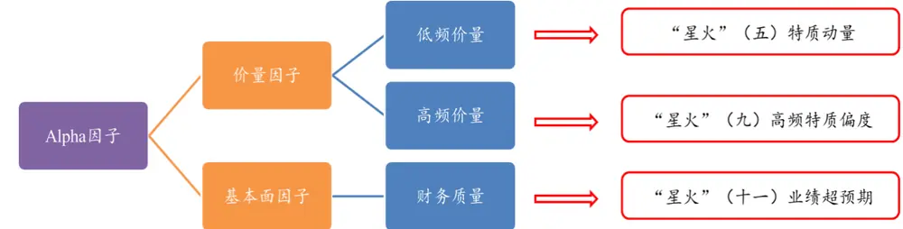
数据来源：财通证券研究所

然而，个股的交易价格除了受其供求关系决定之外，最根本的还是由公司本身的内在价值决定。随着 A 股市场上机构投资者定价权的逐步提升，股票的价格将进一步向其内在价值靠近，“价值投资效应”在 A股市场上受到的关注越来越多。作为监管层强制要求上市公司披露的文件，公司的定期报告成为我们探知公司基本面情况的最主要来源，然而由于数据的非标准化、披露时点的不及时性等原因，相较价量数据来讲，财务数据的处理为量化研究者带来了新的挑战。

图 2：发布滞后及数据修正——财务数据处理的两大难题
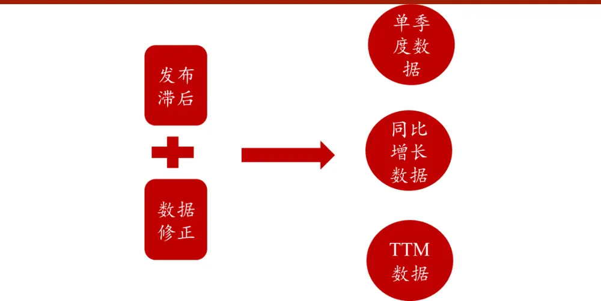
数据来源：财通证券研究所，“拾穗”系列（16）

在财通金工“拾穗”系列（16）《水月镜花：正视财务数据的前向窥视问题》中，我们提到财务数据的处理通常面临“发布滞后”和“数据修正”两大难题。由于上市公司的定期报告通常在季度结束之后的一段时间才进行发布，且各家公司的定期报告披露时间并不一致，因此如何获取及时数据（Point-in-Time）成为影响策略回测准确性的关键因素之一。此外，由于统计失误、审计口径变更、公司并购重组等原因，上市公司通常会在最新披露的财务报告中对过往的历史数据进行修改，那么如何获取历史时点上能够获得的最新数据，从而避免“前向窥视带来的偏差”（Look-Ahead Bias）问题成为财务数据处理的第二大困难。

财通金工对如上两大问题进行了细致化的处理，通过对底层数据库进行整理，初步得到了一个质量较高的数据集，并将其中的心得和细节在“拾穗”系列（16）中与大家进行了分享，感兴趣的投资者欢迎参考。

## 2、 业绩超预期的惊喜：从事件驱动看A股市场 PEAD 效应

盈余公告后的价格漂移（Post-Earnings Announcement Drift，PEAD）现象最早由 Ball和 Brown（1968）年提出，其在美国市场上研究发现在业绩公告之后盈利超预期的股票将会在未来获得持续正向的超额收益，而对于业绩不达预期的股票将会在未来获得持续负向的超额收益。

在本文的开头，我们先从事件驱动研究的角度来关注 A 股市场上是否存在显著的 PEAD 效应。首先，我们根据上市公司公告中披露的信息构建业绩超预期因子（因子的具体构建方式将在下文中进行详细介绍），并在每个报告期将全市场的所有股票按照该因子值从大到小进行排序，并分为 10 组。随后，我们计算每个组别中的成分股在公司公告前 60 天到公司公告后 120 天的日度超额收益，那么每个组别在[-60, 120]期间的日度超额收益即为该组成分股日度超额收益的平均。最后，我们将每个组别在所有报告期的业绩公告前、后日度超额收益取平均，作为该组别在事件前后的单日超额收益。

图 3：公告前后业绩超预期分组累计超额收益（2009.12.31-2019.6.30）
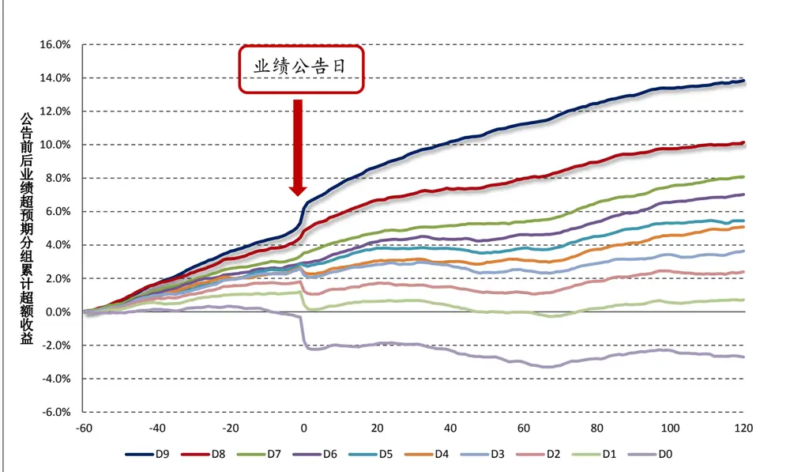
数据来源：财通证券研究所，恒生聚源

我们以 2009 年 12 月 31 日到 2019 年 6月 30 日为回测区间，按照如上的方法计算各组在业绩公告日前后的累计超额收益。其中，个股的日度超额收益为个股日度收益与当日中证全指（000985.CSI）日度收益之差，而事件前后的累计超额收益为[-60,120]期间，单日超额收益的累加。

图 3 展示了根据业绩超预期因子进行分组后，每组在公告前后的累计超额收益走势，其中 D9 组表示业绩超预期最高的一组，D0 组表示业绩不达预期的一组。可以看到，业绩超预期最高的一组（D9组）在业绩公告后的 120天内有着非常明显的正向超额收益，而业绩不达预期的一组（D0 组）在业绩公告后的 120天内有着明显的负向超额收益。

图 4：各组在不同区间段的累计超额收益（2009.12.31-2019.6.30）
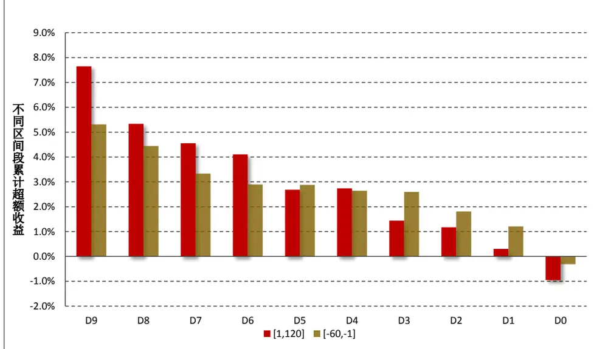
数据来源：财通证券研究所，恒生聚源

图 4 展示了各组在不同区间段的累计超额收益情况，其中[-60,-1]表示业绩公告前的 60 天至业绩公告前 1 天（含前 1 天）各组的累计超额收益，[1,120]表示业绩公告后的 1 天至业绩公告后 120 天（含第 1 天，但不含业绩公告当天）各组的累计超额收益情况。注意，此处我们不将业绩公告当日（记为 T0 日）的个股收益计算在内，这是因为公司在业绩公告当日往往伴随较大的股价波动，而这些当日涨停或者跌停的股票，都不是我们能够提前捕捉的机会。

由图 4 可以看到，在业绩公告日之前，已经有大量的知情交易者对业绩超预期个股进行了埋伏，这些股票在公告前 60日内的超额收益（5.3%）已经要显著高于其他组别。此外，在业绩公告之后的 120 天内，D9 组的累计超额收益达到7.6%，远高于 D0 组的-0.95%，且各组的超额收益展现出非常良好的单调性。由此，我们可以初步得出了如下两点结论：

（1） A 股市场上存在显著的 PEAD 效应，业绩超预期的股票在业绩公告后的 120 天内展现出持续良好的超额收益；

（2） A 股市场上不仅存在业绩公告后的价格漂移现象，业绩公告前的价格漂移现象同样稳健。财通金工认为这可能是由于知情交易者（如内幕消息拥有者或是机构分析师一致预期信息的拥有者）的存在导致。

到目前为止，我们从事件驱动的角度观察了 A 股市场上 PEAD 效应的存在性和稳健性，那么如何将其运用到多因子选股的框架中呢？在下文中，我们将借助 Jegadeesh和 Livnat（2006）构建的标准化预期外盈利 SUE因子，通过公司定期报告、业绩预告和业绩快报等信息，挖掘业绩个股超预期带来的 Alpha 机会。

## 3、 从因子选股角度构建业绩超预期组合

本文参考 Jegadeesh 和 Livnat（2006），采用标准化预期外盈利（StandardizedUnexcepted Earnings, SUE）因子作为公司业绩超预期程度的代理变量。事实上，在实际计算中我们不仅可以从上市公司的定期财务报告中获取公司业绩数据，还能够从业绩预告及业绩快报中获取更为及时的预披露信息。在本节中，我们将对SUE因子的具体计算方式进行介绍，并同时对各类财务报告的披露时间及披露质量进行对比，从而帮助投资者利用更多的信息构建更为有效的 SUE因子。

## 3.1 因子构建——标准化预期外盈利SUE

本文采用如下公式计算股票 i 在 t 季度的 SUE因子：

$$
SUE_{i,t}=\frac{Q_{i,t}-E\big(Q_{i,t}\big)}{\sigma_{i,t}}
$$

其中， $Q_{i,t}$ 表示个股在t 季度实际公布的单季度净利润数据，它可以从公司披露的财务报表中直接获得。 $E\left(Q_{i,t}\right)$ 表示个股在 t 季度的预期单季度净利润数据，它可以事先通过公司过往的单季度净利润计算得到。 $\sigma_{i,t}$ 表示公司单季度净利润增长的标准差。Jegadeesh 和 Livnat（2006）认为，个股的单季度净利润服从一个带有漂移项的季节性随机游走过程（Seasonal Random Walk With Drift），因此公司的预期单季度净利润可以表示为：

$$
\begin{array}{c}{E\left(Q_{i,t}\right)=Q_{i,t-4}+\delta_{i,t}}\\{\delta_{i,t}=\frac{\sum_{j=1}^{8}\left(Q_{i,t-j}-Q_{i,t-j-4}\right)}{8}}\\{\sigma_{i,t}=\cfrac{1}{7}\displaystyle\sqrt{\sum_{j=1}^{8}\left(Q_{i,t-j}-Q_{i,t-j-4}-\delta_{i,t}\right)^{2}}}\end{array}
$$

可以看到，t 季度的预期单季度净利润 $(E(Q_{i,t}))$ ）等于去年同期的实际单季度净利润 $(Q_{i,t-4})$ 与漂移项 $\delta_{i,t}$ 的加总，而该漂移项的值可通过过去 8 个季度的单季度净利润同比增长 $(Q_{i,t-j}-Q_{i,t-j-4}$ ，也就是上文所说的漂移项）的平均计算得到。分母的 $\sigma_{i,t}$ 部分为过去 8 个季度中每个季度的实际单季度净利润 $(Q_{i,t-j})$ 与预期单季度净利润 $(Q_{i,t-j-4}+\delta_{i,t})$ 之差的标准差计算得到，换句话说 $\sigma_{i,t}$ 计算的是过去 8 个季度中公司单季度超预期净利润的标准差。

除了以标准化预期外盈利（SUE）作为个股业绩超预期幅度的代理变量之外，很多学者还提出采用标准化预期外营业收入（SUR）进行辅助参考。SUR 的计算方式与 SUE的计算完全一致，所不同的是 SUR 的计算不再以公司的净利润为基础数据，而是以其营业收入进行衡量：

$$
\mathit{SUR}_{i,t}=\frac{REV_{i,t}-E\big(REV_{i,t}\big)}{\xi_{i,t}}
$$

其中， $REV_{i,t}$ 表示个股 i 在 t 季度的单季度营业收入， $E\left(REV_{i,t}\right)$ 表示其预期的单季度营业收入， $\xi_{i,t}$ 表示单季度营业收入增长的标准差。

需要注意的是，到目前为止无论是 还是 ，我们强调采用的是个股的单季度数据，而非定期报告公布的累计数据。然而，在公司定期公布的财务报表中，通常只会公布年初至报告期这一区间的累计数据，因此我们需要在定期财报的基础上进一步加工计算得到单季度数据，主要方法如下：一、三季度数据直接采用财务报告中公布的数据，二季度数据等于半年报数据减去一季度数据，四季度数据等于年报数据减去三季度数据。

此外，由于公司在披露定期报告之前，往往会披露业绩预告和业绩快报，而这些财务报表的披露时间和披露质量并不相同，为此我们将在下一小节中对主要财务报告的披露时间和数据质量进行详细比较。

## 3.2 定期报告、业绩预告、业绩快报披露时间及数据质量对比

根据我国证监会及交易所对于股票信息披露的要求，上市公司的财务报告按照其披露时间从早到晚可分为业绩预告、业绩快报、定期报告三大类，其中定期报告通常又有资产负债表、利润表、现金流量表、所有者权益变动表及报表附注五种（如图 所示）。

图 5：上市公司主要财务报告分类及特征
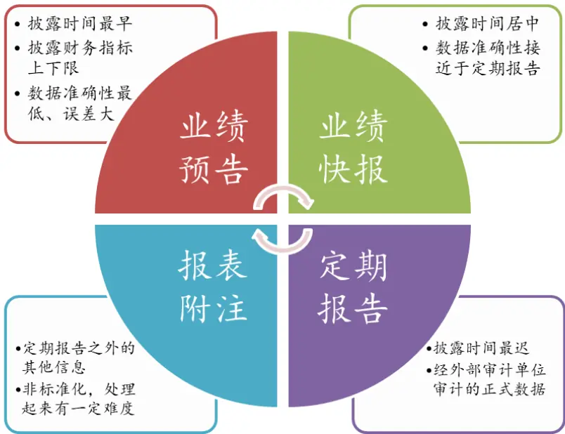
数据来源：财通证券研究所

定期报告是量化研究者处理财务数据时最为常用的数据来源，它是经过审计公司审计的正式财务报告，其数据质量要优于业绩预告和业绩快报数据。根据证监会发布的《上市公司信息披露管理办法》第二十条，上市公司定期报告的发布时间规定如表 1 所示，可以看到一季报和三季报的编制时间最多有 1个月，而半年报和年报的编制时间最多可达2 个月和 4个月，信息披露时间较为滞后。

表 1：定期报告、业绩预告、业绩快报披露时间

| 报告期 | 起始时间 | 结束时间 | 定期报告最迟披露日 | 业绩预告披露日 | 业绩快报披露日 |
| --- | --- | --- | --- | --- | --- |
| 一季报 | 1月1日 | 3月31日 | 4月30日 | 4月15日 |  |
| 半年报 | 4月1日 | 6月30日 | 8月31日 | 7月15日 | 5月底前 |
| 三季报 | 7月1日 | 9月30日 | 10月31日 | 10月15日 |  |
| 年报 | 10月1日 | 12月31日 | 次年4月30日 | 1月31日 | 次年 |

数据来源：财通证券研究所

备注：第一季度季度报告的披露时间不得早于上一年度年度报告的披露时间

幸运的是，除了定期报告之外，投资者还能从上市公司公布的业绩预告和业绩快报中获取更为及时的公司经营情况。然而在 A 股市场中，上交所和深交所对于上市公司业绩快报和业绩预告的披露要求并不相同，且深交所中的主板、中小板及创业板的披露要求也并不一致。因此，为了给予投资者更为完整的信息画像，我们总结了交易所对于不同公司业绩快报和业绩预告披露的具体要求，主要参考文件如表 2 所示。

表 2：所参考的官方指引文件

| 来源 | 名称 | 发布时间 |
| --- | --- | --- |
| 上交所 | 《上海证券交易所股票上市规则》 | 2019年4月第13次修订 |
| 深交所 | 《主板信息披露业务备忘录第1号：定期报告披露相关事宜》 | 2019年1月16日第3次修订 |
| 深交所 | 《创业板信息披露业务备忘录第11号：业绩预告、业绩快报及其修正》 | 2016年12月29日修订版 |
| 深交所 | 《中小企业板信息披露业务备忘录第1号：业绩预告、业绩快报及其修正》 | 2019年3月26日修订版 |

数据来源：财通证券研究所，上交所，深交所

表 3 展示了上交所和深交所对业绩预告的披露要求，值得注意的有以下几点：

（1） 对于出现亏损、扭亏为盈、净利润较前一季度增长或下降 50%以上的企业，各大板块上市的公司均需披露业绩预告；

（2） 深交所的业绩预告披露要求更严，其中创业板对一季报、半年报、三季报和年度业绩预告均要求强制披露；

（3） 在深交所 2019 年 3 月 26 日的修订版本中，中小板的业绩预告披露要求放宽，从原来的半年报、三季报、年报业绩预告强制披露要求放宽到满足特定条件的公司才需披露。

表 3：A 股上市公司业绩预告披露要求

|  | 上交所 |  |  |  |
| --- | --- | --- | --- | --- |
|  |  | 深交所 |  |  |
|  |  | 主板 | 中小板 | 创业板 |
| 披露要求 | (1) 对于年度报告，如果上市公司预计全年可能出现亏损、扭亏为盈、净利润较上年同期上升或下降50%以上（基数过小除外）这三类情况，必须披露业绩预告；(2)基数过小指的是上一年度报告EPS绝对值小于等于0.05元、上期中报 EPS 绝对值小于0.03元、上期年初至第三季度 EPS 绝对值小于等于 0.04 元等情况；(3)如果不存在上述三类情况，可以不披露年度业绩预告。上交所对于半年报和季度报告，并没有做强制披露要求。 | （1）预计报告期内（第一季度、半年度、第三季度和年度）出现如下情况的，应当进行业绩预告：净利润为负、扭亏为盈、实现盈利且净利润与上年同期相比上升或者下降50%以上（基数过小的除外）、期末净资产为负、年度营业收入低于1千万元；(2)如果不存在上述情况，可以不披露业绩预告。 | (1)上市公司预计第一季度、半年度、前三季度、全年度业绩将出现如下情况的，应当进行业绩预告：净利润为负、净利润与上年同期相比上升或者下降50%以上（基数过小的除外）、扭亏为盈；（2)在2016年12月29日修订版本中，中小板的半年报、三季报和年报是强制披露的，但是在2019年3月的修订版本中，仅仅对满足要求的公司才予以强制披露； | (1)上市公司应披露一季度、半年度、三季度、年度业绩预告(2)创业板业绩预告是强制性披露的，全部上市公司均要进行业绩预告 |
| 披露时间 | 一般要求在报告期次年的1月31日前进行披露 | 业绩预告截止披露日期：(1)一季度业绩预告：报告期当年的4月15日前；(2)半年度业绩预告：报告期当年的7月15日前；(3)三季度业绩预告：报告期当年的10月15日前；(4)年度业绩预告：报告期次年的1月31日前 | 业绩预告截止披露日期：(1)一季度业绩预告：报告期当年的4月15日前；(2)半年度业绩预告：报告期当年的7月15日前；(3)三季度业绩预告：报告期当年的10月15日前；(4)年度业绩预告：报告期次年的1月31日前 | (1)一季度业绩预告：上年度年度报告预约披露时间在3月31日之前的，应当最晚在披露年度报告的同时，披露本年度第一季度业绩预告；(2)年度报告预约披露时间在4月份的，应当在4月10之前披露第一季度业绩预告；(3)半年度业绩预告：报告期当年的7月15日前；(4)三季度业绩预告：报告期当年的10月15日前；(5)年度业绩预告：报告期次年的1月31日前 |

数据来源：财通证券研究所，上交所，深交所

表 4 列出了上交所和深交所对于业绩快报的披露要求，相较于业绩预告来讲，交易所对上市公司的业绩快报披露要求更低，主要值得注意的有：

（1） 创业板股票对年度业绩快报有强制披露要求，中小板要求有所放宽；

（2） 上交所股票对于业绩快报的披露无强制规定；

表 4：A 股上市公司业绩快报披露要求

|  | 上交所 |  |  |  |
| --- | --- | --- | --- | --- |
|  |  | 深交所 |  |  |
|  |  | 主板 | 中小板 | 创业板 |
| 披露要求 | (1) 上市公司可以在年度报告和中期报告披露前发布业绩快报；(2)上交所业绩快报不是强制性披露的； | （1)鼓励上市公司在定期报告披露前，主动披露定期报告业绩快报，并非强制要求披露；(2)拟发布第一季度报告业绩预告但其上年年报尚未披露的上市公司，应当在发布业绩预告的同时披露其上年度的业绩快报 | (1)鼓励上市公司在定期报告披露前，主动披露业绩快报；(2)拟发布第一季度报告业绩预告但尚未披露上年年报的上市公司，应当在发布业绩预告的同事披露其上年度的业绩快报(3)最新的披露要求相较上一版本有明显的放宽，此次版本中小板披露要求与主板要求一致。 | (1)年度报告预约披露时间在3-4月份的公司，强制披露业绩快报；(2)年度报告预约披露时间在3月份之前的公司，可不披露年度业绩快报 |
| 披露时间 | 正式报告披露前 | 正式报告披露前 | 正式报告披露前 | 年报预约在3-4月份披露的公司，在2月底前披露快报 |

数据来源：财通证券研究所，上交所，深交所

由以上分析可知，上交所和深交所对于上市公司业绩预告和业绩快报的披露要求并不相同，深交所对于主板、中小板和创业板公司的披露要求也并不一致。其中，部分股票的业绩预告和业绩快报是强制披露的，但是很多公司为了平滑股价波动、增加企业信息透明度，也会加入到预告和快报的披露行列。那么，在 A股市场上披露业绩预告和业绩快报的公司数量占比究竟如何呢？图6和图7通过绘制各季度发布业绩预告和业绩快报公司数量的柱状图进行了回答。

由图 可以看到，近年来发布业绩预告的公司数量逐年攀升，其中发布年报业绩预告的公司稳定在 2000 家以上。不过，由于中小板披露要求在 2019年 3月的修订版本中有所放松，因此 2019年的半年报和三季报业绩预告公司数量明显减少。由于公司年度报告的披露时间滞后很长，如果不对这些信息进行捕捉，那么投资者获取到的信息将会显著地落后市场。

图 6：各季度发布业绩预告公司数量（2010-2019）
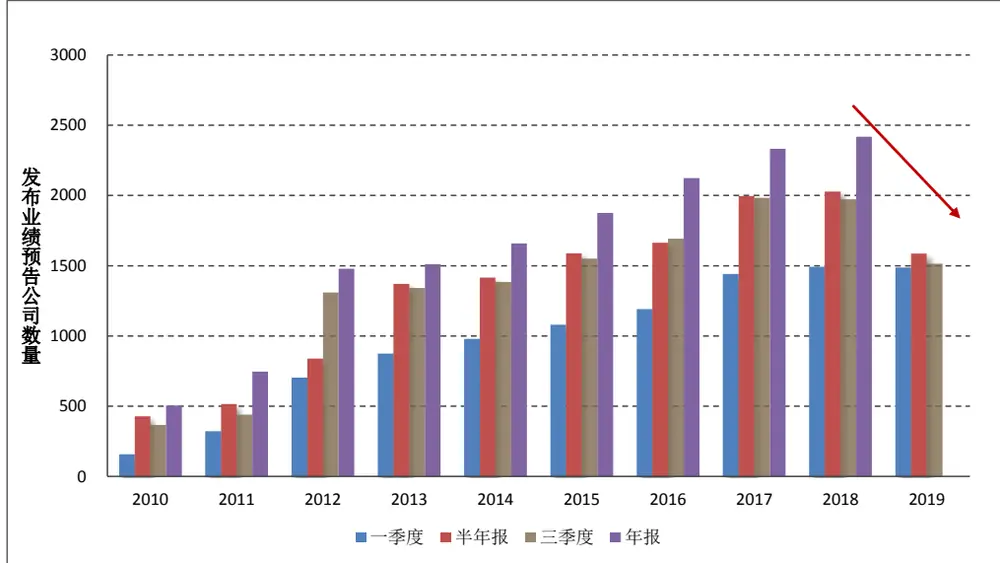
数据来源：财通证券研究所，恒生聚源
谨请参阅尾页重要声明及财通证券股票和行业评级标准

图 7：各季度发布业绩快报公司数量（2010-2019）
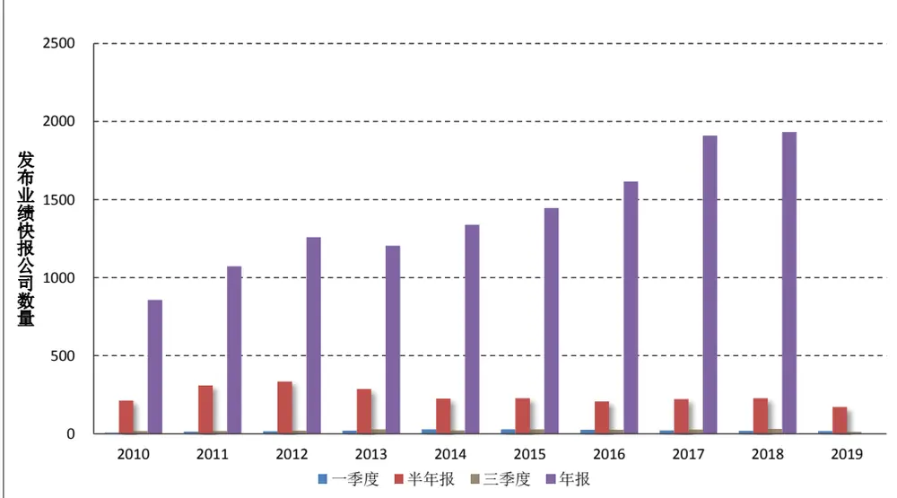
数据来源：财通证券研究所，恒生聚源

图 7 展示了各季度发布业绩快报的公司数量，由于深交所仅对创业板的业绩快报披露进行了强制要求，同时鼓励上市企业发布半年度业绩快报，因此发布业绩快报的数量要远远多于其他报告期的数量。由于业绩快报的披露质量与正式财务报告更为接近，因此这些数据也能够为我们获取更及时的、质量更好的信息提供更为丰富的来源。

## 4、 实证检验

到目前为止，我们对 SUE因子的计算方法进行了具体说明，并且对上市公司财务报告的披露时间和披露质量进行了比较。可以看到，业绩预告和业绩快报能够为投资者提供更为及时的公司经营信息，如果忽略这些信息，将会损失一定的 Alpha 收益。在本节中，我们将对 SUE 因子在 A股市场上的有效性进行检验。

## 4.1 因子计算及细节说明

前面提到，目前主流的文献均采用 SUE和 SUR 因子作为公司业绩超预期幅度的代理变量。然而在实际计算过程中所采用的底层数据之间仍然略微有些区别：在 SUE 因子的计算中既可以采用个股的 EPS，也可以采用个股的净利润、归属母公司股东净利润数据；在 SUR 的计算过程中，既可以采用个股的 ORPS，也可以采用营业收入、总营业收入等数据。

表 5：计算SUE和 SUR 因子所能够采用的数据

| SUE（标准化预期外盈利） | SUR（标准化预期外营业收入） |
| --- | --- |
| EPS1（净利润/股本数量） | ORPS1（营业收入/股本数量） |
| EPS2（归母净利润/股本数量） | ORPS1（总营业收入/股本数量） |
| 净利润（NetProfit） | 营业收入（OperatingRevenue） |
| 归属母公司股东净利润（NPParentCompanyOwners） | 总营业收入（TotalRevenue） |

数据来源：财通证券研究所

财通金工经过实证研究发现，采用归属母公司股东净利润和采用营业收入来计算 SUE和 SUR 因子的效果最佳，因此我们后续的计算中均沿用这一选择。

在选定好基础数据之后，即可根据 3.1 小节介绍的方法构建 SUE 因子。由于公司的业绩快报数据通常会对其净利润、营业收入等进行直接披露，因此业绩快报数据是质量仅次于正式财务报告的信息来源。而对于业绩预告数据来讲，尽管其披露时间最早，但是业绩预告往往只披露公司在该报告期的净利润（或者净利润增长率）上限和下限，对于某些公司而言其披露的上下限之间的差别十分巨大，因此我们仅能够对其上下限取平均值进行估算：

$$
\sharp\langle\frac{\pm}{\ dt}\rangle\langle\frac{\langle\pm\rangle}{\ dt}\rangle|\langle\rangle\rangle\langle\frac{\left(\sharp\widehat{\eta}\frac{\pm}{\ dt}\rangle\langle\dot{\bar{\eta}}\rangle\right)\langle\dot{\varrho}\rangle}{\ dt}\bot\left.\dot{\eta}\right.\frac{\pm\sharp\widehat{\eta}\vert\frac{\pm}{\ dt}\rangle\langle\dot{\bar{\eta}}\vert\dot{\eta}\vert\cdot\vert\vert\dot{\eta}\vert}{\ dt}\big\rangle\qquad
$$

最后还有一个细节值得注意，部分公司在发布业绩预告时，仅披露其净利润的同比增长率范围，而并不对其净利润的上下限进行公告。如图8 所示，岳阳兴长（000819.SZ）仅预告其 2019 年净利润在 0-20%之间（未经审计），为了估算其 2019 年的净利润，我们必须先获取其 2018 年的净利润，随后根据增长率的平均值进行估算：

$$
\langle|\pm\rangle+\langle|\pm\rangle|\rangle|\langle|\pm|=\perp\langle|\partial|\rangle|\langle|\partial|\rangle|\langle|\pmb{\dot{\tau}}+\pmb{\dot{\tau}}||\rangle|\rangle|\times\left(1+\frac{\left(\frac{\kappa_{1}}{19},\frac{\pm}{15},\frac{\gamma_{0}}{16},\frac{\gamma_{\mathrm{e}}}{6},\pm\frac{1}{4},\pm\frac{1}{18},\frac{\pm}{18},\frac{1}{6},\pm\frac{\gamma_{\mathrm{e}}}{6},\mp\frac{1}{18},\mp\frac{1}{6},\mp\frac{1}{6},\mp\frac{1}{6},\mp\frac{1}{6},\mp\frac{1}{6},\mp\frac{1}{6},\mp\frac{1}{6},\mp\frac{1}{6},\mp\frac{1}{6},\right)}{2}\right)
$$

## 图 8：岳阳兴长（000819.SZ）2020.2.10 发布的公告

## 四、风险提示

1、经自查，公司不存在违反信息公平披露的情形。

2、公司2019年度经营业绩与2018年度不存在重大变化，预计2019年度净利润比2018年度净利润5207万元增长幅度在0一20%之间(数据未经审计)。

3、新冠肺炎疫情目前已对公司生产经营产生一定影响，但因影响的主要是业务规模较小的业务单元，目前预计不会对公司业绩构成重大影响，其实际影响程度尚需视新冠肺炎疫情发展情况而定。

4、公司郑重提醒广大投资者，《上海证券报》、《证券时报》、《中国证券报》和巨潮资讯网(http://www.cninfo.com.cn)为本公司指定信息披露媒体,公司所有信息均以在上述指定媒体刊登的正式公告为准。

数据来源：财通证券研究所，Wind

不过，在我们后续的实证研究中并没有对在业绩预告中仅披露净利润增长率而没有披露具体净利润的数据进行补齐，其主要原因在于通过增长率计算得到的数据误差较大。我们可以通过如下统计量衡量估计误差：

$$
1\pm i+i\neq\frac{1}{\pm}=\frac{\left|1\pm i+1\pmb{\operatorname{\neq}}-\frac{1}{\pmb{\operatorname{\neq}}}\pmb{\operatorname{\^*{\pm}}}/\pmb{\operatorname{\neq}}\right|}{\pmb{\operatorname{\neq}}}
$$

表 6：各种方式计算的净利润与实际净利润误差统计量（2009.12.31-2019.6.30）

|  | 通过增长率来计算 | 通过业绩预告上下限计算 | 根据业绩快报来计算 |
| --- | --- | --- | --- |
| count | 11191 | 60339 | 17234 |
| mean | 0.277 | 0.203 | 0.053 |
| std | 0.363 | 0.292 | 0.102 |
| min | 0.000 | 0.000 | 0.000 |
| 25% | 0.050 | 0.027 | 0.000 |
| 50% | 0.141 | 0.084 | 0.009 |
| 75% | 0.344 | 0.237 | 0.053 |
| max | 2.152 | 1.653 | 0.663 |

数据来源：财通证券研究所，恒生聚源

表 6 展示了通过增长率估算的净利润、通过业绩预告估算的净利润以及通过业绩快报估算的净利润与真实的单季度净利润之间的估计误差值。可以看到，根据业绩快报估算的净利润误差均值为 0.053，远远小于其他二者，这进一步验证了业绩快报数据的准确性。此外，通过增长率估算得到的净利润的误差较大，因此我们在后续实证研究中并不将其纳入在内。由此，为了区分采用不同数据源计算得到的 SUE因子，我们对其进行如下区分：

（1） SUE1：仅采用上市公司定期财报数据；

（2） SUE2：采用定期财报数据+业绩快报数据；

（3） SUE3：采用定期财报数据+业绩快报数据+业绩预告数据。

财通金工再一次提醒，我们在实证部分均采用公司的单季度数据进行计算，因此在采用业绩快报和业绩预告数据时，除了提取其中的报告期数据，还需要根据最新可获得的历史数据将其转化单季度数据。

本文选定 2009.12.31-2020.1.23 为回测区间，具体细节如下：

因子预处理：在横截面上将 SUE因子对个股行业及市值进行正交化处理

回测时间：2009.12.31-2020.1.23，月度调仓

回测样本：Wind 全 A样本股

样本筛选：剔除上市时间少于 100 天、剔除调仓日停牌一天、剔除 ST、*ST、PT 等被标为风险预警的股票、剔除调仓日涨停或者跌停的股票

调仓时间：每月最后一个交易日

分组方式：按照因子值从小到大分 10 组（D0-D9），每组成分股进行等权处理，因子值最大的一组（D9）作为空头，因子值最小的一组（D0）作为多头

基准指数：每期满足条件的样本股收益等权平均

手续费：单边 3%

## 4.2 因子回测绩效表现

表 7 展示了采用不同范围的数据源计算得到的 SUE因子在 A股市场上的回测效果，可以看到在加入了业绩预告和业绩快报数据之后，我们构建的业绩超预期因子效果得到了明显的提升。从 RankIC 的角度而言，其月度胜率从最初的 82.6%提升至 88.4%，根据对空对冲组合日度净值计算的年化 IR 从 3.63 提升到 3.89，这说明加入了更为及时的信息能够显著提升业绩超预期因子的表现。

表 7：SUE 因子回测效果（2009.12.31-2020.1.23）

| 因子说明 | RankIC 均值 | RankIC-T 值 | RankIC-月胜率 | 对冲组合年化收益 | 对冲组合年化波动 | 对冲组合年化IR |
| --- | --- | --- | --- | --- | --- | --- |
| SUE1 | 4.2% | 9.98 | 82.6% | 18.48% | 5.09% | 3.63 |
| SUE2 | 4.4% | 10.37 | 85.1% | 19.31% | 5.19% | 3.72 |
| SUE3 | 4.6% | 11.05 | 88.4% | 20.55% | 5.28% | 3.89 |

数据来源：财通证券研究所，恒生聚源

图 9 通过展示 SUE 因子各组相较基准的年化超额收益来观察因子本身的单调性，我们可以得到如下结论：

首先，无论采用何种数据来源，SUE因子均展现出非常稳健的单调性。

其次，与大多数常用的价量因子收益来源于空头、多头部分增强不明显甚至失效的情况不同，SUE因子的多头相较市场基准展现出非常强的选股能力；

最后，在加入了业绩预告和业绩快报数据之后，因子多头相较市场的年化超额收益从原来的 9.97%提升至 11.64%，因子有效性提升明显。

图 9：SUE 因子各组相较市场基准的年化超额收益（2009.12.31-2020.1.23）
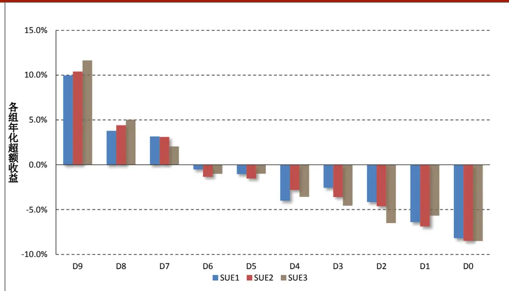
数据来源：财通证券研究所，恒生聚源

由前述介绍可知，在加入了业绩预告和业绩快报数据之后，因子的多头效果有了明显的增强。与此同时，我们预期更加及时的信息补充将会增加各组的换手率。图 10 展示了各组的月度平均换手率情况，可以看到，在加入新数据补充后，各组的换手率均有着明显的提升，但是多头组别的换手率提升相对有限。SUE3因子的多头月均换手率为 35%，略高于 SUE1 因子的多头月均换手率 32%。

图 10：SUE 因子各组平均月度换手率（2009.12.31-2020.1.23）
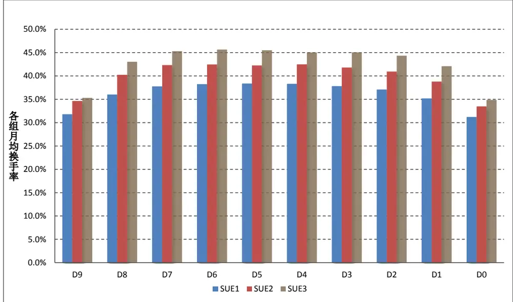
数据来源：财通证券研究所，恒生聚源

图 11：SUE 因子多空对冲净值走势（2009.12.31-2020.1.23）
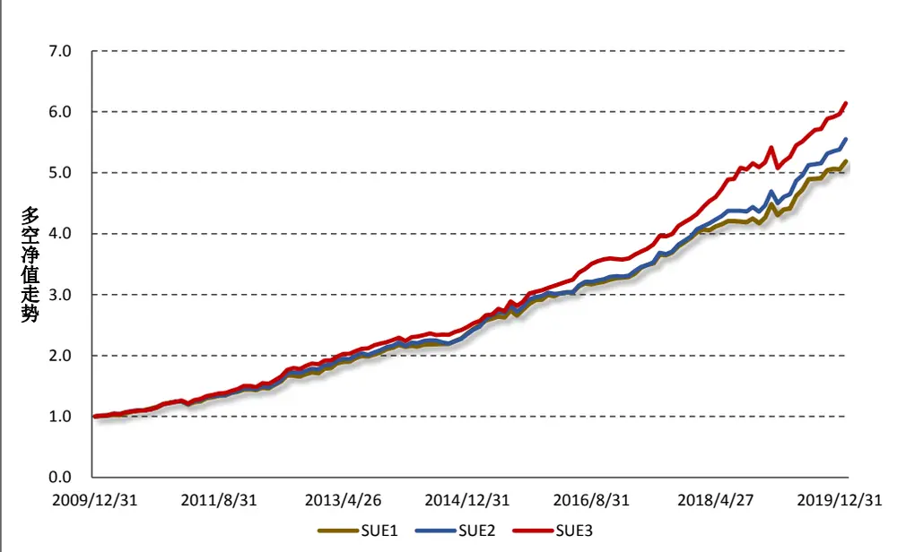
数据来源：财通证券研究所，恒生聚源

图 11 展示了 SUE 因子多空对冲组合净值的走势，可以看到在样本范围内，对冲组合的多头相对空头的超额收益十分稳健，且在加入了业绩预告和业绩快报数据之后，SUE3 因子的多空对冲组合相较其他有着明显提升。

图 12：SUE 因子多头相对基准超额净值走势（2009.12.31-2020.1.23）
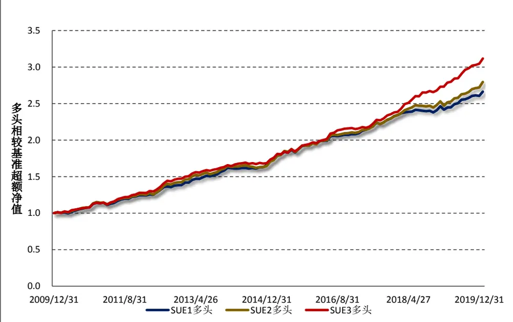
数据来源：财通证券研究所，恒生聚源

在财通金工“星火”系列（九）《博彩偏好还是风险补偿？高频特质偏度因子全解析》中，我们对 2019 年的大部分因子进行了回顾发现，很多传统有效的价量因子（如换手率、特质波动率、估值因子等）尽管从 RankIC及多空对冲角度来看依然有效，但因子的主要贡献来源于空头部分，而其多头部分近年出现了极大的回撤，这导致该类因子在纯多头的 A 股市场上出现了一定程度的失效。因此，在因子研究中，我们必须关注其多头部分所能贡献的超额收益是否稳健。

图 12 展示了多头组合相对基准的超额净值走势，我们非常欣喜地看到 SUE多头组合能够持续稳定地获取 Alpha 收益。

## 4.3 沪深 300 及中证 500成分股中的表现

本小节我们关于 SUE因子在沪深 300 指数和中证 500 指数成分股中的表现情况，表 8 展示了因子的主要绩效指标。需要说明的是，我们是先在全样本成分股中进行了行业及市值中性化之后，再将正交化后的因子在沪深 300指数和中证500 指数中进行选股测试的。此外，由于成分股数量相对较少，我们将样本股票分为 5 组进行测试。由表 8 可以看到，SUE 因子在沪深 300 指数成分股及中证500 指数成分股中均展示出了不错的选股效果，其在沪深 300 指数及中证 500 指数中的对冲组合年化 IR 分别达到 1.84 和 2.07。

表 8：SUE 因子在沪深 300 和中证 500 指数中的绩效表现（2009.12.31-2020.1.23）

| 因子说明 | RankIC 均值 | RankIC-T 值 | RankIC-月胜率 | 对冲组合年化收益 | 对冲组合年化波动 | 对冲组合年化 IR |
| --- | --- | --- | --- | --- | --- | --- |
| 沪深300 | 5.0% | 6.29 | 70.2% | 14.29% | 7.78% | 1.84 |
| 中证500 | 4.4% | 7.14 | 78.5% | 12.71% | 6.15% | 2.07 |

数据来源：财通证券研究所，恒生聚源

图13展示了SUE因子在沪深300指数和中证500指数中的分组年化超额收益，可以看到多头组别相较基准指数仍然具有较好的超额收益。

图 13：SUE因子在沪深300 和中证 500指数中的分组年化超额收益
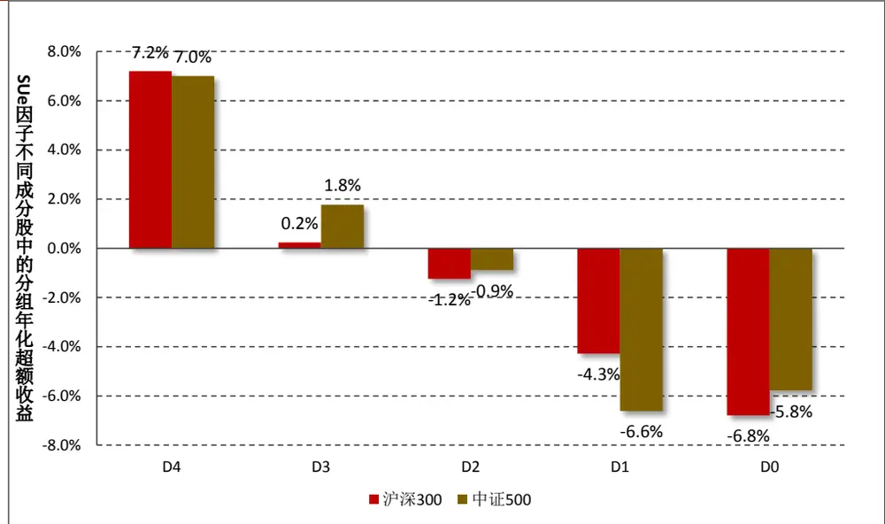
数据来源：财通证券研究所，恒生聚源

## 4.4 本章小结

本小节我们对 A 股市场上的 PEAD 效应在选股方面的能力进行了检验，通过构建标准化预期外盈余 SUE 因子来观察业绩超预期因子的选股能力。通过对A股市场上的定期财务报告、业绩预告和业绩快报的披露时间和数据质量进行分析发现，业绩预告和业绩快报数据对于定期报告在时间上的滞后性是一个非常良好的补充。通过更为及时的信息增量，我们构建的 SUE 因子展现出十分稳健的增强效应。且与很多价量因子展现出的多头组合近几年失效不同，SUE因子的多头组合在样本区间内展现出持续优异的 Alpha 能力。

## 5、 在下跌中寻找惊喜：业绩超预期与反转效应的融合

由以上的分析可知，A股市场上存在稳健的 PEAD 效应：业绩超预期的股票在未来能够获得不错的正向超额收益，而业绩不达预期的股票在未来的超额收益为负，而对于 PEAD 效应的成因，主流文献通常认为是由投资者对于盈余公告的反应不及时导致的。

另一方面，我们知道 A 股市场上也存在着较为稳健的反转效应：前期涨幅较高的股票在未来将会出现明显的回调，而前期超跌的股票在未来一段时间会有不错的表现，主流文献认为这主要是由于投资者的反应过度造成的。

由此我们可以看到，PEAD 效应和反转效应均能够从投资者对于信息的非理性反应进行解释，那么我们是否能够将两种效应结合起来，在反应不足与反应过度中寻找恰当的平衡点呢？基于此，我们采用双变量分组法，对二者进行检验。

表 9：对反转因子和 SUE因子进行双重筛选后的各组超额收益（2009.12.31-2020.1.23）

| 先对 Ret 分组再对 SUE 分组 |  |  |  |  |  |
| --- | --- | --- | --- | --- | --- |
|  | D4 | D3 | D2 | D1 | D0 |
| L4 | 1.12% | -7.45% | -13.24% | -14.77% | -18.92% |
| L3 | 9.68% | 0.28% | 0.11% | -6.82% | -8.46% |
| L2 | 10.99% | 6.46% | 1.06% | 0.23% | -3.13% |
| L1 | 12.53% | 6.32% | 2.51% | 1.42% | -2.03% |
| L0 | 11.59% | 6.36% | 4.32% | 2.75% | -0.12% |

先对 SUE 再对 Ret 分组

|  |  | 先对 SUE 再对 | Ret 分组 |  |  |
| --- | --- | --- | --- | --- | --- |
|  | D4 | D3 | D2 | D1 | D0 |
| L4 | -0.91% | 8.95% | 10.92% | 13.05% | 11.89% |
| L3 | -10.24% | -0.35% | 7.02% | 6.84% | 6.10% |
| L2 | -14.10% | 1.06% | 0.29% | 3.49% | 5.62% |
| L1 | -15.31% | -7.42% | 0.55% | 1.32% | 1.53% |
| L0 | -17.66% | -6.39% | -2.36% | -1.29% | 0.41% |

同时进行挑选(L 为 SUE，D 为 Ret)

|  | D4 | D3 | D2 | D1 | D0 |
| --- | --- | --- | --- | --- | --- |
| L4 | -0.14% | 9.24% | 11.23% | 13.32% | 11.78% |
| L3 | -9.72% | 0.25% | 6.98% | 6.12% | 6.89% |
| L2 | -13.91% | 0.37% | -0.05% | 4.29% | 5.63% |
| L1 | -15.17% | -8.40% | 0.17% | 1.08% | 2.18% |
| L0 | -19.12% | -7.82% | -2.55% | -1.96% | 0.15% |

数据来源：财通证券研究所，恒生聚源
备注：L 表示Level，为第一层分组。D表示 Decile，为第二层分组。数字越大表明对应的因子越大

所谓的“双变量分组法”，即是根据股票在A变量的取值划分为5层（Level），随后在每层中根据 B变量的取值划分为 5 组（Decile），最终形成 5×5 共 25 个组合，这其中就涉及到分层和分组的先后顺序。表 展示了 种不同的分组方式：（1）先对 Ret 分组再对 SUE 分组；（2）先对 SUE 分组再对 Ret 分组；（3）对SUE 和 Ret 同时进行分组，即将前者的第 i 组与后者的第j 组结合起来形成 LiDj组别，进而计算每组相较基准指数的年化超额收益。需要注意的是，在进行分层和分组时，SUE因子对市值和行业进行了正交化，Ret因子对市值进行了正交化。

以第三种方式（同时筛选）为例，多头组合 L4D0 的年化超额收益达到 11.78%，空头组合的年化超额收益达到-19.12%。

图 14：双变量分组下的多空对冲组合净值走势（2009.12.31-2020.1.23）
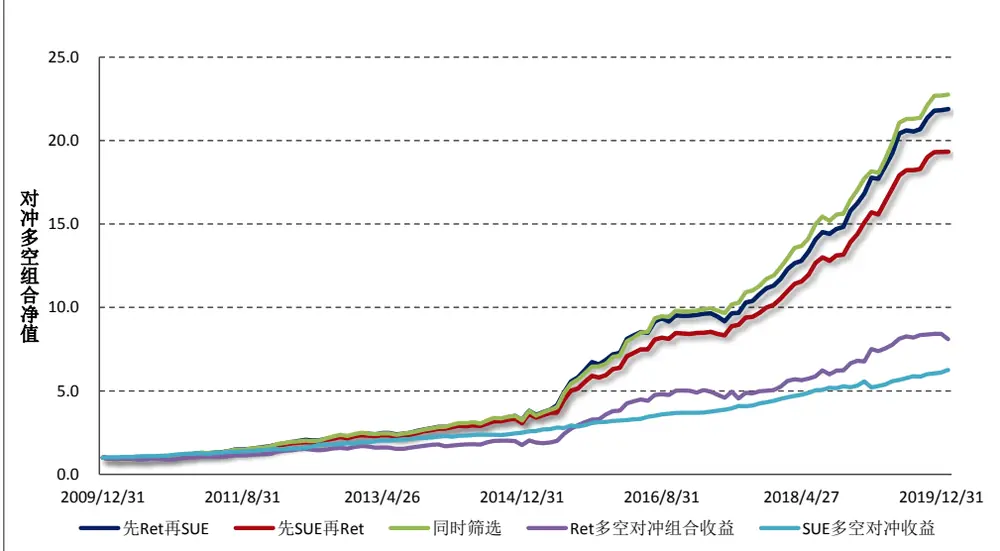
数据来源：财通证券研究所，恒生聚源

图 14 展示了双变量分组下，多空对冲组合的净值走势情况。可以看到，相较于单纯的 SUE 多空对冲组合及 Ret 对空对冲组合，经过双变量合成的多空对冲组合的累计收益有了明显的提升，同时其波动幅度也略微增大。

图 15：双变量分组下多头相较基准组合超额净值走势（2009.12.31-2020.1.23）
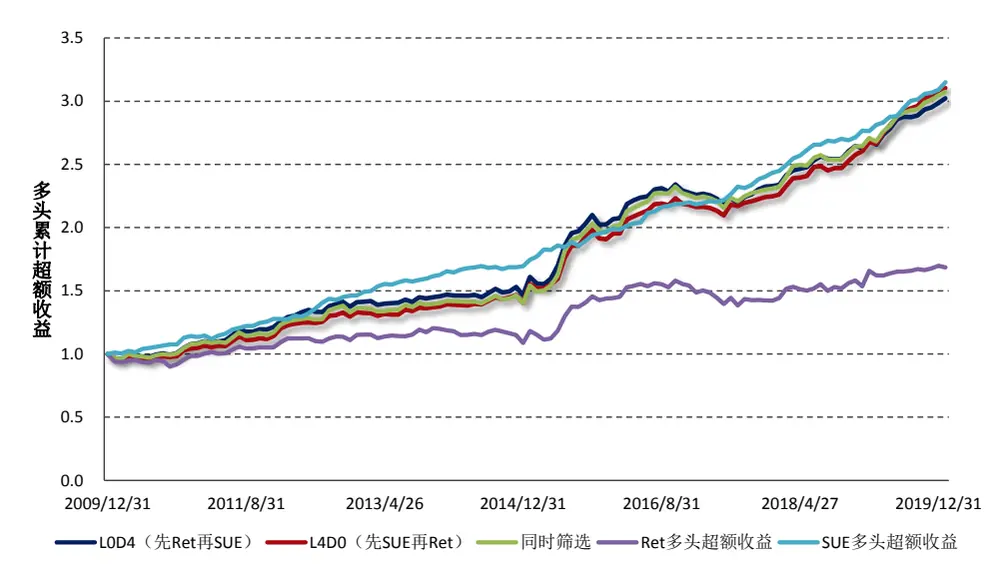
数据来源：财通证券研究所，恒生聚源

同样的，我们更加关注因子的多头组合带来的超额收益情况，图 15 展示了双变量分组下多头组合相较基准组合超额净值的走势。从累计收益的角度而言，其多头组合与 SUE 因子的多头组合相差不多，但其波动幅度要明显的更大，这主要是由于反转因子带来的波动造成的。

结合以上两点分析可知，将业绩超预期因子与反转因子进行融合，其多头效果相较SUE多头并未有大的折扣，但是其空头部分的负向Alpha效应更为明显。进一步的，我们看到多头组合是那些在技术面上前期出现超跌但基本面表现良好的股票，我们可以从这些个股的下跌中寻找一定的惊喜，而空头组合是那些技术面上前期涨幅较高但业绩却不达预期的股票，我们将其作为负 Alpha 来源，避免组合中出现较大的风险。

图 16：双变量分组下多头组合分年度超额收益情况（2010-2020）
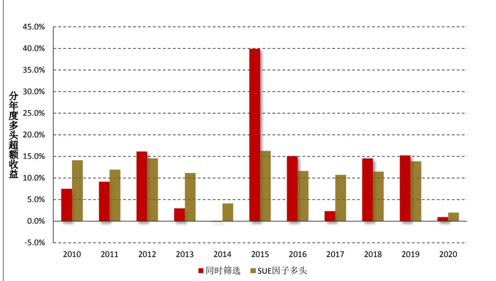
数据来源：财通证券研究所，恒生聚源

最后，图 16 列出了经过双变量分组的多头组合在 2010 年至 2020 年每年度相较市场均值的超额收益情况。可以看到，SUE因子的多头在历年表现的十分稳健，而在市场波动急剧放大的 2015 年，得益于反转因子的强势，我们“在下跌中寻找惊喜”的选股组合表现得十分亮眼。

## 6、 总结与展望

在财通金工的往期研究中，我们主要从高低频价量数据出发构建选股因子，对公司的基本面情况却并未做过多涉及。从本文开始，我们将研究范围逐步扩展到基本面量化的研究方向上。本文重点关注 A 股市场上的“盈余公告后漂移”PEAD 效应，借助定期财务报告、业绩预告和业绩快报数据构建更加有效的 SUE因子，并将其与反转因子进行融合，在交易情绪与个股基本面之间寻找平衡点，主要结论如下：

（1） A 股市场上存在显著的 PEAD 效应，业绩超预期的股票在业绩公告后的 120 天内展现出持续良好的超额收益；

（2） A 股市场不仅存在业绩公告后的价格漂移现象，业绩公告前的价格漂移现象同样稳健，财通金工认为这主要是由于知情交易者的存在导致的；

（3） 我国上市公司的财务报告可划分为业绩预告、业绩快报、定期报告三大类，其中业绩预告披露时间最早但数据误差较大，业绩快报披露时间居中，但数据准确性更佳，定期报告的披露时间最迟，但数据最具权威性；

（4） 通过 SUE 指标构建业绩超预期因子的代理变量，可以看到业绩预告和业绩快报的引入能够很大程度的提高因子的表现，它们是不可忽视的信息来源；

（5） 在全市场中，SUE 因子月均 RankIC 达到 4.6%，T 值为 11.05，月胜率 88.4%，对空对冲组合的年化 IR 达到 3.89。与传统的价量因子不同，SUE 因子的多头组合能够持续稳健地超过基准指数。此外，该因子在沪深 300 及中证 500 中的表现同样优异。

（6） PEAD 效应的形成主要源于投资者的反应不足，而反转效应的形成主要源于投资者反应过度，我们将两种效应进行融合，其多头部分

谨请参阅尾页重要声明及财通证券股票和行业评级标准即为前期超跌但基本面表现良好的股票，我们可以从这些个股的下跌中寻找一定的惊喜。而空头组合是那些技术面上前期涨幅较高但业绩却不达预期的股票，我们可以将其作为负 Alpha 来源，避免组合中出现较大的风险。

## 7、 风险提示

多因子模型拟合均基于历史数据，市场风格的变化将可能导致模型失效。

## 参考文献：

【1】 “An Empirical Evaluation of Accounting Income Numbers.” Ray Ball., Philip Brown. Journal of Accounting Research. 1968

【2】 “Revenue Surprises and Stock Returns”. Narasimhan Jegadeesh, Joshua Livnat. Journal of Accounting and Economics. 2006

## 信息披露

## 分析师承诺

作者具有中国证券业协会授予的证券投资咨询执业资格，并注册为证券分析师，具备专业胜任能力，保证报告所采用的数据均来自合规渠道，分析逻辑基于作者的职业理解。本报告清晰地反映了作者的研究观点，力求独立、客观和公正，结论不受任何第三方的授意或影响，作者也不会因本报告中的具体推荐意见或观点而直接或间接收到任何形式的补偿。

## 资质声明

财通证券股份有限公司具备中国证券监督管理委员会许可的证券投资咨询业务资格。

## 公司评级

买入：我们预计未来 6 个月内，个股相对大盘涨幅在 15%以上；

增持：我们预计未来 6 个月内，个股相对大盘涨幅介于 5%与15%之间；

中性：我们预计未来 6 个月内，个股相对大盘涨幅介于-5%与5%之间；

减持：我们预计未来 6 个月内，个股相对大盘涨幅介于-5%与-15%之间；

卖出：我们预计未来 6 个月内，个股相对大盘涨幅低于-15%。

## 行业评级

增持：我们预计未来 6 个月内，行业整体回报高于市场整体水平 5%以上；

中性：我们预计未来 6 个月内，行业整体回报介于市场整体水平-5%与 5%之间；

减持：我们预计未来 6 个月内，行业整体回报低于市场整体水平-5%以下。

## 免责声明

本报告仅供财通证券股份有限公司的客户使用。本公司不会因接收人收到本报告而视其为本公司的当然客户。

本报告的信息来源于已公开的资料，本公司不保证该等信息的准确性、完整性。本报告所载的资料、工具、意见及推测只提供给客户作参考之用，并非作为或被视为出售或购买证券或其他投资标的邀请或向他人作出邀请。

本报告所载的资料、意见及推测仅反映本公司于发布本报告当日的判断，本报告所指的证券或投资标的价格、价值及投资收入可能会波动。在不同时期，本公司可发出与本报告所载资料、意见及推测不一致的报告。

本公司通过信息隔离墙对可能存在利益冲突的业务部门或关联机构之间的信息流动进行控制。因此，客户应注意，在法律许可的情况下，本公司及其所属关联机构可能会持有报告中提到的公司所发行的证券或期权并进行证券或期权交易，也可能为这些公司提供或者争取提供投资银行、财务顾问或者金融产品等相关服务。在法律许可的情况下，本公司的员工可能担任本报告所提到的公司的董事。

本报告中所指的投资及服务可能不适合个别客户，不构成客户私人咨询建议。在任何情况下，本报告中的信息或所表述的意见均不构成对任何人的投资建议。在任何情况下，本公司不对任何人使用本报告中的任何内容所引致的任何损失负任何责任。

本报告仅作为客户作出投资决策和公司投资顾问为客户提供投资建议的参考。客户应当独立作出投资决策，而基于本报告作出任何投资决定或就本报告要求任何解释前应咨询所在证券机构投资顾问和服务人员的意见；

本报告的版权归本公司所有，未经书面许可，任何机构和个人不得以任何形式翻版、复制、发表或引用，或再次分发给任何其他人，或以任何侵犯本公司版权的其他方式使用。