# 2020 年 3 月 10 日 从质量到质量增长：挖掘公司基本面改善带来的 Alpha

## “星火”多因子专题报告（十二）

## 联系信息

陶勤英

SAC 证书编号：S0160517100002

## 首席分析师

taoqy@ctsec.com

021-68592393

张宇

分析师

SAC 证书编号：S0160519120001

zhangyu1@ctsec.com

17621688421

021-68592337

## 投资要点：

## 外资持股偏好与公募基金抱团

- 近年来，随着资本市场的逐步开放，A 股市场机构投资者占比不断提升，机构资金的话语权和定价权也越来越高，“价值投资”概念越来越受关注。

- 从北上资金持股及公募基金重仓股组合的风格因子暴露来看，机构资金更偏向于大市值、高动量、高估值的股票，且其在基本面因子上的暴露程度普遍更高。

## 相关报告

【1】“星火”多因子系列（一）：《Barra模型初探：A 股市场风格解析》

【2】“星火”多因子系列（二）：《Barra模型进阶：多因子模型风险预测》

【3】“星火”多因子系列（三）：《Barra模型深化：纯因子组合构建》

【4】“星火”多因子系列（四）：《基于持仓的基金绩效归因：始于 Brinson，归于 Barra》

【5】“星火”多因子系列（五）：《源于动量，超越动量：特质动量因子全解析》

【6】“星火”多因子系列（六）：《Alpha 因子重构：引入协方差矩阵的因子有效性检验》

【7】“星火”多因子系列（七）：《借因子组合之力，优化 Alpha因子合成》

【8】“星火”多因子系列（八）：《组合风险控制：协方差矩阵估计方法介绍及比较》

【9】“星火”多因子系列（九）：《博彩偏好还是风险补偿？高频特质偏度因子全解析》

【10】“星火”多因子系列（十）：《如何对Beta因子进行稳健估计？》

【 】“星火”多因子系列（十一）：《在下跌中寻找惊喜：业绩超预期与反转因子的融合》

【12】“拾穗”多因子系列（五）：《数据异常值处理：比较与实践》

【13】“拾穗”多因子系列（六）：《因子缺失值处理：数以多为贵》

【14】“拾穗”多因子系列（八）：《非线性规模因子：A 股市场存在中市值效应吗？》

【15】“拾穗”多因子系列（十一）：《多因子风险预测：从怎么做到为什么》

【16】“拾穗”多因子系列（十四）：《补充：基于特质动量因子的沪深 300 增强策略》

## 质量因子的定义

- 国外方面，Asness（2019）从盈利性、成长性、安全性及偿付能力四个方面出发，构建了一套较为完善的质量因子体系，是当前学术界和业界参考的主要标准。

- 国内方面，中证指数公司编制的质量指数相较基准并未展现出良好的超额表现。这也进一步提醒我们，在进行质量指数的编制之前，必须先确认纳入体系的筛选规则本身是有逻辑同时有实证支撑的。

## 质量因子有效性检验

- 本文采用单季度数据构建盈利性、成长性、安全性及偿付能力指标，并检验其在 A 股市场上的有效性发现，成长性指标的选股能力更为稳定，盈利性指标在 2014-2015年期间发生了明显的回撤。

- 采用 RankICIR 加权构建综合质量因子，其在全样本中的 RankIC均值达到 5.5%，胜率 73.8%，RankICIR达到 2.13，多空组合的年化 IR达到 1.88，但是在 2014-2015期间的回撤较为明显。

## 从质量到质量增长

- 我们参考业绩超预期因子的构建方式，发现质量因子的边际改善能够带来更为稳定的 Alpha。与质量因子相比，质量增长因子在收益端稍显落后，但在稳定性上却更胜一筹。

- 通过将质量和质量增长因子进行融合，我们构建的复合因子RankIC 均值达到 4.8%，胜率 75.4%， RankICIR 达到 2.61。多空对冲组合年化 IR达到 2.36，且多头部分能够稳定地跑赢基准。此外，复合因子在中证 500 成分股和沪深 300 成分股中分组单调性都较好，但其对冲组合及多头组合在中证 500 中的表现都更为优异。

- 风险提示：本报告统计数据基于历史数据，过去数据不代表未来，市场风格变化可能导致模型失效。

随着我国金融市场的逐步放开，资本市场在近年来经历了 扩容、北上资金风向标、公募基金抱团核心资产等多轮行情，机构投资者在 A股市场的话语权和定价权在不断提升。由于机构资金体量较大、基本面研究功底扎实，近年来一批基本面优异的公司逐步受到市场青睐，A股投资者真正享受到了“价值投资”带来的红利。在过去，“如何定义一家公司基本面是否优秀”成为学术界和业界共同探索的问题，目前绝大多数研究都是借鉴 Asness（2019）的定义构建质量因子，并测试其在国内市场的有效性。在本期专题中，我们在前述文献的基础上进一步拓展，将研究重点从关注公司的质量（Quality）到关注公司的质量增长（Quality Increase）对其未来收益的影响情况。研究表明，上市公司质量增长幅度是比质量因子更为稳健的 Alpha 因子，通过挖掘基本面表现良好且持续优异的公司，能够显著增强选股信号的稳健性。

## 1、 引言：外资持股偏好与公募基金抱团

在财通金工 拾穗 系列（ ）《是聪明钱吗？探析外资持股的风格偏好》中，我们对 资金和陆港通资金的持股偏好进行了剖析，发现外资在风格配置上更多偏向大市值、高估值及高动量的股票。那么，北上资金持股的基本面情况如何呢？我们参照 Piotroski（2000）FScore 的构建方式，从盈利能力、成长能力、现金流量和营运能力四个角度评估公司的基本面情况，主要选取的指标如下：

1）盈利能力：

$$
\mathrm{ROE}=\frac{12\sqrt{3}-15\sqrt{2}\sqrt{2}\sqrt{3}\sqrt{3}\sqrt{2}\sqrt{3}\sqrt{3}\sqrt{3}\sqrt{3}}{\frac{12}{3}\sqrt{3}\sqrt{3}\sqrt{3}\sqrt{3}\sqrt{3}}
$$

2）成长能力：

$$
\langle\frac{3}{4}\rangle\langle1|\langle1|\rangle|\big|\big|\big|\partial\big|\rangle\big|\big|\mathrm{t}\mathcal{S}\frac{\mathrm{i}\mathrm{e}}{16}\big|\frac{\mathcal{S}}{16}\big|\frac{3}{5}=\left(\frac\frac{3}{4}\sqrt{3}\beta_{1}^{2})\big|2\beta_{2}^{2}\big|\beta_{3}^{2}\big|\big|\beta_{4}^{2}\big|\big|\beta_{2}^{2}\big|\big|\beta_{3}^{2}\big|\big|\beta_{4}^{2}\big|\big|\beta_{4}^{2}\big|\big|\beta_{4}^{2}\big|\big|\beta_{1}^{2}\big|\big|\beta_{2}^{2}\big|\right)\times100\%,
$$

3）现金流量：

$$
\begin{array}{r}{\mathtt{CFO}=\frac{\frac{\frac{\xi\mathfrak{Z}}{2}\frac{}{\xi}{\Theta}:\xi}{\xi}\frac{}{\xi}\hat{y}\hat{y}\hat{z}}{\sharp\sharp\mathcal{J}(\vec{x}\cdot\vec{\xi})\frac{}{\xi}\frac{\dot{\mathcal{J}}\hat{x}}{\partial\tau}\frac{}{\xi}\frac{\dot{\mathcal{J}}\hat{y}}{\partial\tau}}\times100\%}\end{array}
$$

4）营运能力：

$$
\frac{\partial\hat{\mathcal{Z}}}{\partial\hat{\mathcal{Z}}}\frac{\partial\hat{\mathcal{Z}}}{\partial\hat{\mathcal{Z}}}\mathbb{\beta}\mathbb{\frac{\beta\hat{\mathcal{Z}}}{\beta}}\frac{\partial\hat{\mathcal{Z}}}{\partial\hat{\mathcal{Z}}}\frac{\partial\hat{\mathcal{Z}}}{\partial\hat{\mathcal{Z}}}=\frac{\frac{\hat{\mathcal{Z}}}{\beta}\mathbb{\beta}\mathbb{\beta}\mathbb{\beta}\mathbb{\beta}\mathbb{\beta}\mathbb{\beta}\mathbb{\beta}}{\big(\frac{\mathrm{HF}\hat{\mathcal{H}}\hat{\mathcal{H}}\hat{\mathcal{H}}\hat{\mathcal{Z}}\big)\big(\frac{\mathrm{HF}\hat{\mathcal{Z}}}{\beta}\hat{\mathcal{H}}\hat{\mathcal{Z}}\big)}\mathbb{\beta}\mathbb{\beta}\mathbb{\beta}\mathbb{\beta}}+\frac{\mathbb{i}\mathbb{\beta}\mathbb{\beta}\mathbb{\beta}\mathbb{\beta}\mathbb{\beta}\mathbb{\beta}}\mathbb{\beta}\mathbb{\beta}\mathbb{\beta}\mathbb{\beta}\mathbb{\beta}\mathbb{\beta}\mathbb{\beta}\mathbb{\beta}\mathbb{\beta}\mathbb{\beta}\mathbb{\beta}\mathbb{\beta}\mathbb{\beta}\mathbb{\beta}\mathbb{\beta}\mathbb{\beta}\mathbb{\beta}\mathbb{\beta}\mathbb{\beta}\mathbb{\beta}\mathbb{\beta}\mathbb{\beta}\mathbb{\beta}\mathbb{\beta}\mathbb{\beta}\mathbb{\beta}\mathbb{\beta}\mathbb{\beta}\mathbb{\beta}\mathbb{\beta}\mathbb{\beta}\mathbb{\beta}\mathbb{\beta}\mathbb{\beta}\mathbb{\beta}\mathbb{\beta}\mathbb{\beta}\mathbb{\beta}\mathbb{\beta}\mathbb{\beta}\mathbb{\beta}\mathbb{\beta}\mathbb{\beta}\mathbb{\beta}\mathbb{\beta}\mathbb{\beta}\mathbb{\beta}\mathbb{\beta}\mathbb{\beta}\mathbb{\beta}\mathbb{\beta}\mathbb{\beta}
$$

我们根据上交所和深交所每日公布的沪股通、深股通持仓情况构建了北上资金持仓组合，并对该组合每日风格因子暴露度进行了计算。图1展示了2020年1月23日北上资金持股组合在所选取因子上的暴露程度，其中横坐标的前10个因子（Beta至Leverage）为我们参照Barra模型构建的10个常见因子（其定义可以参考“拾穗”（15）附录部分），后4个因子为上述介绍的基本面因子。需要说明的是，由于此处仅仅是观察组合在各个因子上的暴露程度，并不涉及到组合中个股收益的分解，因此所选取因子是否存在共线性对结果的计算并无影响。

由图1可以看到，以中证全指（000985.CSI）为全样本空间，北上资金持股组合更偏向于低Beta、大市值、高动量及高估值的股票。在基本面因子方面，其在盈利能力、现金流量及营运能力上均有更为明显的正向暴露。图2展示了北上资金持股组合在4个基本面因子上的暴露程度时序图，由于全样本组合的因子暴露度为0，可以看到北上资金持股组合在ROE、CFO及总资产周转率上均有着长期稳定的正向暴露，在成长因子上的暴露却并不明显。

图 1：北上资金持股风格因子暴露度（2020.1.23）
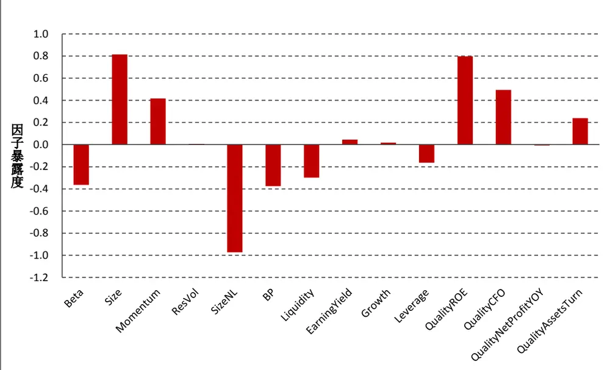
数据来源：财通证券研究所，恒生聚源

图 2：北上资金持股在基本面因子上的暴露时序图（2016.12.9-2020.2.5）
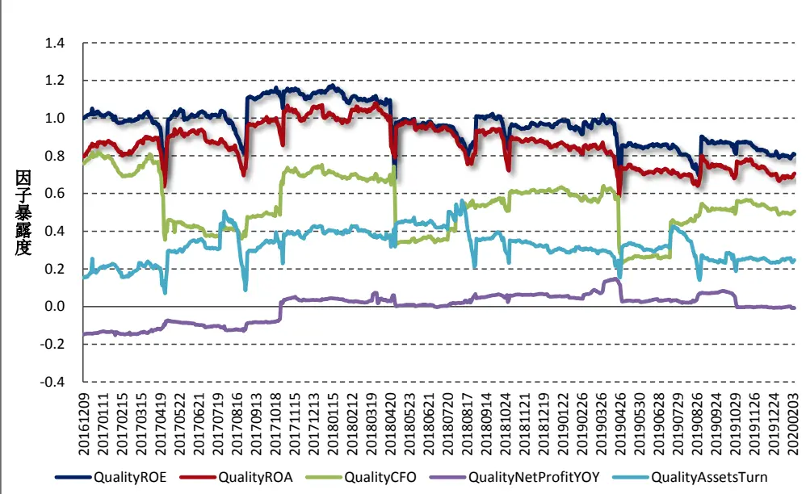
数据来源：财通证券研究所，恒生聚源

除了市场广为关注的“聪明钱”——北上资金外，国内公募基金在 2019 年持续抱团核心资产的情况也一度引领了市场风格。我们在每个季度根据全市场所有偏股型和混合型基金披露的持仓明细构建了公募基金持股组合，并观察其在各个因子上的暴露大小，结果如图 3 和图 4 所示。可以看到，公募基金持仓组合在市值、动量上的正向暴露及在 上的负向暴露十分明显，这从侧面展现出了“机构抱团”的成功——核心资产的持续上涨导致其动量 Mom 及估值 PB进一步推高。与北上资金持股组合类似，公募基金持股组合在盈利能力、成长能力、现金流量及营运能力上均有着非常明显的正向暴露，这进一步说明了挖掘质量优异的公司在当今机构化程度不断提升的 A股市场具有非常重要的意义。

图 3：偏股型及混合型基金持仓风格因子暴露度（2019 三、四季度）
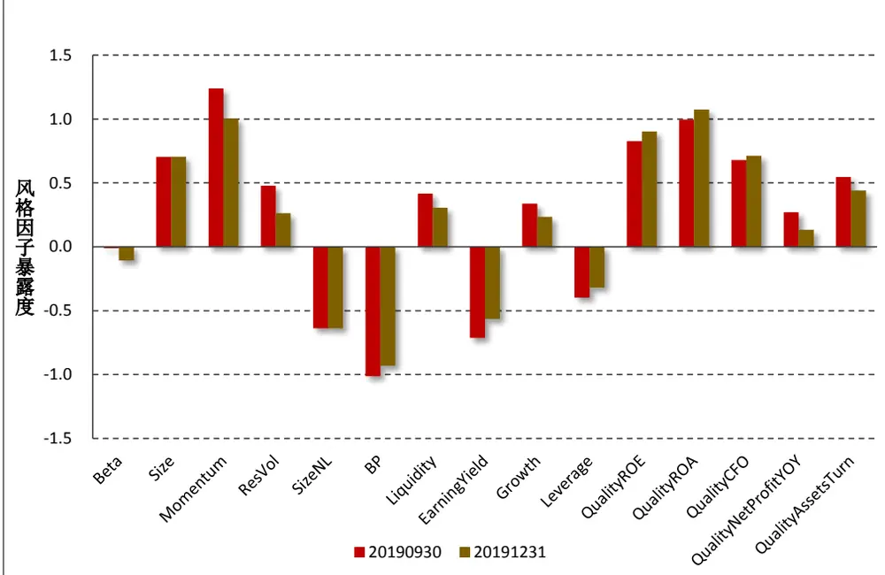
数据来源：财通证券研究所，恒生聚源

图 4：偏股型及混合型基金持仓风格因子暴露时序图（2011.9.30-2019.12.31）
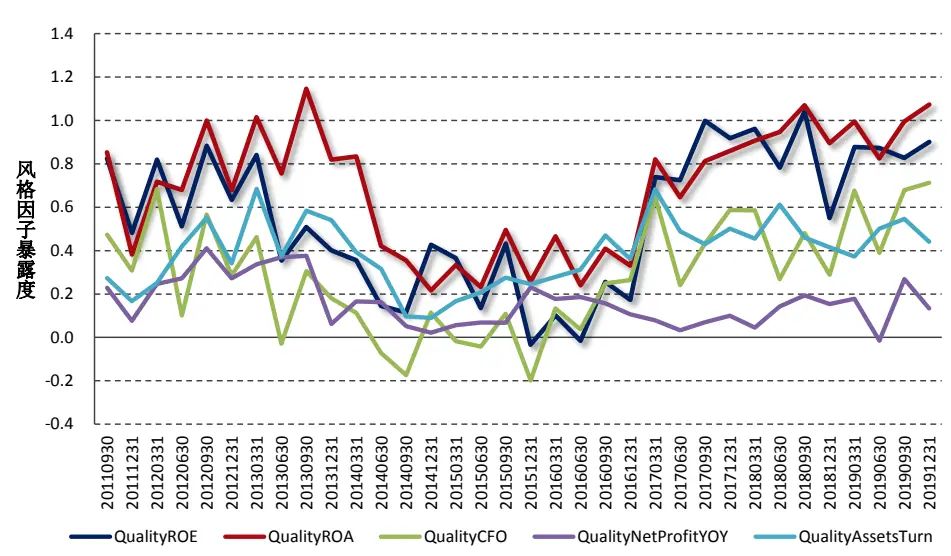
数据来源：财通证券研究所，恒生聚源

## 2、 质量因子的定义

提起量化投资，最先映入脑海的可能会是詹姆斯·西蒙斯（James Simons）。而说到价值投资，最为耳熟能详的则莫过于本杰明·格雷厄姆（Benjamin Graham）、沃伦·巴菲特（Warren Buffett）以及查理·芒格（Charlie Munger）。如果说量化研究者主要根据数据和模型构建出未来大概率会上涨或下跌的组合，那么价值投资研究者的主要工作则是挖掘市场上最具潜力的优秀公司。巴菲特在其 1989 年致股东信中曾说过的一句话也许表达了价值投资的精髓：

“It’s far better to buy a wonderful company at a fair price than a fair company at a wonderful price.”

可以看到，价值投资并非一味地去买入市场中估值最低的股票，因为这通常会陷入“价值陷阱”——投资者之所以给予这些公司更低的估值，通常是因为这些公司的基本面实在很难看得过去。特别在当下的 A股市场，自从 2019 年以来机构抱团的核心资产一路上涨致使其估值不断推高，从而导致传统的 因子出现明显的回撤。由此我们也可以看到，价值投资者也并非一味地关注公司的估值情况，公司本身是否足够优秀理应成为影响投资决策更为关键的因素。那么，如何从基本面上定义一家公司是否足够好呢？Novy-Marx（2014）总结了格雷厄姆的 7 个选股准则：

（1） 公司规模需要足够大，从而可以应对经济波动；

（2） 财务状况良好：流动比率需大于 2、流动资产净额需超过长期负债；

（3） 盈利稳定性：过去 10 年每年都要盈利；

（4） 过去 20 年每年都要分红；

（5） 过去 10 年 EPS 累计增长至少超过 33%；

（6） PE不超过 15 倍

（7） PB不超过 1.5 倍。

在如上所述的 7 个条件中，条件 1-5 用于确保投资者投资的是“足够好”（wonderful company）的公司，而条件 6-7 则保证这些公司不至于太贵（fair price）。然而，对于量化投资者而言，如上的7 个条件都设置了相对固定的参数，这实在是一件很让人难受的事情——由于市场的不断变化以及中美市场之间的较大差异，这些固定的参数也许并不适用于各个市场，不过这些指标至少给予了我们一些有意义的参考。

Frazzini（2013）在《Buffett’s Alpha》中，通过量化手段剖析了巴菲特持仓组合的 Alpha 来源，发现其主要收益来自于购买安全的（Safety，对应于低 Beta、低波动股票）、便宜的（Cheap，对应于低 PB股票）以及质优的（Quality，对应于高质量得分）的股票。那么，如何定义一家公司的质量是否优秀呢，目前国内学术界和业界的绝大多数研究都是通过借鉴 Asness（2019）构建的 QMJ 因子（Quality-Minus-Junk），从盈利性、成长性、安全性及偿付能力四个角度构建综合指标，测试其在 A 股市场上的有效性后即戛然而止。在我们本期专题中，我们同样选择站在巨人的肩膀上，对质量因子进行进一步拓展，关于其定义和计算我们将在下一章节中进行详细阐述。

现在我们将目光转向国内，目前 A 股市场有关“质量”概念的指数型产品并不多，表 1 总结了中证指数公司发布的与质量相关的几个指数。通过查阅相关产品的编制方式可以看到，中证指数公司质量相关指数主要通过如下几个方面对样本股进行筛选：

（1） 盈利稳定性：通过盈余波动率计算

（2） 盈利能力：ROE、ROA等

（3） 成长能力：过去四个财务季度净利润增速/PE（TTM）

（4） 盈余质量：MAccural

（5） 杠杆率：过去 1 年经营活动现金流量/最新财报总负债。

表 1：中证指数公司质量相关指数

| 指数代码 | 指数名称 | 成分股数量 | 地区 | 发布时间 | 2017年收益 | 2018年收益 | 2019年收益 | 2020年收益 |
| --- | --- | --- | --- | --- | --- | --- | --- | --- |
| 930855.CSI | CS质量 | 100 | 境内 | 2016/7/12 | -4.26% | -30.82% | 29.22% | 5.04% |
| 930860.CSI | 盈利质量 | 100 | 境内 | 2016/7/12 | -8.71% | -30.58% | 18.01% | 5.58% |
| 931062.CSI | 质量低波 | 50 | 境内 | 2018/1/22 | 23.37% | -25.27% | 32.80% | 4.88% |
| 930939.CSI | 500 质量 | 100 | 境内 | 2018/11/21 | 15.55% | -29.78% | 35.62% | 4.89% |
| 931149.CSI | 环境质量 | 50 | 境内 | 2019/1/31 | 7.54% | -45.92% | -2.02% | 7.92% |
| 931150.CSI | 绿色质量 | 100 | 境内 | 2019/1/31 | 12.14% | -36.56% | 24.83% | 9.72% |
| 931155.CSI | 300质量 | 50 | 境内 | 2019/4/22 | 24.01% | -21.54% | 31.82% | -0.63% |
| 931156.CSI | 800质量 | 150 | 境内 | 2019/4/22 | 20.49% | -26.20% | 36.01% | 0.50% |
| 931375.CSI | 300 质量低波 | 50 | 境内 | 2019/11/25 | 33.93% | -13.85% | 23.38% | -6.07% |
| 930856.CSI | HK质量 | 49 | 境外 | 2016/7/12 | 43.09% | -16.28% | 10.77% | -5.33% |
| 930861.CSI | 香港EQ | 99 | 境外 | 2016/7/12 | 35.85% | -14.69% | 6.31% | -5.68% |
| 930858.CSI | 沪港深质量 | 100 | 跨境 | 2016/7/12 | 1.37% | -17.34% | 21.72% | 2.06% |
| 930863.CSI | 沪港深 EQ | 100 | 跨境 | 2016/7/12 | -3.77% | -28.69% | 16.69% | 3.63% |
| 930878.CSI | 中国质量成长 | 100 | 跨境 | 2016/8/18 | 30.63% | -24.59% | 35.96% | 0.12% |
| 930880.CSI | 中国盈利质量 | 100 | 跨境 | 2016/8/18 | 22.15% | -23.18% | 20.65% | 3.33% |
| 931341.CSI | 大湾区高质发展 | 100 | 跨境 | 2019/10/18 | 50.70% | -21.36% | 34.55% | -1.11% |
| 931452.CSI | 大湾区质量成长均衡 | - | 跨境 | -- |  |  |  |  |
| 基准指数 |  |  |  |  |  |  |  |  |
| 000016.SH | 上证 50 指数 | 50 | 境内 | 2004/1/2 | 25.08% | -19.83% | 33.58% | -4.63% |
| 000300.SH | 沪深 300 指数 | 300 | 境内 | 2005/4/8 | 21.78% | -25.31% | 36.07% | -0.13% |
| 000905.SH | 中证500 指数 | 500 | 境内 | 2007/1/15 | -0.20% | -33.32% | 26.38% | 8.40% |
| 000985.CSI | 中证全指 | -- | 境内 | 2011/8/2 | 2.34% | -29.94% | 31.11% | 4.37% |

数据来源：财通证券研究所，中证指数公司

遗憾的是，通过观察各类指数近几年的收益情况，我们并没有发现中证指数公司编制的质量指数相对基准指数而言展现出稳健的超额表现。究其原因，财通金工认为还是指数的编制规则本身较为粗糙造成的。无论是前面提到的平均盈余会计（MAccural）还是净利润增速/PETTM，在我们的单因子回测过程中，相关因子对股票未来收益并未展现出单调的分层特征。这也进一步提醒我们，在进行质量指数的编制之前，必须要先确认纳入体系的筛选规则本身是有逻辑同时有实证支撑的。

## 3、 质量因子有效性检验

本部分我们借鉴 Asness（2019）构建的质量因子体系，从盈利性、成长性、安全性及偿付能力出发，检验各类单项因子在 A 股市场上的有效性，并最终将其合成为综合质量因子。

## 3.1 盈利性（Profitability）

公司的盈利能力是反映公司投资价值最为重要的财务指标，一家无法为股东创造利润的公司在长期来看很难称得上是一家“好”的公司。在财务分析的相关研究中，关于公司盈利能力的度量指标五花八门，但基本上绕不开利润、资产、权益这几项关键指标。

表 2：盈利性指标计算说明

| 大类因子 | 子类因子 | 简称 | 计算方式 |
| --- | --- | --- | --- |
| 盈利性 | 净资产收益率 ROEQ | Return on Equity | 归属母公司股东净利润/期末归属母公司股东的权益X100% |
|  | 总资产收益率 ROAQ | Return on Assets | 净利润（含少数股东损益）/（期初总资产+期末总资产）×2×100% |
|  | 总资产毛利率 GPOAQ | Gross Profit over Assets | （营业收入-营业成本）/（期初总资产+期末总资产）×2×100% |
|  | 销售毛利率 GMARQ | Gross Profit M argin | （营业收入-营业成本）/营业收入×100% |

数据来源：财通证券研究所，Asness（2019）

如表 2 所示，我们采用净资产收益率 ROEQ、总资产收益率 ROAQ、总资产毛利率 GPOAQ 以及销售毛利率 GMARQ 来衡量公司的盈利能力。关于各项指标背后的实际含义，我们将在后续的基本面量化专题报告中进行详细比较，此处我们需要说明的有如下几点：

（1） 之所以每个指标的简称均以“Q”为结尾，是因为本文中所有指标的计算均以单季度数据为基础数据。财通金工认为，单季度数据比累计数据更能反映公司当下的业绩表现情况，这种短期业绩冲击对股价带来的影响在 A股市场是尤为显著的。在财通金工“星火”专题（11）《在下跌中寻找惊喜：业绩超预期与反转因子的融合》中，我们介绍了单季度数据计算时需要注意的细节，可供感兴趣的投资者参考。

（2） 在 ROEQ、ROAQ 及 GPOAQ 的计算中，分子采用的数据均来源于利润表，而分母采用的数据均来源于资产负债表。由于利润表反映的是区间流量的财务信息，而资产负债表反映的是单个时点的财务状况，因此在计算净利润、毛利润时，我们需要将其处理为单季度数据，而在使用股东权益、总资产数据时，我们只需提取当前时点对应的值即可，不可以也没有必要计算这一个区间内的权益及总资产的增长。

（3） 在 ROEQ 和 ROAQ 的计算中，我们参照 Wind 中的做法，分子分别采用归属母公司股东净利润（NPParentCompanyOwners）和含少数股东损益的净利润（NetProfit）。由于前者的分子是不含少数股东损益的，因此前者的分母使用的是期末归属母公司股东的权益（SEWithoutMI），后者的分母则采用期初和期末总资产的平均值。

（4） 在Wind中，当ROE计算的是累计区间内的值时（如前三季度ROE），期初及期末总资产分别对应的是去年年末及三季度末的总资产，而我们在计算单季度 ROE时，期初总资产及期末总资产对应的则应该是上一个季度及本季度末的总资产，这一点需要特别注意。

接下来我们将对上述所选因子进行有效性检验，具体细节如下：

因子预处理：在横截面上将因子对个股行业及市值进行正交化处理

回测时间：2005.1.31-2020.2.28，月度调仓

回测样本：Wind 全 A样本股

样本筛选：剔除上市时间少于 100 天、剔除调仓日停牌一天、剔除 ST、*ST、PT 等被标为风险预警的股票、剔除调仓日涨停或者跌停的股票

调仓时间：每月最后一个交易日

分组方式：按照因子值从小到大分 10 组（D0-D9），每组成分股进行等权处理，因子值最大的组别即为 D9 组，因子值最小的组别即为 D0 组基准指数：每期满足条件的样本股收益等权平均

手续费：单边 3%

表 3：盈利类因子回测绩效（2005.1.31-2020.2.28）

| 所选因子 | RankIC均值 | RankICT值 | RankIC月胜率 | RankICIR | 对冲组合年化收益 | 对冲组合年化波动 | 对冲组合年化IR | 对冲组合最大回撤 | 对冲组合月胜率 | 多头年化超额 | 空头年化超额 |
| --- | --- | --- | --- | --- | --- | --- | --- | --- | --- | --- | --- |
| ROEQ | 3.63% | 4.53 | 62.34% | 1.26 | 14.19% | 11.00% | 1.29 | 13.99% | 67.53% | 8.18% | -8.23% |
| ROAQ | 3.50% | 4.26 | 61.33% | 1.10 | 11.99% | 12.77% | 0.94 | 18.59% | 61.33% | 6.68% | -9.21% |
| GPOAQ | 3.36% | 4.67 | 62.43% | 1.20 | 11.69% | 11.47% | 1.02 | 21.87% | 64.09% | 7.73% | -7.62% |
| GMARQ | 1.57% | 2.78 | 59.67% | 0.71 | 6.39% | 8.93% | 0.72 | 12.63% | 60.22% | 3.68% | -5.09% |

数据来源：财通证券研究所，恒生聚源

表 3 展示了盈利类因子在全样本区间内的回测表现，可以看到4 个因子均展现出一定的选股能力，RankIC 的 T 值均大于 2，对冲组合的月度胜率在 60%以上。进一步的，图5 至图8 分别展现出了各个因子的具体回测表现，其中上下左右分别展示的是：因子 RankIC 时序图、各分组相较基准组合的年化超额收益、多空对冲组合的净值走势以及多头相较基准组合的超额净值走势。

可以看到，ROEQ、ROAQ 及 GPOAQ 展现出较好的稳定性，各组相较基准指数的超额收益单调性良好。此外，各类因子的多头组合在 2019 年展现出良好且持续的超额稳定性。不过注意的是，无论是从多空对冲组合还是从多头相较基准的超额净值来看，各类盈利因子在 2014-2015 年均出现了明显的回撤。

图 5：ROEQ因子样本内表现
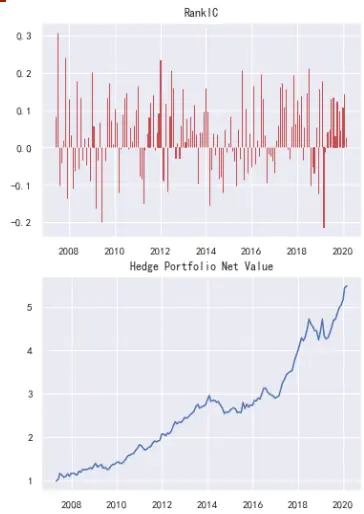
数据来源：财通证券研究所，恒生聚源

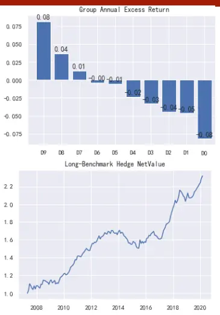

图 6：ROAQ因子样本内表现
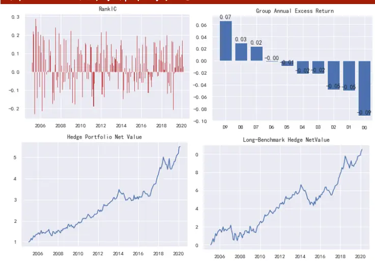
数据来源：财通证券研究所，恒生聚源

图 7：GPOAQ 因子样本内表现
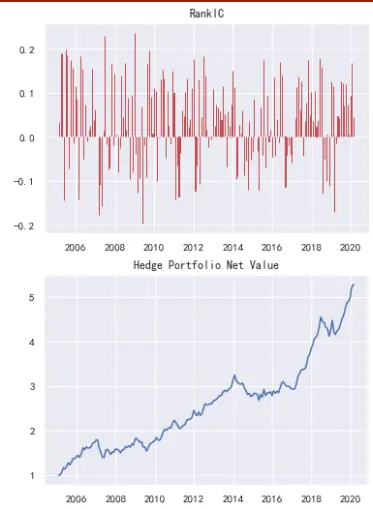
数据来源：财通证券研究所，恒生聚源

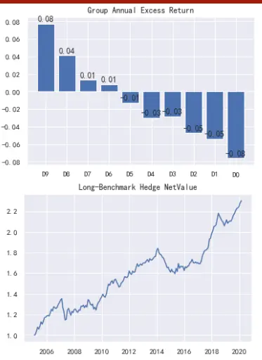

图 8：GMARQ 因子样本内表现
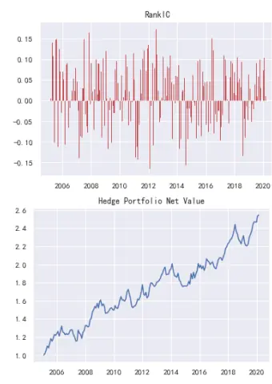
数据来源：财通证券研究所，恒生聚源

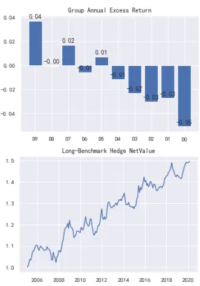

## 3.2 成长性因子（Growth）

盈利性指标反映的是公司在过去一段时间创造利润的能力，这样的能力是否能够持续，则需要通过上市公司的成长能力来衡量。强劲的成长能力说明公司的经营状况得到了极大的改善或者公司本身处于高速增长阶段，因此未来的现金流及盈利情况超过预期的比例也将会大大提高。

表 4：成长性指标计算说明

| 大类因子 | 子类因子 | 代号 | 计算方式 |
| --- | --- | --- | --- |
| 成长性 | ROEQ 同比增长 dROEQ | Growth in ROEQ | (t 期归母净利润 - t-1 期归母净利润) /t-1 期归属母公司股东权益×100% |
|  | ROAQ 同比增长 dROAQ | Growth in ROAQ | (t 期归母净利润 - t-1 期归母净利润) /t-1 其总资产×100% |
|  | GPOAQ 同比增长 dGPOAQ | Growth in GPOAQ | (t 期毛利润 - t-1 期毛利润) /t-1 期总资产，其中毛利润 = 营业收入-营业成本 |
|  | GMARQ 同比增长 dGMARQ | Growth in GMARQ | (t 期毛利润 - t-1 期毛利润) /t-1 期营业收入，其中毛利润 = 营业收入-营业成本 |

数据来源：财通证券研究所，Asness（2019）

既然成长能力反映的是公司盈利能力是否能够持续，那么我们即可以盈利性指标的计算为基础，通过计算其相较上年同期数据的同比增长情况，作为公司成长能力的代理指标，具体方式如表 4 所示，此处我们作如下几点说明：

（1）一般来讲，在计算成长性指标时，我们习惯采用同比增长率数据，将本期值除以去年同期值再减 1，但当去年同期值出现负数或者基数过小时，通过如上方法计算得到的同比增长率数据将更容易出现过大或者过小的极端值。为了解决这一情况，我们参照 Asness（2019）的做法，分子采用计算盈利性指标时所采用的分子的增量值，分母则采用计算盈利性指标时采用的分母对应的 t-1 期值。

（2） 以 ROEQ 因子为例，由于其衡量的是单位归母股东权益所能带来的公司净利润大小，因此 dROEQ 的计算即衡量的是单位归母股东权益所能带来的公司净利润增长值大小。

（3） 在 ROAQ 和 GPOAQ 的计算中，分母采用的是期初总资产和期末总资产的平均。在计算成长性指标时，为了数据处理的简便性，分母采用 t-1 期总资产即可。

表 5：成长类因子回测绩效（2005.1.31-2020.2.28）

| 所选因子 | RankIC均值 | RankICT值 | RankIC月胜率 | RankICIR | 对冲组合年化收益 | 对冲组合年化波动 | 对冲组合年化IR | 对冲组合最大回撤 | 对冲组合月胜率 | 多头年化超额 | 空头年化超额 |
| --- | --- | --- | --- | --- | --- | --- | --- | --- | --- | --- | --- |
| dROEQ | 4.28% | 6.82 | 73.03% | 1.77 | 15.15% | 9.21% | 1.65 | 9.72% | 71.35% | 7.40% | -10.29% |
| dROAQ | 4.25% | 6.61 | 71.91% | 1.72 | 15.01% | 9.21% | 1.63 | 8.16% | 71.35% | 7.99% | -9.73% |
| dGPOAQ | 4.65% | 7.33 | 70.22% | 1.90 | 18.31% | 9.43% | 1.94 | 10.66% | 73.60% | 10.74% | -10.44% |
| dGMARQ | 4.21% | 7.31 | 72.47% | 1.90 | 15.30% | 8.00% | 1.91 | 7.45% | 73.60% | 7.87% | -9.59% |

数据来源：财通证券研究所，恒生聚源

表 5 展示了成长类因子在全样本区间内的回测绩效，可以看到与盈利性指标相比，成长类因子在全样本区间内的表现大幅提升。其中，各类因子的 RankIC均值能够达到 4%以上，RankIC-T 值均达到6 以上，RankICIR 在 1.7 以上，这在基本面因子中是非常突出的表现。此外，重点观察表 5 中的最后两列，成长性因子多头相较基准的年化超额收益保持在 7%以上，说明多头组合的 Alpha 效应也较为可观。

图 9：dROEQ 因子样本内表现
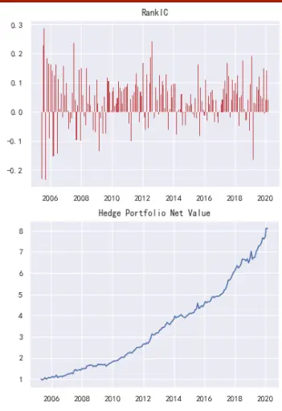
数据来源：财通证券研究所，恒生聚源

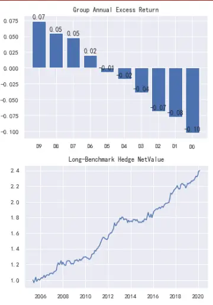

图 10：dROAQ 因子样本内表现
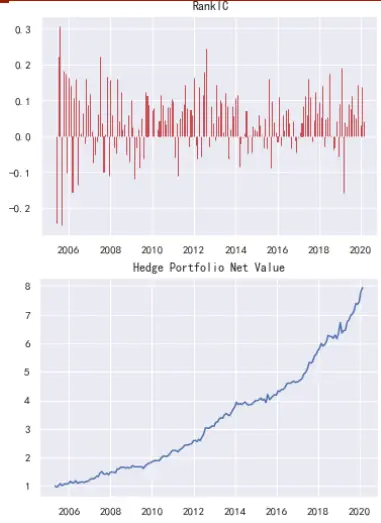
数据来源：财通证券研究所，恒生聚源

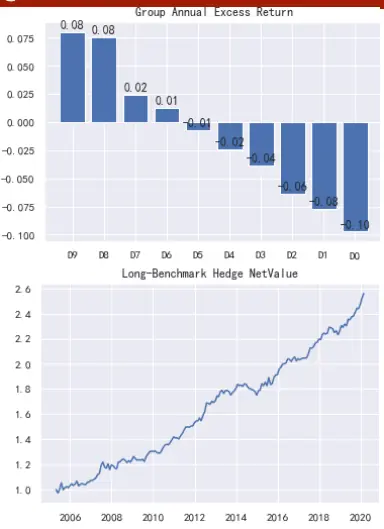

图 11：dGPOAQ 因子样本内表现
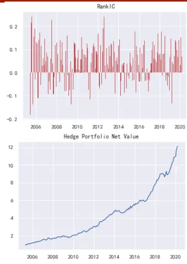
数据来源：财通证券研究所，恒生聚源

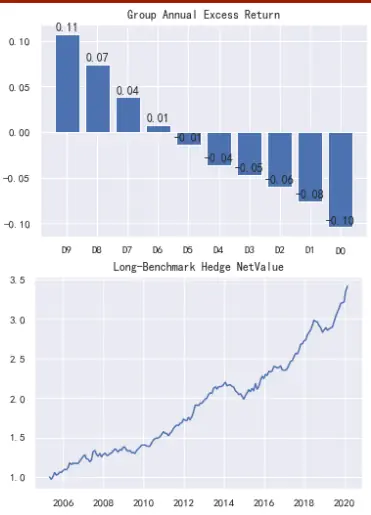

图 12：dROAQ 因子样本内表现
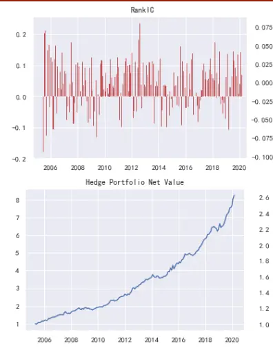
数据来源：财通证券研究所，恒生聚源

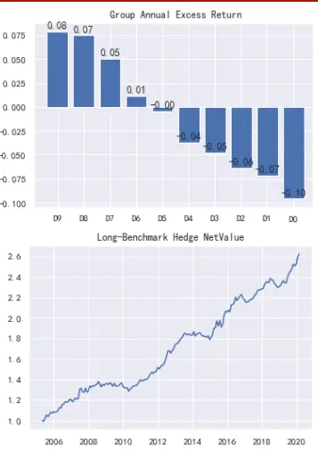

图 9 至图 12 展示了四类因子在回测样本中的具体表现情况，从十分组的单调性可以看到，各类因子对于股票未来收益的分层情况十分稳健。在全样本区间内，因子多空组合的累计净值也并没有出现明显的回撤。不过值得注意的是，盈利因子在 2014 年出现了较大的回撤，成长类因子的多头相较基准的超额收益在年也出现了同样的回撤。

## 3.3 安全性（Safety）

财务安全性反映的是公司经营质量情况，以防公司发生暴雷风险。在 Asness（2019）中，其采用 Beta、特质波动率及杠杆率指标衡量公司的安全性。的确，从直观感觉上来讲，低 Beta、特质波动率较低的股票在股价上的抗风险能力更强，但我们认为这些指标反映的主要是二级市场投资者的交易情绪，并不能直接反映公司本身财务状况的好坏。

表 6：安全性指标计算说明

| 大类因子 | 子类因子 | 代号 |  |
| --- | --- | --- | --- |
|  |  |  | 计算方式 |
| 安全性 | 负Beta | Beta | 参见“星火”（十）《如何对Beta因子进行稳健估计？》 |
|  | 负特质波动率 | IVOL | 将个股过去1个月收益对Fama-French三因子进行时序回归，计算残差波动率 |
|  | 负杠杆率 | MLEV | （总市值+非流动负债)/总市值 |

数据来源：财通证券研究所,Asness（2019）

图13展示了MLEV因子样本内表现，可以看到其并非是理想的Alpha因子。多头相较基准指数的年化超额收益仅为 3%，多空对冲组合的净值也并不稳定。直观上来讲，公司杠杆率越小说明公司越安全，但 MLEV 的 RankIC均值为正，作为选股因子而言我们更容易选出杠杆率高的公司，这与我们的初衷并不相符。

表 7：安全类因子回测绩效（2005.1.31-2020.2.28）

| 所选因子 | RankIC均值 | RankICT值 | RankIC胜率 | RankICIR | 对冲组合年化收益 | 对冲组合年化波动 | 对冲组合年化IR | 对冲组合最大回撤 | 对冲组合月胜率 | 多头年化超额 | 空头年化超额 |
| --- | --- | --- | --- | --- | --- | --- | --- | --- | --- | --- | --- |
| MLEV | 1.45% | 2.59 | 55.25% | 0.67 | 4.28% | 9.65% | 0.44 | 21.56% | 51.93% | 3.32% | -2.07% |

数据来源：财通证券研究所，恒生聚源

图 13：市场杠杆率 MLEV因子样本内表现
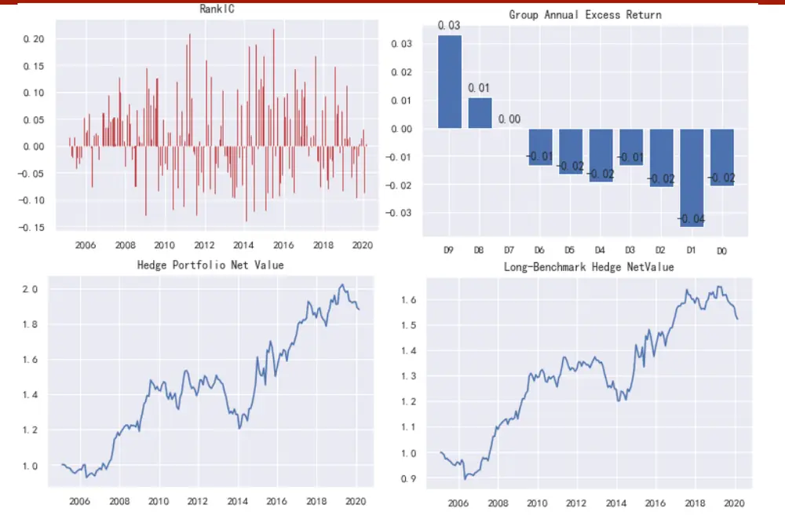
数据来源：财通证券研究所，恒生聚源
谨请参阅尾页重要声明及财通证券股票和行业评级标准

## 3.4 偿付能力（Payout）

公司的偿付能力（也称股利支付率、分红率）是指上市公司所创造的利润中分配给股东的比例。现代上市公司的经营通常会面临代理问题（Agency Problem），即公司经理人与公司股东之间的利益不完全一致。不过，当公司的分红率越高时，说明公司的经营管理层对股东越友好，代理问题也就越弱。如表 8 所示，我们采用公司过去一年的分红金额与总市值的比值作为其偿付能力的代理变量。

表 8：偿付能力指标计算说明

| 大类因子 | 子类因子 | 代号 | 计算方式 |
| --- | --- | --- | --- |
| 偿付能力 | 股息率 | DividendRatio | 过去一年分红金额/总市值 |

数据来源：财通证券研究所,Asness（2019）

表 9 和图 14 展示了分红率因子在全样本期间的表现情况，总体来讲分红率展现出一定的选股能力，分红率最高的一组相较基准有 5%的年化超额收益，而分红率最低的一组相较基准的年化超额收益为-5%。不过进入到 2019 年，高股息的股票出现了一定的回撤，分红率因子本身的表现有一定的折扣。

表 9：偿付能力回测绩效（2005.1.31-2020.2.28）

| 所选因子 | RankIC均值 | RankICT值 | RankIC胜率 | RankICIR | 对冲组合年化收益 | 对冲组合年化波动 | 对冲组合年化IR | 对冲组合最大回撤 | 对冲组合月胜率 | 多头年化超额 | 空头年化超额 |
| --- | --- | --- | --- | --- | --- | --- | --- | --- | --- | --- | --- |
| 股息率 | 3.15% | 5.71 | 68.79% | 1.58 | 9.02% | 7.79% | 1.16 | 10.54% | 61.15% | 5.75% | -5.30% |

数据来源：财通证券研究所，恒生聚源

图 14：股息率因子样本内表现
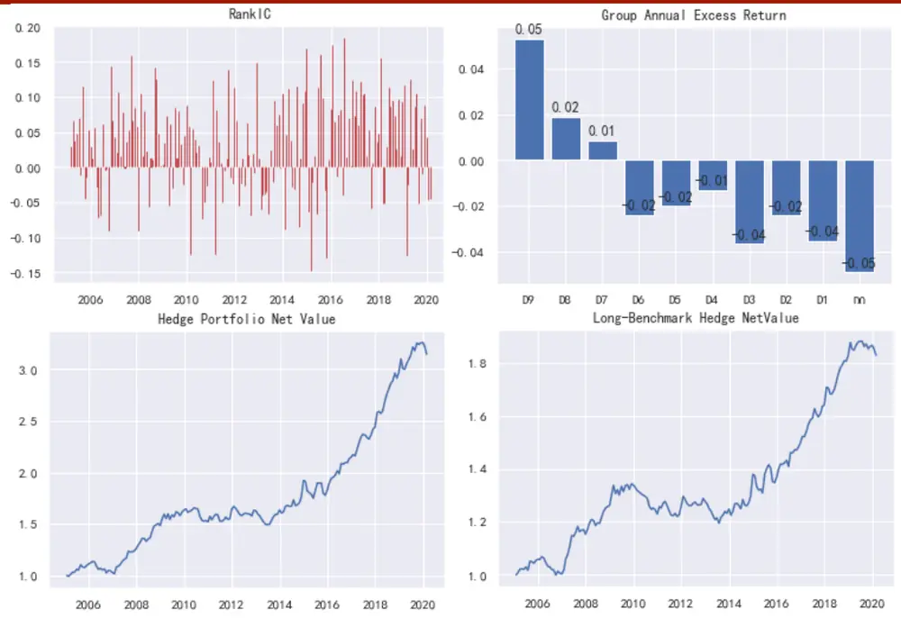
数据来源：财通证券研究所，恒生聚源

## 3.5 综合质量因子

到目前为止，我们已经从盈利性、成长性、安全性及偿付能力出发，对每个大类因子下的子类因子在 A股市场上的有效性进行了检验。表 10 展示了我们最终构建综合质量因子时所选用的子类因子，此处我们没有将安全性指标加入在内，其主要原因在于我们认为 Beta 及特质波动率更多反映的是市场交易者的情绪，而非公司本身真正的财务质量安全性，而杠杆率的选股实证结果与我们预期的“安全性”初衷存在矛盾，故此舍去。

当然，投资者最终在构建质量因子时，还可以采用其他更为有效的指标对上述框架进行补充，此处我们的选取方式只是作为一个参考。

表 10：构建综合质量因子时所选子类因子

| 大类因子 | 子类因子 | 代号 |
| --- | --- | --- |
| 盈利能力 | 单季度净资产收益率 | ROEQ |
|  | 单季度总资产收益率 | ROAQ |
|  | 单季度总资产毛利率 | GPOAQ |
|  | 单季度销售毛利率 | GMARQ |
| 成长能力 | ROEQ 同比增长 | dROEQ |
|  | ROAQ 同比增长 | dROAQ |
|  | GPOAQ 同比增长 | dGPOAQ |
|  | GMARQ 同比增长 | dGMARQ |
| 偿付能力 | 股息率 | DividendRatioTTM |

数据来源：财通证券研究所

为了与我们传统的选股框架更加贴近，我们采用 RankICIR 加权法对上述子类因子进行合成，而非 Asness（2019）中采用的简单 ZScore 加总法。本文选取2009.12.31-2020.2.28 为回测区间，将因子对行业及市值进行正交化处理。

图 15：合成质量因子多空组合对冲净值及 RankIC（2009.12.31-2020.2.28）
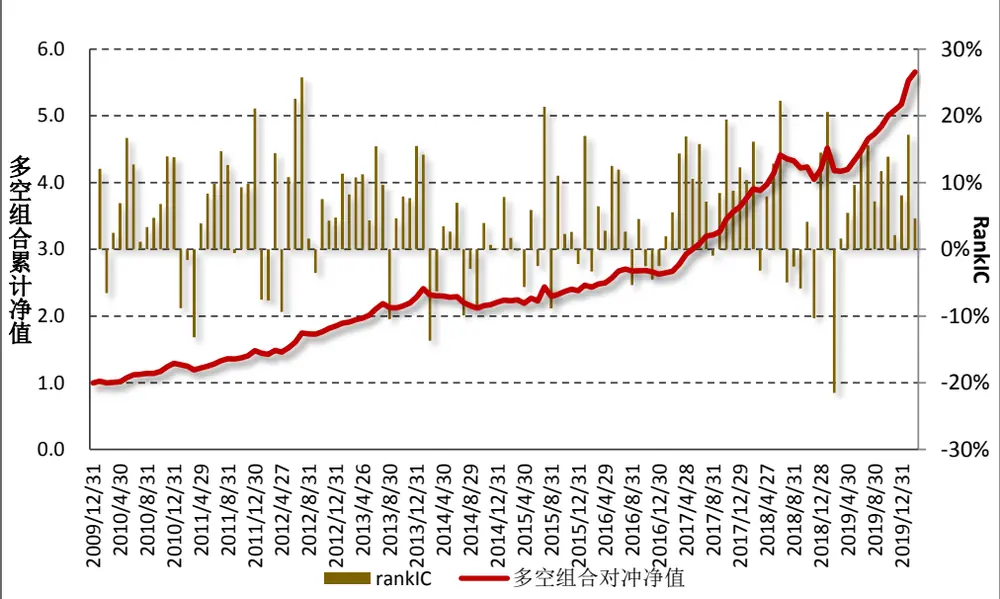

| RankIC均值 | 胜率 | T值 | RankICIR | 对冲组合年化收益 | 年化波动率 | 年化IR | 最大回撤 | 月度胜率 |
| --- | --- | --- | --- | --- | --- | --- | --- | --- |
| 5.5% | 73.8% | 6.79 | 2.13 | 18.57% | 9.86% | 1.88 | 12.25% | 70.49% |

数据来源：财通证券研究所，恒生聚源
谨请参阅尾页重要声明及财通证券股票和行业评级标准

图 15 展示了合成质量因子在全样本内的多空组合对冲净值、月度 RankIC 走势及基本的绩效表现。总体而言，对冲组合的表现较为稳定，组合月度胜率达到70.49%。不过该组合在 2014 年年初至 2015 年年底，以及 2018 年下半年出现了较为明显的回撤。回想到前述章节中对于盈利因子和成长因子的回测，可以看到子类因子同样在这两个时间段内出现了失效的情况。

图 16：综合质量因子分组年化超额收益
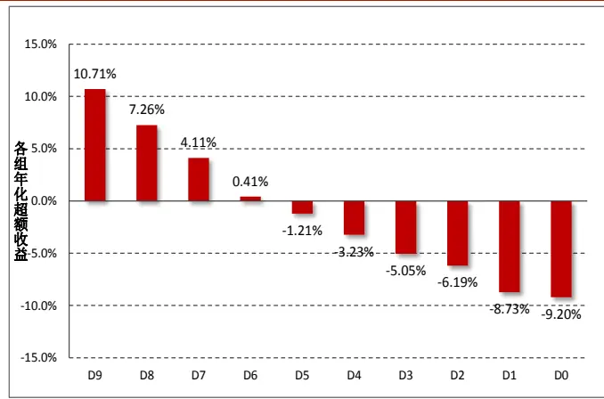
数据来源：财通证券研究所，恒生聚源

图 17：综合质量因子分组月均换手率
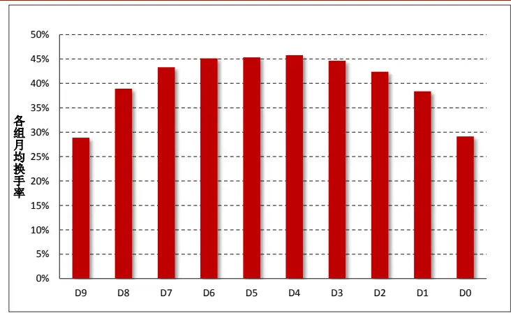
数据来源：财通证券研究所，恒生聚源

图 16 图 17 分别展示了综合质量因子的分组年化超额收益及月均换手率，从各分组的单调性来看，十组保持了较好的区分效果，多头和空头的月均单边换手率基本保持在 30%左右。

图 18：综合质量因子多头超额净值
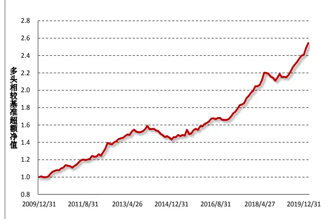
数据来源：财通证券研究所，恒生聚源

图 19：综合质量因子多头分年度超额收益
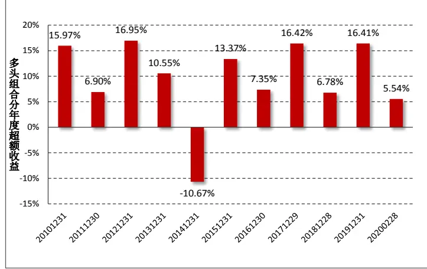
数据来源：财通证券研究所，恒生聚源

在财通金工有关 Alpha 因子研究的系列报告中，我们多次强调因子多头组合超额收益的稳健性对于该因子是否真正适合加入到策略中至关重要。本期研究也不例外，图 18 和图 19 分别展示了综合质量因子多头超额净值以及分年度的超额收益情况。可以看到，与多空组合类似，多头组合在 2014 年出现了非常明显的回撤，其相较等权基准指数落后了 10.67%，而在其他年份中多头均能够显著地跑赢基准。进一步观察 2020 年的情况，截止到今年 2月份，综合质量因子多头组合已经相较基准录得超过5.54%的收益，效果十分显著。

## 4、 从质量到质量增长：挖掘公司基本面改善带来的Alpha

到目前为止，我们参照 Asness（2019）的框架构建了综合质量因子，并对其在 A 股市场上的有效性进行了检验。由前文可以看到，综合质量因子在全样本区间表现出较好的收益区分能力，多空对冲组合及多头组合在大部分时间内均能够录得正收益。然而，受累于子类因子的集体失效，综合质量因子组合在 2014年出现了较大的回撤，从回测角度来看仍然具有一些瑕疵。

在财通金工“星火”专题（十一）《在下跌中寻找惊喜：业绩超预期与反转因子的融合》中，我们构建的业绩超预期因子的表现十分稳定。联想到业绩超预期因子的计算主要是根据其实际净利润与预期净利润之间的差值决定，其衡量的是净利润的边际改善带来的 Alpha，那么我们是否能够将同样的思路应用到质量因子的改善上呢？基于这一思想，我们构建出质量增长（Quality Increase）因子，其计算方式如下：

$$
Quality~Increase_{t}=~Quality_{t}-Quality_{t-1}
$$

可以看到，质量增长因子的计算十分简单，t月末的质量增长因子即为 t月末的质量因子与去年同期t月末的质量增长因子值的差值。

图 20：质量增长因子多空对冲组合净值及 RankIC（2009.12.31-2020.2.28）
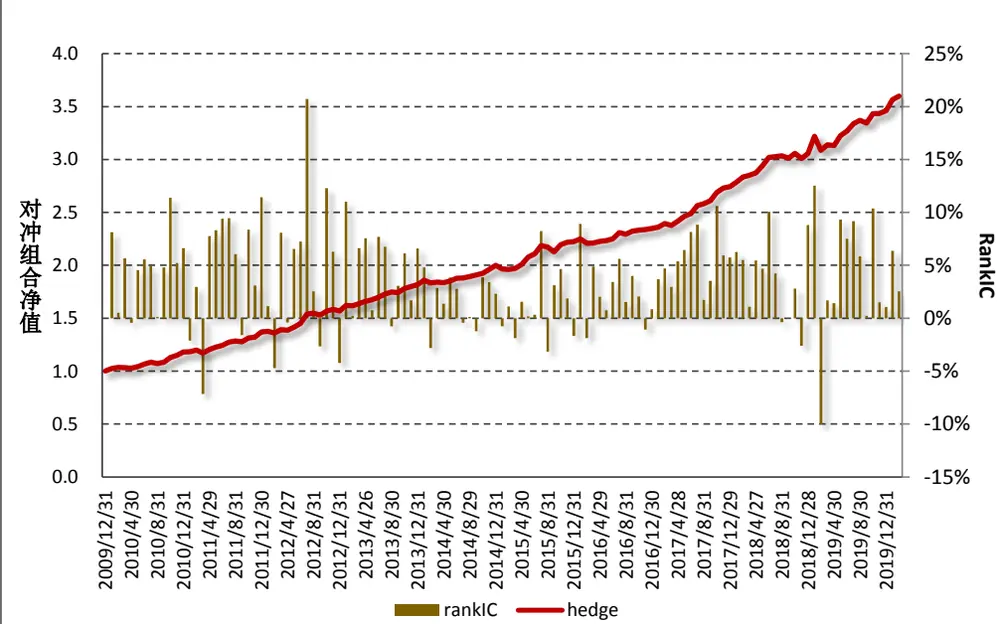

| RankIC均值 | 胜率 | T值 | RankICIR | 对冲组合年化收益 | 年化波动率 | 年化IR | 最大回撤 | 月度胜率 |
| --- | --- | --- | --- | --- | --- | --- | --- | --- |
| 3.8% | 82.0% | 9.39 | 2.95 | 13.43% | 5.28% | 2.54 | 4.07% | 79.50% |

数据来源：财通证券研究所，恒生聚源

我们将质量增长因子对行业及市值进行中性化，检验其在国内市场的选股能力，图 20 展示了该因子多空对冲净值、RankIC 时序及主要绩效指标。需要说明的是，在计算对冲组合的年化收益、波动、 等绩效指标时，我们统一根据对冲组合的月度净值进行计算，而非根据其日度净值进行计算。

很明显的，与质量因子相比，质量增长因子在收益端稍显薄弱，但其在稳定性上更胜一筹。质量增长因子的 RankIC 均值为 3.8%，低于质量因子的 5.5%，但是其胜率与 RankICIR 都要显著地更高。对于多空对冲组合而言，得益于波动率的降低，其年化 IR 达到 2.54，远胜于质量因子的 1.88，同样的其最大回撤也有明显的下降。

图 21：质量增长因子分组年化超额收益
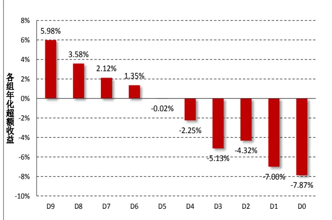
数据来源：财通证券研究所，恒生聚源

图 22：质量增长因子分组月均换手率
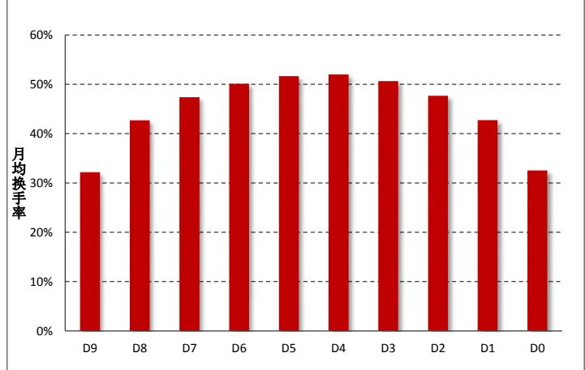
数据来源：财通证券研究所，恒生聚源

图 21 和图 22 展示了质量增长因子分组的年化超额收益及月均换手率，可以看到多头组合的年化超额收益 5.98%，不及质量因子多头 10.71%的超额表现。在换手率上，多空组合的月均换手也保持在 30%左右的水平。

图 23：质量增长因子多头超额净值
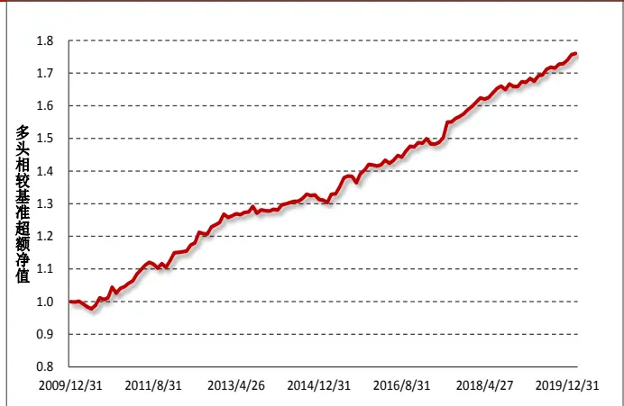
数据来源：财通证券研究所，恒生聚源

图 24：质量增长因子多头分年度超额收益
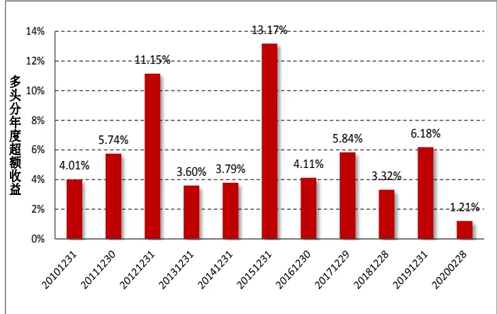
数据来源：财通证券研究所，恒生聚源

下面我们聚焦多头组合的表现情况，图 23 和图 24 展示了质量增长因子多头超额净值走势及分年度超额收益。与质量因子的多头组合相比，其在收益率的绝对大小上仍然略输一筹，但在稳定性上却明显占优。在 2010-2020 期间，各年度的超额收益均为正，即便是在质量因子出现大幅回撤的 2014 年，该组合的收益依然较为平稳。

## 5、 质量与质量增长的结合

到目前为止，我们对质量因子与质量增长因子在 A 股市场上的表现进行了完整的回顾。由前述分析可知，质量因子对股票未来收益的区分程度更强，但其波动和回撤相对较大，而质量增长因子尽管对股票未来收益的区分程度相对较弱，但胜在其稳定性。在本文的最后一个部分，我们将质量与质量增长因子结合起来，构建复合因子，以期将二者的优点相互集合，对二者的缺点互相弥补。

图 25：复合因子多空对冲组合净值及 RankIC（2009.12.31-2020.2.28）
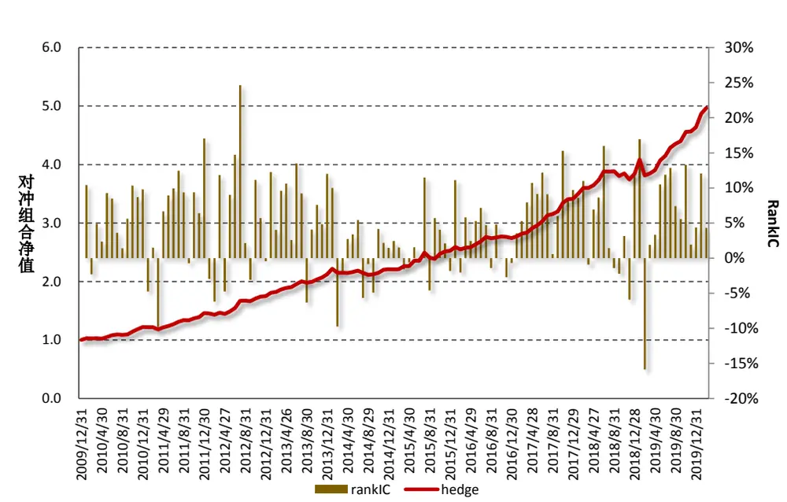

| RankIC均值 | 胜率 | T值 | RankICIR | 对冲组合年化收益 | 年化波动率 | 年化IR | 最大回撤 | 月度胜率 |
| --- | --- | --- | --- | --- | --- | --- | --- | --- |
| 4.8% | 75.4% | 8.322 | 2.61 | 17.07% | 7.23% | 2.36 | 6.67% | 77.05% |

数据来源：财通证券研究所，恒生聚源

同样的，我们采用 RankICIR 加权构建复合因子，图 25 展示了该复合因子多空对冲组合、RankIC 时序及主要绩效表现。可以看到，复合因子的 RankIC 及对冲组合 IR 均在二者之间，其多头组合的年化超额收益提高至 8.73%。

图 26：复合因子分组年化超额收益
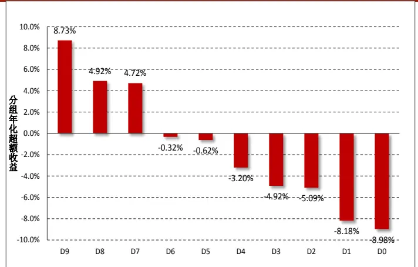
数据来源：财通证券研究所，恒生聚源

图 27：复合因子分组月均换手率
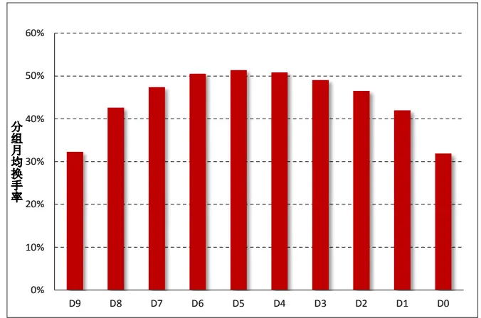
数据来源：财通证券研究所，恒生聚源

图 28：复合因子多头超额净值
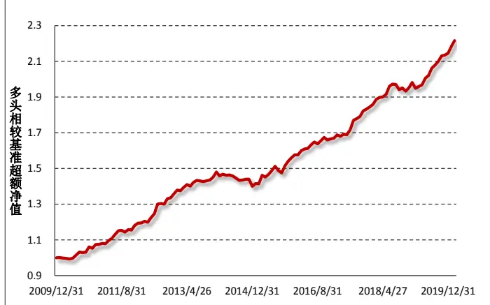
数据来源：财通证券研究所，恒生聚源

图 29：复合因子多头分年度超额收益
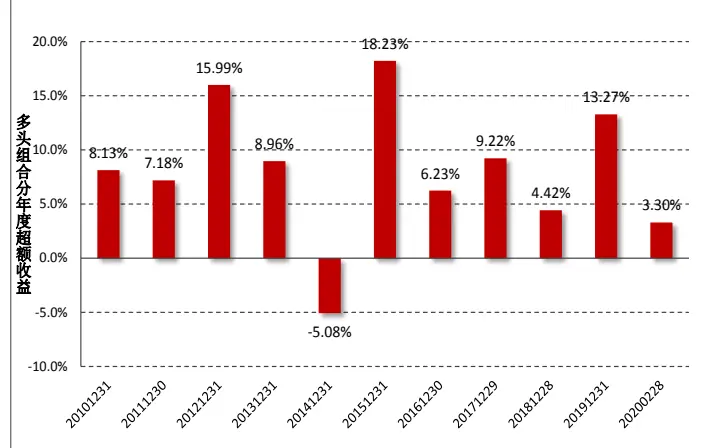
数据来源：财通证券研究所，恒生聚源

图 28 和图 29 分别展示了复合因子多头超额净值及其历年超额收益，可以看到2014年多头组合落后基准指数5.08%，这一回撤低于质量因子-10.67%的回撤，但是在其余年份复合因子都有着较好的表现，这一表现与我们 “取己之长，补彼之短”的初衷吻合。

图 30：复合因子在沪深 300和中证 500 中的分组年化超额收益
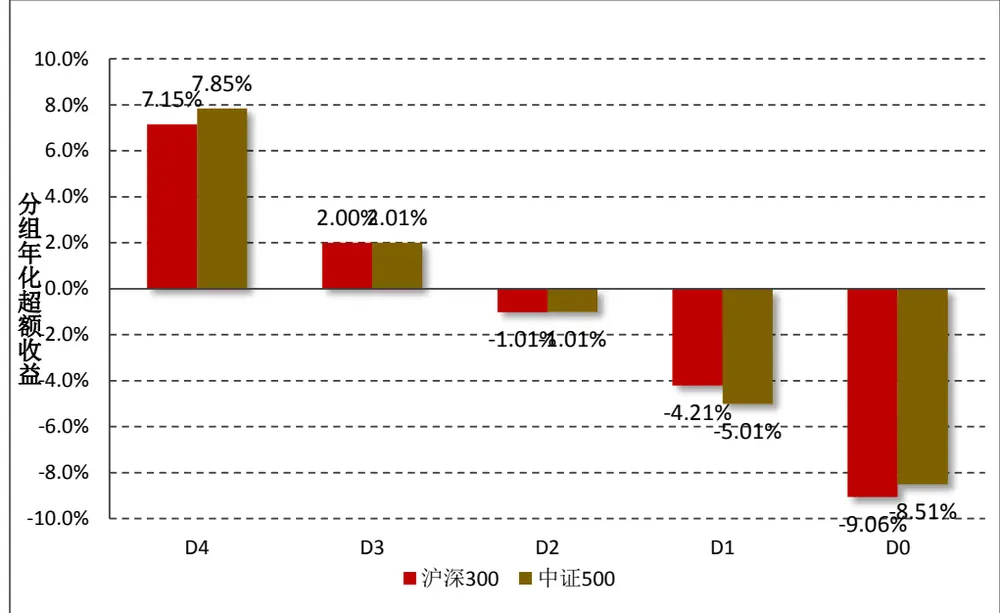
数据来源：财通证券研究所，恒生聚源

最后，我们观察复合因子在沪深 300 和中证 500 中的表现情况。先将复合因子在全样本中进行市值及行业正交化后，再在沪深 300 及中证 500 指数中分5 组进行分组，图 30 展示了 5 组年化超额收益。可以看到，无论是在沪深 300还是中证 500指数成分股中，复合因子都展现出了较好的分组单调性，其多头年化超额收益在 7%以上，空头年化超额收益在-9%以上。

图31和图32分别展示了复合因子在沪深300和中证500中的多空组合净值及多头相较基准的超额净值表现情况。可以看到，在中证 500指数成分股中，复合因子的表现接近于全样本中的表现，较为平稳，而在沪深 300中该复合因子的表现略逊一筹。

图 31：不同样本中，复合因子对冲组合净值走势
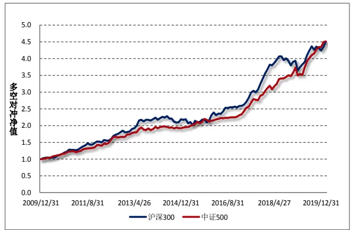
数据来源：财通证券研究所，恒生聚源

图 32：不同样本中，复合因子多头超额净值
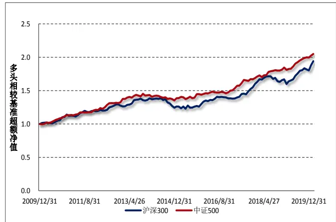
数据来源：财通证券研究所，恒生聚源

## 6、 总结与展望

随着 A股市场机构化程度的加深，价值投资的概念在 A股市场上的关注度越来越高，如何识别基本面优秀的公司成为投资者们关心的重点。当前，学术界和业界的研究更多借鉴 Asness（2019）的定义构建质量因子，并测试其在国内市场的有效性。在本期专题中，我们将研究重点从关注公司的质量（Quality）到关注公司的质量增长（Quality Increase）对其未来收益的影响情况，主要结论如下：

（1） 从北上资金持股及公募基金重仓股组合的风格因子暴露来看，机构资金更偏向于大市值、高动量、高估值的股票，且其在基本面因子上的暴露程度普遍更高；

（2） 中证指数公司编制的质量指数相较基准指数而言并未展现出良好的超额特性。这也进一步提醒我们，在进行质量指数的编制之前，必须要先确认纳入体系的筛选规则本身是有逻辑同时有实证支撑的；

（3） 借鉴 Asness（2019）的框架，我们从盈利性、成长性、安全性及偿付能力四个方面测试子类因子的有效性。最终，我们构建的复合质量因子在全样本中的RankIC达到5.5%，胜率73.8%，RankICIR2.13，多空组合的年化IR1.88，但是在2014-2015年期间的回撤较为明显；

（4） 我们参考业绩超预期因子的构建方式，发生质量因子的边际改善能够带来更为稳定的 Alpha。与质量因子相比，质量增长因子在收益端稍显落后，但在稳定性上却更胜一筹；

（5）通过将质量和质量增长因子进行融合，我们构建的复合因子 RankIC达到 4.8%，胜率 75.4%，RankICIR 达到 2.61。多空对冲组合年化 IR达到 2.36，且其多头部分能够稳定地跑赢基准。此外，复合因子在中证 500 成分股和沪深 300 成分股中分组单调性都较好，但其对冲组合及多头组合在中证 500 中的表现都更为优异。

## 7、 风险提示

多因子模型拟合均基于历史数据，市场风格的变化将可能导致模型失效。参考文献：

【1】 “Quality Minus Junk” Asness, Cliff, S., Frazzini A. and Pdeersen. Lasse. H. 2019

【2】 “Buffett’s Alpha”. Frazzini, A., Karbiller. D., and Pedersen. Lasse. H. 2013. NBER Working Paper.

【3】 “Firm’s Quality Increases and the Cross-Section of Stock Returns: Evidence From China.” Yin. Libo and Liao Huiyi. 2019. International Review of Economics and Finance.

【4】 “Quality Investing”. Novy Marx. R.(2014) Working Paper

## 信息披露

## 分析师承诺

作者具有中国证券业协会授予的证券投资咨询执业资格，并注册为证券分析师，具备专业胜任能力，保证报告所采用的数据均来自合规渠道，分析逻辑基于作者的职业理解。本报告清晰地反映了作者的研究观点，力求独立、客观和公正，结论不受任何第三方的授意或影响，作者也不会因本报告中的具体推荐意见或观点而直接或间接收到任何形式的补偿。

## 资质声明

财通证券股份有限公司具备中国证券监督管理委员会许可的证券投资咨询业务资格。

## 公司评级

买入：我们预计未来 6 个月内，个股相对大盘涨幅在 15%以上；

增持：我们预计未来 6 个月内，个股相对大盘涨幅介于 5%与15%之间；

中性：我们预计未来 6 个月内，个股相对大盘涨幅介于-5%与5%之间；

减持：我们预计未来 6 个月内，个股相对大盘涨幅介于-5%与-15%之间；

卖出：我们预计未来 6 个月内，个股相对大盘涨幅低于-15%。

## 行业评级

增持：我们预计未来 6 个月内，行业整体回报高于市场整体水平 5%以上；

中性：我们预计未来 6 个月内，行业整体回报介于市场整体水平-5%与 5%之间；

减持：我们预计未来 6 个月内，行业整体回报低于市场整体水平-5%以下。

## 免责声明

本报告仅供财通证券股份有限公司的客户使用。本公司不会因接收人收到本报告而视其为本公司的当然客户。

本报告的信息来源于已公开的资料，本公司不保证该等信息的准确性、完整性。本报告所载的资料、工具、意见及推测只提供给客户作参考之用，并非作为或被视为出售或购买证券或其他投资标的邀请或向他人作出邀请。

本报告所载的资料、意见及推测仅反映本公司于发布本报告当日的判断，本报告所指的证券或投资标的价格、价值及投资收入可能会波动。在不同时期，本公司可发出与本报告所载资料、意见及推测不一致的报告。

本公司通过信息隔离墙对可能存在利益冲突的业务部门或关联机构之间的信息流动进行控制。因此，客户应注意，在法律许可的情况下，本公司及其所属关联机构可能会持有报告中提到的公司所发行的证券或期权并进行证券或期权交易，也可能为这些公司提供或者争取提供投资银行、财务顾问或者金融产品等相关服务。在法律许可的情况下，本公司的员工可能担任本报告所提到的公司的董事。

本报告中所指的投资及服务可能不适合个别客户，不构成客户私人咨询建议。在任何情况下，本报告中的信息或所表述的意见均不构成对任何人的投资建议。在任何情况下，本公司不对任何人使用本报告中的任何内容所引致的任何损失负任何责任。

本报告仅作为客户作出投资决策和公司投资顾问为客户提供投资建议的参考。客户应当独立作出投资决策，而基于本报告作出任何投资决定或就本报告要求任何解释前应咨询所在证券机构投资顾问和服务人员的意见；

本报告的版权归本公司所有，未经书面许可，任何机构和个人不得以任何形式翻版、复制、发表或引用，或再次分发给任何其他人，或以任何侵犯本公司版权的其他方式使用。