# 从事件驱动角度看分析师评级上调带来的 Alpha

2020 年 5 月 12 日

## “星火”多因子专题报告（十三）

## 联系信息

陶勤英

## 首席分析师

SAC 证书编号：S0160517100002

taoqy@ctsec.com

021-68592393

张宇

分析师

SAC 证书编号：S0160519120001

zhangyu1@ctsec.com

17621688421

021-68592337

## 相关报告

【1】“星火”多因子系列（一）：《Barra模型初探：A 股市场风格解析》

【2】“星火”多因子系列（二）：《Barra模型进阶：多因子模型风险预测》

【3】“星火”多因子系列（三）：《Barra模型深化：纯因子组合构建》

【4】“星火”多因子系列（四）：《基于持仓的基金绩效归因：始于 Brinson，归于 Barra》

【5】“星火”多因子系列（五）：《源于动量，超越动量：特质动量因子全解析》

【6】“星火”多因子系列（六）：《Alpha 因子重构：引入协方差矩阵的因子有效性检验》

【7】“星火”多因子系列（七）：《借因子组合之力，优化 Alpha因子合成》

【 】 星火 多因子系列（八）：《组合风险控制：协方差矩阵估计方法介绍及比较》

【 】“星火”多因子系列（九）：《博彩偏好还是风险补偿？高频特质偏度因子全解析》

【10】“星火”多因子系列（十）：《如何对Beta因子进行稳健估计？》

【 】“星火”多因子系列（十一）：《在下跌中寻找惊喜：业绩超预期与反转因子的融合》

【12】“星火”多因子系列（十二）：《从质量到质量增长：挖掘公司基本面改善带来的Alpha》

【13】“拾穗”多因子系列（五）：《数据异常值处理：比较与实践》

【 】“拾穗”多因子系列（八）：《非线性规模因子：A 股市场存在中市值效应吗？》

【15】“拾穗”多因子系列（十一）：《多因子风险预测：从怎么做到为什么》

基于特质动量因子的沪深 300 增强策略》”专业的投资研究大数据分享平台

## 投资要点：

## 概览：朝阳永续盈利预测数据库介绍

- 从报告内容上来讲，一篇典型的个股深度报告至少应该包含盈利预测、分析师评级、目标价三个方面。

- 尽管近几年来券商分析师及研究员的数量在不断走高，但分析师覆盖的公司从绝对数量和相对占比上都呈现出明显的下降趋势。

## 困境：一致预期因子近年相继回撤

- 传统来讲对于一致预期数据处理可以分为因子选股和事件驱动两个部分。

- 我们将一致预期因子划分为目标收益类、估值类、盈利类、成长类，回测发现除目标收益类数据仍有稳定的超额收益，其余类别的因子在近年均出现了一定程度的回撤。

## 破解：从事件驱动角度看分析师上调事件

- 由于分析师研究报告的发布更多地能够提升投资者对公司的短期关注度，因此从事件驱动角度考察分析师对市场造成的短期影响是一种更为直观也更符合逻辑的做法。

- 我们考察了分析师评级上调、目标价上调和盈利预测上调三种类型事件触发后个股的超额收益，发现目标价上调造成的短期冲击最为明显，分析师评级上调其次，而是否是新财富团队分析师对结果并无显著影响。

## 实践：构建事件驱动选股策略

- 我们从事件驱动角度出发，构建更为可行的月度调仓组合。

- 回测结果显示，事件驱动组合在部分年度取得了比较好的表现，买入“上调至买入评级”的个股，在 2020年相较中证全指超额收益达到 7.26%。

- 风险提示：本报告统计数据基于历史数据，过去数据不代表未来，市场风格变化可能导致模型失效。

“凡是过往，皆为序章”。在量化研究者的体系中，无论是基于交易行情产生的价量数据还是基于财务报告得到的基本面数据，都是对个股历史表现的总结，量化模型的基本假设即在于“历史将会大概率重演”。与此同时我们看到，市场上存在着大量长期跟踪个股及行业的证券分析师，他们通过对上市公司的调研、跟踪和分析，针对个股未来的业绩及估值发布研究报告，形成对公司未来表现的一致预期，对历史数据起到了良好的补充作用。

然而我们观察到，基于一致预期数据构建的选股组合正陷入困境——多空组合特别是多头组合近年来相继出现回撤。本期专题，财通金工将研究视角聚焦在分析师一致预期数据上，从一致预期估值、盈利、成长、目标收益、评级等多角度解构分析师数据，是对我们现有因子库的极大补充。此外，为了破解一致预期因子近年相继出现回撤的困境，我们从事件驱动角度关注分析师上调事件带来的Alpha 收益，考察分析师评级上调、目标价上调及盈利预测上调等多事件触发后的个股超额表现，最终构建可实践的投资组合，以供参考。

## 1、 概览：朝阳永续盈利预测数据库介绍

本文我们采用朝阳永续盈利预测数据库对分析师数据进行分析，首先带大家对分析师数据的基本框架有一个初步的了解，通过介绍分析师数据的基本要素、分类及近年来的覆盖程度，帮助大家对本文采用的基础数据有一个初步的认识。

## 1.1 初识：分析师数据的基本要素

图 1 展示了朝阳永续盈利预测数据库的基本框架，从图中可以看到，盈利预测数据主要可划分为基础库和衍生库两大部分，其中衍生库中的内容是根据基础库中的数据计算得到的。

在基础库中，最为重要的两个大类为盈利预测和一致预期两种，其中盈利预测以研究报告为单位，记录了每篇研报的详细内容。而一致预期数据则是根据盈利预测数据综合处理得到，其以“交易日+个股”为单位，通过综合不同分析师发布的研究报告形成一个统一的预期结果。

图 1：朝阳永续盈利预测数据库框架
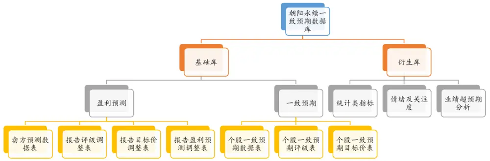
数据来源：财通证券研究所，朝阳永续

券商研究报告是分析师盈利预测数据库的基础，因此我们首先将重点关注到单篇研究报告的基础要素上。如图 2 所示，从分类上来讲研究报告主要可以划分为深度报告、一般个股报告、调研报告、点评报告、会议纪要、非个股报告（如行业报告）等不同种类，其对于个股业绩预测的可信度依次降低。

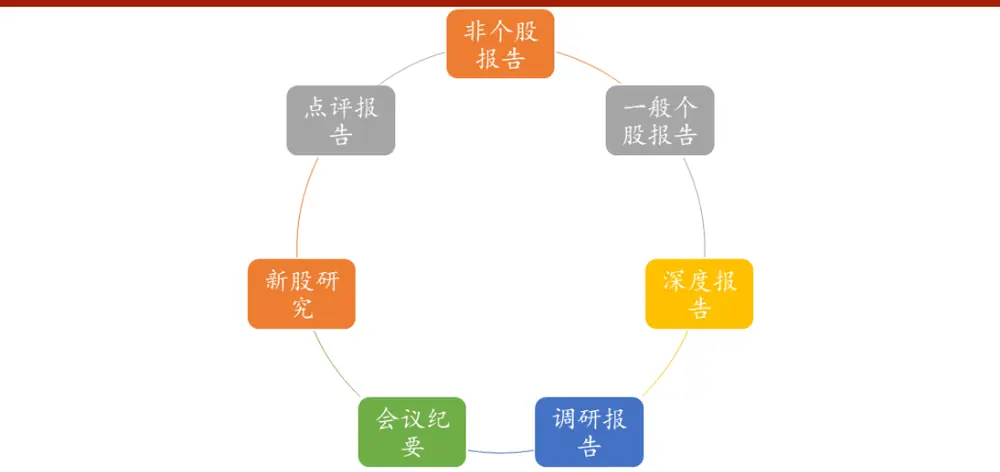
图 2：研究报告的主要分类
数据来源：财通证券研究所，朝阳永续

从报告内容上来讲，一篇典型的个股深度报告至少应该包含如下几个方面的内容：

（1） 盈利预测：是指分析师对公司在未来 N 个年度的经营指标（如净利润、营业收入等）做出预测，其中对当年情况进行预测标注为 ，对次年情况进行预测标注为 FY2。此处的“当年”是指研究报告中预测年份的最早年份，其以个股的年报实际披露日为界。例如，某公司在2020年3月4日披露年报，那么在3月4日之前，FY1为2019年，FY2 为 2020 年；在 3 月 4 日之后，FY1 为 2020 年，FY2 为 2021年；

（2） 分析师评级：是指分析师在研究报告发布之时对个股的具体评级情况，按照情绪从负面到正面的强度大小进行排序分别为：卖出、减持、中性、增持、买入；

（3） 目标价：是指分析师在研究报告发布之时对个股在未来一段时间预期的目标价格。

在量化选股领域，对于分析师一致预期数据的典型应用主要有因子选股和事件驱动两种。我们首先从因子的角度关注一致预期数据的分类情况，如图3 所示，财通金工按照传统的 Alpha 因子分类方式，将一致预期因子划分为估值类、盈利类、成长类及目标价类 4 种，其具体定义将在第二小节进行详细阐述。

图 3：一致预期因子分类
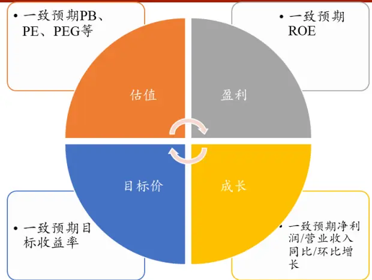
数据来源：财通证券研究所，朝阳永续
谨请参阅尾页重要声明及财通证券股票和行业评级标准

## 1.2 头部集中：分析师覆盖绝对数量及相对占比不断走低

在对分析师数据有一个框架性的认识之后，本部分我们考察分析师数据在股市场上的覆盖程度。如果某只股票在过去 6个月（180个自然日）中有券商分析师对其当年净利润（FY1）进行了预测，那么我们就认为该公司被分析师覆盖。图 4 展示了 2007 年1 月 15 日至 2020年 4月 30 日期间，Wind 全 A成分股中有分析师覆盖的个股绝对数量及其相对占比。

可以看到，尽管近几年来券商分析师及研究员的数量在不断走高，但分析师覆盖的公司从绝对数量和相对占比上都呈现出明显的下降趋势。究其原因，一方面是由于国内 IPO 审批的提速导致 A 股市场急速扩容，另一方面则是由市场关注度和机构投资视野收缩速度的加快导致——行业分析师将研究重点放在行业龙头个股的跟踪上，这一头部集中效应在近两年尤其明显。截至 2020年 4月 30日，Wind全 A股中有分析师覆盖的个股占比约为57%，略高于全体样本的一半。

图 4：Wind 全 A 成分股分析师覆盖数量及占比走势（2007.1.15-2020.4.30）
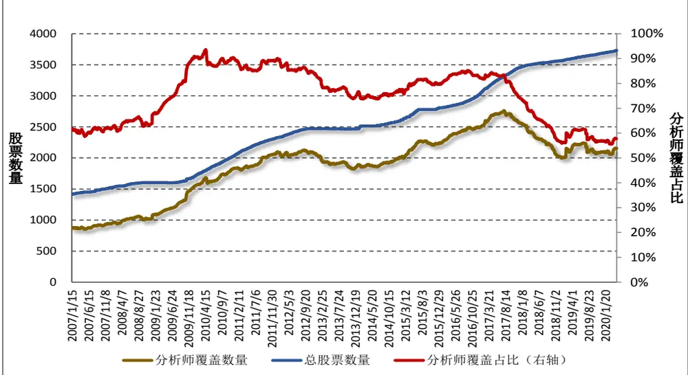
数据来源：财通证券研究所，朝阳永续

图 5：沪深 300 及中证 500 成分股中分析师覆盖占比走势（2007.1.15-2020.4.30）
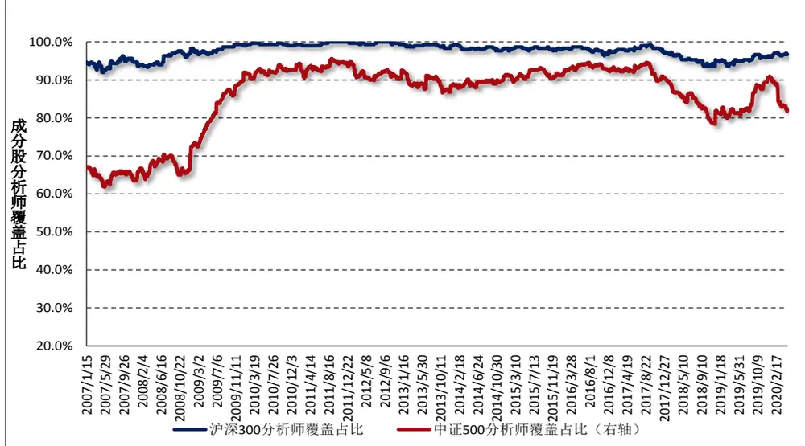
数据来源：财通证券研究所，朝阳永续
谨请参阅尾页重要声明及财通证券股票和行业评级标准

对于机构投资者而言，其关注的大部分股票集中在沪深 300 指数和中证 500指数成分股中，因此我们需要观察这两类指数成分股中券商分析师的覆盖程度。由图 5 可以看到，沪深 300 指数成分股的覆盖率基本保持在 90%以上，中证 500指数成分股的覆盖率虽然近两年也呈现出下降趋势，但其总体水平保持在 85%以上。从数据覆盖率角度而言，分析师一致预期数据基本能够满足机构投资者的投资视角。

## 2、 困境：一致预期因子近年相继回撤

在对分析师盈利预测数据形成初步的认识后，本部分我们对一致预期的具体计算方式进行说明，并从因子选股的角度观察其近几年的表现情况。可以看到，大部分一致预期因子在近两年都出现了明显的回测，这是该类因子目前面临的主要困境。

## 2.1 一致预期因子计算说明

在上一小节中，我们将一致预期因子划分为目标收益类、估值类、盈利类和成长类四种，其具体定义及计算说明如表 1 所示。

表 1：一致预期因子定义及计算说明

| 大类 | 代号 | 名称 | 计算方式 | 备注 |
| --- | --- | --- | --- | --- |
| 目标收益率 | TargerRet | 一致预期目标收益率 | （一致预期目标价/当前价格）-1 | 目标价类型分为4种 |
| 估值 | ConPB | 一致预期PB | 总市值/一致预期净资产 |  |
|  | ConPE | 一致预期PE | 总市值/一致预期净利润 |  |
|  | ConPEG | 一致预期PEG | 个股一致预期PE/个股一致预期2年净利润复合增长率，后者=100*SQRT(FY2期一致预期净利润/当前实际净利润)-1 |  |
| 盈利 | ConROE | 一致预期 ROE | 100×（个股一致预期净利润/个股一致预期净资产） |  |
| 成长 | ConNPYOY | 一致预期净利润同比增长率 | 100×（本期个股一致预期净利润-上期个股一致预期净利润）/ABS(上期个股一致预期净利润) | 个股一致预期净利润已经发布的，优先取个股实际净利润 |
|  | ConORYOY | 一致预期营业收入同比增长率 | 100×（本期个股一致预期净利润-上期个股一致预期净利润）/ABS(上期个股一致预期净利润) | 基本同上 |
|  | ConNPChange_1M | 致预期净利润变化（1个月） | 100*(统计日个股一致预期净利润一统计日1个月前个股一致预期净利润)/ABS(统计日1个月前个股一致预期净利润) |  |
|  | ConNPChange_3M | 一致预期净利润变化（3个月） | 基本同上 |  |
|  | ConORChange_1M | 一致预期营业收入变化(1个月) | 基本同上 |  |
|  | ConORChange_3M | 一致预期营业收入变化(1个月) | 基本同上 |  |

数据来源：财通证券研究所，朝阳永续

此处，财通金工需要说明的有如下几点：

（1）对于个股一致预期目标价的计算，朝阳永续在每个机构中只取最新有效的目标价，按照特定的加权算法进行计算得到。由于不同个股的分析师覆盖情况并不相同，因此对应的一致预期目标价类型又可以分为如下四种：Type1：90 天内3 家以上加权计算；Type2：90 天内 1-2 家加权计算；Type3：90 天内无目标价（记为 NaN）；Type4：90 天内无目标价，沿用 90 天前最新预测的数据。需要注意的是，由于个股交易价格受个股除权除息影响会发生变化，因此在计算一致预期目标价时，所有的目标价均需按除复权比例统一在统计截止日。

（2） 由于分析师对个股的盈利预测可以分为 FY1、FY2 等多个年度，且单只股票的 和 的划分与其年报披露的实际时间有关，而每个公司的年报披露时间却并不一致，因此对于估值类及盈利类一致预期数据可以有如下两种做法：（a）每只股票均取 FY1 年的预测数据；（ ）以 月 日为分界点进行变更，例如 年 月 日年 4 月 30 日，统一采用对 2019 年的预测数据；在 2020 年5 月1 日年 月 日，统一采用对 年的预测数据。前者的好处在于股票的数据总是对最新的年度进行的预测，但由于各个股票年报披露的时间点并不相同，所以每只股票所获得的数据对应的年度可能并不相同；后者的好处在于每个股票数据对应的年份完全一样，具有可比性，但公司年报披露后，该数据即不再是预测数据，而是年报中披露的数据。本文中，我们采用第二种方法。

## 2.2 一致预期因子绩效表现

本部分我们将从因子选股的角度，考察一致预期数据在近年来的表现情况，回测细节如下：

因子预处理：在横截面上将因子对个股行业及市值进行正交化处理

回测时间：2005.1.31-2020.4.30，月度调仓

回测样本：Wind 全 A样本股

样本筛选：剔除上市时间少于 100 天、剔除调仓日停牌一天、剔除 ST、*ST、PT 等被标为风险预警的股票、剔除调仓日涨停或者跌停的股票

调仓时间：每月最后一个交易日

分组方式：按照因子值从小到大分 10 组（D0-D9），每组成分股进行等权处理，因子值最大的组别即为 D9 组，因子值最小的组别即为 D0 组

基准指数：每期满足条件的样本股收益等权平均

手续费：单边 3%

以一致预期目标收益率为例，我们提取朝阳永续数据库中的一致预期目标价数据，再结合个股的非复权收盘价计算得到其统计日时点的目标收益率。由图6 可以看到，一致预期目标收益率因子在 2018 年以后出现了明显的回撤，其多空组合净值呈现出明显下降的趋势。

图 6：一致预期目标收益率多空组合净值及RankIC 走势（包含 Type=4）
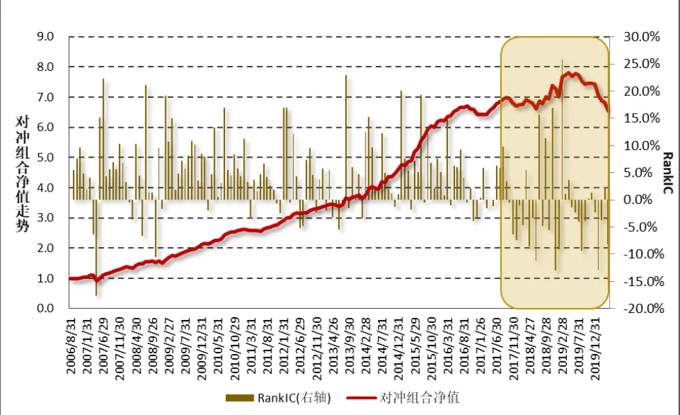
数据来源：财通证券研究所，朝阳永续
谨请参阅尾页重要声明及财通证券股票和行业评级标准

那么，问题出现在哪里呢，是分析师的一致预期目标价信息出现了失真吗？事实上，这是由于数据处理过程中考虑不周带来的后果。在前面我们提到，朝阳永续在计算个股一致预期目标价时，如果某个公司在 90 天内没有分析师覆盖，那么就会沿用前一个有效数据，并且将其类型 Type 置为 4。然而，近几年来分析师覆盖的个股数量不断减少，导致这部分股票的一致预期目标价实际上是很早之前的价格，根据这一价格计算得到的目标收益率将会出现严重的失真，因此我们必须将这部分类型的个股进行剔除。

图 7：一致预期目标收益率多空组合净值及RankIC 走势（剔除 Type=4）
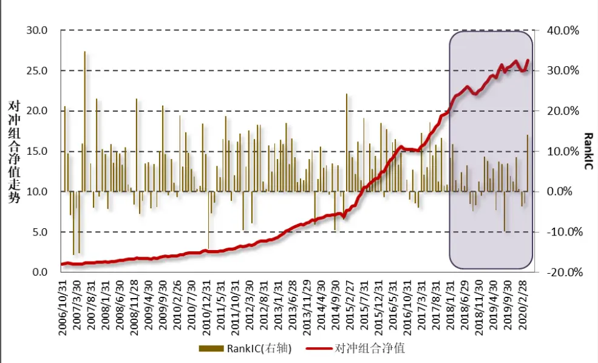
数据来源：财通证券研究所，朝阳永续

图 7 展示了在剔除 90 天内无分析师覆盖（Type=4）的个股一致预期目标价之后计算得到的目标收益率因子多空组合的表现情况。可以看到，如此简单的修正带来了截然不同的回测结果——分析师的一致预期目标收益率因子仍然展现出较为稳健的选股能力，分析师目标价中仍然蕴含着极有价值的信息！

接下来，我们观察各类一致预期因子在四个不同样本区间内多头组合及空头组合相较全市场等权基准组合的年化超额收益情况，其结果如图 8 和图9 所示：

（1） 全样本期间（2005.1.31-2020.4.30）；

（2） 近 3 年来（2016.12.30-2020.4.30）；

（3） 近 1 年来（2019.12.31-2020.4.30）；

（4） 2019 年以来（2018.12.28-2020.4.30）

由图 8 可以看到，绝大部分一致预期因子的多头表现在近年来均出现了一定程度的下降，其中一致预期目标收益率 TargetRet、一致预期 ROE、一致预期净利润环比变化 ConNPChange_3M 等因子在 2019 年至今能够超越基准，而相较之下所有一致预期估值类因子均出现了明显的失效，这一现象与传统的价值因子失效有关。在财通金工“星火”专题（九）《博彩偏好还是风险补偿？高频特质偏度因子全解析》中我们提到，受外资涌入及机构投资者抱团的影响，“核心资产”的价格不断推高，从而导致 年价值因子和反转因子出现了明显的回撤——一味地持有低 BP 股票并不能获取理想的超额收益。

与多头部分的失效相比，一致预期因子的空头部分总体保持了比较好的稳定性。从图 9 可以看到，一致预期净利润下降、一致预期 ROE偏低的个股相较基准存在明显的负向超额。

图 8：一致预期因子在不同样本期多头超额年化收益率
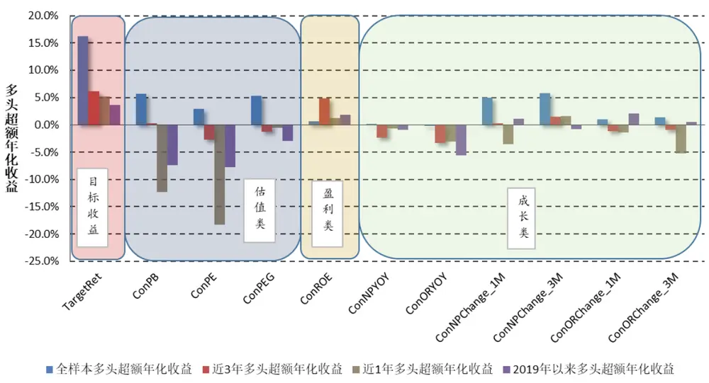
数据来源：财通证券研究所，朝阳永续

图 9：一致预期因子在不同样本期内空头超额年化收益
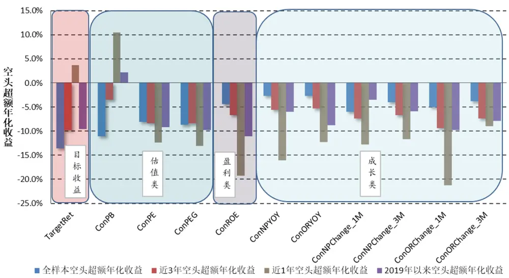
数据来源：财通证券研究所，朝阳永续

## 3、 破解：从事件驱动角度看分析师上调事件

经过上一小节的分析我们可以看到，从因子选股的角度来看，传统的一致预期因子多头组合在近两年来出现了一定程度的回撤，单纯地将其运用到多因子选股模型中将会造成较大的扰动。由于分析师研究报告的发布更多地能够提升投资者对公司短期的关注度，因此从事件驱动角度考察分析师对股票价格造成的短期影响是一种更为直观也更符合逻辑的做法。本小节我们从分析师评级上调、目标价上调及盈利预测上调三个方面出发，观察事件触发之后股票的累计超额收益情况，为后续的投资组合构建打下坚实的基础。

## 3.1 评级上调

我们首先关注分析师评级上调是否会对股票的短期收益产生冲击，图 10 按照情绪从负向到正向展示了分析师评级类型的不同种类，当研究报告中的评级从前一强度调整至后一强度时，我们即认为分析师评级出现了上调。

图 10：分析师评级类型
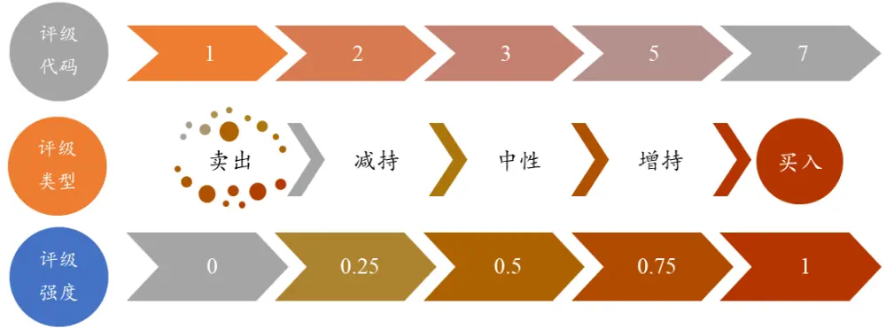
数据来源：财通证券研究所，朝阳永续

为了考察分析师评级上调给股票短期价格造成的冲击，我们选取朝阳永续数据库中的报告目标价调整表（rpt_target_price_adjust）中的记录，观察个股研报发布之后股票相对中证全指的日度累计超额收益，其具体细节如下：

回测时间：2006 年 1 月 1 日——2020 年 4 月 30 日

回测样本：全体 A股（不含科创板股票）

样本筛选：剔除研报发布日上市时间不满 1 年的、剔除过去3 个月中非正常交易天数大于 20 天、剔除当日停牌、涨停及跌停的股票

收益计算：根据给定的条件筛选事件样本，将事件触发当日记为 T0 日，计算个股在 日前 个交易日及 日后的 个交易日中，每个交易日个股相对中证全指（000985.CSI）的日度超额收益。随后将所有样本事件中的个股日度超额收益按照触发日期取平均，得到[T-20, T+120]的时间序列。最后将该时间序列进行累加。为了方便后续的展示，我们将该累计超额收益序列统一减去 T0 日的累计超额收益，从而使得 T0 日的累计超额收益为 0。

如图 和图 所示，在总共得到的 万份报告中，评级内容以买入（ ）及增持（37.3%）的报告占比最多，这说明国内研究报告的情绪整体偏向乐观——分析师将会选择性地为未来更倾向于上涨的公司发布研究报告。在评级变化方面，超过 90%的报告评级保持不变，而评级上调和评级下调的报告数量基本相同。

图 11：不同评级的报告数量
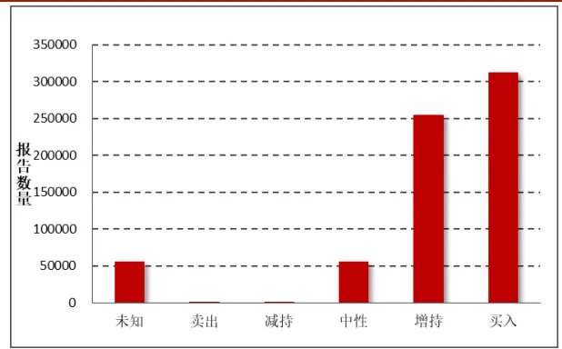
数据来源：财通证券研究所，朝阳永续

图 12：不同评级调整的报告数量
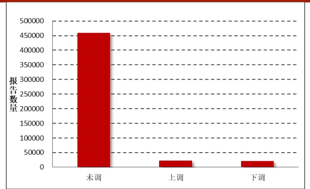
数据来源：财通证券研究所，朝阳永续

接下来，我们观察在分析师发布买入评级报告后，个股在[T-20，T+120]区间内的历年累计超额收益情况，其结果如图 所示。可以看到，在 至年 15 个年度中，仅有 2014 年在事件出发后获取负向超额的情况，其余年份均有明显的正向收益。从平均情况来看，在分析师发布买入评级之前的 20 个交易日中（[T-20, T-1]区间）累计上涨3%，在发布买入评级之后的120个交易日（[T,T+120]区间）累计上涨 4%。

图 13：分析师发布买入评级报告后历年累计超额收益 CAR
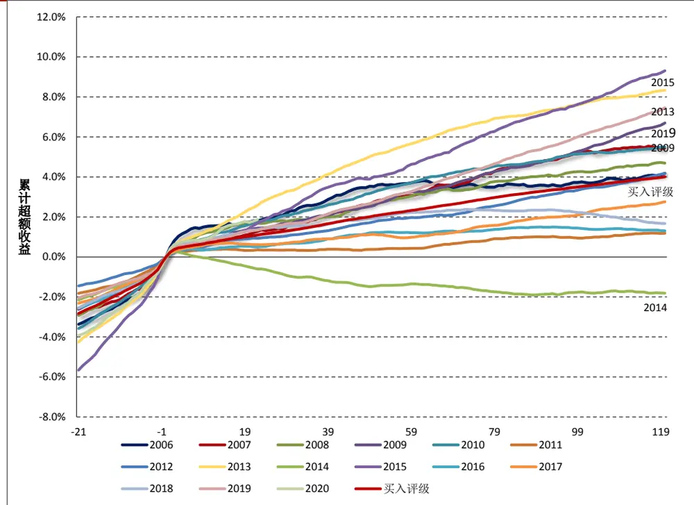
数据来源：财通证券研究所，朝阳永续

根据如上的研究模式，我们考察了如下五种不同事件触发后，个股在全样本区间的平均累计超额收益情况。这五种事件分别为：

（1） 全样本：发布个股研究报告；

（2） 买入评级：发布买入评级报告；

（3） 评级上调：相较上次报告评级出现上调；

（4） 上调至买入：相较上次报告评级出现上调，且本次评级为“买入”；

（5） 新财富分析师评级上调：分析师评级上调，且分析师的第一作者为“新财富”评选上榜团队；

图 14：分析师评级上调事件前后累计超额收益CAR
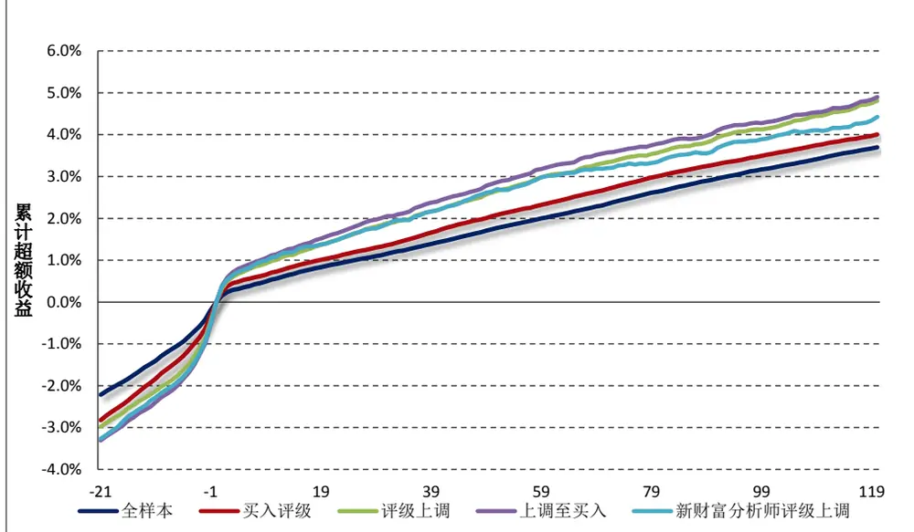
数据来源：财通证券研究所，朝阳永续

如图 13 所示，如果不对样本进行任何筛选，个股在被分析师覆盖之后同样也有较为稳健的超额收益。财通金工认为这与我们前面观察到的 A 股行业研究报告情绪偏乐观有关——分析师会选择性地针对其看好的个股发布报告并进行持续跟踪。相较之下，发布买入评级的报告对于个股超额收益的提升较小。但是，当个股评级出现上调时，个股超额收益的提升最为明显——在个股评级出现上调后的 120 个交易日，个股累计超额收益将近 5%。当我们将样本限制为“评级上调且此次为买入评级”时，个股累计超额收益有一定程度的提升但提升效果并不显著。为了考察明星分析师效应是否存在，我们将研报发布的第一作者限定为新财富分析师上榜团队，结果显示其累计超额收益相较单纯的“评级上调”出现了一定程度的下降。

图 15 展示了每周内出现“买入评级”的个股数量，在全样本区间累计事件触发 20765 次，平均每周有 28 只股票出现“买入评级报告”。

图 15：每周出现“买入评级”的个股数量
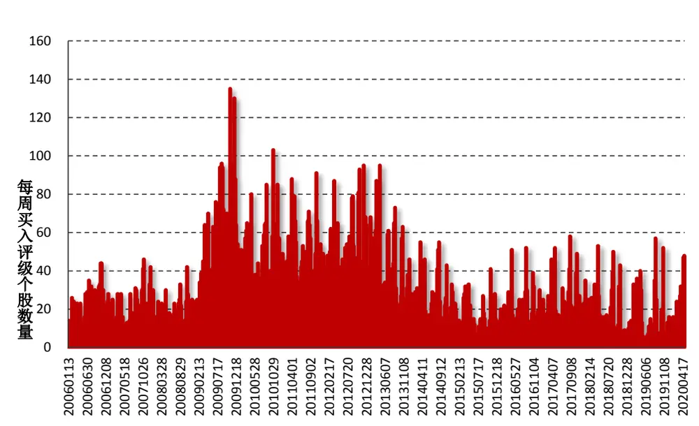
数据来源：财通证券研究所，朝阳永续
谨请参阅尾页重要声明及财通证券股票和行业评级标准

## 3.2 目标价上调

由 2.2 小节中可知，分析师目标价中蕴含着极具价值的信息。与分析师评级相比，目标价格的设定是分析师给出的更为具体的指标，因此本节我们关注分析师目标价格上调前后的累计超额收益。

图 16：分析师目标价上调事件前后累计超额收益CAR
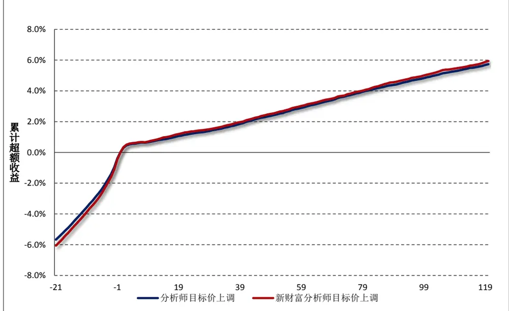
数据来源：财通证券研究所，朝阳永续

由图 16 可以看到，当分析师发布目标价上调的报告后，其 120个交易日内相较市场的累计超额收益达到 6%，该类事件对于个股价格的冲击高于分析师评级上调带来的影响。此外，我们还考察了新财富分析师的研究报告是否蕴含额外信息，我们发现研究报告的作者是否是新财富上榜团队对于事件的影响情况并不显著。

图 13 展示了每周内出现“目标价格上调”的个股数量，在全样本区间累计事件触发 32594 次，平均每周有 44 只股票出现“目标价上调”。

图 17：每周出现“目标价上调事件”的个股数量
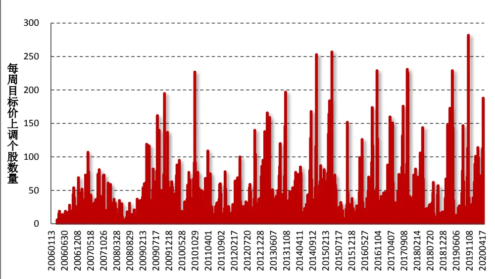
数据来源：财通证券研究所，朝阳永续
谨请参阅尾页重要声明及财通证券股票和行业评级标准

## 3.3 盈利预测上调

到目前为止，我们考察了分析师评级上调及目标价上调带来的超额收益。事实上，分析师评级及目标价格的给出只是研究报告的结果，其依据则更多地来自于分析师对于公司业绩的预测。因此，本小节我们以分析师对于个股 FY1 预期净利润为依据，考察分析师盈利预测事件上调带来的价格冲击影响。

图 18：分析师盈利预测上调事件前后累计超额收益CAR
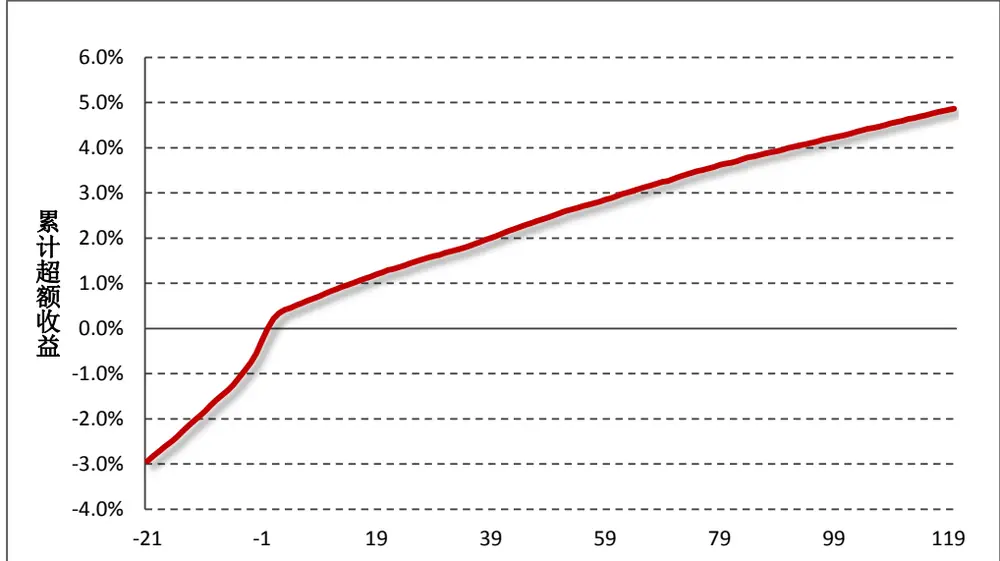
数据来源：财通证券研究所，朝阳永续

由图 18 可以看到，当分析师对公司 FY1 净利润预测上调后，其 120 个交易日内相较市场的累计超额收益达到 5%，该类事件与“评级上调”事件影响相当，略低于“目标价上调”事件的影响。

图 19 展示了每周内出现“盈利预测上调”的个股数量，在全样本区间累计事件触发 101778 次，平均每周有 139 只股票出现“目标价上调”，数量较多。

图 19：每周出现“FY1 净利润上调”的个股数量
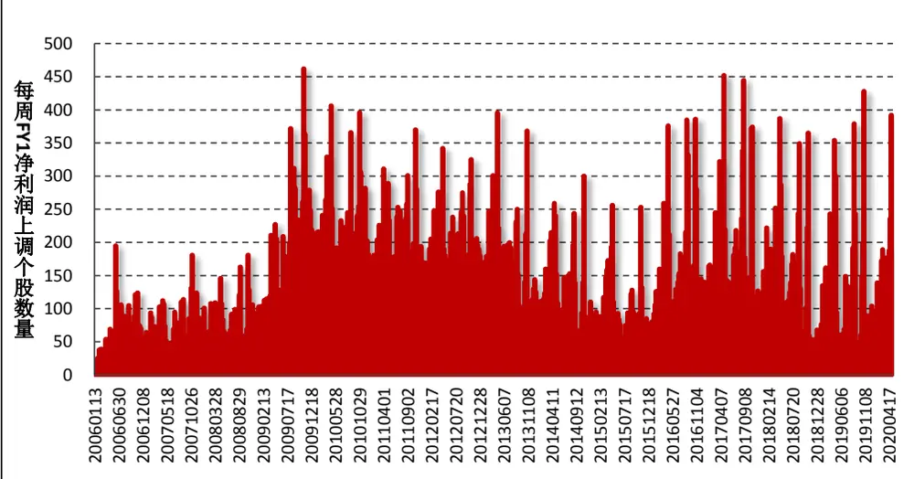
数据来源：财通证券研究所，朝阳永续

## 4、 实践：构建事件驱动选股策略

到目前为止，我们从因子选股和事件驱动的角度对分析师一致预期数据的有效性进行了考察。从因子选股的角度来看，近期一致预期估值及成长类因子出现了一定程度的波动；从事件驱动的角度来看，分析师研报的发布对于股价短期的冲击仍然较为明显。本小节，我们从事件驱动角度出发，构建更为可行的投资组合，其具体方法如下：

（1） 假设投资者持有的初始资金为 1 千万，将资金等分为 N 各通道，每个通道的初始资金为 1/N 千万元；

（2） 假设调仓频度以月度为单位，在每个月的最后一个交易日扫描过去一个月中触发事件的股票，以等资金买入全部股票，并持有 N 个月不变，以此类推；

（3） 当组合平稳运行后，每个月都有 1 个通道进行调仓，卖出 N 个月之前建仓的股票，买入本月符合要求的股票；

（4） 由于交易的股票数量较多，因此策略对于调仓周期及手续费影响较为敏感。我们将调仓周期设置为月度，将手续费设置为双边千分之三，买入和卖出均需扣除手续费。

图 20：分析师“上调至买入评级”事件收益
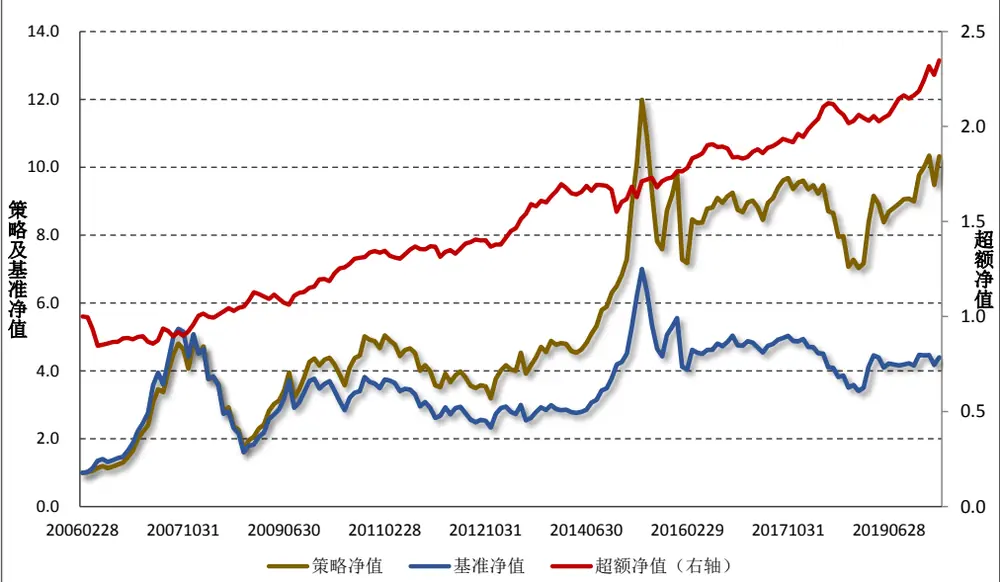

|  | 年化超额 | 年化波动 | 年化 IR | 最大回撤 | 月胜率 |
| --- | --- | --- | --- | --- | --- |
| 对冲组合 | 5.85% | 7.52% | 0.78 | 17.69% | 64.71% |

数据来源：财通证券研究所，朝阳永续

我们以月度为调仓频率，将初始资金分为 6 个通道，每个通道在买入后持有 6 个月，并在 6 个月后的最后一个交易日进行调仓。

图 20 展示了分析师“上调至买入评级”事件策略的累计净值及基准（中证全指）的净值，可以看到组合的年化超额收益为 5.85%，年化波动 7.52%，年化 IR 为 0.78。图 21 展示了组合在历年的超额收益，可以看到在 2014 年组合出现了明显的回撤，此外的多年都展现出一定的稳定性。进入到 2020年，该组合相较中证全指的超额收益达到 7.26%。

图 21：分析师“上调至买入评级”事件收益
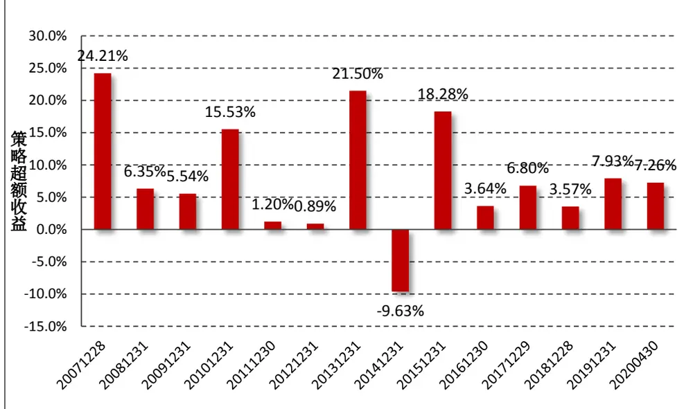
数据来源：财通证券研究所，朝阳永续

图 22：分析师“目标价上调”事件收益
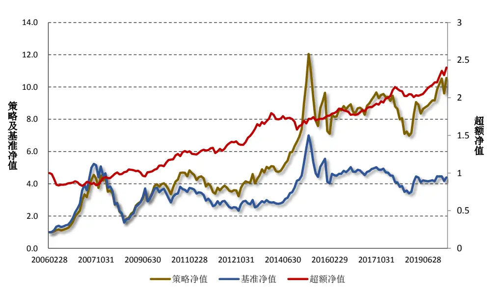

|  | 年化超额 | 年化波动 | 年化 IR | 最大回撤 | 月胜率 |
| --- | --- | --- | --- | --- | --- |
| 对冲组合 | 5.75% | 8.00% | 0.72 | 19.69% | 62.35% |

数据来源：财通证券研究所，朝阳永续

图 22 展示了分析师“目标价上调”事件策略的累计净值及基准（中证全指）的净值，可以看到组合与“评级上调”事件表现类似。图 23 展示了组合在历年的超额收益，可以看到在 2014 年组合出现了明显的回撤，此外的多年都展现出一定的稳定性。进入到 2020 年，该组合相较中证全指的超额收益达到 8.90%。

图 23：分析师“目标价上调”事件收益
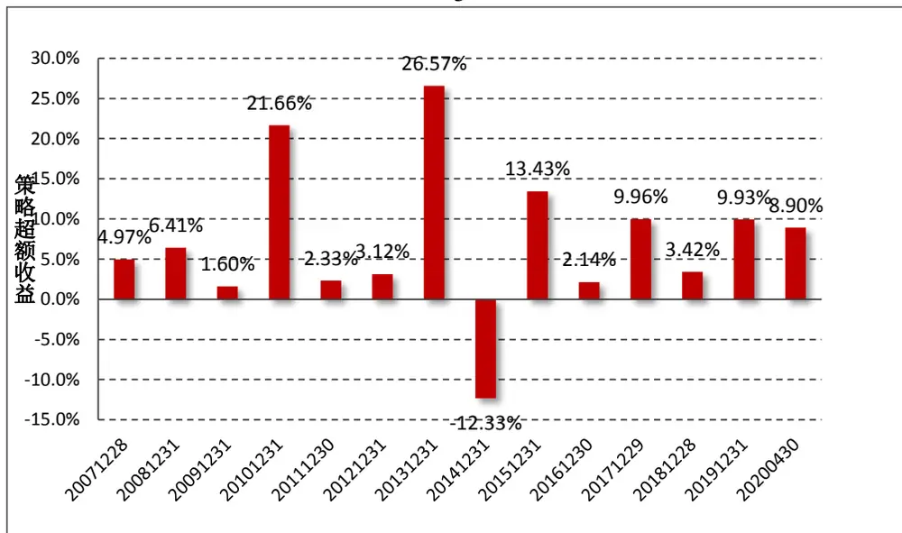
数据来源：财通证券研究所，朝阳永续

## 5、 总结与展望

传统的价量数据及财务报告数据，均是对个股历史表现的总结，而分析师数据则更多地是包含对公司未来业绩的前瞻性预测。然而我们观察到，基于一致预期数据构建的选股组合正陷入困境，其多空组合特别是多头组合在近年来相继出现回撤。本期专题，我们将研究视角聚焦在分析师一致预期数据的构建上，对我们现有因子库进行极大的补充，主要结论如下：

（1） 尽管近几年来券商分析师及研究员的数量在不断走高，但分析师覆盖的公司从绝对数量和相对占比都呈现出明显的下降趋势。这一方面是由于国内 IPO 审批提速导致，另一方面也说明机构投资者的视野收缩速度正在加快，头部集中效应将会愈发明显；

（2） 对于分析师一致预期数据的处理可划分为因子选股和事件驱动两种，从因子选股角度而言，我们将一致预期数据划分为目标收益类、估值类、盈利类、成长类五种。可以看到近几年来除了目标收益率类因子仍有稳定的超额收益，其余因子均出现了一定程度的回撤；

（3） 由于分析师研究报告的发布更多地能够提升投资者对公司的短期关注度，因此从事件驱动角度考察分析师对市场短期造成的影响是一种更为直观也更符合逻辑的做法。本文考察了分析师评级上调、目标价上调和盈利预测上调三类事件的超额收益，发现目标价上调带来的 Alpha 最为显著；

（4） 通过构建可投资性的月度换仓组合，我们发现组合在部分年度取得了比较好的表现。买入“上调至买入评级”的个股，在 2020 年相较中证全指超额收益达到 7.26%。

## 6、 风险提示

多因子模型拟合均基于历史数据，市场风格的变化将可能导致模型失效。

## 信息披露

## 分析师承诺

作者具有中国证券业协会授予的证券投资咨询执业资格，并注册为证券分析师，具备专业胜任能力，保证报告所采用的数据均来自合规渠道，分析逻辑基于作者的职业理解。本报告清晰地反映了作者的研究观点，力求独立、客观和公正，结论不受任何第三方的授意或影响，作者也不会因本报告中的具体推荐意见或观点而直接或间接收到任何形式的补偿。

## 资质声明

财通证券股份有限公司具备中国证券监督管理委员会许可的证券投资咨询业务资格。

## 公司评级

买入：我们预计未来 6 个月内，个股相对大盘涨幅在 15%以上；

增持：我们预计未来 6 个月内，个股相对大盘涨幅介于 5%与15%之间；

中性：我们预计未来 6 个月内，个股相对大盘涨幅介于-5%与5%之间；

减持：我们预计未来 6 个月内，个股相对大盘涨幅介于-5%与-15%之间；

卖出：我们预计未来 6 个月内，个股相对大盘涨幅低于-15%。

## 行业评级

增持：我们预计未来 6 个月内，行业整体回报高于市场整体水平 5%以上；

中性：我们预计未来 6 个月内，行业整体回报介于市场整体水平-5%与 5%之间；

减持：我们预计未来 6 个月内，行业整体回报低于市场整体水平-5%以下。

## 免责声明

本报告仅供财通证券股份有限公司的客户使用。本公司不会因接收人收到本报告而视其为本公司的当然客户。

本报告的信息来源于已公开的资料，本公司不保证该等信息的准确性、完整性。本报告所载的资料、工具、意见及推测只提供给客户作参考之用，并非作为或被视为出售或购买证券或其他投资标的邀请或向他人作出邀请。

本报告所载的资料、意见及推测仅反映本公司于发布本报告当日的判断，本报告所指的证券或投资标的价格、价值及投资收入可能会波动。在不同时期，本公司可发出与本报告所载资料、意见及推测不一致的报告。

本公司通过信息隔离墙对可能存在利益冲突的业务部门或关联机构之间的信息流动进行控制。因此，客户应注意，在法律许可的情况下，本公司及其所属关联机构可能会持有报告中提到的公司所发行的证券或期权并进行证券或期权交易，也可能为这些公司提供或者争取提供投资银行、财务顾问或者金融产品等相关服务。在法律许可的情况下，本公司的员工可能担任本报告所提到的公司的董事。

本报告中所指的投资及服务可能不适合个别客户，不构成客户私人咨询建议。在任何情况下，本报告中的信息或所表述的意见均不构成对任何人的投资建议。在任何情况下，本公司不对任何人使用本报告中的任何内容所引致的任何损失负任何责任。

本报告仅作为客户作出投资决策和公司投资顾问为客户提供投资建议的参考。客户应当独立作出投资决策，而基于本报告作出任何投资决定或就本报告要求任何解释前应咨询所在证券机构投资顾问和服务人员的意见；

本报告的版权归本公司所有，未经书面许可，任何机构和个人不得以任何形式翻版、复制、发表或引用，或再次分发给任何其他人，或以任何侵犯本公司版权的其他方式使用。